# Flink基础

# day01.课程预告

虚拟机: 用自己的虚拟机

讲义: 2个文件,总共预计15次课

## 2.今晚课程内容介绍

- 为什么要学Flink
- 大数据计算框架发展历史
- 批量计算及弊端
- 流式计算
- Flink介绍
- Flink结构
- Flink安装部署

## 3.为什么要学Flink

### 3.1 薪资待遇

### 3.2 实时即未来

实时计算是未来的发展趋势

## 4.大数据计算框架的发展历史

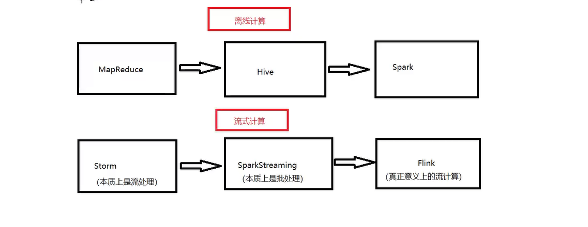

从发展历史中,我们可以看出,实时领域,目前最火热的就是Flink技术栈了

Tez也是DAG的计算框架,可以在Hive中设置执行引擎为Tez即可

> 流批一体,会在项目课中介绍

## 5.批量计算&弊端

### 5.1 批量计算

- 对有节数据集的计算,有界: 数据有开始,也有结束
- 是对历史数据的计算
- 数据是一批一批的计算,来一批,处理一批
- 时效性较差,延迟较高
- 比较节省资源

### 5.2 弊端

在一些时效性非常高的场景,批量计算力不从心

- 实时监测网站的异常情况
- 实时监测道理的拥堵情况
- 双十一,618实时监控成交额情况

## 6.流式计算

### 6.1 生活中的流式场景

生活中流式场景非常多,比如水流,车流,行人,电流等都是生活中流场景

### 6.2 特点

数据是无边界的. 无边界: 数据有开始,但是数据是没有结束的

数据是源源不断产生的,是实时产生的

数据是来一条处理 一条,实时产生,实时处理

### 6.3 程序中的流式场景

- 页面埋点日志
- 城市道路交通大屏
- 打车
- 外卖
- 实时大屏/看板展示

### 6.4 流式计算和Flink有什么关系

流式计算,是一种计算思想. 不涉及某一门计算框架

只要是实现了流式计算思想的框架,那么他就是流式计算框架

Flink只是实现了流式计算思想的一门框架而已

除了Flink,还有其他的计算框架,也是实现了流式计算思想的

## 7.Flink介绍

### 7.1 概述

Flink是一款真正意义上的流式处理框架

### 7.2 历史

2008年诞生于柏林,原名叫Stratosphere项目

2014年中旬被捐赠给了Apache,改名为Flink

2014年从Apache孵化成功,成为了顶级项目

2019年1月份Flink的母公司被阿里巴巴收购,从此Flink属于阿里了

2023年3月23日,Flink推出了1.17.0的版本

课程中版本为去年中旬推出的版本1.15.2

### 7.3 特点

- 支持高吞吐,低延迟,高性能的流处理
- 支持带有事件事件的`窗口(WIndow)`操作
- 支持有状态计算的`Exactly-once`语义
- 支持高度灵活的`窗口(WIndow)`操作,支持基于time,count,session,以及data-driven的窗口操作

- 支持具有Backpressure功能的持续流模型

- 支持基于轻量级分布式快照(Snapshot)实现的容错

- 一个运行时同时支持Batch on Streaming处理 和 Streaming处理
- Flink在JVM内部实现了自己的内存管理

### 7.4 官网介绍

https://flink.apache.org/zh/usecases.html

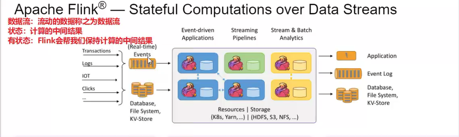


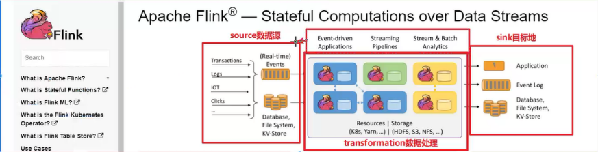

Flink: 基于数据流上有状态的计算

数据流: 流动的计算

有状态: Flink会帮用户报错计算的中间结果

### 7.5 应用场景

官网的场景如下:

 Event-driven Applications【事件驱动】

 Data Analytics Applications【数据分析】

 Data Pipeline Applications【数据管道】

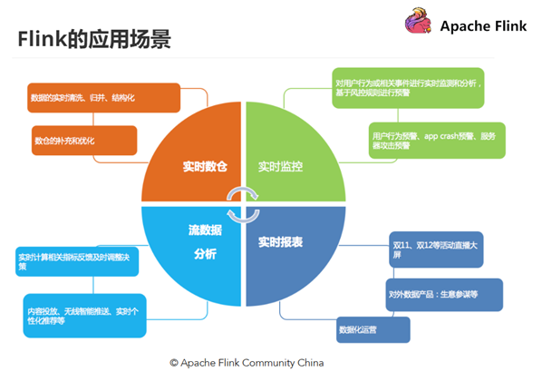

### 7.6 Flink架构

在大数据领域中,框架的架构大部分都是主从架构

- HDFS

```
主: namenode
从: datanode
```

- Yarn

```
主: ResourceManager
从: NodeManager
```

- Spark

```
主: master
从: worker
```

- Flink

```
主: JobManager
从: TaskManager
```

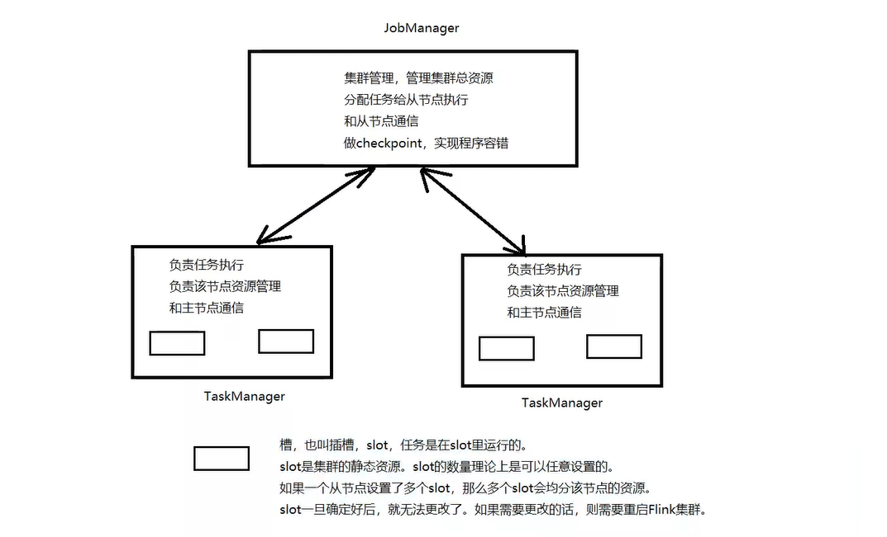

小结:

目前我们只需要了解Flink是一个主从架构,任务是在从节点的Slot里运行即可

## 9.Flink安装部署

Flink可以有多种部署方式,比如:

- Local(本地模式,一个进程模拟主,从)

- Standalone(独立模式)

- Yarn(yarn模式)

  

### 9.1 Standalone

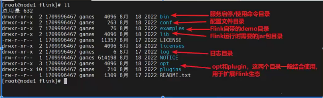

- 安装步骤

  ```
  tar -zxvf flink-1.15.2-bin-scala_2.12.tgz -C /opt/module
  ln -s flink-1.15.2 flink
  ```

- 配置修改

  ```
  cd flink
  vi conf/flink-conf.yaml
  
  #1.需要修改的地方
  190 rest.address: hadoop102
  203 rest.bind-address: hadoop102
  
  #2.建议修改的地方,严格来说可以不改,但是建议修改
  91 taskmanager.numberOfTaskSlots: 4
  
  #3.建议添加的参数,如果不添加,那么Flink集群在停止时会抛出异常,不太好看
  309 classloader.check-leaked-classloader: false
  ```

- 启动&访问&关闭

  ```
  启动standalone
  ./bin/start-cluster.sh
  访问flink
  http://hadoop102:8081/
  关闭stanalone
  ./bin/stop-cluster.sh
  ```

- 配置flink环境变量

  ```
  vi /etc/profile
  ```

- 运行flink的demo

  ```
  ./flink run /opt/module/flink/examples/batch/WordCount.jar
  ```

# day02.今晚课程内容介绍

- Standalone模式下提交任务
- Flink On Yarn模式
  - 安装部署
  - 三种运行模式
    - Session模式
    - Per-job模式
    - Application模式
- Flink入门案例
  - 批处理
    - DataStream API
  - 流处理
    - DataStream API
    - Table API
    - SQL API

## 2.Standalone模式下的任务提交

### 2.1 配置FLINK_HOME环境变量

编辑/etc/profile文件,添加如下信息

```
#FLINK_HOME目录
export FLINK_HOME=/opt/module/flink
export PATH=$PATH:$FLINK_HOME/bin
```

添加完之后,source一下即可

```
source /etc/profile
```

### 2.2 提交任务

```
#1.基础路径
cd ~
#2.提交任务
flink --help
#3.提交命令
flink run /opt/module/flink/examples/batch/WordCount.jar
#4.查看结果
结构默认会打印在标准输出

#5.action说明
Flink提供了很多的action操作
run: 运行一个任务
run-application: 以Application的模式来运行
info: 打印任务执行计划
list: 列出当前正在运行的任务
stop: 停止一个正在运行中的任务
cancel: 取消一个正在运行中的任务
```

## 3.Flink On Yarn

### 3.1 提前准备

```
#1.启动HDFS
start-dfs.sh

#2.启动Yarn
start-yarn.sh

#3.启动Flink
```

### 3.2 三种部署模式的介绍

Flink On Yarn 可以有三种运行方式,也就是三种部署模式:

- Session模式(会话模式)
- Per-job模式(job分离模式)
- Application模式(应用模式)

Flink可以基于上述3中模式的任何一种来运行

#### 3.2.1 Session模式

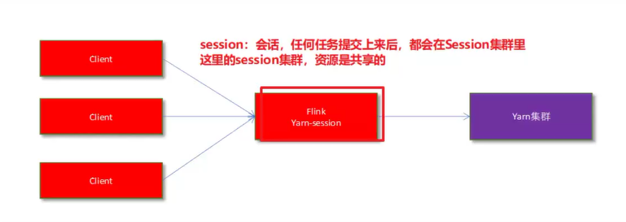

> 小结:
>
> Session模式,是启动了一个Session的Flink集群,这个集群的资源是大家所共享的,任何任务提交上来后,都会在这个集群下运行,任务运行完后,集群仍然存在,任务使用的资源会释放,这个集群会长期运行,除非手动kill
>
> 使用场景: 小任务提交

要让Flink在Session模式下运行,我们需要分为两步走:

```
#1.启动Session会话
$Flink_HOME/bin/yarn-session.sh
启动过程中会报错,需要添加jar包到flink的lib目录下面
flink-shaded-hadoop-3-uber-3.1.1.7.2.9.0-173-9.0.jar
commons-cli-1.5.0.jar

2.启动成功会出现一个web页面的地址
http://hadoop103:39273

3.可以在yarn中看到flink的任务
http://hadoop103:8088/cluster

#4.提交任务运行(新开一个窗口)
./flink run /opt/module/flink/examples/batch/WordCount.jar

```

#### 3.2.2 Per-job模式

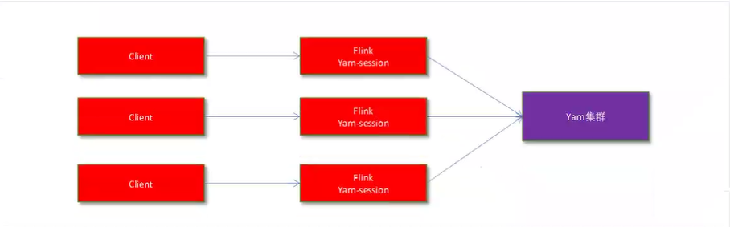

Per-job模式,也叫job分离模式,类似于Spark里的client模式

如果使用Per-job模式来运行Flink任务的话,每一个Flink任务都会创建一个Flink集群,在任务结束后,集群都会销毁

> 这个和刚刚的Session模式不一样

提交命令如下:

```
bin/flink run -m yarn-cluster examples/batch/WordCount.jar

运行的时候 yarn执行会卡住  需要以后排查

1.基础路径
cd /opt/module/flink
2.直接提交运行,不需要别的操作
bin/flink run -m yarn-cluster examples/batch/WordCount.jar
```

#### 3.2.3 Application模式

Application模式,也称之为应用模式,它是后面新推出来的一种新的运行模式

Application模式,和Per-job模式类似,只是客户端所在节点不一样

Per-job模式: 客户端进程在客户端节点上,类似于Spark On Yarn的client模式

Application: 客户端进程在集群中的某一个节点上,类似于Spark On YarnCluster模式

集群会随着任务的提交而创建,并执行任务,任务执行完之后,在销毁集群,主节点和从节点都销毁,集群恢复到之前的样子

提交命令如下

```


flink run-application -t yarn-application examples/batch/WordCount.jar --output hdfs://hadoop102:8020/flink/output2
```

### 3.3 Flink On Yarn总结

#### 3.3.1 前提

除了启动HDFS,Yarn以外,还得添加Flink基于Hadoop的兼容包

#### 3.3.2 三种模式的特点&应用场景

##### 3.3.2.1session模式

3.3.2.1.1 session模式特点

- Flink在Session模式下运行需要两步操作
  - 启动Session集群
  - 提交任务
- 启动Session集群,是一个常驻的服务,是一直运行的,这个集群只有主节点JobManager,因此在启动集群时看不到集群的资源情况
- 提交任务时,才会动态创建从节点TaskManager,任务运行完后,TaskManager就会销毁
- 这种模式下,集群资源是共享的,所有任务都是提交在这个集群,资源都在使用的是这个集群的资源
- 任务之间的隔离性较弱,如果一个任务失败了,也会影响到其他任务

3.3.2.1.2 应用场景

适用于小任务,频繁提交的场景

一般情况下用的不多

3.3.2.2 Per-job模式

3.3.2.2.1 特点

- 每个任务都会创建一个集群,各个任务互不影响
- 每个任务都会经历过集群初始化的过程,运行效率相比Session模式较低,session模式在创建session集群的时候,就已经初始化了
- 每个集群的主节点和从节点都会随着任务的提交而创建,随着任务的完成而销毁

3.3.2.2.2 应用场景

使用于大任务,非频繁提交的场景

在1.15版本之后,Per-job模式已经被废弃了,一般情况用的不多,老的项目可能是用的Per-job模式来运行

3.3.2.3 application模式

3.3.2.3.1 特点

- 类似于Per-job模式
- action必须为run-applicaiton
- 客户端进程不在客户端节点创建,而是在集群中某一个节点创建
- 类似于Spark的cluster模式

3.3.2.3.2 应用场景

在1.15版本之后,Flink官网推荐使用application模式来提交任务

也就是说,不管什么任务,都推荐使用application模式

3.3.3 Flink On Yarn 和Standalone的区别

Standalone: 它的slot是固定的,不能随便更改,如果要修改,则需要停止集群

Flink On Yarn: 它的Slot是可以随着TaskManager的创建而动态创建的,所以理论上,slot不受限制

以上两种模式下,每个TaskManager的slot的数量都是固定的

## 4.Flink入门案例

### 4.1 分层API


- 最顶层: SQL/Table API,基于SQL或者Table来编程
- 中间层: 核心层API,Flink流批处理都可以基于这一层API来实现
- 最底层: 处理函数,比较状态,事件等

### 4.2 Flink编程步骤

- 构建流式处理环境
- 数据源(Source)
- 数据处理(Transformation)
- 数据输出(Sink)
- 启动流式任务

### 4.3 核心算子介绍

```
#1.Source类算子
1.1 基于文件
readTextFile
1.2 基于socket
socketTextStream
1.3 基于集合
fromCollection
1.4 自定义source
addSource

2.Transformation类算子
map
flatMap
filter
keyBy
reduce
union
window
...

2.Sink类算子
3.1 基于文件
writeAsText
writeAsCsv
3.2 基于socket
writeSocket
3.3 自定义sink
addSink
```

4.4 案例

4.4.1 批处理案例

4.4.2 流处理案例

## 5.Flink任务提交

### 5.1 命令行方式

提交自己编写的flink的程序到flink集群

```
1.以集群模式启动flink集群
start-cluster

2.提交job (需要上传依赖包)
bin/flink run -c org.example.day02.Demo02_WordCountStream /opt/software/flink1.15-base-1.0-SNAPSHOT.jar
```

### 5.2 Web页面提交

```
1.在Submit New Job页面上传Jar包
2.点击上传的Jar包,
在Entry Class 输入 org.example.day02.Demo02_WordCountStream
在Parallelism 输入1

```

# day03.今晚内容介绍

- Flink概念透析

  - 运行时架构
  - 任务提交流程
    - 抽象
    - Standalone
    - Yarn模式
  - 一些重要的概念
    - 层次关系
    - 名词解释
    - 槽&槽共享
    - 宽窄依赖
    - 并行度
  
  

  

  文档中的运行时架构
  
  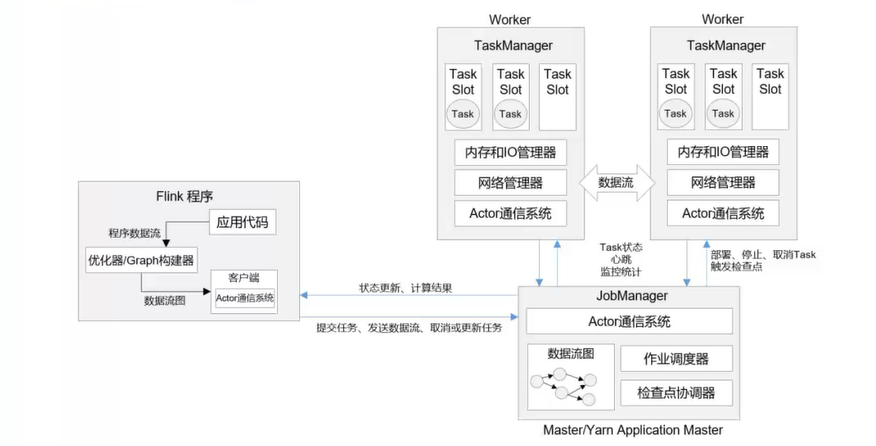

## 2.运行时架构

官网中的运行时架构

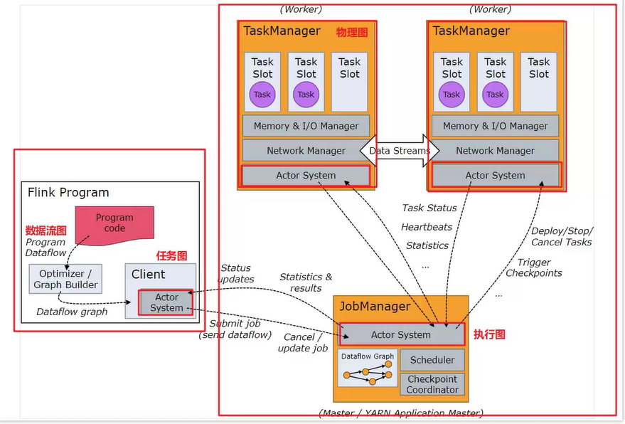


### 2.1 通信系统

Spark的通信框架: Spark1.6之前,用的Akkato通信框架,在1.6之后,用的是Netty

Flink的通信框架: Akka通信框架


> Task Managers中的url

### 2.2 调度器(Scheduler)

Spark的调度器: DAG Scheduler,逻辑调度器,是做逻辑规划的,Task Schedule,物理调度器,真正的调度任务执行的

Flink的调度器: Flink的Scheduler,它是可以把任务调度到TaskManager上去执行的

### 2.3 检查点调度器 (Checkpoint Coordinator)

检查点协调器,是做Flink程序容错的,Flink的Checkpoint机制能够实现流式任务的容错,后面会详细Checkpoint机制

### 2.4 网络管理器(Network Manager)

它是从节点的组件,负责该节点的网络管理,如果任务需要和其他的从节点进行数据传输的话,需要走网络管理器

### 2.5 内存&IO管理器(Memory & I/O Manager)

内存管理器: 管理该节点的内存资源(管理slot)

I/O管理器: 管理Flink集群中,任务运行时的IO情况

````
1.进程级别
进程时程序向操作系统中申请资源的最小单位
任务交互在进程的不同线程来完成,不需要走网络,效率最高
2.节点级别
节点,也就是机器,不同的进程之间交互数据,但是进程是在同一个节点上
这种情况下,任务运行时,交互数据的效率一般般,可以接收
3.机架级别(跨节点级别)
集群中不同节点之间进行数据交互,这种效率最低
````

### 2.6 JobManager

主节点的功能如下:

- 对集群资源进行管理
- 与从节点进行通信
- 做集群容错

JobManager主节点,它由三个子组件组成:

- Dispatcher(分发器)

> 并不是每一种模式下都有,只在Standalone模式和Yarn-session模式下才有
>
> 它主要是启动WebUI,8081页面

- JobMaster

> 每种模式下都有,它主要是申请资源,待资源充足后,调度任务给TaskManager

- ResourceManager

> 注意: 这里的ResourceManager,不是Yarn的主节点
>
> 它是Flink自身的资源管理组件,也就是说,Flink在Standalone模式下可以任务,就是因为Flink有自身的资源管理

### 2.7 TaskManager

从节点的功能如下:

- 负责该节点的资源(slot)
- 负责任务执行

## 3.任务的提交流程

这部分主要是讲述Flink的任务提交具体流程,在讲解具体的模式下的流程之前,我们先看看抽象的大致流程

### 3.1 抽象流程

不管是什么模式,大体上都是这个流程

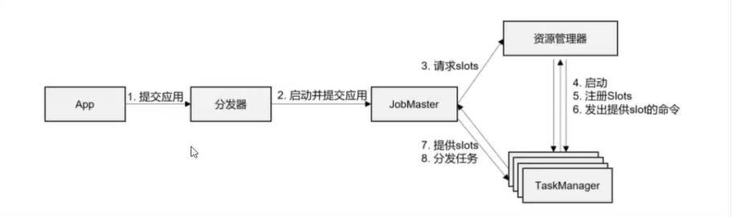

### 3.2 Standalone模式

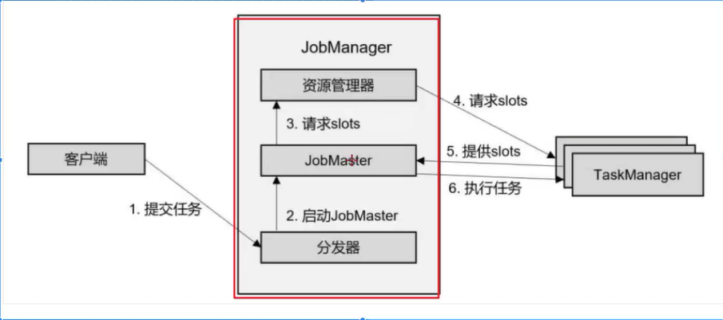

执行流程如下:

- 客户端提交任务到Flink集群的主节点jobManager的Dispatcher(分发器)
- 分发器收到任务后,会启动jobMaster(任务调度器),同时把任务一并传递jobMaster
- JobMaster收到任务后,会向jobManager的ResourceManager请求资源(slot)
- 由于我们这里是Standalone模式,集群中已经运行了TaskManager,所以集群已经有资源了
- TaskManager从节点会向JobManager的JobMaster提供资源(slot)
- JobMaster收到资源(slot)后,会把任务调度给相应的TaskManager去执行,并监控任务执行
- 执行期间,可能会存在数据传输,心跳,checkpoint等操作
- 任务执行完后,资源会被释放,集群会恢复到任务提交之前的样子

### 3.3 Yarn的模式

Flink On Yarn 有三种模式:

- Session模式
- Per-job模式
- Application模式

> 前提: Flink跑在Yarn集群里,也就是说,Flink的集群在Yarn中被动态创建了
>
> Flink的主: Yarn中的AppMaster
>
> Flink的从: Yarn中由AppMaster动态申请的Container

#### 3.3.1 Session模式

session模式下,需要分为两步来执行:

- 创建session集群
- 提交任务

3.3.1.1 创建session集群


执行流程如下:

- 任务提交给Yarn的ResourceManager,ReourceManager收到任务后,会初始化一个容器,这个容器就是AppMaster,也就是JobManager
- JobManager里会创建Dispatcher等组件

> 这里没有动态初始化从节点

3.3.1.2 提交任务

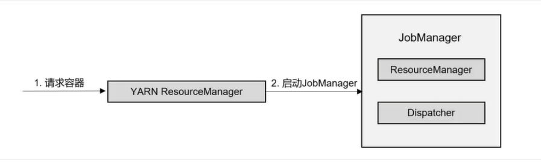

执行流程如下:

- 任务提交给AppMaster(也就是JobManager)的DIspatcher(分发器)
- Dispatchr启动JobMaster,同时把任务也提交给它
- JobMaster会向JobManager申请资源
- JobManager会向Yarn的ResourceManager申请资源
- Yarn的ResourceManager收到请求后,会动态初始化一些Container(TaskManager)
- Container(TaskManager)会向AppMaster注册资源
- Container(TaskManager)会向JobMaster提供任务运行所需要的资源
- JobMaster就会向Container(TaskManager)调度任务,执行
- 待任务执行完成之后,AppMaster会把Container(TaskManager)销毁
- 集群恢复到任务提交之前的样子

> AppMaster不会向Yarn的ResourceManager申请销毁,它就是JobManager,会长期运行

Yarn集群是一个主从集群:

主: ResourceManager

从: NodeManager

AppMaster: 是由ResourceManager初始化的一个Container,这个Container是这个任务的老大,这里是Flink任务,因此,AppMaster就是Flink集群的JobManager

#### 3.3.2 Per-job模式

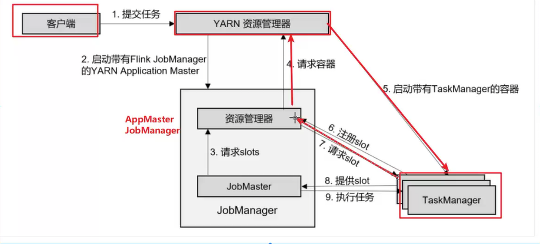

执行流程如下:

- 客户端向Yarn的ResourceManager提交任务
- Yarn的ResourceManager收到任务请求后,会初始化一个Container,也就是AppMaster,也就是JobManager
- 任务会提交给JobManager的JobMaster来调度
- JobMaster在收到任务后,会向JobManager的ResourceManager请求资源
- JobManager的ResourceManager会向Yarn的ResourceManager申请资源
- Yarn的ResourceManager收到请求后,会动态初始化一些Container,也就是TaskManager了
- TaskManager会向JobManager的ResourceManage注册资源
- TaskManager会向JobManager的JobMaster提供资源
- JobMaster收到资源后,会将任务提交给TaskManager来执行
- 任务执行完之后,JobMaster会把TaskManager销毁
- TaskManager销毁后,JobManager会向Yarn的ResourceManager申请,把自己注销
- JobManager被注销后,集群恢复到任务提交之前的样子

#### 3.3.3 Application模式

这种模式和Per-job模式的执行流程一样,只是在初始化AppMaster的时候,不是在客户端节点,而是在集群中的某一个节点上

## 4.一些重要的概念

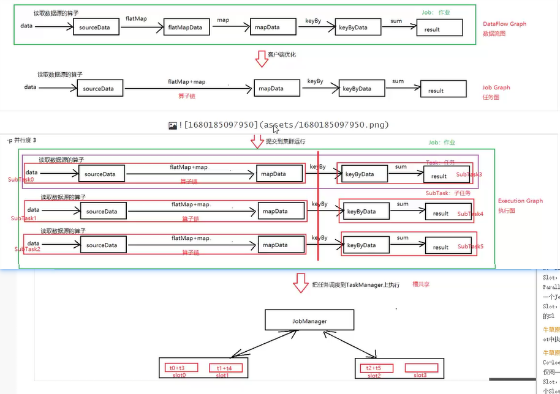

- 算子&算子链

算子: Flink中每一个计算的函数(方法)

算子链: 把窄依赖中的算子划分在一起运行

- 并行度

并行度: 任务的动态的概念,类似于Spark的数据的并行度,由用户自己指定

> 在Standalone模式下,并行度的数量不能超过槽的数量,Yarn下没有限制
>
> 推荐值为CPU的core数量

在Flink中,并行度的设置方式:

```
1.配置文件中
默认的
2.任务提交时
推荐
3.代码中设置全局并行度参数,不推荐
env.setParallelism(1)
4.代码中针对每一个算子进行设置,不推荐
```

四种并行度设置的优先级如下:

4 > 3 > 2 > 1

- 宽窄依赖

Spark的宽窄依赖

宽依赖: Shuffle Dependency

窄依赖: Narrow Dependency

Flink的宽窄依赖:

宽依赖: Redistribution Dependency

窄依赖: one-to-one Dependency

- 槽&槽共享

slot: 集群的静态资源,它和并行度不是一个概念,但是它的数量会限制并行度的上线

每个并行度,必须得在一个slot里执行

槽共享

不同的Task下的SubTask,一定会在相同的slot里执行,目的是为了提升运行的效率

相同的Task下的SubTask,一定不会在同一个slot里执行,目的是为了充分利用集群的资源

- Flink的四张图

```
1.DataFlow Graph 数据流图
是在客户端上生成的
2.Job Graph 任务图
是经过客户端优化后的
3.Execution Graph 执行图
是JobManager根据Job Graph进行解析,转换后的
4.Physical Graph 物理图
是TaskManager根据Executor Graph进行解析,转换后的
```

- 层级关系

Spark: Application(应用) -> Job (作业) -> Stage(阶段) -> Task(任务)

Flink: Job(作业) -> Task(任务) -> SubTask(子任务)

# day04下午的内容概述

- StreamExecutionEnvironment对象介绍

  - 分层API
  - 方法
  - 创建方式
  - Flink中的表

- FlinkSQL客户端

  - 介绍
  - 案例

- Flink的数据类型

  - 基础
  - 复合

- 动态表&连续查询

- Flink的时间语义

  - 摄入时间
  - 处理时间
  - 事件时间

- Flink的窗口机制

  - 窗口

    - 为什么要学窗口机制

    - 生活中的窗口

    - 程序中的窗口
    - Flink中的窗口
- 滚动窗口
  
  - 介绍
    - SQL案例(掌握)
    - DataStream API 案例(掌握)
    - SQL-TVF写法(了解)
  - 滑动窗口

    - 介绍
  - SQL案例(掌握)
    - DataStream API 案例(掌握)
    - SQL-TVF写法(了解)
  - 会话窗口
    - 介绍
  - SQL案例(掌握)
    - DataStream API案例 (掌握)
- 渐进式窗口
    - 介绍
  - SQL案例(了解)
  - 聚合窗口
    - 介绍
    - SQL案例(了解)
  - Watermark

## 2.StreamExecutionEnvironment介绍

### 2.1 分层API

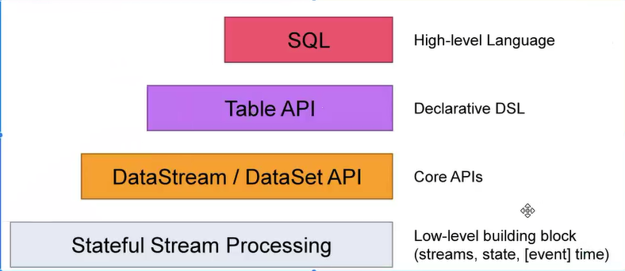

最顶层: Table API/SQL,基于表来进行数据处理

中间层: 核心层,DataStream API,流批一体的API

最底层: 状态,时间等

### 2.2 方法

总结一下SQL/Table API中出现的一些方法

```
1.executeSql
执行SQL语句,SQL语句: 任何SQL都能执行
2.createTemporaryTable
创建临时表
3.from
读取某一张表
4.group by
分组
5.executeInsert
执行插入
6.querySql
只能执行查询的SQL(select语句)
```

### 2.3 创建方式

```
1.方式1,推荐
StreamExecutionEnvironment env = StreamExecutionEnvironment.getExecutionEnvironment()
StreamTableEnvironment tEnv = StreamTableEnvironment.create(env)

2.方式二,不推荐
EnvironmentSetting setting = EnvironmentSetting.newInstance().inBatchMode().build();
StreamTableEnvironment tEnv = StreamTableEnvironment.create(setting)
```

> 说明: 我们只要会第一种即可

### 2.4 Flink中的表

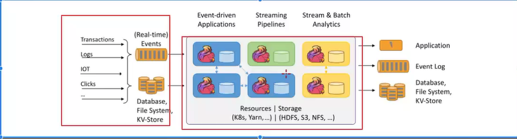

Flink中的表分为三种:

- 临时表
- 永久表
- 外部表

#### 2.4.1 临时表

临时表,就是一张在内存中被临时创建的表,不会永久存储

它会随着进程/代码的执行而创建,随着任务的执行完成而销毁.它只在这个进程中有效,别的用户看不到.

> 注意: Flink没有内部表的说法,和Hive不一样
>
> 它只在这个进程中有效,别的用户看不到

#### 2.4.2 永久表

Flink除了临时表之外,也有永久表

永久表没办法直接创建,而必须依赖外部的catelog来创建

catalog: 源数据库

Hive的元数据库: MySQL中

Flink的元数据库: 在Flink的catelog中

Hive表的层级关系: database_name.table_name(库名.表名)

Flink表的层级关系: catalog_log.database_name.table_name (元数据库名.库名.表名)

> 说明: Flink中永久表用的很少,除了Flink整合Hive,需要创建catalog来保存Hive中的表之外,其他地方用的很少
>
> 我们了解即可

#### 2.4.3 外部表

Flink基本上是外部表,因为Flink通过表来映射(读取)外部的数据源

外部表就是用来映射外部数据源的.比如: MySQL,Kafka,FileSystem,Socket数据源等

通过表的connector来进行映射

#### 2.4.4 总结

Flink一般是临时表和外部表进行结合,而很少使用永久表.

我们之前的wordcount案例中,创建的表即是临时表,也是外部表

## 3 FlinkSQL

```
1.启动flink集群
./start-cluster.sh
2.启动flinkSQL客户端
./sql-client.sh

help; 查看指令
set;  查看环境变量
```

### 3.1 介绍

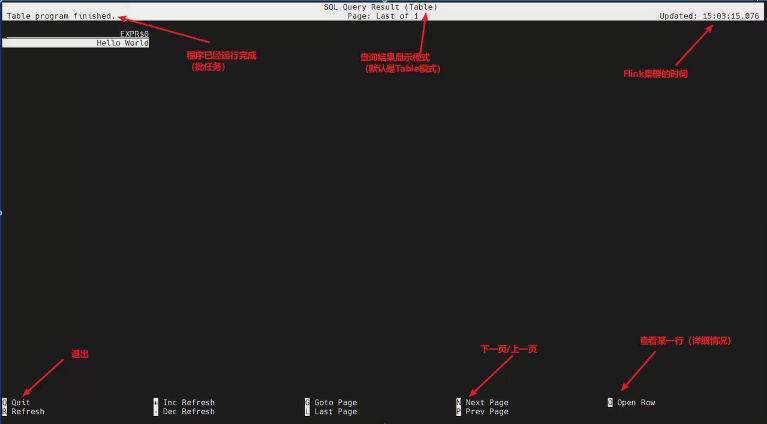

### 3.2 显示模式

FlinkSQL的结果,有三种显示模式

#### 3.2.1 table模式

默认就是这种模式,也可以通过下面的命令进行修改

```
1.SQL查询
select 'hello'
2.设置显示结果
set sql-client.execument.result-mode = table
```

截图如下:

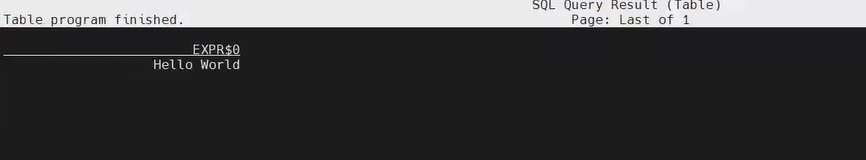

#### 3.2.2 changelog模式

changelog模式,也称之为变更日志的模式

```
1.SQL查询
select 'hello world'
2.设置显示结果
set sql-client.execument.result-mode = changelog;

ps:没有复现出来,需要排查一下问题
```

changelog模式下,会额外多出一列op,operation,操作.表示这一条数据是说明操作得来的

#### 3.2.3 tableau模式

 tableau模式,和changelog模式类似,但不会在额外的窗口中打开,而是在当前的窗口中展示结果

```
1.SQL查询
select 'hello world';
2.设置显示结果
set sql-client.execument.result-mode =  tableau;
```

### 3.3 FlinkSQL案例

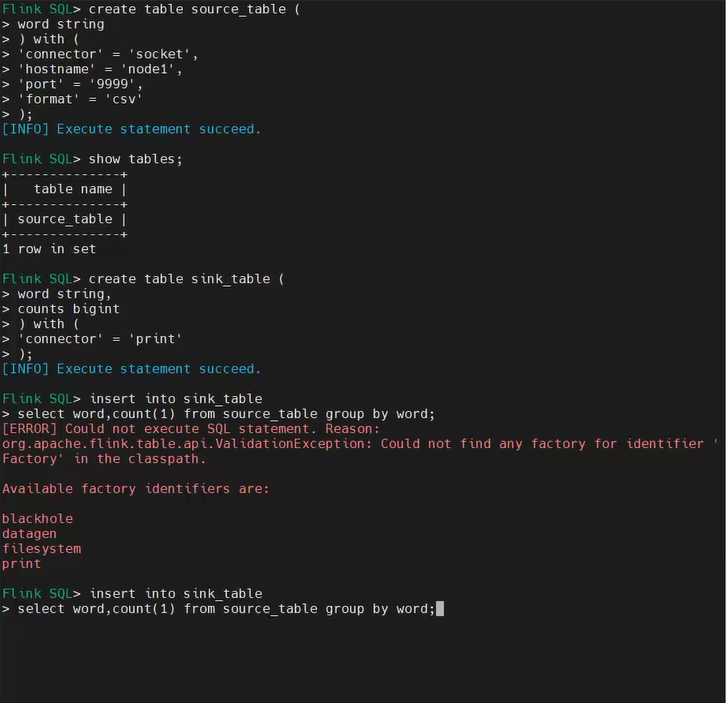

#### 3.3.1 wordcount入门案例

在FlinkSQL客户端中,采用SQL的方式,完成wordcount入门案例

```
需要先把flink-examples-table_2.12-1.15.2.jar包放置在flink/lib目录下,然后重启集群才可以
启用集群
start-cluster.sh
启动FlinkSQL客户端
sql-client.sh

1.创建source表
create table source_table (
word string
) with (
'connector' = 'socket',
'hostname' = 'hadoop102',
'port' = '9999',
'format' = 'csv'
);

2.创建目标表
create table sink_table (
word string,
counts bigint
) with (
'connector' = 'print'
);

3.执行数据任务
insert into sink_table select word,count(1) from source_table group by word;
```

#### 3.3.2 统计商品指标的案例

##### 3.3.2.1 datagen连接器介绍

https://nightlies.apache.org/flink/flink-docs-release-2.2/docs/connectors/table/datagen/

datagen连接器,可以用来模拟数据源,来源源不断地生成数据,一般用于开发,测试中

datagen的连接器参数信息如下:

| Option             | Required |                    Default                     |      Type       |                         Description                          |
| :----------------- | :------: | :--------------------------------------------: | :-------------: | :----------------------------------------------------------: |
| connector          | required |                     (none)                     |     String      |   Specify what connector to use, here should be 'datagen'.   |
| rows-per-second    | optional |                     10000                      |      Long       |          Rows per second to control the emit rate.           |
| number-of-rows     | optional |                     (none)                     |      Long       | The total number of rows to emit. By default, the table is unbounded. |
| scan.parallelism   | optional |                     (none)                     |     Integer     | Defines the parallelism of the source. If not set, the global default parallelism is used. |
| fields.#.kind      | optional |                     random                     |     String      | Generator of this '#' field. Can be 'sequence' or 'random'.  |
| fields.#.min       | optional |            (Minimum value of type)             | (Type of field) | Minimum value of random generator, only works for numeric types. |
| fields.#.max       | optional |            (Maximum value of type)             | (Type of field) | Maximum value of random generator, only works for numeric types. |
| fields.#.max-past  | optional |                       0                        |    Duration     | Maximum past of timestamp random generator, only works for timestamp types. |
| fields.#.length    | optional | 100 for string/bytes, 3 for array/map/multiset |     Integer     | Size or length of the collection for generating varchar/varbinary/string/bytes/array/map/multiset types. Please note that for variable-length fields (varchar/varbinary), the default length is defined by the schema and cannot be set to a length greater than it. For super-long fields (string/bytes), the default length is 100 and can be set to a length less than 2^31. For constructed fields (array/map/multiset), the default number of elements is 3. |
| fields.#.var-len   | optional |                     false                      |     Boolean     | Whether to generate a variable-length data, only works for variable-length types (varchar, string, varbinary, bytes). |
| fields.#.start     | optional |                     (none)                     | (Type of field) |              Start value of sequence generator.              |
| fields.#.end       | optional |                     (none)                     | (Type of field) |               End value of sequence generator.               |
| fields.#.null-rate | optional |                       0                        | (Type of field) |                The proportion of null values.                |

##### 3.3.2.2 upsert-kafka连接器介绍

upsert-kafka连接器,运行Flink从upsert-kafka中读取和写入操作

它的参数如下:

| Option                       | Required | Default |                  Type                  |                         Description                          |                                                              |
| :--------------------------- | :------: | :-----: | :------------------------------------: | :----------------------------------------------------------: | ------------------------------------------------------------ |
| connector                    | required | (none)  |                 String                 | Specify which connector to use, for the Upsert Kafka use: `'upsert-kafka'`. |                                                              |
| topic                        | required | (none)  |                 String                 | Topic name(s) to read data from when the table is used as source, or topics for writing when the table is used as sink. It also supports topic list for source by separating topic by semicolon like `'topic-1;topic-2'`. Note, only one of "topic-pattern" and "topic" can be specified. For sinks, the topic name is the topic to write data. It also supports topic list for sinks. The provided topic-list is treated as a allow list of valid values for the `topic` metadata column. If a list is provided, for sink table, 'topic' metadata column is writable and must be specified. |                                                              |
| properties.bootstrap.servers | required | (none)  |                 String                 |            Comma separated list of Kafka brokers.            |                                                              |
| properties.*                 | optional | (none)  |                 String                 | This can set and pass arbitrary Kafka configurations. Suffix names must match the configuration key defined in [Kafka Configuration documentation](https://kafka.apache.org/documentation/#configuration). Flink will remove the "properties." key prefix and pass the transformed key and values to the underlying KafkaClient. For example, you can disable automatic topic creation via `'properties.allow.auto.create.topics' = 'false'`. But there are some configurations that do not support to set, because Flink will override them, e.g. `'auto.offset.reset'`. |                                                              |
| key.format                   | required | (none)  |                 String                 | The format used to deserialize and serialize the key part of Kafka messages. Please refer to the [formats](https://nightlies.apache.org/flink/flink-docs-release-2.2/docs/connectors/table/formats/overview/) page for more details and more format options.**Attention** Compared to the regular Kafka connector, the key fields are specified by the `PRIMARY KEY` syntax. |                                                              |
| key.fields-prefix            | optional | (none)  |                 String                 | Defines a custom prefix for all fields of the key format to avoid name clashes with fields of the value format. By default, the prefix is empty. If a custom prefix is defined, both the table schema and `'key.fields'` will work with prefixed names. When constructing the data type of the key format, the prefix will be removed and the non-prefixed names will be used within the key format. Please note that this option requires that `'value.fields-include'` must be set to `'EXCEPT_KEY'`. |                                                              |
| value.format                 | required | (none)  |                 String                 | The format used to deserialize and serialize the value part of Kafka messages. Please refer to the [formats](https://nightlies.apache.org/flink/flink-docs-release-2.2/docs/connectors/table/formats/overview/) page for more details and more format options. |                                                              |
| value.fields-include         | optional |   ALL   | EnumPossible values: [ALL, EXCEPT_KEY] | Defines a strategy how to deal with key columns in the data type of the value format. By default, `'ALL'` physical columns of the table schema will be included in the value format which means that key columns appear in the data type for both the key and value format. |                                                              |
| scan.parallelism             | optional |   no    |                 (none)                 |                           Integer                            | Defines the parallelism of the upsert-kafka source operator. If not set, the global default parallelism is used. |
| sink.parallelism             | optional | (none)  |                Integer                 | Defines the parallelism of the upsert-kafka sink operator. By default, the parallelism is determined by the framework using the same parallelism of the upstream chained operator. |                                                              |
| sink.buffer-flush.max-rows   | optional |    0    |                Integer                 | The max size of buffered records before flush. When the sink receives many updates on the same key, the buffer will retain the last record of the same key. This can help to reduce data shuffling and avoid possible tombstone messages to Kafka topic. Can be set to '0' to disable it. By default, this is disabled. Note both `'sink.buffer-flush.max-rows'` and `'sink.buffer-flush.interval'` must be set to be greater than zero to enable sink buffer flushing. |                                                              |
| sink.buffer-flush.interval   | optional |    0    |                Duration                | The flush interval mills, over this time, asynchronous threads will flush data. When the sink receives many updates on the same key, the buffer will retain the last record of the same key. This can help to reduce data shuffling and avoid possible tombstone messages to Kafka topic. Can be set to '0' to disable it. By default, this is disabled. Note both `'sink.buffer-flush.max-rows'` and `'sink.buffer-flush.interval'` must be set to be greater than zero to enable sink buffer flushing. |                                                              |
| sink.delivery-guarantee      | optional |   no    |             at-least-once              |                            String                            | Defines the delivery semantic for the upsert-kafka sink. Valid enumerationns are `'at-least-once'`, `'exactly-once'` and `'none'`. See [Consistency guarantees](https://nightlies.apache.org/flink/flink-docs-release-2.2/docs/connectors/table/upsert-kafka/#consistency-guarantees) for more details. |
| sink.transactional-id-prefix | optional |   yes   |                 (none)                 |                            String                            | If the delivery guarantee is configured as `'exactly-once'` this value must be set and is used a prefix for the identifier of all opened Kafka transactions. |

##### 3.3.2.3 提前准备

```
1.启动Flink集群
2.启动zk
3.启动kafka
4.创建topic (如果已存在,则可以先删除)
bin/kafka-topics.sh --bootstrap-server hadoop102:9092 --list
bin/kafka-topics.sh --bootstrap-server hadoop102:9092 --delete --topic first

bin/kafka-topics.sh --bootstrap-server hadoop102:9092 --create --replication-factor 1 --partitions 1 --topic test
//1. 创建一个数据源（输入）表，这里的数据源是 flink 自带的一个随机 mock 数据的数据源。
CREATE TABLE source_table (
	sku_id STRING,
	price BIGINT
) WITH (
  'connector' = 'datagen',
  'rows-per-second' = '1',
  'fields.sku_id.length' = '1',
  'fields.price.min' = '1',
  'fields.price.max' = '10000'
);

//2. 创建一个数据汇（输出）表，输出到 kafka 中
CREATE TABLE sink_table (
 sku_id STRING, 
 count_result BIGINT, 
 sum_result BIGINT, 
 avg_result DOUBLE, 
 min_result BIGINT, 
 max_result BIGINT, 
 PRIMARY KEY (`sku_id`) NOT ENFORCED 
) WITH ( 
   'connector' = 'upsert-kafka', 
   'topic' = 'test', 
   'properties.bootstrap.servers' = 'hadoop102:9092', 
   'key.format' = 'json', 
   'value.format' = 'json' 
);

//执行一段 group by 的聚合 SQL 查询
insert into sink_table 
select sku_id, 
  count(*) as count_result, 
  sum(price) as sum_result, 
  avg(price) as avg_result, 
  min(price) as min_result, 
  max(price) as max_result 
from source_table 
group by sku_id ;

```

## 4.Flink数据类型

Flink的数据类型分为两种:

- 原子数据类型
- 复合数据类型

### 4.1 原子数据类型

```
1.字符,字符串
char
varchar
string
2.数值
int
bigint
tinyint
decimal
3.精度类型
float
double
4.布尔类型
true
false
5.null类型
null
6.时间,日期类型
date
time
datetime
timestamp
timestamp_ltz
ltz: local time zone,本地时区,从1.14版本开始支持了ltz类型的时间,也是推荐的时间类型
```

### 4.2 复合数据类型

Flink的复合类型如下:

- Array,数组类型,类似于Python的List类型
- Map,Map类型,(key,value),类似于Python的字典类型
- MultiSet,集合类型,类似于Java的List
- Row,对象类型

案例如下:

```
开启netcat，监听9999端口号，输入json字符串：
{"id":1238123899121,"name":"itcast","date":"1990-10-14","obj":{"time1":"12:12:43","str":"sfasfafs","lg":2324342345},"arr":[{"f1":"f1str11","f2":134},{"f1":"f1str22","f2":555}],"time":"12:12:43","timestamp":"1990-10-14 12:12:43","map":{"flink":123},"mapinmap":{"inner_map":{"key":234}}}

CREATE TABLE json_source (
    id            BIGINT,
    name          STRING,
    `date`        DATE,
    obj           ROW<time1 TIME,str STRING,lg BIGINT>,
    arr           ARRAY<ROW<f1 STRING,f2 INT>>,
    `time`        TIME,
    `timestamp`   TIMESTAMP(3),
    `map`         MAP<STRING,BIGINT>,
    mapinmap      MAP<STRING,MAP<STRING,INT>>,
    proctime as PROCTIME()
 ) WITH (
    'connector' = 'socket',
    'hostname' = 'hadoop102',        
    'port' = '9999',
    'format' = 'json'
);

select id, name,`date`,obj.str,arr[1].f1,`map`['flink'],mapinmap['inner_map']['key'] from json_source;

```

## 5.动态表&连续查询

Flink的表不比MySQL,Hive中的表,它不存储数据

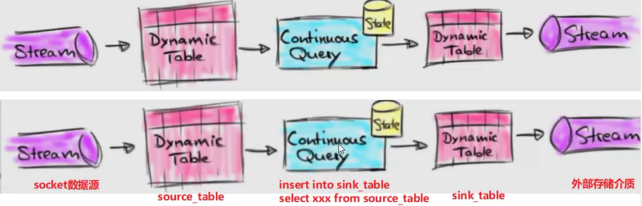

|        | **输入表**                                       | **处理逻辑**                                                 | **结果表**       |
| ------ | ------------------------------------------------ | ------------------------------------------------------------ | ---------------- |
| 批处理 | 静态表：输入数据有限、是有界集合                 | 批式计算：每次执行查询能够访问到完整的输入数据，然后计算，输出完整的结果数据 | 静态表：数据有限 |
| 流处理 | 动态表：输入数据无限，数据实时增加，并且源源不断 | 流式计算：执行时不能够访问到完整的输入数据，每次计算的结果都是一个中间结果 | 动态表：数据无限 |

在Flink中,通过动态表,把数据源映射为一张表,这张表会随着数据持续不断的到来,结果也会动态变化,这张表就是我们的source表了

我们基于动态表之上,进行查询操作,结果也会随着动态表的不断变化而变化,这个查询是持续不断地进行,因此,也称为连续查询

查询的结果,也是一张表,这就是sink表了

sink表的结果,可以通过三种流的编码形式往外输出

- append-only流,只有insert操作,只能写

- retract流,撤回流

  - add message
  - retract message

  这两种消息编码,可以转换为数据库变革操作

  - insert:  add message
  - update:  先retract message,再add message
  - delete:  retract message

- upsert流,变更流

  - upsert message
  - delete message

  这两种消息编码,也可以转换为数据库变更操作

  - insert:  upsert message
  - update: upsert message
  - delete: delete message

## 6.Flink的时间语义

在Flink中,定义了三种时间语义:

- ingestion time (摄入时间)
- process time (处理时间)
- event time (事件时间)

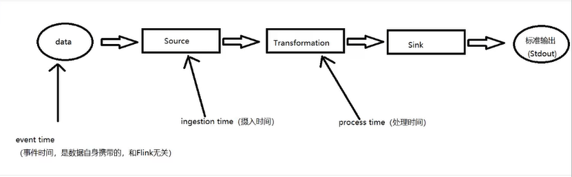

#### 6.1.1 ingestion time (摄入时间)

摄入时间: 摄入,读取,摄入时间,就是读取数据的时间.就是source算子加载数据的时间

这个时间基本不用

#### 6.1.2 process time (处理时间)

处理时间: 就是数据被Flink算子正常处理的时间,比如窗口处理,flatMap处理,keyBy处理等

这个时间同样也是Flink赋予的,这时间很少使用

#### 6.1.3 event time (事件时间)

事件时间: 事件: 一些操作,比如鼠标点击,滑动,悬浮等.在进行某个事件时的时间,就是事件时间

这个时间不是Flink赋予的,和Flink没有任何关系.是数据本身携带的

### 6.2 语法(FlinkSQL)

这个语法,是指FlinkSQL中的语法,不是DataStream中方

#### 6.2.1 摄入时间

基本不用,没有定义

#### 6.2.2 处理时间

在FlinkSQL,通过下面的函数进行处理时间的定义

```
1.处理时间
proctime()
理解如下
proctime = process time

2.案例
create table InputTable (
`userid` varchar,
`timestamp` bigint,
`money` double,
`category` varchar,
`pt` AS PROCTIME()
) with (
'connector' = 'filesystem',
'path' = 'file:///opt/module/input/order.csv',
'format' = 'csv'
);
3.查看表的schema
desc InputTable ;

```

> 说明:
>
> Flink中,不管是什么时间,类型要么是timestamp,要么是timestamp_ltz类型

#### 6.2.3 事件时间

```
1.语法
watermark for 事件时间列 as 事件时间列 - 乱序时间
事件事件,要由watermark来定义

2.案例
 create table InputTable2 (
 `userid` varchar,
 `timestamp` bigint,
 `money` double,
 `category` varchar,
 rt AS TO_TIMESTAMP(FROM_UNIXTIME(`timestamp`))
 ) with (
 'connector' = 'filesystem',
 'path' = 'file:///opt/module/input/order.csv',
 'format' = 'csv'
);

create table InputTable3 (
`userid` varchar,
`timestamp` bigint,
`money` double,
`category` varchar,
rt AS TO_TIMESTAMP(FROM_UNIXTIME(`timestamp`)),
watermark for rt as rt - interval '1' second
) with (
'connector' = 'filesystem',
'path' = 'file:///opt/module/input/order.csv',
'format' = 'csv'
);

3.查看表的schema
desc InputTable2 ;
这里可以看到并没有rowtime的时间属性标记，这种方式只是增加了一个 rt 的
desc InputTable3 ;
此时 rt 列被标记为 rowtime 的时间属性

```

### 6.3 小结

Flink的时间,是为了窗口来服务的

## 7.Flink的窗口机制

### 7.1 窗口

#### 7.1.1 为什么要学窗口

流式计算,一般有两种场景:

- 无限制的流式计算,比如: wordcount案例,它没有任何外部的限制条件,这种情况不多
- 有限制的流式计算,比如:统计早高峰时间内经过某个道路的车辆数

对于第二种情况来说,我们需要加上额外的限制条件,最常用的限制条件就是时间了

这个时间段,在程序中,就用一个窗口来表示

也就是说,窗口的作用: 把流式计算转换为批量计算,窗口是流转批的一个桥梁

这就是为什么要学窗口的原因了

#### 7.1.2 生活中的窗口

特点如下:

- 有大小
- 有多个
- 连通屋子内外 (批 -> 流)
- 边界

#### 7.1.3 程序中的窗口

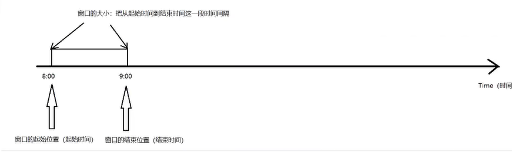

说明如下:

```
1.窗口的起始(左边界)
起始时间
2.窗口的结束(右边界)
结束时间
3.窗口的大小
从起始时间到结束时间的间隔,称之为窗口大小,就是一个时间段
```

#### 7.1.4 Flink中的窗口

在Flink中,窗口可以分为如下几类:

- 滚动窗口(Tumble)
- 滑动窗口(hop,Slice)
- 会话窗口(session)
- 渐进式窗口(cumulate)
- 聚合窗口(over)

### 7.2 滚动窗口(Tumble)

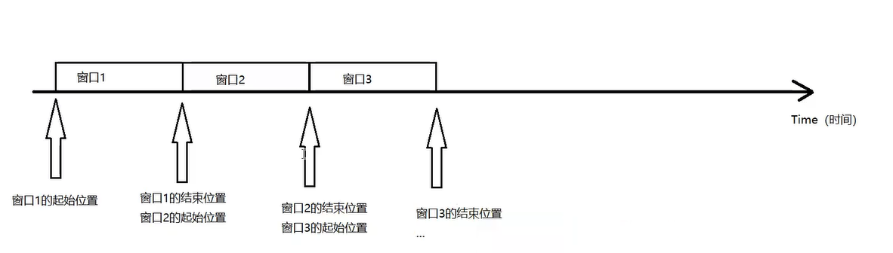

#### 7.2.1 概念

滚动窗口: 窗口大小 = 滚动距离 (时间间隔)

特点: 上一个窗口的结束就是下一个窗口的开始,数据不重复,也不丢失

#### 7.2.2 案例-SQL

```
1.创建source表
CREATE TABLE source_table ( 
 user_id STRING, 
 price BIGINT,
 `timestamp` bigint,
 row_time AS TO_TIMESTAMP(FROM_UNIXTIME(`timestamp`)),
 watermark for row_time as row_time - interval '0' second
) WITH (
  'connector' = 'socket',
  'hostname' = 'hadoop102',        
  'port' = '9999',
  'format' = 'csv'
);

2.语法
tumble(事件时间列,窗口大小)
窗口大小是用户自定义的,比如30分钟,1小时等
直接把tumble窗口放在group by语句即可
比如: tumble(row_time,interval '5' second)
含义: 定义一个5秒大小的滚动窗口

3.数据处理逻辑
select 
    user_id,
    sum(price) as sum_price,
    UNIX_TIMESTAMP(CAST(tumble_start(row_time, interval '5' second) AS STRING)) * 1000  as window_start,
    UNIX_TIMESTAMP(CAST(tumble_end(row_time, interval '5' second) AS STRING)) * 1000  as window_end
from source_table
group by
    user_id,
    tumble(row_time, interval '5' second);
    
    
4.测试数据
场景一:
1001,10,1
1001,10,2
1001,10,3
1001,10,4
1001,10,5
1001,10,5会触发窗口,累计金额 40
场景二:
1001,10,1
1001,10,2
1001,10,3
1001,10,4
1001,10,3
1001,10,4
1001,10,5
1001,10,5会触发窗口,累计金额 60
```

#### 7.2.3 窗口的划分

窗口是怎么划分的?

由第一条数据的事件时间决定

计算公式:

```
1.前提条件
窗口大小为5秒,滚动窗口

2.计算公式
窗口的起始 = 第一条数据的事件时间 - (第一条数据的事件时间 % 窗口大小)

3.演算
第一条数据的事件时间: 1
第一个窗口起始位置 = 1 - (1 % 5) = 1 - 1 = 0
由于第一个窗口的结束位置为5
所以,第一个窗口的大小为: [0,5),左闭右开
第二个窗口: [5,10)
第三个窗口: [10,15)
...
```

#### 7.2.4 窗口的结束

窗口的结束,也有计算公式:

```
1.计算公式
窗口的结束 = 窗口起始 + 窗口大小 - 1(毫秒)
通俗来讲,就是窗口结束前一毫秒

2.演算
第一个窗口的结束: 0(秒) + 5(秒) - 1(毫秒) = 5000毫秒 - 1毫秒 = 4999(毫秒)
第二个窗口的结束: 5(秒) + 5(秒) - 1(毫秒) = 10000毫秒 - 1毫秒 = 9999(毫秒)
第三个窗口的结束: 10(秒) + 5(秒) - 1(毫秒) = 15000毫秒 - 1毫秒 = 14999(毫秒)
```

#### 7.2.5 窗口的触发计算

就是在窗口结束的那一刻触发计算的,所以,在刚刚的演示案例中,当我们输入事件时间为5的数据时,窗口触发计算了

#### 7.2.6 案例-SQL-拓展

```
1.创建source表
CREATE TABLE source_table ( 
 user_id STRING, 
 price BIGINT,
 `timestamp` bigint,
 row_time AS TO_TIMESTAMP(FROM_UNIXTIME(`timestamp`)),
 watermark for row_time as row_time - interval '0' second
) WITH (
  'connector' = 'socket',
  'hostname' = 'hadoop102',        
  'port' = '9999',
  'format' = 'csv'
);

2.数据处理
select 
    user_id,
    sum(price) as sum_price,
    UNIX_TIMESTAMP(CAST(tumble_start(row_time, interval '5' second) AS STRING)) * 1000  as window_start,
    UNIX_TIMESTAMP(CAST(tumble_end(row_time, interval '5' second) AS STRING)) * 1000  as window_end
from source_table
group by
    user_id,
    tumble(row_time, interval '5' second);
    
3.测试数据
1001,10,1680357057
1001,10,1680357058
1001,10,1680357059
1001,10,1680357060
1001,10,1680357061
```

演算的排布,演算如下

```
1.第一条数据的时间时间: 1680357057
窗口的起始: 1680357057 - (1680357057 % 5) = 1680357057 - 2 =1680357055
窗口的结束: 1680357060 - 1(毫秒) = 1680357060000(毫秒) - 1(毫秒) = 1680357059999
```

#### 7.2.7 DataStream API案例

7.2.7.1 需求

```
演示基于事件时间的滚动窗口,窗口大小为5秒,数据来自于socket(id,price,ts),类型为: String,Integer,Long
```

7.2.7.2 分析

```
1.构建流式环境

2.数据源

3.数据处理
3.1 把输入的数据转成Tuple3对象,泛型为: Tuple3<String,Integer,Long>
3.2 为Tuple3对象添加时间戳水印(单调递增水印),并指定事件时间列
3.3 对数据进行分流/分组操作
3.4 进行窗口划分,这里指定为滚动窗口,窗口大小为5秒
3.5 对窗口内的数据进行聚合操作
3.6 对结果进行转换,把Tuple3转成Tuple2操作(id,price)
4.数据输出

5.启动流式任务

测试数据
1001,10,1
1001,10,2
1001,10,3
1001,10,4
1001,10,5
```

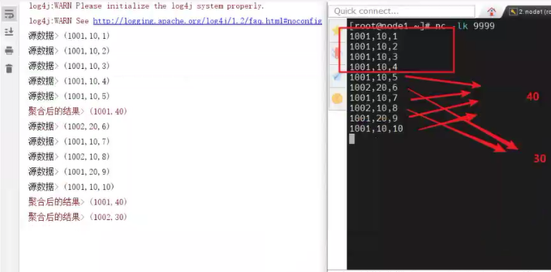

#### 2.2.8 SQL-TVF写法

````
1.定义数据源
CREATE TABLE source_table ( 
 user_id STRING, 
 price BIGINT,
 `timestamp` bigint,
 row_time AS TO_TIMESTAMP(FROM_UNIXTIME(`timestamp`)),
 watermark for row_time as row_time - interval '0' second
) WITH (
  'connector' = 'socket',
  'hostname' = 'hadoop102',        
  'port' = '9999',
  'format' = 'csv'
);

2.语法
from table(窗口类型(table 表名称,descriptor(事件时间列),窗口大小))
整个窗口的SQL都放在from后面,而不是在group by后面了
如:
FROM TABLE(TUMBLE(
        TABLE source_table
        , DESCRIPTOR(row_time)
        , INTERVAL '5' SECOND))
        
3.查询SQL 
 SELECT 
    user_id,
    UNIX_TIMESTAMP(CAST(window_start AS STRING)) * 1000 as window_start,
    UNIX_TIMESTAMP(CAST(window_end AS STRING)) * 1000 as window_end,
    sum(price) as sum_price
FROM TABLE(TUMBLE(
        TABLE source_table
        , DESCRIPTOR(row_time)
        , INTERVAL '5' SECOND))
GROUP BY window_start, 
      window_end,
      user_id;

window_start : 窗口的起始时间,是内置的关键字
window_end : 窗口的结束时间,是内置的关键字
````

### 7.3 滑动窗口 (hop,slice)

#### 7.3.1 概念

滑动窗口: 滑动距离 != 窗口大小

```
1. 滑动距离 < 窗口大小,这种情况待会儿讨论
2. 滑动距离 = 窗口大小,这种情况就是滚动窗口,已经讨论过了
3. 滑动距离 > 窗口大小,这种情况会造成数据丢失,不讨论
```

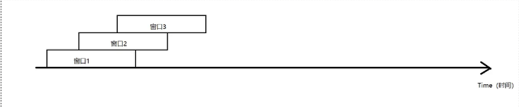

举例说明:

```
1.滑动窗口 < 窗口大小
每隔1小时,统计最近半天的数据
6 -> (0,6)
7 -> (1,7)
8 -> (2,8)
9 -> (3,9)
这种情况会产生数据的重复计算,也是我们要讨论的重点

2.滑动距离 = 窗口大小
就是滚动窗口,这里不讨论

3.滑动距离 > 窗口大小
每隔半天,统计最近1小时的数据
6 -> (5,6)
12 -> (11,12)
在这个过程中,7,11点的数据就丢失了
在实际工作中,不会允许数据丢失,因此这里不讨论
```

#### 7.3.2 案例-SQL

```
1.创建表
CREATE TABLE source_table ( 
 user_id STRING, 
 price BIGINT,
 `timestamp` bigint,
 row_time AS TO_TIMESTAMP(FROM_UNIXTIME(`timestamp`)),
 watermark for row_time as row_time - interval '0' second
) WITH (
  'connector' = 'socket',
  'hostname' = 'hadoop102',        
  'port' = '9999',
  'format' = 'csv'
);

2.语法
hop(事件时间列,滑动距离,窗口大小)
比如:
hop(row_time, interval '2' SECOND, interval '5' SECOND)
解释:
每隔2秒,统计最近5秒的数据

3.查询SQL
SELECT user_id,
    UNIX_TIMESTAMP(CAST(hop_start(row_time, interval '2' SECOND, interval '5' SECOND) AS STRING)) * 1000 as window_start, 
    UNIX_TIMESTAMP(CAST(hop_end(row_time, interval '2' SECOND, interval '5' SECOND) AS STRING)) * 1000 as window_end,
    sum(price) as sum_price
FROM source_table
GROUP BY user_id
    , hop(row_time, interval '2' SECOND, interval '5' SECOND);

4.数据示例
1001,10,1
1001,10,2
1001,10,3
1001,10,4
1001,10,5
1001,10,6
1001,10,7
```

解释窗口的触发计算

````shell
#1.数据如下
1001,10,1
1001,10,2
1001,10,3
1001,10,4
1001,10,5
1001,10,6
1001,10,7

#窗口的起始
由第一条数据的事件时间而定
窗口的起始 = 事件时间 - (事件时间 % 窗口大小) = 1 - (1 % 5) = 1 - 1 = 0
窗口的排布: [-2,3),[0,5),[2,7),[4,9)

根据上述的数据,我们来看窗口的触发计算
由于滑动窗口,数据会造成重复计算,也就是说,数据会出现在每一个能够计算的窗口内
比如 : 数据1,它除了出现在[0,5),它还会出现在: [2,7),[4,9),[-2,3)
因此,1这条数据,会出现在 [-2,3),[0,5)内
2这条数据,会出现在 [-2,3),[0,5),[2,7)内

因此,我们说,滑动窗口,一条数据会被重复计算
````

总结: 数据会落在每一个它能落进的窗口之内

截图如下:

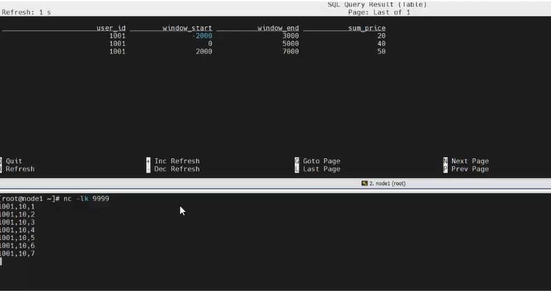

#### 7.3.3 案例-SQL-拓展

比如: 还是上面的案例,第一条数据的事件时间为0,会发生什么情况呢?

```
窗口的起始 = 0 - (0 % 5) = 0 - 0 = 0
因此,窗口的排布应该是: [-4,1),[-2,3),[0,5),[2,7),[4,9)
```

#### 7.3.4 案例-SQL-TVF写法(了解)

```shell
#1.创建表
CREATE TABLE source_table ( 
 user_id STRING, 
 price BIGINT,
 `timestamp` bigint,
 row_time AS TO_TIMESTAMP(FROM_UNIXTIME(`timestamp`)),
 watermark for row_time as row_time - interval '0' second
) WITH (
  'connector' = 'socket',
  'hostname' = 'hadoop102',        
  'port' = '9999',
  'format' = 'csv'
);

#2.语法
from table(hop(table 表名称,descriptor(事件时间列),滑动距离,窗口大小))
比如:
from table (hop (table source_table,descriptor(row_time),interval '2' second,interval '6' second))
说明: 这里的窗口大小必须要是滑动距离的整数倍

#3.查询SQL
 SELECT 
    user_id,
UNIX_TIMESTAMP(CAST(window_start AS STRING)) * 1000 as window_start,  
UNIX_TIMESTAMP(CAST(window_end AS STRING)) * 1000 as window_end, 
    sum(price) as sum_price
FROM TABLE(HOP(
        TABLE source_table
        , DESCRIPTOR(row_time)
        , interval '2' SECOND, interval '6' SECOND))
GROUP BY window_start, 
      window_end,
      user_id;

```

解释:

```shell
窗口大小为6秒,滑动距离为2秒,第一条事件时间为1,窗口的排布如下:

窗口的起始 = 1 - (1 % 6) = 1 - 1 = 0
[-6,0),[-4,2),[-2,4),[0,6)
```

截图如下:

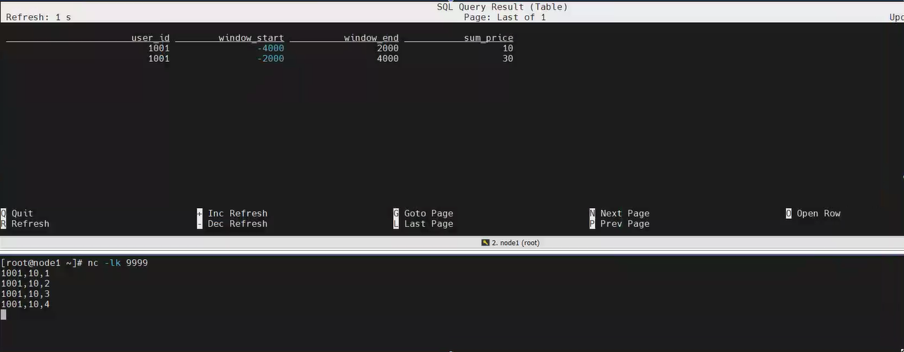

#### 7.3.5 DataStream API案例

##### 7.3.5.1 需求

```shell
演示基于事件时间的滑动窗口,窗口大小为5秒,滑动间隔为2秒,数据来自于socket(id,price,ts),类型为: String,Integer,Long  
ts: timestamp 也就是事件时间
```

7.3.5.2 分析

```shell
//1.构建流式环境

//2.数据源

//3.数据处理
//3.1 把输入的数据转成Tuple3对象,泛型为: Tuple3<String,Integer,Long>
//3.2 为Tuple3对象添加时间戳水印(单调递增水印),并指定事件时间列
//3.3 对数据进行分流/分组操作
//3.4 进行窗口划分,这里指定为滑动窗口,窗口大小为5秒,滑动间隔为2秒
//3.5 对窗口内的数据进行聚合操作
//3.6 对结果进行转换,把Tuple3转成Tuple2操作(id,price)

//4.数据输出

//5.启动流式任务

测试数据
1001,10,1
1001,10,2
1001,10,3
1001,10,4
1001,10,5
```

截图示例:

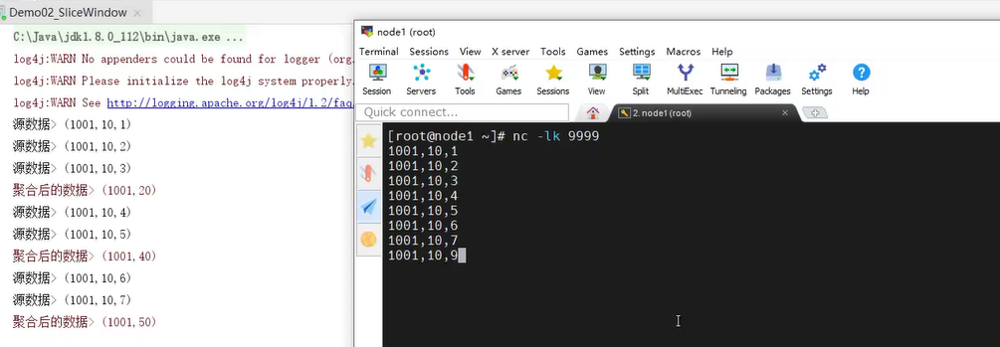

### 7.4 会话窗口 (Session)

#### 7.4.1 概念

会话窗口,session,相邻的两条数据,如果他们的到达时间没有超过会话间隔,就会落在同一个窗口内.

反之,则会落在不同的窗口

窗口的触发计算: 由最后一条数据决定,如果超过了窗口的会话间隔,则触发上一个窗口计算,同时初始化下一个窗口

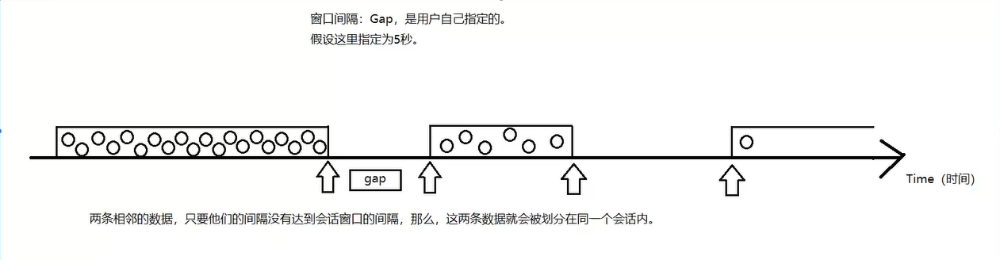

#### 7.4.2 案例-SQL

```shell
#1.创建表
CREATE TABLE source_table ( 
 user_id STRING, 
 price BIGINT,
 `timestamp` bigint,
 row_time AS TO_TIMESTAMP(FROM_UNIXTIME(`timestamp`)),
 watermark for row_time as row_time - interval '0' second
) WITH (
  'connector' = 'socket',
  'hostname' = 'hadoop102',        
  'port' = '9999',
  'format' = 'csv'
);

#2.语法
session(事件时间列,窗口间隔gap)
放在group by子句后面即可

#3.数据SQL
SELECT 
    user_id,
    UNIX_TIMESTAMP(CAST(session_start(row_time, interval '5' SECOND) AS STRING)) * 1000 as window_start, 
    UNIX_TIMESTAMP(CAST(session_end(row_time, interval '5' SECOND) AS STRING)) * 1000 as window_end, 
    sum(price) as sum_price
FROM source_table
GROUP BY user_id
      , session(row_time, interval '5' SECOND)

```

#### 7.4.3 案例-DataStram API

```

```

### 7.5 渐进式窗口 (cumulate)

#### 7.5.1 概念

渐进式,就是在一定的时间范围内,统计的结果呈递增趋势

比如: 以每天网站的访问量为例

今天: 200

明天: 150

后天: 500

每天的访问量都是从0开始往上累计,第二天又清空,这就是渐进式窗口

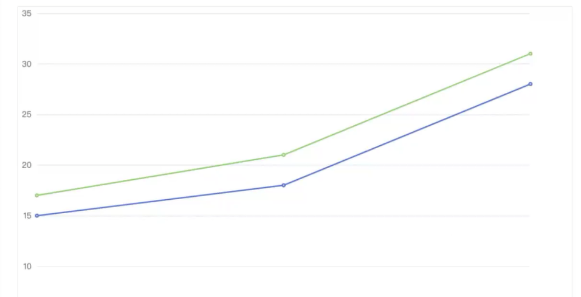

#### 7.5.2 案例-SQL

```shell
#1.数据源表
CREATE TABLE source_table (
    -- 用户 id
    user_id BIGINT,
    -- 用户
    money BIGINT,
    -- 事件时间戳
    row_time AS cast(CURRENT_TIMESTAMP as timestamp(3)),
    -- watermark 设置
    WATERMARK FOR row_time AS row_time - INTERVAL '0' SECOND
) WITH (
  'connector' = 'datagen',
  'rows-per-second' = '10',
  'fields.user_id.min' = '1',
  'fields.user_id.max' = '100000',
  'fields.money.min' = '1',
  'fields.money.max' = '100000'
);
 'rows-per-second' = '10', 每秒生成10条数据
  'fields.user_id.min' = '1',user_id的最小值
  'fields.user_id.max' = '100000', user_id的最大值
  'fields.money.min' = '1',money的最小值
  'fields.money.max' = '100000'money的最大值

#2.语法
这个窗口只有TVF的写法,没有普通SQL的写法,因为不能放在SQL的group by 后面
from table (cumulate(table 表名,descriptor(事件时间列),窗口大小))
比如:
from table (CUMULATE(TABLE source_table, DESCRIPTOR(row_time), INTERVAL '5' SECOND, INTERVAL '30' SECOND))
含义:
每隔5秒统计最近30秒的数据
#3.数据查询SQL
SELECT 
    UNIX_TIMESTAMP(CAST(window_end AS STRING)) * 1000 as window_end, 
    UNIX_TIMESTAMP(CAST(window_start AS STRING)) *1000 AS window_start, 
    sum(money) as sum_money,
    count(distinct user_id) as count_distinct_id
FROM TABLE(CUMULATE(
       TABLE source_table
       , DESCRIPTOR(row_time)
       , INTERVAL '5' SECOND
       , INTERVAL '30' SECOND))
GROUP BY
    window_start, 
    window_end
    
    
#2.数据汇表
CREATE TABLE sink_table (
    window_end bigint,
    window_start bigint,
    sum_money BIGINT,
    count_distinct_id bigint
) WITH (
  'connector' = 'print'
);

#3.数据处理逻辑
insert into sink_table
SELECT 
    UNIX_TIMESTAMP(CAST(window_end AS STRING)) * 1000 as window_end, 
    UNIX_TIMESTAMP(CAST(window_start AS STRING)) *1000 AS window_start, 
    sum(money) as sum_money,
    count(distinct user_id) as count_distinct_id
FROM TABLE(CUMULATE(
       TABLE source_table
       , DESCRIPTOR(row_time)
       , INTERVAL '60' SECOND
       , INTERVAL '1' DAY))
GROUP BY
    window_start, 
    window_end

```

截图如下:

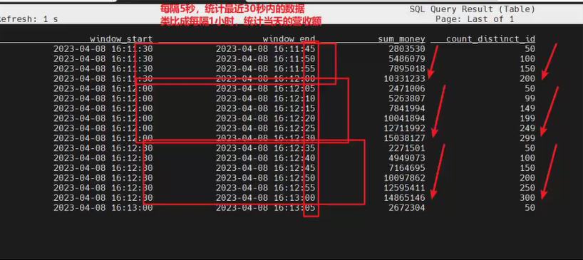

> 小结: 渐进式窗口,没有DataStream API案例,也没有普通SQL案例,只有TVF写法

### 7.6 聚合窗口(over)

#### 7.6.1 概述

聚合窗口,类似于hive中的over开窗函数

Flink中的over聚合窗口可以从两个层面来进行聚合操作

- 根据时间聚合
- 根据行号聚合

#### 7.6.2 时间聚合

```shell
#1.创建表
CREATE TABLE source_table (
    order_id BIGINT,
    product BIGINT,
    amount BIGINT,
    order_time as cast(CURRENT_TIMESTAMP as TIMESTAMP(3)),
    WATERMARK FOR order_time AS order_time - INTERVAL '0.001' SECOND
) WITH (
  'connector' = 'datagen',
  'rows-per-second' = '1',
  'fields.order_id.min' = '1',
  'fields.order_id.max' = '2',
  'fields.amount.min' = '1',
  'fields.amount.max' = '10',
  'fields.product.min' = '1',
  'fields.product.max' = '2'
);

#2.语法(和hive中的over语法类似)
range between 起始时间 and 结束时间
比如:
RANGE BETWEEN INTERVAL '1' HOUR PRECEDING AND CURRENT ROW
含义:
INTERVAL '1' HOUR PRECEDING 这就是起始时间,意思是1小时前
CURRENT ROW 这就是结束时间,一般用当前时间
写法和hive的over函数类似
聚合函数(字段) over (partition by aa order by bb range between interval '1' hour preceding and current row)

#3.数据查询SQL
SELECT product, order_time, amount,
  SUM(amount) OVER (
    PARTITION BY product
    ORDER BY order_time
    -- 标识统计范围是一个 product 的最近 1 小时的数据
    RANGE BETWEEN INTERVAL '1' HOUR PRECEDING AND CURRENT ROW
  ) AS one_hour_prod_amount_sum
FROM source_table

```

截图如下

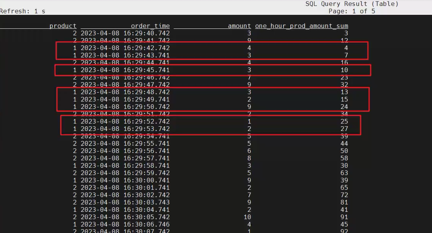

#### 7.6.3 行号聚合

```shell
#1.创建表
CREATE TABLE source_table (
    order_id BIGINT,
    product BIGINT,
    amount BIGINT,
    order_time as cast(CURRENT_TIMESTAMP as TIMESTAMP(3)),
    WATERMARK FOR order_time AS order_time - INTERVAL '0.001' SECOND
) WITH (
  'connector' = 'datagen',
  'rows-per-second' = '1',
  'fields.order_id.min' = '1',
  'fields.order_id.max' = '2',
  'fields.amount.min' = '1',
  'fields.amount.max' = '10',
  'fields.product.min' = '1',
  'fields.product.max' = '2'
);

#2.语法(和hive中的over语法类似)
range between 起始行数 and 结束行数
比如:
ROWS BETWEEN 100 PRECEDING AND CURRENT ROW
写法和hive的over函数类似
聚合函数(字段) over (partition by aa order by bb rows between 100 preceding and current row)

#3.查询SQL
SELECT product, order_time, amount,
  SUM(amount) OVER (
    PARTITION BY product
    ORDER BY order_time
    -- 标识统计范围是一个 product 的最近 100 行数据
    ROWS BETWEEN 100 PRECEDING AND CURRENT ROW
  ) AS one_hour_prod_amount_sum
FROM source_table

```

截图如下:

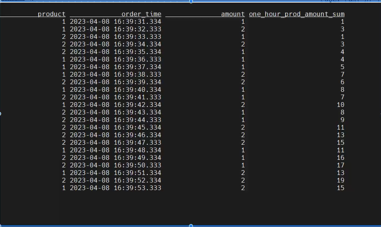

# day05

## 1.今天课程安排

- Watermark
  - 为什么要学Watermark
  - 概述
  - SQL演示-Watermark为零
  - SQL演示-Watermark不为零
  - Watermark下窗口触发机制
  - SQL演示-Watermark下数据丢失场景
  - DataStream演示-单调递增水印(普通)
  - DataStream演示-单调递增水印(注解)
  - DataStream演示-固定延迟水印
  - DataStream演示-AllowLateness机制
  - DataStream演示-SideOutput(侧道输出机制,侧输出流机制)
  - DataStream演示-Parallelism多并行度下的水印
  - DataStream演示-Parallelism多并行度下的水印(空闲等待处理方式)
  - 面试题: Flink怎么保证数据不丢失
- Checkpoint机制

## 2.Watermark

### 2.1 为什么要学watermark

生活中有种场景:

车辆进入隧道,信号不好,出了隧道后,信号就正常了

正常情况下,车辆进入隧道后,如果车辆正常,没有事故,会正常驶出隧道

在正常的隧道行驶过程中,可能会因为信号的原因,导致数据没有像信号正常的时候那么快到达

也就是说,这种情况下,数据出现了延迟,我们把这种延迟数据称之为迟到数据

生活中,这种场景非常多,比如:车辆进入地下车库,手机欠费,网络抖动等,这都属于生活中正常情况,无法避免.

程序中,一般不会允许数据丢失,所以,我们程序会推出一些机制来保证迟到的数据被正常处理

Watermark就是用来保证正常迟到的数据被正确的处理

### 2.2 概述

Watermark,也叫水印,或者是水位线,用来处理一定程度下的延迟数据

### 2.3 SQL案例-演示Watermark为零的情况

```shell
#1.定义数据源表
CREATE TABLE MyTable (
item STRING,
ts TIMESTAMP(3), -- TIMESTAMP 类型的时间戳
WATERMARK FOR ts AS ts - INTERVAL '0' SECOND
) WITH (
'connector' = 'socket',
'hostname' = 'hadoop102',
'port' = '9999',
'format' = 'csv'
);

#2.执行SQL查询
SELECT
TUMBLE_START(ts, INTERVAL '5' SECOND) AS window_start,
TUMBLE_END(ts, INTERVAL '5' SECOND) AS window_end,
TUMBLE_ROWTIME(ts, INTERVAL '5' SECOND) as window_rowtime,
item,count(item) as total_item
FROM MyTable
GROUP BY TUMBLE(ts, INTERVAL '5' SECOND), item;

```

截图如下:

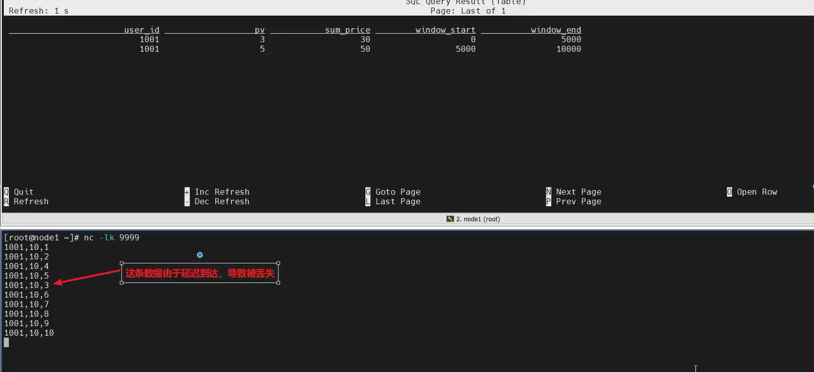

> 结论:
>
> Watermark为0,导致正常迟到的数据被丢失了,没有正常处理,这在实际开发中不允许

### 2.4 SQL案例-演示Watermark不为零的情况

Watermark不为零,就有可能是两种情况:

- 小于0,窗口会提前触发计算,这种情况在实际应用不存在,所以这里也不讨论
- 大于0,窗口会延迟触发计算,延迟的时间就是我们设置的Watermark的值

这里,我们主要是讨论Watermark>0的情况

```shell
#1.创建表
CREATE TABLE source_table ( 
 user_id STRING, 
 price BIGINT,
 `timestamp` bigint,
 row_time AS TO_TIMESTAMP(FROM_UNIXTIME(`timestamp`)),
 watermark for row_time as row_time - interval '2' second
) WITH (
  'connector' = 'socket',
  'hostname' = 'hadoop102',        
  'port' = '9999',
  'format' = 'csv'
);

#2.Watermark的解释
 watermark for row_time as row_time - interval '2' second
 这里的2,表示,数据允许延迟2秒钟到达,窗口会在(正常结束+2秒)后触发计算
 
 #3.数据查询SQL
 select 
    user_id,
    sum(price) as sum_price,
    UNIX_TIMESTAMP(CAST(tumble_start(row_time, interval '5' second) AS STRING)) * 1000  as window_start,
    UNIX_TIMESTAMP(CAST(tumble_end(row_time, interval '5' second) AS STRING)) * 1000  as window_end
from source_table
group by
    user_id,
    tumble(row_time, interval '5' second);
```

截图如下:

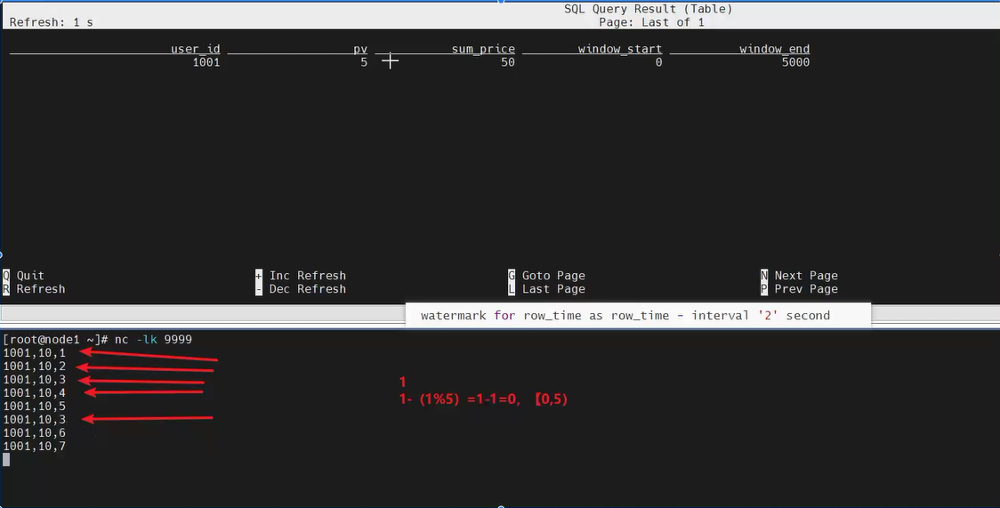

> 小结:
>
> 可以看到: 设置了Watermark后,正常迟到的数据被程序正常处理了

### 2.5 带有Watermark的窗口触发机制

窗口一旦有了Watermark后,窗口的触发计算就由Watermark的时间来决定

计算公式如下:

```
窗口的触发计算时间 = Watermak的时间 = 事件时间 - 延迟时间
```

这个公式是通用的

```shell
#1.Watermark设置为0
窗口触发计算时间 = Watermark的时间 = 事件时间 - 0 = 事件时间
因此,我们在前面说,Watermark为0时,就是按照正常的时间进行计算的
也就是说,Watermark=0,会有延迟数据丢失的情况发生

#2.Watermark设置为2,窗口大小为55秒,窗口触发的时间是5-1(毫秒) = 4999毫秒
#Watermark的默认初始值为Long.MIN_VALUE,然后在每一次计算时,会取最大值
Watermark的时间 = 事件时间 - 2
Watermark的时间 = 1 - 2 = -1,不触发窗口计算
Watermark的时间 = 2 - 2 = 0,不触发窗口计算
Watermark的时间 = 3 - 2 = 1,不触发窗口计算
Watermark的时间 = 4 - 2 = 2,不触发窗口计算
Watermark的时间 = 5 - 2 = 3,不触发窗口计算
Watermark的时间 = 3 - 2 = 1,不触发窗口计算
Watermark的时间 = 6 - 2 = 4,不触发窗口计算
Watermark的时间 = 7 - 2 = 5,已经超过了窗口的结束时间4999毫秒,因此会触发窗口计算

Watermark的时间,一直是往上递增的,不会递减,所以我们称为Watermark为水位线.就是一个标记位而已
```

> 小结:
>
> 1.延迟时间设置为2秒,窗口会延迟2秒钟触发计算.
>
> 2.窗口的划分还是一样,和Watermark没关系,它只是影响窗口的触发计算而已.不影响其他的

### 2.6 SQL案例-演示Watermark不为零数据丢失情况

```shell
#1.创建表
CREATE TABLE source_table ( 
 user_id STRING, 
 price BIGINT,
 `timestamp` bigint,
 row_time AS TO_TIMESTAMP(FROM_UNIXTIME(`timestamp`)),
 watermark for row_time as row_time - interval '2' second
) WITH (
  'connector' = 'socket',
  'hostname' = 'hadoop102',        
  'port' = '9999',
  'format' = 'csv'
);

#2.Watermark的解释
 watermark for row_time as row_time - interval '2' second
 这里的2,表示,数据允许延迟2秒钟到达,窗口会在(正常结束+2秒)后触发计算
 
 #3.数据查询SQL
 select 
    user_id,
    sum(price) as sum_price,
    UNIX_TIMESTAMP(CAST(tumble_start(row_time, interval '5' second) AS STRING)) * 1000  as window_start,
    UNIX_TIMESTAMP(CAST(tumble_end(row_time, interval '5' second) AS STRING)) * 1000  as window_end
from source_table
group by
    user_id,
    tumble(row_time, interval '5' second);
```

截图如下:

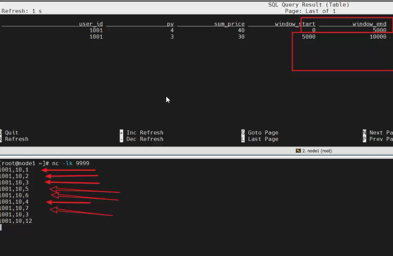

> 小结:
>
> 如果迟到数据超过了预设的延迟时间,数据会被丢弃

到这里,SQL的Watermark就这么多内容

在FlinkSQL中,如果数据在延迟时间之内到达,则会被正常处理,如果超过了延迟时间到达,则数据会被丢弃

在Flink DataStream中,数据不会允许丢失

### 2.7 DataStream案例-演示单调递增水印

#### 2.7.1 需求

```
从socket获取数据,转换成水位传感器类,基于事件时间,每5秒生成一个滚动窗口,来计算

类名: WaterSensor
String id id号
Integer vc,valueCount水位的值
Long ts,timestamp,,时间戳
```

#### 2.7.2 分析

```
// 1.构建流式执行环境

// 2.读取socket数据源

// 3.对数据进行处理
//3.1 把socket数据转换为水位传感器的类WaterSensor
//3.2 给数据分配时间戳和水印,这里指定为单调递增水印
//3.3 对数据进行分组/分流
//3.4 划分窗口,这里指定为滚动窗口,窗口大小为秒
//3.5 进行处理(介绍一个低阶API process)

//4.数据输出

//5.启动流式任务

测试数据
1001,10,1
1001,10,2
1001,10,3
1001,10,4
1001,10,5
```

测试截图如下:

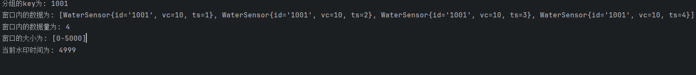

> 小结:
>
> 单调递增水印,就是延迟时间设置为0的情况

### 2.8 DataStream案例-演示固定延迟水印

由于单调递增水印,没办法处理延迟数据,所以这里引入固定延迟水印,来处理延迟数据

测试案例

```
// 1.构建流式执行环境

// 2.读取socket数据源

// 3.对数据进行处理
//3.1 把socket数据转换为水位传感器的类WaterSensor
//3.2 给数据分配时间戳和水印,这里指定为固定延迟水印
//3.3 对数据进行分组/分流
//3.4 划分窗口,这里指定为滚动窗口,窗口大小为秒
//3.5 进行处理(介绍一个低阶API process)

//4.数据输出

//5.启动流式任务
1001,10,1
1001,10,2
1001,10,3
1001,10,4
1001,10,5
1001,10,3
1001,10,5
1001,10,6
1001,10,7
```


截图如下:

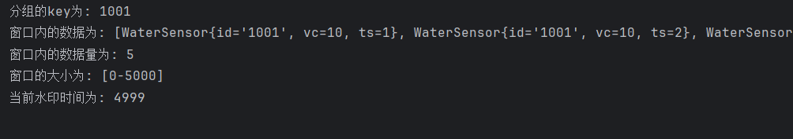

> 小结:
>
> 这里设置固定延迟时间为2秒,可以正常处理2秒内的迟到数据
>
> 对于迟到超过2秒的数据,仍然会被丢弃处理

```shell
单调递增: 不能处理迟到数据
固定延迟: 可以处理一定时间内的数据,多长时间由固定延迟设的时间而定
```

### 2.9 DataStream案例-演示AllowLateness

测试案例 参考 固定延迟水印代码

测试案例

````
// 1.构建流式执行环境

// 2.读取socket数据源

// 3.对数据进行处理
//3.1 把socket数据转换为水位传感器的类WaterSensor
//3.2 给数据分配时间戳和水印,这里指定为固定延迟水印
//3.3 对数据进行分组/分流
//3.4 划分窗口,这里指定为滚动窗口,窗口大小为秒
// 设置窗口 allowedLateness
//3.5 进行处理(介绍一个低阶API process)

//4.数据输出

//5.启动流式任务
````

测试截图:

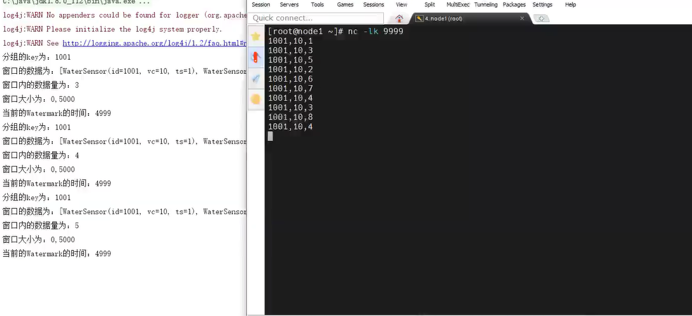

### 2.10 DataStream案例-演示SideOutput

测试案例参考 AllowLateness

```shell
// 1.构建流式执行环境

// 2.读取socket数据源

// 3.对数据进行处理
//3.1 把socket数据转换为水位传感器的类WaterSensor
//3.2 给数据分配时间戳和水印,这里指定为固定延迟水印
//3.3 对数据进行分组/分流
//3.4 划分窗口,这里指定为滚动窗口,窗口大小为秒
// 给窗口设置 allowedLateness
// 使用侧道输出机制,接收严重迟到的数据
//3.5 进行处理(介绍一个低阶API process)

//4.数据输出

//5.启动流式任务
```

> SideOutout机制,能够收集晚于Watermark的延迟时间和AllowLateness的迟到时间之后的数据
>
> 它不会允许数据丢失

### 2.11 DataStream案例-多并行度下的水印(拓展)

需求同上

分析

```shell
// 1.构建流式执行环境
// 设置并行度为2
// 2.读取socket数据源

// 3.对数据进行处理
//3.1 把socket数据转换为水位传感器的类WaterSensor
//3.2 给数据分配时间戳和水印,这里指定为固定延迟水印
//3.3 对数据进行分组/分流
//3.4 划分窗口,这里指定为滚动窗口,窗口大小为秒

//3.5 进行处理(介绍一个低阶API process)

//4.数据输出

//5.启动流式任务
```

测试截图

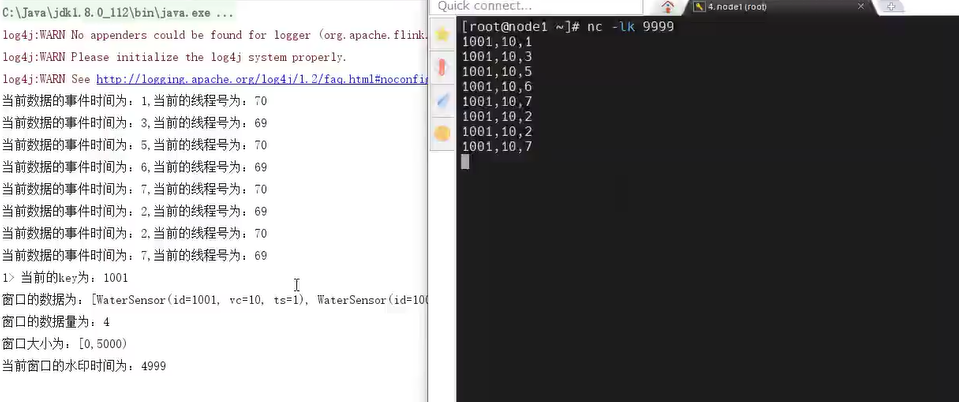

> 结论:
>
> 多并行度下的Watermark机制,会以多并行度下的最小的Watermark为准,(单个线程内的Watermark不会递减,只会递增)
>
> 这种情况称之为Watermark对齐

多并行度下的Watermark对齐问题

比如: 线程A,它可能数据量暴增,比其他线程都要多

这种情况就会造成有些并行度的数据积压,而有些并行度的数据迟迟不到

这就是问题,怎么处理

Flink提供了一种机制,设置多并行度下的空闲等待时间,来解决多并行度下的部分线程数据积压的情况

默认空闲等待时间不开启

如果设置的话,像刚刚这种情况,最多等待设置的空闲等待时间,到点之后,不管其他线程有没有数据,都会触发窗口计算

### 2.12 DataStream案例-多并行度下的空闲等待

需求同上

分析同上

案例实现

```shell
// 1.构建流式执行环境
// 设置并行度为2
// 2.读取socket数据源

// 3.对数据进行处理
//3.1 把socket数据转换为水位传感器的类WaterSensor
// 在水印中设置空闲等待时间
//3.2 给数据分配时间戳和水印,这里指定为固定延迟水印
//3.3 对数据进行分组/分流
//3.4 划分窗口,这里指定为滚动窗口,窗口大小为秒

//3.5 进行处理(介绍一个低阶API process)

//4.数据输出

//5.启动流式任务
```

截图如下

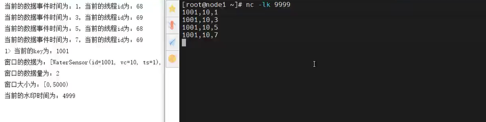

> 小结:
>
> Flink可以通过设置空闲等待,来解决多个并行度下,有些并行度的数据没有到达临界点而导致数据 的积压问题的

面试题: Flink怎么保证数据不丢失

如果是FlinkSQL,可以设置数据的迟到时间来保证一定程序内的迟到数据被正常处理,但是对于严重迟到的数据,在异常处理,数据会丢失

如果是Flink的DataStream API中,我们通过固定延迟水印,allowLateness可以保证绝大多数的迟到数据被正常处理,对于异常迟到的数据,Flink可以通过侧道输出机制把异常迟到数据捕获,不会让数据丢失

对于多个并行度下的数据处理,我们可以设置空闲等待时间来处理有些并行度数据积压,而有些并行度没有数据的问题

## 1.今晚课程内容介绍

- Checkpoint机制
  - checkpoint介绍
  - checkpoint执行流程
  - 重启策略
  - 状态后端
  - 综合案例

## 2.checkpoint机制

### 2.1 checkpoint介绍

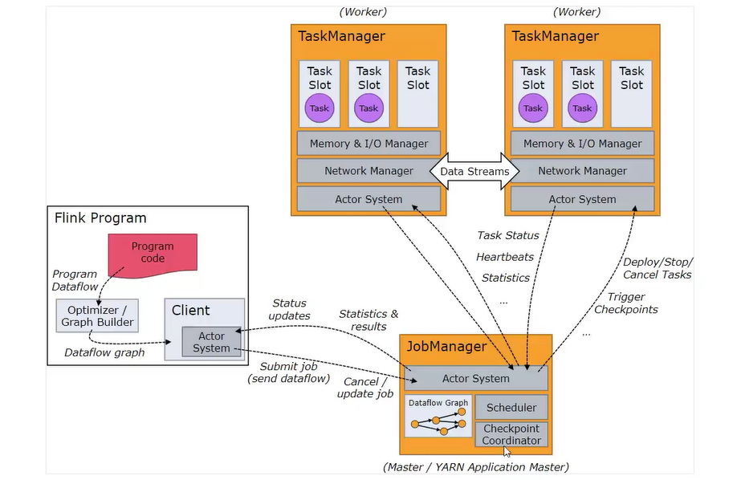

Checkpoint,就是流式程序中用来做容错的机制

它是通过JobManager的检查点协调器(checkpoint coordinator)来协调工作的

### 2.2 checkpoint的执行流程

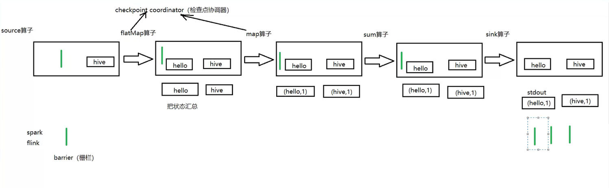

执行流程参考如下:

1.checkpoint coordinator(检查点协调器) 会周期性发送一个个的barrier(栅栏),这个barrier会随着数据流,流向source算子

2.算子在处理时,如果发现是barrier(栅栏),那么这个算子就会停下手里的工作,把状态向 checkpoint coordinator 进行状态的汇报

3.在状态汇报完之后,barrier就会随着数据流继续往下游传递

4.下游的算子在碰到barrier后,会重复上面的流程

5.以此类推,直到所有算子的状态都汇报完成,这一轮的checkpoint(快照)就做完了

6.如果中间出现状态汇报失败等各种情况,说明这一轮的checkpoint制作失败,会等待下一轮的checkpoint快照制作

### 2.3 Restart Strategy (重启策略)

Flink的重启策略有四种,分别是:

- noRestart(不重启)
- fixedDelayRestart(固定延迟重启)
- failureRateRestart(失败率重启)
- exponentialDelayRestart(指数延迟重启)

#### 2.3.1 不重启

如果程序出错了,那就停止

如果checkpoint关闭,那么默认就是不重启策略

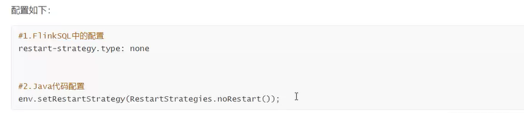

#### 2.3.2 固定延迟重启

运行流式程序固定能够重启的次数,比如5次

如果checkpoint开启,默认的重启的次数就是整形的最大值 (Integer.MAX_VALUE)

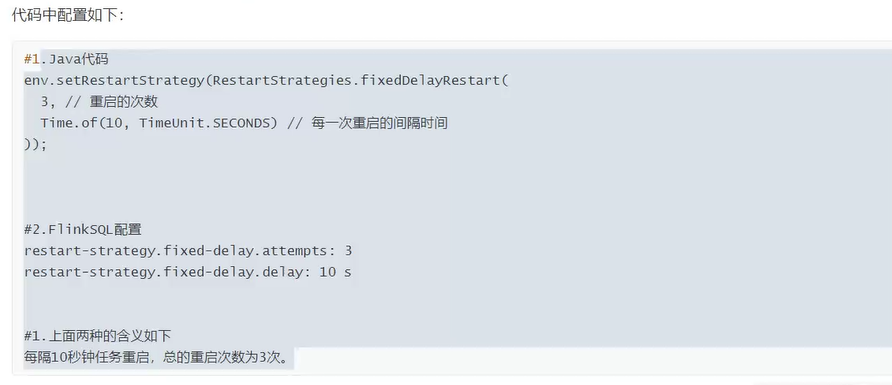

#### 2.3.3 失败率重启

在一定的时间范围内,运行任务失败的频率,比如: 1分钟允许失败3次

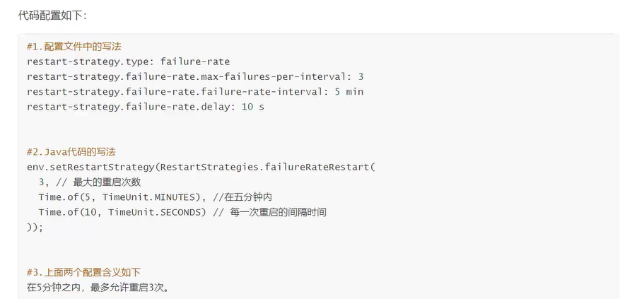

#### 2.3.4 指数延迟重启

每一次的重启会随着指数的递增而递增  2 4 16

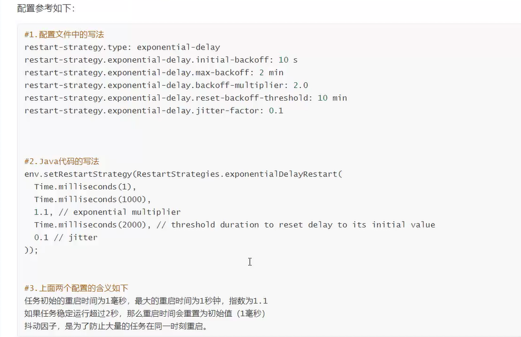

> 只开启 重启策略 不会读取历史状态  每次重启都会重新计数
>
> 开启了状态后端 每次重启  才会根据历史数据重新计算
>
> 
>
> 工作中,一般使用固定延迟重启或者失败率重启

### 2.4 StateBackend (状态后端)

状态后端,就是专门用来保存checkpoint coordinator (检查点协调器)快照数据的

默认情况下,它保存在JobManager的内存里,很显然,这种方式不太好

Flink提供了3种状态后端的保存方式:

- memoryStateBackend(内存状态后端)
- FsStateBackend(文件系统状态后端)
- RocksDBStateBackend(RocksDB数据库状态后端)

2.4.1 memoryStateBackend

统一全局快照数据保存在JobManager的内存种,这种方式几乎不用

从节点算子的状态保存在TaskManager的内存中

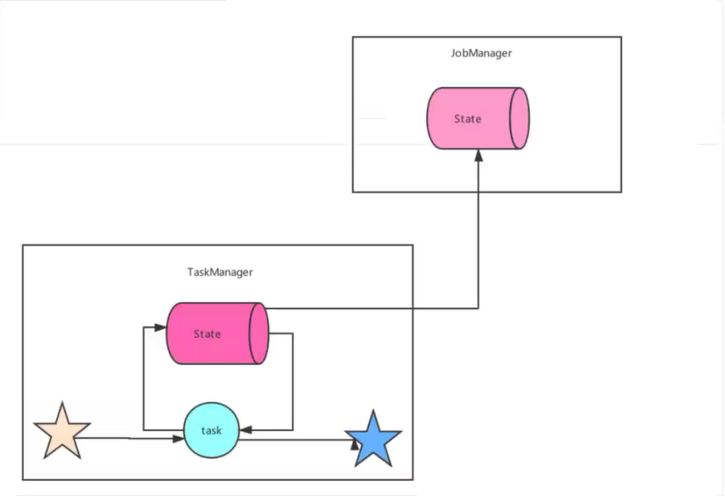

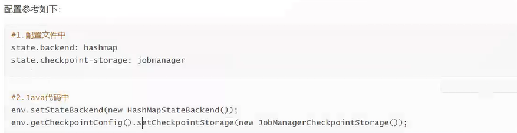

#### 2.4.2 FsStateBackend

统一全局快照数据保存在文件系统中,比如: HDFS

从节点算子的状态保存在TaskManager的内存中

整体比较安全,这也是推荐的状态后端保存方式

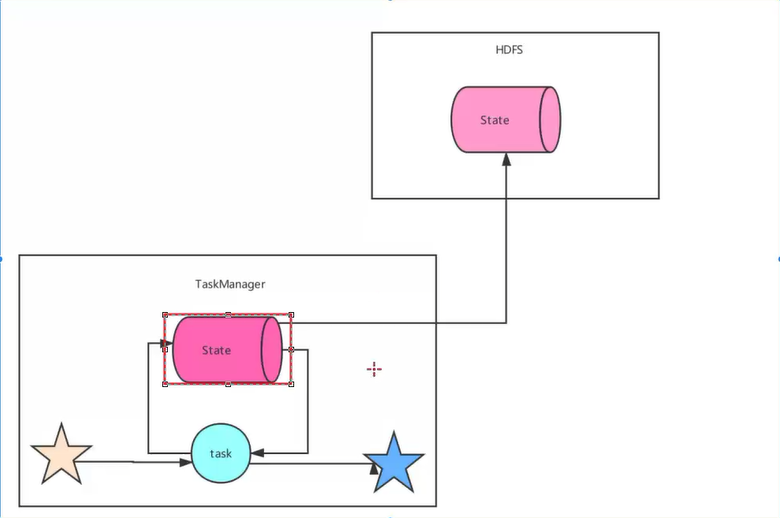

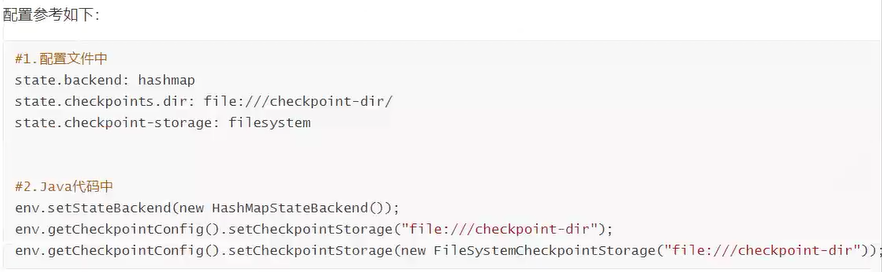

#### 2.4.3 RocksDBStateBackend

这是一种可以保存超大状态的状态后端,也是唯一一个可以支持增量状态的保存的状态后端,一般用的不多

RocksDB: 是一个本地的数据库,这个数据库就在TaskManager

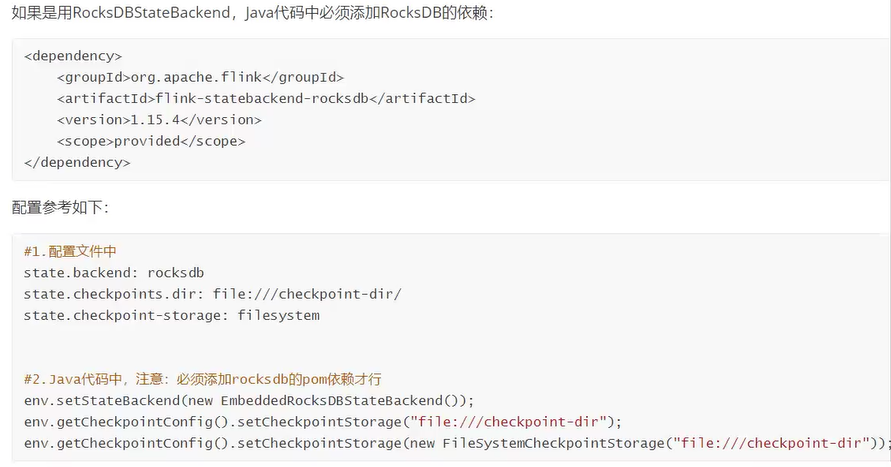

> 小结:
>
> 在公司中,一般使用FsStateBackend就够了

案例中checkpoint的配置

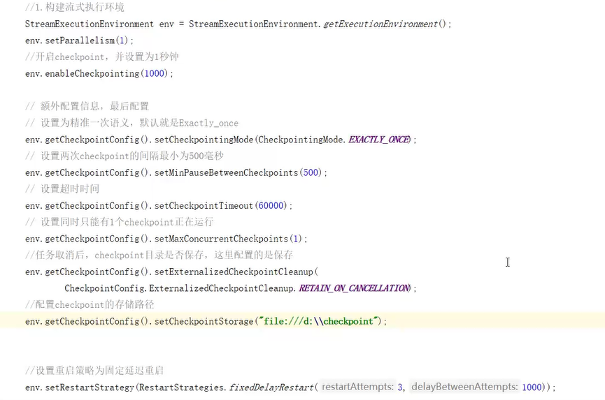

## 1.今日下午内容介绍

- Flink SQL
  - connector (连接器)
  - format(数据格式)
  - watermark(水印)
  - 常规操作
  - join操作(难点)
  - 集合,explain,show