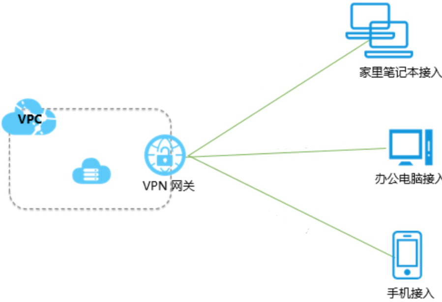
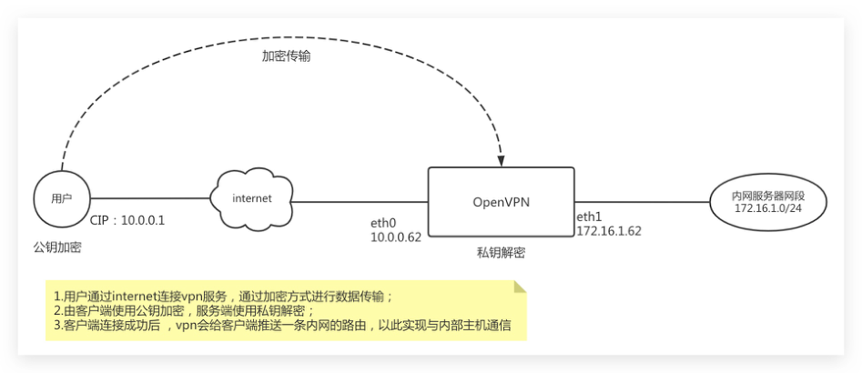
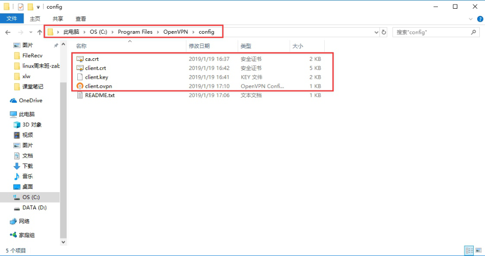
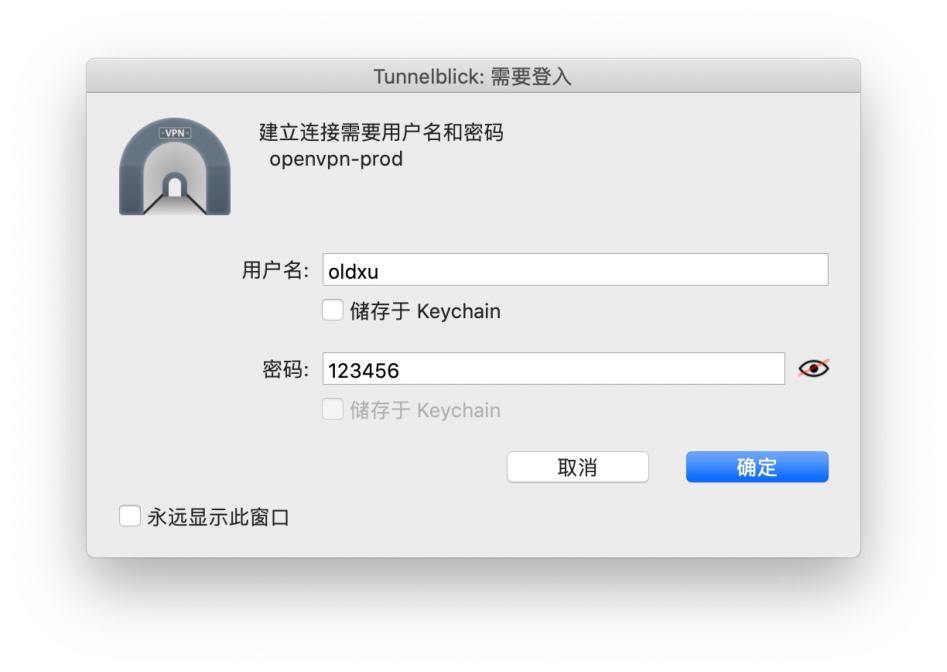

# 03 OpenVPN虚拟⽹络实战

## 目录

- [1.VPN基本介绍](#1.vpn基本介绍)
  - [1.1 什么是VPN](#1.1-什么是vpn)
  - [1.2 VPN应⽤场景](#1.2-vpn应场景)
    - [1.2.1 点对点连接](#1.2.1-点对点连接)
    - [1.2.2 站点对站点](#1.2.2-站点对站点)
    - [1.2.3 远程访问](#1.2.3-远程访问)
- [2.OpenVPN基本介绍](#2.openvpn基本介绍)
  - [2.1 什么是OpenVPN](#2.1-什么是openvpn)
  - [2.2 OpenVPN应⽤场景](#2.2-openvpn应场景)
  - [2.3 OpenVPN实现场景](#2.3-openvpn实现场景)
- [3.OpenVPN证书配置](#3.openvpn证书配置)
  - [3.1 安装easy-rsa](#3.1-安装easy-rsa)
  - [3.2 创建证书⽂件](#3.2-创建证书件)
    - [3.2.1 初始化PKI](#3.2.1-初始化pki)
    - [3.2.2 创建CA机构](#3.2.2-创建ca机构)
    - [3.2.3 签发服务端证书](#3.2.3-签发服务端证书)
    - [3.2.4 创建DH密钥](#3.2.4-创建dh密钥)
    - [3.2.5 签发客户端证书](#3.2.5-签发客户端证书)
- [4.OpenVPN服务安装](#4.openvpn服务安装)
  - [4.1 安装Openvpn服务](#4.1-安装openvpn服务)
  - [4.2 配置openvpn服务](#4.2-配置openvpn服务)
  - [4.3 拷⻉服务端证书⽂件](#4.3-拷服务端证书件)
  - [4.4 开启内核转发参数](#4.4-开启内核转发参数)
  - [4.5 启动openvpn服务](#4.5-启动openvpn服务)
- [5.OpenVPN客户端](#5.openvpn客户端)
  - [5.1 客户端连接Linux](#5.1-客户端连接linux)
- [1.端安装 openvpn](#1.端安装-openvpn)
- [2.下载客户端公钥与私钥以及Ca证书⾄客户端](#2.下载客户端公钥与私钥以及ca证书客户端)
  - [5.2 客户端连接Windows](#5.2-客户端连接windows)
  - [5.3 客户端接⼊MACOS](#5.3-客户端接macos)
- [1.下载服务端准备的客户端密钥⽂件和ca⽂件⾄本地](#1.下载服务端准备的客户端密钥件和ca件本地)
- [6.OpenVPN访问内部⽹段](#6.openvpn访问内部段)
  - [6.1 内部节点⽆法正常访问](#6.1-内部节点法正常访问)
  - [6.2 在节点上添加主机路由](#6.2-在节点上添加主机路由)
    - [10.8.0.6:63380 ESTABLISHED](#10.8.0.663380-established)
  - [6.2 配置路由器路由条⽬（公有云）](#6.2-配置路由器路由条公有云)
  - [6.3 配置NAT地址替换（虚拟机）](#6.3-配置nat地址替换虚拟机)
- [7.OpenVPN基于⽤户密码认证](#7.openvpn基于户密码认证)
  - [7.1 为何需要⽤户密码](#7.1-为何需要户密码)
  - [7.2 OpenVPN服务端配置](#7.2-openvpn服务端配置)
    - [7.2.1 修改服务端配置](#7.2.1-修改服务端配置)
    - [7.2.2 创建⾃定义脚本](#7.2.2-创建定义脚本)
    - [7.2.3 创建⽤户密码⽂件](#7.2.3-创建户密码件)
    - [7.2.4 重启OpenVPN服务](#7.2.4-重启openvpn服务)
  - [7.3 OpenVPN客户端配置](#7.3-openvpn客户端配置)
    - [7.3.1 修改客户端配置](#7.3.1-修改客户端配置)
    - [7.3.2 客户端重新登陆](#7.3.2-客户端重新登陆)

战

# 03 OpenVPN虚拟⽹络实战

```
3.1 安装easy-rsa
```
徐亮伟, 江湖⼈称标杆徐。多年互联⽹运维⼯作经验，曾 负责过⼤规模集群架构⾃动化运维管理⼯作。擅⻓Web集 群架构与⾃动化运维，曾负责国内某⼤型电商运维⼯作。 个⼈博客"徐亮伟架构师之路"累计受益数万⼈。 笔者 Q:552408925、572891887 架构师群:471443208

## 1.VPN基本介绍

### 1.1 什么是VPN

VPN（Virtual Private Network） 翻译过来就是虚拟 专⽤⽹络，那虚拟专⽤⽹提供什么功能 1、将两个或多个“不同地域“的⽹络通过⼀条虚拟隧道的⽅ 式连接起来，实现互通； 2、在不安全的线路上提供安全的数据传输；

### 1.2 VPN应⽤场景

#### 1.2.1 点对点连接

Peer-to-Peer VPN (点对点连接)，将 Internet两台机 器（公⽹地址）使⽤VPN连接起来，⽐如上海服务器和北 京服务器的之间的数据需要相互调⽤，但是数据⼜⽐较敏 感，直接通过http公共⽹络传输，容易被窃取。如果拉⼀ 条专线成本⼜太⾼。 所以我们可以通过VPN将两台主机逻辑上捆绑在⼀个虚拟 ⽹络中，这样既保证了数据传输安全，同时⼜节省了成 本。


#### 1.2.2 站点对站点

SIte-to-Site VPN (站点对站点连接) ，⽤于连接两个或 者多个地域上不同的局域⽹LAN，每个LAN有⼀台 OpenVPN服务器作为接⼊点，组成虚拟专⽤⽹络，使得不 同LAN⾥⾯的主机和服务器都能够相互通讯。（⽐如国内 公司与海外公司分公司的连接）


#### 1.2.3 远程访问

Remote AccessVPN（远程访问），应⽤于外⽹⽤户访问 内部资源。在这个场景中远程访问者⼀般通过公⽹IP连 接VPN服务，然后通过分配后的内⽹地址与其内⽹⽹段进 ⾏通信。



## 2.OpenVPN基本介绍

### 2.1 什么是OpenVPN

OpenVPN就像它的名字⼀样，是⼀个开源的软件，且提供 VPN 虚拟专⽤⽹络功能； 1、⽀持 SSL/TLS协议，使得数据传输更安全； 2、⽀持TCP、UDP隧道； 3、⽀持动态分配虚拟 IP 地址； 4、⽀持数百甚⾄数千⽤户同时使⽤； 5、⽀持⼤多数主流操作系统平台；

```
OpenVPN官⽹：https://openvpn.net
GitHub地址：https://github.com/OpenVPN/openvpn

### 2.2 OpenVPN应⽤场景

场景1：拨⼊OpenVPN，然后连接内部服务器； 场景2：实现两个不同地域主机、且两个地域主机IP不固 定，互连互通；

### 2.3 OpenVPN实现场景



## 3.OpenVPN证书配置

## 3.1 安装easy-rsa

1.为了保证 OpenVPN 数据传输安全，所以需要证书，可以通 过 easy-rsa ⼯具创建相关证书

[root@vpn ~]# yum install easy-rsa -y
```
2.创建证书前，需要拷⻉配置⽂件，以及 vars ⽂件，定义证 书相关的属性

```
[root@open ~]# mkdir /opt/easy-rsa
[root@open ~]# cd /opt/easy-rsa/
[root@vpn easy-rsa]# cp -a /usr/share/easy-
rsa/3/* ./
[root@vpn easy-rsa]# cp -a /usr/share/doc/easy-
rsa-*/vars.example ./vars
[root@vpn easy-rsa]# cat vars
if [ -z "$EASYRSA_CALLER" ];
then

echo "You appear to be sourcing an

Easy-RSA 'vars' file." >&2
echo "This is no longer necessary and
is disallowed. See the section called" >&2
echo "'How to use this file' near the
top comments
for more details." >&2
        return 1
fi
set_var EASYRSA_CA_EXPIRE 3650
```
#证书有效期

```
set_var EASYRSA_CERT_EXPIRE 3650
```
服务端证书有效期，默为825天

```
set_var EASYRSA_DN  "cn_only"
set_var EASYRSA_REQ_COUNTRY "CN"
```
#所在的国家

```
set_var EASYRSA_REQ_PROVINCE "Beijing"
```
#所在的省份

```
set_var EASYRSA_REQ_CITY "Beijing"
```
#所在的城市

```
set_var EASYRSA_REQ_ORG "oldxu"
```
#所在的组织

```
set_var EASYRSA_REQ_EMAIL
"xuliangwei@foxmail.com"  #邮箱的地址
set_var EASYRSA_NS_SUPPORT "yes"
```
### 3.2 创建证书⽂件

#### 3.2.1 初始化PKI

初始化，在当前⽬录创建PKI⽬录，⽤于存储证书

```
[root@vpn easy-rsa]# ./easyrsa init-pki
```
#### 3.2.2 创建CA机构

创建`ca`证书，主要对后续创建的`server、client`证书 进⾏签名；会提示设置密码，其他可默认

```
[root@vpn easy-rsa]# ./easyrsa build-ca
```
#### 3.2.3 签发服务端证书

1.创建 server 端证书，nopass表示不加密私钥⽂件，其他 可默认

```
[root@vpn easy-rsa]# ./easyrsa gen-req server
```
nopass

Keypair and certificate request completed. Your

```
files are:
req: /opt/easy-rsa/pki/reqs/server.req
```
请求⽂件

```
key: /opt/easy-rsa/pki/private/server.key
```
私钥 2.给 server 端证书签名，⾸先是对信息的确认，可以输 ⼊yes，然后输⼊创建ca根证书时设置的密码 # 第⼀个server是类型 # 第⼆个server是req请求⽂件名称

```
[root@open easy-rsa]# ./easyrsa sign server
```
server

```
Certificate created at: /opt/easy-
rsa/pki/issued/server.crt     # 公钥
```
#### 3.2.4 创建DH密钥

Diffie-Hellman 是⼀种安全协议；让双⽅在完全没有对⽅ 任何信息情况下通过不安全信道建⽴⼀个密钥； 这个密钥⼀ 般作为 “对称加密” 的密钥⽽被双⽅在后续数据传输中使⽤；

```
[root@vpn easy-rsa]# ./easyrsa gen-dh
```
DH parameters of size 2048 created at

```
/opt/easy-rsa/pki/dh.pem
```
#### 3.2.5 签发客户端证书

1.创建client端私钥⽂件，nopass 表示不加密私钥⽂件， 其他可默认

```
[root@open easy-rsa]# ./easyrsa gen-req client
```
nopass

Keypair and certificate request completed. Your

```
files are:
req: /opt/easy-rsa/pki/reqs/client.req      #
```
请求⽂件

```
key: /opt/easy-rsa/pki/private/client.key   #
```
私钥⽂件 2.给 client 端证书签名，⾸先是对信息的确认，可以输⼊ yes，然后创建ca根证书时设置的密码

第⼀个client是类型 # 第⼆个client是req请求⽂件名称

```
[root@open easy-rsa]# ./easyrsa sign client
```
client

```
Certificate created at: /opt/easy-
rsa/pki/issued/client.crt     # 客户端公钥
```
## 4.OpenVPN服务安装

### 4.1 安装Openvpn服务

```
[root@vpn ~]# ntpdate time.windows.com      #
```
⼀定要同步时间

```
[root@vpn ~]# yum install ntpdate openvpn -y
```
### 4.2 配置openvpn服务

```
[root@vpn ~]# vim /etc/openvpn/server.conf
port 1194                               #端⼝
proto tcp                               #协议
dev tun                                 #采⽤路
```

由隧道模式tun

```
ca ca.crt                               #ca证书
```

⽂件位置

```
cert server.crt                         #服务端
```

公钥名称

```
key server.key                          #服务端
```

私钥名称

```
dh dh.pem                               #交换证
```

书

```
server 10.8.0.0 255.255.255.0           #给客户
```

端分配地址池，注意：不能和VPN服务器内⽹⽹段有相同

```
push "route 172.16.1.0 255.255.255.0"   #允许客
```
户端访问内⽹172.16.1.0⽹段

```
# push "redirect-gateway def1"
# push "dhcp-option DNS 8.8.8.8"
ifconfig-pool-persist ipp.txt           #地址池

记录⽂件位置

```
keepalive 10 120                        #存活时
```

间，10秒ping⼀次,120 如未收到响应则视为断线

max-clients 100                         #最多允
```
许100个客户端连接

```
status openvpn-status.log               #⽇志记
```
录位置 verb 3 #openvpn版本

```
client-to-client                        #客户端
```
与客户端之间⽀持通信

```
log /var/log/openvpn.log
```
#openvpn⽇志记录位置 persist-key     #通过keepalive检测超时后，重新启动 VPN，不重新读取keys，保留第⼀次使⽤的keys。

persist-tun     #检测超时后，重新启动VPN，⼀直保持 tun是linkup的。否则⽹络会先linkdown然后再linkup

```
duplicate-cn
```
### 4.3 拷⻉服务端证书⽂件

# 将服务端证书拷⻉⾄ `/etc/openvpn` ⽬录下

```
[root@vpn ~]# cp /opt/easy-rsa/pki/ca.crt
/etc/openvpn/
[root@vpn ~]# cp /opt/easy-rsa/pki/dh.pem
/etc/openvpn/
[root@vpn ~]# cp /opt/easy-
rsa/pki/issued/server.crt /etc/openvpn/
[root@vpn ~]# cp /opt/easy-
rsa/pki/private/server.key /etc/openvpn/
```
### 4.4 开启内核转发参数

# 必须开启内核转发功能

```
[root@open ~]# echo "net.ipv4.ip_forward = 1"
>> /etc/sysctl.conf
[root@vpn ~]# sysctl -p
```
### 4.5 启动openvpn服务

```
[root@vpn ~]# systemctl enable openvpn@server
[root@vpn ~]# systemctl start openvpn@server
```
## 5.OpenVPN客户端

### 5.1 客户端连接Linux

## 1.端安装 openvpn

```
[root@openvpn-client ~]# yum install openvpn -y
```
## 2.下载客户端公钥与私钥以及Ca证书⾄客户端

```
[root@openvpn-client ~]# cd /etc/openvpn/
[root@openvpn-client openvpn]# scp
root@172.16.1.60:/opt/easy-rsa/pki/ca.crt ./
[root@openvpn-client openvpn]# scp
root@172.16.1.60:/opt/easy-
rsa/pki/issued/client.crt ./
[root@openvpn-client openvpn]# scp
root@172.16.1.60:/opt/easy-
rsa/pki/private/client.key ./
```
3.客户端有了公钥和私钥后，还需要准备对应的客户端配置⽂ 件

```
[root@openvpn-client ~]# cat
/etc/openvpn/clinet.ovpn
```
client                  #指定当前VPN是客户端 dev tun                 #使⽤tun隧道传输协议 proto tcp               #使⽤udp协议传输数据 remote 10.0.0.60 1194   #openvpn服务器IP地址端⼝ 号 resolv-retry infinite   #断线⾃动重新连接，在⽹络不 稳定的情况下⾮常有⽤ nobind                  #不绑定本地特定的端⼝号 ca ca.crt               #指定CA证书的⽂件路径 cert client.crt         #指定当前客户端的证书⽂件路 径 key client.key          #指定当前客户端的私钥⽂件路 径 verb 3                  #指定⽇志⽂件的记录详细级 别，可选0-9，等级越⾼⽇志内容越详细 persist-key     #通过keepalive检测超时后，重新启动 VPN，不重新读取keys，保留第⼀次使⽤的keys persist-tun     #检测超时后，重新启动VPN，⼀直保持 tun是linkup的。否则⽹络会先linkdown然后再linkup

```
[root@openvpn-client ~]# openvpn --daemon --cd
/etc/openvpn --config client.ovpn --log-append
/var/log/openvpn.log
```
# --daemon：openvpn以daemon⽅式启动。 # --cd dir：配置⽂件的⽬录，openvpn初始化前，先切换到 此⽬录。 # --config file：客户端配置⽂件的路径。 # --log-append file：⽇志⽂件路径，如果⽂件不存在会⾃ 动创建。

### 5.2 客户端连接Windows

```
openvpn for windows客户端下载地址、openvpn-2.4.11- Win7.exe、openvpn-2.4.11-Win10.exe 1.下载服务端准备的客户端密钥⽂件和ca⽂件⾄ C:\Program Files\OpenVPN\config ⽬录中
[root@openvpn ~]# sz /opt/easy-rsa/pki/ca.crt
[root@openvpn ~]# sz /opt/easy-
rsa/pki/issued/client.crt
[root@openvpn ~]# sz /opt/easy-
rsa/pki/private/client.key
```
2.在 C:\Program Files\OpenVPN\config 创建⼀个客户端 配置⽂件，名称叫client.ovpn

client                  #指定当前VPN是客户端 dev tun                 #使⽤tun隧道传输协议 proto tcp               #使⽤udp协议传输数据 remote 10.0.0.60 1194   #openvpn服务器IP地址端⼝ 号 resolv-retry infinite   #断线⾃动重新连接，在⽹络不 稳定的情况下⾮常有⽤ nobind                  #不绑定本地特定的端⼝号 ca ca.crt               #指定CA证书的⽂件路径 cert client.crt         #指定当前客户端的证书⽂件路 径 key client.key          #指定当前客户端的私钥⽂件路 径 verb 3                  #指定⽇志⽂件的记录详细级 别，可选0-9，等级越⾼⽇志内容越详细 persist-key     #通过keepalive检测超时后，重新启动 VPN，不重新读取keys，保留第⼀次使⽤的keys persist-tun     #检测超时后，重新启动VPN，⼀直保持 tun是linkup的。否则⽹络会先linkdown然后再linkup



4.登陆成功后，通过 windows 查看 openvpn 服务推送过来 的路由信息； # windows查看推送过来的路由信息

```
route print -4
```
### 5.3 客户端接⼊MACOS

openvpn
```
for MacOS 客户端下载地 址、Tunnelblick_3.8.5.dmg
```
## 1.下载服务端准备的客户端密钥⽂件和ca⽂件⾄本地

```
[root@openvpn ~]# sz /opt/easy-rsa/pki/ca.crt
[root@openvpn ~]# sz /opt/easy-
rsa/pki/issued/client.crt
[root@openvpn ~]# sz /opt/easy-
rsa/pki/private/client.key
```
2.创建⼀个客户端配置⽂件，名称叫client.ovpn client                  #指定当前VPN是客户端 dev tun                 #使⽤tun隧道传输协议 proto tcp               #使⽤udp协议传输数据 remote 10.0.0.60 1194   #openvpn服务器IP地址端⼝ 号 resolv-retry infinite   #断线⾃动重新连接，在⽹络不 稳定的情况下⾮常有⽤ nobind                  #不绑定本地特定的端⼝号 ca ca.crt               #指定CA证书的⽂件路径 cert client.crt         #指定当前客户端的证书⽂件路 径 key client.key          #指定当前客户端的私钥⽂件路 径 verb 3                  #指定⽇志⽂件的记录详细级 别，可选0-9，等级越⾼⽇志内容越详细 persist-key     #通过keepalive检测超时后，重新启动 VPN，不重新读取keys，保留第⼀次使⽤的keys persist-tun     #检测超时后，重新启动VPN，⼀直保持 tun是linkup的。否则⽹络会先linkdown然后再linkup 3.将所有⽂件存储到⼀个⽂件夹中，并命名后缀为tblk格 式，效果如下图所示：


## 6.OpenVPN访问内部⽹段

### 6.1 内部节点⽆法正常访问

抓包分析数据包能抵达 openvpn 的内⽹地址，但⽆法与 OpenVPN服务同内⽹⽹段主机进⾏通信； 因为后端主机没有去往 10.8.0.0 ⽹段的路由，所以数据 包⽆法原路返回，最终造成⽆法 ping 通

```
[root@windows ~]# ping 172.16.1.7
Request timeout
for icmp_seq 0
Request timeout
for icmp_seq 1
```
#在后端的主机上抓包分析，发现能接收到数据包，但没有回去 的路由所以⽆法通信

```
[root@web01 ~]# tcpdump -i eth1 -nn -p icmp
tcpdump: listening on eth1, link-type EN10MB
(Ethernet), capture size 262144 bytes
10.8.0.6 > 172.16.1.7: ICMP
echo request,
```
id 3437, seq 3, length

```
10.8.0.6 > 172.16.1.7: ICMP
echo request,
```
id 3437, seq 4, length

```
10.8.0.6 > 172.16.1.7: ICMP
echo request,
```
id 3437, seq 5, length 64 解决此问题有如下⼏种⽅式： ⽅式1：在每台节点添加⼀条路由，下⼀跳为 Openvpn 节点； ⽅式2：在所有内⽹主机的默认路由器上添加⼀条路 由，下⼀跳为 Openvpn 节点； ⽅式3：配置iptables、firewalld的NAT规则

### 6.2 在节点上添加主机路由

1、在后端主机添加抵达去往 10.8.0.0/24 ⽹段的⾛ openvpn 的内⽹地址进⾏路由（原理如下图）

```
[root@web01 ~]# route add -net 10.8.0.0/24 gw
```
172.16.1.62

```
[root@web01 ~]# route -n
```
Kernel IP routing table Destination     Gateway         Genmask Flags Metric Ref    Use Iface 10.8.0.0        172.16.1.62      255.255.255.0 UG    0      0        0 eth1 2、添加完路由后，继续 ping 该节点，在抓包查看

```
[root@web01 ~]# tcpdump -i eth1 -nn -p icmp
17:51:36.053959 IP 172.16.1.7 > 10.8.0.6: ICMP
echo reply, id 1, seq 420, length
17:51:37.057545 IP 10.8.0.6 > 172.16.1.7: ICMP
echo request, id 1, seq 421, length 40 3、通过vpn连接内⽹服务器，检查内⽹服务器与哪个IP建⽴ 连接（会发现是真实的VPN客户端节点）；
[root@web01 ~]# netstat -an | grep -i estab
Active Internet connections (servers and
established)
tcp        0      0 172.16.1.91:22
#### 10.8.0.6:63380          ESTABLISHED
```

### 6.2 配置路由器路由条⽬（公有云）

如上的配置需要在所有后端主机添加，如果机器量过多，那 么添加起来⾮常的麻烦； 1.建议使⽤在出⼝路由器上添加该路由规则条⽬；

### 6.3 配置NAT地址替换（虚拟机）

如上的配置需要在所有后端主机添加，如果机器量过多，那 么添加起来⾮常的麻烦； 1.可以在VPN节点上增加防⽕墙规则配置；

```
Iptables
[root@vpn ~]# iptables -t nat -A POSTROUTING -s
10.8.0.0/24 -o eth1 -j MASQUERADE   # ⾃动
[root@vpn ~]# iptables -t nat -A POSTROUTING -s
10.8.0.0/24 -o eth1 -j SNAT --to 172.16.1.62
```
# Firewalld
```
[root@open ~]# systemctl start firewalld
[root@open ~]# firewall-cmd --add-
service=openvpn --permanent
[root@open ~]# firewall-cmd --add-masquerade --

permanent

[root@open ~]# firewall-cmd --reload
```
2.通过vpn连接内⽹服务器，检查内⽹服务器与哪个IP建⽴连 接（会发现是SNAT后的内⽹IP）；

```
[root@web01 ~]# netstat -an |grep -i
```
established

```
Active Internet connections (servers and
established)
tcp        0      0 172.16.1.7:22
 172.16.1.60:64852        ESTABLISHED
```
## 7.OpenVPN基于⽤户密码认证

### 7.1 为何需要⽤户密码

我们⽬前使⽤密钥进⾏加密传输，可以说已经很安全了，为 什么还要需要⽤户名秘密呢。 1、⾸先管理这些秘钥和证书⽐较麻烦，如果⽤户⽐较 多，单独为每个⽤户都创建⼀套秘钥⽐较麻烦； 2、其次多⼈使⽤同⼀秘钥⼜不具有唯⼀性，⽐如说有⽤ 户不在需要VPN的时候，我们就需要吊销证书，如果多⼈ 使⽤⼀个秘钥的情况下，吊销证书会造成其他⽤户也⽆法 正常登录。 所以就需要秘钥加⽤户名密码，这样就可以实现多个⽤户使 ⽤同⼀个证书，使⽤不同的⽤户名和密码； 当有新⽤户加⼊ 时，只需要添加⼀个⽤户名和密码即可，如果不需要使⽤， 则删除⽤户名和密码即可；

### 7.2 OpenVPN服务端配置

#### 7.2.1 修改服务端配置

添加如下三⾏代码，使其服务端⽀持密码认证⽅式

```
[root@web01 ~]# vim /etc/openvpn/server.conf
```
script-security 3       # 允许使⽤⾃定义脚本

```
auth-user-pass-verify /etc/openvpn/check.sh
```
via-env # ⾃定义脚本路径 username-as-common-name # ⽤户密码登陆⽅式验证

表示只使⽤⽤户名密码⽅式验证，不加该参数，则代表需要证 书、⽤户名、密码多重验证登录

```
# client-cert-not-required
```

#### 7.2.2 创建⾃定义脚本

粘贴如下配置

```
[root@open ~]# vim /etc/openvpn/check.sh
#!/bin/sh
###############################################
############
PASSFILE="/etc/openvpn/openvpnfile"
LOG_FILE="/var/log/openvpn-password.log"
TIME_STAMP=`date "+%Y-%m-%d %T"`
if [ ! -r "${PASSFILE}" ];
then
    echo "${TIME_STAMP}: Could not open
password file \"${PASSFILE}\"
for reading." >>
${LOG_FILE}

exit 1
fi

CORRECT_PASSWORD=`awk
'!/^;/&&!/^#/&&$1=="'${username}'"{print
$2;exit}' ${PASSFILE}`
if [ "${CORRECT_PASSWORD}" = "" ];
then
    echo "${TIME_STAMP}: User does not exist:
username=\"${username}\",
password=\"${password}\"." >> ${LOG_FILE}

exit 1
fi

if [ "${password}" = "${CORRECT_PASSWORD}" ];
then
    echo "${TIME_STAMP}: Successful
authentication: username=\"${username}\"." >>
${LOG_FILE}
```
exit 0
```
fi
echo "${TIME_STAMP}: Incorrect password:
username=\"${username}\",
password=\"${password}\"." >> ${LOG_FILE}
```
exit

为脚本增加执⾏权限

```
[root@open ~]# chmod +x /etc/openvpn/check.sh
```
#### 7.2.3 创建⽤户密码⽂件

创建 `check.sh` 脚本中定义 `openvpn` 使⽤的⽤户和 密码认证⽂件

```
[root@open ~]# cat > /etc/openvpn/openvpnfile
<<EOF
```
oldxu 123456     # 前⾯是⽤户名称，后⾯是密码 EOF

#### 7.2.4 重启OpenVPN服务

```
[root@open ~]# systemctl restart openvpn@server
```
### 7.3 OpenVPN客户端配置

#### 7.3.1 修改客户端配置

修改客户端配置⽂件，增加如下代码，使其⽀持⽤户名/密码 与服务器进⾏身份验证； auth-user-pass #⽤户密码认证

#### 7.3.2 客户端重新登陆


