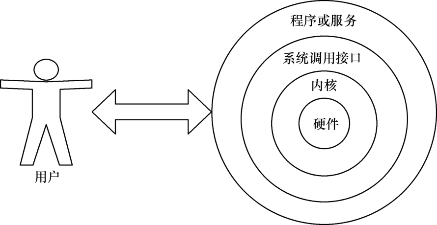

# 01 Shell脚本基础与变量

## 目录

- [1.Shell脚本概述](#1.shell脚本概述)
  - [1.1.什么是shell](#1.1.什么是shell)
  - [1.2.什么是shell脚本](#1.2.什么是shell脚本)
  - [1.3.Shell脚本能做什么](#1.3.shell脚本能做什么)
  - [1.4 Shell脚本预备知识](#1.4-shell脚本预备知识)
    - [1.4.1 学习shell脚本预备知识](#1.4.1-学习shell脚本预备知识)
    - [1.4.2 如何才能学好shell脚本](#1.4.2-如何才能学好shell脚本)
  - [1.5 Shell脚本抒写方式](#1.5-shell脚本抒写方式)
    - [1.5.1 Shell脚本命名规范](#1.5.1-shell脚本命名规范)
    - [1.5.2 Shell脚本格式申明](#1.5.2-shell脚本格式申明)
    - [1.5.3 Shell脚本#号的使用](#1.5.3-shell脚本号的使用)
    - [1.5.4 自动添加Shell的首部](#1.5.4-自动添加shell的首部)
- [2.Shell变量](#2.shell变量)
  - [2.1 什么是变量](#2.1-什么是变量)
  - [2.2 变量命名规范](#2.2-变量命名规范)
  - [2.3 变量定义方式](#2.3-变量定义方式)
    - [2.3.1 用户自定义变量](#2.3.1-用户自定义变量)
    - [2.3.2 系统环境变量](#2.3.2-系统环境变量)
    - [2.3.3 位置参数变量](#2.3.3-位置参数变量)
- [1.编写脚本](#1.编写脚本)
- [2.执行脚本（发现第一个参数11、第二个参数22、第三](#2.执行脚本发现第一个参数11第二个参数22第三)
    - [2.3.4 特殊参数变量](#2.3.4-特殊参数变量)
    - [2.3.5 参数场景示例](#2.3.5-参数场景示例)
  - [2.4 read交互传递变量](#2.4-read交互传递变量)
    - [2.4.1 场景1-模拟登陆页面脚本](#2.4.1-场景1-模拟登陆页面脚本)
    - [2.4.2 场景2-系统备份脚本](#2.4.2-场景2-系统备份脚本)
    - [2.4.3 场景3-探测主机存活脚本](#2.4.3-场景3-探测主机存活脚本)
    - [2.4.4 场景4-修改主机名称脚本](#2.4.4-场景4-修改主机名称脚本)
  - [2.5 Shell变量删除](#2.5-shell变量删除)
    - [2.5.1 什么是变量删除](#2.5.1-什么是变量删除)
    - [2.5.2 为什么要用变量删除](#2.5.2-为什么要用变量删除)
    - [2.5.3 变量删除的几种方式](#2.5.3-变量删除的几种方式)
    - [2.5.4 变量删除语法示例](#2.5.4-变量删除语法示例)
    - [2.5.5 场景1-提取内存百分比脚本](#2.5.5-场景1-提取内存百分比脚本)
    - [2.5.6 场景2-为不同版本系统安装源](#2.5.6-场景2-为不同版本系统安装源)
  - [2.6 Shell变量替换](#2.6-shell变量替换)
    - [2.6.1 什么是变量替换](#2.6.1-什么是变量替换)
    - [2.6.2 变量替换的方式](#2.6.2-变量替换的方式)
    - [2.6.3 场景1-替换PATH变量](#2.6.3-场景1-替换path变量)
    - [2.6.4 场景2-字符串替换脚本](#2.6.4-场景2-字符串替换脚本)
  - [2.7 Shell变量运算](#2.7-shell变量运算)
    - [2.7.1 什么是变量运算](#2.7.1-什么是变量运算)
    - [2.7.2 为什么需要变量运算](#2.7.2-为什么需要变量运算)
    - [2.7.3 变量运算实现的方式](#2.7.3-变量运算实现的方式)
    - [2.7.4 场景1-根据当前时间计算明年时间](#2.7.4-场景1-根据当前时间计算明年时间)
    - [2.7.5 场景2-计算今年还剩下多少周](#2.7.5-场景2-计算今年还剩下多少周)

徐亮伟, 江湖人称标杆徐。多年互联网运维工作经 验，曾负责过大规模集群架构自动化运维管理工作。 擅长Web集群架构与自动化运维，曾负责国内某大型 电商运维工作。 个人博客"徐亮伟架构师之路"累计受益数万人。 笔者Q:552408925、572891887 架构师群:471443208

## 1.Shell脚本概述

### 1.1.什么是shell

Shell 是一个命令解释器，它在操作系统的最外层， 负责直接与用户进行对话，将用户输入的命令翻译给 操作系统，并将处理的结果输出至屏幕。



当然shell命令是存在 交互式、非交互式两种方式 交互：日常使用，登陆、执行命令、退出； 非交互：直接读取某个文件，文件从头执行到尾即 结束；

### 1.2.什么是shell脚本

1) 将系统命令堆积在一起，顺序执行(简称: 系统命令 堆积)

2) 特定的格式 + 特定的语法 + 系统的命令 = 文件

```
(Shell脚本文件)。 开头： #!/usr/bin/bash
```
语法：
```
if
for ....... awk,grep,sed,
```
### 1.3.Shell脚本能做什么

1.基础配置: 系统初始化操作、系统更新、内核调整、 网络、时区、SSH优化 2.安装程序: 部署LNMP、LNMT、MySQL、Nginx、 Redis、LVS、Keepalived等等 3.配置变更: Nginx Conf、PHP Conf、MySQL Conf、 Redis Conf 4.业务部署: Shell配合git、jenkins实现代码自动 化部署，以及代码回滚 5.日常备份: 使用Shell脚本对MySQL进行每晚的全备 与增量备份 6.信息采集: Zabbix + Shell，硬件、系统、服务、 网络、等等 7.日志分析: 取值->排序->去重->统计->分析 8.服务扩容: 扩容: 监控服务器集群cpu，如cpu负载 持续80% + 触发动作(脚本)，脚本: 调用api开通云主 机->初始化环境->加入集群->对外提供 9.服务缩容: 监控服务器集群cpu使用率，->低于20%- >检测当前有多少web节点->判断是否超过预设->缩减 到对应的预设状态->变更负载的配置 0.字符提取：比如nginx状态、php状态、格式化数据 等；

注意: Shell脚本主要的作用是简化操作步骤, 提高效 率，减少人为干预，减少系统故障

### 1.4 Shell脚本预备知识

#### 1.4.1 学习shell脚本预备知识

1、熟练使用vim编辑器 2、熟练使用linux基础命令 （awk,grep,wc,netstat,ps,lsof,find,） 3、熟练使用linux三剑客 注意: 如果我们对命令使用不够熟练、对基本服务也 不会手动搭建、那么一定学不会Shell

#### 1.4.2 如何才能学好shell脚本

1、基础命令+基础服务+练习+思路。  （必备） 2、能看懂Shell脚本->能修改Shell脚本-->能编写 Shell脚本-->能优化Shell脚本

### 1.5 Shell脚本抒写方式

#### 1.5.1 Shell脚本命名规范

名字要有意义，不要使用 a、b、c、1、2、3 这种方 式命名； 虽然 linux 系统中，文件没有扩展名的概念； 依然建议你用 .sh 结尾；

名称控制在30个字节以内。例如：

```
check_memory.sh
```
#### 1.5.2 Shell脚本格式申明

shell脚本开头必须指定脚本运行环境 以 # 这个特殊 符号组合来组成。 如： #!/bin/bash 指定该脚本是运行解析由

```
/bin/bash 来完成；
```
#### 1.5.3 Shell脚本#号的使用

```
 #!/bin/bash
 #Author: Oldxu
 #Created Time: 2021/11/01 12:00
 #Script Description: first shell study
script
```
#### 1.5.4 自动添加Shell的首部

```shell
[root@web01 ~]# cat ~/.vimrc
autocmd BufNewFile *.sh exec ":call
SetTitle()"
func SetTitle()
if expand("%:e") == 'sh'
call setline(1,"#!/bin/bash")
call
setline(2,"#*******************************
*************************************")
call setline(3,"#Author     : Oldxu")
call setline(4,"#Date       :
".strftime("%Y-%m-%d"))
call setline(5,"#FileName   :
".expand("%"))
call setline(6,"#Description: The test
script")

call

setline(7,"#*******************************
*************************************")
call setline(8,"")
endif endfunc autocmd BufNewFile * normal G
```
## 2.Shell变量

### 2.1 什么是变量

变量是shell中传递数据的一种方法。 简单理解: 就是用一个固定的字符串去表示不固定的 值，便于后续引用。

### 2.2 变量命名规范

变量定义命名：大写小写字母、下划线组成，尽量字 母开头。{注意: 变量名称最好具备一定含义} 变量定义语法: 变量名=变量值，等号是赋值，需要注 意: 等号两边不能有空格，其次定义的变量不要与系 统命令出现冲突。参考如下定义变量方式：

```
ip=10.0.0.100
ip1=10.0.0.100
Hostname_Ip=10.0.0.100
hostname_IP=10.0.0.100
system_cpu_load_avg1=w|awk '{print $1}'
system_cpu_load_avg5=w|awk '{print $2}'
system_cpu_load_avg15=w|awk '{print
$3}'
```
### 2.3 变量定义方式

1.用户自定义变量：人为定义变量名与变量的值。 2.系统环境变量：保存的是和系统操作环境相关的数 据，所有用户都可以使用。 3.位置参数变量：向脚本中进行参数传递，变量名不 能自定义，变量作用是固定的。 4.特殊参数变量：是Bash中已经定义好的变量，变量 名不能自定义，变量作用也是固定的。

#### 2.3.1 用户自定义变量

1) 定义变量，变量名=变量值。不能出现"-横岗"命名

```
[root@oldxu shell]# var="hello shell" #定义
变量有空格必须使用双引号 2) 引用变量，$变量名 或 ${变量名}
[root@oldxu shell]# echo $var
```
hello shell

```
[root@oldxu shell]# echo $var_log
[root@oldxu shell]# echo ${var}_log
hello shell_log
```
3) 注意事项，引用变量时注意事项，""双引号属于弱引 用，''单引号属于强引用

```
[root@oldxu shell]# var2=Iphone
[root@oldxu shell]# echo "$var2 is good"
```
Iphone is good

```
[root@oldxu shell]# echo '$var2 is good'
$var2 is good
```
如果有变量的情况下，建议增加双引号； # 如果存在特殊的字符，不希望被解析，这个时需要使用'' 或者转移字符；

#### 2.3.2 系统环境变量

1) 使用系统已定义好的环境变量；

```
[root@oldxu shell]# cat env.sh
#!/bin/bash
echo "用户的家目录: $HOME" echo "当前主机名是: $HOSTNAME" echo "当前所在目录: $PWD"
[root@oldxu shell]# sh env.sh
```
用户的家目录: /root 当前主机名是: docker01 当前所在目录: /shell # 场景：脚本只能root用户运行，非root拒绝运行； 2) 人为定义环境变量：export 变量，将自定义变量转 换成环境变量；

```
[root@oldxu shell]# var2=hello
[root@oldxu shell]# echo $var2
```
hello

```
[root@oldxu shell]# cat a.sh
#!/bin/bash
echo $var2
[root@oldxu shell]# sh a.sh   #执行a.sh 时，
```
会使用另一个bash去执行，就访问不到$VAR1的值

```
[root@oldxu shell]# export var2=hello #将变
```
量转为环境变量

```
[root@oldxu shell]# sh a.sh   #再次执行脚本
```
hello

#### 2.3.3 位置参数变量

位置参数顾名思义，就是传递给脚本参数的位置，例如 给一个脚本传递一个参数，我们可以在 Shell 脚本内部 获取传入的位置参数，获取参数的格式为：$n。n 代表 一个数字。 例如传递给脚本的第一个参数就为 $1，第 2 个参数就为 $2, 以此类推……，其中 $0 为该脚本的名称。

## 1.编写脚本

```
[root@oldxu shell]# cat args.sh
#!/bin/bash
echo "#当前shell脚本的文件名： $0" echo "#第1个shell脚本位置参数：$1" echo "#第2个shell脚本位置参数：$2" echo "#第3个shell脚本位置参数：$3" #创建用户，在执行脚本时传递对应的用户名称：
```
## 2.执行脚本（发现第一个参数11、第二个参数22、第三

个参数33、脚本名称args.sh）

```
[root@oldxu shell]# sh args.sh 11 22 33 44
```
当前shell脚本的文件名： args.sh 第1个shell脚本位置参数：11 第2个shell脚本位置参数：22 第3个shell脚本位置参数：33

#### 2.3.4 特殊参数变量

特殊参数： $#：传递给脚本或函数的参数个数总和； $*：传递给脚本或函数的所有参数，当被双引号 " " 包含时，所有的位置参数被看做一个字符串 $@：传递给脚本或函数的所有参数，当被双引号 " " 包含时，每个位置参数被看做独立的字符串 $?：上个命令的退出状态，或函数的返回值，0 为 执行成功，非 0 则为执行失败 $$：当前程序运行的 PID

```
[root@oldxu shell]# cat args2.sh
#!/bin/bash
echo "第一个参数为: $1" echo "第二个参数为: $2" echo "脚本名称为: $0" echo "脚本接受参数总数为: $#"
curl -I baidu.com &>/dev/null
echo "运行命令的状态为:$?" echo "脚本的ID为:$$" echo "\$* 的结果为:$*" echo "\$@ 的结果为:$@"
echo "=========================="
echo "\$* 循环接收的结果"
for i in "$*";
do
        echo $i
done echo "\$@ 循环接收的结果"
for j in "$@";
do
        echo $j
done
[root@dns-master ~]# sh args2.sh jenkins
docker kubernetes
```
第一个参数为: jenkins 第二个参数为: docker 脚本名称为: args2.sh 脚本接受参数总数为: 3 运行命令的状态为:0 脚本的ID为:17226 $* 的结果为:jenkins docker kubernetes $@ 的结果为:jenkins docker kubernetes

```
==========================
$* 循环的结果 jenkins docker kubernetes $@ 循环的结果 jenkins
docker
```
kubernetes

#### 2.3.5 参数场景示例

需求1：通过位置变量创建 Linux 系统账户及密码，执 行 var1.sh username password

```
[root@oldxu shell]# cat var1.sh
#!/bin/bash
```
#$1 是执行脚本的第一个参数,$2 是执行脚本的第二个参 数

```
useradd    "$1"
echo "$2"  |  passwd  --stdin  "$1"
```
需求2：通过位置变量创建 Linux 系统账户及密码，执 行 var1.sh username password，控制最多传递两个 参数。

```
[root@oldxu shell]# cat var2.sh
#!/bin/bash
if [ $# -ne 2 ];then    #通过 $# 控制用户传递 参数的个数
    echo "USAGE $0 [ User | Password ]"
```
exit fi #$1 是执行脚本的第一个参数,$2 是执行脚本的第二个参 数

```
useradd    "$1"
echo "$2"  |  passwd  --stdin  "$1"
```
需求3：通过位置变量创建 Linux 系统账户及密码，执 行 var1.sh username password，控制最多传递两个 参数，且必须是root身份；

```
[root@oldxu shell]# cat var3.sh
#!/bin/bash
if [ $UID -ne 0 ];then
    echo "$USER Permission Deny Please Use
```
Root User.." exit fi if [ $# -ne 2 ];then    #通过 $# 控制用户传递 参数的个数

```
    echo "USAGE $0 [ User | Password ]"
```
exit fi #$1 是执行脚本的第一个参数,$2 是执行脚本的第二个参 数

```
useradd    "$1"
echo "$2"  |  passwd  --stdin  "$1"
```
### 2.4 read交互传递变量

除了自定义变量，以及系统内置变量，还可以使用 read 命令通过交互式方式传递变量。*

read选项 选项含义 -p 打印信息 -t 限定时间 -s 不回显 -n 指定字符个数

```
[root@oldxu ~]# cat read_1.sh
#!/bin/bash
echo  -n "Login: "
read acc
echo -n "Passwd: "
read pw
echo "account:  $acc    password:  $pw"
2.read -p 示例
[root@oldxu ~]# cat read_2.sh
#!/bin/bash
read -p "Login: " acc
read -p "Passwd: " pw
echo "account:  $acc    password:  $pw"
```
3.read -p -t -n -s 示例，限制用户输入密码超时 5s，密码密文，位数不能超过6。

```
[root@oldxu ~]# cat read_3.sh
#!/usr/bin/bash
read -p "Login: " acc
read -s -t50 -n6 -p  "Password: " pw
echo "account:  $acc    password:  $pw"
```
#### 2.4.1 场景1-模拟登陆页面脚本

使用 read 模拟 Linux 登陆页面， 1.如果输入用户为root，密码为123，则输出欢迎 登陆； 2.否则输出用户或密码错误； #1.登录页面什么样子： #2.交互方式让其输入对应的用户名+密码； #3.判断输入的用户+密码是否正确；

```
[root@manager variables]# cat read-2.sh
#!/bin/bash
System=$(hostnamectl  | awk '/Operating/' |
awk -F ': ' '{print $NF}')
Kernel=$(hostnamectl  | awk '/Kernel/' |
awk -F '[: ]+' '{print $2}')
Kernel_version=$(hostnamectl  | awk
'/Kernel/' | awk -F '[: ]+' '{print $4}')
```
# 打印系统信息

```
echo $System
echo "${Kernel} ${Kernel_version} on an
$(uname -m)"
```
# 交互输入

```
read -p  "$(hostname) login: " user
read -s -p "Password: " pass
echo "" # 判断用户输入的用户名称+密码是否正确
if [ $user == "root" -a $pass == "123"
];then
echo "欢迎 $user 用户登录节点.." else echo "用户密码错误...." exit fi
```
#### 2.4.2 场景2-系统备份脚本

使用 read 编写一个备份脚本，需要用户传递2个参 数，源和目标。 1.提示用户，你需要备份的文件在哪个路径下； 2.提示用户，你要备份到哪个目录； 3.你确定要备份吗? [ yes | no ] 4.如果输入yes 就进行备份的操作，如果输入no， 则取消备份；

```
[root@oldxu shell]# cat var-5.sh
#!/usr/bin/bash
read -p "你要备份的目录是: " s_dir read -p "你要备份到哪里: " d_dir read -p "你确定要备份 $s_dir --> $d_dir 吗? [
y|n ] " action
```
#判断用户输入的是y还是n

```
if [ $action == "y" ];then
    echo "---------backup start----------"
sleep
    echo "---------backup $back_dir is
done-----------"
```
#### 2.4.3 场景3-探测主机存活脚本

使用 read 编写一个探测主机存活脚本，需要用户传 递测试的IP地址。

```
[root@oldxu shell]# cat read_3.sh
#!/bin/bash
read -p "输入需要测试的IP地址: " ip
ping -c2 $ip &>/dev/null
if [ $? -eq 0 ];then
    echo "host $ip is ok"
else
    echo "host $ip is fail"
```
#### 2.4.4 场景4-修改主机名称脚本

使用 read 编写一个修改系统主机名称脚本。 1.打印当前主机名称； 2.询问用户需要修改的新主机名称是什么； 3.你是否要将 旧的名称 --- 新的名称       是： 4.调用shell命令执行修改；

```
[root@oldxu shell]# cat read_4.sh
#!/usr/bin/bash
HostName=$(cat /etc/hostname)
echo "当前系统的主机名称是: $HostName"
echo "----------------------------------"
read -p "请输入你需要修改的主机名称: " name read -p "你确定需要将 $HostName 变更为 $name
吗? [ y | n ]: " action
if [ $action == "y" ];then

echo "正在修改主机名称为 $name -------->" sleep

    hostnamectl set-hostname $name
echo "主机已修改为 $name 修改完毕------>" fi
```
### 2.5 Shell变量删除

#### 2.5.1 什么是变量删除

简单来说，就是在不改变原有变量的情况下，对变量值 进行删除。

#### 2.5.2 为什么要用变量删除

比如：我们需要对某个变量的值进行整数比对，但变量 的值是一个小数。怎么办? 我们可以使用变量删除的方式，将小数位进行删除，然 后在进行整数比对。

#### 2.5.3 变量删除的几种方式

```
变量 说明 ${变量#匹配规则} 从头开始匹配，最短删除 ${变量##匹配规则} 从头开始匹配，最长删除 ${变量%匹配规则} 从尾开始匹配，最短删除 ${变量%%匹配规则} 从尾开始匹配，最长删除
```
#### 2.5.4 变量删除语法示例

示例1：从前往后删除变量内容

```
[root@oldxu ~]# url=www.sina.com.cn   #定义
```
变量

```
[root@oldxu ~]# echo ${url}           #输出
```
变量的值 www.sina.com.cn

```
[root@oldxu ~]# echo ${url#*.}    #从前往后，
```
最短匹配 sina.com.cn

```
[root@oldxu ~]# echo ${url##*.}   #从前往后，
```
最长匹配 cn 示例2：从后往前删除变量内容

```
[root@oldxu ~]# url=www.sina.com.cn   #定义
```
变量

```
[root@oldxu ~]# echo ${url}           #输出
```
变量结果 www.sina.com.cn

```
[root@oldxu ~]# echo ${url%.*}        #从后
```
往前，最短匹配 www.sina.com

```
[root@oldxu ~]# echo ${url%%.*}       #从后
```
往前，最长匹配 贪婪匹配 www

#### 2.5.5 场景1-提取内存百分比脚本

```
查看内存/当前使用状态，如果使用率超过80%则报警 发邮件 1.如何获取内存指标； free -m 2.拿到使用率的百分比；free -m | awk '/^Mem/ {print $3/$2*100}' 3.与定义的阈值做比对  80%； 4.超过80，则发送邮件，否则没有任何提示；
[root@oldxu]# cat memory_use.sh
#!/bin/sh
Mem_Use=$(free -m|grep ^M|awk '{print
$3/$2*100}')
if [ ${Mem_Use%.*} -ge 30 ]
then
    echo "Memory IS ERROR ${Mem_Use%.*}%"
else
    echo "Memory IS OK ${Mem_Use%.*}%"
```
#### 2.5.6 场景2-为不同版本系统安装源

```
写一个脚本，在CentOS6上运行则安装6的epel，在 CentOS7系统运行则安装7系统的epel； 1.判断系统的版本；cat /etc/redhat-release  | awk '{print $(NF-1)}' 2.根据不同的版本安装不同的源；
[root@manager variables]# cat sed-2.sh
#!/usr/bin/bash
system_version=$(cat /etc/redhat-release  |
awk '{print $(NF-1)}')
```
-ne 不等于 -eq 等于

```
if [ ${system_version%%.*} -eq 7 ];then
    wget -O /etc/yum.repos.d/epel.repo
http://mirrors.aliyun.com/repo/epel-7.repo
&>/dev/null
    echo "CentOS ${system_version} Epel OK"

if [ ${system_version%%.*} -eq 6 ];then
    wget -O /etc/yum.repos.d/epel.repo
http://mirrors.aliyun.com/repo/epel-6.repo
    echo "CentOS ${system_version} Epel OK"
[root@manager variables]# sh sed-2.sh

CentOS 7.5.1804 Epel OK

### 2.6 Shell变量替换

#### 2.6.1 什么是变量替换

简单来说，就是在不改变原有变量的情况下，对变量进 行替换。 比如：原本输出linux是小写，可以将其转为LINUX大 写，或者直接删除；

#### 2.6.2 变量替换的方式

变量 说明 ${变量/旧字符串/ 替换变量内的旧字符串为新字符 新字符串} 串，只替换第一个 ${变量//旧字符 替换变量内的旧字符串为新字符 串/新字符串} 串，全部替换
#### 2.6.3 场景1-替换PATH变量

如何替换 $PATH 中的/bin/替换为/BIN

[root@manager ~]# echo $PATH
/usr/local/sbin:/usr/local/bin:/usr/sbin:/u
sr/bin:/root/bin
```
#替换操作

```
[root@manager ~]# echo ${PATH//bin/BIN}
```
#### 2.6.4 场景2-字符串替换脚本

需求：变量 string="Bigdata process is Hadoop, Hadoop is open source project" 执行 脚本后，打印输出 string 变量，并给出用户以下选 项：

1)、打印 string 长度

2)、删除字符串中所有的 Hadoop

3)、替换第一个Hadoop为Linux

4)、替换全部Hadoop为Linux

用户输入数字1|2|3|4，可以执行对应项的功能， 输入q|Q则退出交互模式

```
[root@manager variables]# cat var12.sh
#!/bin/bash
string="Bigdata process is Hadoop, Hadoop
is open source project"
echo $string
echo "1)、打印string长度" echo "2)、删除字符串中所有的Hadoop" echo "3)、替换第一个Hadoop为Linux" echo "4)、替换全部Hadoop为Linux" read -p "请输入对应的选项 [ 1 | 2 | 3 | 4 | q
] " Action
if [ $Action -eq 1 ];then
echo "他的长度是: ${#string}" fi
if [ $Action -eq 2 ];then
        echo "${string//Hadoop/}"
if [ $Action -eq 3 ];then
    echo ${string/Hadoop/Linux}

if [ $Action -eq 4 ];then
    echo ${string//Hadoop/Linux}
```
### 2.7 Shell变量运算

#### 2.7.1 什么是变量运算

其实就是我们以前学习过的 加 减  乘 除。

#### 2.7.2 为什么需要变量运算

当我们需要开发一个计算器程序时，是不是就需要运 算了？ 当我们要对结果进行单位换算时，是不是就需要变量 运算了？

#### 2.7.3 变量运算实现的方式

```
通常整数运算有 expr、$(())、$[]等方式，小数运 算有bc、awk方式。 操作符 含义 num1 + num2 加 num1 - num2 减 num1 * num2 乘 num1 / num2 除 num1 % num2 余 定义变量，使用expr、$(())、$[]、进行加减乘除。 expr必须空格隔开。
[root@oldxu shell]# num1=10
[root@oldxu shell]# num2=20
[root@oldxu shell]# expr $num1 + $num2
[root@oldxu shell]# echo $(( $num1 + $num2
))
[root@oldxu shell]# echo $[ $num1 + $num2 ]
```
#### 2.7.4 场景1-根据当前时间计算明年时间

根据系统时间，打印今年和明年时间。

```
[root@oldxu shell]# echo "This is $(date
+%Y) year"
```
This is 2019 year

```
[root@oldxu shell]# echo "This is $(($(date
+%Y)+1)) year"
```
This is 2020 year

#### 2.7.5 场景2-计算今年还剩下多少周

需求2：根据系统时间获取今年还剩下多少星期，已 经过了多少星期。思路如下:

```
[root@oldxu shell]# echo "今年已经过了 $(date
+%j) days"
[root@oldxu shell]# echo "今年已经过了 $((
$(date +%j)/7 )) weeks"
[root@oldxu shell]# echo "今年还剩下 $(( (
365 - $(date +%j) )/7 )) weeks"
```
