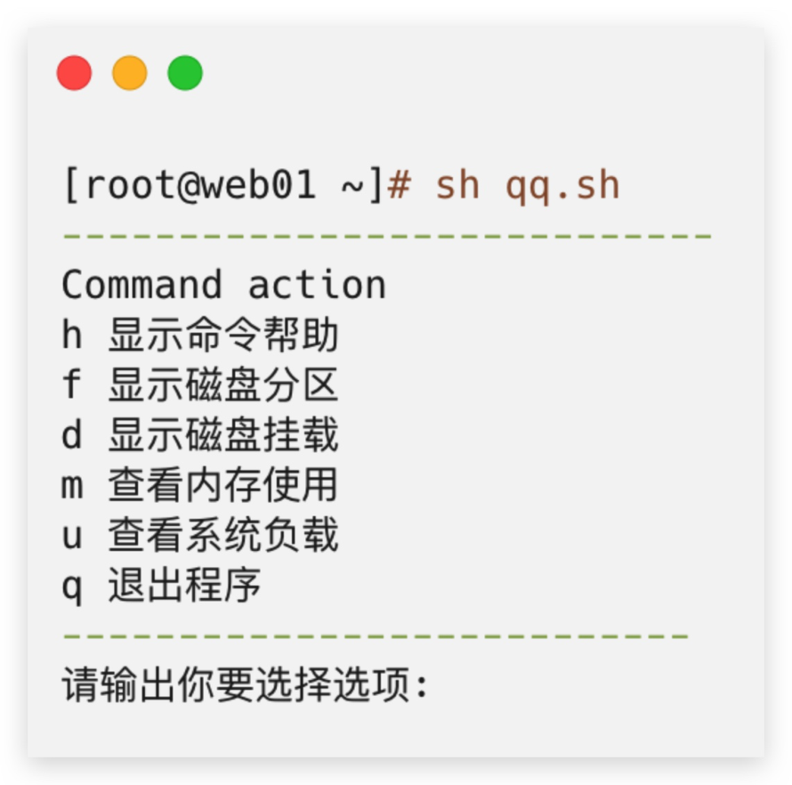
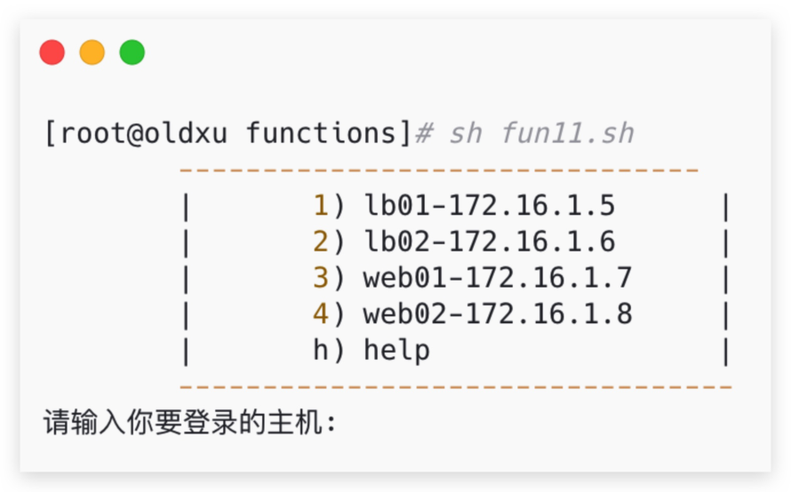
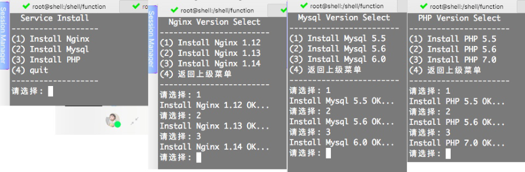
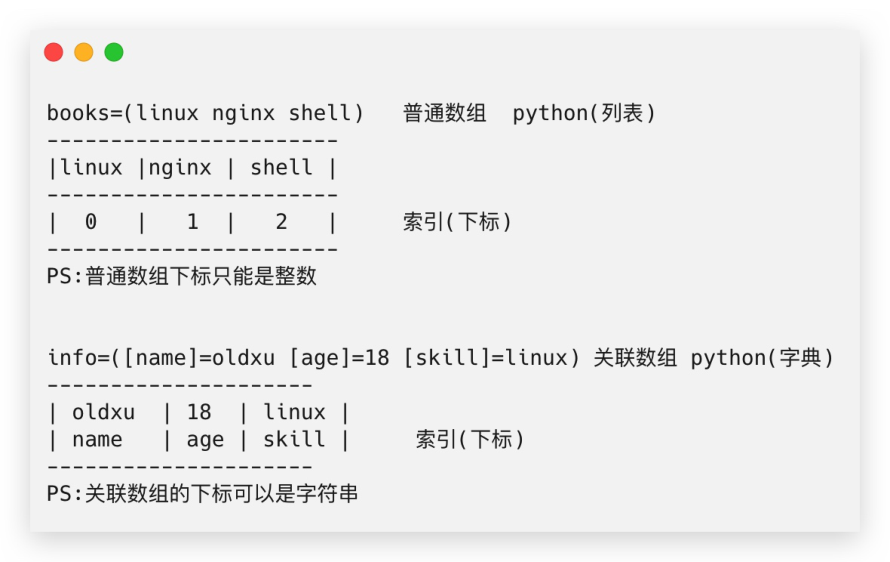
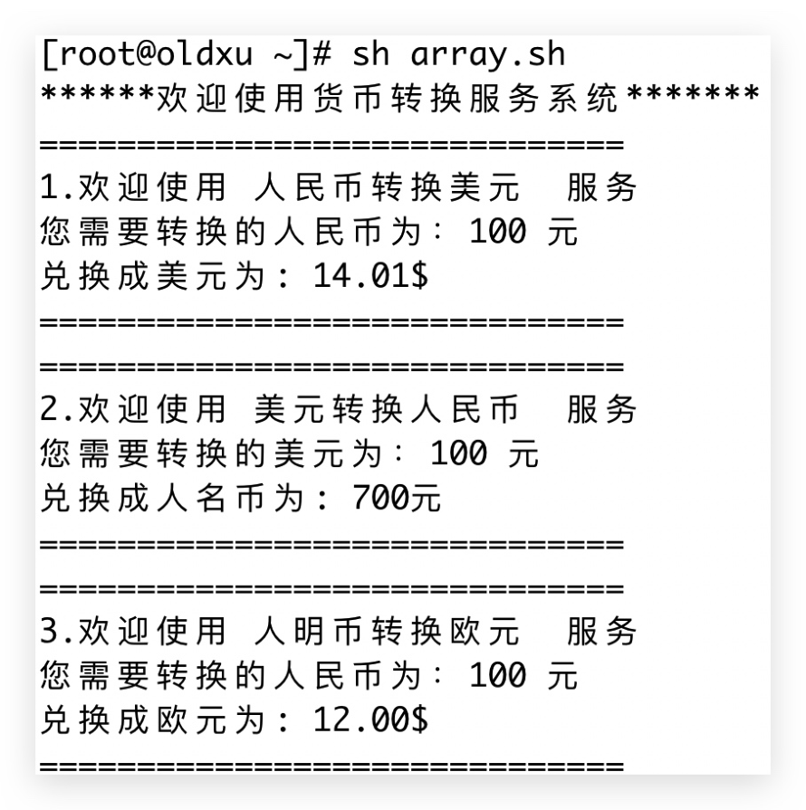
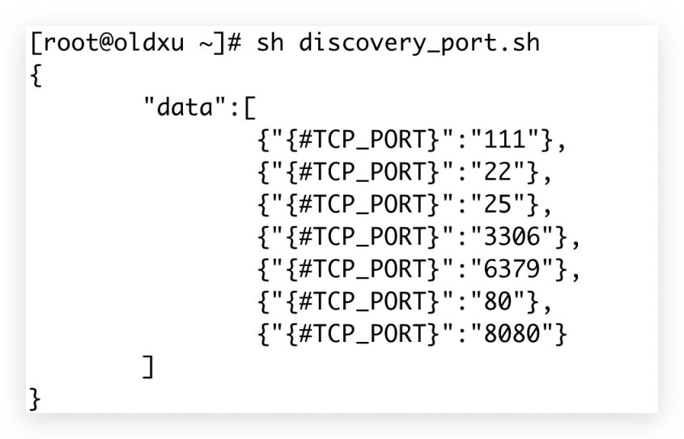

# 04 Shell函数与数组-array

## 目录

- [1.Shell函数](#1.shell函数)
  - [1.1 什么是Shell函数](#1.1-什么是shell函数)
  - [1.2 为何需要函数](#1.2-为何需要函数)
  - [1.3 函数基础语法](#1.3-函数基础语法)
  - [1.4 函数参数传递](#1.4-函数参数传递)
- [1.函数中传递单个参数示例](#1.函数中传递单个参数示例)
- [2.函数中传递多个参数示例](#2.函数中传递多个参数示例)
  - [1.5 函数实现计算器功能脚本](#1.5-函数实现计算器功能脚本)
  - [1.6 函数实现nginx启停脚本](#1.6-函数实现nginx启停脚本)
  - [1.7 函数状态返回值](#1.7-函数状态返回值)
    - [1.7.1 echo数据返回示例](#1.7.1-echo数据返回示例)
    - [1.7.1 return数据返回示例](#1.7.1-return数据返回示例)
  - [1.8 Shell函数案例](#1.8-shell函数案例)
    - [1.8.1 实现系统工具箱脚本](#1.8.1-实现系统工具箱脚本)
    - [1.8.2 实现跳板机功能脚本](#1.8.2-实现跳板机功能脚本)
    - [1.8.3 实现多服务安装脚本](#1.8.3-实现多服务安装脚本)
- [3.Shell数组](#3.shell数组)
  - [3.1 什么是数组](#3.1-什么是数组)
  - [3.2 数组的分类](#3.2-数组的分类)
  - [3.3 数组基本使用](#3.3-数组基本使用)
    - [3.3.1 普通数组赋值](#3.3.1-普通数组赋值)
    - [3.3.2 普通数据访问](#3.3.2-普通数据访问)
- [1.数组名加索引即可访问数组中的元素](#1.数组名加索引即可访问数组中的元素)
    - [3.3.3 关联数组赋值](#3.3.3-关联数组赋值)
- [1.必须先申明这是一个关联数组](#1.必须先申明这是一个关联数组)
    - [3.3.4 关联数组访问](#3.3.4-关联数组访问)
- [1.访问数组中的第二个元数](#1.访问数组中的第二个元数)
- [2.访问数组中所有”数据“等同于 echo ${info2[*]}](#2.访问数组中所有数据等同于-echo-info2)
- [3.访问数组中所有元数的"索引"](#3.访问数组中所有元数的索引)
  - [3.4 普通数组场景](#3.4-普通数组场景)
    - [3.4.1 普通数组示例脚本](#3.4.1-普通数组示例脚本)
    - [3.4.2 实现货币兑换系统脚本](#3.4.2-实现货币兑换系统脚本)
- [1）实现人民币兑换美元的功能](#1实现人民币兑换美元的功能)
- [2）实现美元兑换人民币的功能](#2实现美元兑换人民币的功能)
- [3）实现人民币兑换欧元的功能](#3实现人民币兑换欧元的功能)
    - [3.4.3 获取系统所有端口脚本](#3.4.3-获取系统所有端口脚本)
  - [3.5 数组遍历与循环](#3.5-数组遍历与循环)
    - [3.5.1 什么是数组遍历](#3.5.1-什么是数组遍历)
    - [3.5.2 数组遍历的意义](#3.5.2-数组遍历的意义)
- [1.通过数组的个数进行遍历（不推荐）](#1.通过数组的个数进行遍历不推荐)
- [2.通过数组的索引进行遍历（推荐）](#2.通过数组的索引进行遍历推荐)
    - [3.5.3 关联数组统计示例脚本](#3.5.3-关联数组统计示例脚本)
- [1.准备对应的文件](#1.准备对应的文件)
    - [3.5.4 统计shell类型次数脚本](#3.5.4-统计shell类型次数脚本)
    - [3.5.5 统计Nginx IP次数脚本](#3.5.5-统计nginx-ip次数脚本)

array

# 04 Shell函数与数组-array

徐亮伟, 江湖人称标杆徐。多年互联网运维工作经 验，曾负责过大规模集群架构自动化运维管理工作。 擅长Web集群架构与自动化运维，曾负责国内某大型 电商运维工作。 个人博客"徐亮伟架构师之路"累计受益数万人。 笔者Q:552408925、572891887 架构师群:471443208

## 1.Shell函数

### 1.1 什么是Shell函数

函数其实就是一堆命令的合集，用来完成特定功能的 代码块。

### 1.2 为何需要函数

比如：我们经常需要使用判断功能，完全可以将其封 装为一个函数，这样在写程序过程中可以在任何地方 调用该函数，不必重复编写。 函数能减少代码冗余，增加代码的可读性。 函数和变量类似，必须先定义才可以调用，如果定 义不调用则不会被执行。

### 1.3 函数基础语法

1.定义 Shell 函数，可以通过如下两种方式进行定义。 # 方式一

```
name()
{
```
command1 command2 ... commandN

```
}
```
方式二 function name

```
{
```
command1 command2 ...

commandN

```
}
```
2.调用函数，直接使用函数名调用。（可以理解为： Shell的一条命令）

```
[root@oldxu shell]# fun1() { echo
"hello,Shell"; }
```
#调用函数

```
[root@oldxu shell]# fun1
```
hello,Shell

### 1.4 函数参数传递

在函数内部可以使用参数 $1、$2..，调用函数

```
function_name $1 $2..
```
## 1.函数中传递单个参数示例

```
[root@oldxu shell]# fun2() { echo "hello,
$1"; }
```
#调用

```
[root@oldxu shell]# fun2 Linux
```
hello, Linux

## 2.函数中传递多个参数示例

```
[root@oldxu shell]# fun3() { echo hello,
"$1" "$2" "$3" ; }
[root@oldxu shell]# fun3 hello, linux Shell
```
Python linux Shell Python

```
[root@oldxu shell]# fun4() { echo "hello,
$*"; }
[root@oldxu shell]# fun4 linux Shell Python
```
hello, linux Shell Python

### 1.5 函数实现计算器功能脚本

需求：写一个脚本，该脚本可以实现计算器的功能， 可以进行 +-\*/ 四种计算。

```
sh cal.sh 30 + 40
sh cal.sh 30 - 40
sh cal.sh 30 * 40
sh cal.sh 30 / 40
[root@docker01 shell]# cat fun_cal.sh
#!/usr/bin/bash
calsum() {
    case $2 in
    +)
        echo "$(expr $1 + $3)"
```
        ;;
```
    -)
        echo "$(expr $1 - $3)"
```
        ;;
```
    \*)
         echo "$(expr $1 \* $3)"
```
        ;;
```
    /)
        echo "$(expr $1 / $3)"
```
        ;;
```
}
```
#调用函数并进行参数传递

```
calsum $1 $2 $3
```
### 1.6 函数实现nginx启停脚本

需求：写一个脚本，实现 nginx 服务的启动、停止、重 启。

```
[root@oldxu shell]# cat fun_ngx.sh
#!/usr/bin/bash
source /etc/init.d/functions
```
#定义函数，函数需要传递一个参数

```
nginx_when() {
    if [ $? -eq 0 ];then
        action "Nginx $1 is ok!" /bin/true
else
        action "Nginx $1 is er!" /bin/false
fi
}
```
#接收脚本传入的第一个位置参数，然后进行匹配

```
case $1 in
    start)
```
nginx

```
        nginx_when $1
        ;;
    stop)
        nginx -s stop
        nginx_when $1
        ;;
    reload)
        nginx -s reload
        nginx_when $1
        ;;
    *)
        echo "USAGE: $0 { start|stop|reload
}"
```
### 1.7 函数状态返回值

Shell的函数返回值，也算是退出的状态，在shell中 只有echo、return两种方式。 return返回值：只能返回1-255的整数，函数使用 return返回值，通常只是用来供其他地方调用获取 状态，因此通常仅返回0或1；0表示成功，1表示 失败。

echo返回值：使用echo可以返回任何字符串结 果，通常用于返回数据，比如一个字符串值或者列 表值。

#### 1.7.1 echo数据返回示例

```
[root@oldxu shell]# cat fun_echo.sh
#!/bin/bash
get_users() {
    users=$(cat /etc/passwd | awk -F ':'
'{print $1}')
    echo $users
}
#get_users
```
#可以对拿到的函数结果进行遍历

```
user_list=`get_users`
index=1
for u in $user_list
    echo "The $index user is : $u"

let index++
done
#### 1.7.1 return数据返回示例

# 判断服务是否正常运行

[root@oldxu shell]# cat fun_return_2.sh
#!/usr/bin/bash
is_server_running(){
    systemctl status $1 &>/dev/null
        if [ $? -eq 0 ];then
```
            return 0
```
else
```
            return 1
```
fi

}
```
# 项目1

```
    is_server_running
    if [ $? -eq 0 ];then
```
123
```
fi
    is_server_running
    if [ $? -eq 0 ];then
```
456
```
fi
is_server_running nginx &&
echo "$1 is
Running" ||
echo "$1 is stoped"
```
# 项目2

```
is_server_running httpd &&
echo "$1 is
Running" ||
echo "$1 is stoped"
```
### 1.8 Shell函数案例

#### 1.8.1 实现系统工具箱脚本

需求：使用函数、循环、case实现系统管理工具箱。



```
[root@manager functions]# cat fun10.sh
#!/bin/bash
meminfo () {
cat <<-EOF
----------------------------

Command action h 显示命令帮助 f 显示磁盘分区 d 显示磁盘挂载 m 查看内存使用 u 查看系统负载 q 退出程序

---------------------------
}

meminfo while true do read -p "请输出你要选择选项: " Action

    case $Action in
        h)
```
help

```
            ;;
        f)
```
lsblk

```
            ;;
        d)
            df -h
            ;;
        m)
            free -m
```
            ;;
```
        u)

uptime

```
            ;;
```
        q)

exit

```
            ;;
```
        *)

continue
esac
done
#### 1.8.2 实现跳板机功能脚本

需求：使用case、循环、函数、实现JumpServer跳 板机功能。 1.用户登陆该服务器则自动执行该脚本。 2.脚本提示可连接主机列表。 3.该脚本无法直接退出。



[root@oldxu shell]# cat jumpserver.sh
#!/bin/bash
meminfo(){
        cat <<-EOF
        -------------------------------
        |       1) lb01-172.16.1.5      |
        |       2) lb02-172.16.1.6      |
        |       3) web01-172.16.1.7     |
        |       4) web02-172.16.1.8     |
        |       h) help                 |
        ---------------------------------

}
meminfo trap "" HUP INT TSTP
while true
do

read -p "请输入你要登录的主机: " Action
    case $Action in
        1|lb01)
```
ssh root@172.16.1.5

```
        ;;
        2|lb02)
```
ssh root@172.16.1.6

```
        ;;
        3|web01)
```
ssh root@172.16.1.7

```
        ;;
        4|web02)
```
ssh root@172.16.1.8

```
        ;;
        h)
```
clear meminfo

```
        ;;
        exec)
```
exit

```
            ;;
        *)
```
continue esac done #将脚本添加/etc/bashrc，登陆ssh后则会执行该脚本

```
[root@oldxu shell]# cat /etc/bashrc
```
....

```
sh /opt/jumpserver.sh
```
#### 1.8.3 实现多服务安装脚本

需求：实现多级菜单功能，需要使用到函数、case、循 环、if判断。



```
[root@oldxu shell]# cat -n  djcd-case.sh
#!/usr/bin/bash
mem_option (){
cat <<-EOF
---------主菜单----------
|   1) 安装nginx         |
|   2) 安装php           |
|   3) 退出              |
--------------------------
}
mem_install_nginx(){
cat <<-EOF
-----Installed Nginx -----
|   1) 安装nginx1.1      |

|   2) 安装nginx1.2      |
|   3) 安装nginx1.3      |
```
|   4) 返回上一页        |

```
--------------------------
}
mem_install_php(){
cat <<-EOF
--------------------------
|   1) 安装php5.5        |
|   2) 安装php5.6        |
|   3) 安装php7.0        |

|   4) 返回上一页        |

--------------------------
}
#------------------------------------------
----------------------------

while true
do

    mem_option
read -p "请输入主菜单需要选择的选项，使用方法
[1|2|3]: " option
    case $option in
        1)
while true
do clear
                mem_install_nginx
read -p "请输入你要安装Nginx的
Version: " nginx_install_option
                case $nginx_install_option
```
in

```
                    1)
```
clear
```
echo "Installed Nginx Version 1.1 is Done....." sleep
                        ;;
                    2)
```
clear
```
echo "Installed Nginx Version 1.2 is Done....." sleep
                        ;;
                    3)
```
clear
```
echo "Installed Nginx Version 1.3 is Done....." sleep
                        ;;
                    4)
```
clear break

```
                        ;;
done
                        ;;
        2)

clear

            mem_install_php
read -p "请输入你要选择的php
Version: " php_install_option
            case $php_install_option in
                1)
"Installed php Version 5.5 is Done....."
                    ;;
                2)
"Installed php Version 5.6 is Done....."
                    ;;
                3)
"Installed php Version 5.7 is Done....."
                    ;;
                4)
```
clear

```
                    ;;
                *)
```
            ;;
```
        3)

exit

```
                ;;
```
        *)
            echo "USAGE: [ 1 | 2 |3 ]"

## 3.Shell数组

### 3.1 什么是数组

数组其实也算是变量，传统的变量只能存储一个值， 但数组可以存储多个值。

### 3.2 数组的分类

shell数组分为普通数组和关联数组 普通数组：只能使用整数 作为数组索引 关联数组：可以使用字符串 作为数组索引



### 3.3 数组基本使用

#### 3.3.1 普通数组赋值

普通数组的赋值（注意：普通数组仅能使用"整数"来 作为索引） 方式一，针对每个索引进行赋值（数组名[索引]=变量 值）

[root@oldxu ~]# array1[0]=pear
[root@oldxu ~]# array1[1]=apple
[root@oldxu ~]# array1[2]=orange
```
方式二, 一次赋多个值 （ 数组名=(多个变量值) )

```
[root@oldxu ~]# array2=(tom jack alice)
[root@oldxu ~]# array3=(tom jack alice
"bash shell")
[root@oldxu ~]# array4=(1 2 3 "linux shell"
[20]=docker)
```
#### 3.3.2 普通数据访问

## 1.数组名加索引即可访问数组中的元素

```
[root@oldxu ~]# echo ${array1[0]}
pear 2.访问数组中所有"数据"，相当于 echo ${array1[*]}
[root@oldxu ~]# echo ${array1[@]}
```
pear apple orange 3.获取数组的"索引"，在数据遍历的时候有用

```
[root@oldxu ~]# echo ${!array1[@]}
[root@oldxu ~]# echo ${#array1[@]}

#### 3.3.3 关联数组赋值

关联数组的赋值（注意：关联数组能使用"字符串"的 方式作为索引）

## 1.必须先申明这是一个关联数组

[root@oldxu ~]# declare -A info
[root@oldxu ~]# declare -A info2
```
2.方式一，关联数组的赋值 数组名[索引]=变量值

```
[root@oldxu ~]# info[index1]=pear
[root@oldxu ~]# info[index2]=apple
[root@oldxu ~]# info[index3]=orange
```
3.方式二，关联数组的赋值 数组名=([索引1]=变量值2 [索引2]=变量值2)

```
[root@oldxu ~]# info2=([index1]=linux
[index2]=nginx [index3]=docker
[index4]='bash shell')
[root@oldxu ~]# declare -A

#### 3.3.4 关联数组访问

## 1.访问数组中的第二个元数

[root@oldxu ~]# echo ${info2[index2]}
```
nginx

## 2.访问数组中所有”数据“等同于 echo ${info2[*]}

```
[root@oldxu ~]# echo ${info2[@]}
bash shell linux nginx docker
```

## 3.访问数组中所有元数的"索引"

```
[root@oldxu ~]# echo ${!info2[@]}
```
index4 index1 index2 index3

### 3.4 普通数组场景

#### 3.4.1 普通数组示例脚本

```
[root@oldxu ~]# vim array_1.sh
#!/usr/bin/bash
```
#1.使用while读入一个文件 while read line do #2.定义普通数组, 将读入的每行数据,单个单个进行 赋值

```
    hosts[++i]=$line   #
```
#正常定义普通数组是hosts[1]=test,只不过我们 将[]变成自增 #$line是读取的文件内容

```
done </etc/hosts
```
#3.使用for循环遍历数组, 遍历数组的索引

```
for i in ${!hosts[@]}
echo "hosts数组对应的索引是:$i, 对应的值是:
${hosts[i]}"
```
#### 3.4.2 实现货币兑换系统脚本

根据业务需求，现要求开发一个货币兑换的服务系 统，具体要求如下：

## 1）实现人民币兑换美元的功能

## 2）实现美元兑换人民币的功能

## 3）实现人民币兑换欧元的功能

货币兑换利率： 1美元 = 7.14人民币、1元=0.12欧元 100/7.14=



```
[root@oldxu ~]# cat array.sh
#!/usr/bin/bash
your_money=100
service_menu=(人民币转换美元 美元转换人民币 人明
```
币转换欧元) echo "******欢迎使用货币转换服务系统*******"

```
for service in ${!service_menu[@]}
    if [ $service -eq 0 ];then

"=============================="
```
"1.欢迎使用

```
${service_menu[service]}  服务"
```
"您需要转换的人民币为：

```
$your_money 元"
            new_money=$(awk -v
your_money=$your_money 'BEGIN{printf
"%.2f\n",your_money/7.14}')
```
"兑换成美元为:

```
${new_money}$"
"=============================="
    elif [ $service -eq 1 ];then

"=============================="
```
"2.欢迎使用

```
${service_menu[service]}  服务"
```
"您需要转换的美元为：

```
$your_money 元"
                new_money=$(($your_money *
7 ))
```
"兑换成人名币为:

```
${new_money}元"
"=============================="
    elif [ $service -eq 2 ];then

"=============================="
```
"3.欢迎使用

```
${service_menu[service]}  服务"
```
"您需要转换的人民币为：

```
$your_money 元"
        new_money=$(awk -v
your_money=$your_money 'BEGIN{printf
"%.2f\n",your_money*0.12}')
```
"兑换成欧元为:

```
${new_money}$"
"=============================="

fi
done
#### 3.4.3 获取系统所有端口脚本

需求：使用 Shell 数组编写脚本，用来获取主机的 所有端口，效果如下：



[root@oldxu ~]# cat discovery_port.sh
#!/usr/bin/bash
port_array=($(ss -lntp | awk '{print $4}' |
awk -F ":" '{print $NF}' | egrep "^[0-9]+$"
| sort |uniq | xargs))
length=${#port_array[@]}
printf "{\n"
printf  '\t'"\"data\":["
j=0
for i in ${port_array[@]}
    j=$[ $j + 1 ]
    printf '\n\t\t{'
    if [ $j -eq ${length} ];then
        printf "\"{#TCP_PORT}\":\"${i}\"}"

else

        printf "\"{#TCP_PORT}\":\"${i}\"},"
fi
done
    printf "\n\t]\n"
    printf "}\n"
```
### 3.5 数组遍历与循环

#### 3.5.1 什么是数组遍历

数组遍历其实就是使用对数组进行批量赋值，然后通 过循环方式批量取出数组的值；

#### 3.5.2 数组遍历的意义

数组遍历的意义在于，统计某个字段出现的次数，那 么遍历的方式有如下两种:

## 1.通过数组的个数进行遍历（不推荐）

## 2.通过数组的索引进行遍历（推荐）

如果需要统计一个文件中某个字段出现的次数，怎么 办？ 要统计谁就将谁作为数组的索引，然后获取索引出 现的次数； 值得一提的该方法仅支持关联数组；

#### 3.5.3 关联数组统计示例脚本

统计文件中男生、女生出现的次数；

## 1.准备对应的文件

```
[root@oldxu ~]# cat sex.txt
```
jack m alice f tom m rose f robin m oldxu m gdx   x # 第二列作为索引名称，然后让索引名称自增，出现一次+1 # 遍历这个索引，取出对应的值，次数；

```
[root@oldxu ~]# cat count_sex.sh
#!/usr/bin/bash
declare -A sex
```
#1.对数组进行赋值 while read line do #2.取出第二列的内容

```
    type=$(echo $line|awk '{print $2}')
```
#3.定义一个关联数组,让数组的值不断自增

```
    let sex[$type]++
done < sex.txt
```
#4.遍历数组

```
for i in ${!sex[@]}
    echo "$i ${sex[$i]}"

[root@oldxu ~]# declare -A sex
[root@oldxu ~]# sex=([m]=1 [f]=1)
[root@oldxu ~]# let sex[m]++
[root@oldxu ~]# let sex[f]++
[root@oldxu ~]# echo ${!sex[@]}
```
f m

```
[root@oldxu ~]# echo ${sex[@]}
```
#### 3.5.4 统计shell类型次数脚本

需求：使用 Shell 数组统计 /etc/passwd 的不同 shell 类型的数量；

```
[root@oldxu ~]# cat array_passwd_count.sh
#!/usr/bin/bash
declare -A array_passwd
```
#1.对数组进行赋值 while read line do

```
    type=$(echo $line|awk -F ':' '{print
$NF}')
    let array_passwd[$type]++
done </etc/passwd
```
#2.对数组进行遍历

```
for i in ${!array_passwd[@]}
echo 索引是:$i,索引的值是:
${array_passwd[$i]}
```
#### 3.5.5 统计Nginx IP次数脚本

需求：使用 Shell 数组统计

```
/var/log/nginx/access.log 文件，相同IP访问的次
```

数；

```
[root@oldxu ~]# cat array_nginx_count.sh
#!/usr/bin/bash
# nginx log top 10 IP conut
declare -A array_nginx
```
#1.给关联数组的索引进行赋值 while read line do

```
    type=$(echo $line|awk '{print $1}')
    let array_nginx[$type]++
done </var/log/nginx/access.log
```
#2.遍历数组

```
for i in ${!array_nginx[@]}
```
"IP是:$i 出现多少次

```
${array_nginx[$i]}"
```
练习：统计ESTABLISHED的次数，TIME-WAIT次数； 取值； 赋值； 统计；
