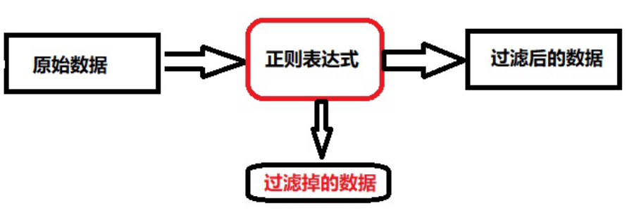

# 1.正则表达式介绍

## 目录

  - [1.1 什么是正则表达式](#1.1-什么是正则表达式)
  - [1.2 为何需要正则表达式](#1.2-为何需要正则表达式)
  - [1.3 正则表达式注意事项](#1.3-正则表达式注意事项)
- [2.正则表达式和Linux的通配符以及特殊字符是有区别](#2.正则表达式和linux的通配符以及特殊字符是有区别)
- [3.要想学好grep、sed、awk首先就需要对正则表达式](#3.要想学好grepsedawk首先就需要对正则表达式)
  - [1.4 正则表达式规则语法](#1.4-正则表达式规则语法)
- [2.正则表达式案例](#2.正则表达式案例)
  - [2.1 提取服务器网卡地址](#2.1-提取服务器网卡地址)
  - [2.2 过滤空行与#开头的行](#2.2-过滤空行与开头的行)
  - [2.3 匹配日志中http版本](#2.3-匹配日志中http版本)
  - [2.4 过滤无注释的配置文件](#2.4-过滤无注释的配置文件)
  - [2.5 匹配用户手机号是否合法](#2.5-匹配用户手机号是否合法)
  - [2.6 匹配用户邮箱是否合法](#2.6-匹配用户邮箱是否合法)
  - [2.7 正则匹配文件中的域名](#2.7-正则匹配文件中的域名)
- [3.sed文本处理](#3.sed文本处理)
  - [3.1 sed基本介绍](#3.1-sed基本介绍)
  - [3.2 sed工作模式](#3.2-sed工作模式)
  - [3.3 sed基础语法](#3.3-sed基础语法)
  - [3.4 sed常用选项](#3.4-sed常用选项)
    - [3.4.1 -n选项](#3.4.1--n选项)
    - [3.4.2 -e选项](#3.4.2--e选项)
    - [3.4.3 -f选项](#3.4.3--f选项)
    - [3.4.4 -r选项](#3.4.4--r选项)
  - [3.5 sed pattern过滤](#3.5-sed-pattern过滤)
    - [3.5.1 pattern命令格式](#3.5.1-pattern命令格式)
    - [3.5.2 pattern命令示例](#3.5.2-pattern命令示例)
- [2.示例: 指定起始行号和结束行号 #打印passwd文件的10到20行](#2.示例-指定起始行号和结束行号-打印passwd文件的10到20行)
- [4.正则表达式匹配（打印passwd文件中以root开头的](#4.正则表达式匹配打印passwd文件中以root开头的)
    - [3.5.3 pattern章节练习](#3.5.3-pattern章节练习)
  - [3.6 sed追加命令](#3.6-sed追加命令)
    - [3.6.1 追加命令格式](#3.6.1-追加命令格式)
    - [3.6.2 追加命令示例](#3.6.2-追加命令示例)
    - [3.6.3 追加章节练习](#3.6.3-追加章节练习)
- [1）passwd文件第10行后面追加 "Add Line"](#1passwd文件第10行后面追加-add-line)
- [5）passwd文件每一行前面都追加 "Insert Line](#5passwd文件每一行前面都追加-insert-line)
  - [3.7 sed删除命令](#3.7-sed删除命令)
    - [3.7.1 删除命令格式](#3.7.1-删除命令格式)
    - [3.7.2删除命令示例](#3.7.2删除命令示例)
- [3.删除 passwd 文件中第1行内容](#3.删除-passwd-文件中第1行内容)
- [2.删除 passwd 文件中第1行到第5行的内容](#2.删除-passwd-文件中第1行到第5行的内容)
- [3.删除 passwd 文件中第2行以及往下的5行内容](#3.删除-passwd-文件中第2行以及往下的5行内容)
    - [3.7.3 删除章节练习](#3.7.3-删除章节练习)
  - [3.8 sed修改命令](#3.8-sed修改命令)
    - [3.8.1 修改命令格式](#3.8.1-修改命令格式)
    - [3.8.2 修改命令示例](#3.8.2-修改命令示例)
- [3.修改passwd文件第1行中第一个root为ROOT](#3.修改passwd文件第1行中第一个root为root)
- [5.修改SELINUX=enforcing修改为](#5.修改selinuxenforcing修改为)
  - [3.9 sed脚本实践](#3.9-sed脚本实践)
    - [3.9.1 分析Ansible主机清单实践](#3.9.1-分析ansible主机清单实践)
    - [3.9.2 分析MySQL配置文件实践](#3.9.2-分析mysql配置文件实践)
- [3.脚本执行结果](#3.脚本执行结果)
- [1: client 2](#1-client-2)
- [2: server 12](#2-server-12)
- [3: mysqld 12](#3-mysqld-12)
- [5: embedded 8](#5-embedded-8)

```
sed
```
徐亮伟, 江湖人称标杆徐。多年互联网运维工作经 验，曾负责过大规模集群架构自动化运维管理工作。 擅长Web集群架构与自动化运维，曾负责国内某大型 电商运维工作。 个人博客"徐亮伟架构师之路"累计受益数万人。 笔者Q:552408925、572891887 架构师群:471443208

# 1.正则表达式介绍

### 1.1 什么是正则表达式

以特定的符号"表示一组数字或字母的"，一种规则。



### 1.2 为何需要正则表达式

再工作中，我们时刻面对着大量的日志，程序，以及 命令的输出。迫切的需要过滤我们需要的一部分内 容，甚至是一个字符串。 比如: 现在有一个上千行的文件，我们仅需要其中包 含“ERROR”的行，怎么办? 此时就需要使用到正则表 达式的规则来筛选想要的内容。

### 1.3 正则表达式注意事项

3.正则表达式应用非常广泛，存在于各种编程语言 中。

## 2.正则表达式和Linux的通配符以及特殊字符是有区别

```
的 * .。  rm -rf *    grep "*"
```
## 3.要想学好grep、sed、awk首先就需要对正则表达式

有一定的了解。只有了解了规则，才能灵活的运用。

### 1.4 正则表达式规则语法

正则表达式： \：转义符，将特殊字符进行转义，忽略其特殊意 义 ^：匹配行首，匹配字符串的开始 $：匹配行尾，匹配字符串的结尾 ^$：表示空行 .：匹配除换行符\n之外的任意单个字符 []：匹配包含在[字符]之中的任意一个字符 [a|b]cd [^]：匹配[^a]之外的任意字符 [ - ]：匹配[]中指定范围内的任意一个字符 [a-z] | [0-9] ?：匹配之前的项1次或者0次 +：匹配之前的项1次或者多次    [0-9]+ *：匹配之前的项0次或者多次 .* ()：匹配表达式，创建一个用于匹配的子串 grep "ab(c|d)" {n}：匹配之前的项n次，n是可以为0的正整数 grep "[0-9]{1,3}" {n,}：之前的项至少需要匹配n次 {n,m}：指定之前的项至少匹配n次，最多匹配m 次，n<=m |：交替匹配，|两边的任意一项ab(c|d)匹配 abc或abd

\<\>或\b锚定词首与词尾， \<grep\> ，匹配所 有包含grep字符的行,如果出现grepa是不会被匹配 特殊字符： [[:space:]]：匹配空格 [[:digit:]]：匹配[0-9] [[:lower:]]：匹配[a-z] [[:upper:]]：匹配[A-Z] [[:alpha:]]：匹配[a-Z] 3.准备如下文件，然后进行正则表达式规则验证。 I am xuliangwei teacher! I teach linux. test I like badminton ball ,billiard ball and chinese chess! my blog is

```
http://liangweilinux.blog.51cto.com
our site is http://www.xuliangwei.com
```
my qq num is 572891887. not 572891888887. 进行如下场景验证：

2.排除空行，并打印行号 3.匹配任意一个字符，不包括空行

## 2.正则表达式案例

### 2.1 提取服务器网卡地址

需求：使用grep正则方式方式，提取eth0的IP地 址；

```
[root@oldxu ~]# ifconfig eth0 | grep
"^.*inet " | egrep -o "[0-9]{2,3}\.[0-9]
{1,3}\.[0-9]{1,3}\.[0-9]{1,3}"
[root@oldxu ~]# ifconfig eth0 | grep
"^.*inet " | egrep -o "[[:digit:]]{2,3}\.
[[:digit:]]{1,3}\.[[:digit:]]{1,3}\.
[[:digit:]]{1,3}"
```
### 2.2 过滤空行与#开头的行

需求：使用  grep 正则表达式方式，排除 nginx 日 志文件的空行和#号开头的行。

```
[root@oldxu grep]# egrep -v  "
(^#|^$|^[[:space:]]+#)" nginx.conf
```
### 2.3 匹配日志中http版本

需求：使用 grep 正则表达式方式，匹配 nginx 日志 中的 http3.0 http3.1 http2.1 http2.0

```
[root@oldxu grep]# egrep -o "HTTP/(1|2|3)\.
(0|1)" access_log_grep
```
### 2.4 过滤无注释的配置文件

需求：使用 grep 正则表达式方式，匹配 zabbix_agentd.conf 配置文件中所有已启用的配 置。

```
[root@oldxu grep]# egrep -v  "^#|^$"
zabbix_agentd.conf
[root@oldxu grep]# grep '^[a-Z]'
zabbix_agentd.conf
```
### 2.5 匹配用户手机号是否合法

需求：使用 grep 正则表达式方式，匹配 133、152、 166、135 开头的手机号码。

```
[root@web01 ~]# cat grep_phone.sh
#!/usr/bin/bash
read -p "请输入你的手机号 [ 166 | 133 | 152 |
135 ]: " Action
```
#3.确保用户输入的是纯数字,并且是11位,如果不是则报错

```
if [[ $Action =~ ^[0-9]{11}$ ]];then
```
#2.确保用户输入的手机号是133|166|152开头，并 且中间是连续的8个整数结尾

```
    if [[ $Action =~ ^(133|166|152|135)[0-
9]{8}$ ]];then
echo "$Action 手机号通过" else echo "$Action 手机号没有在该系统中备案" fi else echo "你的手机号是 ${#Action} 位，不满足要 求..." fi
```
### 2.6 匹配用户邮箱是否合法

需求：使用 grep 正则表达式方式，匹配 qq、163、 sina 的 email 地址。 前缀：数字|字母  组成方式     （长度，不可以超 过16） @ 正常出现 qq | sina | foxmail | 163  | gmail  固定的字段；

.com .cn .org  不做控制；

552408925@qq.com 13310540800@qq.com oldxu@qq.com oldxu123@qq.com 163\sina\gmail\foxmail\  固定 com\cn\org\top

```
[root@manager scripts]# cat email.sh
#!/usr/bin/bash
#
read -p "请输入找回密码的邮箱: " Action
Action_pre=${Action%@*}
```
比对前缀的长度是否超过16

```
if [ ! ${#Action_pre} -le 16 ];then
echo "你输入的邮箱长度太长" exit fi # 匹配
    #     (0-9 | a-z )+
```

纯数字 # 数字+字母 # 纯字母 # 字母+数字

```
if [[ $Action =~ ^([0-9]|[a-
z])+|@(qq|sina|163)\..+$ ]];then
echo "$Action 邮件已经发送，请登录邮箱点击链 接找回密码" else echo "$Action 不符合系统预定的邮箱规则，请重 新尝试" fi
```
### 2.7 正则匹配文件中的域名

需求：现在有如下文件，希望通过如下方式进行匹 配：grep "正则 \.shop.oldxu.com

```
[root@openvpn-192 ~]# cat rege.txt
xxt-demo.shop.oldxu.com
xxt-demoadmin.shop.oldxu.com
```
abc.shop.oldxu.com abcadmin.shop.oldxu.com 123.shop.oldxu.com abc123.shop.oldxu.com

```
[root@openvpn-192 ~]# egrep "([a-z0-9]{1,}-
[a-z0-9]{1,}|[a-z]{1,}|[a-z]
{1,}|admin)\.shop.oldxu.com" rege.txt
```
## 3.sed文本处理

### 3.1 sed基本介绍

```
sed(Stream Editor) 流编辑器，能够对标准输出或
```
文件进行逐行处理。 简单来说，sed可以实现对文件的增、删、查、改。

### 3.2 sed工作模式

```
sed 读取文件一行，存放在缓存区，然后处理，最后输 出。
```
### 3.3 sed基础语法

```
第一种形式：stdout | sed [option] "pattern command"  ifconfig eth0 | sed 's###g' option:  选项 pattern：匹配   sed '/^root/'        ||  grep command: 动作   p，d, c , s###g , r,w,i,a 第二种形式： sed [option] "pattern command" file   sed -i 's#200#31#g' /etc/sysconfig
```
### 3.4 sed常用选项

选项 含义 -n 只打印匹配的行（取消文件的默认输出） -e 允许多项编辑 -f 编辑动作保存在文件，指定文件才执行 -r 支持扩展正则表达式 -i 直接变更文件内容

```
[root@oldxu ~]# cat file.txt
```
I love shell I love SHELL This is test file

#### 3.4.1 -n选项

```
sed -n 用于取消默认输出
[root@oldxu ~]# sed -n '/shell/p' file.txt
```
I love shell

#### 3.4.2 -e选项

```
sed -n 用于多项编辑
[root@oldxu ~]# sed -n -e '/shell/p' -e
'/SHELL/p' file.txt
```
I love shell I love SHELL

#### 3.4.3 -f选项

```
sed -f 编辑动作保存在文件，指定文件才执行 将 pattern 写入文件中
[root@oldxu ~]# cat edit.sed
/shell/p
```
通过 sed -f 执行

```
[root@oldxu ~]# sed -n -f edit.sed file.txt
```
#### 3.4.4 -r选项

```
sed -r 支持扩展正则表达式
[root@oldxu ~]# sed -n '/shell|SHELL/p'
```
file.txt #扩展正则表达式

```
[root@oldxu ~]# sed -rn '/shell|SHELL/p'
```
file.txt I love shell I love SHELL

### 3.5 sed pattern过滤

```
命令格式：sed [option] '/pattern/command' file
```
#### 3.5.1 pattern命令格式

匹配模式 含义 10command 匹配第10行 匹配从第10行开 10,20command 始，到第20行结 束 匹配从第10行开 10,+5command 始，到第16行结 束 匹配到pattern1 的行开始，到 匹 /pattern1/,/pattern2/command 配到pattrn2的行 结束 匹配从第10行开 始，到匹配到 10,/pattern1/command pattern1的行结 束

#### 3.5.2 pattern命令示例

3.示例: 指定行号。 #打印passwd文件的第10行

```
[root@oldxu ~]# sed -n  '10p' passwd
```
## 2.示例: 指定起始行号和结束行号 #打印passwd文件的10到20行

```
[root@oldxu ~]# sed -n "10,20p" passwd
```
3.指定起始行号，然后后面N行 #打印passwd文件中从第1行开始，往后面加5行的内容

```
[root@oldxu ~]# sed -n '1,+5p' passwd
```
## 4.正则表达式匹配（打印passwd文件中以root开头的

行）

```
[root@oldxu ~]# sed -n '/^root/p' passwd
```
5.从匹配到pattern1的行，到匹配pattern2的行（打 印passwd文件第一个匹配到以bin开头的行，到第二个 匹配到以ftp的行）

```
[root@oldxu ~]# sed -n '/^bin/,/^ftp/p'
passwd 6.从指定的行号开始匹配，直到匹配到pattern1的行
```
#打印passwd文件中从第2行开始匹配，直到以^halt开头 的行结束

```
[root@oldxu ~]# sed -n '2,/^halt/p' passwd
```
打印ansible中[webservers]下的主机组

#### 3.5.3 pattern章节练习

1) 打印/etc/passwd中第20行

```
sed -n '20p' /etc/passwd 2）打印/etc/passwd中从第8行开始，到第15行结 束的内容 sed -n '8,15p' /etc/passwd 3）打印/etc/passwd中从第8行开始，然后+5行结 束的内容 sed -n '8,+5p' /etc/passwd
```
4）打印/etc/passwd中开头匹配bin字符串的内容

```
sed -n '/^bin/' /etc/passwd 5）打印/etc/passwd中开头为root的行开始，到开 头为ftp的行结束的内容 sed -n '/^root/,/ftp/p' /etc/passwd 6）打印/etc/passwd中第8行开始，到含 有/sbin/nologin的内容的行结束内容 sed -n '8,/\/sbin\/nologin/p' /etc/passwd
```
### 3.6 sed追加命令

#### 3.6.1 追加命令格式

编辑命令 含义 a 行后追加内容 append i 行前追加内容 insert r 读入外部文件，行后追加 w 将匹配行写入外部文件

#### 3.6.2 追加命令示例

3.匹配 /bin/bash 的行，在其行后面添加一行内容。

```
[root@oldxu ~]# sed  -i  '/^bin/a OK'
passwd 2.以 /bin 开头的行到已 sshd 开头的行，前面添加一 行。
[root@oldxu ~]# sed '/^bin/,/^sshd/i AAA-
AAA-OK' passwd
```
3.指定给文件的30行添加一行内容。

```
[root@oldxu ~]# sed -i  '30i listen 80;'
passwd
```
4.将list.txt文件中的内容，追加到匹配模式的行后面

```
[root@oldxu ~]# sed -i  '/root/r list.txt'
passwd 5.匹配/bin/bash所有的行，将其保存 至/tmp/login.txt文件中
[root@oldxu ~]# sed '/\/bin\/bash/w
/tmp/login.txt' passwd
```
#### 3.6.3 追加章节练习

## 1）passwd文件第10行后面追加 "Add Line"

```
sed -i '10a Add Line' 2）passwd文件第10行到第20行，没一行后面都追加 "Test Line" sed -i '10,20a Test Line' passwd
```
3）passwd文件匹配到/bin/bash的行后面追加

```
"Insert Line" sed -i '10a Insert Line' 4）passwd文件匹配到以bin开头的行，在匹配的行 前住家 "Add Line Before" sed -i '/^bin/i Add Line Before'
```
## 5）passwd文件每一行前面都追加 "Insert Line

```
Before" sed '/^/i Insert Line Before' passwd

第10行后面 sed '10r /etc/fstab' passwd

配/bin/sync行的后面 sed '/\/bin\/rsync/r /etc/inittab'
```
行的后面

```
到/tmp/sed.txt文件中 sed '/\/bin\/bash/w /tmp/sed.txt'
```
### 3.7 sed删除命令

#### 3.7.1 删除命令格式

编辑命令 含义 1d 删除第1行的内容 1,5d 删除1行到5行的内容 2,+5d 删除2行以及往下的5行的 内容 /pattern1/d 删除每行中匹配到 pattern1的行内容 删除匹配到pattern1的行 /pattern1/,/pattern2/d 直到匹配到pattern2的所 有行内容 /pattern1/,10d 删除匹配到pattern1的行 到10行的所有行内容 10,/pattern1/d 删除第10行直到匹配到 pattern1的所有内容

#### 3.7.2删除命令示例

## 3.删除 passwd 文件中第1行内容

```
[root@oldxu ~]# sed '1d' passwd
```
## 2.删除 passwd 文件中第1行到第5行的内容

```
[root@oldxu ~]# sed '1,d' passwd
```
## 3.删除 passwd 文件中第2行以及往下的5行内容

```
[root@oldxu ~]# sed '2,+5d' passwd
```
4.匹配 /sbin/nologin 结尾的行，然后进行删除。

```
[root@oldxu ~]# sed '/\/sbin\/nologin$/d'
passwd 5.匹配以 sshd 开头的行，到 rpc 开头的行
[root@oldxu ~]# sed  '/^sshd/,/^rpc/d'
passwd 6.删除 vsftpd 配置文件以 # 号开头的行，以及空行 #删除配置文件中#号开头的注释行, 如果碰到tab或空格是 无法删除
[root@oldxu ~]# sed '/^#/d' file
```
#删除配置文件中含有tab键的注释行

```
[root@oldxu ~]# sed -r '/^[ \t]*#/d' file
```
#删除无内容空行

```
[root@oldxu ~]# sed -r '/^[ \t]*$/d' file
```
#### 3.7.3 删除章节练习

1）删除/etc/passwd中的第15行

```
sed '15d'
```
2）删除/etc/passwd中的第8行到第14行的所有内

```
容 sed '8,14d'

sed '/\/sbin\/nologin$/d' 4）删除/etc/passwd中以bin开头的行，到以ntp 开头的行的所有内容 sed '/^bin/,/^ntp/d'
```
内容 sed '3,/^ftp/d' 6）典型需求：删除Nginx配置文件中所有的注释以 及空行 sed -i '/^#|^$/d'

### 3.8 sed修改命令

#### 3.8.1 修改命令格式

编辑命令 含义 1s/old/new/ 替换第1行内容 old为new 1,10s/old/new/ 替换1行到10行 的内容old为new 1,+5s/old/new/ 替换1行到6行的 内容old为new 替换匹配 /pattern1/s/old/new/ pattern1的内容 old为new 替换匹配到 pattern1的行直 /pattern1/,/pattern2/s/old/new/ 到匹配到 pattern2的所有 行内容old为new 替换第10行直到 匹配到pattern1 10,/pattern1/s/old/new/ 的所有行内容old 为enw

#### 3.8.2 修改命令示例

## 3.修改passwd文件第1行中第一个root为ROOT

```
[root@oldxu ~]# sed -i  '1s/root/ROOT/'
passwd
的/sbin/nologin为/bin/bash
[root@oldxu ~]# sed -i
'5,10s/\/sbin\/nologin/\/bin\/bash/' passwd
[root@oldxu ~]# sed -i
'5,10s#/sbin/nologin#/bin/bash#' passwd
```
3.修改passwd文件中匹配到/sbin/nologin的行，将匹 配到行中的login为该大写的LOGIN

```
[root@oldxu ~]# sed -i
'/\/sbin\/nologin/s#login#LOGIN#g' passwd
[root@oldxu ~]# sed -i
'/\/sbin\/nologin/s/login/LOGIN#g' passwd
```
4.修改passwd文件中从匹配到以root开头的行，到匹 配到行中包含bin的行

```
[root@oldxu ~]# sed -i
'/^root/,/^bin/s/bin/BIN/g' passwd
```
## 5.修改SELINUX=enforcing修改为

```
SELINUX=disabled（可以使用c替换方式）
[root@oldxu ~]# sed -i '/^SELINUX=/c
SELINUX=disabled' selinux
```
6.将nginx.conf配置文件添加注释。

```
[root@oldxu ~]# sed -i 's/^/# /' nginx.conf
[root@oldxu ~]# ifconfig eth0 | sed -rn
'2s/^.*et //p' | sed -rn 's/ ne.*//p'
[root@oldxu ~]# ifconfig eth0 |sed -nr
'2s/(^.*et) (.*) (net.*)/\2/p'

### 3.9 sed脚本实践

#### 3.9.1 分析Ansible主机清单实践

需求： 处理一个ansible的invtory主机清单。 3.输出主机组，一对 [ ] 为一个主机组。 2.输出每个主机组下的主机总个数。 执行的结果

[root@oldxu ~]# sh example.sh
```
1: web01： 有 2  台主机 2: web02： 有 12 台主机 思路

3.取出主机组名称sed -n '/^\[/p' hosts |

```
sed -n 's/\[//p' | sed -n 's/\]//p
```
## 2.根据主机组名称统计主机的数量sed -n '/^\

```
[dnsservers\]/,/\[.*\]/p' hosts | sed -r
'/\[|^$/d' | wc -l
[root@web01 shell-sed]# cat sed_ansible.sh
#!/bin/bash
```
###########################################
###################
# File Name: sed_ansible.sh
# Author: oldxu
```

#3.取出主机组名称

Host_Name=$(sed -n '/\[/p' hosts  | sed -r
-e  's#\[##g' -e 's#\]##g')
```
#2.将主机组名称传递给函数，获取主机总数。

```
Host_Total() {
    sed -n '/\['$1'\]/,/\[/p' hosts |egrep
-v  "\[.*\]|^$"  | wc -l
}
###########################################
###########
number=0
for item in ${Host_Name}
do
    number=$[ $number + 1 ]
echo "编号: $number 主机组名称: $item   有
$(Host_Total $item)  台主机"
done 将脚本进行升级，打印如下内容；
```
编号: 1 主机组名称: web      有 3  台主机 , 主机 分别是 172.16.3.1 172.16.3.2 172.16.3.3 编号: 2 主机组名称: db       有 3  台主机 , 主机 分别是 172.16.3.8 172.16.3.9 172.16.3.10 编号: 3 主机组名称: nfs      有 2  台主机 , 主机 分别是 172.16.3.31 172.16.3.32 编号: 4 主机组名称: db01     有 3  台主机 , 主机 分别是 172.16.3.51 172.16.3.52 172.16.3.53 编号: 5 主机组名称: backup   有 3  台主机 , 主机 分别是 172.16.3.41 172.16.3.42 172.16.3.43 脚本如下

```
[root@web01 shell-sed]# cat sed_ansible.sh
#!/bin/bash
###########################################
###################
# File Name: sed_ansible.sh
# Author: oldxu
# Organization: 552408925@qq.com
###########################################
###################
```

#3.取出主机名称：

```
Host_Name=$(sed -n '/\[/p' hosts  | sed -r
-e  's#\[##g' -e 's#\]##g')
```
#2.通过传参方式将主机组名称传递进来，获取主机的总 数。

```
Host_Total() {
    sed -n '/\['$1'\]/,/\[/p' hosts |egrep
-v  "\[.*\]|^$"  | wc -l
}
Host_List () {
    sed -n '/\['$1'\]/,/\[/p' hosts |egrep
-v  "\[.*\]|^$" | xargs
}
```
###########################################
###########
```
number=0
for item in ${Host_Name}

do

    number=$[ $number + 1 ]
echo "编号: $number 主机组名称: $item   有
$(Host_Total $item)台主机 , 主机分别是
$(Host_List $item)"
done
```
#### 3.9.2 分析MySQL配置文件实践

需求：处理一个MySQL配置文件的 my.cnf 文件。 3.输文件中有几个段，一对 [ ] 为一段。 2.针对每个段统计配置文件参数总个数。

## 3.脚本执行结果

```
[root@oldxu ~]# sh mysql_conf_total.sh
## 1: client  2
## 2: server  12
## 3: mysqld  12
4: mysqld_safe  7
## 5: embedded  8
6: mysqld-5.5  10
```
# 1获取[]内容，sed -n '/^\[/p' my.cnf  | sed

```
's/\[//' | sed 's/\]//'
```
# 2基于[]内容，提取的数量；sed -n '/\

```
[mysqld\]/,/\[.*\]/p' my.cnf  | sed -r '/\
[|^$|#/d' |wc -l
```
2.实现脚本如下： #思路： #3.打印每段的内容 #2.统计每段内容的总参数个数

```
[root@oldxu ~]# cat mysql_conf_total.sh
#!/usr/bin/bash
file_name=my.cnf
```
#第一函数提取所有段的名称

```
mysql_name() {
    sed -n '/^\[.*\]/p'   $file_name |sed -
e 's/\[//g' -e 's/\]//g'
}

#第二个函数提取每个段的行数

mysql_num () {
    sed -n  '/^\['$1'\]/,/^\[.*/p' my.cnf
|egrep -v "^$|^#|^\["|wc -l
}
```
#循环字段名,然后提取该字段名的行数

```
index=1
for item in $(mysql_name)
do
    echo "$index: $item $(mysql_num $item)"
```
let index++
```
done
```
