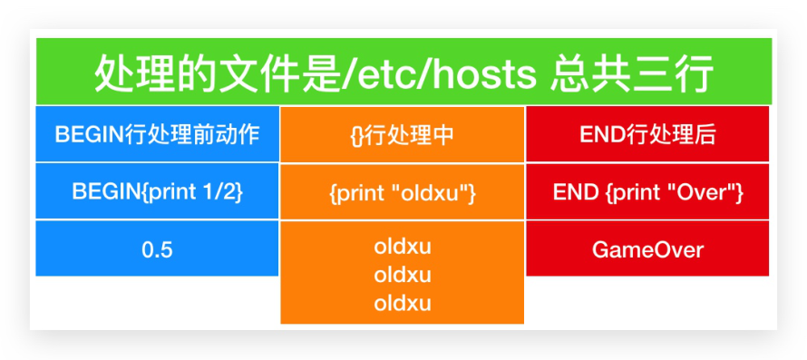

# 06 Shell文本处理工具awk

## 目录

- [2.Awk文本处理](#2.awk文本处理)
  - [2.1 什么是awk](#2.1-什么是awk)
  - [2.2 Awk语法格式](#2.2-awk语法格式)
  - [2.3 Awk工作原理](#2.3-awk工作原理)
- [4.awk行处理时使用了print函数打印分割后的字段](#4.awk行处理时使用了print函数打印分割后的字段)
  - [2.4 Awk内部变量](#2.4-awk内部变量)
    - [2.4.2 FS指定分隔符](#2.4.2-fs指定分隔符)
- [1.输出文件中的第一列](#1.输出文件中的第一列)
- [1990 1991 1992 1993](#1990-1991-1992-1993)
- [1990 1991 1992 1993 1994](#1990-1991-1992-1993-1994)
    - [2.4.2 NF获取最后一列](#2.4.2-nf获取最后一列)
    - [2.4.2 NR获取每行行号](#2.4.2-nr获取每行行号)
- [1 ll 1990 50 51](#1-ll-1990-50-51)
- [2 kk 1991 60 52](#2-kk-1991-60-52)
- [3 hh 1992 70 53](#3-hh-1992-70-53)
- [4 jj 1993 80 54](#4-jj-1993-80-54)
    - [2.4.2 RS读入行分隔符](#2.4.2-rs读入行分隔符)
- [1.准备文件内容](#1.准备文件内容)
    - [2.4.2 OFS输出字段分隔符](#2.4.2-ofs输出字段分隔符)
    - [2.4.2 ORS输出行分隔符](#2.4.2-ors输出行分隔符)
  - [2.5 Awk格式输出Printf](#2.5-awk格式输出printf)
    - [2.5.1 printf语法](#2.5.1-printf语法)
    - [2.5.1 printf示例](#2.5.1-printf示例)
    - [2.5.1 printf实践](#2.5.1-printf实践)
  - [2.6 Awk模式匹配](#2.6-awk模式匹配)
    - [2.6.1 RegExp示例](#2.6.1-regexp示例)
    - [2.6.2 匹配运算符示例](#2.6.2-匹配运算符示例)
    - [2.6.3 布尔运算匹配符示例](#2.6.3-布尔运算匹配符示例)
    - [2.6.4 数学运算符匹配示例](#2.6.4-数学运算符匹配示例)
  - [2.7 Awk条件判断](#2.7-awk条件判断)
    - [2.7.1 单分支判断](#2.7.1-单分支判断)
    - [2.7.2 双分支判断](#2.7.2-双分支判断)
    - [2.7.2 多分支判断](#2.7.2-多分支判断)
- [50大于100、或UID大于100的用户名以及UID](#50大于100或uid大于100的用户名以及uid)
  - [2.8 Awk循环语句](#2.8-awk循环语句)
    - [2.8.1 while循环](#2.8.1-while循环)
    - [2.8.2 for循环](#2.8.2-for循环)
    - [2.8.3 循环场景示例](#2.8.3-循环场景示例)
- [1.Awk数组](#1.awk数组)
  - [1.1 什么是awk数组](#1.1-什么是awk数组)
  - [1.2 awk数组应用场景](#1.2-awk数组应用场景)
  - [1.3 awk数组统计技巧](#1.3-awk数组统计技巧)
  - [1.4 awk数组的语法](#1.4-awk数组的语法)
  - [1.5 Awk数组示例](#1.5-awk数组示例)
    - [1.5.1 统计访问地址前TOP10](#1.5.1-统计访问地址前top10)
    - [1.5.2 统计访问页面前TOP10](#1.5.2-统计访问页面前top10)
    - [1.5.2 统计访问次数大于1000的IP](#1.5.2-统计访问次数大于1000的ip)
    - [1.5.4 统计每个URL访问内容总大小](#1.5.4-统计每个url访问内容总大小)
    - [1.5.4 统计状态码为404出现的次数](#1.5.4-统计状态码为404出现的次数)
- [3.Awk数组案例](#3.awk数组案例)
  - [3.1 模拟数据脚本](#3.1-模拟数据脚本)
- [8302 records into datebase:product](#8302-records-into-datebaseproduct)
- [16106 records into datebase:product](#16106-records-into-datebaseproduct)
- [1133 records into datebase:product](#1133-records-into-datebaseproduct)
- [8894 records into datebase:product](#8894-records-into-datebaseproduct)
- [8248 records into datebase:product](#8248-records-into-datebaseproduct)
  - [3.2 awk数组实践](#3.2-awk数组实践)

```
awk
```
# 06 Shell文本处理工具awk

徐亮伟, 江湖人称标杆徐。多年互联网运维工作经 验，曾负责过大规模集群架构自动化运维管理工作。 擅长Web集群架构与自动化运维，曾负责国内某大型 电商运维工作。 个人博客"徐亮伟架构师之路"累计受益数万人。 笔者Q:552408925、572891887 架构师群:471443208

## 2.Awk文本处理

### 2.1 什么是awk

awk不仅仅是一个文本处理工具，通常用于处理数据 并生成结果报告。 当然awk也是一门编程语言，是linux上功能最强大 的数据处理工具之一。

### 2.2 Awk语法格式

```
第一种形式：awk 'BEGIN{} pattern {commands}
END {}' file_name
第二种形式：standard output | awk BEGIN{}
pattern {commands} END {}
```
第三种形式：awk  -f awk-script-file filenames 语法格式 含义 BEGIN {} 正式处理数据之前执行 pattern 匹配模式,正则表达式；grep {commands} 处理命令，可能多行 {print $2,$3} END{} 处理完所有匹配数据后执行



含义解释： BEGIN 发生在读文件之前，所有会在处理之前就 执行了1/2。 {}表示处理文件的过程，由于文件内有三行，所 以会执行三次print。 END{} 表示文件处理完毕后的动作。

### 2.3 Awk工作原理

```
# awk -F: '{print $1,$3}' /etc/passwd
```

1.awk将文件中的每一行作为输入, 并将每一行赋给内部 变量$0, 以换行符结束 2.awk开始进行字段分解，每个字段存储在已编号的变量 中，从$1开始[默认空格分割] 3.awk默认字段分隔符是由内部FS变量来确定, 可以使 用-F修订

## 4.awk行处理时使用了print函数打印分割后的字段

5.awk在打印后的字段加上空格，因为$1,$3 之间有一 个逗号。逗号被映射至OFS内部变量中，称为输出字段

分隔符， OFS默认为空格. 6.awk输出之后，将从文件中获取另一行，并将其存储 在$0中，覆盖原来的内容，然后将新的字符串分隔成字 段并进行处理。该过程将持续到所有行处理完毕

1.读入一行文件，默认是以 换行作为读入分隔符的 （RS），读入进来后，会赋值给$0，同时会为其编号赋 值给NR变量； 2.检查FS变量是否有指定字段分隔符，按照字段分隔符 拆分成列的形式，将每一列的内容赋值给对应的 $1 $2 $3 等内部变量。同时会将分隔后的总列数赋值给 NF变 量； 3.输出内容，输出时候会使用print，$1,$3 这个逗号是 输出字段分隔符，由OFS变量控制，默认是空； 4.输出内容默认是按照换行符展示，由ORS控制，控制 输出行分隔符，默认是换行符；

### 2.4 Awk内部变量

内置变量 含义 $0 整行内容 $1-$n 当前行的第1-n个字段 NF 当前行的字段个数，也就是多少 列 NR 当前的行号，从1开始计数 FS 输入字段分隔符。不指定默认以 空格或tab键分割 RS 输入行分隔符。默认回车换行 OFS 输出字段分隔符。默认为空格 ORS 输出行分隔符。默认为回车换行 要想了解awk的一些内部变量需要先准备如下数据文 件。

```
[root@oldxu ~]# cat awk_file.txt
```
ll 1990 50 51 61 kk 1991 60 52 62 hh 1992 70 53 63 jj 1993 80 54 64 mm 1994 90 55

#### 2.4.2 FS指定分隔符

```
awk 通过内置变量，FS来指定字段分割符， 默认以 空白行作为分隔符
```
## 1.输出文件中的第一列

```
[root@oldxu ~]# awk '{print $1}'
awk_file.txt
```
ll kk hh jj mm 2.修改文件，然后指定多个分隔符，获取第一列内容

```
[root@oldxu ~]# cat awk_file.txt
ll:1990 50 51 61
kk:1991 60 52 62
```
hh 1992 70 53 63 jj 1993 80 54 64 mm 1994 90 55 65 #以冒号或空格为分隔符

```
[root@oldxu ~]# awk -F '[: ]' '{print $2}'
awk_file.txt
```
## 1990 1991 1992 1993

```
[root@oldxu ~]# cat awk_file.txt
ll::1990 50 51 61
kk:1991 60 52 62
```
hh 1992 70 53 63 jj 1993 80 54 64 mm 1994 90 55 65 #[: ]+连续的多个冒号当一个分隔符，连续的多个空格当 一个分隔符，连续空格和冒号也当做一个字符来处理

```
[root@oldxu ~]# awk -F '[: ]+' '{print $2}'
awk_file.txt
```
## 1990 1991 1992 1993 1994

#### 2.4.2 NF获取最后一列

```
awk 通过内置变量，NF保存每行的最后一列内容 1.通过print打印，NF和$NF，你发现了什么?
[root@oldxu ~]# awk '{print NF,$NF}'
awk_file.txt
```
2.如果将文件第五行的55置为空，那么该如何在获取最 后一列的数字?

```
[root@oldxu ~]# awk '{print $5}'
awk_file.txt
```
61 62 63 64 #最后一列为空，为什么? 3.使用$NF，再次打印测试；

```
[root@oldxu ~]# awk '{print $NF}'
awk_file.txt
```
61 62 63 64 65      # 能成功打印的原因，是因为$NF提取的为最后 一列

4.如果一个文件很长，靠数列数需要很长的时间，那如 何快速打印倒数第二列

```
[root@oldxu ~]# awk '{print $(NF-1)}'
awk_file.txt
```
51 52 53 54

#### 2.4.2 NR获取每行行号

```
awk 通过内置变量，NR 获取每行行号 1.使用print打印NR变量，会发现NR会记录每行文件的 行号
[root@oldxu ~]# awk '{print NR,$0}'
awk_file.txt
```
## 1 ll 1990 50 51

## 2 kk 1991 60 52

## 3 hh 1992 70 53

## 4 jj 1993 80 54

5 mm 1994 90

2.如果想打印第二行到第三行的内容，怎么做；

```
[root@oldxu ~]# awk 'NR>1&&NR<4 {print
NR,$0}' awk_file.txt
```
如果想打印第三行，怎么做

```
[root@oldxu ~]# awk 'NR==3 {print NR,$00}'
awk_file.txt
```
3.如果想打印第三行，同时还要打印第一列；

```
[root@oldxu ~]# awk 'NR==3 {print NR,$1}'
awk_file.txt
```
#### 2.4.2 RS读入行分隔符

```
awk 通过内置变量RS，对读入的文本进行分隔符指 定；
```
## 1.准备文件内容

```
[root@oldxu ~]# cat file.txt
Linux|Shell|Nginx--docker|Gitlab|jenkins--
```
mysql|redis|mongodb 2.读入文件，并以--作为读入分隔符，然后将文件拆分为 三列；

```
[root@oldxu ~]# awk 'BEGIN{RS="--"}{print
$0}' file.txt
Linux|Shell|Nginx
docker|Gitlab|jenkins
mysql|redis|mongodb
```
#### 2.4.2 OFS输出字段分隔符

awk内置变量OFS，输出字段分隔符，初始情况下 OFS变量是空格。

```
[root@oldxu ~]# awk 'BEGIN{RS="--
";FS="|";OFS=":"} {print $1,$3}' file.txt
Linux:Nginx
docker:jenkins
mysql:mongodb
```
#### 2.4.2 ORS输出行分隔符

awk内置变量ORS，输出行分隔符，默认行分割符为

```
\n
[root@oldxu ~]# awk 'BEGIN{RS="--
";FS="|";OFS=":";ORS="==="} {print $1,$3}'
```
file.txt

```
Linux:Nginx===docker:jenkins===mysql:mongod
```
b

### 2.5 Awk格式输出Printf

```
awk 可以通过 printf 函数生成非常漂亮的数据报 表。
```
#### 2.5.1 printf语法

格式符 含义 %s 打印字符串 %d 打印十进制数（整数） %f 打印一个浮点数（小数） %x 打印十六进制数 修饰符 含义 - 左对齐 + 右对齐

#### 2.5.1 printf示例

1.printf默认没有分隔符。

```
[root@oldxu ~]# awk 'BEGIN{FS=":"}{printf
$1}' /etc/passwd
```
rootbindaemonadm 2.加入换行，格式化输出。

```
[root@oldxu ~]# awk 'BEGIN{FS=":"}{printf
"%s\n",$1}' /etc/passwd
```
root bin daemon adm 3.使用占位符美化输出。

```
[root@oldxu ~]# awk 'BEGIN{FS=":"} {printf
"%20s %20s\n",$1,$7}' /etc/passwd
                root            /bin/bash
                 bin        /sbin/nologin
              daemon        /sbin/nologin
                 adm        /sbin/nologin
```
4.默认右对齐，-表示左对齐。

```
[root@oldxu shell-awk]# awk 'BEGIN{FS=":"}
{printf "%-20s %-20s\n",$1,$7}' /etc/passwd
root                 /bin/bash
bin                  /sbin/nologin
daemon               /sbin/nologin
adm                  /sbin/nologin
```
#### 2.5.1 printf实践

美化一个成绩表；

```
[root@oldxu shell-awk]# cat
>>student.txt<<EOF
```
oldxu       80    90    96    98 xiaowang    93    98    92    91 xiaohong    78    76    87    92 xiaoming    86    89    68    92 xiaoxiao    85    95    75    90 EOF 编写awk处理脚本

```
[root@oldxu shell-awk]# cat student.awk
BEGIN {
    printf "%-10s%-10s%-10s%-10s%-10s\n",
"Name","Yuwen","Shuxue","yinyu","qita"
}
{
"%-10s%-10d%-10d%-10d%-10d\n",$1,$2,$3,$4,$

}
```
最终处理的结果

```
[root@oldxu shell-awk]# awk -f student.awk
```
student.txt name      Yuwen     shuxue    yinyu qita oldxu       80        90        96 98 xiaowang    93        98        92 91 xiaohong    78        76        87 92 xiaoming    86        89        68 92 xiaoxiao    85        95        75

### 2.6 Awk模式匹配

```
awk 第一种模式匹配：RegExp
awk 第二种模式匹配：运算匹配、布尔值匹配、数学 运算符匹配
```
#### 2.6.1 RegExp示例

1.匹配 /etc/passwd 文件行中含有 root 字符串的所

有行。

```
[root@oldxu ~]# awk
'BEGIN{FS=":"}/root/{print $0}' passwd
```
2.匹配 /etc/passwd 文件行中以 root 开头的行。

```
[root@oldxu ~]# awk '/^root/{print $0}'
passwd 3.匹配 /etc/passwd 文件行中 /bin/bash 结尾的行。
[root@oldxu ~]# awk '/\/bin\/bash$/{print
$0}' passwd
```
#### 2.6.2 匹配运算符示例

匹配运算符： <：大于 >：大于 <=：小于等于 >=：大于等于 ==：等于 !=：不等于 ~：正则匹配 !~：不匹配正则 1.以:为分隔符，匹配/etc/passwd文件中第3个字段小 于50的行

```
[root@oldxu ~]# awk
'BEGIN{FS=":"}$3<50{print $0}' passwd
```
2.以:为分隔符，匹配/etc/passwd文件中第3个字段大 于50的行

```
[root@oldxu ~]# awk
'BEGIN{FS=":"}$3>50{print $0}' passwd
```
3.以:为分隔符，匹配/etc/passwd文件中第7个字段 为/bin/bash的行

```
[root@oldxu ~]# awk
'BEGIN{FS=":"}$7=="/bin/bash"{print $0}'
passwd 4.以:为分隔符，匹配/etc/passwd文件中第7个字段不 为/bin/bash的行
[root@oldxu ~]# awk
'BEGIN{FS=":"}$7!="/bin/bash"{print $0}'
passwd 5.以:为分隔符，匹配/etc/passwd文件中第3个字段包 含3个数字以上的行
[root@oldxu ~]# awk 'BEGIN{FS=":"}$3 ~ /[0-
9]{3,}/{print $0}' passwd
```
#### 2.6.3 布尔运算匹配符示例

```
布尔运算： &&：与 |：或 !：非
```
1.以:为分隔符，匹配passwd文件中包含ftp或mail的 行。

```
[root@oldxu ~]# awk 'BEGIN{FS=":"}$1=="ftp"
|| $1=="mail" {print $0}' passwd
```
2.以:为分隔符，匹配passwd文件中第3个字段小于50 并且第4个字段大于50的所有行信息。

```
[root@oldxu ~]# awk 'BEGIN{FS=":"}$3<50 &&
$4>50{print $0}' passwd
```
3.匹配没有/sbin/nologin 的行。

```
[root@oldxu ~]# awk 'BEGIN{FS=":"} $0 !~
/\/sbin\/nologin/{print $0}' passwd
```
#### 2.6.4 数学运算符匹配示例

加减乘除运算符： +：加 -：减 *：乘 /：除 %：模 1.计算学生课程分数平均值，学生课程文件内容如下：

```
[root@oldxu shell-awk]# cat
>>student.txt<<EOF
```
oldxu       80    90    96    98 xiaowang    93    98    92    91 xiaohong    78    76    87    92 xiaoming    86    89    68    92 xiaoxiao    85    95    75    90 EOF 2.编写awk脚本，实现学员成绩平均值

```
number=10
awk 'BEGIN {number=10;} {print number/2 }'
awk -v number=$numer '{print number/2 }'
[root@oldxu shell-awk]# cat student.awk
BEGIN {
"%-10s%-10s%-10s%-10s%-10s%-10s\n",

"Name","Yuwen","Shuxue","yinyu","qita","AV G"

}
{
    total=$2+$3+$4+$5
    avg=total/(NF-1)
"%-10s%-10d%-10d%-10d%-10d%-10d\n",$1,$2,$3
,$4,$5,avg
}

[root@oldxu shell-awk]# awk -f student.awk
```
student.txt Name      Yuwen     Shuxue    yinyu qita      AVG oldxu     80        90        96        98 91 xiaowang  93        98        92        91 93 xiaohong  78        76        87        92 83 xiaoming  86        89        68        92 83 xiaoxiao  85        95        75        90

### 2.7 Awk条件判断

#### 2.7.1 单分支判断

if语句格式: { if(表达式)｛语句;语句;... ｝ } 1.以:为分隔符，打印当前管理员用户名称

```
[root@oldxu ~]# awk -F: '{ if($3==0){print
$1 "is adminisitrator"} }' /etc/passwd
```
2.以:为分隔符，统计系统用户数量

```
[root@oldxu ~]# awk -F: '{ if($3>0 &&
$3<1000){i++}} END {print i}' passwd
```
3.以:为分隔符，统计普通用户数量

```
[root@oldxu ~]# awk -F: '{ if($3>1000)
{i++}} END {print i}' passwd
```
4.以:为分隔符，只打印/etc/passwd中第3个字段的数 值在50-100范围内的行

```
[root@oldxu ~]# awk 'BEGIN{FS=":"}{if($3>50
&& $3<100) print $0}' passwd
```
#### 2.7.2 双分支判断

```
if...else 语句格式: {if(表达式)｛语句;语句;... ｝ else{语句;语句;...}} 1.以:为分隔符，判断第三列如果等于0，则打印该用户名 称，如果不等于0则打印第七列。
[root@oldxu ~]# awk 'BEGIN{FS=":"} { if
($3==0) { print $1 }
else { print $7 }  }'
/etc/passwd
```
2.以:为分隔符，判断第三列如果等于0，那么则打印管理 员出现的个数，否则都视为系统用户，并打印它的个数

```
[root@oldxu ~]# awk 'BEGIN{FS=":";OFS="\n"}
{
if($3==0) { i++ }
else { j++ } } END {
```
print i" 个管理员" , j" 个系统用户" }'

```
/etc/passwd
```
#### 2.7.2 多分支判断

```
if...else if...else 语句格式: { if(表达式 1) {语 句;语句；...} else if(表达式 2) {语句;语句；... } else｛语句;语句；... }}
```
## 1.使用 awk if 打印出当前 /etc/passwd 文件管理员有

多少个，系统用户有多少个，普通用户有多少个

```
[root@oldxu shell-awk]# cat
passwd_count.awk
```
#行处理前

```
BEGIN{
    FS=":";OFS="\n"
}
```
#行处理中

```
{
    if($3==0)
        { i++ }
else
if ($3>0 && $3<1001)
        { j++ }

else

        { k++ }
}
```
#行处理后

```
END {
```
print i" 个管理员", j" 个系统用户", k" 个普通用户"

```
}
```
结果 管理员个数1 系统用户个数29 系统用户个数69

## 50大于100、或UID大于100的用户名以及UID

```
[root@oldxu ~]# cat if.awk
BEGIN{
    FS=":"
}
{
    if($3<50)
    {
"%-20s%-20s%-10d\n","UID<50",$1,$3
    }

else
if ($3>50 && $3<100)
    {
"%-20s%-20s%-10d\n","50<UID<100",$1,$3
    }

else

    {
"%-20s%-20s%-10d\n","UID>100",$1,$3
    }

执行结果

UID<50        root          0
UID<50        bin           1
50<UID<100    nobody        99
50<UID<100    dbus          81
UID>100       systemd       192
UID>100       chrony        998
```
3.计算下列每个同学的平均分数，并且只打印平均分数 大于90的同学姓名和分数信息 # 数据

```
[root@oldxu ~]# cat >>student.txt<<EOF
```
oldxu       80    90    96    98 xiaowang    93    98    92    91 xiaohong    78    76    87    92 xiaoming    86    89    68    92 xiaoxiao    85    95    75

EOF #awk处理脚本

```
[root@dns-master ~]# cat student.awk
BEGIN{
"%-20s%-20s%-20s%-20s%-20s%-20s\n",

"Name","Chinese","English","Math","Physical ","Average"

}
{
    sum=$2+$3+$4+$5
    avg=sum/4
    if (avg>90) {
"%-20s%-20d%-20d%-20d%-20d%-0.2f\n",
        $1,$2,$3,$4,$5,avg
    }

结果 Name Chinese English Math Physical Average oldxu 80 90 96 98 91.00

xiaowang        93              98 92              91              93.50

### 2.8 Awk循环语句

while循环： for循环：

#### 2.8.1 while循环

while循环：while(条件表达式)  动作

[root@oldxu ~]# awk 'BEGIN{ i=1;
while(i<=10){print i; i++} }'
[root@oldxu ~]# awk -F: '{i=1; while(i<=NF)
{print $i; i++}}' /etc/passwd
[root@oldxu ~]# awk -F: '{i=1; while(i<=10)
{print $0; i++}}' /etc/passwd
[root@oldxu ~]#cat b.txt
```
111

333 444

666 777 888

```
[root@oldxu ~]# awk '
    {
        i=1;
        while(i<=NF) {
            print $i; i++
        }
    }' b.txt
```
#### 2.8.2 for循环

for循环：for(初始化计数器;计数器测试;计数器变 更) 动作 #C 风格 for

```
[root@oldxu ~]# awk
'BEGIN{for(i=1;i<=5;i++){print i} }'
```
#将每行打印 10 次

```
[root@oldxu ~]# awk -F: '{
for(i=1;i<=10;i++) {print $0} }' passwd
[root@oldxu ~]# awk -F: '{
for(i=1;i<=NF;i++) {print $i} }' passwd
```
#### 2.8.3 循环场景示例

需求：计算1+2+3+4+...+100的和，请使用while、 for两种循环方式实现 # while循环

```
[root@oldxu ~]# cat add_while.awk
BEGIN{
    while(i<=100)
```
一个变量不赋值，默认为0或者空

```
        sum+=i
```
i++

```
    }
```
print sum

```
}
```
for循环

```
[root@oldxu ~]# cat add_for.awk
BEGIN{
    for(i=0;i<=100;i++)
    {
        sum+=i
    }
```
print sum

```
}
```
## 1.Awk数组

### 1.1 什么是awk数组

数组其实也算是变量, 传统的变量只能存储一个值， 但数组可以存储多个值。 不区分 关联数组   普通数组；

### 1.2 awk数组应用场景

通常用来统计、比如：统计网站访问TOP10、网站 Url访问TOP10等等等

### 1.3 awk数组统计技巧

1.在awk中，使用数组时，不仅可以使用1 2 3 ..n 作为数组索引，也可以使用字符串作为数组索引。

2.要统计某个字段的值，就将该字段作为数组的索 引，然后对索引进行遍历。 1.统计谁旧将谁作为索引的名称； 2.然后让其相同的进行自增； 3.遍历索引名称，获取对应出现的值，也就是次 数；

### 1.4 awk数组的语法

```
语法：array_name[index]=value
```
示例：统计 /etc/passwd 中各种类型 shell 的数 量。

```
[root@oldxu shell-awk]# cat
passwd_count.awk
BEGIN{
    FS=":"
}
```
#赋值操作（因为awk是一行一行读入的，相当是循环了整个 文件中的内容）

```
{
    hosts[$NF]++
}
```
#赋值完成后，需要通过循环的方式将其索引的次数遍历出 来

```
END {
    for (item in hosts) {
```
print item,

```
        hosts[item]
    }
```
2.统计主机上所有的tcp链接状态数，按照每个tcp 状态分类。

```
[root@Shell ~]# netstat -an | grep tcp |
awk '{arr[$6]++}END{for (i in arr) print
i,arr[i]}'
```
### 1.5 Awk数组示例

使用awk完成对Nginx的日志分析，日志格式如下：

```
log_format  main  '$remote_addr -
$remote_user [$time_local] "$request" '
                      '$status
$body_bytes_sent "$http_referer" '
                      '"$http_user_agent"
"$http_x_forwarded_for"';
52.55.21.59 - - [25/Jan/2018:14:55:36
+0800] "GET /feed/ HTTP/1.1" 404 162
"https://www.google.com/" "Opera/9.80
(Macintosh; Intel Mac OS X 10.6.8; U; de)
Presto/2.9.168 Version/11.52" "-"
```
#### 1.5.1 统计访问地址前TOP10

统计一天内访问最多的10个IP

```
[root@oldxu ~]# cat ngx_top_10
{
    cip[$1]++
}
END{
    for ( item in cip ) {
        print item,cip[item]
    }
```
#### 1.5.2 统计访问页面前TOP10

统计访问最多的10个页面($request top 10)

```
[root@oldxu ~]# cat ngx_request_top_10
{
    request[$7]++
}
END{
    for ( item in request ) {
        print item,request[item]
    }
```
#### 1.5.2 统计访问次数大于1000的IP

```
[root@oldxu ~]# cat ngx_top_10_2
{
    cip[$1]++
}
END{
    for ( item in cip ) {
        if (cip[item] > 10000) {
            print item,cip[item]
        }
```
#### 1.5.4 统计每个URL访问内容总大小

统计每个URL访问内容总大小($body_bytes_sent)

```
[root@web01 awk_nginx]# cat
ngx_request_size
{
```
#相同的url会自动累加其大小

```
    url[$7]+=$10
    url[$7]++
}
END{
    for ( item in url ){
```
print item,

```
url[item]/1024/1024"Mb"
    }
```
#### 1.5.4 统计状态码为404出现的次数

统计访问状态码为404及出现的次数($status)

```
[root@oldxu ~]# cat ngx_status_top_404
{
    status[$9]++
}
END{
    for ( item in status) {
        if (item == 404 ) {
            print item,status[item]
        }
```
## 3.Awk数组案例

### 3.1 模拟数据脚本

1.模拟生产环境数据脚本，需要跑大约30~60s(等待一段 时间ctrl+c结束即可)

```
[root@localhost shell]# cat insert.sh
#!/bin/bash
function create_random()
{
    min=$1
    max=$(($2-$min+1))
    num=$(date +%s%N)
    echo $(($num%$max+$min))
}
INDEX=1

while true
do
for user in oldxu xiaowang xiaohong xiaoming xiaoqiang xiaoxiao
do

        COUNT=$RANDOM
        NUM1=`create_random 1 $COUNT`
        NUM2=`expr $COUNT - $NUM1`
        echo "`date '+%Y-%m-%d %H:%M:%S'`
$INDEX user: $user insert $COUNT records
into datebase:product table:detail, insert
$NUM1 records successfully,failed $NUM2
records" >> ./db.log.`date +%Y%m%d`
        INDEX=`expr $INDEX + 1`
done done 数据格式如下： $5 用户名称 $7 插入数据的总的次数            8302
```
$13 有多少条数据插入成功          1166 $16 有多少条数据插入失败          7136

```
array[$5]+=$7
success[$5]+=$13
failed[$5]+=$16
2019-11-06 18:25:53 1 user: oldxu insert
## 8302 records into datebase:product
table:detail, insert 1166 records
```
successfully,failed 7136 records

```
2019-11-06 18:25:53 2 user: oldxu insert
## 16106 records into datebase:product
table:detail, insert 15215 records
```
successfully,failed 891 records

```
2019-11-06 18:25:53 3 user: xiaohong insert
## 1133 records into datebase:product
table:detail, insert 995 records
```
successfully,failed 138 records

```
2019-11-06 18:25:53 4 user: xiaoming insert
## 8894 records into datebase:product
table:detail, insert 7375 records
```
successfully,failed 1519 records

```
2019-11-06 18:25:53 5 user: xiaoxiao insert
## 8248 records into datebase:product
table:detail, insert 3554 records
```
successfully,failed 4694 records

### 3.2 awk数组实践

需求1：统计每个人分别插入了多少条 records 进数 据库

```
[root@lb01 ~]# awk '
BEGIN {
    printf "%-20s%-20s\n","User","Total
records"
}
{
    success[$5]+=$7
    #success[$5]=success[$5]+$7
}
END {
    for (u in success)
    printf "%-20s%20d\n",u,success[u]
}' db.log.20191106
```
需求2：统计每个人分别插入成功了多少record，失 败了多少record

```
[root@lb01 ~]# awk '
BEGIN {
"%-20s%-20s%-20s\n","User","Success","Faile

d"

}
{
    success[$5]+=$13
    failed[$5]+=$16
}
END {
    for (u in success)
"%-20s%-20d%-20d\n",u,success[u],failed[u]
}' db.log.20191106

需求3：将需求1和需求2结合起来，一起输出，输出 每个人分别插入多少条数据，多少成功，多少失败， 并且要格式化输出，加上标题

[root@lb01 ~]# awk '
BEGIN {
"%-20s%-20s%-20s%-20s\n","User","Total","Su

ccess","Failed"

}
{
    success[$5]+=$13
    failed[$5]+=$16
}
END {
    for (u in success)
"%-20s%-20s%-20d%-20d\n",u,success[u]+faile
d[u],success[u],failed[u]
}' db.log.20191106

需求4：在例子3的基础上，加上结尾，统计全部插入 记录数，成功记录数，失败记录数。

[root@lb01 ~]# awk '
BEGIN {
"%-20s%-20s%-20s%-20s\n","User","Total","Su

ccess","Failed"

}
{
    total[$5]+=$7
    success[$5]+=$13
    failed[$5]+=$16
```
#在原始数据进行统计累计

```
    total_sum+=$7
    success_sum+=$13
    failed_sum+=$16
}
END {
    for (u in success) {
"%-20s%-20s%-20d%-20d\n",u,total[u],success
[u],failed[u]
    }

"%-20s%-20s%-20d%-20d\n","total",total_sum,
success_sum,failed_sum
}' db.log.20191106
```
