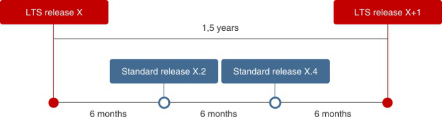
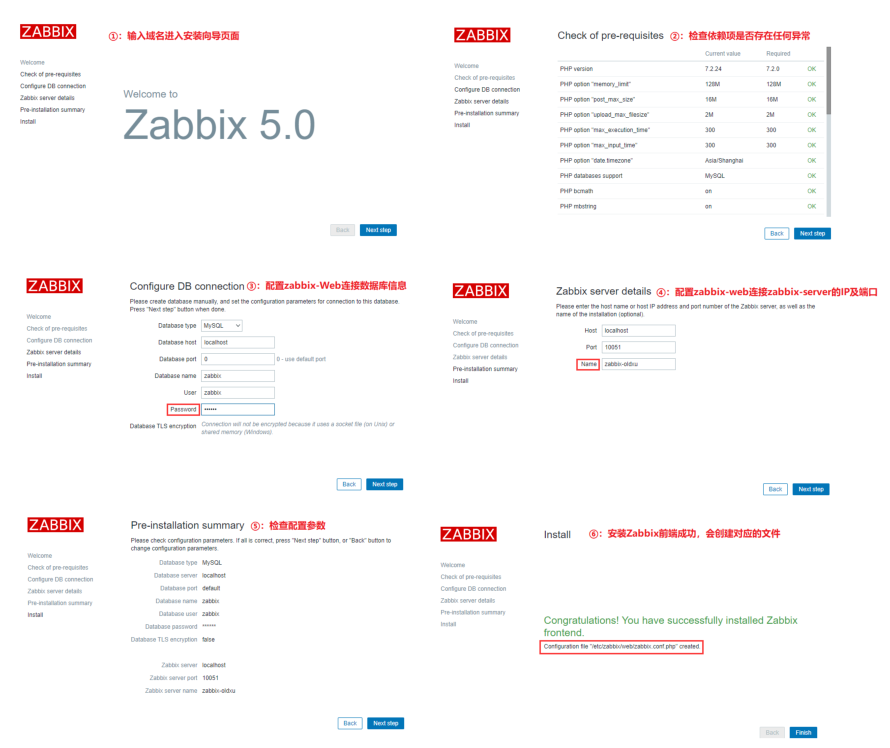
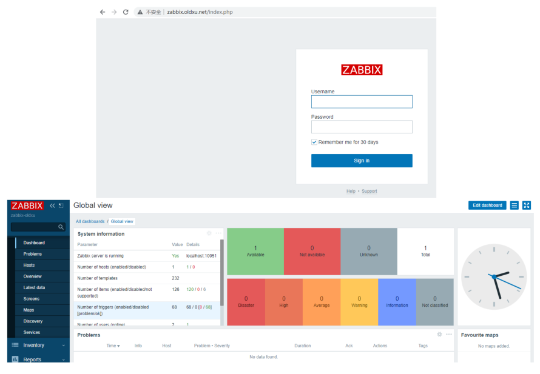
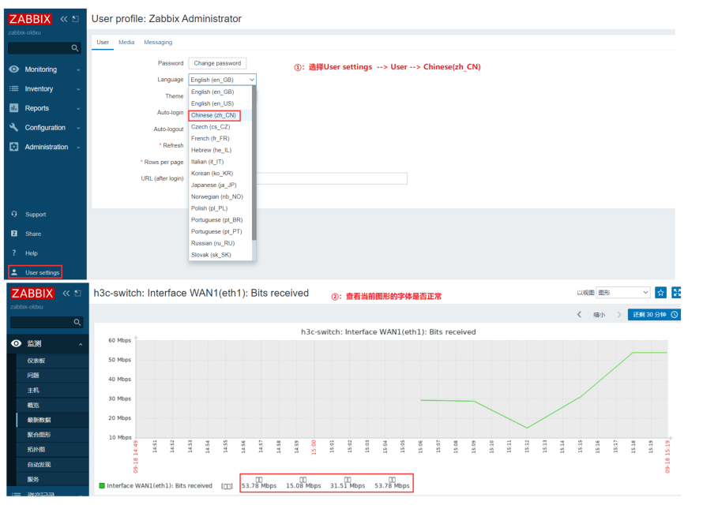
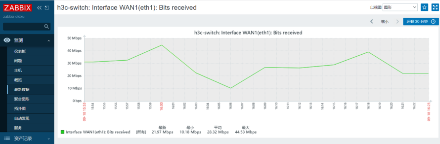
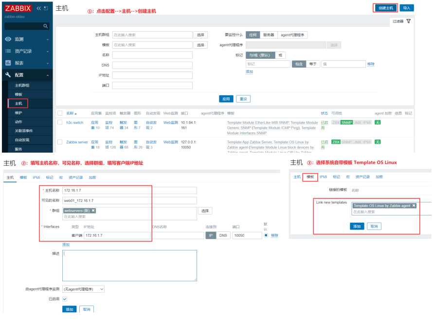
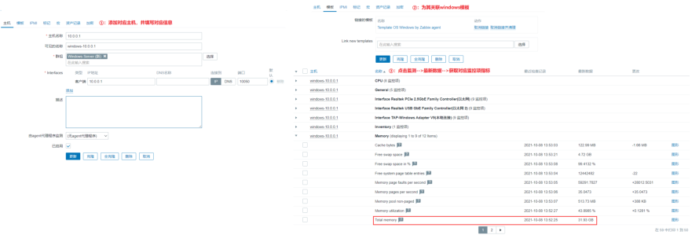
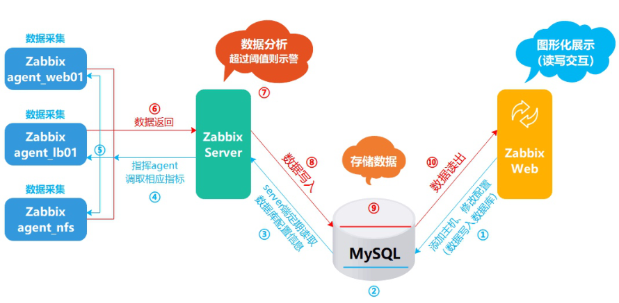

# 01.Zabbix监控快速入门

## 目录

- [4.zabbix5.0系统概述](#4.zabbix5.0系统概述)
- [1.监控知识基本概述](#1.监控知识基本概述)
  - [1.1 什么是监控](#1.1-什么是监控)
  - [1.2 为何需要监控](#1.2-为何需要监控)
  - [1.3 如何进行监控](#1.3-如何进行监控)
- [1.如何查看磁盘使用率df -h](#1.如何查看磁盘使用率df--h)
- [2.监控磁盘的那些指标block、inode](#2.监控磁盘的那些指标blockinode)
- [4.获取的数值到达多少报警 80%](#4.获取的数值到达多少报警-80)
- [2.单机时代如何监控](#2.单机时代如何监控)
  - [2.1 CPU](#2.1-cpu)
  - [2.2 内存](#2.2-内存)
  - [2.3 磁盘](#2.3-磁盘)
  - [96.32 11052707 3539272](#96.32-11052707-3539272)
  - [2.4 网络](#2.4-网络)
- [0b 9.53Kb 6.11Kb](#0b-9.53kb-6.11kb)
  - [2.5 TCP](#2.5-tcp)
  - [2.6 监控脚本示例](#2.6-监控脚本示例)
- [1.如何提取用户数量](#1.如何提取用户数量)
- [2.根据提取用户数量进行比对](#2.根据提取用户数量进行比对)
- [3.常见的监控方案](#3.常见的监控方案)
  - [3.1 Cacti](#3.1-cacti)
  - [3.2 Nagios](#3.2-nagios)
  - [3.3 夜莺](#3.3-夜莺)
  - [3.4 Zabbix](#3.4-zabbix)
  - [3.5 Prometheus](#3.5-prometheus)
  - [3.6 商业监控方案](#3.6-商业监控方案)
  - [4.1 zabbix应用场景](#4.1-zabbix应用场景)
  - [4.2 zabbix发布频率](#4.2-zabbix发布频率)
  - [4.3 zabbix版本特性](#4.3-zabbix版本特性)
  - [4.4 zabbix功能组件](#4.4-zabbix功能组件)
    - [4.4.1 Agent2](#4.4.1-agent2)
    - [4.4.2 Server](#4.4.2-server)
    - [4.4.3 Database](#4.4.3-database)
    - [4.4.4 Web monitor](#4.4.4-web-monitor)
    - [4.4.5 Proxy](#4.4.5-proxy)
  - [4.5 zabbix逻辑架构](#4.5-zabbix逻辑架构)
    - [4.5.1 数据采集](#4.5.1-数据采集)
    - [4.5.2 数据存储](#4.5.2-数据存储)
    - [4.5.3 数据分析](#4.5.3-数据分析)
    - [4.5.4 数据展示](#4.5.4-数据展示)
- [1.数据库](#1.数据库)
  - [5.1 安装zabbix仓库](#5.1-安装zabbix仓库)
  - [5.2 安装zabbix Server](#5.2-安装zabbix-server)
  - [5.3 安装Zabbix frontend](#5.3-安装zabbix-frontend)
  - [5.4 安装并初始化数据库](#5.4-安装并初始化数据库)
- [1.安装数据库](#1.安装数据库)
  - [5.5 为Zabbix配置数据库](#5.5-为zabbix配置数据库)
  - [5.6 为Zabbix前端配置PHP](#5.6-为zabbix前端配置php)
  - [5.7 启动Zabbix server和agent](#5.7-启动zabbix-server和agent)
  - [5.8 配置ZabbixWeb前端](#5.8-配置zabbixweb前端)
  - [5.9 登录ZabbixWeb前端](#5.9-登录zabbixweb前端)
- [6.Zabbix监控中文汉化](#6.zabbix监控中文汉化)
  - [6.1 修改前端页面语言](#6.1-修改前端页面语言)
  - [6.2 替换字体并解决乱码](#6.2-替换字体并解决乱码)
- [1.检查zabbix字体存放目录](#1.检查zabbix字体存放目录)
- [2.进行字体修改](#2.进行字体修改)
  - [6.3 重载页面并验证字体](#6.3-重载页面并验证字体)
- [7.zabbix添加Linux主机监控](#7.zabbix添加linux主机监控)
  - [7.1 环境准备](#7.1-环境准备)
  - [7.2 安装zabbix-agent2](#7.2-安装zabbix-agent2)
- [1.安装Zabbix-Agent被监控端](#1.安装zabbix-agent被监控端)
  - [7.3 配置zabbix-agent2](#7.3-配置zabbix-agent2)
  - [7.4 启动zabbix-agent2](#7.4-启动zabbix-agent2)
  - [7.5 配置Zabbix-web](#7.5-配置zabbix-web)
- [8.zabbix添加Windows主机监](#8.zabbix添加windows主机监)
  - [8.1 下载Zabbix-Agent2](#8.1-下载zabbix-agent2)
  - [8.2 配置Zabbix-Agent2](#8.2-配置zabbix-agent2)
  - [8.3 注册Zabbix-Agent2](#8.3-注册zabbix-agent2)
  - [8.4 服务端测试取值](#8.4-服务端测试取值)
  - [8.5 配置zabbix-Web](#8.5-配置zabbix-web)
- [8.Zabbix数据库拆分](#8.zabbix数据库拆分)
  - [8.1 zabbix基础架构](#8.1-zabbix基础架构)
  - [8.2 拆分数据库环境准备](#8.2-拆分数据库环境准备)
  - [8.3 准备独立数据库](#8.3-准备独立数据库)
  - [8.4 备份旧的数据库](#8.4-备份旧的数据库)
  - [8.5 恢复数据库](#8.5-恢复数据库)
  - [8.6 修改zabbix-server](#8.6-修改zabbix-server)
  - [8.7 修改zabbix-web](#8.7-修改zabbix-web)

## 4.zabbix5.0系统概述

5.zabbix5.x监控安装

徐亮伟, 江湖人称标杆徐。多年互联网运维工作经 验，曾负责过大规模集群架构自动化运维管理工作。 擅长Web集群架构与自动化运维，曾负责国内某大型 电商运维工作。 个人博客"徐亮伟架构师之路"累计受益数万人。

## 1.监控知识基本概述

### 1.1 什么是监控

简单说，就是对系统不间断的进行监视。 超市：防偷， 公路：测速，违章，等； 教室：

系统：

### 1.2 为何需要监控

监控是整个运维乃至整个产品生命周期中最重要的一 环。 1、监控能做到事前及时预警发现故障，事后提供详实的 数据用于追查定位问题。 2、以图形化方式呈现当前系统状态，便于分析或评估系 统性能状态； 3、当出现某些特定故障时，可自动化完成故障处理，也 叫故障自愈；

### 1.3 如何进行监控

比如我们需要监控磁盘的使用率

## 1.如何查看磁盘使用率df -h

## 2.监控磁盘的那些指标block、inode

3.如何获取具体的数值df -h|awk '/\/$/{print

```
$(NF-1)}'
```
## 4.获取的数值到达多少报警 80%

## 2.单机时代如何监控

### 2.1 CPU

```
CPU监控命令: w、top、htop、glances
%Cpu(s):  0.3 us,  0.3 sy,  0.0 ni, 99.3
```
id,  0.0 wa,  0.0 hi,  0.0 si,  0.0 st #us 用户态: 跟用户的操作有关 35% #sy 系统态: 跟内核的处理有关 60% #id CPU空闲:

### 2.2 内存

内存监控命令: free

```
[root@ZabbixServer ~]# free -m
```
total        used        free

```
     shared  buff/cache   available
Mem:            974         440         194
```
4         340

```
Swap:          2047          11        2036
```
free：表示的是当前完全没有被程序使用的内存 # cache：在有需要时，是可以被释放出来以供其它进程使 用的 # available：表示系统目前能提供给新应用程序使用的 内存

### 2.3 磁盘

磁盘监控命令: df、iotop、iostat # 查看进程的读写

```
[root@ZabbixServer ~]# iotop
Total DISK READ :   0.00 B/s | Total DISK
WRITE :       0.00 B/s
Actual DISK READ:   0.00 B/s | Actual DISK
WRITE:       0.00 B/s
```
查看分区的读写

```
[root@ZabbixServer ~]# iostat
avg-cpu:  %user   %nice %system %iowait
```
%steal   %idle 5.69    0.00    1.57    0.04 0.00   92.70

```
Device             tps    kB_read/s
kB_wrtn/s    kB_read    kB_wrtn
```
sda              10.08       300.79

### 96.32   11052707    3539272

tps: 每秒钟发送到的I/O请求数. # Blk_read /s: 每秒读取的数据量 # Blk_read: 读入的总的数据量 # Blk_wrtn/s: 每秒写入的数据量 # Blk_wrtn: 写入的总的数据量

### 2.4 网络

```
网络监控命令: ifconfig、route、glances、iftop、 nethogs
[root@ZabbixServer ~]# iftop
oldxu.net:https   => 101.200.101.219:57456
```
## 0b  9.53Kb  6.11Kb

```
                <=
oldxu.net:https   => 101.200.101.207:65254
```
0b  3.37Kb  1.12Kb #中间的<= =>这两个左右箭头，表示的是流量的方向。

```
TX:             cum:    170KB       #发送流量
RX:                    37.1KB       #接收流量
TOTAL:                  208KB       #总的流量
```
#如果单位为Mbps，换算为MB需要除以8，比如：100Mbps

```
= 12MB
```
### 2.5 TCP

```
[root@ZabbixServer ~]# ss -lntp
[root@ZabbixServer ~]# netstat -lntp
[root@ZabbixServer ~]# netstat -nt
```
### 2.6 监控脚本示例

监控当前登录系统的在线用户数量，如果超过4则触发报 警

## 1.如何提取用户数量

## 2.根据提取用户数量进行比对

3.如果比对成立，则触发警告，如果失败则进如下一 轮监控

```
[root@ZabbixServer ~]# check_user_login.sh
while true
do
for ip in {7..9}
do
    users=$(ssh root@172.16.1.$ip "who|wc -
l")
    if [ $user -ge 3 ];then

echo "报警通知  172.16.1.$ip"
fi
done sleep 60
done
## 3.常见的监控方案

### 3.1 Cacti

https://www.cacti.net/ 主要通过SNMP对网络流量进行监控与分析，常用于在 数据中心监控网络设备；

### 3.2 Nagios

https://www.nagios.org/ 主要用来监控系统，也可以自定义Shell脚本来监控服 务，可通过Web页面显示对象状态、日志、告警信息； 但对于自定义监控、分层告警、分布式等支持相对较薄 弱；

### 3.3 夜莺

https://n9e.didiyun.com/ 一款经过大规模生产环境验证的、分布式高性能的运维 监控系统，由滴滴基于open-falcon二次开发后开源出来 的分布式监控系统。

### 3.4 Zabbix

https://www.zabbix.com/cn/ 目前使用较多的开源监控软件，可横向扩展、自定义监 控项、支持多种监控方式、可监控网络与服务等。

### 3.5 Prometheus

针对容器环境的开源监控软件

### 3.6 商业监控方案

监控宝：https://www.jiankongbao.com/ 听云：https://www.tingyun.com/ 云厂商：  自带监控  免费的； 能提供功能有效；

4.zabbix5.0系统概述

### 4.1 zabbix应用场景

Zabbix是企业级开源监控解决方案，支持实时监控数万 台服务器、虚拟机和网络设备，采集百万级监控指标， Zabbix完全开源免费。


### 4.2 zabbix发布频率

1.x  2.x 3.x 4.x 5.x 6.x



Zabbix LTS (长期支持版本) 发布。Zabbix LTS版本在 五年内为Zabbix用户提供支持服务，包括三年的全面 支持（基础的、紧急的以及安全性上的问题）和两年 的最低限度支持（仅限紧急的和安全性上的问题）。 Zabbix LTS版本的发布将体现在版本号第一位数字的 变动上。 Zabbix 标准版本发布（试用版）。 Zabbix标准版本 将在全面支持（基础的、紧急的以及安全性上的问 题）的六个月内为Zabbix用户提供支持服务，直到下 一个Zabbix稳定版本发布，再加一个月额外的最低限 度支持（仅限紧急的和安全性上的问题）。Zabbix标 准版本将会致使第二个版本号的变动。

### 4.3 zabbix版本特性

1、支持监控项预测试功能，及添加完监控项之后立 即检查监控项的取值结果； 2、在低级自动发现过程中可以过滤掉一些监控项、 触发器、主机和图形等；

3、监控项键值限制提高，监控项键值的最大长度从 256个字符增加到2048个字符； 4、使用ZabbixAgent2来替代ZabbixAgent 4.1 降低TCP连接数量； 4.2 使用go语言开发，集成了Agent所有的功能， 并提供第三方的扩展插件； .....

### 4.4 zabbix功能组件

Zabbix 由几个主要的功能组件组成，其职责如下所示。

#### 4.4.1 Agent2

Zabbix agents 部署在被监控目标上，用于主动监控本 地资源和应用程序，并将收集的数据发送给 Zabbix server。

#### 4.4.2 Server

Zabbix server 是 Zabbix agent 向其报告可用性、系统 完整性信息的核心组件； Zabbix server 主要用于存储所有配置信息、统计信息和 操作信息的核心存储库。

#### 4.4.3 Database

所有配置信息以及 Zabbix 收集到的数据都被存储在数据 库中。

#### 4.4.4 Web monitor

为了从任何地方或任何平台轻松访问 Zabbix ，我们提供 了基于 web 的界面。 该界面是 Zabbix server 的一部分，通常（但不一定） 和 Zabbix server 运行在同一台物理机器上。

#### 4.4.5 Proxy

Zabbix proxy 可以替 Zabbix server 收集性能和可用性 数据。Zabbix proxy 是 Zabbix 环境部署的可选部分； 然而，它对于单个 Zabbix server 负载的分担是非常有 益的。

### 4.5 zabbix逻辑架构

zabbix-agent2(数据采集)-->zabbix-server(数据分析|告 警)--> 数据库(数据存储)<--zabbix web(数据展示) zabbix-web-->创建主机-->添加监控--> 写入数据库 《== 读取--zabbix-server  --》 指挥--》zabbix-agent提 取对应的数据

#### 4.5.1 数据采集

#### 4.5.2 数据存储

#### 4.5.3 数据分析

#### 4.5.4 数据展示

5.zabbix5.x监控安装

## 1.数据库

2.zabbix-server     ---  链接数据库

3.zabbix-web         -=--链接数据库

zabbix-server： 10.0.0.71      172.16.1.71
### 5.1 安装zabbix仓库

[root@Zabbix-Server ~]# rpm -Uvh
https://repo.zabbix.com/zabbix/5.0/rhel/7/x
86_64/zabbix-release-5.0-1.el7.noarch.rpm
[root@Zabbix-Server ~]# yum clean all
```
### 5.2 安装zabbix Server

```
安装ZabbixServer及ZabbixAgent
[root@Zabbix-Server ~]# yum install zabbix-
server-mysql zabbix-agent2 -y
```
### 5.3 安装Zabbix frontend

```
[root@Zabbix-Server ~]# yum install yum-
utils centos-release-scl -y
[root@Zabbix-Server ~]# yum-config-manager
--enable zabbix-frontend
[root@Zabbix-Server ~]# yum install zabbix-
web-mysql-scl zabbix-nginx-conf-scl -y
```
### 5.4 安装并初始化数据库

## 1.安装数据库

```
[root@Zabbix-Server ~]# yum install mariadb
mariadb-server -y
[root@zabbix-server ~]# systemctl start
mariadb && systemctl enable mariadb
[root@Zabbix-Server ~]# mysql
```
2.在数据库主机上运行以下代码。

```
mysql> create database zabbix character set
utf8 collate utf8_bin;
mysql> grant all privileges on zabbix.* to
zabbix@localhost identified by 'zabbix';
mysql> quit;
```
3.导入初始架构和数据，系统将提示您输入新创建的密 码。

```
[root@Zabbix-Server ~]# zcat
/usr/share/doc/zabbix-server-mysql-
*/create.sql.gz | mysql -uzabbix -pzabbix
```
zabbix

### 5.5 为Zabbix配置数据库

```
[root@Zabbix-Server ~]# grep "^DB"
/etc/zabbix/zabbix_server.conf
DBName=zabbix
DBUser=zabbix
DBPassword=zabbix
```
### 5.6 为Zabbix前端配置PHP

1.编辑配置文件 /etc/opt/rh/rh-

```
nginx116/nginx/conf.d/zabbix.conf
[root@Zabbix-Server ~]# /etc/opt/rh/rh-
nginx116/nginx/conf.d/zabbix.conf
```
# 替换为自己公司的域名

```
server {
```
... listen 80;

```
    server_name zabbix.oldxu.net;
```
...

```
}
2.编辑配置文件/etc/opt/rh/rh-php72/php-

fpm.d/zabbix.conf, add nginx to listen.acl_users directive
listen.acl_users = apache,nginx
php_value[date.timezone] = Asia/Shanghai

### 5.7 启动Zabbix server和agent

[root@Zabbix-Server ~]# systemctl enable
zabbix-server zabbix-agent2 rh-nginx116-
nginx rh-php72-php-fpm
[root@Zabbix-Server ~]# systemctl restart
zabbix-server zabbix-agent2 rh-nginx116-
nginx rh-php72-php-fpm
```
### 5.8 配置ZabbixWeb前端

连接到新安装的Zabbix前端： http://server_ip_or_nam e



### 5.9 登录ZabbixWeb前端

默认登陆ZabbixWeb页面的用户名Admin，密码zabbix



## 6.Zabbix监控中文汉化

### 6.1 修改前端页面语言



### 6.2 替换字体并解决乱码

## 1.检查zabbix字体存放目录

```
[root@ZabbixServer ~]# rpm -ql zabbix-
web|grep fonts
/usr/share/zabbix/fonts
```
## 2.进行字体修改

```
[root@Zabbix-Server ~]# ll
/usr/share/zabbix/assets/fonts/
lrwxrwxrwx 1 root root 33 Sep 18 10:10
graphfont.ttf -> /etc/alternatives/zabbix-
web-font
[root@db01 fonts]# ll
/etc/alternatives/zabbix-web-font
lrwxrwxrwx 1 root root 38 Sep 18 10:10
/etc/alternatives/zabbix-web-font ->
/usr/share/fonts/dejavu/DejaVuSans.ttf
```
3.进入windows电脑，C盘->windows->fonts->复制 "微软雅黑" 字体至桌面

```
[root@db01 fonts]# cd
/usr/share/fonts/dejavu/
[root@ZabbixServer dejavu]# rz msyh.ttc
[root@ZabbixServer dejavu]# mv msyh.ttc
```
DejaVuSans.ttf

### 6.3 重载页面并验证字体



## 7.zabbix添加Linux主机监控

### 7.1 环境准备

```
角色 外网IP(NAT) 内网IP(LAN) Zabbix-Server eth0:10.0.0.71 eth1:172.16.1.71 web01 eth0:10.0.0.7 eth1:172.16.1.7
```
### 7.2 安装zabbix-agent2

## 1.安装Zabbix-Agent被监控端

```
[root@web_7 ~]# rpm -ivh
https://mirrors.aliyun.com/zabbix/zabbix/5.
0/rhel/7/x86_64/zabbix-agent2-5.0.15-
1.el7.x86_64.rpm
```
### 7.3 配置zabbix-agent2

```
[root@web_7 ~]# vim
/etc/zabbix/zabbix_agent2.conf
Server=172.16.1.71  # 配置agent指向Server
```
### 7.4 启动zabbix-agent2

```
[root@web_7 ~]# systemctl enable zabbix-
```
agent2

```
[root@web_7 ~]# systemctl start zabbix-
```
agent2

```
[root@web_7 ~]# netstat -lntp |grep
zabbix_agent2
tcp6      0      0 :::10050      :::*
  LISTEN      68167/zabbix_agent2
```
### 7.5 配置Zabbix-web



## 8.zabbix添加Windows主机监

控

### 8.1 下载Zabbix-Agent2

```
Zabbix-Agent2 For Windows 官方下载地址
#https://cdn.zabbix.com/zabbix/binaries/sta
ble/5.0/5.0.16/zabbix_agent2-5.0.16-
windows-amd64-openssl-static.zip
```
### 8.2 配置Zabbix-Agent2

```
# vim
D:\zabbix_agents2\conf\zabbix_agent2.conf
```
...

```
Server=10.0.0.71
ServerActive=10.0.0.71
Hostname=windows7
```
...

### 8.3 注册Zabbix-Agent2

1.以管理员身份运行cmd，将zabbix命令注册为服务、 然后启动该服务；

```
#"d:\zabbix_agent2\bin\zabbix_agentd.exe" -
-config
d:\zabbix_agent2\conf\zabbix_agent2.conf --
```
install 2.cmd运行，查看监听端口

```
# netstat -an|find "10050"
```

### 8.4 服务端测试取值

```
zabbix-server使用zabbix_get获取windows信息
[root@zabbix-server ~]# zabbix_get -s xxx -
```
k system.uname

### 8.5 配置zabbix-Web



## 8.Zabbix数据库拆分

### 8.1 zabbix基础架构

zabbix-agent(数据采集)-->zabbix-server(数据分析|报 警)--> 数据库(数据存储)<--zabbix web(数据展示)



Zabbix单台服务: LNMP+Zabbix Zabbix数据拆分: LNP+MySQL（修改如下两个文件中 连接数据库的配置信息）

```
/etc/zabbix/zabbix_server.conf /etc/zabbix/web/zabbix.conf.php
```
### 8.2 拆分数据库环境准备

```
角色 外网IP(NAT) 内网IP(LAN) Zabbix-Server eth0:10.0.0.71 eth1:172.16.1.71 MySQL eth0:10.0.0.41 eth1:172.16.1.41
```
### 8.3 准备独立数据库

```
[root@zabbix-database ~]# mysql
mysql> create database zabbix character set
utf8 collate utf8_bin;
mysql> grant all privileges on zabbix.* to
zabbix@'%' identified by 'zabbix';
mysql> exit
```
### 8.4 备份旧的数据库

```
[root@ZabbixServer ~]# mysqldump -uroot --
databases zabbix > zabbix.sql
```
### 8.5 恢复数据库

通过远程方式进行数据库恢复

```
[root@ZabbixServer ~]# cat zabbix.sql
|mysql -h 172.16.1.51 -uzabbix -pzabbix
```
zabbix

### 8.6 修改zabbix-server

修改/etc/zabbix/zabbix_server.conf配置文件中 数据库连接信息

```
[root@ZabbixServer ~]# vim
/etc/zabbix/zabbix_server.conf
DBHost=172.16.1.51
DBName=zabbix
DBUser=zabbix
DBPassword=zabbix
```
重启zabbix-server服务

```
[root@ZabbixServer ~]# systemctl restart
zabbix-server
```
### 8.7 修改zabbix-web

修改/etc/zabbix/web/zabbix.conf.php配置文件 中数据库连接信息

```
[root@ZabbixServer ~]# vim
/etc/zabbix/web/zabbix.conf.php
$DB['TYPE']     = 'MYSQL';
$DB['SERVER']   = '172.16.1.51';
$DB['PORT']     = '0';
$DB['DATABASE'] = 'zabbix';
$DB['USER']     = 'zabbix';
$DB['PASSWORD'] = 'zabbix';
```
重启Nginx与php

```
[root@ZabbixServer ~]# systemctl restart
rh-nginx116-nginx rh-php72-php-fpm
```
