# 02.Zabbix自定义监控

## 目录

- [1.监控项](#1.监控项)
  - [1.1 什么是监控项](#1.1-什么是监控项)
  - [1.2 创建一个监控项](#1.2-创建一个监控项)
  - [1.3 监控项的值映射](#1.3-监控项的值映射)
    - [1.3.1 什么是值映射](#1.3.1-什么是值映射)
    - [1.3.2 值映射配置实践](#1.3.2-值映射配置实践)
  - [1.4 自定义监控项（入门）](#1.4-自定义监控项入门)
    - [1.4.1 第一步：获取项目指标数据 使用下面的命令以获取当前登录系统的会话数量：](#1.4.1-第一步获取项目指标数据-使用下面的命令以获取当前登录系统的会话数量)
    - [1.4.3 第三步：使用Zabbix-get取值 服务端安装zabbix-get工具包](#1.4.3-第三步使用zabbix-get取值-服务端安装zabbix-get工具包)
  - [1.5 自定义监控项（单位）](#1.5-自定义监控项单位)
    - [1.5.1 第三步：添加监控项](#1.5.1-第三步添加监控项)
  - [1.6 自定义监控项（传参）](#1.6-自定义监控项传参)
    - [1.6.1 什么是传参](#1.6.1-什么是传参)
    - [1.6.2 简单传参示例](#1.6.2-简单传参示例)
    - [1.6.3 复杂传参示例](#1.6.3-复杂传参示例)
    - [1.6.4 监控TCP状态实践](#1.6.4-监控tcp状态实践)
  - [1.7 趋势|历史计算公式](#1.7-趋势历史计算公式)
- [2.触发器](#2.触发器)
  - [2.1 什么是触发器](#2.1-什么是触发器)
  - [2.2 触发器严重性](#2.2-触发器严重性)
  - [2.3 配置一个触发器](#2.3-配置一个触发器)
  - [2.4 触发器表达式](#2.4-触发器表达式)
    - [2.4.1 触发器示例场景1](#2.4.1-触发器示例场景1)
    - [2.4.2 触发器示例场景2](#2.4.2-触发器示例场景2)
    - [2.4.3 触发器示例场景3](#2.4.3-触发器示例场景3)
    - [2.4.4 触发器示例场景4](#2.4.4-触发器示例场景4)
    - [2.4.5 触发器示例场景5](#2.4.5-触发器示例场景5)
    - [2.4.6 触发器示例场景6](#2.4.6-触发器示例场景6)
    - [2.4.7 触发器示例场景7](#2.4.7-触发器示例场景7)
  - [2.5 触发器滞后](#2.5-触发器滞后)
    - [2.5.1 滞后示例](#2.5.1-滞后示例)
    - [2.5.2 滞后示例](#2.5.2-滞后示例)
  - [2.6 自定义触发器场景](#2.6-自定义触发器场景)
    - [2.6.1 配置单条件触发器](#2.6.1-配置单条件触发器)
    - [2.6.2 配置多条件触发器](#2.6.2-配置多条件触发器)
  - [2.8 触发器依赖关系](#2.8-触发器依赖关系)
    - [2.8.1 什么是触发器依赖](#2.8.1-什么是触发器依赖)
    - [2.8.2 触发器依赖关系示例](#2.8.2-触发器依赖关系示例)
  - [2.9 触发器依赖场景配置](#2.9-触发器依赖场景配置)
    - [2.9.1 依赖场景环境说明](#2.9.1-依赖场景环境说明)
    - [2.9.2 定义触发器表达式](#2.9.2-定义触发器表达式)
    - [2.9.3 模拟路由与主机故障](#2.9.3-模拟路由与主机故障)
    - [2.9.4 配置触发器依赖关系](#2.9.4-配置触发器依赖关系)
    - [2.9.5 再次模拟路由与节点故障](#2.9.5-再次模拟路由与节点故障)
- [3.通知（告警）](#3.通知告警)
  - [3.1 什么是事件通知](#3.1-什么是事件通知)
  - [3.2 如何实现事件通知](#3.2-如何实现事件通知)
  - [3.3 配置邮件通知方式](#3.3-配置邮件通知方式)
    - [3.3.1 定义媒介（发件人）](#3.3.1-定义媒介发件人)
    - [3.3.2 配置动作（发送给谁）](#3.3.2-配置动作发送给谁)
    - [3.3.3 配置媒介（收件人）](#3.3.3-配置媒介收件人)
    - [3.3.4 测试邮件告警](#3.3.4-测试邮件告警)
  - [3.4 基于微信通知方式](#3.4-基于微信通知方式)
    - [3.4.1 编写脚本](#3.4.1-编写脚本)
    - [3.4.1 定义媒介（发件人）](#3.4.1-定义媒介发件人)
    - [3.4.2 配置动作（发送给谁）](#3.4.2-配置动作发送给谁)
    - [3.4.3 配置媒介（收件人）](#3.4.3-配置媒介收件人)
    - [3.4.4 测试微信告警](#3.4.4-测试微信告警)
  - [3.5 基于短信通知](#3.5-基于短信通知)
- [3.下载阿里云提供的sdk（python版）sdk下载地](#3.下载阿里云提供的sdkpython版sdk下载地)
    - [3.5.1 编写脚本](#3.5.1-编写脚本)
    - [3.5.2 定义媒介（发件人）](#3.5.2-定义媒介发件人)
    - [3.5.3 配置动作（发送给谁）](#3.5.3-配置动作发送给谁)
    - [3.5.4 配置媒介（收件人）](#3.5.4-配置媒介收件人)
    - [3.5.5 测试短信报警](#3.5.5-测试短信报警)
- [4.通知升级](#4.通知升级)
  - [4.1 通知升级的作用](#4.1-通知升级的作用)
  - [4.2 通知升级示例](#4.2-通知升级示例)
    - [4.2.1 通知升级示例1](#4.2.1-通知升级示例1)
    - [4.2.2 通知升级示例2](#4.2.2-通知升级示例2)
    - [4.2.3 通知升级示例3](#4.2.3-通知升级示例3)
    - [4.2.4 通知升级示例4](#4.2.4-通知升级示例4)
  - [4.3 事件通知升级实践](#4.3-事件通知升级实践)
    - [4.3.1 创建用户及用户组](#4.3.1-创建用户及用户组)
    - [4.3.2 配置通知升级动作](#4.3.2-配置通知升级动作)
    - [4.3.3 测试通知升级结果](#4.3.3-测试通知升级结果)
- [5.故障自愈功能](#5.故障自愈功能)
  - [5.1 什么是故障自愈](#5.1-什么是故障自愈)
  - [5.2 故障自愈应用场景](#5.2-故障自愈应用场景)
  - [5.3 配置故障自愈远程执行](#5.3-配置故障自愈远程执行)
  - [5.4 故障自愈示例](#5.4-故障自愈示例)
    - [5.4.1 故障自愈示例1](#5.4.1-故障自愈示例1)
    - [5.4.2 故障自愈示例2](#5.4.2-故障自愈示例2)
    - [5.4.3 故障自愈示例3](#5.4.3-故障自愈示例3)
    - [5.4.4 故障自愈示例4](#5.4.4-故障自愈示例4)
  - [5.5 故障自愈实现场景](#5.5-故障自愈实现场景)
    - [5.5.1 开启被控端远程执行命令](#5.5.1-开启被控端远程执行命令)
    - [5.5.2 为触发器添加对应动作](#5.5.2-为触发器添加对应动作)
    - [5.5.3 验证故障自愈功能](#5.5.3-验证故障自愈功能)
- [6.图形](#6.图形)
  - [6.1 什么是图形](#6.1-什么是图形)
  - [6.2 自定义图形](#6.2-自定义图形)
- [7.聚合图形](#7.聚合图形)
  - [7.1 什么是聚合图形](#7.1-什么是聚合图形)
  - [7.2 聚合图形场景](#7.2-聚合图形场景)
    - [7.2.1 聚合图形示例1](#7.2.1-聚合图形示例1)
    - [7.2.2 聚合图形示例2](#7.2.2-聚合图形示例2)
    - [7.2.3 聚合图形轮播](#7.2.3-聚合图形轮播)
- [8.模板](#8.模板)
  - [8.1 为何需要模板](#8.1-为何需要模板)
  - [8.2 自定义模板](#8.2-自定义模板)
- [9.总结](#9.总结)

1.4.1 第一步：获取项目指标数据 1.4.2 第二步：自定义一个监控项 1.4.3 第三步：使用Zabbix-get取值 1.4.4 第四步：为主机添加监控项

1.5.1 第一步：获取项目数据 1.5.2 第二步：创建监控项 1.5.3 第三步：检查监控项 1.5.1 第三步：添加监控项

徐亮伟, 江湖人称标杆徐。多年互联网运维工作经 验，曾负责过大规模集群架构自动化运维管理工作。 擅长Web集群架构与自动化运维，曾负责国内某大型 电商运维工作。 个人博客"徐亮伟架构师之路"累计受益数万人。

## 1.监控项

### 1.1 什么是监控项

监控项主要用于采集主机的指标数据，一个监控项是一 个独立的指标。 比如，监控当前主机CPU的1分钟的平均负载，可以使用 system.cpu.load[avg1]来获取主机指标数据； 如果需要监控CPU1分钟，5分钟，15分钟这三个指标， 则需要定义三个监控项； 系统中提供了很多模板，模板中有很多的监控项，需要 我们对其进行了解； 1.有一些监控项没有用；是不是就需要删除； 2.有一些监控项的触发器，设定的不合理，是需要人 为的调整的； 比如内存：低于20M才报警；

### 1.2 创建一个监控项

要在Zabbix管理页面创建一个监控项，请执行以下操 作： 进入到: 配置 → 主机 在主机所在的行单击监控项 点击右上角的创建监控项 输入表单中监控项的参数

你也可以打开一个已经存在的监控项，点击克隆 按钮， 然后重命名保存。

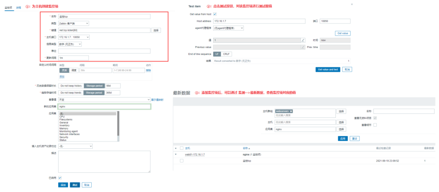

### 1.3 监控项的值映射

#### 1.3.1 什么是值映射

为了接收到的值能更“人性化”的显示，可以通过值映射方 式，将数值与字符串之间进行关系绑定； 举个例子，一个监控项有值‘0’和‘1’能通过值映射，以认 可读的形式表示值： '0' ⇒ '不可用' '1' ⇒ '可用' 或者, 一组备份关系的值映射可以是: 'F' → '全量备份' 'D' → '差异备份' 'I' → '增量备份'

#### 1.3.2 值映射配置实践

要定义值映射： 前往: 管理 → 一般 从下拉列表中选择 值映射 点击创建值映射(或点击一个现有值映射的名称上)

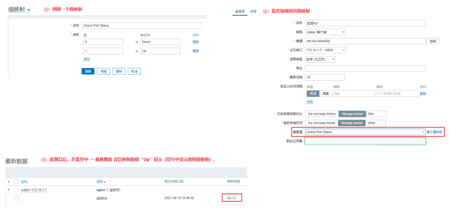

### 1.4 自定义监控项（入门）

监控主机当前登录主机的“总登录用户数”，如何实现： 1.本机执行shell命令提取需要监控对象的值； 2.通过zabbix-agent2将其定义为一个监控项； （为 这个值设定一个监控项的名称） 3.使用zabbix-get测试能否获取对应的值； 4.登录zabbix-web，为对应的主机添加对应的监控 项；

#### 1.4.1 第一步：获取项目指标数据 使用下面的命令以获取当前登录系统的会话数量：

```
[root@web01 ~]# who | wc -l
```
4 1.4.2 第二步：自定义一个监控项 添加命令到 zabbix_agentd2.conf，格式：

```
UserParameter=<key名称>,<shell command>
```
login.user作为key，key在一台主机中必须是唯一的

```
[root@web01 ~]# vim
/etc/zabbix/zabbix_agentd.d/default.conf
UserParameter=login.user,who | wc -l
```
通过使用zabbix_agent2 -t命令测试此用户自定义参数 的执行。

```
[root@web01 ~]# zabbix_agent2 -t login.user
```
login.user

```
   [s|4]
```
重启zabbix-agent，Agent会重载配置文件

```
[root@web01 ~]# systemctl restart zabbix-
```
agent2

#### 1.4.3 第三步：使用Zabbix-get取值 服务端安装zabbix-get工具包

```
# yum install zabbix-get -y
```

获取Agent端自定义的监控项，是否能获取到指标，命 令：zabbix_get -s IP -p port -k KeyName

```
[root@zabbix-server ~]# zabbix_get -s
172.16.1.7 -p 10050 -k login.user
```
4 1.4.4 第四步：为主机添加监控项 在被监控主机中添加使用key值为 login.user 的新监 控项，监控项类型必须为zabbix-agent或者zabbix- agent（active） 第一步：点击配置→主机→监控项→创建监控项； 第二步：点击监测→最新数据→

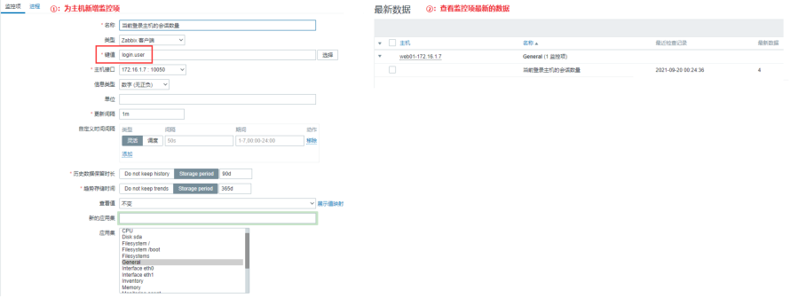

### 1.5 自定义监控项（单位）

```
监控当前主机的 “内存使用百分比”，以及 “剩余百分 比”； 1.本机执行shell命令提取需要监控对象的值； 内存的使用百分比： free -m | awk '/^Mem/ {print $3/$2*100}' 内存的剩余百分比：free -m | awk '/^Mem/ {print 100-($3/$2*100)}' 2.通过zabbix-agent2将其定义为一个监控项； 3.使用zabbix-get测试能否获取对应的值； 4.登录zabbix-web，为对应的主机添加对应的监控 项； 1.5.1 第一步：获取项目数据 获取内存”已用百分比“（取出内存的已用空间 / 总内存空 间 = 已占用空间百分比）
[root@web01 ~]# free | awk '/^Mem/ {print
$3/$2*100}'
```
16.5259

获取内存”剩余百分比“（取出内存的可用空间 / 总内存大 小 = 实际可用的百分比）

```
[root@web01 ~]# free | awk '/^Mem/ {print
$NF/$2*100}'
```
72.6337

1.5.2 第二步：创建监控项

```
[root@web01 ~]# cat
/etc/zabbix/zabbix_agent2.d/meminfo.conf
UserParameter=Mem.Used,free | awk '/^Mem/
{print $3/$2*100}'
UserParameter,Mem.Ava,free | awk '/^Mem/
{print $NF/$2*100}'
重启zabbix-agent2
[root@web01 ~]# systemctl restart zabbix-
```
agent2 1.5.3 第三步：检查监控项

```
[root@zabbix-server dejavu]# zabbix_get -s
172.16.1.7 -p 10050 -k Mem.Used
```
15.9176

```
[root@zabbix-server dejavu]# zabbix_get -s
172.16.1.7 -p 10050 -k Mem.Ava
```
70.7973

#### 1.5.1 第三步：添加监控项

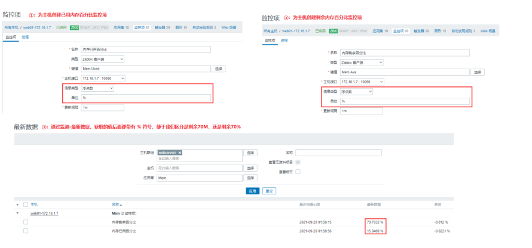

### 1.6 自定义监控项（传参）

#### 1.6.1 什么是传参

传参是为了让key接受对应的参数，从而完成多个监控项 创建的一种方式，传参的语法格式如下：

```
UserParameter=key[*],command
```
#### 1.6.2 简单传参示例

```
UserParameter=ping[*],echo $1
zabbix-get -s   -k  ping[aaa]
ping[0] - 将总是返回  '0' ping[aaa] - 将总是返回 'aaa'
```
#### 1.6.3 复杂传参示例

```
UserParameter=mysql.ping[*],mysqladmin -u$1
-p$2 ping | grep -c alive
```
这个用户自定义参数可以用来监控 MySQL 数据库的状 态。可以想下面的样式传入用户名和密码：

```
mysql.ping[username,password,test]
```
#### 1.6.4 监控TCP状态实践

通过传参方式，创建监控项 ”获取TCP状态“ 指标数据

```
[root@web01 ~]# vim
/etc/zabbix/zabbix_agent2.d/tcp_status.conf
UserParameter=tcp.status[time_wait],netstat
-ant|grep -c $1
```
重启zabbix-agent2，加载配置文件

```
[root@web01 ~]# systemctl restart zabbix-
```
agent2 服务端使用zabbix-get测试

```
[root@zabbix-server dejavu]# zabbix_get -s
172.16.1.7 -k tcp.status[LISTEN]
```
登录zabbix-web为主机添加监控项，或导入监控模板;

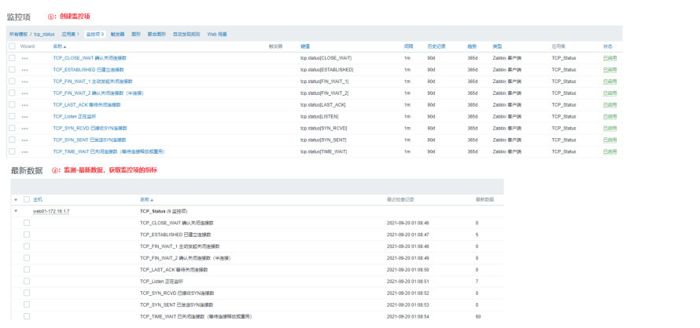

### 1.7 趋势|历史计算公式

100台主机   每个主机约等于100个监控项，每个监控项 每间隔60s获取一次数值 历史数据：

```
days*(items/refresh rate)*24*3600*bytes
90*(10000/60)*24*3600*90=116173440000  字节 116GB 趋势：
days*(items/3600)*24*3600*bytes
365*(10000/3600)*24*3600*90=5676480000  字节
5G 事件： days*events*24*3600*bytes 365*1*24*3600*170=5361120000     5G 合计：130GB
```
## 2.触发器

### 2.1 什么是触发器

当监控项的值发生变化后，对应的值不符合预期，则应 该通过触发器来通知管理人员介入； 比如：监控tcp的80端口，如果存活则符合预期，如果不 存活则不符合预期，应该通过触发器通知； 比如：监控主机内存状态，当使用率达到80%，则应该 通过触发器通知管理人员； 比如：监控主机的CPU使用率，当持续5分钟，高于 80%，则应该通过触发器通知管理人员；

### 2.2 触发器严重性

触发器严重性定义了触发器的重要程度，Zabbix支持下 列触发器的严重程度： 严重性 定义 颜色 未分类 未知严重性 灰色 信息 提示 浅蓝色 警告 警告 黄色 一般严重 一般问题 橙色 严重 发生重要的事情 浅红色 灾难 灾难，财务损失等 红色

通过不同的颜色代表不同的严重程度。 报警音频，不同的音频代表不同的严重程度。 用户媒介，不同的用户媒介（通知渠道）代表不同的 严重程度。例如，SMS - 高严重性，email - 其他。 通过触发器执行对应的条件动作。

### 2.3 配置一个触发器

配置一个触发器，监控主机tcp80端口是否存活，如果不 存活则通知，存活则不处理； 进入： 配置 → 主机 点击主机一行的 触发器 点击右上角的 创建触发器（或者点击触发器名称去修 改一个已存在的触发器） 在窗口中输入触发器的参数

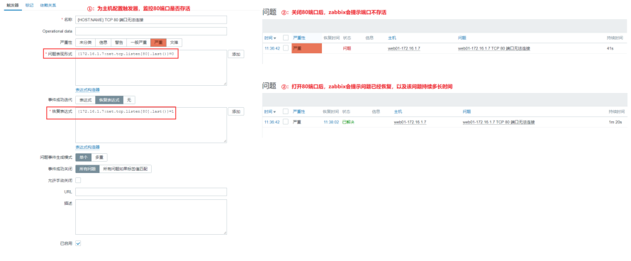

### 2.4 触发器表达式

函数名 称 作用 监控项的平均值： ⇒ avg(#5) → 最新5个值的平均值 avg() ⇒ avg(1h) → 最近一小时的平均值 ⇒ avg(1h,1d) → 一天前的一小时内的平均 值 监控项的最小值 示例: CPU使用率最近5分钟的最小值大于

```
5 system.cpu.load.min(5m)>5
```
min() 示例: CPU最近5次最小的值大于2

```
system.cpu.load.min(#5)>2
```
监控项的最大值 max() ⇒ max(#5) → 最新5个值的最大值 ⇒ max(1h) → 最近一小时的最大值 注意last的 #num 参数和在其它函数中的 作用不一样，例如:返回值 3, 7, 2, 6, 9 last() last() 通常等同于 last(#1) last(#5) - 第五个最新值 (不是五个最新值) last(#2)将返回值为7，last(#5)返回值为9 diff() 比对上一次文件的内容

函数名 称 作用 监控一段时间内是否返回数据：时间不少 于30秒，因为timer处理器每30秒调用一 nodata() 次。 返回1 - 指定评估期没有接收到数据 返回0 - 其它

#### 2.4.1 触发器示例场景1

www.zabbix.com的处理器负载过高

```
{www.zabbix.com:system.cpu.load[all,avg1].l
ast()}>5
```
它指定了服务器是www.zabbix.com，监控项的键值是

```
system.cpu.load[all,avg1]。
```
通过使用函数“last()”获取最新的值。最后，>5意味着当 www.zabbix.com最新获取的处理器负载值大于5时触发 器就会处于异常状态。

#### 2.4.2 触发器示例场景2

当前处理器负载大于5或者最近10分钟内最小值大于2， 表达式为true。

```
{www.zabbix.com:system.cpu.load[all,avg1].l
ast()}>5 or
{www.zabbix.com:system.cpu.load[all,avg1].m
in(10m)}>2
```
#### 2.4.3 触发器示例场景3

监控/etc/passwd文件是否被修改，当文件/etc/passwd 的checksum值与最近的值不同时，表达式为true。

```
{www.zabbix.com:vfs.file.cksum[/etc/passwd]
.diff()}=1
```
#### 2.4.4 触发器示例场景4

最近5分钟，如果eth0上接收字节数大于100kb时，则表 达式为真。

```
{www.zabbix.com:net.if.in[eth0,bytes].min(5
m)}>100K
```
#### 2.4.5 触发器示例场景5

当主机www.zabbix.com在30分钟内超过5次的不可达 （值为0状态），则表达式为真。

```
{www.zabbix.com:icmpping.count(30m,0)}>5
```
#### 2.4.5 触发器示例场景5

比较今天的平均负载和昨天同一时间的平均负载（使用 第二个“时间偏移”参数）。

```
{server:system.cpu.load.avg(1h)}/{server:sy
stem.cpu.load.avg(1h,1d)}>2
```
如果最近一小时平均负载超过昨天相同小时负载的2倍， 触发器将触发。

#### 2.4.6 触发器示例场景6

如果表达式中至少有两个触发器大于5，触发器将触发。

```
({server1:system.cpu.load[all,avg1].last()}
>5) +
({server2:system.cpu.load[all,avg1].last()}
>5) +
({server3:system.cpu.load[all,avg1].last()}
>5)>=2
```
#### 2.4.7 触发器示例场景7

使用nodata()函数: 如果在180秒内没有接收到数据，则 触发值变为异常状态。

```
{www.zabbix.com:tick.nodata(3m)}=1
```
### 2.5 触发器滞后

有时我们需要触发器处于OK和问题状态之间的区间，而 不是一个简单 ”阈值报警“ 就完事了。 例如，我们希望定义一个触发器，当机房温度超过20C 时，触发器会出现异常，我们希望它保持在那种状态， 直到温度下降到15C以下，为了做到这一点，我们首先 定义问题事件的触发器表达式，然后再定义事件成功迭 代中选择恢复表达式并为OK事件输入恢复表达式。

#### 2.5.1 滞后示例

机房温度过高。 问题表达式: 当机房温度的大于20c

```
{server:temp.last()}>=20
```
恢复表达式:当机房温度小于或等于15c

```
{server:temp.last()}<=15
```
#### 2.5.2 滞后示例

磁盘剩余空间过低。 问题表达式:  在最近5分钟内最大的值小于10G

```
{server:vfs.fs.size[/,free].max(5m)}<10G
```
恢复表达式: 在最近10分钟内最小的值大于40G

```
{server:vfs.fs.size[/,free].min(10m)}>40G
```
### 2.6 自定义触发器场景

#### 2.6.1 配置单条件触发器

自定义单条件触发器：设置内存低于 30% 进行告 警，点击对应主机→ 创建触发器 1.获取内存还剩余的百分比： 剩余 30% 可用，则需要告警通知； 剩余 50% 可用，就算恢复； 编辑触发器表达式 问题表达式:  {web:Mem_pre.last()}<30 恢复表达式:  {web:Mem_pre.last()}>60

```
使用dd
if=/dev/zero of=/dev/null bs=500M
count=1024压低内存
```
#### 2.6.2 配置多条件触发器

自定义多条件触发器：设置内存低于 30%并且swap 使用大于1% 进行告警 增加swap的监控UserParameter=Swap_pre,free -

```
m|awk '/^Swap/{print $3*100/$2}'
```
编辑触发器表达式 问题表达式：{Web:Mem_pre.last()}<30 and

```
{Web:Swap_pre.last()}>1
恢复表达式：{Web:Mem_pre.last()}>30 and
{Web:Swap_pre.last()}<1
```
使用命令压测

```
dd
if=/dev/zero of=/dev/null bs=300M
count=1024只满足内存低于30%，所以不会警告
dd
if=/dev/zero of=/dev/null bs=800M
count=1024内存低于30%，并且swap使用超过 1%
```
### 2.8 触发器依赖关系

#### 2.8.1 什么是触发器依赖

有时候一台主机的可用性依赖于另一台主机。如果一台 路由器宕机，则路由器后端的服务器将变得不可用。如 果这两者都设置了触发器，你可能会收到关于两个主机 宕机的通知，然而只有路由器是真正故障的。 这就是主机之间某些依赖关系可能有用的地方，设置依 赖关系的通知会被抑制，而只发送根本问题的通知。

#### 2.8.2 触发器依赖关系示例

例如，主机位于路由器2后面，路由器2在路由器1后 面。 Zabbix - 路由器1 - 路由器2 - 主机

如果路由器1宕机，显然主机和路由器2也不可达，然而 我们不想收到主机、路由器1和路由器2都宕机的3条通 知。因此，在这种情况下我们定义了两个依赖关系： '主机宕机' 触发器依赖于 '路由器2宕机' 触发器 '路由器2宕机' 触发器依赖于 '路由器1宕机' 触发器

### 2.9 触发器依赖场景配置

#### 2.9.1 依赖场景环境说明

假设172.16.1.7 充当路由节点，172.16.1.8充当主机 节点； 1.模拟当172.16.1.8的80端口如果不存活，需要检 查172.16.1.7的80端口是否存活， 2.如果路由节点的80端口存活，则触发主机节点的 80端口不存活警告； 3.如果路由节点的80端口不存活，则仅触发路由节 点的警告，而不触发主机节点的警告；

#### 2.9.2 定义触发器表达式

路由节点：定义监控项，配置触发器 主机节点：定义监控项，配置触发器

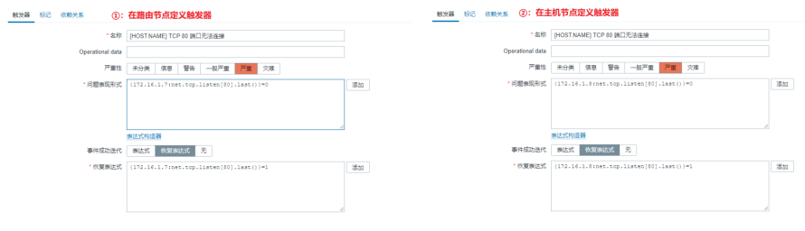

#### 2.9.3 模拟路由与主机故障

模拟路由器、节点同时障时，会同时收到两个告警，显 然不符合预期效果；

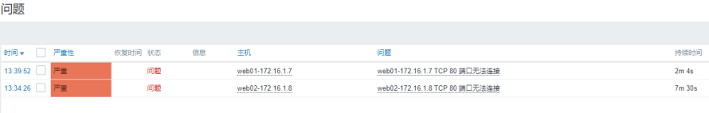

#### 2.9.4 配置触发器依赖关系

在服务器节点上对应的触发器上配置依赖关系，依赖路 由节点对应的触发器；

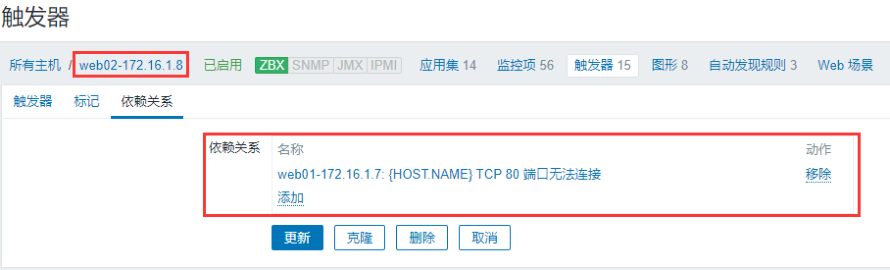

#### 2.9.5 再次模拟路由与节点故障

关闭 “路由器” 的80端口，以及主机节点80端口；此时只 有路由节点会警告；


启用 “路由器” 80端口，关闭主机节点80端口，此时只有 主机节点会警告；


## 3.通知（告警）

### 3.1 什么是事件通知

首先，我们不希望一直盯着触发器或事件列表。最好是 在发生比较严重的事情（如问题）时能够接收到通知。 并且，当发生问题时，我们希望所有相关人员都能收到 通知。 也就是说，当配置的监控项超过触发器设定的阈值则触 发动作，这个动作可以是（发送消息|执行命令）

### 3.2 如何实现事件通知

为了能够实现发送和接收Zabbix的通知，则必须： 定义媒介：（发件人） 配置动作：使用媒介像  （用户发送信息 ---》收件人 ）向已定义的媒介发送消息 动作由 ”触发器条件“ 和 ”操作“ 组成。总的说来，当条件 满足时，则执行相应的操作。

### 3.3 配置邮件通知方式

#### 3.3.1 定义媒介（发件人）

单击管理→报警媒介类型，设定发送消息的介质- email、定制Zabbix报警的内容

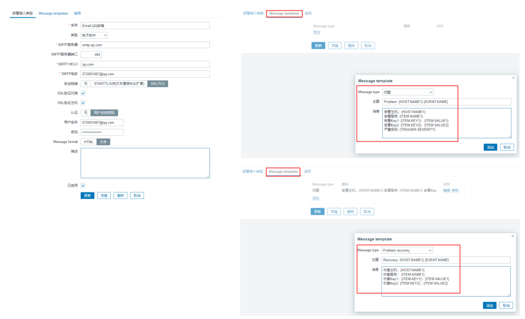

告警 告警主机：{HOST.NAME1} 告警服务: {ITEM.NAME1}

```
告警Key1: {ITEM.KEY1}：{ITEM.VALUE1}
告警Key2: {ITEM.KEY2}：{ITEM.VALUE2}
严重级别: {TRIGGER.SEVERITY} # 恢复 恢复主机：{HOST.NAME1} 恢复服务： {ITEM.NAME1} 恢复Key1：{ITEM.KEY1}：{ITEM.VALUE1}
恢复Key2: {ITEM.KEY2}：{ITEM.VALUE2}
```
#### 3.3.2 配置动作（发送给谁）

单击配置→动作→创建动作，以及对应的操作；

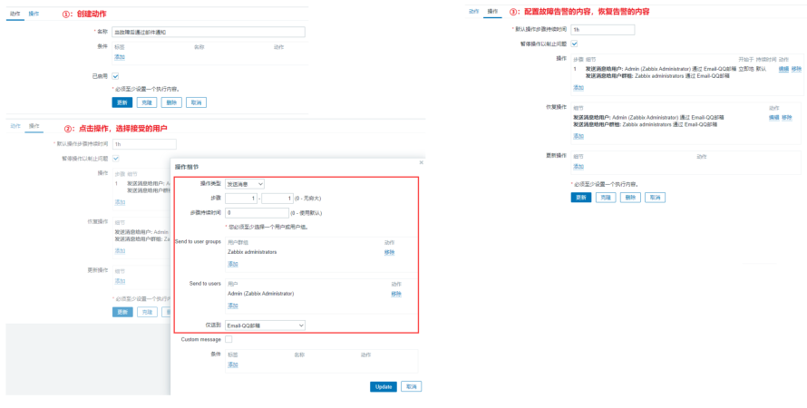

#### 3.3.3 配置媒介（收件人）

管理→用户→报警媒介→选择类型→收件人（收件人邮 箱）

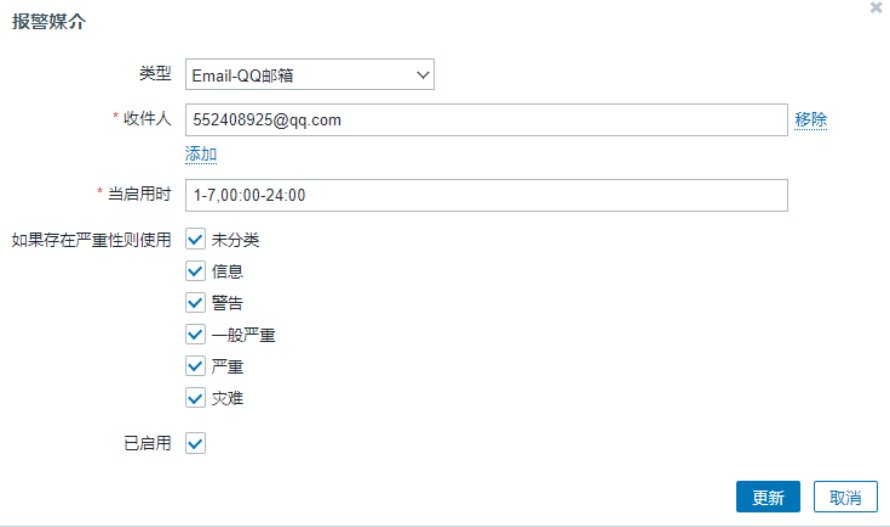

#### 3.3.4 测试邮件告警

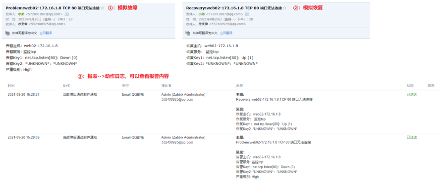

### 3.4 基于微信通知方式

#### 3.4.1 编写脚本

下载脚本，并赋予对应的执行权限

```
[root@zabbix-server ~]# cd
/usr/lib/zabbix/alertscripts/
[root@zabbix-server alertscripts]# wget
http://fj.xuliangwei.com/public/weixin.py
[root@zabbix-server alertscripts]# chmod +x
```
weixin.py 安装脚本所需依赖

```
[root@zabbix-server alertscripts]# yum
install python3 python3-devel python3-pip -
```
y

```
[root@zabbix-server alertscripts]# pip3
```
install requests

修改脚本如下内容

```
corpid='企业ID'   ww8cff74fbad8af6c9
appsecret='自定义app的secret'
0oFgknWEKz6HjbpPH-NkoZjemkrSzYpNAET6WaGHpBo
agentid=自定义应用的agentid     1000005
```
执行脚本，参数1:用户微信，参数2:消息主题，参数3:消 息内容

```
[root@zabbix-server alertscripts]#
./weixin.py XuLiangWei 主题 "服务器故障了，抓紧 维护" #切记一定要删除，否则会导致权限问题
[root@ZabbixServer alertscripts]# rm -f
/tmp/weixin.log
```
执行结果如下

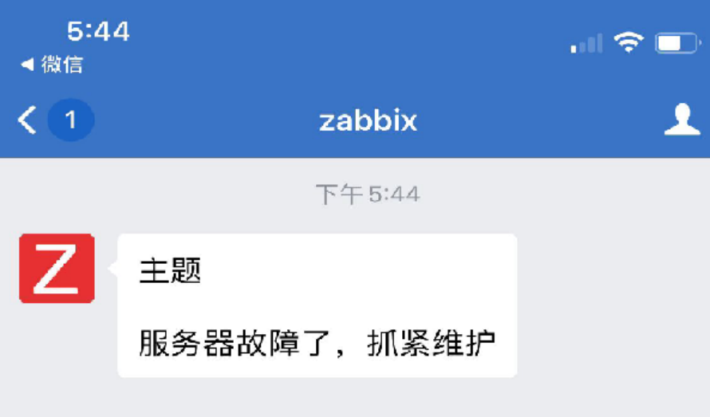

#### 3.4.1 定义媒介（发件人）

单击管理→报警媒介类型，设定发送消息的介质-微信， 然后设定发送的内容；

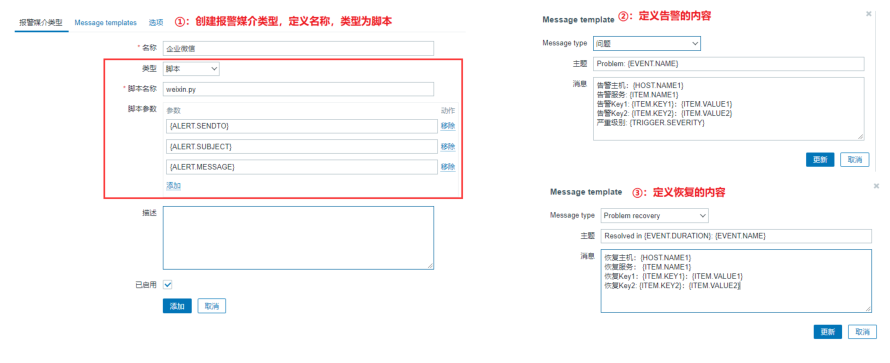

```
{ALERT.SENDTO}      #发送的用户
{ALERT.SUBJECT}     #发送的主题
{ALERT.MESSAGE}     #发送的内容
```
告警 告警主机：{HOST.NAME1} 告警服务: {ITEM.NAME1}

```
告警Key1: {ITEM.KEY1}：{ITEM.VALUE1}
告警Key2: {ITEM.KEY2}：{ITEM.VALUE2}
严重级别: {TRIGGER.SEVERITY} # 恢复 恢复主机：{HOST.NAME1} 恢复服务： {ITEM.NAME1} 恢复Key1：{ITEM.KEY1}：{ITEM.VALUE1}
恢复Key2: {ITEM.KEY2}：{ITEM.VALUE2}
```
#### 3.4.2 配置动作（发送给谁）

点击配置→动作→创建动作

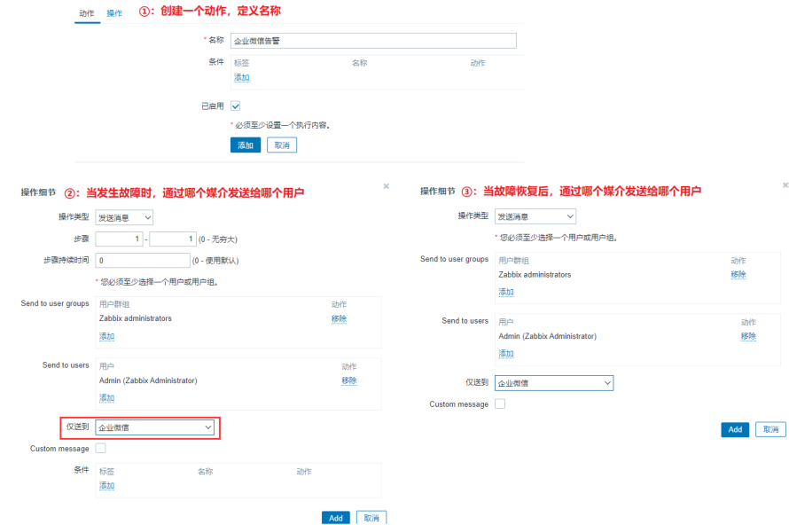

#### 3.4.3 配置媒介（收件人）

配置接收的企业微信号(收件人是企业中的微信名称)

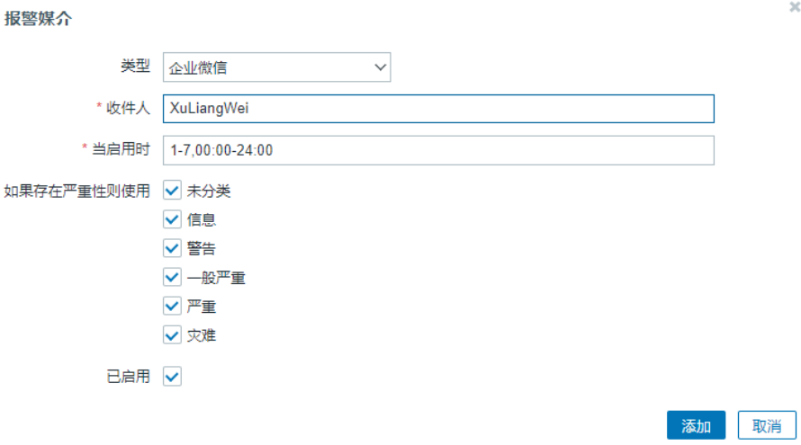

#### 3.4.4 测试微信告警

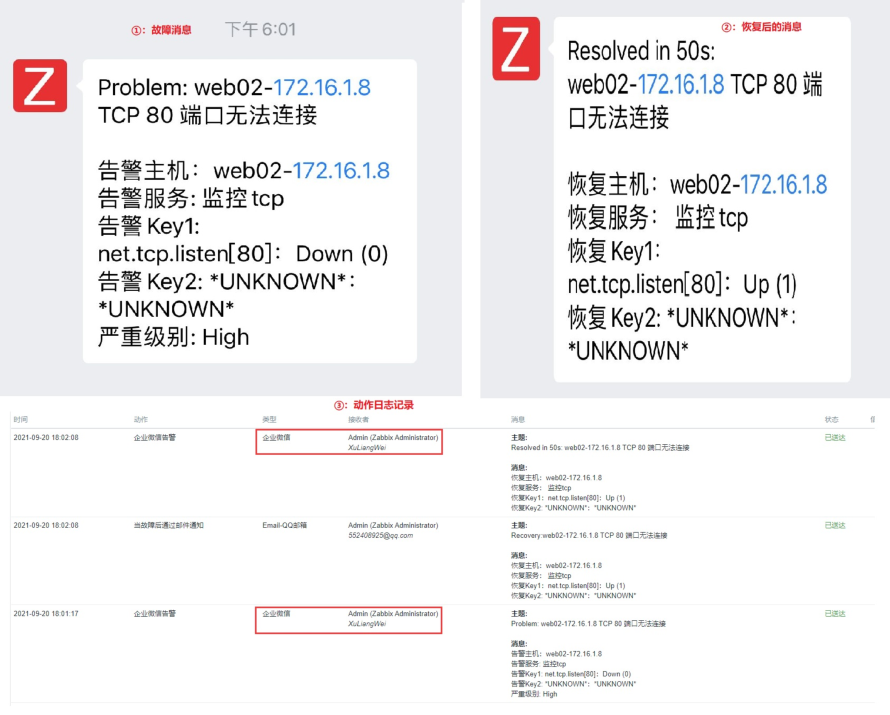

### 3.5 基于短信通知

使用阿里云短信进行通知，有几个前提： 1.必须购买阿里云短信服务（需要花钱）； 2.需要申请签名、同时还需要申请模板；

## 3.下载阿里云提供的sdk（python版）sdk下载地

址

#### 3.5.1 编写脚本

先将dysms_python.zip代码下载到指定的路径下，然 后安装python相关环境及相关依赖；pip加速器

```
# yum install python3-devel python3-pip -y
# python3 -m pip install --upgrade pip
# pip3 install --upgrade setuptools
# python3 setup.py install
```

修改const.py，填写对应的ACCESS_KEY_ID、

```
ACCESS_KEY_SECRET
ACCESS_KEY_ID = "yourAccessKeyId"
ACCESS_KEY_SECRET = "yourAccessKeySecret"
修改demo_sms_send.py
[root@zabbix-server dysms_python]# cat
demo_sms_send.py
#!/usr/bin/env python3
# -*- coding: utf-8 -*-
import os
import sys
```

from aliyunsdkdysmsapi.request.v20170525

```
import SendSmsRequest
```

from aliyunsdkdysmsapi.request.v20170525

```
import QuerySendDetailsRequest
```

from aliyunsdkcore.client import AcsClient

```
import uuid
```

from aliyunsdkcore.profile import

```
region_provider
from aliyunsdkcore.http import method_type
```
as MT

```
from aliyunsdkcore.http import format_type
```
as FT

```
import const
```

""" 短信业务调用接口示例，版本号：v20170525

```
Created on 2017-06-12
"""
try:
    reload(sys)
    sys.setdefaultencoding('utf8')
except NameError:
```
pass

```
except Exception as err:
```
raise err # 注意：不要更改

```
REGION = "cn-hangzhou"
PRODUCT_NAME = "Dysmsapi"
DOMAIN = "dysmsapi.aliyuncs.com"
acs_client = AcsClient(const.ACCESS_KEY_ID,
const.ACCESS_KEY_SECRET, REGION)
region_provider.add_endpoint(PRODUCT_NAME,
REGION, DOMAIN)
def send_sms(business_id, phone_numbers,
sign_name, template_code,
template_param=None):
    smsRequest =
SendSmsRequest.SendSmsRequest()

# 申请的短信模板编码,必填

smsRequest.set_TemplateCode(template_code)
```
# 短信模板变量参数

```
    if template_param is not None:
smsRequest.set_TemplateParam(template_param
)

设置业务请求流水号，必填。

    smsRequest.set_OutId(business_id)
```
短信签名

```
    smsRequest.set_SignName(sign_name)
```
数据提交方式

```
    # smsRequest.set_method(MT.POST)
```

数据提交格式

```
    # smsRequest.set_accept_format(FT.JSON)
```

短信发送的号码列表，必填。

```
smsRequest.set_PhoneNumbers(phone_numbers)
```
调用短信发送接口，返回json

```
    smsResponse =
acs_client.do_action_with_exception(smsRequ
est)
```
TODO 业务处理

```
    return smsResponse
if __name__ == '__main__':
    __business_id = uuid.uuid1()
    sendto = str(sys.argv[1])  # zabbix传过
```
来的第一个参数

```
    message = str(sys.argv[2])  # zabbix传过
```
来的第二个参数

```
    params = {'message':message}  # 对应短信
```
模板里设置的变量名

```
    print(send_sms(__business_id, sendto,
```
"签名名称", "模板code", params))    #需修改

```
   #logging.info('sendto:' + sendto +
```
';;message:' + message) #如无法收到短信打开日志 调试 添加执行权限

```
# chmod +x demo_sms_send.py
```

本地测试

```
# python3 demo_sms_send.py PhoneNumber
```

Message # 返回结果

```
b'{"RequestId":"902C99E2-92C8-5506-AF3D-
016AA3F52BC5","Message":"OK","BizId":"27102
4632142628406^0","Code":"OK"}'
```
#### 3.5.2 定义媒介（发件人）

单击管理→报警媒介类型，设定发送消息的介质-短信， 然后定义发送内容

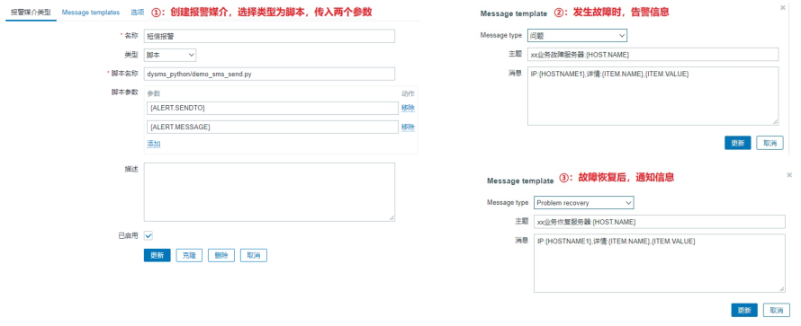

```
{ALERT.SENDTO}      #发送的用户
{ALERT.MESSAGE}     #发送的内容
```
告警 # 主题：xx业务故障服务器:{HOST.NAME} # 故障：IP:{HOSTNAME1},详情:{ITEM.NAME},

```
{ITEM.VALUE}
```
恢复 # 主题：xx业务恢复服务器:{HOST.NAME} # 恢复：IP:{HOSTNAME1},详情:{ITEM.NAME},

```
{ITEM.VALUE}
```
#### 3.5.3 配置动作（发送给谁）

单击配置→动作→创建动作

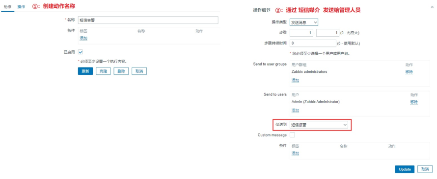

#### 3.5.4 配置媒介（收件人）

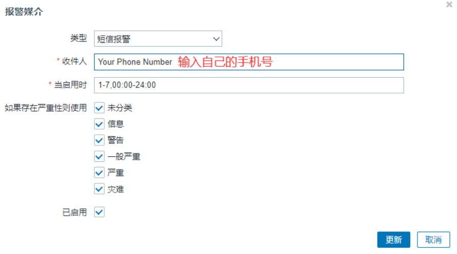

#### 3.5.5 测试短信报警

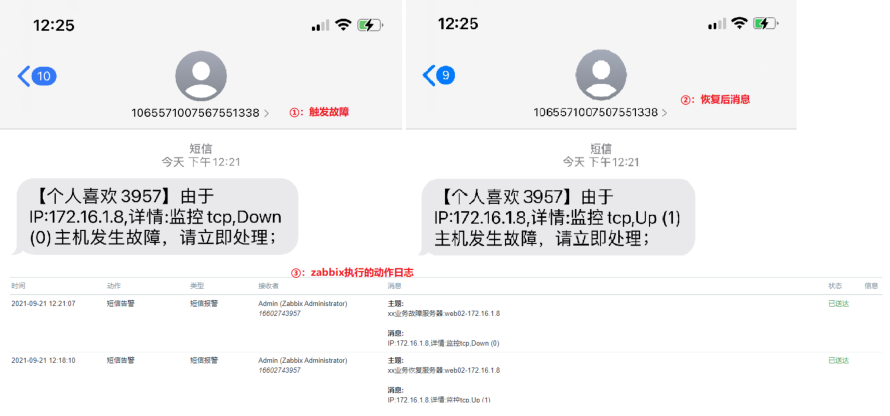

## 4.通知升级

### 4.1 通知升级的作用

用户可以在一定时间内重复收到通知，直到问题解 决；

对于已知故障，或长期存在的故障，可以延时发送通 知消息； 对于长期没有解决的故障，可以升级至另一个 “更高 级别” 的用户组，比如leader； 1,2  发邮件；   ops； 3，4 发邮件； leaders

### 4.2 通知升级示例

#### 4.2.1 通知升级示例1

每30分钟向MySQL Administrators组发送一次重复的 通知（共5次）。配置如下： 在操作选项卡中，将 Default operation step duration设置为'30m'（即，30分钟） 将升级步骤设置为 从 1到 5 选择MySQL Administrators组作为消息的接收者 通知将分别在问题发生后的第一时间（0:00）以及30分 钟(0:30)、1小时(1:00)、1个半小时(1:30)和2个小时 (2:00)发送(当然，除非问题提前解决)

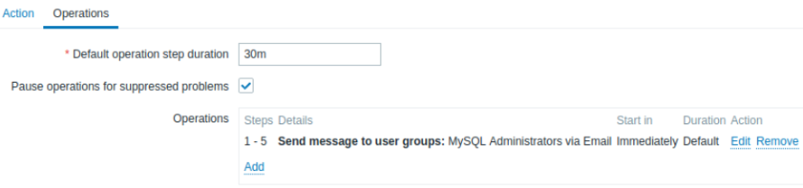

#### 4.2.2 通知升级示例2

将问题升级到老板那里。 如果监控项长时间处于一个反复报警的状态时，可能是 没有人去解决也可能是他们无法解决。在这种情况下， 将问题升级到经理那之前，运维人员会收到四条消息。 注意：只有在问题尚未被确认的情况下（假设没有人处 理这个问题），第五条消息经理才会收到消息。

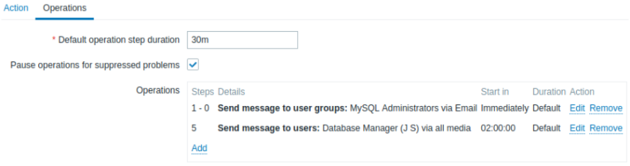

#### 4.2.3 通知升级示例3

本示例展示了一个更为复杂的场景。在向MySQL管理员 发送了多个消息并升级到经理那之后，Zabbix将尝试重 启MySQL数据库。如果该问题持续了两个半小时还没得 到确认，就会进行重启的操作。 如果问题仍然存在，则再过30分钟，Zabbix将向所有来 宾用户发送一条消息。 如果还没有帮助，则再过1小时，Zabbix将使用命令重启 MySQL数据库服务器。

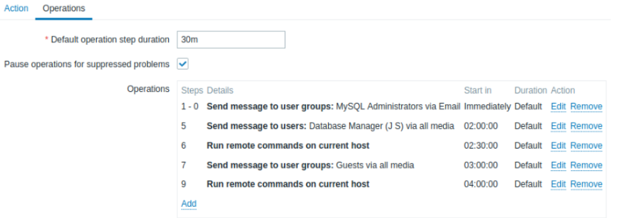

#### 4.2.4 通知升级示例4

发送关于一个长期存在的问题的延迟通知： 在操作选项卡中，将 Default operation step duration 设置为10h（即，10小时） 将升级步骤设置为 从 2到2 通知只会在升级场景的第2步发送，或者在问题发生10 小时后发送

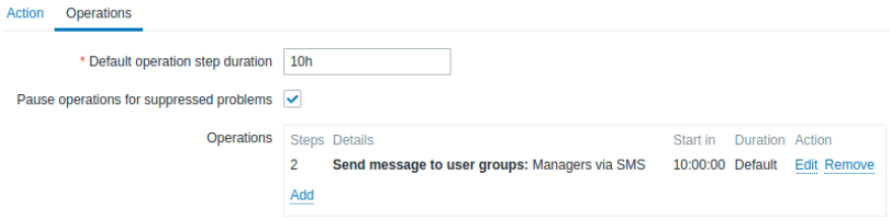

### 4.3 事件通知升级实践

当一个问题如果长时间没有被解决，则将该问题升级到 Leader那里。

#### 4.3.1 创建用户及用户组

点击管理→用户组，创建ops组，leader组；

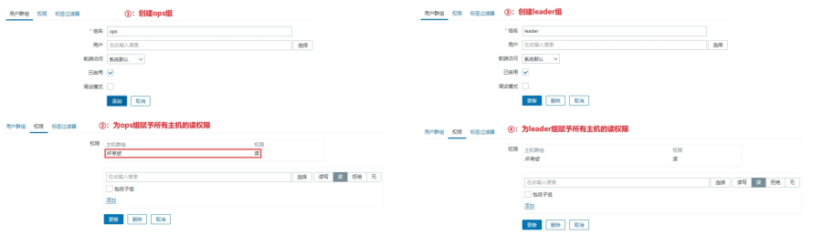

点击管理→用户，创建用户ops1,加入ops组，创建用户 oldxu加入leader组；

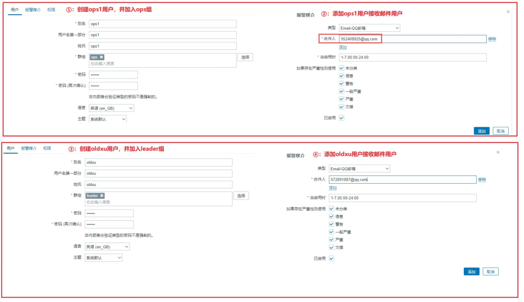

#### 4.3.2 配置通知升级动作

配置→动作，创建邮件通知升级步骤；

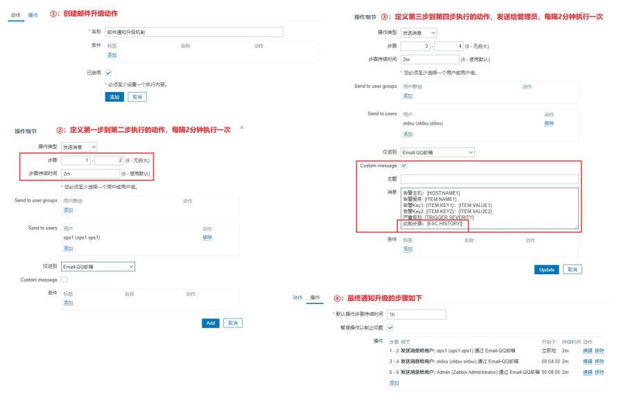

请注意 {ESC.HISTORY} 宏在自定义消息中的使用。该 宏将包含关于此升级之前执行的所有步骤的信息，例如 发送的通知和执行的命令。 主题：Problem:{EVENT.NAME} 告警主机：{HOST.NAME1} 告警服务: {ITEM.NAME1}

```
告警Key1: {ITEM.KEY1}：{ITEM.VALUE1}
告警Key2: {ITEM.KEY2}：{ITEM.VALUE2}
严重级别: {TRIGGER.SEVERITY} 此前步骤：{ESC.HISTORY}
```
#### 4.3.3 测试通知升级结果

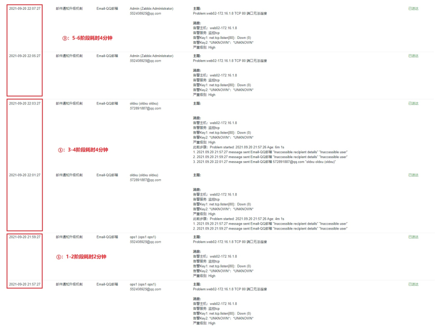

1) 1步是给ops发送消息，立即发送； 2) 2步是给ops发送消息, 2分钟后发送一次； 3) 3-4步骤是给leader发送消息, 每隔2分钟发送一次, 总 共2个步骤,所以发送2次。 4) 5-6步骤是给admin发送消息, 每隔2分钟发送一次, 总 共2个步骤,所以发送2次。 总结：1-2（2分钟）, 3-4（4分钟）, 5-6（4分钟） 所以 在触发告警发送时间计算是2m+4m+4m=10m

## 5.故障自愈功能

### 5.1 什么是故障自愈

当zabbix服务监控到指定的监控项异常时，可以通过指 定的操作使故障自动恢复； 比如当运行的Nginx服务没有响应了，我们可以通过远程 命令方式让其自动重启，已达到恢复的效果；

### 5.2 故障自愈应用场景

使用IPMI“reboot”命令，重启那些不响应请求的远程 服务器 自动释放空间不足的磁盘(删除旧文件，清理/tmp等) 根据CPU的负载情况，将虚拟机从一个物理机迁移到 另一个物理机上 在CPU(磁盘、内存等)资源不足的情况下，向云环境 添加新的节点

### 5.3 配置故障自愈远程执行

配置远程命令的操作类似于发送消息，区别在于一个执 行命令，一个发送消息； 远程命令可以直接在ZabbixServer, ZabbixProxy ZabbixAgent上执行。 但在Zabbix agent和Zabbix proxy上，远程命令默认 是不开启的，它们可以通过以下方式启用： 在agent配置中添加AllowKey=system.run[*]、

```
UnsafeUserParameters=1参数；
```
在proxy配置中，将enableremotecomcommands参数 设置为1；

### 5.4 故障自愈示例

#### 5.4.1 故障自愈示例1

在一定条件下重启Windows。 为了在Zabbix检测到问题时自动重启Windows，定义了 以下操作： 参数 描述 Operation type 'Remote command' Type 'Custom script' Command c:\windows\system32\shutdown.exe -r -f

#### 5.4.2 故障自愈示例2

```
通过IPMI控制重启主机。 参数 描述 Operation type 'Remote command' Type 'IPMI' Command reset
```
#### 5.4.3 故障自愈示例3

```
通过IPMI控制关闭主机电源。 参数 描述 Operation type 'Remote command' Type 'IPMI' Command power off
```
#### 5.4.4 故障自愈示例4

当磁盘空间不足时，自动删除/tmp目录已获取更多空 间。 参数 描述 Operation type 'Remote command' Type 'Custom script' Command /usr/bin/rm -f /tmp/*

### 5.5 故障自愈实现场景

监控客户端TCP80端口，当端口不存活，则通过远程执 行命令方式尝试重新启动；

#### 5.5.1 开启被控端远程执行命令

1.在被监控服务器上开启远程执行命令;

```
[root@web01 ~]# vim
/etc/zabbix/zabbix_agent2.conf
UnsafeUserParameters=1
AllowKey=system.run[*]
[root@web01 ~]# systemctl restart zabbix-
```
agent2 2.为zabbix用户配置sudo权限，否则会出现权限不足情 况；

```
[root@web01 ~]# echo "zabbix ALL=(ALL)
NOPASSWD:ALL" >> /etc/sudoers
```
#### 5.5.2 为触发器添加对应动作

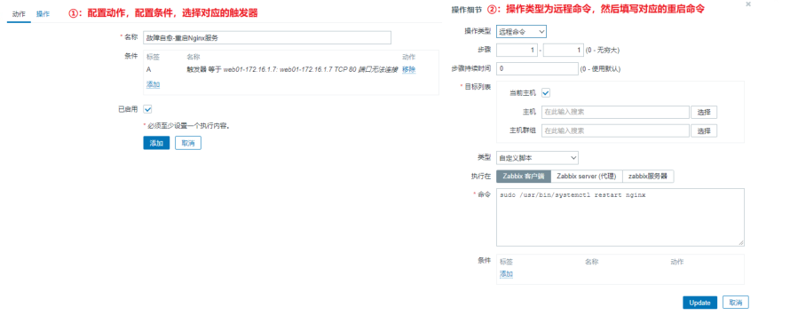

#### 5.5.3 验证故障自愈功能

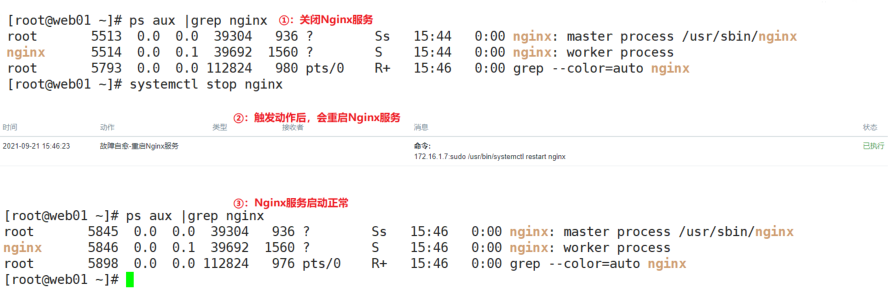

当然也可以打开服务端Debug调试模式，检查服务端执 行日志

```
[root@zabbix-server dysms_python]# grep
"nginx" /var/log/zabbix/zabbix_server.log
  9864:20210921:155154.133 In
substitute_simple_macros_impl() data:'sudo
/usr/bin/systemctl restart nginx'
  9864:20210921:155154.133 In
substitute_simple_macros_impl() data:'sudo
/usr/bin/systemctl restart nginx'
  9864:20210921:155154.134 In
get_value_agent() host:'172.16.1.7'
addr:'172.16.1.7' key:'system.run[sudo
/usr/bin/systemctl restart nginx,nowait]'
conn:'unencrypted'
  9864:20210921:155154.134 Sending
[system.run[sudo /usr/bin/systemctl restart
nginx,nowait]]
  9864:20210921:155154.143 query [txnlev:0]
[insert into alerts
(alertid,actionid,eventid,clock,message,sta
tus,error,esc_step,alerttype,parameters)
```
values

```
(61,11,277,1632210714,'172.16.1.7:sudo
/usr/bin/systemctl restart
nginx',1,'',1,1,'');
```
## 6.图形

### 6.1 什么是图形

随着大量数据流入Zabbix，对于用户而言，如果可以通 过可视化图形方式查看数据，而不仅仅是看到数字，那 会更容易了解发生了什么事情。

### 6.2 自定义图形

自定义图表，顾名思义，就是提供自定义定制的功能。 自定义图表需要人为配置，可以为某台主机、多台主 机、某个模板创建自定义图表。

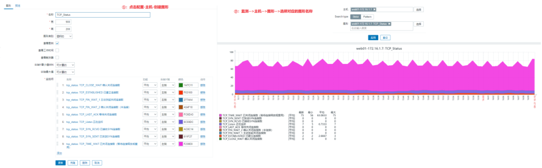

## 7.聚合图形

### 7.1 什么是聚合图形

将多张大图整合为一张图形； 将多个不同主机的图片整合在一张图上；

### 7.2 聚合图形场景

#### 7.2.1 聚合图形示例1

将一台主机的多个图片组合到一张聚合图形上，点击监 测-->聚合图形-->创建聚合图形；

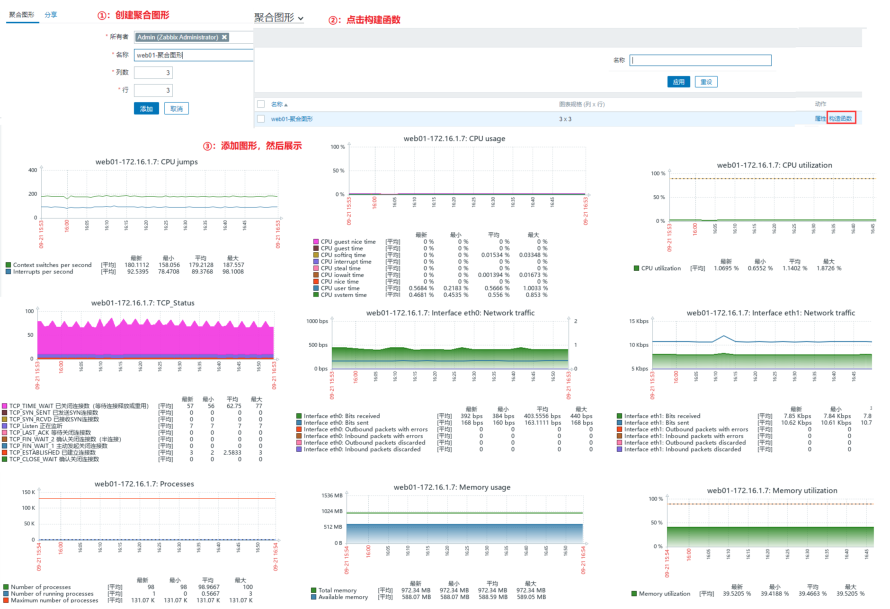

#### 7.2.2 聚合图形示例2

为多个不同的主机的模板创建一个图形，然后聚合至一 张图形上； 比如：为Template Module Linux generic by Zabbix agent 模板中[Number of processes]监控 项，添加一个图形，然后所有主机调用，最后聚合在一 张图上；

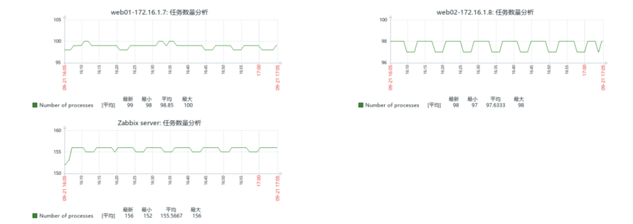

#### 7.2.3 聚合图形轮播

可以将多个聚合图形放到一个幻灯片中，然后进行轮播 展示；点击-->监测中-->聚合图形-->幻灯片-->创建

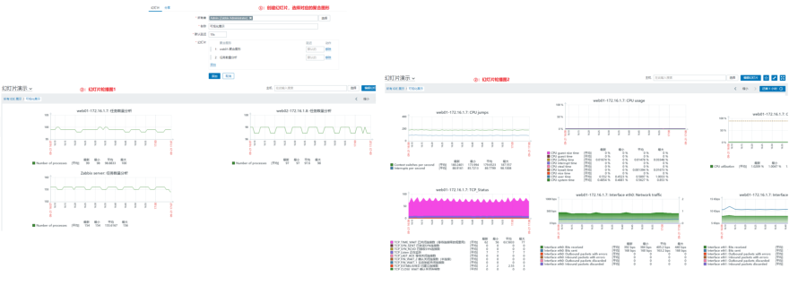

## 8.模板

### 8.1 为何需要模板

1.为每个主机单独添加监控项比较麻烦，例如100台 主机增加一个tcp80的监控项； 2.修改监控比较麻烦，例如100台服务器81改成82 3.删除主机，会连同主机的监控项一起被删除； 所以我们可以使用模板的方式，来解决上述的一些问 题；

### 8.2 自定义模板

1.创建模板，模板得属于某个主机组(Templates)

2.在模板中创建监控项、图形、触发器

3.创建需要监控的主机，然后关联对应的模板 4.更改模板的监控项目，所以使用模板的都会自动更 改 5.导出模板，后期可以至其他系统继续使用

## 9.总结

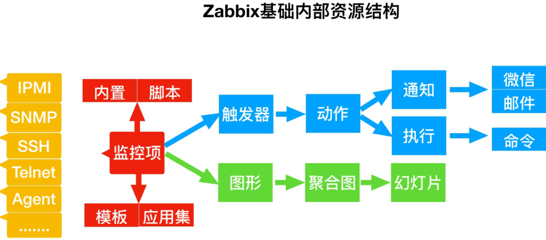
