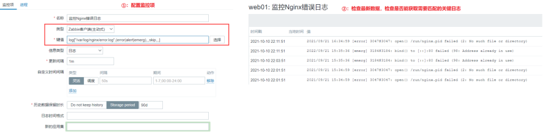
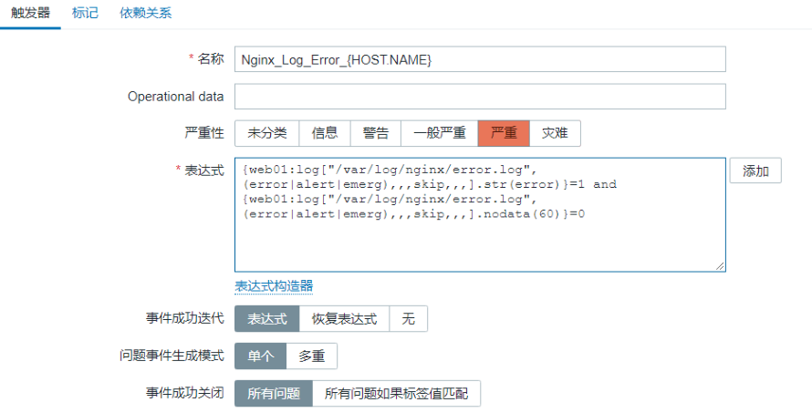
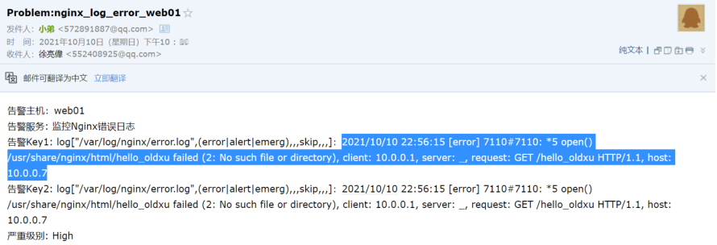
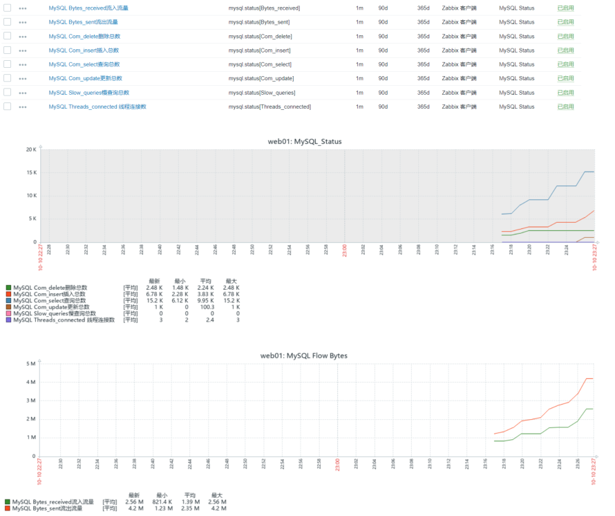
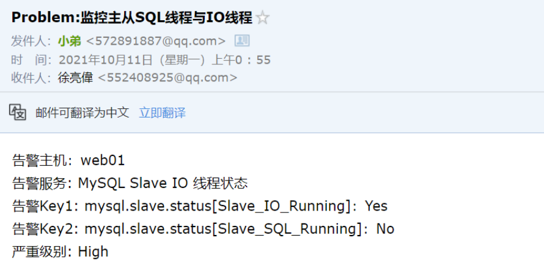
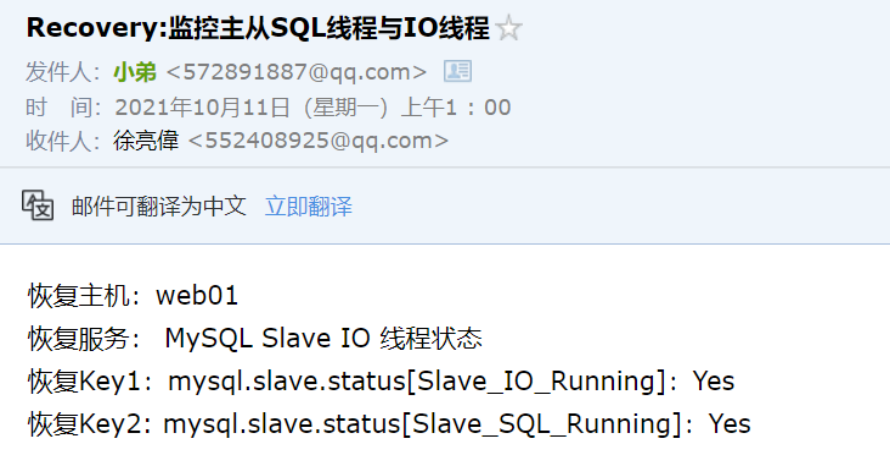
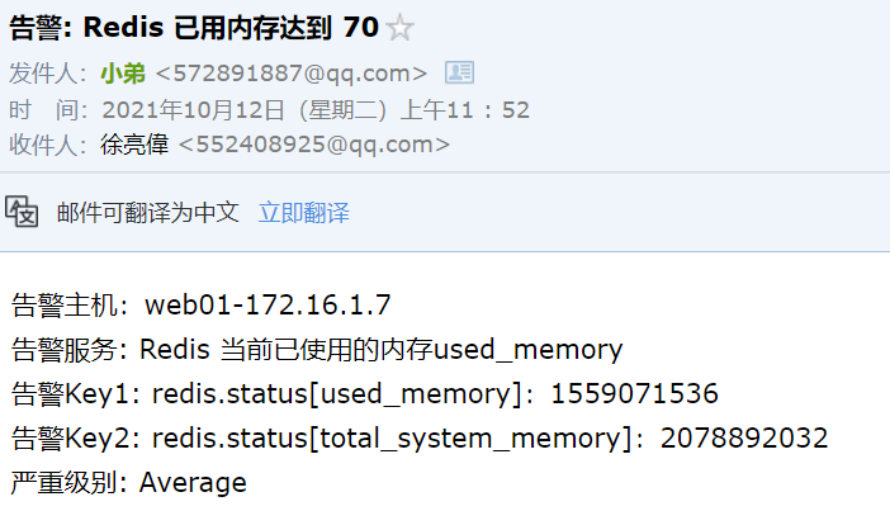
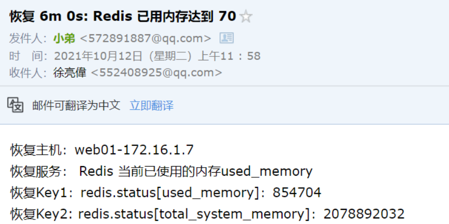

# 03.Zabbix应用服务监控

## 目录

- [1.Zabbix监控Nginx](#1.zabbix监控nginx)
  - [1.1 监控Nginx什么内容](#1.1-监控nginx什么内容)
  - [1.2 如何监控Nginx状态](#1.2-如何监控nginx状态)
  - [1.4 Nginx状态监控实践](#1.4-nginx状态监控实践)
    - [1.4.1 环境准备](#1.4.1-环境准备)
    - [1.4.2 启用Nginx状态模块](#1.4.2-启用nginx状态模块)
    - [1.4.3 编写采集状态脚本](#1.4.3-编写采集状态脚本)
    - [1.4.3 添加自定义监控项](#1.4.3-添加自定义监控项)
    - [1.4.4 服务端测试取值](#1.4.4-服务端测试取值)
    - [172.16.1.7 -k ngx.status[active]](#172.16.1.7--k-ngx.statusactive)
    - [1.4.5 配置Zabbix-web](#1.4.5-配置zabbix-web)
- [1.创建模板](#1.创建模板)
- [2.创建监控项（创建7个监控项）](#2.创建监控项创建7个监控项)
- [3.创建图形](#3.创建图形)
- [4.创建触发器（设定监控项）](#4.创建触发器设定监控项)
- [5.关联对应主机](#5.关联对应主机)
  - [1.5 Nginx错误日志监控实践](#1.5-nginx错误日志监控实践)
    - [1.5.1 如何监控错误日志](#1.5.1-如何监控错误日志)
    - [1.5.2 配置Agent为主动模式](#1.5.2-配置agent为主动模式)
    - [1.5.2 添加监控项](#1.5.2-添加监控项)
    - [1.5.3 配置触发器](#1.5.3-配置触发器)
    - [1.5.4 测试并验证](#1.5.4-测试并验证)
- [2.Zabbix监控PHP](#2.zabbix监控php)
  - [2.1 监控PHP什么内容](#2.1-监控php什么内容)
  - [2.2 如何监控php状态](#2.2-如何监控php状态)
  - [2.3 如何监控php端口](#2.3-如何监控php端口)
  - [2.4 PHP状态监控实践](#2.4-php状态监控实践)
    - [2.4.1 环境准备](#2.4.1-环境准备)
    - [2.4.2 启用PHP状态模块](#2.4.2-启用php状态模块)
    - [2.4.3 配置PHP状态页面](#2.4.3-配置php状态页面)
    - [2.4.4 php状态指标含义](#2.4.4-php状态指标含义)
    - [2.4.5 编写采集状态脚本](#2.4.5-编写采集状态脚本)
    - [2.4.6 添加自定义监控项](#2.4.6-添加自定义监控项)
    - [2.4.7 服务端测试取值](#2.4.7-服务端测试取值)
    - [2.4.8 配置zabbix-web](#2.4.8-配置zabbix-web)
- [2.创建监控项](#2.创建监控项)
- [4.创建触发器（监控php进程的存活）](#4.创建触发器监控php进程的存活)
- [3.Zabbix监控MySQL](#3.zabbix监控mysql)
  - [3.1 监控MySQL什么内容](#3.1-监控mysql什么内容)
  - [3.2 如何监控MySQL状态](#3.2-如何监控mysql状态)
  - [3.3 MySQL状态监控实践](#3.3-mysql状态监控实践)
    - [3.3.1 环境准备](#3.3.1-环境准备)
    - [3.3.2 编写监控脚本](#3.3.2-编写监控脚本)
    - [3.3.3 添加自定义监控项](#3.3.3-添加自定义监控项)
    - [3.3.4 服务端测试取值](#3.3.4-服务端测试取值)
    - [3.3.5 配置zabbix-web](#3.3.5-配置zabbix-web)
- [2.创建监控项（根据业务需求添加）](#2.创建监控项根据业务需求添加)
- [4.关联对应主机](#4.关联对应主机)
    - [3.3.6 编写测试脚本](#3.3.6-编写测试脚本)
  - [3.4 监控MySQL主从状态](#3.4-监控mysql主从状态)
    - [3.4.1 MySQL主从监控说明](#3.4.1-mysql主从监控说明)
    - [3.4.2 搭建MySQL主从环境](#3.4.2-搭建mysql主从环境)
- [1.安装MySQL](#1.安装mysql)
    - [3.4.4 编写监控主从脚本](#3.4.4-编写监控主从脚本)
    - [3.4.5 添加自定义监控项](#3.4.5-添加自定义监控项)
    - [3.4.6 服务端测试取值](#3.4.6-服务端测试取值)
    - [3.4.6 配置zabbix-web](#3.4.6-配置zabbix-web)
- [1.触发器一: 两个状态都要为Yes](#1.触发器一-两个状态都要为yes)
    - [3.4.7 测试告警效果](#3.4.7-测试告警效果)
- [4.zabbix监控Redis](#4.zabbix监控redis)
  - [4.1 监控Redis什么内容](#4.1-监控redis什么内容)
  - [4.2 如何监控Redis](#4.2-如何监控redis)
- [1.通过命令 redis-cli info获取连接数、内存、CPU等](#1.通过命令-redis-cli-info获取连接数内存cpu等)
- [2.通过动态命令获取Redis支持的最大连接数 redis-](#2.通过动态命令获取redis支持的最大连接数-redis-)
  - [4.3 编写监控脚本](#4.3-编写监控脚本)
  - [4.4 添加自定义监控项](#4.4-添加自定义监控项)
  - [4.2 服务端测试取值](#4.2-服务端测试取值)
  - [4.3 配置zabbix-web](#4.3-配置zabbix-web)
- [5）关联对应主机](#5关联对应主机)
  - [4.4 创建触发器](#4.4-创建触发器)
  - [4.5 测试告警效果](#4.5-测试告警效果)

徐亮伟, 江湖人称标杆徐。多年互联网运维工作经 验，曾负责过大规模集群架构自动化运维管理工作。 擅长Web集群架构与自动化运维，曾负责国内某大型 电商运维工作。 个人博客"徐亮伟架构师之路"累计受益数万人。

## 1.Zabbix监控Nginx

### 1.1 监控Nginx什么内容

1、监控Nginx状态（stub_status） 2 、监控进程存活，端口探测；  （设定触发器） 3、监控Nginx访问日志（建议使用ELK） 4、监控Nginx错误日志 （设定触发器）

### 1.2 如何监控Nginx状态

1）启用Nginx stub_status状态模块。 2）使用curl命令获取stub_status的相关数据。 3）将获取nginx状态的数据方法封装为监控项。

### 1.4 Nginx状态监控实践

#### 1.4.1 环境准备

```
角色 IP Zabbix-Server 10.0.0.71，172.16.1.71 web
```
172.16.1.7

#### 1.4.2 启用Nginx状态模块

```
[root@web01 ~]# cat
/etc/nginx/conf.d/status.oldxu.com.conf
server {
```
listen 80;

```
    server_name status.oldxu.net;
    location /ngx_status {
        stub_status;
        access_log off;

allow 127.0.0.1; deny all;

    }
```
#### 1.4.3 编写采集状态脚本

1.测试访问状态模块，检查功能是否正常。

```
[root@web01 ~]# curl -H
Host:status.oldxu.com
127.0.0.1/nginx_status
Active connections: 1
```
server accepts handled requests

```
Reading: 0 Writing: 1 Waiting: 0
[root@web01 ~]# cat
/etc/zabbix/zabbix_agent2.d/nginx_status.sh
#!/usr/bin/bash

使用case实现

[root@web_7 ~]# cat
/etc/zabbix/zabbix_agent2.d/nginx_status.sh
#!/usr/bin/bash
domain="status.oldxu.net"
uri_path=/ngx_status
case $1 in
    active)
        curl -s -HHost:${domain}
http://127.0.0.1/${uri_path} | awk 'NR==1
{print $NF}'
```
        ;;
```
    accepts)

        curl -s -HHost:${domain}
http://127.0.0.1/${uri_path} | awk 'NR==3
{print $1}'
        ;;
    handled)
        curl -s -HHost:${domain}
http://127.0.0.1/${uri_path} | awk 'NR==3
{print $2}'
        ;;
    requests)
        curl -s -HHost:${domain}
http://127.0.0.1/${uri_path} | awk 'NR==3
{print $3}'
        ;;
    reading)
        curl -s -HHost:${domain}
http://127.0.0.1/${uri_path} | awk 'NR==4
{print $2}'
```
        ;;
```
    writing)
        curl -s -HHost:${domain}
http://127.0.0.1/${uri_path} | awk 'NR==4
{print $4}'
```
        ;;
```
    waiting)

        curl -s -HHost:${domain}
http://127.0.0.1/${uri_path} | awk 'NR==4
{print $6}'
        ;;
    *)
        echo "Usage $0 { active | accepts |
handled | requests | reading | writing |
waiting }"
esac
```
#### 1.4.3 添加自定义监控项

```
[root@web01 ~]# cat
/etc/zabbix/zabbix_agent2.d/nginx_status.co
```
nf

```
UserParameter=ngx.status[*],/bin/bash
/etc/zabbix/zabbix_agent2.d/nginx_status.sh
$1
重启zabbix-agent2
[root@web01 ~]# systemctl restart zabbix-
```
#### 1.4.4 服务端测试取值

```
[root@zabbix-server ~]# zabbix_get -s
#### 172.16.1.7 -k ngx.status[active]
[root@zabbix-server ~]# zabbix_get -s
172.16.1.7 -k ngx.status[requests]

#### 1.4.5 配置Zabbix-web

## 1.创建模板

## 2.创建监控项（创建7个监控项）

## 3.创建图形

## 4.创建触发器（设定监控项）

## 5.关联对应主机

[root@web_7 ~]# cat curl.sh
index=0
while true
do
    index=[ $index+1 ]
    for i in $(seq $(echo $RANDOM));
do
        wget status.oldxu.net/test &
&>/dev/null
        #curl -HHost:status.oldxu.net
http://10.0.0.7
done sleep
    if [ $index -eq 200 ];then
```
exit
```
fi
done
```
### 1.5 Nginx错误日志监控实践

#### 1.5.1 如何监控错误日志

使用zabbix内置的log监控模块完成监控

```
log[file,<regexp>,<encoding>,<maxlines>,
<mode>,<output>,<maxdelay>,<options>]
```
file：文件绝对路径 regexp：要匹配的关键字，可以使用正则表达式 maxlines：发送的行数；默认配置文件定义为20 行 mode：可填参数：all（默认），skip（跳过旧数 据） output：自定义格式化输出，默认输出regexp匹 配的整行数据。

#### 1.5.2 配置Agent为主动模式

```
root@web01 ~]# vim
/etc/zabbix/zabbix_agent2.conf
ServerActive=172.16.1.71
[root@web01 nginx]# systemctl restart
zabbix-agent
```
#### 1.5.2 添加监控项

```
键值：log["/var/log/nginx/error.log",
(error|alert|emerg|crit),,,skip,,,]
```
含义：监控/var/log/nginx/error.log日志文件中的 error，alert，emerg关键行； 注意：zabbix对该日志文件需要有权限



#### 1.5.3 配置触发器

配置如下触发器



触发器含义拆解

```
# Nginx_Log_Error_{HOST.NAME}
```

表达式：

```
{web01:log["/var/log/nginx/error.log",
(error|alert|emerg),,,skip,,,].str(error)}=
{web01:log["/var/log/nginx/error.log",
(error|alert|emerg),,,skip,,,].nodata(60)}=

0 # 含义拆解（当匹配到error关键字，"并且" 日志有数 据，则触发告警；）： # 配到"error"关键字，表达式为真。

{web01:log["/var/log/nginx/error.log",
(error|alert|emerg),,,skip,,,].str(error)}=
```
1 # 有数据产生则表达式为真，即60秒内如果没有新数据了， 则表达式为假。

```
{web01:log["/var/log/nginx/error.log",
(error|alert|emerg),,,skip,,,].nodata(60)}=
```
#### 1.5.4 测试并验证



## 2.Zabbix监控PHP

### 2.1 监控PHP什么内容

1、监控php-fpm状态指标。 2、监控php-fpm端口。 3、监控php-fpm进程。 4、监控php错误日志；

### 2.2 如何监控php状态

1、启用php-fpm状态模块。 2、使用curl命令获取stub_status的相关数据。 3、将获取php-fpm的状态数据方法封装为监控项。

### 2.3 如何监控php端口

1）方式1：通过脚本获取端口； 2）方式2：通过zabbix自带的监控项实现；

### 2.4 PHP状态监控实践

#### 2.4.1 环境准备

```
角色 IP Zabbix-Server 10.0.0.71，172.16.1.71 php
```
172.16.1.7

#### 2.4.2 启用PHP状态模块

```
[root@web01 ~]# cat /etc/php-fpm.d/www.conf
```
....

```
pm.status_path = /fpm_status
```
....

#### 2.4.3 配置PHP状态页面

```
[root@web01 conf.d]# cat
```
status.oldxu.com.conf

```
server {
```
listen 80;

```
    server_name fpm.oldxu.net;
        location /fpm_status {
        fastcgi_pass 127.0.0.1:9000;
        fastcgi_param SCRIPT_FILENAME
$document_root$fastcgi_script_name;
        include fastcgi_params;
    }

#### 2.4.4 php状态指标含义

[root@web01 conf.d]# curl -H
Host:status.oldxu.net
http://127.0.0.1/fpm_status
pool:                 www
process manager:      dynamic
start time:           20/Nov/2019:15:15:19
```
+0800

```
start since:          200
```
accepted conn:        22    #当前池接受的链接 数

listen queue:         0     #请求队列,如果这个 值不为0,那么需要增加FPM的进程数量 （触发器） max listen queue:     0     #请求队列最高的数 量 listen queue len:     128   #socket等待队列长 度 idle processes:       5     #空闲进程数量 active processes:     1     #活跃进程数量 total processes:      6     #总进程数量 max active processes: 1     #最大的活跃进程数 量（FPM启动开始计算） max children reached: 0     #超过最大进程数的 峰值的次数,如果不为0,需要调整进程的最大活跃进程数量

#### 2.4.5 编写采集状态脚本

```
[root@web01 ~]# cat
/etc/zabbix/zabbix_agent2.d/fpm_status.sh
#!/usr/bin/bash
domain=fpm.oldxu.net
path=/fpm_status
case $1 in
    accepted_conn)
        curl -sH host:${domain}
http://127.0.0.1:80${path} | awk '/accepted
conn:/{print $NF}'
```
        ;;
```
    listen_queue)
        curl -sH host:${domain}
http://127.0.0.1:80${path} | awk '/^listen
queue:/{print $NF}'
```
        ;;
```
    max_listen_queue)
        curl -sH host:${domain}
http://127.0.0.1:80${path} | awk '/^max
listen queue:/{print $NF}'
```
        ;;
```
    active_processes)
        curl -sH host:${domain}
http://127.0.0.1:80${path} | awk '/^active
processes:/{print $NF}'
```
        ;;
```
    idle_processes)
        curl -sH host:${domain}
http://127.0.0.1:80${path} | awk '/^idle
processes:/{print $NF}'
```
        ;;
```
    total_processes)
        curl -sH host:${domain}
http://127.0.0.1:80${path} | awk '/^total
processes:/{print $NF}'
```
        ;;
```
    max_active_processes)
        curl -sH host:${domain}
http://127.0.0.1:80${path} | awk '/^max
active processes:/{print $NF}'
        ;;
    max_children_reached)
        curl -sH host:${domain}
http://127.0.0.1:80${path} | awk '/^max
children reached:/{print $NF}'
        ;;
    *)
    echo "USAGE: $0 [
accepted_conn|listen_queue|max_listen_queue
|active_processes|idle_processes|total_proc
esses|max_active_processes|max_children_rea
ched ]"
    ;;
esac
```
#### 2.4.6 添加自定义监控项

```
[root@web01 ~]# cat
/etc/zabbix/zabbix_agent2.d/fpm_status.conf
UserParameter=fpm.status[*], /bin/bash
/etc/zabbix/zabbix_agent2.d/fpm_status.sh
"$1"
```
#重启agent2

```
[root@web01 ~]# systemctl restart zabbix-
```
#### 2.4.7 服务端测试取值

```
[root@zabbix-server ~]# zabbix_get -s
172.16.1.7 -k fpm.status[accepted_conn]
[root@zabbix-server ~]# zabbix_get -s
172.16.1.7 -k
fpm.status[max_active_processes]

### 2.4.8 配置zabbix-web

## 1.创建模板

## 2.创建监控项

## 3.创建图形

## 4.创建触发器（监控php进程的存活）

## 5.关联对应主机

## 3.Zabbix监控MySQL

### 3.1 监控MySQL什么内容

1、监控MySQL端口状态。 2、监控MySQL连接数，增删查改，流量等（通过show global status获取） 3、监控MySQL主从状态。（从库上监控）

### 3.2 如何监控MySQL状态

通过监控命令 mysql -uroot -poldxu.net -e 'show global status' Threads_connected：连接数 Com_select：查询总量 Com_insert：插入总量 Com_update：更新总量 Com_delete：删除总量 Bytes_received: 流入总流量 Bytes_sent：流出总流量 Slow_queries：慢查询总量

### 3.3 MySQL状态监控实践

#### 3.3.1 环境准备

角色 IP Zabbix-Server 10.0.0.71，172.16.1.71 mysql
172.16.1.51

#### 3.3.2 编写监控脚本

[root@web01 ~]# cat
/etc/zabbix/zabbix_agent2.d/mysql_status.sh
#!/usr/bin/bash
key=$1
mysql -uroot -poldxu.net -e "show global
status" |grep "\<${key}\>" |awk '{print
$2}'
```
# 执行脚本测试

```
[root@web01 ~]# chmod +x
/etc/zabbix/zabbix_agent2.d/mysql_status.sh
[root@web01 ~]# sh
/etc/zabbix/zabbix_agent2.d/mysql_status.sh
Com_select
```
#### 3.3.3 添加自定义监控项

```
[root@web01 ~]# cat
/etc/zabbix/zabbix_agent2.d/mysql_status.co
```
nf

```
UserParameter=mysql.status[*], /bin/bash
/etc/zabbix/zabbix_agent2.d/mysql_status.sh
$1
```
#重启agent2

```
[root@web01 ~]# systemctl restart zabbix-
```
#### 3.3.4 服务端测试取值

```
[root@web01 ~]# zabbix_get -s xxx -k
mysql.status[Threads_connected]
[root@web01 ~]# zabbix_get -s xxx -k
mysql.status[Com_insert]
```
### 3.3.5 配置zabbix-web

## 1.创建模板

## 2.创建监控项（根据业务需求添加）

## 3.创建图形

## 4.关联对应主机



#### 3.3.6 编写测试脚本

# 执行该脚本后，可以通过图形观测是否能正常监控MySQL 的增、删、查、改等状态

```
[root@web01 ~]# cat mysql.sh
#!/usr/bin/bash
for i in {1..1000}
do
Var=$(echo $RANDOM)
Var2=$(echo $RANDOM)
mysql -uroot  -h 127.0.0.1 -e "create
database IF NOT EXISTS zabbix_db;
    use zabbix_db;
    DROP TABLE IF EXISTS test${i};
    create table test${i}(id int);
    insert into zabbix_db.test${i} values
(${Var});
    update zabbix_db.test${i} set
id=${Var2} where id=${Var};
    select * from zabbix_db.test${i};
    delete from zabbix_db.test${i} where
id=${Var2};"
done
```
### 3.4 监控MySQL主从状态

```
Master   --  Slave
```
DNS 主辅； Master有数据写入了，数据写入到Binlog中； 600 Slave节点，通过IO线程获取最新的Binlog数据； Slave节点，通过SQL线程写入到自己的本地；

#### 3.4.1 MySQL主从监控说明

在从库上运行show slave status\G可以来查看主 从同步信息

1）Slave IO Running观察从库的 IO进程是否正

常，IO进程用于同步二进制日志

2）Slave SQL Running观察从库的SQL进程是否

正常，SQL进程用于执行二进制日志

3）Seconds Behind Master代表主从同步的延

时时间

#### 3.4.2 搭建MySQL主从环境

```
角色 IP MySQL-Master
```
10.0.0.8

```
MySQL-Slave
```
10.0.0.7

## 1.安装MySQL

```
yum install mariadb mariadb-server -y
```
2.配置主服务器，增加如下内容

```
[root@web01 ~]# vim /etc/my.cnf
[mysqld]
log-bin=mysql-bin       # 启用二进制日志
server-id=8             # 服务器唯一标识
[root@web01 ~]# systemctl restart mariadb
```
3.配置从服务器，增加如下内容

```
[root@web02 ~]# vim /etc/my.cnf
[mysqld]
log-bin=mysql-bin       # 启用二进制日志（不是
```

必须）

```
server-id=7             # 服务器唯一标识
[root@web01 ~]# systemctl restart mariadb
```
4.配置主服务器，在主服务器创建并授权一个slave账 户，并提取mysql-binlog的位置点

```
MariaDB [(none)]> grant replication slave
on *.* to 'rep'@'%' identified by '123'; # 查看master位置点
MariaDB [(none)]> show master status;
+------------------+----------+------------
--+------------------+
| File             | Position |
Binlog_Do_DB | Binlog_Ignore_DB |
+------------------+----------+------------
--+------------------+
| mysql-bin.000003 |      245 |
|                  |
+------------------+----------+------------
--+------------------+
```
5.配置从服务器，连接主服务器

```
MariaDB [(none)]> change master to
master_host='172.16.1.8',master_user='rep',
master_password='123',master_log_file='mysq
l-bin.000001',master_log_pos=383;
MariaDB [(none)]> slave start;
MariaDB [(none)]> show slave status\G

*************************** 1. row ***************************

        Slave_IO_Running: Yes   # 从库通过IO
```
线程将主库上的日志复制到自己的中继日志

```
        Slave_SQL_Running: Yes  # 从库通过SQL
```
线程读取中继日志中的事件，在本地重放

```
        Seconds_Behind_Master: 0    # slave
```
落后master的秒数

#### 3.4.4 编写监控主从脚本

```
[root@web01 ~]# vim
/etc/zabbix/zabbix_agent2.d/mysql_slave_sta
```
tus.sh

```
#!/usr/bin/bash
key=$1
mysql -uroot -poldxu.com -e "show slave
status\G"|grep "${key}"|awk '{print $2}'
```
执行脚本测试

```
[root@web01 ~]# chmod +x
/etc/zabbix/zabbix_agent2.d/mysql_slave_sta
```
tus.sh

```
[root@web01 ~]#
/etc/zabbix/zabbix_agent2.d/mysql_slave_sta
tus.sh Slave_SQL_Running
[root@web01 ~]#
/etc/zabbix/zabbix_agent2.d/mysql_slave_sta
tus.sh Slave_IO_Running

#### 3.4.5 添加自定义监控项

[root@web01 ~]# cat
/etc/zabbix/zabbix_agent2.d/mysql_slave_sta
```
tus.conf

```
UserParameter=mysql.slave.status[*],
/bin/bash
/etc/zabbix/zabbix_agent2.d/mysql_slave_sta
tus.sh "$1"
重启zabbix-agent2
[root@web01 ~]# systemctl restart zabbix-
```
#### 3.4.6 服务端测试取值

```
[root@zabbix-server ~]# zabbix_get -s xx -k
mysql.slave.status[Slave_SQL_Running]
[root@zabbix-server ~]# zabbix_get -s xx -k
mysql.slave.status[Slave_IO_Running]

[root@zabbix-server ~]# zabbix_get -s xx -k
mysql.slave.status[Seconds_Behind_Master]
```
### 3.4.6 配置zabbix-web

1）创建模板

2）创建监控项（添加三个监控项）

4）创建触发器（添加两个触发器）

5）关联对应主机

# 1.触发器一: 两个状态都要为Yes

```
{Template MySQL Slave {Template MySQL Slave
Status:mysql.slave.status[Slave_IO_Running]
.str(Yes)}=0 or {Template MySQL Slave
Status:mysql.slave.status[Slave_SQL_Running
].str(Yes)}=0
```
#2.触发器二: 延时不超过50s

```
{Template MySQL Slave
Status:mysql.slave.status[Seconds_Behind_Ma
ster].last()}>=50
```
#### 3.4.7 测试告警效果

模拟故障 # slave节点执行

```
MariaDB [(none)]> create database oldxu;
```
# master节点执行

```
MariaDB [(none)]> create database oldxu;
```
故障邮件



恢复故障 # slave节点故障恢复；

```
MariaDB [(none)]> set global
sql_slave_skip_counter=1;
MariaDB [(none)]> stop slave;
MariaDB [(none)]> start slave;
```


## 4.zabbix监控Redis

### 4.1 监控Redis什么内容

1、监控Redis端口状态。 2、监控Redis活跃连接数，最大连接数。 3.监控Redis已用内存，系统最大支持的内存；

### 4.2 如何监控Redis

## 1.通过命令 redis-cli info获取连接数、内存、CPU等

状态； connected_clients ：当前连接数 used_memory：已用内存（字节） total_system_memory：系统总内存（字节）

## 2.通过动态命令获取Redis支持的最大连接数 redis-

cli CONFIG GET maxclients

```
[root@web_7 ~]# redis-cli CONFIG GET
```
maxclients

```
1) "maxclients"
2) "10000"
```
### 4.3 编写监控脚本

```
[root@web_7 ~]# cat
/etc/zabbix/zabbix_agent2.d/redis_status.sh
#!/usr/bin/bash
key=$1
redis-cli -p 6379 info | grep "\<${key}\>"
| awk -F ':' '{print $NF}'
[root@web_7 ~]# chmod +x
/etc/zabbix/zabbix_agent2.d/redis_status.sh
```
### 4.4 添加自定义监控项

```
[root@web_7 ~]# cat
/etc/zabbix/zabbix_agent2.d/redis_status.co
```
nf

```
UserParameter=redis.status[*], /bin/bash
/etc/zabbix/zabbix_agent2.d/redis_status.sh
"$1"
```
# 获取最大的连接数（通过命令获取，info中无法提取）

```
UserParameter=redis.config.maxclients,
redis-cli -p 6379 config get maxclients |
awk "NR==2"
```
### 4.2 服务端测试取值

```
[root@zabbix-server ~]# zabbix_get -s
172.16.1.7 -k
redis.status[connected_clients]
[root@zabbix-server ~]# zabbix_get -s
172.16.1.7 -k redis.status[used_memory]

### 4.3 配置zabbix-web

1）创建模板

2）创建监控项（添加4个监控项）

4）创建触发器（添加两个触发器）

## 5）关联对应主机

### 4.4 创建触发器

触发器1：当前Redis活跃的连接数达到 “最大连接数” 的 70%则触发告警

公式： 活跃连接数/最大连接数*100 > 70 # 故障表达式

{Template Redis
Status:redis.status[connected_clients].avg(
1m)}/{Template Redis
Status:redis.config.maxclients.last()}*100
>= {$REDIS.CLIENTS.MAX}
```
恢复表达式

```
{Template Redis
Status:redis.status[connected_clients].avg(
1m)}/{Template Redis
Status:redis.config.maxclients.last()}*100
< {$REDIS.CLIENTS.MAX}
```
触发器2：当前Redis 已用内存，达到系统的总内存的 70% 则触发告警

公式： 已用内存/最大内存*100 > 70 # 故障表达式

```
{Template Redis
Status:redis.status[used_memory].last()}/{T
```
emplate Redis

```
Status:redis.status[total_system_memory].la
st()}*100 >={$REDIS.MEM.MAX}
```
恢复表达式

```
{Template Redis
Status:redis.status[used_memory].last()}/{T
```
emplate Redis

```
Status:redis.status[total_system_memory].la
st()}*100 < {$REDIS.MEM.MAX}
```
### 4.5 测试告警效果

模拟产生500w条数据

```
127.0.0.1:6379> #debug populate 5000000
127.0.0.1:6379> DBSIZE
```


清空数据

```
127.0.0.1:6379> FLUSHALL
```

