# 04.Zabbix监控网络设备/WEB

## 目录

  - [4.3 Web场景检测-Curl](#4.3-web场景检测-curl)
- [1.SNMP监控网络设备](#1.snmp监控网络设备)
  - [1.1 什么是SNMP](#1.1-什么是snmp)
  - [1.2 为何需要SNMP](#1.2-为何需要snmp)
  - [1.3 SNMP基本概念](#1.3-snmp基本概念)
    - [1.3.1 OID](#1.3.1-oid)
    - [1.3.2 MIB](#1.3.2-mib)
  - [1.4 SNMP的版本](#1.4-snmp的版本)
- [2.SNMP监控网络设备实践](#2.snmp监控网络设备实践)
  - [2.1 开启路由器SNMP](#2.1-开启路由器snmp)
  - [2.2 配置ZabbixWeb](#2.2-配置zabbixweb)
  - [2.3 监测结果展示](#2.3-监测结果展示)
- [3.SNMP监控Linux实践](#3.snmp监控linux实践)
  - [3.1 SNMP服务安装](#3.1-snmp服务安装)
  - [3.2 SNMP服务配置](#3.2-snmp服务配置)
  - [3.3 SNMP服务启动](#3.3-snmp服务启动)
  - [3.4 获取客户端数据](#3.4-获取客户端数据)
  - [3.5 配置ZabbixWeb](#3.5-配置zabbixweb)
- [4.Zabbix监测Web](#4.zabbix监测web)
  - [4.1 Web监测的概述](#4.1-web监测的概述)
  - [4.2 Web监测如何实现](#4.2-web监测如何实现)
- [3.可以直接访问服务端登陆后的页面](#3.可以直接访问服务端登陆后的页面)
  - [4.4 Web场景监测实战](#4.4-web场景监测实战)
    - [4.4.7 第2步：步骤6-完成web场景配置 完成步骤配置Web 场景步骤的完整配置应如下所示](#4.4.7-第2步步骤6-完成web场景配置-完成步骤配置web-场景步骤的完整配置应如下所示)
    - [4.4.8 第3步：检查整体监控结果](#4.4.8-第3步检查整体监控结果)
  - [4.5 Web场景触发器](#4.5-web场景触发器)
    - [4.5.1 监控Web站点失败场景](#4.5.1-监控web站点失败场景)
    - [4.5.2 监控Web站点响应时间](#4.5.2-监控web站点响应时间)
    - [4.5.3 监控Web站点响应代码](#4.5.3-监控web站点响应代码)

备/WEB

# 04.Zabbix监控网络设备/WEB

### 4.3 Web场景检测-Curl

4.4.1 第1步：创建新的Web场景

4.4.2 第2步：步骤1-访问Zabbix站点 4.4.3 第2步：步骤2-登录Zabbix站点 4.4.4 第2步：步骤3-验证是否登录成功 4.4.5 第2步：步骤4-退出Zabbix站点 4.4.6 第2步：步骤5-检查是否退出成功 4.4.7 第2步：步骤6-完成web场景配置 4.4.8 第3步：检查整体监控结果

徐亮伟, 江湖人称标杆徐。多年互联网运维工作经 验，曾负责过大规模集群架构自动化运维管理工作。 擅长Web集群架构与自动化运维，曾负责国内某大型 电商运维工作。 个人博客"徐亮伟架构师之路"累计受益数万人。

## 1.SNMP监控网络设备

### 1.1 什么是SNMP

snmp全称（simple network manager protocol）简 单网管理协议

### 1.2 为何需要SNMP

对于路由器，交换机，打印机等设备，仅支持SNMP协 议，只能通过SNMP协议进行数据采集，监控； 对于有些服务器，不允许安装ZabbixAgent，也可以通 过SNMP协议，对其数据进行采集，监控；

### 1.3 SNMP基本概念

在 snmp中有一些基础概念需要我们了解。比如： OID、 MIB

#### 1.3.1 OID

什么是OID： 内存的大小：.1.3.6.1.2.1.25.2.2.0 内存的剩余：.1.3.6.1.2.1.25.2.2.1 任何一个指标在snmp中都有一个唯一的值进行表示，而

oid排列顺序是以树状信息排列。

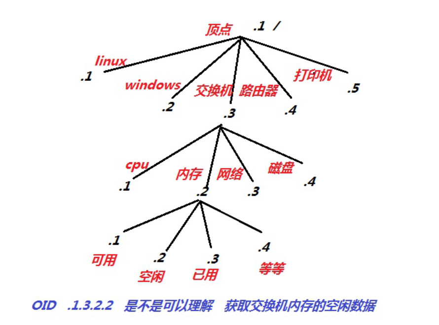

#### 1.3.2 MIB

MIB库：统计所有的old库（国际标准） 比如：通过 hrMemorySize.0获取内存信息 比如： 可以理解MIB是域名，比较好记忆。  OID是IP地址，不 太好记忆。

### 1.4 SNMP的版本

v1：不支持加密，任何人都可以取值, 不安全 v2：简单加密版，通过口令才可以取值，通过 community设定口令（使用最多） v3：复杂加密，采集效率比较低

## 2.SNMP监控网络设备实践

### 2.1 开启路由器SNMP

登录路由器，找到设备管理-->SNMP，开启SNMP功能， 然后设置团体名称即可；

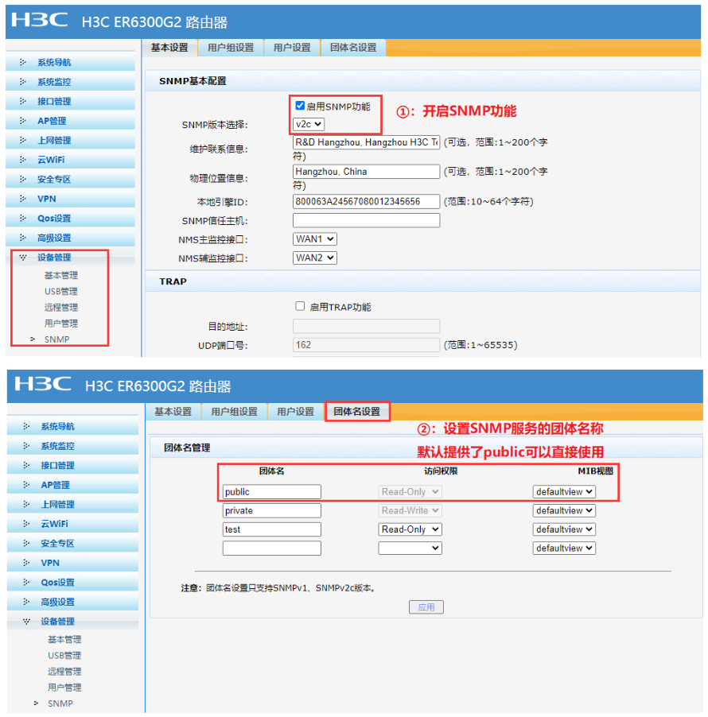

### 2.2 配置ZabbixWeb

单机配置-->主机-->添加主机-->选择类型为SNMP，输入 路由器设备的IP地址

```
Template Module EtherLike-MIB SNMP Template Module Generic SNMP Template Module Interfaces SNMP
```
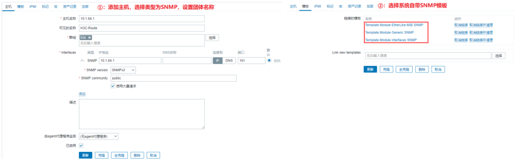

### 2.3 监测结果展示

点击监测-->主机-->图形

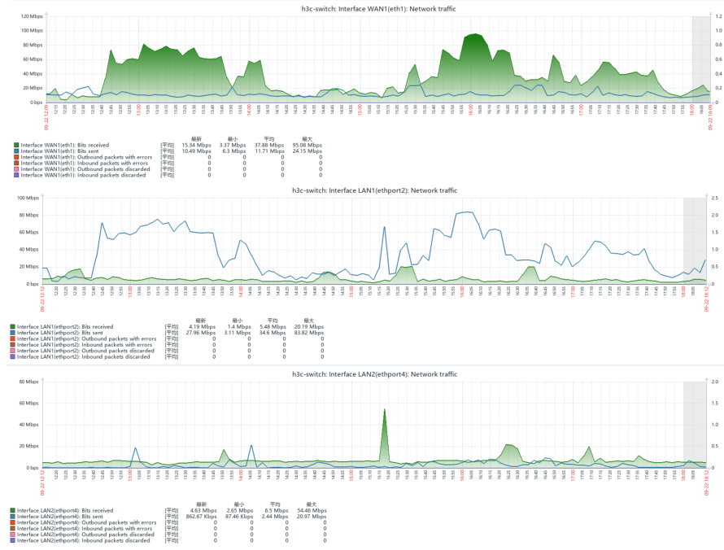

## 3.SNMP监控Linux实践


### 3.1 SNMP服务安装

```
[root@web01 ~]# yum install net-snmp net-
snmp-utils -y
```
### 3.2 SNMP服务配置

```
[root@web01 ~]# vim /etc/snmp/snmpd.conf
```
#public是默认的团体名称，建议修改 com2sec notConfigUser  default  oldxu #限制丛树杈哪个地方开始取值，如果需要监控的信息，设 置.1从顶点开始 view    systemview    included   .1

### 3.3 SNMP服务启动

```
[root@web01 ~]# systemctl enable
```
snmpd.service

```
[root@web01 ~]# systemctl start
```
snmpd.service

### 3.4 获取客户端数据

linux oid 参考地址：

```
https://www.iteye.com/blog/yeluotiying-
```
2112079 # 服务端安装snmp工具

```
[root@zabbix-server ~]# yum install net-
snmp-utils -y
```
OID获取数据方式

```
[root@zabbix-server ~]# snmpwalk -v2c -c
```
oldxu 172.16.1.7 .1.3.6.1.2.1.25.2.2.0

```
HOST-RESOURCES-MIB::hrMemorySize.0 =
INTEGER: 2030168 KBytes
```
MIB获取数据方式

```
[root@zabbix-server ~]# snmpwalk -v2c -c
```
oldxu 172.16.1.7 hrMemorySize.0

```
HOST-RESOURCES-MIB::hrMemorySize.0 =
INTEGER: 2030168 KBytes
```
### 3.5 配置ZabbixWeb

添加主机，配置团体名，关联Template OS Linux SNMP模板

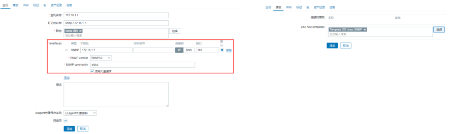

最终SNMP监控效果

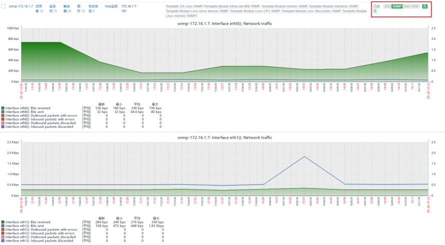

## 4.Zabbix监测Web

### 4.1 Web监测的概述

使用 Zabbix 对网站进行多方面可用性监控，比如下载 速度，响应时间，响应状态码等； 1.访问资源； 2.登录资源； 3.检查登录是否成功；

4.退出登录； 5.检查是否退出成功；

### 4.2 Web监测如何实现

要使用Web监控，需要先定义Web场景，Web场景包括一 个或多个HTTP请求步骤。Zabbix server会周期性的 执行这些步骤。 从 Zabbix2.2 开始，Web 场景和监控项，触发器等一 样，是依附在主机/模版上的。这意味着 web 场景也可 以创建到一个模板里，然后应用于多个主机。

### 4.3 Web场景检测-Curl

在实现Web站点检测之前，我们需要先了解curl命令如 何实现站点登陆的，因为zabbix监控web站点底层使用 的是curl命令来实现的，那使用curl命令登陆站点如何实 现 1.请求服务端，获取sessionID 2.请求服务端，携带 sessionID+UserName+Password登陆验证。

## 3.可以直接访问服务端登陆后的页面

#1.使用curl命令请求服务端，获取sessionID，并将其 保存起来。

```
[root@web01 ~]# curl -L -c cook -b cook
'http://zabbix.oldxu.net/index.php'
```
#2.携带sessionID+用户名+密码登陆网站

```
[root@web01 ~]# curl -L -c cook -b cook -d
'name=Admin&password=zabbix&autologin=1&ent
er=Sign+in'
http://zabbix.oldxu.net/index.php
```
#3.请求服务端，携带session即可，然后访问我们需要访 问登陆后的资源。

```
[root@web01 ~]# curl -L -c cook -b cook
’http://zabbix.oldxu.net/hosts.php'
```
### 4.4 Web场景监测实战

使用Zabbix Web监控来监控Zabbix的Web界面，我们 想知道它是否可用、是否正常工作以及其响应速度。 首选需要添加一个场景来监控Zabbix的Web界面，该场 景需要执行多个步骤； 4.4.1 第1步：创建新的Web场景 点击配置->主机->选择主机->单击Web监测->创建Web 监测 在新的场景中，我们将场景命名为监控zabbixWeb，并 为其创建一个新的应用。

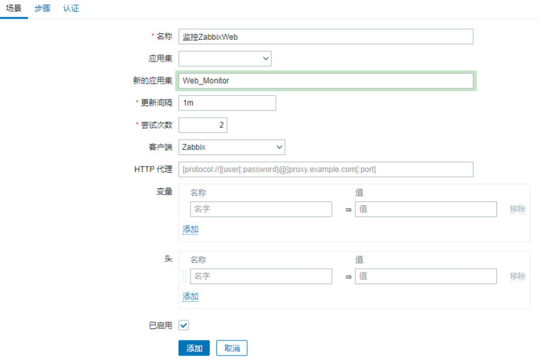

4.4.2 第2步：步骤1-访问Zabbix站点 定义场景的步骤->点击步骤->点击添加按钮 步骤1，首先检查第一页响应是否正确，返回 HTTP 响应 代码 200，并包含文本 Zabbix SIA

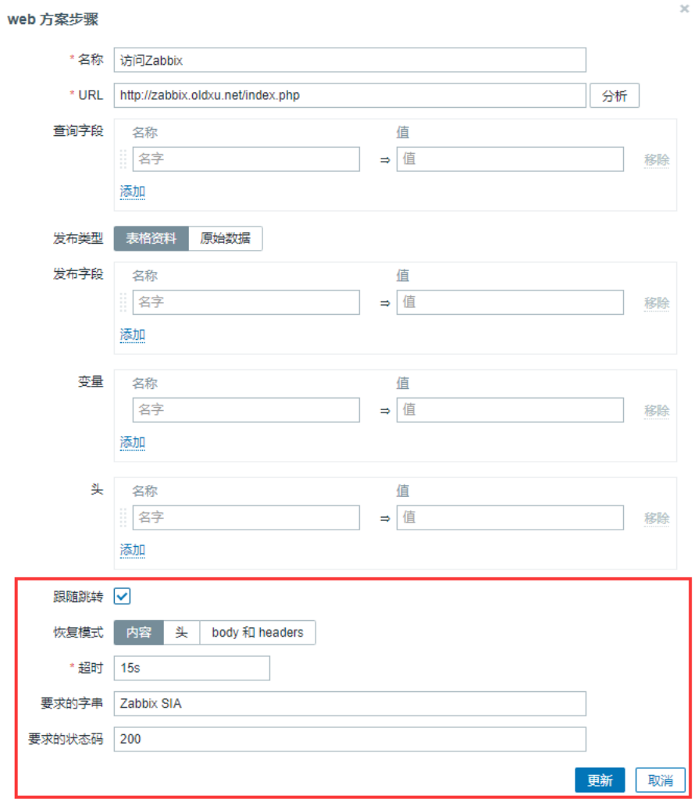

4.4.3 第2步：步骤2-登录Zabbix站点 登录Zabbix，提交用户名与密码

```
name=Admin&password=zabbix&autologin=1&enter=
Sign+in 使用正则提取会话ID：regex:name="csrf-token"
content="([0-9a-z]{16})"。后续退出时需要使用；
```
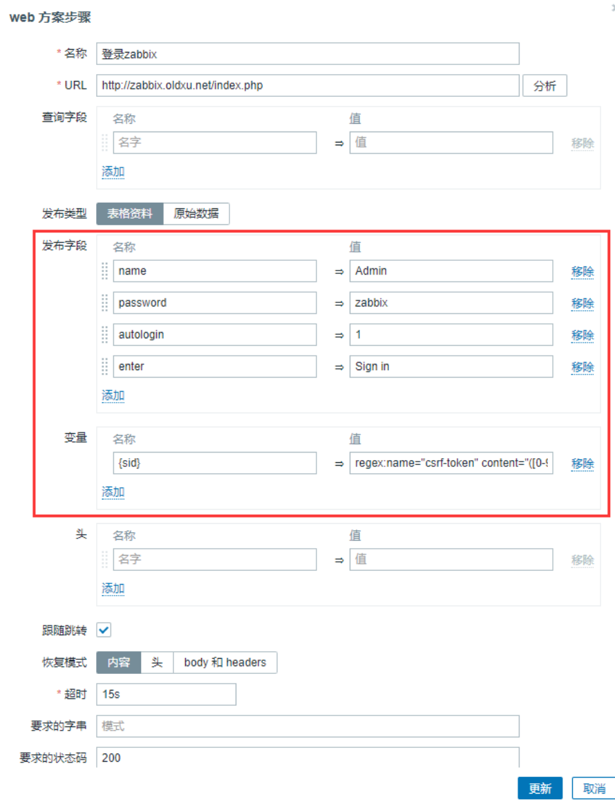

4.4.4 第2步：步骤3-验证是否登录成功 登录后需要验证一下是否登陆成功。为此检查一个仅在 登录后可见的字符串 - 例如管理

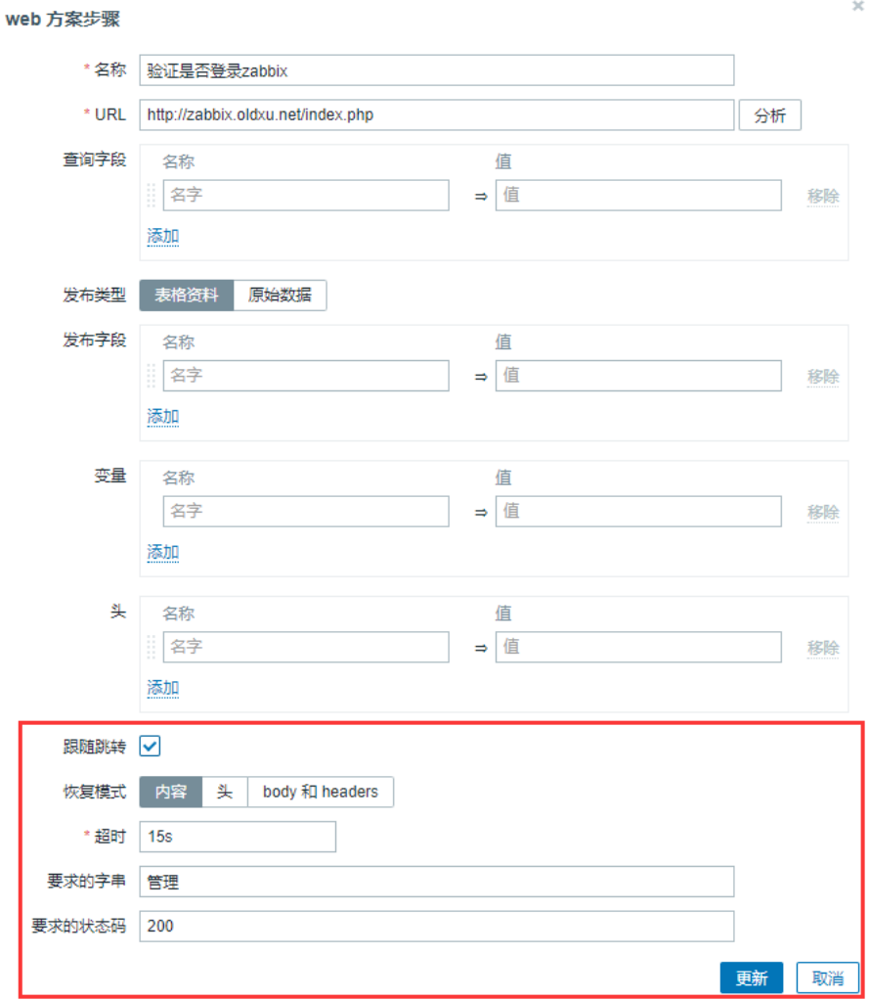

4.4.5 第2步：步骤4-退出Zabbix站点 验证后需要退出Zabbix，否则Zabbix 数据库将被大量 的开放会话记录所污染。 退出的URL地址

```
http://zabbix.oldxu.net/index.php?reconnect=1
```
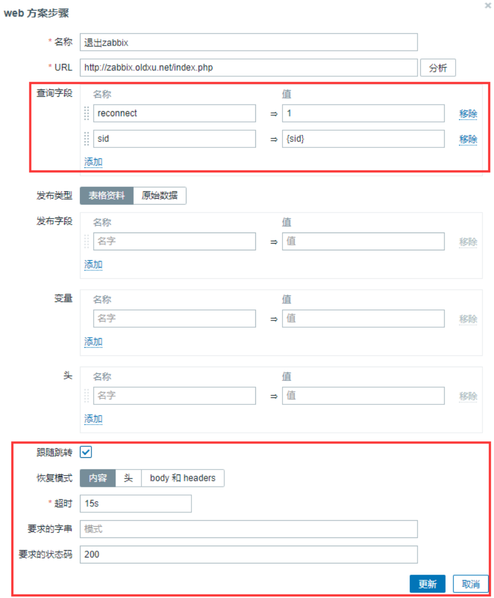

4.4.6 第2步：步骤5-检查是否退出成功 我们可以通过查找 Username 字符串来检查我们是否已 经注销了。

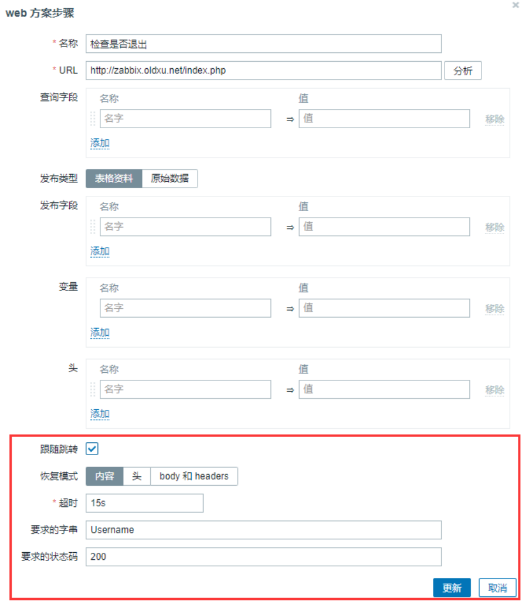

#### 4.4.7 第2步：步骤6-完成web场景配置 完成步骤配置Web 场景步骤的完整配置应如下所示

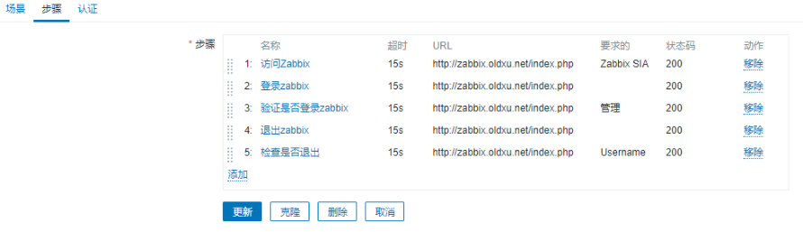

#### 4.4.8 第3步：检查整体监控结果

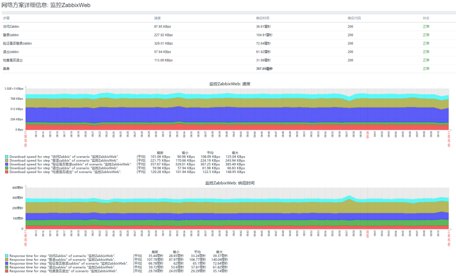

### 4.5 Web场景触发器

#### 4.5.1 监控Web站点失败场景

要创建“Web 场景失败”触发器，可以定义触发器表达 式：

触发器名称（并提供有用的问题描述）

```
Web 监测 "zabbixWeb" failed: {ITEM.VALUE}
```
触发器表达式

```
{Template OS Linux by Zabbix
agent:web.test.fail[监控ZabbixWeb].last()}
<>0
```
恢复表达式

```
{Template OS Linux by Zabbix
agent:web.test.fail[监控ZabbixWeb].last()}=0
```
测试效果如下(将网站的Nginx服务给停止即可完成测试)

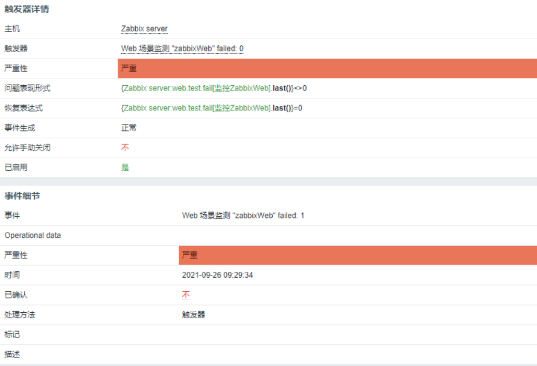

#### 4.5.2 监控Web站点响应时间

监控项key: web.test.time[Scenario,Step,resp]（以秒 为单位），主要用于探测站点响应时间；

触发器名称（并提供有用的问题描述） Web "响应时间大于1s" timeout: {ITEM.VALUE} # 触发器表达式

```
{Template OS Linux by Zabbix
agent:web.test.time[监控ZabbixWeb,访问
Zabbix,resp].last(#3)}>1 or {Template OS
Linux by Zabbix agent:web.test.time[监控
ZabbixWeb,登录zabbix,resp].last(#3)}>1 or
{Template OS Linux by Zabbix
```
agent:web.test.time[监控ZabbixWeb,验证是否登录

```
zabbix,resp].last(#3)}>1 or {Template OS
Linux by Zabbix agent:web.test.time[监控
ZabbixWeb,退出zabbix,resp].last(#3)}>1 or
{Template OS Linux by Zabbix
agent:web.test.time[监控ZabbixWeb,检查是否退
出,resp].last(#3)}>1
```
恢复表达式

```
{Template OS Linux by Zabbix
agent:web.test.time[监控ZabbixWeb,访问
Zabbix,resp].last()}<1 or {Template OS
Linux by Zabbix agent:web.test.time[监控
ZabbixWeb,登录zabbix,resp].last()}<1 or
{Template OS Linux by Zabbix
```
agent:web.test.time[监控ZabbixWeb,验证是否登录

```
zabbix,resp].last()}<1 or {Template OS
Linux by Zabbix agent:web.test.time[监控
ZabbixWeb,退出zabbix,resp].last()}<1 or
{Template OS Linux by Zabbix
agent:web.test.time[监控ZabbixWeb,检查是否退
出,resp].last()}<1
```
压力测试脚本

```
[root@db01 ~]# cat ab.sh
for i in {1..100}
do
    ab -n 1000 -c 200
http://zabbix.oldxu.net/index.php
sleep 0.5 done 测试效果如下：
```
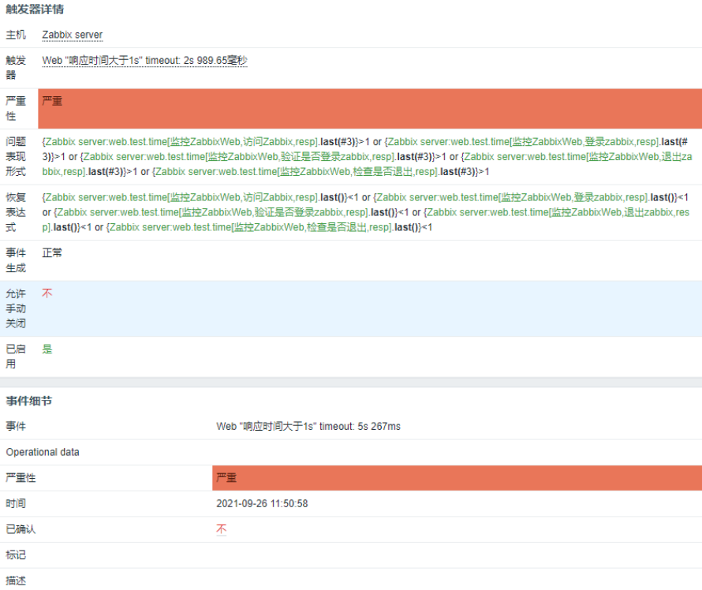

#### 4.5.3 监控Web站点响应代码

监控项key: web.test.rspcode[Scenario,Step] 用于收集 监控项步骤的响应代码。 关闭zabbix的php-fpm来测试； 触发表达式

```
{Zabbix server:web.test.rspcode[访问Zabbix,
登录zabbix].last()}<>200 or {Zabbix
server:web.test.rspcode[访问Zabbix,访问
Zabbix].last()}<>200
```
恢复表达式

```
{Zabbix server:web.test.rspcode[访问Zabbix,
登录zabbix].last()}=200 and {Zabbix
server:web.test.rspcode[访问Zabbix,访问
Zabbix].last()}=200
```
