# 04.Zabbix自动化监控

## 目录

- [1.自动化监控概述](#1.自动化监控概述)
  - [1.1 自动化添加主机](#1.1-自动化添加主机)
  - [1.2 自动化添加主机方式](#1.2-自动化添加主机方式)
- [2.网络发现概念](#2.网络发现概念)
  - [2.1 发现原理](#2.1-发现原理)
- [1.首先zabbix周期性地扫描在 "网络发现规则" 中定](#1.首先zabbix周期性地扫描在-网络发现规则-中定)
  - [2.2 规则示例](#2.2-规则示例)
  - [2.3 网络发现实践](#2.3-网络发现实践)
    - [2.3.1 场景需求](#2.3.1-场景需求)
    - [2.3.2 发现场景-步骤1](#2.3.2-发现场景-步骤1)
    - [2.3.3 发现场景-步骤2](#2.3.3-发现场景-步骤2)
    - [2.3.4 发现场景-步骤3](#2.3.4-发现场景-步骤3)
    - [2.3.5 网络发现结果检查](#2.3.5-网络发现结果检查)
  - [2.4 网络发现总结](#2.4-网络发现总结)
- [3.自动注册概念](#3.自动注册概念)
  - [3.1 注册原理](#3.1-注册原理)
  - [3.2 注册配置](#3.2-注册配置)
  - [3.3 自动注册实践-1](#3.3-自动注册实践-1)
    - [3.3.1 场景需求](#3.3.1-场景需求)
    - [3.3.2 配置ZabbixAgent](#3.3.2-配置zabbixagent)
    - [3.3.3 配置ZabbixServer](#3.3.3-配置zabbixserver)
    - [3.3.4 自动注册结果检查](#3.3.4-自动注册结果检查)
  - [3.4 自动注册实践-2](#3.4-自动注册实践-2)
    - [3.4.1 场景需求](#3.4.1-场景需求)
    - [3.4.2 配置Ansible](#3.4.2-配置ansible)
    - [3.4.3 配置ZabbixServer](#3.4.3-配置zabbixserver)
    - [3.4.4 自动注册结果检查](#3.4.4-自动注册结果检查)
  - [3.5 自动注册实践-3](#3.5-自动注册实践-3)
    - [3.4.2 配置ZabbixAgent](#3.4.2-配置zabbixagent)
- [1.在配置文件中额外添加HostMetadataItem一行内](#1.在配置文件中额外添加hostmetadataitem一行内)
- [4.主动模式与被动模式](#4.主动模式与被动模式)
  - [4.1 主被模式基本概念](#4.1-主被模式基本概念)
  - [4.2 主被模式功能区别](#4.2-主被模式功能区别)
  - [4.3 主被模式与发现的关系](#4.3-主被模式与发现的关系)
  - [4.4 主被模式与监控项的关系](#4.4-主被模式与监控项的关系)
  - [4.3 何时需要使用主动模式](#4.3-何时需要使用主动模式)
  - [4.4 如何调为主动模式](#4.4-如何调为主动模式)
    - [4.4.1 修改Agent配置](#4.4.1-修改agent配置)
    - [4.4.2 修改模板为主动式](#4.4.2-修改模板为主动式)
- [1.克隆一份被动模式监控项的模板](#1.克隆一份被动模式监控项的模板)
- [2.点击克隆后的模板->选中所有监控项->批量修改-](#2.点击克隆后的模板-选中所有监控项-批量修改-)
    - [4.4.3 总结](#4.4.3-总结)
- [5.低级自动发现LLD](#5.低级自动发现lld)
  - [5.1 什么是LLD](#5.1-什么是lld)
  - [5.2 为何需要LLD](#5.2-为何需要lld)
  - [5.3 LLD快速体验](#5.3-lld快速体验)
    - [5.3.1 编写网卡采集命令](#5.3.1-编写网卡采集命令)
    - [5.3.2 创建自定义监控项](#5.3.2-创建自定义监控项)
    - [5.3.3 服务端测试取值](#5.3.3-服务端测试取值)
    - [5.3.4 web添加监控原型](#5.3.4-web添加监控原型)
  - [5.3 LLD原理分析](#5.3-lld原理分析)
    - [5.3.2 发现规则](#5.3.2-发现规则)
    - [5.3.1 监控原型](#5.3.1-监控原型)
  - [5.4 LLD监控主机端口实践](#5.4-lld监控主机端口实践)
- [1.定义自动发现规则](#1.定义自动发现规则)
- [2.定义监控项原型](#2.定义监控项原型)
    - [5.4.1 编写发现规则脚本](#5.4.1-编写发现规则脚本)
    - [5.4.2 创建特殊的监控项](#5.4.2-创建特殊的监控项)
    - [5.4.3 服务端测试取值](#5.4.3-服务端测试取值)
    - [5.4.4 Web创建自动发现规则](#5.4.4-web创建自动发现规则)
    - [5.4.5 Web创建监控项原型](#5.4.5-web创建监控项原型)
    - [5.4.6 Web创建触发器](#5.4.6-web创建触发器)
    - [5.4.7 Web结果验证](#5.4.7-web结果验证)
  - [5.5 LLD监控Redis多实例实践](#5.5-lld监控redis多实例实践)
    - [5.5.1 场景需求说明](#5.5.1-场景需求说明)
    - [5.5.2 Redis监控配置](#5.5.2-redis监控配置)
    - [5.5.2.1 场景环境搭建](#5.5.2.1-场景环境搭建)
- [1.安装redis服务](#1.安装redis服务)
    - [5.5.2.2 编写采集数据脚本](#5.5.2.2-编写采集数据脚本)
    - [5.5.2.3 创建自定义监控项](#5.5.2.3-创建自定义监控项)
    - [5.5.2.4 服务端测试取值](#5.5.2.4-服务端测试取值)
    - [5.5.3 配置自动发现LLD](#5.5.3-配置自动发现lld)
    - [5.5.3.1 编写发现规则脚本](#5.5.3.1-编写发现规则脚本)
    - [5.5.3.2 创建发现规则监控项](#5.5.3.2-创建发现规则监控项)
    - [5.5.3.3 服务端测试取值](#5.5.3.3-服务端测试取值)
    - [5.5.4 配置Zabbix Web](#5.5.4-配置zabbix-web)
    - [5.5.4.1 web创建自动发现规则](#5.5.4.1-web创建自动发现规则)
    - [5.5.4.2 web创建监控项原型](#5.5.4.2-web创建监控项原型)
    - [5.5.4.3 web创建触发器原型](#5.5.4.3-web创建触发器原型)
    - [5.5.4.4 web创建图形原型](#5.5.4.4-web创建图形原型)
    - [5.5.4.5 web检查创建效果](#5.5.4.5-web检查创建效果)
    - [5.5.4.4 测试告警并验证](#5.5.4.4-测试告警并验证)

徐亮伟, 江湖人称标杆徐。多年互联网运维工作经 验，曾负责过大规模集群架构自动化运维管理工作。 擅长Web集群架构与自动化运维，曾负责国内某大型 电商运维工作。 个人博客"徐亮伟架构师之路"累计受益数万人。

## 1.自动化监控概述

### 1.1 自动化添加主机

前面我们演示了手动添加一台主机的方法，很简单。但 我们现在有100台主机需要添加，就会变得非常繁琐， 所以我们可以通过zabbix提供的自动注册或自动发现来 实现主机的批量添加；

### 1.2 自动化添加主机方式

```
网络发现 ( Network discovery) 自动注册 ( Active agent auto-registration )
```
## 2.网络发现概念

### 2.1 发现原理

自动发现由两个步骤组成：发现discovery 和动作 action

## 1.首先zabbix周期性地扫描在 "网络发现规则" 中定

义的IP段，发现满足规则的主机。 2.然后使这些主机完成动作，即添加主机、添加模 板、发送通知等等。

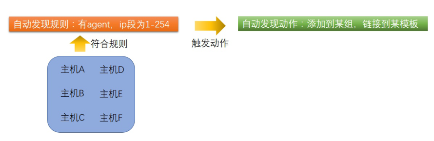

### 2.2 规则示例

配置Zabbix的网络发现来发现主机： 首先进入 配置 → 自动发现 单击 创建发现规则 编辑自动发现规则属性 IP范围：172.15.1.1-254指Zabbix会自动扫描这 个网段的所有IP，依次连接这些IP的10050端口； 检查：尝试通过system.uname监控项，看看是否 能获取到数据，如果可以则加入该主机；

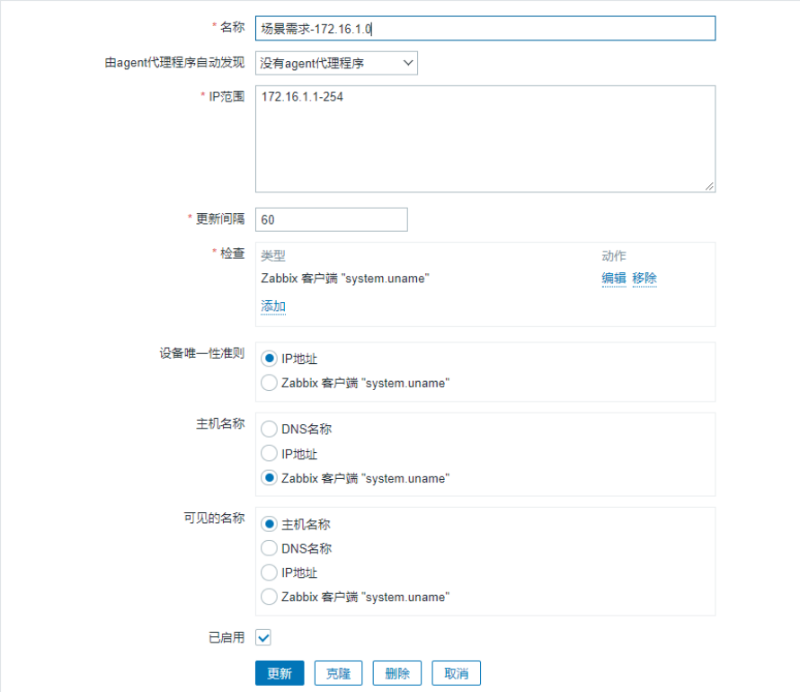

### 2.3 网络发现实践

#### 2.3.1 场景需求

例如我们设置IP段为172.15.1.1-172.15.1.254的网络发 现规则，在我们的例子中，我们需要： 发现有Zabbix agent运行的主机 每10分钟执行一次 如果主机正常运行时间超过2分钟，添加主机； 如果主机停机时间超过24小时，删除主机； 将Linux主机添加到“Linux servers”组、链接模板 Template OS Linux 到Linux主机

#### 2.3.2 发现场景-步骤1

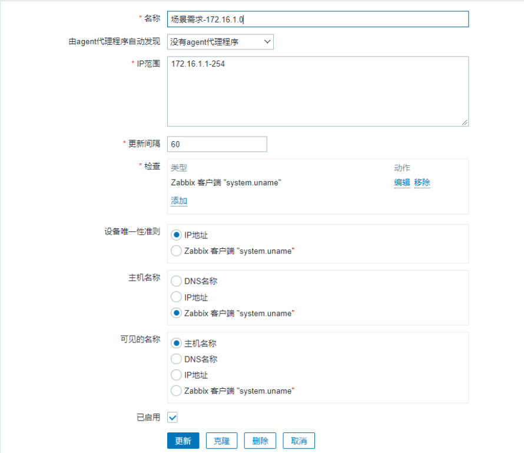

#### 2.3.3 发现场景-步骤2

点击配置-->动作-->Discovery actions “Zabbix agent”服务是“up” system.uname(规则中定义的Zabbix agent键值)包含 “Linux” 正常运行时间为2分钟（120秒）或更长

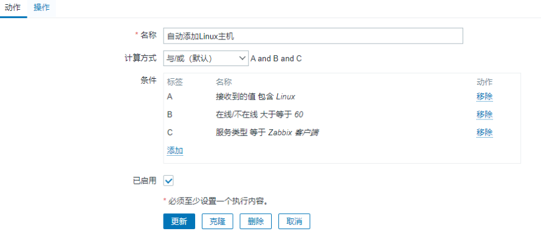

该动作(action)将执行以下操作： 将发现的主机添加到Linux servers组（如果以前未 添加主机，则自动添加主机） 链接主机到Template OS Linux模板


#### 2.3.4 发现场景-步骤3

定义动作删除失联主机

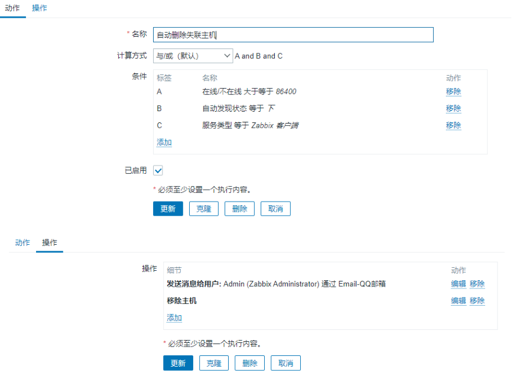

#### 2.3.5 网络发现结果检查

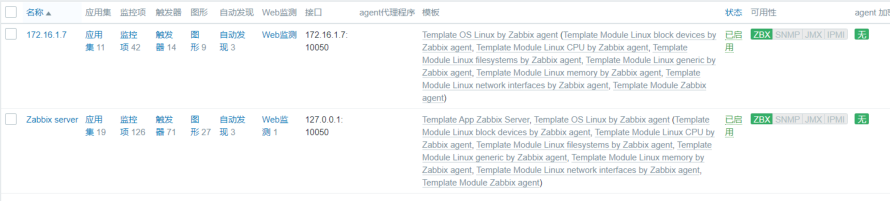

### 2.4 网络发现总结

网络发现虽然能发现并添加主机，但任然存在一些问 题： 1.发现时间长，效率较低； 1 2 3 4 5 6 2.扫描过程中容易漏扫； 3.当IP地址不固定难以实现； 4.无法实现不同类型主机关联不同模板；  7  tcp nginx zabbix_Agent     51  tcp  zabbix_agent

mysql

## 3.自动注册概念

### 3.1 注册原理

自动注册（agent auto-registration）功能主要用于 Agent主动向Server注册，与网络发现有同样的功能，但 是这个功能更适用于云环境下，因为云环境下IP地址是 随机的，难以使用网络发现方式实现； 1.注册时间短； 2.适用云复杂的环境，IP地址无规律； 3.关联不同的模板； 4.提高server性能；

### 3.2 注册配置

自动注册主要分为两个步骤： 1.自动注册，客户端必须开启主动模式，并设定主机 名称； 2.在zabbix web中配置一个自动注册的动作；

### 3.3 自动注册实践-1

#### 3.3.1 场景需求

根据不同的主机名称关联不同的主机模板 web主机节点，需要关联Template OS Linux模板、 TCP Status模板、Nginx模板、PHP模板； db主机节点，需要关联Template OS Linux模板、 MySQL模板；

#### 3.3.2 配置ZabbixAgent

每当活动agent刷新主动检查到服务器的请求时，都会进 行自动注册尝试。 请求的延迟在agent的 RefreshActiveChecks参数中指 定，第一个请求在agent重新启动后立即发送

```
[root@web01 ~]# vim
/etc/zabbix/zabbix_agent2.conf
Server=172.16.1.71
ServerActive=172.16.1.71    # 设置主动模式
Hostname=web              # 指定主机名，如不指
```
定则服务器将使用agent的系统主机名命名主机 # 重启Agent

```
[root@web01 ~]# systemctl restart zabbix-
```
#### 3.3.3 配置ZabbixServer

点击配置-->动作-->Autoregistration actions，添加两个 动作，一个针对web组，一个针对db组；


#### 3.3.4 自动注册结果检查


### 3.4 自动注册实践-2

#### 3.4.1 场景需求

根据不同的主机名称关联不同的主机模板 web主机节点，需要关联Template OS Linux模板、 TCP Status模板、Nginx模板、PHP模板； db主机节点，需要关联Template OS Linux模板、 MySQL模板； 客户端采用Ansible Playbook实现，做到完全自动化 添加主机，并智能添加模板；

#### 3.4.2 配置Ansible

#1.安装 #2.配置 server serverActive

Hostname #2.所有的脚本，所有的UserParameter全部导入到对应 的目录中； #3.启动 # 脚本参考： roles_zbx.tar.gz 1.agent适用ansible来运行；  （serverActive Hostname ） 2.所有的agent都需要有脚本，conf配置文件，其次，服 务必须都是启用了对应的状态（Ansible）； 3.给server导入所有的模板； 3.配置server，配置自动注册的动作，根据不同主机名 称，关联不同的模板

#### 3.4.3 配置ZabbixServer

点击配置-->动作-->Autoregistration actions，添加两个 动作，一个针对web组，一个针对db组；


#### 3.4.4 自动注册结果检查

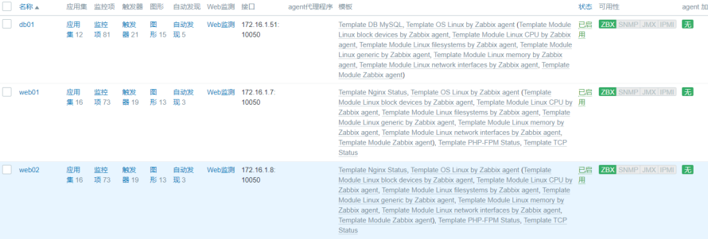

### 3.5 自动注册实践-3

#### 3.4.1 场景需求

使用主机元数据来区分Linux和Windows主机，根据 不同的操作系统关联不同的主机模板 Linux主机关联Template OS Linux模板 Windows主机关联Template OS Windows模板

#### 3.4.2 配置ZabbixAgent

## 1.在配置文件中额外添加HostMetadataItem一行内

容：

```
[root@web01 ~]# vim
/etc/zabbix/zabbix_agent2.conf
Server=172.15.1.71
ServerActive=172.15.1.71
Hostname=web01
HostMetadataItem=system.uname
[root@web01 ~]# systemctl restart zabbix-
```
2.这样能确保主机元数据将包含“Linux”或“Windows”， 主机元数据示例如下：

#Linux主机获取的元数据信息

```
#Linux: Linux server3 3.2.0-4-686-pae #1
SMP Debian 3.2.41-2 i686 GNU/Linux
```
#Windows主机获取的元数据信息

```
#Windows: Windows WIN-0PXGGSTYNHO 5.0.6001
```
Windows Server 2008 Service Pack 1 Intel

```
IA-32
```
#### 3.4.3 配置ZabbixServer

第一个动作： 名称：Linux主机自动注册 条件：主机元数据似 Linux 操作：链接到模板：Template OS Linux 第二个动作： 名称：Windows主机自动注册 主机元数据似 Windows 操作：链接到模板：Template OS Windows

## 4.主动模式与被动模式

### 4.1 主被模式基本概念

默认情况下，zabbix server会直接去每个agent上抓取 数据，对于 agent 来说，是被动模式，也是默认的一种 获取数据的方式，但是当zabbix server监控主机数量过 多的时候，由 Zabbix Server 端去抓取 agent 上的数

据，Zabbix server会出现严重的性能问题，主要表现如 下： 1）Web操作很卡，容易出现502错误

如何解决呢? 可以使用主动模式，agent端主动汇报自己 收集到的数据给Zabbix Server，这样Zabbix Server就 会空闲很多。

### 4.2 主被模式功能区别

被动和主动模式，针对的都是Agent； 被动模式：Server轮询检测Agent。（领导找下属询问销 售业绩，每隔一段时间询问一次） 主动模式：Agent主动上报给Server。（领导给下属分配 任务，下属定期通知领导）

### 4.3 主被模式与发现的关系

自动发现属于被动模式，效率低，如果扫描主机过多， 容器出现漏添加主机情况。 自动注册属于主动模式，效率高，能根据主机名称、元 数据等关联不同主机模板。

### 4.4 主被模式与监控项的关系

zabbix默认使用的是被动模式监控，当需要获取100个 监控项的值， 需要Server向Agent轮询100次。 Zabbix主动模式如需要获取100个监控项的值，Server 会将要获取监控项的值生成一个清单发送给Agent， Agent采集完成后会一次将所有数据发送给Server。

### 4.3 何时需要使用主动模式

1.当队列里存在大量延迟的监控项； 2.当监控主机超过500+；

### 4.4 如何调为主动模式

#### 4.4.1 修改Agent配置

注意：Agent2目前不支持主动模式，测试：建议使用 zabbix-agent， 1.修改zabbix_agentd2.conf配置文件

```
[root@web01 ~]# vim
/etc/zabbix/zabbix_agentd.conf
ServerActive=172.16.1.71    # 指定Agent收集的
```
数据发送给谁

```
Hostname=                            # 要与
```
zabbixweb中添加主机对应，否则会找不到主机

2.当开启agent主动发送数据模式，还需要在zabbix Server端修改如下两个参数，保证性能。

```
[root@zabbix-server ~]# vim
/etc/zabbix/zabbix_server.conf
StartPollers=10     # zabbix Server主动采集数
```
据进程减少一些。

```
StartTrappers=200   # 负责处理Agent推送过来数据
```
的进程开大一些。

#### 4.4.2 修改模板为主动式

## 1.克隆一份被动模式监控项的模板

## 2.点击克隆后的模板->选中所有监控项->批量修改-

>zabbix客户端（主动式） 3.选择主机取消链接并清理被动模板，然后重新关联新” 主动式“模板。

#### 4.4.3 总结

当完成了主动模式的切换之后，可以持续观察zabbix server的负载，应该会降低不少，其次在操作上也不卡 了，图也不裂了，zabbix的性能也得到了较大的提升；

## 5.低级自动发现LLD

### 5.1 什么是LLD

自动发现：是用来自动化添加主机 低级自动发现：是用来自动化添加监控项

### 5.2 为何需要LLD

场景1：监控所有主机的端口，而不同的主机启动的端口 都不一样，怎么办？ 场景2：监控所有主机的分区，不同的主机分区的方式都 不一样？怎么办？ 场景3：监控所有主机的网络、不同的主机的配置都不一 样？怎么办? .....

### 5.3 LLD快速体验

基于已有的自动发现规则，添加一个监控原型，用来监 控所有网卡的MAC地址

#### 5.3.1 编写网卡采集命令

```
[root@web_7 ~]# ifconfig eth1 | awk
'/ether/ {print $2}'
00:0c:29:5b:ac:a6
[root@web_7 ~]# ifconfig eth0 | awk
'/ether/ {print $2}'
00:0c:29:5b:ac:9c
```
#### 5.3.2 创建自定义监控项

```
[root@web_7 ~]# vim
/etc/zabbix/zabbix_agent2.d/system.conf
UserParameter=net.mac[*], ifconfig "$1" |
awk '/ether/ {print $$2}'
[root@web_7 ~]# systemctl restart zabbix-
```
#### 5.3.3 服务端测试取值

```
[root@zabbix-server ~]# zabbix_get -s
172.16.1.7 -k net.mac[eth0]
00:0c:29:5b:ac:9c
[root@zabbix-server ~]# zabbix_get -s
172.16.1.7 -k net.mac[eth1]
00:0c:29:5b:ac:a6
```
#### 5.3.4 web添加监控原型

点击-->配置-->主机-->自动发现规则-->Network interface discovery-->监控项原型-->创建监控项原 型

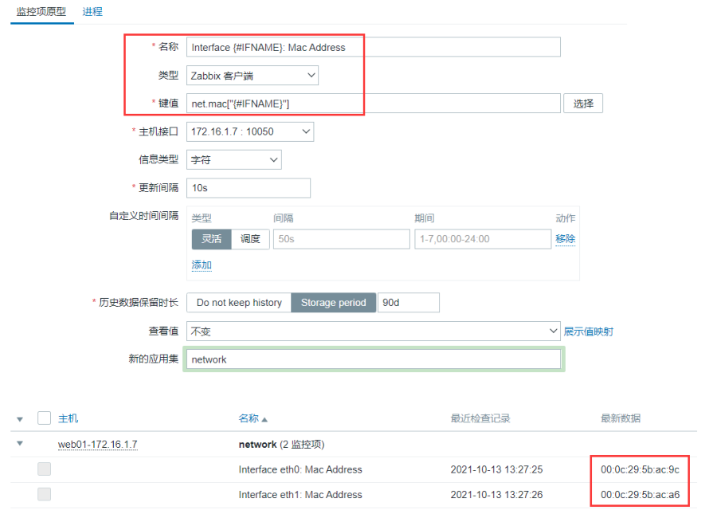

### 5.3 LLD原理分析

为什么能自动创建并监控 eth0、eth1 的 mac 地址呢； 其实是依靠”自动发现规则\监控项原型“来实现

#### 5.3.2 发现规则

当我们查看 ”自动发现规则“ 的时候发现它定义了一个特 殊的key，net.if.discovery，而这个 key 可以提取到 主机所有的网卡名称

```
[root@zabbix-server ~]# zabbix_get -s
172.16.1.7 -k net.if.discovery
[{"{#IFNAME}":"eth0"},{"{#IFNAME}":"eth1"},
{"{#IFNAME}":"lo"}]
```
#### 5.3.1 监控原型

然后在通过 ”监控项原型“ 将 ”自动发现规则“ 中提取到的 网卡名称依次传递给监控项，完成自动创建。


如果后期增加eth2网卡会自动添加对应的监控项，但移 除eth2网卡并不会自动移除该网卡对应的监控项；

### 5.4 LLD监控主机端口实践

特殊监控项：提取每台的端口 系统：  listen.tcp.[{#TCP_PORT}] 脚本：监控项（必须预留能传参的位置） 监控每台主机端口：

## 1.定义自动发现规则

## 2.定义监控项原型

编写脚本，用来获取主机的所有端口，效果如下

```
{
    "data":[
        {"{#TCP_PORT}":"10050"},
        {"{#TCP_PORT}":"111"},
        {"{#TCP_PORT}":"22"},
        {"{#TCP_PORT}":"25"},
        {"{#TCP_PORT}":"35389"},
        {"{#TCP_PORT}":"53569"},
        {"{#TCP_PORT}":"873"},
        {"{#TCP_PORT}":"8899"},
        {"{#TCP_PORT}":"9000"}
    ]
}

#### 5.4.1 编写发现规则脚本

[root@web_7 ~]# vim
/etc/zabbix/zabbix_agent2.d/discovery_port.
```
sh
```
#!/usr/bin/bash
port_array=($(ss -lntp | awk '{print $4}' |
awk -F ":" '{print $NF}' | egrep "^[0-9]+$"
| sort |uniq | xargs))
length=${#port_array[@]}
printf "{\n"
printf  '\t'"\"data\":["
j=0
for i in ${port_array[@]}

do

    j=$[ $j + 1 ]
    printf '\n\t\t{'
    if [ $j -eq ${length} ];then
        printf "\"{#TCP_PORT}\":\"${i}\"}"
else
        printf "\"{#TCP_PORT}\":\"${i}\"},"
fi
done
    printf "\n\t]\n"
    printf "}\n"
```
# 执行脚本

```
[root@web_7 ~]# sh
/etc/zabbix/zabbix_agent2.d/discovery_port.
sh
{
    "data":[
        {"{#TCP_PORT}":"10050"},
        {"{#TCP_PORT}":"111"},
        {"{#TCP_PORT}":"199"},
        {"{#TCP_PORT}":"20048"},
        {"{#TCP_PORT}":"2049"},
        {"{#TCP_PORT}":"22"},
        {"{#TCP_PORT}":"3306"},
        {"{#TCP_PORT}":"3610"},
        {"{#TCP_PORT}":"4812"},
        {"{#TCP_PORT}":"59638"},
        {"{#TCP_PORT}":"6379"},
        {"{#TCP_PORT}":"80"},
        {"{#TCP_PORT}":"8080"},
        {"{#TCP_PORT}":"8081"},
        {"{#TCP_PORT}":"8082"},
        {"{#TCP_PORT}":"873"},
        {"{#TCP_PORT}":"8888"},
        {"{#TCP_PORT}":"9000"},
        {"{#TCP_PORT}":"9026"}
    ]
}

#### 5.4.2 创建特殊的监控项

定义一个特殊的Zabbix监控项

[root@web_7 ~]# vim
/etc/zabbix/zabbix_agent2.d/discovery_port.
```
conf

```
UserParameter=port.discovery, /bin/bash
/etc/zabbix/zabbix_agent2.d/discovery_port.
sh
```

重启agent2

```
[root@web_7 ~]# systemctl restart zabbix-
```
#### 5.4.3 服务端测试取值

```
[root@zabbix-server ~]# zabbix_get -s
172.16.1.7 -k port.discovery
{
    "data":[
        {"{#TCP_PORT}":"10050"},
        {"{#TCP_PORT}":"111"},
        {"{#TCP_PORT}":"199"},
        {"{#TCP_PORT}":"20048"},
        {"{#TCP_PORT}":"2049"},
        {"{#TCP_PORT}":"22"},
        {"{#TCP_PORT}":"3306"},
        {"{#TCP_PORT}":"3610"},
        {"{#TCP_PORT}":"4812"},
        {"{#TCP_PORT}":"59638"},
        {"{#TCP_PORT}":"6379"},
        {"{#TCP_PORT}":"80"},
        {"{#TCP_PORT}":"8080"},
        {"{#TCP_PORT}":"8081"},
        {"{#TCP_PORT}":"8082"},
        {"{#TCP_PORT}":"873"},
        {"{#TCP_PORT}":"8888"},
        {"{#TCP_PORT}":"9000"},
        {"{#TCP_PORT}":"9026"}
    ]
}

#### 5.4.4 Web创建自动发现规则

名称：port discovery 键值：port.discovery #取到所有的端口号

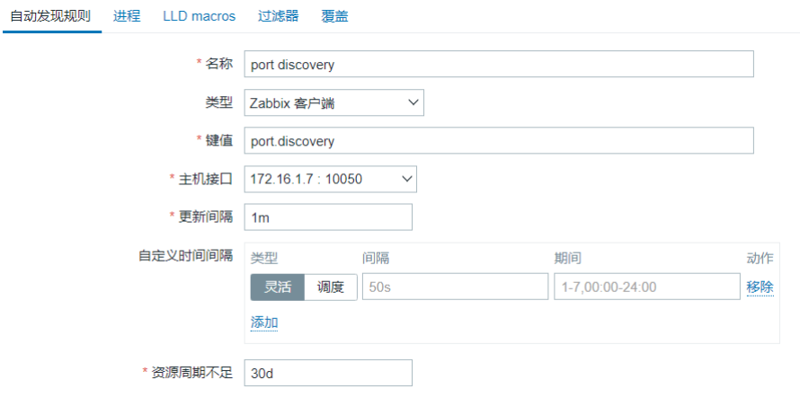

#### 5.4.5 Web创建监控项原型

名称：Check Port {#TCP_PORT} 键值：net.tcp.listen[{#TCP_PORT}]  #将端口号以 此传递至该监控项中

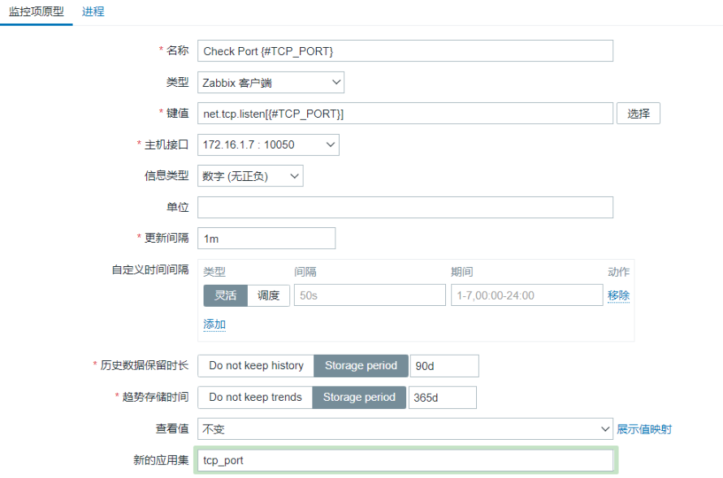

#### 5.4.6 Web创建触发器

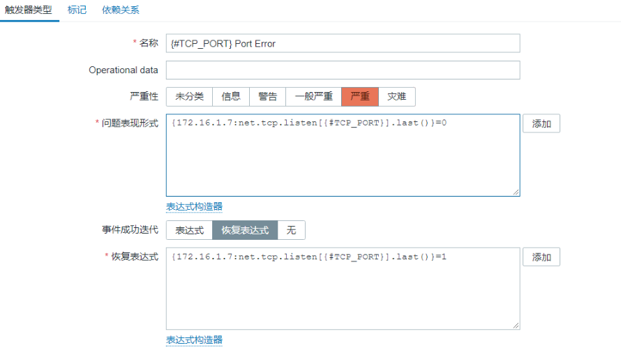

#### 5.4.7 Web结果验证

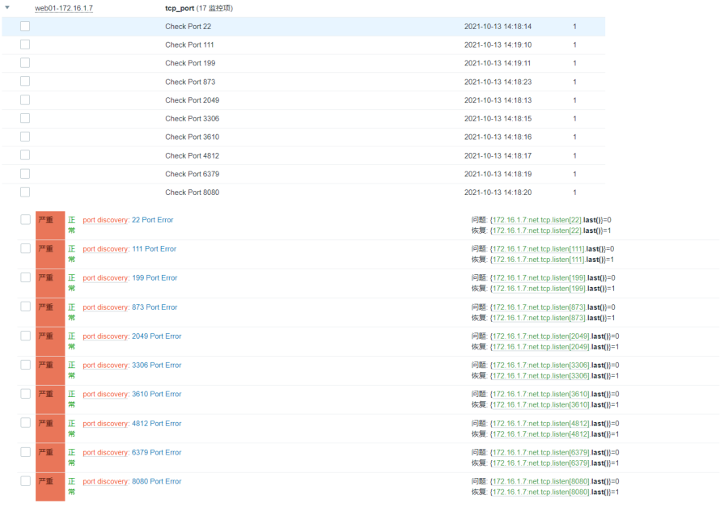

### 5.5 LLD监控Redis多实例实践

#### 5.5.1 场景需求说明

redis  7001     client_connected,  user  ,  max , redis 7002      client_connected,  user  ,  max , 特殊脚本： 提取redis端口； 7001  7002 脚本：自定义监控项（端口，clients_connected）
#### 5.5.2 Redis监控配置

1.提取监控项（预留了两个传参位置，port，key） 2.发现规则，脚本，提取数据，封装特殊的监控项

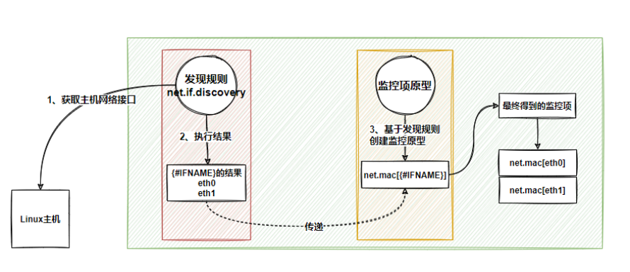

##### 5.5.2.1 场景环境搭建

## 1.安装redis服务

[root@web_7 ~]# yum install redis -y
[root@web_7 ~]# vim /opt/redis-7001.conf

bind 127.0.0.1 port 7001 daemonize yes

[root@web_7 ~]# vim /opt/redis-7002.conf
```
bind 127.0.0.1 port 7002 daemonize yes

```
[root@web_7 ~]# redis-server /opt/redis-
```
7001.conf

```
[root@web_7 ~]# redis-server /opt/redis-
```
7002.conf

```
[root@web_7 ~]# netstat -lntp |grep redis
tcp        0      0 127.0.0.1:7001
 0.0.0.0:*     LISTEN      8908/redis-
```
server

```
tcp        0      0 127.0.0.1:7002
 0.0.0.0:*     LISTEN      9042/redis-
```
server

#### 5.5.2.2 编写采集数据脚本

```
[root@web_7 ~]# cat
/etc/zabbix/zabbix_agent2.d/redis_mutil_sta
```
tus.sh

```
#!/usr/bin/bash
port=$1
key=$2
redis-cli -p ${port} info | grep "\
<${key}\>" | awk -F ':' '{print $NF}'
```
测试脚本

```
#
/bin/bash/etc/zabbix/zabbix_agent2.d/redis_
mutil_status.sh 7001 connected_clients
/bin/bash
/etc/zabbix/zabbix_agent2.d/redis_mutil_sta
tus.sh 7002 connected_clients

##### 5.5.2.3 创建自定义监控项

[root@web_7 ~]# cat
/etc/zabbix/zabbix_agent2.d/redis_mutil_sta
```
tus.conf

```
UserParameter=rds.status[*],
/etc/zabbix/zabbix_agent2.d/redis_mutil_sta
tus.sh "$1" "$2"
重启zabbix-agent2
[root@web_7 ~]# systemctl restart zabbix-
```
##### 5.5.2.4 服务端测试取值

```
[root@zabbix ~]# zabbix_get -s 172.16.1.7 -
k rds.status[7001,connected_clients]
[root@zabbix ~]# zabbix_get -s 172.16.1.7 -
k rds.status[7002,connected_clients]

#### 5.5.3 配置自动发现LLD

#### 5.5.3.1 编写发现规则脚本

[root@web_7 ~]# vim
/etc/zabbix/zabbix_agent2.d/redis_mutil_dis
```
covery.sh

```
#!/usr/bin/bash
rds_port=($(netstat -lntp |grep redis | awk
'{print $4}' | awk -F ':' '{print $NF}' |
xargs))
length=${#rds_port[@]}
printf "{\n"
printf  '\t'"\"data\":["
j=0
for i in ${rds_port[@]}

do

    j=$[ $j + 1 ]
    printf '\n\t\t{'
    if [ $j -eq ${length} ];then
        printf "\"{#PORT}\":\"${i}\"}"
else
        printf "\"{#PORT}\":\"${i}\"},"
fi
done
    printf "\n\t]\n"
    printf "}\n"
```
# 执行脚本

```
[root@web_7 ~]# sh
/etc/zabbix/zabbix_agent2.d/redis_mutil_dis
```
covery.sh

```
{
    "data":[
        {"{#PORT}":"7001"},
        {"{#PORT}":"7002"}
    ]
}

#### 5.5.3.2 创建发现规则监控项

[root@web_7 ~]# cat
/etc/zabbix/zabbix_agent2.d/redis_mutil_dis
```
covery.conf

```
UserParameter=redis.discovery, sudo
/bin/bash
/etc/zabbix/zabbix_agent2.d/redis_mutil_dis
```
covery.sh # 重启Agent

```
[root@web_7 ~]# systemctl restart zabbix-
```
#### 5.5.3.3 服务端测试取值

```
[root@zabbix-server ~]# zabbix_get -s
172.16.1.7 -k redis.discovery
{
    "data":[
        {"{#PORT}":"7001"},
        {"{#PORT}":"7002"}
    ]
}
```
#### 5.5.4 配置Zabbix Web

#### 5.5.4.1 web创建自动发现规则

创建模板-->自动发现-->创建自动发现规则

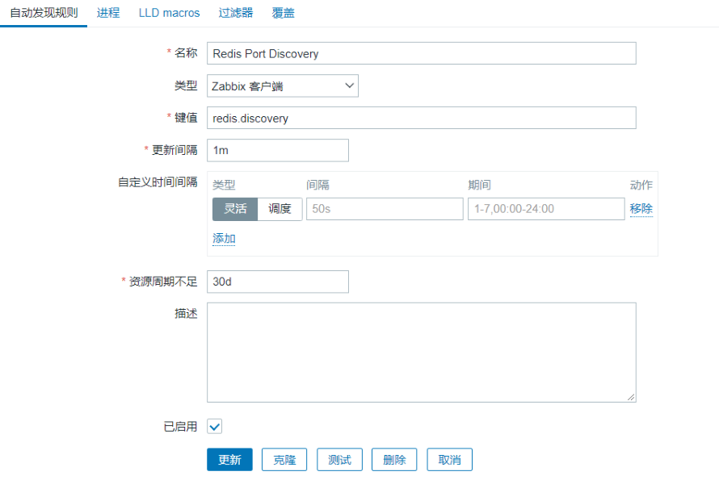

#### 5.5.4.2 web创建监控项原型

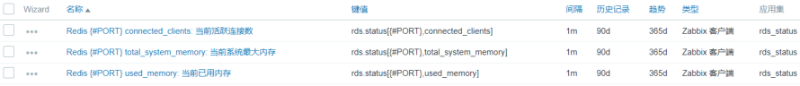

#### 5.5.4.3 web创建触发器原型

故障表达式原型

```
{Redis Port
Discovery:rds.status[{#PORT},used_memory].l
ast()}/{Redis Port
Discovery:rds.status[{#PORT},total_system_m
emory].last()}*100 >=70
```
恢复表达式原型

```
{Redis Port
Discovery:rds.status[{#PORT},used_memory].l
ast()}/{Redis Port
Discovery:rds.status[{#PORT},total_system_m
emory].last()}*100 <=50
```
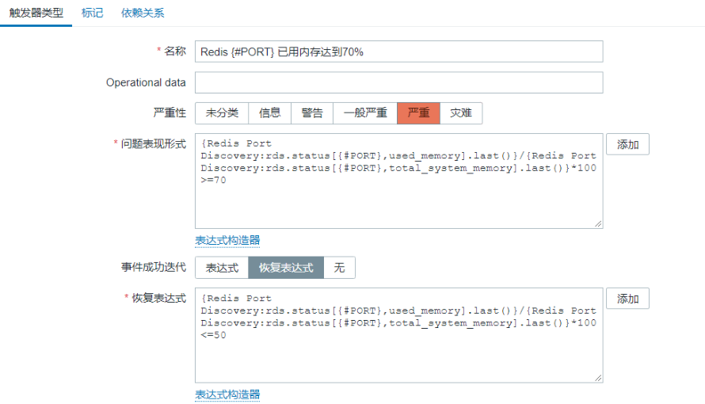

#### 5.5.4.4 web创建图形原型

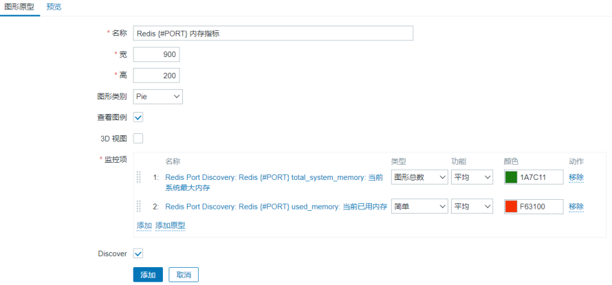

#### 5.5.4.5 web检查创建效果

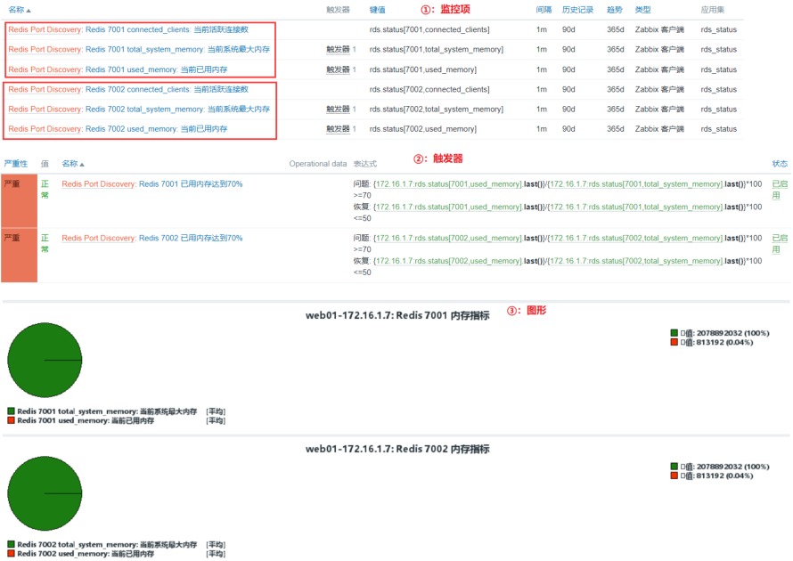

#### 5.5.4.4 测试告警并验证

```
[root@web_7 ~]# redis-cli -p 7001
127.0.0.1:7001> debug populate 15000000
```
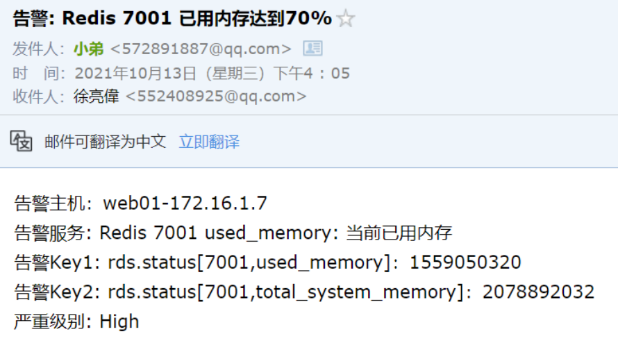

```
[root@web_7 ~]# redis-cli -p 7001
127.0.0.1:7001> FLUSHALL
```
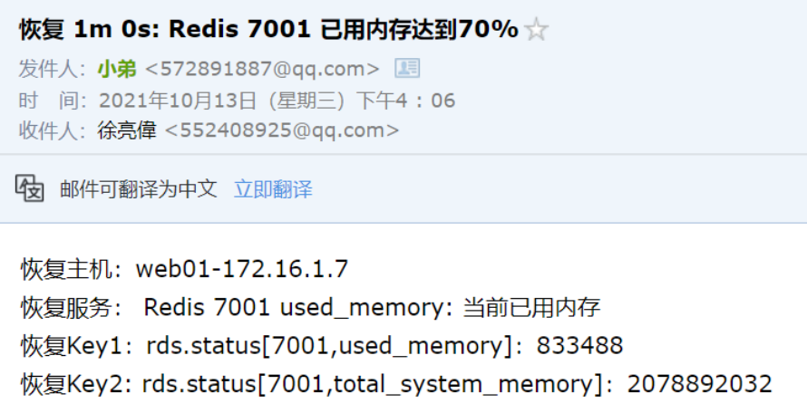
