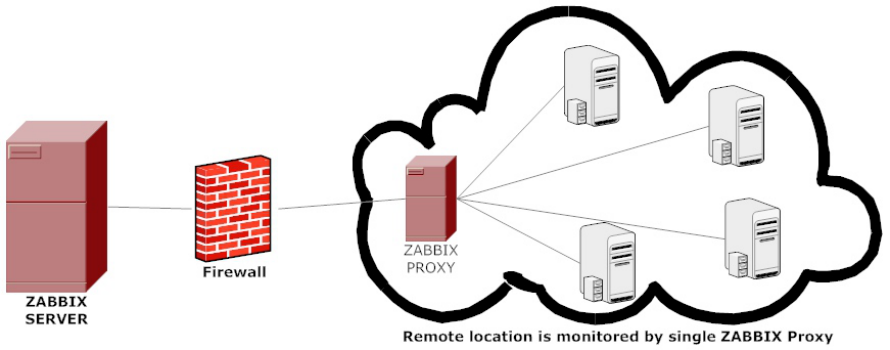
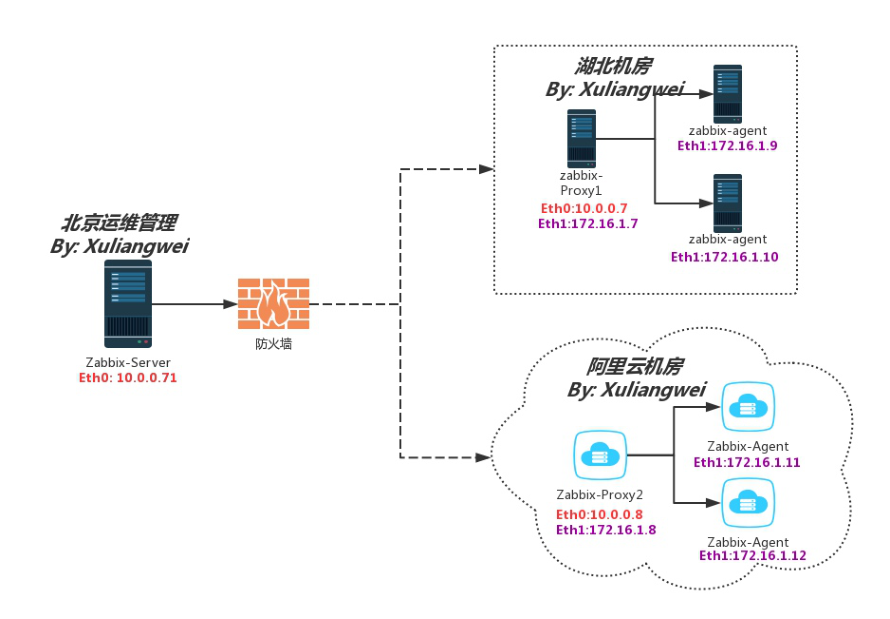
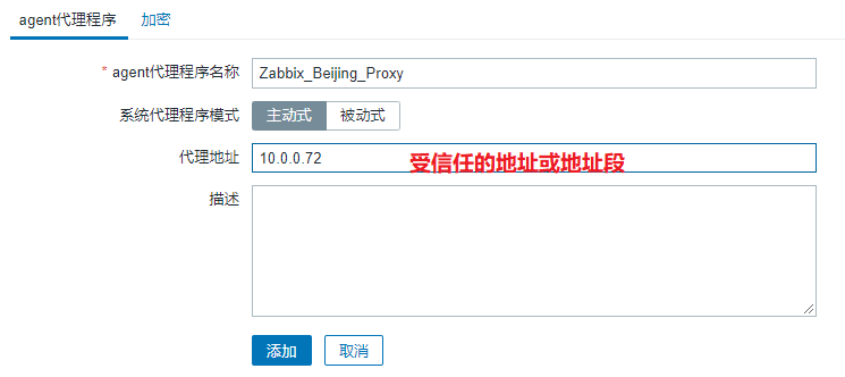
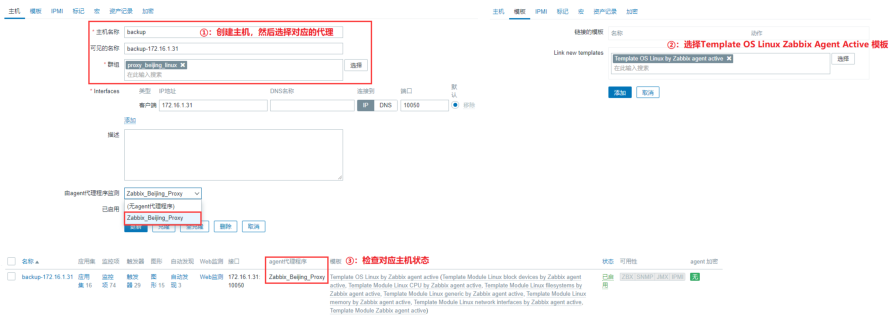
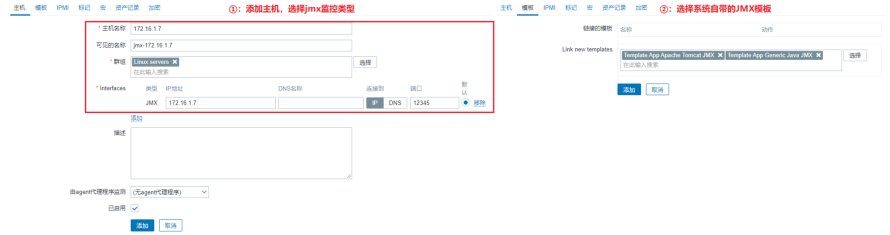

# 06.Zabbix分布式与JVM

## 目录

- [1.Zabbix Proxy分布式](#1.zabbix-proxy分布式)
  - [1.1 什么是Proxy](#1.1-什么是proxy)
  - [1.2 Proxy应用场景](#1.2-proxy应用场景)
  - [1.3 Proxy注意事项[图]](#1.3-proxy注意事项图)
  - [1.4 Proxy分布式场景实践](#1.4-proxy分布式场景实践)
    - [1.4.1 分布式场景IP规划](#1.4.1-分布式场景ip规划)
    - [1.4.2 Proxy服务安装](#1.4.2-proxy服务安装)
    - [1.4.3 Proxy数据库配置](#1.4.3-proxy数据库配置)
    - [1.4.4 修改Proxy配置文件](#1.4.4-修改proxy配置文件)
    - [1.4.5 启动Proxy服务](#1.4.5-启动proxy服务)
    - [1.4.6 配置Agent客户端](#1.4.6-配置agent客户端)
    - [1.4.7 Web页面创建Proxy](#1.4.7-web页面创建proxy)
    - [1.4.8 Web页面创建主机](#1.4.8-web页面创建主机)
- [2.Zabbix监控JVM](#2.zabbix监控jvm)
  - [2.1 Zabbix如何监控JVM](#2.1-zabbix如何监控jvm)
  - [2.2 Zabbix监控JVM流程](#2.2-zabbix监控jvm流程)
  - [2.3 Tomcat数据监控实践](#2.3-tomcat数据监控实践)
    - [2.3.1 场景实现步骤](#2.3.1-场景实现步骤)
    - [2.3.2 场景环境规划](#2.3.2-场景环境规划)
    - [2.3.3 配置Tomcat服务](#2.3.3-配置tomcat服务)
    - [2.3.4 配置JavaGateway](#2.3.4-配置javagateway)
    - [2.3.5 配置ZabbixServer](#2.3.5-配置zabbixserver)
    - [2.3.6 Web页面创建主机](#2.3.6-web页面创建主机)
    - [2.3.7 Web页面展示数据](#2.3.7-web页面展示数据)

徐亮伟, 江湖人称标杆徐。多年互联网运维工作经 验，曾负责过大规模集群架构自动化运维管理工作。 擅长Web集群架构与自动化运维，曾负责国内某大型 电商运维工作。 个人博客"徐亮伟架构师之路"累计受益数万人。

## 1.Zabbix Proxy分布式

### 1.1 什么是Proxy

Zabbix proxy 可以代替 Zabbix server 收集性能和可用 性数据，承担一些收集数据的负担，分担了 Zabbix server 的负荷。 此外，使用proxy是实现集中式和分布式监控的最简单方 法，所有 agents 和 proxies 发送给一个 Zabbix server，从而集中收集所有数据。

### 1.2 Proxy应用场景

监控远程区域设备（当有多机房的情况） 监控上千设备时，（使用proxy减轻server 的负荷） 监控本地网络不稳定区域（跨网段造成网络抖动） 简化分布式监控的维护成本（分布式采集，集中管理 并监控）



### 1.3 Proxy注意事项[图]

Zabbix proxy 数据库必须和 server 数据库分开， 否则Zabbix server 数据库会被破坏。 proxy 收集到数据都先存储在本地，然后在一定时间 后传给 Zabbix server，这样就不会因为暂时无法 连接 zabbix server 而丢失数据。 本地保留时间由proxy配置文件中参数 ProxyLocalBuffer 和 ProxyOfflineBuffer 决 定。 ProxyLocalBuffer：代理将在本地保留数据N小 时，即使数据已与服务器同步，默认不保存； ProxyOfflineBuffer：没有与Zabbix服务器的 连接，代理将保留数据N小时，默认1小时； Zabbix proxy 只是一个数据收集器，不运行触发 器、不处理事件、不发送报警。

### 1.4 Proxy分布式场景实践



#### 1.4.1 分布式场景IP规划

服务器功能 服务器外网 服务器内网 Zabbix-Server

10.0.0.71

```
Zabbix-Proxy
```
10.0.0.72

172.16.1.72

```
Zabbix-Agent
```
172.16.1.31

```
Zabbix-Agent
```
172.16.1.41

#### 1.4.2 Proxy服务安装

```
[root@zabbix-proxy ~]# yum localinstall
https://mirrors.aliyun.com/zabbix/zabbix/5.
0/rhel/7/x86_64/zabbix-proxy-mysql-5.0.15-
1.el7.x86_64.rpm -y
```
#### 1.4.3 Proxy数据库配置

安装Mariadb数据库

```
[root@zabbix-proxy ~]# yum install mariadb
mariadb-server -y
[root@zabbix-proxy ~]# systemctl enable
```
mariadb

```
[root@zabbix-proxy ~]# systemctl start
```
mariadb # 登陆Mariadb数据库

```
[root@zabbix-proxy ~]# mysql
MariaDB [(none)]> create database
zabbix_proxy default charset utf8;
MariaDB [(none)]> grant all on
zabbix_proxy.* to zabbix_proxy@'localhost'
identified by 'zabbix_proxy';
MariaDB [(none)]> exit
[root@zabbix-proxy ~]#
```
导入zabbix数据

```
[root@zabbix-proxy ~]# zcat
/usr/share/doc/zabbix-proxy-mysql-
5.*/schema.sql.gz | mysql -uzabbix_proxy -
pzabbix_proxy zabbix_proxy
```
#### 1.4.4 修改Proxy配置文件

修改Proxy 配置，将 Zabbix-Proxy 的Server指向为 Zabbix-Server的地址；

```
[root@zabbix-proxy ~]# grep '^[a-Z]'
/etc/zabbix/zabbix_proxy.conf
Server=10.0.0.71
Hostname=Zabbix_Beijing_Proxy
DBName=zabbix_proxy
DBUser=zabbix_proxy
DBPassword=zabbix_proxy
Timeout=30
ProxyLocalBuffer=1
ProxyOfflineBuffer=12
```
#### 1.4.5 启动Proxy服务

```
[root@zabbix-proxy ~]# systemctl enable
zabbix-proxy
[root@zabbix-proxy ~]# systemctl start
zabbix-proxy
[root@zabbix-proxy ~]# netstat -lntp
Active Internet connections (only servers)
Proto Recv-Q Send-Q Local Address
```
Foreign Address         State

```
tcp        0      0 0.0.0.0:10051
0.0.0.0:*               LISTEN
 5561/zabbix_proxy
```
#### 1.4.6 配置Agent客户端

安装

```
[root@backup ~]# rpm -ivh
https://mirrors.aliyun.com/zabbix/zabbix/5.
0/rhel/7/x86_64/zabbix-agent2-5.0.15-
1.el7.x86_64.rpm
```
#配置

```
[root@backup ~]# grep '^[a-Z]'
/etc/zabbix/zabbix_agent2.conf
Server=172.16.1.72              # 被动模式
ServerActive=172.16.1.72        # 主动模式
Hostname=backup                 # 当前主机的
```
主机名称（后续需要使用） # 启动

```
[root@backup ~]# systemctl enable zabbix-
```
agent2

```
[root@backup ~]# systemctl start zabbix-
```
agent2

#### 1.4.7 Web页面创建Proxy

管理 → agent代理程序→创建代理 （代理名称必须 与Proxy配置中Hostname一致；）



#### 1.4.8 Web页面创建主机

配置主机-->创建主机-->主机名称（必须是Agent定义的 Hostname），关联 Template OS Linux by Zabbix agent active 模板



## 2.Zabbix监控JVM

### 2.1 Zabbix如何监控JVM

Zabbix本身无法直接监控JVM，需要使用JMX协议的监控 方式来获取JVM的数据；而JMX获取数据是由专门的代理 程序来实现，即Zabbix-Java-Gateway来负责采集JMX 协议的Java进程数据，以达到监控的目的；

### 2.2 Zabbix监控JVM流程

1、Zabbix-Server通知Zabbix-Java-Gateway需要 获取监控主机的哪些指标数据； 2、Zabbix-Java-Gateway通过jmx协议获取Java进 程数据； 3、Java程序通过jmx协议返回数据给Zabbix-Java- Gateway； 4、Zabbix-Java-Gateway返回数据给Zabbix- Server； 5、Zabbix-Server对数据进行存储，然后进行展 示；

### 2.3 Tomcat数据监控实践

#### 2.3.1 场景实现步骤

1）安装Tomcat，并开启jmx协议

```
2）安装Zabbix-Java-Gateway

3）配置Zabbix_java_gateway

4）配置Zabbix-server连接zabbix-java-gateway
```
5）登陆zabbix-web添加主机，通过jmx方式

#### 2.3.2 场景环境规划

```
角色 IP Zabbix-Server 10.0.0.71，172.16.1.71 zabbix-java-gateway
```
172.16.1.72

tomcat

172.16.1.7

#### 2.3.3 配置Tomcat服务

安装java环境 # 安装

```
[root@web01 ~]# wget
http://cdn.xuliangwei.com/jdk-8u281-linux-
```
x64.tar.gz

```
[root@web01 ~]# tar xf jdk-8u281-linux-
x64.tar.gz  -C /usr/local/
[root@web01 ~]# ln -s
/usr/local/jdk1.8.0_281/ /usr/local/jdk
```
配置jdk

```
[root@web01 ~]# cat /etc/profile.d/jdk.sh
export JAVA_HOME=/usr/local/jdk
export PATH=$PATH:$JAVA_HOME/bin
export JRE_HOME=$JAVA_HOME/jre
export
CLASSPATH=$JAVA_HOME/lib/:$JRE_HOME/lib/
```
#验证

```
[root@web01 ~]# source
/etc/profile.d/jdk.sh
[root@web01 ~]# java -version
java version "1.8.0_281"
Java(TM) SE Runtime Environment (build
1.8.0_281-b09)
Java HotSpot(TM) 64-Bit Server VM (build
25.281-b09, mixed mode)
```
安装Tomcat

```
[root@web01 ~]# wget
https://dlcdn.apache.org/tomcat/tomcat-
9/v9.0.53/bin/apache-tomcat-9.0.53.tar.gz
[root@web01 ~]# tar xf apache-tomcat-
9.0.53.tar.gz -C /opt/
[root@web01 ~]# ln -s /opt/apache-tomcat-
9.0.53/ /opt/tomcat
```
开启远程JMX

#头部添加如下内容即可

```
[root@web01 ~]# vim
/opt/tomcat/bin/catalina.sh
CATALINA_OPTS="$CATALINA_OPTS \
-Dcom.sun.management.jmxremote \
-Dcom.sun.management.jmxremote.port=12345 \
-
Dcom.sun.management.jmxremote.authenticate=
false \
-Dcom.sun.management.jmxremote.ssl=false \
-Djava.rmi.server.hostname=172.16.1.7"
```
填写自己本机IP地址 # 配置Tomcat的JVM堆内存，以及GC算法（年轻代： ParNew、老年代：CMS）

```
JAVA_OPTS="$JAVA_OPTS -Xms200m -Xmx200m -
XX:+UseConcMarkSweepGC"
```
启动服务，并检查端口

```
[root@web01 ~]# /opt/tomcat/bin/startup.sh
[root@web01 ~]# netstat -lntp | grep java
tcp6       0      0 :::8080        :::*
               LISTEN      49684/java
tcp6       0      0 :::12345       :::*
               LISTEN      49684/java
tcp6       0      0 :::37723       :::*
               LISTEN      49684/java
tcp6       0      0 127.0.0.1:8005 :::*
               LISTEN      49684/java
tcp6       0      0 :::12345        :::*
                 LISTEN      49684/java
```
#### 2.3.4 配置JavaGateway

#安装

```
[root@zabbix-proxy ~]# yum localinstall -y
https://mirrors.aliyun.com/zabbix/zabbix/5.
0/rhel/7/x86_64/zabbix-java-gateway-5.0.15-
1.el7.x86_64.rpm
```
#启动

```
[root@zabbix-proxy ~]# systemctl enable
zabbix-java-gateway
[root@zabbix-proxy ~]# systemctl start
zabbix-java-gateway
```
#### 2.3.5 配置ZabbixServer

```
配置zabbix-server告诉zabbix-java-gateway节 点IP
[root@zabbix-server ~]# vim
/etc/zabbix/zabbix_server.conf
JavaGateway=172.16.1.72     # 告诉server
```
java-gateway节点的IP地址

```
JavaGatewayPort=10052       # 告诉server
```
java-gateway节点进程的端口

```
StartJavaPollers=5          # 启动多个
```
javagateway进程

```
# 重启zabbix-server
[root@zabbix-server ~]# systemctl restart
zabbix-server
```
#### 2.3.6 Web页面创建主机



#### 2.3.7 Web页面展示数据
