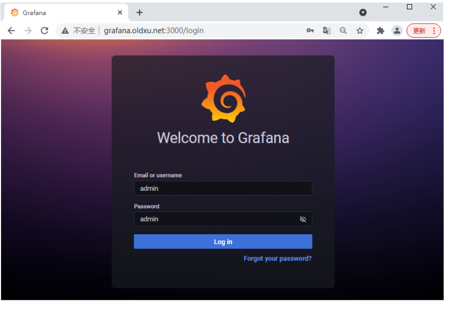
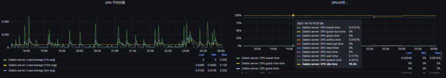
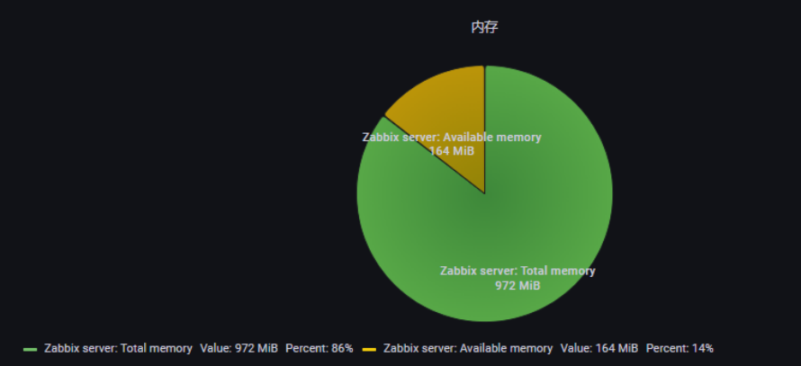
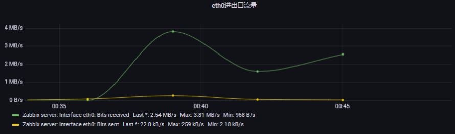
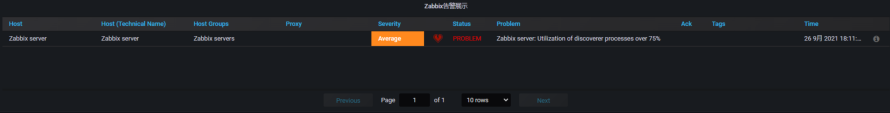
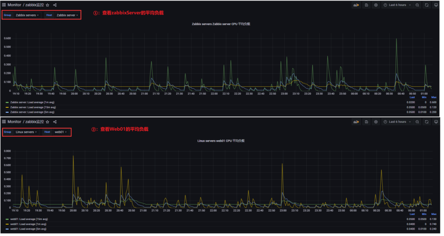
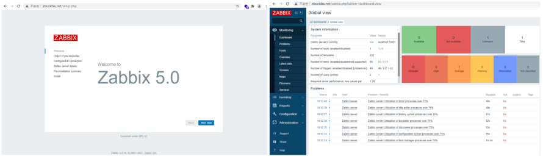

# 07.Zabbix 调优与Grafana

## 目录

- [3.Grafana](#3.grafana)
- [1.Zabbix API](#1.zabbix-api)
  - [1.1 API介绍](#1.1-api介绍)
  - [1.1 获取令牌](#1.1-获取令牌)
  - [1.1 关闭一台节点](#1.1-关闭一台节点)
  - [1.2 删除一条节点](#1.2-删除一条节点)
  - [1.3 创建一台主机](#1.3-创建一台主机)
  - [1.4 批量创建主机](#1.4-批量创建主机)
- [5.如何批量创建主机](#5.如何批量创建主机)
- [2.Zabbix优化](#2.zabbix优化)
  - [2.1 拆分数据库](#2.1-拆分数据库)
  - [2.2 调主被模式](#2.2-调主被模式)
  - [2.3 使用分布式](#2.3-使用分布式)
  - [2.4 删除无用监控项](#2.4-删除无用监控项)
  - [2.5 进程调优](#2.5-进程调优)
  - [2.6 缓存调优](#2.6-缓存调优)
  - [2.7 检查延迟队列](#2.7-检查延迟队列)
  - [3.1 什么是Grafana](#3.1-什么是grafana)
  - [3.2 Grafana安装配置](#3.2-grafana安装配置)
- [1.安装GrafanaGrafana官方下载地址](#1.安装grafanagrafana官方下载地址)
  - [3.3 Grafana配置数据源](#3.3-grafana配置数据源)
    - [3.3.1 安装插件](#3.3.1-安装插件)
    - [3.3.2 启用插件](#3.3.2-启用插件)
    - [3.3.3 配置数据源](#3.3.3-配置数据源)
  - [3.4 Grafana数据展示](#3.4-grafana数据展示)
    - [3.4.1 创建文件夹](#3.4.1-创建文件夹)
    - [3.4.2 创建CPU图形](#3.4.2-创建cpu图形)
    - [3.4.3 创建内存图形](#3.4.3-创建内存图形)
    - [3.4.4 创建流量图形](#3.4.4-创建流量图形)
    - [3.4.5 创建告警面板](#3.4.5-创建告警面板)
  - [3.6 Grafana变量使用](#3.6-grafana变量使用)
    - [3.6.1 创建变量](#3.6.1-创建变量)
    - [3.6.2 使用变量](#3.6.2-使用变量)
  - [3.7 Grafana模板使用](#3.7-grafana模板使用)
  - [4.1 MySQL](#4.1-mysql)
    - [4.1.1 添加MySQL源](#4.1.1-添加mysql源)
    - [4.1.2 安装MySQL服务](#4.1.2-安装mysql服务)
    - [4.1.3 启动MySQL服务](#4.1.3-启动mysql服务)
    - [4.1.4 获取MySQL默认密码](#4.1.4-获取mysql默认密码)
- [010454] [Server] A temporary password is](#010454-server-a-temporary-password-is)
    - [4.1.5 修改MySQL默认密码](#4.1.5-修改mysql默认密码)
    - [4.1.6 创建zabbix数据库](#4.1.6-创建zabbix数据库)
  - [4.2 Nginx](#4.2-nginx)
    - [4.2.1 添加Nginx源](#4.2.1-添加nginx源)
    - [4.2.2 创建用户](#4.2.2-创建用户)
    - [4.2.3 安装Nginx服务](#4.2.3-安装nginx服务)
    - [4.2.4 配置Nginx服务](#4.2.4-配置nginx服务)
    - [4.2.5 启动Nginx服务](#4.2.5-启动nginx服务)
  - [4.3 PHP](#4.3-php)
    - [4.3.1 添加PHP源](#4.3.1-添加php源)
    - [4.3.2 安装PHP服务](#4.3.2-安装php服务)
    - [4.3.3 配置PHP FPM](#4.3.3-配置php-fpm)
    - [4.3.4 配置PHP INI](#4.3.4-配置php-ini)
    - [4.3.5 启动PHP服务](#4.3.5-启动php服务)
    - [4.4.1 安装基础组件](#4.4.1-安装基础组件)
    - [4.4.2 创建zabbix用户](#4.4.2-创建zabbix用户)
    - [4.4.3 下载并编译Zabbix](#4.4.3-下载并编译zabbix)
    - [4.4.4 导入zabbix数据库](#4.4.4-导入zabbix数据库)
    - [4.4.5 配置zabbix-server](#4.4.5-配置zabbix-server)
    - [4.4.6 启动zabbix-server](#4.4.6-启动zabbix-server)
    - [0.0.0.0:* LISTEN](#0.0.0.0-listen)
    - [4.5.1 导入zabbixweb](#4.5.1-导入zabbixweb)
    - [4.5.2 访问web页面](#4.5.2-访问web页面)

Grafana

# 07.Zabbix 调优与Grafana

## 3.Grafana

4.源码安装Zabbix5.0

```
4.4 Zabbix-Server

4.4.5 配置zabbix-server

4.4.6 启动zabbix-server

4.5 Zabbix-Web
```
徐亮伟, 江湖人称标杆徐。多年互联网运维工作经 验，曾负责过大规模集群架构自动化运维管理工作。 擅长Web集群架构与自动化运维，曾负责国内某大型 电商运维工作。 个人博客"徐亮伟架构师之路"累计受益数万人。

## 1.Zabbix API

### 1.1 API介绍

web界面操作zabbix，就是点鼠标； 而通过api操作，其实就是通过curl命令来完成点鼠标的 操作；

### 1.1 获取令牌

在使用zabbix-api之前，先获取一个token

```
curl -s -X POST -H 'Content-
Type:application/json' -d '
{
"jsonrpc": "2.0",
"method": "user.login",
"params": {
"user": "Admin",
"password": "zabbix"
},
"id": 1,
"auth": null
}' http://zabbix.oldxu.net/api_jsonrpc.php
```
#返回的token

```
{"jsonrpc":"2.0","result":"641b21f64b320c63
2e0e61c6d06fa25f","id":1}
```
### 1.1 关闭一台节点

使用token验证身份, 并禁用某一台主机

```
curl -s -X POST -H 'Content-
Type:application/json' -d '
{
    "jsonrpc": "2.0",
    "method": "host.update",
    "params": {
        "hostid": "10433",
        "status": 1
    },
    "auth":
"641b21f64b320c632e0e61c6d06fa25f",
    "id": 1
}' http://zabbix.oldxu.net/api_jsonrpc.php
```
### 1.2 删除一条节点

使用API方式删除一台主机

```
curl -s -X POST -H 'Content-
Type:application/json' -d '
{
    "jsonrpc": "2.0",
    "method": "host.delete",
    "params": [
"10433"
    ],
    "auth":
"641b21f64b320c632e0e61c6d06fa25f",
    "id": 1
}' http://zabbix.oldxu.net/api_jsonrpc.php
```
### 1.3 创建一台主机

使用API创建主机

```
curl -s -X POST -H 'Content-
Type:application/json' -d '
{
    "jsonrpc": "2.0",
    "method": "host.create",
    "params": {
        "host": "192.168.3.4",
        "name": "web01",
        "interfaces": [
            {
                "type": 1,
                "main": 1,
                "useip": 1,
                "ip": "192.168.3.4",
                "dns": "",
                "port": "10050"
            }
        ],
        "groups": [
            {
                "groupid": "2"
            }
        ],
        "templates": [
            {
                "templateid": "10001"
            }
        ]
    },
    "auth":

"899180639642167e9592cd0a08d76acd",

    "id": 1
}' http://zabbix.oldxu.net/api_jsonrpc.php
```
### 1.4 批量创建主机

## 5.如何批量创建主机

```
[root@proxy_node1 ~]# cat  zabbix_create.sh
#login
GetToken=$(curl -s -X POST -H 'Content-
Type:application/json' -d '{
"jsonrpc": "2.0",
"method": "user.login",
"params": {
"user": "Admin",
"password": "zabbix"
},
"id": 1
}'
http://zabbix.oldxu.net/zabbix/api_jsonrpc.
php)
```
# result token
```
Token=$(echo $GetToken|awk -F ',' '{print
$2}'|awk -F '"' '{print $4}')

while
read line;do

curl -s -X POST -H 'Content-
Type:application/json' -d '{
    "jsonrpc": "2.0",
    "method": "host.create",
    "params": {
        "host": '\"$line\"',
        "interfaces": [
            {
                "type": 1,
                "main": 1,
                "useip": 1,
                "ip": '\"$line\"',
                "dns": "",
                "port": "10050"
            }
        ],
        "groups": [
            {
                "groupid": "2"
            }
        ],
        "templates": [
            {
                "templateid": "10001"
            }
        ]
    },
    "auth": '\"$Token\"',
    "id": 1
}'
http://zabbix.oldxu.net/api_jsonrpc.php|pyt
hon -m json.tool
done < /tmp/ip.txt

## 2.Zabbix优化

### 2.1 拆分数据库

Zabbix属于写多读少的业务，所以需要针对zabbix的 MySQL进行拆分；

### 2.2 调主被模式

将Zabbix-Agent被动监控模式，调整为主动监控模式.

### 2.3 使用分布式

使用zabbix-proxy分布式监控，在大规模监控时用于缓 解Zabbix-Server压力

### 2.4 删除无用监控项

去掉无用监控项, 增加监控项的取值间隔，减少历史数据 保存周期(由housekeeper进程定时清理) 增大监控项取值间隔；60s   1h;  1d;

### 2.5 进程调优

针对Zabbix-server进程调优，将比较繁忙的进程数量进 行调大，具体取决实际情况，不是越大越好

StartPollersUnreachable=50     占用率从百分之
```
70直线下降到百分10

### 2.6 缓存调优

针对Zabbix-server缓存调优，将剩余内存较少的缓存值 进行增大，通过(zabbix cache usage图表观察)

```
CacheSize=128M
```
### 2.7 检查延迟队列

7. 关注管理->队列, 是否有被延迟执行的监控项

## 3.Grafana

### 3.1 什么是Grafana

Grafana是一个图形展示工具，它本身并不存储任何数 据，数据都是从配置的 “数据源” 获取的； Grafana支持从Zabbix中获取数据，然后进行图形展 示；

### 3.2 Grafana安装配置

## 1.安装GrafanaGrafana官方下载地址

```
[root@db01 ~]# wget
https://dl.grafana.com/oss/release/grafana-
8.2.1-1.x86_64.rpm
[root@db01 ~]# sudo yum localinstall -y
grafana-8.2.1-1.x86_64.rpm
[root@db01 ~]# systemctl enable grafana-
```
server

```
[root@db01 ~]# systemctl start grafana-
```
server

2.通过浏览器访问Grafana，Grafana监听在3000端口 上，默认登录用户名密码都是admin；



### 3.3 Grafana配置数据源

#### 3.3.1 安装插件

由于Grafana默认不支持读取Zabbix的数据，所以需要 安装Zabbix相关的插件 离线下载插件

```
[root@db01 ~]# grafana-cli plugins list-
```
remote

```
[root@db01 ~]# grafana-cli plugins list-
remote|grep -i zabbix
[root@db01 ~]# grafana-cli plugins install
alexanderzobnin-zabbix-app
```
# 插件安装有时候比较慢，可以下载离线的zabbix插件， 放到/var/lib/grafana/plugins，解压 # 完成后需要重启grafana

```
[root@db01 ~]# systemctl restart grafana-
```
server

#### 3.3.2 启用插件

```
Grafana启用Zabbix插件： 点击-->Configuration -> zabbix -> config -> enable
```
#### 3.3.3 配置数据源

```
Configuration--> Add data source -->zabbix ->
settings 1、配置Http协议地址(http://zabbix.oldxu.net/ap i_jsonrpc.php) 2、配置Zabbix Api details，输入用户名以及 密码 3、点击Save&test
```
### 3.4 Grafana数据展示

先创建文件夹，然后在文件夹中创建各种图形；（创建 后记得save，否则一刷新数据就丢失）

#### 3.4.1 创建文件夹

```
Dashboards -> Manage -> New folder ->填写名称
（Monitor） -> Create Dashboard
```
#### 3.4.2 创建CPU图形

```
Add an empty panel -> Data source ->
(zabbix)
```
Query （数据查询） Group: Zabbix servers Host:Zabbix server Application:CPU Item: 获取负载（/Load/）、获取时间(/time/) 图形美化 Title：CPU 平均负载 Tooltip mode：ALL(展示所有指标的数据)、 Single（展示选中的单个指标数据） Unit：CPU负载图形不需要单位（Misc-none）、CPU 时间要显示为百分比（Misc-Percent） save：保存图形 其他的可以随意点击查看



#### 3.4.3 创建内存图形

```
Query A Group: Zabbix servers Host:Zabbix server Application:Memory Item: Total memory Query B Group: Zabbix servers Host:Zabbix server Application:Memory Item: Available memory 图形美化 选择 Pie chart图形 Title：内存使用占比 unit：单位选择：data -> bytes(IEC) Lable：标签选择（Name、Value） Legend values：数据使用展示选择（Value、 Percent）
```


#### 3.4.4 创建流量图形

```
Query A Group: Zabbix servers Host:Zabbix server Application:Interface eth0 Item: /Bits/ 图形美化 Title：eth0进出流量 unit：单位选择：data -> Unit/sec(SI) Legend values：`数据使用展示选择（Last、 Min、Max）
```


#### 3.4.5 创建告警面板

Query Mode：Problems Visualizations：Zabbix Problems Title：Zabbix告警展示



### 3.6 Grafana变量使用

单台服务器的图形比较好展现，但多台服务器的图形就 需要在从头到位创建一次，比较麻烦； 所以可以使用变量的方式获取对应的主机组，以及主 机，然后基于变量来完成图形创建；

#### 3.6.1 创建变量

Dashboard Settings -> Variables 设置主机组变量： Name：定义名称Group Data source：选择zabbix Refresh：跟随时间而变化 on time range change Query Type：选择Group Group：提取所有组的正则表达式：/.*/ Selection Options：全部打开 Preview of values：会显示所有的主机组

设置主机变量： Name：定义名称Host Data source：选择zabbix Refresh：跟随时间而变化 on time range change Query Type：选择Host Group：提取所有组的正则表达式：/.*/ Host：提取所有主机的正则表达式：/.*/ Selection Options：全部打开 Preview of values：会显示所有的主机 设置完成后记得Save保存

#### 3.6.2 使用变量

将此前创建的CPU负载图形，修改为变量方式，这样就 会更加灵活； Query A Group: $Group Host：$Host Application：CPU Item: /Load/ Title：$Group $Host CPU 平均负载



### 3.7 Grafana模板使用

导入模板：点击 + -> import 监控Linux模板： ID:5363    Zabbix - Full Server Status 导出模板：点击需要导出的图形 -> share-->Export-- >save to file。 4.源码安装Zabbix5.0

### 4.1 MySQL

#### 4.1.1 添加MySQL源

```
rpm -ivh
https://dev.mysql.com/get/mysql80-
community-release-el7-3.noarch.rpm
```
# 需要关闭mysql80仓库，启用mysql57仓库

#### 4.1.2 安装MySQL服务

```
yum install mysql-community-server mysql-
community-devel -y
```
#### 4.1.3 启动MySQL服务

# 如果之前使用过mariadb，记得删除数据目录，否则无法 正常启动

```
rm -rf /var/lib/mysql/*
systemctl start mysqld
```
#### 4.1.4 获取MySQL默认密码

```
[root@zabbix ~]# grep "password"
/var/log/mysqld.log
2021-10-13T09:36:56.490101Z 6 [Note] [MY-
## 010454] [Server] A temporary password is
generated
for root@localhost: OkT)kBn5oB(R
```
#### 4.1.5 修改MySQL默认密码

```
[root@zabbix ~]# mysql -uroot -
p'OkT)kBn5oB(R'
mysql> alter user root@localhost identified
by 'Oldxu.net123';
mysql>
```
#### 4.1.6 创建zabbix数据库

# 创建库

```
mysql> create database zabbix character set
utf8 collate utf8_bin;
```
# 授权

```
mysql> grant all privileges on zabbix.* to
'zabbix'@'%' identified by 'Oldxu.net123';
mysql> flush privileges;
```
### 4.2 Nginx

#### 4.2.1 添加Nginx源

```
vim /etc/yum.repos.d/nginx.repo
[nginx-stable]
name=nginx stable repo
baseurl=http://nginx.org/packages/centos/$r
eleasever/$basearch/
gpgcheck=1
enabled=1
gpgkey=https://nginx.org/keys/nginx_signing
```
.key

```
module_hotfixes=true
```
#### 4.2.2 创建用户

```
groupadd www -g 666
useradd www -u 666 -g 666
```
#### 4.2.3 安装Nginx服务

```
yum install nginx -y
```
#### 4.2.4 配置Nginx服务

```
vim /etc/nginx/nginx.conf
user = www;
```
#### 4.2.5 启动Nginx服务

```
systemctl start nginx
systemctl enable nginx
```
### 4.3 PHP

#### 4.3.1 添加PHP源

```
rpm -Uvh
https://mirror.webtatic.com/yum/el7/webtati
c-release.rpm
```
#### 4.3.2 安装PHP服务

```
yum -y install php72w php72w-cli php72w-
common php72w-devel php72w-embedded php72w-
gd php72w-mbstring php72w-pdo php72w-bcmath
php72w-xml php72w-fpm php72w-mysqlnd
php72w-opcache php72w-pecl-redis
```
#### 4.3.3 配置PHP FPM

```
vim /etc/php-fpm.d/www.conf
user = www
group = www
```
# 修改session的权限

```
chown -R www.www /var/lib/php/session/
```
#### 4.3.4 配置PHP INI

```
vim /etc/php.ini
post_max_size = 32M
max_execution_time = 350
max_input_time = 350
date.timezone = Asia/Shanghai
```
#### 4.3.5 启动PHP服务

```
systemctl enable php-fpm
systemctl start php-fpm
```
## 4.4 Zabbix-Server

#### 4.4.1 安装基础组件

```
yum install libevent-devel wget tar gcc
gcc-c++ make net-snmp-devel libxml2
libxml2-devel curl curl-devel -y
```
#### 4.4.2 创建zabbix用户

```
groupadd zabbix -r
useradd -r -g zabbix -d /usr/lib/zabbix -
s /sbin/nologin -c "Zabbix Monitoring
System" zabbix
mkdir -p /usr/lib/zabbix
chmod 770 /usr/lib/zabbix
chown zabbix:zabbix /usr/lib/zabbix
```
#### 4.4.3 下载并编译Zabbix

# 下载

```
wget
https://cdn.zabbix.com/zabbix/sources/stabl
e/5.0/zabbix-5.0.16.tar.gz
```
# 编译

```
cd zabbix-5.0.16/
./configure --prefix=/usr/local/zabbix --
enable-server --enable-agent --enable-proxy
--enable-java --with-
mysql=/usr/bin/mysql_config --with-net-snmp
--with-libcurl --with-libxml2
```
# 编译

```
make && make install
```
#选项说明

```
--prefix=/usr/local/zabbix
```
# 指定安装目录

```
--enable-server
安装zabbix server
--enable-agent
```
# 启用zabbix agent

```
--enable-agent2
```
# 启用zabbix agent2（需要go环境）

```
--enable-proxy
```
# 启用proxy的支持

```
--enable-java
```
# 启用java-gateway支持(需要javac，oraclejdk)

```
--with-mysql=/usr/bin/mysql_config
```
# 用mysql来存储

#### 4.4.4 导入zabbix数据库

```
mysql -uzabbix -pOldxu.net123 zabbix <
zabbix-5.0.16/database/mysql/schema.sql
mysql -uzabbix -pOldxu.net123 zabbix <
zabbix-5.0.16/database/mysql/images.sql
mysql -uzabbix -pOldxu.net123 zabbix <
zabbix-5.0.16/database/mysql/data.sql
```
# 如果是配置zabbix代理只导入第一条就ok,这里是 server所以三条都导入 # 注意要按照这个顺序导入,否则可能会报错!

### 4.4.5 配置zabbix-server

```
[root@zabbix ~]# grep "^[a-Z]"
/usr/local/zabbix/etc/zabbix_server.conf
DBHost=localhost
DBName=zabbix
DBUser=zabbix
DBPassword=Oldxu.net123
```
### 4.4.6 启动zabbix-server

```
/usr/local/zabbix/sbin/zabbix_server
/usr/local/zabbix/sbin/zabbix_agentd
```
# 检查启动端口

```
netstat -lntp |grep zabbix
tcp        0      0 0.0.0.0:10050
#### 0.0.0.0:*        LISTEN
 47480/zabbix_agentd
tcp        0      0 0.0.0.0:10051
#### 0.0.0.0:*        LISTEN
 47414/zabbix_serve
```
## 4.5 Zabbix-Web

#### 4.5.1 导入zabbixweb

#创建zabbix主页目录

```
mkdir /zabbix-web
```
#导入zabbix网页文件

```
cp -rp zabbix-5.0.16/ui/* /zabbix-web/
chown -R www.www /zabbix-web/
```
#配置nginx

```
[root@znmp ~]# cat
/etc/nginx/conf.d/zbx.oldxu.net.conf
server {
```
listen 80;

```
        server_name zbx.oldxu.net;
        root /zabbix-web;
        location / {
```
index index.php;

```
        }
        location ~ \.php$ {
                fastcgi_pass
127.0.0.1:9000;
                fastcgi_param
SCRIPT_FILENAME
$document_root$fastcgi_script_name;
                include fastcgi_params;
        }
systemctl reload nginx
```
#### 4.5.2 访问web页面


