# 01 Linux快速入门

## 01.Linux快速入门

）01.Linux快速入门 。1.计算机组成原理

### 1.1什么是计算机

### 1.2为什么要有计算机

### 11.3计算机五大组成部分

·1.3.1 CPU

#### 11.3.2内存/硬盘

#### 1.3.3输入设备

#### 1.3.4输出设备

·1.3.5五大组件总结

### 1.4计算机三大核心硬件

：1.5操作系统基本概念 ·1.5.1操作系统由来 ·1.5.2什么是操作系统 gw ·1.5.3为什么需要操作系统 。2.Linux系统基本介绍

### 2.1什么是Linux

### 12.2Linux能从事哪些行业

### 2.3 Linux的薪资有多高

：2.4Linux系统发展历史 ·2.4.1自动软件之父

#### 2.4.2 Linux系统之父

3LinuX系统发行版

### 2.4

为什么使用CentOS Linux认证是否需要考 o3.Linux系统安装 ·3.1安装配置VM虚拟机

### 3.2安装Linux操作系统

：3.3安装Ubuntu操作系统 ·3.3.1下载Ubuntu

#### 3.3.2选择系统语言

#### 3.3.3选择键盘语言

#### 3.3.4 配置网络地址

#### 3.3.5调整仓库地址

#### 3.3.6调整分区策略

·3.3.7设定登陆用户

#### 13.3.8启用远程连接

·3.3.9完成系统安装

### 13.3虚拟机快照技术

·3.3.1什么是快照 ·3.3.2快照演示实践

### 3.4虚拟机克隆技术

■3.3.1什么是克隆 ■3.3.1克隆主机实践 o4.Bash Shell快速入门

### 14.1什么是Bash shell

### 14.2BashShell能干什么

### 4.3如何使用BashShell

### 4.4BashShell提示符

### 4.5BashShell基础语法

### 4.6BashShell基本特性

#### 14.6.1补全功能tabs

#### 4.6.2常用快捷键ctrl

#### 4.6.2 历史记录History

#### 14.6.3命令别名alias

#### 4.6.4 帮助手册help

曾负责过大规模集群架构自动化运维管理工作。擅长 徐亮伟，多年互联网运维工作经验 ，曾负责国内某大型电商运维工作。 Web集群架构与自动化运维， 累计受益数万人。

## 1.计算机组成原理

### 1.1什么是计算机

·计算机一般被称为"电脑"，电脑电脑，即通电的大脑； 。电脑二字蕴含了人类对计算机终极的期望； 。希望它能像人脑一样为我们工作，从而取代人力，并将人力解放出来；

### 1.2为什么要有计算机

）为什么要有计算机，或者人类为什么要造计算机？ 。其实是为了执行人类的程序，从而将人力解放出来；（因为人存在很多不可控因素) 。所以计算机在造的时候，它每一部分的设计都是在模仿人的某个器官或功能去设计的；

### 1.3计算机五大组成部分

·计算机由五大组件组成，我们完全可以把计算机的五大组件比喻成人类的各种器官 。控制器 。运算器 。存储器 o输入设备Input/I设备 o输出设备Output/o设备 。作用：是计算机的指挥系统，主要负责控制计算机其他所有组件如何工作的； 。比如：走路、跑、跳、说话都是谁在控制呢？ o类比：控制器-->人类大脑； 。作用：运算及字面含义，主要包含数学运算、逻辑运算； 。比如：1+1=逻辑运算；上车看见好看姑娘，追还是不追=逻辑运算； 。类比：运算器-->人类大脑 。其实控制器和运算器压根就不是两个硬件 。控制器+运算器其实就是CPU（芯片）-->人类的大脑（前脑+后脑）； CPU 其他知识： CPU路数：服务器中有多少个CPU；单路=1个CPU双路=2个CPU CPU核数 决定来了服务器并行（同时）处理任务的能力；1颗物理CPU，6个线程 CPU超线程：所谓的超线程就是一项CPU的技术，原本CPU的核心和线程数量是对等 的，利用了超线程的技术可以让一个核心对应多个线程：

#### 1.3.1 CPU

控制器： ·运算器： 小结： 1i79700K：8核心16线程超线程 i79800x：8核心8线程原生 原生只能做8个核心同时工作，而超线程的能做16个核心同时工作； 超线程CPU在同一时间能够开更多的程序，能够有效的利用资源，从而提高整体的运行 效率；

#### 1.3.2内存/硬盘

·存储器/IO:

作用：负责程序数据的存取，对于计算机来说，有了存储器，才有记忆功能； 。分类： ！内存：内存基于电工作，通电就可以存储数据； ■优势：存取数据快； ·缺点：断电数据会丢失，仅能临时存储数据； ！外存：外置硬盘，基于磁工作； ■优势：断电数据不会丢失，可以永久保存数据； ■缺点：存取速度慢； 。类比: ■内存-->大脑的记忆功能（快、短期记忆）； ·硬盘-->随身携带小本本（慢、长期记忆）； 。举例： ■女朋友的生日假设是（0921），我们一般记忆在哪最合适 ■1.可以记忆在大脑，快速响应，但如果搬砖敲你一下，失忆了怎么办； ·2.聪明的伙伴会说我记录在小本本上，忘了看一眼，然后延迟响应（dsg）； 如果女朋友问她的生日是什么时间，怎么记忆最佳： ·第一步：单纯记录到脑子里可能会忘记，所以我将生日记录到小本本上； ■第二步：在女朋友每次询问我之前， 多小本本拿出来看一眼，记到脑子中； ·第三步：在女朋友问我的时候，我直接从脑子记忆中提取她的生日日期即可； 。敲重点：如果程序的数据要快存快取： ·第一步：将应用程序存储至硬盘中，如果不用就放在那，也不占多少空间； ·第二步：一旦需要使用该程序，首先将程序存储在硬盘的数据加载到内存中； 第三步：最后CPU读取内存中的指令，进行分析和处理；从而保证程序的执行速 度；

#### 1.3.3输入设备

·输入设备Input 。作用：往计算机里面输入内容； (键盘、鼠标) 。比如眼睛看、耳朵听； 。类比：输入设备-->人类的（眼、耳）；

#### 1.3.4输出设备

·输出设备Output： 。作用：计算机向外输出数据的工具；(显示器、打印机) o。比如：人说话，人发布文章 。类比：输入设备-->xx；

#### 1.3.5五大组件总结

·老师讲课，学生听课，老师是程序员，学生是计算机；（学生的器官都是计算机各部分组 成) 。1.学生通过自己耳朵听、眼睛看，接收老师讲的知识；这个就是-->输入

## 2.学生通过自己的神经、将接收的信息存入自己的短期记忆中；这个就是-->内存

## 03.学生光听不行，还需要理解老师讲的知识，于是你的大脑从短期记忆里取出知识/指

令，分析知识/指令，然后学习知识/执行指令-->这就是cpu（取指、分析、执行） o4.学生通过作业、给其他学生讲解、将学到的东西表达出来-->这就是输出 ）5.学生想要永久将知识保存下来，进行长期记忆、需要将内容写到本子上；-->这就是硬 盘

### 1.4计算机三大核心硬件

·我们将五大组成部分，进一步提炼出其中的三大核心硬件：(CPU≤内存、磁盘) 。因为一个程序的运行与计算机三大核心硬件存在着特定的联系； o前提：人--通过-->语言--控制-->计算机(即人) 。举例：我通过语言编写一段程序，控制计算机（人）做如下几件事： ■1.买烟； ■2.掏钱； ■3.回家； 。目的：控制人的身体去运转、替我们工 ·问题1：我们编写的程序没有详细描述他应该如何工作，那到底是计算机的哪个组件下发的 控制指令； 。其实计算机的所有组件都受计算机的CPU控制； 。也就是程序是直接控制大脑（CPU），由大脑（CPU）间接支配人的肉体（组件），从 而实现程序支配肉体工作 ·问题2：如果我不想每次反复描述这件事，希望这个任务反复运行怎么办； 。计算机具备存储的就是内存和硬盘； ·如果直接存储在内存丢失了怎么办，难道在描述一次；所以这个程序是需要存储在 也就是编写好的程序或者软件一定是存储在硬盘上的； ）问题3：如果只有CPU和硬盘，能否将这段程序运行起来； 。其实是可以运行起来的，CPU从硬盘中取出指令进行运行即可，但是存在问题； ！CPU的速度要远高于硬盘；如果每次都需要从硬盘数据中读取一条数据，然后 CPU处理一条；然后继续读取、继续处理，一直反复这个过程，那么大量的时间都 会浪费在数据的读取上； 。那我们该如何提升程序运行的速度呢，此时就需要内存的介入（人脑的记忆）； ■第一步：我们将要操作的步骤存储至磁盘（小本本）； 第二步：将硬盘的数据加载进内存中（大脑的记忆）； 第三步：CPU从内存中读取指令运行，效率非常高；

### 1.5操作系统基本概念

#### 1.5.1操作系统由来

·需求： 。开发一个编辑工具，该软件的一个核心业务就是文本编辑，编辑内容就牵扯到要操作计 算机硬件； 问题：

## 01.不管我们编写什么软件，最终的目的是为了控制硬件；

。2.但对于计算机而言，它是死的，它不可能自行运行，所有的硬件运行都需要软件进行 支配； 。第一步：我们必须先开发一个"控制系统“来控制计算机的硬件基本运行； 。第二步：然后在开发编辑工具的业务功能，但凡涉及到要操作硬件，则调用控制系统； 。第三步：最后由控制系统来控制计算机硬件进行运行；

#### 1.5.2什么是操作系统

·其实前面所所的控制系统有一个更好听的名称，操催系统OperationSystem，OS 。1.操作系统是”应用软件“与”硬件“之间的一个桥梁； 。2.同时也是一个协调、管理、“控制计算机硬件资源”、“软件资源"的一个控制程序； 用 应用程序 系统调用命令图标、窗口 操作系统 计算机硬件 实现：

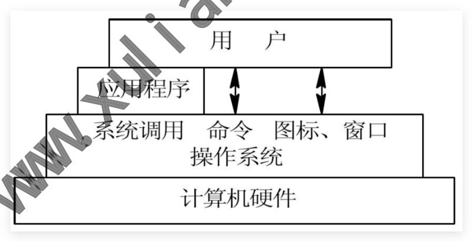

#### 1.5.3为什么需要操作系统

·1.控制计算机的基本运行； ·2.将硬件的复杂操作简单化，供上层应用程序使用； ·3.为用户与计算机硬件之间提供"图形/命令行“工具；

## 2.Linux系统基本介绍

### 2.1 什么是Linux

Linux和我们常见的Windows一样，都是操作系统，但linux有两种含义； 。一种是Linus编写的开源操作系统的内核 。另一种是广义上的操作系统 Linux与Windows系统不同的是； oWindows收费，不开源，主要用于日常办公、游戏、娱乐多一些。 。Linux免费，开源，主要用于服务器领域，性能稳定，安全，更新频次高。 ）例如：淘宝、百度、腾讯等互联网公司，他们使用的服务器全都是Linux系统；

### 2.2Linux能从事哪些行业

具备企业服务器的基础运维能力、自动化运维，如：电商、游戏、金融、物流、等 具备企业数据库运维、掌管公司核心命脉系统，例如银行、金融、电商 具备企业公有云运维的能力，如：公司使用的是阿里云、腾讯云、等等云 具备企业企业集群架构维护，如：上百台、甚至上于台规模的架构维护与实施 具备企业代码发布能力，如：如何快速对数百台服务器进行项目迭代 具备企业私有云平台的构建及运维，如：构建企业私有云平台、容器平台 能够解决运维过程中出现的各种问题《如:网站访问慢排查、网站加速、数据恢复、业务扩 展、等

### 2.3Linux的薪资有多高

课程学完能达到什么程度，或者说拿到多少钱，建议打开拉钩、BOSS直聘、以及近期学

### 2.4Linux系统发展历史

员offer 既然是历史，那就让他成为历史吧，因为我根本记不住历史。（因为我不是导游，不靠记历史 钱)。 虽然历史不重要，但是还是需要了解Linux在发展过程中的一些重要人物

#### 2.4.1自动软件之父

自由软件之父RichardM。Stallman1984发起了GNu组织

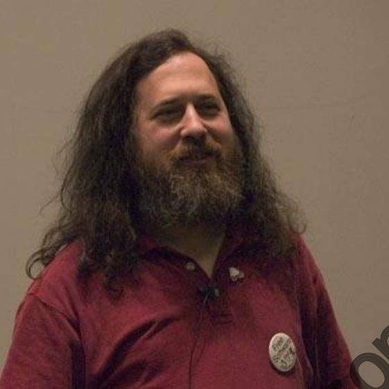

GUN组织中有几个项目： copyleft：代表无版权。copyright：则代表有版权。 opensource：开放源代码、软件谁都可以使用谁都可以传播、谁都可以二次开发 free：免费 GPL：通用版权许可证协议，如果软件被打上GPL，那么任何人都可以对这个软件进行 修改，但是修改完之后必须将源码发布出来，以便更好的传承下去。 Linux中的软件百分之八都是GPL提供； 。自由软件运动的口号是：“团结就是力量”；

#### 2.4.2Linux系统之父

·Linux之父LinusIorvalds林纳斯.托瓦兹1991 年Linux内核; ·操作系统的核心称为“内核”，但内核并不就等于操作系统； ·内核提供系统服务，比如文件管理、虚拟内存、设备I/O等；还包含一些基本的程序、编译 器、shel等；所以单独的Linux内核没办法工作，须要有GNU项目的众多应用程序； ·其实Linux官方叫法是GNU/Linux 使用GNU的软件加上Linux 内核，一般简称Linux ·总结：

Linux 内核网站 linux大神在2017-06-26来到中国

#### 2.4.3Linux系统发行版

我们现在说的Linux 其实都是指的是发行版Distributionversion；就是使用Linux内核加 上各种GNU的库文件、应用程序，构造而成的操作系统。 Linux发行版介绍RHEL/Centos/Ubuntu/Suse Redhat企业级操作系统， 的内核进行编译安装相应软件，进行专业的测试，然后进 inux 行发行； Centos社区企业级操作系统，改与Redhat完全开源； 现在主要做手机系统和电脑桌面系统； 社区维护， Ubuntu Debian

#### 2.4.4为什么使用CentOS

Centos 是 Community Enterprise Operating System 的缩写 表示“社区企业操作系统" Centos兼具Community（社区）和Enterprise（企业）的特性 Centos稳定、长期支持（10年）大规模使用稳定；

### 2.5Linux认证是否需要考

LinuX相关认证介绍RHCSA/RHCE/RHCA

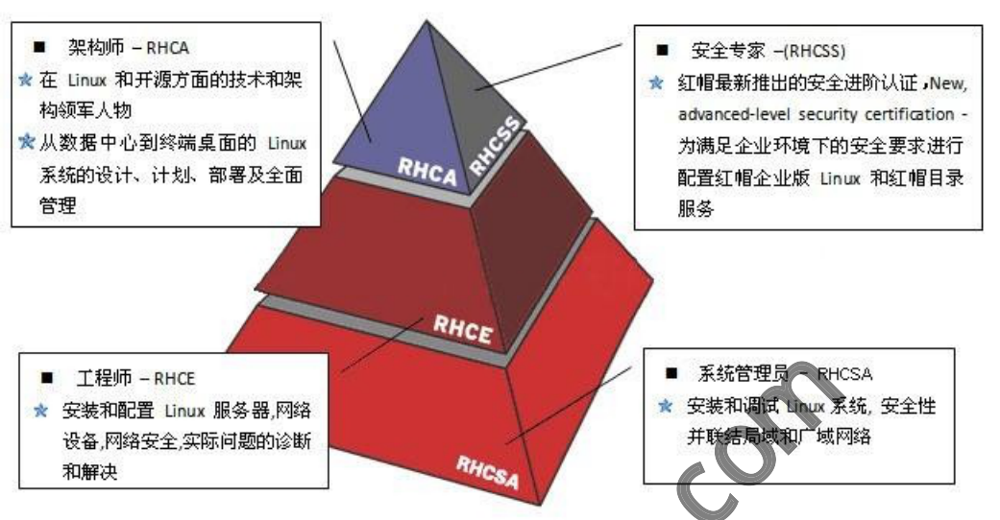

系统管理员 工程师-RHCE 安装和调试Linux系统，安全性 安装和配置Linux服务器，网络 并联结局域和广域网络 设备，网络安全，实际问题的诊断 RHCSA 和解决 常见问题：老师我到底要不要考一个红帽证书，学完咱们这个Linux 云计算课程能不能考？

## 3.Linux系统安装

### 3.1安装配置VM虚拟机

VMware WorkStation虚拟机软件是一款桌面计算机虚拟软件，让用户能够在单一主机上同时运 行多个不同的操作系统。

### 3.2安装Linux操作系统

CentOS6安装指南传送门 安装RHEL/CentoS7系统时需要注意：您电脑的cPu需要支持vT(VirtualizationTechnology虚拟化 技术）所谓VT，指的是让单台计算机能够分割出多个独立资源区，并让每个资源区按照需要模拟 出系统的一项技术，其本质就是通过中间层实现计算机资源的管理和再分配，让系统资源的利用 率最大化 注意：如果开启虚拟机后依然提示CPU不支持VT技术"报错信息，请重启电脑并进入 到BIOS中把CPU的VT虚拟化功能开启即可。 第1步：在虚拟机管理界面中单击“开启此虚拟机"按钮后数秒就看到RHEL7系统安装界面，如图 1-所示。 架构师-RHCA 安全专家-（RHCSS） 在Linux和开源方面的技术和架 红帽最新推出的安全进阶认证，New， 构领军人物 advanced-level security certification- RHCSS 从数据中心到终端桌面的Linux 为满足企业环境下的安全要求进行 RHCA 系统的设计、计划、部署及全面 配置红帽企业版Linux和红帽目录 管理 服务 RHCE RHCSA

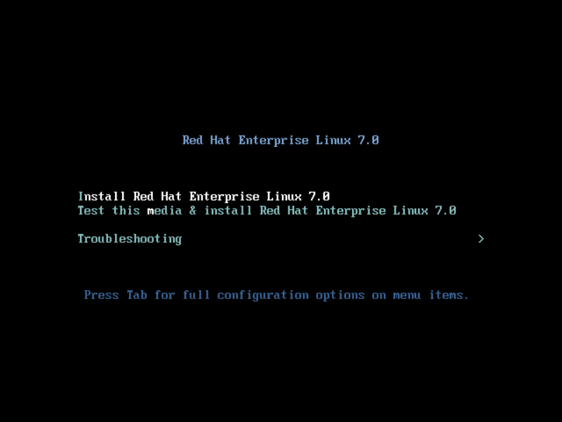

描述 含义 安装RedhatLinux7系统 Install Red Hat Enterprise Linux 7 校验光盘完整性后再安装 Test this media & install Red Hat EnterpriseI xnul Troubleshooting 启动救援模式 第2步：接下来按回车键后开始加载安装镜像，所需时间大约在30～60秒，请耐心等待，如图1-

### 3.3安装Ubuntu操作系统

#### 3.3.1下载Ubuntu

ubuntu 中文下载网：https://cn.ubuntu.com/ 第三方镜像站点：https://mirror.tuna.tsinghua.edu.cn/ubuntu-releases/ 27所示。

#### 3.3.2选择系统语言

一般选择中文 Red Hat Enterprise Linux 7.0 Install Red Hat Enterprise Linux 7.0 Test this media & install Red Hat Enterprise Linux 7.0 Troubleshooting Press Tab for full configuration options on menu items.

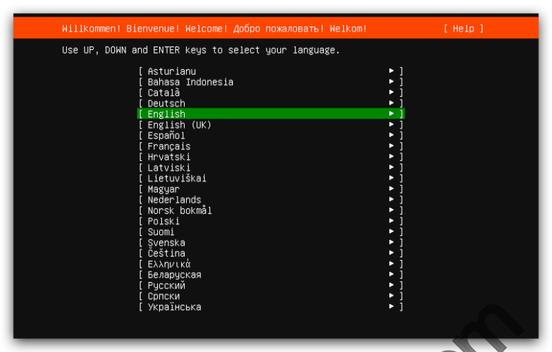

CpncKИ yKpaiHCbKa

#### 3.3.3选择键盘语言

选择键盘语言为chinese Keyboard configurat ion Please select your keyboard layout belou, or select “Identify keyboard" to detect your layout automatically. Layout:[chinese Variant:[chinese [Identify keyboard ] [Done

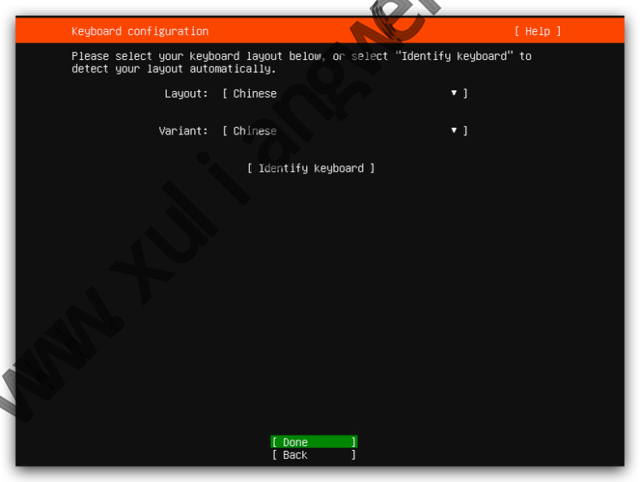

#### 3.3.4配置网络地址

配置自定义网络 Willkommen! Bienvenue! Welcome! Ao6po noxanobatb! Welkom! Use UP, DoWN and ENTER keys to select your language. [Asturianu Bahasa Indonesia Catala Deutsch [ English English (UK) Espanol Francais Hrvatski Latviski Lietuviskai Magyar Nederlands Norsk bokma1 Polski Suomi Svenska Cestina, 6enapyckag PyccKU

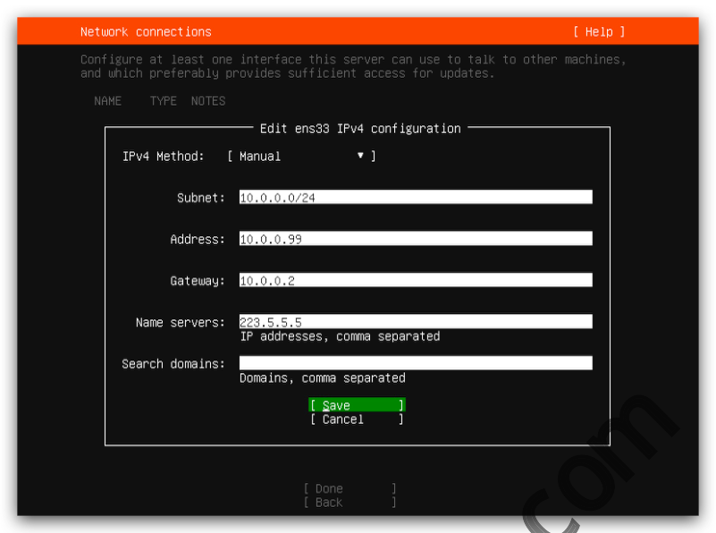

[ Save Cancel Done Back

#### 3.3.5调整仓库地址

将原本国外的仓库地址修改为国内阿里云地址http： mirror.aliyun.com [Help] ConfigureUbuntu archive mirror If you use an alternative mirror for ubuntu, enter its details here. http://mirror.aliuun.com/ubuntu Mirror address: You may provide an archive mirror that will be used instead of the default.

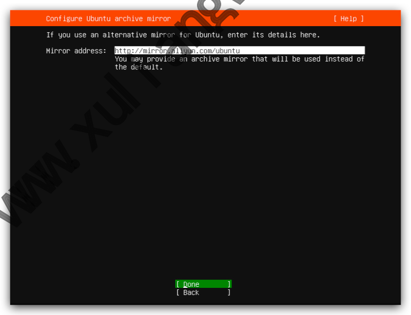

#### 3.3.6调整分区策略

Network connections o and which preferably provides sufficient access for updates. NAME TYPENOTES Edit ens33 IPv4 configuration IPv4 Method: [Manual Subnet:

#### 10.0.0.0/24

Address:

#### 10.0.0.99

Gateway:

#### 10.0.0.2

Name servers:

#### 223.5.5.5

IP addresses, comma separated Search domains: Domains,comma separated [ Qone

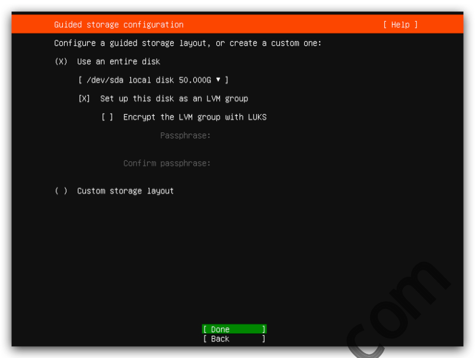

[Done

#### 3.3.7设定登陆用户

ubuntu默认拒绝root直接登陆，需要创建一个普通用户进行系统登陆 Profile setup configure ssH access on the next screen but a password is still needed for sudo. oldxu Your name: Your server's name: node o st i s Pick a username: 01dxu Choose a password: ****米 Confirm your password: ****米

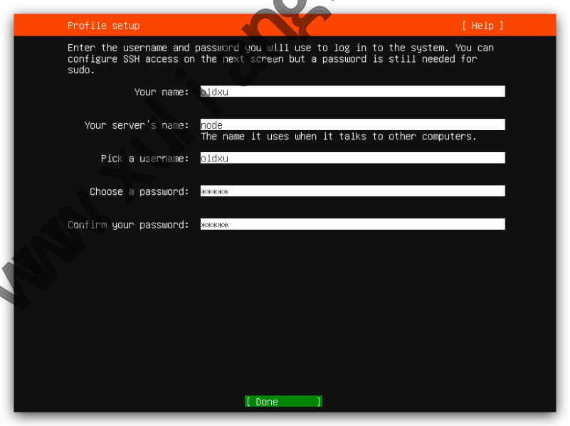

#### 3.3.8启用远程连接

勾选Install OpenSSH Server否则通过远程连接服务器 Guided storage configuration Configure a guided storage layout,or create a custom one: (X)use an entire disk [ /dev/sda 1oca1 disk 50.000G] [X]Set up this disk as an LVM group []Encrypt the LVM group with LUKS Passphrase: Confirm passphrase: Custom storage layout ） Done

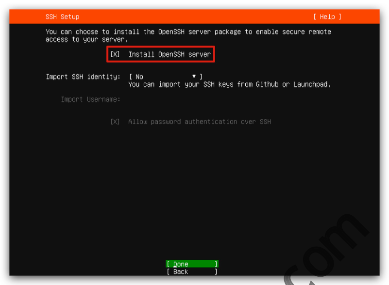

[Done

#### 3.3.9完成系统安装

安装完成后，选择RebootNow重启完成系统安装 [Help] Install complete! running/snap/bin/subiquity.subiquity-configure-run running/snap/bin/subiquity.subiquity-configure-apt /snap/subiquity/2280/usr/bin/python3fa1se curtin command apt-config curtin command in-target running'curtin curthooks' curtin command curthooks configuring apt configuring apt installing missing packages configuring iscsi service configuring raid （mdadm) service installing kernel setting up swap apply networking config uriting etc/fstab configuring multipath updating packages on target system configuring pollinate user-agent on target updating initramfs configuration configuring target system bootloader installing grub to target devices finalizing installation running'curtin hook' final system configuration configuring cloud-init installing openssh-server

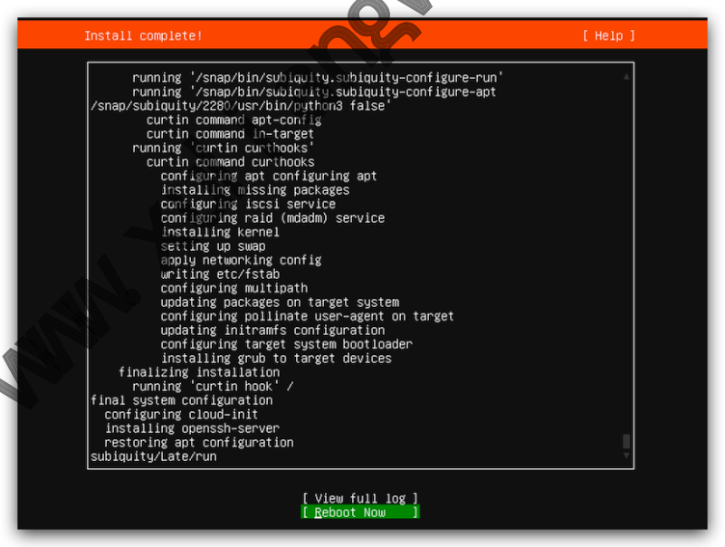

#更新源参考地址：https://mirrors.tuna.tsinghua.edu.cn/heLp/ubuntu/ oldxu@example:~$ sudo apt-get update #测试安装软件 SSH Setup You can choose to install the OpensSH server package to enable secure remote access to your server. Instal1 OpenSSH server [X] Import SSH identity: [No You can import your SSH keys from Github or Launchpad. Import Username: [X] Allow password authentication over SSH restoring apt configuration subiquity/Late/run [view full log Reboot Now

oldxu@example:~$ apt-get install net-tools

### 3.3虚拟机快照技术

#### 3.3.1什么是快照

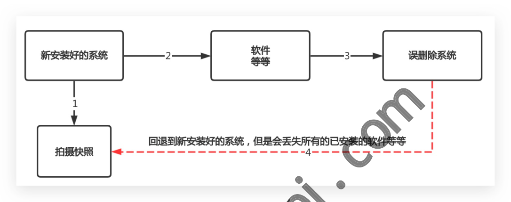

回退到新安装好的系统，但是会丢失所有的已安装的软件等等 拍摄快照 w xul i angve

#### 3.3.2快照演示实践

### 3.4虚拟机克隆技术

#### 3.3.1什么是克隆

关机 关机 Centos Centos 系统模板机 系统模板机 优点：克隆速度快、占用空间少 缺点：依赖于模板机，模板机不能出问题 缺点：克隆的速度慢，占用空间大。 完整克隆1 完整克隆2

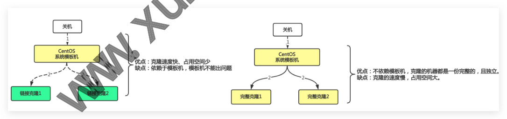

#### 3.3.1克隆主机实践

## 4.Bash Shell快速入门

### 4.1 什么是Bash shell

软件 新安装好的系统 误删除系统 等等 优点：不依赖模板机，克隆的机器都是一份完整的，且独立。 链接克隆1

BashShell是一个命令解析器，可以通过BashShell命令让用户直接与内核进行交互； o1、用户通过Bash窗口输入1s命令； o2、1s命令会通过Bash窗口传递给操作系统内核程序； 。3、内核程序将命令翻译为计算机硬件能识别的语言，然后驱动硬件； 。4、硬件执行后将结果返回给内核，内核将结果转换后返回给Bash；

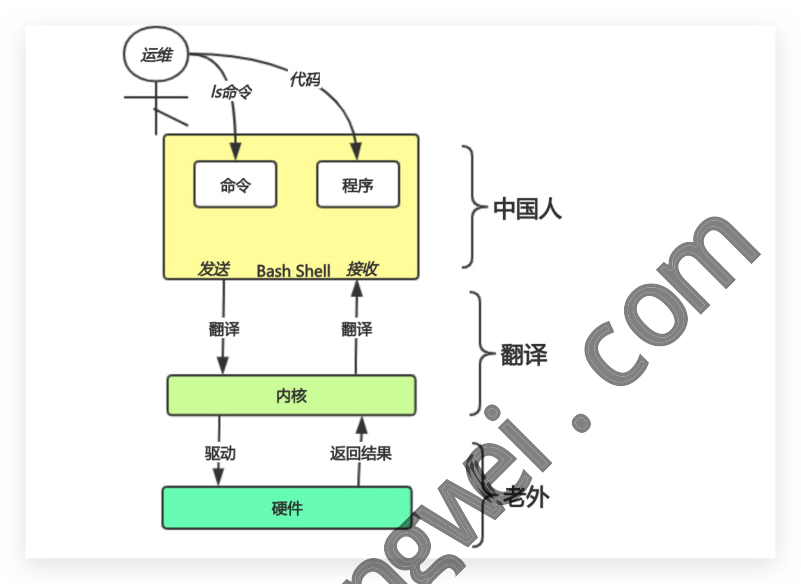

中国人 on BashShell接收 发送 翻译 翻译 翻译 内核 返回结果 驱动 W3 硬件 ）我们如何打开BashShell呢？ 。当我们使用远程连接工具连接1inux服务，系统则会给打开一个默认的shel1 。我们可在这个界面执行命令、比如：获取系统当前时间，创建一个用户等等；

### 4.2BashShell能干什么

使用Shell实现对Linux系统的大部分管理，例如： 。1.文件管理 。2.权限管理 。3.用户管理 。4.磁盘管理 ）5.网络管理 ）6.软件管理 o7.服务管理 o8.等等.

### 4.3如何使用BashShell

运维 代码 Is命令 程序 命令

·单条命令-->效率低-->适合少量的工作 shell脚本-->效率高-->适合重复性的工作 例如：创建100个用户，单纯输入命令需要执行100次，而如果使用Shel脚本则可以轻松解 决； [root@web ~]# cat useradd.sh #!/usr/bin/bash #批量创建脚本 for i in {1..100} op useradd alice-$i echo "alice-$i" is create ok.. done

### 4.4BashShell提示符

提示符一般包含当前登陆的用户名，主机名，以及当前工作路径等； [root@web~]# 当前登陆Shell的用户名称 当前系统主机名称 WN 当前所在的工作目录 #管理员提示符；$普通用户提示符

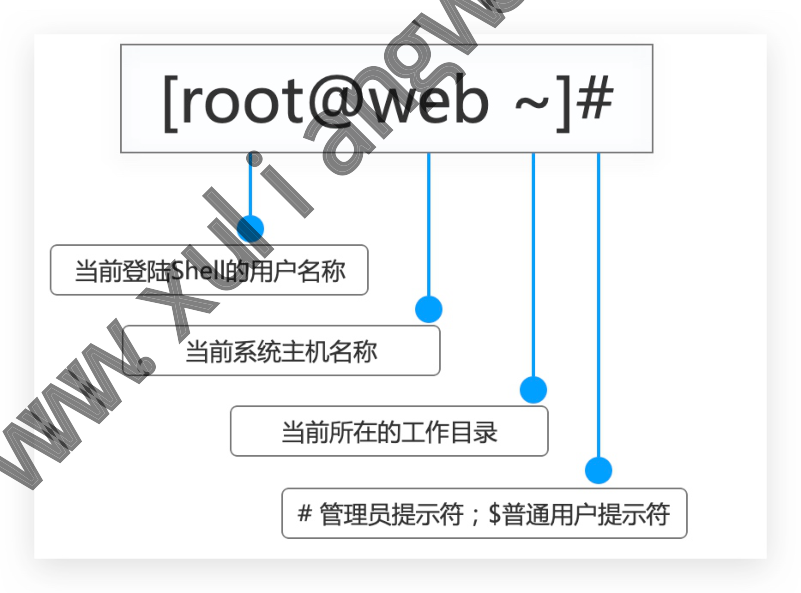

### 4.5BashShell基础语法

bashshell命令行，为用户提供命令输入，然后将执行结果返回给用户； 参数 命令 选项

command parameters options 命令示例如下： #命令 [root@web ~]# Ls #命令+选项 [root@web ~]# Ls -a #命令+选项+参数 [root@web ~]#Ls -a/home/ ●命令：整条shell命令的主体功能 ）选项：用于调节命令的具体功能 以－引导短格式选项（单个字符），例如-a 。以-－引导长格式选项（多个字符），例如--al1 。多个短格式选项可以写在一起，只用一个－，例如-al ）参数：命令操作的对象，如文件、目录名等 ·注意：命令必须开头，选项和参数位置可以发生变化

### 4.6BashShell基本特性

#### 4.6.1补全功能tabs

·1.命令补全：当忘记命令时，可以使用tabs进行补全； ·2.目录补全：当需要查找文件目录层级比较多时，可以使用tabs快速补全，减少出错； #查看ip时忘记具体了命令 [root@web ~]# ifcon #按下tab键会自动补全 [root@web ~]# ifconfig #按一下tab键没 按两下tab键列出所有f开头的命令 [root@web ~] ifenslave ifrename fconfig ifup fdown ifnames if ifcfg #Linux目录较深，经常使用tab键进行补全，如果路径出错是没有办法补全 [root@web ~]# Ls /etc/sysconfig/network-scripts/

#### 4.6.2常用快捷键ctrl

）命令快捷键，快捷键可以帮助我们大大提升工作效率 Ctrl+a：光标跳转至正在输入的命令行的首部 Ctrl+e：光标跳转至正在输入的命令行的尾部

ctrl+c：终止前台运行的程序 Ctrl+d：在shell中，ctrl-d表示推出当前shell。 Ctrl +z：将任务暂停，挂至后台 Ctrl+1：清屏，和clear命令等效。 Ctrl+k：删除从光标到行末的所有字符 Ctrl+u：删除从光标到行首的所有字符 Ctrl+r：搜索历史命令，利用关键字

#### 4.6.2历史记录History

历史记录可用于追溯系统之前执行过什么命令，造成的故障；之前发生情况

1.使用双！！可执行上一条执行过的命令

[root@web ~]# Ls [root@web ~]# !!

2.输入!6，执行history命令历史中第6行命

[root@web ~]# !6 touch file.txt

3.使用！cat，调用history命令历史最近一次执行过的cat命令

c/sysconfig/network-scripts/ifcfg-etho [root@web ~]# ca [root@web ~]# cat/etc/syscon Fig/network-scripts/ifcfg-etho

#### 4.6.3命令别名alias

file.txt 1s file.txt 命令别名将用户经常使用的复杂命令简单化，可以用alias别名名称='命令创建属于自己的命令 别名，若要取消一个命令别名，则是用unalias别名名称；

1.定义临时别名，wk 为查看etho网卡别名

[root@web ~]# alias wk='ifconfig' [root@web ~]# wk o

2.如果定义命令本身，会执行什么？

[root@web ~]# alias ifconfig='ifconfig etho' #绝对路径执行，调用命令本身 [root@web ~]#/sbin/ifconfig #通过\转义字符，调用命令本身 [root@web ~]# \ifconfig

3.取消别名

[root@web ~]# unalias ifconfig

4.永久生效，/etc/bashrc

Juyspg/2/ <<eyza bnfuoof?,=bnfuonf? sbnab oyoa #[~ qam@noou]

#### 4.6.4帮助手册help

1.命令--help帮助

[root@web ~]# Ls --help 用法：ls[选项]...[文件].

2.命令man手册

令的手册

3.linux命令大全ur1传送门

#man Ls linux命令大全 linux命令手册
