# 02 Linux文件管理

## 02.Linux文件管理

）02.Linux文件管理 o1.文件管理概述

### 1.1系统目录结构

·1.1.1命令相关目录/bin

#### 1.1.2用户家相关目录/home

#### 1.1.3系统文件目录/usr

#### 1.1.4系统启动目录/boot

#### 1.1.5配置文件目录/etc

#### 1.1.6设备相关目录/dev

#### 1.1.7可变的目录/var

#### 11.1.8虚拟系统目录/proc

### 1.2 文件路径定位

·1.2.1为什么要进行定位

#### 1.2.2如何对文件进行定位

#### 1.2.3访问路径方式-绝对路径

#### 1.2.4访问路径方式-相对路径

：1.2.4路径切换命令cd 。2.文件管理命令 ·2.1文件操作类命令 ·2.1.1 touch文件创建

#### 2.1.2 mkdir目录创建

#### 2.1.3 tree显示目录结构

4cp文件或目录复制

### 2.1

mv文件移动命令

#### 2.1.6rm文件或目录删除

文件查看类命令 ·2.2.1cat命令

#### 2.2.2less-more命令

#### 2.2.3 head-tail命令

#### 2.2.4 grep过滤数据

### 2.3文件下载类命令

·2.3.1wget命令 ·2.3.2curl命令

#### 2.3.3rz-Sz命令

### 2.4文件查找类命令

■2.4.1which命令 ■2.4.2whereis命令

### 2.5字符处理类命令

■2.5.1sort命令 ·2.5.2 uniq命令 ·2.5.3 cut命令

#### 2.5.4wc命令

### 12.6课堂练习题

■2.6.1练习1

#### 2.6.2练习2

#### 2.6.4练习3

#### 2.6.3练习4

#### 2.6.4练习5

。3.文件扩展知识 ·3.1文件属性

### 13.2文件类型

### 13.3链接文件

·3.3.1Inode与Block angw

#### 3.1.2 软连接

·3.1.3硬连接

### 13.4文件时间

·3.4.1环境准备

#### 3.4.2 atime

·3.4.2 mtime

#### 3.4.3 ctim

徐亮伟，多年互联网运维重作经验，曾负责过大规模集群架构自动化运维管理工作。擅长 Web集群架构与自动化运维，曾负责国内某大型电商运维工作。

## 1.文件管理概述

·谈到Linux文件管理，首先我们需要了解的就是，我们要对文件做些什么事情？ ）其实无非就是对一个文件进行、创建、复制、移动、查看、编辑、压缩、查找、删除、等等 ·如：当我们想修改系统的主机名称，是否应该知道文件在哪，才能去做对应的修改？

### 1.1系统目录结构

）几乎所有的计算机操作系统都是使用目录结构组织文件，具体来说就是在一个目录中存放子 目录和文件，而在子目录中又会进一步存放子目录和文件，以此类推形成一个树状的文件结 构； 由于其结构很像一棵树的分支，所以该结构又被称为“目录树”； Windows：以多根的方式组织文件c：\D:\ Linux：以单根的方式组织文件/

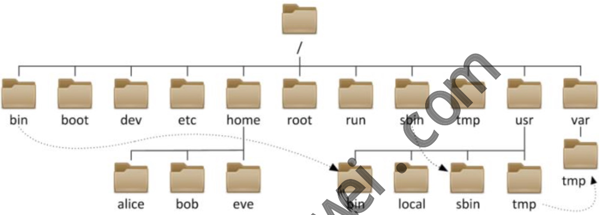

boot dev home etc root run sbir tmp alice bob local sbin eve

#### 1.1.1命令相关目录/bin

）存放命令相关的目录 /bin普通用户使用的命令/bin/ls，/bin/date /sbin管理员使用的命令/sbin/service

## 1. root@bgx:~ (ssh)

[root@bgx ~]# which ls alias ls='ls --color=auto' /usr/bin/ls root@bgx ~]# which useradd usr/sbin/useradd [root@bgx ~]#

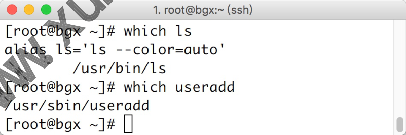

#### 1.1.2用户家相关目录/home

·存放用户相关数据的家目录，比如windows不同的用户登陆系统显示的桌面背景不一样 。/home普通用户的家目录，默认为/home/username 。/root超级管理员root的家目录，普通用户无权操作 bin usr var tmp tmp

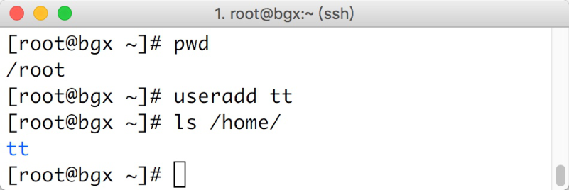

#### 1.1.3系统文件目录/usr

存放系统相关文件的目录 /usr相当于c:\Windows /usr/local 软件安装的目录，相当于c:\Program /usr/bin/普通用户使用的应用程序(重要) /usr/sbin管理员使用的应用程序(重要) /usr/lib 库文件 Glibc 32bit /usr/lib64库文件Glibc64bit

## 1. root@bgx:

ssh [root@bgx ~]# [root@bgx ~]# ls /usr ibexec bin lib sbin games src lib64 share etc _include tmp [root@bgx ~]#

#### 1.1.4系统启动目录/boot

）存放系统启动时内核与grub引导菜单 。/boot存放的系统启动相关的文件，如：kernel，grub(引l导装载程序)

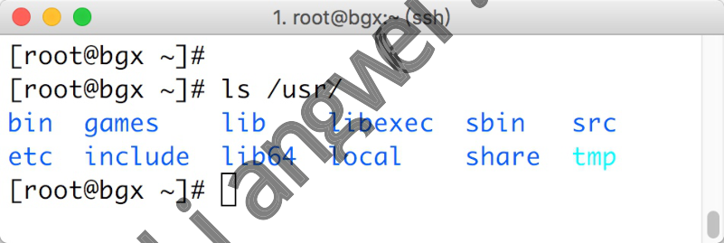

## 1. root@bgx:~ (ssh)

[root@bgx ~]# pwd /root [root@bgx ~]# useradd tt [root@bgx ~]# ls /home/ tt [root@bgx ~]# o

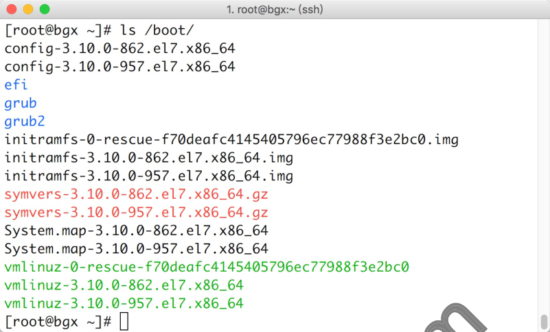

vmlinuz-3.10.0-957.el7.x86_64 [root@bgx ~]#

#### 1.1.5配置文件目录/etc

·/etc存放系统配置文件目录，后续所有服务的配置都在这个目录中 /etc/sysconfig/network-script/ifcfg-，网络配置文件 /etc/hostname系统主机名配置文件

#### 1.1.6设备相关目录/dev

）/dev存放设备文件的目录，比如硬盘，硬盘分区，光驱，等等 /dev/nul1黑洞设备，只进不出。类似于垃圾回收站 /dev/random生成随机数的设备 /dev/zero能源源不断的产生数据，类似于取款机，随时随地取钱*

## 1. root@bgx:~ (ssh)

[root@bgx ~# ls /dev/sda* / dev/sda /dev/sda1 /dev/sda2 [root@bgx ~]# ls /dev/zero /dev/random /dev/null /dev/zero /dev/null / dev/random [root@bgx ~]# 成随机数 能产生源源不断的数据(摇钱树)

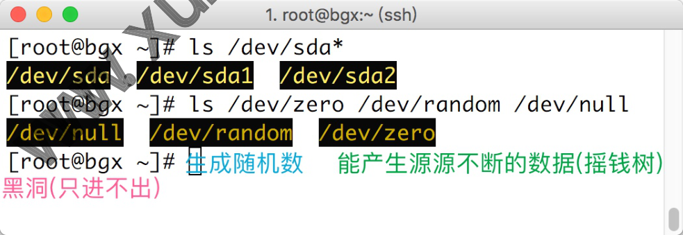

#### 1.1.7可变的目录/var

·var，存放一些变化文件，比如/var/log/下的日志文件 ·/var/tmp，进程产生的临时文件 · /tmp，系统临时目录(类似于公共厕所)

## 1. root@bgx:~ (ssh)

[root@bgx ~]# ls /boot/ config-3.10.0-862.el7.x86_64 config-3.10.0-957.el7.x86_64 efi grub grub2 initramfs-0-rescue-f70deafc4145405796ec77988f3e2bc0.img initramfs-3.10.0-862.el7.x86_64.img initramfs-3.10.0-957.el7.x86_64.img symvers-3.10.0-862.el7.x86_64.gz symvers-3.10.0-957.el7.x86_64.gz System.map-3.10.0-862.el7.x86_64 System.map-3.10.0-957.el7.x86_64 vmlinuz-0-rescue-f70deafc4145405796ec77988f3e2bc0 vmlinuz-3.10.0-862.el7.x86_64 O 黑洞(只进不出)

#### 1.1.8虚拟系统目录/proc

）虚拟的文件系统（如对应的进程停止则/proc下对应目录则会被删除） 。/proc，反映当前系统正在运行进程的实时状态，类似于汽车在运行过程中的仪表板，能 够看到汽车的油耗、时速、转向灯、故障等等

### 1.2文件路径定位

#### 1.2.1为什么要进行定位

你要在哪个目录下创建文件？ 你要将文件复制到什么地方？ 你要删除的文件在什么地方？

#### 1.2.2如何对文件进行定位

比如：/etc/hostname整个文件中包含文件名称以及文件所在的位置，我们将这个叫做路 径，也就是说我们是通过路径对文件进行定位。 ）例：下图所示的message所在的路径是？ home alice home bob alice bob log messages

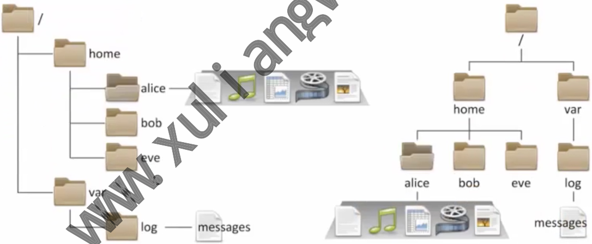

#### 1.2.3访问路径方式-绝对路径

·绝对路径：只要从/开始的路径，比如/var/log/message

#### 1.2.4访问路径方式-相对路径

·相对路径：相对于当前目录来说，比如a.txt./a.txt../var/

#### 1.2.4路径切换命令cd

var log eve messages

#cd绝对路径cd/etc/hostname # cd 相对路径 cd test/abc cd。cd。 #切换目录，例：cd/etc #cd #cd #切换回上一次所在的目录 #cd #切换回当前用户的家目录，注意：root和普通用户是否有所不同吗？ #代表当前目录，一般在拷贝、移动等情况下使用cp/etc/hostname # cd。 # cd。 #切换回当前目录的上级目录

## 2.文件管理命令

### 2.1文件操作类命令

#### 2.1.1touch文件创建

# touch file #无则创建，有则修改时 # touch file2 file3 #touch/home/od/file4file5 # touch file{a,b,c} #{}集合， # touch file{1..10} # touch file{a..z}

#### 2.1.2mkdir目录创建

#选项：-V显示详细信息 白创建目录 # mkdir dir1 # mkdir /home/obx /home/ob/dir2 {dir3,dir4} # mkdir-v/hot #mkdir -pv ob/dir5/dir6 e/{ob/{diu,but},boy} # mkdir

#### 2.1.3tree显示目录结构

#选项：-L：显示目录树的层级 # tree /home/ob/ #显示当前目录下的结构 /home/ob/ but dir1 dir2 dir3

dir4 dir5 dir6 diu

#### 2.1.4cp文件或目录复制

#选项：-v：详细显示命令执行的操作-r：递归处理目录与子目录-p：保留源文件或目录的属性 # cp file/tmp/file_copy #不修改名称 # cp name/tmp/name #不修改名称 # cp file/tmp/ #-p保持原文件或目录的属性 # cp -p file /tmp/file_p #复制目录需要使用-r参数，递归复制 # cp-r /etc//tmp/ #cp-rv/etc/hosts/etc/hostname/tmp#拷贝多个文件至一个目录 # cp -rv /etc/{hosts,hosts.bak} # cp -rv /etc/hosts{,-org}

#### 2.1.5mv文件移动命令

#原地移动算改 # mv file filel #移动文件至 # mv file1 /tmp/ #移动tmp目 件至当前目录 # mv /tmp/file1./ tmp目录下 #移动自录至 # mv dir/ /tmp/ # touch file{1..3} #移动多个文件或至同一个目录 # mv file1 file2 file3 # mkdir dir{1..3} # mv dir1/ dir2/ #移动多个目录至同一个目录 opt

#### 2.1.6rm文件或目录删除

#选项：-r：递归-f：强制删除-v：详细过程 #删除文件，默认rm存在aLias别名，rm-i所以会提醒是否删除文件 # rm file.txt # rm -f file.txt #删除文件，不提醒 #递归删除目录，会提示 # rm -r dir/ #强制删除目录，不提醒（慎用） # rm -rf dir/ #1.rm删除示例 # mkdir /home/dir10 # touch /home/dir10/{file2,file3,.file4}

#rm-f/home/dir1θ/*//不包括隐藏文件 # Ls /home/dir10/ -a ..．.file4 #2.rm删除示例2 # touch file{1..10} # touch {1..10}.pdf # rm -rf file* # rm -rf *.pdf

### 2.2文件查看类命令

#### 2.2.1 cat命令

cat # cp /etc/passwd ./pass # cat pass #正常查看文件方式 # cat -n pass #-n显示文件有多少行 #查看文件的特殊符号，比如文件中存在 # cat -A pass # tac pass #倒序查看文件

#### 2.2.2 less-more命令

Less、more #使用光标上下翻动，空格进行翻页，q退出 # Less /etc/services 可车上下翻动，空格进行翻页，q退出 #使片 # more/etc/services

#### 2.2.3 head-tail 命令

hec #查看头部内容，默认前十行 #head-n5 pass #查看头部5行，使用-n指定 # #一 #head 7--- # tail pass # tail-20/var/log/secure # tail-f/var/Log/messages #-f查看文件尾部的变化 #查看文件尾部的变化 # tailf/var/Log/messages

#### 2.2.4grep过滤数据

grep过滤文件内容 "^root" pass #匹配以root开头的行 #grep #grep "bash$" pass #匹配以bash结尾的行 #grep -v "ftp" pass #匹配除了包含ftp的内容，其他全部打印 #grep #忽略大小写匹配 0-i"ftp"pass #匹配文件中包含sync结尾或ftp字符串 #grep -Ei"sync$lftp"pass #grep-n-A2"FaiLed"/var/Log/secure #匹配/var/Log/secure文件中FaiLed字符串,并打印 它的下2行 #grep-n-B2"FaiLed"/var/Log/secure #匹配/var/儿og/secure文件中FaiLed字符串,并打印 它的上2行 #grep-n-C2"FaiLed"/var/Log/secure#匹配/var/Log/secure文件中FaiLed字符串,并打印 它的上下2行

### 2.3文件下载类命令

互联网上的资源文件 CentOS7系统 ③：通过rz命令将windows的文件 上传到到Centos7系统 xiaoshuo.zip xiaoshuo.txt qq.exe软件 ②：通过sz命令将Centos7的文件下载到Windows电脑 0电脑

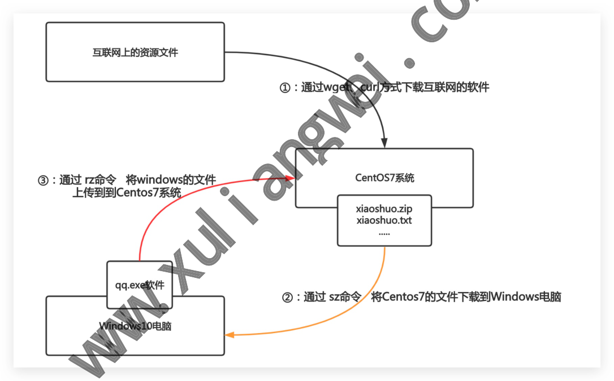

#### 2.3.1 wget命令

#Centos7系统最小化安装默认没有wget命令，需要进行安装 # yum install wget -y #下载互联网上的文件至本地 #wget http://mirrors.aliyun.com/repo/Centos-7.repo

#将阿里云的centos-7.repo下载到/etc/yum.repos.d/并改名为centos-Base.repo-o参数指定 # wget -0 /etc/yum.repos.d/Centos-Base.repo http://mirrors.aliyun.com/repo/Centos-7 .repo

#### 2.3.2 curl命令

#仅查看这个urL地址的文件的内容 #curlhttp://mirrors.aliyun.com/repo/Centos-7.repo #将阿里云的centos-7.repo下载到/etc/yum.repos.d/并改名为Centos-Base.repo-o参数指定 # curl -o /etc/yum.repos.d/Centos-Base.repo http://mirrors.aliyun.com/repo/Centos-7 .repo #练习：请下载一个图片至于/opt目录下（不要修改名称），最少使用2中方式 uliangwei.com/public/ks.jpeg [root@oldxu ~]# cd /opt ngwei.com/public/ks.jpeg [root@oldxu ~]# wget -0/opt/ks.jpeghttp://fj [root@oldxu ~]# curl -o /opt/ks2.jpeg l

#### 2.3.3rz-sz命令

#yum install lrzsz -y 欢件则无法执行该命令 #只能上传文件，不支持上传文件夹，不支持大于4个G上传，也不支持断电续传 #sz/path/fiLe#只能下载文件，不支持下载文件夹

### 2.4文件查找类命令

为：http://fj.x #1.wget #2.curl #rz

#### 2.4.1which命令

#whichLs#查找Ls命令的绝对路径 #查看命令的绝对路径（包括别名） # type -a Ls

#### 2.4.2 whereis命令

#查找命令的路径、帮助手册、等 # whereis Ls #仅显示命令所在的路径 # whereis -b Ls

### 2.5字符处理类命令

#### 2.5.1 sort命令

在有些情况下，需要对应一个无序的文本文件进行数据的排序，这时就需要使用sort进行排序 了。 sort [OPTION]... [FILE]... #-r：倒序-n：按数字排序-t：指定分隔符（默认空格）-k：指定第几列，指定几列几字符（指定1,1

### 3.1,3.3)

#1。首先创建一个文件，写入一写无序的内容 [root@oldxu ~]# cat >>file.txt <<EOF angwe [root@oldxu ~]# sort file.t NX 安照数字排序，而是按字母排序。 #结果并不是 #可以使用-t指定分隔符，使用-k指定需要排序的列。 b:3 c:2 a:4 e:5 d:1 f:11 EOF a:4 b:3 c:2 d:1 e:5 f:11 [root@oldxu ~]# sort -t ":" -k2 sort.txt d:1 f：11#第二行为什么是11？不应该按照顺序排列？ c:2 b:3 a:4 e:5 #按照排序的方式，只会看到第一个字符，11的第一个字符是1，按照字符来排序确实比2小。 #如果想要按照数字的方式进行排序，需要使用-n参数。

[root@oldxu ~]# sort -t":"-n-k2 p.txt d:1 c:2 b:3 a:4 e:5 f:11 [root@oldxu ~]# sort -t. -k3.1,3.1nr -k4.1,4.3nr ip.txt

#### 2.5.2uniq命令

如果文件中有多行完全相同的内容，当前是希望能删除重复的行，同时还可以统计出完全相同的 行出现的总次数，那么就可以使用unig命令解决这个问题(但是必须配合sort使用)。 uniq [OPTION]...[INPUT [OUTPUT]] #选项：-C计算重复的行 #1.创建一个file.txt文件： [root@oldxu ~]# cat file.txt #2.uniq需要和sort一起使用，先使用sort排序，让重复内容连续在一起 [root@oldxu ~]# sort file.t #3.使用uniq去 复的行 sort file.txt luniq [root@oldxu #4。-c参数能统计出文件中每行内容重复的次数 abc abc abc abc abc [root@oldxu ~]# sort file.txt /uniq -c 2123 2 abc #面试题：请统计分析如下日志，打印出访问最高前10的IP

#### 2.5.3cut命令

cut OPTION...[FILE]... #选项：-d指定分隔符-f数字，取第几列-f3，6三列和6列-c按字符取（空格也算） #过滤出文件里oLdxu以及552408925 #实现上述题目几种思路 # cut -d""-f2,5 file.txt # cut -d " "-f2,5 file.txt |sed's#,##g # sed's#,# #g'file.txt| awk -F " "‘{print $2 "" $5}' ‘{print $2,$5}'file.txt/awk-F',''{print $1,$2}‘ #awk #awk-F "[,]"'{print $2,$6}' file.txt #awk -F'[，]+''{print $2,$5}'file.txt

#### 2.5.4wc命令

WC [OPTION]...[FILE]... #选项：-L显示文件行数-c显示文件字节-W显示文件单词 #统计/etc/fstab文件有多少行 # wc -L /etc/fstab #统计/etc/services 文件行号 # wc -L /etc/services 多少行 #练习题：过滤出/etc/passwd以noLogin结尾的内容， #扩展统计文件行号的方法 # grep -n ".*" /etc/services # cat -n/etc/services/tail-1 tail-1 # awk'{print NR $o}'/etcservt

### 2.6课堂练习题

分析如下日 统计每个域名被访问的次数。

#### 2.6.1练习1

[root@student tmp]# cat web.Log http://www.example.com/index.html http://www.example.com/1.html http://post.example.com/index.html http://mp3.example.com/index.html http://www.example.com/3.html http://post.example.com/2.html # awk -F '/''{print $3}' web.Log/sort -rn/uniq -C # cut-d / -f3 web.Log/sort -rn/uniq -C

#### 2.6.2练习2

）使用awk取出系统的IP地址，使用多种方法实现 。1.我要取的值在哪里 。2.如何缩小取值范围(行) 。3.如何精确具体内容(列)

#### 2.6.4练习3

·将/etc/sysconfig/selinux 文件中的 SELINUX=enforcing 替换成 SELINUX=disabled ·将/etc/passwd文件中的第一行中的第一列和最后一列位置进行交换。 ·现有1-100个文件，需要保留 76，78三个文件，其余全部删除。grep、awk、sed

## 3.文件扩展知识

### 3.1文件属性

#### 2.6.3练习4

#### 2.6.4练习5

）当我们使用1s-1列目录下所有文件时，通常会以长格式的方式显示，其实长格式显示就 是我们Windows下看到的文件详细信息，我们将其称为文件属性，那整个文件的属性分为 十列。 [root@oldxu ~]# Ls -l ks.cfg -. 1 root root 4434 May 30 13:58 ks.cfg

。①：第一个字符是文件类型，其他则是权限 ②:硬链接次数 ③：文件属于哪个用户 root ④:文件属于哪个组 root ③:文件大小 4434 May3013：58608：最新修改的时间与日期 ks.cfg @:文件或目录名称

### 3.2文件类型

·通常我们使用颜色或者后缀名称来区分文件类型，但很多时候不是很准确； ·所以我们可以通过1s-1以长格式显示一个文件的属性，通过第一列的第一个字符来近一 步的判断文件具体的类型。 [root@oldxu ~]#Ll -d /etc/hosts /tmp /bin/Ls/dev/sda ev/log/run/dmeventd-client 1 root root 117656 Jun 30 2016 /bin/ -rwxr-xr-x. 1 root root 0 Jan 20 10:35/dg srw-rw-rw-. 1 root disk 8,0Jan2010:36 brw-rw----. 1 root tty 4，1Jan2010:36 crw--w----. cty1 lrwxrwxrwx. 1 root root 22 Jan 13 etc/grub2.cfg ->../boot/grub2/grub.c 11:03/etc/hosts 1 root root Jan r--. 13:01/tmp drwxrwxrwt. 61 root root 8192 Jan ·文件类型说明 类型含义 文件类型字母 通文件(文本，二进制，压缩，图片，日志等) 目录文件 设备文件(块设备)存储设备硬盘/dev/sda,/dev/sr0 v/tty1/etc/grub2.cfg/d fg d b 设备文件(字符设备)，终端/dev/tty1 C 套接字文件，进程与进程间的一种通信方式（socket插座) S 链接文件 ）但有些情况下，我们无法通过Is-文件的类型，比如：一个文件，它可能是普通文件、也可能 是压缩文件、或者是命令文件等，那么此时就需要使用file来更加精准的判断这个文件的类型

[root@oldxu ~]# file /etc/hosts /etc/hosts: AScII text [root@oldxu ~]# file/bin/ls /bin/ls: ELF 64-bit LSB executable,x86-64,version 1 (SYSV)，dynamically linked (u ses shared 1ibs)，for GNU/Linux 2.6.32,BuildID[sha1]=aa7ff68f13de25936a098016243ce 57c3c982e06，stripped [root@oldxu ~]# file /dev/sda /dev/sda: block special [root@oldxu ~]# file/dev/tty1 /dev/tty1:character special [root@oldxu ~]# file /etc/grub2.cfg /etc/grub2.cfg: broken symbolic link to^../boot/grub2/grub. [root@oldxu ~]#file/home /home: directory Linux文件扩展名不代表任何含义，仅为了我们人能更好的识别该文件是什么类型。

### 3.3链接文件

#### 3.3.1Inode与Block

·文件有文件名与数据，在Linux上被分成两个部分：数据data与文件元数据metadata o1.数据datablock 数据块是用来记录文件真实内容的地方，我们将其称为Block 。2.元数据metadata，用来记录文件大小、创建时间、所有者等信息，我们将其称为 Inode

## 3.需要注

Inode不包含文件名称，inode仅包含文件的元数据信息，具体来说有以 下内 文件的字节数 文件的UserID GroupID 文件的读、写、执行权限 ！文件的时间戳 链接数，即有多少文件名指向这个inode 文件数据block的位置 ）每个inode都是一个编号，操作系统是通过Inode来识别不同的文件。 o对于系统来说，文件名只是inode便于识别的别名，或者绰号。（便于我们人识 别。） 。表面上，用户是通过文件名打开的文件，实际上系统内部这个过程分为如下三步：

！首先，系统找到这个文件名对应的inode编号 其次，通过inode编号，获取inode 信息 ·最后，根据 inode 信息，找到文件数据所在的 block，读出数据。

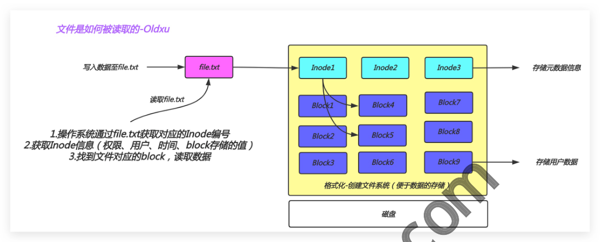

## 3.找到文件对应的block，读取数据

Block6 Block3 Block9 格式化-创建文件系统（便于数据的存储） 磁盘

#### 3.1.2软连接

·什么是软连接：软链接相当于Windows的快捷方式 ）软链接实现原理： 。1、软链接文件会将inode指向源文件的block 。2、当我们访问这个软链接文件时》其实访问的是源文件本身； WWWXU inode 软链接：oldxu 12343 cat命令 inode 源文件oldxu.txt 42023

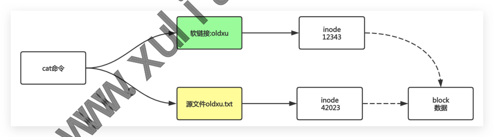

·软连接使用场景 。软件升级 。代码发布 文件是如何被读取的-Oldxu file.txt Inode1 Inode2 写入数据至fle.txt Inode3 存储元数据信息 读取file.txt Block7 Block4 Blocki Block8

## 1.操作系统通过file.txt获取对应的Inode编号

Block2 Block5

## 2.获取Inode信息（权限、用户、时间、block存储的值）

存储用户数据 block 数据

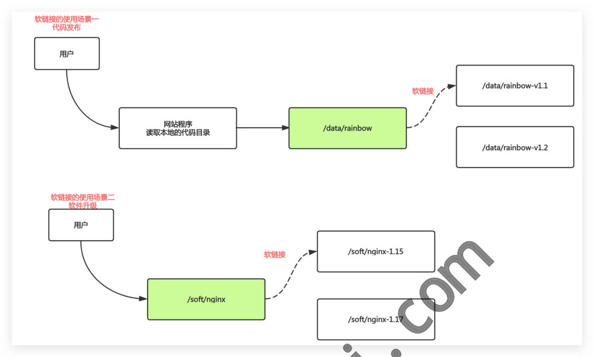

/soft/nginx-1.15 软链接 /soft/nginx /soft/nginx-1.1 ·软链接场景实践 #1.准备网站1.1版本代码 [root@oldxu ~]# mkdir/data/rainbow /data/ [root@oldxu~]#echo"123">/ w-v1.1/index.html #2。创建软链接 [root@oldxu ~]# Ln -s /data) nbow-v1.1//data/rainbow [root@oldxu ~]# LL /data drwxr-xr-x. 2 root root6 3月 5 12:23 dir lrwxrwxrwx. 1 root root 19 3月 10 12:09 rainbow -> /data/rainbow-v1.1/ drwxr-xr-x.2 root243月 10 12:09 rainbow-v1.1 #3.检查网站 [root@oldxu cat/data/rainbow/index.html #4。新更新一个网站的程序代码 [root@oldxu ~]# mkdir /data/rainbow-v1.2 [root@oldxu ~]# echo "456">/data/rainbow-v1.2/index.html #5.升级 Moqudu/bp/ /-moqudu/zp/ s- u moquu/zp/ - uu #[ xpo@oou] [root@oldxu ~]# cat /data/rainbow/index.html 软链接的使用场景 代码发布 用户 /data/rainbow-v1.1 软链接 网站程序 /data/rainbow 读取本地的代码目录 /data/rainbow-v1.2 软链接的使用场景二 软件升级 用户

#6.回退 [root@oldxu ~]# rm -f/data/rainbow &&Ln -s/data/rainbow-v1.1/ /data/rainbow [root@oldxu ~]# cat /data/rainbow/index.html

#### 3.1.3硬连接

·硬链接类似于超时有多个门，无论丛哪个门进入，看到的内容都是一样的。不会影响进入超 市 回到系统中，我们对硬链接的解释：不同的文件名指向同一个inode，简单的说就是指向同 一个真实的数据源。 file_hard inode 数据索引 指向同一个innode 4202346 file 硬链接与软链接区别 。1）In命令创建硬链接，Ines命令创建软链接 。2）目录不能创建硬链接，并且硬链接不可以跨越分区系统； 。3）软链接支持对目录创建，同时也支持跨越分区系统； ）4）硬链接文件与源文件的inode相同，软链接文件与源文件inode不同； 5）删除软链接文件厂对源文件及硬链接文件无任何影响； 删除文件的硬链接文件，对源文件及链接文件无任何影响； 6） 删除链接文件的源文件，对硬链接无影响，会导致软链接失效； 7） 8）删除源文件及其硬链接文件，整个文件会被真正的删除；

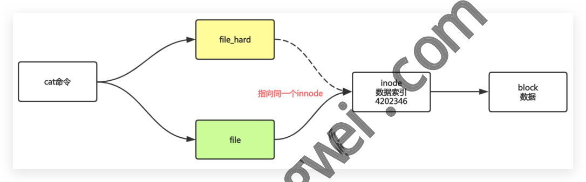

### 3.4文件时间

linux下文件有3个时间的，分别是atime,mtime,ctime 简名 全名 中文名 含义 访问时间 文件中的数据最后被访问的时间 atime access time 修改时间 文件内容被修改的最后时间 mtime modify time 数据

变化时间 文件的元数据发生变化。比如权限，所有者等 change time ctime

#### 3.4.1环境准备

[root@oldxu ~]# mount -o remount,strictatime [root@oldxu ~]# echo"hello boy">>new_file [root@oldxu ~]# stat new_file File:'new_file' regular file Size: 10 Blocks: 8 IO Block: 4096 Links: 1 Device: fd00h/64768d Inode: 34724341 Gid:（ root) /0 root) Access:（0644/-rw-r--r--）Uid:（ 0/ Access: 2021-07-07 16:24:02.320233640 +0800 Modify: 2021-07-07 16:24:02.320233640+0800 Change: 2021-07-07 16:24:02.320233640 +0800 Birth: - [root@oldxu ~]# cat new_file [root@oldxu ~]# stat new_file File: 'new_file' Size: 10 Block: 4096 regular file Blocks: 8 Inode:34724 Links: 1 Device:fd00h/64768d Gid:（ root) 0/ root) Access:(0644/-rw-r--r--) Uid: Access: 2021-07-07 16:24:56.362408139 +0800 访问时间发生变化 # Modify: 2021-07-07 16:24:02.320233640 +0800 Change: 2021-07-07 16:24:02.320233640 +0800 Birth: - [root@oldxu ~]# echo "HelLo" >> new_file

#### 3.4.2 atime

hello boy

#### 3.4.2 mtimg

#写入数据 [root@oldxu ~]# stat new_file File: 'new_file' IO Block: 4096 regular file Size: 16 Blocks: 8 Device:fd00h/64768d Inode: 34724341 Links: 1 Gid:（ root) Access: (0644/-rw-r--r--) /0 Uid:（ root) /0 Modify：2021-07-0716:32:36.806358744+0800 #内容被修改后，mtime会变化 Change:2021-07-0716:32:36.806358744+0800 #变化

Birth: #ctime时间发生变化的原因是，内容变化了，innode所记录的大小也需要变化，所以时间发生了变化

#### 3.4.3 ctime

#修改文件属性 [root@oldxu ~]# chown adm new_file [root@oldxu ~]# stat new_file File:'new_file' regular file Size: 16 Blocks:8 I0B1ock:4096 Inode: 34724341 Device:fd00h/64768d Links: 1 ）:（------590）:ssa Gid:（ root (upe 0/ Modify: 2021-07-07 16:32:36.806358744 +0800 Change:2021-07-07 16:36:03.441728857+0800#只有ctime变 www xul i angwe
