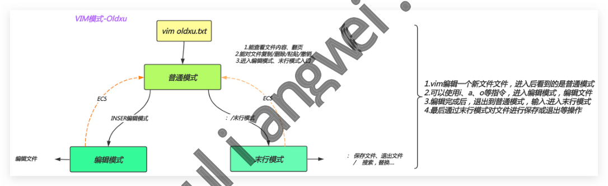

# 03 Linux文件编辑

## 03.Linux文件编辑

）03.Linux文件编辑 o1.VIM基本概述

### 1.1什么是vim

### 1.2为什么需要vim

### 11.3vi与vim的区别

### 11.4如何使用vim

o2.VIM模式使用 ·2.1普通模式

### 12.2编辑模式

### 12.3末行模式

·2.4视图模式 。3.VIM扩展知识 ·3.1vim配置环境变量

### 3.2vimdiff文件比对

■3.3vim异常退出处理 。4.VIM练习示例

### 4.1vim练习示例1

### 14.2vim练习示例2

徐亮伟，多年互联网运维工作经验，曾负责过大规模集群架构自动化运维管理工作。擅长 Web集群架构与自动化运维 鲁负责国内某大型电商运维工作。 架构师群：4714432

## 1.VIM基本概述

### 1.1 什么是vim

vi和vim是Linux下的一个文本编辑工具。（可以理解为windows的记事本，或Notepad++

### 1.2为什么需要vim

因为Linux一切皆为文件，而我们工作最多的就是修改某个服务的配置（其实就是修改文件内

容)。 也就是说如果没有vi/vim我们很多工作都无法完成。所以vim是学习linux最重要的命令之

### 1.3vi与vim的区别

vi和vim都是文本编辑器，只不过vim是vi的增强版，比vi多了语法高亮显示，其他 编辑功能几乎无差，所以使用vi还是vim取决个人习惯。 由于前期我们采用最小化安装操作系统所以没有vim命令，可以使用yuminstallvim进行安 装

### 1.4如何使用vim

在使用VIM之前，我们需要先介绍下VIM的三种模式：普通模式、编辑模式、末行模式 每种模式分别支持多种不同的快捷键，要想高效率地操作文本，就必须先搞清这三种模式的操作 区别以及模式之间的切换方法。 VIM模式-Oldxu vimoldxu.txt

## 1.能查看文件内容、翻页

gv

## 2.能对文件复制/删除/粘贴/微销

## 3.进入编辑模式、末行模式入

普通模式 ECS INSER编辑模式 保存文件、退出文件 末行模式 编辑模式 搜索，替换 ）VIM模式三种模式介绍 。1.普通模式、主要是控制光标移动，可对文本进行复制、粘贴、删除等工作。 ·使用mfilename编辑一个文件时，一进入该文件就是普通模式了。 个模式下，可以进行光标移动、复制、删除、粘贴操作。 o2.编辑模式：主要进行文本内容编辑和修改 ·从普通模式进入编辑模式，只需你按一个键即可i，I，a，A，o，0

当进入编辑模式时，会在屏幕的最下一行会出现INSERT标记 从编辑模式回到普通模式只需要按键盘左上方的ESC键即可。

## 03.末行模式：主要用于保存或退出文本。

在普通模式下，输入"：或者"/即可进入未行模式。 ·在命令该模式下，可进行的操作有，显示行号、搜索、替换、保存、退出。 ）4.小结：vim编辑打开文件整体流程如下：

## 11.默认打开文件处于普通模式

## 1.vim编辑一个新文件文件，进入后看到的是普通模式

## 2.可以使用i、a、o等指令，进入编辑模式，编辑文件

## 3.编辑完成后，退出到普通模式，输入：进入末行模式

## 4.最后通过末行模式对文件进行保存或退出等操作

## 12.从普通模式切换至编辑模式需要使用a、i、0

## 3.编辑模式修改完毕后需要先使用ECS返回普通模式

■4.在普通模式输入":"或"/"进入末行模式，可实现文件的保存与退出。 。注意：在vim中，无法直接从编辑模式切换到末行模式。

## 2.VIM模式使用

### 2.1普通模式

·普通模式，主要用于光标移动，复制，粘贴，删除，替换； #1。命令光标跳转 #光标跳转至末端 #光标跳转至顶端 #光标跳转至当前文件内的N行 #光标跳转至当前光标所在行的尾部 #光标跳转至当前光标所在行的首部 #2。文件内容较多 ctrl+f#往下翻页（行比较多） ctrl+b#往上翻页 #3.复制与粘贴 #复制当前光标所在的行 #复制当前光标以及光标向下4个 #粘贴至当前光标 #粘贴至当前光 #4。删除、剪贴、撤销 标所在的行 #删除 前光标所在的行以及往下的3行 #惠 前光标以后的所有行 #删除当前光标及光标以后的内容 #删除当前光标标记往后的字符 gg Ngg $ 01v yy 5yy p(小写) P(大写) pp 4dd 9p D X #删除当前光标标记往前的字符 X dd& p #剪贴、先删除dd（numberdd），后粘贴p #撤销上一次的操作 u #5.替换 #替换当前光标标记的单个字符 r #进入REPLACE模式，连续替换，ESC结束 R

### 2.2编辑模式

·编辑模式，主要用于编辑文件； #进入编辑模式，光标不做任何操作 i #进入编辑模式，将当前光标往后一位 a #进入编辑模式，并在当前光标下添加一行空白内容 #进入编辑模式，并且光标会跳转至本行的头部 I #进入编辑模式，将光标移动至本行的尾部 A #进入编辑模式，并在当前光标上添加一行空白内容

### 2.3末行模式

·末行模式，主要用于搜索，保存，退出文件； #1。文件保存与退出 保存当前状态 Iangw 强制保存当前状态 退出当前文档(文档必须保存才能退出) 强制退出文档不会修改当前内容 先保存，在退出 强制保存并退出 先保存，在退出 保存退出，shfit+zz :number跳转至对应的行号 #2.文件内容查找 /string#需要搜索的内容 #按搜索到的内容依欠往下进行查找 依次往上进行查找 #按搜索 #3.文件内容 #替换1-5行中包含sbin的内容为test est#g :1,5s#sbint :%s#sbin#test#g #替换整个文本文件中包含sbin的替换为test :W :w! b: ib: bm: ibM: :x ZZ n N :%s#sbin#test#gc #替换内容时时提示是否需要替换 #4。文件内容另存 :w/root/test.txt#将所有内容另存为/root/test.txt文件中 #5.文件内容读入 :r/etc/hosts#读入/etc/hosts文件至当前光标下面 :5r/etc/hosts#指定插入/etc/hosts文件至当前文件的第五行下面

### 2.4视图模式

·视图模式(从普通模式进入视图模式)，主要进行批量操作 ctrl+v进入可视块模式，选中需要注释的行

## 1.插入：按shift+i进入编辑模式，输入#,结束按ESC键

## 2.删除：选中内容后，按x或者d键删除

## 3.替换：选中需要替换的内容，按下r键，然后输入替换后的内容

shift+v进入可视行模式，选中整行内容

## 1.复制：选中行内容后按y键及可复制。

## 2.删除：选中行内容后按d键删除。

## 3.VIM扩展知识

### 3.1vim配置环境变量

·1.临时为打开的文件”显示行号“、“忽略大小写”等 不境 #显示行号 #忽略大小写，在搜索 为时候有用 #自动缩进 #显示制表待（空行、 tab键） #取消临时设定的变量 :set no[nu|ic|ai..] ·2.如果希望”显示行号" “忽略大小写”等；永久生效，需要将内容写入配置文件中； 。~/.vimrc个人环境变量，针对当前用户（优先级高) ）/etc/vimr全局环境变量，针对系统中所有用户 如果个人 环境没有配置，则使用全局vim环境变量配置。 如果个人 in环境和全局环境变量产生冲突，优先使用个人vim环境变量。 :set nu :set ic :set ai :set list # vim ~/.vimrc set nu set ic

### 3.2vimdiff文件比对

相同文件之间差异对比，通常用于对比修改前后差异

#文件对比 #diff #vimdiff #以vim方式打开两个文件对比，高亮显示不同的内容

### 3.3vim异常退出处理

当使用vim打开一个新的文件时，如果修改了文件内容，此时强制退出终端，则会造成异常现 象； #假设打开fiLename文件被以外关闭，需要删除同文件名的.swp文件即可解决 #rm -f.filename.swp

## 4.VIM练习示例

### 4.1vim练习示例1

。1.将/etc/passwd 复制到/root/目录下，并重命名为test.txt o2.用vim打开test.txt并显示行号 o3.分别向下、向右、向左、向右移动5个字符，分别向下、向上翻两页

## 4.把光标移动到行末，再移动到行首，移动到test.txt文件的最后一行，移动到文件的首

行 o5.搜索文件中出现的root并数一下一共出现多少个，不区分大小写搜索 ）6.把从第一行到第三行出现的root替换成--dd--，然后还原上一步操作\

## 7.把整个文件中所有的root替换成--dd--

）8.把光标移动到20行，删除本行，还原上一步操作

## 9.删除第19行，还原上一步操作

## 10.删除从5行到10行的所有内容，还原上一步操作

## 11.复制2行并粘贴到11行下面，还原上一步操作 (按两次u)

## 12.复制从11行到15行的内容并粘贴到8行上面，还原上一步操作 (按两次u)

需求： ）13.把13行到18行的内容移动文件的尾部，还原上一步操作（按两次u) o14.光标移动到首行，把/sbin/nologin改成/bin/bash ）15.在第一行下面插入新的一行，并输入"#Hello!"

## 016.保存文档并退出

### 4.2vim练习示例2

·需求：

。1.使用vim打开proxy.conf文件 o2.修改Listen为listen小写，并将8080修改为80 。3.修改ServerName为server_name小写。 o4.修改vim.EXAMPLE.com为vim.example.com o5.在server_name行下插入一行root/code; o5.复制5-14行的内容，然后将其粘贴到14行下面 o6.删除与proxy_set_header相关的两行全部删除 。7.如上操作完成后，在13-20行前面加上#号 o8.删除21-23的行，然后保存当前文件 [root@www ~]# cat proxy.conf server { Listen 8080; Server_Name vim.EXAMPLE.com; location/{ proxy_pass http://127.0.0.1:8080; proxy_set_header Host $http_host; proxy_set_header X-Forward-for; proxy_intercept_errors on; proxy_next_upstream error timeout; proxy_next_upstream_timeout 3s; proxy_next_upstream_tries 2; error_page 500502403 404 = location = /proxy_error.html { root/code/proxy; com 2Inx MMM
