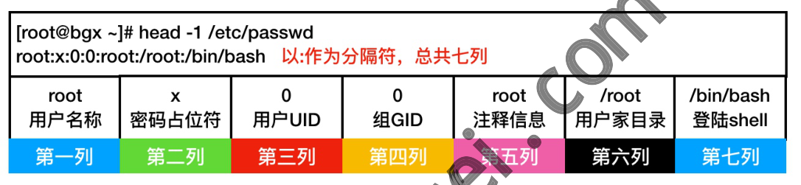
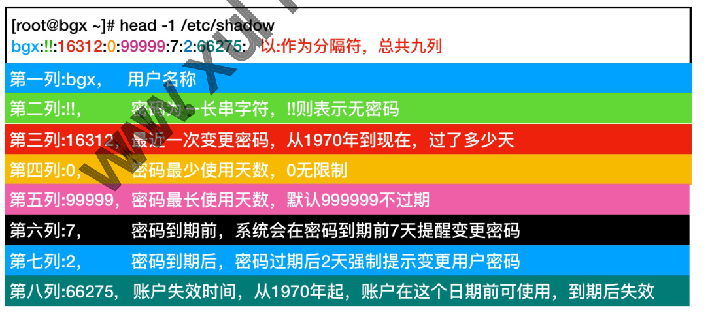
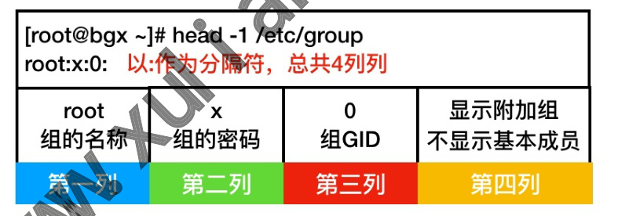
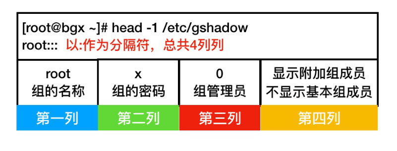
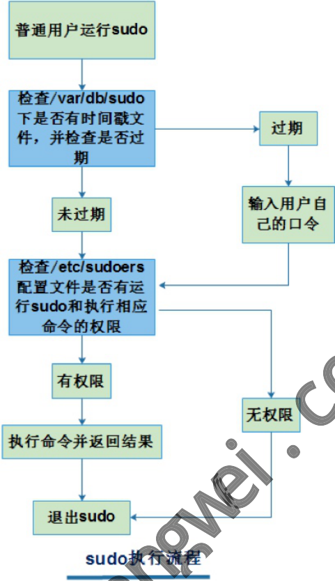

# 04 Linux用户管理

## 04.Linux用户管理

）04.Linux用户管理 。1.用户基本概述

### 1.1什么是用户

### 1.2为什么需要用户

### 1.3用户有哪些分类

### 1.3查询用户ID信息

）1.4用户相关配置文件 ·1.4.1 passwd文件

#### 11.4.2 shadow文件

。2.用户相关命令 ·2.1添加用户useradd ·2.1.1添加用户示例1 ·2.1.2添加用户示例2 ：2.2修改用户usermod MB ·2.2.1修改用户示例1 ■2.2.1修改用户示例2

### 2.3 删除用户userdel

■2.2.1删除用户示例1 ·2.2.1删除用户示例2

### 12.4设定密码passwd

■2.4.1交互设定密码

#### 2.4.2非交互设定密码

### 2.5系统创建用户流程

/etc/login.defs

#### 2.5.2/etc/default/useradd

#### 2.5.3用户环境变量丢失案例

。3.用户组基本概述

### 3.1什么是用户组

### 3.2组有几种类别

### 3.3组相关配置文件

·3.3.1 group文件 ·3.3.2gshadow文件 o4.用户组相关命令

### 4.1添加组groupadd

·4.1.1添加组示例1

#### 14.1.1添加组示例2

### 14.2修改组groupmod

·4.2.1修改组示例1 ■4.2.1修改组示例2

### 14.3删除组groupadd

■4.3.1删除组示例1 ·4.3.1删除组示例2

### 14.4用户与用户组场景

）5.普通用户无权限如何提权

### 15.1su命令身份切换

·5.1.1su切换身份 ■5.1.2Shell登陆分类 ■5.1.3环境变量配置文件

### 5.2sudo命令提权

#### 5.2.1sudo的由来

#### 5.2.2sudo快速起步

#### 5.2.3 sudo权限分配

#### 5.2.4sudo执行流程

#### 5.2.5sudo相关练习

徐亮伟，多年互联网运维工作经验，曾负责过大规模集群架构自动化运维管理工作。擅长 Web集群架构与自动化运维，曾负责国内某大型电商运维工作。 ）课程大体内容 。1.什么是用户？ 。2.为什么需要用户？

## 3.如何查看当前用户的详请？

## 04.创建用户会在系统的哪个配置中保存信息

）5.如何创建用户、删除用户、修改用户？ 。6.如何为用户设定密码，又如何修改密码？ ）7.用户的创建流程？ 。8.用户组如何管理？ ）9.普通用户无权限怎么办？切换身份or提权？

## 1.用户基本概述

### 1.1什么是用户

用户指的是能够正常登录Linux 或Windows系统，比如：登陆QQ的用户、登陆荣耀的用户、等 等

### 1.2为什么需要用户

·1.系统上的每一个进程(运行的程序)，都需要 要一个特定的用户运行； ·2.通常在公司是使用普通用户管理服务器，因为root权限过大，容易造成故障；

### 1.3用户有哪些分类

系统对用户有一个约定？ (约定娶你，就真的会娶嘛？tz) 系统中约定的含义 超级管理员，最高权限，有着极强的破坏能力 系统用户，用来运行系统自带的进程，默认已创建 系统用户，用来运行用户安装的程序，所以此类用户无需登录系统 用户UID 1~200 201~999 普通用户，正常可以登陆系统的用户，权限比较小，能执行的任务有限 1000+

### 1.3查询用户ID信息

·使用id命令查询当前登录用户的信息 #查看当前所登陆的用户信息 [root@web ~]# id uid=0(root） gid=0(root） groups=0(root) Superuser Group

[root@web~]#idxu#查看其它用户的信息 uid=1000(xu） gid=1000(xu) groups=1000(xu)

### 1.4用户相关配置文件

）当我们创建一个新的用户，系统会将用户的信息存放在/etc/passwd中，而密码单独存储 在/etc/shadow中也就是说这两个文件非常的重要，不要轻易删除与修改。

#### 1.4.1 passwd文件

/etc/passwd配置文件解释如下图，或者使用命令man5passwd获取帮助 [root@bgx~]# head-1 /etc/passwd root:x:0:0:root:/root:/bin/bash 以:作为分隔符，总共七列 /root root root X 注释信息 用户名称 密码占位符 用户UID 组GID 用户家目录 第三列 第五列 第一列 第二列 第四列 第六列

#### 1.4.2shadow文件

/etc/shadow配置文件解释如下图，或者使用命令man5shadow获取帮助 PS:使用change修改密码过期时间示例 [root@bgx~]#head-1/etc/shadow bgx::16312:0:99999:7:2:66275：以：作为分隔符，总共九列 用户名称 长串字符，！则表示无密码 第三列：16312最近一次变更密码，从1970年到现在，过了多少天 密码最少使用天数，0无限制 密码最长使用天数，默认999999不过期 第五列：99999，

## 2.用户相关命令

/bin/bash 登陆shell 第七列 第一列:bgx, 第二列：!, 第四列：0， 第六列:7, 密码到期前，系统会在密码到期前7天提醒变更密码 第七列：2, 密码到期后，密码过期后2天强制提示变更用户密码 第八列：66275，账户失效时间，从1970年起，账户在这个日期前可使用，到期后失效

### 2.1添加用户useradd

若想要添加Linux 系统普通用户，可以使用useradd 命令，使用root 账号登录Linux 系统 之后就可以添加系统普通用户了。 指定要创建用户的UID，不允许冲突 -U 指定要创建用户基本组 -G 指定要创建用户附加组，逗号隔开可添加多个附加组 指定要创建用户家目录 指定要创建用户的bashshell 指定要创建用户注释信息 给创建的用户不创建家目录 创建系统账户，默认无家目录

#### 2.1.1添加用户示例1

）创建oldxu用户 。用户ID为6969 。基本组为ops，附加组 dev student，登陆 shell:/bin/bash 。注释信息2000new [root@web~]# grg [root@web ~]# dev [root@web ~ nxpo ysbq/ua/ s-"zuapnzs ooo3-ap5- sdob-toos n-pp

#### 2.1.2添加用户示例2

-d -S -C -M ·创建一个 mysql 系统用户 。该用户不需要家目录 。该用户不需要登陆系统 [root@web ~]# useradd -r dba -M -s /sbin/nologin

### 2.2修改用户usermod

若想要修改Linux 系统普通用户，可以使用usermod 命令，使用root 账号登录Linux 系统 之后就可以修改系统普通用户了。 指定修改用户的UID -U 指定要修改用户基本组 指定要修改用户附加组，使用逗号隔开多个附加组，覆盖原有的附加组 -G 指定要修改用户家目录 指定要修改用户的bashshell 指定要修改用户注释信息 指定要修改用户的登陆名 指定要锁定的用户 指定要解锁的用户

#### 2.2.1修改用户示例1

）修改oldxu用户 ）uid为5008， 。基本组为network附加组为ops,dev,sa 注释信息为student，登陆名称为new_oldxu [root@web paddnetwork -d -S -C -1 -L -U [root@web

#### 2.2.1修改用户示例2

·修改 new_oldxu用户 o为new_oldxu配置密码 。锁定该用户，然后测试远程连接登陆 o解锁该用户然后再次测试远程连接登陆 #锁定用户

[root@web ~]# usermod -L new_oldxu #解锁用户 [root@web ~]# usermod -U new_oldxu

### 2.3删除用户userdel

若想要删除Linux 系统普通用户，可以使用userdel命令，使用root 账号登录Linux 系统 之后就可以删除系统普通用户了

#### 2.2.1删除用户示例1

删除new_oldxu用户 。连同家目录一起删除 [root@web ~]# userdel -r new_oldxu

#### 2.2.1删除用户示例2

·批量系统中此前创建过的所有无用的用户 o使用awk提取无用的用户名称 o使用sed拼接删除用户的命令 o调用userdel命令，连同家自录一起全部删除 1000{print $1}'/etc/passwd /sed -r's#(.*)#userdel -r [root@web~]# awk -F \1#g'|bash

### 2.4设定密码passwd

，创建用户后，如需要使用该用户进行远程登陆系统则需要为用户设定密码，设定密码使用 passwd 。1.普通用户只允许变更自己的密码，无法修改其他人密码，并且密码长度必须8位字符 。2.管理员用户允许修改任何人的密码，无论密码长度多长或多短。 ·注意：为普通用户设定密码，普通用户才可正常登录系统： 。普通用户不可以变更系统的状态； (权限不够) 。如果将“软件|系统"的权限分配给该普通用户，普通才可以变更相应配置状态；

#### 2.4.1交互设定密码

）通过交互方式为用户设定密码 [root@web ~]# passwd #给当前用户修改密码 [root@web ~]# passwd root #给root用户修改密码 [root@web～]#passwdoLdxu#给oLdboy用户修改密码，普通用户只能自己修改自己

#### 2.4.2非交互设定密码

·非交互式设定简单密码 ·非交互式设定随机密码 [root@web ~]# yum install -y expect [root@web ~]# echo $(mkpasswd -L 10 -d 2 -c2 /tee pass.txt/ passwd --st -S4)

### 2.5系统创建用户流程

）系统在创建用户时，会参考如下两个配置文件： 0/etc/login.defs /etc/defaults/useradc 如果在创建用户时指定了参数则会覆盖系统默认的配置，如果没有指定参数则遵循默认配置 建立用户；

#### 2.5.1 /etc/login.defs

主要定义了创建用户时UID划分规则，密码加密类型，是否创建家目录 /etc/login efs: din oldxu 等； /var/spool/mail MAIL_DIR 99999 PASS_MAX_DAYS PASS_MIN_DAYS PASS_MIN_LEN PASS_WARN_AGE 1000 UID_MIN UID_MAX 60000 SYS_UID_MIN

SYS_UID_MAX GID_MIN 1000 GID_MAX 60000 SYS_GID_MIN SYS_GID_MAX CREATE_HOME yes UMASK USERGROUPS_ENAB yes ENCRYPT_METHOD SHA512

#### 2.5.2 /etc/default/useradd

/etc/default/useradd主要定义 。创建家目录位置； 默认用户的Shel1类型； 默认从哪个位置拷贝环境变量； ）是否创建用户同名邮箱等； [root@web~]#cat/etc/default/useradd #把用户的家目录建在/hon HOME=/home #是否启用账号过期停权 不启用 INACTIVE=-1 #账号终止日期，不设置表示不启用 #新用户默认所有的she以类型 SHELL=/bin/bash #配置新用家目录的默认文件存放路径 SKEL=/etc/skel #创建man 文件 CREATE_MAIL_SPOOL=yeS

#### 2.5.3用户环境变量丢失案例

当我们不小心在当前用户家自录下执行rm-rf.*后，再次登陆系统会发现提示符变成了- bash-4.1$，那是因为我们删除了当前用户的环境变量造成的现象，通过如下方式即可恢复； -bash-4.1$ cp -a /etc/skel/.bash* ./ -bash-4.1$ exit GROUP=100 EXPIRE= [root@web ~]# 默认linux创建用户，会从/etc/ske1目录中拷贝对应的环境变量，由 /etc/defaults/useradd配置文件定义，所以只需要从该目录中拷贝相应的环境变量文件即可恢 复故障；

## 3.用户组基本概述

### 3.1什么是用户组

）组是一种逻辑层面的定义 ）逻辑上将多个用户归纳至一个组，当我们对组操作，其实就相当于对组中的所有用户进行操 作。

### 3.2组有几种类别

）对于用户来说，组分为如下几类 。默认组：创建用户时不指定组，则默认创建与用户同名的组； 。基本组：用户有且只能有一个基本组，创建时可通过-g指定（亲爹) ）附加组：用户可以有多个附加组，创建时通过-G指定 (干爹)

### 3.3组相关配置文件

两个文件中，重点关注group 组账户信息保存在/etc/group和/etc/gshadow

#### 3.3.1 group文件

/etc/group配置文件解释如下图 [root@bgx ~]# head -1 /etc/group root:x:0：以：作为分隔符，总共4列列 root 显示附加组 X 组的名称 组的密码 组GID 不显示基本成员 第三列 第二列 第四列

#### 3.3.2 gshadow文件

/etc/gshadow配置文件解释如下图

## 4.用户组相关命令

### 4.1 添加组groupadd

若想要添加Linux用户组，可以使用groupadd命令，使用root账号登录Linux系统之后就 可以添加用户组了。 如果组已经存在，会提示成功创建的状态 为新组设置GID，若GID已经存在会提示GID已经存在 创建一个系统组

#### 4.1.1添加组示例1

）添加—个salary 的组 。为组设定 gid为 10000 roupaddsalary-g10000 ail-1/etc/group salary:x:10000: -f [root@web [root@web

#### 4.1.1添加组示例2

·添加一个salary_2的组 。添加为系统组 [root@web ~]# groupadd -r salary_2 [root@web~]# tail -1/etc/group [root@bgx ~]# head -1 /etc/gshadow root：以:作为分隔符，总共4列列 显示附加组成员 root 组的名称 组的密码 组管理员 不显示基本组成员 第一列 第二列 第三列 第四列

salary_2:x:988:

### 4.2 修改组groupmod

若想要修改Linux用户组，可以使用groupmod 命令，使用root 账号登录Linux 系统之后就 可以修改用户组了。 如果组已经存在，会提示成功创建的状态 -f 为新组设置GID，若GID已经存在会提示GID已经存在 创建一个系统组 改名为新的组

#### 4.2.1修改组示例1

）修改salary用户组组名为system [root@web~]# groupmod-n system salar [root@web ~]# tail -1 /etc/group system:x:10000:

#### 4.2.1修改组示例2

修改system用户组GID为5000 [root@web ~] dsystem-g5000 nod -1 /etc/group system: x 5000: -r -n [root@web

### 4.3删除组groupadd

若想要修改Linux 用户组，可以使用groupdel命令，使用root 账号登录Linux系统之后就 可以修改用户组了。

#### 4.3.1删除组示例1

）删除salary_2系统用户组

[root@web ~]# groupdel salary_2

#### 4.3.1删除组示例2

）创建tom 用户，设置主组为system，然后测试删除system 组 [root@web ~]# useradd tom -g system [root@web~]# groupdel system groupdel: cannot remove the primary group of user 'tom' #如果组中存在用户是无法删除该组，必先删除用户后在删除组 [root@web ~]# userdel-r tom [root@web ~]# groupdel system

### 4.4用户与用户组场景

·1.创建dev与ops两个组; ·2.创建bob用户，设定基本为dev，密码为123 ）3.创建alice用户，设定基本为ops，密码为 ·4.创建/opt/reosurce 文件，然后修改属组为ops、权限为 664

## 5.测试发现alice用户可以读写，而bob用户仅可以查看；

## 6.现在希望bob也能够对文件进行读写，如何快速实现（为bob添加ops附加组）；

## 1.创建组与用户；

[root@web~]# groupade [root@web ~]# groupadd [root@web~]# bob-gdev [root@web~] alice-g ops

## 2.为用户设定登陆密码；

[root@web~]# echo"123"|P passwd --stdin bob [root@web~]# echo"123" passwd --stdin alice

## 3.建立文件，然后分配好权限（可先不理解，照着敲）；

[root@web ~]# echo "data">/opt/resource [root@web ~]# chgrp ops /opt/resource

[root@web~]#chmod 664/opt/resource

## 4.使用ops组的alice用户测试读和写权限，没有任何问题；

[alice@web~]$ echo"alice-data">>/opt/resource [alice@web ~]$ cat /opt/resource data alice-data

## 5.使用dev组的bob用户测试读和写权限，发现只有读权限，没有写权限；

[bob@web ~]$ echo"bob-data">>/opt/resource -bash：/opt/resource：权限不够 [bob@web ~]$ cat/opt/resource alice-data

## 6.为bob 用户添加ops 附加组，这样 bob 用户就能借助ops 纟

组权限，实现读写操作； [root@web ~]# usermod bob -G ops [root@web~]#id bob uid=1002(bob) gid=2020(dev) groups=2020(dev),2021(ops)

## 7.再次测试，发现bob用户能借助ops组实现读和写操作;

[bob@web ~]$ echo "bob-data" >>/opt/resource [bob@web ~]$ cat /opt/resource alice-data data data bob-data

## 5.普通用户无权限如何提权

往往公司的服务器对外都是禁止root用户直接登录，所以我们通常使用的都是普通用户，那么 问题来了？当我们使用普通用户执行/sbin目录下的命令时，会发现没有权限，这种情况会造 成无法正常管理服务器，那如何才能不使用root用户直接登录系统，同时又保证普通用户能完 成日常工作呢？ ·我们可以使用如下两种方式：su、sudo

。1.su switch user 身份切换，使用普通用户登录，然后使用su 命令切换到root ■优点：简单 ■缺点：需要知道root密码 。2.sudo提权，当需要使用root权限时进行提权，而无需切换至root用户 ·优点：安全、方便、 缺点：需要预先定义规则、较为复杂

### 5.1su命令身份切换

·使用su命令可以实现身份的快速切换；

#### 5.1.1su切换身份

su－username切换身份【属于登陆式Shell】 suusername切换身份【属于非登陆式Shell】

## 1.普通用使用su切换到root用户，需要输入root超级管理员密码；

[oldxu@web ~]$ su- root [root@node1 ~]# pwd

## 2.以某个用户的身份执行某个服务，使用命令su-cusername

[root@web~]#su-oldx config [root@web ~]# su - old

#### 5.1.2Shell登陆分类

需要输入用户名和密码才能进入Shel1日常接触的最多的一种 ·登陆she1l ）非登陆 shell：不需要输入用户和密码就能进入Shell，比如运行bash会开启一个新的 密码： /root 会话 ）登陆式Shel1与非登陆式Shell，它们最大的区别就在于加载的环境变量不一样； o登录式shell配置文件加载顺序：/etc/profile->/etc/profile.d/*.sh- >~/.bash_profile->~/.bashrc->/etc/bashrc o非登录式shell配置文件加载顺序：/.bashrc->/etc/bashrc->/etc/profile.d/*.sh

#### 5.1.3环境变量配置文件

profile类文件：设定环境变量，登陆前运行的脚本和命令 bashrc类文件：设定本地变量，定义命令别名 用户配置文件： ~/.bash_profile o~/.bashrc ）全局环境变量： /etc/profile /etc/profile.d/*.sh /etc/bashrc

### 5.2sudo命令提权

#### 5.2.1sudo的由来

su命令在用户身份切换时，需要拿到root管理员密码；在多人协作时，如果当中某个用户不 小心泄露了root密码；那系统会变得非常不安全，为了改进这个问题，从而就有了sudo； 当需要执行一些特权操作时，进行发 其实sudo就是给某个普通用户埋下了浩克hulk的种子 怒，获取最高权限，但正常情况下还是普通用户，任然会受到系统的约束以及限制；

#### 5.2.2sudo快速起步

●快速配置sudo方式[先睹为快]

## 1.将用户加入wheel组，默认wheel组有sudo权限；

[root@node1~]#usermodoldxu-Gwheel

## 2.切换到普通用户身份；

[root@web ~]# su - oldxu

## 3.普通用户正常情况下无法删除/opt目录；

[oldxu@web ~]$ rm -rf /opt/ rm:cannot remove/opt:Permission denied

## 4.使用sudo提权，然后输入普通用户密码，会发现能正常删除无权限的／opt目录；

[oldxu@web ~]$ sudo rm -rf /opt

## 5.后期可以通过审计日志查看普通用户提权都执行了什么操作；

[root@web~]# tail-f/var/log/secure

#### 5.2.3sudo权限分配

）通过快速提权的方式，我们会发现通过sudo什么操作都可以执行，能否有办法限制仅开启 某个命令的使用权限；其他命令不允许； ）实现架构图如下： o用户-->组-->命令集

## 1.创建用户、并为用户设定对应的密码；

[root@www~]# useradc [root@www ~]# userada [root@www ~]# dev1 [root@www ~] dev2 passwd --stdin ops1 d --stdin ops2 [root@www ~]# echo passwd "1" "1" [root@www [root@www ~]# echo --stdindev1 passwd [root@www ~]# echo "1" passwd--stdindev2

## 2.在/etc/sudoers文件中配置规则

[root@web ~]# visudo #1.使用sudo定义的逻辑分组，这个系统group没关系； User_Alias OPS = ops1,ops2 User_Alias DEV = dev1,dev2

#2.将相同命令逻辑上划分为一个命令集； Cmnd_Alias NETwORKING = /sbin/ifconfig,/bin/ping Cmnd_Alias SOFTWARE = /bin/rpm,/usr/bin/yum Cmnd_Alias SERVICES=/sbin/service,/usr/bin/systemctl start Cmnd_Alias STORAGE=/bin/mount，/bin/umount Cmnd_Alias DELEGATING = /bin/chown,/bin/chmod,/bin/chgrp Cmnd_Alias PRocESSES = /bin/nice,/bin/kill,/usr/bin/kill,/usr/bin/killall #3。进行权限划分；为OPS/DEV组分配对应的命令集名称； 5ALL=(ALL） NETWORKING,SOFTWARE,SERVICES,STORAGE,DELEGATING,PROCESSES OPS ALL=(ALL） SOFTWARE,PROCESSES DEV

## 3.然后登陆对应的用户检查相应的sudo权限；

#检查ops用户sudo权限 [ops1@web~]# sudo-L [sudo] password for ops1: User ops1 may run the following commands on web: (ALL）/sbin/ifconfig,/bin/ping,/bin/rpm, r/bin/yum,/sbin/service, /usr/bin/systemctl start,/bin/mount,/bin/umount /bin/chown,/bin/chmod,/bin/chgrp,/bin/n /bin/kill,/usr/bin/kill,/usr/bin/ki #检查dev用户sudo权限 [dev1@web ~]# sudo -L [sudo] password for dev1: User dev1 may run the followii ingcommandsonweb: (ALL) /bin/rpm, /usr/bin/yum, /bin/nice, /bin/kill, /usr/bin/kill, /usr/bin/kil

#### 5.2.4sudo执行流程

sudo命令执行流程如下 llall lall o1）普通用户执行sudo命令时，会检查/var/db/sudo是否存在时间戳缓存； 。2)如果存在则不需要输入密码，否则需要输入用户与密码； 。3)输入密码会检测是否该用户是否拥有该权限； o4)如果有则执行，否则报错退出；

行sudo和执行相应 命令的权限 有权限 无权限 执行命令并返回结果 退出sudo sudo执行流程 sudo不支持系统内置命令

#### 5.2.5sudo相关练习

## 1.授予jack用户能通过sudo执行ls,sed,awk命令权限如何书写

jack ALL=(AL bin/ls,/bin/sed,/bin/awk

## 2.授予alice 用户，sudo执行linux所有命令并且不用输入密码如何书写

alice ALL=(ALL) NOPASSWD :ALL

## 3.授权oldxu 用户，sudo 执行passwd命令修改任何用户的密码，但唯独不能修改root用

户的密码； oldxu ALL=(ALL) /bin/passwd [a-z]*,!/bin/passwd root 普通用户运行sudo 检查/var/db/sudo 下是否有时间戳文 过期 件，并检查是否过 期 输入用户自 未过期 己的口令 检查/etc/sudoers 配置文件是否有运

www xul i angvei . com
