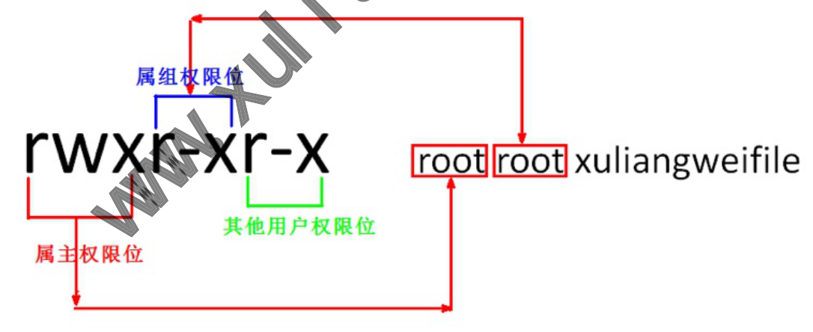
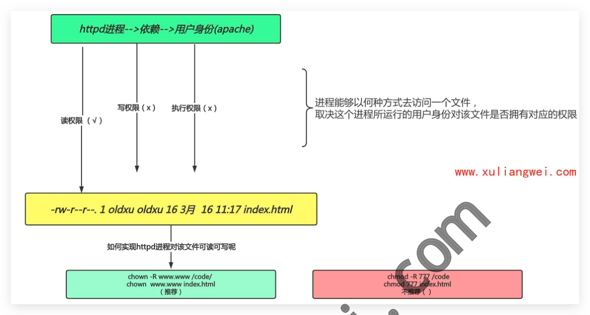
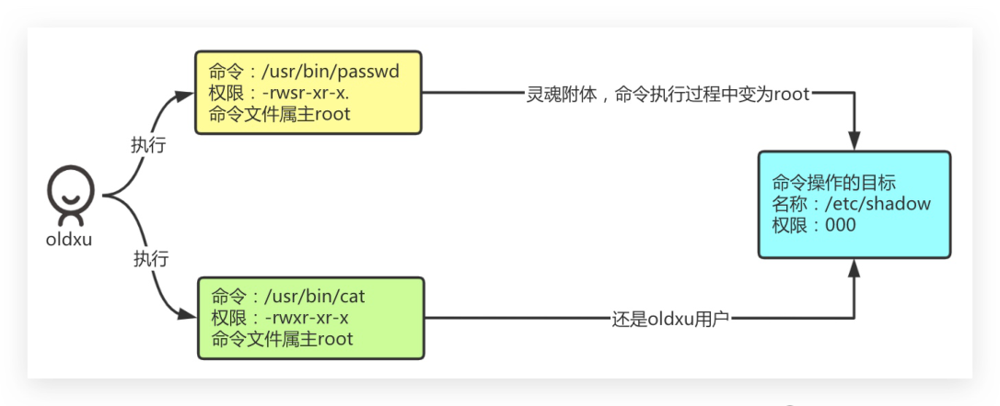

# 05 Linux权限管理

## 05.Linux权限管理

）05.Linux权限管理 。1.文件权限介绍

### 1.1什么是权限

### 1.2为什么需要权限

### 11.3权限与用户的关系

### 1.4权限中rwx的含义

o2.修改文件权限 ■2.1修改权限的意义

### 12.2如何修改权限

·2.2.1UGO方式 ·2.2.1NUM方式 ·2.2.3权限设定案例 ：2.3权限对文件的影响 ·2.3.1验证r权限 ngw

#### 12.3.2验证w权限

·2.3.3验证x权限

#### 2.3.4文件权限总结

### 2.4权限对目录的影响

·2.4.1验证r权限 ·2.4.2验证w权限

#### 2.4.3验证×权限

#### 2.4.4目录权限小结

。3.修改文件所属关系

### 3.1修改文件所属关系的意义

.2如何修改文件的所属关系

#### 3.2.1 chown (change owner)

#### 3.2.2 chgrp (change group)

·3.3修改文件所属关系场景 ·3.3.1基于Httpd场景说明 ·3.3.2基于Httpd场景实践

### 3.4权限相关练习

。4.文件特殊权限

### 4.1特殊权限SUID

·4.1.1SUID产生背景

#### 14.1.2SUID配置语法

#### 14.1.3SUID作用总结

### 14.2特殊权限SGID

#### 14.2.1什么是SGID

·4.2.2SGID配置语法

#### 14.2.3SGID场景说明

### 14.3特殊权限SBIT

#### 14.3.1什么是SBIT

#### 4.3.2SBIT配置示例

#### 4.3.3SBIT使用场景

#### 14.3.2SBIT作用总结

### 14.4特殊权限相关练习

o5.文件特殊属性

### 5.1什么是特殊属性

！5.2特殊属性的作用 ：5.3特殊属性如何配置 ·5.4特殊属性场景示例 ）6.文件默认权限

### 16.1什么是默认权限

### 6.2默认权限的由来

### 6.3系统默认权限配置文件

### 6.4默认权限的计算公式

曾负责过大规模集群架构自动化运维管理工作。擅长 徐亮伟，多年互联网运维工作经验 圭，曾负责国内某大型电商运维工作。 Web集群架构与自动化运维， 累计受益数万人。 ·本章课程内容> ）1.什么是权限？ 。2.为什么要使用权限？ o3.权限与用户之间的关系？ o4.权限中的rwx是干什么的？ ）5.验证权限rwx对文件和对目录的含义？ 。6.如何变更一个文件至其他用户？ ）7.特殊权限与基本权限有什么区别？

## 8.特殊权限suid、sgid、sbit是干什么的?

o9.特殊属性chattr、1sattr o10.进程掩码umask是个啥？

## 1.文件权限介绍

### 1.1什么是权限

·权限是用来约束用户能对系统所做的操作。 ，或者说，权限是指某个特定的用户具有特定的系统资源使用权力。

### 1.2为什么需要权限

Linux是一个多用户系统，对于每一个用户来说，个人隐私的保护十分重要，所以需要进行 权限划分； 。1.安全性：降低误删除风险、减少人为造成故障以及数据泄露等风险 。2.数据隔离：不同的权限能看到、以及操作不同的数据（比如员工薪资表）； o3.职责明确：电商场景客服只能查看投诉、无法查阅店铺收益，运营则能看到投诉以及 店铺收益；

### 1.3权限与用户的关系

·在Linux系统中，权限是用来定义用户能做什 不能做什么。 o1.针对文件定义了三种身份，分别是属王owner、属组group、其他人others 。2.每种身份又对应三种权限，分别是读read、写write、执行execute 属组权限位 rwxr-xr-x 其他用户权限位 属主权限位

）当一个用户访问文件流程如下 。1)判断用户是否为文件属主，如果是则按属主权限进行访问 。2)判断用户是否为文件属组，如果是则按属组权限进行访问 03)如果不是文件属主、也不是该文件属组，则按其他人权限进行访问

### 1.4权限中rwx的含义

linux 中权限是由，rwxr-xr-× 这9位字符来表示; ·主要控制文件的属主User、属组Group、其他用户other 字母 含义 二进制 八进制权限表示法 读取权限 r-- 写入权限 -W- 执行权限 --X 没有权限 文件权限示例1：rwxrw-r--alice hrfile1.txt ）Q1：alice对file1.txt文件拥有什么权限？ Q3：tom 对file1.txt 文件有什么权限? 文件权限示例2：rw-r--- -rootdev file2.txt ）Q1：root对file2.txt文件拥有什么权限？ Q3：alice对file2.txt 文件有什么权限？ ）文件权限示例3：rwxr--rwx jack ops f1le3.txt Q1：jack对file3.txt文件拥有什么权限？ Q2：tom 对file3.txt文件有什么权限?前提：tom 附加组为ops 组 Q3：alice 对 file2.txt1 文件有什么权限？

## 2.修改文件权限

### 2.1修改权限的意义

·简单来说就是：赋于某个用户或组-->能够以何种方式（读写执行）--〉访问文件

### 2.2如何修改权限

）修改权限使用chmod（changemode）命令来实现 。对于root用户而言，可以修改任何人的文件权限； 。对于普通用户仅仅只能变更属于自己的文件权限； O o

#### 2.2.1UGO方式

·给文件所有人添加读写执行权限 [root@web ~]# chmod a=rwx file ）取消文件的所有权限 [root@web ~]# chmod a=-rwx file ·属主读写执行，属组读写，其他人无权限 [root@web ~]# chmod u=rwx,g=rw,o=- file ·属主属组读写执行，其他人读权限 [root@web~]# chmod ug=rwx,o=r file angy

#### 2.2.1NUM方式

）设定文件权限644， rw- [root@web ~]# chmod 644 ）设定文件权限600 600file ·设定目录权限为755，递归授权 rwx-r-xr-x [root@web~]# chmod -R 755 dir

#### 2.2.3权限设定案例

·场景1：针对hr部门的访问目录/data/hr设置权限，要求如下： o1.超级管理员root用户和hr组的员工可以读、写、执行。

## 02.其他用户或者组没有任何权限。

[root@web~]# groupadd hr [root@web ~]# useradd hr01 -G hr [root@web ~]# useradd hr02 -G hr [root@web ~]# mkdir /home/hr [root@web ~]# chgrp hr/home/hr [root@web~]# chmod 770/home/hr ·场景2: 在Linux中权限设定对文件和对目录的影响是有区别的。 权限 对目录的影响 对文件的影响 读取权限（r 具有浏览目录及子自录 具有读取\阅读文件内容权限 写入权限（w 具有新增、修改文件内容的 有增加和删除目录内的文件 权限 执行权限（x 真有访问目录的内容（取决于目录中文件 具有执行文件的权限 权限)

### 2.3权限对文件的影响

#### 2.3.1验证r权限

）使用root身份，<新建文件 ）切换普通用户 测试普通用户对该文件是否拥有可读权限 测试普通用户对该文件是否拥有执行和删除权限 ） [root@web~]# echo"date">/opt/file [root@web~]#LL filename -rw-r--r-- 1 root root 5 Jan 24 08:24 filename #切换普通身份 [root@web ~]# su - oldxu #查看 [oldxu@web~]$ cat/opt/filename date

#删除 [oldxu@ansible-hostname ~]$ rm -f /opt/file rm: cannot remove '/opt/file': Permission denied

#### 2.3.2验证w权限

）修改权限只有w 。测试能否查看文件 测试能否写入数据至文件 。测试能否删除文件 [root@web ~]# chmod 642 /opt/file [oldxu@ansible-hostname ~]$ cat /opt/file cat:/opt/file: Permission denied [oldxu@ansible-hostname ~]$ vim /opt/file 不足 opt/file [oldxu@ansible-hostname ~]$ echo "date" [oldxu@ansible-hostname ~]$ rm -f 7opt/file rm: cannot remove '/opt/file':Permission denied

#### 2.3.3验证x权限

·修改权限只有 。测试能否查看文件 测试能态写入数据至文件 测试能否删除文件 。测试能否读取文件 #修订权限 #查看 #写入 #删除 #修订权限 [root@web~]# chmod 641/opt/file #查看 [oldxu@ansible-hostname ~]$ cat /opt/file cat:/opt/file:Permission denied #写入

[oldxu@ansible-hostname~]$ vim/opt/file# 权限不足 [oldxu@ansible-hostname ~]$ echo "date" >> /opt/file #删除 [oldxu@ansible-hostname ~]$ rm -f /opt/file rm: cannot remove '/opt/file': Permission denied #执行（因为没有读，所以无法执行） [oldxu@ansible-hostname ~]$ /opt/file -bash：/opt/file：权限不够

#### 2.3.4文件权限总结

）1.读取权限r：具有读取、阅读文件内容权限 o只能使用查看类命令cat、head、tail、less、more

## 2.写入权限w：具有新增、修改文件内容的权限

。2.1）使用vim会提示权限拒绝，但可强制保存，会覆盖文件的所有内容； o2.2）使用echo命令重定向的方式可以往文件内写入数据，>>可以追加内容 。2.3）使用rm无法删除文件，因为删除文件需要看上级目录是否有w的权限 ）3.执行权限×：具有执行文件的权限 。3.1）执行权限什么用都没有 。3.2）如果普通用户需要执行文件，需要配合r权限 ）4.文件权限设定常见组合： 。4.1）文件r权限，只给用户查看，无其他操作; o4.2）文件rw权限，可以查看和编辑文件内容； o4.3）文件rx权限，允许查看和执行文件、但不能修改文件； 。4.4）文件rwx 权限，能读、能写、能执行、不能删除;

### 2.4权限对目录的影响

#### 2.4.1验证r权限

·使用root身份，新建目录，修订权限为774 。在目录中创建一个普通文件 。测试是否能查看目录中内容 o测试能否能进入该目录 [root@web~]# mkdir/data [root@web~]#echo"123">/data/file [root@web~]# chmod 774/data/

#测试查看目录内容 [oldxu@ansible-hostname ~]$ ls /data/ ls: cannot access /data/file: Permission denied file #测试进入目录 [oldxu@ansible-hostname ~]$ cd /data/ -bash：cd：/data/：权限不够

#### 2.4.2验证w权限

）使用root身份，修订权限为772 。测试是否能查看目录中内容 。测试是否能删除目录中文件 [root@web~]# chmod 772/data/ [oldxu@ansible-hostname ~]$ ls /data/ ls:cannot open directory /data/:Permission [oldxu@ansible-hostname ~]$ cd /dat -bash：cd：/data/：权限不够 [oldxu@ansible-hostname ~]$ f/data/file rm: cannot remove '/data/file Permission denied

#### 2.4.3验证x权限

身份，修订权限为771 使用root 。测试是否能查看目录中内容 。测试能否进入目录中 #修订权限 #测试查看 #测试进入 #测试删除 #修订权限 [root@web~]#chmod771/data/ #测试查看 [oldxu@ansible-hostname ~]$ ls /data/ ls: cannot open directory /data/: Permission denied #测试进入

[oldxu@ansible-hostname ~]$ cd /data/ [oldxu@ansible-hostname data]$

#### 2.4.4目录权限小结

·1.读取权限r：具有浏览目录及子目录权限 。1.1）使用1s命令浏览目录及子目录，但同时也会提示权限拒绝 。1.2）使用1s-1命令浏览目录及子目录，文件属性会带问号，并且只能看到文件名 ·2.写入权限w：具有增加、删除或修改目录内文件名权限，需要×权限配合 。2.1）可以在目录内创建文件，删除文件(跟文件本身权限无关) o2.2）不能进入目录、不能复制目录、不能删除目录、不能移动目录

## 3.执行权限×：具有执行文件的权限

。3.1）只能进入目录 。3.2）不能浏览、复制、移动、删除

## 4.目录权限设定小结

o目录rx权限，允许浏览目录内文件以及子目录，不允许在该目录下创建文件、删除文 件 ）目录rw权限，能查看目录，能往目录写入文件，但无法进入目录-->（使用情况太 少) o目录rwx权限，

## 3.修改文件所属关系

### 3.1修改文件所属关系的意义

）修改文件所属关系的意义是什么？ 。假设：alice用户现在有很多房产，希望将其中某一套出售给jack用户变现：

## 1.通过root用户变更属主关系，将房产默认属主身份alice修改为jack；

2修改完成后该房产拥有人则为jack用户，而不在是alice用户；

chown

### 3.2如何修改文件的所属关系

可以使用chown（change owner）、chgrp（change group）命令实现。 chown能变更文件的属主和属组； chgrp 仅能变更文件的属组;

#### 3.2.1 chown (change owner)

## 1.准备环境，创建文件和目录

[root@web ~]# mkdir /data

## 2.修改所属主为bin

[root@web ~]# chown bin /data

## 3.修改所属组为adm

[root@web ~]# chown .adm /data 并进行递归授权

## 4.修改目录所属主为root，所属组为

[root@web ~]# chown -R root

#### 3.2.2 chgrp (change group)

## 1.准备环境，创建文件和目录

mkdir/data2

## 2.修改所属组为adm

[root@web~]#chgrpadm/data

### 3.3修改文件所属关系场景

#### 3.3.1基于Httpd场景说明

-rw-r--r--.1oldxuoldxu163月1611:17index.html 如何实现httpd进程对该文件可读可写呢 chown-Rwww.www/code/ chmod-R777/code chmod /7index.html chownwww.wwwindex.html （推荐） 不推荐

#### 3.3.2基于Httpd场景实践

[root@web ~]# setenforce 0 [root@web ~]# systemctl stop firewall [root@web ~]# yum instalk ht [root@web ~]# systemctL httpd

## 2.在默认站点目录创建文件，修订其权限，然后验证是否能访问成功；

Cho"New Web Site">/var/www/html/index.html chmod60o/var/www/html/index.html [root@web~]# Ll /var/www/html/index.html

## 1.安装 httpd

.1rootroot224月2117:27/var/www/html/index.html

## 3.无法访问，解决提示权限不足，有如下两种方式；

#方法一： [root@web~]#chmod 777/var/www/html/index.html httpd进程-->依赖-->用户身份（apache) 进程能够以何种方式去访问一个文件， 写权限（×） 执行权限（×） 取决这个进程所运行的用户身份对该文件是否拥有对应的权限 读权限（√）

#方法二： [root@web ~]# ps -ef Igrep httpd 00:0O:O0 /usr/sbin/httpd -DFOREGROUND 2418 root 0 14:07? apache 2419 014:07 00:O0:O0 /usr/sbin/httpd -DFOREGROUND 2418 apache 0 14:07 2420 2418 00:00:O0 /usr/sbin/httpd -DFOREGROUND apache 2421 2418 0 14:07 00:OO:O0/usr/sbin/httpd-DFOREGROUND ? apache 2422 014:07 2418 00:OO:O0/usr/sbin/httpd-DFOREGROUND [root@web ~]# chown apache.apache/var/www/html/index.html [root@web~]#chmod 600/var/www/html/index.html

### 3.4权限相关练习

·场景1，需求如下: o1.创建 project_a，prohect_b 两个组, o2.创建用户a1、a2、b1、b2四个用户； o3.将用户a1、a2添加到project_a组，用户b1、b2 添加到project_b 组； o4.所有目录以及文件都保存在/a11目录下； o5.在/all目录下创建两个项目目录，分别为project_a、prohect_b ）6.在每个项目下创建一个与用户同名的目录 。7.各个项目之间不可以互相访问（projecta 项目不可访问prohect_b）； 可以修改; #需求1-需求3 [root@web ~]# groupadd [root@web~]# groupadd a1-G project_a [root@web ~]# use a2 -G project_a [root@web ~]# dd b1-Gproject_b eraddb2-Gproject_b #需求4-需求6 [root@web ~]# mkdir /all [root@web ~]# mkdir /all/{project_a,project_b} -p [root@web ~]# mkdir /alL/project_a/{a1,a2} -p [root@web ~]# mkdir /alL/project_b/{b1,b2} -p #需求7 [root@web ~]# chmod -R 770 /all/project_a [root@web ~]# chmod -R 770 /all/project_b

#需求8 [root@web ~]# chown-R a1.project_a /all/project_a/a1/ [root@web~]# chown -R a2.project_a/all/project_a/a2/ [root@web~]#chown-R b1.project_a/all/project_b/b1/ [root@web~]# chown -R b2.project_a/all/project_b/b2/

## 4.文件特殊权限

）此前我们已经学习过r、w、×这三种权限，但在查询系统文件时会发现有一些其他权限的 字母； 。比如：/usr/bin/passwd文件，属主应该是×的权限位出现了 。比如：/usr/bin/locate文件，属组应该是×的权限位出现了 。比如：/tmp目录，其他人应该是×的权限位出现了t； ）我们把这种称为特殊权限，那么特殊权限有什么作用呢？或者说能干啥？

### 4.1特殊权限SUID

#### 4.1.1SUID产生背景

在Linux系统中，每个普通用户都可以更改自己的密码，这是合理的设置；但是用户的密码信 普通用户在更改自己密码时会更新/etc/shadow文 息存储在/etc/shadow文件中，也就是说， 但/etc/shadow文件不允许任何人修改？那为什么普通用户可以修改自己的权限呢？ [root@web~]#Ll/etc

- 1 root root 11409 Apr 13 03:26 /etc/shadow

其实，普通用户可以修改自己的密码在于passwd命令本身，该命令拥有特殊权限SetUID也就 是在属主的权限位的执行权限上是s那如何理解特殊权限SetUID：当一个执行文件设置 setUID后，用户在执行这个文件时将以文件所有者的身份来执行。 件的内容。

）当我们使用普通用户oldxu执行passwd命令会发生什么变化呢？ 。1.由于passwd命令拥有suid特殊权限；（在命令属主权限位有 个s) o2.所以passwd命令在执行的过程中，会以命令的属主身份运行该命令；（也是root身 份) 。3.总结：oldxu -->passwd -->转换为命令属主身份root执行-->操作/etc/shadow 信息变更;

#### 4.1.2SUID配置语法

[root@web~]#chmodu+s/usr/bin/c [root@web ~]# chmod 4755 /usr/bin/cat

#### 4.1.3SUID作用总结

）1.让普通用户对可执行的二进制文件，临时拥有二进制文件的所属主权限； ·2.如果设置的≤进制文件没有执行权限，那么suid的权限显示就是大s；

## 3.特殊权限uid仅对二进制可执行程序有效，其他文件或目录则无效；

注意：suid 相对危险，不建议对vim 或rm 进行suid设定操作；

### 4.2特殊权限SGID

#### 4.2.1什么是SGID

SGID设置二进制可执行文件，命令在执行的过程中，会以命令的属组身份运行该命令 SGID设置在目录上，这时候在该目录下新建的文件/目录自动继承父目录的属组

#### 4.2.2SGID配置语法

命令：/usr/bin/passwd 权限：-rwsr-xr-x. 灵魂附体，命令执行过程中变为root 命令文件属主root 执行 命令操作的目标 名称：/etc/shadow 权限：000 nxpio 执行 命令：/usr/bin/cat 还是oldxu用户 权限：-rWxr-xr-x 命令文件属主root

[root@web ~]# chmod g+s /dir [root@web~]#chmod 2755/dir

#### 4.2.3SGID场景说明

需求描述 o系统有两个用户，分别为ex1与ex2，这两个用户都拥有example附加组； o1.这两个用户需要共同拥有/data/code目录的开发权；

## 02.互相之间能修改彼此的文件，且该目录不允许其他人进入查阅；

[root@web ~]# groupadd example [root@web~]#useraddexl-Gexample [root@web~]#useraddex2-Gexample [root@web~]#mkdir/data/code [root@web~]#chgrpexample/data/code/ [root@web~]# chmod 770/data/code/ [root@web~]#chmod2770/data/code/

### 4.3特殊权限SBIT

#### 4.3.1什么是SBIT

一旦目录被赋予了粘滞位Sticky（SI TIKI）除了root可以删除目录中的所有文件，普通用户 对该目录就算拥有w权限，也只能删除自己建立的文件，而不能删除其他用户建立的文件。

#### 4.3.2SBIT配置示例

不是粘滞位，如何将此目录设置为粘滞位； 需求：默认情况7 chmod 1755 /tmp [root@web~]# chmod o+t/tmp

#### 4.3.3SBIT使用场景

后期当我们要初始化MySQL服务时，服务会创建一些临时文件存储至/tmp目录下，当初始化 完毕后，自己会清理掉里面的数据，别人无法清理。（如果这个目录不是粘滞位，那么初始 化 MySQL 就会报错) ·编写Shell脚本模拟此场景

o1.模拟MySQL初始化创建文件至/tmp目录； o2.模拟普通用户登陆系统删除MySQL的初始化文件； o3.如果普通用户删除成功，则初始化失败（因为MySQL服务创建的文件，需要自行销 毁) 。4.如果普通用户删除失败，则MySQL服务尝试删除，删除成功，则初始化成功； Shel1脚本如下 #脚本如下 [root@web ~]# cat myql_init.sh #!/urs/bin/bash mysql_tmp_file=/tmp/mysql.init User=oldxu #1.初始化MySQL服务 touch ${mysql_tmp_file} #2.模拟用户删除文件 useradd oldxu su - ${User} -c "rm -f ${mysql_tmp_file} &>/dev nu. #3.检查是否删除成功 if [$?-eq θ ];then echo"${mysql_tmp_file}文件被 ${User}用户删除成功，该目录不是sbit，mysql初始化失 echo"${mysql_tmp_file}文件被${User}用户删除失败，该目录是sbit，mysql初始化成功" 结果测试与验证 #默认粘滞位 myql_init.sh /tmp/mysql.init 文件被 oldxu 用户删除失败，该目录是sbit，mysql初始化成功 败" else fi #修改为普通目录测试 [root@web~]#chmod777/tmp/ [root@web ~]# sh myql_init.sh /tmp/mysql.init文件被oldxu 用户删除成功，该目录不是sbit，mysql初始化失败

#### 4.3.2SBIT作用总结

·1.让所有普通用户对该目录具有写入权限，并且能实现每个用户只能删自己的文件；

）2.粘滞位目录表现在others的×位，用t表示，如果没有执行权限则显示为T； ）3.粘滞位目录的属主以及root用户有权限删除目录中的内容，其他用户无权限删除；

### 4.4特殊权限相关练习

●场景1：需求如下 。假如你是一个员工组的团队领导，为zzz公司工作。 o1.公司要求你创建一个dir_zzz目录； o2.让ops组成员都能在该目录下创建或访问文件； 。3.但是除了文件创建者之外的其他人不能删除文件，你会怎么做？ [root@web ~]# chgrp ops /dir_zzz [root@web ~]# chmod g+s/dir_zzz [root@web~]# chmod o+t/dir_zzz #测试权限设定是否合理

## 5.文件特殊属性

### 5.1什么是特殊属性

这类文件属性凌驾于rwx基础权限之上，是一种高级属性。

### 5.2特殊属性的作用

●1）创建一个文 不允许被修改、移动、删除，包括root也不行-->适合/etc/passwd； 仅允许往文件里面追加数据，不允许修改、移动、删除。-->适合sudo 审计日志 #赋予权限 ·2）创建

### 5.3特殊属性如何配置

Linux系统通过chattr来实现特殊属性的配置 ·命令格式：chattr［+-=］［选项]文件或目录名 oa：可对文件进行追加内容； ）i：锁定文件，不允许其他操作；

## 1.配置/etc/passwd 文件，不能改，不能追加，不能删除。

#1.赋予权限 [root@web ~]# chattr +i /etc/passwd #2.验证权限 [root@web~]# rm -f/etc/passwd rm: cannot remove '/etc/passwd': Operation not permitted

## 2.配置/var/log/secure 文件，只能追加写入日志，不允许手动修改，也不允许删除。

#1.赋予a权限 [root@web ~]# chattr +a /var/log/secure [root@web~]#Lsattr/var/log/secure /var/log/secure #2.测试追加数据 [root@web~]# echo"test">>/var/log/secure [root@web~]# echo"test">>/var/log/secure #3。不能删除，不能修改 [root@oldboy tmp]# rm -f /var/Log/secure rm:cannot remove'/var/log/secure':Operation ermitted

## 3.如果想取消特殊属性，需要使用root身价

[root@web~]# chattr-i /etc/po [root@web ~]# chattr -a /var/Log/secure

### 5.4特殊属性场景示例

·模拟病毒串改站点，然后使用chattr锁住文件，让病毒程序无法串改，然后追踪并杀死病 毒程序； 。1.安装并启动http服务； o2.模拟病毒脚本篡改网页内容； o3.锁定篡改文件，然后找出病毒，将其杀死；

## 1.安装http服务，然后启动对外

[root@web ~]# setenforce 0 [root@web~]# systemctl stop firewalLd [root@web~]# systemctldisablefirewalLd [root@web ~]# yum install httpd -y [root@web ~]# systemctl start httpd

## 2.编写病毒脚本，尝试篡改网页内容

[root@web ~]# cat /usr/bin/virus #!/usr/bin/bash web_site=/var/www/html/index.html while true op #1.模拟入侵 echo"我是病毒的code"〉${web_site} sleep 10 #2。将这个脚本放入定时任务中 echo "*/1 * * * * /bin/bash -x /usr/bin/virus &>/tmp/virus.log" > /var/spool/c ron/root #3.将脚本锁住 chattr +i /usr/bin/virus

## 3.锁定篡改文件，然后杀死病毒

[root@web ~]# > /var/spool/cron/roo [root@web~]# chatttr+i/yar/spool/cron/root [root@web ~]# echo"HeLLo web Server"/var/www/html/index.html www/html/index.html [root@web ~]# chatttr +i<var uud, me / daue - daue / s daua

## 6.文件默认权限

### 6.1什么是默认权限

done ·默认权限：指用户在创建文件或目录时，默认分配给文件或目录的访问权限；

### 6.2默认权限的由来

·背景 (八进制值666) o1.用户创建一个文件的默认访问权限为：rw-rw-rw- o2.用户创建一个目录的默认访问权限为：rwxrwxrwx (八进制值777）

。3.但最终创建出来的文件权限是644目录是755，为什么目录不是777，文件不 是666呢? 分析： 。1.因为系统创建文件或目录受UMASK控制，比如UMASK设置为：022

## 02.那么创建出来的文件权限是644，目录是755

o3.目录：777－022=755最终创建出来的目录权限； 。4.文件：666－022=644最终创建出来的文件权限; ）结论： UMASK表示要减掉的权限；

### 6.3系统默认权限配置文件

·为什么默认root用户的UMASK 为022，在系统哪个配置文件有设定呢; o1.当用户登陆系统时，会加载/etc/profile环境变量文件 。2.在该配置文件中有一条UMASK的判断语句； 。3.如果用户UID小于199那么就将UMASK初始化为022 。4.如果用户UID大于199并且组名称和用户名称一致，那么就将UMASK初始化为 UMASK判断语句如下： [root@web~]# vim/etc/profile uau [ .un- pt/uTq/usn/、. = 、uapT/utq/usn/ ］ 88 [ 66t 48- aIn$ ］ t umask 002 umask 022

### 6.4默认权限的计算公式

#1。假设uma 值为：022（所有位为偶数） #文件的起始权限值 else fi 666-022=644 777-022=755 #2。假设umask值为：045（其他用户组位为奇数） #计算出来的权限。由于umask的最后一位数字是5，所以，在其他用户组位再加1。 045=621+1=622 666- 045=732 #umask所有位全为偶数时

# umask 044 # mkdir d044 目录权限为777-044=733 # touch f044 文件权限为666－044=622 #umask部分位为奇数时 # umask 023 # mkdir d023 目录权限为777－023=754 文件权限为666－023=643+001=644 # touch f023 #umask部分位为奇数时 # umask 032 # mkdir d032 目录权限为777－032=745 文件权限为666－032=634+010=644 # touch f032 com #umask值的所有位为奇数时 # umask 035 #mkdird035 目录权限为777－035=742 # touch f035 文件权限为666－035=631+011=642 www xul i angwei
