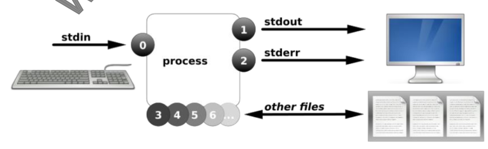
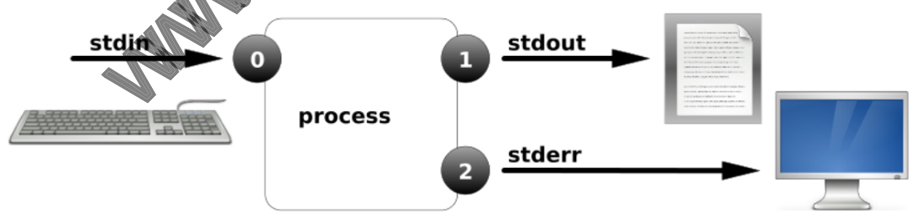
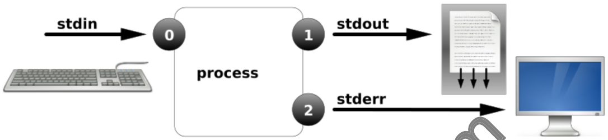
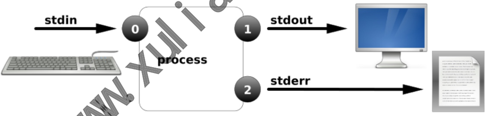
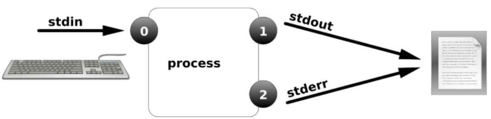
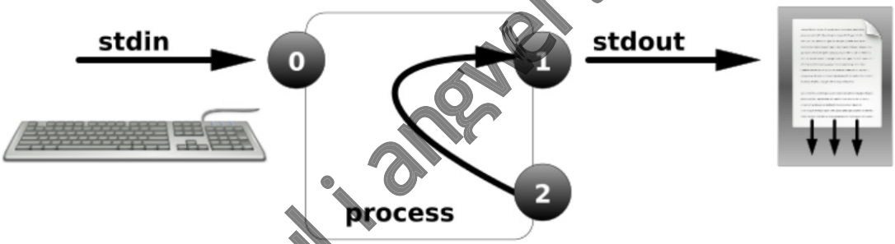
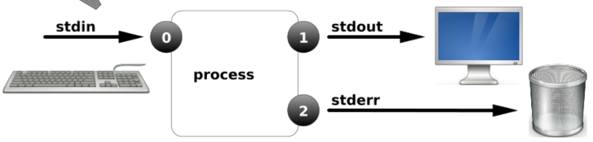
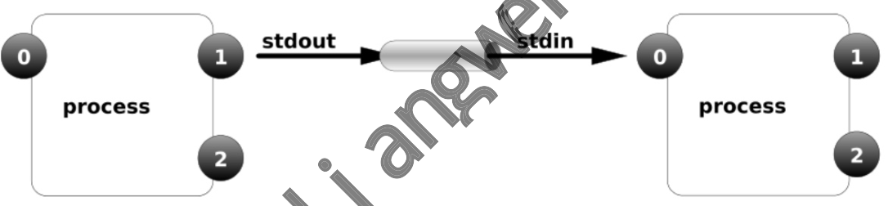
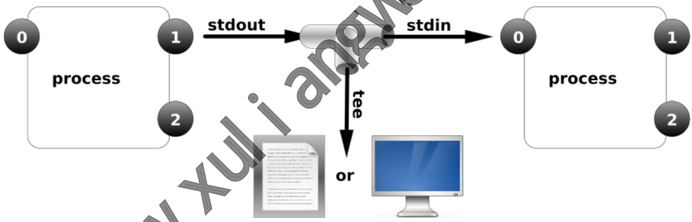

# 06 Linux IO重定向

## 06.Linux1O重定向

：06.LinuxIO重定向 。1.重定向基础概述

### 1.1什么是重定向

### 1.2为什么需要重定向

### 11.3标准输入与输出

o2.输出重定向案例

### 12.1案例1-标准输出重定向

### 12.2 案例2-标准追加输出重定向

### 12.3案例3-错误输出重定向

### 2.4案例4-混合和输出重定向

### 2.5案例5-将内容输出至黑洞

。3.输入重定向案例 ·3.1输入重定向示例 I angw

### 3.2脚本输入重定向

）4.进程管道技术

### 4.1什么是管道

### 4.2管道流程示意图

### 4.3管道使用案例

#### 4.3.1案例1

#### 4.3.2案例2

#### 4.3.2案例3

### 4.4 tee与xargs

管道中使用tee 管道中使用xargs 连联网运维工作经验，曾负责过大规模集群架构自动化运维管理工作。擅长 Web集群架构与自动化运维，曾负责国内某大型电商运维工作。 徐亮伟， ·本章课程内容大纲 o1.什么是重定向 。2.为什么要使用重定向

## 03.标准输入、标准输出、错误输出

## 04.重定向、追加重定向、案例演示

o5.进程管道技术、tee、xargs

## 1.重定向基础概述

### 1.1什么是重定向

将原本要输出到屏幕中的数据信息，重新定向到某个指定的文件中，或者定向到黑洞中。

### 1.2为什么需要重定向

·1、当程序执行输出的信息比较多时，需要保存下来在进行分页查看！ ）2、后台执行的程序一般都会有输出，不希望它的输出干扰到屏幕 ）3、定时执行的备份任务，希望将备份的结果保留下来时； ）4、当重复创建用户，会提示一些错误信息，可以直接将信息丢弃； ·5、希望将错误日志与正确日志，分别输出保存到不同文件时;

### 1.3标准输入与输出

）当进程操作一个文件时： 。1.首先程序是无法直接访问硬件，需要借助内核来访问文件； 。2.而内核kernel 需要利用文件描述符（file descriptor）来访问文件。文件描述符 百度百科 ·总结：进程--通过-->文件描述符（非负整数）--访问-->文件名称；进程使用文件描述符来管 理打开的文件对应关系， ·通常程序访问一个文件至少会打开三个标准文件，分别是标准输入、标准输出、错误输出。 进程将从标准输入中得到数据，将正常输出打印至屏幕终端，将错误的输出信息也打印至屏 幕终端。

otherfiles

名称 作用 文件描述符 标准输入 (STDIN) 默认是键盘，也可以是文件或其他命令的输出。 标准输出 (STDOUT) 默认输出到屏幕。 错误输出 (STDERR) 默认输出到屏幕。 文件名称 (filename) 3+

## 2.输出重定向案例

·输出重定向，改变输出内容的位置。输出重定向有如下几种方式，如表格所示 类型 用途 操作符 将程序输出的正确结果输出到指定的文件中，会覆盖文件原有 标准覆盖输出重 的内容 标准追加输出重 将程序输出的正确结以追加的方式输出到指定文件，不会 >> 覆盖原有文件 错误覆盖输出重 将程序的错误结果输出到执行的文件中，会覆盖文件原有的 2> 内容 将程序输出的错误结果以追加的方式输出到指定文件，不会 错误追加输出重 2>v 覆盖原有文件

### 2.1案例1-标准输出重定向

定向 定向 定向 定向

标准输出重定向示例 。1.如果文件不存在则创建 。2.如果文件存在则清空内容

[root@oldxu ~]# > edu.txt [root@oldxu ~]# ifconfig ethθ >edu.txt

### 2.2案例2-标准追加输出重定向

com ·标准追加输出重定向示例 。如果文件不存在则创建 。2.如果文件存在则在文件尾部添加内容 angwe [root@oldxu ~]# echo"HeLLo Students">> if

### 2.3案例3-错误输出重定向

orocess ·标准错误输出重定向 。1.正确输出及错误输出至相同文件

。2.正确输出及错误输出至不同的文件 "*.conf" 1>ok 2>ok "*.conf" 1>ok 2>err

### 2.4案例4-混合和输出重定向

·混合输出重定向 。1.将正确输出和错误输出混合至同一文件 。2.将两个文件内容组合为一个文件 om "*.conf" &>ab 正确和错误都输入到相同位置 [root@oldxu ~]# Ls /root/error >ab 2>&1

### 2.5案例5-将内容输出至黑洞

·将内容输出至黑洞设备/dev/null

[root@oldxu ~]# Ls /root /error >ab 2>/dev/nulL [root@oldxu ~]# Ls /root /error >ab &>/dev/nulL

## 3.输入重定向案例

·输入重定向：指的是”重新指定设备“来“代替键盘”作为新的输入设备；

### 3.1输入重定向示例

## 1.通过输入重定向读取文件内容；

[root@oldxu ~]# cat</etc/hosts

## 2.通过输入重定向读入多行内容；

[root@dns-master~]# cat<<EOF ngw #只要不出现EOF则可以一直输入

## 3.通过输入重定向将数据导入至数据库中；

[root@oldxu ~]# mysql boldxu.com</opt/wordpress.sql

### 3.2脚本输入重定向

）使用输入重定向打印安装服务的菜单导航栏； 小明99 小红100 小王80 EOF [root@dns-master ~]# cat install.sh #!/usr/bin/bash cat <<-EOF ---主菜单-· 1）安装nginx 2）安装php 3）退出 EOF

## 4.进程管道技术

### 4.1什么是管道

管道操作符号"”，主要用来连接左右两个命令，将左侧的命令的标准输出，交给右侧命令 的标准输入 ）注意事项：无法传递标准错误输出至后者命令 ）管道命令符能让大家能进一步掌握命令之间的搭配使用方法，进一步提高命令输出值的处理

### 4.2管道流程示意图

●格式：cmd1|cmd2[...|cmdn] Xuliangy tdin

### 4.3管道使用案例

tc/passwd中的用户按uID大小排序 案例1：将 [root@oldxu ~]#sort -t":"-k3-n/etc/passwd 效率

#### 4.3.1 案例1

[root@oldxu~]# sort -t":"-k3 -n /etc/passwd -r [root@oldxu ~]# sort -t":" -k3 -n /etc/passwd Ihead

#### 4.3.2案例2

·案例2：统计当前/etc/passwd中用户使用的shell类型

#思路：取出第七列（sheLL）丨排序（把相同归类）/去重 [root@oldxu ~]# awk -F:'{print $7}' /etc/passwd [root@oldxu ~]# awk -F:'{print $7}'/etc/passwd /sort [root@oldxu ~]# awk -F:'{print $7}'/etc/passwd |sort |uniq [root@oldxu ~]# awk -F:'{print $7}' /etc/passwd /sort |uniq -C

#### 4.3.2案例3

·案例3：打印并输出当前所有主机所有网卡的IP地址 . - . , ., p #[ xoo]

#### 127.0.0.1

#### 10.0.0.100

### 4.4 tee与xargs

#### 4.4.1管道中使用tee

ingy tee NX or #选项：-a追

[root@web t $2}'

#### 127.0.0.1

#### 10.0.0.100

[root@web~]# cat ip.txt inet 127.0.0.1/8 scope host 1o inet 10.0.0.100/24 brd 192.168.69.255 scope global ens32

#### 4.4.2管道中使用xargs

xargs参数传递，主要让一些不支持管道的命令可以使用管道技术 #whichcat/xargsLs-L #LsIxargsrm-fv Www xul i angwei.com
