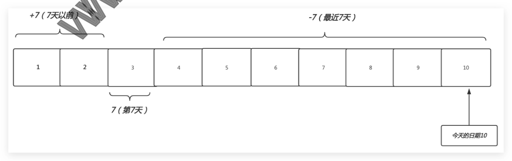

# 07 Linux文件查找

## 07.Linux文件查找

）07.Linux文件查找 。1.find查找概述

### 1.1为什么需要查找

### 1.2为什么是find

### 1.3find命令语法

o2.find查找示例

### 12.1find基于名称查找

### 2.2find基于大小查找

：2.3find基于类型查找 ：2.4find基于时间查找 ：2.5find基于用户查找 ：2.6find基于权限查找

### 2.7find逻辑运算符

o3.find动作处理 MO ·3.1 find结合exec

### 3.1 find结合xargs

：3.2 find结合grep 曾负责过大规模集群架构自动化运维管理工作。擅长 徐亮伟，多年互联网运维工作经验， Web集群架构与自动化运维，曾负责国内某大型电商运维工作。 ）本章课程内容 。1.为什么要有文件查找？ o2.windows如何实现文件查找? o3.1inux如何实现文件查找? o4.find命令查找语法？ o5.find基于文件名称、类型、大小、时间等方式进行查找文件？ o6.find查找后的处理动作？

## 1.find查找概述

### 1.1为什么需要查找

·1.很多时候我们可能会忘了文件所在的位置，此时就需要通过find来查找； ·2.有时候需要通过内容查找到对应的文件，此时就需要通过find来查找；

### 1.2为什么是find

因为find命令可以根据不同的条件来进行查找文件 比如： 。文件名称、 。文件大小、 。文件时间、 。属主属组、 。权限等等、 可以通过如上几种方式查找文件，从而实现精准定位

### 1.3find命令语法

选项 路径 表达式 [options] [path...] [expression] [action] 地区 妹纸 18-25岁 ???

## 2.find查找示例

### 2.1find基于名称查找

touch /etc/sysconfig/network-scripts/{ifcfg-eth1,IFCFG-ETH1} 命令 find 查找 #1.创建文 #2.查找/etc目录下包含ifcfg-etho名称的文件 #3。-讠忽略大小写

- - # xo]

#查找/etc目录下包含ifcfg-eth名称所有文件 "*yta-bfof?, auou- /2a/ puf #[~ tamauetinx@zoou] "*yta-bfof?, auoun- ora/ punf #[~ Tamauetinx@zoou]

### 2.2find基于大小查找

#1。查找大于5M的文件 #2.查找等于5M的文件 #3。查找小于5M的文件

### 2.3find基于类型查找

#c字符设备 #p管道文件 typep

### 2.4find基于时间查找

+7（7天以 -7（最近7天） #f文件 #d目录 #L链接 #b块设备 #s套接字

#1.创建测试文件（后期sheLL会讲） 7（第7天） 今天的日期10

#2。查找7天以前的文件（不会打印当天的文件） #3。查找最近7天的文件，不建议使用（会打印当天的文件） -mtime -7 #4。查找第7天文件（不会打印当天的文件） #面试题：查找/var/Log下所有以。Log结尾的文件，并保留最近7天的Log文件。 -mtime+7-delete #查找最近120分钟内发生过修改的文件 [root@node ~]# find ./ -type f -mmin -120 ./file.txt #查找系统有那些命令在最近多长时间内，发生过变化（) [root@node ~]# find /bin/ /sbin/ -type f -mmin /bin/python2.7

### 2.5find基于用户查找

#查找属主是jack -userjack #查找属组是admin home-groupadmin #查找属主是jack，属组是adin Dind/home-userjack-groupadmin #查找属主是ja 属组是admin ~]#find/home-userjack-a-groupadmin 或者属组是admin /bin/gg #查找属主是 #查找没有属主 #查找没有属组 #查找没有属主或属组

### 2.6find基于权限查找

-perm [/l-]MODE MODE：精确权限匹配 -MODE：每一类对象都必须同时拥有指定的权限；(并且的关系) /MODE：任何一类(UGO）只要有一位匹配即可；(或者的关系) #精确 S7- t9 uuad- f ad- zo0u/ puf #[ qamo] #-包含（u涵盖6，并且g涵盖4，并且o涵盖4） [root@web ~]# find /root -type f -perm -644 -Ls #/或者（u为6或者g为4或者o为θ) S7- 0t9/ wuad- f ad<z- zoou/ puf #[ qam@oou] [root@web ~]# find /usr/bin/ /usr/sbin/ -type f -perm -40 [root@web ~]# find /usr/bin/ /usr/sbin/ -type f -perm LS [root@web ~]# find /usr/bin/ /usr/sbin/ -type f -perm -10o0 -Ls

### 2.7find逻辑运算符

作用 与 非 #1.查找当前目录 不是root的所有文件 find.-not-user root [root@xuliangy ~]#find.！-userroot #2。查找当前目录下，属主属于hdfs，并且大小大于1k的文件 #特殊权限 符号 -a -0 iltou- #3。查找当前目录下的属主为root或者以xmL结尾的普通文件 '*.xmL'\)

## 3.find动作处理

·查找到一个文件后，需要对文件进行如何处理find的默认动作是-print

动作 含义 打印查找到的内容(默认) -print 以长格式显示的方式打印查找到的内容 -ls -delete 删除查找到的文件(仅能删除空目录) 后面跟自定义shell命令(会提示是否操作) -ok 后面跟自定义shell命令(标准写法-exec\;) -exec

### 3.1find结合exec

·使用-exec实现文件拷贝和文件删除。 /tmp\; x-*- #x]

### 3.1 find结合xargs

xargs将前者命令查找到的文件作为一个整体传递后者命令的输入，所以其操作的额性能极 exec是将文件一个一个的处理，所以处理性能极低； #删除文件，性能对比 Le-{1..100000} ./-name"file*" xargs rm -f find ~]# find /usr/sbin/ -type f -perm -400o | xargs -I {} cp -rv {} 高 #文件拷贝 /tmp

### 3.2 find结合grep

）当忘记重要配置文件存储路径时，可通过搜索关键字获取文件其路径；
