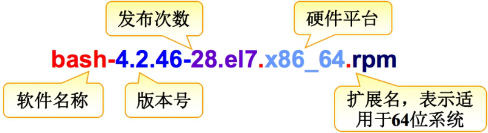
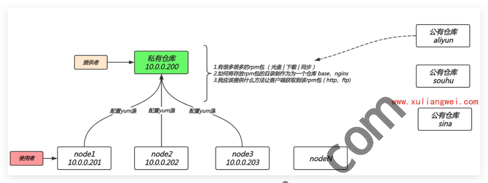
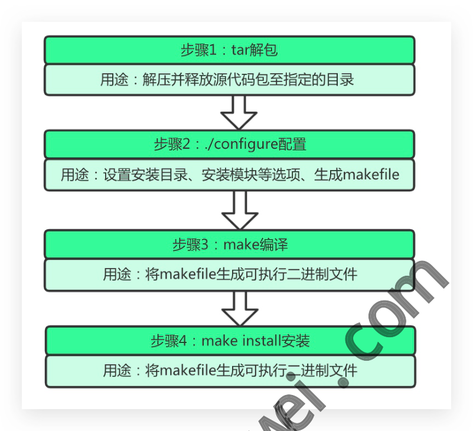

# 09 Linux软件包管理

## 09.Linux软件管理

）09.Linux软件管理 。1.RPM基本概述

### 1.1什么是rpm

### 1.2rpm包名组成部分

### 11.3 如何获取rpm包

### 1.4其他类型的安装包

）2.RPM包管理命令

### 2.1rpm安装软件包

### 2.2rpm依赖包安装

### 12.3 rpm升级软件包

### 12.4rpm卸载软件包

### 12.5rpm查询软件包

### 2.6rpm包管理小结

o3.YUM基本介绍 angw

### 3.1什么是YUM

### 3.2什么是YUM源

：3.3YUM配置文件

### 3.4配置YUM源示例

）4.YUM日常操作 ·4.1 yum查询软件包

### 4.2 yum安装软件包

### 4.3yum重装软件包

### 4.4yum更新软件包

### 4.5yum删除软件包

yum管理组包 yum管理仓库

### 14.8yum管理历史记录

■4.9 yum缓存软件包 o5.构建YUM仓库实践

### 5.1搭建本地yum仓库

### 5.2搭建企业yum仓库

·5.2.1环境准备 ·5.2.2服务端操作

#### 5.2.3客户端操作

o6.源码包管理实践

### 6.1什么是源码包

### 6.2为何需要源码包

！6.3源码包的优缺点 ，6.4源码包如何获取 ！6.5源码包如何安装

### 16.6Nginx源码包编译

：7.Ubuntu软件包管理

### 17.1CentOS与Ubuntu的关系

### 17.2CentOS与Ubuntu的区别

### 17.3Ubuntu软件包管理

·7.3.1dpkg包管理 ·7.3.2apt包管理 ·7.3.3apt使用示例 o8.系统内核升级

### 18.1rpm方式升级内核

### 8.2源码编译升级内核

徐亮伟，多年互联网运维工作经验，曾负责过大规模集群架构自动化运维管理工作。擅长 Web集群架构与自动化运维，曾负责国内某大型电商运维工作。 ·本章课程内容大纲 o1.什么是rpm?、rpm软件包的组成部分有哪些? o2.如何获取rpm软件包？本地获取？联网获取？ o3.除了rpm安装软件以外是否还有其他方式安装软件？ 。4.rpm软件安装、解决依赖、升级、卸载、查询等操作?

## 5.什么yum?什么是yum源？什么是yum仓库？

## 6.yum的基本使用、安装、卸载、升级、查询等操作？

）7.yum本地仓库如何搭建，又如何使用本地yum仓库? o8.源码包如何安装，下载、解压、编译？

## 1.RPM基本概述

### 1.1 什么是rpm

RPM 全称RedHatPackage Manager缩写，是由红帽开发用于软件包的安装、升级、卸载与查询

工具。

### 1.2rpm包名组成部分

RPM包命名以-将软件分成了若干部分bash-4.2.46-28.e17.x86_64.rpm

### 1.3 如何获取rpm包

在我们刚开始学习rpm包，建议先从本地镜像中获取rpm但实际生产环境中大多数是通过联网 方式获取rpm包，或者搭建企业私有包管理仓库平台。 先学会，你懂的

### 1.4其他类型的安装包

在Linux中除rpm格式类型的包，还存在一些其他类型的软件包。 安装 版本

分类 rpm包 软件版本偏低 预先编译打包，安装简单 源码包 手动编译打包，安装繁琐 软件版本随意 解压即可使用，安装简单 二进制包 不能修改源码

## 2.RPM包管理命令

硬件平台 发布次数 bash-4.2.46-28.el7.x86_64.rpm 版本号 扩展名，表示适 软件名称 用于64位系统

### 2.1rpm安装软件包

·-i：安装软件包 ）-V：显示安装过程 ）-h：显示安装进度条

## 1.使用rpm命令安装本地路径下软件包

[root@oldxu ~]# rpm -ivh /mnt/Packages/tree-1.6.0-10.el7.x86_64.rpm [root@o1dxu ~]# rpm -ivh /mnt/Packages/vsftpd-3.0.2-22.el7.x86_64.rpm

## 2.使用rpm命令安装互联网上的软件包

[root@oldxu ~]# rpm -ivh https://mirrors.aliyun.com/zabbix/z /zabbix-agent-3.0.9-1.el7.x86_64.rpm

### 2.2rpm依赖包安装

包依赖是指 A-->依赖-->B，B-->依赖-->C， >依赖-->A。当我们需要安装的rpm 类型包 出现了依赖关系应该如何处理，比如安装 samba 软件包。 [root@oldxu ~]# rpm -ivh /mntackag samba-4.8.3-4.el7.x86_64.rpm error: Failed dependencies: libxattr-tdb-samba4.so()(64bit) is needed by samba-0:4.8.3-4.el7.x86_64 libxattr-tdb-samba4.so(SAMBA_4.8.3)(64bit) is needed by samba-0:4.8.3-4.el7

#### 4.8.3-4.e17is neededby samba-0:4.8.3-4.e17.x86_64

samba-libs

## 1.尝试安装依赖包samba-common-tools

.0/rhel/7/x86_64 .x86_64 [root@oldxu ~]# rpm -ivh /mnt/Packages/samba-common-tools-4.8.3-4.el7.x86_64.rpm

## 2.尝试安装依赖包samba-libs

[root@oldxu ~]# rpm -ivh /mnt/Packages/ [root@o1dxu ~]# rpm -ivh /mnt/Packages/samba-Libs-4.8.3-4.el7.x86_64.rpm

## 3.尝试安装依赖包samba-common-tools

[root@oldxu ~]# rpm -ivh /mnt/Packages/samba-common-tools-4.8.3-4.el7.x86_64.rpm

## 4.最后尝试安装samba主程序包

[root@oldxu ~]# rpm -ivh /mnt/Packages/samba-4.8.3-4.el7.x86_64.rpm PS:由于rpm工具安装rpm包依赖关系太强，所以通常我们都是使用yum来解决

### 2.3 rpm升级软件包

下载zabbix-agent 软件包，分别下载3.θ低版本、然后下载4.2高版来进行测试与实验。 #wgethttps://mirrors.aliyun.com/zabbix/zabbix/3.0/rhel/ .9-1.el7.x86_64.rpm # wgethttps://mirrors.aliyun.com/zabbix/zabbix/4.2/rhel/7/x86_64/zabbix-agent-4.2 .0-1.el7.x86_64.rpm

## 1.先安装zabbix-agent-3.0低版本

.el7.x86_64.rpm [root@oldxu ~]# rpm -ivh zabbix-agent

## 2.尝试使用rpm-ivh安装zabbix-agent-4.2高版本(会出现报错)

[root@oldxu ~]# rpm x-agent-4.2.0-1.el7.x86_64.rpm zabbix-agent至4.2版本。（完美解决)

## 3.使用rpm-Uvh天

[root@oldxu rpm -Uvh zabbix-agent-4.2.0-1.el7.x86_64.rpm /zabbix-agent-3.0

### 2.4rpm卸载软件包

如果需要卸载rpm包，可以先查看该包是否存系统中，然后在进行卸载操作。

## 1.使用rpm-q查询软件包是否存在系统

[root@oldxu ~]# rpm -q zsh

## 2.使用rpm-e卸载软件包

[root@oldxu ~]# rpm -e zsh

### 2.5 rpm查询软件包

描述 选项 查看指定软件包是否安装 rpm -q 查看系统中已安装的所有RPM软件包列表 rpm -qa 查看指定软件的详细信息 查询指定软件包所安装的目录、文件列表 查询指定软件包的配置文件 查询文件或目录属于哪个RPM软件

## 1.查询vsftpd这个rpm包是否安装

[root@oldxu ~]# rpm -q vsftpd

## 2.模糊查找系统已安装的rpm

[root@oldxu ~]# rpm ftp

## 3.查询vsftpd软件包相关信息

rpm -qi vsftpd [root@oldxi rpm -qi rpm -ql rpm -qc rpm -qf

## 4.查询vsftpd软件包所安装后在系统中生成的文件路径

[root@oldxu ~]# rpm -ql vsftpd

## 5.查询vsftpd软件包的主配置文件

[root@oldxu ~]# rpm -qc vsftpd

## 6.查询配置文件或系统命令是由哪个rpm包提供

[root@oldxu ~]# rpm -qf /etc/vsftpd/vsftpd.conf [root@oldxu ~]# rpm -qf/usr/sbin/vsftpd

## 7.查询未安装的rpm包会产生哪些文件

[root@o1dxu ~]# rpm -qlp /mnt/Packages/samba-3.6.23-41.el6.x86_64.rpm

### 2.6rpm包管理小结

·1.如何查询util-linux软件包安装了哪些文件? ·2.如何查询mkdir命令是由哪个RPM软件包安装的？ ·3.安装.rpm 软件包时，-i、-u选项有何区别?

## 3.YUM基本介绍

### 3.1什么是YUM

yum/dnf 是RedHat 及Centos系统中的软件包管理器。它能够通过互联网下载.rpm 格式包 进行安装，并能自动处理其依赖间关系，无须繁琐地一次次下载安装。

### 3.2什么是YUM源

要使用yum命令工具安装更新软件，需要有一个包含各种rpm软件包的仓库，这个软件仓库我 们一般称为yum源。当然这个源可以是本地仓库、也可以是网络仓库。如图所示： client --ftp/http/file-> yum地址 --->yum仓库 (rpm包集合)

### 3.3YUM配置文件

Centos8的配置文件 [root@e84356b681bfetc]# cat/etc/yum.conf [main] gpgcheck=1 #检查来源是否合法，需要有制作者的公钥信息 installonly_limit=3 #同时可以安装3个软件包、最小为2，设置为0或者1则不限

制 #删除包时，是否将不再使用的包删除 clean_requirements_on_remove=True best=True #升级时，自动选择安装最新版，即使缺少包的依赖 skip_if_unavailable=False Centos7的配置文件 [root@oldxu ~]# vim /etc/yum.cnf cachedir=/var/cache/yum/$basearch/$releasever#缓存目录 keepcache=0 #缓存软件包，1启动0关闭 #调试级别 debuglevel=2 logfile=/var/log/yum.log #日志记录位置 #检查平台是否兼容 exactarch=1 #检查包是否废弃 obsoletes=1 gpgcheck=1 #检查来源是否合法，需要有制作者的公钥 plugins=1 installonly_limit=5 设置为0或者1则不限制 #同时可以安装5个软件包、最小为1 #每小时手动检查元数据 # metadata_expire=90m #包含repos.d目录中的.repo # in /etc/yum.repos.d

### 3.4配置YUM源示例

系统默认的源是国外提供，需要替换为国内的源

## 1.配置阿里yum源

[root@oldxu ~]# wget yum.repos.d/centos-Base.repo\ http://mirrors.aliyun.com/repo/Centos-7.repo (EPEL) [root@oldxu ]# wget -0 /etc/yum.repos.d/epel.repo

## 2.配置第三方

http://mirrors.aliyun.com/repo/epel-7.repo

## 3.Nginx官方源，后期在学习Nginx时需要使用官方的yum源来安装软件

[root@oldxu ~]# vim /etc/yum.repos.d/nginx.repo [nginx] name=nginx repo baseurl=http://nginx.org/packages/centos/7/$basearch/ gpgcheck=0

enabled=1 YUM源的查找方式大体一致Apache，Docker、Nginx、openstack、ELKStack

## 4.YUM日常操作

### 4.1 yum查询软件包

## 1.使用dnf/yumlist查询所有仓库中的所有软件包

[root@oldxu ~]# yum List [root@oldxu ~]# yum List/grep ftp

## 2.使用dnf/yumlistinstalled查询所有已安装至系统中的软件包

[root@oldxu ~]# dnfList installed

## 3.使用dnf/yumprovides查询系统命令来自于哪个软件包

[root@oldxu ~]# rpm -qf $(which bash-4.2.46-31.e17.x86_64 果不存在该命令是无法查找到该命令所属的软件包 #PS：rpm需要知道命令的绝对路径， [root@oldxu ~]# yum prov [root@oldxu ~]# yum provide

### 4.2yum安装软件包

## 1.使用dnf/yuminstall通过仓库获取软件包进行安装

#交互，麻烦 [root@oldxu ~]# yum install vsftpd #非交互 [root@oldxu ~]# yum install vsftpd -y

## 2.使用dnf/yum localinstall安装本地的rpm包，如果rpm包存在依赖，会通过当前已有的仓

库获取解决依赖关系

[root@oldxu ~]# yum install https://mirrors.aliyun.com/centos/7.6.1810/os/x86_64/Pa ckages/samba-4.8.3-4.el7.x86_64.rpm #yumLocaLinstaLL安装本的rpm包，会自动查找当前系统上已有的仓库解决依赖关系 [root@oldxu ~]# yum Localinstall samba-4.8.3-4.el7.x86_64.rpm -y

### 4.3yum重装软件包

当我们安装好服务后，如果不小心删除了服务的配置文件，此时可以通过重装的方式修复。

## 1.首先删除vsftpd配置主文件

[root@oldxu ~]# rpm -qc vsftpd [root@oldxu ~]# rm -f /etc/vsftpd/vsftpd.conf

## 2.使用dnf/yumreinstal1对软件进行重新安装

[root@oldxu ~]# yum reinstall vsftpd

## 3.检查vsftpd服务配置文件是否恢复，以及软件是否能正常使用。

[root@oldxu ~]# rpm -qc vsftpd /etc/logrotate.d/vsftpd /etc/pam.d/vsftpd /etc/vsftpd/ftpusers /etc/vsftpd/user_list /etc/vsftpd/vsftpd.conf

### 4.4yum更新软件包

#1。对比Linux已安装的软件和yum仓库中的软件，有哪些需要升级 [root@oldxu ~]# yum check-update #2.更新acL软件 [root@oldxu ~]# yum update acl -y #3。更新整个系统所有的软件，包括内核（通常刚装完系统会进行执行） [root@oldxu ~]# yum update -y

### 4.5yum删除软件包

[root@oldxu ~]# yum install samba -y [root@oldxu ~]# yum remove samba-y

### 4.6yum管理组包

## 1.使用dnf/yumgroupsinstal1安装一整个组的软件

[root@oldxu ~]# yum groups List [root@oldxu ~]# yum groups install Development tools \ Compatibility libraries \ Base Debugging Tools

## 2.使用dnf/yumgroups remove 删除包组

[root@oldxu ~]# yum groups remove Base -y

### 4.7yum管理仓库

## 1.列出dnf/yum repolist 源可用的软件仓库

[root@oldxu ~]# yum repoli [root@oldxu ~]# yum repo #查看所有的仓库 manager启用和禁用仓库（本质都是在修改repo文件中enable参数）

## 2.通过dnf/yum-con

[root@oldxu ]# yum install https://dev.mysql.com/get/mysql80-community-release-el7 -3.noarch.rpm -y #C7 #C8 [root@oldxu ~]# yum instalL https://dev.mysql.com/get/mysql80-community-release-el8 -1.noarch.rpm -y [root@oldxu ~]# yum repolist alLlgrep mysql #关闭仓库 unuuo-0gbs<u qosp-- uabou-bfuo-u #[ nxpo@oou] #启用仓库 unuuoo-0bsu qoua-- uabouou-bfuo-un #[ nxpo@oou]

### 4.8yum管理历史记录

当我们删除了某个软件时，希望撤销删除的操作，可以使用 yum history undo

## 1.删除httpd软件，然后查看操作记录

[root@oldxu ~]# yum remove httpd -y [root@oldxu ~]# yum history

## 2.使用dnf/yum history undo Number撤销

[root@oldxu ~]# yum history info N [root@oldxu ~]# yum history undo N

### 4.9yum缓存软件包

## 1.方式一：通过修改dnf/yum全局配置文件

[root@oldxu ~]# vim /etc/yum.conf cachedir=/var/cache/yum/$basearch/$releasevel keepcache=1 #启动缓存 [root@oldxu ~]# yum install -type f -name "*.rpm" [root@oldxu ~]# find /var/ache/}

## 2.方式二、通过dnf/yum下载该软件包至本地，不进行安装

stallhttpd-y\ [root@oldxu ~

- -downloadonl

--downloaddir [main]

## 3.清理缓存，可以使用dnf/yumclean

#清理所有yum缓存信息，包括缓存的软件包 [root@oldxu ~]# yum clean alL #仅清理所有缓存的软件包 [root@oldxu ~]# yum clean packages

## 5.构建YUM仓库实践

### 5.1搭建本地yum仓库

很多时候刚安装的linux系统不能联网，但需要安装相应环境的软件包。这时候我们就可以利用光 盘制作一个本地yum仓库。

## 1.挂载镜像

[root@oldxu ~]# mount/dev/cdrom /mnt

## 2.备份原有仓库

[root@oldxu ~]# gzip /etc/yum.repos.d/*

## 3.使用yum-config-manager命令可快速添加一个本地仓库

[root@oldxu ~]# yum install yum-utils -y [root@oldxu ~]# yum-config-manager --add ile:///mnt"

## 4.当然我们也可以直接去编辑一个○repo

文件，将仓库信息存储至该文件 [root@oldxu ~]# vim /etc/y pos.d/cdrom.repo #仓库描述信息 name=This is loc rom #仓库urL地址 晏file://ftp://http://等协议 baseurl=file mnt #是否使用 UM源（0代表禁用，1代表激活） #仓库名称 [cdrom] enabled=1 #是否验证软件签名（0代表禁用，1代表激活） gpgcheck=0

## 5.生成缓存信息、然后使用dnf/yum安装软件测试

[root@oldxu ~]# yum makecache [root@oldxu ~]# yum install Lrzsz -y

### 5.2搭建企业yum仓库

很多时候不仅仅是一台机器无法上网，而是很多机器都无法上网，但都有联网下载软件的需求， 这个时候难道每台机器都挂在光盘吗，当然可以，但如果软件出现了更新又该怎么办。所以我们 需要构建一个企业级的yum仓库，为多台客户端提供服务。

配置yum源 配置yum源 配置yum源 node1 node2 node3 nodeN

#### 10.0.0.201

#### 10.0.0.202

#### 10.0.0.203

·本地光盘提供基础软件包：Base ·yum缓存提供常用软件包：nginx、zabbix、docker

#### 5.2.1环境准备

角色 IP yum仓库服务端

#### 10.0.0.99

m仓库客户端

#### 10.0.0.98

#### 5.2.2服务端操作

## 1.关闭iptables防火墙、与selinux

系统 centos7 centos7 [root@yum_server~]# systemctl stop firewalLd [root@yum_server ~]# setenforce 0

## 2.安装ftp服务，启动并加入开机启动

[root@yum_server ~]# yum -y install vsftpd [root@yum_server ~]# systemctl start vsftpd [root@yum_server ~]# systemctl enable vsftpd 公有仓库 aliyun 私有仓库 提供者

#### 10.0.0.200

## 1.有很多很多的rpm包（光盘/下载|同步）

公有仓库

## 2.如何将存放rpm包的目录制作为为一个仓库base、nginx

nynos

## 3.我应该提供什么方法让客户端获取到该rpm包（http、ftp）

公有仓库 sina 使用者

## 3.首先提供基础base软件包

[root@yum_server~]# mkdir-p/var/ftp/centos7 [root@yum_server~]# mount/dev/cdrom/mnt [root@yum_server~]# cp-rp/mnt/Packages/*.rpm/var/ftp/centos7/

## 4.提供第三方源的rpm软件包，通过脚本下载方式实现；

#下载方式 [root@yum_server ~]# cat wget_rpm_scripts.sh #!/usr/bin/bash get_zabbix_rpm_url=https://mirrors.aliyun.com/zabbix/zabbix/5.0/rhe1/8/x86_64/ rpm_name=$(curl -s ${get_zabbix_rpm_url} | grep "^<a"|awk -F rpm_dir=/var/ftp/ops for name in ${rpm_name} if [！ -d ${rpm_dir} ];then mkdir -p ${rpm_dir} fi _url}${name} wget -0 ${rpm_dir}/${name} ${get_zabt

## 5.提供第三方源的rpm软件包，采用Rsync

同步科大源方式实现，后期结合定时任务，定点同 步互联网最新软件包； #rsync同步方式 -p/var/ftp/jenkins [root@yum_server ~ rsync -avz rsync://rsync.mirrors.ustc.edu.cn/repo/jenkins/redh [root@yum_server at//var/ftp/ [root@yum server ~]#mkdir-p/var/ftp/nginx [root@yum_server ~]# rsync -avz rsync://rsync.mirrors.ustc.edu.cn/repo/nginx /var/ ftp/nginx/ '{print $2}') op done

## 6.将软件包目录创建为yum 仓库，安装createrepo；

[root@yum_server ~]# yum -y install createrepo [root@yum_server ~]# createrepo /var/ftp/ops [root@yum_server ~]# createrepo /var/ftp/jenkins [root@yum_server~]# createrepo/var/ftp/nginx

#PS：如果此仓库每次新增软件则需要重新生成一次

#### 5.2.3客户端操作

所有客户端仅需将yum源指向本地服务端，即可使用本地服务器提供的软件包。

## 1.客户端配置并使用base基础源

[root@yum_client ~]# gzip /etc/yum.repos.d/* [root@yum_client ~]# vim /etc/yum.repos.d/centos7.repo [centos7] name=centos7_base baseur1=ftp://10.0.0.99/centos7 gpgcheck=0

## 2.客户端配置并使用nginx、jenkins、zabbix等源

[root@yum_client ~]# vim /etc/yum.repos.d/ops.r iriangwe name=local ftpserver baseurl=ftp://10.0.0.99/nginx gpgcheck=0 name=local ftpserver baseurl=ftp://10.0.0.99/zabbix gpgcheck=0 name=local ftpserver baseurl=ftp://10. .0.0.99/jenkins gpgcheck=0

## 6.源码包管理实践

[nginx] [zabbix] [jenkins]

### 6.1什么是源码包

源码包指的是开发编写好的程序源代码，但并没有将其编译为一个能正常使用的二进制工具。

### 6.2为何需要源码包

·1.部分软件官网仅提供源码包，需要自行编译并安装。 ）2.部分软件在新版本有一些特性还没来得及制作成rpm包时，可以自行编译软件使用其新 特性。

### 6.3源码包的优缺点

·优点： 。1、可以自行修改源代码，需要会C 。2、可以定制需要的相关功能 。3、新版软件优先更新源码 ）缺点： 。1、相对rpm 安装软件的方式会复杂很多。 Or 。2、标准化实施困难，自动化就无法落地。

### 6.4源码包如何获取

·常见的软件包都可以在官网获取源码包，比如apache nginx、mysql nginx 源码包地址：http://nginx.org/en/dwnload.html httpd 源码包地址：http://httpd.apache.org/download.cgi zabbix 源码包地址：https://www.zabbix.com/cn/download

### 6.5源码包如何安装

将源码包编译为二进制可执行文件步骤如下图，简称编译三步曲： XMVV O

用途：将makefile生成可执行二进制文件 步骤4：makeinstall安装 用途：将makefile生成可执行二进制文件 PS:此方法不是百分百通用于所有源码包，建议拿到源码包解压后，进入到目录找相关的 README帮助文档

### 6.6Nginx源码包编译

下面通过编译Nginx软件来深入了解下源码包编译的过程。

## 1.基础环境准备

install-y gcc make wget [root@Serve]

## 2.下载nginx 源码包

[root@Server ~]# wget http://nginx.org/download/nginx-1.18.0.tar.gz

## 3.解压nginx源码包，并进入相应目录

[root@Server ~]# tar xf nginx-1.18.0.tar.gz [root@Server ~]# cd nginx-1.18.0 步骤1：tar解包 用途：解压并释放源代码包至指定的目录 步骤2：./configure配置 用途：设置安装目录、安装模块等选项、生成makefile 步骤3：make编译

## 4.配置相关的选项，并生成Makefile

[root@Server nginx-1.18.0]# ./configure --prefix=/opt/nginx-1.18.0

## 5.根据Makefile文件，将软件编译为可执行的二进制程序

[root@Server nginx-1.18.0]# make

## 6.将编译好的二进制文件拷贝至对应的目录

[root@Server nginx-1.18.0]# make install ·源码编译报错信息处理 # yum -y install gcc gcc-c++ make equires the PCRE library. ./configure: error: the HTTP rewrite modul You can either disable the module by using without-http_rewrite_module option, or install the PCRE library into the system, or build the PCRE library statically from the source with nginx by using --with-pcre=<path> option. # yum install -y pcre-devel gzip module requires the zlib library. ./configure: error: the You can either disable the module by using --without- ion, or install the zlib library into the http_gzip_module system, or buil ezlib library statically from the source with With-zlib=<path> option. zlib-devel p nginx by #yum ./configure: error: SSL modules require the OpenSSL library. You can either do not enable the modules, or install the OpenSSL library into the system, or build the OpenSSL library statically from the source with nginx by using --with-openssl=<path> option. #yum -y install openssl-devel

## 7.Ubuntu软件包管理

### 7.1CentOS与Ubuntu的关系

Centos 之前的地位：Fedora稳定版-->发布-->RHEL稳定版-->发布-->CentOS Centos 如今的地位：Fedora 稳定版-->发布-->CentOS Stream-->发布-->RHEL 从Redhat收购CentOS，到IBM 收购Redhat，这是最大的一次变化。但同时也是一个机会， 让我们跳出舒适圈，去接触其他优质稳定的企业级系统了。如Debian、Ubuntu 等等。

### 7.2 CentOS与Ubuntu的区别

CentOSvsDebian（含Ubuntu）的区别： 操作内容 Debian/Ubuntu CentOS6/CentOS7 软件包后缀 *.rpm *.deb /etc/yum.conf 源配置文件 /etc/apt/sources.list /etc/sysconfig/network-scripts/ifc 网卡配置文件 /etc/network/interfaces g-etho 默认不创建用户家目录、解释 默认创建用户家目录， 、解释器bash 器为 sh 防火墙规则 默认规则 默认没有任何规则 root或普通用户 默认普通用户权限 默认允许root登陆 默认不允许root登陆 Yetc/selinux/config 没有 selinux 更新软件包列表 yum makecache apt update yum install package apt install package 安装已下载的软 创建用户 权限 SSH selinux 安装软件 dpkg -i pkg.deb rpm -ivh pkg.rpm 件包 安装已下载的软 apt install ./pkg.deb yum localinstall pkg.rpm 件包 删除软件包 yum remove package apt removelpurge package

### 7.3Ubuntu软件包管理

Debian 软件包的包名叫 deb，类似于 rpm 包。对于 deb 包的管理方式有 dpkg、apt 两 种方式 dpkg：package manager for Debin，可以实现安装、删除，但无法解决依赖项； apt：advanced PackagingTool，功能强大的软件管理工具，类似于dnf/yum；

#### 7.3.1dpkg包管理

## 1.使用dpkg安装软件包

root@ubuntu:~# dpkg -i package.deb

## 2.使用dpkg删除软件包

#不建议、不自动卸载依赖它的包 root@ubuntu:~# dpkg -r package.deb #删除包（包括配置文件） root@ubuntu:~# dpkg -P package.deb

## 2.使用dpkg查看软件包

#列出当前已安装的包，类似于rpm root@ubuntu:~# dpkg -L #列出该包中所包含的文件，类似 cpm root@ubuntu:~# dpkg -L packag #查看文件所属哪个包类似Frpm-qf root@ubuntu:~# reis ping S /bin/ping root@ubuntu:~

#### 7.3.2apt包管理

）早起Ubuntu使用apt-get命令来管理软件包，在Ubuntu16.04发布时，引l入了新的包 管理命令apt，为什么要引l入apt命令呢？因为早期Linux包管理命令都被分散在了 apt-get、apt-cache、apt-config这三条命令当中。那么apt命令的引l入就是为了解决命 令过于分散的问题。 简单来说就是：apt=apt-get、apt-cache、apt-config中最常用命令选项的集合。 apt 命令 apt-get 命令 命令的功能 。

安装软件包 apt install apt-get install 移除软件包 apt-get remove apt remove 移除软件包及配置文件 apt purge apt-get purge apt update apt-get update 刷新存储库索引 apt upgrade apt-get upgrade 升级所有可升级的软件包 自动删除不需要的包 apt autoremove apt-get autoremove 在升级软件包时自动处理依赖关系 apt-get dist-upgrade apt full-upgrade apt search apt-cache search 搜索应用程序 显示安装细节 apt-cache show

#### 7.3.3apt使用示例

## 1.检查当前 ubuntu 版本

root@example:~# Lsb_release -g No LSB modules are available. Distributor ID:Ubuntu Description: Ubuntu 20.04.2 LTS

### 20.04

focal Codename:

## 2.根据Ubuntu版本配置国内仓库地址阿里仓库配置指南

#手动修改如下配 公 （focaL版本、其余是软件包存储的位置） root@example: etc/apt/sources.List deb http://mirrors.aliyun.com/ubuntu/ focal main restricted universe multiverse deb-src http://mirrors.aliyun.com/ubuntu/ focal main restricted universe multiverse apt show Release: verse deb-src http://mirrors.aliyun.com/ubuntu/ focal-security main restricted universe m ultiverse deb http://mirrors.aliyun.com/ubuntu/ focal-updates main restricted universe multiv erse deb-src http://mirrors.aliyun.com/ubuntu/ focal-updates main restricted universe mu ltiverse

deb http://mirrors.aliyun.com/ubuntu/ focal-proposed main restricted universe multi verse deb-src http://mirrors.aliyun.com/ubuntu/ focal-proposed main restricted universe m ultiverse deb http://mirrors.aliyun.com/ubuntu/ focal-backports main restricted universe mult iverse deb-src http://mirrors.aliyun.com/ubuntu/ focal-backports main restricted universe multiverse #更新yum源 root@example:~# apt update

## 3.使用apt命令安装进行软件安装

com root@ubuntu:~#aptsearchdesktop root@ubuntu:~# aptinstallxubuntu-desktop -y root@ubuntu:~#aptinstallsambavsftpdapache2-y

## 3.使用apt卸载软件

#并不会移除配置文件 root@ubuntu:~# apt remove vsftpd #清理所有与vsftpd相关的配置
