# 11 Linux磁盘管理-ok

## 10.Linux磁盘管理

·10.Linux磁盘管理 。1.磁盘概述

### 1.1什么是磁盘

### 1.2 磁盘物理结构

·1.2.1什么是盘片

#### 11.2.2什么是磁道

#### 1.2.3什么是扇区

#### 11.2.4什么是柱面

#### 11.2.5什么是磁头

### 1.3 磁盘的接口类型

·1.3.1IDE-SCSI ■1.3.2 SATA-SAS ·1.3.3 MSATA-M2 。2.磁盘命名

### 12.1物理服务器

### 12.2虚拟服务器

。3.分区管理

### 3.1为什么要分区

### 3.2fdisk分区工具

### 3.3 gdisk分区工具

·3.4mkfs格式化系统 。4.挂载管理

### 4.1临时挂载mount

### 4.2临时卸载umount

### 14.3永久挂载fstab

■4.3.1永久挂载配置抒写 ■4.3.2配置文件/etc/fstab ）5.虚拟磁盘SWAP

### 15.1什么是SWAP

### 5.2为什么需要SWAP

：5.3SWAP基本应用 ■5.3.1扩展swap分区 ·5.3.2缩小swap分区 o6.文件系统 ■6.1文件系统的作用

### 6.2文件系统的类型

### 6.3 文件系统结构

·6.4文件系统故障修复 o7.逻辑卷lvm

### 17.1为何要用lvm

### 17.2什么是lvm

### 7.3lvm相关术语

：7.4Ivm配置实践 ·7.4.1环境与思路 ·7.4.2创建物理卷

#### 7.4.3创建卷组

#### 7.4.4创建逻辑卷

·7.4.5挂载使用

### 7.5lvm卷组管理

■7.5.1扩大卷组 ·7.5.2 缩减卷组

### 7.6lvm逻辑卷管理

■7.6.1扩展逻辑卷

#### 7.6.2缩小逻辑卷

#### 7.6.3删除逻辑卷

o8.磁盘阵列RAID

### 18.1什么是RAID

### 8.2为什么需要RAID

·8.3实现RAID的几种模式 ·8.3.1 RAID0 ·8.3.2 RAID1 ·8.3.3 RAID5 ·8.3.4 RAID10

### 8.4实现RAID的方式

·8.4.1硬RAID ■8.4.2软RAID

### 8.5软RAID配置实战

·8.5.1RAID环境准备

#### 8.5.2RAID0实战

#### 8.5.3RAID1实战

#### 8.5.4RAID5实战

徐亮伟，多年互联网运维工作经验，曾负责过大规模集群架构自动化运维管理工作。擅长 Web集群架构与自动化运维，曾负责国内某大型电商运维工作。

## 1.磁盘概述

### 1.1什么是磁盘

大多数人对硬盘都不陌生，一块小小的硬盘里，就可以存储海量的照片音乐和电影，尤其是我们 喜爱的各类动作片。但如此小的空间，是如何储存那么多信息的呢？

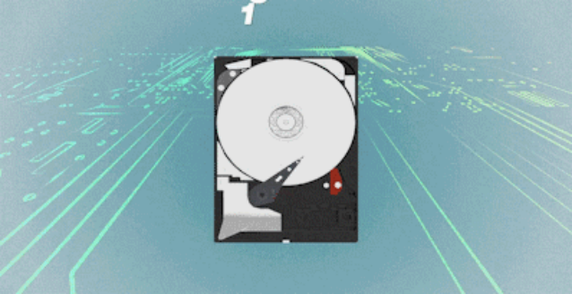

每个硬盘中心都是一高速运转的圆盘，在圆盘上附着的一圈金属颗粒，每个金属颗粒都有自己 的磁化程度，主要用于储存0和1。

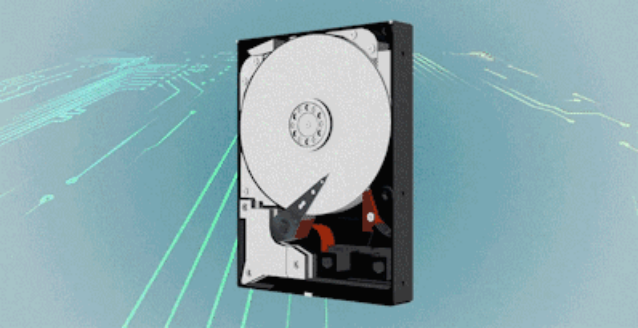

在数据写入时，硬盘的磁头开始通电，周围会产生磁场，数据在磁场的作用下转变成电流，使磁 盘的金属颗粒磁化，从而将信息记录在圆盘上。

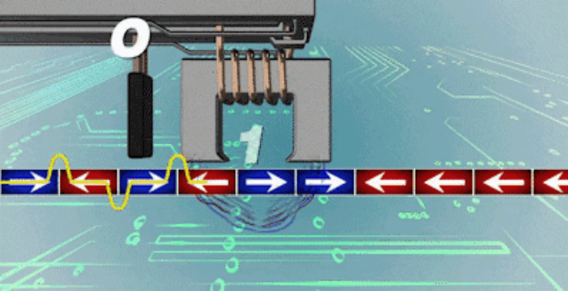

由海量颗粒组成的信息，就是我们存在硬盘里的数据。

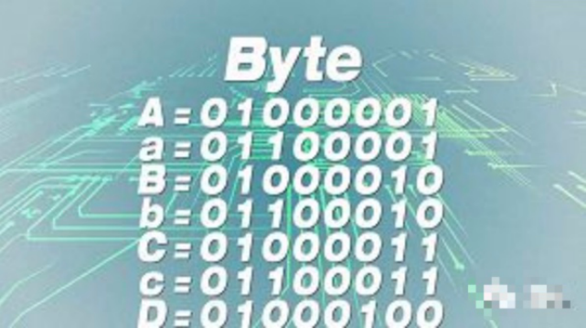

·什么是磁盘、软盘、硬盘？

### 1.2磁盘物理结构

）磁盘物理结构-1点击此按钮 磁盘物理结构-2点击此按钮

#### 1.2.1什么是盘片

硬盘一般有一个或多个盘片，每个盘片可以有两面，即第一个盘片的正面为0面，反面为1面然后 依次类推。

#### 1.2.2什么是磁道

们将这样的圆环称为磁道Track，每个盘面可以划分多个磁道。但肉业不可见。

#### 1.2.3什么是扇区

在硬盘出厂时会对磁盘进行一次低格，其实就是再每个磁道划分为若干个弧段，每个弧段就是一 个扇区Sector。扇区是硬盘上存储的物理单位，现在每个扇区可存储512字节数据已经成了业 个个 Byte A=01000001 a=01100001 B=01000010 b=01100010 C=01000011 C=01100011 D:01000100

界的约定。

#### 1.2.4什么是柱面

柱面实际上就是我们抽象出来的一个逻辑概念，简单来说就是处于同一个垂直区域的磁道称为柱 面，即各盘面上面相同位置磁道的集合。这样数据如果存储到相同半径磁道上的同一扇区，这样 可以实现并行读取，主要是减少磁头寻道时间。

#### 1.2.5什么是磁头

读取磁盘磁道上面金属块，主要负责读或写入数据。

### 1.3磁盘的接口类型

#### 1.3.1 IDE-SCSI

IDE，Scsi(已经被淘汰)

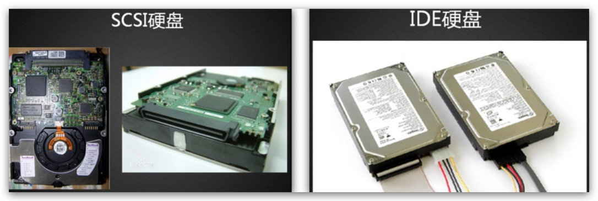

#### 1.3.2 SATA-SAS

SATA III与SAS

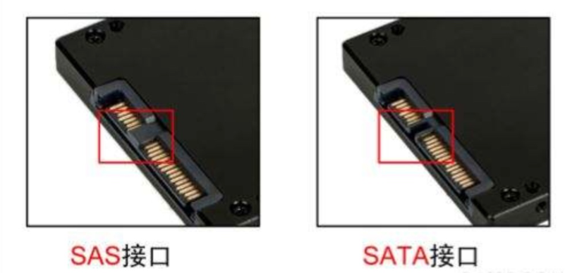

IDE硬盘 SCSI硬盘 SAS接口 SATA接口

接口类型 接口速率 盘片转速 写入速度 应用场景 个人 6Gbps/s SATA III

### 7.5k/s

300MB/s 8Gbps/s~12Gbps/s 企业 SAS 15k/s 300MB/s~600MB/s

#### 1.3.3MSATA-M2

MSATA与M.2

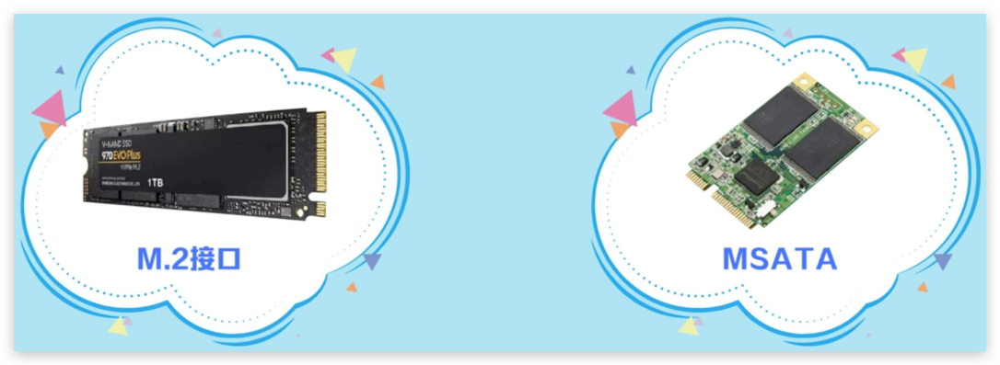

MSATA接口是专门为超级笔记本而设计的，m.2接口参考文档 m.2接口是inter推出的一种替代MSATA新的接口规范； m.2接口相比MSATA接口有两方面的优势 。1.速度优势 。2.体积优势 兼容性 读取速度 写入速度 M.2接口类型 支持接口类型 SATA、PCI-E X2 几乎主板都支持 700MB/s Socket 2 550MB/s PCI-E x4 Socket 3 4GB/s 需要检查主板是否支持

## 2.磁盘命名

### 2.1物理服务器

·真实物理服务器 设备名称 分区信息 设备类型 -NANDSSD 970EVOPluS 1TB M.2接口 MSATA

/dev/sda /dev/sda1 第一块物理磁盘第一分区 /dev/sdb 第二块物理磁盘第二个分区 /dev/sdb2 /dev/sdd /dev/sdd4 第四块虚拟磁盘的第四个分区

### 2.2虚拟服务器

）阿里云主机或者KVM虚拟化主机的磁盘命名格式； 分区信息 设备类型 设备名称 /dev/vda1 第一块虚拟磁盘的第一个分区 /dev/vda 第二块虚拟磁盘的第二个分区 /dev/vdb /dev/vdb2 /dev/vdc3 第三块虚拟磁盘的第三个分区 /dev/vdc

## 3.分区管理

### 3.1为什么要分区

）分区是为了便于数据分门别类的存储；分区有MBR、GPT两种方式； ）分区表：(记录分区的编号、每个编号从哪个扇区开始，到哪个扇区结束) MBR：主引导记录，用来找到磁盘上的操作系统，并且引导启动（0磁道，1扇区，512 字节) ■446字节：bootloader 64字节：存储分区表，每16字节表示一个分区，最多四个“主分区”（主分区+扩展 分区) ■2字节：结束位； GPT：新型的分区表GPT支持分配128个主分区。 MBR 与 GPT 的区别，传送门 注意MBR与GPT之间不能互转，会导致数据丢失。

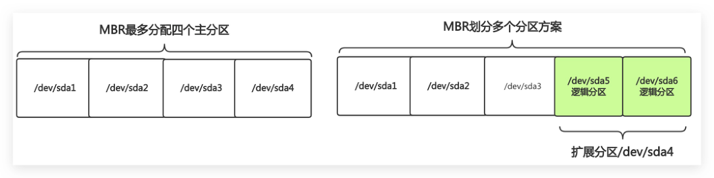

### 3.2fdisk分区工具

fdisk仅支持分配小于2TB的磁盘 o查看当前设备fdisk-1 o对设备进行分区 fdisk/dev/sdb ）分区命令 om：显示帮助 on：创建新分区 ）d：删除分区 p：查看分区 ow：保存分区 oq：退出 ）分区案例： 。案例1：分配4个分区(4P) 案例2：分配5个分区(1P+1E+4L) 案例3：分配6个分区（3P+1E+3L)

### 3.3gdisk分区工具

gdisk支持分配大于 2TB 的磁盘 o查看当前设备gdisk［-l]device o对设备进行分区 gdisk/dev/sdb ）分区命令 ？：显示帮助 on：创建新分区 op：打印分区 ow：保存分区 oq：退出 ）分区案例： 。案例1：分配4个主分区 (4P) 。案例2：分配5个主分区(5P) MBR划分多个分区方案 MBR最多分配四个主分区 /dev/sda5 /dev/sda6 /dev/sda1 /dev/sda2 /dev/sda3 /dev/sda2 /dev/sda3 /dev/sda1 /dev/sda4 逻辑分区 逻辑分区 扩展分区/dev/sda4

。案例3：分配6个主分区(6P)

### 3.4mkfs格式化系统

mkfs命令用于格式化硬盘，类似于将房子装修成3室一厅，还是2室一厅； ）-b：设定数据区块占用空间大小，目前支持1024、2048、4096bytes每个块； ）-t：用来指定什么类型的文件系统，可以是ext4、xfs； 提示： 。1.分区工具，可以针对整块磁盘，或者单个分区进行格式化操作 ）2.一般情况下建议，不要直接格式化使用整磁盘，要分区后再格式化，头部有预留空 间；

## 1.使用mkfs命令，格式化整个硬盘

[root@oldxu ~]# mkfs.ext4 /dev/sdb

## 2.使用mkfs命令，格式化磁盘的某个分区

[root@oldxu ~]# mkfs.xfs/dev/sdb1

## 3.使用mkfs命令指定一个数据块的大小

[root@dns-master ~]# mkfs.xfs -b size=1024 /dev/sdb2

## 4.挂载管理

）当需要使用磁盘空间的时，需要准备一个目录作为挂载点，然后使用mount命令与该设备 进行关联；

### 4.1临时挂载mount

·通过mount进行挂载，但重启将会失效。我们称为临时生效。 -t：指定文件系统挂载分区； -a：检查并且挂载/etc/fstab配置文件中未挂载的设备； -o：指定挂载参数，ro、rw；

## 1.挂载磁盘设备；

[root@oldxu ~]# mkdir /db1 [root@oldxu ~]# mount -t xfs /dev/sdb1 /db1

## 2.挂载磁盘设备，设置参数为仅可读；

[root@oldxu ~]# mkdir /db2 [root@dns-master~]# mount -t xfs -oro/dev/sdb2/db2 [root@dns-master~]# touch/db2/new_file touch:cannot touch'/db2/new_file': Read-only file system

### 4.2临时卸载umount

·如果不想使用可以使用umount[device|directory］进行临时卸载。 o-1：强制卸载；

## 1.卸载入口目录示例；

[root@oldxu ~]# umount/db1

## 2.卸载设备方式示例；

[root@oldxu ~]# umount /dev/sdb1

## 3.如碰到无法正常卸载情况处理；

umount: /db1: device is busy. (In some cases useful info about processes that use the device is found by lsof(8) or fuser(1) #如上情况解决办法有两种，1。切换至其他目录2.强制卸载 [root@student db1]# umount -L /db1

### 4.3永久挂载fstab

）如果需要实现永久挂载，则需要将挂载相关信息写入/etc/fstab配置文件中实现。

#### 4.3.1永久挂载配置抒写

）配置文件规范：设备名称|挂载的入口目录|文件系统类型|挂载参数|是否备份|是否检查 。1.获取设备名称，或者获取设备UUID o2.手动临时挂载测试； o3.写入/etc/fstab配置文件； o4.使用mount-a检查是否存在错误；

## 1.获取设备名称，或设备的UUID

[root@oldxu ~]# blkid lgrep "sdb1" /dev/sdb1: UUID="e271b5b2-b1ba-4b18-bde5-66e394fb02d9" TYPE="xfs"

## 2.手动挂载测试

[root@o1dxu ~]# mount UUID="e271b5b2-b1ba-4b18-bde5-66e394fb02d9" /db1

## 3.写入/etc/fstab测试

#手动编写 [root@oldxu~]#tail-1/etc/fstab UUID=e271b5b2-b1ba-4b18-bde5-66e394fb02d9/db1xfsdefaults 00 #自动实现 I / .{ uud}. ,+[ :]. - ym / ps/ap/ daub| p?g #[ nxpo@oou] sed -r's#(.*)#\1 /db1 xfs defaults θ 0#g' >> /etc/fstab

## 4.加载/etc/fstab配置文件，同时检测是否存在语法错误

[root@oldxu ~]# mount -a

#### 4.3.2配置文件/etc/fstab

/etc/fstab配置文件格式 。第一列：指定需要挂载的设备 ■设备名称：/dev/sdb1 ■设备ID：UUID 。第二列：挂载的入口目录 o第三列：文件系统类型 xfs类型 ext4类型

第四列：挂载参数 async/sync：使用同步或异步方式存储数据；默认async user/nouser：是否允许普通用户使用mount命令挂载。默认nouser exec/noexe：是否允许可执行文件执行。默认exec suid/nosuid：是否允许存在suid属性的文件。默认suid auto/noauto：执行mount-a命令时，此文件系统是否被主动挂载。默认auto rw/ro：是否以只读或者读写模式进行挂载。默认rw default：具有rw,suid,dev,exec,auto,nouser,async 等参数； ）第五列：是否要备份磁盘 10：不做备份 11：每天进行备份操作 12：不定日期的进行备份操作 0第六列：开机是否检验扇区 10：不要检验磁盘是否有坏道 1：检验 12：校验(当1级别检验完成之后进行2级别检验)

## 5.虚拟磁盘SWAP

### 5.1什么是SWAP

Swap分区在系统的物理内存不够时，将硬盘中的一部分空间供当前运行的程序使用。

### 5.2为什么需要SWAP

）当物理内存不够时会随机kill占用内存的进程，从而产生oom，临时使用swap可以解 决。 ·案例：模拟服务器00M； [root@oldxu ~]# dd if=/dev/zero of=/dev/null bs=800M #故障日志 [root@oldxu~]# tail-f/var/log/messages Out of memory: Kill process 2227(dd） score 778 or sacrifice child Killed process 2227 (dd） total-vm:906724kB, anon-rss:798820kB, file-rss:0kB

### 5.3SWAP基本应用

## 1.创建分区，并格式化为swap分区。

[root@oldxu ~]# fdisk /dev/sdb #格式化为swap [root@oldxu ~]# mkswap /dev/sdb1

## 2.查看当前swap分区大小

[root@oldxu ~]# free -m available used shared buff/cache total free 1980 1475 Mem: Swap: 2047 2043

#### 5.3.1扩展swap分区

·扩展 swap 分区，使用swapon 命令 swapon device：将某个磁盘大小添加到swap 分区中 swapon-a：添加所有swap分区 [root@oldxu ~]# swapon /dev/sdb1 [root@oldxu ~]# free -m total shared buff/cache used free available Mem: 1980 1475 Swap: 3047 2043

#### 5.3.2缩小swap分区

·缩小swap分区，使用swapoff命令 swapoff device：关闭某个磁盘的 swap分区 swapoff-a：关闭所有swap 分区 [root@oldxu ~]# swapoff /dev/sdb1 [root@oldxu ~]# free -m used total free sharedbuff/cache available 1980 1475 Mem: Swap: 2047 2043

## 6.文件系统

### 6.1文件系统的作用

·用户无法直接与硬件进行交互，那如果需要申请100G磁盘空间，怎么办？ ·为了简化磁盘使用的过程，操作系统提供了一个辅助系统FS（文件系统）

### 6.2文件系统的类型

Windows :FAT32、NTFS Linux：EXT2、EXT3、EXT4、XFS、VFAT、NTFS-3g

### 6.3文件系统结构

）磁盘被划分为两大存储区域，一类是存储元数据inode，一类是存储真实数据datablock oinode 划分了很多inodeblock，每个block块为 128B odata划分了很多 data block，每个block 块为 4k ）如下图所示：磁盘在存储文件时，至少占用一个inode、与一个block

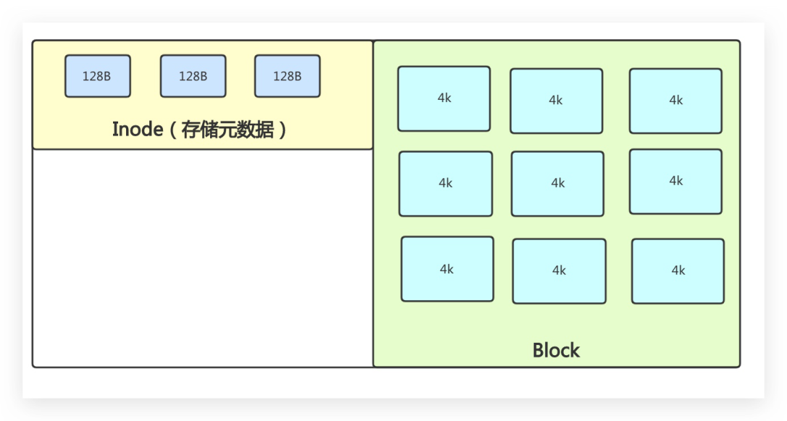

）目前有个1T的磁盘设备，那么它被格式化后会被划分几千万个4k的block块，那如何从这 么多block块中定位到哪个是可用的，哪个是不可用的呢； ·如果进行全盘扫描，一次要扫描几千万个block块，需要花费很长的时间，有什么办法可以 解决？ oinode bitmap：inde 位图 blockbitmap：block位图 128B 128B 128B 4k 4k 4k Inode（存储元数据） 4k 4k 4k 4k 4k 4k Block

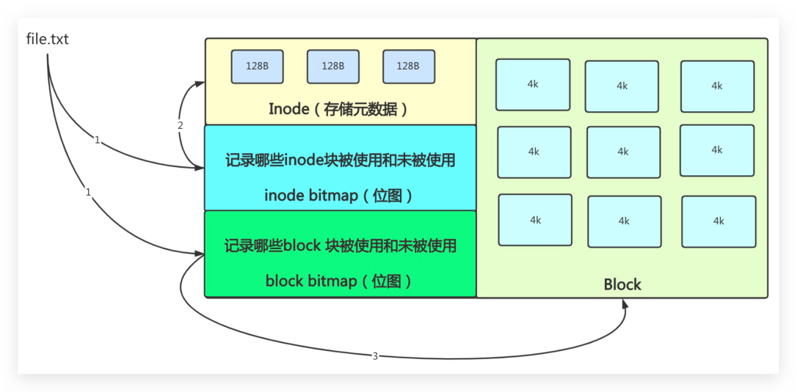

）文件删除原理 。首先删除目录下的文件名称，然后将 inode、block的bitmap 状态修改为可用状态，但 文件并没有真正的被删除，还有恢复的可能性，而一旦有新的数据写入，将其覆盖，数 据才算真正的删除 ·文件移动原理 。仅仅将文件名称从一个目录移动到另一个目录下面，并不会修改其inode和block；

### 6.4文件系统故障修复

·在Linux 系统中，为了增加系统性能，通常系统会将一些数据先写入内存中，然后在刷新 至磁盘中； ·万一公司服务器突然断电或者其他未知原因，再次启动后，会造成文件系统错误；

## 1.添加磁盘，给磁盘分配 1G空间；

##[xo] [root@oldxu ~]# mkfs.xfs /dev/sdc1 [root@oldxu ~]# mount /dev/sdc1 /mnt [root@oldxu ~]# echo"HelLo">/mnt/new.txt

## 2.使用dd模拟磁盘断电损坏，然后取消挂载，会发现无法正常重新挂载；

[root@oldxu ~]# dd if=/dev/zero of=/dev/sdc bs=30oM count=1 [root@oldxu ~]# umount/mnt [root@oldxu~]#mount/dev/sdb1/mnt#无法挂载 file.txt 128B 128B 128B 4k 4k Inode（存储元数据） 4k 4k 4k 记录哪些inode块被使用和未被使用 inodebitmap（位图） 4k 4k 4k 记录哪些block块被使用和未被使用 blockbitmap（位图） Block

## 3.使用xfs_repair修复文件系统；

[root@oldxu ~]# xfs_repair /dev/sdc1

## 4.如出现修复失败，可采用强制修复，但可能会造成部分数据丢失；

[root@oldxu ~]# xfs_repair -L /dev/sdc1

## 7.逻辑卷lvm

### 7.1为何要用lvm

当刚开始安装Linux系统时，往往不能确定每个分区使用的空间大小，只能凭经验分配不科 学； 。如果分区设置的过大，就浪费了磁盘空间； 。如果分区设置的过小，就会导致空间不够； ）如何希望分配的空间过大或过小，都能动态调整，则需要使用到LVM逻辑卷；

### 7.2什么是lvm

LVM是LogicalVolumeManager逻辑卷管理的简写，它是对磁盘分区管理的一种机制; LVM优点： LVM可以创建和管理逻辑卷，而不是直接使用物理硬盘。 LVM可以弹性的管理逻辑卷的扩大缩小，操作简单，而不损坏已存储的数据； LVM可以随意将新的硬盘添加到LVM，以直接扩展已经存在的逻辑卷。 LVM缺点： LVM如果有一个磁盘损坏，整个1vm都坏了，1vm只有动态扩展作用 o解决办法：用RAID+LVM=既有冗余又有动态扩展；

### 7.3lvm相关术语

·物理卷(PV)：将常规的磁盘通过 pvcreate命令对其进行初始化，形成了物理卷。(面粉) ·卷组(VG)：把多个物理卷组成一个逻辑的整体，这样卷组的大小就是多个盘之和。 (大面团) ·逻辑卷(LV)：从卷组中划分需要的空间大小出来，用户仅需对其格式化然后即可挂载使用。 (切成馒头) ）基本单元(PE)：分配的逻辑大小的最小单元，默认4MB，假设分配100MB的空间，则需要创 建25个PE O

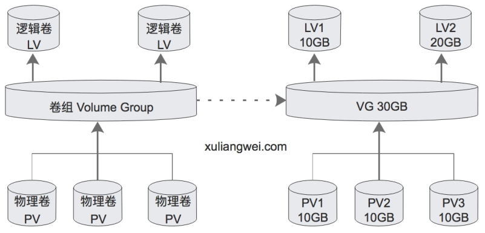

### 7.4lvm配置实践

#### 7.4.1环境与思路

·1.准备三块物理磁盘，建议在虚拟机关闭状态添加，以便更好的实验； ）1.创建物理卷，将普通磁盘转换为物理卷 ·2.创建卷组，将物理卷加入到卷组中 ）3.在卷组中划分逻辑卷，然后挂载使用*

#### 7.4.2创建物理卷

## 1.将磁盘转换为物理卷，并加入pv

[root@linux-node1 ~]# pvcreate/dev/sdb Physical volume "/dev/sdb" successfully created.

## 2.检查 pv 创建情况

[root@linux-node1 ~]# pvs Fmt Attr PSize PFree PV 1vm2 ---

### 1.00g 1.00g

/dev/sdb

#### 7.4.3创建卷组

## 1.创建名为datavg的卷组，然后将物理卷加入进卷组

[root@linux-node1 ~]# vgcreate datavg/dev/sdb Volume group "datavg" successfully created LV1 LV2 逻辑卷 逻辑卷 10GB 20GB LV LV 卷组Volume Group VG30GB 物理卷 物理卷 物理卷 PV1 PV2 PV3 10GB 10GB 10GB PV PV PV

## 2.检查卷组(发现存在一个PV卷)

[root@linux-node1 ~]# vgs #PV#LV#SNAttr Vsize VFree datavg 0 wz--n-1020.00m 1020.00m θ

#### 7.4.4创建逻辑卷

## 1.分配datavg逻辑卷，-n 指定逻辑卷名称，-L指定逻辑卷大小；

#1。分配100M空间给Lv1逻辑卷 [root@linux-node1 ~]# Lvcreate -L 100M -n Lv1 datavg Logical volume "datalv1" created.

## 2.检查逻辑卷

[root@linux-node1 ~]# Lvscan ACTIVE '/dev/datavg/lv1'[100.00 MiB] inherit

#### 7.4.5挂载使用

## 1.格式化逻辑卷

[root@linux-node1 ~]# mkfs.xfs /dev/datavg/lv1

## 2.创建目录并挂载

[root@linux-node1 ~]# mkdir /lv1 [root@linux-node1 ~]# mount/dev/datavg/lv1 /lv1/ [root@linux-node1 ~]# df -h Size Used Avail Use% Mounted on Filesystem 6%/1v1 /dev/mapper/datavg-1v1 97M5.2M 92M

### 7.5lvm卷组管理

#### 7.5.1扩大卷组

## 1.准备新的磁盘加入至pv，然后检查卷组当前的大小;

[root@oldxu ~]# vgs vsize #PV #LV #SN Attr VFree datavg 0wz--n-1020.00m 920.00m

## 2.使用vgextend扩展卷组

## 3.再次检查，发现卷组已经扩大

[root@oldxu ~]# vgs VFree #PV#LV#SNAttr vsize datavg

### 1.99g 1.89g

0 wz--n-

#### 7.5.2缩减卷组

·假设想移除/dev/sdb磁盘，建议先将sdb磁盘数据先迁移到sdc磁盘，然后在移除； ）注意：同一卷组的磁盘才可以进行在线迁移

## 1.检查当前逻辑卷VG中PV使用情况

Fmt Attr PSize PFree PV /dev/sdb vg1 lvm2 a -- 2.00g 1.76g /dev/sdc vg1 1vm2 a -- 2.00g 2.00g

## 2.pvmove在线数据迁移，将sdb的数据迁移至sdc

/dev/sdb:Moved: 100.00%

## 3.检查是否将sdb数据迁移至sdc

Fmt Attr PSize PFree PV /dev/sdb vg1 1vm2 a -- 2.00g 2.00g /dev/sdc vg1 1vm2 a -- 2.00g 1.76g

## 4.从卷组中移除sdb磁盘

Removed "/dev/sdb" from volume group "datavg"

### 7.6Ivm逻辑卷管理

#### 7.6.1扩展逻辑卷

·扩展逻辑卷：取决于vg卷中是否还有剩余的容量 ）注意扩展逻辑卷不能超过卷组VG的总大小 Vsize VFree #PV#LV#SNAttr datavg 0wz--n-1020.00m920.00m

## 1.扩展1v逻辑卷，增加800M分配给逻辑卷

#也可以选择分配卷组中多少百分比给逻辑卷

## 2.扩展逻辑卷后需要更新fs文件系统

#ext文件格式扩容

#### 7.6.2缩小逻辑卷

## 1.卸载挂载点

[root@oldxu ~]# umount /Lv1

## 2.使用1vreduce调整1v大小为1G

[root@oldxu ~]#Lvreduce -L 1G /dev/datavg/lv1

## 3.重新挂载分区

[root@oldxu ~]# mount -t xfs /dev/datavg/Lv1 /lv1

#### 7.6.3删除逻辑卷

## 1.选卸载挂载点，然后在移除逻辑卷

[root@oldxu ~]# umount/dev/datavg/Lv1 [root@oldxu~]#Lvremove/dev/datavg/Lv1

## 2.删除vg

[root@oldxu ~]# vgremove datavg

## 3.删除pv

[root@oldxu ~]# pvremove /dev/sdb [root@oldxu~]#pvremove/dev/sdc

## 8.磁盘阵列RAID

### 8.1什么是RAID

RAID简称磁盘阵列，那什么是阵列： ）古代打仗时会对士兵进行排兵布阵，其目的在于提高士兵整体的作战能力，而不是某个士兵 的战斗力。 ）那么回到磁盘中，我们可以将多块盘组合进行排列，提高磁盘的整体读写能力，和余能 力，通常我们将其称为磁盘阵列。

### 8.2为什么需要RAID

·1.提升读写能力：（在RAID中，可以让很多磁盘同时传输数据，因为多块磁盘在逻辑上感觉 是一个磁盘，所以使用RAID可以达到单个磁盘的几倍、几十倍甚至上百倍的速率。） ）2.保证数据安全：（硬盘非常的脆弱，它经常会坏掉，所以有了RAID。它的目的是将好多个 硬盘组合在一起；就算坏掉一块盘，也不影响服务器对外提供服务，保证磁盘高可用；）

·RAID可以预防数据丢失，但并不能百分百保证数据不丢，所以在使用RAID的同时还需要备 份数据。

### 8.3实现RAID的几种模式

#### 8.3.1 RAID0

RAIDO条带卷，最少两块盘。读写性能好，但没有容错机制。坏一块磁盘数据全丢。 。磁盘空间使用率：100%，成本低 o读性能：N*单块磁盘的读性能； ）写性能：N＊单块磁盘的写性能； ）余：无，任何一块磁盘损坏都将导致数据不可用； o应用场景：无状态服务（web）；

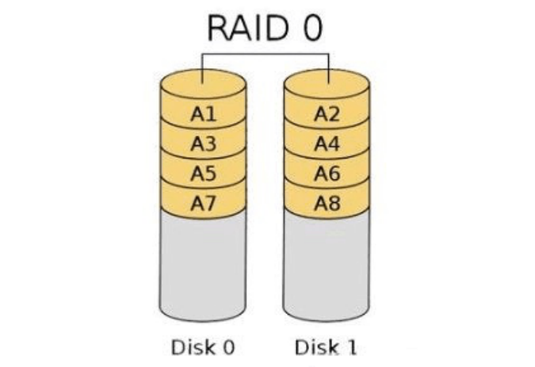

#### 8.3.2 RAID1

RAID1镜像卷，写入性能一般、读取性能快、有容错机制，但磁盘有50%浪费 0磁盘空间使用率：50%成本较高。 o读性能：N*单块磁盘的读性能； ）写性能：1*单块磁盘的写性能； ）余：在这一对镜像盘中有一块磁盘可以使用，那么无影响； ）应用场景：系统盘； RAIDO A2 A1 A4 A3 A5 A6 A7 A8 Disk0 Disk1

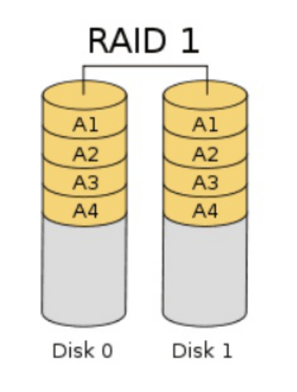

#### 8.3.3 RAID5

RAID5 校验卷，至少3块相同大小的盘，并且只允许坏一块盘，有效空间（N-1），读写速度 快。坏掉一块盘，读的性能会下降； 。磁盘空间利用率：（N-1），即只浪费一块磁盘用于奇偶校验； 读性能：（n-1)\*单块磁盘的读性能，接近RAIDe的读性能； 写性能：（n-1)\*单块磁盘的写性能，写入数据需要做校验值；性能会下降； ）冗余：只允许一块磁盘损坏； 。应用场景：常规选择（al1）；

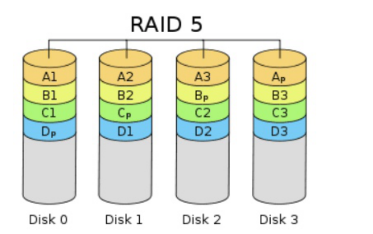

#### 8.3.4 RAID10

RAID10，先做RAID1，在做RAIDO 。磁盘空间利用率：50% RAID 1 A1 A1 A2 A2 A3 A3 A4 A4 Disk0 Disk 1 RAID 5 A2 A3 Ap A1 B2 Bp B1 B3 Cp C2 C1 C3 Dp D1 D2 D3 Disk3 Disk0 Disk 2 Disk 1

。读性能： 。写性能： ）余：只要一对镜像盘中有一块磁盘可以使用就没问题。 ）应用场景：数据库（db）；

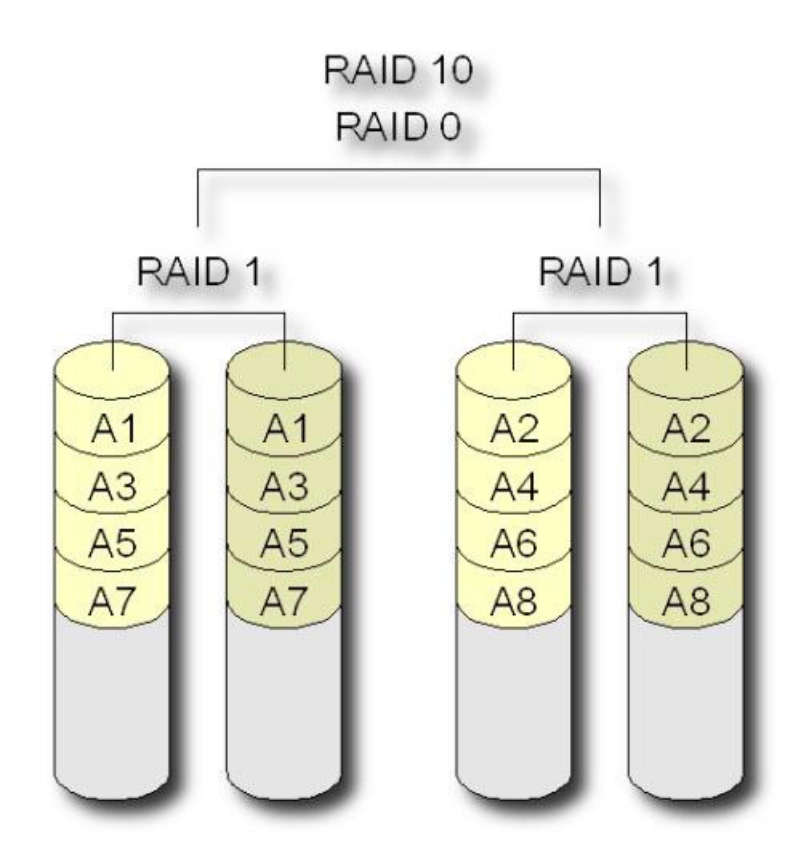

### 8.4实现RAID的方式

#### 8.4.1 硬RAID

·硬RAID使用硬件阵列卡；在安装操作系统之前进入BIOS配置（硬RAID模拟器）

#### 8.4.2 软RAID

·软 RAID通过操作系统软件来实现，性能远不如硬 RAID，仅测试效果；

### 8.5软RAID配置实战

RAID 10 RAIDO RAID 1 RAID1 A2 A1 A1 A2 A3 A3 A4 A4 A5 A5 A6 A6 A8 A7 A7 A8

#### 8.5.1RAID环境准备

由于使用操作系统模拟的软RAID，所以需要在虚拟机上添加9块硬盘，来完成实验；

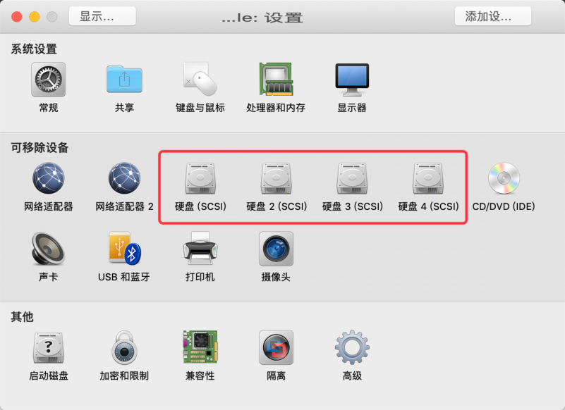

·2.创建软RAID命令mdadm，如果没有使用yuminstallmdadm安装即可 mdadm磁盘阵列命令选项 创建模式： -C：创建阵列; -1：指定指定级别; -n：指定设备数量； 指定设备名称； -v: -x：指定备用磁盘； 管理模式： ■--add -remove 1--fail

#### 8.5.2RAID0实战

创建RAIDO实验环境： raid种类 磁盘 热备盘 raido sdb、sdc

## 1.创建raido

显示... 添加设... ..le:设置 系统设置 处理器和内存 常规 共享 键盘与鼠标 显示器 可移除设备 网络适配器 CD/DVD(IDE) 网络适配器2 硬盘(SCSI) 硬盘2（SCSI） 硬盘3（SCSI） 硬盘4(SCSI) 摄像头 半旭 USB和蓝牙 打印机 其他 隔离 高级 启动磁盘 加密和限制 兼容性

[root@oldxu ~]# mdadm -C -v /dev/mdθ -L θ -n 2 /dev/sdb /dev/sdc

## 2.查看阵列信息

[root@oldxu ~]# mdadm -Ds [root@oldxu ~]# mdadm -D/dev/mdθ

## 3.格式化磁盘并分区挂载

[root@oldxu ~]# mkfs.xfs /dev/mdθ [root@oldxu ~]# mkdir /raide [root@oldxu ~]# mount /dev/mde/raido/ y- fp #[～ nxpto@4oou]

#### 8.5.3RAID1实战

·1）创建RAID1，并添加1个热备盘； ）2）模拟磁盘故障，看备用盘是否会自动顶替故障盘； ·3）从raid1中移出故障盘； 创建RAID1实验环境： raid种类 磁盘 热备盘 sdd、sde、 sdf raid1 ）1.准备sdb、sdc两块盘，然后创建阵列为RAID1，准备sdd 为备用盘。 #1.创建raid1阵列 [root@oldxu ~]# mdadm -C -v /dev/md1 -L 1 -n 2 /dev/sdd /dev/sde -x1 /dev/sdf

## 2.格式化磁盘并分区挂载；

[root@oldxu ~]# mkfs.xfs -f /dev/md1 [root@oldxu ~]# mkdir /raid1 [root@oldxu ~]# mount /dev/md1 /mnt/raid1/

## 3.使用--fail模拟RAID1中数据盘/dev/sde出现故障，观察/dev/sdf备用盘能否自动顶

替故障盘；

[root@oldxu ~]# mdadm/dev/md1 --fail /dev/sde

## 4.检查当然raid状态

[root@oldxu ~]# # mdadm -D/dev/md1 Number Major RaidDevice State Minor C/dev/sdd active sync θ #热备盘已经 /dev/sdf spare rebuilding 在同步数据 faulty #故障盘 /dev/sde

## 5.移除损坏的磁盘

[root@oldxu ~]# mdadm /dev/md1 -r /dev/sde

#### 8.5.4RAID5实战

·1）使用三块盘创建RAID5，使用-x添加热备盘 ）2）模拟损坏一块磁盘，然后查看备用盘是否能顶用（此时是三块磁盘) ·3）然后在模拟一块磁盘损坏，检查数据是否损坏(此时是二块磁盘) 创建RAID5实验环境： raid种类 磁盘 热备盘 sdg、sdh、sdi raid5 sdj

## 1.创建raid5也可以在最后-x添加备用盘

[root@oldxu ~]# mdadm -C -v /dev/md5-L5-n 3 /dev/sdg/dev/sdh/dev/sdi-x1/dev/ sdj

## 2.格式化磁盘并分区挂载

[root@oldxu ~]# mkfs.xfs -f /dev/md5 [root@oldxu ~]# mkdir /mnt/raid5 [root@oldxu ~]# mount /dev/md5 /raid5/ [root@oldxu ~]# echo "Raid">/raid5/file [root@oldxu ~]# mdadm -D/dev/md5

## 3.模拟一块磁盘损坏，查看/dev/sdj备用磁盘是否会顶上

[root@oldxu ~]# mdadm /dev/md5 --fail /dev/sdg [root@oldxu ~]# mdadm -D/dev/md5

## 4.将故障的/dev/sdg盘剔除；

[root@oldxu ~]# mdadm /dev/md5 -r /dev/sdg

## 5.再次模拟一块磁盘损坏，检查数据是否丢失；

[root@oldxu ~]# mdadm /dev/md5 --fail /dev/sdg [root@oldxu ~]# mdadm -D/dev/md5
