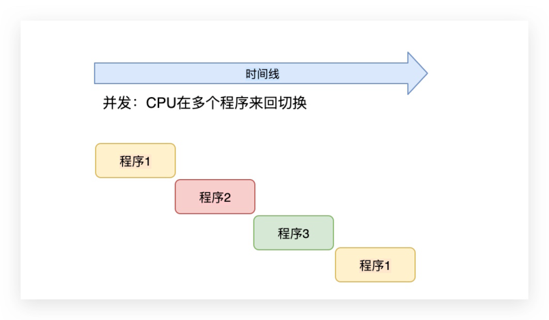
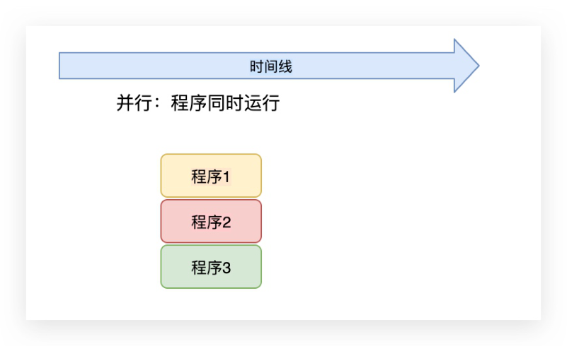
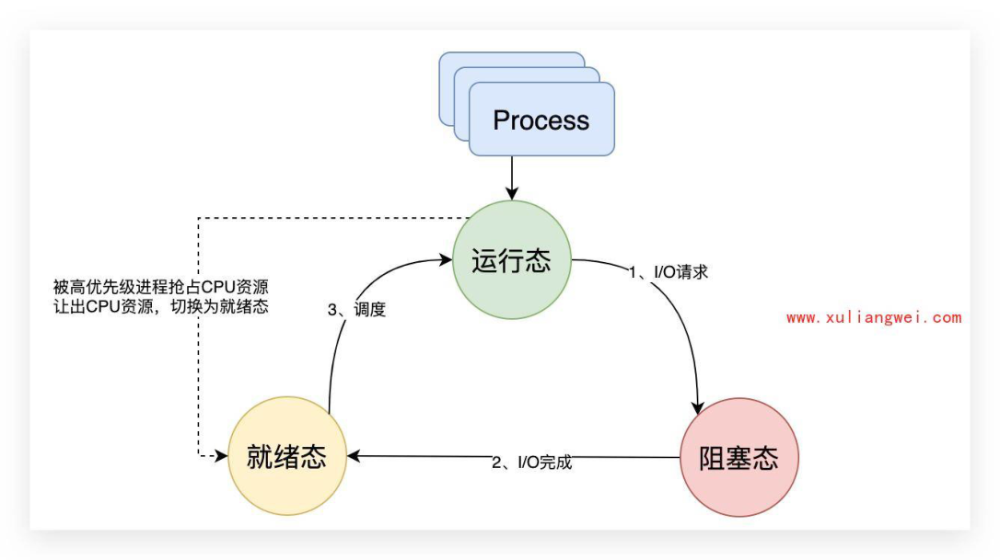
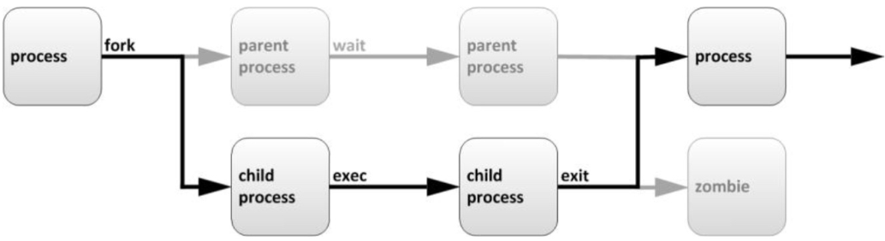
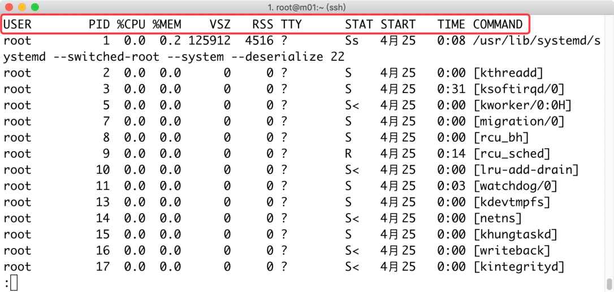
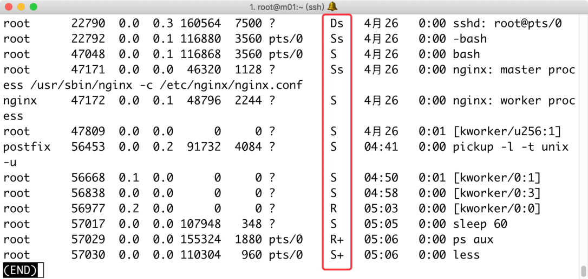
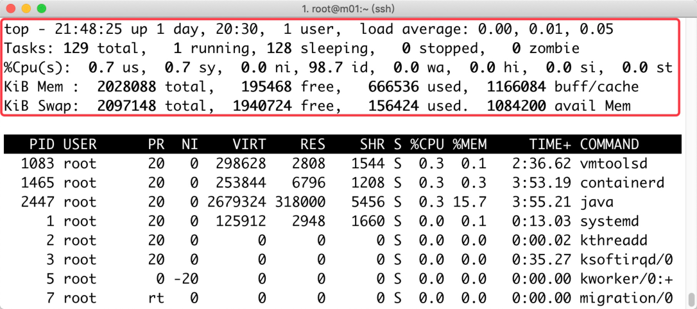

# 13.Linux进程管理-ok

## 13.Linux进程管理

·13.Linux进程管理 。1.进程基本概述

### 11.1程序与进程

### 1.2进程与线程

### 1.3并发与并行

### 1.4 进程运行的状态

### 11.5进程的生命周期

。2.进程运行状态监控 ·2.1静态监控进程ps ·2.1.1每列指标详解 ·2.1.2查看进程ppid

#### 2.1.3查看进程树结构

#### 2.1.4查看用户进程

#### 2.1.2STAT运行状态

### 2.2进程状态模拟实践

·2.2.1运行进程状态R

#### 2.2.2暂停进程状态T

#### 2.2.3不可中断进程D

#### 2.2.4实践僵尸进程Z

#### 2.2.5实践孤儿进程

#### 2.2.6实践多线程SI

#### 2.2.7高优先级进程S<

·2.2.8低优先级进程SN

### 2.2 动态监控进程top

·2.1.1top命令选项 ·2.1.2top内部选项 ·2.1.3 top字段含义 ·2.1.4如何理解中断 ·2.1.5内存相关命令 。3.管理进程状态 ·3.1系统支持的信号

### 13.2关闭进程kill

### 3.3关闭进程pkill

## 4.进程优先级

·4.1什么是进程优先级

### 14.2为何需要优先级

### 14.3进程如何配置优先级

！4.4进程优先级如何查看

### 14.5指定进程启动优先级nice

### 14.6修改进程优先级renice

o5.后台进程管理

### 5.1什么是后台进程

### 5.2为什么需要后台运行

### 5.3如何将进程转为后台

·5.3.1 nohup方式 ·5.3.2screen方式 。6.系统平均负载

### 6.1什么是平均负载

■6.1.1可运行状态 ■6.1.2不可中断状态

### 6.2平均负载为多少时合理

### 6.4平均负载与CPU使用率

### 6.5平均负载案例分析实战

#### 6.5.1场景1-CPU密集型进程

#### 6.5.2场景2-1/0密集型进程

#### 6.5.3场景3-大量的进程

#### 6.5.4总结

徐亮伟，多年互联网运维工作经验，曾负责过大规模集群架构自动化运维管理工作。擅长 Web集群架构与自动化运维，曾负责国内某大型电商运维工作。

## 1.进程基本概述

### 1.1程序与进程

）什么是程序：开发编写的源代码，封装为产品，比如（微信、钉钉、等等）都称为程序； ）什么是进程：程序运行的过程，我们称为进程，它主要是用来控制计算机硬件运行我们的程 序； ·程序与进程区别： 。程序：程序是数据+指令的集合，是一个静态的概念，同时程序可以长期存在系统中；

进程：进程是程序运行的过程，是一个动态的概念，在进程运行的过程中，系统会有各 种指标来表示当前运行的状态，同时进程会随着程序的终止而销毁，不会永久存在系统 中；

### 1.2进程与线程

·假设需要运行"360安全卫士“程序，会进行资源申请，首先系统申请一块内存空间、然后从 硬盘中将代码读取到内存、最后进行其他资源的申请，这个申请资源的过程，我们称为进程 （资源单位）； ）当运行该进程中的"病毒扫描、漏洞查找、垃圾清理"等功能，通常我们会将该功能称为进程 中的线程，线程是运行代码的过程，它是一个（执行单位），是进程中的更细的单位，如果 该进程有多个线程，线程与线程之间互相不受影响，同时多线程之间可以实现数据共享； ）工厂流水线例子：工厂(操作系统）-->进程(车间）-->线程(流水线作业)

### 1.3并发与并行

·并发：多个任务看起来是同时运行，这是一种假并行（CPU在任务中来回切换）；

·并行：多个任务是真正的同时运行（并行必须有多核多核CPU才可以实现）； 时间线 并发：CPU在多个程序来回切换 程序1 程序2 程序3 程序1

### 1.4进程运行的状态

一般来说，进程有三个状态，即就绪状态，运行状态，阻塞状态； 运行态：进程占用CPU，并在CPU上运行； 就绪态：进程已经具备运行条件，但需要等待CPU的调度才可运行； ）阻塞态：进程因等待某件事发生而暂时不能运行；

上述三种状态之间转换分为如下几种情况； ·运行-->阻塞：进程发生I/0 操作，需等待事件，而继续无法执行，则进程由运行状态变为 时间线 并行：程序同时运行 程序1 程序2 程序3 Process 运行态 、V/O请求 被高优先级进程抢占CPU资源 让出CPU资源，切换为就绪态 3、调度 就绪态 阻塞态 2、1/O完成

阻塞状态； ）阻塞-->就绪：进程所等待的事件已经完成，但没办法直接运行，需要进入就绪队列，等待 调度； ）就绪-->运行：运行的进程时间片已经用完，CPU会从就绪队列中选择合适的进程分配CPU ·运行-->就绪： 。1、进程占用CPU的时间过长，而系统分配给该进程占用CPU的时间是有限的； 。2、当有更高优先级的进程要运行时，该进程需要让出CPU，由运行状态转变为就绪状 态；

### 1.5进程的生命周期

·生命周期就是指一个对象的生老病死。用处很广

当父进程接收到任务调度时，会通过fock派生子进程来处理，那么子进程会继承父进程属性。

## 1.子进程在处理任务代码时，父进程其实不会进入等待，其运行过程是由linux系统进行调度的。

## 2.子进程在处理任务代码后，会执行退出，然后唤醒父进程来回收子进程的资源。

## 3.如果子进程在处理任务代码过程中异常退出，而父进程却没有回收子进程资源，会导致子进程

虽然运行实体已经消失，但仍然在内核的进程表中占据一条记录，长期下去对于系统资源是一个 浪费。 (僵尸进程)

## 4.如果子进程在处理任务过程中，父进程退出了，子进程没有退出，那么这些子进程就没有父进

程来管理了，由系统的system进程管理。（孤儿进程） PS：每个进程都父进程的PPID，子进程则叫PID。 例：假设现在我是蒋先生（system进程)....故事持续中....僵尸进程与孤儿进程区别

## 2.进程运行状态监控

·程序在运行后，我们需要了解进程的运行状态。查看进程的状态分为： 。静态查看 。动态查看

### 2.1静态监控进程ps

parent fork parent wait process process process process child child exit exec zombie process process

ps-aux常用组合，查看进程用户、PID、占用cpu百分比、占用内存百分比、状态、执行 的命令等

#### 2.1.1每列指标详解

USER：启动进程的用户 PID：进程运行的ID号 %CPU：进程占用CPU百分比 %MEM：进程占用内存百分比 VSZ：进程占用虚拟内存大小(单位KB) RSS：进程占用物理内存实际大小(单位KB) TTY：进程是由哪个终端运行启动的tty1、pts/θ等？表示内核程序与终端无关 STAT：进程运行过程中的状态manps（/STATE) START：进程的启动时间 TIME：进程占用CPU的总时间(为0表示还没超过秒) COMMAND：程序的运行指令，［］属于内核态的进程。没有【」属于用户态进程。

#### 2.1.2查看进程ppid

ppid指定的是父进程； [root@oldxu ~]# ps -ef lgrep sshd 1425 07月19？ 00:00:00 /usr/sbin/sshd -D 07月19? 00:00:02 sshd: root@pts/1 32067 1425 52604 1425 0 15:53 ? 00:00:01 sshd: root@pts/0

## 1. root@m01:~ (ssh)

USER RSS TTY PID %CPU %MEM VSZ STAT START TIME COMMAND 4月25 0:08 /usr/lib/systemd/s

### 0.2 125912

4516 Ss ？ ystemd --switched-root --system --deserialize 22 0？ 4月25 S [kthreadd] 0:00 0？ 4月25 0:31 S [ksoftirqd/0] [kworker/0:0H] 0？ >S 4月25 0:00 4月25 0? S 00:0 [migration/0] 0？ S 4月25 [rcu_bh] 0:00 0？ 4月25 R 0:14 [rcu_sched] >S [lru-add-drain] 0？ 4月25 00:0 0？ S 4月25 0:03 [watchdog/0] 0？ S 4月25 00:0 [kdevtmpfs] 0? S< [netns] 4月25 00:0 0？ 4月25 S 00:0 [khungtaskd] 0？ >S 4月25 00:0 [writeback] 0？ >S 4月25 0:00 [kintegrityd] :0 · · · · · ·

#### 2.1.3查看进程树结构

通过pstree可以查看进程树状结构 [root@oldxu ~]# pstree -p：选项指定查看某个进程的树状结构 [root@oldxu ~]# pstree -p 1425 sshd(1425)-Tsshd(32067)———bash(32069) —-sshd(52604)——-bash(52606)——-pstree(67809) sleep(67440) sleep(67506)

#### 2.1.4查看用户进程

## 1.使用普通用户运行进程

0000t daa7s 3- nxp7o- ns #[~ nxpto@oou] [3]68021

## 2.使用pgrep过滤用户运行进程名称，以及进程ID

[root@oldxu ~]# pgrep -l -u oldxu 68022 sleep #-a：表示列出进程pid以及详细命令 [root@oldxu ~]# pgrep -a -u oldxu 68022 sleep 10000

#### 2.1.2STAT运行状态

STAT状态的S、Ss、S+、R、R、S+等等，都是什么意思？

描述 描述 STAT基本状态 STAT状态+符号 进程是控制进程，Ss进程的领导者， 进程运行 R S 父进程 进程运行在高优先级上，S<优先级较 S 可中断睡眠 < 高的进程 进程运行在低优先级上，SN优先级较 进程被暂停 N T 低的进程 不可中断进 D 程 当前进程运行在前台，R+该表示进程 + 在前台运行 进程是多线程的，SI表示进程是以线程 僵尸进程 Z 方式运行

### 2.2进程状态模拟实践

#### 2.2.1运行进程状态R

## 1.编写如下脚本

[root@oldxu ~]# cat > while.sh <<EOF while true;do ((1+1));done EOF

## 1.root@m01:~(ssh)

22790 Ds 4月26 0:00 sshd: root@pts/0 7500？

### 0.3 160564

Ss 0:00 -bash 22792

### 0.1 116880

4月26 3560 pts/0 3560 pts/0 S 4月26 47048

### 0.1 116868

0:00 bash Ss 4月26 0:00 nginx: master proc 47171 46320 1128? ess /usr/sbin/nginx -c /etc/nginx/nginx.conf 47172 0:00 nginx: worker proc nginx S 4月26

### 0.1487962244?

ess 0？ 4月26 47809 0:01 [kworker/u256:1] S 56453 postfix 91732 4084? S 04:41 0:00 pickup -l -t unix

### 0.2

-u 0:01 [kworker/0:1] 0？ 56668

### 0.1

S 04:50 [kworker/0:3] 0？ S 56838 04:58 00:0 [kworker/0:0] 0？ 56977

### 0.2

R 05:03 00:0 S

### 0.0 107948

57017 348? 05:05 0:00 sleep 60 0:00 ps aux R+ 57029

### 0.0 155324

1880 pts/0 05:06 +S 960 pts/0 0:00 less 57030

### 0.0 110304

05:06 (END)

## 2.运行该脚本，检查运行状态是否为R

[root@oldxu ~]# sh while.sh [root@oldxu ~]# ps -aux Igrep while 58784 93.8 0.2 113172 1192 pts/0 0:08 sh while.sh R+ 13:30

#### 2.2.2暂停进程状态T

## 1.在终端1上运行vim

[root@oldxu ~]# vim new_file

## 2.在终端2上运行ps命令查看状态

#S表示睡眠模式，+表示前台运行 [root@oldxu ~]# ps aux/grep new_file

### 30.4 0.2 151788

5320 pts/1 58118 S+ 22:11 0:00 new_file 996 pts/0 58120 22:12 0:00 grep --color=auto

### 0.0112720

R+ new_file #在终端1上挂起vim命令，按下：ctrL+z

## 3.回到终端2再次运行ps命令查看状态

#T表示停止状态 [root@oldxu ~]# ps auxlgrep new_file 58118 0.1 0.2 151788 5320 pts/1 22:11 0:00 vim new_file T

#### 2.2.3不可中断进程D

## 1.使用tar 打包文件时，可以通过终端不断查看状态，由 S+，R+、D+

[root@oldxu ~]# tar-czf etc.tar.gz/etc//usr//var/ daue-daueuezdauexne sd#[nxpto@oou] 58467 5.5 0.2 127924 5456 pts/1 22:22 0:04 tar -czf etc.tar. R+ gz /etc/ daub - daublupz daub/xnp sd #[~ nxpto@zoou] 58467 5.5 0.2 127088 4708 pts/1 22:22 0:03 tar -czf etc.tar. S+ gz /etc/ daub - daublupz daub/xnp sd #[~ nxpto@zoou] 58467 5.6 0.2 127232 4708 pts/1 22:22 D+ 0:03 tar -czf etc.tar. gz /etc/

## 2.使用dd命令创建磁盘空间，状态会由R+、D+

[root@oldxu~]# dd if=/dev/zeroof=/dev/nullbs=100oM count=100 #观察状态 "77nu/Aap/.daub| xnp- sd #[~ nxpto@zoou] root 5813 40 71.7 113 344 pts/0 D+ 13:32 0:13 dd if=/dev/zero of=/dev/null bs=1000M count=100

#### 2.2.4实践僵尸进程Z

## 1.编写Python脚本，模拟僵尸进程；c语言的僵尸进程代码

[root@oldxu ~]# cat zombie.py #!/usr/bin/envpython # encoding: utf-8 frommultiprocessing importProcess import time import os def task(): (()ptda8·so % .s% <-- aI)uTud time.sleep(10) if __name_ main = for i in range(3): p=Process(target=task) p.start() print("父进程ID-->%s"% os·getpid()) time.sleep(100000)

## 2.运行python 脚本

[root@oldxu ~]# python zombile.py 父进程ID－-〉59220 子进程ID－-〉59221 子进程ID-->59222 子进程ID-->59223

## 3.通过psaux查看进程状态；

[root@oldxu ~]# ps -aux Igrep python 0:00 python zombile.py

### 1.2 151200 5772 pts/0

59220 S+ 13:36 θ pts/0 59221 Z+ 13:36 0:00 [python]<defunct > 0 pts/0 59222 Z+ 13:36 0:00 [python] <defunct > θ pts/0 Z+ 0:00[python]<defunct 13:36 59223 θ

## 4.僵尸进程无法杀死，只能通过杀父进程，从而回收掉僵尸进程；

#kiLL僵尸进程没有反应，所以直接kiLL父进程 [root@oldxu ~]#kill -9 59220

#### 2.2.5实践孤儿进程

## 1.在窗口1执行如下命令

[root@oldxu ~]# ping www.baidu.com &>/dev/nulL & [1] 52428

## 2.在窗口2过滤 ping 进程，杀死其父进程

[root@oldxu ~]# ps -ef / grep ping / grep -v grep 52428 52407 0 20:45 pts/0 00:00:00 ping www.baidu.com #强制杀死父进程 [root@oldxu~]#kill -952407

## 3.再次查看进程，会发现该进程被系统最高进程pid1接管

#孤儿进程被PID为1的父进程接管 [root@oldxu ~]# ps-ef / grep ping 52428 1 020:45? 00:00:00 ping 10.0.0.2 #直接kiLL进程即可关闭 [root@oldxu ~]# kill 52428

#### 2.2.6实践多线程SI

## 1.使用python脚本编写多线程程序

[root@oldxu ~]# cat multi_thread.py #!/usr/bin/env python from threading import Thread import time import os def task(): time.sleep(200) if __name_ main print(os.getpid()) for i in range(10): s=Thread(target=task) s.start()

## 2.运行python脚本程序

[root@oldxu ~]# python multi_thread.py 59691

## 3.检查python程序状态

#sL表示多线程 [root@oldxu ~]# ps auxlgrep python 59691 0.0 1.0 740280 5000 pts/1 Sl+13:43 0:00 python multi_thre ad.py #通过pstree查看线程 [root@oldxu ~]# pstree -p 59691 python(59691)—T-{python}(59692) {python}(59693) {python}(59694) -{python}(59695) -{python}(59696) -{python}(59697) {python}(59698) —{python}(59699) -{python}(59700) {python}(59701)

#### 2.2.7高优先级进程S<

## 1.执行如下命令，让进程在高优先级下运行

[root@oldxu ~]# nice -n -20 sleep 30000 & [1] 67440

## 2.查看进程状态，看是否在高优先级下运行

[root@oldxu ~]# ps -aux lgrep sleep 20:20 0:00 sleep 30000

#### 674400.00.0107948

352 pts/0 S<

#### 2.2.8低优先级进程SN

## 1.执行如下命令，让进程在低优先级下运行

[root@oldxu ~]# nice -n 20 sleep 50000 & [2] 67506

## 2.查看进程状态，看是否在低优先级下运行

[root@oldxu ~]# ps -aux lgrep sleep 67506 0.0 0.0 107948 0:00 sleep 50000 SN 20:21 352 pts/0

### 2.2动态监控进程top

·使用top命令查看当前的进程状态(动态)

#### 2.1.1 top命令选项

·执行top命令时可以指定的命令选项 -d：刷新时间 -p：指定pid -u：指定用户 示例用法： #仅查看指定进程动态详情 [root@oldxu ~]# top -d 1 -p pid [root@oldxu ~]# top -d 1 -p $(pgrep nginx) o

#动态查看oLdxu运行的进程 [root@oldxu ~]# top -d 1 -u oldxu

#### 2.1.2 top内部选项

·执行top后可使用的选项 c：改变top刷新频率（一般不建议设定） P：按CPU进行排序； M：以内存进行排序； R：对排序后的结果进行倒序； f：自定义显示的字段，比如打印ppid k：指定杀死某个id 1：显示cpu核心数 z：以高亮显示数据 b：高亮显示处于R状态的进程

#### 2.1.3 top字段含义

top 字段含义 Tasks：129total：当然进程的总数 1 running：正在运行的进程数量 128sleeping：睡眠的进程数量 θstopped：停止的进程数量 θzombie：僵尸进程数量 %Cpu(s）含义 o o

## 1. root@m01:~ (ssh)

top - 21:48:25 up 1 day，20:30， 1 user, load average:0.00,0.01,0.05 1 running,128 sleeping, Tasks: 129 total， 0 stopped， 0zombie

### 0.7sy，

%Cpu(s): 0.7 us，(

### 0.0 ni，98.7 id，0.0 wa，0.0 hi，0.0 si，0.0 st

195468 free, KiB Mem : 1166084buff/cache 666536used， 2028088 total, 1940724 free, KiB Swap: 2097148 total, 156424 used. 1084200avail Mem SHR S %CPU %MEM PID USER NI VIRT RES PR TIME+ COMMAND 298628

### 0.3

2:36.62 vmtoolsd 1083 root

### 0.1

2808 1544 S 1465 root

### 0.3

253844 6796

### 0.3

3:53.19 containerd 1208 S 5456

### 15.7

2447 root

### 0.3

3:55.21 2679324 318000 S java 2948 systemd 1 root 125912 1660

### 0.1

0:13.03 S kthreadd 2 root 0:00.02 S 3 root S 0:35.27 ksoftirqd/0 0:00.00 kworker/0:+ 5 root S 7 root 0:00.00 migration/0 rt S

### 0.7us：系统用户进程使用cPU百分比

### 0.7sy：内核中的进程占用cPU百分比，通常内核是于硬件进行交互

### 98.7id：空闲cPU的百分比

### 0.0wa：cPU等待IO完成的时间

### 0.0 hi：硬中断，占的cPu百分比

### 0.0si：软中断，占的cPU百分比

### 0.0st：比如虚拟机占用物理CPU的时间

#### 2.1.4如何理解中断

）如何理解中断

#### 2.1.5内存相关命令

一般查看内存使用free命令，我们需要了解每列含义，以及计算公式： total总内存计算公式：used+free+buffer+cache=total used已使用内存计算公式：total－free－buffers－cache=used（包含share) free未被使用的内存计算公式：total－used－buffer－cache=free available可获得内存计算公式：free+（buffer+cache可释放的空间）=available [root@web01 ~]# free -m used free sharedbuff/cache total available Mem: 2047 Swap: 2047 ）需要注意： free：表示的是当前完全没有被程序使用的内存； cache在有需要时，是可以被释放出来以供其它进程使用的; available表示系统目前能提供给新应用程序使用的内存； 手动释放内存buffer/cache o第一步：sync 。 第二步：echo"3">/proc/sys/vm/drop_caches

## 3.管理进程状态

当程序运行为进程，如果需要关闭进程，则需要使用kill、killall，pkill等命令对进程ID发 送关闭信号

### 3.1系统支持的信号

o

）使用ki11-1列出当前系统所支持的信号、虽然支持的信号很多，但我们仅以最常用的3个 信号为例 1（SIGHUP）：通常用来重新加载配置文件 ）9（SIGKILL）：强制杀死进程 ）15（SIGTERM）：终止进程，默认kill信号

### 3.2关闭进程kill

## 1.安装vsftpd服务，然后启动；

[root@oldxu ~]# yum -y install vsftpd [root@oldxu~]#systemctlstartvsftpd

## 2.修改vsftpd的配置文件，然后发送重载信号；

#改变路径 fuoo°pdspdsa/ <<do/=zoouuou,oya #[ xpto@oou] #重载服务 [root@oldxu ~]# kill -1 81379

## 3.发送停止进程信号

[root@oldxu ~]# kill -15 9160

## 4.发送强制停止信号，当无法停止服务时，可强制终止信号；

[root@oldxu ~]# kill -9 9160

### 3.3关闭进程pkill

## 1.通过pkill、killall指定进程服务名称，然后将其进程关闭

[root@oldxu ~]# pkill nginx [root@oldxu ~]# killall nginx

## 2.使用pkil1将远程连接用户t下线；

[root@oldxu ~]# pkill-9 -t pts/0

## 4.进程优先级

### 4.1什么是进程优先级

·优先级指的是优先享受资源，比如排队买票时，军人优先、老人优先。等等

### 4.2为何需要优先级

·举个例子：海底捞火锅正常情况下响应就特别慢，那么当节假日时人员突增会导致处理请求 特别慢； 。那假设我是海底捞VIP客户(最高优先级)，无论多么繁忙，我都无需排队，海底捞人员会 直接服务于我，满足我的需求。 o如果我不是VIP的人员(较低优先级)则进入排队等待状态；

### 4.3进程如何配置优先级

）在启动进程时，为不同的进程使用不同的调度策略。 nice值越高：表示优先级越低，例如+19，该进程容易将cPu使用量让给其他进程； nice值越低：表示优先级越高，例如-2θ，该进程不倾向于让出cPU；

### 4.4进程优先级如何查看

## 1.使用top命令查看优先级；

#NI：显示nice值，默认是θ。 #PR：显示nice值，-20映射到0，+19映射到39 TIME+ COMMAND PID USER PRNI RES SHR S %CPU %MEM VIRT 1544 S 0.3 0.1 2:49.28 vmtoolsd 1083 root 0298628 2808 0:00.00 kworker/0:+ 0-20 0S 0.0 0.0 θ θ

## 2.使用ps命令查看进程优先级；

[root@oldxu ~]# vim [root@oldxu ~]# ps axo command,nice Igrep vim/grep -v grep vim

### 4.5指定进程启动优先级nice

## 1.启动vim并且指定程序优先级为-5

[root@oldxu ~]# nice -n -5 vim & [1]98417

## 2.查看当前vim进程的优先级

[root@oldxu ~]# ps axo pid,command,nice Igrep 98417 98417vim -5

### 4.6修改进程优先级renice

## 1.查看当前正在运行的sshd进程优先级状态

[root@oldxu ~]# ps axo pid,command,nice Igrep [s]shd 70840 sshd: root@pts/2 98002 /usr/sbin/sshd -D

## 2.调整sshd主进程的优先级

[root@oldxu ~]# renice -n -20 98002 98002 （process ID）old priority 0,new priority -20

## 3.调整之后需要退出终端，重新打开一个新终端

[root@oldxu ~]# ps axo pid,command,nice Igrep [s]shd 70840 sshd: root@pts/2 98002 /usr/sbin/sshd -D -20 [root@oldxu ~]# exit

## 4.再次登陆sshd服务，会由主进程fork子sshd进程(那么子进程会继承主进程的优先级)

[root@oldxu ~]# ps axo pid,command,nice Igrep [s]shd -20 98002 /usr/sbin/sshd -D -20 98122 sshd: root@pts/0

## 5.后台进程管理

### 5.1什么是后台进程

通常进程都会在终端前台运行，一旦关闭终端，进程也会随着结束； 那么此时我们就希望进程能在后台运行，就是将在前台运行的进程放入后台运行，这样及时我们 关闭了终端也不影响进程的正常运行。

### 5.2为什么需要后台运行

比如：我们此前在国内服务器往国外服务器传输大文件时，由于网络的问题需要传输很久，如果 在传输的过程中出现网络抖动或者不小心关闭了终端则会导致传输失败，如果能将传输的进程放 入后台，是不是就能解决此类问题了。

### 5.3如何将进程转为后台

早期的时候大家都选择使用nohup +&符号将进程放入后台，然后在使用 jobs、bg、fg 等方式 查看进程状态，但太麻烦了也不直观，所以我们推荐使用screen。

#### 5.3.1nohup方式

## 1.使用nohup将前台进程转换后台运行

[root@oldxu~]#nohupsleep3000&

## 2.查看进程运行情况

[root@oldxu ~]# ps aux Igrep sleep 75118 74766 0 11:10 pts/0 00:00:00 sleep 3000

## 3.使用jobbgfg等方式查看后台作业

[root@oldxu~]#jobs#查看后台作业 [1]+ Running sleep 3000 & [root@ansible ~]# fg %1 #转为前台运行 #转为后台运行 [root@ansible ~]# bg %1

#### 5.3.2screen方式

## 1.安装screen 工具

[root@web ~]# yum install screen -y

## 2.开启一个screen子窗口，可以通过-s为其指定名称

[root@web~]# screen-S wget_soft

## 3.在screen窗口中执行任务，可以执行前台运行的任务

## 4.平滑退出screen，但不会终止screen 中的前台任务

#ctrl+a+d

## 5.查看当前有多少screen正在运行

[root@web ~]# screen -List There is a screen on:

## 22058.wget_soft (Detached)

1 Socket in /var/run/screen/S-root.

## 6.可以通过screenid或screen标签名称进入

[root@web ~]# screen -r wget_soft [root@web ~]# screen -r 22058 #退出进程，结束screen [root@web ~]# exit

## 6.系统平均负载

）每次发现系统变慢时，通常做的第一件事，就是执行top或uptime来了解系统的负载情 况。 比如像下面这样，我在命令行里输入了uptime命令，系统也随即给出了结果。

[root@oldxu~]# uptime 04:49:26 up 2 days, 2:33, 2 users, load average: 0.70, 0.04, 0.05 #前面几列，它们分别是当前时间、系统运行时间以及正在登录用户数。 #而最后三个数字呢，依次则是过去1分钟、5分钟、15分钟的平均负载（LoadAverage）。

### 6.1什么是平均负载

）平均负载是单位时间内的CPU使用率吗； 。上面的0.70代表CPU使用率是70%其实不是； ·那如何理解平均负载： 。平均负载是指单位时间内，系统处于可运行状态和不可中断状态的平均进程数，也就是 平均活跃进程数；或者理解"平均负载"是"单位时间内的活跃进程数"； o平均负载与CPU使用率并没有直接关系；

#### 6.1.1可运行状态

）可运行状态进程： ·指正在使用CPU或者正在等待CPU的进程，也就是我们ps命令看到处于R状态的进程

#### 6.1.2不可中断状态

·不可中断进程： ）系统中最常见的是等待硬件设备的I/o响应，通过ps命令中看到D（Disk Sleep）的进 程。 例如：当一个进程向磁盘读写数据时，为了保证数据的一致性，在得到磁盘回复前，它是不 能被其他进程或者中断打断的，这个时候的进程就处于不可中断状态。如果此时的进程被打 断了，就容易出现磁盘数据与进程数据不一致的问题； ）所以，不可中断状态实际上是系统对进程和硬件设备的一种保护机制；

### 6.2平均负载为多少时合理

·理想的状态是每个CPU上都刚好运行着一个进程，这样每个CPU都得到了充分利用。 ）所以在评判平均负载时，首先你要知道系统有几个cPU通过top命令获取， 或/proc/cpuinfo ）示例：假设现在在4、2、1核的CPU上，如果平均负载为2时，意味着什么; o1.在4个CPU的系统上，意味着CPU有50%的空闲； 。2.在2个CPU的系统上，意味着所有的CPU都刚好被完全占用； o3.而1个CPU的系统上，则意味着有一半的进程竞争不到CPU；

·平均负载有三个数值，我们应该关注哪个呢？ ·实际上，平均负载中的三个指标我们其实都需要关注。（就好比一天的天气要结合起来 看；） ·1分钟、5分钟、15分钟的三个值基本相同，或者相差不大，那就说明系统负载很平稳； ）1分钟的值小于15分钟的值，说明系统最近1分钟的负载在减少，而过去15分钟内却有很大 的负载； ·如果1分钟的值远大于15分钟的值，就说明最近1分钟的负载在增加，这种增加有可能只 是临时性的，也有可能还会持续上升，所以就需要持续观察。 ）一旦1分钟的平均负载接近或超过了CPU的个数，就意味看系统正在发生过载的问题，这 时就得分析问题，并要想办法优化了； ·例：假设我们在有2个CPU系统上看到平均负载为2.73，6.90，12.98 。那么说明在过去1分钟内，系统有136%的超载（2.73/2=136%) 。而在过去5分钟内，有345%的超载（6.90/2=345%) ）而在过去15分钟内，有649%的超载（12.98/2=649%) 。但从整体趋势来看，系统的负载是在逐步的降低。

### 6.4平均负载与CPU使用率

·在实际工作中，我们经常容易把平均负载和CPU使用率混淆，所以在这里，我也做一个区 分； ）既然平均负载代表的是活跃进程数，那平均负载高了，不就意味看CPU使用率高吗？ ·我们回到平均负载的含义上来，平均负载是指单位时间内，处于可运行状态和不可中断状态 的进程数； ·所以，它不仅包括了正在使用CPU的进程，还包括等待CPU和等待I/O的进程； ）而CPU使用率，是单位时间内CPU繁忙情况的统计，跟平均负载并不一定完全对应。比如： 。CPU密集型进程，使用大量CPU计算会导致平均负载升高，此时这两者是一致的； ）I/O密集型进程，等待I/O也会导致平均负载升高，但CPU使用率不一定很高； 大量的CPU进程调度也会导致平均负载升高，此时的CPU使用率也会比较高；

### 6.5平均负载案例分析实战

·演示这三种常场景，并用stress、mpstat、pidstat等工具，找出平均负载升高的根源； stress是Linux系统压力测试工具，这里我们用作异常进程模拟平均负载升高的场景； mpstat是多核cPu性能分析工具，用来实时查看每个cPU的性能指标，及所有cPu的平均 指标； pidstat是一个常用的进程性能分析工具，用来实时查看进程的cPU、Mem、I/o等性能指 标； # yum install stress sysstat -y

#如果出现无法使用mpstat、pidstat命令查看%wait指标建议更新下软件包 wget http://pagesperso-orange.fr/sebastien.godard/sysstat-11.7.3-1.x86_64.rpm rpm -Uvh sysstat-11.7.3-1.x86_64.rpm

#### 6.5.1场景1-CPU密集型进程

## 1.第一个终端运行stress命令，模拟一个cPu使用率100%的场景：

[root@oldxu ~]# stress --cpu 1 --timeout 600

## 2.第二个终端运行uptime查看平均负载的变化情况

#使用watch-d参数表示高亮显示变化的区域（注意负载会持续升高） [root@oldxu ~]# watch-d uptime 17:27:44 up 2 days, 3:11, 3 users，1 load average: 1.10,0.30,0.17

## 3.在第三个终端运行mpstat查看cPu使用率的变化情况

#-PALL表示监控所有CPU，后面数字5表示间隔5秒后输出一组数据 [root@oldxu ~]# mpstat -P ALL 5 2019年04月29日 _x86_64_ (1 CPU) Linux 3.10.0-957.1.3.e17.x86_64 (m01) %soft %steal %guest % 17时32分03秒CPU %sys %iowait %irq %usr %nice gnice %idle 17时32分08秒all

### 99.80

### 0.00

### 0.20

### 0.00

### 0.00

### 0.00

### 0.00

### 0.00

### 0.00

### 0.00

17时32分08秒

### 99.80

### 0.00

### 0.20

### 0.00

### 0.00

### 0.00

### 0.00

### 0.00

### 0.00

### 0.00

#单核CPU所以只有一个aLL和θ

## 4.从终端二中可以看到，1分钟的平均负载会慢慢增加到1.00，而从终端三中还可以看到，正好

有一个cPu的使用率为100%，但它的iowait为0。这说明，平均负载的升高正是由于cPU 使用率为100%。那么，到底是哪个进程导致了cPU使用率为100%呢？可以使用pidstat来 查询 #间隔5秒后输出一组数据 [root@oldxu ~]# pidstat -u 5 1 2019年04月29日 Linux 3.10.0-957.1.3.e17.x86_64 (m01) _x86_64_(1 CPU)

%guest 17时33分21秒 %CPU UID PID %usr %system CPU Command 17时33分26秒 110019

### 98.80

### 0.00

### 0.00

### 98.80

stress #从这里可以明显看到，stress进程的CPU使用率为100%。

#### 6.5.2场景2-1/0密集型进程

## 1.在第一个终端运行stress 命令，但这次模拟 I/o 压力，即不停地执行 sync

[root@oldxu ~]# stress --io 1 --timeout 600s

## 2.在第二个终端运行uptime查看平均负载的变化情况：

[root@oldxu ~]# watch -d uptime 18:43:51 up 2 days， 4:27， 3 users, 1 load average:1.12,0.65,0.00

## 3.最后第三个终端运行mpstat查看cPU使用率的变化情况：

#显示所有CPU的指标，并在间隔5秒输出一组数据 [root@oldxu ~]# mpstat-P ALL 5 2019年05月07日 (1 CPU) Linux 3.10.0-693.2.2.e17.x86_64 (bgx.com) _x86_64_ %irq 14时20分07秒 %nice %usr %sys %iowait %soft %steal %guest % CPU gnice %idle

### 0.00

14时20分12秒all

### 82.45

### 17.35

### 0.00

### 0.00

### 0.20

### 0.00

### 0.00

### 0.00

### 0.00

### 82.45

14时20分12秒

### 0.20

### 0.00

### 17.35

### 0.00

### 0.00

### 0.00

### 0.00

θ

### 0.00

### 0.00

#会发现cpu的与内核打交道的sys占用非常高

## 4.导致iowait高，我们需要用pidstat来查询

#间隔5秒后输出一组数据，-U表示CPU指标 [root@oldxu~]# pidstat -u 5 1 _x86_64_(1 CPU) Linux 3.10.0-957.1.3.e17.x86_64 (m01) 2019年04月29日 18时29分37秒 %usr %system %wait %CPU UID PID %guest CPU Command 18时29分42秒 127259

### 0.20

### 0.00

### 32.60

### 67.20

### 32.80

stress 18时29分42秒

### 67.20

### 32.80

127261

### 4.60

### 28.20

### 0.00

stress 18时29分42秒

### 4.20

### 0.00

127262

### 28.60

### 67.20

### 32.80

stress #可以发现，还是stress进程导致的。

#### 6.5.3场景3-大量的进程

## 1.在第一个终端使用stress，但这次模拟的是4个进程

[root@oldxu ~]#stress-c 4 --timeout 600

## 2.由于系统只有1个CPU，明显比4个进程要少得多，因而，系统的CPU处于严重过载状态*

[root@oldxu ~]# watch -d uptime 19:11:07 up 2 days, 4:45, 3 users, load average: 4.65, 2.65, 4.65

## 3.最后通过pidstat查询进程的情况：可以看出4个进程在争抢1个cPu每个进程等待cPU

的时间（也就是代码块中的%wait列）高达75%。这些超出cPU计算能力的进程，最终导致 CPU 过载。 #间隔5秒后输出一组数据 [root@oldxu ~]# pidstat -u 5 1 平均时间： %guest %CPU UID PID %wait %usr %system CPU Command 平均时间：

### 0.00

### 75.25

### 24.55

### 0.00

stress 130290

### 24.55

平均时间：

### 0.00

130291

### 24.95

### 0.00

### 75.25

### 24.95

stress 平均时间：

### 0.00

stress 130292

### 24.95

### 0.00

### 75.25

### 24.95

平均时间：

### 24.75

### 0.00

### 0.00

### 74.65

### 24.75

130293 stress

#### 6.5.4总结

·分析完这三个案例，我再来归纳一下平均负载与CPU 平均负载提供了一个快速查看系统整体性能的手段，反映了整体的负载情况。但只看平均负 载本身，我们并不能直接发现，到底是哪里出现了瓶颈。所以，在理解平均负载时，也要注 意： 平均负载高有可能是CPU密集型进程导致的； 平均负载高并不一定代表CPU使用率高，还有可能是IVO更繁忙了； ）当发现负载高的时候，你可以使用mpstat、pidstat等工具，辅助分析负载的来源 stress工具使用参考
