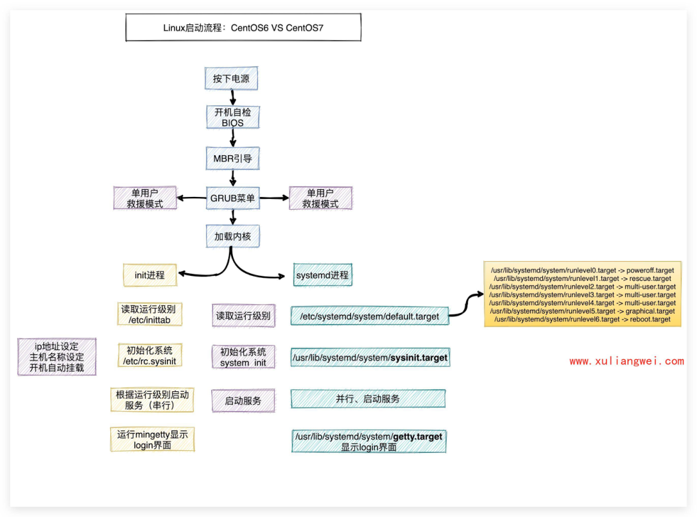
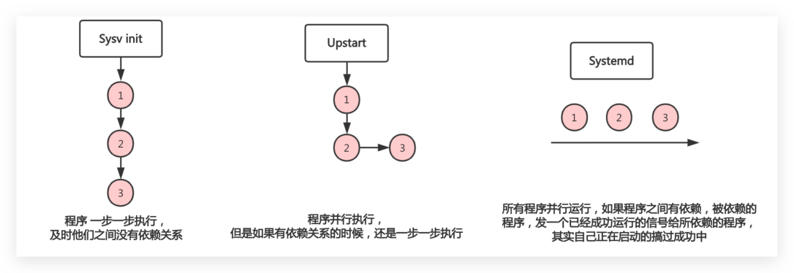

# 14 Linux系统服务-ok

## 13.Linux系统服务

·13.Linux系统服务 。1.系统启动流程□

### 1.1 CentOS6

### 11.2 CentOS7

o2.启动运行级别 ·2.1什么是运行级别

### 12.2调整运行级别

。3.Systemd管理

### 13.1systemd的由来

### 3.2systemd的优势

### 3.3systemd相关命令

### 13.4 systemd管理Nginx

o4.救援模式 ■4.1场景1-忘记超级管理员密码

### 14.2场景2-系统损坏需备份数据

### 14.3场景3-误删除grub文件修复

o5.系统优化

### 5.1调整yum源

### 5.2 关闭防火墙

：5.3ulimit资源限制 ·5.3.1限制进程最大数量 ·5.3.2限制打开文件数量

#### 5.3.3调整ulimit限制参数

徐亮伟，多年互联网运维工作经验，曾负责过大规模集群架构自动化运维管理工作。擅长 Web集群架构与自动化运维，曾负责国内某大型电商运维工作。

## 1.系统启动流程口

### 1.1 CentOS6

centos6开机启动流程，传送门

### 1.2 CentOS7

## 2.启动运行级别

### 2.1什么是运行级别

运行级别：指操作系统当前正在运行的功能级别; 作用 SystemVinit运行级别 systemd目标名称 关机 runlevel0.target, poweroff.target 单用户模式 runlevel1.target, rescue.target runlevel2.target, multi-user.target Linux启动流程：CentOS6VSCentOS7 按下电源 开机自检 BIOS MBR引导 单用户 单用户 GRUB菜单 救援模式 救援模式 加载内核 /usr/lib/systemd/system/runlevel0.target->poweroff.target systemd进程 init进程 /usr/lib/systemd/system/runlevel1.target->rescue.target /usr/lib/systemd/system/runlevel2.target->mult-user.target /usr/lib/systemd/system/runlevel4.target->multi-user.target 读取运行级别 读取运行级别 letc/systemd/system/default.target /etc/inittab /usr/lib/systemd/system/runlevel6.target ->reboot.target ip地址设定 初始化系统 初始化系统 主机名称设定 /usr/lib/systemd/system/sysinit.target letc/rc.sysinit system init 开机自动挂载 根据运行级别启动 并行、启动服务 启动服务 服务（串行） 运行mingety显示 Tusr/lib/systemd/system/getty.target login界面 显示login界面

多用户的文本界面 runlevel3.target, multi-user.target runlevel4.target, multi-user.target 多用户的图形界面 runlevel5.target, graphical.target 重启 runlevel6.target, reboot.target

### 2.2调整运行级别

systemd使用targets而不是runlevels有两个主要目标： multi-user.target：类似于运行级别3 graphical.target：类似于运行级别5

## 1.查看系统默认运行级别

[root@oldxu ~]# systemctl get-default

## 2.要设置默认目标，请运行

[root@oldxu ~]# systemctlset-default TARGET.target

## 3.Systemd管理

### 3.1 systemd的由来

Linux一直以来都是采用init进程作为祖宗进程，但是init有两个缺点： 。1.启动时间长，init进程是串行启动，只有前一个进程启动完，才会启动下一个进 程； 。2.启动脚本复杂，初始化系统后会加载很多脚本，脚本都会处理各自的情况，并且脚本 多而杂; Centos5启动速度慢，串行启动过程，无论进程相互之间有无依赖关系。 centos6启动速度有所改进，有依赖的进程之间依次启动而其他与之没有依赖关系的则并行 同步启动。 只有一个信号或者说是标记而已，在真正利用的时候才会真正启动。） O

systemd即为system daemon 守护进程，systemd 主要解决上文的问题而诞生 systemd的目标是，为系统的启动和管理提供一套完整的解决方案；

### 3.2systemd的优势

·1、最新系统都采用systemd管理RedHat7、CentoS7、Ubuntu15； ）2、Centos7支持开机并行启动服务，显著提高开机启动效率； Centos7关机只关闭正在运行的服务，而Centos6全部都关闭一次； 3、 4、Centos7服务的启动与停止不在使用脚本进行管理，也就是/etc/init.d下不在有脚 本； ）5、Centos7使用systemd 解决原有模式缺陷，比如原有service不会关闭程序产生的子进 程；

### 3.3systemd相关命令

/usr/lib/systemd/system/：服务启停文件，通过systemctl命令对其文件启动、停止、重 载等操作 systemctlstartcrond：启动服务 systemctlstopcrond：停止服务 systemctlrestartcrond：重启服务 systemctlreloadcrond：重载服务 systemctlenablecrond：服务设定为开机运行 systemctldisabledcrond：服务设定为开机不运行 systemctldaemon-reloadcrond：创建服务启动文件需要重载配置 systemctl list-unit-files：查看各个级别下服务的启动与禁用 systemctlis-enabledcrond.service：查看特定服务是否为开机自启动 systemctlis-activecrond：查看服务是否在运行 Sysv init Upstart Systemd 所有程序并行运行，如果程序之间有依赖，被依赖的 程序并行执行， 程序一步一步执行， 程序，发一个已经成功运行的信号给所依赖的程序， 但是如果有依赖关系的时候，还是一步一步执行 及时他们之间没有依赖关系 其实自己正在启动的搞过成功中 o

### 3.4 systemd管理Nginx

## 1.编译 nginx

wget http://nginx.org/download/nginx-1.21.1.tar.gz tar xf nginx-1.21.1.tar.gz cd nginx-1.21.1 ./configure --prefix=/usr/local/nginx-1.21.1 \ --with-http_ssl_module \ --with-http_stub_status_module make && make install ln -s /usr/local/nginx-1.21.1 /usr/local/nginx

## 2.常规启动 nginx 方式

/usr/local/nginx/sbin/nginx #启动 #重启 /usr/local/nginx/sbin/nginx -s reload #关闭 /usr/local/nginx/sbin/nginx -s stop

## 3.systemd 管理nginx

#Before、After：定义启动顺序。 #Before=xxx.service代表本服务在xxx.service启动之前启动 #After=xxx.service代表本服务在xxx.service之后启动 #Wants=xxx.service代表该服务启动了，它依赖的服务也会被启动；依赖的服务如果被停止， 不影响本服务 # vim /usr/Lib/systemd/system/nginx.service [Unit] Description=nginx After=network-online.target remote-fs.target nss-lookup.target Wants=network-online.target [Service] Type=forking #Environment="PATH=$PATH:/usr/LocaL/nginx/sbin" ExecStart=/usr/local/nginx/sbin/nginx ExecReload=/usr/local/nginx/sbin/nginx -s reload ExecStop=/usr/local/nginx/sbin/nginx -s stop PrivateTmp=true [Install] WantedBy=multi-user.target

## 4.救援模式

### 4.1场景1-忘记超级管理员密码

·如何使用单用户模式进行变更系统密码？以Centos7系统为例： 。第1步：重启Linux系统主机并出现引l导界面时，按下键盘上的e键进入内核编辑界 面 。第2步：在linux16 这行的后面添加 enforcing=θ init=/bin/bash，然后按 Ctrl+×进 入 。第3步：进入到系统的单用户模式，依次输入以下命令，重启操作系统，使用新密码登 ■1、mount-orw,remount/：默认/分区只读，重新挂载为读写模式 12、echo"123"丨passwd--stdinroot：非交互式修改密码 13、exec/sbin/init：重新引l导系统

### 4.2场景2-系统损坏需备份数据

·当系统坏了，无法登陆系统，但需要把里面的数据复制出来，怎么办？ 。第一步：挂载ISO镜像文件，修改BIOS，调整DVD光盘为第一引I导； o第二步：选择Troubleshooting，继续选择RescueaCentoSsystem救援模式； 。第三步：输入1，然后执行命令chroot／mnt/sysimage，挂载真实系统； 。第四步：备份系统中的数据文件至其他磁盘；

### 4.3场景3-误删除grub文件修复

Centos误删除grub文件如何进行修复 o第一步：模拟误删除故障rm-rf/boot/grub&&reboot 。第二步：系统无法正常启动起来（提示grub找不到） 。第三步：然后按照之前的操作进入救援模式，执行chroot/mnt/sysimage挂载真实的 操作系统； 。第四步：使用grub2相关命令修复 ■grub2-install/dev/sda重新添加mbr引l导 grub2-mkconfig-o/boot/grub2/grub.cfg重新生成配置 ls/boot/grub2/grub.cfg

## 5.系统优化

### 5.1调整yum源

·默认安装系统对外提供的yum仓库为国外站点，可以将站点修改为国内，加速软件包下载 #base [root@oldxu ~]# wget -0 /etc/yum.repos.d/Centos-Base.repo https://mirrors.aliyun.co m/repo/Centos-7.repo #epel [root@oldxu ~]# wget -0 /etc/yum.repos.d/epel.repo http://mirrors.aliyun.com/repo/e pel-7.repo

### 5.2关闭防火墙

·默认情况下还会采用关闭防火墙，以避免影响后期服务的使用； 。云主机：有硬件提供的安全组产品来提供防护； 。物理机：一般公司在入口层面都会有硬件防火墙； #firewalLd [root@oldxu ~]# systemctl stop firewalld [root@oldxu ~]# systemctl disabled firewalLd # seLinux [root@oldxu ~]# setenforce θ [root@oldxu ~]# sed -i'/^SELINUx=/c SELINUX=disabled' /etc/seLinux/config

### 5.3ulimit资源限制

ulimit命令可以对系统资源进行控制 -u：限制普通用户所能打开的最大进程数目；（每个用户） -n：限制用户能分配到的文件描述符数量；

#### 5.3.1限制进程最大数量

## 1.限制每个用户最大能打开3个进程；

[root@oldxu ~]# ulimit -u 3

## 2.登陆用户启动多个进程测试

[root@oldxu ~]# su - oldxu [oldxu01@oldxu ~]$ sleep 1000 & [1] 10857 [oldxu01@oldxu ~]$ sleep 1000 & [2] 10858 [oldxu01@oldxu ~]$ sleep 1000 & -bash：fork：retry：资源暂时不可用 -bash：fork：retry：资源暂时不可用 -bash：fork：retry：资源暂时不可用

#### 5.3.2限制打开文件数量

## 1.限制进程最多打开文件描述符为10

[root@oldxu ~]# ulimit -n 10

## 2.编写python程序模拟打开多个文件

[root@oldxu ~]# cat open_file.py #!/usr/bin/env python import time,os from threading import Thread print(os.getpid()) def new_file(n): with open('%s.file' %n,mode='wt'） as f1: time.sleep(2000) if __name_ main count=1 while True: Thread(target=new_file,args=(count,)).start() count+=1 time.sleep(2)

## 3.等待一段时间，当程序打开文件超过限制，则会提示异常；

Exception in thread Thread-9: Traceback (most recent call last): File "/usr/lib64/python2.7/threading.py", line 812, in _bootstrap_inner File "/usr/lib64/python2.7/threading.py", line 765, in run File "open_file.py", line 9, in new_file

#### 5.3.3调整ulimit限制参数

·通过ulimit方式调整打开的文件数量，以及进程数量，都是临时操作，所以需要进行永久 配置 o配置文件：/etc/security/limits.conf o调整模式： soft：软限制，超过则提示； hard：硬限制，超过则停止； [root@oldxu ~]# tail/etc/security/Limits.conf # max user processes

* soft nproc 60000

* hard nproc 60000

# open files

* soft nofile 100000

* hard nofile 100000

#避免出现如下错误 [root@oldxu ~]# tail -f /var/Log/dmesg

### 7.876830] VFS:file-max 1imit 200 reached

### 32.910679] VFS: file-max limit 200 reached

### 32.992003] VFS: file-max 1imit 200 reached

### 33.009073] VFS:file-max 1imit 200 reached

#系统级资源限制（针对整个操作系统） [root@oldxu ~]# echo "fs.file-max = 200oo" >> /etc/sysctl.conf d- 7s< #[xpo@0o]
