# 15-16 Linux网络管理-ok

15Linux网络管理 ·15Linux网络管理 。1.网络基本概述

### 1.1为何需要网络

### 11.2什么是网络

。2.互联网通讯协议 ·2.1物理层

### 2.2数据链路层

### 2.3网络层

### 2.4传输层

### 2.5应用层

### 12.6OSI总结

。3.TCP协议 ·3.1三次握手

### 13.2四次挥手

### 3.3 转换状态

### 13.4UDP协议

）4.网络配置

### 4.1查询网络信息

### 4.2修改网卡名称

### 4.3 配置网络地址

·4.3.1nmcli查看网络状态

#### 4.3.2nmcli配置IP地址

#### 4.3.2 nmcli修改IP地址

#### 4.3.3nmcli管理配置文件

。5.网卡绑定

### 5.1配置round-robin

·5.1.1eth0网卡配置

#### 5.1.2eth1网卡配置

#### 5.1.3 bond网卡配置

#### 5.1.4 bond状态检查

#### 5.1.5bond网卡删除

### 5.2 配置active-backup

·5.2.1eth0 网卡配置

#### 5.2.2 eth1网卡配置

#### 5.2.3bond网卡配置

#### 5.2.4bond状态检查

■5.2.5bond故障模拟 ）6.网关/路由

### 16.1什么是路由

### 6.2为什么需要路由

### 6.3如何配置路由

### 6.4路由的分类

■6.4.1主机路由

#### 4.4.2网络路由

#### 6.4.3默认路由

■6.4.4永久路由

### 6.5路由项目案例

■6.5.1环境准备

#### 6.5.2虚拟机1网卡配置

#### 6.5.3虚拟机2网卡配置

#### 6.5.4虚拟机3网卡配置

#### 6.5.5虚拟机4网卡配置

#### 6.5.6场景示例1

#### 6.5.7场景示例2

#### 6.5.8场景示例3

#### 6.5.9场景示例4

### 6.6路由条目优化

o7.Ubuntu网络配置

### 7.1配置静态IP地址

### 7.2配置round-robin

### 17.3配置active-backup

o8.内核参数调优

### 8.1 ip_local_port_range

### 8.2 tcp_tw_reuse

### 8.3 tcp_max_tw_buckets

### 8.4 tcp_max_syn_backlog

### 8.5 core_somaxconn

### 8.6 tcp_syn_retries

：8.8内核参数示例 徐亮伟，多年互联网运维工作经验，曾负责过大规模集群架构自动化运维管理工作。擅长 Web集群架构与自动化运维，曾负责国内某大型电商运维工作。

## 1.网络基本概述

### 1.1为何需要网络

假设没有网络：(也就是将所有的计算机网络都关闭) 。如果我的计算机上有非常不错的电影，想要进行传输，就比较的费劲了； 。因为我们可能处在不同的城市、或者不同的国家； 但如果有了网络：（也就是将所有计算机通过网线连接在一起） 。1.打破了地域上数据传输的限制； 。2.提高信息之间的传输效率，以便更好的实现"资源的共享"；

### 1.2什么是网络

·网络是由"若干节点"和"连接这些节点"的链路构成，表示诸多对象及其相互联系。 ）网络是信息传输、接收、共享的虚拟平台，通过它把各个信息联系到一起，从而实现这些资 源的共享。 网络将节点连接在一起，需要实现”信息传输”（信息通信）有几个大前提： 。1.使用物理连接的介质将所有计算机连接在一起（网卡、网线、交换机、路由器）；

## 2.双方在通信过程中，必须使用统一的通信标准，也就是通讯协议（互联网通讯协

议）；

## 2.互联网通讯协议

·协议其实就是规定了一堆标准，用来定义计算机如何接入internet以及接入internet的 计算机通信的标准；所以计算机都需要学习此标准、遵循此标准来进行信息传输（信息通 信）； 国际标准化组织：推出了OSI七层参考模型，将互联网通讯协议分成了不同的层，每一层都 有专门的标准，以及组织数据的格式； o(应、表、会、传、网、数、物) ）对于写程序来说，通常会将七层归纳为五层协议； o (应、传、网、数、物) 所以我们需要学习协议的规定了哪些标准；

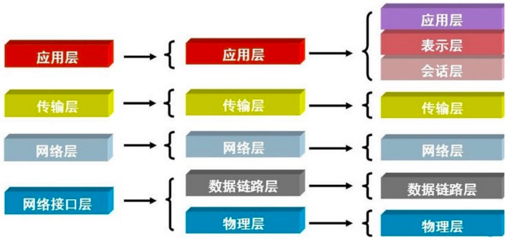

以太网封装与解封装动态图

### 2.1物理层

物理层：定义物理设备的标准，如网卡网线，传输速率；最终实现数据转成电信号传输； 问题：如果只是单纯发送电信号是没有意义的，因为没有规定开头也没有规定结尾；要想变得有 意义就必须对电信号进行分组；比如：xx位为一组、这样的方式去传输，这就需要“数据链路层” 来完成了； 应用层 表示层 应用层 应用层 会话层 传输层 传输层 传输层 网络层 网络层 网络层 数据链路层 数据链路层 网络接口层 物理层 物理层

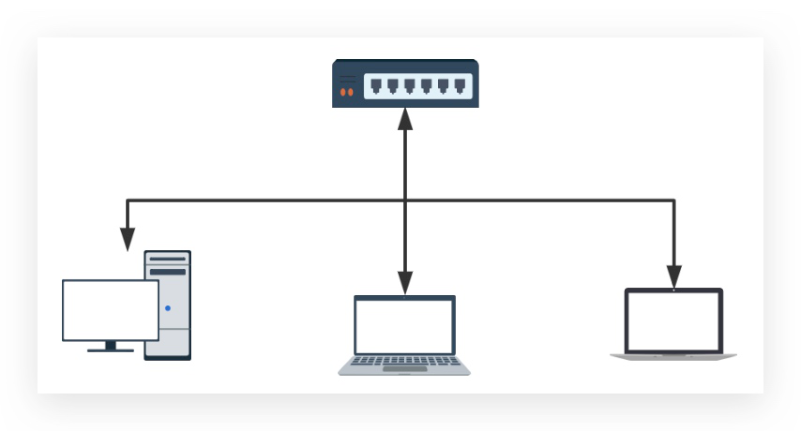

### 2.2数据链路层

）数据链路层定义：定义了电信号的分组的标准方式，一组数据称之为一个数据帧，这个标准 遵循ethernet以太网协议，以太网规定了如下几件事； ）1.数据帧分为head和data两部分组成；其中head长度固定18字节； ）head：发送者/源地址、接收者/目标地址（源地址6字节、目标地址6字节、数据类型6 字节) ·源地址：MAC地址 ■目标地址：MAC地址 data：主要存放是网络层整体的数据，最长1500字节，超过最大限制就分片发送； ·2.但凡接入互联网的主机必须有一块网卡，网卡烧制了全世界唯一的MAC地址；

## 3.有了以太网协议规定以后，它能对数据分组、也可以区分数据的意义，还能找到目标主机

的地址、就可以实现计算机通信；但是计算机是瞎的，所以以太网通信采用的是"广播"方 式；

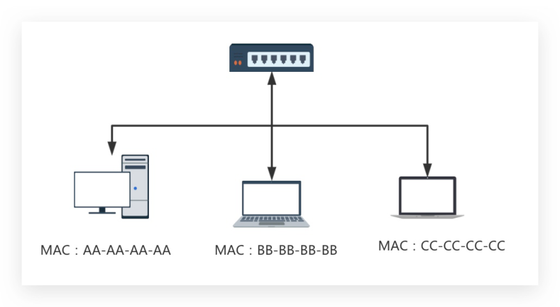

·那什么是广播： ++++++ MAC:CC-CC-CC-CC MAC:AA-AA-AA-AA MAC:BB-BB-BB-BB

o假设我们都在一个小黑屋里面，大家互相通信靠吼，假设oldxu让laowang买包烟；

## 1.数据：买烟（类型：干粮）

## 12.源地址：oldxu

■3.目标地址：laowang o此时屋子里所有人都收到了该数据包，但只有laowang会接收执行，其他人收到后会 丢弃； ·如果我们将全世界的计算机都接入在一起，理论上是不是就可以实现全世界通信： 。首先：无法将全世界计算机放在一个交换机上，因为没有这样的设备； 。其次：就算放在同一设备上，每台计算机都广播一下，那设备也无法正常工作； 所以：我们应该将主机划区域，隔离在一个又一个的区域中，然后将多个区域通过"网 关/路由"连接在一起；

### 2.3网络层

）网络层定义：用来划分广播域，如果广播域内主机要往广播域外的主机发送数据，一定要有 一个"网关/路由"帮其将数据转发到外部计算机；网关和外界通信走的是路由协议（这个我们 不做详细阐述）。其次网络层协议规定了如下几件事； o规定1：数据包分成：head和data两部分组成； ■head：发送者/源地址、接收者/目标地址，该地址为IP地址； data：主要存放是传输层整体的数据； 。规定2：IP地址来划分广播域，主要用来判断两台主机是否在同一广播域中； 一个合法IPV4地址组成部分=ip地址/子网掩码，在线子网计算器 如果计算出两台地址的广播域一样，说明两台计算机处在同一个区域中；

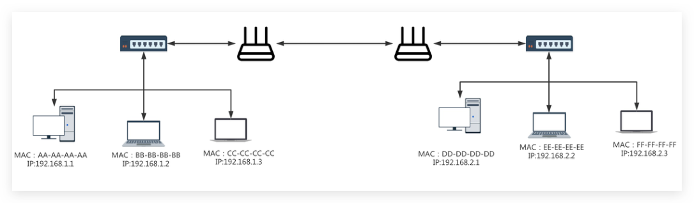

）计算两台计算机是否在同一局域网（牵扯到如何发送数据）： ·假设：现在计算机1要与计算机2通信，计算机1必须拿到计算机2的ip地址； 。如果它们处于同一网络（局域网）10.0.0.1-->10.0.0.100：

1.本地电脑根据数据包检查目标IP如果为本地局域网；

·2.直接通过交换机广播MAC寻址；将数据包转发过去； 0如果它们处于不同网络（跨局域网）10.0.0.1-->39.104.16.126： MAC : FF-FF-FF-FF MAC : EE-EE-EE-EE MAC:CC-CC-CC-CC IP:192.168.2.3 MAC : DD-DD-DD-DD MAC : AA-AA-AA-AA MAC : BB-BB-BB-BB IP:192.168.2.2 IP:192.168.1.3 IP:192.168.2.1 IP:192.168.1.1 IP:192.168.1.2

！1.本地根据数据包检查目标IP如果不为本地局域网，则尝试获取网关的MAC地 址；

2.本地封装数据转发给交换机，交换机拆解发现目标MAC是网关，则送往网关设备；

3.网关收到数据包后，拆解至二层后发现请求目标MAC是网关本机MAC；

4.网关则会继续拆解数据报文到三层，发现目标地址不为网关本机；

5.网关会重新封装数据包，将源地址替换为网关的WAN地址，目标地址不变；

6.出口路由器根据自身路由表信息将数据包发送出去，直到送到目标的网关；

### 2.4传输层

·传输层的由来：网络层帮我们区分子网，数据链路层帮我们找到主机，但一个主机有多个进 程，进程之间进行不同的网络通信，那么当收到数据时，如何区分数据是那个进程的呢；其 实是通过端口来区分；端口即应用程序与网卡关联的编号。 ）传输层的定义：提供进程之间的逻辑通信； ）传输层也分成：head 和data两部分组成； ）head：源端口、目标端口、协议（TCP、UDP）； data：主要存放是应用层整体的数据；

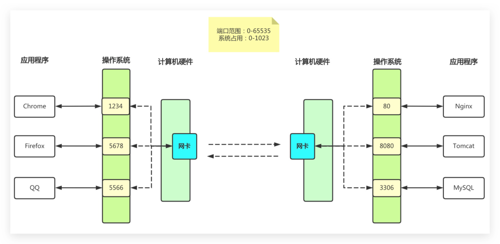

### 2.5应用层

应用层定义：为终端应用提供的服务，如我们的浏览器交互时候需要用到的HTTP协议，邮 件发送的SMTP，文件传输的FTP等。 端口范围：0-65535 系统占用：0-1023 应用程序 操作系统 计算机硬件 操作系统 应用程序 计算机硬件 Chrome 1234 Nginx Firefox 网卡 5678 8080 Tomcat QQ 5566 3306 MySQL

### 2.6OSI总结

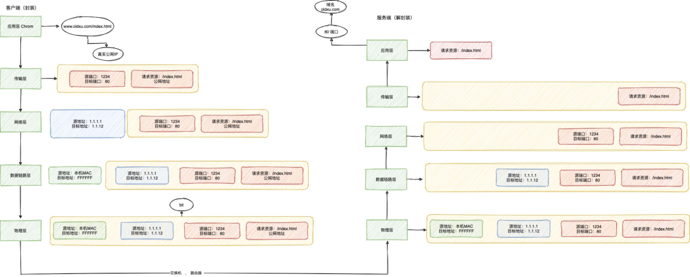

## 3.TCP协议

）tcp可靠数据传输协议；为了实现可靠传输，在通信之前需要先建立连接，也叫"双向通路"， 就是说客户端与服务端要建立连接，服务端与客户端也需要建立连接，当然建立的这个双向 通路它只是一个虚拟的链路，不是用网线将两个设备真实的捆绑在一起； ）虚拟链路的作用：由于每次通信都需要拿到P和Port，那就意味着每次都需要查找，建立好 虚拟通路，下次两台主机之间就可以直接传递数据；

### 3.1三次握手

·第一次：客户端要与服务端建立连接，需要发送请求连接消息； ·第二次：服务端接收到数据后，返回一个确认操作（至此客户端到服务端链路建立成功）； ·第三次：服务端还需要发送要与客户端建立连接的请求； ·第四次：客户端接收到数据后，返回一个确认的操作（至此服务端到客户端的链路建立成 功）； ）由于建立连接时没有数据传输，所以第二次确认和第三次请求可以合并为一次发送； 客户端（封装） 服务端（解封装） 真实公网IP ：124 电址：11 香牌：1234 地址：1.1112 售口：1234 网地址 品 退地址：本机MAC 请求克源：Nde t：FFFFFF

#### 1.1.12

网E址

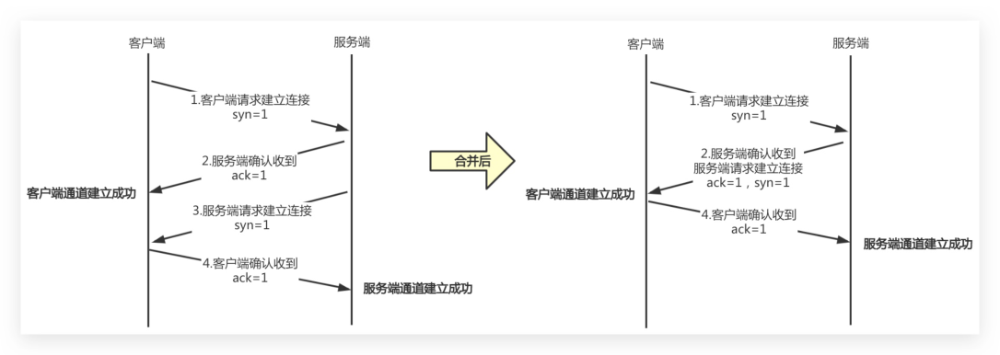

）TCP协议为了实现可靠传输，通信双方需要判断自已经发送的数据包是否都被接收方收到， 如果没收到，就需要重发。为了实现这个需求，就引l出序号（seg）和确认号（ack）的使 用。 举例：发送方在发送数据包时，序列号(假设为123)，那么接收方收到这个数据包以后，就 可以回复一个确认号（124=123+1）告诉发送方“我已经收到了你的数据包，你可以发送下 一个数据包，序号从124开始”，这样发送方就可以知道哪些数据被接收到，哪些数据没被 接收到，需要重发。

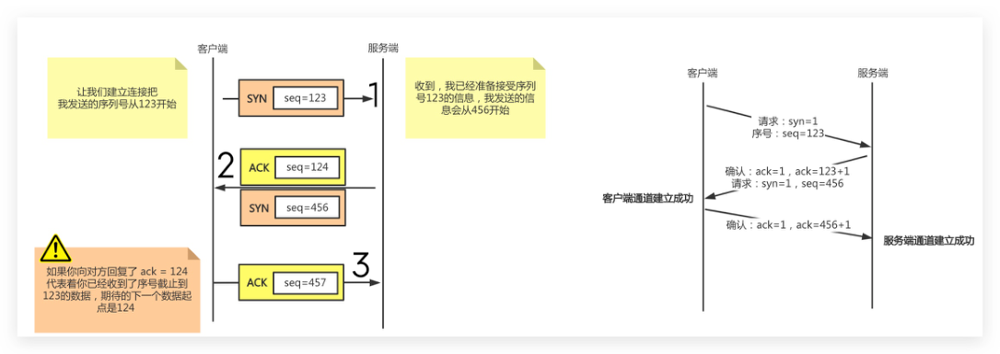

### 3.2四次挥手

·第一次挥手：客户端（服务端也可以主动断开）向服务端说明想要关闭连接； ）第二次挥手：服务端会回复确认。但不是立马关闭，因为此时服务端可能还有数据在传输 中； ·第三次挥手：待到服务端数据传输都结束后，服务端向客户端发出消息，我要断开连接了； ·第四次挥手：客户端收到服务端的断开信息后，给予确认。服务端收到确认后正式关闭。

## 1.客户端请求建立连接

## 1.客户端请求建立连接

syn=1 syn=1

## 2.服务端确认收到

合并后

## 2.服务端确认收到

服务端请求建立连接 ack=1 ack=1, syn=1 客户端通道建立成功 客户端通道建立成功

## 3.服务端请求建立连接

## 4.客户端确认收到

syn=1 ack=1 服务端通道建立成功

## 4.客户端确认收到

ack=1 服务端通道建立成功 收到，我已经准备接受序列 让我们建立连接把 seq=123 号123的信息，我发送的信 SYN 我发送的序列号从123开始 息会从456开始 请求：syn=1 序号：seq=123 seq=124 ACK 确认：ack=1，ack=123+1 请求：syn=1，seq=456 客户端通道建立成功 seq=456 SYN 确认：ack=1，ack=456+1 服务端通道建立成功 如果你向对方回复了ack=124 seq=457 ACK 代表着你已经收到了序号截止到 123的数据，期待的下一个数据起 点是124

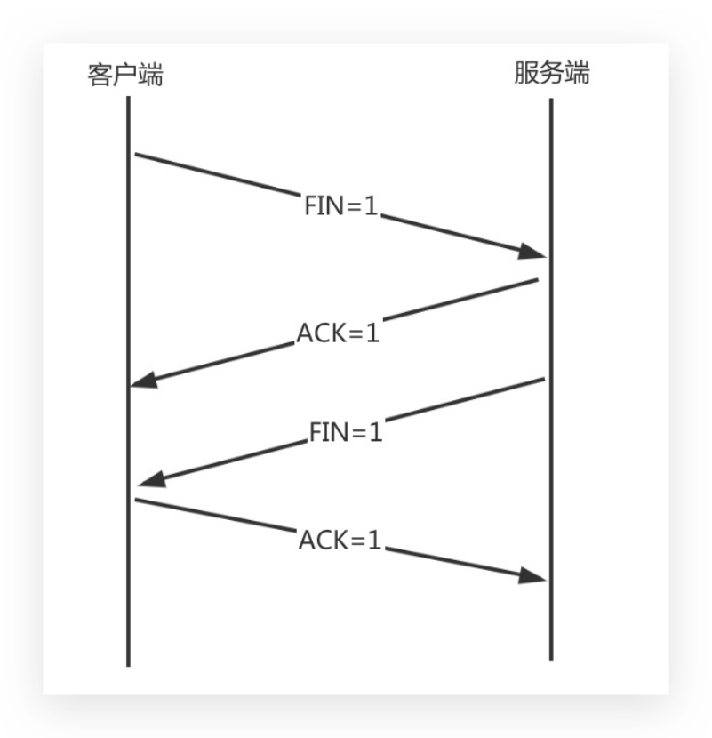

### 3.3转换状态

）三次握手状态转换： ·1.客户端发送syn包向服务端请求建立TCP连接，客户端进入SYN_SEND状态； ）2.服务端收到请求之后，向客户端发送SYN+ACK的合成包，同时自身进入SYN_RECV状态； ）3.客户端收到回复之后，发送ACK信息，自身进入ESTABLISHED状态； ）4.服务端收到ACK数据之后，进入ESTABLISHED状态。 FIN=1 ACK=1 FIN=1 ACK=1

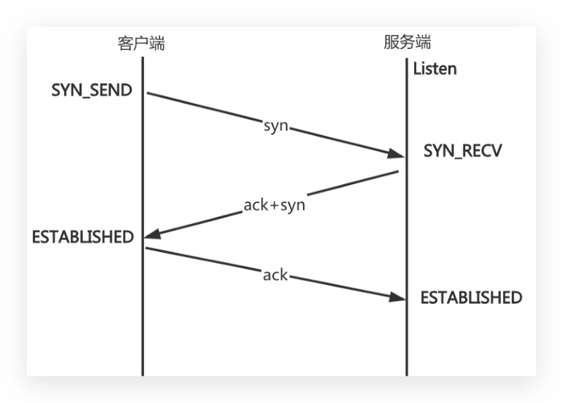

）四次挥手过状态转换： ）1.客户端发送完数据之后，向服务器请求断开连接，自身进入FIN_WAIT_1状态； ）2服务端收到FIN包之后，回复ACK包表示已经收到，但此时服务端可能还有数据没发送完 成，自身进入CLOSE_WAIT状态，表示对方已发送完成且请求关闭连接，自身发送完数据之 后就可以关闭连接； ）3.服务端数据发送完成后，发送FIN包给客户端，自身进入LAST_ACK状态，等待客户 端 ACK 确认; ·4.客户端收到FIN包之后，回复一个ACK包，并进入TIME_WAIT状态； ·注意：TIME_WAIT 状态比较特殊，当客户端收到服务端的FIN 包时，理想状态下，是可以直 接关闭连接了；但是有几个问题： 。问题1：网络是不稳定的，可能服务端发送的一些数据包，比服务端发送的FIN包还晚 到; 。问题2：.如果客户端回复的ACK包丢失了，服务端就会一直处于LAST_ACK状态，如果客 户端没有关闭，那么服务端还会重传FIN包，然后客户端继续确认； ）所以客户端如果ACK后立即关闭连接，会导致数据不完整、也可能造成服务端无法释放连 接。所以此时客户端需要等待2个报文生存最大时长，确保网络中没有任何遗留报文了，再 关闭连接； 如果机器TIME_WAIT过多，会造成端口会耗尽，可以修改内核参数tcp_tw_reuse=1端口重 用； Listen SYN_SEND syn SYN_RECV ack+syn ESTABLISHED ack ESTABLISHED

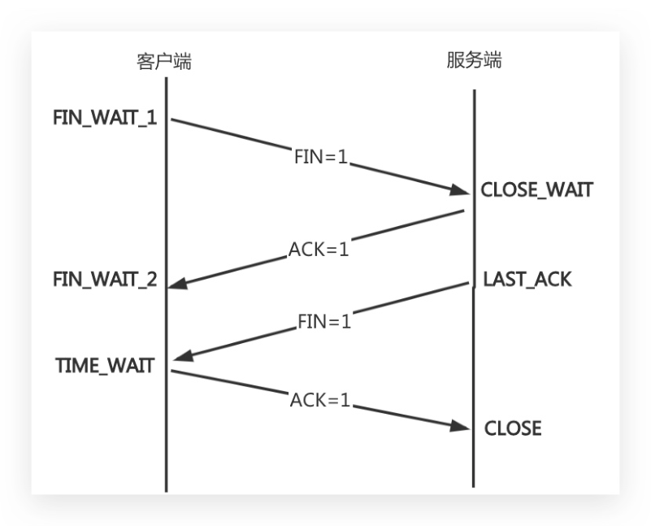

·为什么必须要等待2MSL？而不是4MSL？8MSL? 一个MSL就是报文在网络中的最长生存时间，大白话的话，就是如果存在丢包的话，在MSL 时间内也会触发重传了，这里2MSL，就相当于两次丢包，一次丢包概率是百分之一，连续 两次丢包的概率是万分之一，这个概率实在是太小了，所以2MSL是足够的。

### 3.4UDP协议

udp是不可靠传输协议；不可靠指的是传输数据时不可靠； udp协议不需要先建立连接，只需要获取服务端的ip+port，发送完毕也无需服务器返 回ack； udp协议如果在发送在数据的过程中丢了，那就丢了；

## 4.网络配置

### 4.1查询网络信息

## 1.使用ifconfig当前处于活动状态的网络接口

[root@oldxu ~]# yum install net-tools-y [root@oldxu ~]# ifconfig #仅查看etho网卡状态信息 FIN_WAIT_1 FIN=1 CLOSE_WAIT ACK=1 FIN_WAIT_2 LAST_ACK FIN=1 TIME_WAIT ACK=1 CLOSE

[root@oldxu ~]# ifconfig etho #查看所有网卡状态信息，包括禁用和启用 [root@oldxu ~]# ifconfig -a #UP：网卡处于活动状态BROADCAST：支持广播RUNNING：网线已接入 #MULTICAST：支持组播#MTU：最大传输单元（字节），接口一次所能传输的最大包 eth0: flagS=4163<UP,BROADCAST,RUNNING,MULTICAST> mtu 1500 #inet：显示IPv4地址行 inet 10.0.0.100netmask 255.255.255.0broadcast 10.0.0.255 #inet6：显示IPv6地址行 inet6 fe80::a879:62cf:396c:e7d9 prefixlen 64 4scopeid 0x20<link> inet6 fe80::22a2:cb:8a69:bf63 prefixlen 64 scopeid 0x20<link> #enther：硬件（MAc）地址txqueueLen：传输缓存区长度大小 ether 00:0c:29:5f:6b:8a txqueuelen 1000(Ethernet) #RXpackets：接收的数据包 RX packets 3312643 bytes 4698753634 (4.3 GiB) RX errors 0dropped θoverruns 0frame 0 #TXpackets：发送的数据包 TX packets 235041bytes 20504297 (19.5 MiB) TX errors 0dropped 0 overruns 0 carrier 0 collisions 0 #errors：总的收包的错误数量 #dropped：拷贝中发生错误被丢弃 #coLLisions：网络信号冲突情况，值不为e则可能存在网络故障

## 2.使用ip命令查看当前地址

[root@oldxu ~]# ip addrshow eth0 2: eth0: <BROADCAST,MULTICAST,①UP,LOWER_UP> mtu 15OO qdisc pfifo_fast state UP qlen 1000 ②link/ether 00:0c:29:5f:6b:8a ff:ff:ff:ff:ff:ff ③inet 10.0.0.100/24 brd@ 192.168.69.255 scope global ens32 valid_lft forever preferred_lft forever ?inet6 fe80::bd23:46cf:a12e:c0a1/64 scope 1ink valid_lft forever preferred_lft forever #：活动接口为UP #@：Link行指定设备的MAc地址 #3：inet行显示IPv4地址和前缀 #：广播地址、作用域和设备名称在此行 #：inet6行显示IPv6信息

## 3.使用ip-slinkshowetheo命令查看网络性能的统计信息，比如：发送和传送的数据包、错

误、丢弃 [root@oldxu ~]# ip -s link show eth0

3: ethO:<BROADCAST,MULTICAST,UP,LOWER_UP> mtu 15O0 qdisC mq state UP mode DEFAULT qle link/ether 14:18:77:35:0d:f5 brd ff:ff:ff:ff:ff:ff RX: bytes packets errors dropped overrun mcast 518292951 4716385 709280 dropped carrier collsns TX: bytes packets errors 23029861512 15391427 0

### 4.2修改网卡名称

Centos6网卡名称是etho、eth1... Centos7网卡名称是ens32、ens33... 由于这种无规则的命名方式给后期维护带来了困难，所以需要将网卡名称修改为etho、 eth1.. 场景示例1：已经安装完操作系统，修改网卡命名规则为etheeth1

## 1.修改网卡配置文件

[root@oldxu ~]# cd /etc/sysconfig/network-scripts/ [root@oldxu network-scripts]# mv ifcfg-ens32 ifcfg-eth0 [root@oldxu network-scripts]# vim ifcfg-etho

## 2.修改内核启动参数，禁用预测命名规则方案，将net.ifnames=0biosdevname=0参数关闭

[root@oldxu~]# vim /etc/sysconfig/grub GRUB_CMDLINE_LINUX="...net.ifnames=O biosdevname=O quiet" [root@oldxu~]# grub2-mkconfig -o /boot/grub2/grub.cfg

## 3.重启系统，然后检查网卡名称是否修改成功

[root@oldxu~]#reboot [root@oldxu~]#ifconfig 场景示例2：在新安装系统时，修改网卡名称规则

## 1.在安装系统选择InstallCentos7按下Tab设定kernel内核参数；

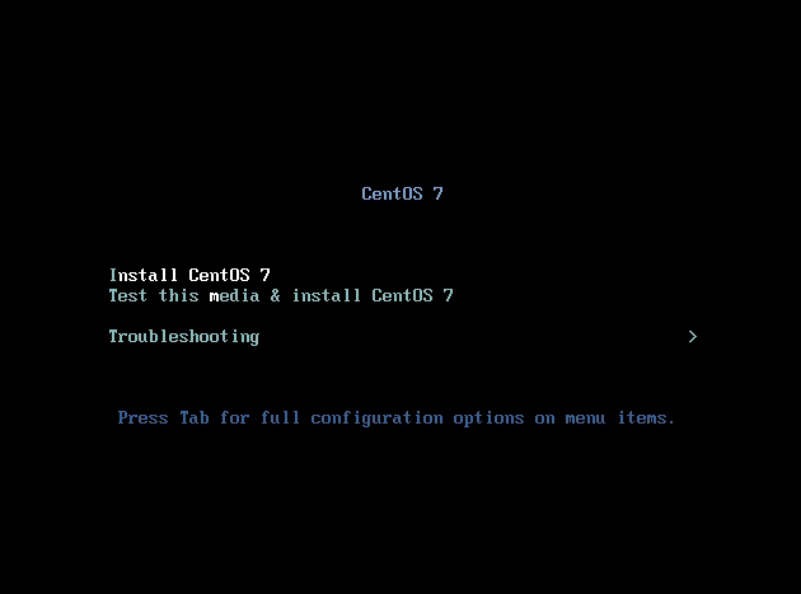

## 2.增加内核参数：net.ifnames=0biosdevname=0；

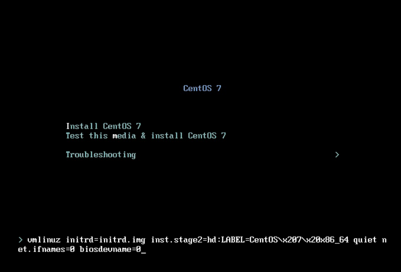

## 3.检查是否修改成功，成功后可继续安装系统；

CentOS 7 Install Cent0S 7 Test thismedia&installCentOS7 Troubleshooting Press Tab for full configuration options on menu items. CentOS7 Install Cent0S 7 Test this media&install CentoS 7 Troubleshooting >um1inuz initrd=initrd.img inst.stage2=hd:LABEL=Cent0S>x207>x20x86_64 quiet n et.ifnames=0biosdeuname=0_

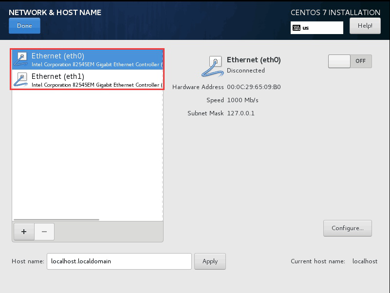

### 4.3配置网络地址

Centos7系统默认采用NetworkManager来提供网络服务，这是一种动态管理网络配置的守 护进程，能够让网络设备保持连接状态。NetworkManager提供的命令行和图形配置工具对 网络进行设定，设定保存的配置文件在/etc/sysconfig/network-scripts目录下，工具有 nmcli、nmtui NetworkManager有如下两个概念需要了解： device物理设备，例如：enp2s0,virbr0,teamθ connection连接设置，具体网络配置方案 一个物理设备device可以有多套逻辑连接配置，但同一时刻只能使用一个 connection连接配置；

#### 4.3.1nmcli查看网络状态

## 1.使用nmclidevice命令查看设备情况

#查看所有设备 [root@oldxu ~]# nmcli device DEVICE TYPE STATE CONNECTION ethernet connected etho etho loopback unmanaged #指定查看某个设备的详细状态 [root@oldxu ~]#nmclidev showethθ NETWORK&HOSTNAME CENTOS7INSTALLATION Help! Done 匯us Ethernet (eth0) Ethernet (etho) OFF Intel Corporation 82545EM Gigabit Ethernet t Controller Disconnected Ethernet (eth1) Intel Corporation 82545EM Gigabit Ethernet Controller ( Hardware Address 00:0C:29:65:09:B0 Speed 1000 Mb/s Subnet Mask 127.0.0.1 Configure.. localhost.localdomain Apply Host name: Current host name: localhost

## 2.使用nmcliconnection命令查看连接状态

#查看连接状态 [root@oldxu ~]# nmcli connection UUID TYPE NAME DEVICE 802-3-ethernet eth0 etho a4319b27-80dc-4d63-a693-2927ea1018e7 #查看所有活动连接的状态 [root@oldxu ~]# nmcli con show --active #查看指定连接状态 [root@oldxu ~]# nmcli con show "etho"

#### 4.3.2nmcli配置IP地址

·使用nmcli创建一个static的连接，配置IP、掩码、网关等 。1、添加一个连接配置，并指定连接配置名称 。2、将连接配置绑定物理网卡设备 。3、配置网卡的类型，网卡是否开机启动 。4、网卡使用什么模式配置IP地址(静态、dhcp) 。5、配置网卡的IP地址、掩码、网关、DNS等等* [root@oldxu ~]# nmcli connection add con-name ehto-static ifname etho\ type ethernet autoconnect yes\ ipv4.method manual \ ipv4.addresses 10.0.0.222/24\ ipv4.gateway 10.0.0.254\ ipv4.dns 233.5.5.5.5\ +ipv4.dns 8.8.8.8 #激活eht1-static的连接 [root@oldxu ~]# nmcli connection up ehto-static [root@oldxu ~]# nmcli connection show DEVICE TYPE UUID NAME 802-3-etherneteth0 eht0-static6fdebe6e-5ef0-4a05-8235-57e317fdada0

#### 4.3.2nmcli修改IP地址

## 1.取消eht1-static连接开机自动激活网络

[root@oldxu ~]# nmcliconnectionmodifyehto-static autoconnect no

## 2.修改eht1-static连接的dns配置

[root@oldxu ~]# nmcli connectionmodify eht0-static ipv4.dns 8.8.8.8

## 3.给连接再增加 dns 有些设定值通过+/－可以增加或则移除设定

[root@oldxu ~]# nmcli connection modify ehto-static \ +ipv4.dns 8.8.8.8

## 4.替换连接的静态IP和默认网关

[root@oldxu ~]# nmcli connection modify eht0-static ipv4.addresses 10.0.0.111/24 ipv4.gateway 10.0.0.254

## 5.nmlci仅仅修改并保存了配置，要激活更改，需要重激活连接

[root@oldxu ~]# nmcliconnection down eht1-static &&1 nmcli connection up eht1-static

## 6.删除自建的connection

[root@oldxu ~]# nmcli connection delete eht1-static

#### 4.3.3nmcli管理配置文件

·使用nmcli管理/etc/sysconfig/network-scripts/配置文件，其实就是自定义一个网卡 的配置文件，然后加入至NetworkManager服务进行管理； 。1、新增物理网卡 。2、拷贝配置文件(可以和设备名称一致) 。3、修改配置,UUID、连接名称、设备名称、IP地址 。4、重新加载网络配置 。5、启用连接,并检查

## 1.添加一个物理设备，进入/etc/sysconfig/network-script/目录拷贝一份网卡配置文件；

[root@oldxu network-scripts]# cp ifcfg-eth0-static ifcfg-eth1-static

## 2.修改网卡配置文件如下；

[root@oldxu network-scripts]# cat ifcfg-eth1-static BOOTPROTO=none IPADDR=10.0.0.222 NAME=eth1-static DEVICE=eth2

## 3.重载connetction连接，让NetworkManager服务能够识别添加自定义网卡配置；

[root@oldxu network-scripts]# nmcli connection reload TYPE NAME DEVICE UUID 5fb06bd0-0bb0-7ffb-45f1-d6edd65f3e03ethernet etho etho eth1-static8f105ed6-1361-8e14-51fd-dedb8ef3510aethernet eth1

## 4.eth1-static连接配置已经关联了eth1物理设备，如果希望修改Ip地址，可以用如下两种

方式； #方式一、nmcLimodify方式修改然后重载配置 [root@oldxu ~]# nmcli modify eth1-static ipv4.address 10.0.0.233/24 [root@oldxu ~]#nmclidown eth1-static && nmcliup eth2-static #方式二、vim修改，先reLoad，然后重载 [root@oldxu network-scripts]# cat ifcfg-eth1-static IPADDR=10.0.0.234 [root@oldxu ~]# nmcli connection reload [root@oldxu ~]# nmcli connection down eth1-static && nmcli connection up eth1-stati C

## 5.网卡绑定

·网卡绑定Bonding 。1、可以实现网络冗余，避免单点故障； 。2、可以实现负载均衡，以提升网络的传输能力；

）网卡绑定实现模式： 。模式0balance-rr负载轮询：两网卡单独是100MB，聚合为1个网络传输，则可提升 为200MB 。模式1active-backup高可用：两块网卡，其中一条若断线，另外的线路将会自动顶替 -->etho app--发送数据-->bondθ ---> switch ->eth1

### 5.1配置round-robin

#### 5.1.1eth0网卡配置

[root@oldxu~]#cat/etc/sysconfig/network-scripts/ifcfg-etho MASTER=bondo SLAVE=yes

#### 5.1.2eth1网卡配置

[root@oldxu ~]# cat /etc/sysconfig/network-scripts/ifcfg-eth1 MASTER=bondo SLAVE=yes

#### 5.1.3bond网卡配置

[root@oldxu ~]# cat /etc/sysconfig/network-scripts/ifcfg-bond0 TYPE=Bond BOOTPROTO=none DEVICE=bondo NAME=bondo IPADDR=10.0.0.100

GATEWAY=10.0.0.2 DNS1=223.5.5.5 BONDING_MASTER=yes #检查间隔时间ms BONDING_OPTS="miimon=20O mode=0"

#### 5.1.4bond状态检查

查看 bond 绑定状态 [root@oldxu~]#cat/proc/net/bonding/bond0 Ethernet Channel Bonding Driver: v3.7.1 (April 27， 2011) Bonding Mode:load balancing（round-robin）# 模式 MII Polling Interval (ms): 200 Up Delay (ms):0 Slave Interface:eth0 Link Failure Count:0 Permanent HW addr: 00:0c:29:aa:8d:2e Slave queue ID:0 Slave Interface: eth1 Link Failure Count:0 Permanent Hw addr: 00:0c:29:aa:8d:42 使用ethtool检查网卡传输速率 [root@oldxu ~]# ethtool bondθ Settings for bondo: #每秒传输速度 Speed: 2000Mb/s Duplex: Full

#### 5.1.5bond网卡删除

删除bond可以使用nmcli命令 [root@oldxu ~]# nmcli connection delete bonde

### 5.2配置active-backup

#### 5.2.1eth0网卡配置

[root@oldxu ~]# cat /etc/sysconfig/network-scripts/ifcfg-eth0 MASTER=bond1 SLAVE=yes

#### 5.2.2eth1网卡配置

[root@oldxu ~]# cat /etc/sysconfig/network-scripts/ifcfg-eth1 BOOTPROTO=none MASTER=bond1 SLAVE=yes

#### 5.2.3bond网卡配置

[root@oldxu ~]# cat /etc/sysconfig/network-scripts/ifcfg-bond1 TYPE=Bond BOOTPROTO=none DEVICE=bond1 NAME=bond1 IPADDR=10.0.0.200 GATEWAY=10.0.0.2 DNS1=223.5.5.5 BONDING_MASTER=yes BONDING_OPTS="miimon=200 mode=1 fail_over_mac=1"

#bond1获取mac地址有两种方式 #1、从第一个活跃网卡中获取mac地址，然后其余的SLAVE网卡的mac地址都使用该mac地址； #2、使用faiL_over_mac参数，是bonde使用当前活跃网卡的mac地址，mac地址随着活跃网卡的转 换而变。 #fail_over_mac参数在vMware上是必须配置，物理机可不用配置；

#### 5.2.4bond状态检查

[root@oldxu ~]#cat/proc/net/bonding/bond1 Ethernet Channel Bonding Driver:v3.7.1 (April 27，2011) Bonding Mode: fault-tolerance (active-backup） (fail_over_mac active) Primary Slave: None Currently Active Slave: eth0 MII Polling Interval (ms): 200 Up Delay (ms):0 SlaveInterface:etho Link Failure Count:0 Permanent HW addr: 00:50:56:38:85:72 Slave queue ID:0 Slave Interface:eth1 Link Failure Count:0 Permanent HW addr: 00:50:56:25:33:ee

#### 5.2.5bond故障模拟

关闭活跃网卡etho [root@oldxu ~]# ifdown etho 成功断开设备‘etho'。

再次检查状态，会发现备用网卡eth1切换为活跃网卡； [root@oldxu ~]# cat /proc/net/bonding/bond1 Ethernet Channel Bonding Driver:v3.7.1(April 27，2011) Bonding Mode: fault-tolerance (active-backup） (fail_over_mac active) Primary Slave:None Currently Active Slave: eth1 MII Polling Interval (ms): 200 Up Delay (ms): 0 Slave Interface: eth1 Link Failure Count:0 Permanent HW addr: 00:50:56:25:33:ee 尝试 ping 该主机，一切正常 64 bytes from 10.0.0.220: icmp_seq=173 ttl=64 time=0.512 ms 64 bytes from 10.0.0.220: icmp_seq=174 ttl=64 time=0.512 ms 64 bytes from 10.0.0.220: icmp_seq=175 ttl=64 time=2.11 ms

## 6.网关/路由

### 6.1什么是路由

）路由是指路由器从一个LAN接口上收到数据包，根据数据包的"目的地址"进行定向并转发到 另一个WAN接口的过程。(跨网络访问的路径选择) ）路由工作包含两个基本的动作： o1、确定最佳路径 。2、通过网络传输信息 ·在路由的过程中，后者也称为（数据）交换。交换相对来说比较简单，而选择路径很复杂。

### 6.2为什么需要路由

·如果没有路由，就没有办法实现，不同地域的主机互联互通了；

### 6.3如何配置路由

）linux系统配置路由使用route命令；可以使用route命令来显示和管理路由表； route命令语法示例： [<ap [ma] >sewzau] [>sew/]ssauppe [netap|zau-|sou-] tap|ppe] anou [add|del]：增加或删除路由条目； -host：添加或删除主机路由； -net：添加或删除网络路由； default：添加或删除默认路由； address：添加要去往的网段地址由ip+netmask组成； gw：指定下一跳地址，要求下一跳地址必须是能到达的，且一般是和本网段直连的接 口。 route添加路由命令示例： [root@oldxu ~]# route add -host 1.1.1.1/32 dev eth0 [root@oldxu ~]# route add -net 1.1.1.1/32 dev eth1 [root@oldxu ~]# route add -net 1.1.1.1/32 gw 1.1.1.2 [root@oldxu ~]# route add default gw 1.1.1.2

### 6.4路由的分类

#### 6.4.1主机路由

·主机路由作用：指明到某台主机具体应该怎么走；Destination精确到某一台主机 ）Linux上如何配置主机路由： #去往1.1.1.1主机，从eth0接口出 [root@oldxu ~]#route add -host 1.1.1.1/32 dev eth0 #去往1.1.1.1主机，都交给10.0.0.2转发 [root@oldxu ~]# route add -host 1.1.1.1/32 gw 10.0.0.2

#### 4.4.2网络路由

·网络路由作用：指明到某类网络怎么走；Destination精确到某一个网段的主机 ）Linux上如何配置网络路由： #去往2.2.2.0/24网段，从eth0接口出 o o

[root@oldxu ~]# route add -net 2.2.2.0/24 dev eth0 #去往2.2.2.0/24网段，都交给10.0.0.2转发 [root@oldxu ~]# route add -net 2.2.2.0/24 gw 10.0.0.2

#### 6.4.3默认路由

·默认路由：如果匹配不到主机路由、网络路由的，全部都走默认路由（网关）； ）Linux上如何配置网络路由： [root@oldxu ~]# route add -net 0.0.0.0 gw 10.0.0.2 [root@oldxu~]# route add default gw 10.0.0.2

#### 6.4.4永久路由

·使用route命令添加的路由，属于临时添加；那如何添加永久路由条目； ·在/etc/sysconfig/network-scripts目录下创建route-ethx 的网卡名称，添加路由条目 [root@dns-master ~]# cat /etc/sysconfig/network-scripts/route-etho

#### 1.1.1.0/24 dev eth0

#### 1.1.1.0/24 via 1.1.1.2

[root@dns-master ~]# route -n

### 6.5路由项目案例

）一台Linux主机能够被当成路由器用需要三大前提： 。1.至少有两块网卡分别连接两个不同的网段； 。2.开启路由转发功能/proc/sys/net/ipv4/ip_forward； o3.在1inux主机添加网关指向该服务器；

#### 6.5.1环境准备

·实验环境

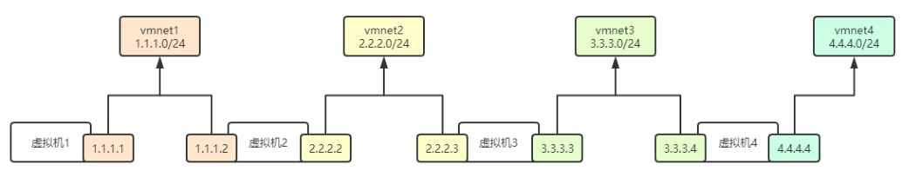

虚拟机网段配置

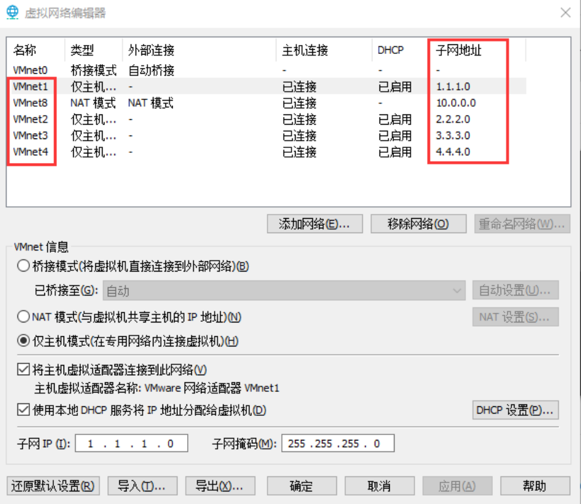

#### 6.5.2虚拟机1网卡配置

## 1.eth0网卡

[root@vm1 ~]# cat /etc/sysconfig/network-scripts/ifcfg-ethe BOOTPROTO=static IPADDR=10.0.0.100 vmnet2 vmnet3 vmnet4 vmnet1

#### 1.1.1.0/24

#### 2.2.2.0/24

#### 3.3.3.0/24

#### 4.4.4.0/24

虚拟机1 虚拟机2 虚拟机3 虚拟机4

#### 1.1.1.1

#### 2.2.2.2

#### 2.2.2.3

#### 3.3.3.3

#### 3.3.3.4

#### 4.4.4.4

虚拟网络编辑器 名称 类型 主机连接 外部连接 子网地址 DHCP 桥接模式 自动桥接 VMneto 仅主机…. 已连接 已启用 VMnet1 已连接 VMnet8 NAT模式 NAT模式 已连接 已启用 仅主机... VMnet2 已启用 仅主机.. 已连接 VMnet3 已连接 仅主机.. 已启用

#### 4.4.4.0

VMnet4 添加网络（E.. 移除网络（0） 重命名网络(W)... VMnet信息 桥接模式(将虚拟机直接连接到外部网络)B) 自动设置(U). 已桥接至(G：自动 ONAT模式(与虚拟机共享主机的IP地址)(N) NAT 设置(S)... 仅主机模式（在专用网络内连接虚拟机)H） 将主机虚拟适配器连接到此网络V 主机虚拟适配器名称：VMware网络适配器VMnet1 使用本地DHCP服务将IP地址分配给虚拟机(D） DHCP 设置(P)... 子网IP(1)： 子网掩码(M)： 导出... 导入... 应用(A) 还原默认设置R) 确定 取消 帮助

## 2.eth1网卡

[root@vm1 ~]# cat /etc/sysconfig/network-scripts/ifcfg-eth1 BOOTPROTO=static IPADDR=1.1.1.1

## 3.路由信息

[root@vm1~]#route-n

#### 6.5.3虚拟机2网卡配置

## 1.eth0网卡配置

[root@vm2 ~]# cat /etc/sysconfig/network-scripts/ifcfg-ethe BOOTPROTO=static IPADDR=1.1.1.2

## 2.eth1网卡配置

[root@vm2 ~]# cat /etc/sysconfig/network-scripts/ifcfg-eth1 BOOTPROTO=Static

IPADDR=2.2.2.2

## 3.路由信息

[root@vm2~]#route-n

#### 6.5.4虚拟机3网卡配置

## 1.eth0网卡配置

[root@vm3 ~]# cat /etc/sysconfig/network-scripts/ifcfg-ethe BOOTPROTO=Static IPADDR=2.2.2.3

## 2.eth1网卡配置

[root@vm3 ~]# cat /etc/sysconfig/network-scripts/ifcfg-eth1 BOOTPROTO=static IPADDR=3.3.3.3

## 3.路由信息

[root@vm3 ~]# route -n

#### 6.5.5虚拟机4网卡配置

## 1.eth0网卡配置

[root@vm4 ~]# cat /etc/sysconfig/network-scripts/ifcfg-ethe BOOTPROTO=Static IPADDR=3.3.3.4

## 2.eth1网卡配置

[root@vm4 ~]# cat /etc/sysconfig/network-scripts/ifcfg-eth1 BOOTPROTO=Static IPADDR=4.4.4.4

## 3.路由信息

[root@vm4~]#route-n

#### 4.4.4.0

#### 6.5.6场景示例1

）问：1.1.1.1地址能否与1.1.1.2互通； 可以通，因为本机1.1.1.1与目标主机1.1.1.2两台机器处于一个LAN中，并且两台机器上的路 由表里具有Destination指向对方的网段路由条目 [root@vm2 ~]# route -n 问：1.1.1.1地址能否与2.2.2.2地址互通 ）答：不能；因为数据包只能送到1.1.1.2，而无法送达2.2.2.2 ，所以需要添加一条去往2.2.2.0/24网段的路由，从eth1接口发出即可； [root@vm1 ~]# route add -net 2.2.2.0/24 dev eth1 [root@vm1 ~]# ping 2.2.2.2 PING 2.2.2.2 (2.2.2.2) 56(84) bytes of data. 64 bytes from 2.2.2.2: icmp_seq=1 tt1=64 time=0.602 ms 64 bytes from 2.2.2.2: icmp_seq=2 ttl=64 time=1.60 ms

#### 6.5.7场景示例2

问：1.1.1.1地址能否与2.2.2.3地址互通； ）答：不能；因为数据包只能送到vmnet2交换机，送不到vmnet3交换机 解决方案：将去往2.2.2.0/24网段的数据包交给1.1.1.2这台主机帮我们转发给2.2.2.3这台主 机； #vm1添加路由 [root@vm1 ~]# route add -net 2.2.2.0/24 gw 1.1.1.2

#vm2开启内核转发（由于vm2上有去往2.2.2.0/24网段路由，所以添加） [root@vm2~]# echo"1">/proc/sys/net/ipv4/ip_forward

- 7#00]

#vm1测试是否能ping通 [root@vm1 ~]# ping 2.2.2.3 PING 2.2.2.3 (2.2.2.3) 56(84) bytes of data. 64 bytes from 2.2.2.3: icmp_seq=1 tt1=63 time=0.690 ms 64 bytes from 2.2.2.3: icmp_seq=2 ttl=63 time=1.98 ms

#### 6.5.8场景示例3

）问：1.1.1.1地址能否与3.3.3.3地址互通； ）答：不能；因为数据包只能送到vmnet2交换机，送不到vmnet3交换机 ）解决方案： 。1.在vm1主机上将去往3.3.3.0/24网段的数据包交给1.1.1.2，由这台主机帮我们转发给

#### 3.3.3.3;

。2.在vm2上需要添加到3.3.3.0/24网段的路由，然后开启转发功能，否则数据包无法转 发，会被丢弃； 。3.数据包到达vm3主机，但是无法送回来，所以还需要在vm3主机上添加去往1.1.1.0/24 网段的数据包走2.2.2.2这台主机转发； #vm1添加路由 [root@vm1 ~]# route add -net 3.3.3.0/24 gw 1.1.1.2 #vm2开启转发，添加路由 /proc/sys/net/ipv4/ip_forward [root@vm2 ~]# echo "1">

- #[00]

[root@vm2 ~]# route add -net 3.3.3.0/24 eth1 [root@vm2 ~]# route -n #vm3添加回包路由

[root@vm3 ~]# route add -net 1.1.1.0/24 gw 2.2.2.2 [root@vm3 ~]# route -n

#### 2.2.2.2

#vm1主机测试 [root@vm1 ~]# ping 3.3.3.3 PING 3.3.3.3 (3.3.3.3) 56(84) bytes of data. 64 bytes from 3.3.3.3: icmp_seq=1 tt1=63 time=0.788 ms 64 bytes from 3.3.3.3: icmp_seq=2 ttl=63 time=0.440 ms

#### 6.5.9场景示例4

）问：1.1.1.1地址能否与3.3.3.4地址互通； ）答：不能；因为数据包只能从vmnet2交换机送往vmnet3交换机，无法达到vmnet4交换机； ）解决方案： o1.在vm1主机上将去往3.3.3.0/24网段的数据包交给1.1.1.2，由这台主机帮我们转发给

#### 3.3.3.4;

。2.在vm2上开启转发功能，然后添加到3.3.3.0/24网段的路由，由2.2.2.3帮我们转发给

#### 3.3.3.4;

o3.在vm3上开启转发功能； ）4.数据包到达vm4主机，但是无法送回来，所以还需要在vm4主机上添加去往1.1.1.0/24 网段的数据包走3.3.3.3这台主机转发； #vm1添加路由 [root@vm1 ~]# route add -net 3.3.3.0/24 gw 1.1.1.2 #vm2开启转发，添加路由规则 [root@vm2 ~]# echo"1"> /proc/sys/net/ipv4/ip_forward

- 7#[00]

[root@vm2 ~]# routeadd -net 3.3.3.0/24 gw 2.2.2.3 [root@vm2 ~]# route-n

#### 2.2.2.3

#vm3开启转发 [root@vm3 ~]# echo "1" > /proc/sys/net/ipv4/ip_forward d- 772s<s #[ 4@400u]

#vm4添加回包路由 [root@centos7 ~]# route add -net 1.1.1.0/24 gw 3.3.3.3 [root@centos7~]# route-n

#### 3.3.3.3

#vm1测试 [root@vm1 ~]# ping 3.3.3.4 PING 3.3.3.4 (3.3.3.4) 56(84) bytes of data. 64 bytes from 3.3.3.4: icmp_seq=80 ttl=62 time=0.506 ms 64 bytes from 3.3.3.4: icmp_seq=81 ttl=62 time=0.594 ms

### 6.6路由条目优化

·以虚拟机1为例，除了第一个路由条目外，其他的路由条目其实都需要由1.1.1.2来转发； ·所以我们可以统一用一条路由规则； (配置默认路由)

## 1.删除vm1上无用的路由；

[root@vm1 ~]# route del -net 2.2.2.0/24 [root@vm1 ~]# route del -net 2.2.2.0/24 #需要删除两次；因为添加了两次； [root@vm1 ~]# route del -net 3.3.3.0/24

## 2.配置默认路由

[root@vm1 ~]# route add -net 0.0.0.0/0 gw 1.1.1.2 [root@vm1 ~]# #route add default gw 1.1.1.2

## 3.测试效果

[root@vm1 ~]# ping 1.1.1.2 [root@vm1 ~]# ping 2.2.2.2

[root@vm1 ~]# ping 2.2.2.3 [root@vm1 ~]# ping 3.3.3.3 [root@vm1 ~]# ping 3.3.3.4 [root@vm1 ~]# ping 4.4.4.4

## 4.其他虚拟机按如上方式进行优化即可；

## 7.Ubuntu网络配置

### 7.1配置静态IP地址

·单网卡配置地址 root@example:~# cat /etc/netplan/00-instalLer-config.yaml network: ethernets: ens33: dhcp4: no dhcp6: no addresses: [10.0.0.130/24] gateway4: 10.0.0.2 nameservers: addresses: [223.5.5.5] #静态路由，去往172.100.0.0/24下一跳是10.0.0.2 routes: -t0: 172.100.0.0/24 via: 10.0.0.2 version: 2 root@example:~#sudonetplanapply ·多网卡配置地址 root@example:~# cat /etc/netplan/oo-instalLer-config.yaml network: ethernets: ens33: dhcp4: no dhcp6: no addresses: [10.0.0.130/24] gateway4: 10.0.0.2 nameservers: addresses: [223.5.5.5] routes: -to: 172.100.0.0/24

via: 10.0.0.2 ens38: dhcp4: no dhcp6: no addresses: [10.0.0.140/24] gateway4: 10.0.0.2 nameservers: addresses: [223.5.5.5] version: 2

### 7.2 配置round-robin

root@example:~# cat/etc/netplan/oo-instalLer-config.yaml # This is the network config written by'subiquity' network: version: 2 ethernets: ens33: dhcp4: no dhcp6: no ens38: dhcp4: no dhcp6: no bonds: bondo: interfaces: ens33 ：ens38 addresses: [10.0.0.133/24] gateway4: 10.0.0.2 nameservers: addresses: [223.5.5.5,223.6.6.6] parameters: mode: balance-rr mii-monitor-interval:100 #查看状态 root@example:~# cat/proc/net/bonding/bondo #查看速率 root@example:~# ethtool bond0

### 7.3配置active-backup

#active-backup注意事项：如果是新添加的网卡需要重启系统，否则会出现主备无法切换情况 root@example:~#cat/etc/netplan/oo-instalLer-config.yaml # This is the networkconfig written by'subiquity' network: version: 2 ethernets: ens33: dhcp4: no dhcp6: no ens38: dhcp4: no dhcp6: no bonds: bond1: interfaces: -ens33 ens38 addresses: [10.0.0.133/24] gateway4: 10.0.0.2 nameservers: addresses: [223.5.5.5,223.6.6.6] parameters: mode: active-backup mii-monitor-interval: 100 fail-over-mac-policy: active #应用配置 root@example:~# netplan apply #尝试关闭正在使用的网卡 root@example:~#ifconfigens33down #再次查看bond状态 root@example:~#cat/proc/net/bonding/bond1 Bonding Mode:fault-tolerance(active-backup) Primary Slave: None #ens38网卡顶替 Currently Active Slave: ens38 MII Polling Interval (ms): 100 Up Delay (ms):0 Peer Notification Delay (ms):0 Slave Interface: ens38

Link Failure Count:1 PermanentHW addr:00:0c:29:de:3b:6f Slave queue ID:0 Slave Interface: ens33 #接口已经被down MII Status: down Link Failure Count:2 Permanent HW addr: 00:0c:29:de:3b:65

## 8.内核参数调优

·内核参数的调整是为了更好的利用系统资源，以便程序更好的运行；

### 8.1 ip_local_port_range

主动连接方（客户端）会占用本地随机端口，TIME_WAIT状态会占用本地端口，如果占用过多导 致本地端口不足，TCP连接不能成功建立，可以通过调整参数来增加本地端口的范围；

## 1.查看客户端默认可用端口范围

[root@client ~]# sysctl -a Igrep "net.ipv4.ip_local_port_range" net.ipv4.ip_local_port_range = 32768 60999

## 2.调整端口数量，测试端口不够用情况；

[root@client ~]# sysctl -w net.ipv4.ip_local_port_range="10000 10002"

## 3.准备两台服务器，一台nginx服务器，客户端使用curl来访问服务器并主动关闭连接，在

客户端产生TIME_WAIT状态的；服务器：10.0.0.100nginx、客户端：10.0.0.99client #客户端脚本 [root@client ~]# cat test.sh #!/usr/bin/bash ip=10.0.0.100

date for i in ^seq 1 3` op echo"第 $i 次 curl" curl -s http://$ip/ -o /dev/null echo"RETURN:" $? SS -ant lgrep TIME done #只有当socket距离上次收到数据包已经超过1秒时，端口才会被重用 sleep 2 echo"第 4 次 curl" date Inu/ap/o-/dt//:dy s- un echo "RETURN: " $? SS -ant|grep TIME

## 4.执行脚本，从结果可见第4次cur1时的状态为7，失败，无法正常curl，说明端口已经被占用

完。 [root@client ~]# sh test.sh 第1次curl RETURN: TIME-WAIT

#### 10.0.0.99:10000

#### 10.0.0.100:80

第2次curl RETURN:

#### 10.0.0.99:10002

TIME -WAIT

#### 10.0.0.100:80

#### 10.0.0.99:10000

TIME -WAIT

#### 10.0.0.100:80

第3次curl RETURN: TIME-WAIT

#### 10.0.0.99:10001

#### 10.0.0.100:80

TIME -WAIT

#### 10.0.0.99:10002

#### 10.0.0.100:80

TIME-WAIT

#### 10.0.0.99:10000

#### 10.0.0.100:80

第4次curl RETURN: TIME-WAIT

#### 10.0.0.99:10001

#### 10.0.0.100:80

TIME-WAIT

#### 10.0.0.99:10002

#### 10.0.0.100:80

TIME-WAIT

#### 10.0.0.100:80

#### 10.0.0.99:10000

## 5.通过调整端口效果有限，因为TIME_WAIT需要等待2MSL时长，在这个时长内，最多也就能

使用ip_local_port_range定义的端口范围，其实这些是不够的，所以我们还可以使 用tcp_tw_reuse参数来重用TIME_WAIT

### 8.2 tcp_tw_reuse

tw_reuse 表示端口重用，只有当 net.ipv4.tcp_timestamps =1，net.ipv4.tcp_tw_reuse =1 两个选项同时开启时，并且只有当socket距离上次收到数据包已经超过1秒时，tcp_tw_reuse 端口重用才会有效

## 1.开启tcp_tw_reuse以及tcp_timestamps内核参数

[root@client ~]# sysctl -w net.ipv4.tcp_timestamps=1 [root@client ~]# sysctl -w net.ipv4.tcp_tw_reuse=1

## 2.再次执行脚本测试

[root@client ~]# sh test.sh 第1次curl RETURN:0

#### 10.0.0.99:10001

#### 10.0.0.100:80

TIME-WAIT 第2次curl RETURN:

#### 10.0.0.100:80

TIME-WAIT

#### 10.0.0.99:10003

TIME-WAIT

#### 10.0.0.99:10001

#### 10.0.0.100:80

第3次curl RETURN: TIME -WAIT

#### 10.0.0.99:10003

#### 10.0.0.100:80

TIME -WAIT

#### 10.0.0.99:10001

#### 10.0.0.100:80

TIME -WAIT

#### 10.0.0.99:10002

#### 10.0.0.100:80

第4次curl #这里发现第4次已经return为o了，代表端口已经被重用； RETURN:0 TIME-WAIT

#### 10.0.0.100:80

#### 10.0.0.99:10003

#### 10.0.0.99:10001

TIME -WAIT

#### 10.0.0.100:80

TIME -WAIT

#### 10.0.0.99:10002

#### 10.0.0.100:80

### 8.3 tcp_max_tw_buckets

net.ipv4.tcp_max_tw_buckets参数表示操作系统允许TIME_wAIT数量的最大值，如果超过这 个数字，TIME_WAIT 套接字将立刻被清除，该参数默认为180000，可以对其进行调整，确 保time-wait状态不消耗太多的连接，以保证新连接可以正常请求；

## 1.参数调整

[root@client ~]# sysctl -w net.ipv4.tcp_max_tw_buckets=2

## 2.测试验证

[root@client ~]# sh test.sh 第1次curl RETURN: TIME -WAIT

#### 10.0.0.99:12792

#### 10.0.0.100:80

第2次curl RETURN: TIME -WAIT

#### 10.0.0.99:12794

#### 10.0.0.100:80

#### 10.0.0.99:12792

TIME-WAIT

#### 10.0.0.100:80

第3次curl RETURN:

#### 10.0.0.99:12794

#### 10.0.0.100:80

TIME -WAIT

#### 10.0.0.99:12792

TIME-WAIT

#### 10.0.0.100:80

第4次curl 2021年07月28日星期三15:20:42CST RETURN: TIME-WAIT

#### 10.0.0.99:12794

#### 10.0.0.100:80

#### 10.0.0.100:80

TIME-WAIT

#### 10.0.0.99:12792

TCP:time wait bucket table overflow TCP:time wait bucket table overflow TCP:time wait bucket table overflow

### 8.4 tcp_max_syn_backlog

一般我们将ESTABLISHED状态的连接称为全连接，而将SYN_RCVD状态的连接称为半连 接，backlog 定义了处于 SYN_RECV 的TCP 最大连接数，当处于 sYN_RECV 状态的TCP 连接数超 过tcp_max_syn_backlog后，会丢弃后续的sYN报文（也就是半连接池最大可接受的请求）。

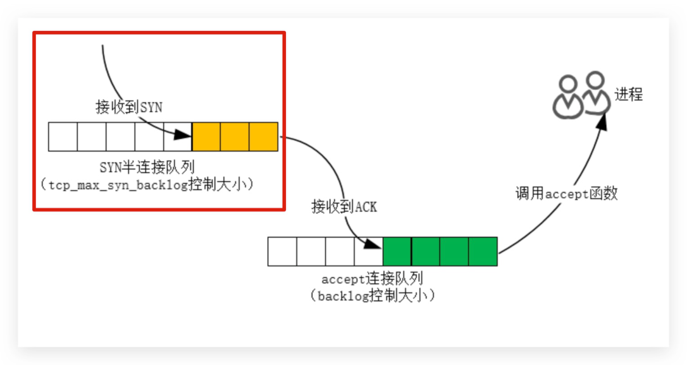

当服务器收到一个SYN后，它创建一个子连接加入到SYN_RCVD队列。在收到ACK后，它将这个 子连接移动到ESTABLISHED队列。最后当用户调用accept（）时，会将连接从ESTABLISHED队列取 出。

## 1.调整服务端参数

#关闭syncookies避免干扰 [root@server ~]# sysctl -w net.ipv4.tcp_syncookies=0 [root@server ~]# sysctl -w net.ipv4.tcp_max_syn_backlog=2

## 2.客户端执行如下操作

#禁止客户端返回ack，模拟服务端SYN_RECV状态 [root@client ~]#iptables -t filter -I OUTPUT -p tcp --sport 22 -j ACCEPT --tcp-fLag SYN,ACK ACK -jDROP #使用teLnet连接远程主机 [root@client ~]# telnet 10.0.0.100 22 & [1] 11913 [root@client ~]# telnet 10.0.0.100 22 & [2] 11916 [root@client ~]# telnet 10.0.0.100 22 & [3] 11917 [root@client ~]# telnet 10.0.0.100 22 & 进程 接收到SYN SYN半连接队列 (tcp_max_syn_back1og控制大小) 调用accept函数 接收到ACK accept连接队列 (backlog控制大小）

[4] 12012 [root@client ~]# Trying 10.0.0.100...

## 3.检查服务端连接状态

[root@webo1 ~]#netstat-tn Active Internet connections (w/o servers) State ProtoRecv-QSend-QLocalAddress Foreign Address tcp 0 10.0.0.100:22

#### 10.0.0.99:17304

SYN_RECV tcp SYN_RECV 0 10.0.0.100:22

#### 10.0.0.99:17302

tcp 0 10.0.0.100:22

#### 10.0.0.99:17300

SYN_RECV #内核会提示丢弃了一些请求 [root@webo1 ~]# dmesg [31204.380052] TCP: drop open request from 10.0.0.99/17320 [31205.382226] TCP: drop open request from 10.0.0.99/17320 ·注意：SYN_RECV有3条记录，我们调整的限制2，怎么多出了一条；是因为系统的判断条件 是>而不是>=，所以当达到3条记录时才算超过限制，所以有3条SYN_RECV记录；

### 8.5 core_somaxconn

net.core.somaxconn用于定义服务端全连接队列的大小，默认为128，对于生产环境而言，肯定 是不够用；

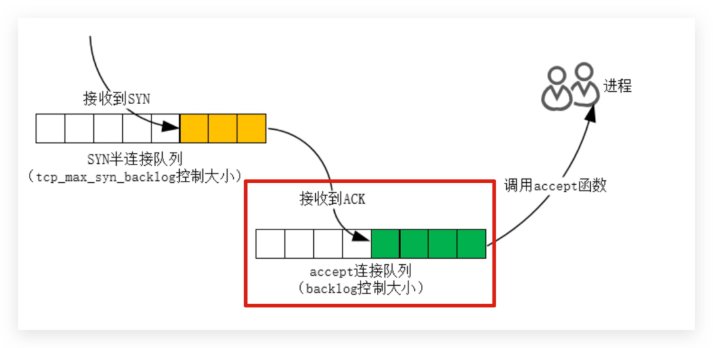

## 1.调整服务端全连接队列大小为3

接收到SYN SYN半连接队列 （tcp_max_syn_back1og控制大小） 调用accept函数 接收到ACK accept连接队列 (back1og控制大小）

[root@server ~]# sysctl -w net.core.somaxconn=2

## 2.服务端脚本

[root@server ~]# cat server.c #include <stdio.h> #include<unistd.h> #include <string.h> #include <sys/socket.h> #include<netinet/in.h> #defineBACKLOG200 int main(int argc, char **argv) { int listenfd; int connfd; struct sockaddr_in servaddr; listenfd = Socket(PF_INET， SOCK_STREAM, O); bzero(&servaddr, sizeof(servaddr)); servaddr.sin_family = AF_INET; servaddr.sin_addr.s_addr = htonl(INADDR_ANY); servaddr.sin_port = htons(50001); bind(listenfd, (struct sockaddr *)&servaddr, sizeof(servaddr)); listen(listenfd,BACKLOG); while(1) { sleep(1); { return 0;

## 3.编译并启动服务端脚本

[root@server ~]# gcc server.c -o server [root@server ~]# ./server

## 4.编写客户端脚本

[root@client ~]# cat client.c #include <stdio.h> #include <string.h> #include <sys/socket.h> #include <netinet/in.h> #include <arpa/inet.h> #include <unistd.h> int main(int argc, char **argv) int sockfd; struct sockaddr_in servaddr; Sockfd = Socket(PF_INET, SOCK_STREAM, O); bzero(&servaddr, sizeof(servaddr)); servaddr.sin_family = AF_INET; servaddr.sin_port = htons(50001); servaddr.sin_addr.s_addr = inet_addr("10.0.0.100"); if (0 != connect(sockfd,(struct sockaddr *)&servaddr, sizeof(servaddr))) printf("connect failed!\n"); else { printf("connect succeed!\n"); { sleep(30); return 1;

## 5.编译并启动客户端脚本

[root@client ~]# gcc client.c-o client [root@client ~]#./client & [1] 16368 [root@client ~]# connect succeed! ./client & [2] 16370 [root@client ~]# connect succeed! ./client & [3] 16371 [root@client ~]# connect succeed! ./client & [4] 16372

[root@client~]# connect succeed! ./client & [5] 16375 [root@client ~]# connect succeed!

## 5.检查服务端状态 (会发现已建立连接队列就3条，其余都在半连接池中无法进入连接队列)

[root@server ~]# netstat -nt / grep 50001 tcp 0 10.0.0.100:50001

#### 10.0.0.99:17405

SYN_RECV tcp

#### 10.0.0.99:17407

SYN_RECV 0 10.0.0.100:50001 tcp 0 10.0.0.100:50001

#### 10.0.0.99:17399

ESTABLISHED tcp 0 10.0.0.100:50001

#### 10.0.0.99:17403

ESTABLISHED tcp 0 10.0.0.100:50001

#### 10.0.0.99:17401

ESTABLISHED

## 6.调整全连接队列大小，然后再次启动多次客户端进行查看

[root@server ~]# sysctl -w net.core.somaxconn=10 [root@webo1 ~]# ./server #查看服务端连接状态 [root@server ~]# netstat -nt / grep 50001 tcp

#### 10.0.0.99:17431

SYN_RECV 0 10.0.0.100:50001 tcp SYN_RECV 0 10.0.0.100:50001

#### 10.0.0.99:17433

tcp 0 10.0.0.100:50001

#### 10.0.0.99:17425

ESTABLISHED tcp

#### 10.0.0.99:17417

ESTABLISHED

#### 010.0.0.100:50001

tcp

#### 10.0.0.99:17419

ESTABLISHED

#### 010.0.0.100:50001

tcp 0 10.0.0.100:50001

#### 10.0.0.99:17415

ESTABLISHED tcp 0 10.0.0.100:50001

#### 10.0.0.99:17421

ESTABLISHED tcp

#### 10.0.0.99:17409

0 10.0.0.100:50001 ESTABLISHED tcp 0 10.0.0.100:50001 ESTABLISHED

#### 10.0.0.99:17429

tcp

#### 10.0.0.99:17411

0 10.0.0.100:50001 ESTABLISHED tcp ESTABLISHED 0 10.0.0.100:50001

#### 10.0.0.99:17413

tcp ESTABLISHED 0 10.0.0.100:50001

#### 10.0.0.99:17427

tcp ESTABLISHED 0 10.0.0.100:50001

#### 10.0.0.99:17423

#全连接队列11条记录，之所以会这样，是因为系统采用>而>=所以条目会+1 [root@server ~]# netstat -nt / grep 50001 /wc -L

### 8.6 tcp_syn_retries

net.ipv4.tcp_syn_retries表示应用程序进行发送sYN包时，在对方不返回sYN+ACk的情况

下，内核默认重试发送6次SYN包，也就是说如果一直收不到对方返回SYN+ACK那么应用程序 最大的超时时间就是（1+2+4+8+16+32+64=127秒）这对于很多客户端而言是很难以接受的； ·第1次发送SYN 报文后等待1s（2^0），如果超时，则重试 ·第2次发送后等待2s（2^1），如果超时，则重试 ·第3次发送后等待4s（2^2），如果超时，则重试 ·第4次发送后等待8s（2^3），如果超时，则重试 ·第5次发送后等待16s（2~4），如果超时，则重试 ·第6次发送后等待32s（2^5），如果超时，则重试 ·第7次发送后等待64s（2~6），如果超时，则超时失败

## 1.服务端配置iptables来丢弃指定端口的sYN报文

#进来流量如果syn标志位为1则拒绝 [root@server ~]# iptables -A INPUT -p tcp --dport 22 --syn -j DROP #服务端使用tcpdump抓包 [root@server ~]# tcpdump -i eth0 -n src 10.0.0.99 and dst 10.0.0.100 and port 22

## 2.然后客户端使用telnet连接服务端指定端口

[root@client ~]# date '+ %F %T'; telnet 10.0.0.100 22; date '+ %F %T'; #开始时间 2021-07-29 23:32:57 Trying 10.0.0.100... telnet: connect to address 10.0.0.100: Connection timed out #结束时间 2021-07-29 23:35:05

## 3.最后分析抓包结果，从tcpdump的输出也可以看到，一共发了7次SYN包(都是同一个seq号码)，

第一次是正常请求，后面6次是重试，正是该内核参数设置的值， od u p u o u u- a - d #[ uaso] 23:33:04.820449 IP 10.0.0.99.ndmp > 10.0.0.100.ssh: Flags [S], seq 2633109385, 23:33:12.837846 IP 10.0.0.99.ndmp > 10.0.0.100.ssh: Flags [S], seq 2633109385,

## 4.修改客户后端重试次数，在测试

[root@client ~]# sysctl -w net.ipv4.tcp_syn_retries=2 #再次测试 [root@client ~]# date '+ %F %T'; telnet 10.0.0.100 22; date '+ %F %T'; #起始时间 2021-07-29 23:39:15 Trying 10.0.0.100... #结束时间 2021-07-29 23:39:22 ·注意：作为代理服务器这个值就应该调整；

### 8.8内核参数示例

[root@oldxu ~]# vim /etc/sysct.conf #tcp优化 net.ipv4.ip_local_port_range = 1024 65000 net.ipv4.tcp_tw_reuse = 1 net.ipv4.tcp_max_tw_buckets = 5000 #防止sYNFLood攻击，开启后max_Syn_backLog理论上没 net.ipv4.tcp_syncookies = 1 有最大值 net.ipv4.tcp_max_syn_backlog=8192#SYN半连接队列可存储的最大值 #SYN全连接队列可存储的最大值 net.core.somaxconn = 32768 #修改TcPTIME-WAIT超时时间https://heLp.aLiyun.com/document_detaiL/155470.html net.ipv4.tcp_tw_timeout =5 #重试 #发送SYN包重试次数，默认6 net.ipv4.tcp_syn_retries=2 #返回syn+ack重试次数，默认5 net.ipv4.tcp_synack_retries = 2 #其他 # net.ipv4.ip_forward = 1 # net.ipv4.ip_nonlocal_bind = 1 # net.ipv4.tcp_keepalive_time = 600 #当keepaLive启动时，TcP发送keepaLive消息的频度；默认是2小时，将其设置为1θ分钟，可更快的 清理无效链接 #系统中允许存在文件句柄最大数目（系统级） fs.file-max = 204800 # vm.swappiness = 0 TCP参数优化参考

内核参数 tcp_syncookies 内核参数backlog
