# 15 Kubernetes 资源调度

## 目录

  - [1.1 什么是调度器](#1.1-什么是调度器)
  - [1.2 调度器流程](#1.2-调度器流程)
  - [1.4 预选函数](#1.4-预选函数)
  - [1.5 优选函数](#1.5-优选函数)
- [2.Pod节点选择器](#2.pod节点选择器)
  - [2.1 什么是节点选择器](#2.1-什么是节点选择器)
  - [2.2 节点选择器实践](#2.2-节点选择器实践)
- [3.节点亲和调度](#3.节点亲和调度)
  - [3.1 什么是节点亲和](#3.1-什么是节点亲和)
  - [3.2 节点亲和策略](#3.2-节点亲和策略)
  - [3.3 节点亲和示例](#3.3-节点亲和示例)
  - [3.4 节点亲和操作符](#3.4-节点亲和操作符)
  - [3.5 节点亲关系表达式-1](#3.5-节点亲关系表达式-1)
  - [3.6 节点亲关系表达式-2](#3.6-节点亲关系表达式-2)
  - [3.7 节点亲关系表达式-3](#3.7-节点亲关系表达式-3)
- [4.强制节点亲和实践](#4.强制节点亲和实践)
  - [4.1 强制节点亲和场景1](#4.1-强制节点亲和场景1)
  - [4.2 强制节点亲和场景2](#4.2-强制节点亲和场景2)
- [5.首选节点亲和实践](#5.首选节点亲和实践)
  - [5.1 首选节点亲和性示例](#5.1-首选节点亲和性示例)
  - [5.2 首选节点亲和场景1](#5.2-首选节点亲和场景1)
  - [5.3 首选节点亲和场景2](#5.3-首选节点亲和场景2)
- [6.Pod亲和与反亲和调度](#6.pod亲和与反亲和调度)
  - [6.1 什么是Pod亲和与反亲和](#6.1-什么是pod亲和与反亲和)
  - [6.2 为何需要Pod亲和与反亲](#6.2-为何需要pod亲和与反亲)
  - [6.2 Pod亲和与反亲和位置拓扑](#6.2-pod亲和与反亲和位置拓扑)
  - [6.3 Pod间的强制亲和实践](#6.3-pod间的强制亲和实践)
  - [6.4 Pod间的首选亲和实践](#6.4-pod间的首选亲和实践)
  - [6.5 Pod间反亲和实践](#6.5-pod间反亲和实践)
- [7.Pod亲和与反亲和场景实践](#7.pod亲和与反亲和场景实践)
  - [7.1 场景说明](#7.1-场景说明)
  - [7.2 部署Redis](#7.2-部署redis)
  - [7.3 部署应用](#7.3-部署应用)
  - [7.4 检查结果](#7.4-检查结果)
- [8.nodeName](#8.nodename)
  - [8.1 nodeName介绍](#8.1-nodename介绍)
  - [8.2 nodeName局限](#8.2-nodename局限)
  - [8.3 nodeName实践](#8.3-nodename实践)
- [9.污点与容忍度](#9.污点与容忍度)
  - [9.1 什么是污点](#9.1-什么是污点)
  - [9.2 什么是容忍度](#9.2-什么是容忍度)
  - [9.3 污点与容忍度场景](#9.3-污点与容忍度场景)
  - [9.3 如何给节点打污点](#9.3-如何给节点打污点)
  - [9.4 如何给Pod添加容忍度](#9.4-如何给pod添加容忍度)
  - [9.5 污点与容忍度实践-1](#9.5-污点与容忍度实践-1)
  - [9.6 污点与容忍度实践-2](#9.6-污点与容忍度实践-2)
  - [9.7 基于污点的驱逐实践](#9.7-基于污点的驱逐实践)

```
1.kube-scheduler
```
### 1.1 什么是调度器

在 Kubernetes 中内置了 kube-scheduler，它是集群默认的 调度器。但kube-scheduler调度器它基本上仅发挥在有限的场景 当中，那就是有新的Pod出现了。当我们通过APIServer创建一个 Pod时，如果这个Pod尚未绑定到任何节点，那就需要通过调度器 来调度这个Pod到对应的节点上运行； 那什么叫尚未绑定到任何节点呢，在Pod规范中有一个 nodeName 的字段，这个字段指定了该Pod要运行在哪个节点上，如果直接指 定该字段的值，也就是直接指明该Pod要在哪个节点运行，那么调 度器则不会工作。如果创建的Pod都没有定义nodeName字段的值， 也就意味着该字段为空，那这个Pod究竟要运行到哪个节点上，我 们的Kubernetes集群没法判定。

所以 kube-scheduler 它会一直监视着 APIServer 中所有 Pod 的 NodeName 字段，当监控到该字段为 空 时，那么它会 为对应的Pod启动调度机制，然后从众多节点中挑选一个最佳的节 点。挑选后还需要将选定的节点信息写入到 nodeNAME 字段，然 后返回给APIServer。最后由对应节点上的Kubelet创建并运行 该Pod（因为kubelet也会一直监视着这个字段）

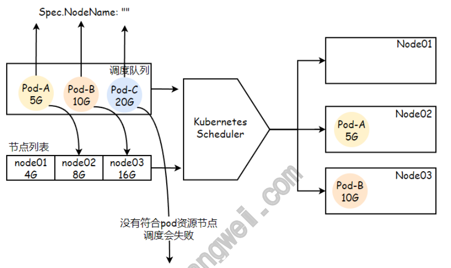

### 1.2 调度器流程

一个Pod究竟要调度到哪个节点上，应该有一些挑选标准，或调度 算法；kube-scheduler 实现的调度器叫 default- scheduler，如果对调度器有其他要求，Kubernetes也允许自己 写一个调度组件来替换默认的kube-scheduler。 默认调度器在调度一个Pod时，它通过三个步骤来完成调度，（ 过 滤、打分、绑定 ）

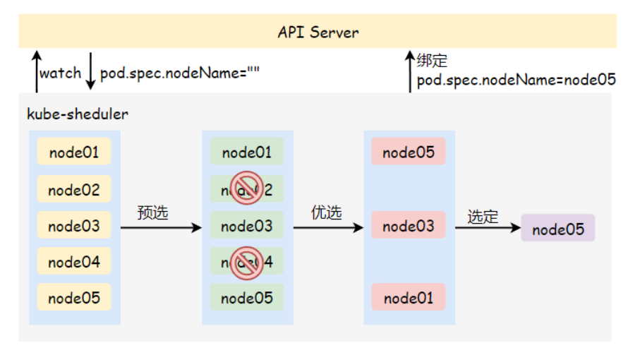

1、过滤阶段（预选策略） 由于 Pod 内的每一个容器对资源都有不同的需求，所有每个Pod www.xuliangwei.com 的需求也不同，因此 Pod 在被调度到 Node 上之前，会检查候选 Node 的可用资源能否满足 Pod 的资源请求。 在过滤之后，得出 一个 Node 列表，里面包含了所有可调度节点。 如果没有任何一 个 Node 能满足 Pod 的资源需求，那么这个 Pod 将一直停留在 未调度状态 直到调度器能够找到合适的 Node。 2、打分阶段（优选策略） 在打分阶段，调度器会为 Pod 从所有可调度节点中选取一个最合 适的 Node。 根据当前启用的打分规则，调度器会给每一个可调度 节点进行打分，并按综合得分进行排序，如果同时有多个节点得分 一致，则随机挑选一个节点。 3、绑定节点 最后调度器会将这个调度决定通知给APIServer，这个过程叫 绑 定。而后由相应节点的代理程序Kubelet启动Pod。

### 1.4 预选函数

此前我们提到过预选阶段主要用于排除那些不符合Pod申请规范的 节点，所以它会通过所有已启用的预选函数对所有节点进行逐一筛 查，任何一个预选函数否决，都会造成该节点被排除掉，反之则会 保留进入下一个优选阶段。 1、CheckNodeUnschedulable 检查节点是否被标识为Unschedulable，这个标识表示不可调 度，如果Pod能接受此类节点，则保留该节点，否则排除该节点 2、HostName 若Pod资源通过spec.nodeName明确指定了要绑定的目标节点，那 么该节点会被保留。 www.xuliangwei.com 3、PodFitsHostPorts 若容器定义了ports.hostPort属性，那么该预选函数会检查其指 定的端口是否已被节点上其他容器或服务所占用，该端口已被占用 的节点将统统被排除掉。 4、MatchNodeSelector 若Pod资源规范定义了spec.nodeSelector节点选择器字段，则 将拥有匹配对应标签的节点保留下来，剩余节点全部排除。 5、PodFitsResources 检查节点是否有足够的CPU或内存资源，能够满足Pod的运行需求。 节点会声明其资源的可用容量，而Pod会定义资源需求，于是调度 器会判断节点是否有足够可用的资源来运行对应的Pod，如果无法 满足则返回失败的原因。（调度器评判节点资源消耗的标准是节点 已分配出去的资源使用量，也就是各个容器的Requests之和。）

### 1.5 优选函数

成功通过预选函数过滤后的节点将生成一个可调度列表，随后对节 点进行优先级排序阶段。对于每个节点，调度器会使用优选函数分 别为其打分（0~10之间的分数），然后将所有的分数进行相加，即 为该节点的总得分，最后得分最高者胜出。 1、LeastRequestedPriority 通过计算 CPU 和 Memory 的使用率来决定权重，使用率越低的 节点权重越高。换句话说，这个优先级指标倾向于资源使用比例更 低的节点。 2、BalancedResourceAllocation 以CPU和内存资源占用率相近的作为评估标准，二者越接近的节点 www.xuliangwei.com 权重越高，该函数不能单独使用，它需要和Least- RequestedPriority组合使用来平衡优化节点资源的使用状态， 选择在部署当前Pod资源后系统资源更为均衡的节点。 3、NodeAffinityPriority 节点亲和调度机制，它根据Pod资源规范中的 spec.nodeSelector来对给定节点进行匹配度检查，成功匹配到 的条目越多则节点得分越高。 4、TaintTolerationPriority 基于Pod资源对节点的污点容调度偏好进行优先级评估，它将Pod对 象的tolerations列表与节点的污点进行匹配度检查，成功匹配的 条目越多，则节点得分越低。 5、ImageLocalityPriority

镜像亲和调度机制，它根据给定的节点列表上是否拥有运行当前 Pod的容器所依赖的镜像文件来计算节点的分值，如果没有所依赖 的镜像文件节点得分为0，而存在相关镜像文件的各个节点，被Pod 依赖到的镜像文件的体积越大，节点得分越高。 6、SelectorSpreadPriority 尽可能将Pod分散到不同节点上的调度插件，它首先查找标签选择 器能匹配当前Pod标签的RS、Deployment、StatefulSet等控制 器，而后查找可由这类对象的标签选择器匹配的现存各Pod对象及 其所在的节点，而运行此类Pod对象越少的节点得分越高。简单来 说：就是将同一标签选择器匹配到的Pod资源打散到不同的节点上 运行。

默认调度器能够满足我们绝大多数的要求，能够保证我们的 Pod 可以被分配到资源充足的节点上运行。但是在实际的线上项目中， 可能我们自己会比 kubernetes 更加了解我们自己的应用，比如 我们希望一个 Pod 只能运行在特定的几个节点上，或者这几个节 点只能用来运行特定类型的应用，这就需要我们的调度器能够可 控。

## 2.Pod节点选择器

### 2.1 什么是节点选择器

nodeSelector 提供了一种简单的方法来将 Pod 约束到具有特 定标签的节点上。

Pod资源可以使用.spec.nodeSelector 来指定节点标签，过滤 出符合条件的节点，作为可用目标节点，而后将Pod调度到拥有对 用标签的节点上，如果没有匹配到对应节点的标签，则会调度失 败。该匹配规则属于强制约束。 默认情况，Scheduler会将Pod调度到所有可用的节点。不过有些 情况我们希望将Pod部署到指定的节点，比如将有大量磁盘 I/O需 求的Pod部署到配置了SSD的节点上。

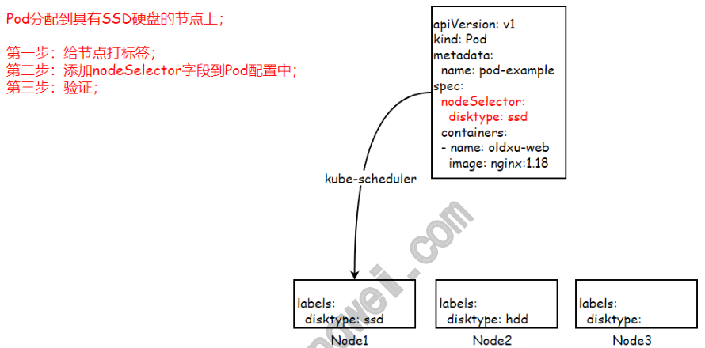

### 2.2 节点选择器实践

```
场景描述：Pod分配到具有SSD硬盘 1、给Node1节点添加标签 [root@master ~]# kubectl label nodes node01 disktype=ssd node/node01 labeled 2、配置Pod清单

[root@master scheduler]# cat 01-pod- nodeselector.yaml apiVersion: v1 kind: Pod metadata: name: pod-node-selector spec: nodeSelector: disktype: ssd containers:

- name: web

image: nginx:1.18 www.xuliangwei.com 3、验证结果 [root@master scheduler]# kubectl apply -f 01- pod-nodeselector.yaml pod/pod-node-selector created [root@master scheduler]# kubectl get pod pod- node-selector  -o wide NAME                READY   STATUS    RESTARTS AGE   IP             NODE     NOMINATED pod-node-selector   1/1     Running   0 7s    192.168.1.55   node01   <none>
```
## 3.节点亲和调度

### 3.1 什么是节点亲和

节点亲和是指，Pod自身对期望运行的某类节点的倾向性，倾向于 运行指定的节点即为“亲和”关系，否则即为“反亲和”关系。 要想实现亲和调度，首先需要在节点上定义便签，而后在Pod对象 上通过标签选择器来选择对应的节点标签。而支持这种调度机制的 有NodeSelector和NodeAffinity调度插件。 但nodeSelector节点选择器，只能选择拥有指定标签的节点，其 实现逻辑较为简单，控制粒度不够细。而nodeAffinity节点亲 和，提供对选择逻辑，更强的控制能力。

### 3.2 节点亲和策略

在Pod上定义节点亲和（nodeAffinity）时有两类亲和关系； （required）强制/硬亲和、（preferred）首选/软亲和。 强制亲和：限定了调度Pod资源时必须满足的规则，如没有可用节 点时Pod对象会被置为Pending状态，直到满足规则的节点出现首 先亲和：相对来强制亲和来说它更加的柔和，它倾向将Pod运行在 某类特定的节点上，但无法满足调度需求时，调度器将选择一个无 法匹配规则的节点，而非将Pod对象置为Pending状态。 requiredDuringSchedulingIgnoredDuringExecutio n：调度器只有在规则被满足的时候才能执行调度，强制策 略。 preferredDuringSchedulingIgnoredDuringExecuti on： 调度器会尝试寻找满足对应规则的节点，软性亲和。

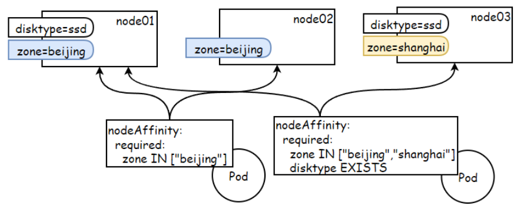

注意：Pod资源基于节点亲和规则调度至某节点之后，因节点标 签发生了改变而变得不在符合Pod定义的亲和规则时，调度器也 不会将Pod从此节点上移除，因而亲和调度仅在调度执行的过程 中进行一次即时的判断，而非持续地监视亲和规则是否能够满 足。 www.xuliangwei.com

### 3.3 节点亲和示例

你可以使用 Pod 规约中的 .spec.affinity.nodeAffinity 字段来设置节点亲和性。 1、节点 必须 包含键名为 kubernetes.io/os 的标签， 并且其取值为 linux。 2、节点 最好 具有键名为 disktype 且取值为 ssd 的标 签。 二者条件结合起来的含义是，必须运行在os=linux的节点，且同 时最好能够运行在带有ssd标签节点，没有也无所谓。 apiVersion: v1 kind: Pod metadata: name: with-node-affinity spec: containers:

```
- name: web

image: nginx:1.18 affinity: nodeAffinity:

requiredDuringSchedulingIgnoredDuringExecution: # 硬亲和 nodeSelectorTerms:

preferredDuringSchedulingIgnoredDuringExecution :      # 软亲和

- weight:
```
### 3.4 节点亲和操作符

可以使用 operator 字段来为 Kubernetes 设置在解释规则时 要使用的逻辑操作符。

操作符 含义 In 匹配节点标签对应的值是否在列表中，如果 在则条件成立； NotIn 匹配节点标签值是否不在列表中，如果不在 则条件成立； Exists 匹配节点的标签名称只要存在，则条件成 立； DoesNotExist 匹配不到对应标签名称，则条件成立； Gt 匹配到的标签值，如果大于则条件成立；比 如CPU核心数大于2，则ՎՎʢ Lt 匹配到的标签值，如果小于则条件成立；比 如CPU核心数小于1，则ՎՎʢ www.xuliangwei.com

### 3.5 节点亲关系表达式-1

如果在 nodeSelectorTerms 中指定了多个 matchExpressions 的话，只要有一个条件满足，Pod 就可以 被调度到对应的节点上。 spec: affinity: nodeAffinity:

```
requiredDuringSchedulingIgnoredDuringExecution: nodeSelectorTerms:                  # 如下两个条件满足一个即可
```
### 3.6 节点亲关系表达式-2

如果在matchExpressions中指定了多个条件，则 matchExpressions 所有条件都满足时，Pod才可以被调度到节 点上。 spec: www.xuliangwei.com affinity: nodeAffinity:

```
requiredDuringSchedulingIgnoredDuringExecution: nodeSelectorTerms:                  # 如下两个条件必须同时满足
```
### 3.7 节点亲关系表达式-3

如果你同时指定了 nodeSelector 和 nodeAffinity，两者 必须都要满足，才能将 Pod 调度到候选节点上。 # 节点为linux，同时arch必须为amd64，并且disktype为 hdd spec: nodeSelector: kubernetes.io/os: linux affinity: nodeAffinity:

```
requiredDuringSchedulingIgnoredDuringExecution: www.xuliangwei.com nodeSelectorTerms:

- hdd

ՎՎʕ # 节点为linux，并且arch必须为amd64   or  节点为 linux，并且disktype为hdd spec: nodeSelector: kubernetes.io/os: linux affinity:

nodeAffinity:

requiredDuringSchedulingIgnoredDuringExecution: nodeSelectorTerms:
```
www.xuliangwei.com

```
- hdd
```
## 4.强制节点亲和实践

### 4.1 强制节点亲和场景1

场景描述：将Pod部署到拥有 zone=beijing 并且 disktype=ssd 标签的节点上；

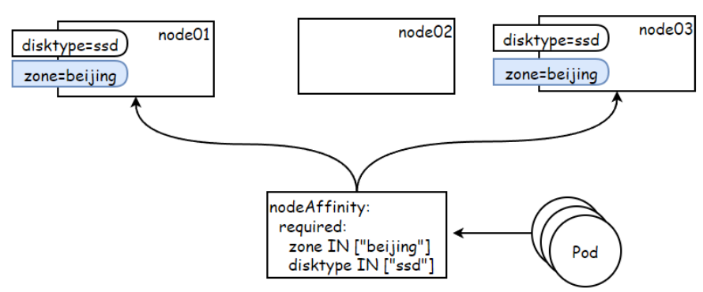

```
1、为节点添加标签 [root@master ~]# kubectl label nodes node01 zone=beijing disktype=ssd [root@master ~]# kubectl label nodes node03 zone=beijing disktype=ssd 2、部署Pod，使用节点硬亲和，匹配对应标签； [root@master scheduler]# cat 02-node-affinity- required.yaml apiVersion: apps/v1 kind: Deployment metadata: www.xuliangwei.com name: node-affinity-required spec: replicas: 5 selector: matchLabels: app: web template: metadata: labels: app: web spec: containers:

image: nginx:1.18 affinity: nodeAffinity:

requiredDuringSchedulingIgnoredDuringExecution:
```
nodeSelectorTerms:          # 必须同 时满足如下两个条件；

```
- beijing

3、检查Pod调度情况。 www.xuliangwei.com [root@master scheduler]# kubectl get pod -o wide node-affinity-required-5f68f8cc97-2pxv2   1/1 Running  0    23s     192.168.1.81    node01 node-affinity-required-5f68f8cc97-csjsm   1/1 Running  0    23s     192.168.1.80    node01 node-affinity-required-5f68f8cc97-f5tmj   1/1 Running  0    23s     192.168.1.82    node01 node-affinity-required-5f68f8cc97-gk2lr   1/1 Running  0    23s     192.168.1.83    node01 node-affinity-required-5f68f8cc97-zvg55   1/1 Running  0    23s     192.168.3.227   node03 节点硬亲和机制实现的功能与节点选择器相似，但亲和性支持使用 标签匹配表达式或字段选择器来挑选节点，提供了灵活且强大的选 择机制，因此可被理解为新一代节点选择器。
```
### 4.2 强制节点亲和场景2

场景描述：将所有Pod部署到 zoneՎʱbeijing 并且 disktypeՎʱssd 的节点上；

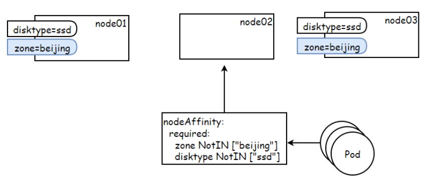

```
1、给节点打标签 www.xuliangwei.com [root@master ~]# kubectl label nodes node01 zone=beijing disktype=ssd [root@master ~]# kubectl label nodes node03 zone=beijing disktype=ssd 2、编写yaml [root@master scheduler]# cat 03-node-affinity- required.yaml apiVersion: apps/v1 kind: Deployment metadata: name: node-affinity-required-2 spec: replicas: 5 selector: matchLabels: app: web

template: metadata: labels: app: web spec: containers:

image: nginx:1.18 affinity: nodeAffinity:

requiredDuringSchedulingIgnoredDuringExecution: nodeSelectorTerms: www.xuliangwei.com

operator: NotIn values:

- beijing

operator: NotIn values:
```
3、检查Pod，会发现所有Pod都调度到Node2节点了。

```
[root@master scheduler]# kubectl get pod -o wide node-affinity-required-2-664899f99c-4r294   1/1 Running   0   8s    192.168.2.99    node02 node-affinity-required-2-664899f99c-bpgr5   1/1 Running   0   8s    192.168.2.103   node02 node-affinity-required-2-664899f99c-hq5gk   1/1 Running   0   8s    192.168.2.102   node02 node-affinity-required-2-664899f99c-rtl8j   1/1 Running   0   8s    192.168.2.100   node02 node-affinity-required-2-664899f99c-tzj7q   1/1 Running   0   8s    192.168.2.101   node02 www.xuliangwei.com
```
## 5.首选节点亲和实践

### 5.1 首选节点亲和性示例

首选节点亲和为节点提供了一种柔性控制逻辑，被调度的Pod对象 不再是 “必须”，而是 “尽量” 放置到某些特定节点之上，但当节 点不满足Pod调度的条件时，该Pod也能够接受被编排到其他不符合 条件的节点之上。 多个软亲和条件并存时，它支持为每个条件定义weight属性以区别 他们优先级，取值范围是1~100，数字越大优先级越高。如下清单 定义了一条硬亲和条件和两条软亲和条件，并且它们有着不同的权 重。 apiVersion: v1 kind: Pod metadata: name: with-affinity-anti-affinity

```
spec: containers:

- name: with-node-affinity

image: nginx:1.18 affinity: nodeAffinity:

requiredDuringSchedulingIgnoredDuringExecution: nodeSelectorTerms:
```
www.xuliangwei.com

```
preferredDuringSchedulingIgnoredDuringExecution :

- weight:

- beijing

- weight:
```
如果存在两个候选节点，都满足软亲和规则，其中一个节点有 zone=beijing 标签，另一个节点 disktype=ssd 的标签， 调度器会检查各个条件的 weight 值，并将该权重值添加到节点 的得分值上。

### 5.2 首选节点亲和场景1

```
场景描述：尽量将所有的Pod部署到 拥有gpu 标签类型的节点 上； 1、为节点添加标签 [root@master scheduler]# kubectl label nodes node02 gpu=true www.xuliangwei.com node/node02 labeled 2、编写Pod [root@master scheduler]# cat 04-node-affinity- preferred.yaml apiVersion: apps/v1 kind: Deployment metadata: name: node-affinity-perferred spec: replicas: 5 selector: matchLabels: app: web template: metadata: labels: app: web

spec: containers:

image: nginx:1.18 affinity: nodeAffinity:

preferredDuringSchedulingIgnoredDuringExecution :

- weight:
```
尽量将 Pod调度到拥有gpu的节点上运行 www.xuliangwei.com

```
- key: gpu

- "true"
```
3、检查Pod运行的节点，会发现优先调度到拥有gpu标签的Node2 节点上；

```
[root@master scheduler]#  kubectl get pod -o wide node-affinity-perferred-6bff67bbfb-4sxh6    1/1 Running    0    9s    192.168.2.129 node02 node-affinity-perferred-6bff67bbfb-jt2bg    1/1 Running    0    9s    192.168.2.130 node02 node-affinity-perferred-6bff67bbfb-qv4gs    1/1 Running    0    9s    192.168.2.110 node02 node-affinity-perferred-6bff67bbfb-tkzrj    1/1 Running    0    9s    192.168.2.111 node02 node-affinity-perferred-6bff67bbfb-z29hg    1/1 Running    0    9s    192.168.2.109 node02 www.xuliangwei.com 4、给Pod资源添加资源申请Requests，然后重新创建资源 [root@master scheduler]# vim 04-node-affinity- preferred.yaml resources: requests: cpu: 300m memory: 300Mi 5、会发现，当node2节点无法满足需求时，会将Pod调度至其他节 点；

[root@master scheduler]#  kubectl get pod -o wide pod-affinity-perferred-7cf455c7f-56wwx    1/1 Running    0    3s     192.168.3.229 node03 pod-affinity-perferred-7cf455c7f-mrbmr    1/1 Running    0    3s     192.168.3.230 node03 pod-affinity-perferred-7cf455c7f-nmdb9    1/1 Running    0    3s     192.168.2.110 node02 pod-affinity-perferred-7cf455c7f-v7wkv    1/1 Running    0    3s     192.168.2.111 node02 pod-affinity-perferred-7cf455c7f-xdwp2    1/1 Running    0    3s     192.168.1.85  node01 www.xuliangwei.com
```
### 5.3 首选节点亲和场景2

场景描述：尽量将Pod调度到拥有gpu的节点，或者拥有 zone=foo/bar标签的节点上，其中gpu的权重为60，zone的权重 为30

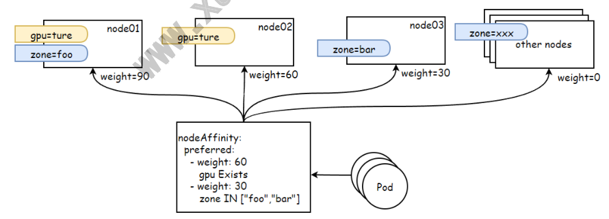

1、给节点添加标签；

```
[root@master scheduler]# kubectl label nodes node01 gpu=ture zone=foo [root@master scheduler]# kubectl label nodes node02 gpu=ture [root@master scheduler]# kubectl label nodes node03 zone=bar 2、运行Pod [root@master scheduler]# cat 05-pod- nodeaffinity-preferred-2.yaml apiVersion: apps/v1 kind: Deployment www.xuliangwei.com metadata: name: pod-affinity-perferred-2 spec: replicas: 5 selector: matchLabels: app: web template: metadata: labels: app: web spec: containers:

image: nginx:1.18 resources: requests: memory: 300Mi               # 初始内 存申请；

affinity: nodeAffinity:

preferredDuringSchedulingIgnoredDuringExecution :

- weight:

- key: gpu

operator: Exists

- weight:
```
www.xuliangwei.com

["foo","bar"] 3、检查Pod，虽然pod更加倾向node1节点，但当其无法满足pod 资源需求时，它将转而使用node02，直到该节点资源也分配完毕后 才使用倾向性更低的node3节点；

```
[root@master scheduler]# kubectl get pod -o wide pod-affinity-perferred-2-67f475f468-m6tfk   1/1 Running   0   8s   192.168.1.98   node01 pod-affinity-perferred-2-67f475f468-nxcm7   1/1 Running   0   8s   192.168.1.99   node01 pod-affinity-perferred-2-67f475f468-wf6ld   1/1 Running   0   8s   192.168.2.131  node02 pod-affinity-perferred-2-67f475f468-gd4ht   1/1 Running   0   8s   192.168.2.130  node02 pod-affinity-perferred-2-67f475f468-fmj8z   1/1 Running   0   8s   192.168.3.249  node03 www.xuliangwei.com
```
## 6.Pod亲和与反亲和调度

### 6.1 什么是Pod亲和与反亲和

pod亲和调度与节点亲和很相似，所谓节点亲和是用来判断Pod对节 点的倾向性，是更愿意运行在这个节点上，还是不愿意运行在这个 节点上。 那Pod亲和指的是，Pod彼此之间运行 同一位置 的倾向性。什么 叫做同一位置? 我们可以将每个节点都称为一个不同的位置，这就 意味着如果两个Pod是亲和的，那就必须运行在同一节点上，如果 是反亲和的，就必须运行在不同的节点之上。 但位置也可以理解为别的概念，比如将位置理解为机架、这就意味 着如果两个Pod是亲和的，它们就必须运行在同一机架的服务器 上，而同一个机架如果拥有多个服务器，那么它运行在同一个机架 上的任意服务器上，我们认为它是同一位置，否则就是不同位置。

### 6.2 为何需要Pod亲和与反亲

我们为什么非要限定Pod是否运行在同一节点、或运行在同一机架 上面呢，因为我们很多时候考虑更多的是Pod的冗余或容错，比 如：我们为了能够让MySQL架构有更好的容错性，我们定义每个节 点为一个不同的位置，然后让它们运行在不同位置的服务器上，以 达到分散运行的效果，实现节点级容灾等；

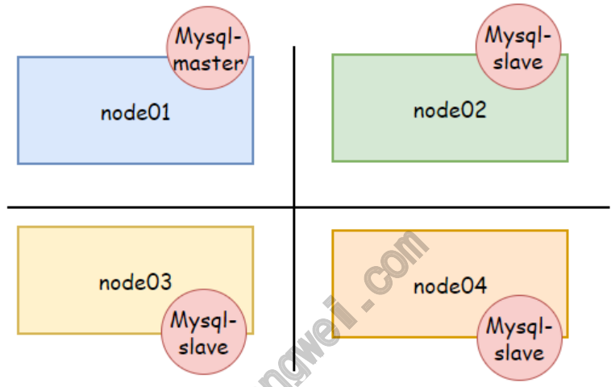

而有些服务则又需要亲和关系，比如PHP需要调用MySQL的时候， 如果我们将PHP与MySQL Master运行在同一位置，我们认为它们 彼此之间的交互性能会更好一些。而 MySQL Master 与MySQL Slave 之间应该又是反亲和的，已达到更好的容错效果。

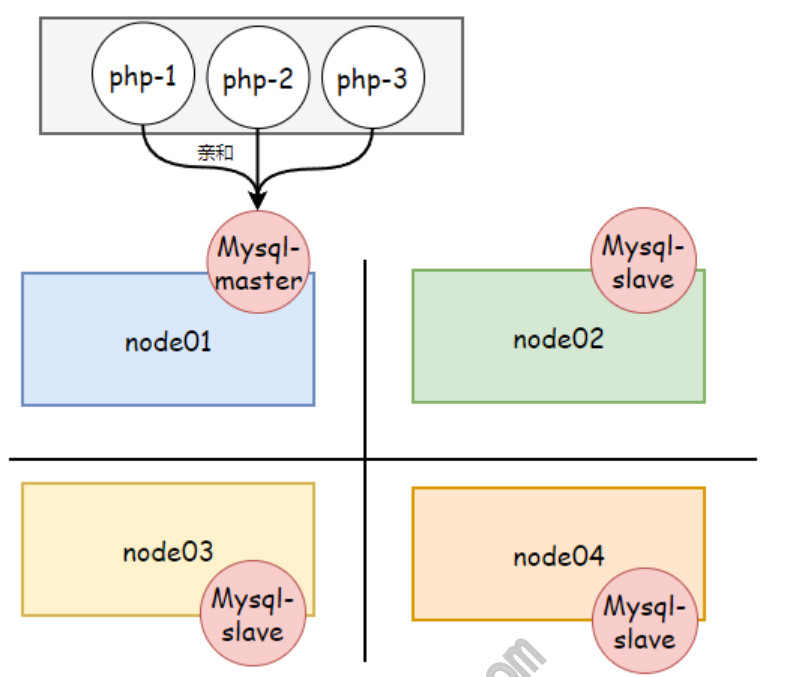

也就是PHP与MySQL是亲和，MySQL与MySQL之间则是反亲和的。

### 6.2 Pod亲和与反亲和位置拓扑

定义位置的方法很简单，无外乎就是在节点上选定一个特定的节点 标签，可以理解为拓扑标签/位置标签，当我们选择一个节点标签作 为位置判定逻辑时，具有同一标签值的就是同一位置，具有不同标 签值的就是不同位置。 1、基于节点划分 如果使用节点的 kubernetes.io/hostname 标签作为划分标 准，由于每个节点的标签值都不同，所以他们有着不同的位置。

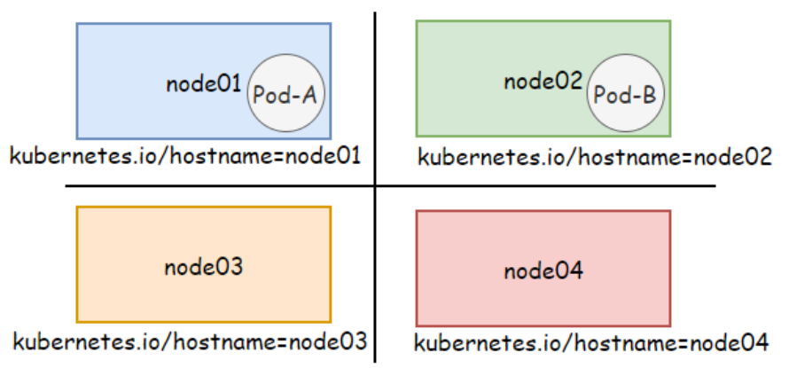

2、基于区域划分 如果基于区域标签划分节点位置，同一位置就表示节点在同一区 www.xuliangwei.com 域，而不同位置则表示在节点在不同的区域；下图node01和 node02属于同一位置，而node03和node04属于另一个意义上的 同一位置。

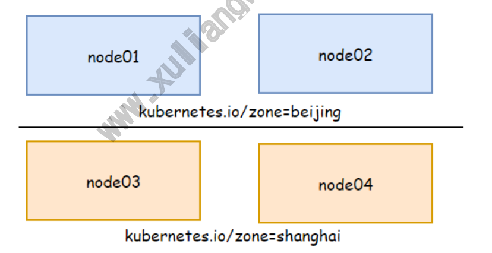

假设PodA运行在beijing区域上，PodB与PodA有亲和关系，那么 PodB则应该运行在beijing区域，反之则运行在shanghai区域。 所以不管是亲和还是反亲和，它应该是有一个参照系，就是参考某 个定义好的Pod，只要它在的地方我不在就是反亲和，或者我必须 与它在同一位置，那就是亲和关系。

### 6.3 Pod间的强制亲和实践

```
场景说明： 1、首先定义一个被依赖的后端存储应用，redis。 2、然后定义一个依赖该Redis存储的应用，比如nginx，它 必须与Redis运行在同一位置。 为了更接近真实环境来模拟这种约束机制，这里模拟node01和 node2位于同一机架rack001，而node03则位于另一个机架 rack002上，并以节点标签rack作为位置标签。 1、给节点添加标签 [root@master ~]# kubectl label nodes node01 www.xuliangwei.com rack=rack001 [root@master ~]# kubectl label nodes node02 rack=rack001 [root@master ~]# kubectl label nodes node03 rack=rack002 2、编写Redis存储的Deployment [root@master scheduler]# cat redis.yaml apiVersion: apps/v1 kind: Deployment metadata: name: redis spec: replicas: 1 selector: matchLabels: app: redis type: required

template: metadata: labels: app: redis type: required spec: containers:

- name: cache

image: redis:6.0 3、编写nginx的Deployment [root@master scheduler]# cat 06-pod-affinity- required.yaml www.xuliangwei.com apiVersion: apps/v1 kind: Deployment metadata: name: pod-affinity-required spec: replicas: 5 selector: matchLabels: app: web template: metadata: labels: app: web spec: containers:

image: nginx:1.18 affinity:

podAffinity:

requiredDuringSchedulingIgnoredDuringExecution:

- labelSelector:       # pod对象标签选
```
择器，用于确认放置当前Pod的参照物 matchExpressions:

```
["redis"]

- key: type
```
["required"] topologyKey: rack   # 拓扑键，用于确 www.xuliangwei.com 定节点位置拓扑的节点标签 4、由于redis被调度到node03节点，而该节点位于rack002，因 此nginxPod也必将运行在该rack002的node3节点之上。

```
[root@master scheduler]# kubectl get pod -o wide redis-67f58bd45b-9q8zb              1/1 Running   0       41s    192.168.3.250 node03 pod-affinity-required-585b55654-ckwjf   1/1 Running   0    20s     192.168.3.2     node03 pod-affinity-required-585b55654-465fz   1/1 Running   0    20s     192.168.3.254   node03 pod-affinity-required-585b55654-5gzn2   1/1 Running   0    20s     192.168.3.253   node03 pod-affinity-required-585b55654-hwxmr   1/1 www.xuliangwei.com Running   0    20s     192.168.3.252   node03 pod-affinity-required-585b55654-wrx9g   1/1 Running   0    20s     192.168.3.251   node03 Pod间的亲和调度能够将有着密切关系或密集通信的应用约束在同 一位置，通过降低通信延迟来降低性能损耗，但如果node03节点没 有足够的资源支撑Pod的运行，则可能出现部分Pod处于Pending 状态。
```
### 6.4 Pod间的首选亲和实践

首选亲和则只是尽力满足这种亲和关系，不像强制亲和它是必须满 足亲和关系。当无法保证这种亲和关系时，调度器则会将Pod调度 置集群中其他位置的节点之上。而对于位置关系要求不是那么严格 的应用，在部署时采用首选亲和倒也不失为一种折中的选择。 场景说明： 1、首先定义一个被依赖的后端存储应用，redis。

2、然后定义一个依赖该Redis存储的应用，比如nginx，要求 它 尽量 与 Redis Pod 运行在同一位置节点 （kubernetes.io/hostname标签），当条件无法满足时， 则期望运行在同一 机架上（rack标签），否则也能接受运行 在集群中的其他任何节点之上。

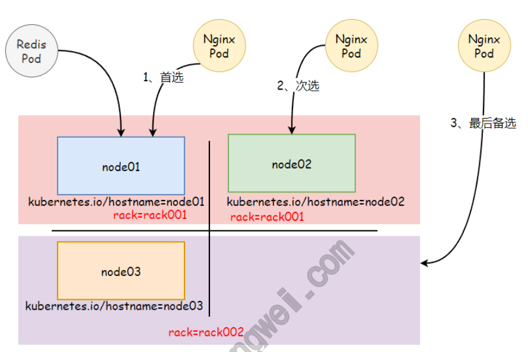

```
1、编写yaml文件 [root@master scheduler]# cat 07-pod-affinity- preferred.yaml apiVersion: apps/v1 kind: Deployment metadata: name: redis-db spec: replicas: 1 selector: matchLabels: app: redis type: preferred template:

metadata: labels: app: redis type: preferred spec: nodeSelector:            # 由于节点有限，为 了模拟效果，强制将redis绑定到node01节点 kubernetes.io/hostname: node01 containers:

- name: cache

image: redis:6.0 ՎՎʕ www.xuliangwei.com apiVersion: apps/v1 kind: Deployment metadata: name: pod-affinity-preferred spec: replicas: 5 selector: matchLabels: app: web template: metadata: labels: app: web spec: containers:
```
image: nginx:1.18 resources:              # 资源请求，用于 影响节点可承载的Pod数量

```
requests: memory: 600Mi affinity: podAffinity:

preferredDuringSchedulingIgnoredDuringExecution :

- weight: 100                 # 最大权

重的亲和条件 podAffinityTerm: labelSelector: matchExpressions:       # 两个条 件必须同时满足 www.xuliangwei.com

["redis"]

- key: type

["preferred"] topologyKey: kubernetes.io/hostname     # 确定节点位置拓扑的标 签

- weight: 50                  # 第二权

重的亲和条件 podAffinityTerm: labelSelector: matchExpressions:

- { key: app, operator: In ,

values: ["redis"]}

- { key: type, operator: In,

values: ["preferred"]}

topologyKey: rack   # 使用机架作为 第二条件位置 2、当Redis被调度到node01节点之上，nginxpod同样更倾向运 行在该节点，当条件无法满足时，调度器将以该节点所在的rack为 标准挑选同一个rack中的另一个节点node2，最后是node3节点。 [root@master scheduler]# kubectl get pod -o wide redis-db-9b8896c8c-k6zw8                 1/1 Running   0     18s   192.168.1.111   node01 pod-affinity-preferred-d99ffb7dd-tc9hj   1/1 Running   0     18s   192.168.1.110  node01 www.xuliangwei.com pod-affinity-preferred-d99ffb7dd-hx79q   1/1 Running   0     18s   192.168.1.109  node01 pod-affinity-preferred-d99ffb7dd-m8x2k   1/1 Running   0     18s   192.168.2.138  node02 pod-affinity-preferred-d99ffb7dd-5j9vh   1/1 Running   0     18s   192.168.2.139  node02 pod-affinity-preferred-d99ffb7dd-7vm9d   1/1 Running   0     17s   192.168.3.29   node03
```
### 6.5 Pod间反亲和实践

Pod间的反亲和，它的主要目标在于确保存在互斥关系的Pod不会运 行在同一位置，这么做有什么好处呢？ 1、将一个服务POD分散在不同的主机或者不同的位置中，提高 服务本身的稳定性。 2、有些POD需要占用节点特定端口，确保相同Pod不会调度同 一节点，这样可以避免端口冲突。

```
1、创建4个Pod副本，必须在不同的节点之上。 [root@master scheduler]# cat 08-pod- antiaffinity-required.yaml apiVersion: apps/v1 kind: Deployment metadata: name: pod-antiaffinity-required spec: replicas: 4 selector: matchLabels: app: web-antiaffinity www.xuliangwei.com template: metadata: labels: app: web-antiaffinity spec: containers:

image: nginx:1.18 affinity: podAntiAffinity:

requiredDuringSchedulingIgnoredDuringExecution:

- labelSelector:      # 部署的Pod不能与

拥有app:web-antiaffinity的pod部署在一起 matchExpressions:

- { key: app, operator: In,

values: ["web-antiaffinity"]} topologyKey: kubernetes.io/hostname # 基于节点的位置拓扑

2、因为示例集群中一共就3个节点，因此，必然有一个Pod对象处 于Pending状态。 [root@master scheduler]# kubectl get pod -o wide pod-antiaffinity-required-57566b9f84-45hzp 1/1   Running   0     3s   192.168.1.118 node01 pod-antiaffinity-required-57566b9f84-8lddm 1/1   Running   0     3s   192.168.3.30  node03 pod-antiaffinity-required-57566b9f84-fdnt8 1/1   Running   0     3s  192.168.2.146  node02 pod-antiaffinity-required-57566b9f84-zfb4p 0/1   Pending   0     3s   <none>        <none> www.xuliangwei.com 当然Pod反亲和调度也支持使用柔性约束机制，调度器会尽量不把 位置相斥的Pod对象调度到同一位置，但约束关系无法得到满足 时，也可以违反约束规则进行调度，而非将Pod置于Pending状 态。
```
## 7.Pod亲和与反亲和场景实践

### 7.1 场景说明

1、redis部署在不同的位置的节点上（反亲和），使用hostname 作为位置标签； 2、nginx与Redis部署在同一位置 （亲和）； 3、nginx与nginx之间处于不同的位置（反亲和）；

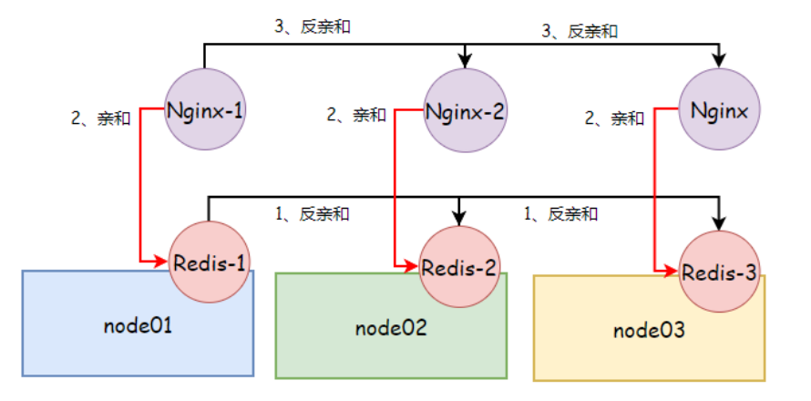

### 7.2 部署Redis

```
1、创建Deployment资源，提供redis服务，设置标签 www.xuliangwei.com app=store，副本数为3； 2、使用 podAntiAffinity 规则告诉调度器避免将多个带有 app=store 标签的副本部署到同一节点上； 因此，每个独立节点上会创建一个缓存实例 [root@master ~]# cat redis.yaml apiVersion: apps/v1 kind: Deployment metadata: name: redis-server spec: selector: matchLabels: app: store replicas: 3 template: metadata: labels:

app: store spec: containers:

- name: redis-server

image: redis affinity: podAntiAffinity:        # 反亲和

requiredDuringSchedulingIgnoredDuringExecution:

- labelSelector:

matchExpressions:

operator: In www.xuliangwei.com values:

- store

topologyKey: "kubernetes.io/hostname"
```
### 7.3 部署应用

1、创建deployment资源，提供web服务，设定标签 app=web， 副本数为3； 2、使用 podAffinity 规则告诉调度器将副本放到运行有标签 app=store Pod的节点上； 3、使用 podAntiAffinity 规则告诉调度器不要在同一节点放 置多个 app=web 的服务； [root@master tmp]# cat nginx.yaml apiVersion: apps/v1 kind: Deployment metadata:

```
name: web-server spec: replicas: 3 selector: matchLabels: app: web template: metadata: labels: app: web spec: containers:

image: nginx:1.18 affinity: podAffinity:    # 必须和app=store标签的 Pod在同一节点

requiredDuringSchedulingIgnoredDuringExecution:

- labelSelector:

matchExpressions:

- store

topologyKey: "kubernetes.io/hostname" podAntiAffinity:    # 必须不能与app=web标 签的Pod在同一节点

requiredDuringSchedulingIgnoredDuringExecution:

- labelSelector:

matchExpressions:

- web

topologyKey: "kubernetes.io/hostname"
```
### 7.4 检查结果

创建前面两个Deployment会产生如下的集群布局，每个 Web 服 务器与一个缓存实例并置，并分别运行在三个独立的节点上。 www.xuliangwei.com

```
[root@master tmp]# kubectl get pod -o wide redis-server-5886c6dbd-fnkrw       1/1 Running   0        1m2s   192.168.1.178 node01 redis-server-5886c6dbd-74p47       1/1 Running   0        1m2s   192.168.2.214 node02 redis-server-5886c6dbd-qs46c       1/1 Running   0        1m2s   192.168.3.66 node03 web-server-5f57d554df-7mf8j        1/1 Running   0        45s    192.168.1.179 www.xuliangwei.com node01 web-server-5f57d554df-j5xk4        1/1 Running   0        45s    192.168.2.215 node02 web-server-5f57d554df-mch4b        1/1 Running   0        45s    192.168.3.67 node03 表格展示如下： node01 node02 node03 webserver-1 webserver-2 webserver-3 redis-server-1 redis-server-2 redis-server-3
```
## 8.nodeName

### 8.1 nodeName介绍

默认新创建的Pod，nodeName字段为空，会由Scheduler来完成 调度，如果在创建Pod明确指定了nodeName字段对应的值，比如指 定为node01，那么调度器会忽略该Pod的调度，而是直接由指定 node01节点的kubelet来运行对应的Pod。 首先 nodeName 比 nodeSelector ，或亲和性更为直 接； 其次 nodeName 规则的优先级会高于使用 nodeSelector 或亲和性与非亲和性的规则。 www.xuliangwei.com

### 8.2 nodeName局限

使用 nodeName 为Pod选择节点的方式有一些局限性： 1、如果所指定的节点不存在，则 Pod 无法运行，而且在某些 情况下可能会被自动删除。 2、如果所指定的节点无法提供 Pod 所需的资源，则会失败， 失败原因也会告知是因为内存还是CPU不足而造成无法运行。 3、在云环境中的节点名称并不是可预测的，也不总是稳定的。

### 8.3 nodeName实践

1、创建Pod，使用 nodeName 字段指定到特定的节点上运行。

```
[root@master scheduler]# cat nodename-demo.yaml apiVersion: v1 kind: Pod metadata: name: nginx spec: nodeName: node03          # 该Pod只能运行在 node03节点之上 containers:

image: nginx 2、创建Pod，如果指定的节点无法提供Pod所需资源； www.xuliangwei.com [root@master scheduler]# cat nodename.yaml apiVersion: v1 kind: Pod metadata: name: nginx spec: nodeName: node03 containers:
```
image: nginx resources: requests: cpu: 2              # 初始申请2核心CPU memory: 2Gi         # 初始申请2Gi内存 #如果节点资源不够，创建后会有如下提示

```
Events: Type     Reason    Age   From     Message ----     ------    ----  ----     ------- Warning  OutOfcpu  10s   kubelet  Node didn't have enough resource: cpu, requested: 2000, used: 300, capacity: 1000
```
## 9.污点与容忍度

此前我们了解过节点选择器、节点亲和或Pod亲和，都是让Pod选择 节点的。就算是Pod亲和也是让Pod选节点的，无非就是Pod所参照 系的那组Pod所在的节点，不在的节点，本质上还是让Pod选节点 的。节点只能被动的等待被挑选。那能不能让节点主动拒绝某类 www.xuliangwei.com Pod的调度？那我们可以给某类节点打上特定的污点，使Pod无法调 度到该类节点上，除非这类Pod它能容忍这些节点上的污点，这就 是污点和容忍度的概念。

### 9.1 什么是污点

污点是节点级的属性，我们可以在一个节点上给它设定一组特殊的 属性，为了能更加形象的描述这组属性，我们将其称为污点。一旦 对应的节点拥有了污点，Pod则无法调度到该节点上，除非它能容 忍这些节点的污点，则可以正常调度到拥有污点的节点上。

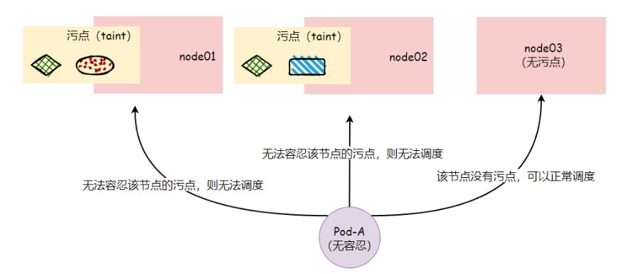

值得一提的是，我们还可以给节点继续添加污点，如果已调度到该 节点的Pod无法容忍新添加的污点，则该Pod会被驱离该节点，而这 些就需要在节点的污点上添加效用标识来完成。

### 9.2 什么是容忍度

容忍度（tolerations）是定义在Pod对象上的键值数据，用于配 置该Pod可以容忍哪些节点的污点以及污点的效用标识，这样就可 以将Pod调度到那些有污点的节点上。

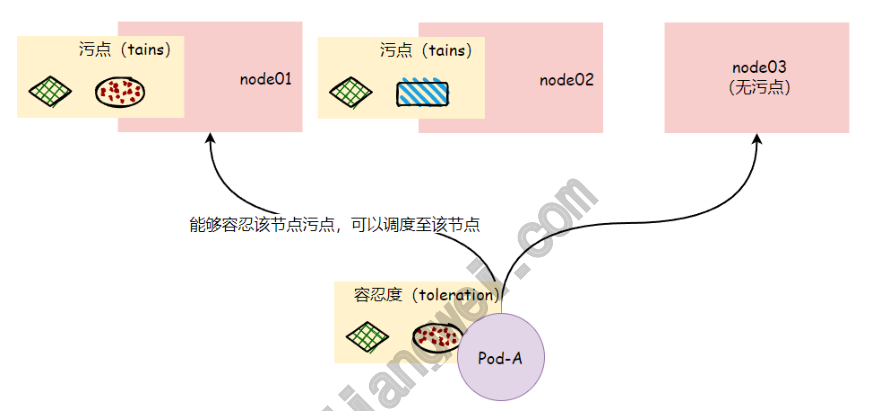

### 9.3 污点与容忍度场景

场景1： 使用kubeadm部署的Kubernetes集群的主节点默认就有污点，我 们给主节点加上污点的主要作用在于，避免应用Pod被调度和运行 在主节点上面来，因为主节点上运行的APIServer、 ControllerManager、Scheduler本身它们的系统压力就比较 大，在把其他应用Pod调度到主节点上面来，会使得主节点很快不 堪重负，因而为了避免应用Pod调度到主节点上面来，所以事先为 主节点添加了污点，而我们自己定义的Pod，没有任何容忍度，所 以它们都无法运行在主节点上面来。

```
[root@master scheduler]# kubectl describe nodes master Taints:             node- role.kubernetes.io/master:NoSchedule # 污点名称：     node-role.kubernetes.io/master # 污点效用标识：  NoSchedule 场景2： 集群中有一组机器专门为测试环境的容器应用而设定，这些机器可 能随时按需上下线，那就需要给这些机器添加上对应的污点，确保 能容忍此污点的测试Pod可以调度上来，而那些生产的Pod则无法容 忍这些污点，则不会调度到这些节点上。 www.xuliangwei.com
```
### 9.3 如何给节点打污点

在实际生产环境中，污点通常用于描述具体的部署规划，它们的键 名如：node-type、node-role、node-project等。kubectl taint 命令可以管理Node对象的污点信息，语法格式如下： # 语法：kubectl taint nodes <node-name> <keyՎҲ <valueՎұ<effect> # 示例：kubectl taint nodes node01 node- type=prod:NoExecute effect：污点有效标识，用于定义其对Pod对象的排斥等级 NoSchedule：不能容忍此污点的Pod不可以调度到当前 节点，对现存节点上的Pod无影响，属于强制约束关系； PreferNoSchedule：尽量确保无法容忍该污点的Pod调 度至当前节点；属于软性约束关系； NoExecute：无法容忍此污点的Pod无法调度至当前节 点，同时节点上现存的Pod对象因污点变动或Pod的容忍度

无法匹配条件时，Pod对象将会被驱逐；属于强制约束关 系；

1、为 node01 节点添加一个污点，它的键名是node-type，键 值是prod，效果是NoSchedule，这表示只有拥有和这个污点相匹 配的容忍度的 Pod 才能够被分配到 node01 这个节点。 [root@master ~]# kubectl taint nodes node01 node-type=prod:NoSchedule node/node01 tainted 2、若要移该节点对应的污点，你可以执行： www.xuliangwei.com [root@master ~]# kubectl taint nodes node01 node-type=prod:NoSchedule-

### 9.4 如何给Pod添加容忍度

Pod 的容忍度在 PodSpec 中定义，根据使用的操作符不同，主 要有两种可用形式： 一种是与污点信息完全匹配的等值关系。将 operator 指定 为 Equal，则它们的 key、value、effect 应该相等； 一种是判断污点信息存在性的匹配方式。将 operator 指定 为 Exists （此时容忍度无需指定value）； 1、定义一个与节点污点完全相匹配的容忍度，它表示能够容忍键名 为node-type，键值为prod，效果为NoSchedule的污点。 apiVersion: v1 kind: Pod metadata:

```
name: pod-demo spec: containers:

image: nginx:1.18
```
tolerations:          # Pod能够容忍节点污点名为 node-type，值为prod，效用标识为NoSchedule

```
- key: "node-type"
```
operator: "Equal" value: "prod" effect: "NoSchedule" www.xuliangwei.com 2、定义一个存在判断机制的容忍度，如下示例表示能够容忍以 node.kubernetes.io/unreachable为键名的、效果为 NoExcute的污点，其中tolerationSeconds用于定义延迟驱逐 当前Pod对象的时长。 比如，一个使用了很多本地状态的应用程序在网络断开时，节点控 制器会自动给节点添加污点，如果仍然希望停留在当前节点上运行 一段时间，等待网络恢复以避免被驱逐。在这种情况下，Pod 的容 忍度可能是下面这样的： apiVersion: v1 kind: Pod metadata: name: pod-demo spec: containers:

```
image: nginx:1.18

tolerations:                              # Pod容忍度定义

- key: "node.kubernetes.io/unreachable"   #
```
节点控制器根据节点情况会自动添加的污点 operator: "Exists" effect: "NoExecute" tolerationSeconds: 6000                 # tolerationSeconds仅对效果为NoExecute的标识有效

### 9.5 污点与容忍度实践-1

此前我们通过daemonSet部署的node-exporter，会发现它无法 运行在Master节点。但node-exporter它是用来抓取节点的指标 www.xuliangwei.com 信息，为监控服务提供数据，所以对于Master而言，它也需要运行 node-exporter，所以我们可以给对应的Pod添加能够容忍 Master节点的污点信息。 1、查看Master节点的污点 [root@master ~]# kubectl describe nodes master |grep -i  taints Taints:             node- role.kubernetes.io/master:NoSchedule 2、修改node-exports部署的yaml文件，使其能够容忍Master 节点的污点 [root@master daemonSet]# cat 02-daemonSet-node- exporter.yaml apiVersion: apps/v1 kind: DaemonSet metadata:

```
name: node-exporter namespace: default spec: selector: matchLabels: app: node-exporter template: metadata: labels: app: node-exporter spec: hostNetwork: true www.xuliangwei.com hostPID: true containers:

- name: prometheus-node-exporter

image: prom/node-exporter:v0.18.0 ports:

- name: node-ex-http

containerPort: 9100 hostPort: 9100 livenessProbe: tcpSocket: port: node-ex-http initialDelaySeconds: 5 readinessProbe: httpGet: path: '/metrics' port: node-ex-http initialDelaySeconds: 5 tolerations: # 容忍度

- key: "node-role.kubernetes.io/master"

容忍的key为 node-role.kubernetes.io/master operator: "Exists" # 只判断需要容忍的key存在即可 effect: "NoSchedule" # 容忍的效用标识为NoSchedule 3、检查是否所有节点都有对应的node-exports，包括master节 点 [root@master daemonSet]# kubectl get pod -o wide NAME READY STATUS RESTARTS AGE IP NODE www.xuliangwei.com node-exporter-6lqc2 1/1 Running 0 32s 10.0.0.206 node03 node-exporter-8t849 1/1 Running 0 32s 10.0.0.201 master node-exporter-kg7x8 1/1 Running 0 32s 10.0.0.204 node01 node-exporter-thg5g 1/1 Running 0 32s 10.0.0.205 node02
```
### 9.6 污点与容忍度实践-2

为node01添加node-type=prod的污点，只要能容忍该污点的 Pod则为生产环境应用，则允许调度到node01节点 为node02与node03添加node-type=test的污点，只要能容忍该 污点的Pod则为测试环境应用。则运行调度node02\node03 1、为节点添加污点；

```
[root@master ~]#  kubectl taint nodes node01 node-type=prod:NoSchedule      # 生产节点 [root@master ~]#  kubectl taint nodes node02 node-type=test:NoSchedule      # 测试节点 [root@master ~]#  kubectl taint nodes node03 node-type=test:NoSchedule      # 测试节点 2、创建一个生产环境Pod，配置对应的容忍度，则该Pod理应能正 常调度到node01节点； [root@master scheduler]# cat 09-pod- tolerations-prod.yaml apiVersion: apps/v1 www.xuliangwei.com kind: Deployment metadata: name: pod-demo-prod spec: replicas: 5 selector: matchLabels: app: web template: metadata: labels: app: web spec: containers:

image: nginx:1.18

tolerations:

- key: "node-type"

operator: "Equal" value: "prod" effect: "NoSchedule" 3、创建一个测试环境Pod，配置对应的容忍度，则该Pod应能正常 调度node02或者node03节点； [root@master scheduler]# cat 10-pod- tolerations-test.yaml apiVersion: apps/v1 kind: Deployment metadata: name: pod-demo-test spec: www.xuliangwei.com replicas: 5 selector: matchLabels: app: web template: metadata: labels: app: web spec: containers:

image: nginx:1.18 tolerations:

- key: "node-type"

operator: "Equal" value: "test" effect: "NoSchedule"
```
### 9.7 基于污点的驱逐实践

前面提到过污点的 effect 值 NoExecute 会影响已经在节点上 运行的 Pod 如果 Pod 不能忍受 effect 值为 NoExecute 的污点，那 么 Pod 将马上被驱逐； 如果 Pod 能够忍受 effect 值为 NoExecute 的污点，但 是在容忍度定义中没有指定 tolerationSeconds，则 Pod 会一直在该节点上运行； 如果 Pod 能够忍受 effect 值为 NoExecute 的污点，同 时指定了 tolerationSeconds， 则 Pod 能在这个节点上 继续运行指定的时间长度，而后会被驱逐。 1、检查当前环境运行的Pod状态 www.xuliangwei.com

```
[root@master scheduler]# kubectl get pod -o wide NAME                                READY STATUS    RESTARTS   AGE   IP             NODE pod-demo-prod-769c97b4cf-2ps2m      1/1 Running   0          68s   192.168.1.130 node01 pod-demo-prod-769c97b4cf-6vbv5      1/1 Running   0          68s   192.168.1.133 node01 pod-demo-prod-769c97b4cf-c5zbt      1/1 Running   0          68s   192.168.1.131 node01 www.xuliangwei.com pod-demo-prod-769c97b4cf-dqqb8      1/1 Running   0          68s   192.168.1.132 node01 pod-demo-prod-769c97b4cf-jv4d5      1/1 Running   0          68s   192.168.1.134 node01 pod-demo-test-56d5bf875b-6btmg      1/1 Running   0          3s    192.168.3.55 node03 pod-demo-test-56d5bf875b-9trkx      1/1 Running   0          3s    192.168.3.56 node03 pod-demo-test-56d5bf875b-bqx9s      1/1 Running   0          3s    192.168.2.175 node02 pod-demo-test-56d5bf875b-t86sb      1/1 Running   0          3s    192.168.2.176 node02

pod-demo-test-56d5bf875b-xggb4      1/1 Running   0          3s    192.168.2.177 node02 2、给node03节点添加污点，如果pod无法容忍该污点，则会被驱 逐到其他节点上继续运行。 [root@master scheduler]# kubectl taint nodes node03 node-wh:NoExecute 3、Pod如果无法容忍该节点对应的污点，则会被驱逐此节点 [root@master scheduler]# kubectl get pod -o wide www.xuliangwei.com NAME                               READY STATUS    RESTARTS   AGE   IP              NODE

pod-demo-prod-769c97b4cf-2ps2m     1/1 Running   0          14m   192.168.1.130 node01 pod-demo-prod-769c97b4cf-6vbv5     1/1 Running   0          14m   192.168.1.133 node01 pod-demo-prod-769c97b4cf-c5zbt     1/1 Running   0          14m   192.168.1.131 node01 pod-demo-prod-769c97b4cf-dqqb8     1/1 Running   0          14m   192.168.1.132 node01 pod-demo-prod-769c97b4cf-jv4d5     1/1 Running   0          14m   192.168.1.134 node01

pod-demo-test-56d5bf875b-bqx9s     1/1 Running   0          13m   192.168.2.175 node02 pod-demo-test-56d5bf875b-xggb4     1/1 Running   0          13m   192.168.2.177 node02 pod-demo-test-56d5bf875b-t86sb     1/1 Running   0          13m   192.168.2.176 node02 Վˁ如下两个Pod被迁移到其他Node2节点继续运行了 pod-demo-test-56d5bf875b-l764s     1/1 Running   0          14s   192.168.2.179 www.xuliangwei.com node02 pod-demo-test-56d5bf875b-vchwz     1/1 Running   0          14s   192.168.2.178 node02
```
