# 18 Kubernetes迁移微服务

## 目录

- [1.微服务基本概念](#1.微服务基本概念)
  - [1.1 什么是微服务](#1.1-什么是微服务)
  - [1.2 微服务部署架构](#1.2-微服务部署架构)
  - [1.3 微服务部署思路](#1.3-微服务部署思路)
- [2.SpringCloud项目部署](#2.springcloud项目部署)
  - [2.1 部署微服务数据层](#2.1-部署微服务数据层)
    - [2.1.1 部署MySQL](#2.1.1-部署mysql)
    - [2.1.2 部署Redis](#2.1.2-部署redis)
  - [2.2 部署微服务治理层](#2.2-部署微服务治理层)
    - [2.2.1 部署Nacos](#2.2.1-部署nacos)
    - [2.2.2 部署Sentinel](#2.2.2-部署sentinel)
    - [2.2.3 部署Skywalking](#2.2.3-部署skywalking)
  - [2.3 部署微服务组件](#2.3-部署微服务组件)
    - [2.3.1 环境准备](#2.3.1-环境准备)
- [1、克隆代码](#1克隆代码)
    - [2.3.2 打包项目](#2.3.2-打包项目)
    - [2.3.3 部署system组件](#2.3.3-部署system组件)
    - [2.3.4 部署auth组件](#2.3.4-部署auth组件)
    - [2.3.5 部署gateway组件](#2.3.5-部署gateway组件)
    - [2.3.6 部署monitor组件](#2.3.6-部署monitor组件)
    - [2.3.7 部署微服务前端UI](#2.3.7-部署微服务前端ui)
    - [2.3.8 测试整个微服务](#2.3.8-测试整个微服务)
- [2、monitor监控](#2monitor监控)
- [3、sentinel流控](#3sentinel流控)
- [4、skywalking链路追踪](#4skywalking链路追踪)
  - [2.4 更新微服务特定模块](#2.4-更新微服务特定模块)
    - [2.4.1 更新指定模块](#2.4.1-更新指定模块)
- [60 R<LoginUser> userResult =](#60-rloginuser-userresult-)
    - [2.4.2 重新打包应用](#2.4.2-重新打包应用)
    - [2.4.3 更新结果验证](#2.4.3-更新结果验证)
- [3.迁移微服务数据层至K8S](#3.迁移微服务数据层至k8s)
  - [3.1 迁移MySQL](#3.1-迁移mysql)
    - [3.1.1 创建StatefulSet](#3.1.1-创建statefulset)
    - [3.1.2 解析mysql对应IP](#3.1.2-解析mysql对应ip)
    - [3.1.3 导入数据相关文件](#3.1.3-导入数据相关文件)
  - [3.2 迁移Redis](#3.2-迁移redis)
    - [3.2.1 创建Deployment](#3.2.1-创建deployment)
    - [3.2.2 创建Service](#3.2.2-创建service)
    - [3.2.3 验证Redis](#3.2.3-验证redis)
- [4.迁移微服务治理层](#4.迁移微服务治理层)
  - [4.1 迁移Nacos](#4.1-迁移nacos)
    - [4.1.1 准备Nacos数据库](#4.1.1-准备nacos数据库)
    - [4.1.2 导入配置至数据库](#4.1.2-导入配置至数据库)
    - [4.1.3 创建ConfigMap](#4.1.3-创建configmap)
    - [4.1.4 创建StatefulSet](#4.1.4-创建statefulset)
    - [4.1.5 创建Ingress](#4.1.5-创建ingress)
    - [4.1.6 验证Nacos集群](#4.1.6-验证nacos集群)
  - [4.2 迁移sentinel](#4.2-迁移sentinel)
    - [4.2.1 制作镜像](#4.2.1-制作镜像)
    - [4.2.2 构建镜像](#4.2.2-构建镜像)
    - [4.2.3 创建Deployment](#4.2.3-创建deployment)
    - [4.2.4 创建Service](#4.2.4-创建service)
    - [4.2.5 创建Ingress](#4.2.5-创建ingress)
    - [4.2.6 验证Sentinel](#4.2.6-验证sentinel)
  - [4.3 迁移Skywalking](#4.3-迁移skywalking)
    - [4.3.1 部署SkywalkingOAP](#4.3.1-部署skywalkingoap)
    - [4.3.2 部署SkywalkingUI](#4.3.2-部署skywalkingui)
    - [4.3.3 创建Ingress](#4.3.3-创建ingress)
    - [4.3.4 验证Skywalking](#4.3.4-验证skywalking)
  - [4.4 迁移Skywalking-agent](#4.4-迁移skywalking-agent)
    - [4.4.1 下载Agent](#4.4.1-下载agent)
    - [4.4.2 编写Dockerfile](#4.4.2-编写dockerfile)
    - [4.4.3 制作镜像并推送仓库](#4.4.3-制作镜像并推送仓库)
    - [4.4.4 运行容器挂载Agent](#4.4.4-运行容器挂载agent)
- [5.迁移微服务层面](#5.迁移微服务层面)
  - [5.1 迁移微服务system](#5.1-迁移微服务system)
    - [5.1.1 编译system项目](#5.1.1-编译system项目)
    - [5.1.2 编写Dockerfile](#5.1.2-编写dockerfile)
    - [5.1.3 制作镜像并推送仓库](#5.1.3-制作镜像并推送仓库)
    - [5.1.4 修改system组件配置](#5.1.4-修改system组件配置)
    - [5.1.5 创建Deployment](#5.1.5-创建deployment)
    - [5.1.6 验证System组件](#5.1.6-验证system组件)
  - [5.2 迁移微服务auth](#5.2-迁移微服务auth)
    - [5.2.1 编译auth项目](#5.2.1-编译auth项目)
    - [5.2.2 编写Dockerfile](#5.2.2-编写dockerfile)
    - [5.2.3 制作镜像并推送仓库](#5.2.3-制作镜像并推送仓库)
    - [5.2.4 修改auth组件配置](#5.2.4-修改auth组件配置)
    - [5.2.5 创建Deployment](#5.2.5-创建deployment)
    - [5.2.6 验证auth组件](#5.2.6-验证auth组件)
  - [5.3 迁移微服务gateway](#5.3-迁移微服务gateway)
    - [5.3.1 编译gateway项目](#5.3.1-编译gateway项目)
    - [5.3.2 编写Dockerfile](#5.3.2-编写dockerfile)
    - [5.3.3 制作镜像并推送仓库](#5.3.3-制作镜像并推送仓库)
    - [5.3.4 修改gateway组件配置](#5.3.4-修改gateway组件配置)
    - [5.3.5 创建Deployment](#5.3.5-创建deployment)
    - [5.3.6 创建Service](#5.3.6-创建service)
    - [5.3.7 验证gateway组件](#5.3.7-验证gateway组件)
  - [5.4 迁移微服务monitor](#5.4-迁移微服务monitor)
    - [5.4.1 编译monitor项目](#5.4.1-编译monitor项目)
    - [5.4.2 编写Dockerfile](#5.4.2-编写dockerfile)
    - [5.4.3 制作镜像并推送仓库](#5.4.3-制作镜像并推送仓库)
    - [5.4.4 修改monitor组件配置](#5.4.4-修改monitor组件配置)
    - [5.4.5 创建Deployment](#5.4.5-创建deployment)
    - [5.4.6 创建Ingress](#5.4.6-创建ingress)
    - [5.4.7 验证monitor组件](#5.4.7-验证monitor组件)
  - [5.5 迁移微服务前端UI](#5.5-迁移微服务前端ui)
    - [5.5.1 修改前端配置](#5.5.1-修改前端配置)
    - [5.5.2 编译前端项目](#5.5.2-编译前端项目)
    - [5.5.3 编写Dockerfile](#5.5.3-编写dockerfile)
    - [5.5.4 制作镜像并推送仓库](#5.5.4-制作镜像并推送仓库)
    - [5.5.5 创建ConfigMap](#5.5.5-创建configmap)
    - [5.5.6 创建Deployment](#5.5.6-创建deployment)
    - [5.5.7 创建Ingress](#5.5.7-创建ingress)
    - [5.5.8 验证服务是否正常](#5.5.8-验证服务是否正常)

## 1.微服务基本概念

### 1.1 什么是微服务

在单体架构，常规的做法是将所有的业务都写在一起，但随着业务 越来越复杂，代码的耦合度就会越来越高，会带来如下问题： 1、后期升级困难，因为每次修改代码后，都需要进行重新发 布，一旦发布出现错误，就必须整体回退，客户体验感较差； 2、后期维护难度大，比如登录业务代码出现问题，但其他代码 都没问题，任然可能会造成整个网站都出现5xx等错误； 3、后期扩展浪费资源，扩展需要服务器部署整套代码及环境， 但有些模块访问量低不需要部署多份，会造成资源浪费。 所以我们需要根据业务功能模块将一个单体应用拆分成多个独立的 项目，每个项目完成一部分的业务功能，然后独立开发和部署。这 些独立的项目就称为微服务组件，而这些一个又一个的微服务组件 组织起来协同工作，我们也可以将其称为“微服务架构”。 举例： 一个商城系统提供很多的服务， 比如订单服务，用户功能，商品服 务，支付、物流、商品详情等等，这些模块如果使用单体架构来实 现，那么耦合度会相当高，开发难度也会很大。如果使用微服务方 式开发，把每一个服务都当成一个单体应用来开发，那么订单服 务，用户服务，商品服务，支付服务等，每一个就成为一个微服 务，由这些微服务构成整个的商城系统，每个服务也可以根据业务 的需要去进行集群部署。一方面降低了服务的耦合，另外一方面降 低了服务的升级、维护。

### 1.2 微服务部署架构

以当下主流的 Spring Cloud 微服务架构作为例子

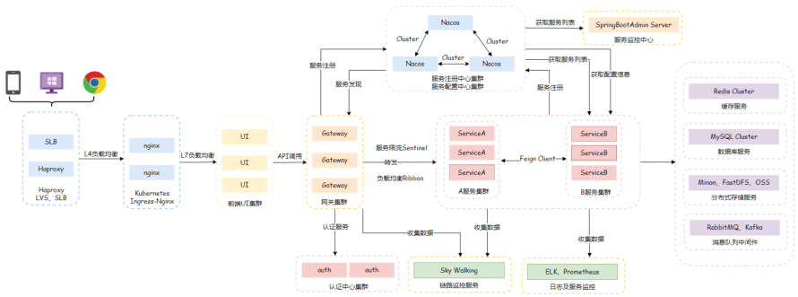

1、用户通过外网SLB或Haproxy将请求调度到Kubernetes的 Ingress，由Ingress负载均衡到前端UI集群； 2、前端UI通过API方式调用Gateway网关，网关通过Nacos获取 Auth认证服务地址、端口、url，进行Token认证； 3、认证通过后，通过Nacos获取对应服务地址、端口、url，然后 转发到对应服务集群，各个服务之间是通过Feign来交互； 4、服务集群可能需要通过文件存储获取数据、也可能需要查询数据 库、在或者通过Redis读取缓存数据； 5、通过Sentinel组件可以对服务实现限流、通过Monitor组件可 以实现服务监控、通过SkyWalking实现链路追踪； 6、通过Nacos可以实现服务发现以及服务注册，同时还能为服务提 供配置文件；

```
Ruoyi-Cloud微服务组件 com.ruoyi ├── ruoyi-ui              Վˌ 前端框架 [80] ├── ruoyi-gateway         Վˌ 网关模块 [8080] ├── ruoyi-auth            Վˌ 认证中心 [9200] ├── ruoyi-api             Վˌ 接口模块

│       └── ruoyi-api-system Վˌ 系统接口 ├── ruoyi-common          Վˌ 通用模块 │       └── ruoyi-common-core Վˌ 核心模块 │       └── ruoyi-common-datascope Վˌ 权限范围 │       └── ruoyi-common-datasource Վˌ 多数据源 │       └── ruoyi-common-log Վˌ 日志记录 │       └── ruoyi-common-redis Վˌ 缓存服务 │       └── ruoyi-common-security Վˌ 安全模块 │       └── ruoyi-common-swagger Վˌ 系统接口 ├── ruoyi-modules         Վˌ 业务模块 │       └── ruoyi-system Վˌ 系统模块 [9201] │       └── ruoyi-gen Վˌ 代码生成 [9202] │       └── ruoyi-job Վˌ 定时任务 [9203] │       └── ruoyi-file Վˌ 文件服务 [9300] ├── ruoyi-visual          Վˌ 图形化管理模块 │       └── ruoyi-visual-monitor Վˌ 监控中心 [9100]
```
### 1.3 微服务部署思路

1、先部署数据层相关的，比如MySQL、Redis、Mongodb、 Kafka、OSS等等； 2、然后部署微服务治理层，比如：Nacos服务发现与配置管理、 sentinel限流、Skywalking链路追踪、等 3、最后部署微服务层，先部署各个微服务组件，Gateway网关， 最后接入前端UI； 注意：各个服务的配置都在Nacos中存储，部署服务时需要先检查 Nacos配置是否正确；

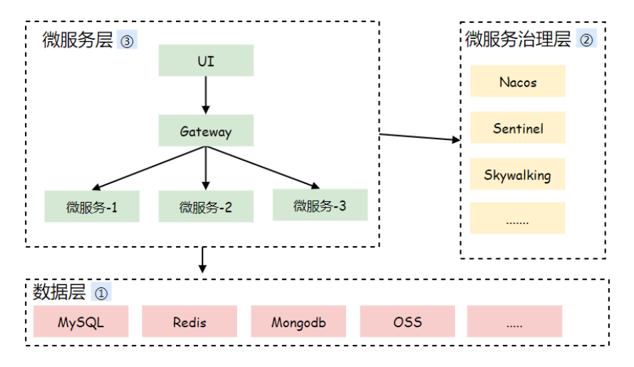

## 2.SpringCloud项目部署

IP地址 主机名 称 部署组件 说明 微服 务 层， 数据 层

10.0.0.7

web01 mysql,redis,nginx,ui,gateway,auth,system,monitor 微服 务治 理层

10.0.0.8

web02 sentinel,skywalking,Nacos,mysql

### 2.1 部署微服务数据层

#### 2.1.1 部署MySQL

```
1、安装 MySQL5.7 的yum源 [root@web01 ~]# rpm -ivh https:Վˌdev.mysql.com/get/mysql57-community- release-el7-10.noarch.rpm [root@web01 ~]# rpm Վʔimport https:Վˌrepo.mysql.com/RPM-GPG-KEY-mysql-2022 [root@web01 ~]# yum install mysql-server mysql -y [root@web01 ~]# systemctl enable mysqld Վʔnow 2、获取MySQL默认登录密码 [root@web01 ~]# cat /var/log/mysqld.log | awk '/password/{print $NF}' sn;KMN2VUwuh 3、修改MySQL默认密码策略和长度，并修改默认密码；

[root@web01 ~]# mysql -uroot -p'sn;KMN2VUwuh' mysql> mysql> set global validate_password_policy=0; mysql> set global validate_password_length=1; mysql> set password = password("123456"); mysql> flush privileges; 4、验证新密码能否登录MySQL [root@web01 ~]# mysql -uroot -p123456 mysql> mysql>
```
#### 2.1.2 部署Redis

```
1、安装Redis root@web01 ~]# yum install redis -y 2、启动Redis，并加入开机自启 [root@web01 ~]# systemctl enable redis Վʔnow
```
### 2.2 部署微服务治理层

#### 2.2.1 部署Nacos

在web02节点部署Nacos单机版，后期迁移至Kubernetes集群， 在部署Nocos集群版。（Nocos需要MySQL作为数据存储） 1、安装MySQL

```
[root@web02 ~]# rpm -ivh https:Վˌdev.mysql.com/get/mysql57-community- release-el7-10.noarch.rpm [root@web02 ~]# rpm Վʔimport https:Վˌrepo.mysql.com/RPM-GPG-KEY-mysql-2022 [root@web02 ~]# yum install mysql-server mysql -y [root@web02 ~]# systemctl enable mysqld Վʔnow 2、获取MySQL默认登录密码 [root@web02 ~]# cat /var/log/mysqld.log | awk '/password/{print $NF}' j*)NzXV:N6E> 3、修改MySQL默认密码策略和长度，并修改默认密码； [root@web02 ~]# mysql -uroot -p'j*)NzXV:N6E>' mysql> mysql> set global validate_password_policy=0; mysql> set global validate_password_length=1; mysql> set password = password("123456"); mysql> flush privileges; 4、导入nacos默认的初始化数据库文件nacos-mysql.sql

下载sql文件 [root@web02 ~]# wget https:Վˌlinux.oldxu.net/nacos-mysql.sql # 导入nacos数据 [root@web02 ~]# mysql -uroot -p123456 -e "create database nacos;" [root@web02 ~]# mysql -uroot -p123456 nacos < nacos-mysql.sql 5、Nacos需要java环境才可以正常运行，所以需要安装java相关 组件 [root@web02 ~]# yum install java java-devel maven -y 6、下载nacos-server软件 [root@web02 ~]# wget https:Վˌlinux.oldxu.net/nacos-server- 2.1.1.tar.gz 7、配置 nacos-server

[root@web02 ~]# tar xf nacos-server- 2.1.1.tar.gz [root@web02 ~]# vim nacos/conf/application.properties ՎՎ˂ If use MySQL as datasource: spring.datasource.platform=mysql ՎՎ˂ Count of DB: db.num=1 ՎՎ˂ 连接数据库地址 db.url.0=jdbc:mysql:Վˌ127.0.0.1:3306/nacos? characterEncoding=utf8&connectTimeout=1000&sock etTimeout=3000&autoReconnect=true&useUnicode=tr ue&useSSL=false&serverTimezone=UTC ՎՎ˂ 连接数据库用户名与密码 db.user.0=root db.password.0=123456 8、以单机模式启动nacos-server [root@web02 ~]# sh nacos/bin/startup.sh -m standalone 9、访问nacos的webUI，通过http:ՎˌIP:8848/nacos，默认 用户名与密码均为 nacos，但默认的nacos没有任何配置信息
```
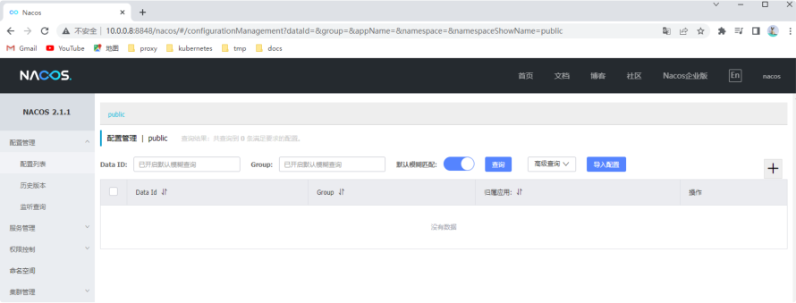

#### 2.2.2 部署Sentinel

```
继续在web02节点部署sentinel限流组件 1、下载 sentinel-dashboard-jar [root@web02 ~]# wget https:Վˌlinux.oldxu.net/sentinel-dashboard-
```
1.8.5.jar

```
2、运行sentinel，-Dserver.port=8718 用来指定 sentinel控制台访问端口 [root@web02 ~]# java \ -Dserver.port=8718 \ -Dcsp.sentinel.dashboard.server=localhost:8718 \ -Dproject.name=sentinel-dashboard \ -Dcsp.sentinel.api.port=8719 \ -jar sentinel-dashboard-1.8.5.jar &>/var/log/sentinel.log & 3、访问sentinel，通过 http:ՎˌIP:8718 ，登录用户名及密 码均为 sentinel
```
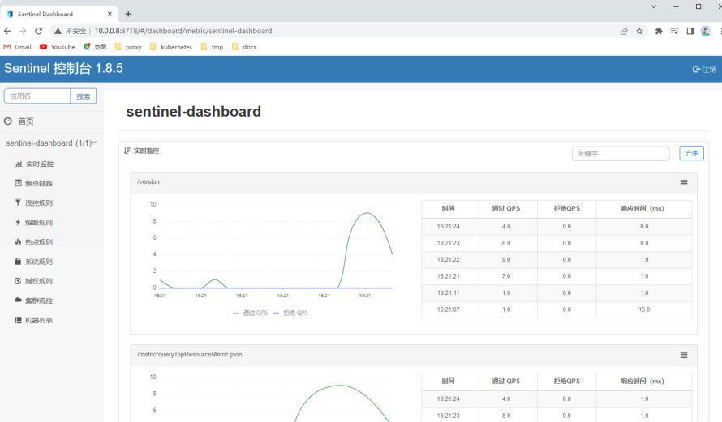

```
4、应用使用sentinel，需要先添加依赖 # 为pom.xml 添加依赖 ՎՎՎҿ springcloud alibaba sentinel Վʔ> <dependency> <groupId>com.alibaba.cloudՎӚgroupId> <artifactId>spring-cloud-starter-alibaba- sentinelՎӚartifactId> ՎӚdependency> ՎՎՎҿ SpringBoot Web Վʔ> <dependency> <groupId>org.springframework.bootՎӚgroupId> <artifactId>spring-boot-starter- webՎӚartifactId> ՎӚdependency> 5、为应用添加sentinel配置，（服务配置一般保存在nacos中， 在nacos对应配置添加如下字段即可）

spring: application: name: ruoyi-auth        # 应用名称 cloud: sentinel:               # 取消控制台懒加载 eager: true transport: dashboard: 127.0.0.1:8718   # 控制台地址
```
#### 2.2.3 部署Skywalking

```
部署skywalking链路追踪组件 1、下载skywalking 服务端 [root@web02 ~]# wget https:Վˌlinux.oldxu.net/apache-skywalking-apm- 8.8.1.tar.gz [root@web02 ~]# tar xf apache-skywalking-apm- 8.8.1.tar.gz 2、运行skywalking，它会运行两个组件，一个收集器（11800端 口），一个web页面（8080端口）。 [root@web02 ~]# sh apache-skywalking-apm- bin/bin/startup.sh SkyWalking OAP started successfully! SkyWalking Web Application started successfully! 3、访问skywalking，通过 http:ՎˌIP:8080
```
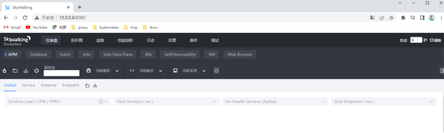

```
4、如果项目需要使用skywalking，需要在启动业务时加载 skywalking-agent的jar包，示例如下 # 下载 skywalking-agent [root@web01 ~]# wget https:Վˌlinux.oldxu.net/apache-skywalking-java- agent-8.8.0.tgz [root@web01 ~]# tar xf apache-skywalking-java- agent-8.8.0.tgz # 运行java应用，而后指定 [root@web01 ~]# java -javaagent:./skywalking- agent/skywalking-agent.jar \ -Dskywalking.agent.service_name=ruoyi-auth \ - Dskywalking.collector.backend_service=10.0.0.8:

- jar ruoyi-auth/target/ruoyi-auth.jar &
```
### 2.3 部署微服务组件

#### 2.3.1 环境准备

## 1、克隆代码

```
[root@web01 ~]# git clone https:Վˌgitee.com/y_project/RuoYi-Cloud.git # 下载压缩包 [root@web01 ~]# wget https:Վˌlinux.oldxu.net/RuoYi-Cloud-
```
20220814.zip

```
2、创建ry-cloud库，然后RuoYi-Cloud项目所需的数据文件 ry_2022xxxx.sql [root@web01 ~]# mysql -uroot -p123456 mysql> create database `ry-cloud` charset utf8; mysql> exit # 导入数据 [root@web ~]# mysql -uroot -p123456  ry-cloud < RuoYi-Cloud/sql/ry_20220814.sql 3、为Nacos导入RuoYi-Cloud项目所需的配置文件信息，创建 ry-config库，然后导入ry_config_2022xxxx.sql

web01执行如下操作 [root@web01 ~]# scp RuoYi- Cloud/sql/ry_config_20220510.sql root@10.0.0.8:~ # web02执行如下操作 [root@web02 ~]# mysql -uroot -p123456 mysql> create database `ry-config` charset utf8; mysql> exit [root@web02 ~]# mysql -uroot -p123456 ry-config < ry_config_20220510.sql 4、然后修改 nacos 的 conf/application.properties 配 置文件，将默认nacos库指向新的ry-config库

[root@web02 ~]# vim nacos/conf/application.properties ՎՎ˂ If use MySQL as datasource: spring.datasource.platform=mysql ՎՎ˂ Count of DB: db.num=1 ՎՎ˂ Connect URL of DB: db.url.0=jdbc:mysql:Վˌ127.0.0.1:3306/ry-config? characterEncoding=utf8&connectTimeout=1000&sock etTimeout=3000&autoReconnect=true&useUnicode=tr ue&useSSL=false&serverTimezone=UTC db.user.0=root db.password.0=123456 # 重启nacos [root@web02 ~]# sh nacos/bin/shutdown.sh [root@web02 ~]# sh nacos/bin/startup.sh -m standalone 5、检查nacos是否已经注入了业务所需的配置文件相关数据；
```
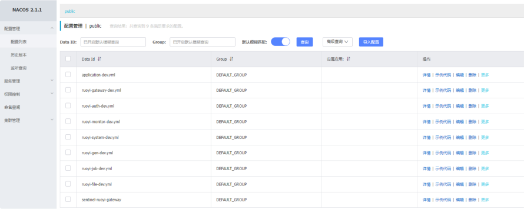

#### 2.3.2 打包项目

```
1、将所有服务都打包为jar包 [root@web01 ~]# yum install java java-devel maven -y [root@web01 ~]# wget -O /etc/maven/settings.xml https:Վˌlinux.oldxu.net/settings.xml [root@web01 ~]# cd RuoYi-Cloud/ [root@web01 RuoYi-Cloud]# mvn clean package - Dmaven.test.skip=true ...... [INFO] [INFO] ruoyi ............................................. SUCCESS [6.246s] [INFO] ruoyi-common ...................................... SUCCESS [0.003s] [INFO] ruoyi-common-core ................................. SUCCESS [1:09.450s] [INFO] ruoyi-api ......................................... SUCCESS [0.002s] [INFO] ruoyi-api-system .................................. SUCCESS [1.757s] [INFO] ruoyi-common-redis ................................ SUCCESS [6.464s]

[INFO] ruoyi-common-security ............................. SUCCESS [2.404s] [INFO] ruoyi-auth ........................................ SUCCESS [47.848s] [INFO] ruoyi-gateway ..................................... SUCCESS [14.632s] [INFO] ruoyi-visual ...................................... SUCCESS [0.016s] [INFO] ruoyi-visual-monitor .............................. SUCCESS [6.220s] [INFO] ruoyi-common-datasource ........................... SUCCESS [26.963s] [INFO] ruoyi-common-datascope ............................ SUCCESS [1.275s] [INFO] ruoyi-common-log .................................. SUCCESS [1.734s] [INFO] ruoyi-common-swagger .............................. SUCCESS [2.119s] [INFO] ruoyi-modules ..................................... SUCCESS [0.003s] [INFO] ruoyi-modules-system .............................. SUCCESS [6.576s] [INFO] ruoyi-modules-gen ................................. SUCCESS [5.120s]

[INFO] ruoyi-modules-job ................................. SUCCESS [4.393s] [INFO] ruoyi-modules-file ................................ SUCCESS [12.969s] [INFO] ---------------------------------------- -------------------------------- [INFO] BUILD SUCCESS [INFO] ---------------------------------------- -------------------------------- [INFO] Total time: 3:50.820s [INFO] Finished at: Sat Aug 13 19:03:55 CST 2022 [INFO] Final Memory: 287M/479M [INFO] ---------------------------------------- -------------------------------- 2、如果希望单独针对 ruoyi-gateway 服务进行更新和打包， 可以使用如下命令 [root@web01 ~]# cd RuoYi-Cloud/ [root@web01 ~]# mvn package - Dmaven.test.skip=true -pl ruoyi-auth -am ...... [INFO] ---------------------------------------- -------------------------------- [INFO] Reactor Summary: [INFO] [INFO] ruoyi ............................................. SUCCESS [0.149s]

[INFO] ruoyi-common ...................................... SUCCESS [0.003s] [INFO] ruoyi-common-core ................................. SUCCESS [2.179s] [INFO] ruoyi-common-redis ................................ SUCCESS [0.417s] [INFO] ruoyi-gateway ..................................... SUCCESS [1.652s] [INFO] ---------------------------------------- -------------------------------- [INFO] BUILD SUCCESS [INFO] ---------------------------------------- --------------------------------
```
#### 2.3.3 部署system组件

```
1、修改system连接数据库信息，信息都存储在nacos组件中，需 要登录nacos修改ruoyi-system-dev.yml spring: redis: host: localhost port: 6379 password: datasource: datasource: master:

driver-class-name: com.mysql.cj.jdbc.Driver url: jdbc:mysql:Վˌlocalhost:3306/ry- cloud?useUnicode=true&characterEncoding=utf8 username: root password: 123456 cloud: sentinel: eager: true transport: dashboard: 10.0.0.8:8718 2、启动ruoyi-system java -javaagent:./skywalking-agent/skywalking- agent.jar \ -Dskywalking.agent.service_name=ruoyi-system \ - Dskywalking.collector.backend_service=10.0.0.8:

-Dspring.profiles.active=dev \ -Dspring.cloud.nacos.config.file-extension=yml \ -Dspring.cloud.nacos.discovery.server- addr=10.0.0.8:8848 \ -Dspring.cloud.nacos.config.server- addr=10.0.0.8:8848 \ -jar RuoYi-Cloud/ruoyi-modules/ruoyi- system/target/ruoyi-modules-system.jar &>/var/log/system.log &

(♥◠‿◠)ﾉﾞ  系统模块启动成功   ლ(´ڡ`ლ)ﾞ .-------.       ____     Վː |  _ _   \      \   \   /  / | ( ' )  |       \  _. /  ' |(_ o _) /        _( )_ .' | (_,_).' Վː  ___(_ o _)' |  |\ \  |  Վҗ   |(_,_)' |  | \ `'   /|   `-'  / |  |  \    /  \      / ''-'   `'-'    `-Վʡ-'
```
#### 2.3.4 部署auth组件

```
1、修改auth连接redis信息，信息都存储在nacos组件中，需要 登录nacos修改ruoyi-auth-dev.yml spring: redis: host: localhost port: 6379 password: cloud: sentinel: eager: true transport: dashboard: 10.0.0.8:8718 2、启动ruoyi-auth java -javaagent:./skywalking-agent/skywalking- agent.jar \ -Dskywalking.agent.service_name=ruoyi-auth \

- Dskywalking.collector.backend_service=10.0.0.8:

-Dspring.profiles.active=dev \ -Dspring.cloud.nacos.config.file-extension=yml \ -Dspring.cloud.nacos.discovery.server- addr=10.0.0.8:8848 \ -Dspring.cloud.nacos.config.server- addr=10.0.0.8:8848 \ -jar RuoYi-Cloud/ruoyi-auth/target/ruoyi- auth.jar &>/var/log/auth.log & (♥◠‿◠)ﾉﾞ  认证授权中心启动成功   ლ(´ڡ`ლ)ﾞ .-------.       ____     Վː |  _ _   \      \   \   /  / | ( ' )  |       \  _. /  ' |(_ o _) /        _( )_ .' | (_,_).' Վː  ___(_ o _)' |  |\ \  |  Վҗ   |(_,_)' |  | \ `'   /|   `-'  / |  |  \    /  \      / ''-'   `'-'    `-Վʡ-'
```
#### 2.3.5 部署gateway组件

1、修改gateway连接redis信息，信息都存储在nacos组件中， 需要登录nacos修改ruoyi-gateway-dev.yml spring: redis: host: localhost

```
port: 6379 password: cloud: sentinel: eager: true transport: dashboard: 10.0.0.8:8718 gateway: discovery: locator: lowerCaseServiceId: true enabled: true 2、启动ruoyi-gateway java -javaagent:./skywalking-agent/skywalking- agent.jar \ -Dskywalking.agent.service_name=ruoyi-gateway \ - Dskywalking.collector.backend_service=10.0.0.8:

-Dspring.profiles.active=dev \ -Dspring.cloud.nacos.config.file-extension=yml \ -Dspring.cloud.nacos.discovery.server- addr=10.0.0.8:8848 \ -Dspring.cloud.nacos.config.server- addr=10.0.0.8:8848 \ -jar RuoYi-Cloud/ruoyi-gateway/target/ruoyi- gateway.jar &>/var/log/gateway.log & (♥◠‿◠)ﾉﾞ  若依网关启动成功   ლ(´ڡ`ლ)ﾞ

.-------.       ____     Վː |  _ _   \      \   \   /  / | ( ' )  |       \  _. /  ' |(_ o _) /        _( )_ .' | (_,_).' Վː  ___(_ o _)' |  |\ \  |  Վҗ   |(_,_)' |  | \ `'   /|   `-'  / |  |  \    /  \      / ''-'   `'-'    `-Վʡ-'
```
#### 2.3.6 部署monitor组件

```
1、修改monitor，信息都存储在nacos组件中，需要登录nacos 修改ruoyi-monitor-dev.yml spring: security: user: name: ruoyi password: 123456 boot: admin: ui: title: 若依服务状态监控 2、启动ruoyi-monitor java -javaagent:./skywalking-agent/skywalking- agent.jar \ -Dskywalking.agent.service_name=ruoyi-monitor \

- Dskywalking.collector.backend_service=10.0.0.8:

-Dspring.profiles.active=dev \ -Dspring.cloud.nacos.config.file-extension=yml \ -Dspring.cloud.nacos.discovery.server- addr=10.0.0.8:8848 \ -Dspring.cloud.nacos.config.server- addr=10.0.0.8:8848 \ -jar RuoYi-Cloud/ruoyi-visual/ruoyi- monitor/target/ruoyi-visual-monitor.jar &>/var/log/monitor.log & (♥◠‿◠)ﾉﾞ  监控中心启动成功   ლ(´ڡ`ლ)ﾞ .-------.       ____     Վː |  _ _   \      \   \   /  / | ( ' )  |       \  _. /  ' |(_ o _) /        _( )_ .' | (_,_).' Վː  ___(_ o _)' |  |\ \  |  Վҗ   |(_,_)' |  | \ `'   /|   `-'  / |  |  \    /  \      / ''-'   `'-'    `-Վʡ-'
```
#### 2.3.7 部署微服务前端UI

```
1、修改配置 [root@web01 ~]# vim RuoYi-Cloud/ruoyi- ui/vue.config.js      # 修改ui连接gateway地址 devServer: {

host: '0.0.0.0', port: port, open: true, proxy: { Վˌ detail: https:Վˌcli.vuejs.org/config/#devserver-proxy [process.env.VUE_APP_BASE_API]: { target: `http:Վˌlocalhost:8080`, changeOrigin: true, pathRewrite: { ['^' + process.env.VUE_APP_BASE_API]: '' } } }, 2、编译项目 [root@web01 ~]# cd RuoYi-Cloud/ruoyi-ui/ [root@web01 ruoyi-ui]# curl Վʔsilent Վʔlocation https:Վˌrpm.nodesource.com/setup_14.x|bash - [root@web01 ruoyi-ui]# yum install -y nodejs npm nginx [root@web01 ruoyi-ui]# npm install Վʔ registry=https:Վˌregistry.npmmirror.com [root@web01 ruoyi-ui]# npm run build:prod 3、拷贝编译后的代码至于Nginx站点目录 [root@web ruoyi-ui]# mkdir -p /code [root@web ruoyi-ui]# cp -r distՎˇ /code/ 4、编写Nginx配置文件

[root@web ~]# vim /etc/nginx/conf.d/ruoyi.oldxu.net.conf server { listen 80; server_name ruoyi.oldxu.net; charset utf-8; root /code; location / { try_files $uri $uri/ /index.html; index  index.html index.htm; }

location /prod-api/ { proxy_set_header Host $http_host; proxy_set_header X-Real-IP $remote_addr; proxy_set_header REMOTE-HOST $remote_addr; proxy_set_header X-Forwarded-For $proxy_add_x_forwarded_for; proxy_pass http:Վˌlocalhost:8080/; } } 5、打开浏览器，输入：http:Վˌlocalhost:80 默认账户/密码 admin/admin123
```
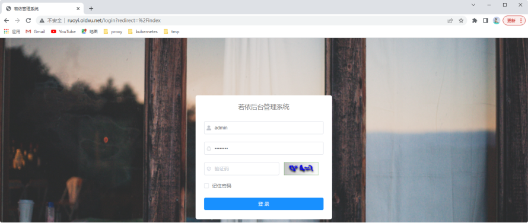

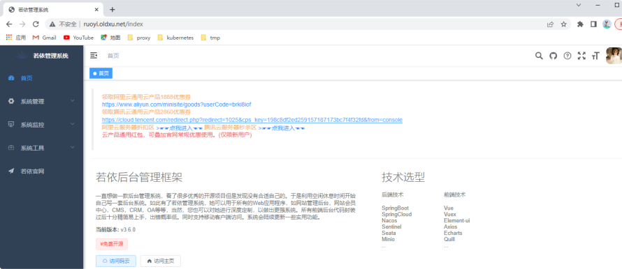

#### 2.3.8 测试整个微服务

1、nacos配置管理

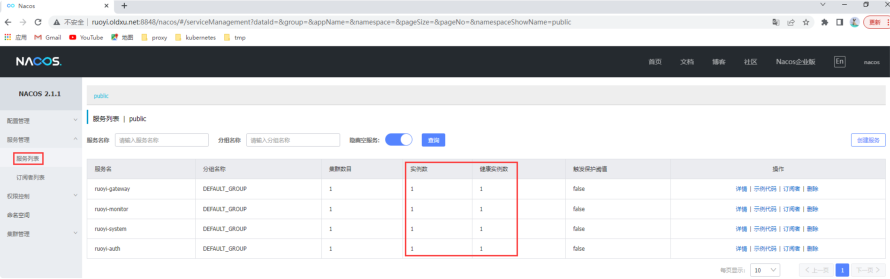

## 2、monitor监控

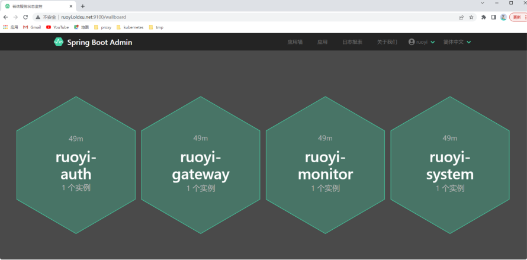

## 3、sentinel流控

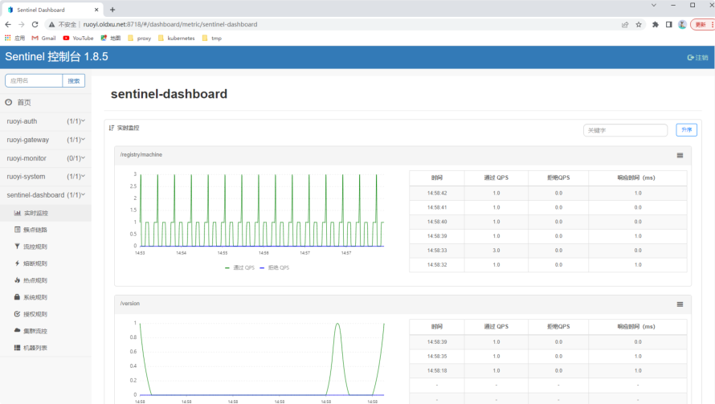

## 4、skywalking链路追踪

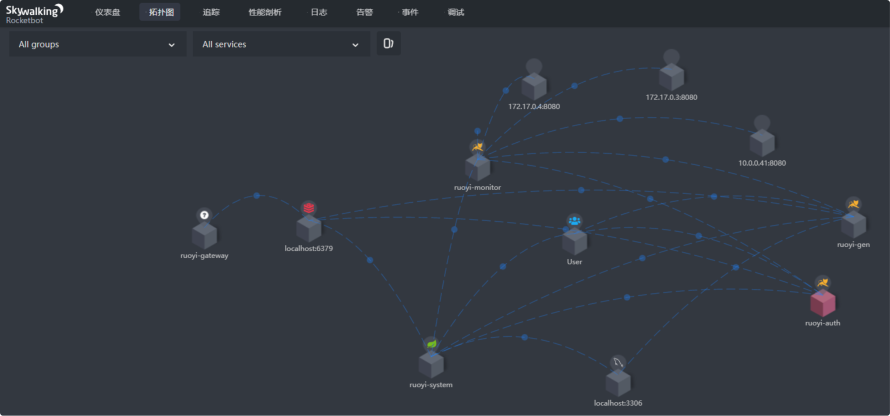

### 2.4 更新微服务特定模块

#### 2.4.1 更新指定模块

1、更新前，如果输入的用户名不存在，则会有如下提示

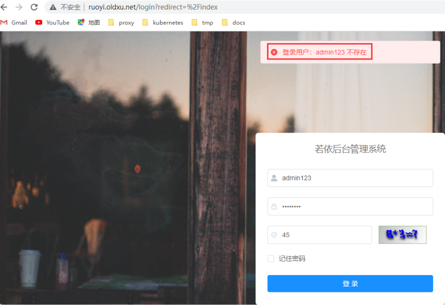

2、认证是由auth模块完成，所以可以修改auth相关代码，更新错 误提示信息

```
vim RuoYi-Cloud/ruoyi- auth/src/main/java/com/ruoyi/auth/service/SysLo ginService.java
```
## 60         R<LoginUser> userResult =

```
remoteUserService.getUserInfo(username, SecurityConstants.INNER); 61 62
if (StringUtils.isNull(userResult) Վҗ StringUtils.isNull(userResult.getData()))

63     {

64 recordLogService.recordLogininfor(username, Constants.LOGIN_FAIL, "登录用户不存在"); 65       throw new ServiceException("oldxu提示 你登录用户：" + username + " 不存在");

66     }
```
#### 2.4.2 重新打包应用

```
1、由于只更新了auth模块，所以仅重新编译auth模块即可 [root@web01 ~]# cd RuoYi-Cloud/ [root@web01 RuoYi-Cloud]# mvn package - Dmaven.test.skip=true -pl ruoyi-auth -am 2、先停止auth组件，而后重新运行auth组件

java -javaagent:./skywalking-agent/skywalking- agent.jar \ -Dskywalking.agent.service_name=ruoyi-auth \ - Dskywalking.collector.backend_service=10.0.0.8:

-Dspring.profiles.active=dev \ -Dspring.cloud.nacos.config.file-extension=yml \ -Dspring.cloud.nacos.discovery.server- addr=10.0.0.8:8848 \ -Dspring.cloud.nacos.config.server- addr=10.0.0.8:8848 \ -jar RuoYi-Cloud/ruoyi-auth/target/ruoyi- auth.jar &>/var/log/auth.log &
```
#### 2.4.3 更新结果验证

会发现提示信息已修改成功

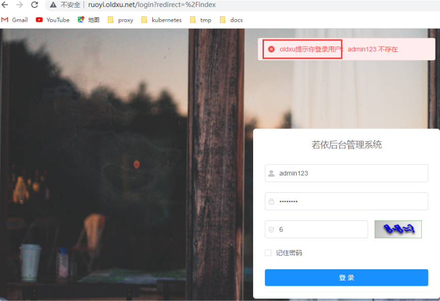

## 3.迁移微服务数据层至K8S

### 3.1 迁移MySQL

#### 3.1.1 创建StatefulSet

```
1、创建MySQL服务的headless Service无头服务； [root@master 01-mysql]# cat 01-mysql-ruoyi- statefulset-svc.yaml apiVersion: v1 kind: Service metadata: name: mysql-ruoyi-svc namespace: dev spec: clusterIP: None selector: app: mysql role: ruoyi ports:

- port: 3306

targetPort: 3306

ՎՎʕ apiVersion: apps/v1 kind: StatefulSet metadata: name: mysql-ruoyi

namespace: dev spec: serviceName: "mysql-ruoyi-svc" replicas: 1 selector: matchLabels: app: mysql role: ruoyi template: metadata: labels: app: mysql role: ruoyi spec: containers:

- name: db

image: mysql:5.7 args:

- "Վʔcharacter-set-server=utf8"     #
```
指定字符集 env:

```
- name: MYSQL_ROOT_PASSWORD

value: oldxu

- name: MYSQL_DATABASE

value: ry-cloud ports:

- containerPort: 3306

volumeMounts:                       # 数据挂载

mountPath: /var/lib/mysql/

volumeClaimTemplates:                     # pvc申请模板

- metadata:

name: data spec: accessModes: ["ReadWriteMany"] storageClassName: "nfs-provisioner- storage" resources: requests: storage: 5Gi
```
#### 3.1.2 解析mysql对应IP

```
3、测试能否通过域名访问到MySQL应用 ${statefulSetName}-${headlessName}. {namspace}.svc.cluster.local [root@master 01-mysql]# dig @10.96.0.10 mysql- ruoyi-0.mysql-ruoyi-svc.dev.svc.cluster.local +short
```
192.168.3.107

#### 3.1.3 导入数据相关文件

```
4、将RuoYi-Cloud项目所需的数据文件 ry_2022xxxx.sql， 导入到ry-cloud库中； [root@master 01-mysql]# mysql -h192.168.3.107 - uroot -poldxu -B ry-cloud < /tmp/RuoYi- Cloud/sql/ry_20220814.sql
```
### 3.2 迁移Redis

#### 3.2.1 创建Deployment

```
[root@master 02-redis]# cat 01-redis- server.yaml apiVersion: apps/v1 kind: Deployment metadata: name: redis-server namespace: dev spec: replicas: 1 selector: matchLabels: app: redis template: metadata: labels: app: redis spec: containers:

- name: cache

image: redis ports:

- containerPort: 6379
```
#### 3.2.2 创建Service

创建Service，使Redis对外通过域名访问

```
[root@master 02-redis]# cat 02-redis-svc.yaml apiVersion: v1 kind: Service metadata: name: redis-svc namespace: dev spec: selector: app: redis ports:

- port: 6379

targetPort: 6379
```
#### 3.2.3 验证Redis

```
[root@master 02-redis]# dig @10.96.0.10 redis- svc.dev.svc.cluster.local  +short
```
10.96.105.89

```
验证登录是否正常 [root@master 02-redis]# redis-cli -h
```
10.96.105.89

## 4.迁移微服务治理层

### 4.1 迁移Nacos

Nacos在K8S中可以实现自动扩容缩容以及数据持久特性，如果需 要使用这部分功能请使用PVC持久卷，Nacos的自动扩容缩容需要 依赖持久卷，以及数据持久化也是一样，本例中使用的是NFS来使 用PVC. Nacos集群部署参考

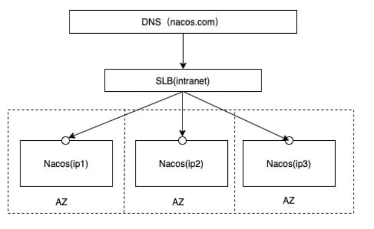

#### 4.1.1 准备Nacos数据库

```
1、部署Nacos需要使用的MySQL数据库服务； # headlessService [root@master 03-nacos]# cat 01-mysql-nacos- svc.yaml apiVersion: v1 kind: Service metadata: name: mysql-nacos-svc namespace: dev spec: clusterIP: None selector: app: mysql role: nacos ports:

- port: 3306

targetPort: 3306 # StatefulSet [root@master 03-nacos]# cat 02-mysql-nacos-sc- nfs.yaml apiVersion: apps/v1 kind: StatefulSet metadata: name: mysql-nacos namespace: dev spec: serviceName: "mysql-nacos-svc" replicas: 1 selector: matchLabels: app: mysql role: nacos template: metadata: labels: app: mysql role: nacos spec: containers:

- name: db

image: mysql:5.7 args:

- "Վʔcharacter-set-server=utf8"

env:

- name: MYSQL_ROOT_PASSWORD

value: oldxu

- name: MYSQL_DATABASE

value: ry-config                  # 注意创建库名称 ports:

- containerPort: 3306

volumeMounts:

mountPath: /var/lib/mysql/ volumeClaimTemplates:

- metadata:

name: data spec: accessModes: ["ReadWriteMany"] storageClassName: "nfs-provisioner- storage" resources: requests: storage: 5Gi
```
#### 4.1.2 导入配置至数据库

2、导入RuoYi-Cloud项目所需要使用的nacos配置文件 ry_config_2022xxxx.sql至ry-config库中；

获取数据库域名对应的地址，而后导入数据文件至对应的库中 [root@master 03-nacos]# dig @10.96.0.10 mysql- nacos-0.mysql-nacos-svc.dev.svc.cluster.local +short

192.168.3.109

```
[root@master 03-nacos]# mysql -h 192.168.3.109 -uroot -poldxu -B ry-config < /tmp/RuoYi- Cloud/sql/ry_config_20220510.sql
```
#### 4.1.3 创建ConfigMap

```
configmap（填写对应数据库地址、名称、端口、用户名及密码） [root@master 03-nacos]# cat 03-nacos- configmap.yaml apiVersion: v1 kind: ConfigMap metadata: name: nacos-cm namespace: dev data: mysql.host: "mysql-nacos-0.mysql-nacos- svc.dev.svc.cluster.local" # mysql的地址 mysql.db.name: "ry-config" mysql.port: "3306" mysql.user: "root" mysql.password: "oldxu"
```
#### 4.1.4 创建StatefulSet

```
[root@master 03-nacos]# cat 04-nacos- statefulset-deploy.yaml apiVersion: v1 kind: Service metadata: name: nacos-svc namespace: dev spec: clusterIP: None selector: app: nacos ports:

- name: server

port: 8848 targetPort: 8848

- name: client-rpc

port: 9848 targetPort: 9848

- name: raft-rpc

port: 9849 targetPort: 9849

- name: old-raft-rpc

port: 7848 targetPort: 7848 ՎՎʕ # StatefulSet（以集群模式运行nacos） apiVersion: apps/v1 kind: StatefulSet metadata:

name: nacos namespace: dev spec: serviceName: "nacos-svc" replicas: 3 selector: matchLabels: app: nacos template: metadata: labels: app: nacos spec: affinity:             # 避免Pod运行到同一个 节点上了 podAntiAffinity:

requiredDuringSchedulingIgnoredDuringExecution:

- labelSelector:

matchExpressions:

- key: app

operator: In values: ["nacos"] topologyKey: "kubernetes.io/hostname" initContainers:

- name: peer-finder-plugin-install

image: nacos/nacos-peer-finder- plugin:1.1 imagePullPolicy: Always volumeMounts:           #将perr-finder 子路径数据挂载到卷中，供后面的主容器使用；

mountPath: /home/nacos/plugins/peer-finder subPath: peer-finder containers:

- name: nacos

image: nacos/nacos-server:v2.1.1 resources: requests: memory: "500Mi" cpu: "300m" ports:

- name: client-port

containerPort: 8848

- name: client-rpc

containerPort: 9848

- name: raft-rpc

containerPort: 9849

- name: old-raft-rpc

containerPort: 7848 env:

- name: MODE                # 定义集群模

式 value: "cluster"

- name: NACOS_VERSION

value: 2.1.1

- name: NACOS_REPLICAS      # 副本数为3

value: "3"

- name: SERVICE_NAME        # Service名

称 value: "nacos-svc"

- name: DOMAIN_NAME         # 域名后缀

value: "cluster.local"

- name: NACOS_SERVER_PORT

value: "8848"

- name: NACOS_APPLICATION_PORT

value: "8848"

- name: PREFER_HOST_MODE

value: "hostname"

- name: POD_NAMESPACE

valueFrom: fieldRef: apiVersion: v1 fieldPath: metadata.namespace

- name: MYSQL_SERVICE_HOST

valueFrom: configMapKeyRef: name: nacos-cm key: mysql.host

- name: MYSQL_SERVICE_DB_NAME

valueFrom: configMapKeyRef: name: nacos-cm key: mysql.db.name

- name: MYSQL_SERVICE_PORT

valueFrom: configMapKeyRef: name: nacos-cm key: mysql.port

- name: MYSQL_SERVICE_USER

valueFrom: configMapKeyRef: name: nacos-cm key: mysql.user

- name: MYSQL_SERVICE_PASSWORD
```
valueFrom: configMapKeyRef: name: nacos-cm key: mysql.password volumeMounts:   # 主容器需要使用perr- finder中的脚本来完成集群扩缩容，所以需要挂载

```
mountPath: /home/nacos/plugins/peer- finder subPath: peer-finder

mountPath: /home/nacos/data subPath: data

mountPath: /home/nacos/logs subPath: logs volumeClaimTemplates:

- metadata:

name: data spec: storageClassName: "nfs-provisioner- storage" accessModes: ["ReadWriteMany"] resources: requests: storage: 20Gi
```
#### 4.1.5 创建Ingress

```
创建Ingress，将服务对外，便于后期管理和维护； [root@master 03-nacos]# cat 06-nacos-server- ingress.yaml apiVersion: networking.k8s.io/v1 kind: Ingress metadata: name: nacos-ingress namespace: dev spec: ingressClassName: "nginx" rules:

- host: nacos.oldxu.net

pathType: Prefix backend: service: name: nacos-svc port: name: server
```
#### 4.1.6 验证Nacos集群

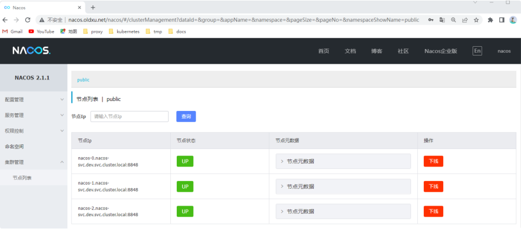

### 4.2 迁移sentinel

sentinel没有合适的镜像，所以需要自行制作镜像，而后将其通 过Kubernetes运行起来；

#### 4.2.1 制作镜像

```
1、编写sentinel基础镜像 [root@node sentinel]# wget https:Վˌlinux.oldxu.net/sentinel-dashboard-
```
1.8.5.jar

```
[root@node sentinel]# cat Dockerfile FROM openjdk:8-jre-alpine COPY ./sentinel-dashboard-1.8.5.jar /sentinel- dashboard.jar COPY ./entrypoint.sh /entrypoint.sh RUN chmod +x /entrypoint.sh EXPOSE 8718 8719 CMD ["/bin/sh","-c","/entrypoint.sh"]

2、编写sentinel启动脚本（启动参数可根据实际情况进行相应修 改） [root@node sentinel]# cat entrypoint.sh JAVA_OPTS="-Dserver.port=8718 \ -Dcsp.sentinel.dashboard.server=localhost:8718 \ -Dproject.name=sentinel-dashboard \ -Dcsp.sentinel.api.port=8719 -Xms${XMS_OPTS:-100m} \ -Xmx${XMX_OPTS:-100m}" java ${JAVA_OPTS} -jar /sentinel-dashboard.jar
```
#### 4.2.2 构建镜像

```
3、制作镜像，而后推送至私有镜像 [root@node sentinel]# docker build -t harbor.oldxu.net/springcloud/sentinel- dashboard:v1.0 . [root@node sentinel]# docker push harbor.oldxu.net/springcloud/sentinel- dashboard:v1.0
```
#### 4.2.3 创建Deployment

```
4、使用Deployment运行sentinel应用； [root@master 04-sentinel]# cat 01-sentinel- deploy.yaml apiVersion: apps/v1 kind: Deployment

metadata: name: sentinel-server namespace: dev spec: replicas: 1 selector: matchLabels: app: sentinel template: metadata: labels: app: sentinel spec: imagePullSecrets:

containers:

- name: sentinel

image: harbor.oldxu.net/springcloud/sentinel- dashboard:v1.0 ports:

- name: server

containerPort: 8718

- name: api

containerPort: 8719
```
#### 4.2.4 创建Service

```
5、使用Service暴露sentinel应用； [root@master 04-sentinel]# cat 02-sentinel- svc.yaml

apiVersion: v1 kind: Service metadata: name: sentinel-svc namespace: dev spec: selector: app: sentinel ports:

- name: server

port: 8718 targetPort: 8718

- name: api

port: 8719 targetPort: 8719
```
#### 4.2.5 创建Ingress

```
6、使用Ingress发布Sentinel监控页面； [root@master 04-sentinel]# cat 03-sentinel- ingress.yaml apiVersion: networking.k8s.io/v1 kind: Ingress metadata: name: sentinel-ingress namespace: dev spec: ingressClassName: "nginx" rules:

- host: sentinel.oldxu.net

http:

paths:

pathType: Prefix backend: service: name: sentinel-svc port: name: server          # 端口名称
```
#### 4.2.6 验证Sentinel

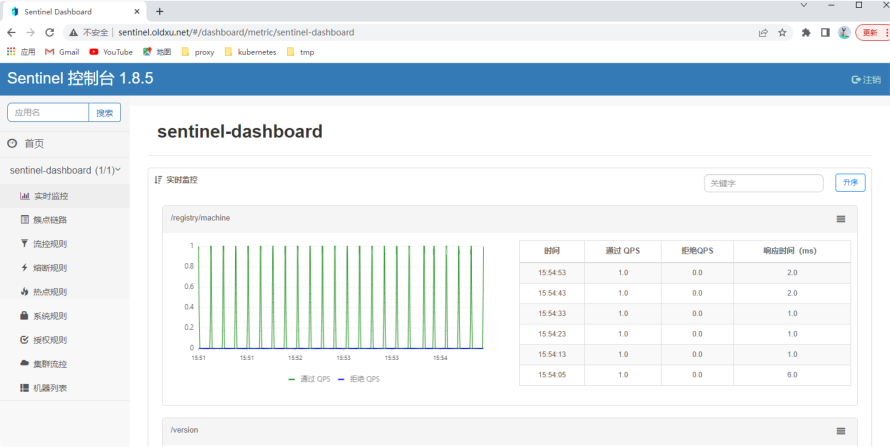

### 4.3 迁移Skywalking

本次Skywalking采用内置H2作为存储，也可考虑采用 ElasticSearch作为数据存储。

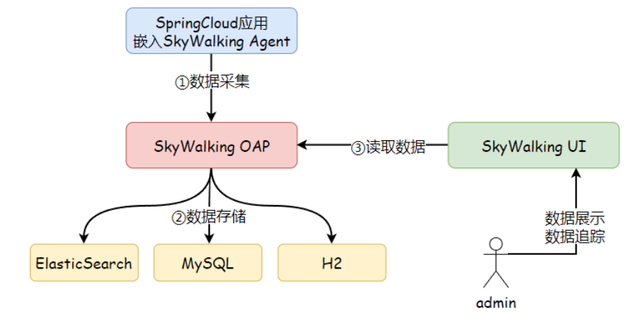

#### 4.3.1 部署SkywalkingOAP

```
[root@master 05-skywalking]# cat 01-skywalking- oap.yaml # Deployment apiVersion: apps/v1 kind: Deployment metadata: name: skywalking-oap namespace: dev spec: replicas: 1 selector: matchLabels: app: sky-oap template: metadata: labels: app: sky-oap spec: containers:

- name: oap

image: apache/skywalking-oap- server:8.9.1 ports:

- name: agent

containerPort: 11800

- name: oap

containerPort: 12800 # env:   # 使用ElasticSearch作为存储时，使 用如下变量 # - name: SW_STORAGE #   values: elasticsearch7 # - name: SW_STORAGE_ES_CLUSTER_NODES #   values: elasticsearch_cluster_addr:9200 ՎՎʕ # Service apiVersion: v1 kind: Service metadata: name: skywalking-oap-svc namespace: dev spec: selector: app: sky-oap ports:

- name: oap

port: 12800 targetPort: 12800

- name: agent

port: 11800 targetPort: 11800
```
#### 4.3.2 部署SkywalkingUI

```
[root@master 05-skywalking]# cat 02-skywalking- ui.yaml # Deployment apiVersion: apps/v1 kind: Deployment metadata: name: skywalking-ui namespace: dev spec: replicas: 1 selector: matchLabels: app: sky-ui template: metadata: labels: app: sky-ui spec: containers:

- name: ui

image: apache/skywalking-ui:8.9.1 ports:

env:

- name: SW_OAP_ADDRESS

传递Skywalking-OAP的地址 value: "http:Վˌskywalking-oap- svc:12800" ՎՎʕ

Service apiVersion: v1 kind: Service metadata: name: skywalking-ui-svc namespace: dev spec: selector: app: sky-ui ports:

- name: ui

port: 8080 targetPort: 8080
```
#### 4.3.3 创建Ingress

```
3、使用Ingress发布SkywalkingUI [root@master 05-skywalking]# cat 03-skywalking- ingress.yaml apiVersion: networking.k8s.io/v1 kind: Ingress metadata: name: skywalking-ingress namespace: dev spec: ingressClassName: "nginx" rules:

- host: sky.oldxu.net

pathType: Prefix backend: service: name: skywalking-ui-svc port: name: ui
```
#### 4.3.4 验证Skywalking

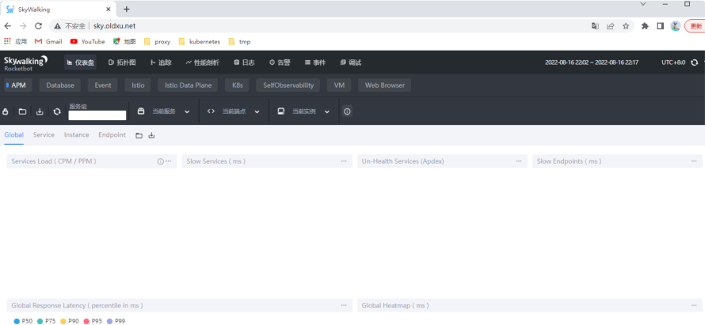

### 4.4 迁移Skywalking-agent

将Skywalking-agent制作为Docker镜像，后续业务容器通过 sidecar 模式挂载 agent

#### 4.4.1 下载Agent

```
[root@node agent]# wget https:Վˌlinux.oldxu.net/apache-skywalking-java- agent-8.8.0.tgz
```
#### 4.4.2 编写Dockerfile

```
Dockerfile文件如下 [root@node agent]# cat Dockerfile FROM alpine ADD ./apache-skywalking-java-agent-8.8.0.tgz /
```
#### 4.4.3 制作镜像并推送仓库

```
3、制作docker镜像，并推送至harbor仓库； [root@node agent]# docker build -t harbor.oldxu.net/springcloud/skywalking-java- agent:8.8 . [root@node agent]# docker push harbor.oldxu.net/springcloud/skywalking-java- agent:8.8
```
#### 4.4.4 运行容器挂载Agent

```
业务容器通过sidecar模式挂载制作好的skywalking-agent镜 像 [root@master tmp]# cat demo.yaml apiVersion: apps/v1 kind: Deployment metadata: name: demo-skywalking-agent namespace: dev spec: replicas:

selector: matchLabels: app: web template: metadata: labels: app: web spec: imagePullSecrets:
```
volumes:                      # 1、定义共 享存储卷的名称

initContainers:               # 2、初始化 容器，将skywalking-agent内容复制到共享存储卷中

```
- name: init-skywalking-agent

image: harbor.oldxu.net/springcloud/skywalking-java- agent:8.8 command:

/skywalking-agentՎˇ /agent;' volumeMounts:

mountPath: /agent
```
containers:                   # 2、将存储 卷中的所有内容挂载到主容器/skywalking-agent目录中

```
- name: web

image: nginx volumeMounts:

mountPath: /skywalking-agent/
```
## 5.迁移微服务层面

### 5.1 迁移微服务system

#### 5.1.1 编译system项目

```
[root@node ruo-yi-cloud]# mvn package - Dmaven.test.skip=true -pl ruoyi-modules/ruoyi- system/ -am
```
#### 5.1.2 编写Dockerfile

```
1、dockerfile [root@node ruo-yi-cloud]# vim ruoyi- modules/ruoyi-system/Dockerfile FROM openjdk:8-jre-alpine COPY ./target/*.jar /ruoyi-modules-system.jar COPY ./entrypoint.sh /entrypoint.sh RUN chmod +x /entrypoint.sh EXPOSE 8080 CMD ["/bin/sh", "-c", "/entrypoint.sh"]

2、启动脚本entrypoint.sh [root@node ruo-yi-cloud]# cat ruoyi- modules/ruoyi-system/entrypoint.sh # 设定端口，默认不传参则为8080端口 PARAMS="Վʔserver.port=${Server_Port:-8080}" # JVM堆内存设定，默认不传参则初始和最大都为100m JAVA_OPTS="-Xms${XMS_OPTS:-100m} - Xmx${XMX_OPTS:-100m}" # Nacos相关选项 NACOS_OPTS="- Djava.security.egd=file:/dev/./urandom \ -Dfile.encoding=utf8 \ -Dspring.profiles.active=${Nacos_Active:-dev} \ -Dspring.cloud.nacos.config.file-extension=yml \ -Dspring.cloud.nacos.discovery.server- addr=${Nacos_Server_Addr:-127.0.0.1:8848} \ -Dspring.cloud.nacos.config.server- addr=${Nacos_Server_Addr:-127.0.0.1:8848}" # Skywalking相关选项 SKY_OPTS="-javaagent:/skywalking- agent/skywalking-agent.jar \ -Dskywalking.agent.service_name=ruoyi-system \ - Dskywalking.collector.backend_service=${Sky_Ser ver_Addr:-localhost:11800}"

启动命令（指定sky选项、jvm堆内存选项、jar包，最后跟 上params参数） java ${SKY_OPTS} ${NACOS_OPTS} ${JAVA_OPTS} - jar /ruoyi-modules-system.jar ${PARAMS}
```
#### 5.1.3 制作镜像并推送仓库

```
[root@node03 ruo-yi-cloud]# cd ruoyi- modules/ruoyi-system/ [root@node03 ruoyi-system]# docker build -t harbor.oldxu.net/springcloud/ruoyi-system:v1.0 . [root@node03 ruoyi-system]# docker push harbor.oldxu.net/springcloud/ruoyi-system:v1.0
```
#### 5.1.4 修改system组件配置

```
通过Kubernetes运行system之前，先登录Nacos修改ruoyi- system-dev.yml的相关配置信息； # spring配置 spring: redis: host: redis-svc.dev.svc.cluster.local # redis地址 port: 6379 password: cloud: # 新增sentinel字段 sentinel: eager: true transport:

dashboard: sentinel- svc.dev.svc.cluster.local:8718      # sentinel 地址 datasource: druid: stat-view-servlet: enabled: true loginUsername: admin loginPassword: 123456 dynamic: druid: initial-size: 5 min-idle: 5 maxActive: 20 maxWait: 60000 timeBetweenEvictionRunsMillis: 60000 minEvictableIdleTimeMillis: 300000 validationQuery: SELECT 1 FROM DUAL testWhileIdle: true testOnBorrow: false testOnReturn: false poolPreparedStatements: true

maxPoolPreparedStatementPerConnectionSize: 20 filters: stat,slf4j connectionProperties: druid.stat.mergeSql\=true;druid.stat.slowSqlMil lis\=5000 datasource: # 主库数据源 master:

driver-class-name: com.mysql.cj.jdbc.Driver url: jdbc:mysql:Վˌmysql-ruoyi- svc.dev.svc.cluster.local:3306/ry-cloud? useUnicode=true&characterEncoding=utf8&zeroDate TimeBehavior=convertToNull&useSSL=true&serverTi mezone=GMT%2B8 username: root password: oldxu
```
#### 5.1.5 创建Deployment

```
[root@master 06-ruoyicloud]# cat 01-ruoyi- system.yaml apiVersion: apps/v1 kind: Deployment metadata: name: ruoyi-system namespace: dev spec: replicas: 2 selector: matchLabels: app: system template: metadata: labels: app: system spec: imagePullSecrets:

image: harbor.oldxu.net/springcloud/skywalking-java- agent:8.8 command:

/skywalking-agentՎˇ /agent;' volumeMounts:

- name: system

image: harbor.oldxu.net/springcloud/ruoyi-system:v1.0 imagePullPolicy: Always env:
```
加载配置的环境名称 value: "dev"

```
Nacos集群地址 value: "nacos- svc.dev.svc.cluster.local:8848"

Skywalking地址 value: "skywalking-oap- svc.dev.svc.cluster.local:11800"

- name: XMS_OPTS

value: "200m"

- name: XMX_OPTS

value: "200m" ports:

livenessProbe: # 存活探针，如果不存活则根据重启策略进行重启 tcpSocket: port: 8080 initialDelaySeconds: 60 periodSeconds: 10 timeoutSeconds: 10 volumeMounts:

mountPath: /skywalking-agent/

volumes:
```
#### 5.1.6 验证System组件

1、查看节点注册至Nacos中的服务示例数；

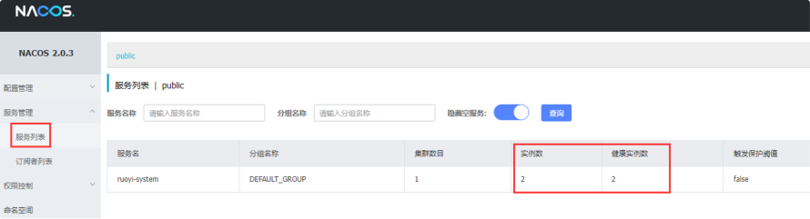

2、查看sentinel以及Skywalking服务情况

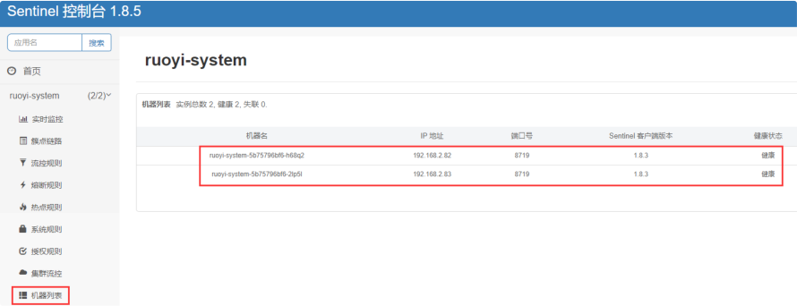

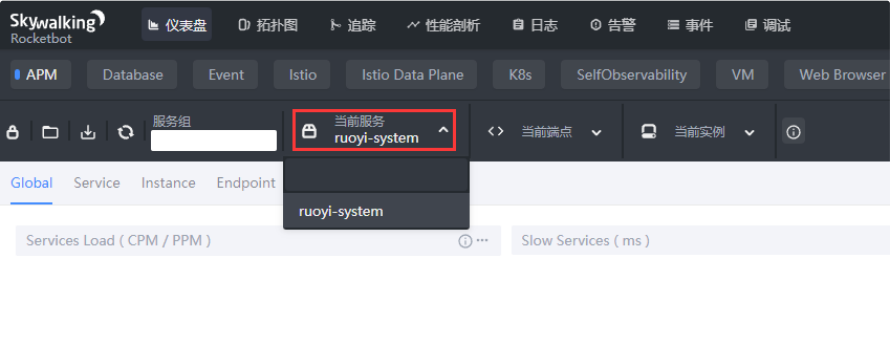

### 5.2 迁移微服务auth

#### 5.2.1 编译auth项目

```
[root@node ruo-yi-cloud]# mvn package -D maven.test.skip=true -pl ruoyi-auth/ -am
```
#### 5.2.2 编写Dockerfile

1、编写dockerfile

```
[root@node ruo-yi-cloud]# cat ruoyi- auth/Dockerfile FROM openjdk:8-jre-alpine COPY ./target/*.jar /ruoyi-auth.jar COPY ./entrypoint.sh /entrypoint.sh RUN chmod +x /entrypoint.sh EXPOSE 8080 CMD ["/bin/sh", "-c", "/entrypoint.sh"] 2、编写启动脚本entrypoint.sh [root@node ruo-yi-cloud]# cat ruoyi- auth/entrypoint.sh # 设定端口，默认不传参则为8080端口 PARAMS="Վʔserver.port=${Server_Port:-8080}" # JVM堆内存设定，默认不传参则初始和最大都为100m JAVA_OPTS="-Xms${XMS_OPTS:-100m} - Xmx${XMX_OPTS:-100m}" # Nacos相关选项 NACOS_OPTS="- Djava.security.egd=file:/dev/./urandom \ -Dfile.encoding=utf8 \ -Dspring.profiles.active=${Nacos_Active:-dev} \ -Dspring.cloud.nacos.config.file-extension=yml \ -Dspring.cloud.nacos.discovery.server- addr=${Nacos_Server_Addr:-127.0.0.1:8848} \

-Dspring.cloud.nacos.config.server- addr=${Nacos_Server_Addr:-127.0.0.1:8848}" # Skywalking相关选项 SKY_OPTS="-javaagent:/skywalking- agent/skywalking-agent.jar \ -Dskywalking.agent.service_name=ruoyi-auth \ - Dskywalking.collector.backend_service=${Sky_Ser ver_Addr:-localhost:11800}" # 启动命令（指定sky选项、jvm堆内存选项、jar包，最后跟 上params参数） java ${SKY_OPTS} ${NACOS_OPTS} ${JAVA_OPTS} - jar /ruoyi-auth.jar ${PARAMS}
```
#### 5.2.3 制作镜像并推送仓库

```
[root@node03 ruo-yi-cloud]# cd ruoyi-auth/ [root@node03 ruoyi-system]# docker build -t harbor.oldxu.net/springcloud/ruoyi-auth:v1.0 . [root@node03 ruoyi-system]# docker push harbor.oldxu.net/springcloud/ruoyi-auth:v1.0
```
#### 5.2.4 修改auth组件配置

使用Kubernetes运行auth之前，先通过Nacos修改对应ruoyi- auth-dev.yml相关配置；

```
spring: redis: host: redis-svc.ry.svc.cluster.local port: 6379 password: cloud:                    # 新增字段 sentinel: eager: true transport: dashboard: sentinel- svc.ry.svc.cluster.local:8718
```
#### 5.2.5 创建Deployment

```
通过Kubernetes运行auth应用； [root@master 06-ruoyicloud]# cat 02-ruoyi- auth.yaml apiVersion: apps/v1 kind: Deployment metadata: name: ruoyi-auth namespace: dev spec: replicas: 2 selector: matchLabels: app: auth template: metadata: labels: app: auth

spec: imagePullSecrets:

image: harbor.oldxu.net/springcloud/skywalking-java- agent:8.8 command:

/skywalking-agentՎˇ /agent;' volumeMounts:

- name: auth

image: harbor.oldxu.net/springcloud/ruoyi-auth:v1.0 env:
```
加载配置的环境名称 value: "dev"

```
Nacos集群地址 value: "nacos- svc.dev.svc.cluster.local:8848"

Skywalking地址 value: "skywalking-oap- svc.dev.svc.cluster.local:11800"

ports:

livenessProbe: tcpSocket: port: 8080 initialDelaySeconds: 60 periodSeconds: 10 timeoutSeconds: 10 volumeMounts:

mountPath: /skywalking-agent/ volumes:
```
#### 5.2.6 验证auth组件

1、查看节点注册至Nacos中的服务示例数；

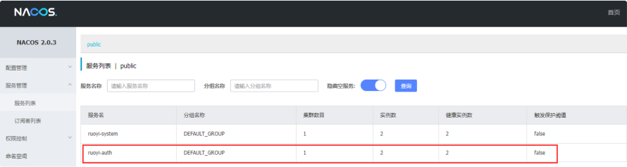

2、查看sentinel以及Skywalking服务情况

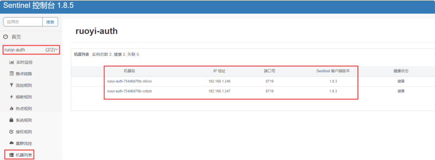

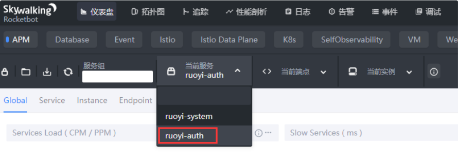

### 5.3 迁移微服务gateway

#### 5.3.1 编译gateway项目

```
[root@node ruo-yi-cloud]# mvn package -D maven.test.skip=true -pl ruoyi-gateway/ -am
```
#### 5.3.2 编写Dockerfile

1、编写dockerfile

```
[root@node ruo-yi-cloud]# cat ruoyi- gateway/Dockerfile FROM openjdk:8-jre              # 如果使用alpine 镜像会出现 [网关异常处理]请求路径:/code COPY ./target/*.jar /ruoyi-gateway.jar COPY ./entrypoint.sh /entrypoint.sh RUN chmod +x /entrypoint.sh EXPOSE 8080 CMD ["/bin/sh", "-c", "/entrypoint.sh"] 2、编写启动脚本entrypoint.sh [root@node ruo-yi-cloud]# cat ruoyi- gateway/entrypoint.sh # 设定端口，默认不传参则为8080端口 PARAMS="Վʔserver.port=${Server_Port:-8080}" # JVM堆内存设定，默认不传参则初始和最大都为100m JAVA_OPTS="-Xms${XMS_OPTS:-100m} - Xmx${XMX_OPTS:-100m}" # Nacos相关选项 NACOS_OPTS="- Djava.security.egd=file:/dev/./urandom \ -Dfile.encoding=utf8 \ -Dspring.profiles.active=${Nacos_Active:-dev} \ -Dspring.cloud.nacos.config.file-extension=yml \ -Dspring.cloud.nacos.discovery.server- addr=${Nacos_Server_Addr:-127.0.0.1:8848} \

-Dspring.cloud.nacos.config.server- addr=${Nacos_Server_Addr:-127.0.0.1:8848}" # Skywalking相关选项 SKY_OPTS="-javaagent:/skywalking- agent/skywalking-agent.jar \ -Dskywalking.agent.service_name=ruoyi-gateway \ - Dskywalking.collector.backend_service=${Sky_Ser ver_Addr:-localhost:11800}" # 启动命令（指定sky选项、jvm堆内存选项、jar包，最后跟 上params参数） java ${SKY_OPTS} ${NACOS_OPTS} ${JAVA_OPTS} - jar /ruoyi-gateway.jar ${PARAMS}
```
#### 5.3.3 制作镜像并推送仓库

```
[root@node ruo-yi-cloud]# cd ruoyi-gateway/ [root@node ruoyi-gateway]# docker build -t harbor.oldxu.net/springcloud/ruoyi-gateway:v1.0 . [root@node ruoyi-gateway]# docker push harbor.oldxu.net/springcloud/ruoyi-gateway:v1.0
```
#### 5.3.4 修改gateway组件配置

使用Kubernetes运行gateway之前，先通过Nacos修改对应 ruoyi-gateway-dev.yml的相关配置； spring: redis:

```
host: redis-svc.ry.svc.cluster.local port: 6379 password: cloud:                                # 新增字 段，不要放错位置，否则gateway会出现异常错误 sentinel: eager: true transport: dashboard: sentinel- svc.dev.svc.cluster.local:8718 datasource: ds1: nacos: server-addr: nacos- svc.dev.svc.cluster.local:8848 dataId: sentinel-ruoyi-gateway groupId: DEFAULT_GROUP data-type: json rule-type: flow gateway: discovery: locator: lowerCaseServiceId: true enabled: true routes:                       # 网关路由 （一定要再gateway字段下，否则会出现404的情况） # 认证中心

- id: ruoyi-auth

uri: lb:Վˌruoyi-auth predicates:

- Path=/authՎՎˈ
```
验证码处理

```
- CacheRequestFilter

- ValidateCodeFilter
```
代码生成

```
- id: ruoyi-gen

uri: lb:Վˌruoyi-gen predicates:

- Path=/codeՎՎˈ
```
定时任务

```
- id: ruoyi-job

uri: lb:Վˌruoyi-job predicates:

- Path=/scheduleՎՎˈ
```
系统模块

```
- id: ruoyi-system

uri: lb:Վˌruoyi-system predicates:

- Path=/systemՎՎˈ
```
文件服务

```
- id: ruoyi-file

uri: lb:Վˌruoyi-file predicates:

- Path=/fileՎՎˈ
```
#### 5.3.5 创建Deployment

```
通过Kubernetes运行gateway应用； [root@master 06-ruoyicloud]# cat 03-ruoyi- gateway.yaml apiVersion: apps/v1 kind: Deployment metadata: name: ruoyi-gateway namespace: dev spec: replicas: 2 selector: matchLabels: app: gateway template: metadata: labels: app: gateway spec: imagePullSecrets:

image: harbor.oldxu.net/springcloud/skywalking-java- agent:8.8 command:

/skywalking-agentՎˇ /agent;' volumeMounts:

- name: auth

image: harbor.oldxu.net/springcloud/ruoyi-gateway:v1.0 env:
```
加载配置的环境名称 value: "dev"

```
Nacos集群地址 value: "nacos- svc.dev.svc.cluster.local:8848"

Skywalking地址 value: "skywalking-oap- svc.dev.svc.cluster.local:11800" ports:

livenessProbe: tcpSocket: port: 8080 initialDelaySeconds: 60 periodSeconds: 10 timeoutSeconds: 10 volumeMounts:

mountPath: /skywalking-agent/ volumes:
```
#### 5.3.6 创建Service

```
由于前端UI需要连接Gateway网关，而gateway网关是多副本，为 此需要为Gateway添加Service负载均衡； [root@master 06-ruoyicloud]# cat 04-ruoyi- gateway-service.yaml apiVersion: v1 kind: Service metadata: name: gateway-svc namespace: dev spec: selector: app: gateway ports:

- port: 8080

targetPort: 8080
```
#### 5.3.7 验证gateway组件

最后检查下sentinel和Skywalking

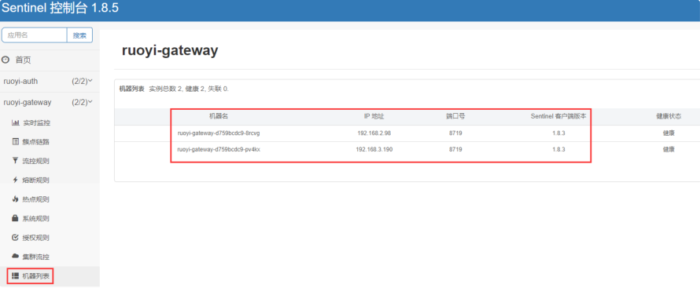

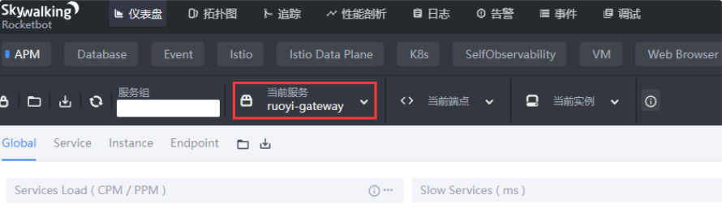

### 5.4 迁移微服务monitor

#### 5.4.1 编译monitor项目

```
[root@node ruo-yi-cloud]# mvn package -D maven.test.skip=true -pl ruoyi-visual/ruoyi- monitor/ -am
```
#### 5.4.2 编写Dockerfile

1、编写dockerfile

```
[root@node ruo-yi-cloud]# cat ruoyi- visual/ruoyi-monitor/Dockerfile FROM openjdk:8-jre-alpine COPY ./target/*.jar /ruoyi-monitor.jar COPY ./entrypoint.sh /entrypoint.sh RUN chmod +x /entrypoint.sh EXPOSE 8080 CMD ["/bin/sh", "-c", "/entrypoint.sh"] 2、编写启动脚本entrypoint.sh [root@node ruo-yi-cloud]# cat ruoyi- visual/ruoyi-monitor/entrypoint.sh # 设定端口，默认不传参则为8080端口 PARAMS="Վʔserver.port=${Server_Port:-8080}" # JVM堆内存设定，默认不传参则初始和最大都为100m JAVA_OPTS="-Xms${XMS_OPTS:-100m} - Xmx${XMX_OPTS:-100m}" # Nacos相关选项 NACOS_OPTS="- Djava.security.egd=file:/dev/./urandom \ -Dfile.encoding=utf8 \ -Dspring.profiles.active=${Nacos_Active:-dev} \ -Dspring.cloud.nacos.config.file-extension=yml \ -Dspring.cloud.nacos.discovery.server- addr=${Nacos_Server_Addr:-127.0.0.1:8848} \

-Dspring.cloud.nacos.config.server- addr=${Nacos_Server_Addr:-127.0.0.1:8848}" # Skywalking相关选项 SKY_OPTS="-javaagent:/skywalking- agent/skywalking-agent.jar \ -Dskywalking.agent.service_name=ruoyi-monitor \ - Dskywalking.collector.backend_service=${Sky_Ser ver_Addr:-localhost:11800}" # 启动命令（指定sky选项、jvm堆内存选项、jar包，最后跟 上params参数） java ${SKY_OPTS} ${NACOS_OPTS} ${JAVA_OPTS} - jar /ruoyi-monitor.jar ${PARAMS}
```
#### 5.4.3 制作镜像并推送仓库

```
[root@node ruo-yi-cloud]# cd ruoyi- visual/ruoyi-monitor/ [root@node ruoyi-system]# docker build -t harbor.oldxu.net/springcloud/ruoyi-monitor:v1.0 . [root@node ruoyi-system]# docker push harbor.oldxu.net/springcloud/ruoyi-monitor:v1.0
```
#### 5.4.4 修改monitor组件配置

使用Kubernetes运行monitor之前，先通过Nacos修改对应 monitor的相关配置； # spring

```
spring: cloud:                # 新增字段 sentinel: eager: true transport: dashboard: sentinel- svc.dev.svc.cluster.local:8718 security: user: name: ruoyi password: 123456 boot: admin: ui: title: 若依服务状态监控
```
#### 5.4.5 创建Deployment

```
[root@master 06-ruoyicloud]# cat 05-ruoyi- monitor.yaml apiVersion: apps/v1 kind: Deployment metadata: name: ruoyi-monitor namespace: dev spec: replicas: 2 selector: matchLabels: app: monitor template: metadata:

labels: app: monitor spec: imagePullSecrets:

image: harbor.oldxu.net/springcloud/skywalking-java- agent:8.8 command:

/skywalking-agentՎˇ /agent;' volumeMounts:

- name: auth

image: harbor.oldxu.net/springcloud/ruoyi-monitor:v1.0 env:
```
加载配置的环境名称 value: "dev"

```
Nacos集群地址 value: "nacos- svc.dev.svc.cluster.local:8848"
```
Skywalking地址

```
value: "skywalking-oap- svc.dev.svc.cluster.local:11800" ports:

livenessProbe: tcpSocket: port: 8080 initialDelaySeconds: 10 periodSeconds: 10 timeoutSeconds: 10 volumeMounts:

mountPath: /skywalking-agent/ volumes:
```
#### 5.4.6 创建Ingress

```
将monitor对外发布，便于开发和运维通过页面查看 [root@master 06-ruoyicloud]# cat 06-ruoyi- monitor-service-ingress.yaml apiVersion: v1 kind: Service metadata: name: monitor-svc namespace: dev spec: selector: app: monitor ports:

- port: 8080

targetPort: 8080 ՎՎʕ apiVersion: networking.k8s.io/v1 kind: Ingress metadata: name: monitor-ingress namespace: dev spec: ingressClassName: "nginx" rules:

- host: monitor.oldxu.net

pathType: Prefix backend: service: name: monitor-svc port: number: 8080
```
#### 5.4.7 验证monitor组件

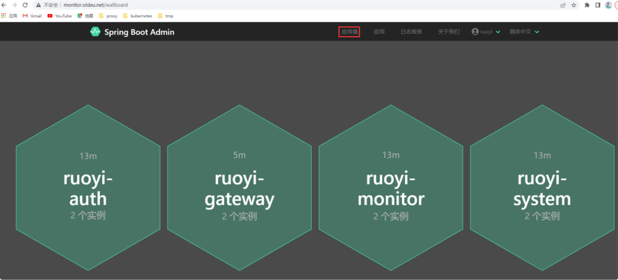

### 5.5 迁移微服务前端UI

#### 5.5.1 修改前端配置

```
[root@node ruo-yi-cloud]# vim ruoyi- ui/vue.config.js        # 修改ui连接gateway地址 devServer: { host: '0.0.0.0', port: port, open: true, proxy: { Վˌ detail: https:Վˌcli.vuejs.org/config/#devserver-proxy [process.env.VUE_APP_BASE_API]: { target: `http:Վˌgateway- svc.dev.svc.cluster.local:8080`, changeOrigin: true, pathRewrite: { ['^' + process.env.VUE_APP_BASE_API]: '' } }

},
```
#### 5.5.2 编译前端项目

```
[root@node ruo-yi-cloud]# cd RuoYi-Cloud/ruoyi- ui/ [root@node ruoyi-ui]# curl Վʔsilent Վʔlocation https:Վˌrpm.nodesource.com/setup_14.x |bash - [root@node ruoyi-ui]# yum install -y nodejs [root@node ruoyi-ui]# npm install Վʔ registry=https:Վˌregistry.npmmirror.com [root@node ruoyi-ui]# npm run build:prod
```
#### 5.5.3 编写Dockerfile

```
[root@node03 ruoyi-ui]# cat Dockerfile FROM nginx COPY ./dist/ /code/     # 直接将./dist/目录下的内 容复制到/code目录即可
```
#### 5.5.4 制作镜像并推送仓库

```
[root@node ruoyi-ui]# docker build -t harbor.oldxu.net/springcloud/ruoyi-ui:v1.0 . [root@node ruoyi-ui]# docker push harbor.oldxu.net/springcloud/ruoyi-ui:v1.0
```
#### 5.5.5 创建ConfigMap

```
1、准备Nginx发布配置文件 [root@master 06-ruoyicloud]# vim ruoyi.oldxu.net.conf server { listen 80; server_name ruoyi.oldxu.net; charset utf-8; root /code; location / { try_files $uri $uri/ /index.html; index  index.html index.htm; }

location /prod-api/ { proxy_set_header Host $http_host; proxy_set_header X-Real-IP $remote_addr; proxy_set_header REMOTE-HOST $remote_addr; proxy_set_header X-Forwarded-For $proxy_add_x_forwarded_for; proxy_pass http:Վˌgateway- svc.dev.svc.cluster.local:8080/; } } 2、创建ConfigMap资源，这样在启动ui项目时，通过configmap 挂载配置，便于后期动态修改；

[root@master 06-ruoyicloud]# kubectl create configmap ruoyi-ui-conf \ Վʔfrom-file=./ruoyi.oldxu.net.conf \ -n dev
```
#### 5.5.6 创建Deployment

```
[root@master 06-ruoyicloud]# cat 07-ruoyi- ui.yaml apiVersion: apps/v1 kind: Deployment metadata: name: ruoyi-ui namespace: dev spec: replicas: 2 selector: matchLabels: app: ui template: metadata: labels: app: ui spec: imagePullSecrets:

containers:

- name: ruoyi-ui

image: harbor.oldxu.net/springcloud/ruoyi-ui:v1.0 ports:

- containerPort:

readinessProbe:             # 就绪探测 （失败则从负载均衡摘除） tcpSocket: port: 80 initialDelaySeconds: 10 periodSeconds: 10 timeoutSeconds: 10 livenessProbe:              # 存活探测 （不就绪根据重启策略重启） tcpSocket: port: 80 initialDelaySeconds: 10 periodSeconds: 10 timeoutSeconds: 10 volumeMounts:                       # 挂载配置文件

- name: ngxconfs

mountPath: /etc/nginx/conf.d/ volumes:

- name: ngxconfs                      #

配置文件来源configmap中的 ruoyi-ui-conf configMap: name: ruoyi-ui-conf
```
#### 5.5.7 创建Ingress

```
[root@master 06-ruoyicloud]# cat 08-ruoyi-ui- service-ingress.yaml apiVersion: v1 kind: Service

metadata: name: ui-svc namespace: dev spec: selector: app: ui ports:

- port:

targetPort: 80 ՎՎʕ apiVersion: networking.k8s.io/v1 kind: Ingress metadata: name: ui-ingress namespace: dev spec: ingressClassName: "nginx" rules:

- host: ruoyi.oldxu.net

pathType: Prefix backend: service: name: ui-svc port: number:
```
#### 5.5.8 验证服务是否正常

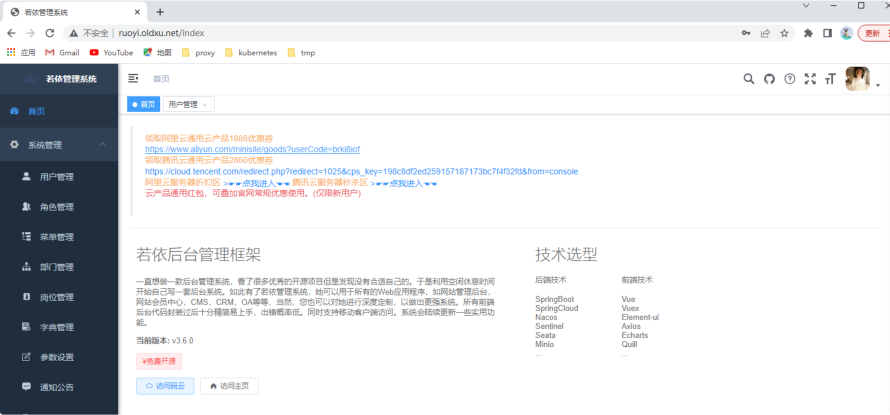
