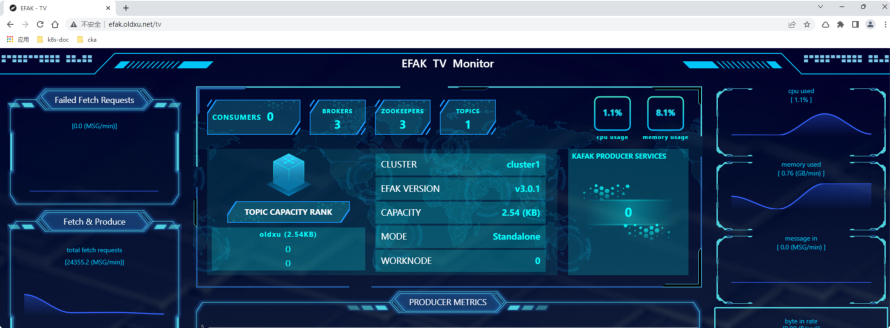
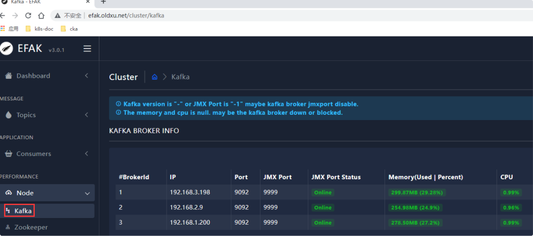
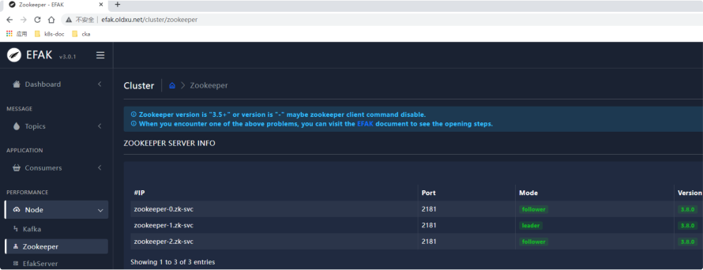
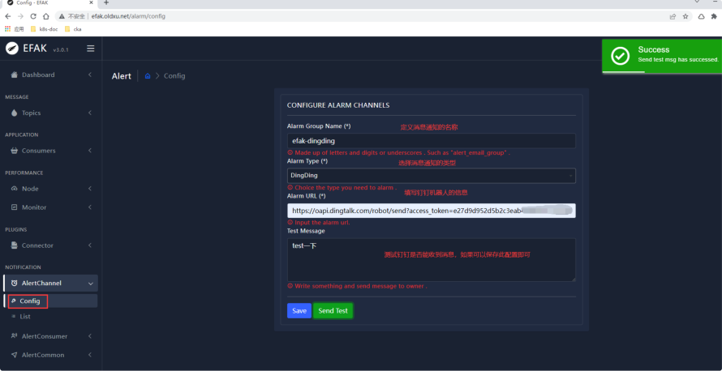
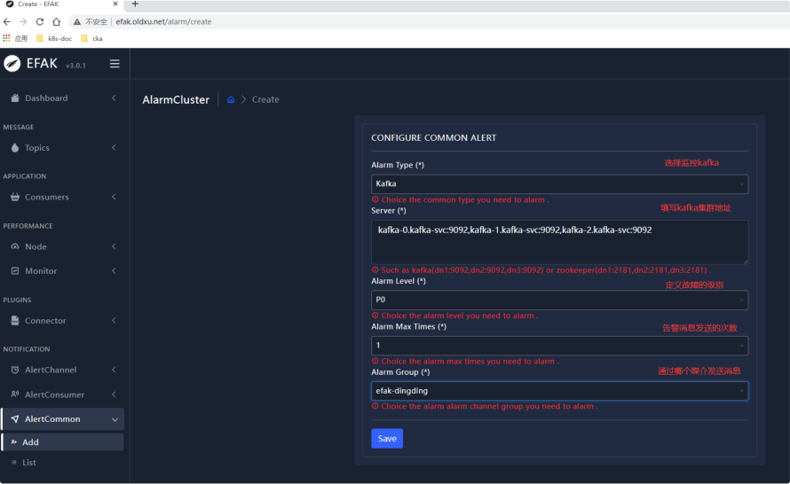
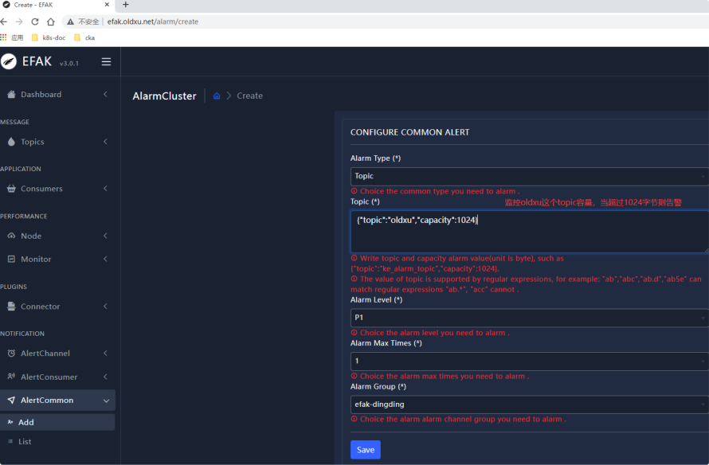
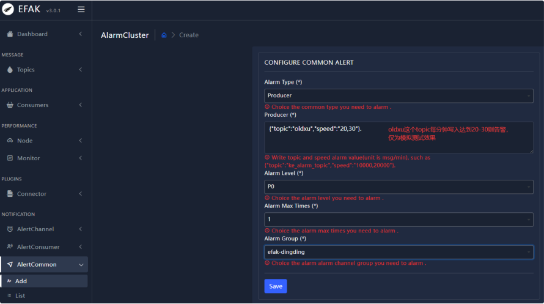
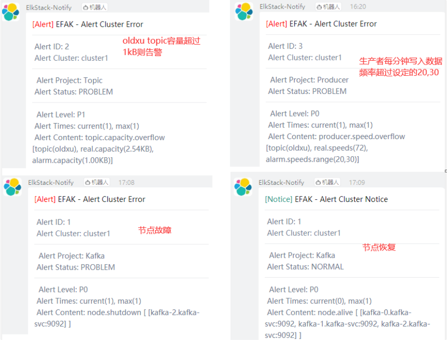

# Kubernetes中间件迁移-Kakfa

## 目录

  - [2.2 server.properties](#2.2-server.properties)
- [4、制作efak镜像](#4制作efak镜像)
- [1.本地搭建Kafka集群](#1.本地搭建kafka集群)
  - [1.0 环境说明](#1.0-环境说明)
  - [1.1 Node1节点](#1.1-node1节点)
  - [1.2 Node2节点](#1.2-node2节点)
  - [1.3 Node3节点](#1.3-node3节点)
  - [1.4 Kafka集群验证](#1.4-kafka集群验证)
  - [1.5 kafka可视化efak](#1.5-kafka可视化efak)
- [2.制作Kafka集群镜像](#2.制作kafka集群镜像)
  - [2.1 Dockerfile](#2.1-dockerfile)
  - [2.3 entrypoint](#2.3-entrypoint)
  - [2.4 构建镜像并推送仓库](#2.4-构建镜像并推送仓库)
- [3.迁移Kafka集群至K8S](#3.迁移kafka集群至k8s)
  - [3.1 迁移Kafka思路分析](#3.1-迁移kafka思路分析)
  - [3.2 创建headless](#3.2-创建headless)
  - [3.3 创建StatefulSet](#3.3-创建statefulset)
  - [3.4 检查Kafka集群](#3.4-检查kafka集群)
  - [4.1 Dockerfile](#4.1-dockerfile)
  - [4.3 entrypoint](#4.3-entrypoint)
  - [4.4 构建镜像并推送仓库](#4.4-构建镜像并推送仓库)
- [5.迁移efak至K8S](#5.迁移efak至k8s)
  - [5.1 创建deployment](#5.1-创建deployment)
  - [5.2 创建service](#5.2-创建service)
  - [5.3 创建Ingress](#5.3-创建ingress)
  - [5.4 访问efka](#5.4-访问efka)
- [1、dashbaord大盘展示](#1dashbaord大盘展示)
  - [5.5 监控kafka](#5.5-监控kafka)
- [2、监控kafka集群状态](#2监控kafka集群状态)
- [3、监控kafkaTopic容量](#3监控kafkatopic容量)
- [4、监控kakfa发送速率等](#4监控kakfa发送速率等)
- [5、告警效果展示](#5告警效果展示)

Kubernetes中间件迁移-Kakfa

### 2.2 server.properties

## 4、制作efak镜像

## 1.本地搭建Kafka集群

### 1.0 环境说明

IP地址 主机名 称 系统版本 内核版本 CPU 内 存

10.0.0.204

node1 CentOS7.9

```
3.10.0-

1160.el7.x86_64 1Core 2G
```
10.0.0.205

node2 CentOS7.9

```
3.10.0-

1160.el7.x86_64 1Core 2G
```
10.0.0.206

node3 CentOS7.9

```
3.10.0-

1160.el7.x86_64 1Core 2G
```
### 1.1 Node1节点

```
1、安装java环境 [root@node01 ~]# yum install java java-devel -y 2、下载并解压Kafka [root@node01 ~]# wget https:Վˌarchive.apache.org/dist/kafka/2.2.0/kaf ka_2.12-2.2.0.tgz [root@node01 ~]# tar xf kafka_2.12-2.2.0.tgz -C /opt [root@node01 ~]# ln -s /opt/kafka_2.12-2.2.0/ /opt/kafka 3、修改kafka配置

[root@node01 ~]# cat /opt/kafka/config/server.properties ############################# Server Basics ############################# # broker的id，值为整数，且必须唯一，在一个集群中不能重 复 broker.id=1 ############################# Socket Server Settings ############################# # kafka监听端口，默认9092 listeners=PLAINTEXT:Վˌ10.0.0.204:9092 # 处理网络请求的线程数量，默认为3个 num.network.threads=3 # 执行磁盘IO操作的线程数量，默认为8个 num.io.threads=8 # socket服务发送数据的缓冲区大小，默认100KB socket.send.buffer.bytes=102400 # socket服务接受数据的缓冲区大小，默认100KB socket.receive.buffer.bytes=102400 # socket服务所能接受的一个请求的最大大小，默认为100M socket.request.max.bytes=104857600 ############################# Log Basics ############################# # kafka存储消息数据的目录 log.dirs=Վʡ/data
```
每个topic默认的partition num.partitions=1 # 设置副本数量为3,当Leader的Replication故障，会进行 故障自动转移。 default.replication.factor=3 # 在启动时恢复数据和关闭时刷新数据时每个数据目录的线程数 量 num.recovery.threads.per.data.dir=1 ############################# Log Flush Policy ############################# # 消息刷新到磁盘中的消息条数阈值 log.flush.interval.messages=10000 # 消息刷新到磁盘中的最大时间间隔,1s log.flush.interval.ms=1000 ############################# Log Retention Policy ############################# # 日志保留小时数，超时会自动删除，默认为7天 log.retention.hours=168 # 日志保留大小，超出大小会自动删除，默认为1G #log.retention.bytes=1073741824 # 日志分片策略，单个日志文件的大小最大为1G，超出后则创 建一个新的日志文件 log.segment.bytes=1073741824

```
每隔多长时间检测数据是否达到删除条件,300s log.retention.check.interval.ms=300000 ############################# Zookeeper ############################# # Zookeeper连接信息，如果是zookeeper集群，则以逗号隔 开 zookeeper.connect=10.0.0.204:2181,10.0.0.205:21 81,10.0.0.206:2181 # 连接zookeeper的超时时间,6s zookeeper.connection.timeout.ms=6000 4、创建kafka数据目录 [root@node01 ~]# mkdir /opt/kafka/data 6、启动Kafka [root@node01 ~]# cd /opt/kafka/bin/ [root@node01 bin]# ./kafka-server-start.sh - daemon Վʡ/config/server.properties
```
### 1.2 Node2节点

```
1、安装java环境 [root@node02 ~]# yum install java java-devel -y 1、下载并解压Kafka

[root@node02 ~]# wget https:Վˌarchive.apache.org/dist/kafka/2.2.0/kaf ka_2.12-2.2.0.tgz [root@node02 ~]# tar xf kafka_2.12-2.2.0.tgz -C /opt [root@node02 ~]# ln -s /opt/kafka_2.12-2.2.0/ /opt/kafka 2、修改配置 [root@node01 ~]# cat /opt/kafka/config/server.properties ############################# Server Basics ############################# # broker的id，值为整数，且必须唯一，在一个集群中不能重 复 broker.id=2 ############################# Socket Server Settings ############################# # kafka监听端口，默认9092 listeners=PLAINTEXT:Վˌ10.0.0.205:9092 # 处理网络请求的线程数量，默认为3个 num.network.threads=3 # 执行磁盘IO操作的线程数量，默认为8个 num.io.threads=8 # socket服务发送数据的缓冲区大小，默认100KB socket.send.buffer.bytes=102400

socket服务接受数据的缓冲区大小，默认100KB socket.receive.buffer.bytes=102400 # socket服务所能接受的一个请求的最大大小，默认为100M socket.request.max.bytes=104857600 ############################# Log Basics ############################# # kafka存储消息数据的目录 log.dirs=Վʡ/data # 每个topic默认的partition num.partitions=1 # 设置副本数量为3,当Leader的Replication故障，会进行 故障自动转移。 default.replication.factor=3 # 在启动时恢复数据和关闭时刷新数据时每个数据目录的线程数 量 num.recovery.threads.per.data.dir=1 ############################# Log Flush Policy ############################# # 消息刷新到磁盘中的消息条数阈值 log.flush.interval.messages=10000 # 消息刷新到磁盘中的最大时间间隔,1s log.flush.interval.ms=1000 ############################# Log Retention Policy #############################
```
日志保留小时数，超时会自动删除，默认为7天 log.retention.hours=168 # 日志保留大小，超出大小会自动删除，默认为1G #log.retention.bytes=1073741824 # 日志分片策略，单个日志文件的大小最大为1G，超出后则创 建一个新的日志文件 log.segment.bytes=1073741824 # 每隔多长时间检测数据是否达到删除条件,300s log.retention.check.interval.ms=300000 ############################# Zookeeper ############################# # Zookeeper连接信息，如果是zookeeper集群，则以逗号隔 开 zookeeper.connect=10.0.0.204:2181,10.0.0.205:21 81,10.0.0.206:2181 # 连接zookeeper的超时时间,6s zookeeper.connection.timeout.ms=6000 3、创建kafka数据目录 [root@node02 ~]# mkdir /opt/kafka/data 4、创建节点标记ID [root@node02 ~]# echo "2" > /opt/zookeeper/data/myid 5、启动Zookeeper

```
[root@node02 ~]# cd /opt/kafka/bin/ [root@node02 bin]# ./kafka-server-start.sh - daemon Վʡ/config/server.properties
```
### 1.3 Node3节点

```
1、安装java环境 [root@node03 ~]# yum install java java-devel -y 2、下载并解压Zookeeper [root@node03 ~]# wget https:Վˌarchive.apache.org/dist/kafka/2.2.0/kaf ka_2.12-2.2.0.tgz [root@node03 ~]# tar xf kafka_2.12-2.2.0.tgz -C /opt [root@node03 ~]# ln -s /opt/kafka_2.12-2.2.0/ /opt/kafka 3、修改配置 [root@node03 ~]# cat /opt/kafka/config/server.properties ############################# Server Basics ############################# # broker的id，值为整数，且必须唯一，在一个集群中不能重 复 broker.id=2 ############################# Socket Server Settings #############################
```
kafka监听端口，默认9092 listeners=PLAINTEXT:Վˌ10.0.0.205:9092 # 处理网络请求的线程数量，默认为3个 num.network.threads=3 # 执行磁盘IO操作的线程数量，默认为8个 num.io.threads=8 # socket服务发送数据的缓冲区大小，默认100KB socket.send.buffer.bytes=102400 # socket服务接受数据的缓冲区大小，默认100KB socket.receive.buffer.bytes=102400 # socket服务所能接受的一个请求的最大大小，默认为100M socket.request.max.bytes=104857600 ############################# Log Basics ############################# # kafka存储消息数据的目录 log.dirs=Վʡ/data # 每个topic默认的partition num.partitions=1 # 设置副本数量为3,当Leader的Replication故障，会进行 故障自动转移。 default.replication.factor=3 # 在启动时恢复数据和关闭时刷新数据时每个数据目录的线程数 量

```
num.recovery.threads.per.data.dir=1 ############################# Log Flush Policy ############################# # 消息刷新到磁盘中的消息条数阈值 log.flush.interval.messages=10000 # 消息刷新到磁盘中的最大时间间隔,1s log.flush.interval.ms=1000 ############################# Log Retention Policy ############################# # 日志保留小时数，超时会自动删除，默认为7天 log.retention.hours=168 # 日志保留大小，超出大小会自动删除，默认为1G #log.retention.bytes=1073741824 # 日志分片策略，单个日志文件的大小最大为1G，超出后则创 建一个新的日志文件 log.segment.bytes=1073741824 # 每隔多长时间检测数据是否达到删除条件,300s log.retention.check.interval.ms=300000 ############################# Zookeeper ############################# # Zookeeper连接信息，如果是zookeeper集群，则以逗号隔 开 zookeeper.connect=10.0.0.204:2181,10.0.0.205:21 81,10.0.0.206:2181

连接zookeeper的超时时间,6s zookeeper.connection.timeout.ms=6000 4、创建kafka数据目录 [root@node03 ~]# mkdir /opt/kafka/data 6、启动kafka [root@node01 ~]# cd /opt/kafka/bin/ [root@node01 bin]# ./kafka-server-start.sh - daemon Վʡ/config/server.properties
```
### 1.4 Kafka集群验证

```
1、使用kafka创建一个topic [root@oldxu-kafka-node1 bin]# ./kafka-topics.sh \ Վʔcreate \ Վʔzookeeper 10.0.0.204:2181,10.0.0.205:2181,10.0.0.206:2181 \ Վʔpartitions 1 \ Վʔreplication-factor 3 \ Վʔtopic oldxu 2、模拟消息发布者

#测试 [root@node1 bin]# ./kafka-console-producer.sh \ Վʔbroker-list 10.0.0.204:9092,10.0.0.205:9092,10.0.0.206:9092 \ Վʔtopic oldxu > >hello oldxu >hello kafka > 3、模拟消息订阅者 [root@node1 bin]# ./kafka-console-consumer.sh \ Վʔbootstrap-server 10.0.0.204:9092,10.0.0.205:9092,10.0.0.206:9092 \ Վʔtopic oldxu \ Վʔfrom-beginning hello oldxu hello kafka
```
### 1.5 kafka可视化efak

1、安装jdk

```
[root@es-node1 ~]# wget https:Վˌlinux.oldxu.net/jdk-8u281-linux- x64.tar.gz [root@es-node1 ~]# tar xf jdk-8u281-linux- x64.tar.gz -C /usr/local [root@es-node1 ~]# ln -s /usr/local/jdk1.8.0_281/ /usr/local/jdk # 配置JDK [root@es-node1 ~]# vim /etc/profile export JAVA_HOME=/usr/local/jdk export PATH=$PATH:$JAVA_HOME/bin [root@es-node1 ~]# source /etc/profile 2、efak安装 [root@es-node1 ~]# https:Վˌlinux.oldxu.net/efak-web-3.0.1- bin.tar.gz [root@es-node1 ~]# tar xf efak-web-3.0.1- bin.tar.gz -C /opt/ [root@es-node1 ~]# ln -s /opt/efak-web-3.0.1/ /opt/efak-web [root@es-node1 ~]# vim /etc/profile export KE_HOME=/opt/efak export PATH=$PATH:$KE_HOME/bin [root@es-node1 ~]# source /etc/profile 3、efak配置修改

[root@es-node1 ~]# cat /opt/efak-web- 3.0.1/conf/system-config.properties ###################################### # 填写 zookeeper集群列表 ###################################### efak.zk.cluster.alias=cluster1 cluster1.zk.list=10.0.0.204:2181,10.0.0.205:218 1,10.0.0.206:2181 ###################################### # broker 最大规模数量 ###################################### cluster1.efak.broker.size=20 ###################################### # zk 客户端线程数 ###################################### kafka.zk.limit.size=32 ###################################### # EFAK webui 端口 ###################################### efak.webui.port=8048 ###################################### # kafka offset storage ###################################### cluster1.efak.offset.storage=kafka ###################################### # kafka jmx uri ######################################

cluster1.efak.jmx.uri=service:jmx:rmi:ՎՎˎjndi/r mi:Վˌ%s/jmxrmi ###################################### # kafka metrics 指标，默认存储15天 ###################################### efak.metrics.charts=true efak.metrics.retain=15 ###################################### # kafka sql topic records max ###################################### efak.sql.topic.records.max=5000 efak.sql.topic.preview.records.max=10 ###################################### # delete kafka topic token ###################################### efak.topic.token=keadmin ###################################### # kafka sqlite 数据库地址（需要修改存储路径） ###################################### efak.driver=org.sqlite.JDBC efak.url=jdbc:sqlite:/opt/efak/db/ke.db efak.username=root efak.password=www.kafka-eagle.org ###################################### # kafka mysql 数据库地址（需要提前创建ke库） ###################################### efak.driver=com.mysql.cj.jdbc.Driver

efak.url=jdbc:mysql:Վˌ172.16.1.8:3306/ke? useUnicode=true&characterEncoding=UTF- 8&zeroDateTimeBehavior=convertToNull efak.username=ke efak.password=123456 4、启动efak [root@es-node1 ~]# /opt/efak/bin/ke.sh start
```
## 2.制作Kafka集群镜像

### 2.1 Dockerfile

```
[root@node03 kafka]# cat Dockerfile FROM openjdk:8-jre # 1、调整时区 RUN /bin/cp /usr/share/zoneinfo/Asia/Shanghai /etc/localtime ՎҐ \ echo 'Asia/Shanghai' >/etc/timezone # 2、拷贝kafka及配置文件 ENV VERSION=2.12-2.2.0 ADD ./kafka_${VERSION}.tgz / ADD ./server.properties /kafka_${VERSION}/config/server.properties # 3、对kafka进行重新命名 RUN mv /kafka_${VERSION} /kafka

4、拷贝entrypoint启动脚本 ADD ./entrypoint.sh /entrypoint.sh # 5、设定kafka对外暴露端口以及kafka对外监听端口 EXPOSE 9092 9999 # 6、设定容器启动命令 CMD ["/bin/bash","/entrypoint.sh"] 2.2 server.properties [root@node03 kafka]# cat server.properties ############################# Server Basics ############################# # broker的id，值为整数，且必须唯一，在一个集群中不能重 复 broker.id={BROKER_ID} ############################# Socket Server Settings ############################# # kafka监听端口，默认9092 listeners=PLAINTEXT:Վˌ{LISTENERS}:9092 # 处理网络请求的线程数量，默认为3个 num.network.threads=3 # 执行磁盘IO操作的线程数量，默认为8个 num.io.threads=8 # socket服务发送数据的缓冲区大小，默认100KB

socket.send.buffer.bytes=102400 # socket服务接受数据的缓冲区大小，默认100KB socket.receive.buffer.bytes=102400 # socket服务所能接受的一个请求的最大大小，默认为100M socket.request.max.bytes=104857600 ############################# Log Basics ############################# # kafka存储消息数据的目录 log.dirs={KAFKA_DATA_DIR} # 每个topic默认的partition num.partitions=1 # 设置副本数量为3,当Leader的Replication故障，会进行 故障自动转移。 default.replication.factor=3 # 在启动时恢复数据和关闭时刷新数据时每个数据目录的线程数 量 num.recovery.threads.per.data.dir=1 ############################# Log Flush Policy ############################# # 消息刷新到磁盘中的消息条数阈值 log.flush.interval.messages=10000 # 消息刷新到磁盘中的最大时间间隔,1s log.flush.interval.ms=1000
```
############################# Log Retention Policy ############################# # 日志保留小时数，超时会自动删除，默认为7天 log.retention.hours=168 # 日志保留大小，超出大小会自动删除，默认为1G #log.retention.bytes=1073741824 # 日志分片策略，单个日志文件的大小最大为1G，超出后则创 建一个新的日志文件 log.segment.bytes=1073741824 # 每隔多长时间检测数据是否达到删除条件,300s log.retention.check.interval.ms=300000 ############################# Zookeeper ############################# # Zookeeper连接信息，如果是zookeeper集群，则以逗号隔 开 zookeeper.connect={ZOOK_SERVERS} # 连接zookeeper的超时时间,6s zookeeper.connection.timeout.ms=6000

### 2.3 entrypoint

```
需要替换的内容 # {BROKER_ID}、{LISTENERS}、{KAFKA_DATA_DIR}、 {ZOOK_SERVERS}

[root@node03 kafka]# cat entrypoint.sh KAFKA_DIR=/kafka KAFKA_CONF=/kafka/config/server.properties # 1、基于主机名获取BrokerID BROKER_ID=$(( $(hostname | sed 's#.*-Վˁg') + 1 )) # 2、获取IP地址 LISTENERS=$(hostname -i) # 3、替换配置内容 sed -i s@{BROKER_ID}@${BROKER_ID}@g ${KAFKA_CONF} sed -i s@{LISTENERS}@${LISTENERS}@g ${KAFKA_CONF} sed -i s@{ZOOK_SERVERS}@${ZOOK_SERVERS}@g ${KAFKA_CONF} sed -i s@{KAFKA_DATA_DIR}@${KAFKA_DATA_DIR:-/data}@g ${KAFKA_CONF} # 4、启动kafka,并kafka启动脚本添加JMX端口 cd $KAFKA_DIR/bin sed -i '/export KAFKA_HEAP_OPTS/a export JMX_PORT="9999"' kafka-server-start.sh ./kafka-server-start.sh Վʡ/config/server.properties
```
### 2.4 构建镜像并推送仓库

```
[root@node03 kafka]# docker build -t harbor.oldxu.net/base/kafka:2.12.2  . [root@node03 kafka]# docker push harbor.oldxu.net/base/kafka:2.12.2
```
## 3.迁移Kafka集群至K8S

### 3.1 迁移Kafka思路分析

1、Kafka属于有状态服务； 2、Kafka集群每个节点都需要存储自己的数据； 3、Kafka需要依赖Zookeeper；

### 3.2 创建headless

```
[root@master kafka]# cat 01-kafka-headless.yaml apiVersion: v1 kind: Service metadata: name: kafka-svc spec: clusterIP: None selector: app: kafka ports:

- name: client

port: 9092

targetPort: 9092

- name: jmx

port: 9999 targetPort: 9999
```
### 3.3 创建StatefulSet

```
[root@master kafka]# cat 02-kafka-sts.yaml apiVersion: apps/v1 kind: StatefulSet metadata: name: kafka spec: serviceName: "kafka-svc" replicas: 3 selector: matchLabels: app: kafka template: metadata: labels: app: kafka spec: affinity:                         # 避免 Pod运行到同一个节点上了 podAntiAffinity:

requiredDuringSchedulingIgnoredDuringExecution:

- labelSelector:

matchExpressions:

- key: app

operator: In values: ["kafka"] topologyKey: "kubernetes.io/hostname" imagePullSecrets:

- name: harbor-admin

containers:

- name: kafka

image: harbor.oldxu.net/base/kafka:2.12.2 imagePullPolicy: Always env:

- name: ZOOK_SERVERS

value: "zookeeper-0.zk- svc:2181,zookeeper-1.zk-svc:2181,zookeeper- 2.zk-svc:2181" ports:

- name: listen

containerPort: 9092

- name: jmxport

containerPort: 9999 volumeMounts:

- name: data

mountPath: /data volumeClaimTemplates:

- metadata:

name: data spec: accessModes: ["ReadWriteMany"]

storageClassName: "nfs-provisioner- storage" resources: requests: storage: 50Gi
```
### 3.4 检查Kafka集群

1、查看Pod以及Service

```
[root@master zookeeper]# kubectl get pod,service NAME READY   STATUS    RESTARTS         AGE pod/kafka-0 1/1     Running   0                15m pod/kafka-1 1/1     Running   0                14m pod/kafka-2 1/1     Running   0                14m pod/nfs-client-provisioner-b56b56f4c-zklq5 1/1     Running   57 (4h53m ago)   48d pod/zookeeper-0 1/1     Running   0                36m pod/zookeeper-1 1/1     Running   0                35m pod/zookeeper-2 1/1     Running   0                35m NAME                TYPE       CLUSTER-IP EXTERNAL-IP   PORT(S)                      AGE service/kafka-svc   ClusterIP   None <none>       9092/TCP,9999/TCP            15m service/zk-svc      ClusterIP   None <none>       2181/TCP,2888/TCP,3888/TCP   36m 2、使用kafka命令创建一个topic

[root@master kafka]# kubectl exec -it kafka-0 -

- /bin/bash

root@kafka-0:/# root@kafka-0:/# /kafka/bin/kafka-topics.sh \ Վʔcreate \ Վʔzookeeper zookeeper-0.zk-svc:2181,zookeeper- 1.zk-svc:2181,zookeeper-2.zk-svc:2181 \ Վʔpartitions 1 \ Վʔreplication-factor 3 \ Վʔtopic oldxu 2、模拟消息发布者 #测试 [root@master zookeeper]# kubectl exec -it kafka-1 Վʔ /bin/bash root@kafka-1:/# root@kafka-1:/# /kafka/bin/kafka-console- producer.sh \ Վʔbroker-list kafka-0.kafka-svc:9092,kafka- 1.kafka-svc:9092,kafka-2.kafka-svc:9092 \ Վʔtopic oldxu > >hello kafka >hello k8s >hello oldxu 3、模拟消息订阅者

[root@master zookeeper]# kubectl exec -it kafka-2 Վʔ /bin/bash root@kafka-2:/# root@kafka-2:/# /kafka/bin/kafka-console- consumer.sh \ Վʔbootstrap-server kafka-0.kafka- svc:9092,kafka-1.kafka-svc:9092,kafka-2.kafka- svc:9092 \ Վʔtopic oldxu \ Վʔfrom-beginning hello kafka hello k8s hello oldxu
```
## 4、制作efak镜像

### 4.1 Dockerfile

```
[root@node03 kafka-eagle]# cat Dockerfile FROM openjdk:8 # 1、调整时区 RUN /bin/cp /usr/share/zoneinfo/Asia/Shanghai /etc/localtime ՎҐ \ echo 'Asia/Shanghai' >/etc/timezone # 2、拷贝efak及配置 ENV VERSION=3.0.1 ADD ./efak-web-${VERSION}-bin.tar.gz /

ADD ./system-config.properties /efak- web-${VERSION}/conf/ # 3、对efak重新命名 RUN mv /efak-web-${VERSION} /efak-web # 4、声明系统环境变量 ENV KE_HOME=/efak-web ENV PATH=$PATH:$KE_HOME/bin # 5、拷贝entrypoint启动脚本 ADD ./entrypoint.sh /entrypoint.sh # 6、设定efak对外端口 EXPOSE 8048 # 7、设定容器启动命令 CMD ["/bin/bash","/entrypoint.sh"]

4.2 system-config

需要在entrypoint脚本对其下值进行替换 # {ZOOK_SERVER} {EFAK_DIR} [root@node03 kafka-eagle]# cat system- config.properties ###################################### # multi zookeeper & kafka cluster list # Settings prefixed with 'kafka.eagle.' will be deprecated, use 'efak.' instead ######################################

efak.zk.cluster.alias=cluster1 cluster1.zk.list={ZOOK_SERVERS} ###################################### # broker size online list ###################################### cluster1.efak.broker.size=20 ###################################### # zk client thread limit ###################################### kafka.zk.limit.size=32 ###################################### # EFAK webui port ###################################### efak.webui.port=8048 ###################################### # kafka offset storage ###################################### cluster1.efak.offset.storage=kafka ###################################### # kafka jmx uri ###################################### cluster1.efak.jmx.uri=service:jmx:rmi:ՎՎˎjndi/r mi:Վˌ%s/jmxrmi ###################################### # kafka metrics, 15 days by default ######################################

efak.metrics.charts=true efak.metrics.retain=15 ###################################### # kafka sql topic records max ###################################### efak.sql.topic.records.max=5000 efak.sql.topic.preview.records.max=10 ###################################### # delete kafka topic token ###################################### efak.topic.token=keadmin ###################################### # kafka sqlite jdbc driver address ###################################### efak.driver=org.sqlite.JDBC efak.url=jdbc:sqlite:{EFAK_DIR}/db/ke.db efak.username=root efak.password=www.kafka-eagle.org
```
### 4.3 entrypoint

```
[root@node03 kafka-eagle]#  cat entrypoint.sh # 1、定义变量 EFAK_DIR=/efak-web EFAK_CONF_FILE=/efak-web/conf/system- config.properties # 2、替换配置内容 sed -i s@{ZOOK_SERVERS}@${ZOOK_SERVERS}@g ${EFAK_CONF_FILE} # 3、启动efak ${EFAK_DIR}/bin/ke.sh start tail -f ${EFAK_DIR}/logs/ke_console.out
```
### 4.4 构建镜像并推送仓库

```
[root@node03 kafka-eagle]# docker build -t harbor.oldxu.net/base/efak:3.0.1 . [root@node03 kafka-eagle]# docker push harbor.oldxu.net/base/efak:3.0.1
```
## 5.迁移efak至K8S

### 5.1 创建deployment

```
[root@master kafka]# cat 03-efak-deploy.yaml apiVersion: apps/v1 kind: Deployment metadata:

name: efak-monitor spec: replicas: 1 selector: matchLabels: app: efak template: metadata: labels: app: efak spec: imagePullSecrets:

- name: harbor-admin

containers:

- name: efak

image: harbor.oldxu.net/base/efak:3.0.1 imagePullPolicy: Always env:

- name: ZOOK_SERVER

value: "zookeeper-0.zk- svc:2181,zookeeper-1.zk-svc:2181,zookeeper- 2.zk-svc:2181" ports:

- name: http

containerPort: 8048 readinessProbe:         # 就绪探针（不就 绪则不接入流量） httpGet: path: / port: http initialDelaySeconds:

livenessProbe:          # 存活探针（不存 活则重启Pod） httpGet: path: / port: http initialDelaySeconds:
```
### 5.2 创建service

```
[root@master kafka]# cat 04-efak-svc.yaml apiVersion: v1 kind: Service metadata: name: efak-svc spec: type: ClusterIP selector: app: efak ports:

- port: 8048

targetPort: 8048
```
### 5.3 创建Ingress

```
[root@master kafka]# cat 05-efak-ingress.yaml apiVersion: networking.k8s.io/v1 kind: Ingress metadata: name: efak-ingress spec: ingressClassName: "nginx"

rules:

- host: efak.oldxu.net

http: paths:

- path: /

pathType: Prefix backend: service: name: efak-svc port: number: 8048
```
### 5.4 访问efka

## 1、dashbaord大盘展示



2、查看kafka集群



3、查看Zookeeper集群状态



### 5.5 监控kafka

efak可以监控kafka集群状态、Zookeeper集群状态、 kafkaTopic的容量、以及kafka生产消息的速率。如果不符合预 期状态，则可以通过dingding或其他媒介通知给管理员。 1、配置消息通知媒介（钉钉）



## 2、监控kafka集群状态



## 3、监控kafkaTopic容量



## 4、监控kakfa发送速率等



## 5、告警效果展示


