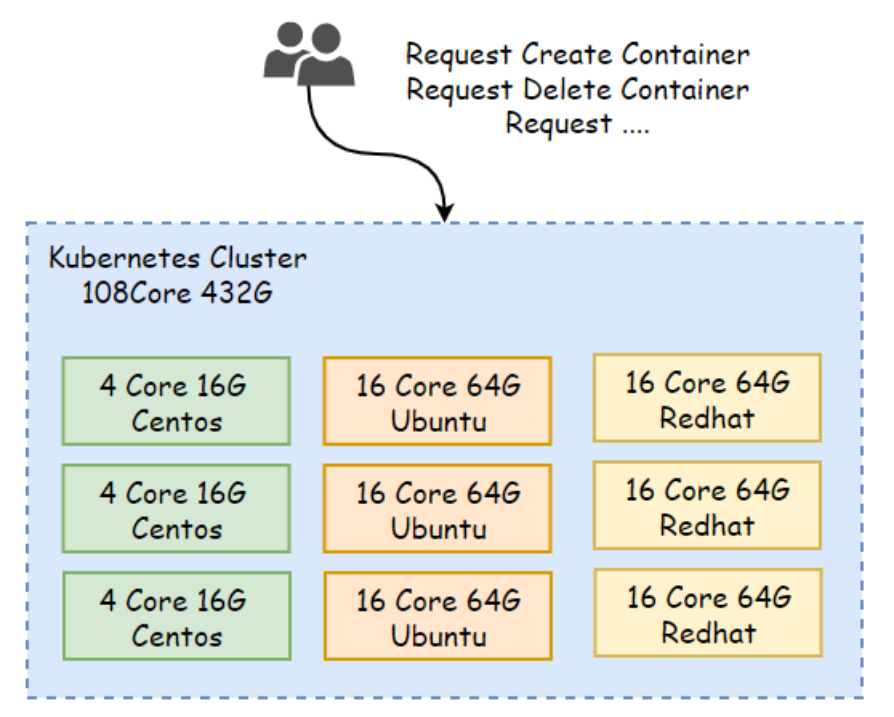
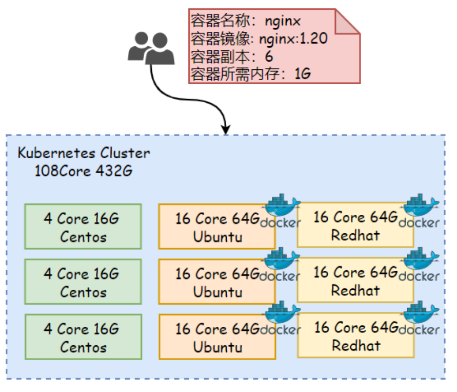
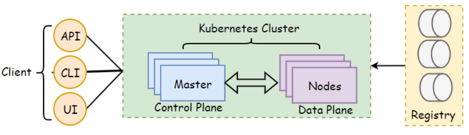
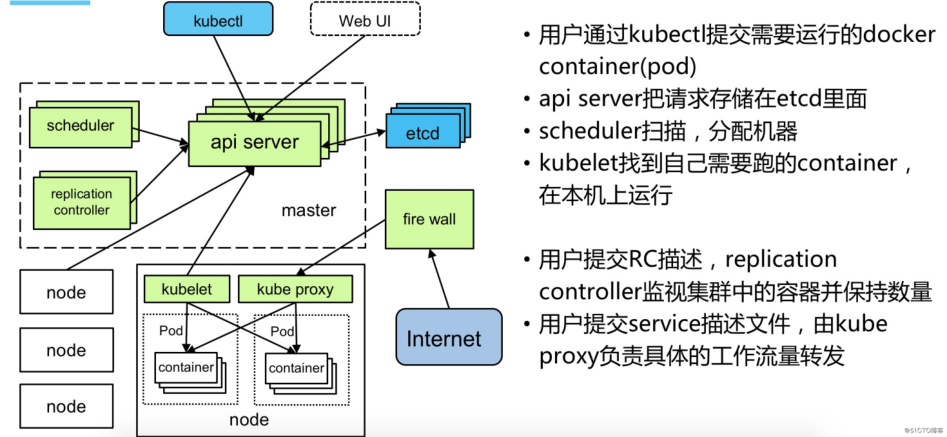
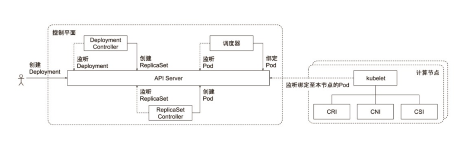
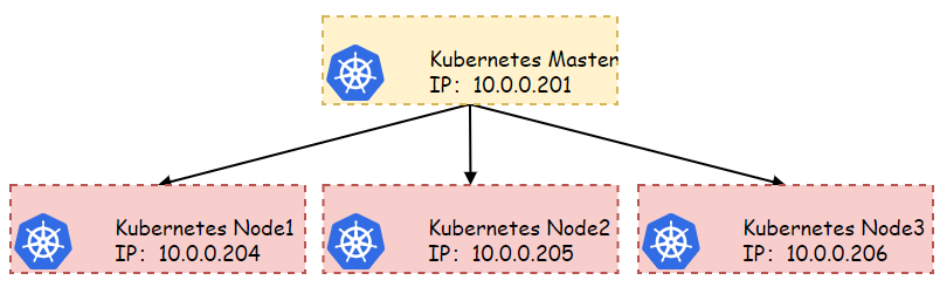

# 01 Kubernetes快速⼊⻔

## 目录

- [1.Kubernetes简介](#1.kubernetes简介)
  - [1.1 Kubernetes是什么](#1.1-kubernetes是什么)
  - [1.2 为什么需要Kubernetes](#1.2-为什么需要kubernetes)
  - [1.3 Kubernetes不是什么](#1.3-kubernetes不是什么)
  - [1.4 Kubernetes集群⻆⾊](#1.4-kubernetes集群)
- [2.Kubernetes集群组件](#2.kubernetes集群组件)
  - [2.1 Master节点组件](#2.1-master节点组件)
  - [2.2 Node节点组件](#2.2-node节点组件)
    - [2.2.3 ContainerRuntime](#2.2.3-containerruntime)
  - [2.3 Add-One附件组件](#2.3-add-one附件组件)
    - [2.3.1 CoreDNS](#2.3.1-coredns)
    - [2.3.2 network](#2.3.2-network)
    - [2.3.3 Dashboard](#2.3.3-dashboard)
  - [2.4 Pod的创建流程图](#2.4-pod的创建流程图)
- [3.Kubernetes安装](#3.kubernetes安装)
  - [3.1 环境准备（所有节点执⾏）](#3.1-环境准备所有节点执)
    - [3.1.1 主机名解析](#3.1.1-主机名解析)
    - [3.1.2 关闭防⽕墙](#3.1.2-关闭防墙)
    - [3.1.3 关闭Swap](#3.1.3-关闭swap)
    - [3.1.4 内核修改](#3.1.4-内核修改)
    - [3.1.5 安装IPVS](#3.1.5-安装ipvs)
    - [3.1.6 时间同步](#3.1.6-时间同步)
- [210 Number of sources =](#210-number-of-sources-)
  - [3.2 安装集群组件](#3.2-安装集群组件)
    - [3.2.1 安装Docker](#3.2.1-安装docker)
    - [3.2.2 安装集群⼯具](#3.2.2-安装集群具)
  - [3.3 集群初始化](#3.3-集群初始化)
    - [3.3.1 下载Docker镜像](#3.3.1-下载docker镜像)
    - [3.3.2 初始化Master节点](#3.3.2-初始化master节点)
    - [3.3.3 初始化Nodes节点](#3.3.3-初始化nodes节点)
    - [3.3.4 安装Flannel⽹络插件](#3.3.4-安装flannel络插件)
    - [3.3.5 集群命令⾃动补全](#3.3.5-集群命令动补全)
  - [3.4 集群状态检查](#3.4-集群状态检查)
  - [3.5 集群环境清理](#3.5-集群环境清理)

Kubernetes

APIServer

Scheduler

kubeproxy

## 1.Kubernetes简介

### 1.1 Kubernetes是什么

Kubernetes是⼀个可移植、可扩展的 "分布式开源平台"，这个平台主 要是⽤来管理我们运⾏的容器化应⽤，只不过这个平台它是⼀个分布式 的，那Kubernetes这个分布式平台是如何实现的呢。 Kubernetes是 将多个OS节点组织在⼀起，构建出⼀个庞⼤的虚拟资源池，⽽后对⽤户 提供操作该集群的接⼝，⽤户就可以通过Kubernetes提供的对应接⼝对 容器进⾏增删查改等操作。 所以对于⽤户⽽⾔，它⽆需关⼼ Kubernetes底层是如何对容器进⾏的创建、⼜是如何调度到对应的节点 的，它只需要专注于⾃⼰的业务逻辑代码开发即可；



当我们需要使⽤Kubernetes交付应⽤时，仅需要通过yaml⽂件的⽅式 来描述对应容器的状态，Kubernetes则会按照yaml⽂件中所描述的容 器状态信息；进⾏容器的“⾃动化”创建。



Kubernetes会时刻监控着容器的状态，如果有容器故障，则会尝试重启 容器，使其能容器运⾏的状态能达到⽤户所期望的值；

### 1.2 为什么需要Kubernetes

⽬前使⽤容器打包和运⾏应⽤程序，已经是业界主流的⼀种⽅式，在⽣产 环境中，我们需要管理运⾏应⽤程序的容器，同时还要确保它不会停机， 例：⼀个容器发⽣故障，需要重新拉起该容器。如果系统能⾃动为其处 理，那么容器的管理会不会更加的容易 这就是 Kubernetes 需要解决的问题！Kubernetes 它可以轻松的实 现应⽤的扩展、服务发现、负载均衡、容器的故障转移、以及容器编排 等。 垂直扩容：新的服务器节点能够很容易的进⾏增加和删除。 ⽔平扩容：容器实例能通过副本控制器进⾏轻松的扩容，缩容 弹性伸缩：能根据容器的资源使⽤情况，进⾏⾃动的扩缩容

服务发现和负载均衡： Kubernetes 为容器提供负载均衡功能， 进⾏流量调度，从⽽使得应⽤运⾏更加稳定。 存储编排：Kubernetes允许⾃动挂载各种存储类系统，例如本地存 储、NFS、GFS、Ceph、公共云存储等。 ⾃动部署和回滚：如果应⽤部署过程中出现错误，可以实现⾃动回滚 ⾃动完成装箱计算：Kubernetes允许指定每个容器所需的CPU和内 存资源，能够更好的管理容器的资源使⽤。 ⾃我修复：Kubernetes 会重新启动失败的容器、替换容器、对运 ⾏状况检查不响应的容器进⾏杀死 密钥与配置管理：Kubernetes 允许你存储和管理敏感信息，例如 密码、令牌和 ssh 密钥。可以在不重建容器镜像的情况下，部署和 更新密钥

### 1.3 Kubernetes不是什么

Kubernetes 不是传统的、包罗万象的 PaaS（平台即服务）系统。 它提供了 PaaS 产品共有的⼀些普遍适⽤的功能， 例如部署、扩展、负 载均衡、⽇志记录和监视。 Kubernetes 默认解决⽅案都是可选和可插 拔的。但在重要的地⽅保留了⽤户的选择和灵活性。 Kubernetes： 不限制⽀持的应⽤程序类型：如果只要应⽤程序可以在容器中运⾏， 那么它应该可以在 Kubernetes 上很好地运⾏。 不部署源代码，也不构建你的应⽤程序：CI/CD⼯作流取决于组织的 ⽂化和偏好以及技术要求。 不提供应⽤程序级别的服务作为内置服务：例如中间件（例如，消息 中间件）、 数据处理框架（例如，Spark）、数据库（例如， mysql）、缓存、集群存储系统 （例如，Ceph）。但这些组件都可 以在 Kubernetes 上运⾏ 不要求⽇志记录、监视或警报解决⽅案 它提供了⼀些集成作为概念 证明，并提供了收集和导出指标的机制。 不提供或不要求配置语⾔/系统：它提供了声明性API，该声明性 API可以由任意形式的声明性规范所构成。RESTful； 不提供也不采⽤任何的机器配置、维护、管理或⾃我修复系统。

### 1.4 Kubernetes集群⻆⾊

Kubernetes集群需要建⽴在多个物理主机上，将多个物理主机的资源抽 象出来，组织成⼀个平台，⽽后进⾏统⼀管理，当然它需要多个物理主 机，不⼀定必须是物理机，也可以是虚拟机VM等等；所以从这个⻆度来 说，Kubernetes是⼀个集群，但是在Kubernetes集群内部，这些节点 ⼜被划分成了两类⻆⾊； ⼀类⻆⾊为主节点，叫Master，负责管理集群； ⼀类⻆⾊为⼯作节点，叫Node，负责运⾏应⽤； 这也就意味着我们将来运⾏的所有容器，都应该运⾏在Node节点，⽽ Master负责管理有多少个Node节点，同时还负责管理每个Node节点应 该运⾏哪个容器或哪些容器，的控制中⼼，因此在Kubernetes中 Master被称之为Control plane控制平⾯，⽽Node就是我们的data plane叫数据平⾯；



Registry：Kubernetes主要是在Node上运⾏容器化应⽤，那么容器化 应⽤需要依托镜像，⽽镜像⼜来⾃于Registry，但Registry并不是 Kubernetes集群的组成部分，但我们必须要有⼀个私有的Registry， 当然也可以使⽤公共的镜像仓库； Client：⽆论客户端是通过API接⼝，还是WebUI接⼝、异或者CLI接⼝ 与Master交互，其实都是向Master发送请求，⽐如客户端申请创建容 器、删除容器等，都是由Master负责在Node节点上对容器进⾏增删改 查，⽽这些操作必须要通过Master，由Master控制着完成的，虽然我们 将其称Master，但它并⾮是⼀个组件，⽽是由多个组件组成的；

## 2.Kubernetes集群组件

通过创建⼀个Pod或者Deployment资源来了解Kubernetes集群组件以 及之间的关系。



### 2.1 Master节点组件

```
2.1.1 kube-APIServer
```
Kubernetes API 主要提供前端请求接⼊，然后验证客户端身份，以及 客户端提交的请求。所有的组件都必须通过APIServer进⾏交互；

```
2.1.2 Kube-Scheduler
```
负责监视APIServer新创建，但未指定运⾏⾄哪个节点的 Pod，然后选 择合适的节点让 Pod 在上⾯运⾏； 调度决策考虑的因素有很多，其中有 Pod亲和性、反亲和、节点亲和、 数据位置、等等等等

```
2.1.3 Kube-ControllManager
```
控制器通过 APIServer 监控集群当前运⾏的容器状态，当控制器监控 到运⾏的容器状态不符合期望状态时，控制器会致⼒于将当前状态转变为 期望的状态，简单来说就是⾃动调节当前系统运⾏状态； 控制循环的例⼦：房间⾥的温度⾃动调节器。当你设置了温度，告诉了温 度⾃动调节器你的 期望状态（Desired State）。 房间的实际温度是 当前状态（Current State） 通过对设备的控制，温度⾃动调节器让 其当前状态接近期望状态。 这些控制器包括: 节点控制器（Node Controller）: 负责在节点出现故障时进⾏通 知和响应； 副本控制器（ReplicaSet Controller）：监视容器运⾏的副 本，时刻让其维持期望状态； 任务控制器（Job controller）: 监测⼀次性任务的 Job 对 象，然后创建Pods来运⾏这些任务直⾄完成； ......

### 2.2 Node节点组件

```
2.2.1 Kube-kubelet
```
kubelet 是集群中每个 Node 节点上运⾏的代理程序，⽤于接收 APIServer 提供给它的 PodSpecs，确保这些 PodSpecs 中描述的 容器处于运⾏状态且健康，主要作⽤就是管理容器的启动、停⽌、销毁、 重建等；

```
2.2.2 Kube-kubeproxy
```
kube-proxy 是集群中每个节点上运⾏的⽹络代理，它主要维护每台节 点上的 Iptables、IPVS 规则创建和删除，这些规则允许从集群内部 或集群外部与 Pod 进⾏⽹路通信；

kube-proxy负责实现容器的负载均衡，然后将指定的流量调度到对应的 容器，通过iptables或ipvs规则来实现；

#### 2.2.3 ContainerRuntime

容器运⾏环境是负责运⾏容器的软件，Kubernetes ⽀持容器运⾏时， ⽐如 Docker、Containerd等；

### 2.3 Add-One附件组件

#### 2.3.1 CoreDNS

每创建⼀个内部负载均衡，则⾃动创建⼀条对应的DNS记录，这样就可以 让Pod通过域名的⽅式访问对应的负载均衡； 因为k8s分配的负载均衡 IP不稳定，删除和添加都会发⽣变化，但如果分配⼀个稳定的DNS名称， 则⽆需关系负载均衡的IP；

#### 2.3.2 network

⽹络插件，为每个Pod分配⼀个IP地址，确保多个不同节点的Pod能够直 接通信，⽽⽆需经过NAT地址转换等；

#### 2.3.3 Dashboard

为Kubernetes提供图形界⾯，通过图形界⾯管理Kubernetes；

### 2.4 Pod的创建流程图



## 3.Kubernetes安装

我们这⾥安装⽬前的版本是 v1.22.2，由于我们这⾥主要⽬的也是学习 Kubernetes 的⼀些知识点，所以采⽤的是 Kubeadm 来快速搭 建单 Master 的集群，等后续掌握了整个Kubernetes的常⽤资源后，在来搭 建⾼可⽤Kubernetes。



IP地址 主机名称 系统版本 内核版本 CPU 内存

10.0.0.201

```
master CentOS7.9 3.10.0-1160.el7.x86_64 2Core 2G
```
10.0.0.204

```
node1 CentOS7.9 3.10.0-1160.el7.x86_64 1Core 2G
```
10.0.0.205

```
node2 CentOS7.9 3.10.0-1160.el7.x86_64 1Core 2G
```
10.0.0.206

```
node3 CentOS7.9 3.10.0-1160.el7.x86_64 1Core 2G
```
### 3.1 环境准备（所有节点执⾏）

#### 3.1.1 主机名解析

添加主机名称解析记录，在所有节点执⾏；

```
echo "10.0.0.210 master" !" /etc/hosts
echo "10.0.0.211 node1" !" /etc/hosts
echo "10.0.0.212 node2" !" /etc/hosts
```
#### 3.1.2 关闭防⽕墙

关闭Selinux防⽕墙，Firewalld防⽕墙，在所有节点执⾏； systemctl stop firewalld !# systemctl disable firewalld setenforce

#### 3.1.3 关闭Swap

```
禁⽌k8s使⽤swap虚拟内存；在所有节点执⾏； swapoff -a sed -ri 's/.*swap.*/#&/' /etc/fstab
```
#### 3.1.4 内核修改

1.开启内核 ipv4 转发需要执⾏如下命令加载 br_netfilter 模块， 在所有节点执⾏ modprobe br_netfilter 2.创建/etc/sysctl.d/k8s.conf⽂件，添加如下内容：

```
cat > /etc/sysctl.d/k8s.conf !$EOF net.bridge.bridge-nf-call-ip6tables = 1 net.bridge.bridge-nf-call-iptables = 1 net.ipv4.ip_forward = 1 vm.swappiness=0 EOF

sysctl -p /etc/sysctl.d/k8s.conf bridge-nf 使得 netfilter 可以对 Linux ⽹桥上的 IPv4/ARP/IPv6 包过滤。⽐如，设置net.bridge.bridge-nf- call-iptables＝1后，⼆层的⽹桥在转发包时也会被 iptables的 FORWARD 规则所过滤。常⽤的选项包括： net.bridge.bridge-nf-call-arptables：是否在 arptables 的 FORWARD 中过滤⽹桥的 ARP 包 net.bridge.bridge-nf-call-ip6tables：是否在 ip6tables 链中过滤 IPv6 包 net.bridge.bridge-nf-call-iptables：是否在 iptables 链中过滤 IPv4 包 net.bridge.bridge-nf-filter-vlan-tagged：是否在 iptables/arptables 中过滤打了 vlan 标签的包。
```
#### 3.1.5 安装IPVS

1.为了便于查看 ipvs 的代理规则，需要安装管理⼯具 ipvsadm，在 所有节点执⾏； # yum install ipset ipvsadm -y 2.加载ipvs模块，在所有节点执⾏；

```
cat > /etc/sysconfig/modules/ipvs.modules !$EOF !%/bin/bash modprobe !& ip_vs modprobe !& ip_vs_rr modprobe !& ip_vs_wrr modprobe !& ip_vs_sh modprobe !& nf_conntrack_ipv4 EOF

chmod 755 /etc/sysconfig/modules/ipvs.modules !# bash /etc/sysconfig/modules/ipvs.modules !# lsmod | grep -e ip_vs -e nf_conntrack_ipv4 上⾯脚本创建了的/etc/sysconfig/modules/ipvs.modules⽂件， 保证在节点重启后能⾃动加载所需模块。使⽤lsmod | grep -e ip_vs -e nf_conntrack_ipv4命令查看是否已经正确加载所需的内 核模块。
```
#### 3.1.6 时间同步

```
yum install chrony -y # systemctl enable chronyd !&now
```
同步时间 # chronyc sources

## 210 Number of sources =

```
MS Name/IP address         Stratum Poll Reach LastRx Last sample ==================================================== =========================== ^? 185.102.185.67                0   6     0     - +0ns[   +0ns] +/-    0ns ^- ntp1.ams1.nl.leaseweb.net     2   6    17    30 +4092us[+4092us] +/-  202ms ^* 119.28.206.193                2   6    17    31 -49us[+2309us] +/-   40ms ^- mercury.allsocool.com         3   6    17    31 -46ms[  -46ms] +/-  210ms
```
### 3.2 安装集群组件

需要在所有节点上安装Docker、kubelet、kubectl、kubeadm

#### 3.2.1 安装Docker

```
1、配置Docker的yum源 yum remove docker* yum install -y yum-utils yum-config-manager !&add-repo http:!'mirrors.aliyun.com/docker- ce/linux/centos/docker-ce.repo

2、安装Docker，并配置镜像加速 yum install -y docker-ce mkdir -p /etc/docker !# tee /etc/docker/daemon.json !!(EOF { "registry-mirrors": ["https:!'q2gr04ke.mirror.aliyuncs.com"], "exec-opts": ["native.cgroupdriver=systemd"] } EOF

systemctl daemon-reload !# systemctl enable docker - -now
```
#### 3.2.2 安装集群⼯具

```
1、配置Kubernetes镜像源为阿⾥云 # cat !$EOF > /etc/yum.repos.d/kubernetes.repo [kubernetes] name=Kubernetes baseurl=http:!'mirrors.aliyun.com/kubernetes/yum/rep os/kubernetes-el7-x86_64 enabled=1 gpgcheck=0 repo_gpgcheck=0 gpgkey=http:!'mirrors.aliyun.com/kubernetes/yum/doc/ yum-key.gpg

http:!'mirrors.aliyun.com/kubernetes/yum/doc/rpm- package-key.gpg EOF
```
2、在每个节点安装如下软件包 kubeadm：初始化集群的指令 kubelet：在集群中的每个节点上⽤来启动 Pod 和容器等。 kubectl：⽤来与集群通信的命令⾏⼯具。 yum install -y kubelet-1.22.2 kubeadm-1.22.2 kubectl-1.22.2

检查版本是否正确 kubeadm version 3.启动kubelet，并加⼊开机⾃启动 systemctl enable kubelet !&now

### 3.3 集群初始化

#### 3.3.1 下载Docker镜像

在开始初始化集群之前可以预先拉取所k8s需要的容器镜像，由于镜像都 在国外⽆法获取，所以通过国内镜像仓库获取。 [root@master ~]# cat !$EOF > images.sh !%/bin/bash images=( kube-apiserver:v1.22.2 kube-controller-manager:v1.22.2 kube-scheduler:v1.22.2 kube-proxy:v1.22.2 pause:3.5 etcd:3.5.0-0

```
coredns:v1.8.4 )
for imageName in \${images[@]} ;
do docker pull registry.cn- huhehaote.aliyuncs.com/oldxu3957/\${imageName}
done EOF
```
#### 3.3.2 初始化Master节点

```
[root@master ~]# kubeadm init \ !&apiserver-advertise-address=10.0.0.201 \ !&image-repository registry.cn- huhehaote.aliyuncs.com/oldxu3957 \ !&kubernetes-version v1.22.2 \ !&service-cidr=10.96.0.0/16 \ !&pod-network-cidr=192.168.0.0/16

!&apiserver-advertise-address 指定APIServer节点地址 # !&image-repository 指定镜像获取仓库 # !&kuernetes-version 指定k8s运⾏版本 # !&service-cidr 指定service运⾏⽹段（内部负载均衡的⽹ 段） # !&pod-network-cidr 指定pod运⾏⽹段 拷⻉配置 mkdir -p $HOME/.kube sudo cp -i /etc/kubernetes/admin.conf $HOME/.kube/config sudo chown $(id -u):$(id -g) $HOME/.kube/config export KUBECONFIG=/etc/kubernetes/admin.conf
```
#### 3.3.3 初始化Nodes节点

```
[root@node1 ~]# kubeadm join 10.0.0.201:6443 !&token wqnzq3.qt5xhqsbn4ocyk72 !&discovery-token-ca-cert- hash sha256:8d50c0392410671df7327d1f0096548c4965141a27079 421ce2f1b3229aaf7cf

[root@node2 ~]# kubeadm join 10.0.0.201:6443 !&token wqnzq3.qt5xhqsbn4ocyk72 !&discovery-token-ca-cert- hash sha256:8d50c0392410671df7327d1f0096548c4965141a27079 421ce2f1b3229aaf7cf
```
如果忘了 join 命令可以使⽤命令 kubeadm token create - -print-join-command 重新获得。

#### 3.3.4 安装Flannel⽹络插件

为了让K8S集群的Pod之间能够正常通讯，必须安装Pod⽹络，Pod⽹络可 以⽀持多种⽹络⽅案，当前环境采⽤FCalico模式。 1、下载插件 # wget https:!'docs.projectcalico.org/manifests/calico.yaml 2、安装插件 [root@k8s-master ~]# kubectl apply -f kube- flannel.yml 3、查看Pod状态

```
查看Pod状态 [root@master ~]# kubectl get pod -n kube-system NAME READY STATUS RESTARTS AGE calico-kube-controllers-6fd7b9848d-sfttz 1/1 Running 0 2m20s calico-node-2wcxc 1/1 Running 0 2m20s calico-node-84ggb 1/1 Running 0 2m20s calico-node-nzdzx 1/1 Running 0 2m20s coredns-6695cb78c5-2cr9h 1/1 Running 0 21m coredns-6695cb78c5-95q7b 1/1 Running 0 21m etcd-master 1/1 Running 2 21m kube-apiserver-master 1/1 Running 3 21m kube-controller-manager-master 1/1 Running 3 21m kube-proxy-dz5cg 1/1 Running 0 16m kube-proxy-k9pr2 1/1 Running 0 21m kube-proxy-vm92j 1/1 Running 0 16m kube-scheduler-master 1/1 Running 3 21m
```
#### 3.3.5 集群命令⾃动补全

```
https:!'kubernetes.io/zh/docs/tasks/tools/included/o ptional-kubectl-configs-bash-linux/ [root@master ~]# yum install bash-completion -y [root@master ~]#
echo 'source <(kubectl completion bash)' !"~/.bashrc
```
### 3.4 集群状态检查

### 3.5 集群环境清理

```
如果你的集群安装过程中遇到了其他问题，我们可以使⽤下⾯的命令来进 ⾏重置： [root@master ~]# kubeadm reset [root@master ~]# ifconfig tunl0 down !# ip link delete tunl0 [root@master ~]# rm -rf /var/lib/cni/
```
