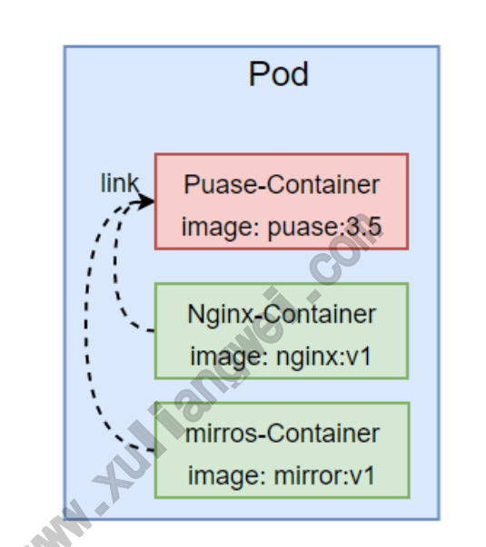
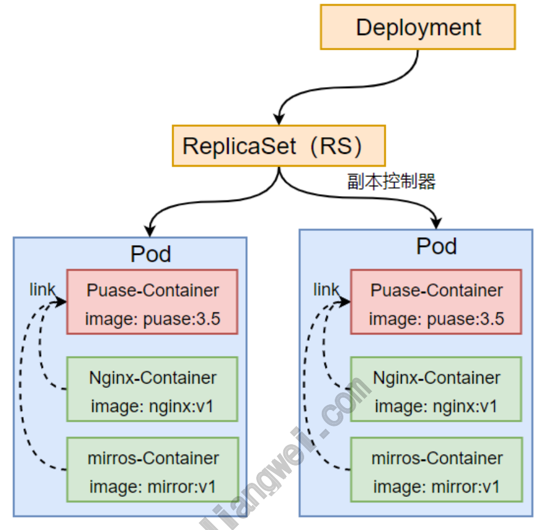
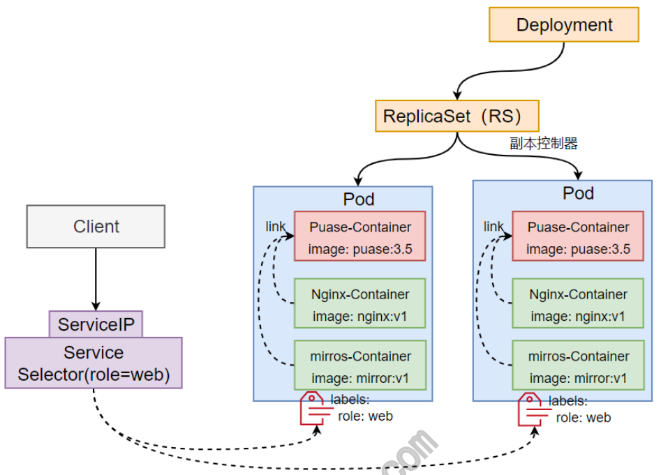
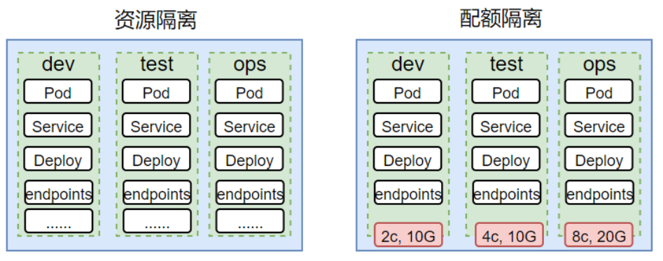

# 02 Kubernetes资源与对象

## 目录

- [1.Kubernetes资源介绍](#1.kubernetes资源介绍)
  - [1.1 Pod](#1.1-pod)
  - [1.2 Deployment](#1.2-deployment)
  - [1.3 Service](#1.3-service)
  - [1.5 Namespace](#1.5-namespace)
- [2.Kubernetes资源实践](#2.kubernetes资源实践)
  - [2.1 部署应⽤](#2.1-部署应)
  - [2.2 访问应⽤](#2.2-访问应)
  - [2.3 Scale应⽤](#2.3-scale应)
  - [2.4 滚动更新](#2.4-滚动更新)
  - [2.5 应⽤回滚](#2.5-应回滚)
- [1 <none>](#1-none)
- [3.Kubernetes对象](#3.kubernetes对象)
  - [3.1 什么是对象](#3.1-什么是对象)
  - [3.2 对象规范与状态](#3.2-对象规范与状态)
  - [3.3 理解对象](#3.3-理解对象)
  - [3.4 对象必须字段](#3.4-对象必须字段)
  - [3.5 如何创建对象](#3.5-如何创建对象)
- [4.Kubernetes对象实践](#4.kubernetes对象实践)
  - [4.1 Images](#4.1-images)
  - [4.2 imagePullPolicy](#4.2-imagepullpolicy)
  - [4.3 ImagePullSecrets](#4.3-imagepullsecrets)
  - [4.4 env](#4.4-env)
    - [192.168.104.37 node2 <none>](#192.168.104.37-node2-none)
  - [4.5 command与args](#4.5-command与args)
- [1.准备⼀个nginx镜像演示command与args的作⽤](#1.准备个nginx镜像演示command与args的作)
  - [4.6 ports](#4.6-ports)

ImagePullSecrets

## 1.Kubernetes资源介绍

### 1.1 Pod

容器都是由镜像启动的，但在容器外⾯会包裹通过Pod将容器包裹起来， 这个是K8s的概念，在这个Pod⾥⾯可以有⼀个或多个容器，那这个Pod 的有什么特征呢 Pod⾥的所有容器都会调度在同⼀个节点上运⾏， Pod中的所有容器会共享同⼀⽹络，它们有⼀个唯⼀的IP，就叫 PodIP； Pod中还有⼀个特殊的容器叫Pause，它会优先启动然后进⾏IP分 配，⽽后将其他容器都link到该容器上，实现⽹络共享



### 1.2 Deployment

在Pod的上⼀层就是ReplicaSet控制器，它主要负责管理Pod的副本 数，但通常我们并不直接使⽤ReplicaSet，⽽是使⽤⽐ReplicaSet更 ⾼⼀级的Deployment。由Deployment管理ReplicaSet，它会⾃动帮 我们创建和销毁RS，有了Deployment就可以实现应⽤的滚动更新。



### 1.3 Service

Service，是Kubernetes⽤来实现Pod负载均衡的⼀个服务；要想实现 Pod的负载均衡，⾸先需要通过labels为Pod打上特定的标签，⽽后创建 Service时使⽤Selector选择对应的标签，最终通过节点的kube- proxy来完成负载均衡的规则创建。



### 1.5 Namespace

在 Kubernetes 中，名字空间（Namespace）提供⼀种机制，将同⼀ 集群中的资源划分为相互隔离的组。 同⼀名字空间内的资源名称要唯 ⼀，但跨名字空间时没有这个要求。 对资源对象进⾏隔离：⽐如：Pod、Deployment、Service、将其 划分为相互隔离的组。 对资源配额进⾏隔离：CPU，Memory ，限制某个NS的可以使⽤的 cpu和内存；



namespace仅能隔离带有名称空间的资源，⽽不带名称空间的资源不⽀ 持隔离，可以通过 kubectl api-resources 查看哪些资源属于名称 空间级别，哪些不属于名称空间级别。 1、查看命名空间 www.xuliangwei.com # kubectl get namespace 2、创建命名空间 # kubectl create namespace dev # kubectl create deployment nginx !"replicas=3 !" namespace=dev # kubectl get namespace -n dev # kubectl get namespace -n dev !"all 3、测试命名空间隔离性 测试不同名称空间的ServiceIP隔离； 测试不同名称空间的PodIP⽹络的隔离； 测试不同名称空间的DNS隔离； NameSpace隔离其实就是名称的隔离，并不是物理的隔离，所以重点在 于资源隔离 4、命名空间划分

按业务划分：shoping、edu 按环境划分：dev、prod 按团队划分：

## 2.Kubernetes资源实践

通过部署应⽤来理解Kubernetes中的资源

### 2.1 部署应⽤

```
[root@master demoapp]# cat demoapp-deploy.yaml apiVersion: apps/v1 kind: Deployment www.xuliangwei.com metadata: name: demoapp-deploy labels: app: demoapp-deploy spec: replicas: 3         # Pod的副本数量 selector: matchLabels: app: demoapp    # deploy控制器选择哪个Pod的标签 template: metadata: labels: app: demoapp    # Pod的标签 spec: containers:

- name: demoapp-container   # 容器的名称

image: oldxu3957/demoapp:v1.1 ports:
```
- name: http            # 指定提供端⼝的名称

```
containerPort: 80     # 容器提供的端⼝

protocol: TCP

应⽤配置⽂件 [root@master demoapp]# kubectl apply -f demoapp- deploy.yaml

查看Pod [root@master demoapp]# kubectl get pod NAME READY STATUS RESTARTS AGE demoapp-deploy-9d4df5b44-82xqq 1/1 Running 0 3s demoapp-deploy-9d4df5b44-bgqsp 1/1 Running 0 4s www.xuliangwei.com demoapp-deploy-9d4df5b44-pm8m5 1/1 Running 0 3s
```
### 2.2 访问应⽤

```
[root@master demoapp]# cat demoapp-service.yaml apiVersion: v1 kind: Service metadata: name: demoapp-service spec: selector: app: demoapp        # service控制器选择哪些Pod的标 签 ports:

- name: demoapp-http

port: 80           # service的端⼝ targetPort: 80      # 容器的端⼝
```
type: NodePort        # 使⽤Node节点随机暴露⼀个端⼝对 外提供服务

```
应⽤service配置⽂件 [root@master demoapp]# kubectl apply -f demoapp- service.yaml

查看service资源 [root@master demoapp]# kubectl get service NAME TYPE CLUSTER-IP EXTERNAL-IP PORT(S) AGE demoapp-service NodePort 10.96.201.250 <none> 8888:30425/TCP 5s www.xuliangwei.com
```
### 2.3 Scale应⽤

```
[root@master demoapp]# cat demoapp-deploy.yaml apiVersion: apps/v1 kind: Deployment metadata: name: demoapp-deploy labels: app: demoapp-deploy spec: replicas: 3 selector: matchLabels: app: demoapp template: metadata: name: demoapp

labels: app: demoapp spec: containers:

- name: demoapp-container

image: oldxu3957/demoapp:v1.1 ports:

- name: http

containerPort: 80 protocol: TCP
```
### 2.4 滚动更新

所谓滚动更新，更新的是镜像，使⽤新的镜像逐步更新Pod，回退也是⼀ 样的。但对于⽤户⽽⾔是⽆感知 1.应⽤升级：demoapp:v1.0 升级为 demoapp:v1.1 # set image 设定容器的镜像属性，deploy/demoapp 针对哪个 部署的名字进⾏设定 # !"record  记录更新的变化详细内容，便于后续的回退

```
[root@master ~]# kubectl set image deploy/demoapp *=oldxu3957/demoapp:v1.1 !"record

查看升级过程 [root@master ~]# kubectl rollout status deploy/demoapp

查看升级后的⽇志 [root@master ~]# kubectl describe deploy demoapp deployment-controller Scaled up replica set demoapp-7d768c76b5 to

deployment-controller  Scaled up replica set demoapp-7d768c76b5 to 2 deployment-controller  Scaled down replica set demoapp-74c6c44f58 to 2 deployment-controller  Scaled down replica set demoapp-74c6c44f58 to 1 deployment-controller  Scaled up replica set demoapp-7d768c76b5 to 3 deployment-controller  Scaled down replica set demoapp-74c6c44f58 to

检查rs [root@master ~]# kubectl get rs NAME DESIRED CURRENT READY AGE www.xuliangwei.com demoapp-74c6c44f58 0 0 0 46m demoapp-7d768c76b5 3 3 3 11m

检查Pod [root@master ~]# kubectl get pod NAME READY STATUS RESTARTS AGE demoapp-7d768c76b5-m9hzw 1/1 Running 0 37s demoapp-7d768c76b5-ptqsc 1/1 Running 0 38s demoapp-7d768c76b5-zmfdc 1/1 Running 0 36s 2、查看升级结果
```
### 2.5 应⽤回滚

1.查看升级历史记录

```
[root@master ~]# kubectl rollout history deployment deployment.apps/demoapp REVISION  CHANGE-CAUSE
```
## 1         <none>

```
2         kubectl set image deploy/demoapp *=oldxu3957/demoapp:v1.1 !"record=true

[root@master ~]# kubectl rollout undo deploy demoapp !"to-revision=1

查看pod [root@master ~]# kubectl get pod www.xuliangwei.com NAME READY STATUS RESTARTS AGE demoapp-74c6c44f58-5w6d9 1/1 Running 0 25s demoapp-74c6c44f58-6rcrl 1/1 Running 0 28s demoapp-74c6c44f58-vfzhf 1/1 Running 0 26s

查看RS [root@master ~]# kubectl get rs NAME DESIRED CURRENT READY AGE demoapp-74c6c44f58 3 3 3 49m demoapp-7d768c76b5 0 0 0 15m
```
## 3.Kubernetes对象

### 3.1 什么是对象

在Kubernetes系统中，我们所操作的资源就是对象，⽽对象是⼀个持久 化的实体，也就是说会将我们对资源的操作记录下来。 Kubernetes需 要使⽤这些实体来表示整个集群的状态。它们描述了如下信息： 哪些容器化应⽤在运⾏，以及这些应⽤运⾏在哪些节点上 应⽤程序可以被使⽤的资源 应⽤程序运⾏时的策略，⽐如重启策略、升级策略，以及容错策略 Kubernetes对象是⽬标性记录，也就是说⼀旦创建对象，Kubernetes 系统将持续⼯作以确保该对象存在，并达到⽤户所期望的状态。⼀旦我们 想要操作 Kubernetes 对象，⽆论是创建、修改，或者删除，都需要使 ⽤到 Kubernetes API 接⼝。 www.xuliangwei.com

### 3.2 对象规范与状态

Kubernetes⼏乎每个对象都包含两个嵌套的对象字段，对象 spec（规 范）和对象 status（状态）。 spec：是在创建该对象时设定其内容，通过spec来描述你希望对象 所具有的特征：期望状态（Desired State）。 status 描述了对象的 当前状态（Current State），它是由 Kubernetes 系统和组件设置并更新的。 任何时刻，Kubernetes控制平⾯都⼀直积极地管理着对象的实际状态， 以使之与期望状态相匹配。 例如，Kubernetes 中的 Deployment 对象能够表示运⾏在集群中的 应⽤。当创建 Deployment 时，可能需要设置 Deployment 的 spec，⽤于指定该应⽤需要有 3 个副本运⾏。 Kubernetes 系统读 取 Deployment 规范，并启动我们所期望的应⽤的 3 个实例，更新当 前状态以与规范中期望状态橡⽪匹配。如果这些实例中有的失败了（⼀种 状态变更），Kubernetes系统通过执⾏修正操作来响应spec与status 状态间出现的不⼀致，可能会启动⼀个新的实例来替换失败的实例。

### 3.3 理解对象

创建 Kubernetes 对象时，必须提供对象的spec（规范），⽤来描述 该对象的期望状态，以及对象的⼀些基本信息（例如名称）。使 ⽤kubectl创建资源对象时，请求Kubernetes API必须在请求体中包 含 JSON 格式的信息。 但⼤多数情况下我们都是使⽤的YAML格式来创 建资源，所以只需要在YAML格式⽂件中描述对应的spec规范。 在kubectl发起 API 请求时，会将这些信息转换成 JSON 格式。 这⾥有⼀个 .yaml 示例⽂件，展示了 Kubernetes Deployment 创 建时的必需字段和对象spec规范： `apiVersion`: apps/v1 `kind`: Deployment www.xuliangwei.com `metadata`: name: nginx-deployment `spec`: selector: matchLabels: app: nginx replicas: 2     # 告诉Deployment运⾏2个匹配的Pod template: metadata: labels: app: nginx spec: containers:

```
- name: nginx

image: nginx:1.14.2 ports:

- containerPort:
```
接下来就可以通过kubectl应⽤该⽂件，然后kubectl会将该⽂件转为 json提交给Kubernetes API

### 3.4 对象必须字段

在想要创建的 Kubernetes 对象对应的 .yaml ⽂件中，需要配置如 下的字段： apiVersion - 创建该对象所使⽤的 Kubernetes API 的版本 kind - 想要创建的对象的类别，pod，deployment，service metadata - 标识对象唯⼀性的⼀些数据，包括⼀个 name 字符 串、UID 和可选的 namespace spec - 你所期望的该对象的状态

### 3.5 如何创建对象

```
kubectl create my-nginx !"image=nginx www.xuliangwei.com kubectl get pod my-nginx -o yaml kubectl create my-nginx !"image=nginx -dry-run -o yaml  ⼲跑⼀次
```
## 4.Kubernetes对象实践

### 4.1 Images

运⾏⼀个Pod，必须填写Images字段，拉取对应版本的镜像； spec: containers:

```
- name: demoapp-container   # 容器的名称

image: oldxu3957/demoapp:v1.1 # 容器的镜像版本
```
### 4.2 imagePullPolicy

imagePullPolicy 容器的镜像拉取策略

IfNotPresent：本地有镜像则使⽤本地镜像，本地不存在则拉取 镜像。（默认值） Always：每次都会尝试拉取镜像。 Never：永不拉取，如果镜像已经存在本地，kubelet 会尝试启动 容器；否则，会启动失败。 spec: containers:

```
- name: demoapp-container   # 容器的名称
```
image: registry.cn- huhehaote.aliyuncs.com/oldxu3957/demoapp:v1.1  # 容 器的镜像版本 imagePullPolicy: Always # 指定容器镜像拉取策略 www.xuliangwei.com 默认镜像拉取策略 当你（或控制器）向 API 服务器提交⼀个新的 Pod 时，你的集群会在满⾜特定条件时设置 imagePullPolicy 字段 如果你省略了 imagePullPolicy 字段，并且容器镜像的标签是 :latest， imagePullPolicy 会⾃动设置为 Always。如果你省略 了 imagePullPolicy 字段，并且没有指定容器镜像的标签， imagePullPolicy 会⾃动设置为 Always。 如果你省略了 imagePullPolicy 字段，并且为容器镜像指定了⾮ :latest 的标 签， imagePullPolicy 就会⾃动设置为 IfNotPresent。

### 4.3 ImagePullSecrets

ImagePullSecrets 拉取私有仓库中的镜像 1.创建⼀个 Pod 资源，拉取⼀个私有仓库镜像，在不添加 ImagePullSecrets 时，验证是否能正常拉取镜像 [root@master ~]# cat nginx_demo.yaml apiVersion: v1 kind: Pod metadata:

```
name: nginx-demo namespace: default

spec: containers:

- name: nginx-demo-container

image: registry.cn- huhehaote.aliyuncs.com/oldxu3957/nginxdemo:latest  # 私有镜像 imagePullPolicy: IfNotPresent ports:

- containerPort:

2.检查Pod状态，发现Pod状态为ErrImagePull， 通过 describe www.xuliangwei.com 描述，发现需要 docker login 后才能下载镜像 [root@master ~]# kubectl get pod NAME                              READY   STATUS RESTARTS   AGE nginx-demo                        0/1 ErrImagePull   0          6s

[root@master ~]# kubectl describe pod nginx-demo Events: Type     Reason     Age               From Message ----     ------     ----              ---- ------- Normal   Scheduled  22s               default- scheduler  Successfully assigned default/nginx-demo to node1

Normal   BackOff    19s               kubelet Back-off pulling image "registry.cn- huhehaote.aliyuncs.com/oldxu3957/nginxdemo:latest" Warning  Failed     19s               kubelet Error: ImagePullBackOff Normal   Pulling    8s (x2 over 21s)  kubelet Pulling image "registry.cn- huhehaote.aliyuncs.com/oldxu3957/nginxdemo:latest" Warning  Failed     7s (x2 over 20s)  kubelet Failed to pull image "registry.cn- huhehaote.aliyuncs.com/oldxu3957/nginxdemo:latest": rpc error: code = Unknown desc = Error response from daemon: pull access denied
for registry.cn- huhehaote.aliyuncs.com/oldxu3957/nginxdemo, www.xuliangwei.com repository does not exist or may require 'docker login': denied: requested access to the resource is denied Warning  Failed     7s (x2 over 20s)  kubelet Error: ErrImagePull 3.创建⼀个名为 aliyun 的 secret 资源，然后配置对应仓库的⽤户 名称以及密码 [root@master ~]# kubectl create secret docker- registry aliyun !"docker-username=552408925@qq.com - -docker-password=123456 !"docker-server registry.cn- huhehaote.aliyuncs.com 4.修改 Pod 资源清单，添加 ImagePullSecrets 传⼊对应的 Secrets 资源名称 [root@master ~]# cat nginx_demo.yaml apiVersion: v1

kind: Pod metadata: name: nginx-demo namespace: default

spec: imagePullSecrets:   # 增加 imagePullSecrets 字段，传 ⼊对应资源的名称

- name: aliyun

containers:

- name: nginx-demo-container

image: registry.cn- huhehaote.aliyuncs.com/oldxu3957/nginxdemo:latest imagePullPolicy: IfNotPresent www.xuliangwei.com ports:

- containerPort:
```
### 4.4 env

使⽤ env 控制容器环境变量 1.准备⼀个mysql镜像，然后通过env传⼊对应的登录密码，同时创建⼀ 个默认的 k8s 数据库： [root@master ~]# cat /tmp/mysql-demo.yaml apiVersion: v1 kind: Pod metadata: name: mysql-demo spec: containers:

```
- name: mysql-demo

image: mysql:5.7.37

env:

- name: MYSQL_ROOT_PASSWORD
```
value: "oldxu3957"    # 定义变量对应的值，该值后期 相当于定义了系统环境变量，后期需要可以调⽤

```
- name: MYSQL_DATABASE

value: "k8s"

[root@master ~]# kubectl get pod -o wide NAME        READY  STATUS   RESTARTS  AGE     IP NODE    NOMINATED NODE   READINESS mysql-demo  1/1    Running  0        4m52s
```
#### 192.168.104.37 node2   <none>

3.通过本机 mysql client 尝试连接服务，验证密码是否传⼊成功， 以及对应的 k8s 数据库是否建⽴ # 密码 oldxu3957 正常登录数据库服务，同时也为我们创建了 k8s库 [root@master ~]# mysql -h 192.168.104.37 -uroot - poldxu3957 Server version: 5.7.37 MySQL Community Server (GPL)

```
MySQL [(none)]> show databases; +--------------------+ | Database           | +--------------------+ | information_schema | | k8s                | | mysql              | | performance_schema | | sys                |

+--------------------+ 5 rows in set (0.00 sec)
```
### 4.5 command与args

command: 为容器指定启动命令，会覆盖容器启动的默认命令，不 指定则默认容器的启动命令 args：为命令提供选项或参数；

## 1.准备⼀个nginx镜像演示command与args的作⽤

```
container:

- images: nginx

name: nginx www.xuliangwei.com command:            # 命令

- /bin/bash         # 参数

- -c

- "echo $(msg);sleep 600;"

env:

- name: msg

value: "Hello Oldxu" 2.场景，在K8s中运⾏Redis主从复制； 启动 Redis Master 镜像 启动 Redis Slave 镜像，通过 command 与 args 重新修改镜 像启动指令，完成主从复制； # 1.启动Redis Master [root@master ~]# cat redis-leader.yaml apiVersion: v1 kind: Pod metadata: name: redis-leader

labels: role: leader spec: containers:

- name: redis-leader

image: redis ports:

- containerPort: 6379

2.为了slave能正常连接Master节点，必须明确拿到 Redis- Master 的IP地址 [root@master ~]# kubectl get pod -o wide NAME READY STATUS RESTARTS AGE IP NODE www.xuliangwei.com redis-leader 1/1 Running 0 23m

3.启动Redis Slave （通过command和args⽅式覆盖镜像的默 认启动命令） [root@master ~]# cat /tmp/redis-slave.yaml apiVersion: v1 kind: Pod metadata: name: redis-slave labels: role: slave spec: containers:

- name: redis-slave

image: redis command: ["redis-server"]       # 设定镜像启动命令 args:                 # 设定镜像启动参数

- !"port 6380

- !"slaveof 192.168.166.160 6379    # 该IP为
```
Master的IP，仅为演示command与args作⽤ ports:

```
- containerPort: 6380

#4.检查Redis Slave [root@master ~]# kubectl get pod -o wide NAME      READY   STATUS    RESTARTS   AGE     IP NODE redis-slave   1/1     Running   0          2m

#5.检查Redis主从复制是否正常； [root@master ~]# redis-cli -h 192.168.166.160 info |grep -A 8 Replication # Replication role:master connected_slaves:1 slave0:ip=192.168.166.169,port=6380,state=online,off set=84,lag=0  # 有⼀个Slave节点正常连接 master_failover_state:no-failover master_replid:1ffad09e4c4b94d0645fe7ee58146a3797edaa 8d master_replid2:0000000000000000000000000000000000000 000 master_repl_offset:84 second_repl_offset:-1
```
#6.往Master写⼊数据，测试Slave是否能正常同步

```
[root@master ~]# redis-cli -h 192.168.166.160 -p

OK [root@master ~]# redis-cli -h 192.168.166.169 -p

"oldxu"
```
### 4.6 ports

ports ⽤于暴露 pod 对外访问的端⼝，如不指定，则⽆法通过 PodIP + PodPort 访问该应⽤ containerPort <integer> -required-: 填写Pod对外暴露的 端⼝（0~65535） www.xuliangwei.com name <string!# 为端⼝指定⼀个名称，当服务存在多个端⼝，可 以通过名称区分； protocol <string>：指定端⼝对应的协议，有TCP，UDP， SCTP，默认不写为TCP； 1.创建⼀个Redis应⽤，不指定Ports，验证能否正常提供服务 [root@master ~]# cat  /tmp/redis.yaml apiVersion: v1 kind: Pod metadata: name: redis-port spec: containers:

```
- name: redis-port

image: redis
```
通过redis-cli命令连接测试，发现连接失败 [root@master ~]# redis-cli 192.168.104.40

```
Could not connect to Redis at 127.0.0.1:6379: Connection refused 2.修改yaml配置⽂件，增加Ports字段 [root@master ~]# cat /tmp/redis.yaml apiVersion: v1 kind: Pod metadata: name: redis-port spec: containers:

- name: redis-port

image: redis www.xuliangwei.com ports:              # 增加Ports字段

- name: port

containerPort: 6379 protocol: TCP

重新通过redis-cli命令连接测试 [root@master ~]# redis-cli -h 192.168.104.41 192.168.104.41:6379> set name oldxu OK 192.168.104.41:6379> get name "oldxu" 192.168.104.41:6379>
```
