# 03 Kubernetes资源Pod

## 目录

- [1.Pod基本概述](#1.pod基本概述)
  - [1.1 什么是Pod](#1.1-什么是pod)
  - [1.2 为什么需要Pod](#1.2-为什么需要pod)
- [2、提供ssh、ftp访问容器数据的能⼒](#2提供sshftp访问容器数据的能)
- [4、提供软件发⾏版仓库](#4提供软件发版仓库)
  - [1.3 Pod共享⽹络](#1.3-pod共享络)
  - [1.4 Pod共享存储](#1.4-pod共享存储)
- [2.Pod管理⽅式](#2.pod管理式)
  - [2.1 ⾃主式管理Pod](#2.1-主式管理pod)
  - [2.2 控制器管理Pod](#2.2-控制器管理pod)
- [3.Pod运⾏应⽤](#3.pod运应)
  - [3.1 创建Pod应⽤](#3.1-创建pod应)
  - [3.2 Pod运⾏阶段](#3.2-pod运阶段)
  - [3.3 容器运⾏阶段](#3.3-容器运阶段)
  - [3.4 阶段状态实践](#3.4-阶段状态实践)
- [1、模拟Pod状态为Pending、⽽容器状态为waiting](#1模拟pod状态为pending容器状态为waiting)
- [2、模拟Pod状态为Running、⽽容器状态为waiting](#2模拟pod状态为running容器状态为waiting)
- [4.Pod运⾏应⽤对应字段](#4.pod运应对应字段)
  - [4.1 容器镜像拉取策略](#4.1-容器镜像拉取策略)
  - [4.2 获取私有仓库镜像](#4.2-获取私有仓库镜像)
  - [4.3 ⾃定义容器环境变量](#4.3-定义容器环境变量)
    - [192.168.104.37 node2 <none>](#192.168.104.37-node2-none)
  - [4.4 ⾃定义容器命令与参数](#4.4-定义容器命令与参数)
- [1.准备⼀个nginx镜像演示command与args的作⽤](#1.准备个nginx镜像演示command与args的作)
  - [4.5 ⾃定义容器端⼝](#4.5-定义容器端)
- [5.Pod重启策略](#5.pod重启策略)
  - [5.1 Always](#5.1-always)
- [1 (5s ago) 3m23s](#1-5s-ago-3m23s)
- [2 (10s ago) 6m7s](#2-10s-ago-6m7s)
  - [5.2 Never](#5.2-never)
  - [5.3 OnFailure](#5.3-onfailure)
- [1 (43s ago) 11m](#1-43s-ago-11m)
- [6.Pod⽣命周期](#6.pod命周期)
  - [6.1 什么是⽣命周期](#6.1-什么是命周期)
  - [6.2 ⽣命周期流程](#6.2-命周期流程)
  - [6.3 ⽣命周期总结](#6.3-命周期总结)
- [7.Init Container](#7.init-container)
  - [7.1 基本概念](#7.1-基本概念)
  - [7.2 应⽤场景](#7.2-应场景)
  - [7.3 场景实践-1](#7.3-场景实践-1)
  - [7.4 场景实践-2](#7.4-场景实践-2)
- [8.Pod Hook](#8.pod-hook)
  - [8.1 两种钩⼦](#8.1-两种钩)
  - [8.2 钩⼦示例](#8.2-钩示例)
  - [8.3 场景实践-1](#8.3-场景实践-1)
  - [8.4 场景实践-2](#8.4-场景实践-2)
- [9.Pod检测探针](#9.pod检测探针)
  - [9.1 为何需要探针](#9.1-为何需要探针)
  - [9.2 探针探测类型](#9.2-探针探测类型)
  - [9.3 探针检查机制](#9.3-探针检查机制)
  - [9.4 探针配置格式](#9.4-探针配置格式)
- [10.startupProbe](#10.startupprobe)
  - [10.1 exec](#10.1-exec)
  - [10.2 httpGet](#10.2-httpget)
  - [10.3 tcpSocket](#10.3-tcpsocket)
- [11.livenessProbe](#11.livenessprobe)
  - [11.1 exec](#11.1-exec)
  - [11.2 httpGet](#11.2-httpget)
  - [11.3 tcpSocket](#11.3-tcpsocket)
- [12.readinessProbe](#12.readinessprobe)
  - [12.1 exec](#12.1-exec)
  - [12.2 httpGet](#12.2-httpget)
  - [12.3 tcpSocket](#12.3-tcpsocket)

## 1.Pod基本概述

### 1.1 什么是Pod

Pod是Kubernetes中的抽象概念，也是Kubernetes中的最⼩部署单 元。在每个Pod中⾄少包含⼀个容器或多个容器，这些容器共享 Network（⽹络）、PID（进程）、IPC（进程间通信）、 HostName（主机名称）、Volume（卷）。当我们需要部署应⽤时，其 实就是在部署Pod，Kubernetes会将Pod中所有的容器作为⼀个整体， 由Master调度到⼀个Node上运⾏。

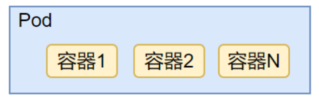

### 1.2 为什么需要Pod

有些容器关系⽐较紧密，必须要再⼀起⼯作。Pod提供了⽐容器更⾼层次 的抽象，将它们封装到⼀个部署单元中进⾏调度，从⽽达到⼀起部署、⼀ 起管理。 1、业务服务需要收集⽇志

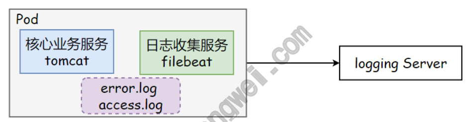

服务模块已经实现了⼀些核⼼的业务逻辑，并且稳定运⾏了⼀段时间，⽇ 志记录在了某个⽬录下，按照不同类别分别为 error.log、 access.log，现在希望收集这些⽇志并发送到统⼀的⽇志处理服务器 上。 这时我们可以修改原来的服务模块，在其中添加⽇志收集、发送的服务， 但这样可能会影响原来服务的配置、部署⽅式，从⽽带来不必要的问题和 成本，也会增加业务逻辑和基础服务的藕合度。 如果使⽤Pod的⽅式，通过简单的编排，既可以保持原有服务逻辑、部署 ⽅式不变，⼜可以增加新的⽇志收集服务。⽽且如果我们对所有服务的⽇ 志⽣成有⼀个统⼀的标准，或者仅对⽇志收集服务稍加修改，就可以将⽇ 志收集服务和其他服务进⾏Pod编排，提供统⼀、标准的⽇志收集⽅式。

## 2、提供ssh、ftp访问容器数据的能⼒

Docker Hub或者很多第三⽅的镜像并没有安装sshd的服务，不⽅便我 们进⼊容器进⾏配置、代码的修改、调试，很多时候需要重新构建镜像、 或者在镜像基础上安装sshd的服务，这都需要时间和⼀定的学习成本。 ⽽通过Pod的⽅式，我们就可以将现有镜像和⼀个ssh、ftp镜像进⾏编 排，获得操作容器内数据的能⼒。

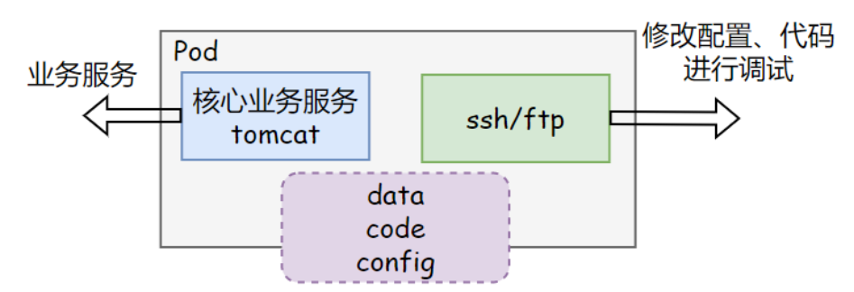

3、适配不同IaaS平台的环境 ⽐如开发了⼀个节点管理agent程序，这个agent需要读取当前部署环境 的⼀些信息，可以通过底层平台的API实现。但是，当部署到AWS、阿⾥ 云、⻘云等不同平台时，API就⽆法统⼀了。 但是我们可以运⾏⼀个适配各平台的服务⽤来获取不同平台的相关信息， 然后通过Pod编排部署，在不改变agent逻辑的情况下，通过服务组合来 适配于不同平台。

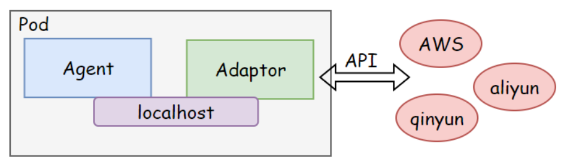

## 4、提供软件发⾏版仓库

⼀个Nginx容器⽤来发布软件，另⼀个容器专⻔⽤来从源仓库做同步，这 两个容器的镜像不太可能是⼀个团队开发的，但是他们⼀块⼉⼯作才能提 供⼀个微服务；所以需要将这些位于同⼀Pod内的容器形成单个服务对外 提供，⼀个容器将共享卷获取的数据提供给⽤户， ⽽另⼀个容器（边⻋ sidecar）则不断更新⽂件到共享卷中来。 通过这种⽅式，就可以将来⾃不同团队的容器镜像，在部署的时候组合成 ⼀个微服务对外提供服务。

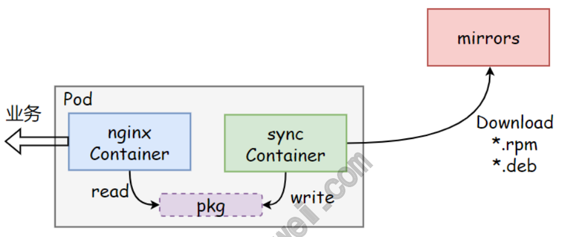

Kubernetes 的⼀些新的功能需求，也会建议先通过Pod的编排来解 决，⽽不是直接修改业务代码，可⻅Pod还是⾮常有⽤的。

### 1.3 Pod共享⽹络

在Docker中，如果tomcat容器想与mysql容器进⾏共享，需要先启动 mysql容器，然后tomcat容器通过!"net=db:mysql选项即可和 mysql共享⽹络，这也就意味着我们必须先运⾏mysql，后运 ⾏tomcat，才可以实现共享⽹络。 在Kubernetes中，Pod的⽹络共享和Docker的⽹络共享实现⽅式⼀致， 只不过在启动Pod时，会先启动⼀个pause的容器，然后将后续的所有容 器都!"link到这个pause的容器，以实现⽹络共享。

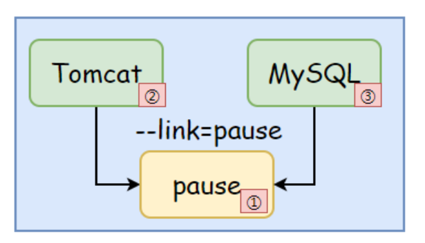

通过上图我们可以得出如下结论： 1、Pod中的Tomcat容器可以直接使⽤ localhost 与MySQL容器 进⾏通信； 2、Pod中的多个容器不允许绑定相同的端⼝，因为所有容器共享⽹ 络协议栈，看到的⽹络信息⼀致； www.xuliangwei.com

### 1.4 Pod共享存储

默认情况下所有容器的⽂件系统是互相隔离的，要实现⽂件共享则需要 在Pod层⾯声明⼀个Volume卷，然后在需要共享的容器中声明 VolumeMounts 来挂载⽂件系统，从⽽达到多个容器共享⼀个存储卷。

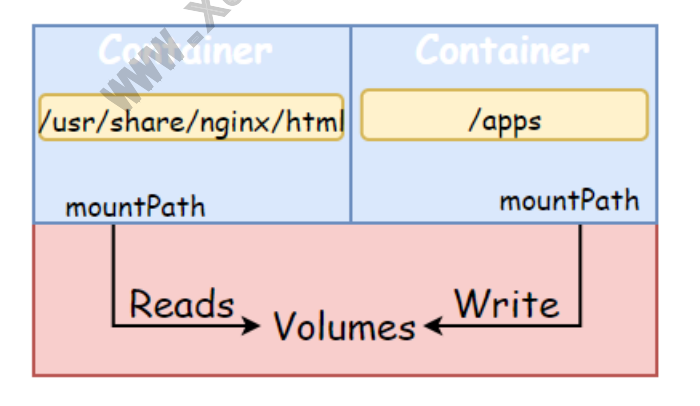

```
示例代码演示（多容器Pod） [root@master ~]# cat pod_mutil.yaml apiVersion: v1

kind: Pod metadata: name: pod-mutil spec: volumes:              # 申明Volumes共享卷

- name: webpage         # 卷名称

emptyDir: {}          # 卷类型

containers:

- name: random-app        # 产⽣内容写⼊

/apps/index.html ⽂件中 image: busybox command: ['/bin/sh','-c','echo "web-$(date +%F)" !# /apps/index.html !$  sleep 30'] www.xuliangwei.com volumeMounts:

- name: webpage

mountPath: /apps
```
- name: nginx-app         # 第⼆个容器读取第⼀个容器产

⽣的内容，对外提供访问 image: nginx volumeMounts:

```
- name: webpage

mountPath: /usr/share/nginx/html
```
## 2.Pod管理⽅式

### 2.1 ⾃主式管理Pod

在Kubernetes中，我们部署pod的时候，基本上都是使⽤控制器管理， 那如果不使⽤控制器，也可以直接定义⼀个pod资源，那么就是pod⾃⼰ 去控制⾃⼰，这样的pod称为⾃主式pod。

如果Pod被删除，那就是真的被删除，不会重新在运⾏⼀个新的 Pod； 如果Pod所在的节点需要维护，那么节点会先执⾏驱逐，如果是⾃助 式Pod，驱逐后不会被重建。 如果Pod期望部署多个副本，这个也能实现，但如果想持续维持副本 数量，则需要⼈为参与，过于繁琐。 1、创建⼀个⾃主式Pod [root@k8s-master]# cat nginx-pod.yaml apiVersion: v1 kind: Pod metadata: name: nginx-pod spec: www.xuliangwei.com containers:

```
- name: nginx-container

image: nginx:1.16 ports:
```
2、测试删除Pod，验证是否能被彻底删除 [root@master ~]# kubectl delete pod nginx-pod 3、测试节点故障，当Pod所运⾏的节点故障，那么该Pod会被删除，不会 重新运⾏起来。 [root@master ~]# kubectl drain node01 !"ignore- daemonsets !"force   # 驱逐 [root@master ~]# kubectl uncordon node01 # 解除不可调度

### 2.2 控制器管理Pod

Kubernetes使⽤更⾼级的Controller的抽象层，来管理Pod实例。 Controller可以创建和管理多个Pod，提供副本管理、滚动升级和集群 级别的⾃愈能⼒。 例如，如果⼀个Node故障，Controller就能⾃动将该节点上的Pod调度 到其他健康的Node上。虽然可以直接使⽤Pod，但是在Kubernetes中通 常是使⽤Controller来管理Pod的。在Kubernetes中也将这些 Controller⼜称为⼯作负载

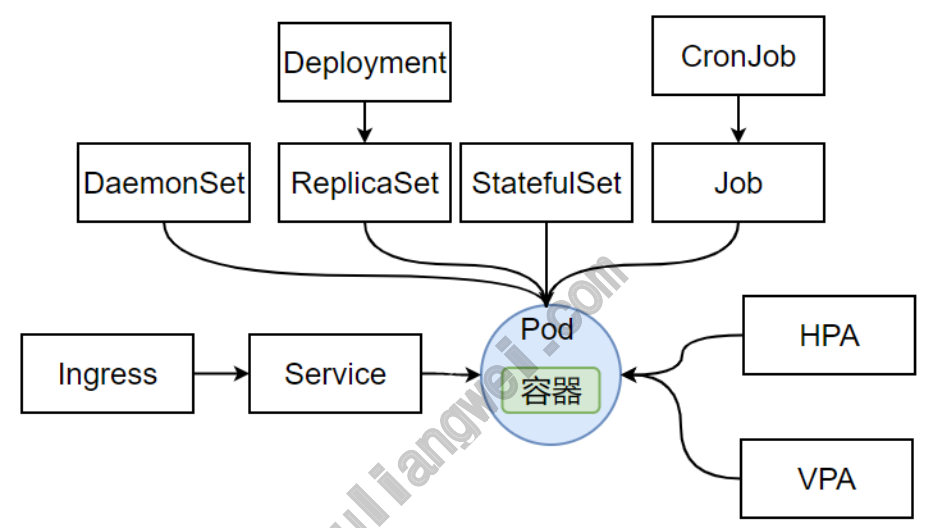

```
1、创建控制器管理的Pod [root@k8s-master]# cat nginx-dp.yaml apiVersion: apps/v1 kind: Deployment metadata: name: nginx-dp spec: replicas: 3 selector: matchLabels: app: nginx template:

metadata: labels: app: nginx spec: containers:

- name: nginx-container

image: nginx:1.16 2、测试删除Pod，会发现Pod被删除后，⽴即⼜启动了⼀个相同的Pod实 例。 # 查看 [root@master ~]# kubectl get pod |grep nginx-dp nginx-dp-6cd774b6f6-c9778     1/1     Running   0 www.xuliangwei.com 55s nginx-dp-6cd774b6f6-fbh8d     1/1     Running   0 55s nginx-dp-6cd774b6f6-rdssd     1/1     Running   0 55s

删除 [root@master ~]# kubectl delete pod nginx-dp- 6cd774b6f6-c9778 pod "nginx-dp-6cd774b6f6-c9778" deleted

验证 [root@master ~]# kubectl get pod |grep nginx-dp nginx-dp-6cd774b6f6-fbh8d 1/1 Running 0 82s nginx-dp-6cd774b6f6-rdssd 1/1 Running 0 82s nginx-dp-6cd774b6f6-vmmj7 1/1 Running 0 8s # 新启动的Pod
```
3、测试节点故障，会发现控制器管理的Pod会在其他没有故障的节点上 重新启动⼀份实例，以维持副本数量。 [root@master ~]# kubectl drain node01 !"ignore- daemonsets !"force   # 驱逐 [root@master ~]# kubectl uncordon node01 # 解除不可调度

## 3.Pod运⾏应⽤

### 3.1 创建Pod应⽤

```
[root@k8s-master]# cat nginx-pod.yaml apiVersion: v1 kind: Pod metadata: name: nginx-pod       #Pod名称 spec: containers:

- name: nginx-container     # 容器名称

image: nginx:1.16     # 发布的镜像
```
### 3.2 Pod运⾏阶段

Pod 创建后，起始为 Pending 阶段，如果其中⾄少有⼀个主要容器正 常启动，则进⼊ Running。之后的状态取决于 Pod 中是否有容器运⾏ 失败或被管理员停⽌运⾏，从⽽会进⼊ Succeeded 或者 Failed 阶 段。

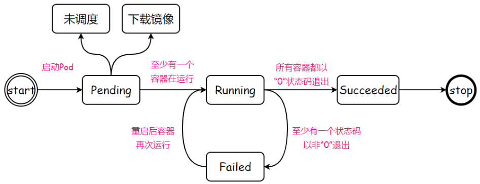

Pending：Pod 已被 Kubernetes 系统接受，但有⼀个或者多个 容器尚未创建亦未运⾏。此阶段包括等待 Pod 被调度的时间和通过 ⽹络下载镜像的时间。 Running：Pod已经绑定⾄某个节点，同时Pod中所有的容器都已创 建。⾄少有⼀个容器在运⾏，或处于启动、重启状态。 www.xuliangwei.com Succeeded：Pod中的所有容器都已成功终⽌，并且不会再重启。 Failed：Pod中的所有容器都已终⽌，并且⾄少有⼀个容器是因为 失败终⽌。也就是说，容器以⾮0状态退出或被系统终⽌ Unknown：因为某些原因⽆法取得 Pod 的状态。这种情况通常是 因为与 Pod 所在主机通信失败。 1、可以通过 kubectl describe pod <pod名称> 查看 PodStatus 对象中的Status，查看当前 Pod 所处的阶段 [root@master ~]# kubectl describe pod pod-onfailure Name:         pod-onfailure Namespace:    default Priority:     0 Node:         node03/10.0.0.206 Start Time:   Fri, 20 May 2022 14:56:58 +0800 Status:       Pending       # 当前 Pod 为 Running 状 态

如果某节点死掉或者与集群中其他节点失联，Kubernetes 会实施 ⼀种策略，将失去的节点上运⾏的 Pod 的 phase 设置为 Failed

```
[root@master ~]# kubectl describe pod pod-never Name:         pod-never Namespace:    default Priority:     0 Node:         node03/10.0.0.206 Start Time:   Fri, 20 May 2022 14:56:58 +0800 Status:       Failed      # 当前 Pod 为 Falied 状态 2、在PodStatus对象中还包含了⼀组 Conditions，它主要描述造成 当前 Status的具体原因。 [root@master test]# kubectl describe pod app-deploy- 6559666cf5-vcs74 !!% www.xuliangwei.com Conditions:           !& Pod状态信息 Type              Status PodScheduled      True    # Pod 已经成功被调度到了某 个节点上； Initialized       True    # Pod 中所有的 Init 容器 都已成功完成； ContainersReady   True    # Pod 中所有容器都已经处于 就绪状态； Ready             True    # Pod可以对外提供服务，并可 以加⼊对应的负载均衡中；
```
### 3.3 容器运⾏阶段

Kubernetes 会跟踪 Pod 中每个容器的状态，就像跟踪 Pod 阶段⼀ 样。Pod中运⾏的容器状态与Pod阶段是存在关联关系的，所以当Pod出 现故障时，将Pod的阶段状态和Pod中的容器状态结合起来查看，更容易 定位具体的问题。

⼀旦调度器将 Pod 分派给某个节点，kubelet 就通过 容器运⾏时 开 始为Pod创建容器。 容器的状态有三种：Waiting（等 待）、Running（运⾏中）和 Terminated（已终⽌）。容器状态官⽅ 站点

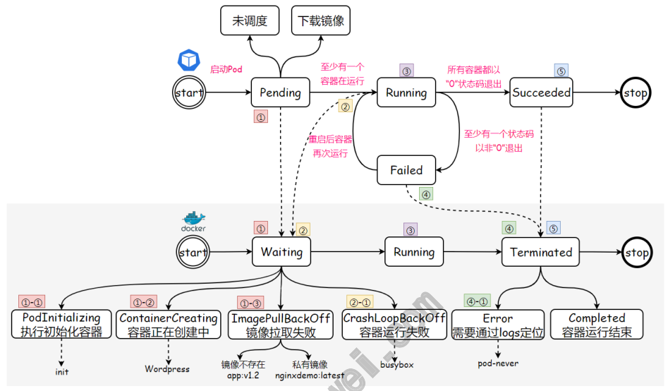

可以通过 kubectl describe pod <pod名称> 查看pod中的容器状 态

```
[root@master test]# kubectl describe pod app-deploy- 6559666cf5-vcs74 Containers:         !& 容器级别状态信息 app-container: Container ID: docker:!&74452e7bde4c7b1a244b707e4e6e3e4caddb3432159 dc2c5f2e9bd3553f0 Image:          oldxu3957/demoapp:v1.0 Image ID:       docker- pullable:!&oldxu3957/demoapp@sha256:6698b205eb18fb01 71398927f3a3 Port:           80/TCP Host Port:      0/TCP www.xuliangwei.com State:          Running   # 容器当前状态，除了 Running，还有Waiting、Terminated Started:      Thu, 19 May 2022 14:51:40 +0800 # 容器启动时间 Ready:          True              # 容器是否已经就 绪 Restart Count:  0               # 容器重启的次数 Environment:    <none>
```
### 3.4 阶段状态实践

## 1、模拟Pod状态为Pending、⽽容器状态为waiting

## 2、模拟Pod状态为Running、⽽容器状态为waiting

3、模拟Pod状态为Failed，⽽容器状态为Terminated

## 4.Pod运⾏应⽤对应字段

### 4.1 容器镜像拉取策略

imagePullPolicy 容器的镜像拉取策略 IfNotPresent：本地有镜像则使⽤本地镜像，本地不存在则拉取 镜像。（默认值） Always：每次都会尝试拉取镜像。 Never：永不拉取，如果镜像已经存在本地，kubelet 会尝试启动 容器；否则，会启动失败。 www.xuliangwei.com spec: containers:

```
- name: demoapp-container   # 容器的名称
```
image: oldxu3957/demoapp:v1.1 # 容器的镜像及版 本（必选字段） imagePullPolicy: Always # 指定容器镜像拉取策略 默认镜像拉取策略 当你（或控制器）向 API 服务器提交⼀个新的 Pod 时，你的集群会在满⾜特定条件时设置 imagePullPolicy 字段 如果你省略了 imagePullPolicy 字段，并且容器镜像的标签是 :latest， imagePullPolicy 会⾃动设置为 Always。如果你省略 了 imagePullPolicy 字段，并且没有指定容器镜像的标签， imagePullPolicy 会⾃动设置为 Always。 如果你省略了 imagePullPolicy 字段，并且为容器镜像指定了⾮ :latest 的标 签， imagePullPolicy 就会⾃动设置为 IfNotPresent。

### 4.2 获取私有仓库镜像

ImagePullSecrets 拉取私有仓库中的镜像 1.创建⼀个 Pod 资源，拉取⼀个私有仓库镜像，在不添加 ImagePullSecrets 时，验证是否能正常拉取镜像 [root@master ~]# cat nginx_demo.yaml apiVersion: v1 kind: Pod metadata: name: nginx-demo namespace: default

```
spec: containers: www.xuliangwei.com

- name: nginx-demo-container

image: registry.cn- huhehaote.aliyuncs.com/oldxu3957/nginxdemo:latest  # 私有镜像 imagePullPolicy: IfNotPresent ports:

2.检查Pod状态，发现Pod状态为ErrImagePull， 通过 describe 描述，发现需要 docker login 后才能下载镜像 [root@master ~]# kubectl get pod NAME                              READY   STATUS RESTARTS   AGE nginx-demo                        0/1 ErrImagePull   0          6s

[root@master ~]# kubectl describe pod nginx-demo Events:

Type     Reason     Age               From Message ----     ------     ----              ---- ------- Normal   Scheduled  22s               default- scheduler  Successfully assigned default/nginx-demo to node1 Normal   BackOff    19s               kubelet Back-off pulling image "registry.cn- huhehaote.aliyuncs.com/oldxu3957/nginxdemo:latest" Warning  Failed     19s               kubelet Error: ImagePullBackOff Normal   Pulling    8s (x2 over 21s)  kubelet Pulling image "registry.cn- www.xuliangwei.com huhehaote.aliyuncs.com/oldxu3957/nginxdemo:latest" Warning  Failed     7s (x2 over 20s)  kubelet Failed to pull image "registry.cn- huhehaote.aliyuncs.com/oldxu3957/nginxdemo:latest": rpc error: code = Unknown desc = Error response from daemon: pull access denied
for registry.cn- huhehaote.aliyuncs.com/oldxu3957/nginxdemo, repository does not exist or may require 'docker login': denied: requested access to the resource is denied Warning  Failed     7s (x2 over 20s)  kubelet Error: ErrImagePull 3.创建⼀个名为 aliyun 的 secret 资源，然后配置对应仓库的⽤户 名称以及密码

[root@master ~]# kubectl create secret docker- registry aliyun !"docker-username=552408925@qq.com - -docker-password=123456 !"docker-server registry.cn- huhehaote.aliyuncs.com 4.修改 Pod 资源清单，添加 ImagePullSecrets 传⼊对应的 Secrets 资源名称 [root@master ~]# cat nginx_demo.yaml apiVersion: v1 kind: Pod metadata: name: nginx-demo namespace: default www.xuliangwei.com

spec: imagePullSecrets:   # 增加 imagePullSecrets 字段，传 ⼊对应资源的名称

- name: aliyun

containers:

- name: nginx-demo-container

image: registry.cn- huhehaote.aliyuncs.com/oldxu3957/nginxdemo:latest imagePullPolicy: IfNotPresent ports:
```
### 4.3 ⾃定义容器环境变量

使⽤ env 控制容器环境变量 1.准备⼀个mysql镜像，然后通过env传⼊对应的登录密码，同时创建⼀ 个默认的 k8s 数据库：

```
[root@master ~]# cat /tmp/mysql-demo.yaml apiVersion: v1 kind: Pod metadata: name: mysql-demo spec: containers:

- name: mysql-demo

image: mysql:5.7.37 env:

- name: MYSQL_ROOT_PASSWORD
```
value: "oldxu3957"    # 定义变量对应的值，该值后期 相当于定义了系统环境变量，后期需要可以调⽤

```
- name: MYSQL_DATABASE

value: "k8s"

[root@master ~]# kubectl get pod -o wide NAME        READY  STATUS   RESTARTS  AGE     IP NODE    NOMINATED NODE   READINESS mysql-demo  1/1    Running  0        4m52s
```
#### 192.168.104.37 node2   <none>

3.通过本机 mysql client 尝试连接服务，验证密码是否传⼊成功， 以及对应的 k8s 数据库是否建⽴ # 密码 oldxu3957 正常登录数据库服务，同时也为我们创建了 k8s库 [root@master ~]# mysql -h 192.168.104.37 -uroot - poldxu3957 Server version: 5.7.37 MySQL Community Server (GPL)

```
MySQL [(none)]> show databases; +--------------------+ | Database           | +--------------------+ | information_schema | | k8s                | | mysql              | | performance_schema | | sys                | +--------------------+ 5 rows in set (0.00 sec)
```
### 4.4 ⾃定义容器命令与参数

command: 为容器指定启动命令，会覆盖容器启动的默认命令，不 指定则默认容器的启动命令 args：为命令提供选项或参数；

## 1.准备⼀个nginx镜像演示command与args的作⽤

```
container:

- images: nginx

name: nginx command:            # 命令

- /bin/bash         # 参数

- -c

- "echo $(msg);sleep 600;"

env:

- name: msg
```
value: "Hello Oldxu" 2.场景，在K8s中运⾏Redis主从复制； 启动 Redis Master 镜像

```
启动 Redis Slave 镜像，通过 command 与 args 重新修改镜 像启动指令，完成主从复制； # 1.启动Redis Master [root@master ~]# cat redis-leader.yaml apiVersion: v1 kind: Pod metadata: name: redis-leader labels: role: leader spec: containers:

- name: redis-leader

image: redis ports:

- containerPort: 6379

2.为了slave能正常连接Master节点，必须明确拿到 Redis- Master 的IP地址 [root@master ~]# kubectl get pod -o wide NAME READY STATUS RESTARTS AGE IP NODE redis-leader 1/1 Running 0 23m

3.启动Redis Slave （通过command和args⽅式覆盖镜像的默 认启动命令） [root@master ~]# cat /tmp/redis-slave.yaml apiVersion: v1 kind: Pod metadata: name: redis-slave

labels: role: slave spec: containers:

- name: redis-slave

image: redis command: ["redis-server"]       # 设定镜像启动命令 args:                 # 设定镜像启动参数

- !"port 6380

- !"slaveof 192.168.166.160 6379    # 该IP为
```
Master的IP，仅为演示command与args作⽤ ports:

```
- containerPort: 6380

#4.检查Redis Slave [root@master ~]# kubectl get pod -o wide NAME      READY   STATUS    RESTARTS   AGE     IP NODE redis-slave   1/1     Running   0          2m

#5.检查Redis主从复制是否正常； [root@master ~]# redis-cli -h 192.168.166.160 info |grep -A 8 Replication # Replication role:master connected_slaves:1 slave0:ip=192.168.166.169,port=6380,state=online,off set=84,lag=0  # 有⼀个Slave节点正常连接 master_failover_state:no-failover master_replid:1ffad09e4c4b94d0645fe7ee58146a3797edaa 8d

master_replid2:0000000000000000000000000000000000000 000 master_repl_offset:84 second_repl_offset:-1

#6.往Master写⼊数据，测试Slave是否能正常同步 [root@master ~]# redis-cli -h 192.168.166.160 -p

OK [root@master ~]# redis-cli -h 192.168.166.169 -p

"oldxu" www.xuliangwei.com
```
### 4.5 ⾃定义容器端⼝

ports ⽤于暴露 pod 对外访问的端⼝，如不指定，则⽆法通过 PodIP + PodPort 访问该应⽤ containerPort <integer> -required-: 填写Pod对外暴露的 端⼝（0~65535） name <string!' 为端⼝指定⼀个名称，当服务存在多个端⼝，可 以通过名称区分； protocol <string>：指定端⼝对应的协议，有TCP，UDP， SCTP，默认不写为TCP； 1.创建⼀个Redis应⽤，不指定Ports，验证能否正常提供服务 [root@master ~]# cat  /tmp/redis.yaml apiVersion: v1 kind: Pod metadata: name: redis-port spec:

```
containers:

- name: redis-port

image: redis

通过redis-cli命令连接测试，发现连接失败 [root@master ~]# redis-cli 192.168.104.40 Could not connect to Redis at 127.0.0.1:6379: Connection refused 2.修改yaml配置⽂件，增加Ports字段 [root@master ~]# cat /tmp/redis.yaml apiVersion: v1 www.xuliangwei.com kind: Pod metadata: name: redis-port spec: containers:

- name: redis-port

image: redis ports:              # 增加Ports字段

- name: port

containerPort: 6379 protocol: TCP

重新通过redis-cli命令连接测试 [root@master ~]# redis-cli -h 192.168.104.41 192.168.104.41:6379> set name oldxu OK 192.168.104.41:6379> get name "oldxu"

192.168.104.41:6379>
```
## 5.Pod重启策略

Pod 的 spec 中包含⼀个 restartPolicy 字段，⽤来设置 Pod 中 所有容器的重启策略，取值有Always、OnFailure、Never。默认值 是Always。 Always：当容器出现异常退出时，kubelet 会尝试重启该容器， 已恢复正常状态；（默认策略） Never：当容器退出时，kubelet 永远不会尝试重启该容器（适合 Job类⼀次性任务） OnFailure：当容器异常退出（且退出状态码⾮0时），kubelet 会尝试重启容器（适合Job类⼀次性任务）。 www.xuliangwei.com 注意：通过 kubelet 重新启动的容器，后续如果还出现异常退 出，则会以指数增加延迟（10s，20s，40s…）来进⾏容器的重新创 建和启动，其最⻓延迟为 5 分钟。⼀旦容器执⾏了 10 分钟并且没 有出现问题，kubelet 对该容器的重启计时器进⾏重置为初始状 态。

### 5.1 Always

1.编写Pod的yaml⽂件

```
[root@master ~]# cat pod-always.yaml apiVersion: v1 kind: Pod metadata: name: pod-always spec: restartPolicy: Always     # Pod的重启策略 containers:

- name: pod-always

2.检查Pod的运⾏状态，可以看到 Pod 正常运⾏，RESTARTS（重启次 www.xuliangwei.com 数）字段为 0。 [root@master ~]# kubectl get pod pod-always                        1/1     Running
```
3.正常停⽌容器应⽤，可以看到容器被重启了⼀次，然后Pod⼜恢复正常 状态了； [root@master ~]# kubectl exec  pod-always !" /bin/bash -c "nginx -s quit"

```
[root@master pod-restartpolicy]# kubectl get pod NAME                              READY   STATUS RESTARTS         AGE pod-always                        1/1     Running
```
## 1 (5s ago)      3m23s

```
4.⾮正常停⽌容器应⽤，可以看到容器被终⽌了，并且重启次数再次增 加1次； [root@master ~]# kubectl exec  pod-always !" /bin/bash -c "kill 1" [root@master ~]# kubectl get pod NAME                              READY   STATUS RESTARTS         AGE pod-always                        1/1     Running
```
## 2 (10s ago)      6m7s

重启策略-Always，在创建单个 Pod 的情况下，不管 Pod 中的容器是 否正常停⽌，最终都会恢复。 www.xuliangwei.com

### 5.2 Never

1.编写Pod的yaml⽂件

```
[root@master ~]# cat pod-never.yaml apiVersion: v1 kind: Pod metadata: name: pod-never spec: restartPolicy: Never      # Pod的重启策略 containers:

- name: pod-never
```
2.检查Pod的运⾏状态，可以看到 Pod 正常运⾏，RESTARTS（重启次 数）字段为 0。

```
[root@master ~]# kubectl get pod NAME                              READY   STATUS RESTARTS         AGE pod-never                         1/1     Running

3.⽆论正常或异常停⽌容器应⽤，容器不会重启应⽤； [root@master pod-restartpolicy]# kubectl exec  pod- never !" /bin/bash -c "nginx -s quit"

[root@master pod-restartpolicy]# kubectl get pod NAME                              READY   STATUS RESTARTS         AGE www.xuliangwei.com pod-never                         0/1     Completed
```
### 5.3 OnFailure

1.编写Pod的yaml⽂件

```
[root@master ~]# cat pod-onfailure.yaml apiVersion: v1 kind: Pod metadata: name: pod-onfailure spec: restartPolicy: OnFailure      # Pod的重启策略 containers:

- name: pod-onfailure

2.检查Pod的运⾏状态，可以看到 Pod 正常运⾏，RESTARTS（重启次 www.xuliangwei.com 数）字段为 0。 [root@master ~]# kubectl get pod NAME                              READY   STATUS RESTARTS         AGE pod-onfailure                     1/1     Running

3.正常停⽌容器应⽤，退出状态码为0；会发现容器不会重启； [root@master ~]# kubectl exec  pod-onfailure !" /bin/bash -c "nginx -s quit"

[root@master ~]# kubectl get pod pod-onfailure                     0/1     Completed
```
4.⾮正常停⽌容器应⽤，由于⾮正常停⽌容器，且容器退出状态码不为 0，所以会触发重启

```
如果 kill⽆法触发⾮正常停⽌，可以登录到对应节点，强制杀死 对应的容器（docker kill ContainerID） [root@master ~]# kubectl exec pod-onfailure !" /bin/bash -c "kill 1"

[root@master ~]# kubectl get pod NAME                              READY   STATUS RESTARTS         AGE pod-onfailure                     1/1     Running
```
## 1 (43s ago)    11m

## 6.Pod⽣命周期

### 6.1 什么是⽣命周期

Pod对象从创建开始⾄终⽌退出之间的时间称其为⽣命周期。

### 6.2 ⽣命周期流程

下图展示了⼀个 Pod 的完整⽣命周期过程，其中包含 Init Container、Pod Hook、健康检查 三个主要部分，接下来我们就来分 别介绍影响 Pod ⽣命周期的部分

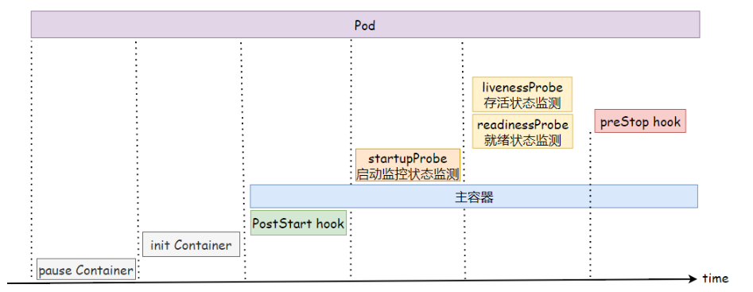

### 6.3 ⽣命周期总结

如果⽤户给出了上述全部定义，则⼀个Pod对象⽣命周期的运⾏步骤如 下。 1、在启动任何容器之前，先创建pause基础容器，它初始化Pod的环境 并为后续加⼊的容器提供共享的名称空间。 2、按顺序以串⾏⽅式运⾏⽤ 户定义的各个初始化容器进⾏Pod环境初始化，任何⼀个初始化容器运⾏ 失败都会导致Pod创建失败，⽽后按照restartPolicy的策略进⾏处 理，默认为重启。 3、待所有初始化容器成功完成后，启动因此程序容 器，如果有多个容器则会并⾏启动，⽽后各⾃维护各⾃的⽣命周期。当容 器启动时会同时运⾏主容器上定义的PostStart钩⼦函数，该步骤失败 将导致相关容器被重启。 4、运⾏容器启动健康状态监测 （startupProbe），判断容器是否启动成功，如果失败，则会根据 www.xuliangwei.com restartPolicy中定义的策略进⾏处理，如果没有定义，则默认状态为 Success。 5、容器启动成功后定期进⾏存活状态监测（liveness）和 就绪状态监测（readiness），存活状态监测失败将导致容器重启，⽽ 就绪状态监测失败会使得该容器从其所属的负载均衡中被移除。 6、终⽌ Pod时，会先运⾏preStop钩⼦函数，并在宽限期 （terminationGrace-Period-Seconds）结束后终⽌容器，宽限期 默认为30秒；

## 7.Init Container

### 7.1 基本概念

Init Container是⽤来做初始化⼯作的容器。可以有⼀个或多个，如 果多个按照定义的顺序依次执⾏，只有所有的执⾏完后，主容器才启动。 由于⼀个Pod⾥的存储卷是共享的，所以 Init Container ⾥产⽣的 数据可以被主容器使⽤到，但它仅仅是在Pod启动时，在主容器启动前执 ⾏，做初始化⼯作，如果 Pod 的 Init 容器失败，Kubernetes 会不 断地重启该 Pod，直到 Init 容器成功为⽌。如果 Pod 对应的 restartPolicy 值为 Never，Kubernetes 不会重新启动 Pod。

### 7.2 应⽤场景

1、app容器依赖MySQL的数据交互，所以可以启动⼀个初始化容器 检查MySQL服务是否正常，如果正常则启动主容器； 2、在启动主容器之前，使⽤初始化容器对系统内核参数进⾏调优， 然后共享给主容器使⽤； 3、获取集群成员节点地址，为主容器⽣成对应配置信息，这样主容 器启动后，可以通过配置信息加⼊集群环境；

### 7.3 场景实践-1

1.编写yaml，使⽤初始化容器对MySQL端⼝进⾏检查，如果存活则运⾏ Pod，否则就⼀直重启尝试 www.xuliangwei.com [root@master ~]# cat init-check-mysql.yaml apiVersion: v1 kind: Pod metadata: name: init-check-mysql spec: initContainers:                       # 初始化容器， 必须运⾏完就结束，否则后续⽆法正常运⾏主容器

```
- name: check-mysql

image: oldxu3957/tools command: ["sh", "-c", "nc -z 10.0.0.206 3306"] securityContext: privileged: true          # 以特权模式运⾏容器， 否则⽆法修改内核参数

containers:                           # 主容器

- name: app-mysql

2.当MySQL服务没有启动完毕，则该Pod会出现初始化失败，然后触发重 启 [root@master ~]# kubectl get pod init-systctl-nginx NAME                 READY   STATUS RESTARTS     AGE init-check-mysql   0/1     Init:CrashLoopBackOff   1 (5s ago)   43s 3.安装MySQL服务，确保3306对外监听 # yum install mariadb-server # systemctl start mariadb www.xuliangwei.com 4.检查Pod，发现已经检查到MySQL运⾏，所以会启动主容器。 [root@master ~]# kubectl get pod init-systctl-nginx NAME                READY   STATUS    RESTARTS   AGE init-check-mysql    1/1     Running   0 103s
```
### 7.4 场景实践-2

1.编写yaml，使⽤初始化容器对内核参数进⾏优化。 [root@master pod-init]# cat init-sysctl-nginx.yaml apiVersion: v1 kind: Pod metadata: name: init-sysctl-nginx spec: initContainers:     # 初始化容器，必须运⾏完就结束，否 则后续⽆法正常运⾏主容器

```
- name: set-sysctl

image: alpine:3.13 command: ["sh", "-c", "sysctl -w net.core.somaxconn=32769; sysctl -w net.ipv4.ip_local_port_range='1024 65000'"] securityContext: privileged: true    # 以特权模式运⾏容器，否则⽆法 修改内核参数

containers:       # 主容器

- name: app-sysctl

2.运⾏pod，检查Pod的内核参数，发现已经优化了（建议使⽤镜像查看 此前的内核参数） [root@master ~]# kubectl get pod NAME                         READY   STATUS RESTARTS        AGE init-sysctl-nginx            0/1     Init:0/1

[root@master ~]# kubectl exec -it init-systctl-nginx -c "app-sysctl" !" /bin/bash -c "cat /proc/sys/net/core/somaxconn" 32769
```
## 8.Pod Hook

容器⽣命周期钩⼦（Container Lifecycle Hooks）监听容器⽣命周 期的特定事件，并在事件发⽣时执⾏已注册的回调函数。

Kubernetes ⽀持 postStart 和 preStop 事件。 当⼀个容器启动 后，Kubernetes 将⽴即发送 postStart 事件；在容器被终结之前， Kubernetes 将发送⼀个 preStop 事件。容器可以为每个事件指定⼀ 个处理程序。

### 8.1 两种钩⼦

postStart：容器创建后⽴即执⾏，由于是异步执⾏，它⽆法保证⼀定 在容器之前运⾏。如果失败，容器会被杀死，并根据 RestartPolicy 决定是否重启。 preStop：在容器终⽌前执⾏。⽤于：释放占⽤的资源、清理注册过的信 息、优雅的关闭进程。在其完成之前会阻塞删除容器的操作，默认等待时 间为30s，可以通过terminationGracePeriodSeconds宽限时间。 www.xuliangwei.com

### 8.2 钩⼦示例

postStart示例 # 通过postStart设定端⼝重定向，将请求本机的8080调度到本机 的80端⼝ lifecycle: postStart: exec: command:

```
- "/bin/bash"

- "iptables -t nat -A PREROUTING -p tcp !"

dport 8080 -j REDIRECT !"to-ports 80" preStop示例
```
runner主要⽤来编译打包提⾼CI效率。启动后会注册到gitlab 上，后续不需要可以删除Pod，然后清理注册信息。 # 通过preStop清理runner注册信息 lifecycle: preStop: exec: command:

```
- /bin/bash

- -c

- "/usr/bin/gitlab-runner unregister -n

$RUNNER_NAME"
```
### 8.3 场景实践-1

```
postStart 命令在容器的 /usr/share/nginx/html/index.html ⾃定义⼀段内容 preStop 负责优雅地终⽌ nginx 服务。 terminationGracePeriodSeconds：宽限期，如果超过宽限期pod还 没有终⽌，则会由SIGKILL强制关闭信号介⼊。 apiVersion: v1 kind: Pod metadata: name: lifecycle-nginx spec: containers:

- name: lifecycle-demo-container

image: nginx lifecycle: postStart: exec: command:

- "echo Hello from the postStart handler >

/usr/share/nginx/html/index.html" preStop: exec: command:

- "nginx -s stop"
```
### 8.4 场景实践-2

```
postStart 命令负责将默认⻚⾯，拷⻉ www.xuliangwei.com ⾄/usr/local/tomcat/webapps preStop 负责给容器发送 SIGERM 信号，从⽽优雅地终⽌ tomcat 服务 terminationGracePeriodSeconds：宽限期，如果超过宽限期pod还 没有终⽌，则会由SIGKILL强制关闭信号介⼊。 [root@master ~]# cat tomcat.poststart.yaml apiVersion: v1 kind: Pod metadata: name: lifecycle-tomcat-hook labels: web: tomcat spec: terminationGracePeriodSeconds: 120    # 关闭Pod，等 待多久 containers:

- name: tomcat

image: tomcat ports:

- containerPort: 8080

lifecycle: postStart: exec: command:

- "/bin/bash"

- "cp -rf /usr/local/tomcat/webapps.dist!(

/usr/local/tomcat/webapps" preStop: exec: command:

- "/bin/bash"

- "sleep 10;

/usr/local/tomcat/bin/shutdown.sh"
```
## 9.Pod检测探针

### 9.1 为何需要探针

当容器进程运⾏时如果出现了异常退出，Kubernetes则会认为容器发⽣ 故障，会尝试进⾏重启解决该问题。但有不少情况是发⽣了故障，但进程 并没有退出。⽐如访问Web服务器时出现了500的内错误，可能是系统超 载，也可能是资源死锁，但nginx进程并没有异常退出，在这种情况下重 启容器可能是最佳的⽅法。那如何来实现这个检测呢； Kubernetes 使⽤探针（probe）的⽅式来保障容器正常运⾏，实现零 宕机；它通过 kubelet 定期对容器进⾏健康检查（exec、tcp、 http），当探针检测到容器状态异常时，会通过重启策略来进⾏重启或 重建完成修复。修复后继续进⾏探针检测，已确保容器稳定运⾏。

### 9.2 探针探测类型

针对运⾏中的容器，kubelet 可以选择以下三种探针来探测容器的状 态； startupProbe 启动探针 ⽤于检测容器中的应⽤是否已经正常启动。如果使⽤了启动探针，则 所有其他探针都会被禁⽤，需要等待启动探针检测成功之后才可以执 ⾏。如果启动探针探测失败，则kubelet 会将容器杀死，⽽容器依 其重启策略进⾏重启。如果容器没有提供启动探测，则默认状态为 Success。 livenessProbe 存活探针 ⽤于检测容器是否存活，如果存活探测检测失败，kubelet会杀死容 器，然后根据容器重启策略，决定是否重启该容器。如果容器不提供 存活探针，则默认状态为Success。 www.xuliangwei.com readinessProbe 就绪探针 指容器是否准备好接收⽹络请求，如果就绪探测失败，则将容器设定 为未就绪状态，然后将其从负载均衡列表中移除，这样就不会有请求 会调度到该Pod上；如果容器不提供就绪态探针，则默认状态为 Success。

### 9.3 探针检查机制

使⽤探针来检查容器有如下集中⽅式： exec：在容器内执⾏指定命令。如果命令退出时返回码为 0 则认 为诊断成功。 httpGet：对指定的IP、端⼝，执⾏HTTP请求。如果响应的状态码 ⼤于等于200且⼩于400，则诊断被认为是成功的。 tcpSocket：对容器的 IP 地址上的指定端⼝执⾏ TCP 检查。如 果端⼝打开，则诊断被认为是成功的。 每次探测都将获得以下三种结果之⼀： Success（成功）：容器通过了诊断。 Failure（失败）：容器未通过诊断，可能会触发重启操作。

Unknown（未知）：诊断失败，因此不会采取任何⾏动。

### 9.4 探针配置格式

```
apiVersion: v1 kind: Pod metadata: name: probe spec: containers:

- name:

image: livenessProbe: www.xuliangwei.com exec: httpGet: tcpSocket: initialDelaySeconds: PeriodSeconds: timeoutSeconds: successThreshold: failureThreshold:
```
## 10.startupProbe

### 10.1 exec

```
[root@master ~]# cat pod-startup-exec.yaml apiVersion: v1 kind: Pod metadata: name: pod-startup-exec

spec: containers:

- name: pod-startup-exec

startupProbe: exec: command:

- "ps aux | grep demo.py"

initialDelaySeconds: 10           # 容器启动多久 后开始探测，默认0 www.xuliangwei.com periodSeconds: 10                 # 探测频 率,10s探测⼀次 timeoutSeconds: 10                 # 探测超时时 ⻓ successThreshold: 1               # 成功多少次则 为成功，默认1次 failureThreshold: 3               # 失败多少次则 为失败，默认3次

第⼀次探测失败多久会重启 # initialDelaySeconds +（periodSeconds + timeoutSeconds）* failureThreshold

程序启动完成后：此时不需要计⼊initialDelaySeconds， # （periodSeconds + timeoutSeconds） * failureThreshold
```
### 10.2 httpGet

```
[root@master ~]# cat pod-startprobe-httpget.yaml apiVersion: v1 kind: Pod metadata: name: pod-startup-http spec: containers:

- name: pod-startup-http

startupProbe: httpGet: path: / www.xuliangwei.com port: 80 initialDelaySeconds: 10           # 容器启动多久 后开始探测，默认0 periodSeconds: 10                 # 探测频 率,10s探测⼀次 timeoutSeconds: 10                # 探测超时时⻓ successThreshold: 1               # 成功多少次则 为成功，默认1次 failureThreshold: 3               # 失败多少次则 为失败，默认3次
```
### 10.3 tcpSocket

```
[root@master ~]# cat pod-startprobe-tcp.yaml apiVersion: v1 kind: Pod metadata: name: pod-startup-tcp

spec: containers:

- name: pod-startup-tcp

startupProbe: tcpSocket: port: 80 initialDelaySeconds: 10           # 容器启动多久 后开始探测，默认0 periodSeconds: 10                 # 探测频 率,10s探测⼀次 timeoutSeconds: 10                # 探测超时时⻓ www.xuliangwei.com successThreshold: 1               # 成功多少次则 为成功，默认1次 failureThreshold: 3               # 失败多少次则 为失败，默认3次
```
## 11.livenessProbe

⽤于检测容器是否存活，如果存活探测检测失败，kubelet会杀死容 器，然后根据容器重启策略，决定是否重启该容器。如果容器不提供存活 探针，则默认状态为Success。

### 11.1 exec

```
[root@master ~]# cat pod-liveness-exec.yaml apiVersion: v1 kind: Pod metadata: name: pod-liveness-exec

spec: containers:

- name: pod-liveness-exec

livenessProbe: exec: command:

- '[ "$(curl -s 127.0.0.1/livez)" !) "OK" ]'

#- "nc -z 127.0.0.1 80"
```
initialDelaySeconds: 10           # 容器启动多久 后开始探测，默认0 periodSeconds: 10                 # 探测频 率,10s探测⼀次 timeoutSeconds: 10                # 探测超时时 ⻓，5s没响应则为超时 successThreshold: 1               # 成功多少次则 为成功，默认1次 failureThreshold: 3               # 失败多少次则 为失败，默认3次 2、为了测试存活状态监测效果，可以⼿动将/livez接⼝的响应内容修改 为任意值。 [root@master ~]# kubectl exec -it pod-liveness-exec !" curl -s -X POST -d 'livez=error' http:!&127.0.0.1/livez 3、会发现容器等待60s之后，会触发重启操作。

```
[root@master ~]# kubectl describe  pod pod-liveness- exec !!%

Warning  Unhealthy  31s (x3 over 51s)   kubelet Liveness probe failed: Normal   Killing    31s                 kubelet Container pod-liveness-exec failed liveness probe, will be restarted
```
### 11.2 httpGet

```
1、编写yaml www.xuliangwei.com [root@master ~]# cat pod-liveness-http.yaml apiVersion: v1 kind: Pod metadata: name: pod-liveness-http spec: containers:

- name: pod-liveness-http

livenessProbe: httpGet: path: '/livez' port: 80 scheme: HTTP initialDelaySeconds: 10           # 容器启动多久 后开始探测，默认0
```
periodSeconds: 10                 # 探测频 率,10s探测⼀次 timeoutSeconds: 10                # 探测超时时⻓ successThreshold: 1               # 成功多少次则 为成功，默认1次 failureThreshold: 3               # 失败多少次则 为失败，默认3次 2、镜像中定义的默认响应是以200状态码响应，存活状态会成功完成， 为了测试存活状态监测效果，可以⼿动将/livez接⼝的响应内容修改为 任意值。 [root@master ~]# kubectl exec -it  pod-liveness-http !" curl -s -X POST -d 'livez=error' 127.0.0.1/livez www.xuliangwei.com 3、等待3个监测周期，容器会因健康监测失败⽽被重启，重启后/livez 响应内容会被重置为ok，后续存活状态监测不会出现错误 [root@master ~]# kubectl describe pod pod-liveness- http ....

```
Warning  Unhealthy  30s (x6 over 7m30s)  kubelet Liveness probe failed: HTTP probe failed with statuscode: 506 Normal   Killing    30s (x2 over 7m10s)  kubelet Container pod-liveness-http failed liveness probe, will be restarted
```
### 11.3 tcpSocket

```
[root@master ~]# cat pod-liveness-tcp.yaml apiVersion: v1

kind: Pod metadata: name: pod-liveness-tcp spec: containers:

- name: pod-liveness-tcp

livenessProbe: tcpSocket: port: 80 initialDelaySeconds: 10           # 容器启动多久 后开始探测，默认0 www.xuliangwei.com periodSeconds: 10                 # 探测频 率,10s探测⼀次 timeoutSeconds: 10                # 探测超时时⻓ successThreshold: 1               # 成功多少次则 为成功，默认1次 failureThreshold: 3               # 失败多少次则 为失败，默认3次
```
## 12.readinessProbe

指容器是否准备好接收⽹络请求，如果就绪探测失败，则将容器设定为未 就绪状态，然后将其从负载均衡列表中移除，这样就不会有请求会调度到 该Pod上；如果容器不提供就绪态探针，则默认状态为Success。 有些程序启动后需要加载配置或数据，甚⾄有些程序需要运⾏预热的过 程，需要⼀定的时间。所以需要避免Pod启动成功后⽴即让其处理客户端 请求，⽽应该让其初始化完成后转为就绪状态，在对外提供服务。此类应 ⽤就需要使⽤readinessProbe探针。

### 12.1 exec

```
[root@master ~]# cat pod-readiness-exec.yaml apiVersion: v1 kind: Pod metadata: name: pod-readiness-exec labels: app: readiness spec: containers:

- name: pod-readiness-exec
```
www.xuliangwei.com

```
readinessProbe: exec: command:

- '[ "$(curl -s 127.0.0.1/readyz)" !) "OK"

]'

initialDelaySeconds: 10           # 容器启动多久 后开始探测，默认0 periodSeconds: 10                 # 探测频 率,10s探测⼀次 timeoutSeconds: 10                # 探测超时时⻓ successThreshold: 1               # 成功多少次则 为成功，默认1次 failureThreshold: 3               # 失败多少次则 为失败，默认3次
```
### 12.2 httpGet

1.编写yaml

```
[root@master ~]# cat pod-readiness-http.yaml apiVersion: v1 kind: Pod metadata: name: pod-readiness-http labels: app: readiness spec: containers:

- name: pod-readiness-http

image: oldxu3957/demoapp:v1.0 ports:

readinessProbe: httpGet: path: '/readyz' port: 80 scheme: HTTP initialDelaySeconds: 10           # 容器启动多久 后开始探测，默认0 periodSeconds: 10                 # 探测频 率,10s探测⼀次 timeoutSeconds: 10                # 探测超时时⻓ successThreshold: 1               # 成功多少次则 为成功，默认1次 failureThreshold: 3               # 失败多少次则 为失败，默认3次 2.为了测试就绪状态监测效果，将/readyz修改为⾮OK

[root@master ~]# kubectl exec -it  pod-readiness- http !" curl -s -X POST -d 'readyz=error' http:!&127.0.0.1/readyz 3.由于pod未就绪，所以会将该节点从Service负载均衡中准为未就绪状 态（需要事先创建好负载均衡，否则难以观察效果） [root@master ~]# kubectl get pod pod-readiness-http NAME                 READY   STATUS    RESTARTS AGE pod-readiness-http   0/1     Running   0          6m

[root@master ~]# kubectl describe endpoints pod- readiness-exec www.xuliangwei.com Name:         pod-readiness-exec Subsets: Addresses:          <none> NotReadyAddresses:  192.168.3.38
```
### 12.3 tcpSocket

```
[root@master ~]# cat pod-readiness-tcp.yaml apiVersion: v1 kind: Pod metadata: name: pod-readiness-tcp labels: app: readiness spec: containers:

- name: pod-readiness-tcp

image: oldxu3957/demoapp:v1.0

ports:

readinessProbe: tcpSocket: port: 80 initialDelaySeconds: 10           # 容器启动多久 后开始探测，默认0 periodSeconds: 10                 # 探测频 率,10s探测⼀次 timeoutSeconds: 10                # 探测超时时⻓ successThreshold: 1               # 成功多少次则 为成功，默认1次 failureThreshold: 3               # 失败多少次则 为失败，默认3次 www.xuliangwei.com
```
