# 05 Kubernetes资源Deployment

## 目录

- [1.ReplicaSet](#1.replicaset)
  - [1.1 传统应⽤集群](#1.1-传统应集群)
  - [1.2 什么是ReplicaSet](#1.2-什么是replicaset)
  - [1.3 ReplicaSet组成部分](#1.3-replicaset组成部分)
  - [1.4 ReplicaSet示例配置](#1.4-replicaset示例配置)
- [2.Deployment](#2.deployment)
  - [2.1 什么是deployment](#2.1-什么是deployment)
  - [2.2 deployment组成部分](#2.2-deployment组成部分)
  - [2.3 deployment示例配置](#2.3-deployment示例配置)
- [3.Deployment场景实践](#3.deployment场景实践)
  - [3.1 场景说明](#3.1-场景说明)
  - [3.2 创建应⽤集群](#3.2-创建应集群)
  - [3.3 检查集群状态](#3.3-检查集群状态)
  - [3.4 创建Service](#3.4-创建service)
  - [3.5 验证集群⾼可⽤](#3.5-验证集群可)
  - [3.6 ⽔平伸缩](#3.6-平伸缩)
  - [3.7 模拟故障](#3.7-模拟故障)
- [4.Deployment动态扩容](#4.deployment动态扩容)
  - [4.1 什么是HPA](#4.1-什么是hpa)
  - [4.2 ⾃动扩缩容算法](#4.2-动扩缩容算法)
  - [4.2 安装MetricServer](#4.2-安装metricserver)
  - [4.3 动态扩缩容实践](#4.3-动态扩缩容实践)
- [5.Deployment重建策略](#5.deployment重建策略)
  - [5.1 什么是Recreate](#5.1-什么是recreate)
  - [5.2 Recreate实践](#5.2-recreate实践)
- [6.Deployment滚动更新](#6.deployment滚动更新)
  - [6.1 什么是滚动更新](#6.1-什么是滚动更新)
  - [6.2 滚动更新实践](#6.2-滚动更新实践)
- [1.准备yaml⽂件](#1.准备yaml件)
- [2.观察更新过程](#2.观察更新过程)
  - [6.3 应⽤回退实践](#6.3-应回退实践)
- [7.Deployment更新策略](#7.deployment更新策略)
  - [7.1 maxSurge](#7.1-maxsurge)
  - [7.2 maxUnavailable](#7.2-maxunavailable)
  - [7.3 maxSurge & MaxUnavailable](#7.3-maxsurge--maxunavailable)
  - [7.3 minReadySeconds](#7.3-minreadyseconds)
  - [7.4 revisionHistoryLimit](#7.4-revisionhistorylimit)
  - [7.5 progressDeadlineSeconds](#7.5-progressdeadlineseconds)
- [8.Deployment实现灰度发布](#8.deployment实现灰度发布)
  - [8.2 部署负载均衡服务](#8.2-部署负载均衡服务)
- [2.获取Service的IP](#2.获取service的ip)
  - [8.4 测试新⽼版本共存](#8.4-测试新版本共存)
  - [8.5 控制新⽼版本流量](#8.5-控制新版本流量)

8.1 部署1.0版本应⽤

8.3 部署1.1版本应⽤

## 1.ReplicaSet

### 1.1 传统应⽤集群

在传统环境中，如果要保证应⽤的⾼可⽤，⼀般都以集群⽅式部署，集群 中的应⽤实例⾄少部署2个以上，这样即使⼀个应⽤故障了，另⼀台应⽤ 任然能够对外提供服务，在这种环境下，我们主要依赖前置的负载均衡 Nginx，通过⼿动编辑配置⽂件的⽅式来实现。⽽⼀旦我们需要对应⽤进 ⾏扩容或缩容，也需要在Nginx上进⾏⼿动配置，过程相对繁琐也⽐较容 易出错；

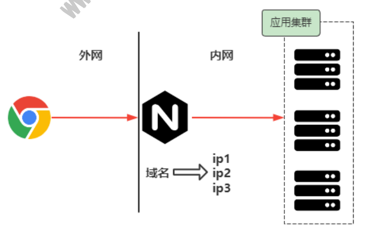

### 1.2 什么是ReplicaSet

在 Kubernetes 环境中，通过 ReplicaSet 这种资源对象就可以来 帮助我们实现集群的⾼可⽤，ReplicaSet（RS） 的主要作⽤就是维持 ⼀组 Pod 副本的运⾏，保证⼀定数量的 Pod 在集群中正常运 ⾏，ReplicaSet 控制器会持续监听它控制的这些 Pod 的运⾏状态， 以及数量，保证应⽤集群的⾼可⽤；

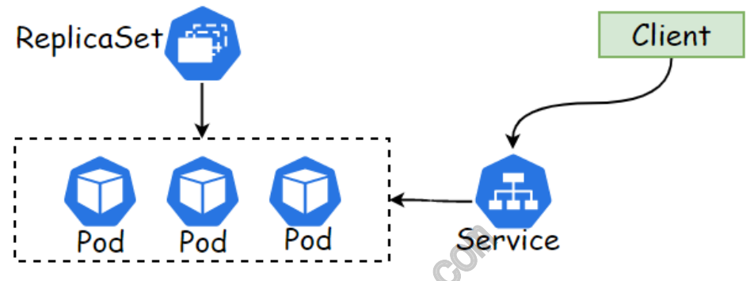

### 1.3 ReplicaSet组成部分

ReplicaSet控制器包含了3个基本的组成部分： selector 标签选择器：匹配并关联Pod对象，并加⼊控制器的管 理中； replicas期望的副本数：期望在集群中所运⾏的Pod对象数量； template Pod模板：实际上就是定义的 Pod 规范，相当于把⼀个 Pod 的描述以模板的形式嵌⼊到了 ReplicaSet

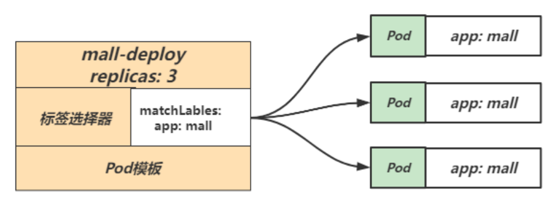

### 1.4 ReplicaSet示例配置

```
apiVersion: apps/v1 kind: ReplicaSet metadata: name:  mall-deploy    # RS控制器名称 namespace: default    # 命名空间 spec: replicas: 3         # 期望的 Pod 副本数量，默认值为1 selector:         # Selector，匹配 Pod 模板中的标签 matchLabels: app: mall template:         # 定义 Pod 模板 （内嵌Pod模板不需要 apiVersion和kind字段） www.xuliangwei.com metadata: labels:       # 定义 Pod 标签 app: mall spec: containers:     # 定义 Pod 中的容器信息

- name: mall-container

image: nginx ports:
```
## 2.Deployment

### 2.1 什么是deployment

Deployment（简称为deploy）是Kubernetes控制器的⼀种⾼级别实 现，他构建于ReplicaSet控制器之上。

我们只需要描述Deployment中的⽬标Pod期望状态，⽽Deployment控 制器以受控速率更改实际状态，使其变为期望状态，也就是说，后期我 们部署应⽤不直接使⽤Pod和ReplicaSet，⽽是使⽤Deployment控制 器来调⽤ReplicaSet来实现，Deployment控制器在ReplicaSet原有 基础上，添加了部分特性。 1、事件和状态查看：可以通过特定的命令查看Deployment对象的 更新进度和状态； 2、版本记录：将Deployment对象的更新操作都进⾏保存，以便后 续执⾏回滚操作使⽤； 3、多种更新⽅案：Recreate重建，可以实现单批次更新所有Pod。 RollingUpdate可以实现多批次逐步替换Pod

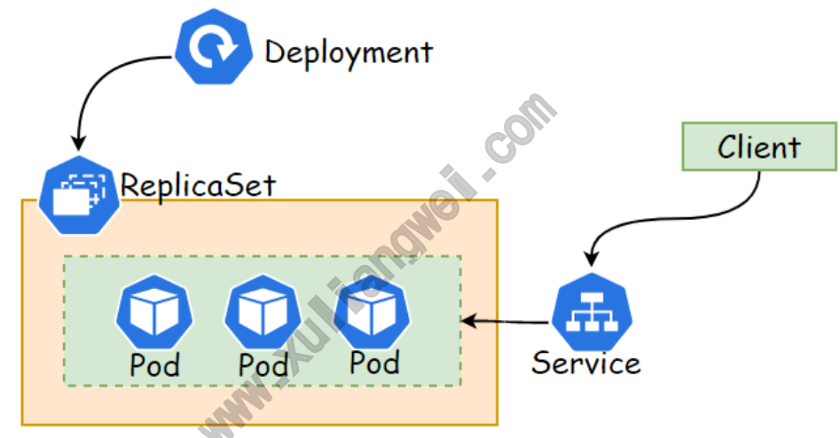

### 2.2 deployment组成部分

Deployment 资源对象的格式和 ReplicaSet ⼏乎⼀ 致，Deployment 控制器也包含了3个基本的组成部分： selector 标签选择器：匹配并关联Pod对象，并对授其管控的Pod 对象计数； replicas期望的副本数：期望在集群中所运⾏的Pod对象数量； template Pod模板：实际上就是定义的 Pod 内容，相当于把⼀个 Pod 的描述以模板的形式嵌⼊到了 ReplicaSet

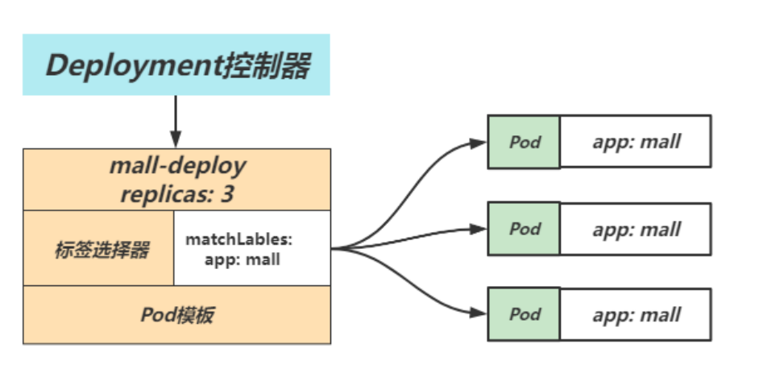

### 2.3 deployment示例配置

```
apiVersion: apps/v1 kind: Deployment metadata: name: mall-deploy     # 定义deploy资源名称 spec: replicas: 3       # 定义deploy控制Pod的副本数 minReadySeconds: 10   # Pod就绪后，多少秒内任⼀容器⽆ 崩溃⽅视为 “就绪”，默认0s selector: matchLabels:      # 标签选择器，选择 app:mall的标签 app: mall template:         # Pod 模板，申明Pod名称、使⽤镜像、 拥有哪些标签等 metadata: labels:       # Pod标签 app: mall spec:         # Pod的容器详情申明 containers:

image: oldxu3957/demoapp:v1.0 ports:
```
## 3.Deployment场景实践

### 3.1 场景说明

场景说明：运⾏⼀个demoapp的应⽤，部署3个副本，然后通过service 来实现负载均衡； 1、创建 Deployment资源，部署三个副本 2、创建 Service资源，通过标签选择器选择对应的Pod，以实现负 载均衡； 3、使⽤ curl命令，或Chrome浏览器验证集群⾼可⽤； www.xuliangwei.com

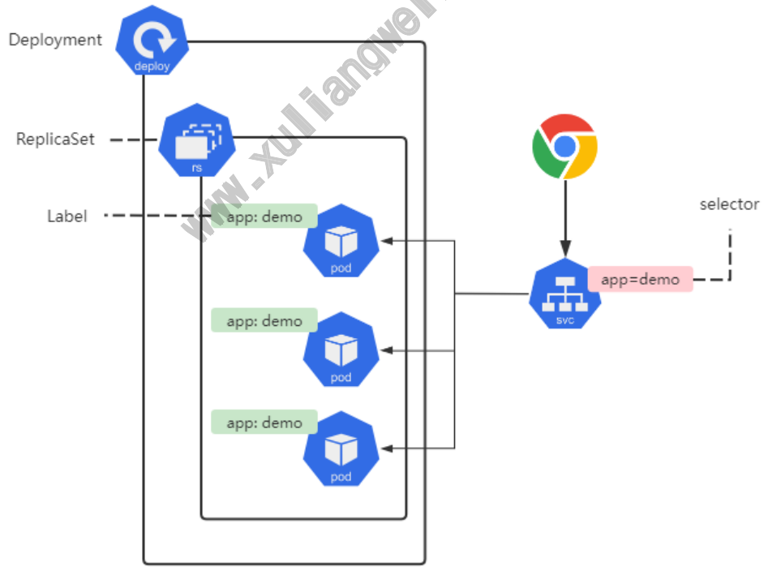

### 3.2 创建应⽤集群

```
[root@master ~]# cat demoapp-deploy.yaml apiVersion: apps/v1 kind: Deployment metadata: name: demoapp-deploy spec: replicas: 3 selector: matchLabels: app: demoapp template: metadata: www.xuliangwei.com labels: app: demoapp spec: containers:

image: oldxu3957/demoapp:v1.0 ports:
```
### 3.3 检查集群状态

1、检查集群的 Deployment： NAME 列出了集群中 Deployment 的名称。 READY 显示应⽤程序的可⽤的“副本”数。显示的模式是“就绪个数/ 期望个数”。 UP-TO-DATE 显示为了达到期望状态已经更新的副本数。 AVAILABLE 显示应⽤可供⽤户使⽤的副本数。 AGE 显示应⽤程序运⾏的时间。

注意：期望副本数是根据 .spec.replicas 字段设置 3。 [root@master ~]# kubectl get deploy NAME             READY   UP-TO-DATE   AVAILABLE AGE demoapp-deploy   3/3     3            3 79s 2、检查集群的 ReplicaSet： NAME 列出名字空间中 ReplicaSet 的名称； DESIRED 显示应⽤的期望副本个数，即在创建 Deployment 时所 定义的值。 此为期望状态； CURRENT 显示当前运⾏状态中的副本个数； READY 显示应⽤中有多少副本可以为⽤户提供服务； AGE 显示应⽤已经运⾏的时间⻓度。 www.xuliangwei.com 注意 ReplicaSet 的名称被格式化为[Deployment名称]-[随机字符 串]。 [root@master ~]# kubectl get rs NAME                      DESIRED   CURRENT   READY AGE demoapp-deploy-d775b8f7   3         3         3 2m31s 3、检查集群的Pod，所创建的 ReplicaSet 确保总是存在三个 Pod

```
[root@master ~]# kubectl get pod NAME                            READY   STATUS RESTARTS   AGE demoapp-deploy-d775b8f7-7vqxt   1/1     Running   0 2m36s demoapp-deploy-d775b8f7-cn69z   1/1     Running   0 2m36s demoapp-deploy-d775b8f7-t8299   1/1     Running   0 2m36s
```
### 3.4 创建Service

```
[root@master ~]# cat demoapp-service.yaml www.xuliangwei.com apiVersion: v1 kind: Service metadata: name: demoapp-svc spec: selector:       # 标签选择器，选择哪些相同的Pod为⼀组 Upstream app: demoapp ports:

- name: http
```
port: 80      # service对外提供的端⼝ targetPort: 80    # Pod的端⼝ 查看对应的service地址

```
[root@master deployment]# kubectl get svc NAME          TYPE        CLUSTER-IP    EXTERNAL-IP PORT(S)    AGE demoapp-svc   ClusterIP   10.96.42.220   <none> 80/TCP   2m25s
```
### 3.5 验证集群⾼可⽤

```
[root@master ~]# curl 10.96.42.220/version demoapp v1.0!" PodIP: 192.168.1.112!

[root@master ~]# curl 10.96.42.220/version demoapp v1.0!" PodIP: 192.168.1.113! www.xuliangwei.com

[root@master ~]# curl 10.96.42.220/version demoapp v1.0!" PodIP: 192.168.1.111!
```
### 3.6 ⽔平伸缩

⽔平扩展/收缩的功能⽐较简单，修改replicas对应的副本数即可。⽐ 如将 Pod 的副本调整到 5 个，那么 Deployment 所管理的 ReplicaSet 则会⾃动创建⼀个新的 Pod 出来，这样就⽔平扩展了。 1、命令⽅式修改 kubectl scale deployment 2、通过yaml来实现 kubectl edit deployment demoapp

### 3.7 模拟故障

删除Pod，看是否能⾃动修复

## 4.Deployment动态扩容

### 4.1 什么是HPA

Kubernetes实现Pod的扩缩容需要通过⼿动来实现，但线上的业务情况 www.xuliangwei.com ⽐较复杂，依赖于纯⼿动的⽅式，不太现实。所以希望系统能⾃动感知 Pod的压⼒来完成扩缩容，⽐如：当Pod的CPU达到了50%则扩容，当Pod 的CPU低于50%⾃动缩容。 为此Kubernetes为我们提供了这样的⼀个资源对象HPA（horizontal- pod-autoscaler），专⽤来实现Pod的⽔平⾃动扩缩容。HPA 通过监 控分析⼀些控制器控制的所有 Pod 的负载变化情况来确定是否需要调整 Pod 的副本数量；

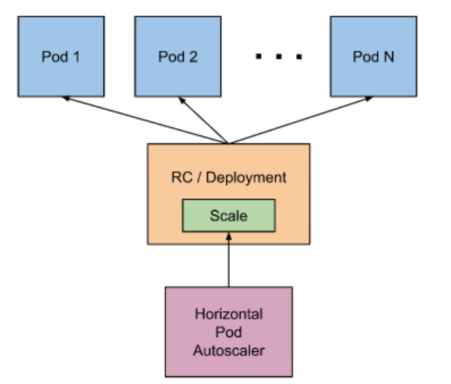

### 4.2 ⾃动扩缩容算法

算法：副本数 = [当前副本数 * (当前指标 / 期望指标)] 当前指标：当前Pod已经达到了百分之多少的压⼒；期望指标：当Pod达 到期望的指标百分⽐时就要进⾏扩容； 例如，当前副本为1，当前当前指标值250%，⽽期望的指标值是50%，则 副本数会翻5倍，因为 1 * (250%/50%) =

### 4.2 安装MetricServer

```
kubectl apply -f https:!#linux.oldxu.net/metrics- server.yaml
```
### 4.3 动态扩缩容实践

1.创建deployment

```
[root@master ~]# vim php-apache-deployment.yaml

apiVersion: apps/v1 kind: Deployment metadata: name: php-apache spec: selector: matchLabels: run: php-apache replicas: 1 template: metadata: labels: run: php-apache spec: www.xuliangwei.com containers:

- name: php-apache

image: oldxu3957/hpa-example ports:

resources: requests: cpu: 200m limits: cpu: 500m

[root@master ~]# cat php-apache-service.yaml apiVersion: v1 kind: Service metadata: name: php-apache spec:

selector: run: php-apache ports:

- port:

targetPort:

获取负载均衡IP [root@master tmp]# kubectl get service NAME TYPE CLUSTER-IP EXTERNAL-IP PORT(S) AGE php-apache ClusterIP 10.96.160.107 <none> 80/TCP 85s 3.创建hpa，设定cpu超过50%，则触发⾃动创建Pod副本 www.xuliangwei.com # kubectl autoscale deployment php-apache !$min=1 !$ max=10 !$cpu-percent=50

[root@master ~]# cat php-apache-hpa.yaml apiVersion: autoscaling/v1 kind: HorizontalPodAutoscaler metadata: name: php-apache spec: minReplicas: 1              # 最少启动1个Pod maxReplicas: 10             # 最多扩展10个Pod scaleTargetRef: apiVersion: apps/v1 kind: Deployment name: php-apache targetCPUUtilizationPercentage: 50    # cpu达到50%

[root@master ~]# while sleep 0.01; do curl http:!#10.96.160.107; done 当前副本为1，当前压⼒达到了250%，⽽CPU只要超过50%就会扩容，需 要扩容5个副本来分担压⼒。1 * (250%/50%) =
```
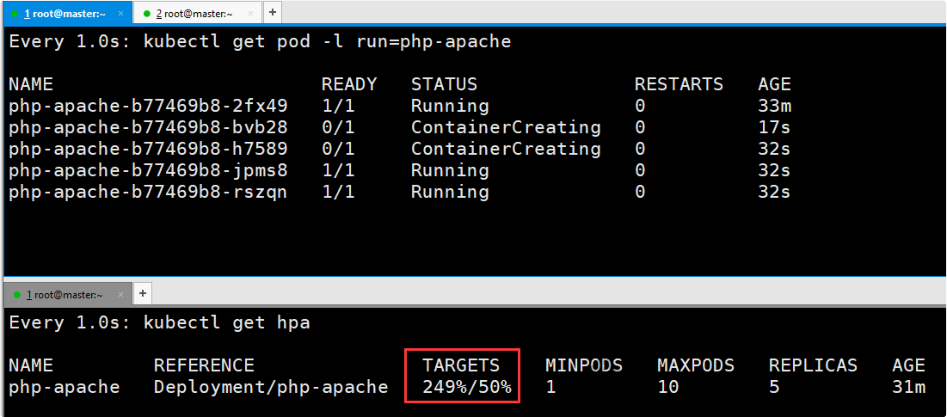

## 5.Deployment重建策略

### 5.1 什么是Recreate

重建（Recreate），当更新策略设定为 Recreate，在更新镜像时， 它会先杀死正在运⾏的Pod，等彻底杀死后，重新创建新的RS，然后启动 对应的Pod，那么在这个更新过程中，会造成服务⼀段时间⽆法提供服 务； 第⼀步：同时杀死所有旧版本的Pod，此时Pod⽆法正常对外提供服 务； 第⼆步：创建新的RS，启动新的Pod； 第三步：等待Pod就绪，对外提供服务；

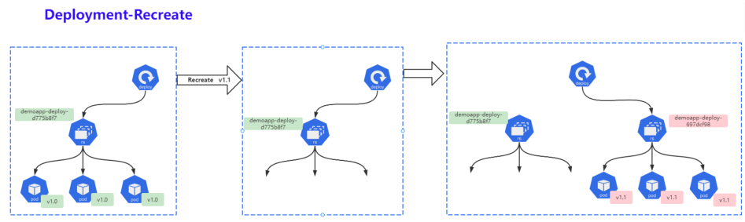

### 5.2 Recreate实践

```
1.创建deploy资源，然后将更新策略设定为 Recreate，⽽后修订镜 像版本； [root@master deployment]# cat demoapp-deploy.yaml www.xuliangwei.com apiVersion: apps/v1 kind: Deployment metadata: name: demoapp-deploy spec: replicas: 3 strategy: type: Recreate      # 重建 selector: matchLabels: app: demoapp template: metadata: labels: app: demoapp spec: containers:

image: oldxu3957/demoapp:v1.1   # 将v1.0 修改 为 v1.1 版本

ports:

Pod被全部停⽌ [root@master ~!% kubectl get pod NAME READY STATUS RESTARTS AGE demoapp-deploy-d775b8f7-fj6k4 1/1 Terminating

demoapp-deploy-d775b8f7-sl6wh   1/1     Terminating

demoapp-deploy-d775b8f7-vgk72   1/1     Terminating www.xuliangwei.com

2.创建新的RS，然后期望运⾏Pod为3，当前为3，就绪3 [root@master deployment!% kubectl get rs NAME DESIRED CURRENT READY AGE demoapp-deploy-64648f996c 3 3 3 117s demoapp-deploy-d775b8f7 0 0 0 37m

3.查看Pod [root@master deployment!% kubectl get pod NAME READY STATUS RESTARTS AGE demoapp-deploy-64648f996c-64hcx 0/1 Running

demoapp-deploy-64648f996c-wpbcd   0/1     Running

demoapp-deploy-64648f996c-wxfqs   0/1     Running
```
通常只有当应⽤的新旧版本不兼容（例如依赖的后端数据的格式不同且⽆ 法兼容）时才会使⽤Recreate重建策略。

## 6.Deployment滚动更新

### 6.1 什么是滚动更新

滚动更新（RollingUpdate），⼀次仅更新⼀批Pod，当更新的Pod就绪 www.xuliangwei.com 后，在更新另⼀批，直到全部更新完成为⽌；该策略实现了不间断服务的 ⽬标，在更新过程中可能会出现不同的应⽤版本并存且，同时提供服务的 情况。 第⼀步：创建新的ReplicaSet，然后根据新的镜像运⾏新的Pod； 第⼆步：删除旧的Pod，启动新的Pod，新Pod就绪后，继续删除旧 Pod，启动新Pod； 第三步：持续第⼆步过程，⼀直到所有Pod都被更新成功。

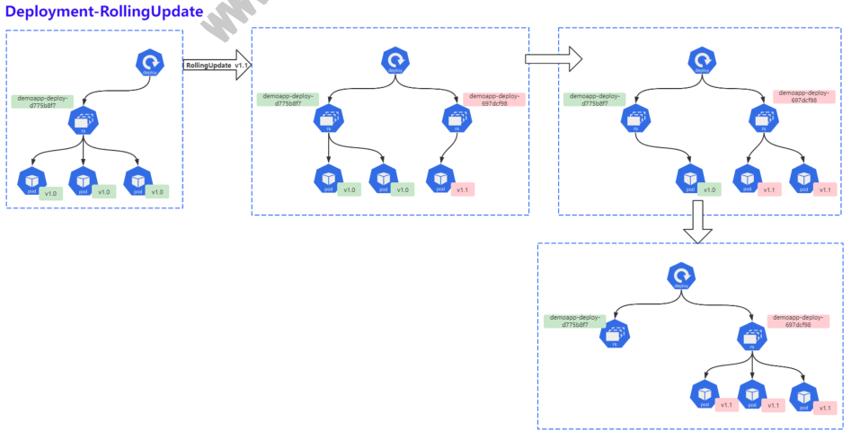

### 6.2 滚动更新实践

## 1.准备yaml⽂件

```
[root@master deployment]# cat demoapp-deploy.yaml apiVersion: apps/v1 kind: Deployment metadata: name: demoapp-deploy spec: replicas: 3 strategy: type: RollingUpdate         # 滚动更新，默认策略 selector: www.xuliangwei.com matchLabels: app: demoapp template: metadata: labels: app: demoapp spec: containers:

image: oldxu3957/demoapp:v1.1 ports:
```
## 2.观察更新过程

```
[root@master ~]# kubectl rollout status deploy demoapp-deploy Waiting for deployment "demoapp-deploy" rollout to finish: 1 out of 3 new replicas have been updated!!& Waiting for deployment "demoapp-deploy" rollout to finish: 1 out of 3 new replicas have been updated!!& Waiting for deployment "demoapp-deploy" rollout to finish: 2 out of 3 new replicas have been updated!!& Waiting for deployment "demoapp-deploy" rollout to finish: 2 out of 3 new replicas have been updated!!& Waiting for deployment "demoapp-deploy" rollout to finish: 2 out of 3 new replicas have been updated!!& Waiting for deployment "demoapp-deploy" rollout to finish: 1 old replicas are pending termination!!& www.xuliangwei.com Waiting for deployment "demoapp-deploy" rollout to finish: 1 old replicas are pending termination!!& deployment "demoapp-deploy" successfully rolled out 3.通过浏览器访问，会发现新⽼版本存在交替，但并不会出现服务不可⽤ 状态；
```
### 6.3 应⽤回退实践

有时，你可能想要回滚 Deployment；例如，当 Deployment 不稳定 进⼊反复崩溃状态。 默认情况下，Deployment 的所有上线记录都保留 在系统中，以便可以随时回滚。（你可以通过修改 revisionHistoryLimit 调整保留的数量，默认10条）

1.⾸先，检查 Deployment 上线的历史版本

```
[root@master deployment]# kubectl rollout history deployment demoapp-deploy deployment.apps/demoapp-deploy REVISION  CHANGE-CAUSE 1        <none>   # 历史版本，demoapp:v1.0 2        <none>   # 当前正在使⽤的版本，demoapp:v1.1

[root@master deployment]# kubectl rollout history deployment demoapp-deploy !$revision=1 deployment.apps/demoapp-deploy with revision #2 Pod Template: Labels: app=demoapp www.xuliangwei.com pod-template-hash=697dcf98 Containers: demoapp-container: Image:  oldxu3957/demoapp:v1.0  # 可以看到当前的镜 像版本 Port: 80/TCP Host Port:  0/TCP Environment:  <none> Mounts: <none> Volumes:  <none> 3.确认要回退的REVISION，然后执⾏回退命令即可。 按照下⾯的步骤将 Deployment 从当前版本（即版本2）回滚到以前的 版本（即版本 1）。 1.通过使⽤ !$to-revision 来回滚到特定修订版本：

[root@master ~]# kubectl rollout undo deployment demoapp-deploy !$to-revision=1 deployment.apps/demoapp-deploy rolled back

访问站点 [root@master ~]# curl 10.96.80.44:8888 iKubernetes demoapp v1.1 !" [root@master ~]# curl 10.96.80.44:8888 iKubernetes demoapp v1.0 !" [root@master ~]# curl 10.96.80.44:8888 iKubernetes demoapp v1.1 !" [root@master ~]# curl 10.96.80.44:8888 www.xuliangwei.com iKubernetes demoapp v1.0 !" [root@master ~]# curl 10.96.80.44:8888 iKubernetes demoapp v1.0 !"
```
## 7.Deployment更新策略

Deployment 会在 .spec.strategy.type=RollingUpdate 时， 采取滚动更新的⽅式更新 Pods。可以指定 maxUnavailable 和 maxSurge 来控制滚动更新过程。 maxSurge 最⼤可⽤Pod ⽤来指定可以创建超出期望Pod个数的 Pod数量。可以是数字， 也可以是百分⽐（例如10%）此字段的默认值为25%。 例如，当此值为 20% 时，启动滚动更新后，会⽴即对新的 ReplicaSet 扩容，同时保证新旧 Pod 的总数不超过所需 Pod 总数的 120%。⼀旦旧 Pods 被杀死，新的 ReplicaSet 可以进⼀步扩容， 同时确保更新期间的任何时候 运⾏中的 Pods 总数最多为所需 Pods 总数的 120%。 计算 公式：10+(10x20%)=12

maxUnavailable 最⼤不可⽤Pod ⽤来指定更新过程中不可⽤的 Pod 的个数上限。可以是数字， 也可以是百分⽐（例如10%） 此字段的默认值为25%。 例如，当此值设置为 20% 时，滚动更新开始时会⽴即将旧 ReplicaSet 缩容到期望 Pod 个数的70%。 新 Pod 准备就 绪后，继续缩容旧有的 ReplicaSet，然后对新的 ReplicaSet 扩容， 确保在更新期间可⽤的 Pods 总数在任 何时候都是所需的 Pod 个数的 70%。 计算公式：10- (10x20%)=8

maxSurge 和 maxUnavailable 两个属性协同⼯作，可组合定义 出3中不同的策略完成多批次的应⽤更新。 先增新，后减旧：将maxSurge设置为30%，将 maxUnavailable的值设为0； 先减旧，后增新：将maxUnavailable设置为30%，将 maxSurge的值设为0； 同时增减，将maxSurge和maxUnavailable分别设定为20%； 期望是12Pod，⾄少就绪8个Pod www.xuliangwei.com

### 7.1 maxSurge

指定升级期间存在的总Pod对象数量最多可超出期望值的个数，可以是 0，也可以是整数，也可以是⼀个百分⽐。 例如：期望的的值为10，maxSurge属性为2，则表示Pod对象总数不能 超过12个。 计算公式：10+(10x20%)=12

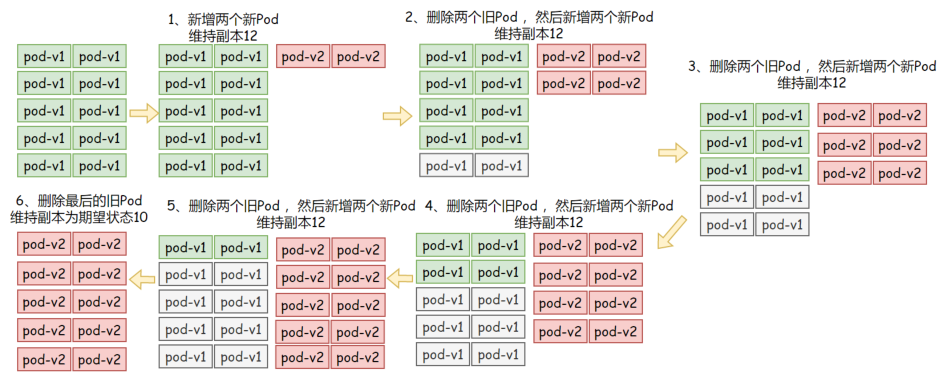

```
示例配置： [root@master deployment]# cat demoapp-deploy.yaml apiVersion: apps/v1 kind: Deployment www.xuliangwei.com metadata: name: demoapp-deploy spec: replicas: 10 strategy: rollingUpdate: maxSurge: 20%       # 最⼤可⽤20% maxUnavailable: 0     # 不可⽤状态设定为0 selector: matchLabels: app: demoapp template: metadata: labels: app: demoapp spec: containers:

image: registry.cn- huhehaote.aliyuncs.com/oldxu3957/demoapp:v1.0  # 调 整版本触发更新 ports:
```
可以通过如下命令实时查看更新策略是否与图中⼀致； [root@master ~]# watch -n 1 kubectl get rs

### 7.2 maxUnavailable

升级期间不可⽤的Pod副本数（包括新版本），最多不能低于期望的个 www.xuliangwei.com 数，默认为1。 例如：期望的值为10，maxunavailable属性为2，则表示Pod处于正常 状态⾄少 有8个。计算公式：10-(10x20%)=8

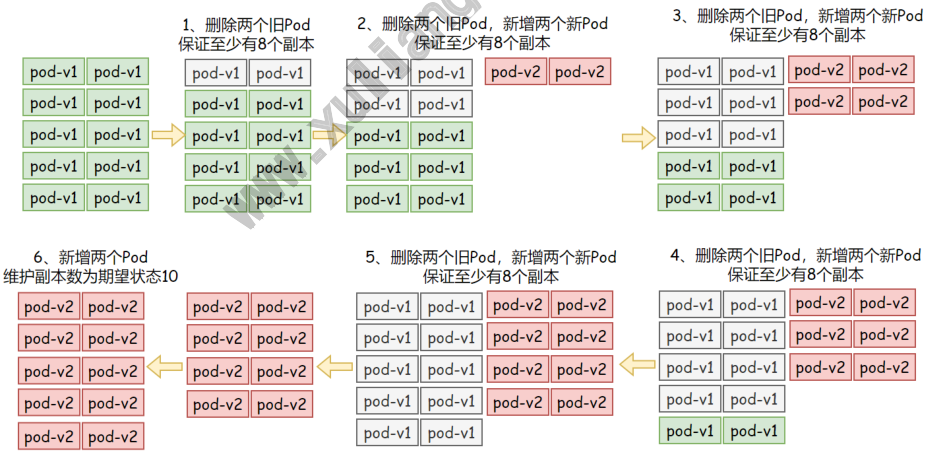

```
示例配置 [root@master deployment]# cat demoapp-deploy.yaml apiVersion: apps/v1 kind: Deployment

metadata: name: demoapp-deploy spec: replicas: 5 strategy: rollingUpdate: maxSurge: 0       # 最⼤可⽤0 maxUnavailable: 20%   # 不可⽤Pod副本最低20% selector: matchLabels: app: demoapp template: metadata: labels: www.xuliangwei.com app: demoapp spec: containers:

image: registry.cn- huhehaote.aliyuncs.com/oldxu3957/demoapp:v1.0  # 调 整版本触发更新 ports:
```
可以通过如下命令实时查看更新策略是否与描述的⼀致； [root@master ~]# watch -n 1 kubectl get rs

### 7.3 maxSurge & MaxUnavailable

```
同时设定maxSurge 以及 MaxUnavailable [root@master deployment]# cat demoapp-deploy.yaml

apiVersion: apps/v1 kind: Deployment metadata: name: demoapp-deploy spec: replicas: 5 strategy: rollingUpdate: maxSurge: 20%       # 最⼤可⽤0 maxUnavailable: 20%   # 不可⽤Pod副本最低20% selector: matchLabels: app: demoapp template: www.xuliangwei.com metadata: labels: app: demoapp spec: containers:

image: registry.cn- huhehaote.aliyuncs.com/oldxu3957/demoapp:v1.0  # 调 整版本触发更新 ports:
```
### 7.3 minReadySeconds

Deployment⽀持使⽤ spec.minReadySeconds 字段来控制滚动更新 的速度，默认值为0，表示新建的Pod对象⼀旦 “就绪”将⽴即被视作可 ⽤，随后即可开始下⼀轮更新过程。如果设定了 spec.minReadySeconds: 3 及表示新建的Pod对象⾄少要成功运⾏多 久才会被视作可⽤，即就绪之后还要等待指定的 3s 才能开始下⼀批次 的更新。在⼀个批次内新建的所有Pod就绪后在转为可⽤状态前，更新操 作会被阻塞，并且任何⼀个Pod就绪探测失败，都会导致滚动更新被终 ⽌。 因此，为minReadySeconds设定⼀个合理的值，不仅能够减缓更新的速 度，还能够让Deployment提前发现⼀部分程序因为Bug导致的升级故 障。

### 7.4 revisionHistoryLimit

Deployment保留⼀部分更新历史中旧版本的 ReplicaSet 对象，当 我们执⾏回滚操作的时候，就直接使⽤旧版本的 ReplicaSet，在 Deployment 资源保存历史版本数量有 spec.revisionHistoryLimit 属性进⾏定义。

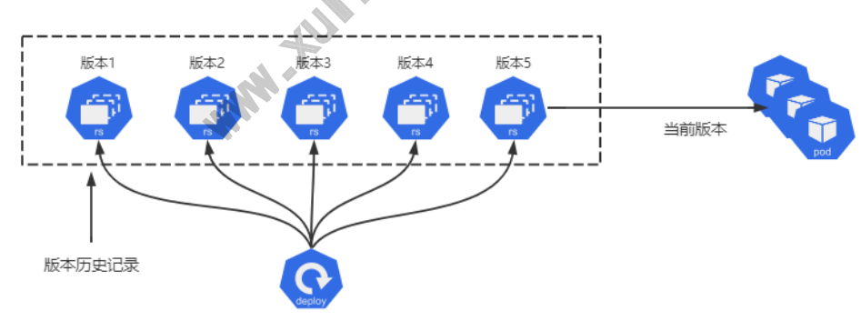

```
[root@master ~]# kubectl rollout history deployment
```
### 7.5 progressDeadlineSeconds

滚动更新故障超时时⻓，默认为600秒，k8s 在升级过程中有可能由于各 种原因升级卡住（这个时候还没有明确的升级失败），⽐如在拉取被墙的 镜像，权限不够等错误。如果配置 progressDeadlineSeconds，当达 到了时间如果还卡着，则会上报这个异常情况，这个时候这个 Deployment 状态就被标记为 False，并且注明原因。但是它并不会阻 ⽌ Deployment 继续进⾏卡住后⾯的升级操作。

## 8.Deployment实现灰度发布

灰度发布（⼜名⾦丝雀发布）是指⿊与⽩之前，能够平滑过度的⼀种发布 ⽅式，在上⾯可以进⾏A/B Testing 1、⾸先：让⼀部分⽤户继续使⽤产品特性A（旧版本） 2、其次：让⼀部分⽤户开始使⽤产品特性B（新版本） 3、最后：如果⽤户对产品特性B没有反对意⻅，那么逐步扩⼤反问， 将⽤户的流量迁移到B上⾯来。 www.xuliangwei.com 使⽤灰度发布的模式，可以及时发现问题，调整问题，以减少影响的速 度，保证整体系统的稳定运⾏。

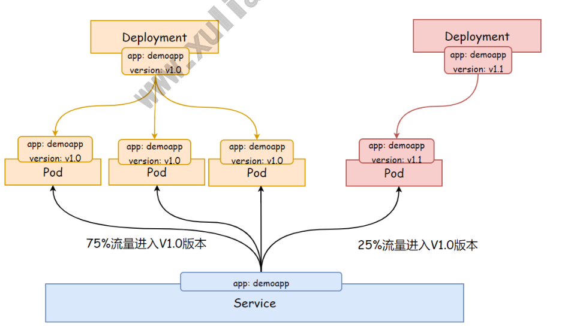

如果新版本没有问题，那么逐步扩⼤新版本的访问流量，然后减少旧版本 的访问流量。

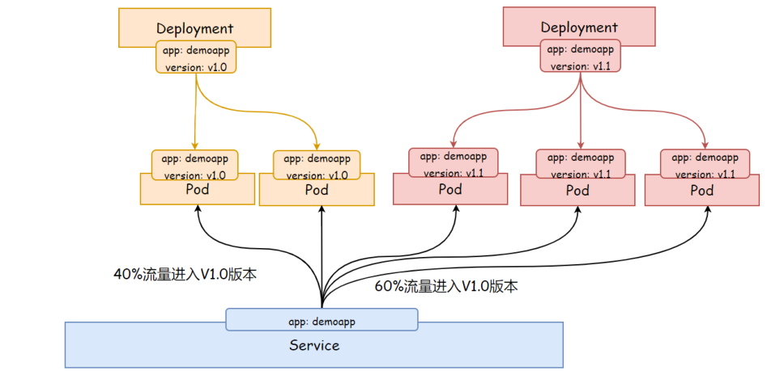

最后删除旧版本的Deployment，或者将replicaset副本数设定为0， ⾄此所有的流量都进⼊新版本。 www.xuliangwei.com

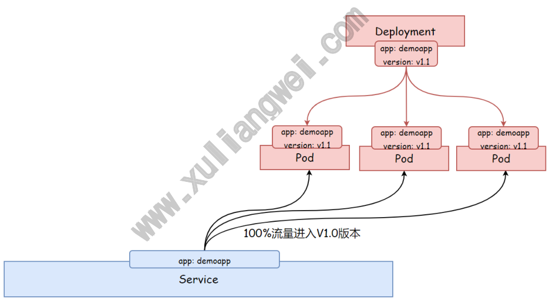

8.1 部署1.0版本应⽤

```
[root@master tmp]# cat demoapp-version10.yaml apiVersion: apps/v1

kind: Deployment metadata: name: demoapp-version-10-prod spec: replicas: 3 selector: matchLabels: app: demoapp version: v1.0 template: metadata: labels: app: demoapp version: v1.0 www.xuliangwei.com spec: containers:

- name: demoapp

image: oldxu3957/demoapp:v1.0

deployment.apps/demoapp-version-10-prod created [root@master tmp]# kubectl get pod NAME                                       READY STATUS             RESTARTS         AGE demoapp-version-10-prod-5499c6ddc7-q84z8   1/1 Running            0                5s demoapp-version-10-prod-5499c6ddc7-t7qk7   1/1 Running            0                5s demoapp-version-10-prod-5499c6ddc7-vdpvs   1/1 Running            0                5s
```
### 8.2 部署负载均衡服务

```
1.编写负载均衡yaml，它会通过标签选择器选择app=demoapp的Pod [root@master ~]# cat demoapp-service.yaml apiVersion: v1 kind: Service metadata: name: demoapp-service spec: selector: app: demoapp

ports: www.xuliangwei.com

- name: http

port: 80 targetPort:
```
## 2.获取Service的IP

```
[root@master tmp]# kubectl get service NAME              TYPE        CLUSTER-IP EXTERNAL-IP   PORT(S)          AGE demoapp-service   ClusterIP   10.96.54.90     <none> 80/TCP           4s 3.访问v1.0应⽤

[root@master ~]# curl 10.96.54.90/version demoapp v1.0 !" [root@master ~]# curl 10.96.54.90/version demoapp v1.0 !" [root@master ~]# curl 10.96.54.90/version demoapp v1.0 !" 8.3 部署1.1版本应⽤ [root@master tmp]# cat demoapp-version11.yaml apiVersion: apps/v1 kind: Deployment metadata: www.xuliangwei.com name: demoapp-version-11-prod spec: replicas: 1         # 部署⼀个副本作为灰度应⽤ selector: matchLabels: app: demoapp version: v1.1 template: metadata: labels: app: demoapp version: v1.1 spec: containers:

- name: demoapp

image: oldxu3957/demoapp:v1.1
```
### 8.4 测试新⽼版本共存

```
[root@master ~]# curl 10.96.54.90/version demoapp v1.0 !" [root@master ~]# curl 10.96.54.90/version demoapp v1.0 !" [root@master ~]# curl 10.96.54.90/version demoapp v1.1 !" [root@master ~]# curl 10.96.54.90/version demoapp v1.0 !" [root@master ~]# curl 10.96.54.90/version demoapp v1.1 !"
```
### 8.5 控制新⽼版本流量

1、逐步增加1.1版本的流量 [root@master tmp]# vim demoapp-version11.yaml spec: replicas: 3   # 增加副本数量，这样就能接收更⼤⽐例的流量 2、逐步减少1.0版本的流量 [root@master tmp]# vim demoapp-version10.yaml spec: replicas: 0   # 副本数调为0，或者删除Deployment
