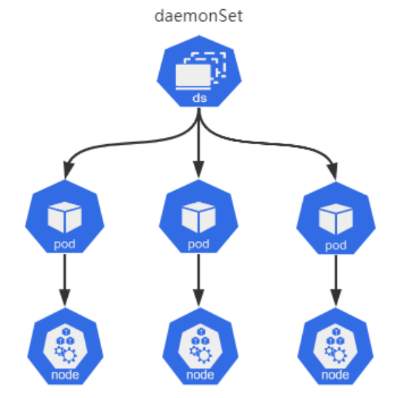

# 06 Kubernetes资源DaemonSet

## 目录

- [1.DaemonSet基本概述](#1.daemonset基本概述)
  - [1.1 什么是DaemonSet](#1.1-什么是daemonset)
  - [1.2 DaemonSet典型⽤法](#1.2-daemonset典型法)
  - [1.3 DaemonSet编写示例](#1.3-daemonset编写示例)
- [2.DaemonSet部署应⽤](#2.daemonset部署应)
  - [2.1 DaemonSet部署示例](#2.1-daemonset部署示例)
  - [2.1 DaemonSet部署node_exporter](#2.1-daemonset部署node_exporter)
- [3.DaemonSet更新策略](#3.daemonset更新策略)
  - [3.1 RollingUpdate](#3.1-rollingupdate)
  - [3.2 OnDelete](#3.2-ondelete)

## 1.DaemonSet基本概述

### 1.1 什么是DaemonSet

DaemonSet 控制器是⽤来保证在所有节点上运⾏⼀个 Pod 的副本。 当有节点加⼊集群时， 也会为他们新增⼀个 Pod。 当有节点从集群移 除时，这些 Pod 也会被回收。删除 DaemonSet 将会删除它创建的所 有 Pod。



### 1.2 DaemonSet典型⽤法

在每个节点上运⾏集群存储守护进程，如：Gluster、Ceph 在每个节点上运⾏⽇志收集守护进程，如：fluentd、Filebeat、 Logstash 在每个节点上运⾏监控守护进程，如：Prometheus Node Exporter、 在每个节点上运⾏⽹络插件为Pod提供⽹络服务，如：flannel、 calico

### 1.3 DaemonSet编写示例

DaemonSet 是标准的API资源类型，它在spec字段中嵌套字段有 selector、tempalte，与Deployment⽤法基本相同，但 DaemonSet 不管理 Replicas，因为 DaemonSet不是基于期望的副本 数，⽽是基于节点数量来控制Pod数量。 apiVersion: apps/v1         # API群组及版本 kind: DaemonSet           # 资源类型表示 metadata:

name: <string>          # 资源名称 namespace: <string>       # 名称空间：DaemonSet资源 ⾪属于名称空间级别 spec: minReadySeconds: <integer>    # Pod就绪后多少秒内任⼀ 容器⽆崩溃⽅视为 “就绪” selector: <object>        # 标签选择器，必须匹配 template字段中Pod模板的标签 revisionHistoryLimit: <integer> # 滚动更新历史记录数 量，默认为10 updateStrategy: <Object>      # 滚动更新策略 type: <string>          # 滚动更新类型，可⽤值有 OnDelete和RollingUpdate rollingUpdate: <Object>     # 滚动更新参数，专⽤于 RollingUpdate类型 maxSurge: <string>      # 滚动更新参数，更新期间 存在的总Pod对象数量最多可超出期望值的个数 maxUnavailable: <string>    # 滚动更新参数，升级 期间不可⽤的Pod副本数 template: <Object>        # Pod模板 metadata: <Object>        # Pod名称 spec: <Object>          # Pod详情

## 2.DaemonSet部署应⽤

### 2.1 DaemonSet部署示例

```
[root@master ~]# cat nginx_daemonset.yaml apiVersion: apps/v1 kind: DaemonSet metadata: name: nginx-ds

namespace: default spec: selector: matchLabels: app: nginx template: metadata: labels: app: nginx spec: containers:

- name: nginx

image: nginx:1.16 ports:

- name: http

containerPort: 80 livenessProbe: tcpSocket: port: 80 initialDelaySeconds: 3 readinessProbe: httpGet: path: "/" port: 80 scheme: HTTP initialDelaySeconds:
```
### 2.1 DaemonSet部署node_exporter

```
1.为每个节点都运⾏⼀份 Node_exporter，采集当前节点的信息； [root@master ~]# cat node_exporter.yaml apiVersion: apps/v1

kind: DaemonSet metadata: name: node-exports-ds namespace: default spec: selector: matchLabels: app: node-exporter template: metadata: labels: app: node-exporter spec: containers:

- name: prometheus-node-exporter

image: prom/node-exporter:v0.18.0 ports:

- name: node-ex-http

containerPort: 9100 hostPort: 9100 livenessProbe: tcpSocket: port: node-ex-http initialDelaySeconds: 3 readinessProbe: httpGet: path: '/metrics' port: node-ex-http scheme: HTTP initialDelaySeconds: 5 hostNetwork: true       # 共享主机⽹络 hostPID: true         # 获取主机的PID
```
#nodeSelector:                 # 节点选择器（选 择哪些节点部署Ingress，默认所有） #type: ssd                   # 如果节点有 type=ssd 标签，则部署

```
[root@master ~]# kubectl describe daemonsets.apps node-exports-ds Desired Number of Nodes Scheduled: 3 Current Number of Nodes Scheduled: 3 Number of Nodes Scheduled with Up-to-date Pods: 3 Number of Nodes Scheduled with Available Pods: 3 Number of Nodes Misscheduled: 0 Pods Status:  3 Running / 0 Waiting / 0 Succeeded /

3.node_exporter默认监听在TCP的9100端⼝上，我们可以向任何⼀台 节点IP发起访问，进⾏验证。 [root@master ~]# curl -s 10.0.0.204:9100/metrics | grep load15 # HELP node_load15 15m load average. # TYPE node_load15 gauge node_load15 0.27

[root@master ~]# curl -s 10.0.0.205:9100/metrics | grep load15 # HELP node_load15 15m load average. # TYPE node_load15 gauge node_load15 0.18
```
## 3.DaemonSet更新策略

DaemonSet也⽀持更新策略，它⽀持 OnDelete 和 RollingUpdate 两种 OnDelete：是在相应节点的Pod资源被删除后重建为新版本，从⽽ 允许⽤户⼿动编排更新过程。 RollingUpdate：滚动更新，⼯作逻辑和Deployment滚动更新类 似；

### 3.1 RollingUpdate

```
1.将此前创建的node-expoter中的pod模板镜像修改为 prom/node- exporter:v0.18.1，便能测试其更新过程。 [root@master ~]# cat node_exporter.yaml apiVersion: apps/v1 kind: DaemonSet metadata: name: node-exports-ds namespace: default spec: minReadySeconds: 3 revisionHistoryLimit: 20 updateStrategy: type: RollingUpdate       # 滚动更新（默认更新策 略） rollingUpdate: maxUnavailable: 1 selector: matchLabels: app: node-exporter

template:

metadata: labels: app: node-exporter spec: containers:

- name: prometheus-node-exporter

image: prom/node-exporter:v0.18.1 # 将 v0.18.0镜像升级为v0.18.1 ports:

- name: node-ex-http

containerPort: 9100 hostPort: 9100 livenessProbe: tcpSocket: port: node-ex-http initialDelaySeconds: 3 readinessProbe: httpGet: path: '/metrics' port: node-ex-http scheme: HTTP initialDelaySeconds: 5 hostNetwork: true hostPID: true 2.安装默认的 RollingUpdate 策略，node-exports-ds 资源将采 ⽤⼀次更新⼀个Pod对象，待新建Pod的对象就绪后，在更新下⼀个Pod 对象，直到全部完成。

[root@master daemonset]# kubectl describe daemonsets.apps node-exports-ds Events: Type    Reason            Age   From Message ----    ------            ----  ---- ------- Normal  SuccessfulDelete  96s   daemonset- controller  Deleted pod: node-exports-ds-p9w52 Normal  SuccessfulCreate  95s   daemonset- controller  Created pod: node-exports-ds-hcbfn Normal  SuccessfulDelete  62s   daemonset- controller  Deleted pod: node-exports-ds-fjc6x Normal  SuccessfulCreate  61s   daemonset- controller  Created pod: node-exports-ds-lgtsc
```
### 3.2 OnDelete

```
1.将此前创建的node-expoter中的pod模板镜像更新为 prom/node- exporter:v1.3.1，由于升级版本跨度过⼤，⽆法确保升级过程中的稳 定性，我们就不得不使⽤ OnDelete 策略来替换默认的 RollingUpdate 策略。 [root@master daemonset]# cat node_exporter.yaml apiVersion: apps/v1 kind: DaemonSet metadata: name: node-exports-ds namespace: default spec: minReadySeconds: 3 revisionHistoryLimit:

updateStrategy: type: OnDelete          # 使⽤ OnDelete更新策略

selector: matchLabels: app: node-exporter

template: metadata: labels: app: node-exporter spec: containers:

- name: prometheus-node-exporter

image: prom/node-exporter:v1.3.1    # 调整镜 像版本 ports:

- name: node-ex-http

containerPort: 9100 hostPort: 9100 livenessProbe: tcpSocket: port: node-ex-http initialDelaySeconds: 3 readinessProbe: httpGet: path: '/metrics' port: node-ex-http scheme: HTTP initialDelaySeconds: 5 hostNetwork: true hostPID: true
```
2.由于 OnDelete 并⾮⾃动完成升级，它需要管理员⼿动删除Pod，然 后重新拉起新的Pod，才能完成更新。（对于升级有着先后顺序的软件， 这种⽅法就⾮常的有⽤；） [root@master ~]# kubectl delete pod node-exports-ds- sg756 node-exports-ds-lgtsc pod "node-exports-ds-sg756" deleted pod "node-exports-ds-lgtsc" deleted

```
[root@master ~]# kubectl get pod NAME                        READY   STATUS RESTARTS   AGE node-exports-ds-8bx4j       1/1     Running   0 68s node-exports-ds-mdm2s       1/1     Running   0 68s

[root@master ~]# kubectl get pod node-exports-ds- 8bx4j -o yaml containers:

- image: prom/node-exporter:v1.3.1
```
