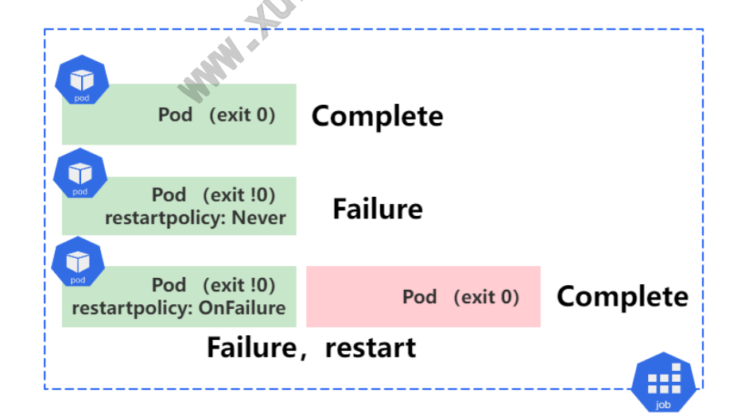
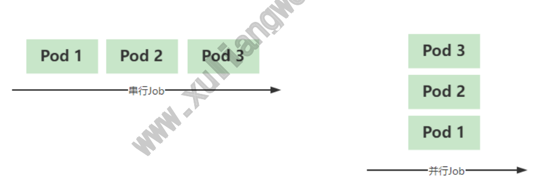
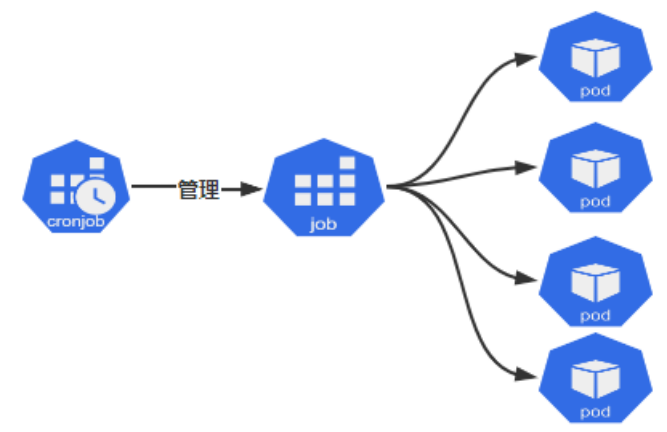

# 07 Kubernetes资源Job、

## 目录

- [07 Kubernetes资源Job、CronJob](#07-kubernetes资源jobcronjob)
- [4.CronJob](#4.cronjob)
- [1.Job基本概念](#1.job基本概念)
  - [1.1 什么是Job](#1.1-什么是job)
  - [1.2 Job⼯作⽅式](#1.2-job作式)
  - [1.3 Job基础资源](#1.3-job基础资源)
  - [1.4 Job示例代码](#1.4-job示例代码)
- [2.并⾏读取RabbitMQ数据实践](#2.并读取rabbitmq数据实践)
  - [2.1 创建Rabbitmq服务](#2.1-创建rabbitmq服务)
  - [2.2 消息发布者（User）](#2.2-消息发布者user)
  - [2.3 消息订阅者（Job）](#2.3-消息订阅者job)
    - [2.3.1 编写获取队列程序](#2.3.1-编写获取队列程序)
    - [2.3.2 编写Dockerfile](#2.3.2-编写dockerfile)
    - [2.3.3 编写Job任务](#2.3.3-编写job任务)
    - [2.3.4 检查Job](#2.3.4-检查job)
    - [2.3.5 检查Pod](#2.3.5-检查pod)
    - [2.3.6 注意事项](#2.3.6-注意事项)
- [3.并⾏读取Redis数据实践](#3.并读取redis数据实践)
  - [3.1 创建Redis服务](#3.1-创建redis服务)
  - [3.2 消息发布者（User）](#3.2-消息发布者user)
  - [3.3 消息订阅者（Job）](#3.3-消息订阅者job)
    - [3.3.1 编写获取队列程序](#3.3.1-编写获取队列程序)
    - [3.3.2 编写Dockerfile](#3.3.2-编写dockerfile)
    - [3.3.3 编写Job任务](#3.3.3-编写job任务)
    - [3.3.4 检查Job](#3.3.4-检查job)
    - [3.3.5 检查Pod](#3.3.5-检查pod)
  - [4.1 什么是CronJob](#4.1-什么是cronjob)
  - [4.2 CronJob基础资源](#4.2-cronjob基础资源)
  - [4.3 CronJob代码示例](#4.3-cronjob代码示例)
  - [4.4 CronJob并发执⾏](#4.4-cronjob并发执)
- [5.每分钟从Redis队列获取数据实践](#5.每分钟从redis队列获取数据实践)
  - [5.1 创建Redis服务](#5.1-创建redis服务)
  - [5.2 消息发布者（User）](#5.2-消息发布者user)
  - [5.3 消息订阅者（CronJob）](#5.3-消息订阅者cronjob)
  - [5.4 检查任务执⾏详情](#5.4-检查任务执详情)
- [1.检查CronJob](#1.检查cronjob)
  - [5.5 再次发布消息](#5.5-再次发布消息)
  - [5.6 再次检查Job、Pod](#5.6-再次检查jobpod)
- [1.检查Job](#1.检查job)
- [9114-f564bc895364](#9114-f564bc895364)

CronJob

## 07 Kubernetes资源Job、CronJob

www.xuliangwei.com

## 4.CronJob

## 1.Job基本概念

### 1.1 什么是Job

Job控制器常⽤于管理那些运⾏⼀段时间就能够 “完成” 的任务，例如 离线数据分析，数据备份等，当任务完成后，由Job控制器将该Pod对象 www.xuliangwei.com 置于 Complete 完成状态，在完成⼀定时间后，当达到了⽤户指定的⽣ 存周期，由系统⾃动删除该任务。 如果，容器中的进程因 “错误” ⽽终⽌，则需要依赖 RestartPolicy 配置来确定是否重启，如果是因为节点故障造成 Pod意外终⽌的话，会 被重新创建起来继续运⾏。



1、Pod执⾏，退出状态码为0，则表示执⾏成功，⽽后将该Pod状态

置于Complete； 2、Pod执⾏，退出状态码为⾮0，检查restartpolicy为 Never，表示永不重启，⽽后将该Pod状态置于Failure； 3、Pod执⾏，退出状态码为⾮0，检查restartpolicy为 OnFailure，表示退出状态码如果不为0时重启该Pod，所以会尝试 重新拉取Pod，直到执⾏成功为⽌；

### 1.2 Job⼯作⽅式

在实际⽣产环境中，有些任务可能需要运⾏不⽌⼀次，⽤户可以配置他们 以串⾏或并⾏⽅式运⾏起来。 串⾏Job：将⼀个作业串⾏执⾏多次直到满⾜期望的次数； 并⾏Job：设定⼯作队列数，同时运⾏，⽽每个队列仅运⾏⼀个作 业； www.xuliangwei.com 注意：对于有严格次序要求的作业，只能选择串⾏执⾏，⽽没有严格次序 要求的可以选择并⾏来提升运⾏的效率和速度；



### 1.3 Job基础资源

```
apiVersion: batch/v1          # API群组及版本 kind: Job               # 资源类型 metadata: name: <string>            # 资源名称 namespace: <string>         # 名称空间 spec:
```
selector: <Object>          # 标签选择器 completions: <integer>        # 期望成功完成作业的次 数 parallelism: <integer>        # 作业的最⼤并⾏度，默 认为1 backoffLimit: <integer>       # 将作业标记为Failed之 前的重试次数，默认为6 activeDeadlineSeconds: <integer>    # 作业启动后可处 于活动状态的时⻓，超出则会被标记为Failed ttlSecondsAfterFinished: <integer>  # 作业的最⼤⽣存 时⻓，超期将被删除，0表示⽴即删除 template: <Object>          # Pod模板 spec: <Object> container: <Object>       # Pod容器详情 www.xuliangwei.com restartpolicy: <string>     # Pod重启策略，默认 的Always并不适应，因此必须单独指定

### 1.4 Job示例代码

```
de 得 烂 [root@master job]# cat job-demo.yaml apiVersion: batch/v1 kind: Job metadata: name: job-demo spec: completions: 5                # 需要成功运⾏5次 parallelism: 1                # 并⾏执⾏为1 backoffLimit: 2               # 失败后，允许重试 2 次 activeDeadlineSeconds: 120    # 总活跃时间为120s,包 含运⾏Pod时间+异常重试次数时间
```
ttlSecondsAfterFinished: 100  # Job-demo在结束100秒 之后，会被系统⾃动删除（⽆论执⾏成功或失败）

```
template: spec: containers:

- name: myjob

image: alpine:latest command: ["/bin/sh", "-c", "sleep 3"] restartPolicy: OnFailure
```
## 2.并⾏读取RabbitMQ数据实践

www.xuliangwei.com

本例中，我们会运⾏包含多个并⾏⼯作进程的 Kubernetes Job。⽂档 本例中，每个Pod⼀旦被创建，会⽴即从任务队列中取⾛⼀个消息，然后 将消息从队列中删除并退出本次任务。 下⾯是本次示例的主要步骤： 1、启动⼀个消息队列服务：我们使⽤ RabbitMQ。 2、创建⼀个队列，放上消息数据：每个消息表示⼀个要执⾏的任 务。 3、启动⼀个Job，该Job启动多个 Pod：每个Pod从消息队列中取 ⾛⼀个任务，处理它，然后重复执⾏，直到队列的队尾。

### 2.1 创建Rabbitmq服务

1.部署rabbitmq消息队列服务

```
[root@master ~]# cat rabbitmq-deploy.yaml apiVersion: apps/v1 kind: Deployment

metadata: name: rabbitmq-controller spec: replicas: 1 selector: matchLabels: app: mq template: metadata: labels: app: mq spec: containers:

- name: rabbitmq-server

www.xuliangwei.com image: rabbitmq ports:

- containerPort: 5672

resources: limits: cpu: 100m 2.部署service，使得集群内Pod可以通过servicename访问该服务 [root@master ~]# cat rabbitmq-service.yaml apiVersion: v1 kind: Service metadata: name: rabbitmq-service spec: selector: app: mq ports:

- port: 5672
```
### 2.2 消息发布者（User）

1.启动临时容器测试

```
启动ubuntu18:04镜像，然后安装⼀些⼯具 [root@master ~]# kubectl run -i !"tty temp !"image ubuntu:18.04 root@temp-loe07:/# apt-get update root@temp-loe07:/# apt-get install -y curl ca- certificates amqp-tools python dnsutils

如果觉得安装过于耗时，可以启动我已安装好⼯具的镜像 [root@master ~]# kubectl run -i !"tty temp !"image oldxu3957/mqtools:latest www.xuliangwei.com
```
2.验证rabbitmq服务

```
rabbitmq-service 可以通过dns解析到对应的serviceIP root@temp-loe07:/# export BROKER_URL=amqp:!#guest:guest@rabbitmq-service:5672

创建队列： root@temp-loe07:/# /usr/bin/amqp-declare-queue !" url=$BROKER_URL -q foo

向它推送⼀条消息: root@temp-loe07:/# /usr/bin/amqp-publish !" url=$BROKER_URL -r foo -p -b oldxu

然后取回它 root@temp-loe07:/# /usr/bin/amqp-consume !" url=$BROKER_URL -q foo -c 1 cat !$
echo oldxu

3.为队列增加任务，创建⼀个job1的队列，然后给队列中填充了8个消息 export BROKER_URL=amqp:!#guest:guest@rabbitmq- service:5672 /usr/bin/amqp-declare-queue !"url=$BROKER_URL -q job1

for f in aa bb cc dd ee ff gg hh
do /usr/bin/amqp-publish !"url=$BROKER_URL -r job1 -p -b $f
done www.xuliangwei.com
```
### 2.3 消息订阅者（Job）

现在我们可以创建镜像，获取数据，然后以Job⽅式运⾏起来；

#### 2.3.1 编写获取队列程序

```
获取队列数据，然后等待10s，结束 [root@node1 work-queue]# cat worker.py !%/usr/bin/env python
```
Just prints standard out and sleeps
```
for 10 seconds. import sys import time print("Processing " + sys.stdin.readlines()[0]) time.sleep(10)
```
#### 2.3.2 编写Dockerfile

```
编写Dockerfile⽂件，制作为镜像，然后推送到⾃⼰的仓库；（注意镜 像中需要传递的变量） [root@node1 work-queue]# cat Dockerfile # Specify BROKER_URL and QUEUE when running FROM ubuntu:18.04

RUN apt-get update !$ \ apt-get install -y curl ca-certificates amqp- tools python \ !"no-install-recommends \ !$ rm -rf /var/lib/apt/lists!& COPY ./worker.py /worker.py RUN chmod +x /worker.py www.xuliangwei.com CMD  /usr/bin/amqp-consume !"url=$BROKER_URL -q $QUEUE -c 1 /worker.py
```
#### 2.3.3 编写Job任务

```
编写Job任务，每个 Pod 使⽤队列中的⼀个消息然后退出。这样，Job 的完成计数就代表了完成的⼯作项的数量。 [root@master job]# cat rabbitmq-consumer.yaml apiVersion: batch/v1 kind: Job metadata: name: rabbitmq-consumer spec: completions: 8          # 总共运⾏8次，因为队列中有8条 消息 parallelism: 2          # 并⾏执⾏2个任务 ttlSecondsAfterFinished: 1000   # 结束后1000s删除 template:

spec: containers:

- name: mq-consumer-work

image: oldxu3957/rabbit-mq-consumer-job env:

- name: BROKER_URL

value: amqp:!#guest:guest@rabbitmq- service:5672

- name: QUEUE

value: job1 restartPolicy: OnFailure
```
#### 2.3.4 检查Job

```
www.xuliangwei.com [root@master job]#   kubectl describe jobs rabbitmq- consumer Name:             rabbitmq-consumer Namespace:        default Selector:         controller-uid=efc03e23-cfcf-4197- 9f5a-273962524b3a Labels:           controller-uid=efc03e23-cfcf-4197- 9f5a-273962524b3a job-name=rabbitmq-consumer Annotations:      <none> Parallelism:      2 Completions:      8 Completion Mode:  NonIndexed Start Time:       Sat, 16 Apr 2022 20:04:22 +0800 Completed At:     Sat, 16 Apr 2022 20:05:12 +0800 Duration:         50s Pods Statuses:    0 Running / 8 Succeeded / 0 Failed Pod Template:

Labels:  controller-uid=efc03e23-cfcf-4197-9f5a- 273962524b3a job-name=rabbitmq-consumer Containers: mq-consumer-work: Image:      registry.cn- huhehaote.aliyuncs.com/oldxu3957/rabbit-mq-consumer- job Port:       <none> Host Port:  <none> Environment: BROKER_URL:  amqp:!#guest:guest@rabbitmq- service:5672 QUEUE:       job1 www.xuliangwei.com Mounts:        <none> Volumes:         <none> Events: Type    Reason            Age   From Message ----    ------            ----  ----            !" ----- Normal  SuccessfulCreate  2m4s  job-controller Created pod: rabbitmq-consumer!"1-vk2c9 Normal  SuccessfulCreate  2m4s  job-controller Created pod: rabbitmq-consumer!"1-b78f8 Normal  SuccessfulCreate  112s  job-controller Created pod: rabbitmq-consumer!"1-9mxc4 Normal  SuccessfulCreate  112s  job-controller Created pod: rabbitmq-consumer!"1-s4sz5 Normal  SuccessfulCreate  99s   job-controller Created pod: rabbitmq-consumer!"1-5nxb9 Normal  SuccessfulCreate  98s   job-controller Created pod: rabbitmq-consumer!"1-bf9xs

Normal  SuccessfulCreate  87s   job-controller Created pod: rabbitmq-consumer!"1-8tk9j Normal  SuccessfulCreate  86s   job-controller Created pod: rabbitmq-consumer!"1-28pkc Normal  Completed         74s   job-controller Job completed
```
#### 2.3.5 检查Pod

```
通过检查Pod的Logs，可以看到消息被取⾛了 [root@master job]# kubectl logs rabbitmq-consumer- -1-28pkc Processing aa www.xuliangwei.com [root@master job]# kubectl logs rabbitmq-consumer- -1-5nxb9 Processing ff [root@master job]# kubectl logs rabbitmq-consumer- -1-8tk9j Processing dd ....
```
#### 2.3.6 注意事项

如果设置的完成数量⼩于队列中的消息数量，会导致⼀部分消息项不会被 执⾏。 如果设置的完成数量⼤于队列中的消息数量，当队列中所有的消息都处理 完成后， Job 也会显示为未完成。Job 将创建 Pod 并阻塞等待消息 输⼊。 当发⽣下⾯两种情况时，即使队列中所有的消息都处理完了，Job 也不 会显示为完成状态： 在 amqp-consume 命令拿到消息和容器成功退出之间的时间段内，

执⾏杀死容器操作； 在 kubelet 向 api-server 传回 Pod 成功运⾏之前，发⽣节 点崩

## 3.并⾏读取Redis数据实践

在这个例⼦中，我们会运⾏⼀个Kubernetes Job，其中的 Pod 会运⾏ 多个并⾏⼯作进程。⽂档 在这个例⼦中，当每个pod被创建时，它会从⼀个任务队列中获取⼀个⼯ 作单元，处理它，然后重复，直到到达队列的尾部。 下⾯是这个示例的步骤概述： 1、启动Redis 存储服务⽤于保存⼯作队列：在上⼀个例⼦中，我 们使⽤了 RabbitMQ，但⽆法提供⼀个良好的⽅式来检测⼀个有限 ⻓度的⼯作队列是否为空，所以我们本次使⽤Redis，和⼀个⾃定义 的⼯作队列客户端。 www.xuliangwei.com 2、创建⼀个队列，然后向其中填充消息：每个消息表示⼀个将要被 处理的⼯作任务。 3、启动⼀个 Job 对队列中的任务进⾏处理：这个Job启动了若⼲ 个Pod。每个 Pod 从消息队列中取出⼀个⼯作任务，处理它，然后 重复，直到到达队列的尾部。

### 3.1 创建Redis服务

1.部署redis消息队列服务

```
[root@master job]# cat redis-deploy.yaml apiVersion: v1 kind: Pod metadata: name: redis-master labels: app: redis spec: containers:

- name: redis

image: redis ports:

- containerPort: 6379

www.xuliangwei.com 2.部署service，使得集群内Pod可以通过servicename访问该服务 [root@master ~]# cat redis-service.yaml apiVersion: v1 kind: Service metadata: name: redis       # 后期可以通过redis名称直接连接 redis服务 spec: selector: app: redis ports:

- port: 6379

targetPort: 6379
```
### 3.2 消息发布者（User）

现在，让我们。

```
1.启动⼀个临时的可交互的 pod ⽤于运⾏ Redis 命令⾏界⾯。 [root@master ~]# kubectl run -i !"tty temp !"image redis !"command "/bin/sh" 2.连接Redis服务，然后往队列中添加⼀些任务，这个job2列表，就是 我们的⼯作队列。 # redis-cli -h redis redis:6379> rpush job2 "oldxu1" (integer) 1 redis:6379> rpush job2 "oldxu2" (integer) 2 redis:6379> rpush job2 "oldxu3" www.xuliangwei.com (integer) 3 redis:6379> rpush job2 "oldxu4" (integer) 4 redis:6379> rpush job2 "oldxu5" (integer) 5 redis:6379> lrange job2 0 -1

1) "oldxu1"

2) "oldxu2"

3) "oldxu3"

4) "oldxu4"

5) "oldxu5"

redis:6379>
```
### 3.3 消息订阅者（Job）

现在我们可以创建镜像，获取数据，然后以Job⽅式运⾏起来；

#### 3.3.1 编写获取队列程序

我们会使⽤⼀个带有 redis 客户端的 python ⼯作程序从消息队列中 读出消息。 这⾥提供了⼀个简单的 Redis ⼯作队列客户端库，叫 rediswq.py (下载)。然后 Job 中每个 Pod 内的 “⼯作程序” 使⽤⼯作队列客户 端库获取数据。如下： [root@master ~]# cat worker.py !%/usr/bin/env python

import time import rediswq

```
host="redis"    # 连接redis的service名称 www.xuliangwei.com
```
Uncomment next two lines
```
if you
do not have Kube- DNS working. # import os # host = os.getenv("REDIS_SERVICE_HOST")

q = rediswq.RedisWQ(name="job2", host=host) print("Worker with sessionID: " +  q.sessionID()) print("Initial queue state: empty=" + str(q.empty()))
while not q.empty(): item = q.lease(lease_secs=10, block=True, timeout=2)
if item is not None: itemstr = item.decode("utf-8") print("Working on " + itemstr) time.sleep(10) # Put your actual work here instead of sleep. q.complete(item)
else:

print("Waiting
for work") print("Queue empty, exiting")
```
#### 3.3.2 编写Dockerfile

```
编写Dockerfile⽂件，制作为镜像，然后推送到⾃⼰的仓库； [root@master ~]# cat Dockerfile FROM python:alpine3.15 RUN pip install redis COPY ./worker.py /worker.py COPY ./rediswq.py /rediswq.py RUN chmod +x /worker.py /rediswq.py CMD  python worker.py www.xuliangwei.com
```
#### 3.3.3 编写Job任务

```
[root@master job]# cat redis-consumer.yaml apiVersion: batch/v1 kind: Job metadata: name: redis-consumber spec: completions: 1 parallelism: 2 ttlSecondsAfterFinished: 1000 template: spec: containers:

- name: redis-consumber

image: oldxu3957/redis-mq-consumer-job restartPolicy: OnFailure
```
在这个例⼦中，每个 pod 处理了队列中的多个项⽬，直到队列中没有项 ⽬时便退出。 因为是由⼯作程序⾃⾏检测⼯作队列是否为空，并且 Job 控制器不知道⼯作队列的存在，这依赖于⼯作程序在完成时发出信号。 ⼯作程序以成功退出的形式发出信号表示⼯作队列已经为空。 所以，只 要有任意⼀个⼯作程序成功退出，控制器就知道⼯作已经完成了，所有的 Pod 将很快会退出。因此，我们将 Job 的完成计数（Completion Count）设置为

#### 3.3.4 检查Job

```
[root@master job]# kubectl describe job redis- consumber Name:             redis-consumber www.xuliangwei.com Namespace:        default Selector:         controller-uid=80632c3a-fb89-42e2- a1af-b88a43f9f8a8 Labels:           controller-uid=80632c3a-fb89-42e2- a1af-b88a43f9f8a8 job-name=redis-consumber Annotations:      <none> Parallelism:      2 Completions:      <unset> Completion Mode:  NonIndexed Start Time:       Sat, 16 Apr 2022 23:15:12 +0800 Completed At:     Sat, 16 Apr 2022 23:15:44 +0800 Duration:         32s Pods Statuses:    0 Running / 2 Succeeded / 0 Failed Pod Template: Labels:  controller-uid=80632c3a-fb89-42e2-a1af- b88a43f9f8a8 job-name=redis-consumber Containers: redis-consumber:

Image:        registry.cn- huhehaote.aliyuncs.com/oldxu3957/redis-mq-consumer- job Port:         <none> Host Port:    <none> Environment:  <none> Mounts:       <none> Volumes:        <none> Events: Type    Reason            Age    From Message ----    ------            ----   ----            - ------ Normal  SuccessfulCreate  5m50s  job-controller www.xuliangwei.com Created pod: redis-consumber!"1-nt7q7 Normal  SuccessfulCreate  5m50s  job-controller Created pod: redis-consumber!"1-5xbwn Normal  Completed         5m18s  job-controller Job completed
```
#### 3.3.5 检查Pod

```
可以看到，其中的⼀个 pod 处理了若⼲个任务。 [root@master job]# kubectl logs redis-consumber!"1- nt7q7 Worker with sessionID: 677b1e90-7982-49f5-8684- 4feb138fd4dc Initial queue state: empty=False Working on oldxu4 Working on oldxu2 Waiting
for work Waiting
for work
```
Waiting
```
for work Queue empty, exiting

[root@master job]# kubectl logs redis-consumber!"1- 5xbwn Worker with sessionID: 2feb02fb-c0a1-4bd0-a453- 553d38d670e1 Initial queue state: empty=False Working on oldxu5 Working on oldxu3 Working on oldxu1 Queue empty, exiting www.xuliangwei.com
```
## 4.CronJob

### 4.1 什么是CronJob

CronJob 资源⽤于管理 Job 资源的运⾏时间，它允许⽤户在特定的时 间或指定的时间运⾏Job，它适合⾃动执⾏特定的任务，例如备份、报 告、发送邮件、垃圾清理等。⽽⼀个 CronJob 对象就像 crontab ⽂ 件中的⼀⾏。它⽤ Cron 格式进⾏编写



### 4.2 CronJob基础资源

```
apiVersion: betach/v1         # API群组及版本 kind: CronJob             # 资源类型 metadata: name: <string>            # 名称空间 namespace: <string>         # 资源名称 spec: concurrencyPolicy: <string>     # 并发策略，可⽤值有 Allow、Forbid、Replace failedJobsHistoryLimit: <integer>   # 失败作业历史记 www.xuliangwei.com 录数，默认为1 successfulJobsHistoryLimit: <integer> # 成功作业历史 记录数，默认为3 startingDeadlineSeconds: <integer>  # 因错过时间点⽽ 未执⾏的作业可超期时⻓ schedule: <string> -required-     # 调度时间设定，必 选字段 jobTemplate: <Object> -required-    # Job作业模板， 必选字段 metadata: <Object> spec: <Object> completions: <integer>        # 期望成功完成作业 的次数 parallelism: <integer>        # 作业的最⼤并⾏ 度，默认为1 backoffLimit: <integer>       # 将作业标记为 Failed之前的重试次数，默认为6 activeDeadlineSeconds: <integer>    # 作业启动 后可处于活动状态的时⻓，超出则会被标记为Failed

ttlSecondsAfterFinished: <integer>  # 作业的最 ⼤⽣存时⻓，超期将被删除，0表示⽴即删除 template: <Object>          # Pod模板 spec: <Object> container: <Object>       # Pod容器详情 restartpolicy: <string>     # Pod重启策略， 默认的Always并不适应，因此必须单独指定
```
### 4.3 CronJob代码示例

```
[root@master cronjob]# cat cronjob-demo.yaml apiVersion: batch/v1 kind: CronJob www.xuliangwei.com metadata: name: cronjob-demo spec: failedJobsHistoryLimit: 5       # 保留运⾏失败的 Job，5条 successfulJobsHistoryLimit: 5     # 保留运⾏成功的 Job，5条 startingDeadlineSeconds: 300      # 错过计划执⾏时 间，⽽允许延迟启动的最⻓时间 schedule: "* * * * *"         # 每分钟执⾏⼀次 jobTemplate jobTemplate: spec: parallelism: 1          # 并⾏执⾏为1 completions: 1          # 需要成功运⾏1次 backoffLimit: 3         # 失败后，允许重试 3 次 ttlSecondsAfterFinished: 3600   # Job在结束3600 秒之后，会被系统⾃动删除（⽆论执⾏成功或失败）
```
activeDeadlineSeconds: 120    # 总活跃时间为 120s,包含运⾏Pod时间+异常重试次数时间 template: spec: containers:

```
- name: mycronjob

image: alpine command:

- /bin/sh

- -c

-
echo Hello From CronJob ; sleep

restartPolicy: OnFailure www.xuliangwei.com
```
### 4.4 CronJob并发执⾏

CronJob资源的Job对象可能不⽀持同时运⾏多个实例，⽤户可基于 .spec.concurrencyPolciy 属性来控制多个CronJob并存的机制 Allow：运⾏不同时间点的多个CronJob实例同时运⾏（默认）。 Forbid：CronJob不允许并发任务执⾏；如果新任务的执⾏时间到 了⽽⽼任务没有执⾏完，CronJob会忽略新任务的执⾏。 Replace：⽤于让后⼀个CronJob取代前⼀个，即终⽌前⼀个并启动 后⼀个； 注意，并发性规则仅适⽤于相同 CronJob 创建的任务。如果有多个不 同的 CronJob，它们相应的任务总是允许并发执⾏的；

## 5.每分钟从Redis队列获取数据实践

### 5.1 创建Redis服务

1.部署redis消息队列服务

```
[root@master job]# cat redis-deploy.yaml apiVersion: v1 kind: Pod metadata: name: redis-master labels: app: redis spec: containers:

- name: redis

image: redis ports:

- containerPort: 6379

www.xuliangwei.com 2.部署service，使得集群内Pod可以通过servicename访问该服务 [root@master ~]# cat redis-service.yaml apiVersion: v1 kind: Service metadata: name: redis       # 后期可以通过redis名称直接连接 redis服务 spec: selector: app: redis ports:

- port: 6379

targetPort: 6379
```
### 5.2 消息发布者（User）

现在，让我们。

```
1.启动⼀个临时的可交互的 pod ⽤于运⾏ Redis 命令⾏界⾯。 [root@master ~]# kubectl run -i !"tty temp !"image redis !"command "/bin/sh" 2.连接Redis服务，然后往队列中添加⼀些任务，这个job2列表，就是 我们的⼯作队列。 # redis-cli -h redis redis:6379> rpush job2 "hello,cronjob1" (integer) 1 redis:6379> rpush job2 "hello,cronjob2" (integer) 2 redis:6379> rpush job2 "hello,cronjob3" www.xuliangwei.com (integer) 3 redis:6379> rpush job2 "hello,cronjob4" (integer)
```
### 5.3 消息订阅者（CronJob）

```
现在我们可以CronJob，让其定期获取 Redis中数 [root@master cronjob]# cat redis-consumer-cron.yaml apiVersion: batch/v1 kind: CronJob metadata: name: redis-consumer-cron spec: failedJobsHistoryLimit: 3 successfulJobsHistoryLimit: 3 startingDeadlineSeconds: 300 schedule: "* * * * *" jobTemplate:

spec: parallelism: 2 backoffLimit: 3 ttlSecondsAfterFinished: 3600 template: spec: containers:

- name: redis-consumer-work

image: registry.cn- huhehaote.aliyuncs.com/oldxu3957/redis-mq-consumer- job restartPolicy: OnFailure www.xuliangwei.com
```
### 5.4 检查任务执⾏详情

## 1.检查CronJob

```
[root@master cronjob]# kubectl describe cronjobs redis-consumer-cron Name:                          redis-consumer-cron Namespace:                     default Labels:                        <none> Annotations:                   <none> Schedule:                      * * * * * Concurrency Policy:            Allow Suspend:                       False Successful Job History Limit:  10 Failed Job History Limit:      3 Starting Deadline Seconds:     300s Selector:                      <unset> Parallelism:                   2 Completions:                   <unset> Pod Template:

Labels:  <none> Containers: redis-consumer-work: Image:           registry.cn- huhehaote.aliyuncs.com/oldxu3957/redis-mq-consumer- job Port:            <none> Host Port:       <none> Environment:     <none> Mounts:          <none> Volumes:           <none> Last Schedule Time:  Sun, 17 Apr 2022 00:44:00 +0800 Active Jobs:         <none> Events: www.xuliangwei.com Type    Reason            Age   From Message ----    ------            ----  ---- ------- Events: Type    Reason            Age   From Message ----    ------            ----  ----            !" ----- Normal  SuccessfulCreate  17s   job-controller Created pod: redis-consumer-cron-27502127!"1-gntsq Normal  SuccessfulCreate  17s   job-controller Created pod: redis-consumer-cron-27502127!"1-2f8nt

[root@master cronjob]# kubectl describe job redis- consumer-cron Name:             redis-consumer-cron-27502124

Namespace:        default Selector:         controller-uid=bfe2c1fb-9a90-4991- a556-93ab0c73b203 Labels:           controller-uid=bfe2c1fb-9a90-4991- a556-93ab0c73b203 job-name=redis-consumer-cron- 27502124 Annotations:      <none> Controlled By:    CronJob/redis-consumer-cron Parallelism:      2 Completions:      <unset> Completion Mode:  NonIndexed Start Time:       Sun, 17 Apr 2022 00:44:00 +0800 Completed At:     Sun, 17 Apr 2022 00:44:19 +0800 www.xuliangwei.com Duration:         19s Pods Statuses:    0 Running / 2 Succeeded / 0 Failed Pod Template: Labels:  controller-uid=bfe2c1fb-9a90-4991-a556- 93ab0c73b203 job-name=redis-consumer-cron-27502124 Containers: redis-consumer-work: Image:        registry.cn- huhehaote.aliyuncs.com/oldxu3957/redis-mq-consumer- job Port:         <none> Host Port:    <none> Environment:  <none> Mounts:       <none> Volumes:        <none> Events: Type    Reason            Age   From Message

----    ------            ----  ----            !" ----- Normal  SuccessfulCreate  58s   job-controller Created pod: redis-consumer-cron-27502124!"1-mzh69 Normal  SuccessfulCreate  58s   job-controller Created pod: redis-consumer-cron-27502124!"1-kh5rt Normal  Completed         39s   job-controller Job completed

[root@master ~]# kubectl logs redis-consumer-cron- 27502127!"1-gntsq Worker with sessionID: 30b77f3b-16df-4850-860a- www.xuliangwei.com b8216a3df544 Initial queue state: empty=False Waiting for work Waiting for work Waiting for work Waiting for work Waiting for work Queue empty, exiting

[root@master ~]# kubectl logs redis-consumer-cron- 27502127!"1-2f8nt Worker with sessionID: fa6134dc-a3e6-42a0-ba7f- 1543de460213 Initial queue state: empty=False Working on hello,cronjob4 Working on hello,cronjob3 Working on hello,cronjob2 Working on hello,cronjob1 Queue empty, exiting
```
### 5.5 再次发布消息

```
redis-cli -h redis redis:6379> rpush job2 "new data cron1" (integer) 1 redis:6379> rpush job2 "new data cron2" (integer) 2 redis:6379> rpush job2 "new data cron3" (integer) 3 redis:6379> rpush job2 "new data cron4" (integer)
```
### 5.6 再次检查Job、Pod

www.xuliangwei.com

## 1.检查Job

```
[root@master cronjob]# kubectl describe job redis- consumer-cron ....只看最新的Job对应的Pod数据 Name:             redis-consumer-cron-27502130 Namespace:        default Selector:         controller-uid=c2a7fbbf-9d57-44d1-
```
## 9114-f564bc895364

```
Labels:           controller-uid=c2a7fbbf-9d57-44d1-
```
## 9114-f564bc895364

```
job-name=redis-consumer-cron- 27502130 Annotations:      <none> Controlled By:    CronJob/redis-consumer-cron Parallelism:      2 Completions:      <unset> Completion Mode:  NonIndexed Start Time:       Sun, 17 Apr 2022 00:50:00 +0800

Pods Statuses:    2 Running / 0 Succeeded / 0 Failed Pod Template: Labels:  controller-uid=c2a7fbbf-9d57-44d1-9114- f564bc895364 job-name=redis-consumer-cron-27502130 Containers: redis-consumer-work: Image:        registry.cn- huhehaote.aliyuncs.com/oldxu3957/redis-mq-consumer- job Port:         <none> Host Port:    <none> Environment:  <none> Mounts:       <none> www.xuliangwei.com Volumes:        <none> Events: Type    Reason            Age   From Message ----    ------            ----  ----            !" ----- Normal  SuccessfulCreate  8s    job-controller Created pod: redis-consumer-cron-27502130!"1-lgcj8 Normal  SuccessfulCreate  8s    job-controller Created pod: redis-consumer-cron-27502130!"1-nlwkg 2.检查Pod，发现队列中最新数据也拿到了 [root@master cronjob]# kubectl logs redis-consumer- cron-27502130!"1-lgcj8 Worker with sessionID: 94eba315-0583-46d6-8fec- 48b1ca4463ee Initial queue state: empty=False Working on new data cron2
```
Waiting
```
for work Waiting
for work Waiting
for work Queue empty, exiting

[root@master cronjob]# kubectl logs redis-consumer- cron-27502130!"1-nlwkg Worker with sessionID: 3c7a4302-a15f-49b7-8eb6- 7f86ccabc0b0 Initial queue state: empty=False Working on new data cron4 Working on new data cron3 Working on new data cron1 Queue empty, exiting www.xuliangwei.com
```
