# 08 Kubernetes资源Service

## 目录

- [1.Service基本概念](#1.service基本概念)
  - [1.1 什么是Service](#1.1-什么是service)
  - [1.2 Service⼯作逻辑](#1.2-service作逻辑)
  - [1.3 Service具体实现](#1.3-service具体实现)
- [2.Kube-Proxy代理模型](#2.kube-proxy代理模型)
  - [2.1 userSpace](#2.1-userspace)
  - [2.2 iptables](#2.2-iptables)
  - [2.3 IPVS](#2.3-ipvs)
- [3.Service资源类型](#3.service资源类型)
  - [3.1 ClusterIP](#3.1-clusterip)
  - [3.2 NodePort](#3.2-nodeport)
  - [3.3 LoadBalance](#3.3-loadbalance)
  - [3.4 ExternalName](#3.4-externalname)
- [4.Service应⽤实践](#4.service应实践)
  - [4.1 Service配置示例](#4.1-service配置示例)
  - [4.2 ClusterIP实践](#4.2-clusterip实践)
- [1.使⽤deployment运⾏多个副本的web应⽤](#1.使deployment运多个副本的web应)
- [2.使⽤service提供web应⽤负载均衡](#2.使service提供web应负载均衡)
  - [4.3 NodePort实践](#4.3-nodeport实践)
  - [4.4 ExternalName实践](#4.4-externalname实践)
- [2.检查Service](#2.检查service)
- [5.Service与Endpoint](#5.service与endpoint)
  - [5.1 Endpoint与容器探针](#5.1-endpoint与容器探针)
  - [5.2 ⾃定义endpoint实践](#5.2-定义endpoint实践)
- [6.Service相关字段](#6.service相关字段)
  - [6.2 sessionAffinity](#6.2-sessionaffinity)
  - [6.1 externalTrafficPolicy](#6.1-externaltrafficpolicy)
  - [6.4 internalTrafficPolicy](#6.4-internaltrafficpolicy)
  - [6.1 publishNotReadyAddresses](#6.1-publishnotreadyaddresses)
- [7.Service深⼊理解](#7.service深理解)
  - [7.1 Iptables模型分析](#7.1-iptables模型分析)
  - [7.2 IPVS模型分析](#7.2-ipvs模型分析)
- [8.服务发现](#8.服务发现)
  - [8.1 环境变量](#8.1-环境变量)
  - [8.2 CoreDNS](#8.2-coredns)
  - [8.3 CoreDNS策略](#8.3-coredns策略)
- [9.HeadLess Service](#9.headless-service)
  - [9.1 什么是HeadLess](#9.1-什么是headless)
  - [9.2 HeadLess的作⽤](#9.2-headless的作)
  - [9.3 HeadLess示例](#9.3-headless示例)
- [10.guestBook案例实践](#10.guestbook案例实践)
  - [10.1 场景描述](#10.1-场景描述)
  - [10.2 部署Redis Leader](#10.2-部署redis-leader)
  - [10.3 部署Redis Follower](#10.3-部署redis-follower)
  - [10.4 部署GuestBook](#10.4-部署guestbook)
  - [10.5 验证GuestBook](#10.5-验证guestbook)
- [1.通过浏览器访问](#1.通过浏览器访问)

## 1.Service基本概念

### 1.1 什么是Service

在Kubernetes中，pod是应⽤程序的载体，当我们需要访问这个应⽤ 时，可以通过Pod的IP进⾏访问，但是这⾥有两个问题： 1、Pod的IP地址不固定，⼀旦Pod异常退出、节点故障，则会造成 Pod发⽣重建，⼀旦发⽣重建客户端则会访问失败； 2、Pod如果扩展多份，会造成客户端⽆法有效使⽤新增Pod，如果 Pod进⾏缩容⼜会造成客户端访问错误；

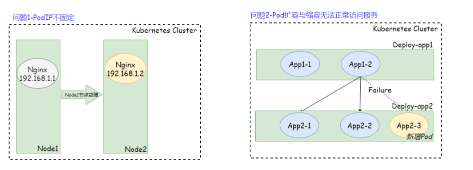

为了解决这个问题，k8s提供了service资源，Service为动态的⼀组 Pod提供⼀个固定的访问⼊⼝；service资源基于标签选择器把筛选出的 ⼀组Pod对象定义成⼀个逻辑组合，⽽后Service对外提供⾃⼰的IP和端 ⼝。 当客户端请求Service的IP和端⼝时，Service将请求调度给标签所匹 配的所有Pod，Service向客户端隐藏了真实处理请求的Pod资源，使得 客户端的请求看上去是由Service直接处理并进⾏响应。

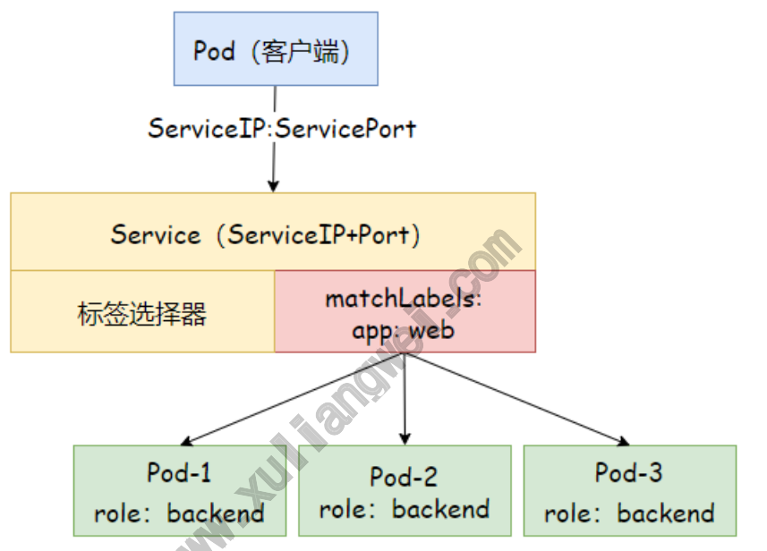

Service对象的IP地址（可称为ClusterIP或ServiceIP）是虚拟IP地 址，由Kubernetes系统在Service对象创建时在专有⽹络（Service Network）地址中⾃动分配或由⽤户⼿动指定。其次Service是基于端 ⼝过滤，并根据事先定义好的规则将请求转发⾄其后端Pod对应的端⼝ 上，因此这种代理机制也称为“端⼝代理”或“四层代理”，⼯作在TCP/IP 协议栈的传输层； Service的作⽤： 暴露流量：让⽤户可以通过ServiceIP+ServicePort访问对应后 端的Pod应⽤； 负载均衡：提供基于4层的TCP/IP负载均衡，并不提供HTTP/HTTPS

等负载均衡； 服务发现：当发现新增Pod则⾃动加⼊⾄Service的后端，如发现 Pod异常则⾃动剔除Service后端；

### 1.2 Service⼯作逻辑

Service持续监视APIServer，监视Service标签选择器所匹配的后端 Pod，并实时跟踪这些Pod对象的变动情况，例如IP地址发⽣变化、或 Pod对象新增与减少。 不过Service并不直接与Pod建⽴关联关系，它们之间还有⼀个中间层 Endpoints，Endpoints对象是⼀个由IP地址和端⼝组成的列表，这些 IP地址和端⼝则来⾃于Service标签选择器所匹配到的Pod，默认情况 下，创建Service资源时，其关联的Endpoints对象会被⾃动创建。 www.xuliangwei.com

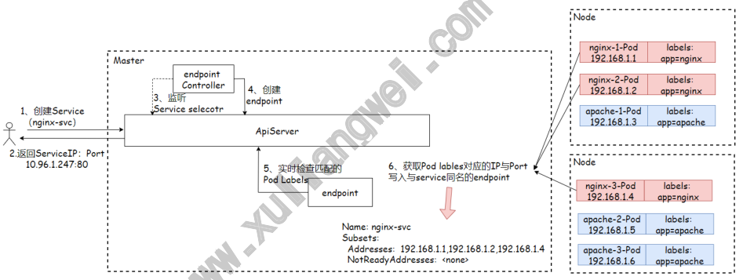

### 1.3 Service具体实现

在Kubernetes中，Service只是抽象的⼀个概念，真正起作⽤实现负载 均衡规则的其实是Kube-Proxy这个进程。它在每个节点上都需要运⾏⼀ 个Kube-Proxy，⽤来完成负载均衡规则的创建。 1、创建Service资源后，会分配⼀个随机的ServiceIP，返回给⽤ 户，然后写⼊etcd； 2、endpoints controller负责⽣成和维护所有endpoints，它 会监听Service和pod的状态，当 pod 处于 running 且准备就绪 时，endpoints controller会将 pod ip 更新到对应Service

的 endpoints 对象中，然后写⼊Etcd； 3、kube-proxy通过API-Server监听Service、Endpoints的资 源变动，⼀旦Service或Endpoints资源发⽣变化，Kube-Proxy 会将最新的信息转换为对应的Iptables、IPVS访问规则，⽽后在本 地主机上执⾏。 4、当客户端想要访问Service的时候，其实访问的就是本地节点上 的iptables、IPVS规则，由它们路由到对应节点；

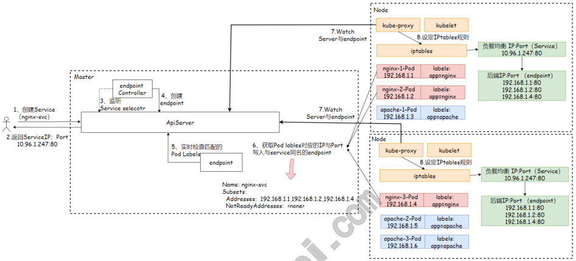

实现图上的功能，主要需要以下⼏个组件协同⼯作： Service：⽤户通过kubectl命令向apiServer发送创建Service 的请求，APIServer收到后存⼊Etcd； Endpoints：获取Service所匹配的Pod地址，⽽后将信息写⼊与 Service同名的endpoints资源中； Kube-Proxy：获取Service和Endpoints资源的变动，⽽后⽣成 Iptables、IPVS规则，在本机执⾏； Iptables：当⽤户请求serviceIP时，使⽤iptables的DNAT技术 将ServiceIP的请求调度⾄endpoint保存ip列表；

## 2.Kube-Proxy代理模型

### 2.1 userSpace

userspace模式下，kube-proxy为ServiceIP创建⼀个监听端⼝，当 ⽤户向ServiceIP发送请求，

1、⾸先请求会被Iptables规则拦截，然后重定向到Kube-Proxy对 应的端⼝； 2、然后Kube-Proxy根据调度算法选择挑选⼀个Pod，将请求调度到 该Pod上； 总结：Pod请求ServiceIP时，会被Iptables将请求拦截给⽤户空间的 Kube-Proxy，然后再经过内核空间路由到对应的Pod；

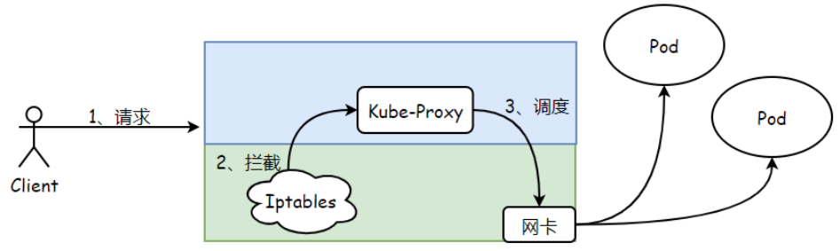

问题：该模式流量经过内核空间后，会送往⽤户空间Kube-Proxy进程， ⽽后⼜送回内核空间，发往调度分配的⽬标后端Pod；

### 2.2 iptables

iptables模式下，kube-proxy为Service后端的所有Pod创建对应的 iptables规则，当⽤户向ServiceIP发送请求； 1、⾸先Iptables会拦截⽤户请求； 2、然后直接将请求调度到后端的Pod； 总结：Pod请求ServiceIP时，Iptables将请求拦截并且直接完成调 度，然后路由到对应的Pod，所以效率⽐userspace⾼；

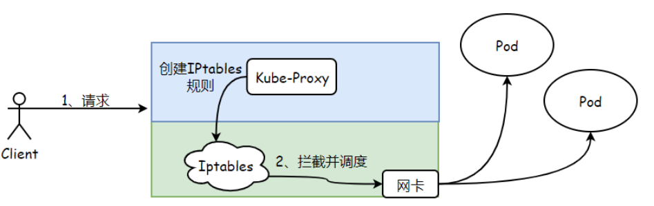

问题：⼀个Service会创建出⼤量的规则，且不⽀持更⾼级的调度算法， 当Pod不可⽤也⽆法重试；

### 2.3 IPVS

ipvs模式和iptables类似，kube-proxy为Service后端所有的Pod创 建对应的IPVS规则，⼀个Service只会⽣成⼀条规则，所以规模较⼤的 场景下，应该使⽤IPVS模式。其次IPVS更多更⾼级的调度算法。

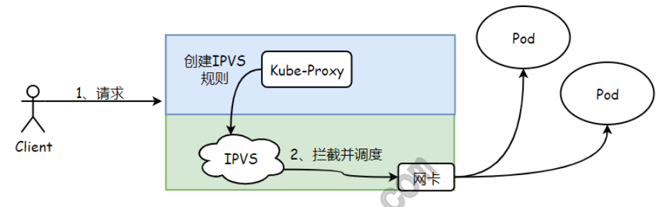

## 3.Service资源类型

⽆论使⽤那⼀种代理模型，Service资源都可以其⼯作逻辑分为 ClusterIP，NodePort，LoadBalance、ExternalName这四种类 型。

### 3.1 ClusterIP

ClusterIP：通过集群的内部 IP 暴露服务，选择ServiceIP只能够在 集群内部访问。 这也是默认的 ServiceType。

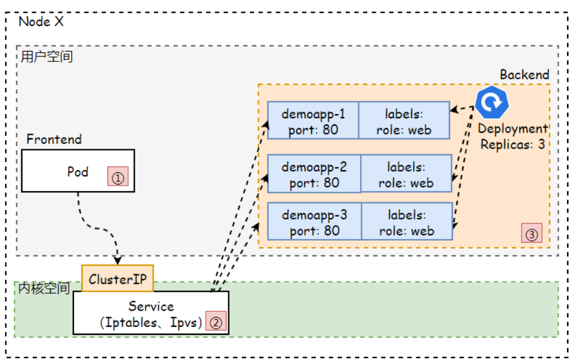

### 3.2 NodePort

NodePort：NodePort类型是对ClusterIP类型Service资源的扩 展。它通过每个节点上的IP和端⼝接⼊集群外部流量，并分发给后端 的Pod处理和响应。因此通过<节点IP!"<节点端⼝>，可以从集群外 部访问服务。

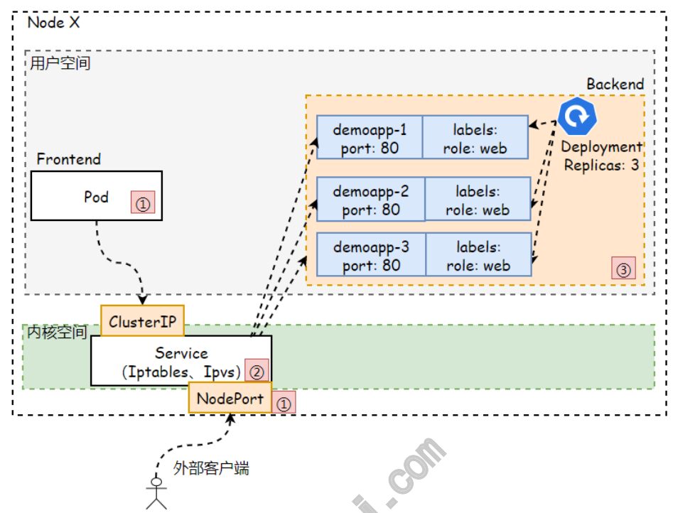

### 3.3 LoadBalance

LoadBalancer：这类Service依赖云⼚商，需要通过云⼚商调⽤ API接⼝创建软件负载均衡将服务暴露到集群外部。当创建 LoadBalance类型的Service对象时，它会在集群上⾃动创建⼀个 NodePort类型的Service。集群外部的请求流量会先路由⾄该负载 均衡，并由该负载均衡调度⾄各个节点的NodePort。

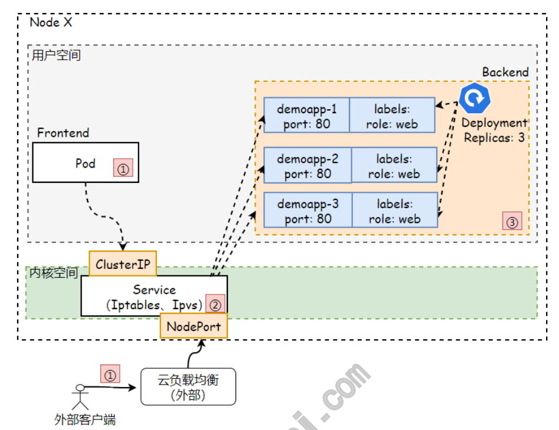

### 3.4 ExternalName

ExternalName：此类型不是⽤来定义如何访问集群内服务的，⽽ 是把集群外部的某些服务以DNS CANME⽅式映射到集群内，从⽽让 集群内的Pod资源能够访问外部服务的⼀种实现⽅式。

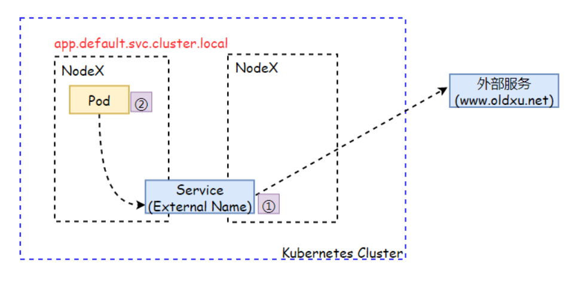

## 4.Service应⽤实践

### 4.1 Service配置示例

```
apiVersion: v1 kind: Service metadata: name: <string> namespace: <string> spec: type: <string>      # Service类型，默认为ClusterIP selector:         # 标签选择器，⽤于匹配对应的Pod ports:          # Service端⼝列表

- name: <string>      # 端⼝名称

protocol: <string>    # 协议，⽬前⽀持TCP、UDP、 SCTP、默认为TCP port: <integer>     # Service的端⼝号 targetPort: <string>  # 后端⽬标进程的端⼝号或名称 nodePort: <integer>   # 节点端⼝号，仅适⽤于 NodePort和Loadbalancer类型
```
externalTrafficPolicy:  # 外部流量路由策略，local表 示由当前节点处理，cluster表示向集群范围内调度 internalTrafficPolicy:  # 内部流量路由策略

### 4.2 ClusterIP实践

## 1.使⽤deployment运⾏多个副本的web应⽤

## 2.使⽤service提供web应⽤负载均衡

3.使⽤Pod或Node访问Service的ClusterIP及端⼝，验证负载均衡

```
1、编写yaml www.xuliangwei.com [root@master service]# cat demoapp-service.yaml apiVersion: v1 kind: Service metadata: name: demoapp-svc spec: selector: role: web #clusterIP: 10.96.1.1   # ⾃定指定IP，建议还是由 Service⾃⾏分配 ports:

port: 8888 targetPort:

deploy部署多副本demoapp应⽤ [root@master ~]# cat demoapp-deploy.yaml apiVersion: apps/v1

kind: Deployment metadata: name: demoapp spec: replicas: 3 selector: matchLabels: role: web template: metadata: labels: role: web spec: containers: www.xuliangwei.com

- name: demoapp-container

image: oldxu3957/demoapp:v1.0 ports:

- name: http

containerPort:

[root@master service]# kubectl describe service demoapp-svc Name:              demoapp-svc Namespace:         default Labels:            <none> Annotations:       <none> Selector:          role=web Type:              ClusterIP                # 类型 IP Family Policy:  SingleStack IP Families:       IPv4

IP:                10.96.145.78               # ServiceIP地址 IPs:               10.96.145.78 Port:              <unset>  8888/TCP            # ServicePort TargetPort:        80/TCP Endpoints: 192.168.2.65:80,192.168.1.138:80,192.168.1.137:80 Session Affinity:  None Events:            <none> 3.访问ServiceIP，默认采⽤iptables模式，因此取样次数越多，其调 度效果越好； www.xuliangwei.com [root@master ~]#
while true;
do curl 10.96.145.78:8888/version;
done demoapp v1.0!# PodIP: 192.168.2.65! demoapp v1.0!# PodIP: 192.168.2.65! demoapp v1.0!# PodIP: 192.168.1.138! demoapp v1.0!# PodIP: 192.168.2.65! demoapp v1.0!# PodIP: 192.168.1.138! demoapp v1.0!# PodIP: 192.168.1.137! demoapp v1.0!# PodIP: 192.168.1.138! demoapp v1.0!# PodIP: 192.168.1.137! 4.如果Pod新增，则会⾃动加⼊Service的负载均衡，如果Pod删减，则 会⾃动从负载均衡中移除； #
```
### 4.3 NodePort实践

场景描述：

3.使⽤集群外部客户端，访问任⼀Node节点的IP+端⼝，验证负载均衡

```
[root@master service]# cat demoapp-service- nodeport.yaml apiVersion: v1 kind: Service metadata: name: demoapp-svc-nodeport www.xuliangwei.com spec: type: NodePort        # 设定类型 selector: role: web ports:

port: 8888          # 通过ServiceIP+8888端⼝访问服 务 targetPort: 80 nodePort: 32000       # 通过任意NodeIP+32000端⼝访 问服务

[root@master service]# kubectl describe service demoapp-svc-nodeport Name:                     demoapp-svc-nodeport Namespace:                default Labels:                   <none>

Annotations:              <none> Selector:                 role=web Type:                     NodePort        # Service 的类型 IP Family Policy:         SingleStack IP Families:              IPv4 IP:                       10.96.145.78      # Service的IP IPs:                      10.96.145.78 Port:                     <unset>  8888/TCP   # Service的Port TargetPort:               80/TCP NodePort:                 <unset>  32000/TCP  # Node 节点的Port www.xuliangwei.com Endpoints: 192.168.2.65:80,192.168.1.138:80,192.168.1.137:80 Session Affinity:         None External Traffic Policy:  Cluster Events:                   <none> 3.通过节点IP+节点端⼝访问服务，默认还是使⽤的iptables代理模 式，因此取样次数越多，其调度效果越好； [root@master ~]#
while true;
do curl http:!$10.0.0.201:32000/version;done demoapp v1.0!# PodIP: 192.168.2.65! demoapp v1.0!# PodIP: 192.168.2.65! demoapp v1.0!# PodIP: 192.168.1.137! demoapp v1.0!# PodIP: 192.168.1.137! demoapp v1.0!# PodIP: 192.168.1.138! demoapp v1.0!# PodIP: 192.168.1.138!
```
NodePort类型的Service会对请求报⽂同时进⾏源地址替换SNAT和⽬标 地址替换DNAT；

### 4.4 ExternalName实践

当查询主机 my-service.default.svc.cluster.local 时，集群 的DNS服务将返回⼀个值为 docs.xuliangwei.com 的 CNAME 记录 访问这个服务的⼯作⽅式与其它的相同，唯⼀不同的是重定向发⽣在 DNS 层⾯。

1.编写yaml⽂件

```
[root@master ~]# vim my-service.yaml kind: Service www.xuliangwei.com apiVersion: v1 metadata: name: my-service namespace: prod spec: type: ExternalName externalName: docs.xuliangwei.com
```
## 2.检查Service

```
[root@master ~]# kubectl get service NAME                 TYPE           CLUSTER-IP EXTERNAL-IP          PORT(S)      AGE my-service           ExternalName   <none> www.xuliangwei.com   <none>        4s 3.通过dig，然后使⽤集群CoreDNS测试域名解析；

[root@master ~]# dig my- service.default.svc.cluster.local @10.96.0.10 +short docs.xuliangwei.com
```
39.104.16.126

## 5.Service与Endpoint

### 5.1 Endpoint与容器探针

Service对象借助Endpoint资源来跟踪其关联的后端端点，Endpoint 对象会根据Service标签选择器筛选出的后端端点的IP地址分别保存 在subsets.address字段和subsets.notReadyAddress字段中，它 www.xuliangwei.com 通过APIServer持续、动态跟踪每个端点的状态变化，并即使反应到端 点IP所属的字段中。 subsets.address：保存就绪的容器IP，也就意味着service可以 直接将请求调度⾄该地址段。 subsets.notReadyAddress：保存未就绪容器IP，也就意味着 Service不会将请求调度⾄该地址段。 1.创建⼀个资源清单，会⾃动创建出同名的Endpoints对象 # 先创建Service，⽽后同时创建deployment [root@master endpoint]# cat demoapp-readiness.yaml apiVersion: v1 kind: Service metadata: name: demoapp-readiness-service spec: selector: role: web-readiness ports:

```
port: 8888 targetPort:

!!% apiVersion: apps/v1 kind: Deployment metadata: name: demoapp2 spec: replicas: 2 selector: matchLabels: role: web-readiness template: www.xuliangwei.com metadata: labels: role: web-readiness spec: containers:

- name: demoapp2

image: oldxu3957/demoapp:v1.0 readinessProbe:                 # 就绪探针 httpGet: path: '/readyz' port: 80 initialDelaySeconds: 15         # 初次检测 延时时⻓ periodSeconds: 10               # 检测周期 2.容器初次启动延迟15s，也就意味着⾄少15s以后才能转为就绪状态， 对外提供服务

[root@master ~]# kubectl get ep demoapp-service- readiness -w NAME                        ENDPOINTS AGE demoapp-readiness-service 10s demoapp-readiness-service   192.168.2.43:80 40s demoapp-readiness-service 192.168.1.27:80,192.168.2.43:80 40s 3.因任何原因导致后端的端点就绪状态监测失败，都会触发Endpoint对 象将该端点的IP地址从subset.address字段移⾄ subsets.notReadyAddress字段。 www.xuliangwei.com # 模拟⼀个Pod故障 [root@master ~]# curl -s -X POST -d 'readyz=Err'

192.168.2.43/readyz
```
⼤约等待30s之后在检查endpoints资源 [root@master ~]# kubectl describe endpoints demoapp-service-readiness Name: demoapp-readiness-service Namespace: default Labels: <none> Subsets: Addresses: 192.168.1.27 NotReadyAddresses: 192.168.2.43 # 故障Pod的IP会 转⼊NotReadyAddress 4.将故障端点重新转为就绪状态后，Endpoints对象会将其移回 subsets.address字段，这种处理机制确保了Service对象不会将客户 端请求流量调度给那些处于运⾏状态但服务未就绪的端点。

```
恢复故障 [root@master ~]# curl -s -X POST -d 'readyz=OK' http:!$192.168.2.43/readyz

查看endpoints [root@master deployment]# kubectl describe endpoints demoapp-service-readiness Name: demoapp-readiness-service Namespace: default Labels: <none> Subsets: Addresses: 192.168.1.27,192.168.2.43 # ⾃动恢复 NotReadyAddresses: <none> www.xuliangwei.com
```
### 5.2 ⾃定义endpoint实践

service通过selector和pod建⽴关联，k8s会根据service关联到的 podIP信息组合成⼀个endpoint。若service定义中没有selector字 段，service被创建时，endpoint controller不会⾃动创建 endpoint。 我们可以通过配置清单创建Service，⽽⽆需使⽤标签选择器，⽽后⾃⾏ 创建⼀个同名的endpoint对象，指定对应的IP。这种⼀般⽤于将外部 MySQL\Redis等应⽤引⼊Kubernetes集群内部，让内部通过Service 的⽅式访问外部资源。

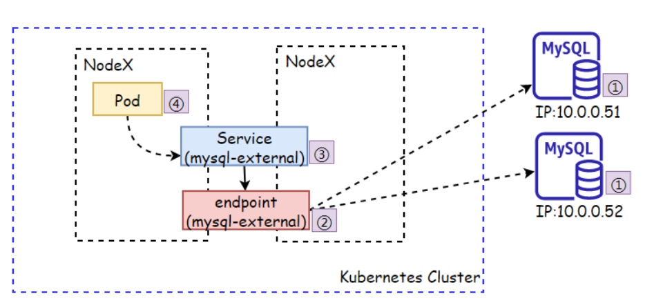

```
[root@db ~]# yum install mariadb mariadb-server -y www.xuliangwei.com [root@db ~]# systemctl enable mariadb !&now

创建⼀个远程⽤户 [root@db ~]# mysql MariaDB [(none)]> grant all privileges on *.* to 'oldxu' identified by 'oldxu3957'; MariaDB [(none)]> flush privileges;

[root@master ~]# cat mysql-external-endpoint.yaml apiVersion: v1 kind: Endpoints metadata: name: mysql-external namespace: default subsets:

- addresses:

- ip: 10.0.0.51

- ip: 10.0.0.52

ports:

port: 3306          # 外部MySQL运⾏的端⼝

检查endpoints [root@master ~]# kubectl get endpoints mysql- external NAME ENDPOINTS AGE mysql-external 10.0.0.51:3306,10.0.0.52:3306 29s

[root@master endpoint]# cat mysql-external- www.xuliangwei.com service.yaml apiVersion: v1 kind: Service metadata: name: mysql-external namespace: default spec: type: ClusterIP ports:

port: 3366      # 访问Service的端⼝ targetPort: 3306  # 后端应⽤的端⼝

检查Service [root@master endpoint]# kubectl describe service mysql-external Name: mysql-external Namespace: default Labels: <none>

Annotations:       <none> Selector:          <none> Type:              ClusterIP IP Family Policy:  SingleStack IP Families:       IPv4 IP:                10.96.176.225 IPs:               10.96.176.225 Port:              <unset>  3366/TCP TargetPort:        3306/TCP Endpoints:         10.0.0.51:3306,10.0.0.52:3306 Session Affinity:  None Events:            <none> 4.使⽤Pod访问Service，验证能否正常访问MySQL服务 www.xuliangwei.com # 启动⼀个mysql客户端 [root@master endpoint]#  kubectl run tools !& image=oldxu3957/tools

通过ServiceIP，或ServiceName（mysql-external）都可以 访问到外部数据库 [root@tools /]# mysql -h 10.96.176.225 -P3366 - uoldxu -poldxu3957 MariaDB [(none)]> create database hello_service; MariaDB [(none)]> show databases; +--------------------+ | Database | +--------------------+ | information_schema | | hello_service | | mysql | | performance_schema | | test |

+--------------------+ 5 rows in set (0.00 sec)
```
## 6.Service相关字段

### 6.2 sessionAffinity

```
如果要将来⾃于特定客户端的连接调度⾄同⼀Pod，可以使 ⽤sessionAffinity 基于客户端的 IP 地址进⾏会话保持。 还可以通过sessionAffinityConfig.clientIP.timeoutSeconds www.xuliangwei.com 来设置最⼤会话停留时间。(默认10800秒，即3⼩时) 1、编写yaml [root@master ~]# cat session-service.yaml apiVersion: v1 kind: Service metadata: name: session-svc spec: type: NodePort        # 设定类型 selector: role: web ports:

port: 80          # 通过ServiceIP+8888端⼝访问服务 targetPort: 80 sessionAffinity: ClientIP   #  配置sessionAffinity 策略 sessionAffinityConfig:

clientIP: timeoutSeconds: 60    # 最⼤会话停留时间60s

[root@master service]# curl 10.96.244.169/version demoapp v1.0!# PodIP: 192.168.1.137! [root@master service]# curl 10.96.244.169/version demoapp v1.0!# PodIP: 192.168.1.137!
```
### 6.1 externalTrafficPolicy

外部流量策略：当外部⽤户通过NodePort请求Service，是将外部流量 www.xuliangwei.com 路由到本地节点上的Pod，还是路由到集群范围的Pod： Cluster（默认）：将⽤户请求路由到集群范围的所有Pod节点，具 有良好的整体负载均衡。 Local：仅会将流量调度⾄请求的⽬标节点本地运⾏的Pod对象之 上，以减少⽹络跳跃，降低⽹络延迟，但当请求指向的节点本地不存 在⽬标Service相关的Pod对象时直接丢弃该报⽂。

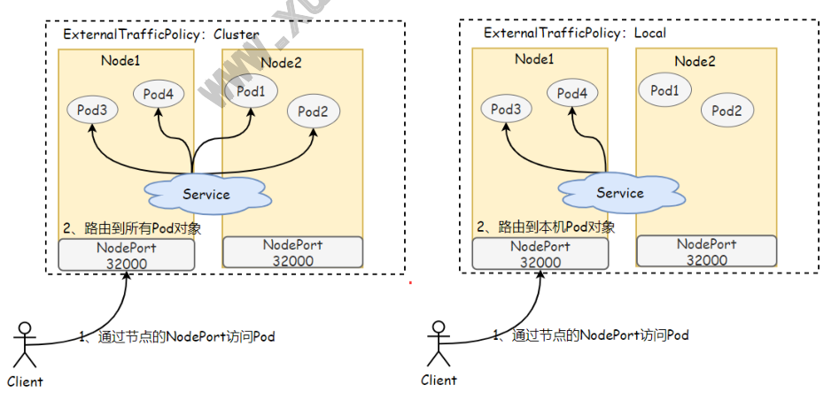

1、编写YAML

```
[root@master service]# cat demoapp-service- external.yaml apiVersion: v1 kind: Service metadata: name: demoapp-svc-external spec: selector: app: demoapp type: NodePort ports:

port: 80 targetPort: 80 www.xuliangwei.com nodePort: 32001 externalTrafficPolicy: Local    # 默认Cluster 2、检查Service匹配的Pod，会发现在Node1节点运⾏了1个Pod， Node2运⾏了两个Pod [root@master service]# kubectl get pod -l app=demoapp -o wide NAME                       READY   STATUS RESTARTS   AGE   IP              NODE demoapp-6b8dcfb5b4-qsf52   1/1     Running   0 31m   192.168.1.141   node1   <none> demoapp-6b8dcfb5b4-pm97s   1/1     Running   0 31m   192.168.2.102   node2   <none> demoapp-6b8dcfb5b4-sxw4w   1/1     Running   0 31m   192.168.2.103   node2   <none>

访问Node1 [root@master service]# curl 10.0.0.204:32001/version demoapp v1.0!# PodIP: 192.168.1.141! [root@master service]# curl 10.0.0.204:32001/version demoapp v1.0!# PodIP: 192.168.1.141!

访问Node2 [root@master service]# curl 10.0.0.212:32001/version demoapp v1.0!# PodIP: 192.168.2.103! [root@master service]# curl 10.0.0.212:32001/version demoapp v1.0!# PodIP: 192.168.2.102!
```
### 6.4 internalTrafficPolicy

本地流量策略：当本地Pod对Service发起访问时，是将流量路由到本地 节点上的Pod，还是路由到集群范围的Pod： Cluster（默认）：将Pod的请求路由到集群范围的所有Pod节点， 具有良好的整体负载均衡。 Local：将请求路由到与发起⽅处于相同节点的端点，这种机制有助 于节省开销，提升效率。但当请求指向的节点本地不存在⽬标 Service相关的Pod对象时直接丢弃该报⽂。

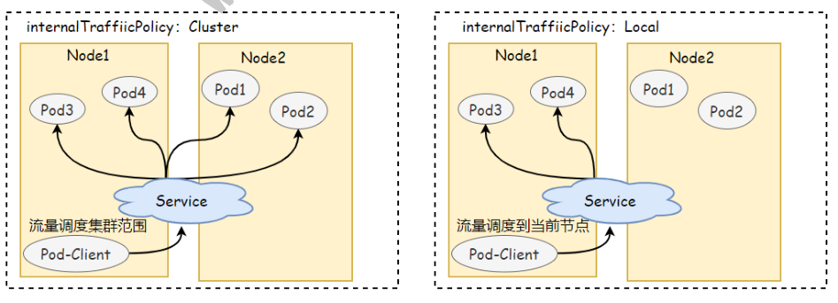

注意：在⼀个Service上，当externalTrafficPolicy已设置 为Local时，internalTrafficPolicy则⽆法使⽤。 换句话说， 在⼀个集群的不同 Service 上可以同时使⽤这两个特性，但在⼀个 Service 上不⾏

```
1、编写YAML [root@master ~]# cat demoapp-service-internal.yaml apiVersion: v1 kind: Service metadata: name: demoapp-svc-internal www.xuliangwei.com spec: selector: app: demoapp ports:

port: 80 targetPort: 80 internalTrafficPolicy: Local    # 默认Cluster 2、运⾏两个Pod，获取Pod所在节点

[root@master ~]# kubectl run -it tools1 !& image=oldxu3957/tools [root@master ~]# kubectl run -it tools2  !& image=oldxu3957/tools

[root@master ~]# kubectl get pod -o wide NAME                       READY   STATUS RESTARTS    AGE   IP              NODE demoapp-6b8dcfb5b4-pm97s   1/1     Running        0 70m   192.168.2.102   node2 demoapp-6b8dcfb5b4-qsf52   1/1     Running        0 70m   192.168.1.141   node1 demoapp-6b8dcfb5b4-sxw4w   1/1     Running        0 www.xuliangwei.com 70m   192.168.2.103   node2 tools1                     1/1     Running        0 70m   192.168.1.140   node1 tools2                     1/1     Running         0 23m   192.168.2.104   node2 3、登录tools容器和tools2容器访问service测试

tools1容器 [root@master ~]# kubectl exec -it tools1 !& /bin/bash [root@tools1 /]# curl 10.96.141.198/version demoapp v1.0!# PodIP: 192.168.1.141! [root@tools1 /]# curl 10.96.141.198/version demoapp v1.0!# PodIP: 192.168.1.141!

tools2容器 [root@master ~]# kubectl exec -it tools2 !& /bin/bash [root@tools2 /]# curl 10.96.141.198/version demoapp v1.0!# PodIP: 192.168.2.102! [root@tools2 /]# curl 10.96.141.198/version www.xuliangwei.com demoapp v1.0!# PodIP: 192.168.2.103!
```
### 6.1 publishNotReadyAddresses

publishNotReadyAddresses：表示Pod就绪探针探测失败，也不会将 失败的PodIP加⼊notReadyAddress列表中 1、检查当前Service对应的后端列表；

```
[root@master service]# kubectl describe endpoints demoapp-readiness-service Name:         demoapp-readiness-service Namespace:    default Labels:       <none> Annotations:  <none> Subsets: Addresses:          <none> NotReadyAddresses:  192.168.2.106,192.168.2.107 Ports: Name     Port  Protocol ----     ----  -------- <unset>  80    TCP www.xuliangwei.com 2、将其中的某个Pod设定为不就绪，看看是否会将该PodIP加⼊到 NotReadAddress字段中 [root@master ~]# curl -s -X POST -d 'readyz=Err'

192.168.2.107/readyz

[root@master service]# kubectl describe endpoints demoapp-readiness-service Name:         demoapp-readiness-service Namespace:    default Labels:       <none> Annotations:  endpoints.kubernetes.io/last-change- trigger-time: 2022-05-31T13:58:09Z Subsets: Addresses:          192.168.2.106 NotReadyAddresses:  192.168.2.107 3、为对应的Service⽂件添加publishNotReadyAddresses: true 字段

spec: !!( publishNotReadyAddresses: true !!(

[root@master service]# kubectl describe endpoints demoapp-readiness-service Name:         demoapp-readiness-service Namespace:    default Labels:       <none> Annotations:  <none> Subsets: www.xuliangwei.com Addresses:          192.168.2.106,192.168.2.107 # ⾃动将不就绪的PodIP加⼊集群
```
## 7.Service深⼊理解

```
访问Service会出现如下4中情况； 1、Pod-A !' Service !' 调度 !' Pod-B/Pod-C 2、Pod-A !' Service !' 调度 !' Pod-A 3、Docker !' Service !' 调度 !' Pod-B/Pod-C 4、NodePort !' Service !' 调度 !' Pod-B/Pod-C
```
### 7.1 Iptables模型分析

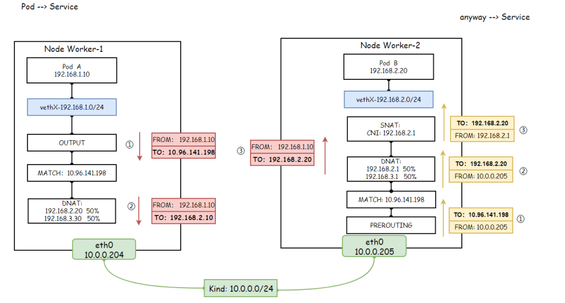

```
ClusterIP 模式分析 1、从OUTPUT发出的请求会被⽆条件拦截到 KUBE-SERVICES ⾃定义规 则链上； [root@master ~]# iptables -t nat -S OUTPUT -P OUTPUT ACCEPT -A OUTPUT -m comment !&comment "kubernetes service portals" -j KUBE-SERVICES 2、打印KUBE-SERVICES⾃定义链，所有对demoapp-svc发起的请求， 都调度到KUBE-SVC!)HASH>链上； [root@master ~]# iptables -t nat -S KUBE-SERVICES  | grep demoapp-svc -A KUBE-SERVICES -d 10.96.141.198/32 -p tcp -m comment !&comment "default/demoapp-svc cluster IP" - m tcp !&dport 80 -j KUBE-SVC-EHL433DY3T7P3MZN 3、打印KUBE-SVC!)HASH>⾃定义链，⽽后进⾏逐⾏分析
```
第1条：创建⼀条⾃定义链； # 第2条：来源地址不是192.168.0.0/16⽹段，但请求的是 demoapp-svc的IP则交由KUBE-MARK-MASQ链进⾏处理； # 第3~5条：由Iptables将请求调度到不同的KUBE-SEP!)HASH> 上；

```
[root@master ~]# iptables -t nat -S KUBE-SVC- EHL433DY3T7P3MZN -N KUBE-SVC-EHL433DY3T7P3MZN -A KUBE-SVC-EHL433DY3T7P3MZN ! -s 192.168.0.0/16 -d 10.96.141.198/32 -p tcp -m comment !&comment "default/demoapp-svc cluster IP" -m tcp !&dport 80 - j KUBE-MARK-MASQ -A KUBE-SVC-EHL433DY3T7P3MZN -m comment !&comment www.xuliangwei.com "default/demoapp-svc" -m statistic !&mode random !& probability 0.33333333349 -j KUBE-SEP- U5XEPTOWI524AEON -A KUBE-SVC-EHL433DY3T7P3MZN -m comment !&comment "default/demoapp-svc" -m statistic !&mode random !& probability 0.50000000000 -j KUBE-SEP- 4R7XR77WKUGEKEFZ -A KUBE-SVC-EHL433DY3T7P3MZN -m comment !&comment "default/demoapp-svc" -j KUBE-SEP-5BLGKDTDB6EMOAD3 4、打印任意⼀条 KUBE-SEP!)HASH> ⾃定义链；
```
第1条：创建⼀条⾃定义链； # 第2条：请求IP如果是⾃⼰Pod的IP，则交由KUBE-MARK-MASQ处 理（先忽略） # 第3条：进⾏DNAT地址替换，将请求ServiceIP替换为后端的 PodIP地址，然后将请求发出； [root@master ~]# iptables -t nat -S KUBE-SEP- U5XEPTOWI524AEON -N KUBE-SEP-U5XEPTOWI524AEON -A KUBE-SEP-U5XEPTOWI524AEON -s 192.168.1.143/32 -m comment !&comment "default/demoapp-svc" -j KUBE- MARK-MASQ -A KUBE-SEP-U5XEPTOWI524AEON -p tcp -m comment !& comment "default/demoapp-svc" -m tcp -j DNAT !&to- destination 192.168.1.143:80 www.xuliangwei.com 5、OUTPUT处理完毕后，数据包会流⼊POSTROUTING链， 由POSTROUTING链决定怎么发送数据包 # 第1条：创建⼀条⾃定义链； # 第2条：所有的数据包都必须先进⼊KUBE-POSTROUTING⾃定义链 进⾏规则匹配； # 第3条：如果源地址是172.17.0.0/16，⽬标地址接⼝不是 docker0 则进⾏地址转换； # 第4条：如果源地址是192.168.0.0/16，⽬标地址是 192.168.0.0/16，则RETURN掉，⽽后从本机最近的⽹卡送出； # 第5条：如果源地址不是192.168.0.0/16，⽬标地址是

```
192.168.0.0/24 则RETURN
```
第6条：如果源地址不是192.168.0.0/16，⽬ 标地址是 192.168.0.0/24，则进⾏Masque地址转换；

```
[root@master ~]# iptables -t nat -S POSTROUTING -P POSTROUTING ACCEPT

-A POSTROUTING -m comment !&comment "kubernetes postrouting rules" -j KUBE-POSTROUTING -A POSTROUTING -s 172.17.0.0/16 ! -o docker0 -j MASQUERADE -A POSTROUTING -s 192.168.0.0/16 -d 192.168.0.0/16 - m comment !&comment "flanneld masq" -j RETURN -A POSTROUTING ! -s 192.168.0.0/16 -d 192.168.0.0/24 -m comment !&comment "flanneld masq" -j RETURN -A POSTROUTING ! -s 192.168.0.0/16 -d 192.168.0.0/16 -m comment !&comment "flanneld masq" -j MASQUERADE 6、打印KUBE-POSTROUTING⾃定义链规则； # 第1条：创建⼀条⾃定义链； www.xuliangwei.com # 第2条：如果没有匹配到标记0x4000/0x4000，则RETURN回 POSTROUTING继续处理； # 第3条：如果匹配第2条的标记，则继续添加⼀个标记 0x4000/0x0； # 第4条：对源地址进⾏SNAT，SNAT的地址为本节点去往⽬标IP最近 的接⼝IP地址；

[root@master ~]# iptables -t nat -S KUBE-POSTROUTING -N KUBE-POSTROUTING -A KUBE-POSTROUTING -m mark ! !&mark 0x4000/0x4000 - j RETURN -A KUBE-POSTROUTING -j MARK !&set-xmark 0x4000/0x0 -A KUBE-POSTROUTING -m comment !&comment "kubernetes service traffic requiring SNAT" -j MASQUERADE
```
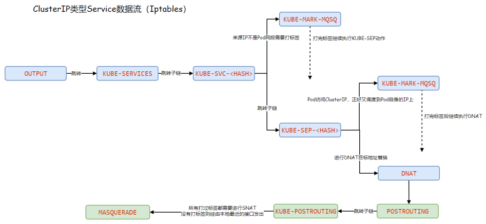

```
NodePort 分析 1、打印PREROUTING链，所有的请求都会⽆条件进⼊KUBE-SERVICES www.xuliangwei.com ⾃定义链； [root@master ~]# iptables -t nat -S PREROUTING -P PREROUTING ACCEPT -A PREROUTING -m comment !&comment "kubernetes service portals" -j KUBE-SERVICES 2、打印KUBE-SERVICE⾃定义链，过滤与nodeport相关规则，规则调 度到了KUBE-NODEPORTS⾃定义链； [root@master ~]# iptables -t nat -S KUBE-SERVICES | grep nodeport -A KUBE-SERVICES -m comment !&comment "kubernetes service nodeports; NOTE: this must be the last rule in this chain" -m addrtype !&dst-type LOCAL -j KUBE- NODEPORTS 3、打印KUBE-NODEPORTS⾃定义链，然后过滤与demoapp-svc相关的 规则；
```
第1条：创建⾃定义链； # 第2条：所有请求本机的32000跳转⾄KUBE-SVC!)HASH>⾃定义链 规则处理；

```
[root@master ~]# iptables -t nat -S KUBE-NODEPORTS | grep demoapp-svc -N KUBE-NODEPORTS -A KUBE-NODEPORTS -p tcp -m comment !&comment "default/demoapp-svc" -m tcp !&dport 32000 -j KUBE- SVC-EHL433DY3T7P3MZ 4、打印KUBE-SVC!)HASH>⾃定义链； www.xuliangwei.com
```
第1条：创建⾃定义链； # 第2条：如果来源不是192.168.0.0/16，⽬标为10.96.141.198 的80端⼝，则跳转KUBE-MARK-MASQ链标记处理； # 第3条：如果请求的⽬标端⼝为32000，则跳转KUBE-MARK-MASQ ⾃定义处理； # 第4~6条：将请求调度到对应的KUBE-SEP!)HASH>⾃定义链；

```
[root@master ~]# iptables -t nat -S KUBE-SVC- EHL433DY3T7P3MZN -N KUBE-SVC-EHL433DY3T7P3MZN -A KUBE-SVC-EHL433DY3T7P3MZN ! -s 192.168.0.0/16 -d 10.96.141.198/32 -p tcp -m comment !&comment "default/demoapp-svc cluster IP" -m tcp !&dport 80 - j KUBE-MARK-MASQ www.xuliangwei.com -A KUBE-SVC-EHL433DY3T7P3MZN -p tcp -m comment !& comment "default/demoapp-svc" -m tcp !&dport 32000 - j KUBE-MARK-MASQ -A KUBE-SVC-EHL433DY3T7P3MZN -m comment !&comment "default/demoapp-svc" -m statistic !&mode random !& probability 0.33333333349 -j KUBE-SEP- U5XEPTOWI524AEON -A KUBE-SVC-EHL433DY3T7P3MZN -m comment !&comment "default/demoapp-svc" -m statistic !&mode random !& probability 0.50000000000 -j KUBE-SEP- 4R7XR77WKUGEKEFZ -A KUBE-SVC-EHL433DY3T7P3MZN -m comment !&comment "default/demoapp-svc" -j KUBE-SEP-5BLGKDTDB6EMOAD3 5、打印KUBE-SEP!)HASH>⾃定义链；
```
第1条，创建⾃定义链； # 第2条，如果来源地址为192.168.1.143/32，则进⾏KUBE- MARK-MASQ⾃定义链处理； # 第3条，进⾏DNAT处理，将Service地址替换为⽬标Pod的IP地 址；

```
[root@master ~]# iptables -t nat -S KUBE-SEP- U5XEPTOWI524AEON -N KUBE-SEP-U5XEPTOWI524AEON -A KUBE-SEP-U5XEPTOWI524AEON -s 192.168.1.143/32 -m comment !&comment "default/demoapp-svc" -j KUBE- MARK-MASQ -A KUBE-SEP-U5XEPTOWI524AEON -p tcp -m comment !& comment "default/demoapp-svc" -m tcp -j DNAT !&to- www.xuliangwei.com destination 192.168.1.143:80 6、数据经过PREROUTING，然后从FORWARD链⾛向POSTROUTING # 第1条：创建⼀条⾃定义链； # 第2条：所有的数据包都必须先经过KUBE-POSTROUTING⾃定义 链； # 第3条：如果源地址是172.17.0.0/16，⽬标地址接⼝不是 docker0 则进⾏地址转换； # 第4条：如果源地址是192.168.0.0/16，⽬标地址是 192.168.0.0/16，则RETURN掉，⽽后从本机最近的⽹卡送出； # 第5条：如果源地址不是192.168.0.0/16，⽬标地址是

192.168.0.0/24 则RETURN
```
第6条：如果源地址不是192.168.0.0/16，⽬标地址是 192.168.0.0/24，则进⾏Masque地址转换；

```
[root@master ~]# iptables -t nat -S POSTROUTING -P POSTROUTING ACCEPT

-A POSTROUTING -m comment !&comment "kubernetes postrouting rules" -j KUBE-POSTROUTING -A POSTROUTING -s 172.17.0.0/16 ! -o docker0 -j MASQUERADE -A POSTROUTING -s 192.168.0.0/16 -d 192.168.0.0/16 - m comment !&comment "flanneld masq" -j RETURN -A POSTROUTING ! -s 192.168.0.0/16 -d 192.168.0.0/24 -m comment !&comment "flanneld masq" -j RETURN -A POSTROUTING ! -s 192.168.0.0/16 -d 192.168.0.0/16 -m comment !&comment "flanneld masq" -j MASQUERADE 7、打印KUBE-POSTROUTING最定义链 # 第1条：创建⼀条⾃定义链； www.xuliangwei.com # 第2条：如果没有匹配到标记0x4000/0x4000，则RETURN回 POSTROUTING继续处理； # 第3条：如果匹配第2条的标记，则继续添加⼀个标记 0x4000/0x0； # 第4条：对源地址进⾏SNAT，SNAT的地址为本节点去往⽬标IP最近 的接⼝IP地址；

[root@master ~]# iptables -t nat -S KUBE-POSTROUTING -N KUBE-POSTROUTING -A KUBE-POSTROUTING -m mark ! !&mark 0x4000/0x4000 - j RETURN -A KUBE-POSTROUTING -j MARK !&set-xmark 0x4000/0x0 -A KUBE-POSTROUTING -m comment !&comment "kubernetes service traffic requiring SNAT" -j MASQUERADE
```
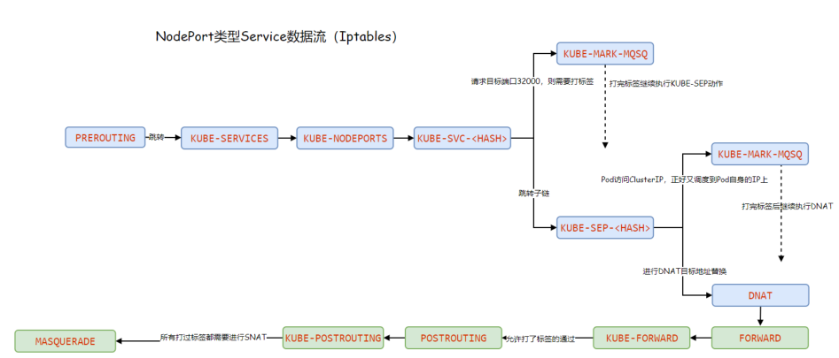

### 7.2 IPVS模型分析

1、会在每个节点上创建⼀个名为kube-ipvs0的虚拟接⼝，并将集群所 有Service对象的ClusterIP都配置在该接⼝； 2、Kube-Proxy将每 www.xuliangwei.com 个Service⽣成⼀个虚拟服务器VirtualServer的定义； 注意：ipvs仅需要借助极少量的iptables规则完成源地址转换、源端⼝ 转换等；

```
设置集群为IPVS模式 [root@master ~]#  kubectl edit cm kube-proxy -n kube-system ipvs: excludeCIDRs: null minSyncPeriod: 0s scheduler: "" strictARP: false syncPeriod: 0s tcpFinTimeout: 0s tcpTimeout: 0s udpTimeout: 0s kind: KubeProxyConfiguration

metricsBindAddress: "" mode: "ipvs"      # 指定为ipvs模式

重启proxy的pod，先过滤proxy的相关名称，然后删除已达到重 启的⽬的 [root@master ~]# kubectl delete pod $(kubectl get pod -n kube-system |grep proxy | awk '{print $1}') -n kube-system

查看IP # ip addr show kube-ipvs0
```
## 8.服务发现

当Pod需要访问Service时，通过Service提供的ClusterIP就可以实 现了，但是有⼏个问题； 1、Service的IP不稳定，删除重建会发⽣变化； 2、ServiceIP难以记忆，如果能通过⼀个固定的名称访问就好了； 为了解决这样的问题，Kubernetes引⼊了环境变量和DNS两种⽅案来解 决这样的问题； 1、环境变量⽅式：通过特定的名称将环境变量注⼊到Pod内部； 2、DNS⽅式：通过APIServer来监视Service变动，⽽后动态创建 对应Service名称与ServiceIP的域名解析记录；

### 8.1 环境变量

每个 Pod 启动的时候，会通过环境变量的⽅式将Service的IP以及 Port信息注⼊进去，这样 Pod 中的应⽤可以通过读取环境变量来获取 对应Service服务的地址信息，这种⽅法使⽤起来相对简单，但是也存在 ⼀定的问题。就是Pod所依赖的Service必须优Pod启动，否则⽆法注⼊ 到环境变量中。

```
1、创建Service资源 [root@master ~]# cat env-service.yaml apiVersion: v1 kind: Service metadata: name: my-demoapp spec: ports:

- port:

targetPort: 80 2、创建容器，然后验证对应的环境变量 www.xuliangwei.com [root@master ~]# kubectl run pod-env !& image=oldxu3957/tools [root@master ~]# kubectl exec -it pod-env !& /bin/bash

执⾏env拿到的环境变量内容 ..... MY_DEMOAPP_SERVICE_HOST=10.96.141.198 MY_DEMOAPP_SERVICE_PORT=80 .....
```
### 8.2 CoreDNS

在安装Kubernetes集群时，CoreDNS作为附加组件，⽤来为Pod提供 DNS域名解析。CoreDNS监视 Kubernetes API 中的新Service，并 为每个Service名称创建⼀组 DNS 记录。这样我们就可以通过固定的 Service名称来转换出不固定的ServiceIP 1、了解CoreDNS的配置

```
[root@master ~]# kubectl get configmap coredns -n kube-system -o yaml apiVersion: v1 kind: ConfigMap data: Corefile: | .:53 { errors        # 错误记录 health {      # 健康检查 lameduck 5s } ready kubernetes cluster.local in-addr.arpa ip6.arpa {  # ⽤于解析Kubernetes集群内域名 www.xuliangwei.com pods insecure fallthrough in-addr.arpa ip6.arpa ttl 30 } prometheus :9153        # 监控的端⼝ forward . /etc/resolv.conf {  # 如果请求⾮ Kubernetes域名，则由节点的resolv.conf中dns解析 max_concurrent 1000 } cache 30            # 缓存所有内容 loop reload              # ⽀持热更新 loadbalance           # 负载均衡，默认轮询 } 2、CoreDNS只所以是固定的IP以及固定的搜索域。是因为kubelet将- -cluster-dns=<dns-service-ip> 、!&cluster-domain= <default-local-domain> 对应的配置传递给了每个容器。

[root@master ~]# cat /var/lib/kubelet/config.yaml .... clusterDNS:

- 10.96.0.10            # DNS的固定ServiceIP

clusterDomain: cluster.local    # 域名 .... 3、进⼊任意Pod中，验证/etc/resolv.conf以及域名解析 [root@master dns]# kubectl  exec -it tools  !& /bin/bash [root@tools /]# cat /etc/resolv.conf nameserver 10.96.0.10 search default.svc.cluster.local svc.cluster.local www.xuliangwei.com cluster.local options ndots:5

通过域名解析对应的ServiceIP [root@tools /]# dig @10.96.0.10 my- demoapp.default.svc.cluster.local +short
```
10.96.234.27

### 8.3 CoreDNS策略

DNS策略可以单独对Pod进⾏设定，在创建Pod时可以为其指定DNS的策 略，最终配置会落在Pod的/etc/resolv.conf⽂件中，可以通过 pod.spec.dnsPolicy字段设置DNS的策略。 1、ClusterFirst（默认DNS策略）

表示Pod内的DNS使⽤集群中配置的DNS服务，简单来说就是使⽤ Kubernetes 中的 coredns 服务进⾏域名解析。如果解析不成功，会 使⽤当前Pod所在的宿主机 DNS 进⾏解析。 [root@master dns]# cat dns-example-1.yaml apiVersion: v1 kind: Pod metadata: name: dns-example-1 spec: dnsPolicy: ClusterFirst containers:

```
- name: tools

image: oldxu3957/tools www.xuliangwei.com ports:

- containerPort: 8899
```
2、ClusterFirstWithHostNet 在某些场景下，我们的 Pod 是⽤ HostNetwork 模式启动的，⼀旦使 ⽤ HostNetwork 模式，那该Pod则会使⽤当前宿主机的 /etc/resolv.conf 来进⾏ DNS 查询，但如果任然想继续使⽤ Kubernetes 的DNS服务，那就将 dnsPolicy 设置为 ClusterFirstWithHostNet。

```
[root@master dns]# cat dns-example-2.yaml apiVersion: v1 kind: Pod metadata: name: dns-example-2 spec: hostNetwork: true           # 与节点共享⽹络 dnsPolicy: ClusterFirstWithHostNet  # 如果没配置则使 ⽤当前Pod所在宿主机的DNS containers:

- name: tools

image: oldxu3957/tools ports:

- containerPort: 8899
```
3、Default 默认使⽤宿主机的 /etc/resolv.conf但可以使⽤ kubelet 的 -– resolv-conf=/etc/resolv.conf 来指定 DNS 解析⽂件地址。 4、None 空的DNS设置，这种⽅式⼀般⽤于⾃定义 DNS 配置的场景，往往需要和 dnsConfig⼀起使⽤才可以达到⾃定义DNS的⽬的。 apiVersion: v1 kind: Pod metadata: name: dns-example-3 spec: containers:

```
- name: tools

image: oldxu3957/tools ports:

- containerPort: 8899

dnsPolicy: "None" dnsConfig: nameservers:

- 10.96.0.10

- 114.114.114.114

searches:

- cluster.local

- svc.cluster.local

- default.svc.cluster.local

- oldxu.net

options:

- name: ndots

value: "5" www.xuliangwei.com

检查/etc/resolv.conf配置 [root@master ~]# kubectl exec -it dns-example-3 !& cat /etc/resolv.conf nameserver 10.96.0.10 nameserver 114.114.114.114 search cluster.local svc.cluster.local default.svc.cluster.local oldxu.net options ndots:5
```
## 9.HeadLess Service

### 9.1 什么是HeadLess

HeadlessService也叫⽆头服务，就是创建的Service没有 ClusterIP，⽽是为Service所匹配的每个Pod都创建⼀条DNS的解析记 录，这样每个Pod都有⼀个唯⼀的DNS名称标识身份，访问的格式如下

```
$(service_name).$(namespace).svc.cluster.local
```
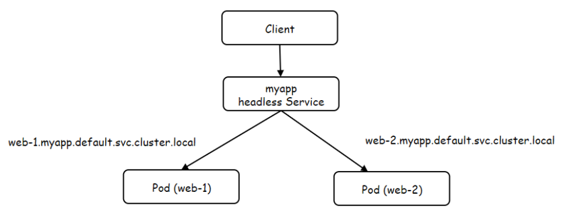

### 9.2 HeadLess的作⽤

像 elasticsearch, mongodb，kafka 等分布式服务, 在做集群初 始化时, 配置⽂件中要写上集群中所有节点的IP(或是域名)但Pod是没 有固定IP的，所以配置⽂件⾥写DNS名称是最合适的。 那为什么不⽤Service，因为 Service 作为 Pod 前置的负载均衡， ⼀般是为⼀组相同的后端 Pod 提供访问⼊⼝，⽽且 Service的 selector也没有办法区分同⼀组Pod的不同身份。 但是我们可以使⽤ Statefulset控制器，它在创建每个Pod的时候，能 为每个 Pod 做⼀个编号, 就是为了能区分这⼀组Pod的不同⻆⾊，各个 节点的⻆⾊不会变得混乱，然后再创建 headless service 资源，集 群内的节点通过Pod名称+序号.Service名称，来进⾏彼此间通信的, 只要序号不变，访问就不会出错。

```
当 statefulSet.spec.serviceName 配置与headless service 相同时，可以通过 {hostName}.{headless service}. {namespace}.svc.cluster.local 解析出节点IP。hostName 由 {statefulSet name}-{编号} 组成。

{statefulSet name}-{编号}.{headless service}. {namespace}.svc.cluster.local

放在当前es中，对应的DNS⼦域名分别是： es-0.elastic.default.svc.cluster.local es-1.elastic.default.svc.cluster.local es-2.elastic.default.svc.cluster.local
```
### 9.3 HeadLess示例

```
1、创建HeadLess Service [root@master dns]# cat headless.yaml www.xuliangwei.com apiVersion: v1 kind: Service metadata: name: myapp spec: clusterIP: "None"   # 设置为None，表示⽆头服务 selector: app: nginx ports:

- port:

protocol: TCP targetPort:

2、通过StatefulSet创建Pod [root@master dns]# cat sts.yaml apiVersion: apps/v1 kind: StatefulSet metadata:

name: web spec: serviceName: "myapp"          # 要与Headless名称保持 ⼀致 replicas: 2 selector: matchLabels: app: nginx template: metadata: labels: app: nginx spec: containers: www.xuliangwei.com

- name: nginx

image: nginx:1.16 ports:

- containerPort:

3、检查Pod [root@master ~]# kubectl get pod -l app=nginx NAME    READY   STATUS    RESTARTS   AGE web-0   1/1     Running   0          20s web-1   1/1     Running   0          19s 4、测试域名解析

解析 headless service，会发现能解析出两个PodIP [root@master ~]# dig @10.96.0.10 myapp.default.svc.cluster.local +short
```
192.168.1.150

192.168.2.128

```
单独解析每⼀个pods的DNS域名 [root@master ~]# dig @10.96.0.10 web- 0.myapp.default.svc.cluster.local +short
```
192.168.2.128

```
[root@master ~]# dig @10.96.0.10 web- 1.myapp.default.svc.cluster.local +short
```
192.168.1.150

## 10.guestBook案例实践

guestbook项⽬地址、guestbook参考⼿册

### 10.1 场景描述

1、启动 Redis 领导 者（Leader） 2、启动两个 Redis 跟随者（Follower） 3、启动并公开 GuestBook 服务，数据写⼊Redis Leader节点、 数据读取统⼀写⼊Redis Slave节点 3.1 如果 GET_HOSTS_FROM 设置为 env，则需要⼿动传递 Redis Master、以及Slave的 Service名称； REDIS_LEADER_SERVICE_HOST # 传递Leader节点的 Service名称或IP REDIS_FOLLOWER_SERVICE_HOST # 传递 Follower节 点Service的名称或IP

3.2 如果 GET_HOSTS_FROM 设置为 dns，则站点会⾃动初始 化两个变量，这就要求创建service时的名称得固定； $host = 'redis-leader'; $host = 'redis-follower'; 4、清理

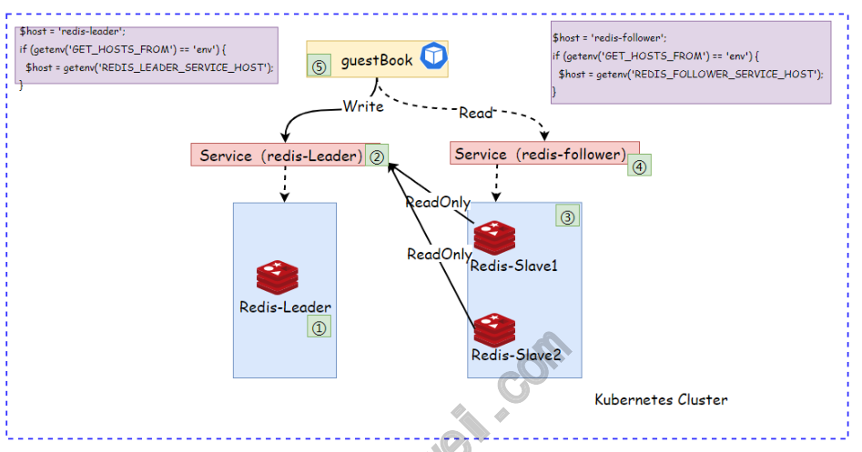

### 10.2 部署Redis Leader

1.编写Deployment

```
[root@master guestbooks]# cat 01-redis-leader- deployment.yaml apiVersion: apps/v1 kind: Deployment metadata: name: redis-leader spec: replicas: 1 selector: matchLabels: app: redis

role: leader template: metadata: labels: app: redis role: leader spec: containers:

- name: redis-leader

image: redis resources: requests: cpu: 100m memory: 100Mi www.xuliangwei.com ports:

- containerPort: 6379

[root@master guestbooks]# cat 02-redis-leader- service.yaml apiVersion: v1 kind: Service metadata: name: redis-leader labels: app: redis spec: selector: app: redis role: leader type: ClusterIP ports:

port: 6379 targetPort: 6379
```
### 10.3 部署Redis Follower

1.编写Deployment

```
[root@master guestbooks]# cat 03-redis-follower- deployment.yaml apiVersion: apps/v1 kind: Deployment metadata: www.xuliangwei.com name: redis-follower spec: replicas: 2 selector: matchLabels: app: redis role: follower template: metadata: labels: app: redis role: follower spec: containers:

- name: redis-follower

image: redis command: ["redis-server"] args:

- !&port 6379

- !&slaveof redis-leader 6379     # 该名称最

终会被Pod解析为对应的IP resources: requests: cpu: 100m memory: 100Mi ports:

- containerPort: 6379

[root@master guestbooks]#  cat 04-redis-follower- service.yaml apiVersion: v1 www.xuliangwei.com kind: Service metadata: name: redis-follower labels: app: redis spec: type: ClusterIP selector: app: redis role: follower ports:

port: 6379 targetPort: 6379
```
### 10.4 部署GuestBook

1.编写Deployment

```
[root@master guestbooks]# cat 05-guestbooks- deployment.yaml apiVersion: apps/v1 kind: Deployment metadata: name: guestbooks spec: replicas: 3 selector: matchLabels: app: guestbooks template: metadata: labels: www.xuliangwei.com app: guestbooks spec: containers:

- name: books

image: oldxu3957/guestbook:v5 env:

- name: GET_HOSTS_FROM

value: "dns" #- name: GET_HOSTS_FROM #  value: "env" #- name: REDIS_LEADER_SERVICE_HOST #  vaule: redis-leader #- name: REDIS_FOLLOWER_SERVICE_HOST #  vaule: redis-follower resources: requests: cpu: 100m memory: 100Mi ports:

- containerPort:

[root@master guestbooks]#  cat 06-guestbooks- service.yaml apiVersion: v1 kind: Service metadata: name: guestbooks spec: type: NodePort selector: app: guestbooks www.xuliangwei.com ports:

port: 80 targetPort: 80 nodePort: 32100     # 提供对外访问端⼝
```
### 10.5 验证GuestBook

## 1.通过浏览器访问


2.写⼊数据，并点击Submit进⾏提交

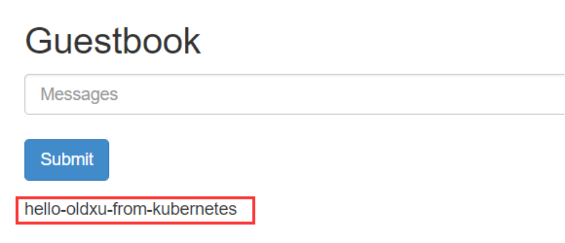

```
[root@master guestbooks]# kubectl exec -it redis- follower-7c45546c6d-mqlxp !& /bin/bash www.xuliangwei.com root@redis-follower-7c45546c6d-mqlxp:/data# redis- cli 127.0.0.1:6379> keys *

1) "guestbook"

127.0.0.1:6379> get guestbook     # 获取数据 ",hello-oldxu-from-kubernetes,"
```
