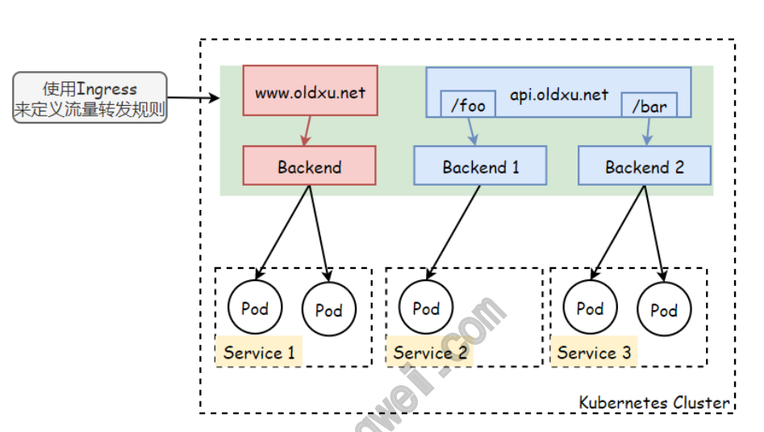
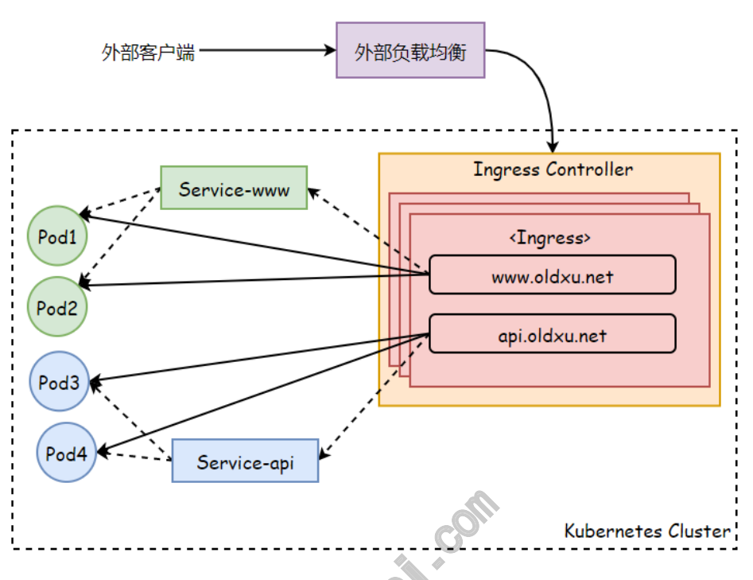
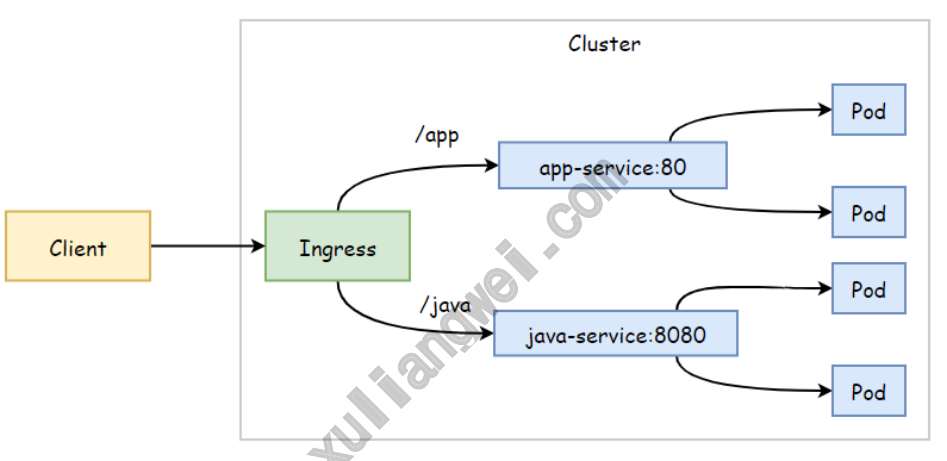
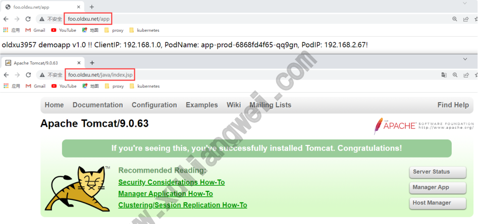
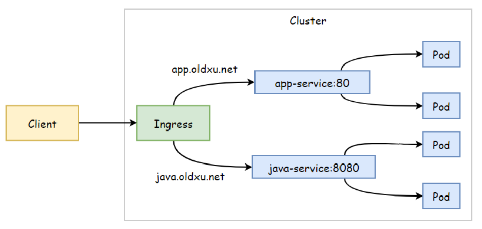
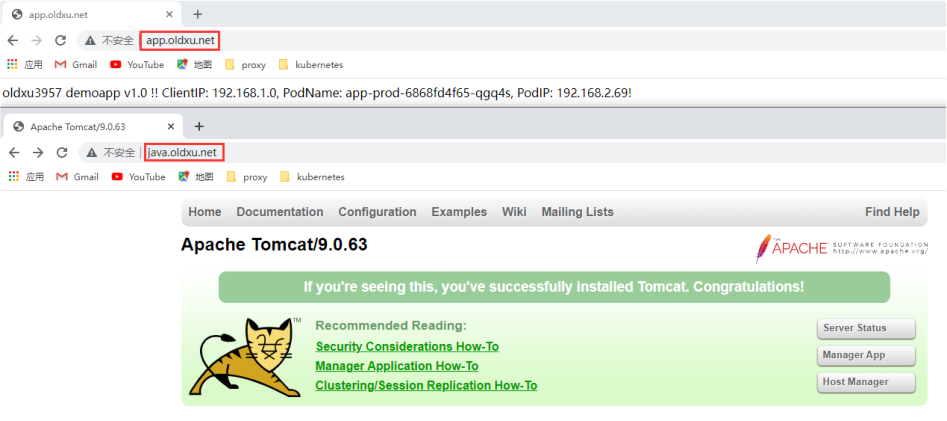
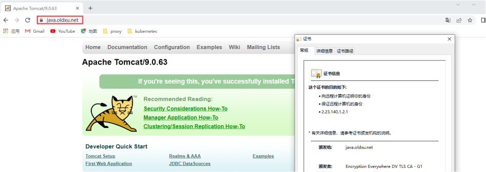

# 09 Kubernetes资源Ingress

## 目录

- [1.Ingress基本概念](#1.ingress基本概念)
  - [1.1 为何需要Ingress](#1.1-为何需要ingress)
  - [1.2 什么是Ingress](#1.2-什么是ingress)
  - [1.3 Ingress Controller](#1.3-ingress-controller)
- [2.Ingress安装与配置](#2.ingress安装与配置)
  - [2.1 部署Ingress](#2.1-部署ingress)
  - [2.2 配置Ingress](#2.2-配置ingress)
  - [2.3 为节点打标签](#2.3-为节点打标签)
- [2.检查ingress-controller状态](#2.检查ingress-controller状态)
- [3.Ingress快速⼊⻔实践](#3.ingress快速实践)
  - [3.1 Ingress资源清单](#3.1-ingress资源清单)
  - [3.2 Ingress发布业务](#3.2-ingress发布业务)
  - [3.3 客户端测试访问](#3.3-客户端测试访问)
- [4.Ingress基于URL实现路由](#4.ingress基于url实现路由)
  - [4.1 部署demoapp应⽤](#4.1-部署demoapp应)
  - [4.2 部署tomcat应⽤](#4.2-部署tomcat应)
  - [4.3 配置Ingress](#4.3-配置ingress)
  - [4.4 客户端测试](#4.4-客户端测试)
- [5.Ingress基于名称虚拟主机](#5.ingress基于名称虚拟主机)
  - [5.1 部署demoapp应⽤](#5.1-部署demoapp应)
  - [5.2 部署tomcat应⽤](#5.2-部署tomcat应)
  - [5.3 配置Ingress](#5.3-配置ingress)
  - [5.4 客户端测试](#5.4-客户端测试)
- [6.Ingress实现HTTPS](#6.ingress实现https)
  - [6.1 创建TLS证书](#6.1-创建tls证书)
  - [6.2 创建Secrets](#6.2-创建secrets)
  - [6.3 配置Ingress](#6.3-配置ingress)
  - [6.4 客户端测试](#6.4-客户端测试)
- [7.Ingress Rewrite](#7.ingress-rewrite)
  - [7.1 Rewrite示例1](#7.1-rewrite示例1)
  - [7.1 Rewrite示例2](#7.1-rewrite示例2)
- [8.Ingress⾃定义配置](#8.ingress定义配置)
- [9.Ingress灰度发布](#9.ingress灰度发布)
  - [9.1 灰度发布介绍](#9.1-灰度发布介绍)
  - [9.4 配置⽣产环境Ingress](#9.4-配置产环境ingress)
  - [9.5 基于权重的灰度发布](#9.5-基于权重的灰度发布)
  - [9.6 基于Header灰度发布](#9.6-基于header灰度发布)
  - [9.7 基于Cookies灰度发布](#9.7-基于cookies灰度发布)

9.2 部署⽣产应⽤1.0 9.3 部署灰度应⽤1.1

## 1.Ingress基本概念

### 1.1 为何需要Ingress

使⽤NodePort类型的Service可以将集群内部服务暴露给集群外部客户 www.xuliangwei.com 端，但使⽤这种类型Service存在如下⼏个问题。 1、⼀个端⼝只能⼀个服务使⽤，所有通过NodePort暴露的端⼝都 需要提前规划； 2、如果通过NodePort暴露端⼝过多，后期维护成本太⼤，且不易 于管理； 3、⽬前Service底层使⽤的是Iptables、IPVS，仅⽀持4层协 议，⽆法完成https协议传输； Kubernetes为了解决这种需求，提供了⼀种⾼级的流量管理，也就是 Ingress和Ingress控制器，Kubernetes使⽤Ingress控制器来接收 所有⼊⼝的流量，然后通过Ingress资源来定义流量如何区分，以及流量 如何转发的规则。 有了Ingress和Ingress控制器，我们就可以直接定义流量转发规则来 发布服务，⽽⽆需创建⼀堆的NodePort和LoadBalance类型的 Service。

### 1.2 什么是Ingress

Ingress其实就是Kubernetes中的⼀种资源，它主要是⽤来定义流量转 发规则。但Ingress资源⾃身并不能实现流量的转发和调度，它仅仅是⼀ 组流量路由的规则集合，这些规则要真正发挥作⽤还需要使⽤到Ingress 控制器，由Ingress控制器读取对应的Ingress规则，然后完成流量的 路由或转发。



### 1.3 Ingress Controller

Ingress Controller就是⼀类以代理HTTP/HTTPS协议为主的代理程 序。如：Nginx、Traefik、Envoy、Haproxy。Ingress Controller通过Pod的形式运⾏在Kubernetes集群上，它能够与集群 上的Pod直接通信。这样就可以让⽤户的流量经过Ingress控制器时直接 调度到对应的Pod上。 Ingress Controller类似Nginx服务，它负责读取Ingress的规则， 然后转换将规则转换为nginx.conf配置⽂件，这样就可以根据对应的规 则来实现流量的调度。同时它还会实时感知后端Service对应的Pod变 化，当Pod发⽣变动后，Ingress控制器会再次结合Ingress的规则，进 ⽽完成对应的配置动态更新。



注意：使⽤Ingress资源进⾏流量分发时，Ingress控制器可基于 ingress定义的规则将客户端的请求流量直接转发⾄Service对应的后 端Pod资源上。⽐如：⽤户请求api.oldxu.net，Ingress控制器根据 对应的规则直接将请求流量调度⾄Pod3或Pod4，⽽⽆需经过Service对 象转发。

## 2.Ingress安装与配置

安装Ingress-nginx控制器； 使⽤daemonSet⽅式部署，但需要通过nodeSelect来选择⼏个节点 安装，并⾮所有节点都需要； 将Pod的端⼝与节点共享⽹络名称空间；设定为HostNetwork；

### 2.1 部署Ingress

1.下载ingress-nginx部署⽂件。ingress的github地址

```
[root@master-node1 ingress]# wget https:!"raw.githubusercontent.com/kubernetes/ingress -nginx/controller- v1.2.0/deploy/static/provider/baremetal/deploy.yaml
```
### 2.2 配置Ingress

```
[root@master ingress]# cat deploy.yaml apiVersion: v1 kind: Namespace metadata: labels: app.kubernetes.io/instance: ingress-nginx www.xuliangwei.com app.kubernetes.io/name: ingress-nginx name: ingress-nginx !!# apiVersion: v1 automountServiceAccountToken: true kind: ServiceAccount metadata: labels: app.kubernetes.io/component: controller app.kubernetes.io/instance: ingress-nginx app.kubernetes.io/name: ingress-nginx app.kubernetes.io/part-of: ingress-nginx app.kubernetes.io/version: 1.2.0 name: ingress-nginx namespace: ingress-nginx !!# apiVersion: v1 kind: ServiceAccount metadata:

labels: app.kubernetes.io/component: admission-webhook app.kubernetes.io/instance: ingress-nginx app.kubernetes.io/name: ingress-nginx app.kubernetes.io/part-of: ingress-nginx app.kubernetes.io/version: 1.2.0 name: ingress-nginx-admission namespace: ingress-nginx !!# apiVersion: rbac.authorization.k8s.io/v1 kind: Role metadata: labels: app.kubernetes.io/component: controller www.xuliangwei.com app.kubernetes.io/instance: ingress-nginx app.kubernetes.io/name: ingress-nginx app.kubernetes.io/part-of: ingress-nginx app.kubernetes.io/version: 1.2.0 name: ingress-nginx namespace: ingress-nginx rules:

- namespaces

- pods

- secrets

- endpoints

- services

- ingresses

- ingresses/status

- ingressclasses

resourceNames:

- ingress-controller-leader
```
www.xuliangwei.com

```
- events

- patch

!!# apiVersion: rbac.authorization.k8s.io/v1 kind: Role metadata: labels: app.kubernetes.io/component: admission-webhook app.kubernetes.io/instance: ingress-nginx app.kubernetes.io/name: ingress-nginx app.kubernetes.io/part-of: ingress-nginx

app.kubernetes.io/version: 1.2.0 name: ingress-nginx-admission namespace: ingress-nginx rules:

- secrets

!!# apiVersion: rbac.authorization.k8s.io/v1 kind: ClusterRole www.xuliangwei.com metadata: labels: app.kubernetes.io/instance: ingress-nginx app.kubernetes.io/name: ingress-nginx app.kubernetes.io/part-of: ingress-nginx app.kubernetes.io/version: 1.2.0 name: ingress-nginx rules:

- endpoints

- nodes

- pods

- secrets

- namespaces

- nodes

- services

- ingresses

- events

- patch

- ingresses/status

- ingressclasses

!!# apiVersion: rbac.authorization.k8s.io/v1 kind: ClusterRole www.xuliangwei.com metadata: labels: app.kubernetes.io/component: admission-webhook app.kubernetes.io/instance: ingress-nginx app.kubernetes.io/name: ingress-nginx app.kubernetes.io/part-of: ingress-nginx app.kubernetes.io/version: 1.2.0 name: ingress-nginx-admission rules:

- admissionregistration.k8s.io

- validatingwebhookconfigurations

!!# apiVersion: rbac.authorization.k8s.io/v1 kind: RoleBinding

metadata: labels: app.kubernetes.io/component: controller app.kubernetes.io/instance: ingress-nginx app.kubernetes.io/name: ingress-nginx app.kubernetes.io/part-of: ingress-nginx app.kubernetes.io/version: 1.2.0 name: ingress-nginx namespace: ingress-nginx roleRef: apiGroup: rbac.authorization.k8s.io kind: Role name: ingress-nginx subjects: www.xuliangwei.com

name: ingress-nginx namespace: ingress-nginx !!# apiVersion: rbac.authorization.k8s.io/v1 kind: RoleBinding metadata: labels: app.kubernetes.io/component: admission-webhook app.kubernetes.io/instance: ingress-nginx app.kubernetes.io/name: ingress-nginx app.kubernetes.io/part-of: ingress-nginx app.kubernetes.io/version: 1.2.0 name: ingress-nginx-admission namespace: ingress-nginx roleRef: apiGroup: rbac.authorization.k8s.io kind: Role name: ingress-nginx-admission

subjects:

name: ingress-nginx-admission namespace: ingress-nginx !!# apiVersion: rbac.authorization.k8s.io/v1 kind: ClusterRoleBinding metadata: labels: app.kubernetes.io/instance: ingress-nginx app.kubernetes.io/name: ingress-nginx app.kubernetes.io/part-of: ingress-nginx app.kubernetes.io/version: 1.2.0 name: ingress-nginx www.xuliangwei.com roleRef: apiGroup: rbac.authorization.k8s.io kind: ClusterRole name: ingress-nginx subjects:

name: ingress-nginx namespace: ingress-nginx !!# apiVersion: rbac.authorization.k8s.io/v1 kind: ClusterRoleBinding metadata: labels: app.kubernetes.io/component: admission-webhook app.kubernetes.io/instance: ingress-nginx app.kubernetes.io/name: ingress-nginx app.kubernetes.io/part-of: ingress-nginx app.kubernetes.io/version: 1.2.0 name: ingress-nginx-admission

roleRef: apiGroup: rbac.authorization.k8s.io kind: ClusterRole name: ingress-nginx-admission subjects:

name: ingress-nginx-admission namespace: ingress-nginx !!# apiVersion: v1 data: allow-snippet-annotations: "true" kind: ConfigMap metadata: www.xuliangwei.com labels: app.kubernetes.io/component: controller app.kubernetes.io/instance: ingress-nginx app.kubernetes.io/name: ingress-nginx app.kubernetes.io/part-of: ingress-nginx app.kubernetes.io/version: 1.2.0 name: ingress-nginx-controller namespace: ingress-nginx !!# apiVersion: v1 kind: Service metadata: labels: app.kubernetes.io/component: controller app.kubernetes.io/instance: ingress-nginx app.kubernetes.io/name: ingress-nginx app.kubernetes.io/part-of: ingress-nginx app.kubernetes.io/version: 1.2.0 name: ingress-nginx-controller

namespace: ingress-nginx spec: ports:

- appProtocol: http

name: http port: 80 protocol: TCP targetPort: http

- appProtocol: https

name: https port: 443 protocol: TCP targetPort: https selector: www.xuliangwei.com app.kubernetes.io/component: controller app.kubernetes.io/instance: ingress-nginx app.kubernetes.io/name: ingress-nginx type: ClusterIP                               # 修 改为ClusterIP !!# apiVersion: v1 kind: Service metadata: labels: app.kubernetes.io/component: controller app.kubernetes.io/instance: ingress-nginx app.kubernetes.io/name: ingress-nginx app.kubernetes.io/part-of: ingress-nginx app.kubernetes.io/version: 1.2.0 name: ingress-nginx-controller-admission namespace: ingress-nginx spec: ports:

- appProtocol: https

name: https-webhook port: 443 targetPort: webhook selector: app.kubernetes.io/component: controller app.kubernetes.io/instance: ingress-nginx app.kubernetes.io/name: ingress-nginx type: ClusterIP !!# apiVersion: apps/v1 kind: DaemonSet                                 # 使 ⽤DaemonSet确保每个节点都部署Ingress metadata: www.xuliangwei.com labels: app.kubernetes.io/component: controller app.kubernetes.io/instance: ingress-nginx app.kubernetes.io/name: ingress-nginx app.kubernetes.io/part-of: ingress-nginx app.kubernetes.io/version: 1.2.0 name: ingress-nginx-controller namespace: ingress-nginx spec: minReadySeconds: 0 revisionHistoryLimit: 10 selector: matchLabels: app.kubernetes.io/component: controller app.kubernetes.io/instance: ingress-nginx app.kubernetes.io/name: ingress-nginx template: metadata: labels:

app.kubernetes.io/component: controller app.kubernetes.io/instance: ingress-nginx app.kubernetes.io/name: ingress-nginx spec: containers:

- args:

- /nginx-ingress-controller

- !$election-id=ingress-controller-leader

- !$controller-class=k8s.io/ingress-nginx

- !$ingress-class=nginx

- !$configmap=$(POD_NAMESPACE)/ingress-

nginx-controller

- !$validating-webhook=:8443

- !$validating-webhook-

certificate=/usr/local/certificates/cert

- !$validating-webhook-

key=/usr/local/certificates/key env:

- name: POD_NAME

valueFrom: fieldRef: fieldPath: metadata.name

- name: POD_NAMESPACE

valueFrom: fieldRef: fieldPath: metadata.namespace

- name: LD_PRELOAD

value: /usr/local/lib/libmimalloc.so image: oldxu3957/nginx-ingress- controller:1.2.0 imagePullPolicy: IfNotPresent lifecycle: preStop:

exec: command:

- /wait-shutdown

livenessProbe: failureThreshold: 5 httpGet: path: /healthz port: 10254 scheme: HTTP initialDelaySeconds: 10 periodSeconds: 10 successThreshold: 1 timeoutSeconds: 1 name: controller www.xuliangwei.com ports:

- containerPort:

name: http protocol: TCP

- containerPort:

name: https protocol: TCP

- containerPort: 8443

name: webhook protocol: TCP readinessProbe: failureThreshold: 3 httpGet: path: /healthz port: 10254 scheme: HTTP initialDelaySeconds: 10 periodSeconds: 10 successThreshold:

timeoutSeconds: 1 resources: requests: cpu: 100m memory: 90Mi securityContext: allowPrivilegeEscalation: true capabilities: add:

- NET_BIND_SERVICE

drop:

- ALL

runAsUser: 101 volumeMounts: www.xuliangwei.com

- mountPath: /usr/local/certificates/

name: webhook-cert readOnly: true dnsPolicy: ClusterFirstWithHostNet    # 优先使 ⽤集群内的DNS解析服务 hostNetwork: true                         # 将 80和443监听在宿主机节点上（⾃⾏添加） nodeSelector:                             # 节 点选择器（选择哪些节点部署Ingress，默认所有） node-role: ingress                      # 如 果节点有node-role=ingress 并且os=linux的标签，则在节点上 运⾏Ingress Pod kubernetes.io/os: linux serviceAccountName: ingress-nginx terminationGracePeriodSeconds: 300 volumes:

- name: webhook-cert

secret: secretName: ingress-nginx-admission

!!# apiVersion: batch/v1 kind: Job metadata: labels: app.kubernetes.io/component: admission-webhook app.kubernetes.io/instance: ingress-nginx app.kubernetes.io/name: ingress-nginx app.kubernetes.io/part-of: ingress-nginx app.kubernetes.io/version: 1.2.0 name: ingress-nginx-admission-create namespace: ingress-nginx spec: template: www.xuliangwei.com metadata: labels: app.kubernetes.io/component: admission- webhook app.kubernetes.io/instance: ingress-nginx app.kubernetes.io/name: ingress-nginx app.kubernetes.io/part-of: ingress-nginx app.kubernetes.io/version: 1.2.0 name: ingress-nginx-admission-create spec: containers:

- args:

- !$host=ingress-nginx-controller-

admission,ingress-nginx-controller- admission.$(POD_NAMESPACE).svc

- !$namespace=$(POD_NAMESPACE)

- !$secret-name=ingress-nginx-admission

env:

- name: POD_NAMESPACE

valueFrom: fieldRef: fieldPath: metadata.namespace image: oldxu3957/kube-webhook-certgen:v1.1.1 imagePullPolicy: IfNotPresent name: create securityContext: allowPrivilegeEscalation: false nodeSelector: kubernetes.io/os: linux restartPolicy: OnFailure securityContext: fsGroup: 2000 www.xuliangwei.com runAsNonRoot: true runAsUser: 2000 serviceAccountName: ingress-nginx-admission !!# apiVersion: batch/v1 kind: Job metadata: labels: app.kubernetes.io/component: admission-webhook app.kubernetes.io/instance: ingress-nginx app.kubernetes.io/name: ingress-nginx app.kubernetes.io/part-of: ingress-nginx app.kubernetes.io/version: 1.2.0 name: ingress-nginx-admission-patch namespace: ingress-nginx spec: template: metadata: labels:

app.kubernetes.io/component: admission- webhook app.kubernetes.io/instance: ingress-nginx app.kubernetes.io/name: ingress-nginx app.kubernetes.io/part-of: ingress-nginx app.kubernetes.io/version: 1.2.0 name: ingress-nginx-admission-patch spec: containers:

- args:

- patch

- !$webhook-name=ingress-nginx-admission

- !$namespace=$(POD_NAMESPACE)

- !$patch-mutating=false

- !$secret-name=ingress-nginx-admission

- !$patch-failure-policy=Fail

env:

- name: POD_NAMESPACE

valueFrom: fieldRef: fieldPath: metadata.namespace image: oldxu3957/kube-webhook-certgen:v1.1.1 imagePullPolicy: IfNotPresent name: patch securityContext: allowPrivilegeEscalation: false nodeSelector: kubernetes.io/os: linux restartPolicy: OnFailure securityContext: fsGroup: 2000 runAsNonRoot: true runAsUser: 2000

serviceAccountName: ingress-nginx-admission !!# apiVersion: networking.k8s.io/v1 kind: IngressClass metadata: labels: app.kubernetes.io/component: controller app.kubernetes.io/instance: ingress-nginx app.kubernetes.io/name: ingress-nginx app.kubernetes.io/part-of: ingress-nginx app.kubernetes.io/version: 1.2.0 name: nginx spec: controller: k8s.io/ingress-nginx www.xuliangwei.com !!# apiVersion: admissionregistration.k8s.io/v1 kind: ValidatingWebhookConfiguration metadata: labels: app.kubernetes.io/component: admission-webhook app.kubernetes.io/instance: ingress-nginx app.kubernetes.io/name: ingress-nginx app.kubernetes.io/part-of: ingress-nginx app.kubernetes.io/version: 1.2.0 name: ingress-nginx-admission webhooks:

- admissionReviewVersions:

- v1

clientConfig: service: name: ingress-nginx-controller-admission namespace: ingress-nginx path: /networking/v1/ingresses

failurePolicy: Fail matchPolicy: Equivalent name: validate.nginx.ingress.kubernetes.io rules:

apiVersions:

- v1

operations:

- CREATE

- UPDATE

- ingresses

sideEffects: None www.xuliangwei.com
```
### 2.3 为节点打标签

```
1.为节点打上对应标签，否则Ingress⽆法正常调度到指定的节点运⾏ [root@master ingress]# kubectl label node node1 node-role=ingress node/node1 labeled [root@master ingress]# kubectl label node node2 node-role=ingress node/node2 labeled
```
## 2.检查ingress-controller状态

```
[root@master ingress]# kubectl get pod -n ingress- nginx NAME                                      READY STATUS      RESTARTS   AGE ingress-nginx-controller-4gx6h            1/1 Running     0          3m47s ingress-nginx-controller-dkwqd            1/1 Running     0          3m49s
```
## 3.Ingress快速⼊⻔实践

### 3.1 Ingress资源清单

```
apiVersion: networking.k8s.io/v1    # 资源所属的API群 组和版本 kind: Ingress             # 资源类型表示 metadata:               # 元数据 name: <string>            # 资源名称 namespace: <string>         # 名称空间 spec: ingressClassName: "nginx"       # 适配的Ingress控制 器类别，必须明确指定 rules: <[]Object>           # Ingress规则列表

- host: <string>            # 虚拟主机的FQDN，俗称域

名 http: <Object> paths: <[]Object>         # 虚拟主机PATH定义的列 表，有path和backend组成
```
- path: <string>          # 匹配以什么开头，类似

nginx中location的作⽤

```
pathType: <string>        # Prefix前缀匹配，不 区分⼤⼩写 Exact精确匹配URL，区分⼤⼩写 backend: <Object> service: <Object>       # 关联的后端Service name: <string>        # 后端Service的名称 port: <Object>        # 后端Service的端⼝ 对象 name: <string>      # 端⼝名称 number: <integr>      # 端⼝号
```
### 3.2 Ingress发布业务

```
编写Ingress规则，将此前的guestBooks业务通过域名⽅式发布； www.xuliangwei.com [root@master host]# cat books-ingress.yaml apiVersion: networking.k8s.io/v1 kind: Ingress metadata: name: books-ingress spec: ingressClassName: "nginx" rules:

- host: books.oldxu.net

- path: /

pathType: Prefix backend: service: name: guestbooks port: number:
```
### 3.3 客户端测试访问

配置windows，将域名解析安装了Ingress节点的地址，然后测试访问

## 4.Ingress基于URL实现路由

场景：将来⾃同⼀域名，不同URL请求调度到不同Service。



### 4.1 部署demoapp应⽤

```
[root@master ~]# cat app-deploy-service.yaml # Deployment apiVersion: apps/v1 kind: Deployment metadata: name: app-prod spec: replicas: 2 selector:

matchLabels: role: python template: metadata: labels: role: python spec: containers:

- name: app

image: oldxu3957/demoapp:v1.0 ports:

- containerPort:

Service www.xuliangwei.com !!# apiVersion: v1 kind: Service metadata: name: app-service spec: selector: role: python ports:

targetPort:
```
### 4.2 部署tomcat应⽤

```
[root@master ~]# cat java-deploy-service.yaml # Deployment apiVersion: apps/v1 kind: Deployment

metadata: name: tomcat-prod spec: replicas: 2 selector: matchLabels: role: java template: metadata: labels: role: java spec: containers:

- name: tomcat

image: tomcat:9.0.63 ports:

- containerPort: 8080

lifecycle: postStart: exec: command:

- "/bin/bash"

- "-c"

- "cp -rf

/usr/local/tomcat/webapps.dist!% /usr/local/tomcat/webapps"

Service !!# apiVersion: v1 kind: Service metadata: name: java-service

spec: selector: role: java ports:

- port: 8080

targetPort: 8080
```
### 4.3 配置Ingress

1.编写Yaml

```
[root@master ingress-test]# cat ingress-app- java.yaml www.xuliangwei.com apiVersion: networking.k8s.io/v1 kind: Ingress metadata: name: foo-ingress spec: ingressClassName: "nginx" rules:

- host: foo.oldxu.net

- path: /app

pathType: Prefix backend: service: name: app-service port: number:

- path: /java

pathType: Prefix backend:

service: name: java-service port: number: 8080 2.访问/app会出现404错误，因为后端的Pod⽆法处理/app这样的接 ⼝，所以需要调整代理到后端的路径； 默认URL：⽤户请求foo.oldxu.net/app，代理到后端请求也会带 上/app，后端⽆法处理该url，就会报错 修改URL：⽤户请求foo.oldxu.net/app，代理到后端后，将请求 的/app删除，url为foo.oldxu.net/ [root@master ingress-test]# cat ingress-app- java.yaml www.xuliangwei.com apiVersion: networking.k8s.io/v1 kind: Ingress metadata: name: foo-ingress annotations: nginx.ingress.kubernetes.io/rewrite-target: /$2 # 配置Rewrite规则 spec: ingressClassName: "nginx" rules:

- host: foo.oldxu.net

- path: /app(/|$)(.*)

pathType: Prefix backend: service: name: app-service port:

number:

- path: /java(/|$)(.*)

pathType: Prefix backend: service: name: java-service port: number: 8080
```
### 4.4 客户端测试



## 5.Ingress基于名称虚拟主机

场景：将来⾃不同的域名的请求调度到不同Service。



### 5.1 部署demoapp应⽤

```
[root@master ~]# cat app-deploy-service.yaml # Deployment apiVersion: apps/v1 kind: Deployment metadata: name: app-prod spec: replicas: 2 selector: matchLabels: role: python template: metadata: labels: role: python spec: containers:

- name: app

image: oldxu3957/demoapp:v1.0 ports:

- containerPort:

Service !!# apiVersion: v1 kind: Service metadata: name: app-service spec: selector: role: python ports:

targetPort: 80 www.xuliangwei.com
```
### 5.2 部署tomcat应⽤

```
[root@master ~]# cat java-deploy-service.yaml # Deployment apiVersion: apps/v1 kind: Deployment metadata: name: tomcat-prod spec: replicas: 2 selector: matchLabels: role: java template: metadata: labels: role: java

spec: containers:

- name: tomcat

image: tomcat:9.0.63 ports:

- containerPort: 8080

lifecycle: postStart: exec: command:

- "/bin/bash"

- "-c"

- "cp -rf

/usr/local/tomcat/webapps.dist!% www.xuliangwei.com /usr/local/tomcat/webapps"

Service !!# apiVersion: v1 kind: Service metadata: name: java-service spec: selector: role: java ports:

- port: 8080

targetPort: 8080
```
### 5.3 配置Ingress

```
[root@master ~]# cat ingress-domain.yaml

apiVersion: networking.k8s.io/v1 kind: Ingress metadata: name: virtual-host-ingress spec: ingressClassName: "nginx" rules:

- host: app.oldxu.net

path: "/" backend: service: www.xuliangwei.com name: app-service port: number:

path: "/" backend: service: name: java-service port: number: 8080
```
### 5.4 客户端测试



## 6.Ingress实现HTTPS

在 Ingress 中引⽤ Secret资源，然后告诉 Ingress 控制器使⽤ www.xuliangwei.com TLS 加密从客户端到负载均衡器的通道。

### 6.1 创建TLS证书

```
[root@master ~]# openssl genrsa -out java.key 2048 [root@master ~]# openssl req -new -x509 \ -key java.key \ -out java.crt \ -subj /C=CN/ST=Beijing/L=Beijing/O=oldxu/CN=java.oldxu.net
```
### 6.2 创建Secrets

```
[root@master ~]# kubectl create secret tls java- oldxu-tls \ !$key=app.key \ !$cert=app.crt
```
### 6.3 配置Ingress

```
[root@master ~]# cat java-ingress-tls.yaml apiVersion: networking.k8s.io/v1 kind: Ingress metadata: name: java-ingress-tls spec: ingressClassName: "nginx" tls:                          # https

- hosts:

- java.oldxu.net

secretName: java-oldxu-tls  # secrets资源名称 rules: www.xuliangwei.com

path: "/" backend: service: name: java-service port: number: 8080
```
### 6.4 客户端测试



## 7.Ingress Rewrite

### 7.1 Rewrite示例1

```
[root@master ingress-test]# cat ingress-domain-tls-
```
2.yaml

```
apiVersion: networking.k8s.io/v1 kind: Ingress metadata: name: java-ingress-tls annotations: nginx.ingress.kubernetes.io/rewrite-target: /$2 spec: ingressClassName: "nginx" tls:                          # https

- hosts:

- java.oldxu.net

secretName: java-oldxu-tls rules:

path: "/java(/|$)(.*)"      # 匹配/java后⾯的 内容 backend: service: name: java-service port: number: 8080
```
### 7.1 Rewrite示例2

```
[root@master ~]# cat ingress-domain-tls-2.yaml apiVersion: networking.k8s.io/v1 www.xuliangwei.com kind: Ingress metadata: name: java-ingress-tls annotations: nginx.ingress.kubernetes.io/rewrite-target: /$2 nginx.ingress.kubernetes.io/configuration- snippet: |    # ⾃定义跳转 rewrite ^/manager/(.*)$ /java/manager/$1 redirect; rewrite ^/host-manager/(.*)$ /java/host- manager/$1 redirect; rewrite ^/docs/(.*)$ /java/docs/$1 redirect;

spec: ingressClassName: "nginx" tls:                          # https

- hosts:

- java.oldxu.net

secretName: java-oldxu-tls

rules:

path: "/java(/|$)(.*)" backend: service: name: java-service port: number: 8080
```
## 8.Ingress⾃定义配置

## 9.Ingress灰度发布

### 9.1 灰度发布介绍

Ingress实现灰度发布可以基于权重，也可以基于⽤户请求来实现 基于权重发布

```
灰度版本的annotations nginx.ingress.kubernetes.io/canary: "true" nginx.ingress.kubernetes.io/canary-weight: "30"

70% |------> ⽣产版 本 users !!# 100% !!#> Nginx Ingress ----|  30% |------> 灰度版 本 基于⽤户header发布 # 灰度版本的annotations www.xuliangwei.com nginx.ingress.kubernetes.io/canary: "true" nginx.ingress.kubernetes.io/canary-by-header: "deploy" nginx.ingress.kubernetes.io/canary-by-header-value: "new"

others |-----------> ⽣产 版本 users ------> Nginx Ingress ------| "deploy:new" |-----------> 灰度 版本 9.2 部署⽣产应⽤1.0 [root@master ~]# cat demoapp-10-deployment- service.yaml

apiVersion: apps/v1 kind: Deployment metadata: name: demoapp-prod spec: replicas: 2 selector: matchLabels: app: demoapp version: v1.0 template: metadata: labels: app: demoapp www.xuliangwei.com version: v1.0 spec: containers:

- name: web

image: oldxu3957/demoapp:v1.0 imagePullPolicy: Always

!!# apiVersion: v1 kind: Service metadata: name: demoapp-prod spec: selector: app: demoapp version: v1.0 ports:

targetPort:

9.3 部署灰度应⽤1.1 [root@master ~]# cat demoapp-11-deployment- service.yaml apiVersion: apps/v1 kind: Deployment metadata: name: demoapp-canary spec: replicas: 2 selector: matchLabels: app: demoapp version: v1.1 www.xuliangwei.com template: metadata: labels: app: demoapp version: v1.1 spec: containers:

- name: web

image: oldxu3957/demoapp:v1.1 imagePullPolicy: Always

!!# apiVersion: v1 kind: Service metadata: name: demoapp-canary spec: selector: app: demoapp

version: v1.1 ports:

targetPort:
```
### 9.4 配置⽣产环境Ingress

```
[root@master canary]# cat demoapp-ingress-prod.yaml apiVersion: networking.k8s.io/v1 kind: Ingress metadata: name: demoapp-ingress-prod spec: www.xuliangwei.com ingressClassName: "nginx" rules:

- host: demoapp.oldxu.net

path: "/" backend: service: name: demoapp-prod port: number:
```
### 9.5 基于权重的灰度发布

```
[root@master canary]# cat demoapp-ingress- canary.yaml apiVersion: networking.k8s.io/v1 kind: Ingress

metadata: name: demoapp-ingress-canary annotations: nginx.ingress.kubernetes.io/canary: "true" # 启⽤灰度发布 nginx.ingress.kubernetes.io/canary-weight: "30" # 分配30%流量到当前canary版本 spec: ingressClassName: "nginx" rules:

- host: demoapp.oldxu.net

path: "/" backend: service: name: demoapp-canary port: number: 80 2、检查对应的Ingress详情 [root@master canary]# kubectl describe  ingress demoapp-ingress-canary Name:             demoapp-ingress-canary Namespace:        default Address:          10.0.0.211,10.0.0.212 Default backend:  default-http-backend:80 (<error: endpoints "default-http-backend" not found>) Rules: Host               Path  Backends ----               ----  --------

demoapp.oldxu.net /   demoapp-canary:80 (192.168.2.77:80,192.168.2.78:80) Annotations: nginx.ingress.kubernetes.io/canary: true

nginx.ingress.kubernetes.io/canary-weight: 30 Events: Type    Reason  Age                 From Message ----    ------  ----                ---- ------- Normal  Sync    1s (x4 over 3m36s)  nginx-ingress- controller  Scheduled
for sync www.xuliangwei.com Normal  Sync    1s (x4 over 3m36s)  nginx-ingress- controller  Scheduled
for sync 3、通过For循环访问10次，会发现有30%的流量调度到新版本。 [root@node1 ~]#
for i in {1!&10};
do curl -H "Host:demoapp.oldxu.net" http:!"10.0.0.211/version;done demoapp v1.1!' PodIP: 192.168.2.78! demoapp v1.0!' PodIP: 192.168.2.75! demoapp v1.1!' PodIP: 192.168.2.77! demoapp v1.0!' PodIP: 192.168.2.76! demoapp v1.0!' PodIP: 192.168.2.75! demoapp v1.0!' PodIP: 192.168.2.76! demoapp v1.0!' PodIP: 192.168.2.75! demoapp v1.0!' PodIP: 192.168.2.76! demoapp v1.0!' PodIP: 192.168.2.75! demoapp v1.1!' PodIP: 192.168.2.78!
```
### 9.6 基于Header灰度发布

```
基于Header的⽅式优先级⽐较⾼，所以会忽略weight权重的配置。但当 Header⽆法匹配时，则会按照权重进⾏匹配。 1、配置yaml [root@master canary]# cat demoapp-ingress- canary.yaml apiVersion: networking.k8s.io/v1 kind: Ingress metadata: name: demoapp-ingress-canary annotations: www.xuliangwei.com nginx.ingress.kubernetes.io/canary: "true" # 启⽤灰度发布 nginx.ingress.kubernetes.io/canary-by-header: "deploy"    # Header的key nginx.ingress.kubernetes.io/canary-by-header- value: "new" # Header的value nginx.ingress.kubernetes.io/canary-weight: "30" # 分配30%流量到当前canary版本 spec: ingressClassName: "nginx" rules:

- host: demoapp.oldxu.net

path: "/" backend: service: name: demoapp-canary port:
```
number: 80 2、如果将deploy的Header设定为old，它⽆法匹配到canary版本，然 后继续匹配规则，能匹配到权重。 [root@node1 ~]#
```
for i in {1!&10};
do curl -H "deploy:old" -H "Host:demoapp.oldxu.net" http:!"10.0.0.211/version;done demoapp v1.0!' PodIP: 192.168.2.75! demoapp v1.1!' PodIP: 192.168.2.78! demoapp v1.1!' PodIP: 192.168.2.77! demoapp v1.0!' PodIP: 192.168.2.76! demoapp v1.0!' PodIP: 192.168.2.75! demoapp v1.1!' PodIP: 192.168.2.78! www.xuliangwei.com demoapp v1.0!' PodIP: 192.168.2.76! demoapp v1.0!' PodIP: 192.168.2.75! demoapp v1.0!' PodIP: 192.168.2.76! demoapp v1.0!' PodIP: 192.168.2.75! 3、如果将请求的Header修改为“deploy:new”，则会百分百请求到 canary版本

[root@node1 ~]# for i in {1!&10}; do curl -H "deploy:new" -H "Host:demoapp.oldxu.net" http:!"10.0.0.211/version;done demoapp v1.1!' PodIP: 192.168.2.77! demoapp v1.1!' PodIP: 192.168.2.78! demoapp v1.1!' PodIP: 192.168.2.77! demoapp v1.1!' PodIP: 192.168.2.78! demoapp v1.1!' PodIP: 192.168.2.77! demoapp v1.1!' PodIP: 192.168.2.78! demoapp v1.1!' PodIP: 192.168.2.77! demoapp v1.1!' PodIP: 192.168.2.78! demoapp v1.1!' PodIP: 192.168.2.77! demoapp v1.1!' PodIP: 192.168.2.78! www.xuliangwei.com
```
### 9.7 基于Cookies灰度发布

假设我们需要让武汉的⽤户访问Canary版本，通过后台检查登录的⽤户 IP归属地，如果来源IP归属为武汉，则为其设定对应的Cookies，⽐如 request_from_wh，也就是说，只要来源的IP归属为武汉，那么程序 会⾃动添加这个Cookies，并将对应的值设定为always，这样，这个区 域的⽤户会被直接调度到Canary版本；

1、修改 Ingress资源对象；

```
apiVersion: networking.k8s.io/v1 kind: Ingress metadata: name: demoapp-ingress-canary annotations: nginx.ingress.kubernetes.io/canary: "true" # 启⽤灰度发布 nginx.ingress.kubernetes.io/canary-by-cookie: "request_from_wh"  # 基于cookie 2、请求测试，值为always则调度Canary版本，值为never则调度正常 版本； [root@node1 ~!(
for i in {1!&10};
do curl -s -b www.xuliangwei.com "request_from_wh=always" -H "Host:demoapp.oldxu.net" demoapp v1.1!' PodIP: 192.168.3.73! demoapp v1.1!' PodIP: 192.168.2.250! demoapp v1.1!' PodIP: 192.168.2.251! demoapp v1.1!' PodIP: 192.168.3.73! demoapp v1.1!' PodIP: 192.168.2.250! demoapp v1.1!' PodIP: 192.168.2.251! demoapp v1.1!' PodIP: 192.168.3.73! demoapp v1.1!' PodIP: 192.168.2.250! demoapp v1.1!' PodIP: 192.168.2.251! demoapp v1.1!' PodIP: 192.168.3.73!
```
