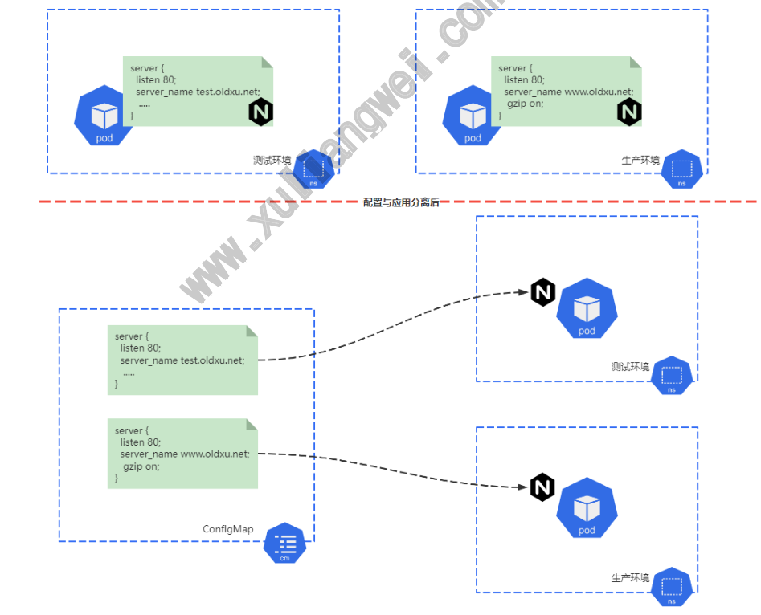
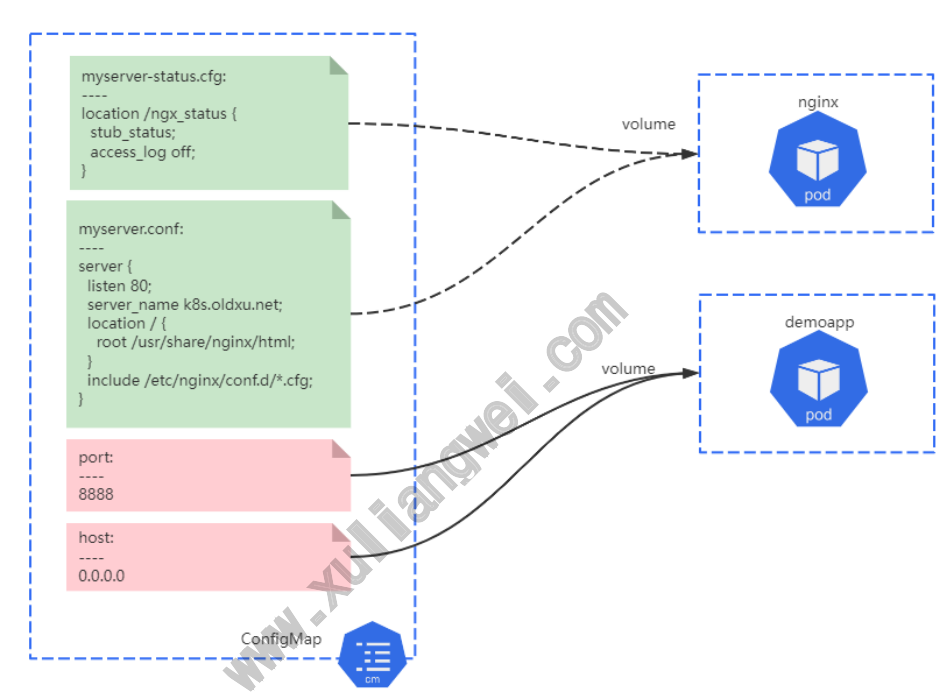

# 10 Kubernetes资源ConfigMap

## 目录

- [1.ConfigMap基本概念](#1.configmap基本概念)
  - [1.1 什么是ConfigMap](#1.1-什么是configmap)
  - [1.2 为什么需要ConfigMap](#1.2-为什么需要configmap)
- [2.创建ConfigMap](#2.创建configmap)
  - [2.1 基于命令创建CM](#2.1-基于命令创建cm)
  - [2.2 基于⽂件创建CM](#2.2-基于件创建cm)
  - [2.3 基于⽬录创建CM](#2.3-基于录创建cm)
  - [2.4 配置清单创建CM](#2.4-配置清单创建cm)
- [3.Pod引⽤ConfigMap](#3.pod引configmap)
  - [3.1 通过环境变量引⽤CM键值](#3.1-通过环境变量引cm键值)
    - [3.1.1 env引⽤变量示例](#3.1.1-env引变量示例)
    - [3.1.1 env引⽤变量实践](#3.1.1-env引变量实践)
- [1.定义configmap资源](#1.定义configmap资源)
  - [3.2 通过卷挂载⽅式引⽤CM](#3.2-通过卷挂载式引cm)
    - [3.2.1 引⽤整个存储卷](#3.2.1-引整个存储卷)
    - [3.2.2 引⽤存储卷部分键值](#3.2.2-引存储卷部分键值)
    - [3.2.3 引⽤存储卷单个键值](#3.2.3-引存储卷单个键值)
- [4.Redis结合ConfigMap实践](#4.redis结合configmap实践)
  - [4.1 场景说明](#4.1-场景说明)
  - [4.2 创建ConfigMap](#4.2-创建configmap)
  - [4.3 创建Redis-Pod](#4.3-创建redis-pod)
  - [4.4 检查Redis配置](#4.4-检查redis配置)
    - [127.0.0.1:6380> config get maxclients](#127.0.0.16380-config-get-maxclients)
  - [4.4 更新ConfigMap](#4.4-更新configmap)
  - [4.5 验证容器更新](#4.5-验证容器更新)

www.xuliangwei.com

## 1.ConfigMap基本概念

### 1.1 什么是ConfigMap

ConfigMap资源主要为容器注⼊相关的程序配置信息，⽤来定制程序的 运⾏⽅式，⽐如Redis监听端⼝、最⼤客户端连接数。 当定义好⼀个ConfigMap资源后，如果Pod需要使⽤，可以通过通过环境 变量、或存储卷的形式将其挂载并加载相关的配置，降低了配置与镜像⽂ 件的耦合关系。

### 1.2 为什么需要ConfigMap

将应⽤配置信息与程序进⾏分离，这样可以使得应⽤程序被更好地复⽤， 通过不同的配置能实现更灵活的功能，例如：在测试环境中Nginx提供 test域名访问，且没配置压缩功能，⽽在⽣产环境中则需要提供www域名 访问，且需要开启压缩功能，所以将应⽤容器与配置分离，根据不同的环 境调⽤不同的ConfigMap配置，能有效的降低耦合度和复杂度。 www.xuliangwei.com



## 2.创建ConfigMap

### 2.1 基于命令创建CM

```
1.使⽤ kubectl create configmap 命令使⽤ !"from-literal 选项给出键值对来创建 ConfigMap [root@master ~]# kubectl create configmap nginx- command-cm !"from-literal=ngx.host='0.0.0.0' !"from- literal=nginx.port='8899' configmap/nginx-command-cm created 2.通过 kubectl get configmap 查看 nginx-comand-cm对象 www.xuliangwei.com YAML格式可以看出，ConfigMap资源没有 sepc和status，⽽是直接使 ⽤data字段嵌套键值数据。 [root@master ~]# kubectl get configmaps nginx- command-cm  -o yaml apiVersion: v1 data: nginx.port: "8899" ngx.host: 0.0.0.0 kind: ConfigMap metadata: creationTimestamp: "2022-04-17T07:11:41Z" name: nginx-command-cm namespace: default resourceVersion: "1270921" uid: 2691ce16-6e6d-4b2c-a489-a2b01a53bd93 从上配置得知，若要基于配置清单创建ConfigMap资源时，仅需要指定 apiVersion、kind、metadata、data这四个字段；
```
### 2.2 基于⽂件创建CM

ConfigMap资源也可以为应⽤程序提供⼤段配置，这些⼤段配置通常保 存在⼀个或多个⽂件中，可以使⽤ kubectl create configmap 命 令，通过 !"from-file 选项⼀次加载⼀个配置⽂件的内容为指定键的 值。默认⽂件名为key，⽂件内容为values

1.准备两个nginx配置⽂件

```
主位置⽂件 [root@master configmap]# cat myserver.conf server { listen 8080; server_name my.oldxu.net; www.xuliangwei.com

location / { root /usr/share/nginx/html; index index.html; }

include /etc/nginx/conf.d/*.cfg; }

⽤于开启Nginx状态模块配置 [root@master configmap]# cat myserver-status.cfg location /ngx_status { stub_status; access_log off; }
```
2.通过下⾯的命令可以把事先准备好的Nginx配置⽂件保存到

ConfigMap 对象的 nginx-confs 中，其中⼀个直接使⽤ myserver.conf作为key名称，另⼀个myserver-status.cfg对应的 键名称⾃定义为status.cfg

```
[root@master ~]# kubectl create configmap nginx- confs \ !"from-file=./nginx-conf.d/myserver.conf \ !"from-file=status.cfg=./nginx-conf.d/myserver- status.cfg

[root@master configmap]# kubectl describe configmaps nginx-confs Name:         nginx-confs Namespace:    default Labels:       <none> Annotations:  <none> www.xuliangwei.com

Data ==== myserver.conf:              # 键的名称 !!#-                  # 下⾯是键的值 server { listen 8080; server_name my.oldxu.net;

location / { root /usr/share/nginx/html; index index.html; } include /etc/nginx/conf.d/*.cfg; }

status.cfg: !!#- location /ngx_status {

stub_status; access_log off; }
```
### 2.3 基于⽬录创建CM

对于配置⽂件较多且⽆需⾃定义键名称的场景，可以直接在 kubectl create configmap 命令的!"from-file选项上附加⼀个⽬录路径就 能将该⽬录下的所有⽂件创建于同⼀个ConfigMap资源中，各⽂件名即 为键名称。 1.准备多个nginx配置⽂件，都统⼀存储⾄nginx-conf.d⽬录中； # 主位置⽂件 www.xuliangwei.com [root@master configmap]# cat nginx- conf.d/myserver.conf server { listen 8080; server_name my.oldxu.net;

```
location / { root /usr/share/nginx/html; index index.html; }

include /etc/nginx/conf.d/*.cfg; }

⽤于开启Nginx状态模块配置 [root@master configmap]# cat nginx-conf.d/myserver- status.cfg location /ngx_status { stub_status;

access_log off; }

⽤于开启Nginx压缩功能 [root@master configmap]# cat nginx-conf.d/myserver- gzip.cfg gzip on; 2.通过下⾯命令将nginx-conf.d⽬录中的所有⽂件都保存到nginx- confs-files对象中。 [root@master configmap]# kubectl create configmap nginx-confs-files !"from-file=./nginx-conf.d/ www.xuliangwei.com 3.此⽬录包含 myserver.conf、myserver-status.cfg、 myserver-gzip.cfg 这3个配置⽂件，它们会被分别存储为3个键值数 据。 [root@master configmap]# kubectl describe configmaps nginx-confs-files Name: nginx-confs-files Namespace: default Labels: <none> Annotations: <none>

Data ==== myserver-gzip.cfg:        # 键名称1 ---- gzip on;

myserver-status.cfg:      # 键名称2 ----

location /ngx_status { stub_status; access_log off; }

myserver.conf:          # 键名称3 ---- server { listen 8080; server_name my.oldxu.net;

location / { root /usr/share/nginx/html; index index.html; www.xuliangwei.com } include /etc/nginx/conf.d/*.cfg; }
```
### 2.4 配置清单创建CM

```
基于配置清单创建ConfigMap资源时，仅需要指定apiVersion、 kind、metadata、data这四个字段； [root@master configmap]# cat demoapp-config.yaml apiVersion: v1 kind: ConfigMap metadata: name: demoapp-config namespace: default data: host: 0.0.0.0           # key: value port: "8888"            # key: value myserver.conf: |          # key

server { listen 80; server_name k8s.oldxu.net; location / { root /usr/share/nginx/html; } include /etc/nginx/conf.d/*.cfg; } myserver-status.cfg: | location /ngx_status { stub_status; access_log off; } www.xuliangwei.com 若键值来⾃于⽂件或⼀个⽬录，会发现不如通过命令⾏创建来的有效，因 此我们可以先使⽤命令⾏加载⽂件或⽬录的⽅式进⾏创建，⽽后在通过 kubectl get cm -o yaml 获取相关信息进⾏编辑和保存。
```
## 3.Pod引⽤ConfigMap

### 3.1 通过环境变量引⽤CM键值

#### 3.1.1 env引⽤变量示例

pod清单中除了使⽤vaule字段直接给定变量之外，还⽀持valueFrom 字段嵌套 configMapKeyRef 来引⽤ConfigMap对象的键值，具体格 式如下

```
env:
```
- name: <string>    # 要赋值的环境变量名称

valueFrom:      # 定义变量的引⽤ configMapkeyRef:  # 变量来⾃于configmap对象 name: <string>  # configmap对象的名称（因为有很 多configmap，需要指定具体的名称） key: <string>   # configmap的键名称 这种⽅式赋值环境变量与直接赋值环境变量⽅式并⽆区别，它们都可以⽤ 于容器的启动脚本或直接传递给容器应⽤等。

#### 3.1.1 env引⽤变量实践

demoapp容器⽀持通过环境变量 HOST、PORT 为其指定监听的地址和 www.xuliangwei.com 端⼝。

## 1.定义configmap资源

```
[root@master configmap]# cat demoapp-var-conf.yaml apiVersion: v1 kind: ConfigMap metadata: name: demoapp-var-conf data: demoapp.host: 0.0.0.0 demoapp.port: "8888" 2.创建⼀个Pod，然后通过env⽅式引⽤变量 [root@master configmap]# cat demoapp-pod.yaml apiVersion: v1 kind: Pod metadata: name: demoapp-env-cm

spec: containers:

- name: demoapp-env-cm

image: oldxu3957/demoapp:v1.0 env:

- name: HOST              # HOST变量名

valueFrom: configMapKeyRef: name: demoapp-var-conf      # 引⽤demoapp- var-conf资源中的demoap.host key: demoapp.host

- name: PORT              # PORT变量名

valueFrom: www.xuliangwei.com configMapKeyRef: name: demoapp-var-conf      # # 引⽤ demoapp-var-conf资源中的demoap.port key: demoapp.port

[root@master configmap]# kubectl exec demoapp-env-cm !" netstat -lntp Active Internet connections (only servers) Proto Recv-Q Send-Q Local Address       Foreign Address        State      PID/Program name tcp        0      0 0.0.0.0:8888        0.0.0.0:* LISTEN     1/python3 注意：
```
被引⽤的ConfigMap资源必须事先存在，否则⽆法在Pod对象中引⽤ ConfigMap资源，另外ConfigMap属于名称空间级别的资源，它必 须与引⽤它的Pod资源在同⼀名称空间。

### 3.2 通过卷挂载⽅式引⽤CM

使⽤环境变量⽅式导⼊ ConfigMap 对象中来源较⻓的⽂件内容，会导 致占据过多的内存空间，同时也不⽀持内容的动态更新。其次该类数据主 要⽤于为容器提供配置⽂件，所以将其内容直接通过挂载的⽅式进⾏引 ⽤，会是⼀种更好的选择。

#### 3.2.1 引⽤整个存储卷

www.xuliangwei.com 将ConfigMap对象的每个键名转为容器挂载点路径下的⼀个⽂件名，所 以每个键名应该设计为对容器应⽤加载的配置⽂件名称。 1.启动⼀个NginxPod，然后将此前创建的 nginx-confs-files 引⽤ ⾄容器的 /etc/nginx/conf.d⽬录中； [root@master configmap]# cat nginx-volume-all- conf.yaml apiVersion: v1 kind: Pod metadata: name: nginx-volume-all-cm spec: containers:

```
- name: nginx-volume-all-cm

image: nginx volumeMounts:       # 1.将nginxconfs挂载 到/etc/nginx/conf.d⽬录下

- name: nginxconfs

mountPath: /etc/nginx/conf.d/

volumes:            # 2.nginxconfs内容来源于 configmap中的nginx-confs-files资源

- name: nginxconfs

configMap: name: nginx-confs-files

[root@master ~]# kubectl exec -it nginx-volume-all- cm !" ls /etc/nginx/conf.d/ myserver-gzip.cfg  myserver-status.cfg myserver.conf

www.xuliangwei.com # myserver.conf定义主站，然后include包含了所有.cfg⽂件 3.访问Pod对应8080端⼝对应的/ngx_status，看是否能打开对应的 nginx状态⻚ [root@master ~]# kubectl get pod -o wide NAME                      READY   STATUS    RESTARTS AGE     IP                NODE nginx-volume-all-cm       1/1     Running   0 4m49s   192.168.166.184   node1

[root@master ~]# curl 192.168.166.184:8080/ngx_status Active connections: 1 server accepts handled requests

Reading: 0 Writing: 1 Waiting:
```
#### 3.2.2 引⽤存储卷部分键值

有些应⽤场景中，⽤户可能期望仅向容器中挂载指定的⼏个键，例如前⾯ 创建的⼀个名为 demoapp-config ⾥⾯有4个键，其中 host、port 能为demoapp容器定义监听地址及端⼝，⽽ myserver.conf、 myserver-status.cfg 能为nginx提供⼀个虚拟主机站点以及该虚拟 站点的状态信息。



```
www.xuliangwei.com 1.编写Pod，运⾏两个容器，分别调⽤不同的configmap配置 [root@master configmap]# cat demoapp-nginx-cm.yaml apiVersion: v1 kind: Pod metadata: name: demoapp-nginx-cm spec: containers:

- name: nginx             # nginx容器详情

image: nginx volumeMounts:

- name: ngxconfs          # 将ngxconfs配置⽂件挂载

⾄/etc/nginx/conf.d⽬录下 mountPath: /etc/nginx/conf.d/

- name: demoapp           # demoapp容器详情

image: oldxu3957/demoapp:v1.0 env:

- name: PORT

valueFrom: configMapKeyRef: name: demoapp-config key: port www.xuliangwei.com

- name: HOST

valueFrom: configMapKeyRef: name: demoapp-config key: host

volumes:

- name: ngxconfs            # nginxconfs引⽤

demoapp-config的ConfigMap资源 configMap: name: demoapp-config items:

- key: myserver.conf        # 要引⽤的键名称（必
```
写） path: k8s.oldxu.net.conf    # 对应的键在挂载点 ⽬录中映射的⽂件名称（必写） mode: 0644            # ⽂件权限（0~0777）

```
- key: myserver-status.cfg

path: myserver-status.cfg

mode: 0644

[root@master ~]# kubectl get pod demoapp-nginx-cm -o wide NAME               READY   STATUS    RESTARTS   AGE IP               NODE demoapp-nginx-cm   2/2     Running   0          17s

[root@master ~]# curl www.xuliangwei.com http:!$192.168.104.48/ngx_status Active connections: 1 server accepts handled requests

Reading: 0 Writing: 1 Waiting:

[root@master configmap]# kubectl exec -it demoapp- nginx-cm -c demoapp !" netstat -lntp Proto Recv-Q Send-Q Local Address           Foreign Address     State    PID/Program name tcp        0      0 0.0.0.0:80 0.0.0.0:*           LISTEN    - tcp        0      0 0.0.0.0:8888 0.0.0.0:*           LISTEN    1/python3
```
demoapp和nginx容器都在⼀个Pod中，且他们是共享⽹络命名空 间，所以在demoapp容器中能看到nginx的80端⼝

#### 3.2.3 引⽤存储卷单个键值

前⾯两种⽅式中，⽆论是装在ConfigMap对象中的所有⽂件还是部分⽂ 件，挂载点⽬录下原有的⽂件都会被隐藏。（打开刚才创建的nginx容器 验证，看默认的default.conf配置⽂件是否还存在） 对于期望将ConfigMap对象提供的配置⽂件补充在挂载点⽬录下的需求 来说，这种⽅法难以实现，好在我们可以通过容器上的volumeMounts 字段 subpath 来解决. 1.运⾏⼀个NginxPod，将demoapp-config中myserver.conf、 myserver-status.cfg挂载进来测试 [root@master configmap]# cat nginx-subpath-cm.yaml apiVersion: v1 www.xuliangwei.com kind: Pod metadata: name: nginx-subpath-cm spec: volumes:

```
- name: ngxconfs                      # 声明挂载

configMap: name: demoapp-config

containers:

- name: nginx

image: nginx volumeMounts:

- name: ngxconfs

mountPath: /etc/nginx/conf.d/k8s.oldxu.net.conf   # 挂载容器对应 的路径 subPath: myserver.conf # ConfigMap 的 Key 名称

- name: ngxconfs

mountPath: /etc/nginx/conf.d/k8s-status.cfg subPath: myserver-status.cfg 2.验证容器/etc/nginx/conf.d/⽬录中原有的 default.conf ⽂ 件是否能够得以保留 [root@master ~]# kubectl exec -it nginx-subpath-cm -

- ls -l /etc/nginx/conf.d/

-rw-r!"r!" 1 root root 1093 Apr 17 11:58 default.conf -rw-r!"r!" 1 root root   58 Apr 17 11:58 k8s- status.cfg -rw-r!"r!" 1 root root  152 Apr 17 11:58 k8s.oldxu.net.conf www.xuliangwei.com

[root@master configmap]# curl 192.168.166.157 <html> !!% <h1>Welcome to nginx!!&h1> !!% !&html>
```
只能通过k8s.oldxu.net域名⽅式访问到对应的状态⻚⾯，其他 ⽅式访问会出现404 [root@master configmap]# curl -HHost:k8s.oldxu.net

```
192.168.166.157/ngx_status

Active connections: 1 server accepts handled requests

Reading: 0 Writing: 1 Waiting:
```
## 4.Redis结合ConfigMap实践

### 4.1 场景说明

使⽤ Redis 配置的值创建⼀个 ConfigMap⽂档 创建⼀个 Redis Pod，挂载并使⽤创建的 ConfigMap 验证配置已经被正确应⽤。

### 4.2 创建ConfigMap

```
⾸先创建⼀个ConfigMap 配置⽂件，写⼊⼀些基本的配置信息 cat !'EOF >./redis-config.yaml www.xuliangwei.com apiVersion: v1 kind: ConfigMap metadata: name: example-redis-conf data: redis-config: | bind 0.0.0.0 port 6380 EOF
```
### 4.3 创建Redis-Pod

```
[root@master configmap]# cat redis-server-cm.yaml apiVersion: v1 kind: Pod metadata: name: redis-server-cm spec: containers:

- name: redis-server-cm

image: redis command:              # 调整启动命令

- redis-server

- "/redis-master/redis.conf"

volumeMounts:

- name: config              # 2.config内容挂载

⾄/redis-master/redis.conf mountPath: /redis-master/redis.conf subPath: redis-config         # 3.将config中 redis-config这个key挂载⾄对应的路径 volumes:

- name: config              # 1.config数据来源与

example-redis-conf这个CM www.xuliangwei.com configMap: name: example-redis-conf
```
### 4.4 检查Redis配置

```
使⽤ kubectl exec 进⼊ pod，运⾏ redis-cli ⼯具检查当前配 置： [root@master configmap]# kubectl exec -it redis- server-cm !" /bin/bash root@redis-server-cm:/data# redis-cli Could not connect to Redis at 127.0.0.1:6379: Connection refused not connected> exit

root@redis-server-cm:/data# redis-cli -p 6380 127.0.0.1:6380> 1.查看maxclients，最⼤运⾏客户端连接数
```
#### 127.0.0.1:6380> config get maxclients

```
1) "maxclients"

2) "10000"

2.查看maxmemory，最⼤能使⽤的内存； 127.0.0.1:6380> config get maxmemory

1) "maxmemory"

2) "0"
```
### 4.4 更新ConfigMap

```
接下来，向 example-redis-config ConfigMap 更新⼀些配置信息 www.xuliangwei.com [root@master configmap]# cat redis-config.yaml apiVersion: v1 kind: ConfigMap metadata: name: example-redis-conf data: redis-config: | bind 0.0.0.0 port 6380 maxclients 200000   # 调整最⼤允许的客户端连接数 maxmemory 2mb     # 调整最⼤使⽤的内存 requirepass oldxu   # 为redis设定⼀个密码
```
### 4.5 验证容器更新

修改后，容器中对应配置值并未更改，因此需要重新启动 Pod 才能从关 联的 ConfigMap 中获取更新的值。 1.删除并重新创建 Pod：

```
[root@master ~]# kubectl delete pod redis-server-cm [root@master ~]# kubectl apply -f redis-server- cm.yaml 2.重新登录Redis应⽤： [root@master ~]# kubectl exec -it redis-server-cm !" /bin/bash root@redis-server-cm:/data# redis-cli -p 6380 -a oldxu 127.0.0.1:6380>

www.xuliangwei.com 127.0.0.1:6380> config get maxclients

1) "maxclients"

2) "200000"

4.查看 maxmemory，它的值应该是 2097152 bytes，相当于2Mb 127.0.0.1:6380> config get maxmemory

1) "maxmemory"

2) "2097152"
```
