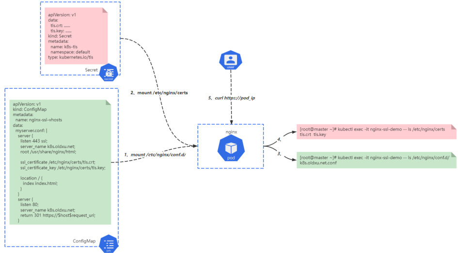

# 11 Kubernetes资源Secret

## 目录

- [1.Secret基本概念](#1.secret基本概念)
  - [1.1 什么是Secret](#1.1-什么是secret)
  - [1.2 为何需要Secret](#1.2-为何需要secret)
  - [1.3 Secret资源类别](#1.3-secret资源类别)
- [2.创建Secrets](#2.创建secrets)
  - [2.1 基于命令创建Secret](#2.1-基于命令创建secret)
  - [2.2 基于⽂件创建Secret](#2.2-基于件创建secret)
- [1.准备好对应的⽤户名⽂件以及密码⽂件](#1.准备好对应的户名件以及密码件)
  - [2.3 基于TLS Secret](#2.3-基于tls-secret)
- [1.准备⼀个⾃签证书](#1.准备个签证书)
  - [2.4 Docker Registry Secret](#2.4-docker-registry-secret)
- [3.Secret资源清单](#3.secret资源清单)
  - [3.1 Secret清单示例-1](#3.1-secret清单示例-1)
  - [3.2 Secret清单示例-2](#3.2-secret清单示例-2)
- [4.Pod引⽤Secret](#4.pod引secret)
  - [4.1 通过环境变量引⽤Secret](#4.1-通过环境变量引secret)
    - [4.1.1 env引⽤变量示例](#4.1.1-env引变量示例)
    - [4.1.2 MySQL注⼊密码实践](#4.1.2-mysql注密码实践)
  - [4.2 通过卷挂载⽅式引⽤Secret](#4.2-通过卷挂载式引secret)
    - [4.2.1 引⽤整个存储卷](#4.2.1-引整个存储卷)
    - [4.2.2 引⽤部分存储卷](#4.2.2-引部分存储卷)
- [5.nginx基于Secret实现TLS实践](#5.nginx基于secret实现tls实践)
  - [5.1 场景说明](#5.1-场景说明)
  - [5.2 创建ConfigMap](#5.2-创建configmap)
  - [5.3 创建Secret](#5.3-创建secret)
- [3.检查secret资源](#3.检查secret资源)
  - [5.4 创建Pod](#5.4-创建pod)
  - [5.5 验证容器TLS](#5.5-验证容器tls)
- [1.检查Pod状态](#1.检查pod状态)
    - [192.168.166.189 node1](#192.168.166.189-node1)

www.xuliangwei.com

## 1.Secret基本概念

### 1.1 什么是Secret

Secret 与 ConfigMap 类似，但它主要是⽤来分离敏感信息（例如密 码、令牌或密钥）。这样的敏感信息可能会被放在Pod配置清单中或者镜 像⽂件中。 使⽤ Secret 意味着不需要在应⽤程序代码中包含敏感数据，借助 Secret可以控制敏感数据的使⽤⽅式，并降低将数据暴露给未经授权⽤ 户的⻛险。

### 1.2 为何需要Secret

前⾯我们通过ConfigMap来实现应⽤与配置的解耦，但是解耦不仅仅只 有配置⽂件，还应该有默认⼝令（例如MySQL、Redis服务访问的⼝ 令），⽤于SSL通信时的数字证书，⽤于认证的令牌和ssh key等，但这 些敏感数据不适合存储在ConfigMap中，⽽是要⽤另⼀种被称 www.xuliangwei.com 为Secret的资源。将敏感数据存储在Secret中⽐明⽂存储 在ConfigMap或Pod配置清单中更加安全。

### 1.3 Secret资源类别

Secret类似于ConfigMap资源，创建Secret对象也⽀持命令⾏、⽂ 件、⽬录等多种⽅式的数据源，⽽根据其存储格式及⽤途的不同， Secret对象还会划分为如下3种类别。 docker-registry：⽤于认证Docker Registry的Secret，以 便于⽤户能使⽤私有容器镜像。 generic：基于本地⽂件、⽬录或命令⾏创建的Secret，⼀般⽤于 存储密码、秘钥、等信息。 tls：基于指定的公钥和私钥对来创建TLS Secret，专⽤于TLS通 信；

```
[root@master ~]# kubectl create secret Create a secret using specified subcommand.

Available Commands: docker-registry Create a secret
for use with a Docker registry generic         Create a secret from a local file, directory, or literal value tls             Create a TLS secret

Usage: kubectl create secret [flags] [options]

Use "kubectl <command> !"help"
for more information www.xuliangwei.com about a given command. Use "kubectl options"
for a list of global command- line options (applies to all commands).
```
## 2.创建Secrets

### 2.1 基于命令创建Secret

使⽤Secret为容器中运⾏的服务提供⽤于认证的⽤户名和密码是⼀种常 ⻅的应⽤场景，像MySQL镜像就⽀持通过环境变量来设置管理员⽤户的默 认密码。 ⽐如：创建⼀个名为mysql-root-auth的secret资源，⽤户名使⽤ username键名，密码使⽤passwrod键名

```
[root@master ~]# kubectl create secret generic mysql-root-auth \ !"from-literal=username=root \ !"from-literal=password=oldxu 查看创建好的secret [root@master ~]# kubectl get secret mysql-root-auth -o yaml apiVersion: v1 data: password: b2xkeHU= username: cm9vdA!# kind: Secret www.xuliangwei.com metadata: name: mysql-root-auth namespace: default type: Opaque 由于secret对敏感数据进⾏Base64编码，可以通过如下⽅式轻松解码 [root@master ~]# echo  b2xkeHU= | base64 -d oldxu [root@master ~]# echo  cm9vdA!# | base64 -d root
```
### 2.2 基于⽂件创建Secret

Secret 中包含 Pod 访问数据库所需的⽤户凭证，除了通过命令⾏创 建，也可以通过⽂件⽅式创建；将⽤户名存储在⽂件 ./username.txt 中，将密码存储在⽂件 ./password.txt 中。

## 1.准备好对应的⽤户名⽂件以及密码⽂件

```
[root@master ~]# echo -n 'oldxu' > ./username.txt [root@master ~]# echo -n '123456' > ./password.txt
```
在这些命令中，-n 标志确保⽣成的⽂件在⽂本末尾不包含额外的 换⾏符。 因为当 kubectl 读取⽂件并将内容编码为 base64时， 多余的换⾏符也会被编码。

```
Secret 对象。 [root@master secret]# kubectl create secret generic mysql-oldxu-auth \ !"from-file=./username.txt \ !"from-file=./password.txt www.xuliangwei.com

默认key名称为⽂件名。 你可以选择使⽤ !"from-file= [key=]source 来设置key名称。例如 [root@master ~]# kubectl create secret generic mysql-oldxu-auth-2 \ !"from-file=user=./username.txt \ !"from-file=pass=./password.txt

[root@master ~]# kubectl get secrets mysql-oldxu- auth -o yaml apiVersion: v1 data: password.txt: MTIzNDU2      # key名称默认为⽂件名称 username.txt: b2xkeHU= kind: Secret

[root@master secret]# echo 'MTIzNDU2' | base64 -d 123456 [root@master secret]# echo 'b2xkeHU=' | base64 -d oldxu
```
### 2.3 基于TLS Secret

为Nginx应⽤创建SSL虚拟主机时，需要先通过Secret对象向容器注⼊ 服务器证书，以供nginx进程加载使⽤。

## 1.准备⼀个⾃签证书

```
www.xuliangwei.com [root@master ~]# openssl genrsa -out nginx.key 2048 [root@master ~]# openssl req -new -x509 \ -key nginx.key \ -out nginx.crt \ -subj /C=CN/ST=Beijing/L=Beijing/O=oldxu/CN=tls.oldxu.net 2.创建tls类型的secret资源， [root@master secret]# kubectl create secret tls nginx-ssl \ !"key=nginx.key \ !"cert=nginx.crt 3.查看Secret （需要注意⽆论⽤户提供的证书是什么名称，最终都会 转为tls.key私钥 tls.crt公钥）

[root@master ~]# kubectl get secret  nginx-ssl -o yaml apiVersion: v1 data: tls.crt:  ...... tls.key:  ...... kind: Secret metadata: name: nginx-ssl namespace: default type: kubernetes.io/tls
```
### 2.4 Docker Registry Secret

www.xuliangwei.com 当Pod配置清单中定义的容器镜像来⾃于私有仓库时，需要先认证⽬标的 Registry，⽽后才能正常下载镜像，imagePullSecret字段指定认证 Registry时使⽤的Secret对象，以辅助kubelet从需要认证的私有仓 库获取镜像。 创建⽤于认证Registry的Secret，有专⽤的docker-registry⼦命 令，通常认证需要向kubelet提供Registry地址、⽤户名、密码、 Email信息，因此docker-registry⼦命令需要同时使⽤以下4个选 项。 !"docker-server：⽤于指定私有仓库服务器地址； !"docker-user：⽤于指定私有仓库认证的⽤户名； !"docker-password：⽤于指定私有仓库认证的密码； !"dcker-email：⽤于指定请求私有仓库的⽤户E-mail

1.创建⼀个aliyun-registry的Secret对象

```
[root@master ~]# kubectl create secret docker- registry \ aliyun-registry \ !"docker-server=registry.cn-huhehaote.aliyuncs.com \ !"docker-username=552408925@qq.com \ !"docker-password=123456 2.查看Secret，资源类型为kubernetes.io/dockerconfigjson [root@master ~]# kubectl get secrets NAME                  TYPE DATA   AGE aliyun-registry       kubernetes.io/dockerconfigjson

www.xuliangwei.com 3.编写Pod，拉取私有仓库镜像测试 [root@master ~]# cat nginxdemo.yaml apiVersion: v1 kind: Pod metadata: name: nginxdemo spec: imagePullSecrets:

- name: aliyun-registry

containers:

- name: nginxdemo

image: registry.cn- huhehaote.aliyuncs.com/oldxu3957/nginxdemo

[root@master secret]# kubectl get pod NAME                                   READY STATUS    RESTARTS     AGE nginxdemo                              1/1 Running   0            32s
```
## 3.Secret资源清单

Secret仅是存储⽤户定义的数据，⽆须使⽤ sepc 和 status 字段， 仅需要定义 apiVersion、kind、metadata，其他可⽤字段有 data、stringData、type、 data：key:value格式的数据，通常是敏感信息，数据需要以 Base64格式进⾏编码； www.xuliangwei.com stringData：以明⽂格式定义数据，⽆须⽤户事先对数据进⾏ Base64编码，在创建时⾃动完成编码并保存到data字段； type：仅为了便于编程处理Secret数据⽽提供的类型标识。

### 3.1 Secret清单示例-1

1.创建⼀个⽤户名为 admin，密码为 123456 的 Secret 对象，⾸ 先我们需要先把⽤户名和密码做 base64 编码： [root@master secret]#
```
echo -n "admin" | base64 YWRtaW4= [root@master secret]#
echo -n  "123456" | base64 MTIzNDU2
```
2.使⽤编码后的数据创建⼀个Secret资源清单

```
[root@master secret]# cat secret-demo1.yaml apiVersion: v1 kind: Secret metadata: name: secret-demo1 data: user: YWRtaW4= pass: MTIzNDU2
```
### 3.2 Secret清单示例-2

通过Data定义资源清单需要事先进⾏编码，如果使⽤stringData则直 接输⼊明⽂信息，⽽后程序⾃动完成编码存储⾄Data www.xuliangwei.com

1.创建资源清单

```
[root@master secret]# cat secret-demo2.yaml apiVersion: v1 kind: Secret metadata: name: secret-demo2 stringData: username: "oldxu" password: "123456" 2.查看资源清单详情，可以看到stringData数据编码后⾃动存储⾄ Data字段；

[root@master secret]# kubectl describe secrets secret-demo2 Name:         secret-demo2 Namespace:    default Labels:       <none> Annotations:  <none>

Type:  Opaque

Data ==== password:  6 bytes username:  5 bytes www.xuliangwei.com

[root@master secret]# kubectl get  secrets secret- demo2  -o yaml apiVersion: v1 data: password: MTIzNDU2      # 通过base64解码，验证数据是 否与定义的⼀致 username: b2xkeHU= kind: Secret metadata: name: secret-demo2 namespace: default type: Opaque
```
## 4.Pod引⽤Secret

### 4.1 通过环境变量引⽤Secret

Pod资源以环境变量⽅式获取Secret数据，存在两种⽅式 将指定键的值传递给环境变量，⼀个⼀个传递，通过 env.valueFrom 字段实现； 将Secret对象上的全部键⼀次性全部映射为容器的环境变量，通过 envFrom字段实现；

#### 4.1.1 env引⽤变量示例

```
1.将此前创建secret-demo1变量挨个传递给系统环境变量，将 secret-demo2⼀次导⼊到系统环境变量； [root@master secret]# cat nginx-secret-demo.yaml www.xuliangwei.com apiVersion: v1 kind: Pod metadata: name: nginx-pod-secret spec: containers:

- name: nginx-pod-secret

image: nginx env:

- name: USER

valueFrom: secretKeyRef: name: secret-demo1      # 引⽤secret对象名称 key: user           # 引⽤secret对象上的键， 将其值传递给环境变量

- name: PASS

valueFrom: secretKeyRef: name: secret-demo1
```
key: pass envFrom:              # 整体引⽤指定的Secret对象全 部键名和键值

- prefix: New             # 将所有键名引⽤为环境变

```
量时统⼀添加的前缀 （⽆需求，可不⽤） secretRef: name: secret-demo2 2.检查容器中，传递的变量详情； root@nginx-pod-secret:/# env | egrep -i " (pass|user)" USER=admin          # Secret-demo1传递的变量 PASS=123456 www.xuliangwei.com

Newusername=oldxu       # Secret-demo2传递的变量 Newpassword=123456
```
#### 4.1.2 MySQL注⼊密码实践

MySQL运⾏时初始化root⽤户的密码，引⽤此前创建的Secret对象 mysql-root-auth

1.创建资源清单⽂件

```
[root@master ~]# cat mysql-secret-demo.yaml apiVersion: v1 kind: Pod metadata: name: mysql-secret-demo spec: containers:

- name: mysql-secret-demo

image: mysql:5.7

env:

- name: MYSQL_ROOT_PASSWORD     # 设定MySQL超级管

理员密码变量名称 valueFrom: secretKeyRef: name: mysql-root-auth key: password
```
#################################################### ######################### # 下⾯配置表示引⽤其他Secret完成新⽤户创建及密码设定，可忽略 #################################################### #########################

```
- name: MYSQL_USER

www.xuliangwei.com valueFrom: secretKeyRef: name: mysql-oldxu-auth key: username.txt

- name: MYSQL_PASSWORD

valueFrom: secretKeyRef: name: mysql-oldxu-auth key: password.txt 2.使⽤ mysql-root-auth 对象中的 password 字段的值 oldxu 作为密码进⾏数据库访问

[root@master ~]# kubectl exec -it mysql-secret-demo !" mysql -uroot -poldxu mysql> mysql> select user(); +----------------+ | user()         | +----------------+ | root@localhost | +----------------+ 1 row in set (0.00 sec) 由环境变量向容器传递Secret对象中保存的敏感信息能够正常实现。 www.xuliangwei.com
```
### 4.2 通过卷挂载⽅式引⽤Secret

通过卷的⽅式挂载Secret资源和挂载ConfigMap资源⾮常相似，除了其 类型及引⽤的标识需要替换为 secret、secretName之外，其他⼏乎 ⼀致，包括⽀持使⽤挂载整个存储卷，只挂载存储卷中指定的键值等。

#### 4.2.1 引⽤整个存储卷

```
将mysql-oldxu-auth，这个secret的每个键名转为容器挂载点路径 下的⼀个⽂件名 [root@master secret]# cat secret-volume-demo1.yaml apiVersion: v1 kind: Pod metadata: name: secret-volume-demo1 spec: containers:

- name: secret-volume-demo1

image: nginx

volumeMounts:

- name: user-pass   # 2.将user-pass所有key挂载

⾄/app⽬录下 mountPath: /app

volumes:

- name: user-pass     # 1.user-pass来源于mysql-

oldxu-auth这个secret secret: secretName: mysql-oldxu-auth

[root@master secret]# kubectl exec -it secret- www.xuliangwei.com volume-demo1 !" ls  /app password.txt  username.txt
```
#### 4.2.2 引⽤部分存储卷

```
1.将mysql-oldxu-auth，这个secret的username.txt键挂载⾄容 器的/app⽬录下，命名为username.txt 2.将mysql-oldxu-auth，这个secret的password.txt键挂载⾄容 器的/app⽬录下，并命名为password.txt [root@master secret]# cat secret-volume-demo2.yaml apiVersion: v1 kind: Pod metadata: name: secret-volume-demo2 spec: containers:

- name: secret-volume-demo2

image: nginx

volumeMounts:           # 将mysql-oldu数据挂载⾄容 器/app路径

- name: mysql-oldxu

mountPath: /app

volumes:

- name: mysql-oldxu         # 定义mysql-oldxu数据来

源 secret: secretName: mysql-oldxu-auth items:

- key: username.txt     # key挂载⾄mountPath定

义路径下，并通过path命名为username.txt path: username.txt www.xuliangwei.com

- key: password.txt     # key挂载⾄mountPath定
```
义路径下，并通过path命名为password.txt path: password.txt

## 5.nginx基于Secret实现TLS实践

### 5.1 场景说明

运⾏⼀个Nginx容器 Nginx虚拟站点配置⽂件来源于ConfigMap Nginx虚拟站点需要使⽤的TLS证书，来源于Secret 验证Nginx服务是否已提供Https访问访问。



www.xuliangwei.com

### 5.2 创建ConfigMap

```
1.创建configmap资源，将nginx虚拟主机配置写⼊进去 [root@master nginx-tls]# cat nginx-ssl-vhosts.yaml apiVersion: v1 kind: ConfigMap metadata: name: nginx-ssl-vhosts data: myserver.conf: | server { listen 443 ssl; server_name k8s.oldxu.net; root /usr/share/nginx/html;

ssl_certificate /etc/nginx/certs/tls.crt; ssl_certificate_key /etc/nginx/certs/tls.key;

location / { index index.html; } }

server { listen 80; server_name k8s.oldxu.net; return 301 https:!$$host$request_uri; }
```
### 5.3 创建Secret

www.xuliangwei.com

1.创建⾃签证书

```
[root@master ~]# openssl genrsa -out nginx.key 2048 [root@master ~]# openssl req -new -x509 \ -key nginx.key \ -out nginx.crt \ -subj /C=CN/ST=Beijing/L=Beijing/O=oldxu/CN=k8s.oldxu.net
```
2.通过命令⾏⽅式创建secret

```
[root@master nginx-tls]# kubectl create secret tls k8s-tls \ !"key=nginx.key \ !"cert=nginx.crt
```
## 3.检查secret资源

```
[root@master nginx-tls]# kubectl get   secrets k8s- tls  -o yaml apiVersion: v1 data: tls.crt: ...... tls.key: ...... kind: Secret metadata: name: k8s-tls namespace: default type: kubernetes.io/tls
```
### 5.4 创建Pod

```
www.xuliangwei.com 创建Nginxpod，挂载 ConfigMap 的虚拟主机配置，⽽后挂载虚拟主 机所需要依赖的 tls 证书⽂件 [root@master nginx-tls]# cat nginx-ssl-demo.yaml apiVersion: v1 kind: Pod metadata: name: nginx-ssl-demo spec: containers:

- name: nginx-ssl-demo

image: nginx volumeMounts:
```
- name: nginxconfs          # 挂载虚拟主机配置⽂件

```
mountPath: /etc/nginx/conf.d/

- name: nginxcert         # 挂载虚拟主机tls⽂件

mountPath: /etc/nginx/certs/

volumes:
```
- name: nginxconfs          # 定义虚拟主机配置⽂件的

```
来源 configMap: name: nginx-ssl-vhosts items:

- key: myserver.conf

path: k8s.oldxu.net.conf mode: 0644
```
- name: nginxcert           # 定义虚拟主机tls⽂件的来

```
源 secret: secretName: k8s-tls www.xuliangwei.com
```
### 5.5 验证容器TLS

## 1.检查Pod状态

```
[root@master nginx-tls]# kubectl get pod nginx-ssl- demo -o wide NAME             READY   STATUS    RESTARTS   AGE IP                NODE    NOMINATED nginx-ssl-demo   1/1     Running   0          3m10s
```
#### 192.168.166.189   node1

2.验证请求是否能通过https⽅式访问

```
[root@master ~]# curl -I -k  https:!$192.168.166.189 HTTP/1.1 200 OK Server: nginx/1.21.5 Date: Mon, 18 Apr 2022 05:24:50 GMT Content-Type: text/html Content-Length: 615 Last-Modified: Tue, 28 Dec 2021 15:28:38 GMT Connection: keep-alive ETag: "61cb2d26-267" Accept-Ranges: bytes

[root@master secret]# curl https:!$192.168.166.136 - www.xuliangwei.com k -v -I .........

* Server certificate:

*   subject:

CN=k8s.oldxu.net,O=oldxu,L=Beijing,ST=Beijing,C=CN

*   common name: k8s.oldxu.net

*   issuer:

CN=k8s.oldxu.net,O=oldxu,L=Beijing,ST=Beijing,C=CN .........
```
