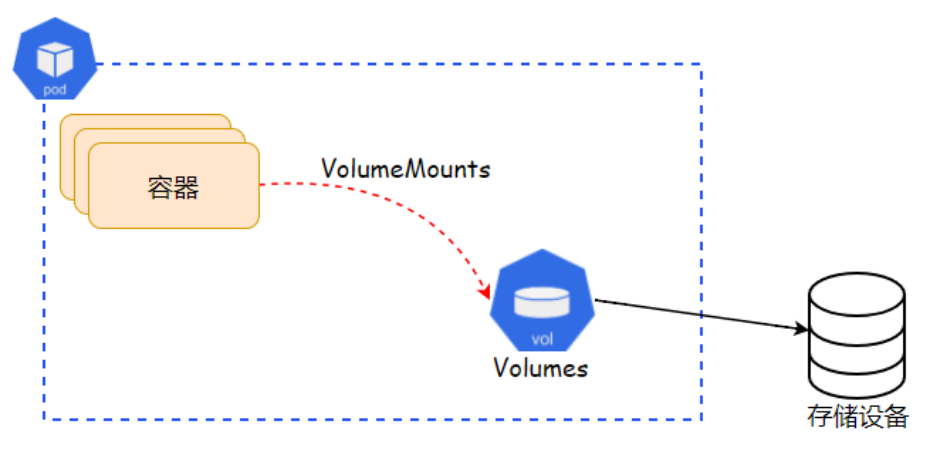
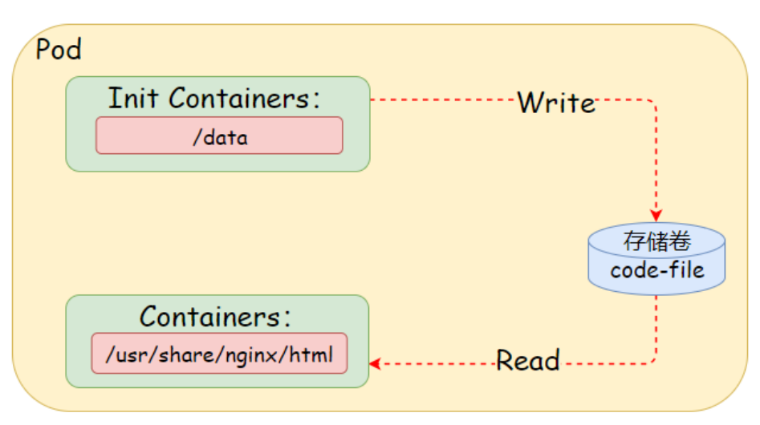

# 12 Kubernetes资源Volumes

## 目录

- [1.存储卷基础](#1.存储卷基础)
  - [1.1 为何需要Volumes](#1.1-为何需要volumes)
  - [1.2 什么是Volume](#1.2-什么是volume)
  - [1.3 Volume类型](#1.3-volume类型)
  - [1.4 Pod配置Volume](#1.4-pod配置volume)
- [2.临时存储卷](#2.临时存储卷)
  - [2.1 emptyDir](#2.1-emptydir)
  - [2.2 emptyDir示例](#2.2-emptydir示例)
  - [2.3 emptyDir场景](#2.3-emptydir场景)
    - [192.168.2.36 node2 <none>](#192.168.2.36-node2-none)
- [3.本地存储卷](#3.本地存储卷)
  - [3.1 HostPath](#3.1-hostpath)
  - [3.2 HostPath示例](#3.2-hostpath示例)
  - [3.3 实战-挂载宿主机时区](#3.3-实战-挂载宿主机时区)
  - [3.4 实战-挂载宿主机Docker](#3.4-实战-挂载宿主机docker)
- [4.⽹络存储卷-NFS](#4.络存储卷-nfs)
  - [4.1 配置NFS服务端](#4.1-配置nfs服务端)
  - [4.3 Pod挂载使⽤NFS](#4.3-pod挂载使nfs)

## 1.存储卷基础

### 1.1 为何需要Volumes

Container中的⽂件在磁盘上是临时存放的，这给 Container 中运⾏ 的较重要的应⽤程序带来⼀些问题。 1、当容器崩溃时，kubelet将重新启动⼀个"全新的容器"，⽽容器 中的此前保存的数据则会丢失。 2、当同⼀Pod运⾏多个容器时，通常需要在这些容器之间共享⽂ 件。

Volume 是 Kubernetes 抽象出来的对象，主要⽤于解决Pod运⾏时 ⽂件存放的问题，以及pod中多容器数据共享的问题。

### 1.2 什么是Volume

Volume的核⼼是⼀个⽬录，其中可能存有数据，Pod 中的容器可以访问 该⽬录中的数据。使⽤不同的Volume类型将决定该⽬录如何形成，以及 使⽤何种介质（Disk、Memory）来存储数据。当然不同的卷类型有着不 同的⽣命周期； 临时卷：临时卷类型的⽣命周期与 Pod 相同，当 Pod 不再存在 时，Kubernetes 会销毁临时卷；（⼀般⽤作缓存场景） 持久卷：持久卷可以⽐ Pod 的存活期⻓，因为Kubernetes不会销 毁持久卷。 注意：任何类型的卷，在容器重启期间数据都不会丢失。

### 1.3 Volume类型

```
临时存储卷：emptyDir 本地存储卷：hostPath、local ⽹络⽂件系统：NFS、Glusterfs、CephFS、!" 特殊存储卷：ConfigMap、Secret、DownwardAPI 云存储：awsElasticBlockStore、azureDisk、azureFile、 gcePersistentDisk 第三⽅存储插件....
```
### 1.4 Pod配置Volume

Pod如果需要使⽤卷： 1、第⼀步：在pod.spec.volumes 字段中申明，申明该卷提供的 卷类型以及卷 2、第⼆步：在.spec.containers[*].volumeMounts 字段中声 明，将卷挂载到容器的哪个位置。



## 2.临时存储卷

### 2.1 emptyDir

emptyDir存储卷可以理解为Pod对象上的⼀个临时⽬录，在Pod启动时 即被创建，⽽在Pod对象被移除时⼀并被删除。因此emptyDir存储卷只 能⽤于某些特殊场景中，例如同⼀Pod内多个容器共享、或者⽤于数据缓 存。 emptyDir主要有如下两个字段 medium: 存储介质的类型，有default、Memory， default：表示使⽤节点的磁盘存储介质。（默认） Memory：表示使⽤基于内存临时⽂件系统，性能⾼、但整体可 ⽤空间受限于内存，⼀般⽤于缓存场景。 sizeLimit: 存储卷的空间限额，默认nil表示不限制，如果 medium为Memory时，建议配置此值。

### 2.2 emptyDir示例

```
apiVersion: v1

kind: Pod metadata: name: test-pd spec: containers:

- image: k8s.gcr.io/test-webserver

name: test-container volumeMounts:

- name: cache-volume

mountPath: /cache

volumes:

- name: cache-volume

emptyDir: {}
```
### 2.3 emptyDir场景

1、配置初始化容器下载站点代码，基于emptyDir存储⾄/data/⽬录； 2、配置主容器nginx，将emptyDir数据映射 ⾄/usr/share/nginx/html⽬录中；



```
[root@master volumes]# cat nginx-volumes.yaml apiVersion: v1 kind: Pod metadata: name: nginx-volumes spec: initContainers:

- name: download-nginx-code

image: oldxu3957/tools command: ['/bin/sh', '-c', 'wget -O /data/index.html https:!#linux.oldxu.net/index.html'] volumeMounts:

- name: code-file

mountPath: /data

containers:

- name: nginx-webservers

image: nginx volumeMounts:

- name: code-file

mountPath: /usr/share/nginx/html

volumes:

- name: code-file

emptyDir: medium: Memory sizeLimit: 10Mi 2、获取容器IP地址

[root@master volumes]# kubectl get pod nginx-volumes -o wide NAME            READY   STATUS    RESTARTS   AGE IP             NODE    NOMINATED NODE nginx-volumes   1/1     Running   0          62s
```
#### 192.168.2.36   node2   <none>

```
3.访问容器，验证结果 [root@master ~]# curl 192.168.2.36 <!DOCTYPE html> <html> <head> <title>Welcome to nginx!!$title> <style> body { width: 35em; margin: 0 auto; font-family: Tahoma, Verdana, Arial, sans- serif; } !$style> !$head> <body> <h1>Welcome to Nginx-Pod-Volumes!!$h1>

!$body> !$html>
```
## 3.本地存储卷

### 3.1 HostPath

hostPath 卷是将主机节点⽂件系统上的⽂件或⽬录挂载到 Pod 中， 如果 Pod ⼀旦出现重建，则有可能从原来的A节点调度到了B节点，⽽B 节点是没有对应 Pod 的数据，从⽽会造成数据丢失。 hostPath 的⼀些应⽤场景有： 1、容器需要访问Docker，使⽤HostPath 挂载宿主机节点 的/var/lib/docker 2、容器需要调整对应的时区时，可以使⽤HostPath，挂载宿主机 节点/etc/localtime

### 3.2 HostPath示例

```
[root@master ~]# cat hostpath.yaml apiVersion: v1 kind: Pod metadata: name: test-pd spec: containers:

- name: test-container

image: k8s.gcr.io/test-webserver volumeMounts:

- mountPath: /test-pd

name: test-volume volumes:

- name: test-volume
```
hostPath: path: /data   # 宿主上⽬录位置 type: Directory # 此字段为可选

### 3.3 实战-挂载宿主机时区

```
1.默认容器时区都并⾮Asia/Shanghai，可以通过HostPath挂载本地 时区 [root@master ~]# cat nginx-timezone.yaml apiVersion: v1 kind: Pod metadata: name: nginx-timezone spec: containers:

- name: nginx-timezone

image: nginx volumeMounts:       # 将timezone挂载⾄容器 的/etc/locatime

- name: timezone

mountPath: /etc/localtime volumes:

- name: timezone

hostPath: path: /etc/localtime 2.查看容器时区，可以发现时区为CST，并⾮UTC时区 [root@master volumes]# kubectl exec -it nginx- timezone !% date Mon Apr 25 19:36:38 CST 2022
```
### 3.4 实战-挂载宿主机Docker

当在容器内运⾏Jenkins，执⾏CI流程时可能需要调⽤Docker命令进 ⾏build、push等操作，可以⽆需在容器内安装docker服务，将宿主 机的docker.socket⽂件挂载⾄容器内即可。 1、使⽤HostPath⽅式挂载本地docker.socket⽂件，以及docker客 户端命令 [root@master ~]# cat nginx-docker.yaml apiVersion: v1 kind: Pod metadata: name: nginx-docker spec: containers:

```
- name: nginx-docker

image: nginx volumeMounts:             # 挂载Docker命令以及 Docker的Sock⽂件

- name: docker-cli

mountPath: /usr/bin/docker

- name: docker-sock

mountPath: /var/run/docker.sock volumes:

- name: docker-cli

hostPath: path: /usr/bin/docker

- name: docker-sock
```
hostPath: path: /var/run/docker.sock 2、验证容器内执⾏ Docker 命令是否能正常使⽤

```
[root@master volumes]# kubectl exec -it nginx-docker !% docker info Client: Context:    default Debug Mode: false

Server: Containers: 74 Running: 34 Paused: 0 Stopped: 40 Images:
```
## 4.⽹络存储卷-NFS

nfs 卷能将 NFS (⽹络⽂件系统) 挂载到 Pod 中。该类型的存储卷 在 Pod 对象终⽌后会被卸载，⽽⾮删除。 同时，NFS是⽂件系统级共 享服务，它⽀持同时多个客户端挂载，这意味着 nfs 卷中的数据可以在 多个 Pod 之间共享。定义NFS的字段： server<string>：NFS服务器的IP地址或主机名，必选字段。 path<string>：NFS服务器对外共享的路径，必选字段。 readOnly<boolean>：是否以只读⽅式挂载，默认为false

### 4.1 配置NFS服务端

```
1.安装NFS服务端（在10.0.0.32节点安装） [root@nfs ~]# yum install nfs-utils -y 2.设定基础环境，包括⽤户、数据⽬录、权限 [root@nfs ~]# mkdir /data/redis -p

[root@nfs ~]# cat  /etc/exports /data/redis 10.0.0.0/24(rw,no_root_squash)
```
10.0.0.0/24   # pod访问nfs服务会将源IP修改为节点IP，所以 允许所有节点访问NFS服务 no_root_squash  # 访问NFS-server共享⽬录的⽤户如果是 root。他对共享⽬录有root权限

```
[root@nfs ~]# systemctl enable nfs !%now

[root@node1 ~]# yum install nfs-utils -y [root@node2 ~]# yum install nfs-utils -y [root@node3 ~]# yum install nfs-utils -y
```
### 4.3 Pod挂载使⽤NFS

为Redis进程提供数据持久化功能

1.编写Yaml

```
[root@master volumes]# cat redis-nfs.yaml apiVersion: v1 kind: Pod metadata: name: redis-nfs spec:

containers:

- name: redis-nfs

image: redis volumeMounts:

- name: redisdata

mountPath: /data volumes:

- name: redisdata

nfs: server: 10.0.0.32 path: /data/redis 2.资源创建完成后，通过redis-cli创建测试数据，并⼿动触发备份操 作 [root@master volumes]# kubectl exec -it redis-nfs !% redis-cli 127.0.0.1:6379> set my_oldxu "hello kubernetes" OK 127.0.0.1:6379> get my_oldxu "hello kubernetes" # ⼿动触发备份 127.0.0.1:6379> BGSAVE Background saving started 127.0.0.1:6379> exit 3.为了测试数据持久化效果，删除Pod，然后重新创建Pod

[root@master volumes]# kubectl delete -f redis- nfs.yaml pod "redis-nfs" deleted

[root@master volumes]# kubectl apply -f redis- nfs.yaml pod/redis-nfs created

[root@master volumes]# kubectl exec -it redis-nfs !% redis-cli 127.0.0.1:6379> get my_oldxu "hello kubernetes"
```
