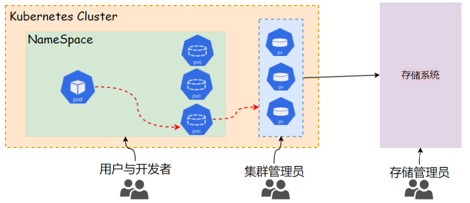
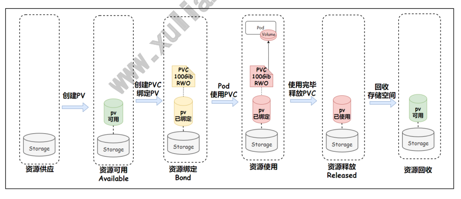
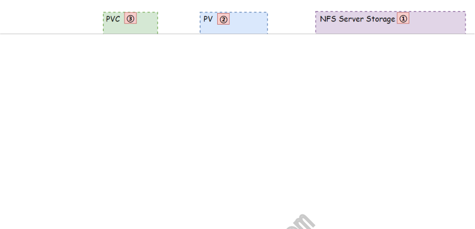
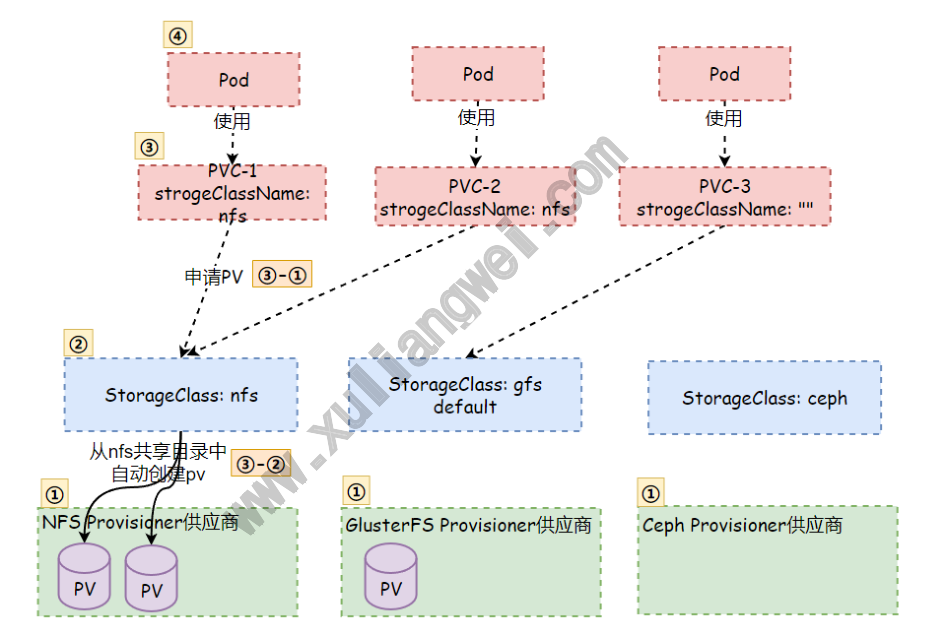
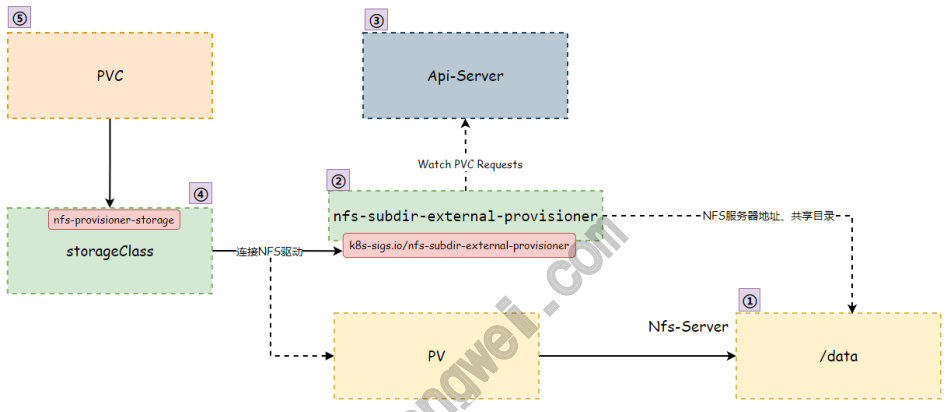

# 13 Kubernetes资源PV、PVC

## 目录

- [1.PV与PVC基本概念](#1.pv与pvc基本概念)
  - [1.1 为何需要PV与PVC](#1.1-为何需要pv与pvc)
  - [1.2 什么是PV与PVC](#1.2-什么是pv与pvc)
  - [1.3 PV与PVC⽣命周期](#1.3-pv与pvc命周期)
- [2.PV回收策略](#2.pv回收策略)
  - [2.1 Retain](#2.1-retain)
  - [2.2 Recycle](#2.2-recycle)
  - [2.3 Delete](#2.3-delete)
- [3.PV资源示例](#3.pv资源示例)
  - [3.1 hostPathPV示例](#3.1-hostpathpv示例)
  - [3.2 NFS-ServerPV示例](#3.2-nfs-serverpv示例)
- [4.PVC资源示例](#4.pvc资源示例)
  - [4.1 HostPathPVC示例](#4.1-hostpathpvc示例)
  - [4.2 NFS-ServerPVC示例](#4.2-nfs-serverpvc示例)
- [5.PV与PVC持久卷实践](#5.pv与pvc持久卷实践)
  - [5.1 基于HostPath场景实践](#5.1-基于hostpath场景实践)
    - [5.1.1 创建⽬录](#5.1.1-创建录)
    - [5.1.2 创建pv](#5.1.2-创建pv)
    - [5.1.3 创建pvc](#5.1.3-创建pvc)
    - [5.1.4 创建Pod应⽤pvc](#5.1.4-创建pod应pvc)
  - [5.2 基于NFSServer场景实践](#5.2-基于nfsserver场景实践)
    - [5.2.1 场景描述](#5.2.1-场景描述)
    - [5.2.2 配置NFS](#5.2.2-配置nfs)
    - [5.2.3 创建PV](#5.2.3-创建pv)
    - [5.2.4 创建PVC](#5.2.4-创建pvc)
    - [5.2.5 创建Pod应⽤pvc](#5.2.5-创建pod应pvc)
    - [192.168.1.73 node1 <none>](#192.168.1.73-node1-none)
- [6.pv与pvc动态供应](#6.pv与pvc动态供应)
  - [6.1 为何需要动态供应](#6.1-为何需要动态供应)
  - [6.2 什么是动态供应](#6.2-什么是动态供应)
  - [6.3 动态供应示例](#6.3-动态供应示例)
    - [6.3.1 启⽤动态供应](#6.3.1-启动态供应)
    - [6.3.2 使⽤动态供应](#6.3.2-使动态供应)
    - [6.3.3 设置默认的动态供应](#6.3.3-设置默认的动态供应)
  - [6.4 基于NFS的动态供应](#6.4-基于nfs的动态供应)
    - [6.4.1 创建RBAC](#6.4.1-创建rbac)
    - [6.4.2 部署NFS-Provisioner](#6.4.2-部署nfs-provisioner)
    - [6.4.3 创建StorageClass](#6.4.3-创建storageclass)
    - [6.4.4 创建PVC](#6.4.4-创建pvc)
    - [6.4.5 创建Pod应⽤pvc](#6.4.5-创建pod应pvc)

## 1.PV与PVC基本概念

### 1.1 为何需要PV与PVC

前⾯我们使⽤过⽹络存储卷来实现Pod的数据持久化以及pod间共享，也 www.xuliangwei.com 不是很复杂。如果我们使⽤更为复杂的⽹络存储来完成数据共享和持久 化，在使⽤上会带来⼀些问题。⾸先开发⼈员必须清楚的了解使⽤的⽹络 存储技术、同时还必须清楚不同的⽹络存储卷的配置⽅式、访问细节等。 才能完成⽹络存储卷相关的配置任务，这就要求开发⼈员对该类存储有着 ⼀定的了解才能顺利使⽤。 但这与Kubernetes向⽤户和开发隐藏底层架构的⽬标有所背离， Kubernetes希望我们的存储资源的使⽤也能像计算资源⼀样，让我们的 ⽤户和开发⽆需关⼼存储系统是什么设备、位于何处、如何访问等。

### 1.2 什么是PV与PVC

PV（Persistent Volume）与 PVC（Persistent Volume Claim） 就是在⽤户与存储服务之间添加的⼀个中间层。 PV：持久卷，集群中的⼀块存储，可由管理员根据PV⽀持的存储卷 插件定义好底层存储空间； PVC：持久卷申领，⽤户通过PVC进⾏存储资源申请，系统根据⽤户 申请的存储（⼤⼩、类型）来绑定符合条件的PV持久卷；

有了PV和PVC，开发⼈员⽆需关系底层使⽤的是什么⽹络存储卷，通过 PVC描述所需要的存储类型、⼤⼩，即可完成存储资源的申领，⽽后通过 配置清单描述Pod所需要使⽤的PVC即可完成存储卷的绑定和使⽤。这样 ⼤⼤的简化了⽤户使⽤存储的⽅式。



### 1.3 PV与PVC⽣命周期



1、资源供应：运维⼿动创建底层存储设备，提供存储功能； 2、资源可⽤：创建PV，此时PV卷是⼀个空闲资源，尚未绑定任何 PVC资源； 3、资源绑定：⽤户创建PVC资源，根据描述绑定到符合条件的PV资 源；

3.1、匹配到合适的PV，就与该PV进⾏绑定，Pod应⽤也就可以 使⽤该PVC作为后端存储； 3.2、如果匹配不到合适的PV，PVC则会处于Pengding状态， 直到出现符合要求的PV，才会完成绑定； 3.3、PV⼀旦绑定上某个PVC，就会被这个PVC独占，不能在与 其他PVC进⾏绑定 4、资源使⽤：⽤户可以在Pod中定义Volumes，类型为PVC，⽽后在 容器中定义VolumeMounts挂载该PVC资源； 5、资源释放：当存储资源使⽤完毕后，运维可以删除PVC，与该PVC 绑定的PV将会被标记为（Released）状态，但不能⽴刻与其他PVC 进⾏绑定，因为之前PVC写⼊的数据还被保留在存储设备上，只有在 回收之后，该PV才能被再次使⽤ 6、资源回收：当PV进⼊Released状态后，其后续的处理机制依赖 于回收策略，（Rtain、Recycle、Delete） www.xuliangwei.com

## 2.PV回收策略

### 2.1 Retain

Retain（保留）：需要⼿动回收 删除PVC后将保留其绑定的PV及存储的数据，但会把该PV置为Released 状态，它不可再被其他PVC所绑定，且需要由管理员⼿动进⾏后续的回收 操作：⾸先删除PV，接着⼿动清理其关联的外部存储组件上的数据，最后 基于该组件重新创建PV；

### 2.2 Recycle

```
Recycle（回收）：基本擦除 (rm -rf /thevolume!")
```
对于⽀持该回收策略的存储卷插件，删除PVC时，其绑定的PV所关联的外 部存储组件上的数据会被清空，随后该PV将转为Available状态，可再 次接收其他PVC的绑定请求。不过⽬前仅 NFS 和 HostPath ⽀持该回 收策略；

### 2.3 Delete

Delete（删除）：对于⽀持该回收策略的卷插件，删除⼀个PVC将同时 删除其绑定的PV资源以及该PV关联的外部存储组件。

## 3.PV资源示例

PV是⾪属于Kubernetes核⼼API群组中的标准资源类型，它主要实现将 www.xuliangwei.com 外部存储系统定义为可被，PVC申明绑定使⽤的资源对象。PV资源Spec 字段主要嵌套以下⼏个通⽤字段，它们⽤于定义PV的容量，访问模式和回 收策略等属性 capacity：指定PV的容量； volumeMode：指定PV类型，⽤于指定此存储卷被格式为⽂件系统 使⽤，还是直接使⽤裸格式的块设备，默认Filesystem accessModes：指定当前PV⽀持的访问模式，官⽹参考地址 persistentVolumeReclaimPolicy：指定PV空间被释放时的处 理机制；Retain（默认）、Recycle、delete storageClassName：当前PV所属的StorageClass资源的名称， ⽤来实现存储资源分类； mountOptions：挂载选项，例如：ro、nfsvers、等

### 3.1 hostPathPV示例

下⾯示例定义了使⽤本地/mnt/data作为PV的存储资源，空间⼤⼩限制 为10GB，访问模式为rwo单路读写

```
apiVersion: v1 kind: PersistentVolume metadata: name: task-pv-volume spec: storageClassName: "host-storage" persistentVolumeReclaimPolicy: "Retain" capacity: storage: 10Gi accessModes:

hostPath: path: "/mnt/data" www.xuliangwei.com
```
### 3.2 NFS-ServerPV示例

下⾯示例定义了使⽤NFS作为PV的存储资源，空间⼤⼩限制为1MB，访问 模式为rwx多路读写操作 apiVersion: v1 kind: PersistentVolume metadata: name: nfs spec: capacity: storage: 10Gi accessModes:

```
nfs: server: nfs.oldxu.net path: "/data/redis" mountOptions:

- nfsvers=4.2
```
## 4.PVC资源示例

PVC也是Kubernetes核⼼API群组中的标准资源类型，它位于核⼼API群 组，属于名称空间级别。当⽤户提交新建的PVC资源最初进⼊Pending状 态，⽽后通过PV控制器寻找最佳匹配的PV并完成⼆者绑定后，两者都进 ⼊Bond状态，随后Pod对象便可基于PVC存储卷来持久化数据。 定义PVC时，⽤户可通过访问模式、存储资源空间需求、限制、标签选择 器、卷名称、卷类型等标准来筛选集群上的PV资源 accessModes：PVC的访问模式；它同样⽀持RWO、RWX、ROX三种 ⽅式； www.xuliangwei.com resources：申明使⽤的存储空间的最⼩值和最⼤值； selector：筛选PV时额外使⽤的标签选择器； volumeName：直接指定要绑定的PV资源名称； strogeClassName：指定从哪类存储资源下筛选PV，如果指定的名 称不存在，则⽆法绑定成功。如果指定的资源下没有符合的空间也⽆ 法绑定成功。⽐如申请20G空间，但pv都只有10G空间，则⽆法满 ⾜。

### 4.1 HostPathPVC示例

下⾯示例定义了⼀个名为 task-pv-claim 的PVC资源，它定义了期望 的存储为3GB，访问模式为RWO，通过 StrogeClassName定义了从 Manual资源类中筛选可⽤的PV；

```
apiVersion: v1 kind: PersistentVolumeClaim metadata: name: task-pv-claim namespace: default spec: storageClassName: manual accessModes:

resources: requests: storage: 3Gi www.xuliangwei.com
```
### 4.2 NFS-ServerPVC示例

下⾯示例定义了⼀个名为 nfs 的PVC资源，它定义了期望的存储 为3GB，最⼤可⽤为10GB，访问模式为RWX，通过 volumeName直接指 定要绑定的pv资源名称。 apiVersion: v1 kind: PersistentVolumeClaim metadata: name: nfs namespace: default spec: accessModes:

```
storageClassName: "" resources: requests: storage: 3Gi limits:
```
storage: 10Gi volumeName: nfs     # 直接通过名称指定需要绑定到哪个pv 资源上；

## 5.PV与PVC持久卷实践

### 5.1 基于HostPath场景实践

1、以集群管理员身份创建由物理存储⽀持的 PV。 2、你现在以开发⼈员或者集群⽤户的⻆⾊创建⼀个 PVC， 它将⾃ 动绑定到合适的 PV。 3、你创建⼀个使⽤ PVC 作为存储的 Pod。 www.xuliangwei.com

#### 5.1.1 创建⽬录

```
在节点执⾏如下操作，建议所有节点操作，因为不确定Pod会调度⾄哪个 节点；（⽣产不建议使⽤HostPath⽅式） [root@node1 ~]# mkdir /data/nginx -p [root@node1 ~]# echo "Hello From Kubernetes Stroge node01" !# /data/nginx/index.html

[root@node2 ~]# mkdir /data/nginx -p [root@node2 ~]# echo "Hello From Kubernetes Stroge node02" !# /data/nginx/index.html

[root@node3 ~]# mkdir /data/nginx -p [root@node3 ~]# echo "Hello From Kubernetes Stroge node03" !# /data/nginx/index.html
```
#### 5.1.2 创建pv

```
[root@master ~]# cat hostpath_pv.yaml apiVersion: v1 kind: PersistentVolume metadata: name: hostpath-pv spec: storageClassName: "" capacity: storage: 10Gi accessModes:

persistentReclaimPolicy: Recycle www.xuliangwei.com hostPath: path: "/data/nginx" 2.查看pv信息，状态（STATUS）为 Available，这意味着还没有pvc 绑定上来 [root@master ~]# kubectl get persistentvolume NAME      CAPACITY   ACCESS MODES  RECLAIM POLICY STATUS  CLAIM  STORAGECLASS  REASON  AGE hostpath-pv   10Gi    RWO            Retain Available                          2m27s
```
#### 5.1.3 创建pvc

1、创建⼀个 PVC，请求⾄少 3 GB 容量的卷， 该卷⾄少可以为⼀个节 点提供读写访问。 [root@master ~]# cat hostpath_pvc.yaml apiVersion: v1

```
kind: PersistentVolumeClaim metadata: name: hostpath-pvc spec: storageClassName: "" accessModes:

resources: requests: storage: 3Gi limits: storage: 10Gi 2、现在输出的 STATUS 为 Bound，VOLUME 显示绑定的PV为 www.xuliangwei.com hostpath-pv [root@master ~]# kubectl get PersistentVolumeClaim NAME           STATUS   VOLUME        CAPACITY ACCESS MODES   STORAGECLASS   AGE hostpath-pvc   Bound    hostpath-pv   10Gi       RWO 10s
```
#### 5.1.4 创建Pod应⽤pvc

```
1、创建Pod，使⽤hostpath-pvc作为Pod的存储 [root@master ~]# cat pod_hostpath_pvc.yaml apiVersion: v1 kind: Pod metadata: name: pod-hostpath-pv spec: containers:

- name: pod-hostpath-pv

image: nginx ports:

- containerPort:

volumeMounts:

- name: web-storage       # 将web-storage映射

到/usr/share/nginx/html⽬录 mountPath: /usr/share/nginx/html

volumes:

- name: web-storage         # web-storage来源于

hostpath-pvc这个pvc资源 persistentVolumeClaim: claimName: hostpath-pvc www.xuliangwei.com 2、检查 Pod 中的容器是否运⾏正常： [root@master ~]# kubectl get pod pod-hostpath-pv -o wide NAME              READY   STATUS    RESTARTS   AGE IP             NODE pod-hostpath-pv   1/1     Running   0          2m10s

3、查看 Pod 的详情 [root@master ~]#  kubectl describe pod pod-hostpath- pv Name:         pod-hostpath-pv Namespace:    default Port:           80/TCP Host Port:      0/TCP State:          Running

Started:      Tue, 26 Apr 2022 23:06:27 +0800 Ready:          True Restart Count:  0 Environment:    <none> Mounts:           # 可以看到web-storage挂载到容器 的/usr/share/nginx/html /usr/share/nginx/html from web-storage (rw) /var/run/secrets/kubernetes.io/serviceaccount from kube-api-access-b5v66 (ro) Conditions: Type              Status Initialized       True Ready             True ContainersReady   True www.xuliangwei.com PodScheduled      True Volumes: web-storage:    # web-storage属于pvc类型 Type:       PersistentVolumeClaim (a reference to a PersistentVolumeClaim in the same namespace) ClaimName:  hostpath-pvc    # pvc的名称 ReadOnly:   false 4、访问Pod，输出结果是之前写到 hostPath 卷中的 index.html ⽂件中的内容： [root@master ~]# curl http:!$192.168.1.71 Hello From Kubernetes Stroge node01 如果你看到此此前index的内容，则证明已经成功地配置了 Pod 使⽤ PersistentVolumeClaim 的存储。
```
### 5.2 基于NFSServer场景实践

#### 5.2.1 场景描述

场景描述：使⽤NFS共享多个⽬录，然后创建多个pv关联对应NFS的共享 ⽬录，其次PVC选择最佳PV，最后创建Pod引⽤PVC



#### 5.2.2 配置NFS

1.安装NFS

```
[root@nfs ~]# yum install nfs-utils -y
```
2.配置NFS

```
[root@nfs ~]# cat /etc/exports /nfs/data1 10.0.0.0/24(rw,no_root_squash) /nfs/data2 10.0.0.0/24(rw,no_root_squash) /nfs/data3 10.0.0.0/24(rw,no_root_squash) /nfs/data4 10.0.0.0/24(rw,no_root_squash) /nfs/data5 10.0.0.0/24(rw,no_root_squash) 3.创建对应⽬录，并写⼊⼀些测试数据

mkdir /nfs/data{1!%5} -p
echo "111" > /nfs/data1/index.html
echo "222" > /nfs/data2/index.html
echo "333" > /nfs/data3/index.html
echo "444" > /nfs/data4/index.html
echo "555" > /nfs/data5/index.html 4.启动服务，并验证 [root@nfs ~]# systemctl start nfs [root@nfs ~]# systemctl enable nfs

在任意k8s节点验证 www.xuliangwei.com [root@nfs ~]# showmount -e 10.0.0.32 Export list
for 10.0.0.32: /nfs/data5 10.0.0.0/24 /nfs/data4 10.0.0.0/24 /nfs/data3 10.0.0.0/24 /nfs/data2 10.0.0.0/24 /nfs/data1 10.0.0.0/24
```
#### 5.2.3 创建PV

```
通过yaml，⼀次创建5个pv [root@master ~]# cat nfs_pv.yaml apiVersion: v1 kind: PersistentVolume metadata: name: pv001 spec: storageClassName: "nfs-storage"

capacity: storage: 1Gi accessModes:

persistentVolumeReclaimPolicy: Recycle nfs: server: 10.0.0.32 path: /nfs/data1

!!& apiVersion: v1 kind: PersistentVolume metadata: www.xuliangwei.com name: pv002 spec: storageClassName: "nfs-storage" capacity: storage: 2Gi accessModes:

persistentVolumeReclaimPolicy: Recycle nfs: server: 10.0.0.32 path: /nfs/data2

!!& apiVersion: v1 kind: PersistentVolume metadata: name: pv003 spec: storageClassName: "nfs-storage"

capacity: storage: 2Gi accessModes:

persistentVolumeReclaimPolicy: Recycle nfs: server: 10.0.0.32 path: /nfs/data3

!!& apiVersion: v1 kind: PersistentVolume metadata: www.xuliangwei.com name: pv004 spec: storageClassName: "nfs-storage" capacity: storage: 4Gi accessModes:

persistentVolumeReclaimPolicy: Recycle nfs: server: 10.0.0.32 path: /nfs/data4

!!& apiVersion: v1 kind: PersistentVolume metadata: name: pv005 spec:

storageClassName: "nfs-storage" capacity: storage: 5Gi accessModes:

persistentVolumeReclaimPolicy: Recycle nfs: server: 10.0.0.32 path: /nfs/data5

[root@master ~]# kubectl get pv www.xuliangwei.com NAME    CAPACITY   ACCESS MODES   RECLAIM POLICY STATUS      CLAIM STORAGECLASS      AGE pv001   1Gi        RWO,RWX        Recycle Available          nfs-storage      20s pv002   2Gi        RWO            Recycle Available          nfs-storage      14s pv003   2Gi        RWO,RWX        Recycle Available          nfs-storage      14s pv004   4Gi        RWO,RWX        Recycle Available          nfs-storage      14s pv005   5Gi        RWO,RWX        Recycle Available          nfs-storage      14s
```
#### 5.2.4 创建PVC

1.申请⼀个2Gi的PV，设定访问模式为RWX，由PVC⾃动匹配PV

```
[root@master ~]# cat nfs_pvc.yaml apiVersion: v1 kind: PersistentVolumeClaim metadata: name: mypvc spec: storageClassName: "nfs-storage" accessModes:

resources: requests: storage: 2Gi

[root@master ~]# kubectl get pvc NAME    STATUS   VOLUME   CAPACITY   ACCESS MODES STORAGECLASS   AGE mypvc   Bound    pv003    2Gi        RWO,RWX nfs-storage    35s

通过pv可以看到mypvc绑定到了pv003 [root@master ~]# kubectl get pv NAME CAPACITY ACCESS MODES RECLAIM POLICY STATUS CLAIM STORAGECLASS pv001 1Gi RWO,RWX Recycle Available nfs-storage pv002 2Gi RWO Recycle Available nfs-storage www.xuliangwei.com pv003 2Gi RWO,RWX Recycle Bound default/mypvc nfs-storage pv004 4Gi RWO,RWX Recycle Available nfs-storage pv005 5Gi RWO,RWX Recycle Available nfs-storage
```
#### 5.2.5 创建Pod应⽤pvc

```
1.创建NginxPod，使⽤的pvc为mypvc [root@master ~]# cat pod_nfs_pvc.yaml apiVersion: v1 kind: Pod metadata: name: nginx-nfs-pvc spec: containers:

- name: nginx-nfs-pvc

image: nginx volumeMounts:

- name: nfs-pvc

mountPath: /usr/share/nginx/html volumes:

- name: nfs-pvc

persistentVolumeClaim: claimName: mypvc 2、检查PodIP，并进⾏访问 [root@master ~]# kubectl get pod nginx-nfs-pvc -o wide NAME            READY   STATUS    RESTARTS   AGE www.xuliangwei.com IP             NODE    NOMINATED NODE nginx-nfs-pvc   1/1     Running   0          78s
```
#### 192.168.1.73   node1   <none>

```
[root@master ~]# curl http:!$192.168.1.73
```
## 6.pv与pvc动态供应

### 6.1 为何需要动态供应

1、管理繁琐：pv与pvc的创建是静态的，如果有上千个Pod，则需 要创建上千个pv与pvc，繁琐且不易管理。 2、资源浪费：⼿动创建pv，⽆法预判Pod需要使⽤的容量⼤⼩，造 成资源浪费。 3、申请失败：当pvc申请的容量没有合适的pv能满⾜，会造成Pod ⽆法正常运⾏。

所以 K8S 提供了⼀种可以动态分配的⼯作机制，可以⾃动创建 PV，该 机制依赖⼀个叫做 StorageClass 的 API，举例：将存储系统中划分 1TB空间给Kubernetes使⽤，当⽤户需要申请10G的PVC时，会⾃动从 ITB的存储空间中创建⼀个10G的PV，⽽后⾃动与PVC进⾏绑定。

### 6.2 什么是动态供应

动态供应StrogeClass对象是⽤来⾃定创建PV的，每个strogeClass 对象指定⼀个存储卷插件（⼜名 provisioner），然后配置好存储卷 插件对应的详情。



### 6.3 动态供应示例

#### 6.3.1 启⽤动态供应

以下清单创建了⼀个 StorageClass 存储类 "slow"，它提供类似标 准磁盘的永久磁盘。

```
apiVersion: storage.k8s.io/v1 kind: StorageClass metadata: name: slow provisioner: kubernetes.io/gce-pd parameters: type: pd-hdd 以下清单创建了⼀个 "fast" 存储类，它提供类似 SSD 的永久磁盘。 apiVersion: storage.k8s.io/v1 kind: StorageClass metadata: name: fast www.xuliangwei.com provisioner: kubernetes.io/gce-pd parameters: type: pd-ssd
```
#### 6.3.2 使⽤动态供应

例如，要选择 “fast” 存储类，⽤户将创建如下的 PersistentVolumeClaim：

```
apiVersion: v1 kind: PersistentVolumeClaim metadata: name: claim1 spec: accessModes:

storageClassName: fast    # 指明从哪个 storageClassName中寻找pv进⾏绑定 resources: requests: storage: 30Gi www.xuliangwei.com
```
#### 6.3.3 设置默认的动态供应

```
添加 storageclass.kubernetes.io/is-default-class 注解来 将特定的 StorageClass 标记为默认。 当集群中存在默认的 StorageClass 并且⽤户创建了⼀个未指定 storageClassName 的 PersistentVolumeClaim 时， DefaultStorageClass 会⾃动向 其添加默认存储类的 storageClassName 字段。 apiVersion: storage.k8s.io/v1 kind: StorageClass metadata: name: fast annotations: storageclass.kubernetes.io/is-default-class: "true"     # 添加这段注解即可 provisioner: kubernetes.io/gce-pd parameters: type: pd-ssd
```
### 6.4 基于NFS的动态供应

由于 Kubernetes 内部不包含 NFS 驱动。所以需要使⽤外部驱 动。nfs-subdir-external-provisioner是⼀个⾃动供应器，它使 ⽤现有的NFS服务端来⽀持PVC的动态供应。 nfs-subdir-external-provisioner 实例负责监视 PersistentVolumeClaims 请求 StorageClass，并⾃动为它们创 建 NFS 所⽀持的 PersistentVolumes。



1、准备NFS服务端； 2、安装NFS驱动，传递驱动所需的NFS服务IP、以及NFS服务共享的⽬ 录； 3、安装NFS驱动后，它会不断着监视API-Server获取新的PVC创建请 求；（监视APIServer需要由权限才⾏）； 4、创建StorageClass动态供应，它通过 provisioner 连接NFS驱 动，⽽后提供⼀个名称，使PVC能对其发送创建PV请求； 5、PVC通过StorageClass创建PV；

#### 6.4.1 创建RBAC

```
[root@master ~]# cat nfs-rbac.yaml

apiVersion: v1 kind: ServiceAccount metadata: name: nfs-client-provisioner # replace with namespace where provisioner is deployed namespace: default !!& kind: ClusterRole apiVersion: rbac.authorization.k8s.io/v1 metadata: name: nfs-client-provisioner-runner rules:

resources: ["nodes"] verbs: ["get", "list", "watch"]

resources: ["persistentvolumes"] verbs: ["get", "list", "watch", "create", "delete"]

resources: ["persistentvolumeclaims"] verbs: ["get", "list", "watch", "update"]

- apiGroups: ["storage.k8s.io"]

resources: ["storageclasses"] verbs: ["get", "list", "watch"]

resources: ["events"] verbs: ["create", "update", "patch"] !!& kind: ClusterRoleBinding apiVersion: rbac.authorization.k8s.io/v1 metadata:

name: run-nfs-client-provisioner subjects:

- kind: ServiceAccount

name: nfs-client-provisioner # replace with namespace where provisioner is deployed namespace: default roleRef: kind: ClusterRole name: nfs-client-provisioner-runner apiGroup: rbac.authorization.k8s.io !!& kind: Role apiVersion: rbac.authorization.k8s.io/v1 www.xuliangwei.com metadata: name: leader-locking-nfs-client-provisioner # replace with namespace where provisioner is deployed namespace: default rules:

resources: ["endpoints"] verbs: ["get", "list", "watch", "create", "update", "patch"] !!& kind: RoleBinding apiVersion: rbac.authorization.k8s.io/v1 metadata: name: leader-locking-nfs-client-provisioner # replace with namespace where provisioner is deployed namespace: default subjects:

- kind: ServiceAccount

name: nfs-client-provisioner # replace with namespace where provisioner is deployed namespace: default roleRef: kind: Role name: leader-locking-nfs-client-provisioner apiGroup: rbac.authorization.k8s.io
```
#### 6.4.2 部署NFS-Provisioner

```
[root@master storageclass]# cat nfs-provisioner.yaml www.xuliangwei.com nfs- apiVersion: apps/v1 kind: Deployment metadata: name: nfs-client-provisioner labels: app: nfs-client-provisioner # replace with namespace where provisioner is deployed namespace: default spec: replicas: 1 strategy: type: Recreate selector: matchLabels: app: nfs-client-provisioner template: metadata: labels:

app: nfs-client-provisioner spec: serviceAccountName: nfs-client-provisioner containers:

- name: nfs-client-provisioner

image: oldxu3957/nfs-subdir-external- provisioner:v4.0.2 volumeMounts:

- name: nfs-client-root

mountPath: /persistentvolumes env:

- name: PROVISIONER_NAME  # nfs-

provisioner的名称，后续storageClass要与该名称⼀致 value: k8s-sigs.io/nfs-subdir- www.xuliangwei.com external-provisioner

- name: NFS_SERVER    # NFS服务的IP地址

value: 10.0.0.32
```
- name: NFS_PATH    # NFS服务共享的路径

```
value: /data volumes:

- name: nfs-client-root

nfs: server: 10.0.0.32 path: /data
```
#### 6.4.3 创建StorageClass

1.创建nfs storageClass动态供应商；

```
[root@master storageclass]# cat nfs-provisioner- storage.yaml apiVersion: storage.k8s.io/v1 kind: StorageClass metadata: name: nfs-provisioner-storage   # pvc申请时需明确指 定的storageClass名称 provisioner: k8s-sigs.io/nfs-subdir-external- provisioner    # 供应商名称，必须和上⾯创建 的"PROVISIONER_NAME"变量值致 parameters: archiveOnDelete: "false"      # 设置为"false"时删除 PVC不会保留数据,"true"则保留数据 www.xuliangwei.com 2.查看storageClass； [root@master storageclass]# kubectl get storageclass NAME                      PROVISIONER RECLAIMPOLICY nfs-provisioner-storage   k8s-sigs.io/nfs-subdir- external-provisioner   Delete
```
#### 6.4.4 创建PVC

1.创建pvc，明确指定使⽤nfs的storageClass创建对应的pv

```
[root@master storageclass]# cat nfs-pvc-storage.yaml apiVersion: v1 kind: PersistentVolumeClaim metadata: name: sc-pvc-001 spec: storageClassName: "nfs-provisioner-storage"     # 明确指定使⽤哪个sc的供应商来创建pv accessModes:

resources: requests: storage: 1Gi                      # 根据业务实际 www.xuliangwei.com ⼤⼩进⾏资源申请

[root@master storageclass]# kubectl get pvc NAME       STATUS   VOLUME                  CAPACITY ACCESS MODES   STORAGECLASS     AGE sc-pvc-001   Bound    pvc-20a44d54-86f5-4769  1Gi RWX       nfs-provisioner-storage 20s
```
#### 6.4.5 创建Pod应⽤pvc

```
[root@master storageclass]# cat nginx-sc-pvc.yaml apiVersion: v1 kind: Pod metadata: name: nginx-sc-001 spec: containers:

- name: nginx-sc-001

image: nginx volumeMounts:

- name: nginx-page

mountPath: /usr/share/nginx/html

volumes:

- name: nginx-page

persistentVolumeClaim: claimName: sc-pvc-001
```
