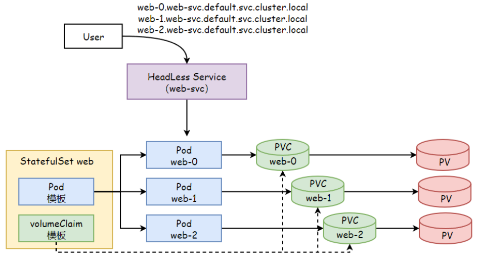
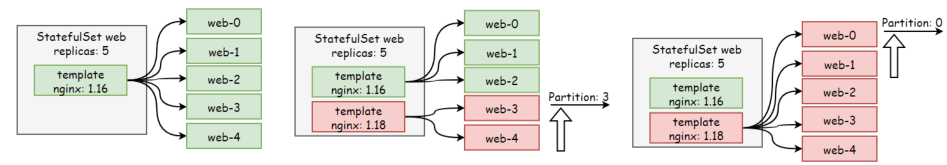

# 14 Kubernetes资源StatefulSet

## 目录

- [1.StatefulSet基本概述](#1.statefulset基本概述)
  - [1.1 什么是StatefulSet](#1.1-什么是statefulset)
  - [1.2 StatefulSet组成部分](#1.2-statefulset组成部分)
  - [1.3 StatefulSet示例配置](#1.3-statefulset示例配置)
- [2.StatefulSet实践](#2.statefulset实践)
  - [2.1 部署Headless](#2.1-部署headless)
  - [2.2 部署StatefulSet](#2.2-部署statefulset)
  - [2.3 测试稳定的DNS解析](#2.3-测试稳定的dns解析)
  - [2.4 删除StatefulSet](#2.4-删除statefulset)
  - [2.5 扩展StatefulSet](#2.5-扩展statefulset)
- [3.StatefulSet更新策略](#3.statefulset更新策略)
  - [3.1 滚动更新](#3.1-滚动更新)
  - [3.2 分区滚动更新](#3.2-分区滚动更新)

## 1.StatefulSet基本概述

对于我们部署的应⽤，⼤体可以分为两类，⼀类是⽆状态应⽤，⼀类是有 状态应⽤。 像web这种类型的应⽤，就属于⽆状态应⽤，他们不需要存储任何数 据⾄本地，也没有任何次序之分，同时所提供的服务也是完全⼀样 的，像这类应⽤，就可以通过Deployment控制器来进⾏编排和部 署； 像MySQL、Redis这类需要存储数据的应⽤程序，称之为有状态应 ⽤，它们有的有⻆⾊之分，有的是主节点，有的是从节点，⽽有的⼜ 存在先后次序之分。

所以对于不同的分布式系统，他们的运维逻辑和运维操作过程是不尽相同 的，因此没有⼀种控制器，能把所有的⽆状态应⽤的交付给全部囊括进 来，让我们能⾮常简单的去操作这些有状态应⽤，即便有了 StatefulSet，但当我们真正去使⽤时也是极其麻烦的 StatefulSet虽然在⼀定程度上能够实现有状态应⽤的管理，但我们还 需要⾃⾏把某个应⽤的运维管理和运维操作过程，写成脚本注⼊到 StatefulSet中才能使⽤，不仅麻烦，且极其容易出错。

### 1.1 什么是StatefulSet

StatefulSet控制器主要⽤来管理有状态应⽤，它主要具有以下⼏个特 征； 1、稳定且唯⼀的⽹络标识符；（StatefulSet提供稳定的Pod名 称，结合HeadLessService提供Pod唯⼀的DNS标识） 2、稳定且持久的存储；（为每个Pod提供⼀个PVC，作为后端的存 储，Pod故障重新启动任然会使⽤此前的PVC） 3、有序的、优雅的部署和缩放；（⽐如redis主从复制r1-r6，⼀ 般先启动主节点r1，⽽后启动从节点r2-r6） 4、有序的、优雅的删除和终⽌；（⽐如redis主从复制r1-r6，⼀ 般先从r6-r2从节点开始删除，最后删除r1主节点） 5、有序的滚动更新；（⽐如Redis主从复制r1-r6，⼀般先更新r2- r6从节点，⽽后更新r1主节点，前提是能兼容） 在上⾯描述中，“稳定的”意味着 Pod 调度或重调度的整个过程是有持久 性的（名称不变、pvc不变）。如果应⽤程序不需要任何稳定的标识符或 有序的部署以及删除，则应该使⽤⽆状态的副本控制器来部署应⽤程序， ⽐如Deployment或者ReplicaSet。

### 1.2 StatefulSet组成部分

StatefulSet由三个组件组成：HeadLessService、StateFulSet控 制器、VolumeClaimTemplate、



StatefulSet控制器： StatefulSet名称是固定，且创建时按照顺序进⾏创建，并固定对应的 Pod名称。 Headless Service： ⽤来配置每个Pod的DNS名称，只要Pod的名称不变化，他们的DNS就是稳 定且持久的。 VolumeClaimTemplate： 作为分布式系统，每个Pod的数据是不⼀样的，所以每个Pod应该有⾃⼰ 的专有数据，所以他们不能使⽤同⼀个存储卷，应该使⽤各⾃⾃⼰的存储 卷。

### 1.3 StatefulSet示例配置

```
apiVersion: apps/v1 kind: StatefulSet metadata: name: <string>        # 资源名称 namespace: <string>     # 名称空间

spec: serviiceName: <string>    # 相关的HeadlessService名 称 updateStrategy: <object>    # 更新策略 type: <string>        # 更新类型，可以有 rollingUpdate和OnDelete rollingUpdate: <object>   # 滚动更新 partition: <integer>    # 分区策略，默认为0 podManagementPolicy: <string> # Pod管理策略，默认 OrderedReady表示顺序创建Pod，逆序删除。 # 另⼀种Parallel表示并⾏创建 Pod和并⾏删除Pod replicas: <integer>     # 期望的Pod副本数 selector:           # 标签选择器，选择 app=mall的标签 matchLabels: app: mall template:           # Pod模板 metadata: labels: app: mall spec: containers:

- name: demoapp-container

image: oldxu3957/demoapp:v1.0 ports:

volumeClaimTemplates:     # 存储卷申请模板 metadata: name: data spec: accessMode: ["ReadWriteOnce"] storageClassName: "nfs-dynamic" resources:

requests: storage: 2Gi
```
## 2.StatefulSet实践

前⾯的环境已经有了StorageClass，所以我们就不⽤在去创建PV了。 如果没有则需要⾃⾏准备。 1、创建名为 web-svc 的 Headless Service ⽤来控制⽹络域 名。 2、创建名为 web 的 StatefulSet 有⼀个 Spec，它表明将在 独⽴的 3 个 Pod 副本中启动 nginx 容器。 3、volumeClaimTemplates 将通过 PersistentVolumes 驱 动来提供稳定的存储。

### 2.1 部署Headless

```
[root@master sts]# cat 01-web-headless.yaml apiVersion: v1 kind: Service metadata: name: web-svc spec: clusterIP: None selector: app: nginx ports:

- port:

targetPort:
```
### 2.2 部署StatefulSet

1、部署StatefulSet

```
[root@master sts]# cat 02-web-statefulset.yaml apiVersion: apps/v1 kind: StatefulSet metadata: name: web spec: serviceName: web-svc replicas: 3 selector: matchLabels: app: nginx template: metadata: labels: app: nginx spec: containers:

- name: nginx

image: nginx:1.16 ports:

volumeMounts:

- name: data

mountPath: /usr/share/nginx/html volumeClaimTemplates:

- metadata:

name: data spec: accessModes: [ "ReadWriteOnce" ] storageClassName: "nfs-provisioner-storage" # 使⽤动态供应完成pv创建 resources: requests:

storage: 2Gi 2、检查pod [root@master sts]# kubectl get pod NAME                                     READY STATUS    RESTARTS        AGE web-0                                    1/1 Running   0               16s web-1                                    1/1 Running   0               13s web-1                                    1/1 Running   0               10s 3、检查pvc，对应的pv是动态供应⾃动创建的； [root@master sts]# kubectl get pvc NAME         STATUS   VOLUME CAPACITY   ACCESS MODES   STORAGECLASS        AGE data-web-0   Bound    pvc-b9c92a98-68d0-45e8   2Gi RWO    nfs-provisioner-storage  9s data-web-1   Bound    pvc-b2dfe72a-8a8e-45fa   2Gi RWO    nfs-provisioner-storage  6s data-web-2   Bound    pvc-33a47fdc-029a-4c39   2Gi RWO    nfs-provisioner-storage  3s
```
### 2.3 测试稳定的DNS解析

```
StatefulSet名称加上Pod的序号，可以派⽣出每个Pod的主机名。格式 为$(StatefulSet 名称)-$(序号)。

上⾯我们创建了三个名称，分为别 web-0、web-1、web-2 的 Pod， 然后通过 HeadLessService来设定它的唯⼀名称， ⼀旦每个 Pod 创 建成功，就会得到⼀个匹配的DNS⼦域，格式为：$(pod 名 称).$(headlessService名称)，其中所属服务由 StatefulSet 的 serviceName 域来设定。 1、创建Pod容器 [root@master sts]# kubectl run tools !# image=oldxu3957/tools 2、测试Pod的DNS名称 [root@tools /]# dig web-0.web- svc.default.svc.cluster.local +short
```
192.168.3.127

```
[root@tools /]# dig web-1.web- svc.default.svc.cluster.local +short
```
192.168.1.203

```
[root@tools /]# dig web-2.web- svc.default.svc.cluster.local +short
```
192.168.3.128

### 2.4 删除StatefulSet

```
删除StatefulSet，它会从后往前删除，先删除data-web-1，然后删 除data-web-0 1、删除StatefulSet [root@master sts]# kubectl delete statefulsets web statefulset.apps "web" deleted 2、删除 Pod 时，它们是逆序终⽌的，顺序为 N-1!"0。

[root@master ~]# kubectl get pod -l app=nginx -w NAME    READY   STATUS    RESTARTS   AGE web-0   1/1     Running   0          6m web-1   1/1     Running   0          5m57s web-2   1/1     Running   0          5m57s web-2   1/1     Terminating   0          6m18s    # 先删除是web-2 web-1   1/1     Terminating   0          6m18s    # 然后删除是web-1 web-0   1/1     Terminating   0          6m21s    # 最后删除web-0

web-2   0/1     Terminating   0          6m18s web-2   0/1     Terminating   0          6m19s web-2   0/1     Terminating   0          6m web-1   0/1     Terminating   0          6m18s web-1   0/1     Terminating   0          6m19s web-1   0/1     Terminating   0          6m19s web-0   0/1     Terminating   0          6m22s web-0   0/1     Terminating   0          6m22s web-0   0/1     Terminating   0          6m22s
```
### 2.5 扩展StatefulSet

1、扩展StatefulSet副本数，它则会按照编号⼀个⼀个的顺序创建出来 [root@master sts]# kubectl scale statefulset web !# replicas=5 2、查看Pod的创建过程，对于包含 N 个 副本的 StatefulSet，当部 署 Pod 时，它们是依次创建的，顺序为 0!"N-1 [root@master ~]# kubectl get pod -l app=nginx -w

```
NAME    READY   STATUS    RESTARTS   AGE web-0   1/1     Running   0          24m web-1   1/1     Running   0          24m web-2   1/1     Running   0          24m

web-3   0/1     Pending             0          0s web-3   0/1     Pending             0          0s web-3   0/1     Pending             0          1s web-3   0/1     ContainerCreating   0          1s web-3   1/1     Running             0          2s # web-3就绪则创建web-4 web-4   0/1     Pending             0          0s web-4   0/1     Pending             0          0s web-4   0/1     Pending             0          2s web-4   0/1     ContainerCreating   0          2s web-4   1/1     Running             0          3s # web-4就绪，则扩容完成
```
## 3.StatefulSet更新策略

StatefulSet 的更新⽀持两种策略：onDelete 和 RollingUpdate，在.spec.updateStrategy 进⾏设定。 OnDelete 当 StatefulSet 的 .spec.updateStrategy.type 设置为 OnDelete 时， 控制器将不会⾃动更新 StatefulSet 中的 Pod。 ⽤户必须⼿动删除 Pod 以便让控制器创建新的 Pod，以此来对 StatefulSet 的 .spec.template 的变动作出反应。 RollingUpdate

RollingUpdate 更新策略对 StatefulSet 中的 Pod 执⾏⾃动的滚 动更新。这是默认的更新策略。StatefulSet 控制器会删除和重建 Pod。它将按照与 Pod 终⽌相同的顺序（从最⼤序号到最⼩序号）进 ⾏，每次更新⼀个 Pod。

### 3.1 滚动更新

```
1、修改yaml为RollingUpdate，并更新镜像版本 [root@master sts]# cat 03-web-statefulset.yaml apiVersion: apps/v1 kind: StatefulSet metadata: name: web spec: serviceName: web-svc replicas: 5 selector: matchLabels: app: nginx updateStrategy:         # 设定滚动更新 type: RollingUpdate

template: metadata: labels: app: nginx spec: containers:

- name: nginx

image: nginx:1.18     # 修改镜像版本 ports:

volumeMounts:

- name: data

mountPath: /usr/share/nginx/html volumeClaimTemplates:

- metadata:

name: data spec: accessModes: [ "ReadWriteOnce" ] storageClassName: "nfs-provisioner-storage" resources: requests: storage: 2Gi 2、观察更新过程，按照逆序依次更新。 web-4   1/1     Terminating   0          26m web-4   0/1     Pending       0          0s web-4   0/1     ContainerCreating   0          0s web-4   1/1     Running             0          25s

web-3   1/1     Terminating         0          27m web-3   0/1     Pending             0          0s web-3   0/1     ContainerCreating   0          0s web-3   1/1     Running             0          26s

web-2   0/1     Terminating         0          27m web-2   0/1     Pending             0          0s web-2   0/1     ContainerCreating   0          0s web-2   1/1     Running             0          25s

web-1   1/1     Terminating         0          52m web-1   0/1     Pending             0          0s web-1   0/1     ContainerCreating   0          0s

web-1   1/1     Running             0          1s

web-0   1/1     Terminating         0          52m web-0   0/1     Pending             0          0s web-0   0/1     ContainerCreating   0          0s web-0   1/1     Running             0          1s
```
### 3.2 分区滚动更新

SatefulSet 的 RollingUpdate 滚动更新⽀持 Partition 分区 更新，有点类似灰度发布的模式。 第⼀步：设定partition为3，StatefulSet会检查是否有Pod的编 号⼤于等于3，如果有则更新⼤于等于N的Pod。 第⼆步：如果直接partition分区为0，StatefulSet会更新所有 的镜像（从最⼤序号到最⼩序号进⾏镜像更新）。



```
1、修改yaml，将partition设定为3 [root@master sts]# cat 03-web-statefulset.yaml apiVersion: apps/v1 kind: StatefulSet metadata: name: web spec: serviceName: web-svc replicas: 5 selector: matchLabels: app: nginx

updateStrategy: type: rollingUpdate: partition: 3            # 设定更新分区

template: metadata: labels: app: nginx spec: containers:

- name: nginx

image: nginx:1.20       # 修改镜像版本 ports:

volumeMounts:

- name: data

mountPath: /usr/share/nginx/html volumeClaimTemplates:

- metadata:

name: data spec: accessModes: [ "ReadWriteOnce" ] storageClassName: "nfs-provisioner-storage" resources: requests: storage: 2Gi 2、观察更新过程，会发现仅更新了web-4和web-3

web-4   0/1     Terminating         0          13m web-4   0/1     Pending             0          0s web-4   0/1     ContainerCreating   0          0s web-4   1/1     Running             0          1s

web-3   0/1     Terminating         0          13m web-3   0/1     Pending             0          0s web-3   0/1     ContainerCreating   0          0s web-3   1/1     Running             0          1s
```
