# 15 Kubernetes认证、授权与准入控制

## 目录

- [1.认证基本概念](#1.认证基本概念)
  - [1.1 为何需要认证](#1.1-为何需要认证)
  - [1.2 认证的流程](#1.2-认证的流程)
  - [1.3 认证的方式](#1.3-认证的方式)
    - [1.3.1 UserAccount](#1.3.1-useraccount)
    - [1.3.2 ServiceAccount](#1.3.2-serviceaccount)
- [2.基于ServiceAccount认证实践](#2.基于serviceaccount认证实践)
  - [2.1 使用默认sa认证API](#2.1-使用默认sa认证api)
  - [2.2 创建sa并与Pod关联](#2.2-创建sa并与pod关联)
  - [2.3 为sa添加私有仓库认证](#2.3-为sa添加私有仓库认证)
- [3.kubeconfig基于User认证实践](#3.kubeconfig基于user认证实践)
  - [3.1 kubeconfig的作用](#3.1-kubeconfig的作用)
  - [3.2 kubeconfig文件格式](#3.2-kubeconfig文件格式)
  - [3.3 自定义kubeconfig实践](#3.3-自定义kubeconfig实践)
    - [3.3.1 加入已有集群配置文件](#3.3.1-加入已有集群配置文件)
    - [3.3.2 创建新的集群配置文件](#3.3.2-创建新的集群配置文件)
- [4.RBAC授权](#4.rbac授权)
  - [4.1 什么是RBAC](#4.1-什么是rbac)
  - [4.2 RBAC角色与集群角色](#4.2-rbac角色与集群角色)
  - [4.3 RBAC场景实践](#4.3-rbac场景实践)
    - [4.3.1 实践场景-1](#4.3.1-实践场景-1)
    - [4.3.2 实践场景-2](#4.3.2-实践场景-2)
    - [4.3.3 实践场景-3](#4.3.3-实践场景-3)
  - [4.4 内置的ClusterRole](#4.4-内置的clusterrole)
    - [4.4.1 Cluster-admin分析](#4.4.1-cluster-admin分析)
    - [4.4.2 Cluster-admin实践](#4.4.2-cluster-admin实践)
- [5.认证与授权实践](#5.认证与授权实践)
  - [5.1 Dashboard介绍](#5.1-dashboard介绍)
  - [5.2 Dashboard安装](#5.2-dashboard安装)
  - [5.3 Dashboard认证与授权](#5.3-dashboard认证与授权)
    - [5.3.1 基于Token认证与授权-1](#5.3.1-基于token认证与授权-1)
    - [5.3.2 基于Token认证与授权-2](#5.3.2-基于token认证与授权-2)
    - [5.3.3 基于kubeconfig认证授权](#5.3.3-基于kubeconfig认证授权)
- [6.准入控制](#6.准入控制)
- [7.ResoucesQuta](#7.resoucesquta)
  - [7.1 资源配额介绍](#7.1-资源配额介绍)
  - [7.2 配额策略示例](#7.2-配额策略示例)
  - [7.3 计算资源配额示例](#7.3-计算资源配额示例)
  - [7.4 存储资源配额示例](#7.4-存储资源配额示例)
  - [7.5 对象数量配额示例](#7.5-对象数量配额示例)
  - [7.6 计算资源配置实践](#7.6-计算资源配置实践)
  - [7.7 存储资源配置实践](#7.7-存储资源配置实践)
  - [7.8 对象数量配置实践](#7.8-对象数量配置实践)
- [8.LimitRanage](#8.limitranage)
  - [8.1 LimitRange](#8.1-limitrange)
  - [8.3 LimitRange限制场景-1](#8.3-limitrange限制场景-1)
  - [8.4 LimitRange限制场景-2](#8.4-limitrange限制场景-2)
  - [8.5 LimitRange限制场景-3](#8.5-limitrange限制场景-3)
  - [8.6 LimitRange场景示例-4](#8.6-limitrange场景示例-4)
  - [8.7 LimitRange限制存储](#8.7-limitrange限制存储)

## 1.认证基本概念

### 1.1 为何需要认证

对于Kubernetes 系统来说，APIServer 肯定不是任何人都能轻易访问的，如果任何人都 能轻易的访问，意味着可以通过kubectl 命令访问 APIServer，进而操作Kubernetes。 也就意味着它能够在我们的系统上随便部署应用程序，甚至还会删除我们正在运行的应用程 序，这是非常危险的。所以我们需要对用户进行 身份认证，确保身份是合法的。 www.xuliangwei.com

### 1.2 认证的流程

任何客户端用户试图通过 APIServer 操作资源对象时，它们必须经历多个阶段的访问控 制，才会被接受处理，其中包含认证、授权以及准入控制

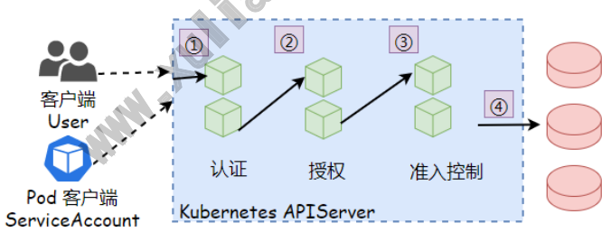

1.认证：任何客户端访问，经过API操作之前，需要先完成认证操作，也就是进行 身份 认证； 2.授权：认证通过后仅代表它是一个合法的系统用户，但它是否拥有删除对应资源权限， 需要进行授权检查； 3.准入控制：虽然我们有了权限，也可以创建Pod等各种资源，但创建Pod是否能成功 呢，假设ops名称空间限制最多创建2个Pod，目前已经有2个Pod了，那么这次的创建就 会失败。

### 1.3 认证的方式

#### 1.3.1 UserAccount

使用kubectl创建资源，首先要进行客户端身份认证，所以客户端每次在请求APIServer时 都会携带上数字证书，用于认证API-Server，当认证通过后，证书中的Subject将被识别 为用户标识，其中的CN字段的值为用户名，字段O的值就是用户所属的组，例如：Subject: O=ops, CN=oldxu 用户名为oldxu，用户的组为ops。

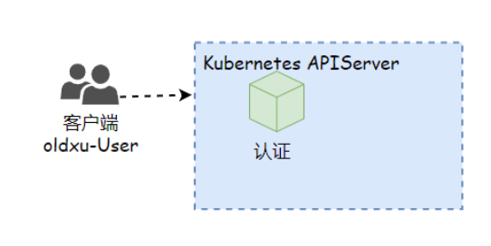

#### 1.3.2 ServiceAccount

有些情况下，我们希望在pod内部能够访问API-Server，获取集群的信息，甚至对集群进行 改动。针对这种情况，kubernetes提供了一种特殊的认证方式：ServiceAccount。 默认情况下，创建的Pod如果没有指定ServiceAccount则系统会默认提供一个 ServiceAccount，而后通过mount方式挂载到Pod的文件系统中，该ServiceAccount能 通过DownWardAPI获取该Pod相关的一些元数据信息。当然也可以自行创建 ServiceAccount来完成API-Server的身份认证，至于能否对集群进行改变，则需要看该 ServiceAccount是否拥有权限。

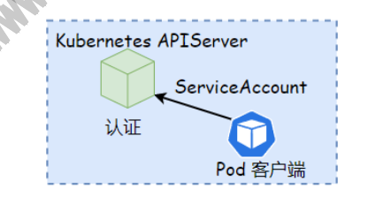

## 2.基于ServiceAccount认证实践

### 2.1 使用默认sa认证API

当创建 Pod 时，如果没有指定ServiceAccount，Pod会注入对应名称空间中的 default 服务账户。 如果你查看 Pod 的原始YAML（例如：kubectl get pods/podname -o yaml）， 你可以看到 spec.serviceAccountName 字段已经被自动设置了。

```
[root@master ~]# kubectl get pod tools -o yaml apiVersion: v1 kind: Pod metadata: spec: serviceAccountName: default
```
### 2.2 创建sa并与Pod关联

```
1、创建ServiceAccount # 命令方式创建 [root@master ~]# kubectl create serviceaccount pod-sa Վʔ namespace=default # 清单文件写法 [root@master ~]# cat pod-sa.yaml www.xuliangwei.com apiVersion: v1 kind: ServiceAccount metadata: name: pod-sa namespace: default automountServiceAccountToken: true    # 自动挂载 API 凭据 2、Pod清单文件应用ServiceAccount [root@master serviceaccount]# cat pod-test-sa.yaml apiVersion: v1 kind: Pod metadata: name: pod-test-sa spec: serviceAccountName: pod-sa        # 指定Pod运行时使用的 ServiceAccount containers:

image: nginx 3.访问Pod，测试SA用户能否认证APIServer root@pod-test-sa:~# cd /var/run/secrets/kubernetes.io/serviceaccount

root@pod-test-sa:/var/run/secrets/kubernetes.io/serviceaccount# \ curl Վʔcacert ./ca.crt \ -H "Authorization: Bearer $(cat ./token)" \ https:Վˌkubernetes/api/v1/namespaces/default # https:Վˌkubernetes/api/v1/namespaces/default/pods # https:Վˌkubernetes/api/v1/namespaces/default/services # https:Վˌkubernetes/apis/apps/v1/namespaces/default/deployments { "kind": "Status", "apiVersion": "v1", "metadata": {

}, "status": "Failure", "message": "namespaces \"default\" is forbidden: User \"system:serviceaccount:default:pod-sa\" cannot get resource www.xuliangwei.com \"namespaces\" in API group \"\" in the namespace \"default\"", "reason": "Forbidden", "details": { "name": "default", "kind": "namespaces" }, "code": 403 4.虽然SA用户能通过HTTPS方式成功认证API，但没有权限访问任何资源（所以先暂时分配一 个集群管理员权限，测试效果）； [root@master ~]# kubectl create rolebinding role-sa-admin \ Վʔclusterrole=admin \ Վʔserviceaccount=default:pod-sa

root@pod-test-sa:/var/run/secrets/kubernetes.io/serviceaccount# curl Վʔcacert ./ca.crt -H "Authorization: Bearer $(cat ./token)" https:Վˌkubernees/api/v1/namespaces/default { "kind": "Namespace", "apiVersion": "v1", "metadata": { "name": "default",

"uid": "303d49c1-a1d6-4bae-ac28-3908348eb8b2", "resourceVersion": "204", "creationTimestamp": "2022-03-24T11:04:44Z", "labels": { "kubernetes.io/metadata.name": "default" }, "managedFields": [ { "manager": "kube-apiserver", "operation": "Update", "apiVersion": "v1", "time": "2022-03-24T11:04:44Z", "fieldsType": "FieldsV1", "fieldsV1": {"f:metadata":{"f:labels":{".": {},"f:kubernetes.io/metadata.name":{}}}} } ] }, www.xuliangwei.com "spec": { "finalizers": [ "kubernetes" ] }, "status": { "phase": "Active" } }
```
### 2.3 为sa添加私有仓库认证

```
通过ServiceAccountName来完成私有仓库认证，可以不使用imagePullSecret，因为在 ServiceAccount中有Image Pull Secrets这个字段，可以将认证仓库信息给附加进 去。 1.创建一个ImagePull，所需的Secret资源； [root@master ~]# kubectl create secret docker-registry myregistry \ Վʔdocker-server=registry.cn-huhehaote.aliyuncs.com \ Վʔdocker-username=552408925@qq.com \ Վʔdocker-password=123456 \ 2.创建ServiceAccount，定义名称，然后将镜像拉取 Secret 添加到该账号下；

[root@master serviceaccount]# cat pod-imagepull-sa.yaml apiVersion: v1 kind: ServiceAccount metadata: name: pod-imagepull-sa        # sa账号名称 imagePullSecrets:

- name: myregistry

3.创建私有Pod，测试能否通过SA下载镜像 apiVersion: v1 kind: Pod metadata: name: nginxdemo spec: serviceAccount: pod-imagepull-sa containers: www.xuliangwei.com

- name: nginxdemo

image: registry.cn-huhehaote.aliyuncs.com/oldxu3957/nginxdemo
```
## 3.kubeconfig基于User认证实践

### 3.1 kubeconfig的作用

由于APIServer是基于无状态HTTP/HTTPS协议实现，所以每次与集群进行交互时都需要进 行身份认证，通常都是使用证书进行认证，其认证所需要的信息都会存放在kubeconfig文件 中。

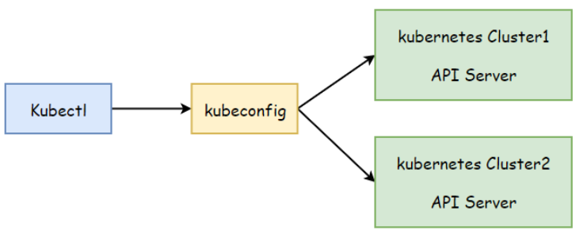

客户端程序可通过默认路径、Վʔkubeconfig选项或KUBECONFIG环境变量定义要加载的 kubeconfig文件，从而能够在每次的请求通过API-Server的认证。

### 3.2 kubeconfig文件格式

kubeconfig文件主要分为四部分：cluster、users、context、current-context cluster：集群以列表形式定义在cluster配置段中，每个列表项代表一个 Kubernetes集群，并拥有名称标识； users：访问集群的身份都定义在users配置段中，每个列表项代表一个能够认证到某个 Kubernetes集群的凭据； context：将user与cluster二者之间的映射关系进行绑定，而后定义在context配置 中； current-context：用于指定当前集群默认使用的context，表示当前正在使用哪个用 户操作哪个集群；

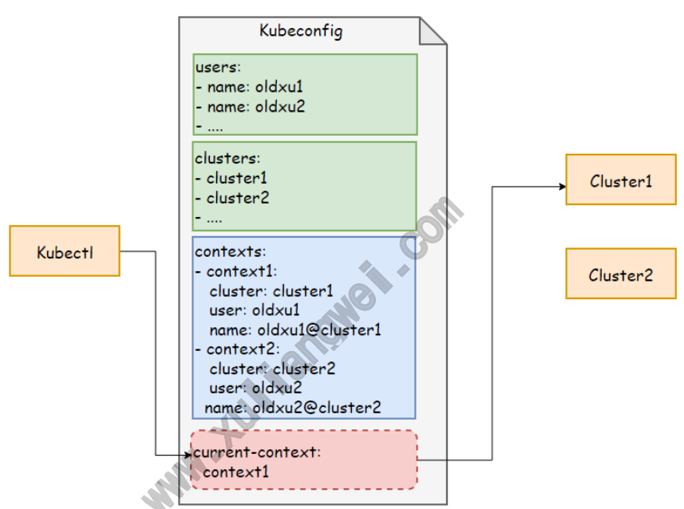

默认使用kubeadm初始化Kubernetes集群过程中，在Master节点上生成 的/etc/kubernetes/admin.conf文件就是一个kubeconfig格式的文件，它由 kubeadm命令自动生成，可由kubectl加载后接入当前集群的API Server。 默认kubectl加载的kubeconfig文件默认路径为$HOME/.kube/config，当然也可以 通过Վʔkubeconfig选项，或KUBECONFIG环境变量将其修改为其他路径； kubectl config view 命令能打印kubeconfig文件的内容，其中包含了集群列表，用户 列表，上下文列表，及当前使用的上下文context等。 [root@master ~]# kubectl config view apiVersion: v1 kind: Config preferences: {}

```
clusters:                                           # 集群列表

- cluster:

certificate-authority-data: DATA+OMITTED server: https:Վˌ10.0.0.210:6443 name: kubernetes contexts:                                           # 映射关系

- context:

cluster: kubernetes user: kubernetes-admin name: kubernetes-admin@kubernetes

- context:

cluster: kubernetes user: oldxu name: oldxu@kubernetes current-context: kubernetes-admin@kubernetes        # 当前正在使用的 context users:                                              # 用户列表

- name: kubernetes-admin

user: client-certificate-data: REDACTED client-key-data: REDACTED

- name: oldxu

user: client-certificate-data: REDACTED client-key-data: REDACTED
```
### 3.3 自定义kubeconfig实践

创建一个UserAccount的用户，然后加入到Kubeconfig文件中，最后通过Kubectl加载 kubeconfig文件中对应的证书信息，然后尝试认证到APIServer。 UserAccount用户不可以直接创建，需要创建证书文件，在证书申请文件中填写好证书对应 的CN，也就是我们的用户名称，而后经由APIServer信任的 CA（/etc/kubernetes/pki/ca.crt）签署证书请求文件。最后与APIServer进行认证 时，APIServer会获取证书中的CN，以判断该用户是否是合法的。

#### 3.3.1 加入已有集群配置文件

```
1、创建证书私钥文件 [root@master ~]# mkdir /root/.certs [root@master ~]# (umask 077; openssl genrsa -out /root/.certs/oldxu.key 2048)

2、创建证书签署请求文件，-subj选项中的CN的值将被APIServer识别为用户名，O的值将 被识别为用户组。 [root@master ~]# openssl req -new \ -key /root/.certs/oldxu.key \ -out /root/.certs/oldxu.csr \ -subj "/CN=oldxu/O=devops" 3、使用kubernetes-ca的身份对文件进行签署。 [root@master ~]# openssl x509 -req -days 3650 \ -in /root/.certs/oldxu.csr \ -CA /etc/kubernetes/pki/ca.crt \ -CAkey /etc/kubernetes/pki/ca.key \ -CAcreateserial \ -out /root/.certs/oldxu.crt 4、根据x509数字证书及私钥创建身份凭据。 www.xuliangwei.com [root@master ~]# kubectl config set-credentials oldxu \ Վʔclient-certificate=/root/.certs/oldxu.crt \ Վʔclient-key=/root/.certs/oldxu.key \ Վʔembed-certs=true 5、配置context上下文，已oldxu身份凭据访问已定义的Kubernetes集群，context名称 为oldxu@kubernetes [root@master ~]# kubectl config set-context oldxu@kubernetes \ Վʔcluster=kubernetes \ Վʔuser=oldxu 6、将当前上下文切换为oldxu@kubernetes [root@master ~]# kubectl config use-context oldxu@kubernetes 7、测试oldxu用户是否能通过API Server认证； [root@master ~]# kubectl get namespaces Error from server (Forbidden): namespaces is forbidden: User "oldxu" cannot list resource "namespaces" in API group "" at the cluster scope # 虽然报错，但oldxu用户已被API Server正确失败
```
#### 3.3.2 创建新的集群配置文件

```
1、添加集群配置，设定集群名称，设定APIServer地址，以及APIServer信任的CA证书； [root@master ~]# kubectl config set-cluster aliyun_k8s \ Վʔkubeconfig=/tmp/config \ Վʔserver="https:Վˌ10.0.0.210:6443" \ Վʔcertificate-authority=/etc/kubernetes/pki/ca.crt \ Վʔembed-certs=true 2、添加身份凭据，使用CA已签署的客户端证书即可 [root@master ~]# kubectl config set-credentials oldxu \ Վʔkubeconfig=/tmp/config \ Վʔclient-certificate=/root/.certs/oldxu.crt \ Վʔclient-key=/root/.certs/oldxu.key \ Վʔembed-certs=true www.xuliangwei.com 3、将oldxu-admin用户与aliyun_k8s集群建立映射关系 [root@master ~]# kubectl config set-context oldxu@aliyun_k8s \ Վʔcluster=aliyun_k8s \ Վʔuser=oldxu \ Վʔkubeconfig=/tmp/config 4、设定默认上下文为oldxu@aliyun_k8s kubectl config use-context oldxu@aliyun_k8s Վʔ kubeconfig=/tmp/config 5、oldxu用户未设置任何授权，但它能够被系统识别为oldxu用户，这表示身份认证是正 常；后续就可以授权了 [root@master ~]# kubectl get nodes Վʔkubeconfig=/tmp/config Վʔ context="oldxu@aliyun_k8s" Error from server (Forbidden): nodes is forbidden: User "oldxu" cannot list resource "nodes" in API group "" at the cluster scope
```
## 4.RBAC授权

### 4.1 什么是RBAC

RBAC（Role Based Access Control）基于角色的访问控制；其实就是将资源的操作权 限授予给指定的角色，而后将用户加入该角色，那么该用户则拥有了对应角色的权限； 举例：希望oldxu用户能获取所有Pod的列表 1、首先定义角色，然后定义角色权限规则，资源：Pod，操作权限：get,list 2、然后定义角色绑定，将oldxu绑定至该角色，而后oldxu就拥有了该角色的权 限，进而就能获取pod信息；

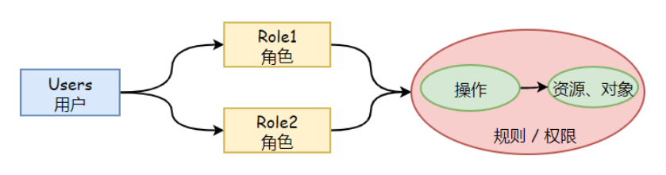

### 4.2 RBAC角色与集群角色

Kubernetes系统的RBAC授权插件将角色分为了Role和ClusterRole两类： Role：仅作用于名称空间级别，用于承载名称空间级别内的资源权限集合。 ClusterRole：作用于集群范围，能够同时承载名称空间和集群级别的资源权限集合。 Kubernetes利用Role和ClusterRole两类角色来赋予对应的权限，同时也需要用到另外两 类资源Rolebinding和ClusterRolebinding来完成用户与角色之间的绑定关系；

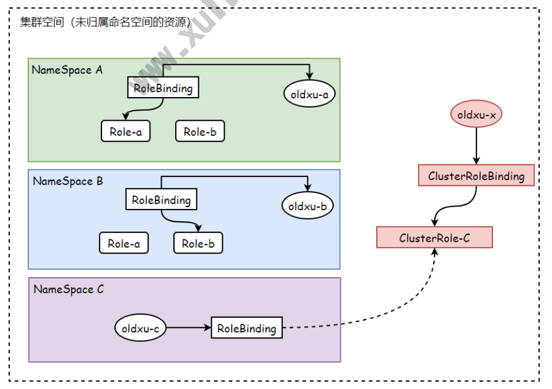

注意: RoleBinding除了可以绑定Role以外，还可以绑定ClusterRole，但它的权限还是 限制在名称空间级别； 这种方式有着特定的应用场景： 比如：希望在三个名称空间中都创建一个管理员身份，那么我们就需要创建3个role和3 个rolebinding 但是：我们可以定义一个clusterrole，然后通过rolebind绑定就完成了，也就不需 要重复创建很多的role；

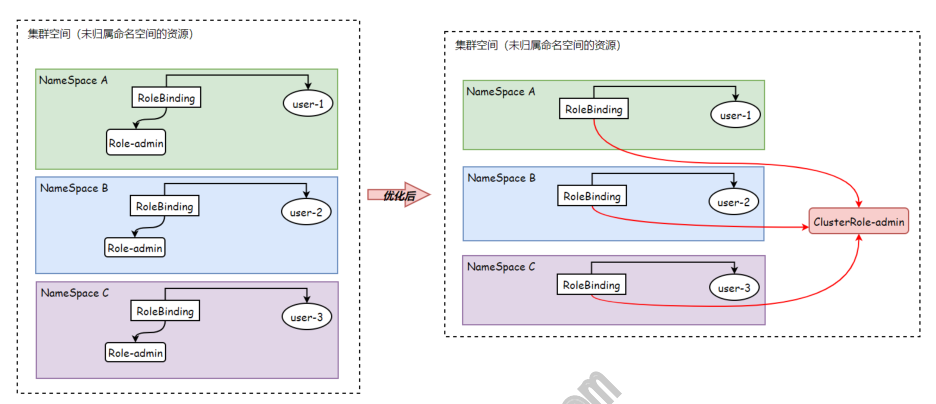

### 4.3 RBAC场景实践

#### 4.3.1 实践场景-1

```
场景说明：赋予oldxu用户对default名称空间拥有Pod的读取权限； 1、创建role角色，设定对应的规则； # 命令方式 [root@master rbac]# kubectl create role default-pod-reader \ Վʔresource=pod \ Վʔverb=get,list,watch \ Վʔnamespace=default # yaml方式 apiVersion: rbac.authorization.k8s.io/v1 kind: Role metadata: name: default-pod-reader namespace: default rules:

- apiGroups:

- ""

resources:

- pods

verbs:

- get

- list

- watch

2、创建rolebinding角色绑定，将oldxu绑定至对应的role上； # 命令方式 [root@master rbac]# kubectl create rolebinding oldxu-default-pod- reader \ Վʔrole=default-pod-reader \ Վʔuser=oldxu \ Վʔnamespace=default # yaml方式 [root@master rbac]# cat default-rolebinding-oldxu.yaml apiVersion: rbac.authorization.k8s.io/v1 www.xuliangwei.com kind: RoleBinding metadata: name: oldxu-default-pod-reader namespace: default roleRef: apiGroup: rbac.authorization.k8s.io kind: Role name: default-pod-reader subjects:

- apiGroup:

kind: User name: oldxu

[root@master rbac]# kubectl get pod -n default  Վʔ context="oldxu@kubernetes" NAME                                     READY   STATUS RESTARTS       AGE app-deploy-687dd6f47f-7k6hm              1/1     Running   0 3d19h app-deploy-687dd6f47f-pcq4j              1/1     Running   0 3d19h # 非default名称空间，访问会报错 [root@master rbac]# kubectl get pod -n kube-system  Վʔ context="oldxu@kubernetes" Error from server (Forbidden): pods is forbidden: User "oldxu" cannot list resource "pods" in API group "" in the namespace "kube-system"
```
#### 4.3.2 实践场景-2

```
场景说明：赋予oldxu用户对所有名称空间拥有Pod的读取权限（ClusterRole、 ClusterRoleBinding）； 1、创建clusterrole # 命令方式 [root@master ~]# kubectl create clusterrole cluster-pod-reader \ Վʔresource=pod \ Վʔverb=get,list,watch # yaml方式 [root@master rbac]# cat cluster-pod-reader.yaml apiVersion: rbac.authorization.k8s.io/v1 kind: ClusterRole metadata: name: cluster-pod-reader rules:

- apiGroups:

- ""

resources:

- pods

verbs:

- get

- list

- watch

2、创建clusterrolebinding，并绑定oldxu用于至对应的clusterrole # 命令方式 [root@master ~]# kubectl create clusterrolebinding cluster-pod- reader-oldxu \ Վʔclusterrole=cluster-pod-reader \ Վʔuser=oldxu # yaml方式 [root@master rbac]# cat cluster-pod-reader-oldxu.yaml apiVersion: rbac.authorization.k8s.io/v1 kind: ClusterRoleBinding metadata: name: cluster-pod-reader-oldxu roleRef: apiGroup: rbac.authorization.k8s.io kind: ClusterRole name: cluster-pod-reader www.xuliangwei.com subjects:

- apiGroup: rbac.authorization.k8s.io

kind: User name: oldxu

[root@master rbac]# kubectl get pod Վʔcontext="oldxu@kubernetes" [root@master rbac]# kubectl get pod -n kube-system Վʔ context="oldxu@kubernetes" # 任何名称空间都可以查看，但没有删除权限 [root@master rbac]# kubectl delete  pod tools Վʔ context="oldxu@kubernetes" Error from server (Forbidden): pods "tools" is forbidden: User "oldxu" cannot delete resource "pods" in API group "" in the namespace "default"
```
#### 4.3.3 实践场景-3

场景说明：赋予oldxu用户对default名称空间拥有管理员权限； 系统内置了一个ClusterRole：admin的集群管理员，我们可以通过 rolebinding 引用 CLusterRole：admin 集群角色，该引用会造成用户仅对 rolebinding 所在的名称空 间有管理员权限。（因为rolebinding仅能作用在名称空间。）

```
1、删除此前的绑定，避免权限受到干扰 [root@master rbac]# kubectl delete clusterrolebindings cluster- pod-reader-oldxu 2、创建RoleBinding引用Cluster-role [root@master rbac]#  kubectl create rolebinding  default-admin- oldxu \ Վʔclusterrole=admin \ Վʔuser=oldxu \ Վʔnamespace=default 3、验证Oldxu用户权限 [root@master rbac]# kubectl delete pod mall Վʔ context="oldxu@kubernetes" [root@master rbac]# kubectl get pod  Վʔcontext="oldxu@kubernetes" www.xuliangwei.com # 能对default名称空间进行增删该，对其他名称空间毫无权限 [root@master rbac]# kubectl get pod -n kube-system Վʔ context="oldxu@kubernetes" Error from server (Forbidden): pods is forbidden: User "oldxu" cannot list resource "pods" in API group "" in the namespace "kube-system"
```
### 4.4 内置的ClusterRole

Kubernetes系统内置了一组默认的 ClusterRole 和 ClusterRoleBinding资源预留 给系统使用，其中大多数都以 system:为前缀。还有一些不以system:为前缀的 ClusterRole是面向用户设计的，比如：集群管理员角色 cluster-admin、admin、 edit、view，掌握这些默认的内置角色资源有助于按需创建用户并分配相应的权限；

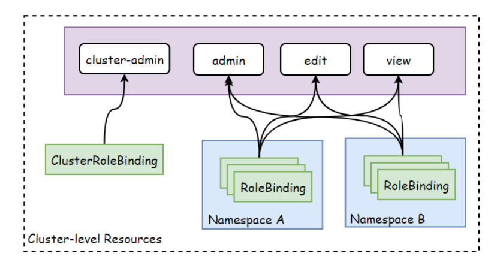

#### 4.4.1 Cluster-admin分析

内置的cluster-admin资源拥有管理集群所有资源的权限，而内置的cluster-admin将该 角色分配给了system:master组，这意味着所有加入该组的用户都将自动具有集群的超级管 理员权限。 www.xuliangwei.com 在使用 kubeadm 安装集群时，它自动创建配置文件/etc/kubernetes/admin.conf中 定义的用户为kubernetes-admin，而该用户使用数字证书，Subject属性值 为/O=system:masters。所以API Server会在成功验证该用户的身份之后将其识别为 system:master 用户组的成员。

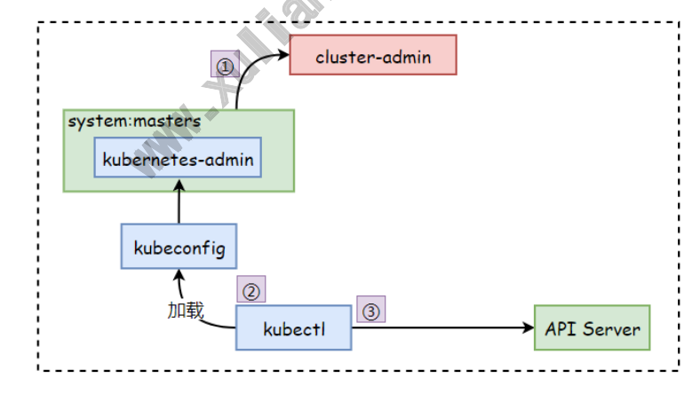

分析过程如下： 1、查看 cluster-admin 角色的绑定关系，可以看到cluster-admin这个角色绑定的 system.masters；

```
[root@master ~]# kubectl get clusterrolebinding  cluster-admin -o yaml apiVersion: rbac.authorization.k8s.io/v1 kind: ClusterRoleBinding metadata: name: cluster-admin roleRef: apiGroup: rbac.authorization.k8s.io kind: ClusterRole name: cluster-admin subjects:

- apiGroup: rbac.authorization.k8s.io

kind: Group name: system:masters 2、system:masters这个组名称并非人为定义，而是证书生成的 www.xuliangwei.com [root@master ~]# openssl x509 -in /etc/kubernetes/pki/apiserver- kubelet-client.crt -text -noout Certificate: Data: Version: 3 (0x2) Serial Number: 4864477754044687796 (0x438218be839fa5b4) Signature Algorithm: sha256WithRSAEncryption Issuer: CN=kubernetes Validity Not Before: Mar 24 11:04:36 2022 GMT Not After : Mar 24 11:04:36 2023 GMT Subject: O=system:masters, CN=kube-apiserver-kubelet- client 注意：在创建证书时，可以将用户绑定到system:masters组；用户会自动继承组的权限；
```
#### 4.4.2 Cluster-admin实践

创建一个sb用户，然后将该用户加入到system:masters组中，验证是否拥有集群管理员权 限； 1、创建证书私钥文件 [root@master ~]# mkdir /root/.certs -p [root@master ~]# (umask 077; openssl genrsa -out /root/.certs/sb.key 2048)

```
2、创建证书签署请求文件，CN为指定的用户名，O为指定的组名称。 [root@master ~]# openssl req -new \ -key /root/.certs/sb.key \ -out /root/.certs/sb.csr \ -subj "/CN=sb/O=system:masters" 3、使用kubernetes-ca的身份对文件进行签署。 [root@master ~]# openssl x509 -req -days 3650 \ -in /root/.certs/sb.csr \ -CA /etc/kubernetes/pki/ca.crt \ -CAkey /etc/kubernetes/pki/ca.key \ -CAcreateserial \ -out /root/.certs/sb.crt 4、根据x509数字证书及私钥创建身份凭据。 www.xuliangwei.com [root@master ~]# kubectl config set-credentials sb \ Վʔclient-certificate=/root/.certs/sb.crt \ Վʔclient-key=/root/.certs/sb.key \ Վʔembed-certs=true 5、配置context上下文，已oldxu身份凭据访问已定义的Kubernetes集群，context名称 为oldxu@kubernetes [root@master ~]# kubectl config set-context sb@kubernetes \ Վʔcluster=kubernetes \ Վʔuser=sb 6、测试oldxu是否具备超级管理员权限。 [root@master ~]# kubectl get nodes Վʔcontext="sb@kubernetes" [root@master ~]# kubectl get pod Վʔcontext="sb@kubernetes" [root@master ~]# kubectl get pod -n kube-system  Վʔ context="sb@kubernetes" [root@master ~]# kubectl delete pod mall Վʔcontext="sb@kubernetes"
```
## 5.认证与授权实践

### 5.1 Dashboard介绍

Kubernetes Dashboard项目为Kubernetes集群提供了一个基于Web的UI，支持集群管 理，应用部署及故障排查等功能。Dashboard是以Pod方式运行在集群上，项目包含了前端和 后端两个组件 前端：运行于客户端浏览器，它使用标准的HTTP/TTPS方法，将请求发送到后端并从后 端获取业务数据。 后端：负责接收前端的请求，将数据请求发送到远程后端 （例如Kubernetes API Server）来实现业务逻辑。

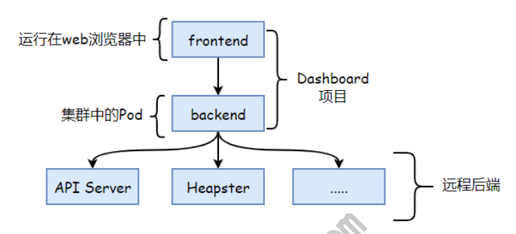

### 5.2 Dashboard安装

```
1、使用官网默认清单文件安装，该清单文件仅提供了项目运行的最小权限，并强制启用了 HTTPS协议 [root@k8s-master ~]# kubectl apply -f https:Վˌraw.githubusercontent.com/kubernetes/dashboard/v2.3.1/aio/ deploy/recommended.yaml 2、部署完Dashboard支持多种不同的访问方式，这里采用NodePort方式，通过节点端口进 行访问。 [root@k8s-master ~]# kubectl path svc kubernetes-dashboard -p '{"spec":{"type":"NodePort"}}' -n kubernetes-dashboard # 检查端口 [root@master ~]# kubectl get service -n kubernetes-dashboard NAME                        TYPE        CLUSTER-IP      EXTERNAL- IP   PORT(S)         AGE dashboard-metrics-scraper   ClusterIP   10.96.1.49      <none> 8000/TCP        48d kubernetes-dashboard        NodePort    10.96.169.230   <none> 443:32508/TCP   1m
```
3、通过任意节点的IP + 32508 端口访问 Dashboard，要使用 https协议；

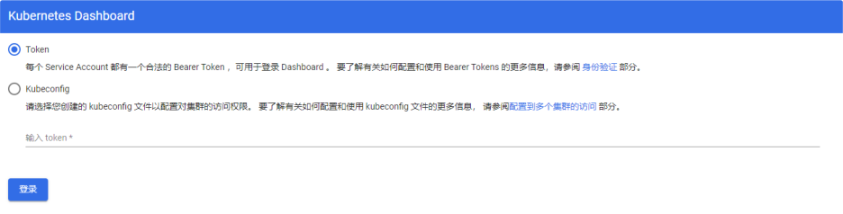

### 5.3 Dashboard认证与授权

Dashboard自身并不进行任何形式的身份验证和鉴权，它仅是把用户提交的身份凭据转发至 后端的APIServer完成验证，资源的操作请求及权限检查也会提交至后端的APIServer进 行。

#### 5.3.1 基于Token认证与授权-1

```
场景：创建一个ServiceAccount管理员账户，然后通过Dashboard的Token方式进行认 www.xuliangwei.com 证。 1、创建ServiceAccount，名称为ui-admin-oldxu [root@master ~]# kubectl create serviceaccount ui-admin-oldxu -n kubernetes-dashboard 2、将SA账户通过ClusterRoleBinding绑定到cluster-admin集群角色上，以便用户拥 有集群管理员权限。 [root@master ~]# kubectl create clusterrolebinding ui-admin-oldxu \ Վʔclusterrole=cluster-admin \ Վʔserviceaccount=kubernetes-dashboard:ui-admin-oldxu 3、获取ServiceAccount对应用户的Token信息 [root@master ~]# kubectl describe sa ui-admin-oldxu -n kubernetes- dashboard Name:                ui-admin-oldxu Namespace:           kubernetes-dashboard Labels:              <none> Annotations:         <none> Image pull secrets:  <none> Mountable secrets:   ui-admin-oldxu-token-hmsls Tokens:              ui-admin-oldxu-token-hmsls

Events:              <none> # Token在ui-admin-oldxu-token-hmsls的Secret字段中存储； [root@master ~]# kubectl describe secrets ui-admin-oldxu-token- hmsls -n kubernetes-dashboard Name:         ui-admin-oldxu-token-hmsls Data ==== ca.crt:     1099 bytes namespace:  20 bytes token: eyJhbGciOiJSUzI1NiIsImtpZCI6IjE3Y3R4OHJSTXJqWlFLaEVNYks3RzdqTGVnbl FwYkRpQmo4QzJoYU5FbzgifQ.eyJpc3MiOiJrdWJlcm5ldGVzL3NlcnZpY2VhY2Nvd W50Iiwia3ViZXJuZXRlcy5pby9zZXJ2aWNlYWNjb3VudC9uYW1lc3BhY2UiOiJrdWJ lcm5ldGVzLWRhc2hib2FyZCIsImt1YmVybmV0ZXMuaW8vc2VydmljZWFjY291bnQvc 2VjcmV0Lm5hbWUiOiJ1aS1hZG1pbi1vbGR4dS10b2tlbi1obXNscyIsImt1YmVybmV 0ZXMuaW8vc2VydmljZWFjY291bnQvc2VydmljZS1hY2NvdW50Lm5hbWUiOiJ1aS1hZ G1pbi1vbGR4dSIsImt1YmVybmV0ZXMuaW8vc2VydmljZWFjY291bnQvc2VydmljZS1 www.xuliangwei.com hY2NvdW50LnVpZCI6IjY2NDg1MmY2LWNkZTUtNGRkYy1iZjMwLTI1YmY5MzQ5ODM5Z SIsInN1YiI6InN5c3RlbTpzZXJ2aWNlYWNjb3VudDprdWJlcm5ldGVzLWRhc2hib2F yZDp1aS1hZG1pbi1vbGR4dSJ9.UKlmY63c4sai7z49zdd98E1DVHvpYZtYixpR- dES762W4h5anc- yDJG1qVxAecCxyTKHFINzXJDj5PqhfErRpnK8vKFORC6sNAoWDr6lTBL- VnJ6Ww9DEZ9uiFSz3oKkzurtVGN32h34QdpbBryuQBfA5CdXYwpkzgZBXyjxbqnWn0 TY-2WdrD_Xjki- UwfylnbE_zYXgBwR0M45Bbwi806EjvzarnpuboolqSoxHiIWpHHAeH20vX8kkCmins z8F6W_yPYFVT4MW2oNnC6-EdA1RVEFRZ0DJ87svUYyk- LdXzwQMa6mGD36TgE7FlohQOIQj1ptjziGGN9KZK8OZw 4、访问UI测试用户权限
```
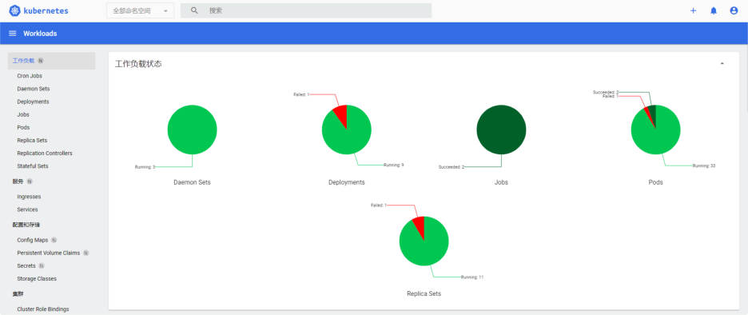

#### 5.3.2 基于Token认证与授权-2

```
场景：创建一个名称空间管理员账号；通过token方式认证； 1、创建ServiceAccount，名称为ui-default-oldxu [root@master ~]# kubectl create serviceaccount ui-default-oldxu -n kubernetes-dashboard 2、将SA账户通过RoleBinding绑定到cluster-admin集群角色上，以便用户拥有集群管理 员权限。 [root@master ~]# kubectl create rolebinding ui-default-oldxu \ Վʔclusterrole=cluster-admin \ Վʔserviceaccount=kubernetes-dashboard:ui-default-oldxu Վʔnamespace=default 3、获取ServiceAccount对应用户的Token信息 www.xuliangwei.com [root@master ~]# kubectl describe sa ui-default-oldxu -n kubernetes-dashboard Name:                ui-default-oldxu Namespace:           kubernetes-dashboard Mountable secrets:   ui-default-oldxu-token-pz97g Tokens:              ui-default-oldxu-token-pz97g # Token在ui-default-oldxu-token-pz97g的Secret字段中存储； [root@master ~]# kubectl describe secrets ui-default-oldxu-token- pz97g -n kubernetes-dashboard Name:         ui-default-oldxu-token-pz97g Namespace:    kubernetes-dashboard Type:  kubernetes.io/service-account-token Data ==== ca.crt:     1099 bytes namespace:  20 bytes

token: eyJhbGciOiJSUzI1NiIsImtpZCI6IjE3Y3R4OHJSTXJqWlFLaEVNYks3RzdqTGVnbl FwYkRpQmo4QzJoYU5FbzgifQ.eyJpc3MiOiJrdWJlcm5ldGVzL3NlcnZpY2VhY2Nvd W50Iiwia3ViZXJuZXRlcy5pby9zZXJ2aWNlYWNjb3VudC9uYW1lc3BhY2UiOiJrdWJ lcm5ldGVzLWRhc2hib2FyZCIsImt1YmVybmV0ZXMuaW8vc2VydmljZWFjY291bnQvc 2VjcmV0Lm5hbWUiOiJ1aS1kZWZhdWx0LW9sZHh1LXRva2VuLXB6OTdnIiwia3ViZXJ uZXRlcy5pby9zZXJ2aWNlYWNjb3VudC9zZXJ2aWNlLWFjY291bnQubmFtZSI6InVpL WRlZmF1bHQtb2xkeHUiLCJrdWJlcm5ldGVzLmlvL3NlcnZpY2VhY2NvdW50L3NlcnZ pY2UtYWNjb3VudC51aWQiOiI2YmFhNjBlMC1mMjVkLTQ3MzEtOTI3NS0yOTUyOTljM DczY2IiLCJzdWIiOiJzeXN0ZW06c2VydmljZWFjY291bnQ6a3ViZXJuZXRlcy1kYXN oYm9hcmQ6dWktZGVmYXVsdC1vbGR4dSJ9.YfT- WOPYcOvEOQRxpSzZvCf4G7fk36GYqIxMOtHAtxFyZg4QxQfbop85U8Ca7PK- SIPLqxuPXfMEdKmw-QE-Tk- yvX17xHx0k15GD783jdRi2kRGUV78n_q1ynpUI03qXFsLxDzLFWYIDXa5t0_dgdgaO Fh0GiSrVz5tOTSNlPT75QHGLhGx3osCHyuAL8uLyA- j2XJ1ajekHvpgfADTiIy8abJomiaUKqsg48hl8uf5DAEj5ygFWVN6ImBwbmHSkeYOP m7EVxadTiRNpUbWpo-PlQKQAcGAL7e_dps525YgZUkteaOqSUqpTD- TxVZZD44lv4pRXzhTEkvZlZrlFA www.xuliangwei.com 4、访问UI，测试用户是否仅对Default名称空间所有资源有权限；
```
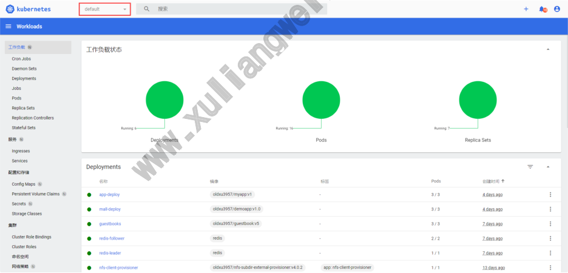

#### 5.3.3 基于kubeconfig认证授权

每次访问Dashboard之前都要先通过命令获取令牌是件相当繁琐的事情，更简单的办法就是 依该身份凭据创建出一个专用于kubeconfig文件并存储至客户端，随后登录时在浏览器中通 过本地路径加载该文件即可。 但是创建的kubeconfig不可以直接使用/root/.kube/config文件，因为它不是 ServiceAccount，而是UserAccount 1、创建ServiceAccount用户，并分配对应的权限（也可以使用之前的SA账户）

```
[root@master ~]# kubectl create serviceaccount ui-cluster-admin -n kubernetes-dashboard [root@master ~]# kubectl create clusterrolebinding ui-cluster- admin  \ Վʔclusterrole=cluster-admin \ Վʔserviceaccount=kubernetes-dashboard:ui-cluster-admin 2、创建kubeconfig配置文件，设定集群信息 [root@master ~]# kubectl config set-cluster UI \ Վʔcertificate-authority=/etc/kubernetes/pki/ca.crt \ Վʔserver="https:Վˌ10.0.0.201:6443" \ Վʔkubeconfig=/tmp/ui.config \ Վʔembed-certs=true 3、添加身份凭据 # 提取ServiceAccount对应的Secret名称，而后基于名称提取对应的TOKEN值 www.xuliangwei.com [root@master ~]# ADMIN_SECRET=$(kubectl get secrets -n kubernetes- dashboard  | awk '/^ui-cluster-admin/{print $1}') # 这种方式需要通过base64解码 [root@master ~]# ADMIN_TOKEN=$(kubectl get secrets $ADMIN_SECRET - n kubernetes-dashboard -o jsonpath='{.data.token}' |base64 -d) # 基于ServiceAccount名称，以及对应的Token，创建身份凭据 [root@master ~]# kubectl config set-credentials ui-cluster-admin \ Վʔtoken=$ADMIN_TOKEN \ Վʔkubeconfig=/tmp/ui.config 4、将对应的用户凭据与Kubernetes集群建立映射关系 [root@master ~]# kubectl config set-context ui-cluster-admin@UI \ Վʔcluster=UI \ Վʔuser=ui-cluster-admin \ Վʔkubeconfig=/tmp/ui.config 5、设置当前上下文为ui-cluster-admin@UI [root@master ~]# kubectl config use-context ui-cluster-admin@UI Վʔ kubeconfig=/tmp/ui.config 6、导出配置文件，登录并测试。
```
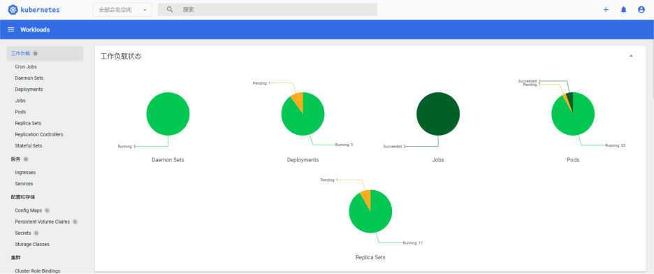

## 6.准入控制

ApIServer中准入控制器是以插件形式存在的，它们会拦截所有已完成认证的用户，且与资 源创建、更新删除操作相关的请求。 www.xuliangwei.com 通过APIServer启用的准入控制插件，然后强制实现定义的功能，比如：对象的语义验证、 以及设置缺失字段的默认值等Kubernetes通过ResourceQuota以及LimitRange准入控制 器，可以为多租户或多项目的集群环境提供资源配额与限制。

## 7.ResoucesQuta

### 7.1 资源配额介绍

当系统存在多个用户或团队共享具有固定节点的Kubernetes集群时，一般会根据不同团队创 建不同的命名空间，但可能会出现某个应用将该命名空间的CPU或内存耗尽的情况，无法保证 其公平分配原则。可以通过ResourceQuotas资源配额来解决这个问题。ResourceQuota 主要是对每个命名空间的资源使用总量设定限制。 1、它可以限制命名空间中某种类型的对象的所创建的总数进行限制； 2、也可以限制命名空间中Pod可以使用的CPU或内存内存资源的总上限； 情景1： 当用户在命名空间下创建资源（如 Pod、Service 等）时，Kubernetes 的配额会跟踪集 群的资源使用情况，以确保使用的资源用量不超过 ResourceQuota 中定义的资源限额。如 果资源创建或者更新请求违反了配额约束，那么该请求会报错（HTTP 403 FORBIDDEN）， 并在消息中给出违反的信息描述。 情景2：

如果命名空间下的计算资源 （如 cpu 和 memory）的配额被启用，则用户必须为这些资源 设定（requests）和（limit），否则配额系统将拒绝 Pod 的创建。 提示: 可使用 LimitRange 准入控制器来为没有设置计算资源的 Pod 设置默认值。

### 7.2 配额策略示例

在具有 32 GiB 内存和 16 核 CPU 资源的集群中， 1、允许 A 团队使用 20 GiB 内存 和 10 核的 CPU 资源， 2、允许 B 团队使用 10 GiB 内存和 4 核的 CPU 资源， 3、预留 2 GiB 内存和 2 核的 CPU 资源供将来分配。 限制 "test" 命名空间使用 1 核 CPU 资源和 1GiB 内存。允许 "prod" 命名空间使用 任意数量。 当集群容量小于各命名空间配额总和的情况下，可能存在资源竞争。资源竞争时， Kubernetes 系统会遵循先到先得的原则。但不管是资源竞争还是配额修改，都不会影响已 经创建的资源使用对象。

### 7.3 计算资源配额示例

用户可以对给定命名空间下的可被请求的 计算资源 总量进行限制。 资源名称 描述 requests.cpu 所有非终止状态的 Pod，其 CPU 申请的总量不能超过该值。 requests.memory 所有非终止状态的 Pod，其 内存 申请的总量不能超过该值。 limits.cpu 所有非终止状态的 Pod，其 CPU 运行期间限制总量不能超过该 值。 limits.memory 所有非终止状态的 Pod，其 内存 运行期间限制总量不能超过该 值。 示例代码

```
apiVersion: v1 kind: ResourceQuota metadata: name: mem-cpu-demo namespace: ops spec: hard: requests.cpu: "1"       # 在该命名空间中所有 Pod 的 CPU 申请总和不 能超过 1 cpu。 requests.memory: 1Gi    # 在该命名空间中所有 Pod 的 内存 申请总和不 能超过 1 GiB。
```
limits.cpu: "2"         # 在该命名空间中所有 Pod 的 CPU 限制总和不 能超过 2 cpu。 limits.memory: 2Gi      # 在该命名空间中所有 Pod 的 内存 限制总和不 能超过 2 GiB。 www.xuliangwei.com

### 7.4 存储资源配额示例

用户可以对指定的命名空间下的存储资源总量进行限制。此外，还可以根据相关的存储类 （Storage Class）来限制存储资源的消耗。 资源名称 描述 requests.storage 所有PVC存储资源的需求总 量不能超过该值。 persistentvolumeclaims 3 在该命名空间中所允许的 PVC 总数量。 与 <storage-class- name> 相关的pvc，存储 请求的总和不能超过该值。 <storage-class-name>.storageclass.storage.k8s.io/requests.storage 与 <storage-class- name> 相关的pvc，可以 存在的 pvc 总数。 <storage-class-name>.storageclass.storage.k8s.io/persistentvolumeclaims 示例代码

```
apiVersion: v1 kind: ResourceQuota metadata: name: storage-demo namespace: ops spec: hard: requests.storage: 500Gi         # 总共可以申请的pvc总量 persistentvolumeclaims: 20      # 命名空间中总共能申请的pvc数量 nfs.storageclass.storage.k8s.io/requests.storage: 100Gi     # 对nfs存储类型限制100G的申请 gfs.storageclass.storage.k8s.io/requests.storage: 100Gi     # 对gfs存储类型限制1000G的申请
```
### 7.5 对象数量配额示例

当使用 countՎˇ 资源配额时，如果对象存在于服务器存储中，则会根据配额管理资源。 这 www.xuliangwei.com 些类型的配额有助于防止存储资源耗尽。例如， 用户可能想根据服务器的存储能力来对服务器中 Secret 的数量进行配额限制，集群中 存在过多的 Secret 实际上会导致服务器和控制器无法启动。 用户可以选择对 Job 进行配额管理，以防止配置不当的 CronJob 在某命名空间中创 建太多 Job 而导致集群拒绝服务。

资源名称 描述 configmaps 在该命名空间中允许存在的 ConfigMap 总数上限。 persistentvolumeclaims 在该命名空间中允许存在的 PVC 的总数上限。 pods 在该命名空间中允许存在的非终止状态的 Pod 总数上 限。包含（Failed, Succeeded） resourcequotas 在该命名空间中允许存在的 ResourceQuota 总数上 限。 services 在该命名空间中允许存在的 Service 总数上限。 services.loadbalancers 在该命名空间中允许存在的 LoadBalancer 类型的 Service 总数上限。 services.nodeports 在该命名空间中允许存在的 NodePort 类型的 Service 总数上限。 secrets 在该命名空间中允许存在的 Secret 总数上限。

### 7.6 计算资源配置实践

```
1、创建一个名称空间，以便创建的资源和集群的其余资源相隔离。 [root@master ~]# kubectl create namespace ops 2、创建清单示例文件 [root@master rq]# cat 01-quota-mem-cpu.yaml apiVersion: v1 kind: ResourceQuota metadata: name: mem-cpu-demo-1 namespace: ops spec: hard: requests.cpu: "1"       # 在该命名空间中所有 Pod 的 CPU 申请总和不 能超过 1 cpu。 www.xuliangwei.com requests.memory: 1Gi    # 在该命名空间中所有 Pod 的 内存 申请总和不 能超过 1 GiB。
```
limits.cpu: "2"         # 在该命名空间中所有 Pod 的 CPU 限制总和不 能超过 2 cpu。 limits.memory: 2Gi      # 在该命名空间中所有 Pod 的 内存 限制总和不 能超过 2 GiB。

3.查看RequestsQuota配合详情

```
[root@master rq]# kubectl get resourcequota -n ops NAME             AGE     REQUEST LIMIT mem-cpu-demo-1   2m15s   requests.cpu: 0/1, requests.memory: 0/1Gi limits.cpu: 0/2, limits.memory: 0/2Gi [root@master rq]# kubectl describe  resourcequota -n ops Name:            mem-cpu-demo-1 Namespace:       ops Resource         Used  Hard --------         ----  ---- limits.cpu       0     2 limits.memory    0     2Gi requests.cpu     0     1 requests.memory  0     1Gi

3、创建第一个Pod，申请400m的cpu，最大限制800m。 申请600Mi的内存，最大限制 800Mi。 [root@master rq]# cat 02-pod-quota-mem-cpu-1.yaml apiVersion: v1 kind: Pod metadata: name: pod-demo-1 namespace: ops spec: containers:

image: nginx:1.16 resources: requests: cpu: "400m" memory: "600Mi" limits: www.xuliangwei.com cpu: "800m" memory: "800Mi" 4、检查ResourceQuotas [root@master rq]# kubectl describe  resourcequota -n ops Name:            mem-cpu-demo-1 Namespace:       ops Resource         Used   Hard --------         ----   ---- limits.cpu       800m   2 limits.memory    800Mi  2Gi requests.cpu     400m   1 requests.memory  600Mi  1Gi 5、创建第二个Pod，申请400m的cpu，最大限制800m。 申请700Mi的内存，最大限制 1Gi。 [root@master rq]# cat 03-pod-quota-mem-cpu-2.yaml apiVersion: v1 kind: Pod metadata: name: pod-demo-2 namespace: ops spec:

containers:

image: nginx:1.16 resources: requests: cpu: "400m" memory: "700Mi" limits: cpu: "800m" memory: "1Gi" 6、可以看到 Pod 的内存请求为 700 MiB。 注意新的内存请求与已经使用的内存请求之 和超过了内存请求的配额： 600 MiB + 700 MiB > 1 GiB，所以无法创建，提示内存溢 出； [root@master rq]# kubectl apply -f 03-pod-quota-mem-cpu-2.yaml Error from server (Forbidden): error when creating "03-pod-quota- mem-cpu-2.yaml": pods "pod-demo-2" is forbidden: exceeded quota: www.xuliangwei.com mem-cpu-demo-1, requested: requests.memory=700Mi, used: requests.memory=600Mi, limited: requests.memory=1Gi 7、如果Pod没有设定requests和limits则会报错。但可以通过limitRange来设定默认的 requests和limits； [root@master rq]# kubectl run tools Վʔimage=oldxu3957/tools -n ops Error from server (Forbidden): pods "tools" is forbidden: failed quota: mem-cpu-demo-1: must specify limits.cpu,limits.memory,requests.cpu,requests.memory
```
### 7.7 存储资源配置实践

```
1、创建资源清单文件 [root@master rq]# cat 04-quota-storage.yaml apiVersion: v1 kind: ResourceQuota metadata: name: storage-demo namespace: ops spec: hard: requests.storage: 10Gi persistentvolumeclaims:

nfs-provisioner- storage.storageclass.storage.k8s.io/requests.storage: 8Gi nfs-provisioner- storage.storageclass.storage.k8s.io/persistentvolumeclaims: 2 nfs-storage.storageclass.storage.k8s.io/requests.storage: 5Gi #（nfs-provisioner-storage + nfs-storage） 总容量不能超过总限制10Gi，总 申请条目不允许超过3条； # nfs-provisioner-storage类型的pvc申请总和不能超过8G，并PVC条目不允许超过 2； # nfs-storage类型的pvc申请总和不能超过5G； 2、查看状态 Name: storage-demo Namespace: ops www.xuliangwei.com Resource Used  Hard -------- ----  ---- nfs-provisioner- storage.storageclass.storage.k8s.io/persistentvolumeclaims  0 2 nfs-provisioner- storage.storageclass.storage.k8s.io/requests.storage        0 8Gi nfs-storage.storageclass.storage.k8s.io/requests.storage
```
persistentvolumeclaims

requests.storage

2、创建第一个pvc申请，类型为nfs-storage，申请5Gi

```
[root@master rq]# cat 05-pvc-quota-storage-1.yaml apiVersion: v1 kind: PersistentVolumeClaim metadata: name: pvc-demo-0 namespace: ops spec: storageClassName: "nfs-storage" accessModes:

resources: requests: storage: 5Gi 3、创建第二个pvc申请，先申请3Gi，然后申请2Gi，最后申请1Gi。 [root@master rq]# cat 06-pvc-quota-storage-2.yaml www.xuliangwei.com apiVersion: v1 kind: PersistentVolumeClaim metadata: name: pvc-demo-1 namespace: ops spec: storageClassName: "nfs-provisioner-storage" accessModes:

resources: requests: storage: 3Gi ՎՎʕ apiVersion: v1 kind: PersistentVolumeClaim metadata: name: pvc-demo-2 namespace: ops spec: storageClassName: "nfs-provisioner-storage" accessModes:

resources: requests: storage: 2Gi

ՎՎʕ apiVersion: v1 kind: PersistentVolumeClaim metadata: name: pvc-demo-3 namespace: ops spec: storageClassName: "nfs-provisioner-storage" accessModes:

resources: requests: storage: 1Gi 4、第一个pvc会申请成功，第二个pvc也会申请成功，第三个pvc会申请失败。（首先超过了 pvc最大的申请数量，同时申请的容量也超过了最大的限制；） www.xuliangwei.com [root@master rq]# kubectl apply -f 06-pvc-quota-storage-2.yaml persistentvolumeclaim/pvc-demo-1 created persistentvolumeclaim/pvc-demo-2 created Error from server (Forbidden): error when creating "06-pvc-quota- storage-2.yaml": persistentvolumeclaims "pvc-demo-3" is forbidden: exceeded quota: storage-demo, requested: nfs-provisioner- storage.storageclass.storage.k8s.io/persistentvolumeclaims=1,persi stentvolumeclaims=1,requests.storage=1Gi, used: nfs-provisioner- storage.storageclass.storage.k8s.io/persistentvolumeclaims=2,persi stentvolumeclaims=3,requests.storage=10Gi, limited: nfs- provisioner- storage.storageclass.storage.k8s.io/persistentvolumeclaims=2,persi stentvolumeclaims=3,requests.storage=10Gi
```
### 7.8 对象数量配置实践

count/<resource>.<group>：用于非核心（core）组的资源，比如Ingress count/<resource>：用于核心组的资源 1、创建资源清单

```
[root@master rq]# cat 07-quota-counts.yaml apiVersion: v1 kind: ResourceQuota metadata: name: count-demo namespace: ops spec: hard: count/pods: 2 count/deployments.apps: 2 count/services: 2 count/ingresses.networking.k8s.io: 1 2、创建一个Deployment，副本数为1，然后创建Service以及Ingress资源 [root@master rq]# cat 08-quota-counts-1.yaml apiVersion: apps/v1 www.xuliangwei.com kind: Deployment metadata: name: nginx namespace: ops spec: replicas: 1 selector: matchLabels: app: nginx template: metadata: labels: app: nginx spec: containers:

name: nginx ՎՎʕ apiVersion: v1 kind: Service metadata: name: nginx-svc namespace: ops spec: selector: app: nginx

ports:

- port:

targetPort: 80 ՎՎʕ apiVersion: networking.k8s.io/v1 kind: Ingress metadata: name: nginx-ingress namespace: ops spec: ingressClassName: "nginx" rules:

- host: nginx.oldxu.net

http: paths:

- path: /

pathType: Prefix www.xuliangwei.com backend: service: name: nginx-svc port: number: 80 3、检查ResourceQuotas使用资源情况 [root@master rq]# kubectl describe resourcequota -n ops Name:                              count-demo Namespace:                         ops Resource                           Used  Hard --------                           ----  ---- count/deployments.apps             1     2 count/ingresses.networking.k8s.io  1     1 count/pods                         1     2 count/services                     1     2 4、在创建一个Deployment，Pod副本数为1，然后创建Service以及Ingress资源 [root@master rq]# cat 09-quota-counts-2.yaml apiVersion: apps/v1 kind: Deployment metadata: name: nginx-2

namespace: ops spec: replicas: 1 selector: matchLabels: app: nginx-2 template: metadata: labels: app: nginx-2 spec: containers:

name: nginx ՎՎʕ apiVersion: v1 kind: Service metadata: www.xuliangwei.com name: nginx-2-svc namespace: ops spec: selector: app: nginx-2 ports:

- port:

targetPort: 80 ՎՎʕ apiVersion: networking.k8s.io/v1 kind: Ingress metadata: name: nginx-2-ingress namespace: ops spec: ingressClassName: "nginx" rules:

- host: nginx-2.oldxu.net

http: paths:

- path: /

pathType: Prefix backend: service:

name: nginx-2-svc port: number: 80 5、应用yaml文件，发现无法创建Ingress，因为限制该名称空间最多创建一个Ingress [root@master rq]# kubectl apply -f 09-quota-counts-2.yaml deployment.apps/nginx-2 created service/nginx-2-svc created Error from server (Forbidden): error when creating "09-quota- counts-2.yaml": ingresses.networking.k8s.io "nginx-2-ingress" is forbidden: exceeded quota: count-demo, requested: count/ingresses.networking.k8s.io=1, used: count/ingresses.networking.k8s.io=1, limited: count/ingresses.networking.k8s.io=1
```
## 8.LimitRanage

### 8.1 LimitRange

ResourceQuota可以对名称空间资源总使用量进行限制。但可能会出现一个Pod申请的CPU 或内存设定非常大，从而将该名称空间中的可用资源被某个Pod所耗尽，所以可以通过 LimitRange来限制名称空间中的每个Pod或每个Container的最大资源、最小资源。如果创 建Pod没有给定对应的resources字段，还可以设定默认值进行自动填充。 limitrange示例代码 apiVersion: v1 kind: LimitRange metadata: name: mylimits spec: limits:

- type: Pod               # 针对Pod资源（一个Pod可以有多个

```
Container） max:                    # Pod最大能申请的资源大小 cpu: "2" memory: 2Gi min:                    # Pod最低申请的资源大小 cpu: 200m memory: 6Mi

- type: Container
```
default:                #默认容器未指定资源限制，为该容器提供默认的 Limits cpu: 300m memory: 200Mi defaultRequest:         # 默认容器未指定资源请求，为该容器提供默认的 Requests cpu: 200m memory: 100Mi max:                    # 容器能指定的最大资源申请 cpu: "1" memory: 1Gi min:                    # 容器申请时，最低申请的资源大小，低于该大小 则报错； cpu: 100m memory: 3Mi # Limits与Requests的比例值不能超过 maxLimitRequestRatio:  # Requests和limits比率，公式： www.xuliangwei.com Limits/Requests ≤ maxLimitRequestRatio cpu: 5 memory:

### 8.3 LimitRange限制场景-1

```
场景说明：为名称空间中未指定Resources字段的Pod资源，设定默认的requests和 limits。 1、创建LimitRange资源限制 [root@master limitrange]# cat 01-limitrange-cpumem.yaml apiVersion: v1 kind: LimitRange metadata: name: limitrange-mem-1 namespace: ops spec: limits:

- default:

memory: 256Mi cpu: 200m defaultRequest: memory: 128Mi cpu: 100m

type: Container 2、查看limitrange详情 [root@master limitrange]# kubectl describe limitranges -n ops Name:       limitrange-mem-1 Namespace:  ops Type        Resource  Min  Max  Default Request  Default Limit Max Limit/Request Ratio ----        --------  ՎՎʕ  ՎՎʕ  ---------------  -------------  Վʔ --------------------- Container   cpu       -    -    100m             200m           - Container   memory    -    -    128Mi            256Mi          - 3、创建一个Pod，并且在Pod中不申明任何的cpu与内存的Requests和limits。 [root@master limitrange]# cat 02-pod-cpu-mem-1.yaml apiVersion: v1 www.xuliangwei.com kind: Pod metadata: name: pod-cpu-mem-demo-1 namespace: ops spec: containers:

image: nginx:1.16 4、查看Pod的默认Requests和Limits [root@master ~]# kubectl get  pod pod-cpu-mem-demo-1 -oyaml -n ops spec: containers:

imagePullPolicy: IfNotPresent name: nginx resources: limits: cpu: 200m               # Pod能使用的最大CPU为200m memory: 256Mi           # Pod能使用的最大内存为256Mi requests: cpu: 100m               # 默认申请的cpu为100m memory: 128Mi           # 默认申请的内存为128Mi
```
### 8.4 LimitRange限制场景-2

```
场景说明：创建容器时，如果指定了容器的limits，而没有指定它的requests会怎么样？ 1、创建Pod的yaml [root@master limitrange]# cat 03-pod-mem-2.yaml apiVersion: v1 kind: Pod metadata: name: pod-mem-demo-2 namespace: ops spec: containers:

image: nginx:1.16 resources: limits:               # 指定Limits字段 www.xuliangwei.com memory: 64Mi cpu: 50m 2、输出结果显示，容器的CPU、内存，对应的Requests被设置为对应的Limits相同值。 spec: containers:

imagePullPolicy: IfNotPresent name: nginx resources: limits: cpu: 50m memory: 64Mi requests: cpu: 50m memory: 64Mi
```
### 8.5 LimitRange限制场景-3

场景说明：声明容器的CPU和内存请求而不声明内存限制会怎么样？ 1、创建Pod的yaml [root@master limitrange]# cat 04-pod-mem-3.yaml apiVersion: v1

```
kind: Pod metadata: name: pod-mem-demo-3 namespace: ops spec: containers:
```
image: nginx:1.16 resources: requests: memory: 32Mi cpu: 30m 2、输出结果显示，所创建的 Pod 中，容器的Requests为 Pod 清单中声明的值。 然而容 器的CPU与内存的Limits被设置为 200m，256Mi，此值是该命名空间的默认内存限制值。 spec: containers: www.xuliangwei.com

```
imagePullPolicy: IfNotPresent name: nginx resources: limits: cpu: 200m memory: 256Mi requests: cpu: 30m memory: 32Mi
```
### 8.6 LimitRange场景示例-4

场景说明：通过LimitRange，限制Pod创建时最小申请的资源（Request），以及Pod运行 期间最大能使用的资源（Limits） 这样就可以将ResourceQuota和LimitRange结合起来，从而避免因某一个Pod超额申请资 源而造成名称空间资源被耗尽； 1、创建LimitRange [root@master limitrange]# cat 01-limitrange-mem.yaml apiVersion: v1 kind: LimitRange metadata: name: limitrange-mem-1

```
namespace: ops spec: limits:

- type: Container

default: memory: 256Mi cpu: 200m defaultRequest: memory: 128Mi cpu: 100m max: cpu: 400m memory: 2048Mi min: cpu: 10m memory: 64Mi 2、创建pod www.xuliangwei.com [root@master limitrange]# cat 05-pod-mem-4.yaml apiVersion: v1 kind: Pod metadata: name: pod-mem-demo-4 namespace: ops spec: containers:

image: nginx:1.16 resources: requests: memory: 32Mi cpu: 10m 3、因为requests的memory不满足最低申请的64Mi，所以无法创建Pod。 [root@master limitrange]# kubectl apply -f 05-pod-mem-4.yaml Error from server (Forbidden): error when creating "05-pod-mem- 4.yaml": pods "pod-mem-demo-4" is forbidden: minimum memory usage per Container is 64Mi, but request is 32Mi
```
### 8.7 LimitRange限制存储

场景说明： 1、使用ResourceQuota限制名称空间中创建的pvc总容量，以及pvc的总数量。 2、然后使用LimitRange限制每个pvc申请的最小容量和最大容量。

```
1、创建ResourceQuotas限制pvc的总容量以及创建的总数量。 [root@master limitrange]# cat 06-resource-storage.yaml apiVersion: v1 kind: ResourceQuota metadata: name: resource-storage namespace: ops spec: hard: www.xuliangwei.com persistentvolumeclaims: "3" requests.storage: "3Gi" 2、创建LimitRange限制最大和最小 [root@master limitrange]# cat 06-limitrange-storage.yaml apiVersion: v1 kind: LimitRange metadata: name: limitrange-storage namespace: ops spec: limits:

- type: PersistentVolumeClaim

min: storage: 1Gi max: storage: 2Gi 3、创建pvc申请

[root@master limitrange]# cat 07-limitrange-pvc.yaml apiVersion: v1 kind: PersistentVolumeClaim metadata: name: limit-pvc namespace: ops spec: storageClassName: "nfs-provisioner-storage" accessModes:

resources: requests: storage: 100Mi 4、请求 100Mi 存储空间的 PVC 将被拒绝，因为它没有达到最小的申请1Gi； [root@master limitrange]# kubectl apply -f 07-limitrange-pvc.yaml www.xuliangwei.com Error from server (Forbidden): error when creating "07-limitrange- pvc.yaml": persistentvolumeclaims "limit-pvc" is forbidden: minimum storage usage per PersistentVolumeClaim is 1Gi, but request is 100Mi
```
