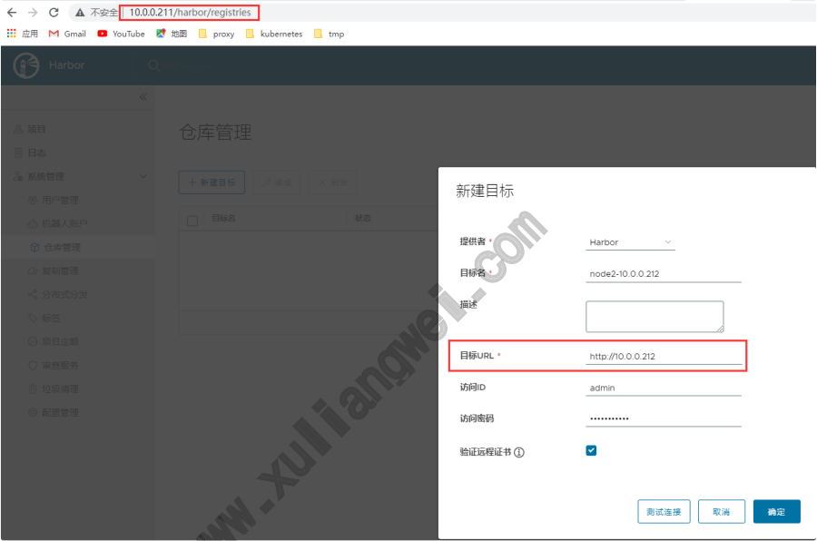
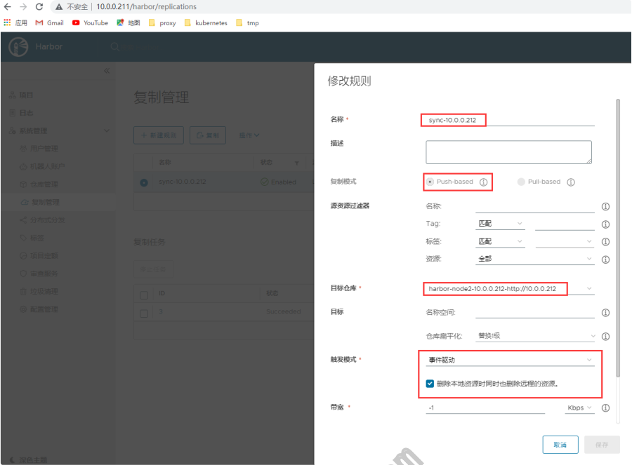
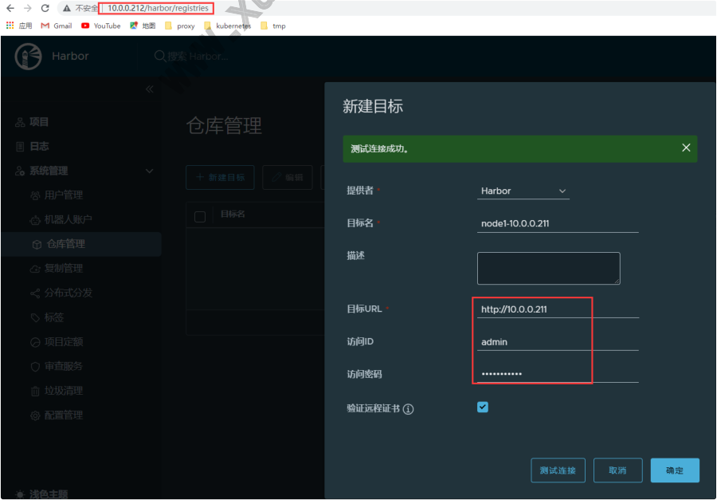
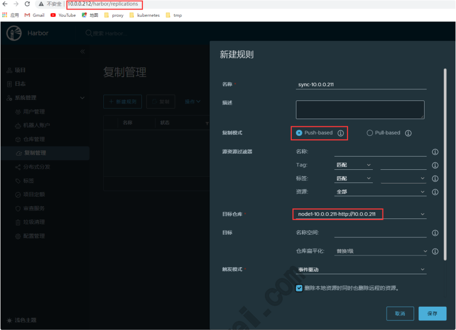
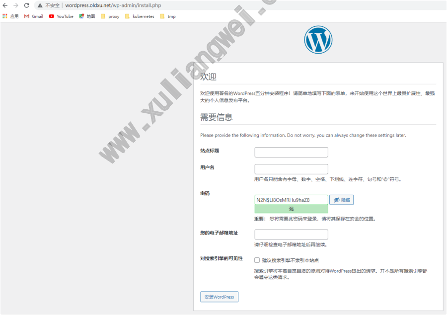
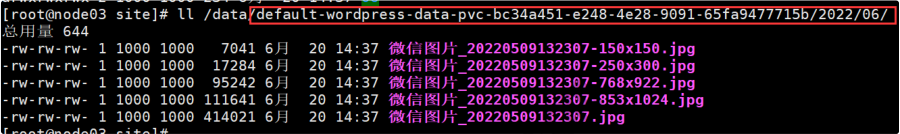

# 17 Kubernetes业务迁移

## 目录

- [1.业务迁移环境准备](#1.业务迁移环境准备)
  - [1.1 迁移概述](#1.1-迁移概述)
  - [1.2 安装Docker](#1.2-安装docker)
  - [1.3 安装Harbor节点1](#1.3-安装harbor节点1)
  - [1.4 安装Harbor节点2](#1.4-安装harbor节点2)
  - [1.5 配置Node1复制规则](#1.5-配置node1复制规则)
  - [1.6 配置Node2复制规则](#1.6-配置node2复制规则)
  - [1.7 测试Harbor双向复制](#1.7-测试harbor双向复制)
  - [1.8 配置Harbor负载均衡](#1.8-配置harbor负载均衡)
- [2.Wordpress服务迁移实践](#2.wordpress服务迁移实践)
  - [2.1 迁移思路](#2.1-迁移思路)
  - [2.2 下载代码](#2.2-下载代码)
  - [2.3 Dockerfile](#2.3-dockerfile)
  - [2.4 运行数据库服务](#2.4-运行数据库服务)
  - [2.5 准备Nginx配置文件](#2.5-准备nginx配置文件)
  - [2.6 准备连接数据库Secret](#2.6-准备连接数据库secret)
  - [2.7 准备pvc共享图片](#2.7-准备pvc共享图片)
  - [2.8 部署Wordpress](#2.8-部署wordpress)
  - [2.9 发布Wordpress](#2.9-发布wordpress)
- [3.SpringBoot服务迁移实践](#3.springboot服务迁移实践)
  - [3.1 下载代码](#3.1-下载代码)
  - [3.2 Dockrfile](#3.2-dockrfile)
  - [3.3 服务发布](#3.3-服务发布)
- [4、通过浏览器访问测试](#4通过浏览器访问测试)

## 1.业务迁移环境准备

### 1.1 迁移概述

有了Kubernetes集群环境之后，我们就可以将原来在传统虚拟机上运 行的业务，迁移到Kubernetes上，让Kubernetes通过容器的方式来 管理。

而一旦我们需要将传统业务使用容器的方式运行起来，就需要构建很多 镜像，那么这些镜像就需要有一个专门的位置存储起来，为我们提供镜 像上传和镜像下载等功能。但我们不能使用阿里云或者DockerHub等 仓库，首先拉取速度比较慢，其次镜像的安全性无法保证，所以就需要 部署一个私有的镜像仓库来管理这些容器镜像。同时该仓库还需要提供 高可用功能，确保随时都能上传和下载可用的容器镜像。

Harbor环境规划 主机名称 IP地址 系统版本 内核版本 CPU 内 存 harbor- proxy

10.0.0.210

CentOS7.9

```
3.10.0-

1160.el7.x86_64 1Core 1G www.xuliangwei.com harbor- node1
```
10.0.0.211

CentOS7.9

```
3.10.0-

1160.el7.x86_64 1Core 1G harbor- node2
```
10.0.0.212

CentOS7.9

```
3.10.0-

1160.el7.x86_64 1Core 1G
```
### 1.2 安装Docker

```
1、安装Docker yum remove docker* yum install -y yum-utils yum-config-manager Վʔadd-repo http:Վˌmirrors.aliyun.com/docker- ce/linux/centos/docker-ce.repo # 安装docker，启动并加入开机自启 yum install docker-ce docker-compose -y systemctl enable docker Վʔnow 2、配置Docker

配置加速，并设定cgroupdriver为systemd mkdir -p /etc/docker tee /etc/docker/daemon.json ՎՎӓ'EOF' { "registry-mirrors": ["https:Վˌq2gr04ke.mirror.aliyuncs.com"], "exec-opts": ["native.cgroupdriver=systemd"] } EOF # 启动docker并加入开机自启动 systemctl daemon-reload ՎҐ systemctl restart docker www.xuliangwei.com
```
### 1.3 安装Harbor节点1

```
1、下载harbor [root@harbor-node1 ~]# wget https:Վˌgithub.com/goharbor/harbor/releases/downl oad/v2.5.1/harbor-offline-installer-v2.5.1.tgz [root@harbor-node1 ~]# tar xf harbor-offline- installer-v2.5.1.tgz [root@harbor-node1 ~]# cd harbor/ 2、配置harbor（如果不适用https，则需要注释相关字段）

[root@harbor-node1 harbor]# cp harbor.yml.tmpl harbor.yml [root@harbor-node1 harbor]# vim harbor.yaml hostname: 10.0.0.211 harbor_admin_password: Harbor12345 http: port: 80 3、启动harbor [root@harbor-node1 harbor]# ./install.sh
```
### 1.4 安装Harbor节点2

```
1、下载harbor [root@harbor-node1 ~]# wget https:Վˌgithub.com/goharbor/harbor/releases/downl oad/v2.5.1/harbor-offline-installer-v2.5.1.tgz [root@harbor-node1 ~]# tar xf harbor-offline- installer-v2.5.1.tgz [root@harbor-node1 ~]# cd harbor/ 2、配置harbor（如果不使用https，则需要注释相关字段） [root@harbor-node1 harbor]# cp harbor.yml.tmpl harbor.yml [root@harbor-node1 harbor]# vim harbor.yaml hostname: 10.0.0.212 harbor_admin_password: Harbor12345 http: port:

3、启动harbor [root@harbor-node1 harbor]# ./install.sh
```
### 1.5 配置Node1复制规则

1、在HarborNode1节点。点击仓库管理Վʘ新建目标，填写 HarborNode2节点信息，然后完成认证。



2、在HarborNode1节点。点击复制管理Վʘ新建规则，只要有push操 作，则将镜像同步给Harbor-Node2节点；



### 1.6 配置Node2复制规则

1、在HarborNode2节点。点击仓库管理Վʘ新建目标，填写 HarborNode1节点信息，然后完成认证。



2、在HarborNode2节点。点击复制管理Վʘ新建规则，只要有push操 作，则将镜像同步给Harbor-Node1节点；



### 1.7 测试Harbor双向复制

```
1、配置Docker，由于Harbor要求https，我们使用http协议，所以 需要添加insecure-registries [root@node03 ~]# cat /etc/docker/daemon.json { "registry-mirrors": ["https:Վˌq2gr04ke.mirror.aliyuncs.com"], "exec-opts": ["native.cgroupdriver=systemd"], "insecure-registries": ["10.0.0.211","10.0.0.212"] } [root@node03 ~]# systemctl daemon-reload [root@node03 ~]# systemctl restart docker

2、将镜像上传至Harbor1，检查Harbor2是否同步成功； [root@node03 ~]# docker login 10.0.0.211 [root@node03 ~]# docker tag nginx:1.20 10.0.0.211/base/nginx:1.20 [root@node03 ~]# docker push 10.0.0.211/base/nginx:1.20 The push refers to repository [10.0.0.211/base/nginx] c75c795b7d44: Pushed 2edcec3590a4: Pushed 1.20: digest: sha256:cba27ee29d62dfd6034994162e71c399b08a84b50a b25783eabc size: 1570 www.xuliangwei.com 3、将镜像上传至Harbor2，检查Harbor1是否同步成功； [root@node03 ~]# docker login 10.0.0.212 [root@node03 ~]# docker tag nginx:1.16 10.0.0.212/base/openjdk:8-jre-alpine [root@node03 ~]# docker push 10.0.0.212/base/openjdk:8-jre-alpine The push refers to repository [10.0.0.212/base/openjdk:8-jre-alpine] c23548ea0b99: Pushed 82068c842707: Pushed c2adabaecedb: Pushed 1.16: digest: sha256:2963fc49cc50883ba9af25f977a9997ff9af06b45c 12d968b7985d54e4b size:
```
### 1.8 配置Harbor负载均衡

```
1、合并证书 [root@harbor-proxy ~]# mkdir /opt/certs [root@harbor-proxy ~]# unzip 7977024_harbor.oldxu.net_nginx.zip -d /opt/certs/ [root@harbor-proxy ~]# cat /opt/certs/7977024_harbor.oldxu.net.pem > /opt/certs/harbor.pem [root@harbor-proxy ~]# cat /opt/certs/7977024_harbor.oldxu.net.key ՎҴ /opt/certs/harbor.pem www.xuliangwei.com 2、安装haproxy [root@harbor-proxy ~]# yum install haproxy -y 3、配置Haproxy负载均衡 [root@harbor-proxy ~]# cat /etc/haproxy/haproxy.cfg ՎՎʢ frontend harbor bind *:80 bind *:443 ssl crt /opt/certs/harbor.pem mode http use_backend harbor_cluster redirect scheme https
if !{ ssl_fc }    # 跳转 至https协议

添加协议头部 http-request set-header X-Forwarded-Proto http
if !{ ssl_fc }

http-request set-header X-Forwarded-Proto https
if { ssl_fc } backend harbor_cluster balance source              # 确保同一节点请求转 发至同一后端服务 server node1 10.0.0.211:80 check port 80 server node2 10.0.0.212:80 check port 80 3、运行服务 [root@harbor-proxy ~]# systemctl enable Վʔnow haproxy www.xuliangwei.com 4、上传镜像至harbor [root@node01 ~]#
echo "10.0.0.210 harbor.oldxu.net" ՎҴ /etc/hosts [root@node01 ~]# docker login harbor.oldxu.net [root@node01 ~]# docker tag  nginx:1.18 harbor.oldxu.net/base/nginx:1.18 [root@node01 ~]# docker push harbor.oldxu.net/base /nginx:1.18 4fa6704c8474: Layer already exists 4fe7d87c8e14: Layer already exists 6fcbf7acaafd: Layer already exists f3fdf88f1cb7: Layer already exists 7e718b9c0c8c: Layer already exists 1.18: digest: sha256:9b0fc8e09ae1abb0144ce57018fc1e13d23abd10f1 35dc83c0ed661081cf size: 1362
```
## 2.Wordpress服务迁移实践

### 2.1 迁移思路

1、制作服务镜像； 1.1 挑选合适的基础镜像； 1.2 准备代码相关的文件； 1.3 通过dockerfile构建镜像； 2、制作Kubernetes服务，并完成调度； 2.1 确定服务运行的模式（内部运行 or 对外提供）； 2.2 确定服务所使用的控制器； 2.3 服务是否需要后端存储pvc； 2.4 服务是否需要配置管理configmap； 2.5 服务是否需要Service、Ingress等； www.xuliangwei.com

### 2.2 下载代码

```
1、下载wordpress代码 [root@node03 ~]# wget https:Վˌcn.wordpress.org/wordpress-6.0- zh_CN.tar.gz [root@node03 ~]# tar xf wordpress-6.0- zh_CN.tar.gz [root@node03 ~]# cd wordpress 2、准备wp-config.php文件，需要修改里面的数据连接信息（使用 变量，后期进行替换）、以及Authentication的key [root@node03 ~]# vim wp-config.php <?php ՎՎˈ

* The base configuration
for WordPress

* @link

https:Վˌwordpress.org/support/article/editing-wp- config-php/ *

* @package WordPress

Վʺ Վˌ ** Database settings - You can get this info from your web host ** Վˌ ՎՎˈ The name of the database
for WordPress Վʺ define( 'DB_NAME', '{DB_NAME}' ); ՎՎˈ Database username Վʺ define( 'DB_USER', '{DB_USER}' ); www.xuliangwei.com ՎՎˈ Database password Վʺ define( 'DB_PASSWORD', '{DB_PASSWORD}' ); ՎՎˈ Database hostname Վʺ define( 'DB_HOST', '{DB_HOST}' ); ՎՎˈ Database charset to use in creating database tables. Վʺ define( 'DB_CHARSET', 'utf8' ); ՎՎˈ The database collate type. Don't change this
if in doubt. Վʺ define( 'DB_COLLATE', '' ); ՎՎˈ#@+

* Authentication unique keys and salts.

*

* Change these to different unique phrases! You
```
can generate these using

```
* the {@link https:Վˌapi.wordpress.org/secret-

key/1.1/salt/ WordPress.org secret-key service}.

* @since 2.6.0

Վʺ define('AUTH_KEY',         'y0)j5p5JfZ0n|ujR6 k2- gqAՎ˄e-7O6_[`gIexEv0i:g&EhcU|t:Vcw7E}NNKgR9'); define('SECURE_AUTH_KEY',  'Qe?_9MXs- bI0l3%pgp<Y(DB*9ZsWKURA^h]a[flf*M@Z|1u,&}wM%3^q4I g,cNs-'); define('LOGGED_IN_KEY', '|AJqr3x;8mp*5_|)x_4JNqxh)e~aV~s|j3>yZ:trSiim- W;YbfraCw|wB&:xfe_y'); define('NONCE_KEY', www.xuliangwei.com '9*=Zsq!5(cc~%4)6GՎӂ2dnq]5ՎҝUb YHԩUNo2)f+lCՎҝl&lnZLyF/zՎʞXK?UVDrB'); define('AUTH_SALT',        'j?1HSh7kQevXh- {;:IImiE=Wl-yGOoHk9oy v`ynHE0|u[27(6M0XAՎҟDI+ <Gj~o'); define('SECURE_AUTH_SALT', '*_B6WU>} +odՎʠpj<NdYOhVb3~Gel2LN- ^%bSEI)@z=2eroR^tcvyh#+Yap<o9UG'); define('LOGGED_IN_SALT',   '=.+Cep;DPbzwCQRjUg- *z_/Վӂ@h[j!(o)E=$JnZLoAkn+M_I&JWt8qIHmEIbd^M'); define('NONCE_SALT',       'cw+)[:[st0z- LNK|DMOfA5!e%K3cSYs+n,J- wK$YXW/3%$!fAFF#%#Վʱ1yz&x8.)'); ՎՎˈ#@-Վʺ ՎՎˈ

* WordPress database table prefix.

Վʺ $table_prefix = 'wp_';
```
ՎՎˈ

```
* For developers: WordPress debugging mode.

*

* Change this to true to enable the display of
```
notices during development.

```
* It is strongly recommended that plugin and

theme developers use WP_DEBUG

* in their development environments.

*

* For information on other constants that can be
```
used
```
for debugging,

* visit the documentation.

* www.xuliangwei.com

* @link

https:Վˌwordpress.org/support/article/debugging- in-wordpress/ Վʺ define( 'WP_DEBUG', false ); Վˇ Add any custom values between this line and the "stop editing" line. Վʺ define('CONCATENATE_SCRIPTS', false); Վˇ That's all, stop editing! Happy publishing. Վʺ ՎՎˈ Absolute path to the WordPress directory. Վʺ
if ( ! defined( 'ABSPATH' ) ) { define( 'ABSPATH', ՎːDIRՎː . '/' ); } ՎՎˈ Sets up WordPress vars and included files. Վʺ require_once ABSPATH . 'wp-settings.php';
```
### 2.3 Dockerfile

```
1、编写Dockerfile # 安装基础软件 FROM centos:7 RUN rpm -Uvh https:Վˌmirror.webtatic.com/yum/el7/epel- release.rpm ՎҐ \ curl -o /etc/yum.repos.d/CentOS-Base.repo http:Վˌmirrors.aliyun.com/repo/Centos-7.repo ՎҐ \ rpm -Uvh https:Վˌmirror.webtatic.com/yum/el7/webtatic- release.rpm ՎҐ \ www.xuliangwei.com yum install nginx php71w-fpm php71w-xsl php71w php71w-ldap php71w-cli php71w-common php71w-devel php71w-gd php71w-pdo php71w-mysql php71w-mbstring php71w-bcmath php71w-mcrypt -y ՎҐ \ yum clean all ՎҐ rm -rf /var/cache/yumՎˇ ՎҐ \ rm -rf /usr/share/nginx/html # 拷贝代码 COPY . /usr/share/nginx/html/ # 修改权限 RUN useradd -M www ՎҐ \ sed -i '/^user/c user www;' /etc/nginx/nginx.conf ՎҐ \ sed -i '/^user/c user = www' /etc/php- fpm.d/www.conf ՎҐ \ sed -i '/^group/c group = www' /etc/php- fpm.d/www.conf ՎҐ \

chown -R www.www /usr/share/nginx/html/ /var/lib/nginx/ # 暴露容器的端口 EXPOSE 80 COPY entrypoint.sh / ENTRYPOINT ["bash","/entrypoint.sh"] 2、准备启动脚本 [root@node03 wordpress]# cat entrypoint.sh # 运行Wordpress时，可以通过环境变量替换连接数据库相关信 www.xuliangwei.com 息。 Wordpress_File=/usr/share/nginx/html/wp- config.php sed -i s/{DB_NAME}/${DB_NAME:-wordpress}/g ${Wordpress_File} sed -i s/{DB_USER}/${DB_USER:-wordpress}/g ${Wordpress_File} sed -i s/{DB_PASSWORD}/${DB_PASSWORD:- wordpress}/g ${Wordpress_File} sed -i s/{DB_HOST}/${DB_HOST:-localhost}/g ${Wordpress_File} # 启动php服务，启动Nginx php-fpm ՎҐ \ nginx -g "daemon off;" 3、构建镜像 [root@node03 wordpress]# docker build -t wordpress:v6.0 .

4、推送镜像至私有仓库 [root@node03 wordpress]# docker tag 9779eeee2d05 harbor.oldxu.net/base/wordpress:v6.0 [root@node03 wordpress]# docker push harbor.oldxu.net/base/wordpress:v6.0
```
### 2.4 运行数据库服务

```
1、创建HeadLess Service [root@master wordpress]# cat 01-mysql- headless.yaml apiVersion: v1 www.xuliangwei.com kind: Service metadata: name: mysql-svc spec: clusterIP: None selector: app: mysql ports:

- port: 3306

targetPort: 3306 2、创建StatefulSet [root@master wordpress]# cat 02-mysql- statefulset.yaml apiVersion: apps/v1 kind: StatefulSet metadata: name: mysql spec:

serviceName: "mysql-svc" replicas: 1 selector: matchLabels: app: mysql template: metadata: labels: app: mysql spec: containers:

- name: db

image: mysql:5.7 env: www.xuliangwei.com

- name: MYSQL_ROOT_PASSWORD

value: oldxu3957

- name: MYSQL_DATABASE

value: wordpress ports:

- containerPort: 3306

volumeMounts:

- name: data

mountPath: /var/lib/mysql/ volumeClaimTemplates:

- metadata:

name: data spec: accessModes: ["ReadWriteOnce"] storageClassName: "nfs-provisioner-storage" resources: requests: storage: 5Gi
```
### 2.5 准备Nginx配置文件

```
1、编写Nginx+php配置文件 [root@master wordpress]# cat blog.oldxu.net.conf server { listen      80; server_name _; root /usr/share/nginx/html; client_max_body_size 100m;

location / { index index.php; } www.xuliangwei.com location ~ \.php$ { fastcgi_pass   127.0.0.1:9000; fastcgi_index  index.php; fastcgi_param  SCRIPT_FILENAME $document_root$fastcgi_script_name; include        fastcgi_params; } } 2、然后将配置转为ConfigMap [root@master wordpress]# kubectl create configmap nginxconfs Վʔfrom-file=blog.oldxu.net.conf [root@master wordpress]# kubectl describe configmaps nginxconfs Name:         nginxconfs Namespace:    default Labels:       <none> Annotations:  <none>

Data ==== blog.oldxu.net.conf: ---- server { listen      80; server_name blog.oldxu.net; root /usr/share/nginx/html; client_max_body_size 100m;

location / { index index.php; } www.xuliangwei.com location ~ \.php$ { fastcgi_pass   127.0.0.1:9000; fastcgi_index  index.php; fastcgi_param  SCRIPT_FILENAME $document_root$fastcgi_script_name; include        fastcgi_params; } }
```
### 2.6 准备连接数据库Secret

创建secret资源，将wordpress连接数据库信息加密存储

```
[root@master wordpress]# cat 03-wordpress- secret.yaml apiVersion: v1 kind: Secret metadata: name: wordpress-secret stringData: DB_NAME: wordpress DB_USER: root DB_PASSWORD: oldxu3957 DB_HOST: mysql-0.mysql- svc.default.svc.cluster.local www.xuliangwei.com
```
### 2.7 准备pvc共享图片

```
创建pvc资源，共享wordpress的uploads目录； [root@master wordpress]# cat 04-wordpress- pvc.yaml apiVersion: v1 kind: PersistentVolumeClaim metadata: name: wordpress-data spec: storageClassName: "nfs-provisioner-storage" accessModes:

- ReadWriteMany

resources: requests: storage: 10Gi
```
### 2.8 部署Wordpress

```
[root@master wordpress]# cat 05-wordpress- deploy.yaml apiVersion: apps/v1 kind: Deployment metadata: name: wordpress-deploy spec: replicas: 3 selector: matchLabels: app: wordpress template: www.xuliangwei.com metadata: labels: app: wordpress spec: containers:

- name: wordpress

image: oldxu3957/wordpress:v6.0 ports:

- containerPort:

envFrom:

- secretRef:

name: wordpress-secret volumeMounts:

- name: config

mountPath: /etc/nginx/conf.d/

- name: images

mountPath: /usr/share/nginx/html/wp- content/uploads/ volumes:

- name: config

configMap: name: nginxconfs

- name: images

persistentVolumeClaim: claimName: wordpress-data
```
### 2.9 发布Wordpress

```
1、创建Service [root@master wordpress]# cat  06-wordpress- svc.yaml apiVersion: v1 www.xuliangwei.com kind: Service metadata: name: wordpress-svc spec: selector: app: wordpress ports:

- port:

targetPort: 80 2、创建Ingress [root@master wordpress]# cat 07-wordpress- ingress.yaml apiVersion: networking.k8s.io/v1 kind: Ingress metadata: name: wordpress-ingress spec:

ingressClassName: "nginx" rules:

- host: wordpress.oldxu.net

http: paths:

- path: /

pathType: Prefix backend: service: name: wordpress-svc port: number: 80 www.xuliangwei.com 3、设定站点相关信息
```


4、发布一篇博客，然后检查图片是否已经通过pvc共享至存储目录中




## 3.SpringBoot服务迁移实践

### 3.1 下载代码

```
1、安装基础软件 [root@node03 ~]# yum install java maven -y [root@node03 ~]# wget -O /etc/maven/settings.xml https:Վˌlinux.oldxu.net/settings.xml 2、下载代码 [root@node03 ~]# wget https:Վˌlinux.oldxu.net/springboot-helloworld- jar.tar.gz 3、编译并运行代码

[root@node03 ~]# tar xf springboot-helloworld- jar.tar.gz [root@node03 ~]# cd springboot-helloworld [root@node03 springboot-helloworld]# mvn clean package [root@node03 springboot-helloworld]# java -jar - Xms100m -Xmx200m target/demo-service-1.0.jar 4、访问站点
```


### 3.2 Dockrfile

```
1、制作镜像（通常会由Jenkins来完成编译动作，所以的 Dockerfile只需要拷贝jar包，而后设定启动命令即可。） [root@node03 springboot-helloworld]# mvn package [root@node03 springboot-helloworld]# cat Dockerfile FROM openjdk:8-jre-alpine COPY target/*.jar /demo-service.jar COPY entrypoint.sh /entrypoint.sh RUN chmod +x /entrypoint.sh EXPOSE 8080 ENTRYPOINT ["/bin/sh","-c","/entrypoint.sh"] 2、制作项目镜像（如果没有使用Jenkins完成编译动作，那么可以采 用docker多阶段构建镜像）；

[root@node03 springboot-helloworld]# cat Dockerfile FROM centos:7 AS build_base COPY . /app WORKDIR /app RUN yum install maven -y ՎҐ \ yum clean all RUN mv settings.xml /etc/maven/settings.xml ՎҐ \ mvn package # 第二个阶段构建 FROM openjdk:8-jre-alpine www.xuliangwei.com COPY Վʔfrom=build_base /app/target/*.jar /demo- service.jar COPY entrypoint.sh /entrypoint.sh RUN chmod +x /entrypoint.sh EXPOSE 8080 ENTRYPOINT ["/bin/sh","-c","/entrypoint.sh"] 3、编写启动脚本

[root@node03 springboot-helloworld]# cat /entrypoint.sh JAVA_OPTS="-Xms${XMS_OPTS:-200m} - Xmx${XMX_OPTS:-200m}" SKY_OPTS=""         # 链路追踪参数 MONITOR_OPTS=""     # Prometheus参数 SENTINEL_OPTS=""    # 限流参数 java -jar ${JAVA_OPTS} /demo-service.jar # java -jar ${JAVA_OPTS} ${SKY_OPTS} ${MONITOR_OPTS} ${SENTINEL_OPTS} /demo- service.jar www.xuliangwei.com 4、构建镜像 [root@node03 springboot-helloworld]# docker build -t harbor.oldxu.net/base/springboot:v1.0 . 5、使用Docker运行测试 # 默认不指定jvm堆内存参数 # docker run -itd -P Վʔname spring sprintboot:v1.0 # 设定JVM堆内存参数 # docker run -itd -P -e XMX_OPTS="-Xms100m - Xmx100m" Վʔname spring2 sprintboot:v1.0 6、上传至私有仓库

[root@node03 springboot-helloworld]# docker push harbor.oldxu.net/base/springboot:v1.0
```
### 3.3 服务发布

```
1、编写Deployment [root@master ~]# cat 01-springboot-deploy.yaml apiVersion: apps/v1 kind: Deployment metadata: name: springboot spec: www.xuliangwei.com replicas: 3 selector: matchLabels: app: spring template: metadata: labels: app: spring spec: containers:

- name: springboot

image: oldxu3957/springboot:v1.0 env:

- name: XMS_OPTS

valueFrom: resourceFieldRef: resource: limits.memory

- name: XMX_OPTS

valueFrom:

resourceFieldRef: resource: limits.memory resources: requests: memory: 100Mi limits: memory: 100Mi ports:

- name: http

containerPort: 8080 livenessProbe:                  # 存活探针 （不通过触发重启） httpGet: www.xuliangwei.com path: / port: http initialDelaySeconds: 10 failureThreshold: 3 readinessProbe:                 # 就绪探针 （不通过则从负载均衡中移除） tcpSocket: port: http initialDelaySeconds: 10 failureThreshold: 3 2、编写Service

[root@master ~]# cat 02-springboot-service.yaml apiVersion: v1 kind: Service metadata: name: springboot-svc spec: selector: app: spring ports:

- port: 8080

targetPort: 8080 3、编写Ingress交付 www.xuliangwei.com [root@master sprintboot]# cat 03-springboot- ingress.yaml apiVersion: networking.k8s.io/v1 kind: Ingress metadata: name: springboot-ingress spec: ingressClassName: "nginx" rules:

- host: springboot.oldxu.net

http: paths:

- path: /

pathType: Prefix backend: service: name: springboot-svc port: number: 8080
```
## 4、通过浏览器访问测试


