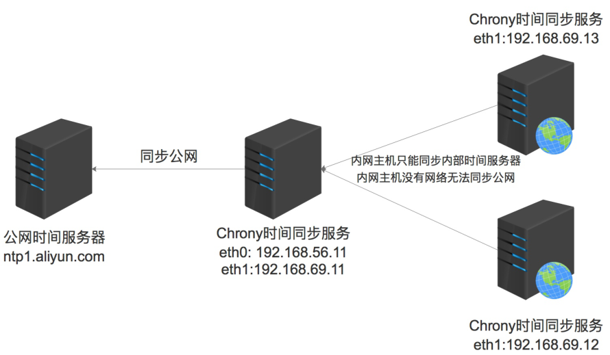

# 02 Chrony时间同步服务

## 目录

- [1.时间同步基本概念](#1.时间同步基本概念)
  - [1.1 什么是时间同步](#1.1-什么是时间同步)
  - [1.2 为什么需要时间同步](#1.2-为什么需要时间同步)
  - [1.3 时间同步是如何完成](#1.3-时间同步是如何完成)
- [2.Chrony时间服务](#2.chrony时间服务)
  - [2.1 Chrony介绍](#2.1-chrony介绍)
  - [2.2 为何需要Chrony](#2.2-为何需要chrony)
    - [2.2.1 Chrony安装](#2.2.1-chrony安装)
    - [2.2.2 Chrony服务端](#2.2.2-chrony服务端)
    - [2.2.3 Chrony客户端](#2.2.3-chrony客户端)

## 1.时间同步基本概念

### 1.1 什么是时间同步

时间同步，就是将本地时间与互联网时间进行校对，

为系统提供一个统一时间的过程；

由于本地时间的计时速率、运行环境不一致性；所有

本地时钟纵使在某一刻被校准了 ，一段时间后，这些

本地时钟也会出现不一致。为了本地时钟再次达到相

同的时间值，所以需要进行时间同步的操作；

### 1.2 为什么需要时间同步

在运维工作的场景当中，存在着众多主机协同完成不

同的任务；

比如 LNMP 架构，它们可以分别部署在三台不同的主

机上；那么这三台主机在工作时，由于分别位于不同

的主机之上，它们需要根据文件或者数据流所生成的

时间，来决定响应给客户端的结果该如何进行展示；

此时就需要统一网络中的主机时间一致；

但这个时间一致并不是说一定得是正确的，如果现在

当前时间是下午2点，但是这三台主机的时间精确一

致是昨天凌晨5点，这也没有什么问题；

但对于有些场景时间不正确也不行，比如https应

用；客户端与服务端通讯时，如果客户端时间是准确

的，而服务端时间来自昨天，或者来自未来的响应，

则会提示存在风险，而不予接受；

### 1.3 时间同步是如何完成

假设服务器启动起来后，发现时间慢了24小时，那么

他如何将自己的时间调整正确呢

如果是手表该如何校对时间呢？（波动表针，调整

时间的正常逻辑）

如果是date命令是如何校对时间呢？（直接跳跃

时间，跳跃的过程中造成部分文件出现空白段）

NTP时间服务（centos6）：

逻辑：让时间校对像手表一样波动的快一点，而不

是像date命令直接跳跃过去：其他服务器一分钟

## 60s，而ntp一分钟30s，来实现时间的校对；

问题：为了赶上慢的24小时，可能需要消耗非常

长的时间来进行校对；

Chrony时间服务：

逻辑：Chrony是NTP的替代品，能更精确、更快

的同步时钟，传统ntp需要几小时，而chrony仅

需要数秒种或数毫秒即可完成时间同步；调整时间

的速度就像波动表针的速度一样快；

## 2.Chrony时间服务

### 2.1 Chrony介绍

chrony 是基于 ntp 协议的实现时间同步服务，它既

可以当做服务端，也可以充当客户端；

## 1、chrony 是 NTP 的替代品，能更精确的时间和

更快的速度同步时钟；

## 2、chrony 占用系统资源少，只有被唤起时才占

用少部分CPU，chrony兼容ntpdate；

## 3、chrony 允许本地网络其他主机像本地进行时

间同步；

### 2.2 为何需要Chrony

所有服务器直接同步公网上的时间不就可以了吗，为

何需要自己搭建一台时间服务器呢？

如果每台服务器都去同步公网时间服务器，且服务

器较多，会带来如下问题：

## 1、造成延迟

## 2、浪费带宽

解决方法：搭建内网时间服务器，来同步公网时

间,然后所有服务器来与这台服务器进行时间同步

## 1、减小服务器之间的误差，提升同步速度

## 2、减少网络带宽损耗



#### 2.2.1 Chrony安装

```
[root@chrony ~]# yum install chrony -y
主配置文件：/etc/chrony.conf
客户端程序：/usr/bin/chronyc
服务端程序：/usr/sbin/chronyd
```

#### 2.2.2 Chrony服务端

默认配置

```
[root@chrony ~]# cat /etc/chrony.conf
```

#使用同步的远程时钟源，理论上可以同步无限个

```
server 0.centos.pool.ntp.org iburst
server 1.centos.pool.ntp.org iburst
server 2.centos.pool.ntp.org iburst
server 3.centos.pool.ntp.org iburst
```

#根据实际时间计算出服务器增减时间的比率，然后记录到

一个文件中，在系统重启后为系统做出最佳时间补偿调整

```
driftfile /var/lib/chrony/drift
```

#如果系统时钟的偏移量大于1秒，则允许系统时钟在前三次

更新中步进

```
makestep 1.0 3
```

#启用实时时钟（RTC）的内核同步

```
rtcsync
```

#通过使用 hwtimestamp 指令启用硬件时间戳

```
#hwtimestamp *
```

#增加调整所需的可选择源的最小数量

```
#minsources 2
```

允许指定网络的主机同步时间，不指定就是允许所有，默

认不开启。

```
allow 192.168.0.0/16
```

默认情况下本地服务器无法同步互联网时间时，可能会出

现不精确，所以会拒绝提供授时服务；

开启此选项，则表示允许接受不精确时间，继续为客户端

提供授时服务；

```
local stratum 10
```

#指定包含 NTP 身份验证密钥的文件

```
#keyfile /etc/chrony.keys
```

#指定日志文件

```
logdir /var/log/chrony
```

#选择日志文件要记录的信息

```
log measurements statistics tracking
```

## 1.Chrony服务端配置，修改 /etc/chrony.conf 文件

三处，设定外部时间服务器、允许内网同步此服务端、

设置断网继续同步

```
[root@chrony ~]# vim /etc/chrony.conf
# Please consider joining the pool
(http://www.pool.ntp.org/join.html).
server ntp.aliyun.com iburst
# Allow NTP client access from local
network.
allow 172.16.1.0/24
# Serve time even if not synchronized to a
time source.
local stratum 10
```

## 2.重启 Chrony 服务

```
[root@chrony ~]# systemctl restart chronyd
```

#### 2.2.3 Chrony客户端

## 1.客户端使用 ntpdate 或 chronyc 命令的方式进行手

动同步

```
# ntpdate
[root@chrony ~]# yum install ntpdate -y
[root@chrony ~]# ntpdate 172.16.1.62
# chronyc
[root@chrony ~]# chronyc -a makestep
200 OK
```

## 2.客户端使用 chrony 守护进程方式进行时间自动化同

步

```
[root@chrony ~]# yum install chrony -y
[root@chrony ~]# vim /etc/chrony.conf
```

指向至服务端

```
server 172.16.1.62 iburst
[root@chrony ~]# systemctl restart chronyd
```

## 3.查看时间同步是否正常

```
[root@chrony ~]# chronyc sources
210 Number of sources = 1
MS Name/IP address         Stratum Poll
Reach LastRx Last sample
===========================================
====================================
^* 172.16.1.5                    3   6
 77    24   -926us[-2077us] +/-   19ms
[root@chrony ~]# chronyc sources -v
```
