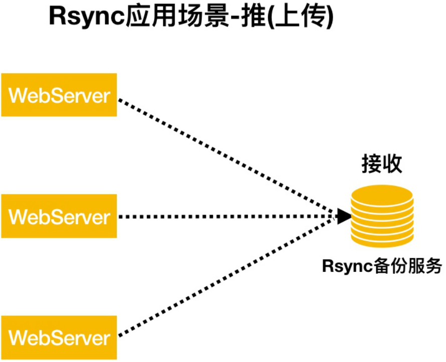
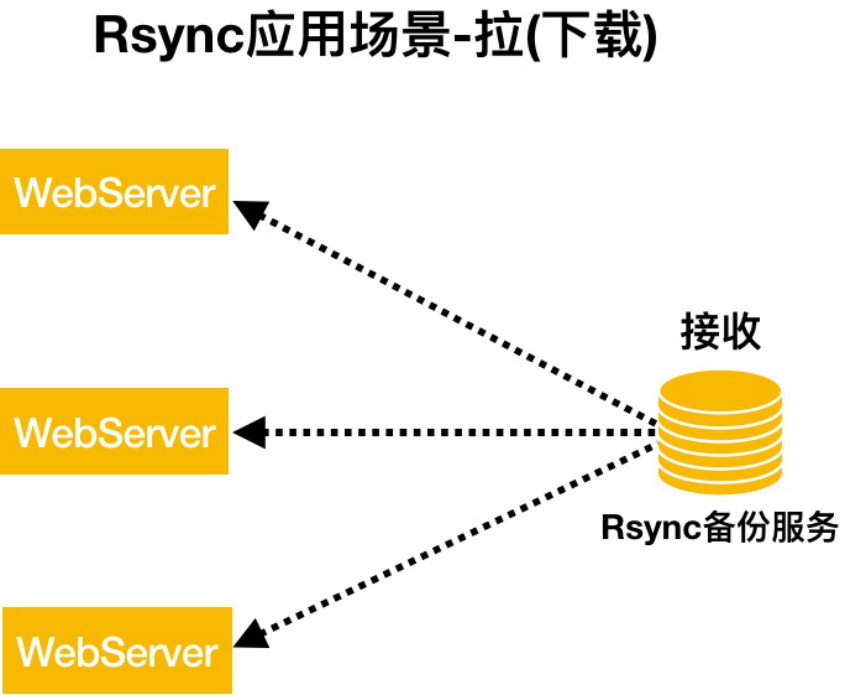
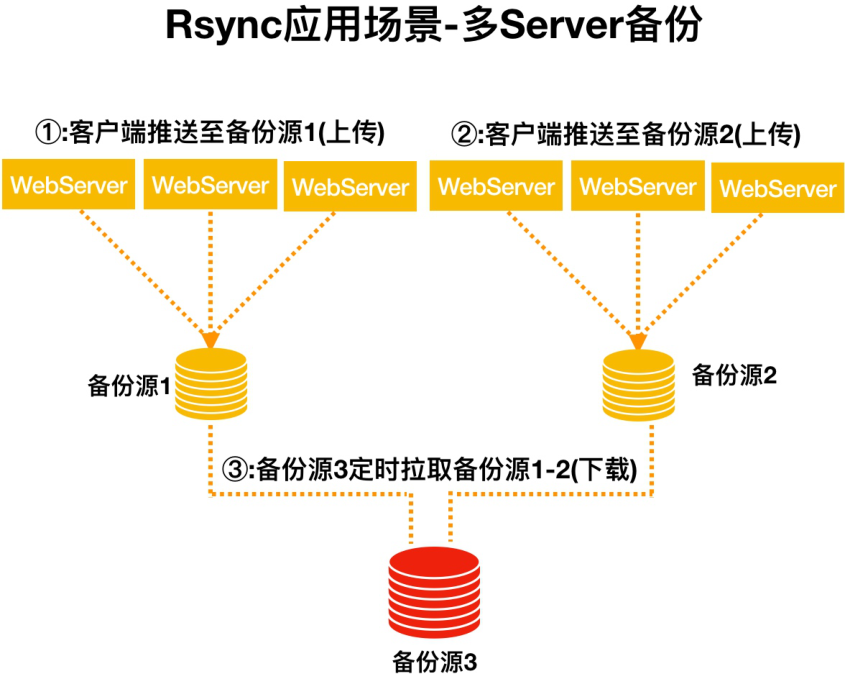
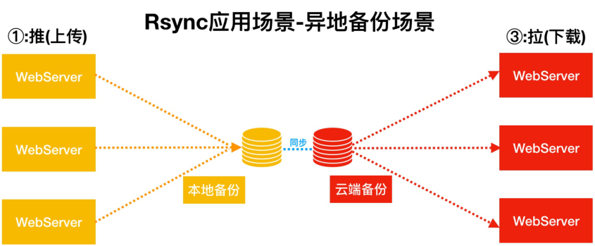
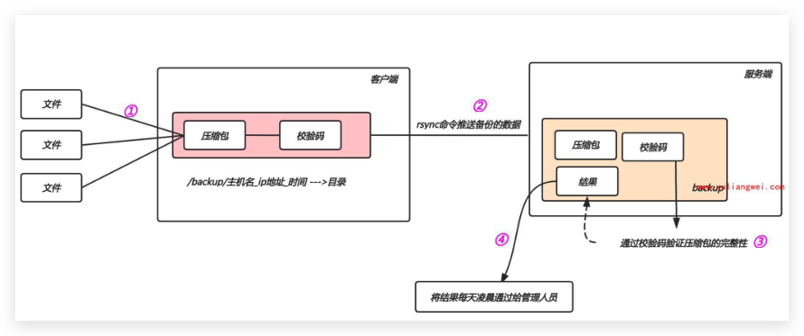

# 02 Rsync备份服务

## 目录

- [1.备份基本概述](#1.备份基本概述)
  - [1.1 什么是备份](#1.1-什么是备份)
  - [1.2 为什么要做备份](#1.2-为什么要做备份)
- [1、数据非常的重要](#1数据非常的重要)
- [2、减少数据的几率](#2减少数据的几率)
- [3、便于快速的恢复](#3便于快速的恢复)
  - [1.3 能不能不做备份](#1.3-能不能不做备份)
  - [1.4 备份应该怎么做](#1.4-备份应该怎么做)
  - [1.5 实现备份的工具](#1.5-实现备份的工具)
- [2.Rsync基本概述](#2.rsync基本概述)
  - [2.1 什么是Rsync](#2.1-什么是rsync)
  - [2.2 Rsync同步模式](#2.2-rsync同步模式)
  - [2.3 Rsync应用场景](#2.3-rsync应用场景)
  - [2.4 Rsync传输模式](#2.4-rsync传输模式)
    - [2.4.1 本地传输](#2.4.1-本地传输)
    - [2.4.2 远程传输](#2.4.2-远程传输)
- [1.使用系统用户（不安全）](#1.使用系统用户不安全)
- [2.使用普通用户（会导致权限不足情况）](#2.使用普通用户会导致权限不足情况)
    - [2.4.3 守护进程](#2.4.3-守护进程)
    - [2.4.4 常用选项](#2.4.4-常用选项)
- [3.Rsync场景实践](#3.rsync场景实践)
  - [3.1 Rsync服务端安装](#3.1-rsync服务端安装)
  - [3.2 Rsync服务端配置](#3.2-rsync服务端配置)
- [1.安装如下方式修改配置](#1.安装如下方式修改配置)
  - [3.3 Rsync服务端初始化](#3.3-rsync服务端初始化)
- [1.创建rsync账户，不允许登录不创建家目录（用](#1.创建rsync账户不允许登录不创建家目录用)
- [2.创建备份目录(尽可能磁盘空间足够大)，授权](#2.创建备份目录尽可能磁盘空间足够大授权)
- [3.创建虚拟用户密码文件，授权为600安全权限](#3.创建虚拟用户密码文件授权为600安全权限)
- [4.启动rsync服务，并将rsync加入开机自启动](#4.启动rsync服务并将rsync加入开机自启动)
- [5.检查rsync服务是否正常运行](#5.检查rsync服务是否正常运行)
  - [3.4 Rsync客户端配置](#3.4-rsync客户端配置)
- [600安全权限](#600安全权限)
  - [3.5 数据推送与拉取场景1](#3.5-数据推送与拉取场景1)
  - [3.7 数据无差异同步场景2](#3.7-数据无差异同步场景2)
  - [3.8 推送数据限速场景3](#3.8-推送数据限速场景3)
- [4.Rsync备份案例](#4.rsync备份案例)
  - [4.1 备份需求](#4.1-备份需求)
- [1.客户端提前准备存放的备份的目录，目录规则如](#1.客户端提前准备存放的备份的目录目录规则如)
- [2.客户端在本地打包备份(系统配置文件、应用配置](#2.客户端在本地打包备份系统配置文件应用配置)
- [3.客户端最后将备份的数据进行推送至备份服务器](#3.客户端最后将备份的数据进行推送至备份服务器)
- [4.客户端服务器本地保留最近7天的数据, 避免浪费](#4.客户端服务器本地保留最近7天的数据-避免浪费)
- [5.客户端每天凌晨1点定时执行该脚本](#5.客户端每天凌晨1点定时执行该脚本)
- [1.服务端部署rsync，用于接收客户端推送过来的](#1.服务端部署rsync用于接收客户端推送过来的)
- [2.服务端需要每天校验客户端推送过来的数据是否](#2.服务端需要每天校验客户端推送过来的数据是否)
- [3.服务端需要每天校验的结果通知给管理员（√）](#3.服务端需要每天校验的结果通知给管理员)
- [4.服务端仅保留6个月的备份数据,其余的全部删除](#4.服务端仅保留6个月的备份数据其余的全部删除)
  - [4.2 备份数据](#4.2-备份数据)
  - [4.3 客户端脚本](#4.3-客户端脚本)
  - [4.4 服务端脚本](#4.4-服务端脚本)
  - [4.5 扩展多台节点](#4.5-扩展多台节点)
  - [4.6 整体备份图解](#4.6-整体备份图解)

目录

- [1.备份基本概述](#1.备份基本概述)
  - [1.1 什么是备份](#1.1-什么是备份)
  - [1.2 为什么要做备份](#1.2-为什么要做备份)
  - [1.3 能不能不做备份](#1.3-能不能不做备份)
  - [1.4 备份应该怎么做](#1.4-备份应该怎么做)
  - [1.5 实现备份的工具](#1.5-实现备份的工具)
- [2.Rsync基本概述](#2.rsync基本概述)
  - [2.1 什么是Rsync](#2.1-什么是rsync)
  - [2.2 Rsync同步模式](#2.2-rsync同步模式)
  - [2.3 Rsync应用场景](#2.3-rsync应用场景)
  - [2.4 Rsync传输模式](#2.4-rsync传输模式)
    - [2.4.1 本地传输](#2.4.1-本地传输)
    - [2.4.2 远程传输](#2.4.2-远程传输)
    - [2.4.3 守护进程](#2.4.3-守护进程)
    - [2.4.4 常用选项](#2.4.4-常用选项)
- [3.Rsync场景实践](#3.rsync场景实践)
  - [3.1 Rsync服务端安装](#3.1-rsync服务端安装)
  - [3.2 Rsync服务端配置](#3.2-rsync服务端配置)
  - [3.3 Rsync服务端初始化](#3.3-rsync服务端初始化)
  - [3.4 Rsync客户端配置](#3.4-rsync客户端配置)
  - [3.5 数据推送与拉取场景1](#3.5-数据推送与拉取场景1)
  - [3.7 数据无差异同步场景2](#3.7-数据无差异同步场景2)
  - [3.8 推送数据限速场景3](#3.8-推送数据限速场景3)
- [4.Rsync备份案例](#4.rsync备份案例)
  - [4.1 备份需求](#4.1-备份需求)
  - [4.2 备份数据](#4.2-备份数据)
  - [4.3 客户端脚本](#4.3-客户端脚本)
  - [4.4 服务端脚本](#4.4-服务端脚本)
  - [4.5 扩展多台节点](#4.5-扩展多台节点)
  - [4.6 整体备份图解](#4.6-整体备份图解)

## 1.备份基本概述

### 1.1 什么是备份

备份就是把文件在复制一份存放起来（简单说就是给

源文件增加一个副本）

快照类型：

日志类型：

集群方案： A B C 相同机器，组成集群，统一对

外提供；

### 1.2 为什么要做备份

## 1、数据非常的重要

## 2、减少数据的几率

## 3、便于快速的恢复

### 1.3 能不能不做备份

可以，对于不是特别重要的数据可以不考虑；

重要：用户录入的数据；

不重要：软件（配置文件）

### 1.4 备份应该怎么做

完全备份，（全备，效率低下、占用空间、浪费带

宽）完全备份示意图

增量备份，（增备，效率较高、节省空间、节省带

宽）增量备份示意图

### 1.5 实现备份的工具

备份通常使用什么工具

本地备份：cp

远程备份：scp、rsync

## 2.Rsync基本概述

### 2.1 什么是Rsync

rsync简称远程同步,可以实现不同主机之间的同步，

同时支持增量和全量的同步，备份。

windows---<linux

linux《---》linux

linux《--》macos

macos《--》windows

rsync 官方地址：传送门

rsync 监听端口：873

rsync 运行模式：C/S （Server/Client） 4399

（B/S） jd taobao 滴滴

### 2.2 Rsync同步模式

推: 所有主机推送本地数据至Rsync备份服务器，会导

致数据同步缓慢(适合少量数据备份)



拉: rsync备份服务端拉取所有主机上的数据，会导致

备份服务器开销大



### 2.3 Rsync应用场景

大量服务器备份场景



异地备份场景



### 2.4 Rsync传输模式

Rsync 使用三种主要的数据传输方式

本地方式：

远程方式： A --》 B

守护进程： 将rsync做为服务端使用；

#### 2.4.1 本地传输

本地传输方式：单个主机本地之间的数据传输(此时类

似于cp命令)

```
本地传输语法：Local:  rsync [OPTION...]
SRC... [DEST]
```

本地拷贝数据示例：

```
[root@backup ~]# rsync  -avz  /etc/passwd
/tmp/
rsync       #备份命令(cp)
[options]   #选项
SRC...      #本地源文件
```

[DEST] #本地目标文件

#### 2.4.2 远程传输

远程传输方式：通过ssh通道传输数据,类似scp命令

远程传输语法：

```
Pull：rsync [OPTION...]
[USER@]HOST:SRC... [DEST]
Push：rsync [OPTION...] SRC...
[USER@]HOST:DEST
```

Pull拉取数据示例：

拉取远程文件

```
[root@backup ~]# rsync -avz
root@172.16.1.31:/etc/hostname ./
```

拉取远程目录下的所有文件

```
[root@backup ~]# rsync -avz
root@172.16.1.31:/root/ /backup/
```

#拉取远程目录以及目录下的所有文件

```
[root@backup ~]# rsync -avz
root@172.16.1.31:/root /backup/
Pull        #拉取, 下载
rsync       #备份命令
[options]   #选项
```

[USER@] #目标主机的系统用户

HOST #目主机IP地址或域名

SRC... #目标主机源文件

[DEST] #下载至本地哪个位置

Push 推送数据示例

```
[root@backup ~]#  rsync -avz /backup/2018-
10-01 root@172.16.1.31:/tmp/
Push        #推送, 上传
rsync       #备份命令
[options]   #选项
SRC...      #本地源文件
```

[USER@] #目标主机的系统用户

HOST #目主机IP地址或域名

[DEST] #目标对应位置

注意事项：Rsync借助SSH协议同步数据存在的缺陷

## 1.使用系统用户（不安全）

## 2.使用普通用户（会导致权限不足情况）

#### 2.4.3 守护进程

守护进程传输方式：rsync自身非常重要的功能(不使

用系统用户，更加安全)

守护进程传输语法：

```
Pull：rsync [OPTION...]
[USER@]HOST::SRC... [DEST]
Push：rsync [OPTION...] SRC...
[USER@]HOST::DEST
```

Pull拉取数据示例：

#1.拉取rsync备份服务的"backup模块"数据至本地/mnt

目录

```
[root@nfs ~]# rsync -avz
rsync_backup@172.16.1.31::backup/ /mnt/ --
password-file=/etc/rsync.password
rsync           #命令
[OPTION...]     #选项
```

[USER@] #远程主机用户(虚拟用户)

```
HOST::          #远程主机地址
```

SRC... #远程主机模块(不是目录)

[DEST] #将远程主机数据备份至本地什么位置

push推送数据命令

```
[root@nfs ~]# rsync -avz /mnt/
rsync_backup@192.172.16.1.31::backup/ --
password-file=/etc/rsync.password
rsync           #命令
[OPTION...]     #选项
```

SRC... #远程主机模块(不是目录)

[USER@] #远程主机用户(虚拟用户)

```
HOST::          #远程主机地址
```

[DEST] #将远程主机模块备份至本地什么位置

#### 2.4.4 常用选项

```
-a           #归档模式传输, 等于-tropgDl
```

-v #详细模式输出, 打印速率, 文件数量等

-z #传输时进行压缩以提高效率

-r #递归传输目录及子目录，即目录下得所有

目录都同样传输。

-t #保持文件时间信息

-o #保持文件属主信息

-p #保持文件权限

-g #保持文件属组信息

```
-l           #保留软连接
```

-P #显示同步的过程及传输时的进度等信息

-D #保持设备文件信息

-L #保留软连接指向的目标文件

-e #使用的信道协议,指定替代rsh的shell

程序 ssh协议；

--exclude=PATTERN #指定排除不需要传输的文件模

式

--exclude-from=file #文件名所在的目录文件

```
--bwlimit=100       #限速传输
--partial           #断点续传
```

--delete #让目标目录和源目录数据保持

一致

## 3.Rsync场景实践

主机角色 外网

内网

主机名

IP(NAT)

IP(LAN)

称

Rsync服务

端 10.0.0.31 172.16.1.31 backup

Rsync客户

端 10.0.0.32 172.16.1.31 nfs

### 3.1 Rsync服务端安装

```
[root@backup ~]# yum -y install rsync
```

### 3.2 Rsync服务端配置

## 1.安装如下方式修改配置

```
[root@backup ~]# cat /etc/rsyncd.conf
uid = rsync
gid = rsync
port = 873
fake super = yes
use chroot = no
```

```
max connections = 200
timeout = 600
ignore errors
read only = false
list = false
auth users = rsync_backup
secrets file = /etc/rsync.passwd
log file = /var/log/rsyncd.log
#####################################
[backup]
path = /backup
```

配置详解

```
[root@backup ~]# vim /etc/rsyncd.conf
uid = rsync                      # 运行进程的
```

用户

```
gid = rsync                      # 运行进程的
```

用户组

```
port = 873                       # 监听端口
fake super = yes                 # 不需要
```

rsync已root身份运行，就可以存储文件的完整属性

```
use chroot = no                  # 禁锢推送的
```

数据至某个目录, 不允许跳出该目录

```
max connections = 200            # 最大连接数
timeout = 600                    # 超时时间
ignore errors                    # 忽略错误信
```

息

```
read only = false                # 对备份数据
```

可读写

```
list = false                     # 不允许查看
```

模块信息

```
auth users = rsync_backup        # 定义虚拟用
```

户，作为连接认证用户

```
secrets file = /etc/rsync.passwd # 定义rsync
```

服务用户连接认证密码文件路径

```
[backup]                # 定义模块信息
comment = commit        # 模块注释信息
path = /backup          # 定义接收备份数据目录
```

### 3.3 Rsync服务端初始化

Rsync服务端进行初始化

## 1.创建rsync账户，不允许登录不创建家目录（用

于运行rsync服务的用户身份）

## 2.创建备份目录(尽可能磁盘空间足够大)，授权

rsync用户为属主

## 3.创建虚拟用户密码文件，授权为600安全权限

（用于客户端连接时使用的用户）

## 4.启动rsync服务，并将rsync加入开机自启动

## 5.检查rsync服务是否正常运行

```
[root@backup ~]# useradd -M -s
/sbin/nologin rsync
[root@backup ~]# mkdir /backup
[root@backup ~]# chown -R rsync.rsync
/backup/
```

```
[root@backup ~]# echo "rsync_backup:123"
>/etc/rsync.passwd
[root@backup ~]# chmod 600
/etc/rsync.passwd
[root@backup ~]# systemctl start rsyncd
[root@backup ~]# systemctl enable rsyncd
[root@backup ~]# netstat -lntp
Active Internet connections (only servers)
Proto Recv-Q Send-Q Local Address
Foreign Address     State       PID/Program
name
tcp        0      0 0.0.0.0:873
0.0.0.0:*           LISTEN      4758/rsync
```

### 3.4 Rsync客户端配置

Rsync客户端仅需配置虚拟用户的密码，并授权为

## 600安全权限

方式一：适合终端执行，将虚拟用户密码配置至一个

文件中；

```
[root@nfs ~]# yum install rsync -y
[root@nfs ~]# echo "oldxu" >
/etc/rsync.pass
[root@nfs ~]# chmod 600 /etc/rsync.pass
```

方式二：适合脚本执行，将虚拟用户密码设定为环境

变量；

```
[root@nfs ~]# yum install rsync -y
[root@nfs ~]# export RSYNC_PASSWORD=oldxu
```

### 3.5 数据推送与拉取场景1

客户端推送backup目录下所有内容至Rsync服务端

```
[root@nfs ~]# export RSYNC_PASSWORD=oldxu
[root@nfs ~]# rsync -avz /backup/
rsync_backup@172.16.1.31::backup/
```

客户端拉取Rsync服务端 backup 模块数据至本地客

户端的 /backup 目录

```
[root@nfs ~]# export RSYNC_PASSWORD=oldxu
[root@nfs ~]#rsync -avz
rsync_backup@172.16.1.31::backup /backup/
```

### 3.7 数据无差异同步场景2

Rsync实现本地数据与远程数据无差异同步

拉取远端数据：远端与本地保持一致,远端没有本地有

会被删除, 造成客户端数据丢失

```
[root@nfs ~]# export RSYNC_PASSWORD=oldxu
[root@nfs ~]# rsync -avz --delete
rsync_backup@172.16.1.31::backup/ /data/
```

推送数据至远端：本地与远端保持一致, 本地没有远

端会被删除, 造成服务器端数据丢失

```
[root@nfs ~]# export RSYNC_PASSWORD=oldxu
[root@nfs ~]# rsync -avz --delete /data/
rsync_backup@172.16.1.31::backup/
```

### 3.8 推送数据限速场景3

故障案例: 某DBA使用rsync拉取备份数据时，由于文

件过大导致内部交换机带宽被沾满，导致用户的请求

无法响应；

```
[root@nfs ~]# export RSYNC_PASSWORD=oldxu
```

单位MB

```
[root@nfs ~]# rsync -avz --bwlimit=1
rsync_backup@172.16.1.31::backup/ /data/
```

## 4.Rsync备份案例

已知3台服务器主机名分别为 web01、backup 、nfs

主机信息见下表：

角色 外网IP(NAT) 内网IP(LAN) 主机名 WEB eth0:10.0.0.7 eth1:172.16.1.7 web01 NFS eth0:10.0.0.32 eth1:172.16.1.32 nfs Rsync eth0:10.0.0.31 eth1:172.16.1.31 backup

### 4.1 备份需求

客户端需求

## 1.客户端提前准备存放的备份的目录，目录规则如

```
下:/backup/nfs_172.16.1.31_2020-09-02
```

## 2.客户端在本地打包备份(系统配置文件、应用配置

```
等)拷贝至/backup/nfs_172.16.1.31_2020-09-
02
```

## 3.客户端最后将备份的数据进行推送至备份服务器

## 4.客户端服务器本地保留最近7天的数据, 避免浪费

磁盘空间

## 5.客户端每天凌晨1点定时执行该脚本

服务端需求

## 1.服务端部署rsync，用于接收客户端推送过来的

备份数据（√）

## 2.服务端需要每天校验客户端推送过来的数据是否

完整（√）

## 3.服务端需要每天校验的结果通知给管理员（√）

## 4.服务端仅保留6个月的备份数据,其余的全部删除

注意：所有服务器的备份目录必须都为/backup

### 4.2 备份数据

建议备份的数据内容如下

#1.开机自启动配置文件 设备挂载配置文件 本地内网配

置文件 (系统配置文件)

```
/etc/rc.local       /etc/fstab
/etc/hosts
#2.cron定时任务        firewalld防火墙
```

脚本目录 (重要目录)

```
/var/spool/cron/    /etc/firewalld
/server/scripts
```

#3.系统日志文件

/var/log/ //系统安全日志、sudo日志、内核日志、

```
rsyslog日志
```

#4.应用程序服务配置文件 nginx、PHP、mysql、

```
redis.....
```

### 4.3 客户端脚本

客户端备份实现思路,脚本每天凌晨01点定时执行一次

（打包->标记->推送->保留最近7天的文件）

类似于快递模式 （散货-->打包-->打标记-->装车-->运

输-->仓库）

```
[root@nfs scripts]# cat
/scripts/client_rsync_backup.sh
#!/usr/bin/bash
```

#1.定义变量

```
PATH=/usr/local/sbin:/usr/local/bin:/usr/sb
in:/usr/bin:/root/bin
Host=$(hostname)
Addr=$(ifconfig eth1|awk 'NR==2{print $2}')
Date=$(date +%F)
Dest=${Host}_${Addr}_${Date}
Path=/backup
```

#2.创建备份目录

```
[ -d $Path/$Dest ] || mkdir -p $Path/$Dest
```

#3.备份对应的文件

```
cd / && \
[ -f $Path/$Dest/system.tar.gz ] || tar czf
$Path/$Dest/system.tar.gz etc/fstab
etc/rsyncd.conf && \
[ -f $Path/$Dest/log.tar.gz ] || tar czf
$Path/$Dest/log.tar.gz  var/log/messages
var/log/secure && \
```

#4.携带md5验证信息

```
[ -f $Path/$Dest/flag ] || md5sum
$Path/$Dest/*.tar.gz
>$Path/$Dest/flag_$Date
```

#5.推送本地数据至备份服务器

```
export RSYNC_PASSWORD=bgx
rsync -avz $Path/
rsync_backup@172.16.1.31::backup
```

#6.本地保留最近7天的数据

```
find $Path/ -type d -mtime +7|xargs rm -rf
```

定时任务,让备份每天凌晨1点执行

```
[root@nfs ~]# crontab -l
00 01 * * * /bin/bash
/scripts/backup_rsync.sh &>/dev/null
```

### 4.4 服务端脚本

服务端校验客户端推送数据的完整性, (校验->存储校

验结果->将保存的结果通过邮件发送给管理员->保留

最近180天的数据)

#1.服务端配置邮件功能

```
[root@backup ~]# yum install mailx -y
[root@backup ~]# vim /etc/mail.rc
set from=552408925@qq.com
set smtp=smtps://smtp.qq.com:465
set smtp-auth-user=552408925@qq.com
set smtp-auth-password=#客户端授权码
set smtp-auth=login
set ssl-verify=ignore
set nss-config-dir=/etc/pki/nssdb/
```

#2.服务端校验、以及邮件通知脚本

```
[root@backup ~]# mkdir /scripts -p
```

```
[root@backup ~]# vim
/scripts/check_backup.sh
#!/usr/bin/bash
```

#1.定义全局的变量

```
export
PATH=/usr/local/sbin:/usr/local/bin:/usr/sb
in:/usr/bin:/root/bin
```

#2.定义局部变量

```
Path=/backup
Date=$(date +%F)
```

#3.查看flag文件,并对该文件进行校验, 然后将校验的结

果保存至result_时间

```
find $Path/ -type f -name
"flag_$Date"|xargs md5sum -c
>$Path/result_${Date}
```

#4.将校验的结果发送邮件给管理员

```
mail -s "Rsync Backup $Date" 123@qq.com
<$Path/result_${Date}
```

#5.删除超过7天的校验结果文件, 删除超过180天的备份数

据文件

```
find $Path/ -type f -name "result*" -mtime
+7|xargs rm -f
find $Path/ -type d -mtime +180|xargs rm -
rf
```

服务端编写定时任务脚本

```
[root@backup backup]# crontab -l
00 05 * * * /bin/bash
/scripts/check_backup.sh &>/dev/null
```

### 4.5 扩展多台节点

如何扩展多台服务器的备份

```
[root@nfs ~]# rsync -avz /server
172.16.1.7:/
```

### 4.6 整体备份图解


