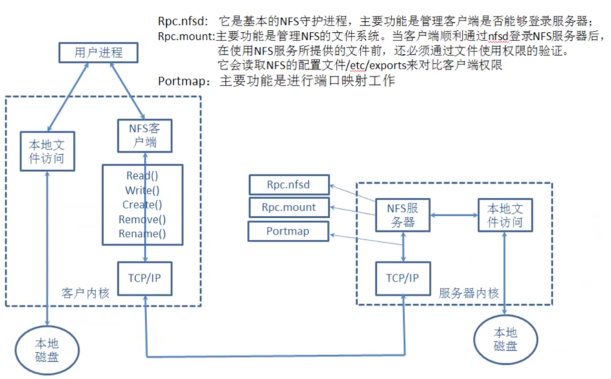

# 04 NFS网络文件系统实战

## 目录

- [1.NFS基本概述](#1.nfs基本概述)
  - [1.1 什么是NFS](#1.1-什么是nfs)
  - [1.2 NFS能干什么](#1.2-nfs能干什么)
  - [1.3 为何需要NFS](#1.3-为何需要nfs)
  - [1.4 NFS注意事项](#1.4-nfs注意事项)
  - [1.5 NFS实现原理](#1.5-nfs实现原理)
- [2.NFS服务实践](#2.nfs服务实践)
  - [2.1 环境准备](#2.1-环境准备)
  - [2.2 NFS服务安装](#2.2-nfs服务安装)
  - [2.3 NFS服务配置](#2.3-nfs服务配置)
  - [2.4 NFS服务初始化](#2.4-nfs服务初始化)
  - [2.5 NFS服务启动](#2.5-nfs服务启动)
  - [2.6 NFS服务挂载](#2.6-nfs服务挂载)
    - [2.6.1 查询挂载](#2.6.1-查询挂载)
    - [2.6.2 执行挂载](#2.6.2-执行挂载)
    - [2.6.3 永久挂载](#2.6.3-永久挂载)
    - [2.6.4 执行卸载](#2.6.4-执行卸载)
    - [2.6.5 挂载优化](#2.6.5-挂载优化)
  - [2.7 NFS配置详解](#2.7-nfs配置详解)
    - [2.7.1 验证ro权限](#2.7.1-验证ro权限)
    - [2.7.2 验证all_squash权限](#2.7.2-验证all_squash权限)
  - [2.8 NFS存储总结](#2.8-nfs存储总结)
- [1.什么是nfs?](#1.什么是nfs)
- [2.nfs能干什么?](#2.nfs能干什么)
- [3.为什么要使用nfs?](#3.为什么要使用nfs)
- [4.nfs能解决什么问题？](#4.nfs能解决什么问题)
- [5.使用nfs的注意事项?](#5.使用nfs的注意事项)
- [6.nfs实现的原理解析?](#6.nfs实现的原理解析)
- [7.安装、配置、nfs服务](#7.安装配置nfs服务)

## 1.NFS基本概述

### 1.1 什么是NFS

NFS 是 Network File System 的缩写及网络文件系

统。[ 通常我们称 NFS 为共享存储 ]

### 1.2 NFS能干什么

NFS 的主要功能是通过”局域网“络让不同主机系统之

间可以共享目录。

### 1.3 为何需要NFS

在网站集群架构中如果没有共享存储的情况如下:

## 1.用户A上传图片经过负载均衡，负载均衡将上传

请求调度至WEB1服务器上。

## 2.用户B访问A用户上传的图片，此时B用户被负载

均衡调度至WEB2上，因为WEB2上没有这张图

片，所以B用户无法看到A用户传的图片。


在网站集群架构中如果有共享存储的情况如下:

## 1.A用户上传图片无论被负载均衡调度至WEB1还是

WEB2, 最终数据都被写入至共享存储

## 2.B用户访问A用户上传图片时，无论调度至WEB1

还是WEB2，最终都会上共享存储访问对应的文

件，这样就可以访问到资源了


使用NFS共享存储能解决集群架构的什么问题

解决多台web静态资源的共享(所有客户端都挂载

服务端，看到的数据都一样)

解决多台web静态资源一致性(如果客户端A删除

NFS服务上的文件，客户端B上也会看不见文件)

解决多台web磁盘空间的浪费

### 1.4 NFS注意事项

## 1.由于用户请求静态资源每次都需要web连接NFS服

务获取，那么势必会带来一定的网络开销、以及网络

延时、所以增加NFS服务并不能给网站带来访问速度

的提升。

## 2.如果希望对上传的图片、附件等静资源进行加速，

建议将静态资源统一存放至NFS服务端。这样便于后

期统一推送至CDN，以此来实现资源的加速。

### 1.5 NFS实现原理



本地文件操作方式

## 1.当用户执行mkdir命令，BashShell无法完成该

命令操作，会将其翻译给内核。

## 2.Kernel内核解析完成后会驱动对应的磁盘设

备，完成创建目录的操作。

NFS创建文件方式

## 1.NFS客户端执行增、删等操作，客户端会使用不

同的函数对该操作进行封装。

## 2.NFS客户端会通过TCP/IP的方式传递给NFS服务

端。

## 3.NFS服务端接收到请求后，会先调用portmap进

程进行端口映射。

## 4.nfsd进程用于判断NFS客户端是否拥有权限连

接NFS服务端。

## 5.Rpc.mount进程判断客户端是否有对应的权限进

行验证。

## 6.idmap进程实现用户映射和压缩。

## 7.最后NFS服务端会将客户端的函数转换为本地能

执行的命令，由内核驱动硬件完成操作。

注意：rpc是一个远程过程调用，那么使用nfs必须

有rpc服务。

## 2.NFS服务实践

### 2.1 环境准备

服务器

系统 角色 外网IP 内网IP

NFS

CentOS

eth0:10.0.0.32 eth1:172.16.1.32

服务

### 7.6

端

NFS

CentOS

eth0:10.0.0.31 eth1:172.16.1.31

客户

### 7.6

端

### 2.2 NFS服务安装

```
[root@nfs ~]# yum -y install nfs-utils
```

### 2.3 NFS服务配置

配置nfs服务，nfs服务程序的配置文件

为/etc/exports，需要严格按照共享目录的路径 允

许访问的NFS客户端（共享权限参数）格式书写，定义要

共享的目录与相应的权限，具体书写方式如下图所

示。


配置场景，将nfs服务端的/data目录共享给

#### 172.16.1.0/24网段内的所有主机

## 1.所有客户端主机都拥有读写权限

## 2.在将数据写入到NFS服务器的硬盘中后才会结束

操作，最大限度保证数据不丢失

## 3.将所有用户映射为本地的匿名用户(nfsnobody)

```
[root@nfs ~]# vim /etc/exports
/data   172.16.1.0/24(rw,sync,all_squash)
```

### 2.4 NFS服务初始化

初始化 NFS 服务

建立需要共享的目录；

为对应目录设置权限；

```
[root@nfs ~]# mkdir /data
[root@nfs ~]# chown -R nfsnobody.nfsnobody
/data
```

### 2.5 NFS服务启动

```
[root@nfs ~]# systemctl enable nfs-server
[root@nfs ~]# systemctl restart nfs-server
```

### 2.6 NFS服务挂载

NFS客户端的配置步骤也十分简单；

先使用 showmount 命令，查询NFS服务器的远程共

享信息；

然后使用 mount 命令执行挂载操作；

#### 2.6.1 查询挂载

安装nfs-utils，会自动启动rpcbind服务

```
[root@nfs-client ~]# yum -y install nfs-
utils
```

执行 showmount -e查看远程服务器rpc提供的可挂

载nfs信息

```
[root@nfs-client ~]# showmount -e
172.16.1.32
Export list for 172.16.1.32:
/data 172.16.1.0/24
```

#### 2.6.2 执行挂载

```
[root@nfs-client ~]# mkdir /nfsdir
[root@nfs-client ~]# mount -t nfs
172.16.1.32:/data /nfsdir
[root@nfs-client ~]# df –h
Filesystem           Size  Used Avail Use%
Mounted on
/dev/sda3             62G  845M   58G   2%
/
tmpfs                244M     0  244M   0%
/dev/shm
/dev/sda1            190M   26M  155M  14%
/boot
172.16.1.32:/data   62G  880M   58G   2%
/nfsdir
```

#### 2.6.3 永久挂载

```
[root@nfs-client ~]# vim /etc/fstab
172.16.1.32:/data /nfsdir nfs defaults 0 0
```

#### 2.6.4 执行卸载

```
[root@nfs-client ~]# umount /nfsdir
```

#注意:卸载的时候如果提示”umount.nfs: /nfsdir:

```
device is busy”
```

#1.切换至其他目录, 然后在进行卸载。

```
#2.NFS Server宕机, 强制卸载umount -lf /nfsdir
```

#### 2.6.5 挂载优化

在企业工作场景，通常情况NFS服务器共享的只是普

通静态数据（图片、附件、视频），不需要执行

suid、exec等权限，挂载的这个文件系统只能作为

数据存取之用，无法执行程序，对于客户端来讲增加

了安全性。

例如: 很多木马篡改站点文件都是由上传入口上传的

程序到存储目录，然后执行。

#通过mount -o指定挂载参数，禁止使用suid，exec，增

加安全性能

```
[root@nfs-client ~]# mount -t nfs -o
nosuid,noexec 172.16.1.31:/data /mnt
```

### 2.7 NFS配置详解

执行man exports命令，然后切换到文件结尾，可以

快速查看如下样例格式：

rw：读写权限

ro：只读权限

root_squash：当NFS客户端以root管理员访问

时，映射为NFS服务器的匿名用户(不常用)

no_root_squash：当NFS客户端以root管理员访

问时，映射为NFS服务器的root管理员(不常用)

all_squash：无论NFS客户端使用什么账户访

问，均映射为NFS服务器的匿名用户(常用)

sync：同时将数据写入到内存与硬盘中，保证不

丢失数据

async：优先将数据保存到内存，然后再写入硬

盘；这样效率更高，但可能会丢失数据

anonuid：配置all_squash使用,指定NFS的用户

UID，必须存在系统

anongid：配置all_squash使用,指定NFS的用户

GID，必须存在系统

#### 2.7.1 验证ro权限

## 1.服务端修改rw为ro参数

```
[root@nfs ~]# cat /etc/exports
/data 172.16.1.0/24(ro,sync,all_squash)
[root@nfs ~]# systemctl restart nfs-server
```

## 2.客户端验证

```
[root@nfs-client ~]# mount -t nfs
172.16.1.32:/data /mnt
[root@nfs-client ~]# df -h
Filesystem         Size  Used Avail Use%
Mounted on
172.16.1.31:/data   98G  1.7G   97G   2%
/mnt
```

发现无法正常写入文件

```
[root@backup mnt]# touch file
touch: cannot touch ‘file’: Read-only file
system
```

#### 2.7.2 验证all_squash权限

```
验证 all_squash、anonuid、anongid 权限
```

## 1.NFS服务端配置，然后进行初始化操作；

```
[root@nfs ~]# cat /etc/exports
/data
172.16.1.0/24(rw,sync,all_squash,anonuid=66
6,anongid=666)
[root@nfs ~]# groupadd -g 666 www
[root@nfs ~]# useradd -u 666 -g 666 www
[root@nfs ~]# chown -R www.www /data/
```

## 2.客户端验证，会发现客户端文件的权限为 666，但可

以正常写入数据

```
[root@backup ~]# umount /mnt/
[root@backup ~]# mount -t nfs
172.16.1.31:/data /mnt
[root@backup mnt]# touch fff
[root@backup mnt]# mkdir 111
[root@backup mnt]# ll
drwxr-xr-x 2 666 666 6 Sep  3 03:05 111
-rw-r--r-- 1 666 666 0 Sep  3 03:05 fff
```

## 3.建议，客户端也创建一个uid为666，gid为666，统

一身份，避免后续出现权限不足的情况

```
[root@backup mnt]# groupadd -g 666 www
[root@backup mnt]# useradd -g 666 -u 666
www
[root@backup mnt]# id www
uid=666(www) gid=666(www) groups=666(www)
```

#再次检查权限

```
[root@backup mnt]# ll /mnt/
total 4
drwxr-xr-x 2 www www 6 Sep  3 03:05 111
-rw-r--r-- 1 www www 0 Sep  3 03:05 fff
```

### 2.8 NFS存储总结

## 1.NFS存储优点

## 1.NFS简单易用、方便部署、数据可靠、服务稳

定、满足中小企业需求。

## 2.NFS的数据都在文件系统之上，所有数据都是能

看得见。

## 2.NFS存储局限

## 1.存在单点故障, 如果构建高可用维护麻烦web-

>nfs()--实时同步-->backup

gfs 文件系统；1TB存储；2TB；3TB；

OSS产品：文件系统；基于http的方式访问资

源；

Ceph：文件系统；

## 2.NFS数据都是明文， 并不对数据做任何校验，也

没有密码验证(强烈建议内网使用)。

## 3.NFS应用建议

## 1.建议将静态数据jpg\png\mp4\css\js尽可能放

置CDN场景进行加速，以此来减少后端压力

## 2.如果没有缓存或架构、代码等，本身历史遗留问

题太大，在多存储也没意义
