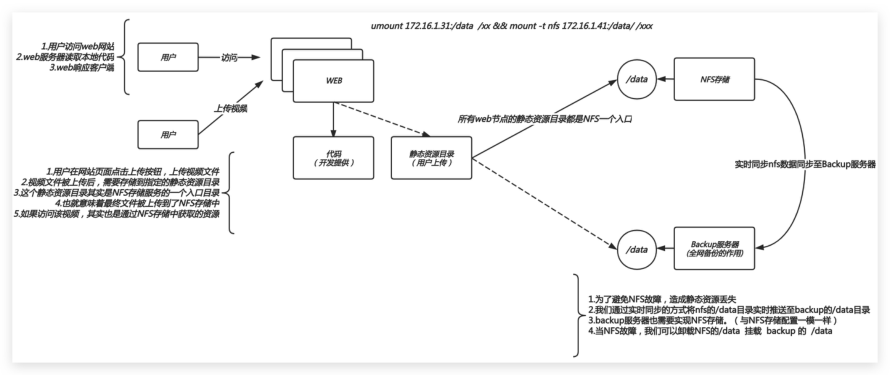

# 05 Sersync实时同步实战

## 目录

- [1.实时同步概述](#1.实时同步概述)
  - [1.1 什么是实时同步](#1.1-什么是实时同步)
  - [1.2 实时同步原理](#1.2-实时同步原理)
  - [1.3 实时同步场景](#1.3-实时同步场景)
  - [1.4 实时同步工具](#1.4-实时同步工具)
- [2.实时同步案例](#2.实时同步案例)
  - [2.1 环境规划](#2.1-环境规划)
  - [2.2 配置思路](#2.2-配置思路)
  - [2.3 配置NFS存储](#2.3-配置nfs存储)
  - [2.4 配置WEB服务](#2.4-配置web服务)
  - [2.5 配置备份服务](#2.5-配置备份服务)
  - [2.6 配置实时同步](#2.6-配置实时同步)
  - [2.7 平滑迁移场景](#2.7-平滑迁移场景)

## 1.实时同步概述

### 1.1 什么是实时同步

只要当前目录发生变化则会触发一个事件，事件触发

后将变化的目录同步至远程服务器。

### 1.2 实时同步原理

实时同步需要借助 Inotify 通知接口，用来监控本

地目录的变化，如果监控本地的目录发生变更。则触

发动作，这个动作可以是进行同步操作，或其他操

作。

create、modify、write、

### 1.3 实时同步场景

场景一、解决nfs单点故障。保证同步的数据连续性。

nfs --> backup;

场景二、本地无缝迁移云端。

### 1.4 实时同步工具

```
sersync(√)、Lysncd(√)、inotify+rsync
```

sersync 是国人基于rsync+inotify基础之上开发

的工具，强化了实时监控，文件过滤，简化配置等功

能，帮助用户提高运行效率，节省时间和网络资源

lsyncd是一款开源的数据实时同步工具，基于

inotify和rsync基础之上进行开发，主要用于网站

数据备份、网站搬家等等

## 2.实时同步案例

案例: 实现web上传视频文件，实则是写入NFS至存

储，当NFS存在新的数据则会实时的同步到备份服务

器



### 2.1 环境规划

角色 外网IP(NAT) 内网IP(LAN) 安装工

具

web01 eth0:10.0.0.7 eth1:172.16.1.7 httpd、

php

nfs-

server eth0:10.0.0.32 eth1:172.16.1.32 nfs、

sersyn

backup eth0:10.0.0.31 eth1:172.16.1.31 rsync-

server

### 2.2 配置思路

## 1.模拟用户通过程序上传视频至web，实际是写入至

nfs服务器中

## 2.在备份服务器上新增data模块，便于nfs的数据实

时同步至备份服务器的data模块

## 3.配置sersync实时同步，将nfs的数据实时的同步

到备份服务器/data目录

### 2.3 配置NFS存储

nfs 存储服务操作如下: 172.16.1.32

```
#1.安装NFS
[root@nfs ~]# yum install nfs-utils -y
#2.配置NFS
[root@nfs ~]# cat /etc/exports
/data
172.16.1.0/24(rw,sync,all_squash,anonuid=66
6,anongid=666)
```

#3.根据配置创建用户、目录、以及授权

```
[root@nfs ~]# groupadd -g666 www
[root@nfs ~]# useradd -u666 -g666 www
[root@nfs ~]# mkdir /data
[root@nfs ~]# chown -R www.www /data
```

```
#3.启动NFS
```

```
[root@nfs ~]# systemctl restart nfs-server
[root@nfs ~]# sysytemctl enable nfs-server
```

### 2.4 配置WEB服务

web服务器操作如下: 172.16.1.7

```
#1.安装httpd、php
[root@web01 ~]# yum install httpd php -y
```

#2.配置Httpd进程运行的身份（最好是和nfs的匿名用户

保持一致）

```
[root@web01 html]# sed -i '/^User/c User
www' /etc/httpd/conf/httpd.conf
[root@web01 html]# sed -i '/^Group/c Group
www' /etc/httpd/conf/httpd.conf
```

#3.客户端挂载

```
[root@web01 ~]# mount -t nfs
172.16.1.32:/data /var/www/html
```

#4.上传程序代码

```
[root@web01 ~]# cd /var/www/html/
[root@web01 html]# wget
http://cdn.xuliangwei.com/kaoshi.zip
[root@web01 html]# unzip kaoshi.zip
```

#5.启动

```
[root@web01 ~]# systemctl start httpd
```

#6.修改上传大小(扩展项)

```
[root@web01 ~]# vim /etc/php.ini
upload_max_filesize = 200M;
post_max_size = 200M;
[root@web01 ~]#  systemctl restart httpd
```

#修改完配置记得重启服务

### 2.5 配置备份服务

备份服务器操作如下：172.16.1.31

```
#1.安装rsync
[root@backup ~]# yum install rsync -y
#2.配置rsync
[root@backup ~]# cat /etc/rsyncd.conf
uid = www
gid = www
port = 873
fake super = yes
use chroot = no
max connections = 200
timeout = 600
read only = false
list = true
auth users = rsync_backup
secrets file = /etc/rsync.passwd
log file = /var/log/rsyncd.log
#####################################
[backup]
```

```
path = /backup
[data]
path = /data
```

#3.根据配置准备对应的用户、目录、权限

```
[root@backup ~]# groupadd -g666 www
[root@backup ~]# useradd -u666 -g666 www
[root@backup ~]# cat /etc/rsync.passwd
rsync_backup:123456
[root@backup ~]# chmod 600
/etc/rsync.passwd
[root@backup ~]# mkdir -p /data /backup
[root@backup ~]# chown -R www.www /data/
/backup/
#4.重启rsync
[root@backup ~]# systemctl restart rsyncd
```

### 2.6 配置实时同步

nfs服务器操作如下：172.16.1.32

使用 sersync进行实时同步

```
#1.安装sersync
[root@nfs ~]# yum install rsync inotify-
tools -y
```

```
[root@nfs ~]# wget
https://raw.githubusercontent.com/wsgzao/se
rsync/master/sersync2.5.4_64bit_binary_stab
le_final.tar.gz
[root@nfs ~]# tar xf
sersync2.5.4_64bit_binary_stable_final.tar.
gz
[root@nfs ~]# mv GNU-Linux-x86/
/usr/local/sersync
#2.配置 sersync
[root@nfs01 tools]# cd /usr/local/sersync/
[root@nfs01 sersync]# cp confxml.xml
confxml.bak
[root@nfs01 sersync]# vim confxml.xml
  5     <fileSystem xfs="true"/>  <!-- 文件
```

系统 -->

```
  6     <filter start="false">  <!-- 排除不想
```

同步的文件-->

```
  7         <exclude expression="
(.*)\.svn"></exclude>
  8         <exclude expression="(.*)\.gz">
</exclude>
  9         <exclude expression="^info/*">
</exclude>
 10         <exclude
expression="^static/*"></exclude>
 11     </filter>
```

```
 12     <inotify> <!-- 监控的事件类型 -->
```

```
 13         <delete start="true"/>
 14         <createFolder start="true"/>
 15         <createFile start="true"/>
 16         <closeWrite start="true"/>
 17         <moveFrom start="true"/>
 18         <moveTo start="true"/>
 19         <attrib start="false"/>
 20         <modify start="true"/>
 21     </inotify>
```

```
 23     <sersync>
 24         <localpath watch="/data"> <!--
```

监控的目录 -->

```
 25             <remote ip="172.16.1.41"
name="data"/>  <!-- backup的IP以及模块 -->
 28         </localpath>
```

```
 29         <rsync> <!-- rsync的选项 -->
 30             <commonParams params="-
az"/>
 31             <auth start="true"
users="rsync_backup"
passwordfile="/etc/rsync.pass"/>
 32             <userDefinedPort
start="false" port="874"/><!-- port=874 -->
 33             <timeout start="true"
time="100"/><!-- timeout=100 -->
 34             <ssh start="false"/>
 35         </rsync>
```

<!-- 每60分钟执行一次同步-->

```
  36         <failLog
path="/tmp/rsync_fail_log.sh"
timeToExecute="60"/><!--def
    ault every 60mins execute once-->
```

#3.启动Sersync, 如果需要同步多个目录, 那么需要编写

多个配置文件并启动

```
[root@nfs ~]# /usr/local/sersync/sersync2 -
dro /usr/local/sersync/confxml.xml
```

#5.启动sersync后一定要提取同步的命令，手动运行一

次，检查是否存在错误

```
[root@nfs ~]#  cd /data && rsync -az -R --
delete ./  --timeout=100
rsync_backup@172.16.1.31::data --password-
file=/etc/rsync.pass
```

#6.如何停止sersync

```
[root@nfs data]# pkill sersync
```

使用 lsyncd 工具进行实时同步

```
#1.安装sersync、lsyncd
[root@nfs ~]# yum install rsync inotify-
tools lsyncd -y
```

#2.配置lsyncd，监控本地目录，触发则立即同步

```
[root@nfs ~]# cat /etc/lsyncd.conf
settings {
```

```
 logfile = "/var/log/lsyncd/lsyncd.log",
 statusFile =
"/var/log/lsyncd/lsyncd.status",
 inotifyMode = "CloseWrite",
 maxProcesses = 8,
}
sync {
 default.rsync,
 source = "/data",
 target = "rsync_backup@172.16.1.31::data",
 delete= true,
 delay = 1,     --同步事件时间1s
    rsync = {
        binary = "/usr/bin/rsync",
        archive = true,
        compress = true,
        verbose = true,
        password_file = "/etc/rsync.pass",
        _extra = {"--bwlimit=200"}
    }
}
[root@nfs ~]# echo "123" >/etc/rsync.pass
```

创建密码文件

```
[root@nfs ~]# chmod 600 /etc/rsync.pass
[root@nfs ~]# systemctl start
lsyncd.service
```

### 2.7 平滑迁移场景

当nfs出现故障，如何进行快速切换，尽量不影响服

务；

#1.nfs和backup两台服务器应该保持一样（nfs配置。

nfs共享的目录。nfs的权限）

```
[root@backup ~]# yum install nfs-utils -y
[root@backup ~]# rsync -avz
root@172.16.1.32:/etc/exports /etc/
[root@backup ~]# groupadd -g 666 www
[root@backup ~]# useradd -u666 -g666 www
```

#2.启动nfs服务

```
[root@backup ~]# systemctl start nfs-server
```

#3.修改rsync的权限进程的用户、然后重新授权目录

```
[root@backup ~]# vim /etc/rsyncd.conf
uid = www
gid = www
[root@backup ~]# chown -R www.www /data/
/backup/
```

```
#4.重启rsync
[root@backup ~]# systemctl restart rsyncd
```

#5.进行一次数据推送, 然后模拟nfs故障（挂起虚拟机）

#6.在web上实现平滑迁移，卸载nfs的/data目录，重新挂

载backup服务的/data目录

```
[root@web01 ~]# umount -lf /var/www/html/
&& mount -t nfs 172.16.1.31:/data
/var/www/html/
```

实现本地业务平滑迁移至云端，在业务不中断的情况

下海量文件实时同步项目案例
