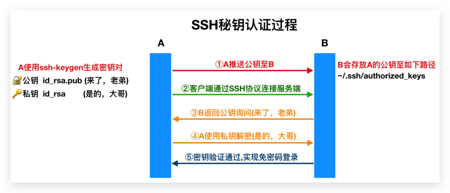
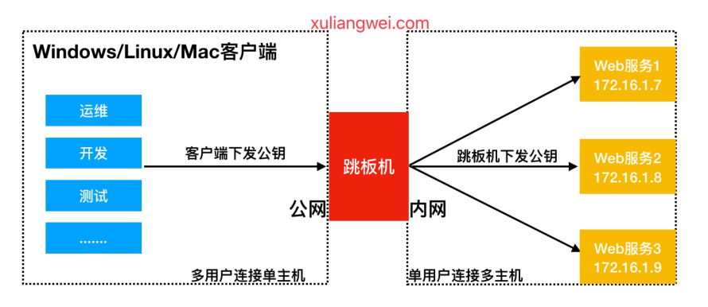
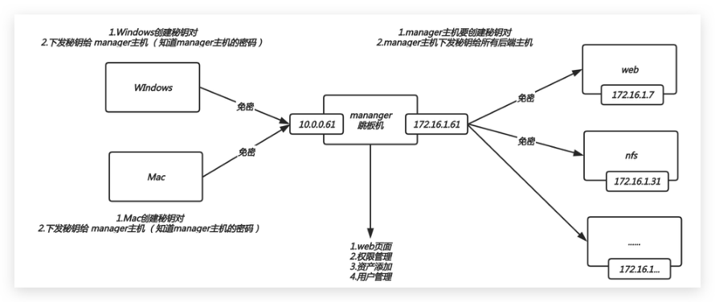

# 04 SSH远程管理服务实战

## 目录

- [1.SSH基本概述](#1.ssh基本概述)
  - [1.1 什么是SSH](#1.1-什么是ssh)
  - [1.3 SSH与Telnet区别](#1.3-ssh与telnet区别)
  - [1.4 抓包分析SSH与Telnet](#1.4-抓包分析ssh与telnet)
- [2.SSH客户端命令](#2.ssh客户端命令)
  - [2.1 ssh远程登陆](#2.1-ssh远程登陆)
  - [2.2 scp远程拷贝](#2.2-scp远程拷贝)
- [3.SSH远程验证方式](#3.ssh远程验证方式)
  - [3.1 基于密码验证](#3.1-基于密码验证)
  - [3.2 基于秘钥验证](#3.2-基于秘钥验证)
    - [3.2.1 创建密钥](#3.2.1-创建密钥)
    - [3.2.2 推送公钥](#3.2.2-推送公钥)
    - [3.2.3 测试连接](#3.2.3-测试连接)
- [4.SSH实现跳板机](#4.ssh实现跳板机)
  - [4.1 Windows下发密钥](#4.1-windows下发密钥)
  - [4.2 Linux下发密钥](#4.2-linux下发密钥)
  - [4.3 Teleport](#4.3-teleport)
- [5.SSH基础优化](#5.ssh基础优化)

## 1.SSH基本概述

### 1.1 什么是SSH

SSH 是一个安全协议，在进行数据传输时，会对数据

包进行加密处理，加密后在进行数据传输。确保了数

据传输安全。

SSH主要提供了什么功能

## 1.提供远程连接服务器（ssh、telnet）；

## 2.提供远程传输数据加密；

### 1.3 SSH与Telnet区别

服务连接

服务数据

服务监听

端口 服务登陆用户

方式

传输

ssh 加密 22/tcp 默认支持root用

户登陆

telnet 明文 23/tcp 不支持root用户

登陆

### 1.4 抓包分析SSH与Telnet

## 1.安装telnet-server服务并运行

## 2.创建普通用户oldxu，然后设定密码

## 3.使用wireshark监控ssh协议，然后跟踪tcp数据

流（验证是否传输为密文）

## 4.使用wireshark监控telnet协议，然后跟踪tcp数

据流（验证是否传输为明文）

## 2.SSH客户端命令

SSH有客户端与服务端，我们将这种模式称为C/S架

构，ssh客户端中包含：

ssh|slogin远程登陆、

scp远程拷贝、

sftp文件传输、

ssh-copy-id秘钥分发程序

### 2.1 ssh远程登陆

ssh远程登录服务器命令示例

-p 指定连接远程主机端口，默认22端口可省略

"@" 前面为连接的用户名；

"@" 后面为连接的服务器IP；

```
xudeMacBook-Pro:~ xuliangwei$ ssh -p22
root@10.0.0.61
```

### 2.2 scp远程拷贝

scp复制数据至远程主机命令(全量复制)

-P 指定端口，默认22端口可不写

-r 表示递归拷贝目录

-p 表示在拷贝文件前后保持文件或目录属性不变

-l 限制传输使用带宽(默认kb/8=MB)

#推

```
[root@m01 ~]# scp -P22 -rp /tmp/oldxu
root@10.0.0.61:/tmp
```

#拉

```
[root@m01 ~]# scp -P22 -rp
root@10.0.0.61:/tmp/oldxu /opt/
```

#限速下载速度为1MB

```
[root@m01 ~]# scp -rp -l 8096  /opt/1.txt
root@172.16.1.31:/tmp
```

注意：

## 1.scp通过ssh协议加密方式进行文件或目录拷贝。

## 2.scp连接时的用户作为为拷贝文件或目录的权

限。

## 3.scp支持数据推送和拉取，每次都是全量拷贝，

效率较低。

## 3.SSH远程验证方式

### 3.1 基于密码验证

知道服务器的IP端口，账号密码，即可通过ssh客户端

命令登陆远程主机。

密码太简单容易破解；

密码太复杂容易忘记；

```
xudeMacBook-Pro:~ xuliangwei$ ssh -p22
root@10.0.0.61
root@10.0.0.61 password:
[root@m01 ~]#
```

### 3.2 基于秘钥验证

为了降低密码泄露的机率和提高登陆的方便性，建议

使用密钥验证方式。



#### 3.2.1 创建密钥

在A上生成非对称密钥，使用-t指定密钥类型, 使用-C指

定用户邮箱

```
[root@m01 ~]# ssh-keygen -t rsa -C
xuliangwei@qq.com
...
```

#默认一路回车即可

```
...
```

#无需回车，自动应答方式生成秘钥(扩展方式)

```
[root@m01 ~]# ssh-keygen -t rsa -C
xuliangwei@qq.com -f ~/.ssh/id_rsa -P ""
```

#### 3.2.2 推送公钥

将A上的公钥推送至B

```
命令示例：ssh-copy-id [-i [identity_file]]
[user@]machine
```

ssh-copy-id：命令

-i：指定下发公钥的路径

[user@]：以什么用户身份进行公钥分发

（root）,如果不输入，表示以当前系统用户身份

分发公钥

*machine：下发公钥至那台服务器, 填写远程主机

IP地址

#交互式推送秘钥，[将A的公钥写入B的

```
~/.ssh/authorized_keys文件中]
[root@m01 ~]# ssh-copy-id -i
~/.ssh/id_rsa.pub root@172.16.1.41
```

#非交互式秘钥推送

```
[root@m01 ~]# yum install sshpass -y
[root@m01 ~]# sshpass -p123 ssh-copy-id -i
~/.ssh/id_rsa.pub -o
StrictHostKeyChecking=no  root@172.16.1.7
[root@m01 ~]# ssh -o
'StrictHostKeyChecking=no'
'root@172.16.1.7'
```

#### 3.2.3 测试连接

## 3.A通过ssh命令连接B，如果能直接连接无需密码则表示

秘钥已配置成功

#远程登录对端主机方式

```
[root@m01 ~]# ssh root@172.16.1.41
[root@nfs ~]#
```

#不登陆远程主机bash，但可在对端主机执行命令

```
[root@m01 ~]# ssh root@172.16.1.41 -c
"hostname -i"
172.16.1.41
```

## 4.SSH实现跳板机

用户通过Windows/MAC/Linux客户端连接跳板机免

密码登录，跳板机连接后端无外网的Linux主机实现

免密登录，架构图如下。

实践多用户登陆一台服务器无密码

实践单用户登陆多台服务器免密码



### 4.1 Windows下发密钥

## 1.Xshell-->选择工具->新建密钥生成工具，生成公钥

对，选择下一步

## 2.填写秘钥名称。秘钥增加密码则不建议配置，继续

即可

## 3.生成秘钥后，点击Xshell->工具->用户秘钥管理者-

>选择对应秘钥的属性

## 4.选择对应秘钥的公钥，将其复制至跳板机

```
~/.ssh/authorized_keys中，然后测试
```

### 4.2 Linux下发密钥

## 1) 在跳板机上生成秘钥对

```
[root@m01 ~]# ssh-keygen -t rsa -C
Managr@qq.com
```

## 2) 拷贝跳板机上的密钥至后端主机，如果SSH不是使用

默认22端口, 使用-p指定对应端口

```
[root@m01 ~]# ssh-copy-id  -i
/root/.ssh/id_rsa.pub "-p22
root@172.16.1.31"
[root@m01 ~]# ssh-copy-id  -i
/root/.ssh/id_rsa.pub "-p22
root@172.16.1.41"
```

## 3) 在m01管理机上测试是否成功登陆两台服务器

```
[root@m01 ~]# ssh root@172.16.1.41
[root@nfs01 ~]# exit
[root@m01 ~]# ssh root@172.16.1.31
[root@backup ~]# exit
```

### 4.3 Teleport

此前的ssh免密虽然可以实现跳板，但是他有很多的

缺陷：

## 1.无法知道有多少后端主机可以免密连接

## 2.没有审计功能（无法知道用户登陆上来操作了什

么）

## 3.没有很好的权限管理机制（无法为不同的用户分

配不同的主机）

所以：我们可以使用 teleport web界面管理的跳板

机来解决ssh的不足。

在使用teleport之前，我们需要完成此前免密的环

境，因为teleport是基于此前免密的的环境基础之上

实现，只不过新增了权限管理、主机管理、用户管理

等功能。



## 1.先将跳板机与对应的资产进行免密登录；

## 2.点击资产管理：

### 2.1）添加两台资产；

### 2.1）为资产添加远程账户；

### 2.3）远程账户为root 私钥是跳板机root的私钥；

## 3.点击用户管理

### 3.1）创建用户

### 3.2）登录用户

## 4.点击运维（权限管理）

### 4.1）运维授权；

### 4.2）创建授权名称；

### 4.3）选择用户，为用户分配资产；

## 5.点击运维

### 5.1）主机运维；

### 5.2）选择主机的ssh；

### 5.3）将ssh修改为xshell需要安装客户端助手才可

以；

## 5.SSH基础优化

SSH作为远程连接服务，通常我们需要考虑到该服务

的安全，所以需要对该服务进行安全方面的配置。

## 1.更改远程连接登陆的端口（对外的服务器一定要

修改）；

## 2.禁止ROOT管理员直接登录（）；

## 3.密码认证方式改为密钥认证；

## 4.重要服务不使用公网IP地址(Redis\MySQL....)；

## 1.不安全；

## 2.成本浪费100台（1000*100=10w）；

## 5.使用防火墙限制来源IP地址；

SSH服务登录防护需进行如下配置调整，先对如下参

数进行了解

```
Port 6666                       # 变更SSH服务
```

远程连接端口

```
PermitRootLogin         no      # 禁止root用
```

户直接远程登录

```
PasswordAuthentication  no      # 禁止使用密
```

码直接远程登录

```
UseDNS                  no      # 禁止ssh进行
```

dns反向解析，影响ssh连接效率参数

```
GSSAPIAuthentication    no      # 禁止GSS认
```

证，减少连接时产生的延迟

将如下具体配置添加至/etc/ssh/sshd_config文件中，参

数需根据实际情况进行调整

```
###SSH###
#Port 6666
#PasswordAuthentication no
#PermitRootLogin no
GSSAPIAuthentication no
UseDNS no
###END###
```
