# 01.Nginx基础Http协议

## 目录

- [1.Http协议介绍](#1.http协议介绍)
  - [1.1 什么是URL](#1.1-什么是url)
  - [1.2 什么是HTML](#1.2-什么是html)
  - [1.3 什么是HTTP](#1.3-什么是http)
  - [1.4 URL、HTML、HTTP之间关系](#1.4-urlhtmlhttp之间关系)
- [2.Http工作原理](#2.http工作原理)
  - [2.1 图解HTTP工作原理](#2.1-图解http工作原理)
  - [2.2 抓包分析HTTP原理](#2.2-抓包分析http原理)
    - [DNS](#dns)
    - [TCP](#tcp)
    - [HTTP](#http)
  - [2.3 HTTP工作原理总结](#2.3-http工作原理总结)
- [3.Http请求Request](#3.http请求request)
  - [3.1 请求Method](#3.1-请求method)
- [99](#99)
  - [3.2 请求Header](#3.2-请求header)
  - [3.3 请求Connection](#3.3-请求connection)
- [4.Http响应Response](#4.http响应response)
  - [4.1 响应Header](#4.1-响应header)
  - [4.2 响应Status](#4.2-响应status)
  - [4.3 响应Code](#4.3-响应code)
- [5.Http相关术语](#5.http相关术语)
  - [5.1 什么是PV](#5.1-什么是pv)
  - [5.2 什么是UV](#5.2-什么是uv)
- [2。](#2)
  - [5.3 什么是IP](#5.3-什么是ip)
  - [5.4 什么是并发](#5.4-什么是并发)
- [500时，一天能达到多少PV？ 500 * 6 * 60 * 24 =](#500时一天能达到多少pv-500--6--60--24-)
  - [5.5 扩展延伸](#5.5-扩展延伸)
- [1.请计算如下题的 IP、PV、UV、并发](#1.请计算如下题的-ippvuv并发)
- [2.面试题：上家公司的IP、PV，UV是多少？（运营）](#2.面试题上家公司的ippvuv是多少运营)
- [3.面试题: 上家公司的IP、PV、UV是如何统计的？](#3.面试题-上家公司的ippvuv是如何统计的)

目录

- [1.Http协议介绍](#1.http协议介绍)
  - [1.1 什么是URL](#1.1-什么是url)
  - [1.2 什么是HTML](#1.2-什么是html)
  - [1.3 什么是HTTP](#1.3-什么是http)
  - [1.4 URL、HTML、HTTP之间关系](#1.4-urlhtmlhttp之间关系)
- [2.Http工作原理](#2.http工作原理)
  - [2.1 图解HTTP工作原理](#2.1-图解http工作原理)
  - [2.2 抓包分析HTTP原理](#2.2-抓包分析http原理)
    - [DNS](#dns)
    - [TCP](#tcp)
    - [HTTP](#http)
  - [2.3 HTTP工作原理总结](#2.3-http工作原理总结)
- [3.Http请求Request](#3.http请求request)
  - [3.1 请求Method](#3.1-请求method)
  - [3.2 请求Header](#3.2-请求header)
  - [3.3 请求Connection](#3.3-请求connection)
- [4.Http响应Response](#4.http响应response)
  - [4.1 响应Header](#4.1-响应header)
  - [4.2 响应Status](#4.2-响应status)
  - [4.3 响应Code](#4.3-响应code)
- [5.Http相关术语](#5.http相关术语)
  - [5.1 什么是PV](#5.1-什么是pv)
  - [5.2 什么是UV](#5.2-什么是uv)
  - [5.3 什么是IP](#5.3-什么是ip)
  - [5.4 什么是并发](#5.4-什么是并发)
  - [5.5 扩展延伸](#5.5-扩展延伸)

## 1.Http协议介绍

### 1.1 什么是URL

通常我们在访问一个网站页面时，请求到的内容通称

为"资源"。而”资源“这一概念非常宽泛，它可以是一份文

档，一张图片，或所有其他你能够想到的格式。每个资

源都由一个 URI 来进行标识；

```
比如: http://fj.xuliangwei.com/public/tt.jpeg
```

这样的资源，我们会将该其称为URL地址；

百度百科解释：URL简称统一资源定位符，用来唯一地

标识万维网中的某一个资源。URL由协议、主机名称、

端口以及文件名几部分构成。深入理解 URL 的组成部分

### 1.2 什么是HTML

Html简称Web Page，一个完整的Html页面可能会包含

很多个URL的资源。(反之: 我们也可以理解一个HTML文

件是由多个不同的URL资源拼接而成的。)

### 1.3 什么是HTTP

```
HTTP  (Hyper Text Transfer Protocol) 中文名为
```

超文本传输协议。

是一种能够获取如 HTML 这样网络资源的通讯协议。它

是在 Web 上进行数据交换的基础。HTTP的概述参考URL

简单理解：HTTP协议就是将用户请求的HTML页面从一

台Web服务器传输到客户端浏览器的一种协议。

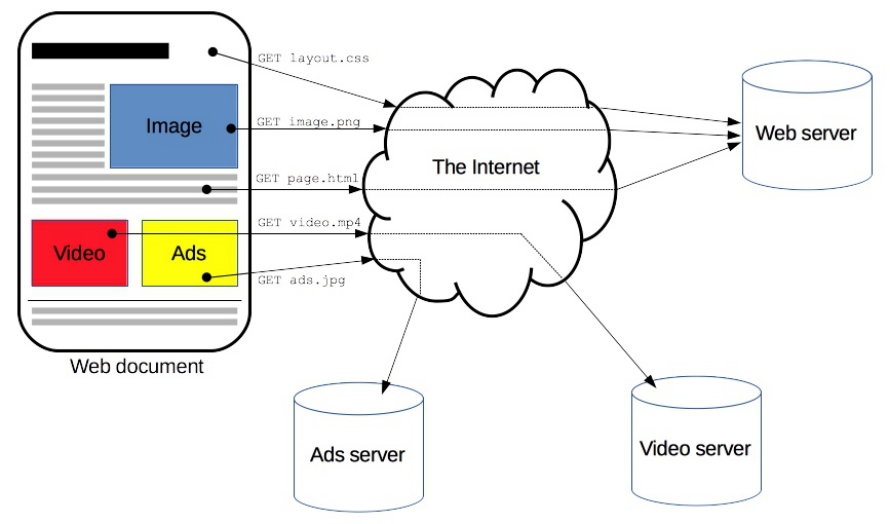

### 1.4 URL、HTML、HTTP之间关系

一个完整的 HTML 页面是由多个不同的 Url 资源组成

的；而 HTTP 协议主要是用来传输这种 HTML 页面

的；

## 2.Http工作原理

### 2.1 图解HTTP工作原理

我们详细的了解下HTTP的工作原理，我们到底是如何获

取到服务器上的页面。

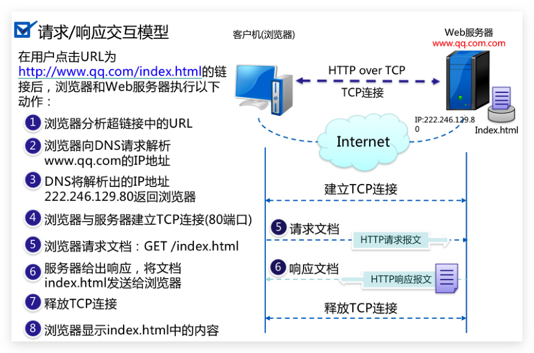

### 2.2 抓包分析HTTP原理

第一步：浏览器分析超链接中的URL

#### DNS

第二步：DNS请求：

PC向DNS服务器10.64.0.100发出DNS QUERY请求，请

求fj.xuliangwei.com的A记录

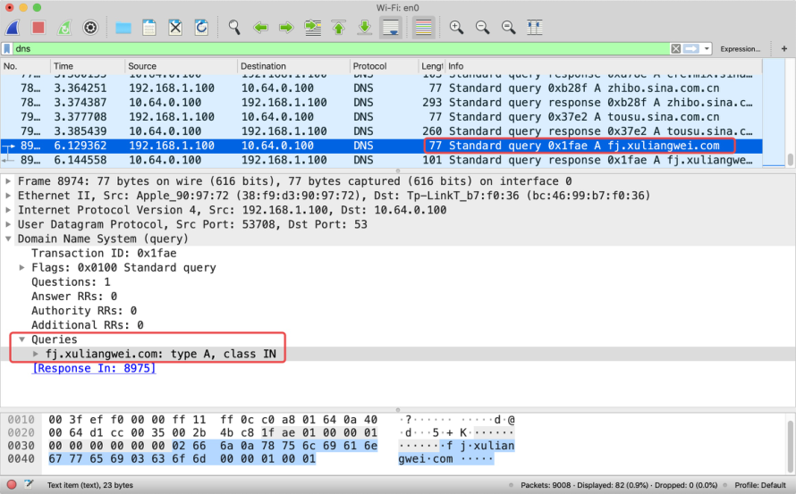

第三步：DNS回复

DNS服务器10.64.0.100回复DNS response,解析出

fj.xuliangwei.com域名对应的一条A记录39.104.16.126

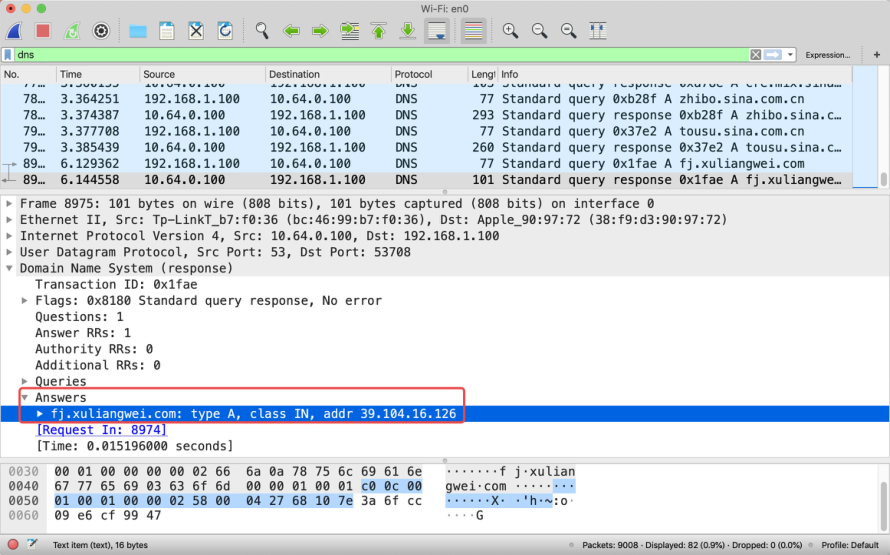

#### TCP

第四步：建立TCP连接

PC向DNS解析fj.xuliangwei.com地址发起tcp三次握手

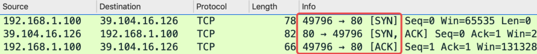

#### HTTP

第五步：Http请求

PC向 fj.xuliangwei.com 服务器发出GET请求，请求主页

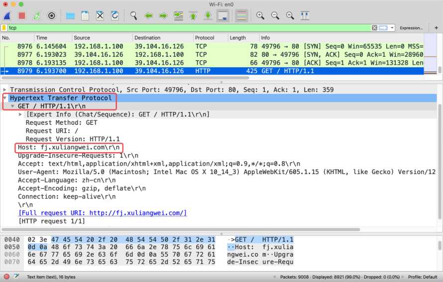

第六步：Http响应

fj.xuliangwei.com 服务器回应HTTP/1.1 200 OK，返回

主页数据包

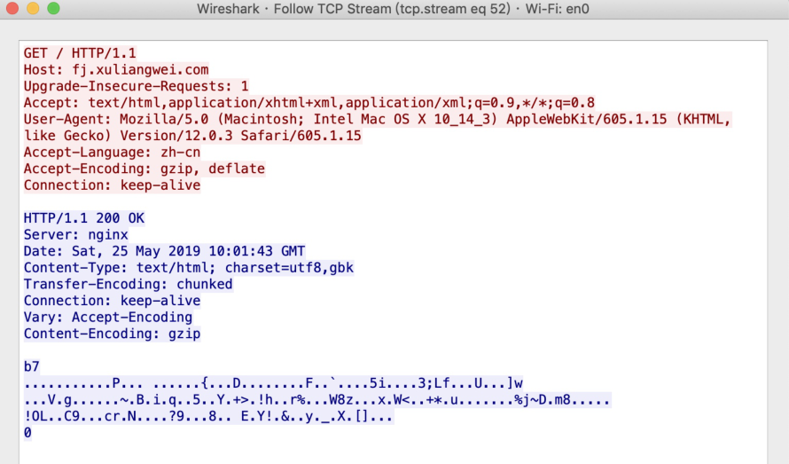

第七步：连接断开

完成数据交互过程，四次挥手断开连接

### 2.3 HTTP工作原理总结

整个用户访问网站过程就是 DNS-TCP-HTTP （面试必

须的协议）

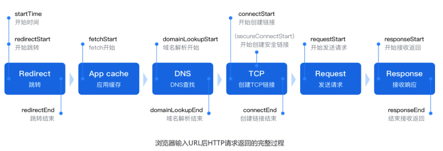

## 3.Http请求Request

HTTP 请求的一个例子：

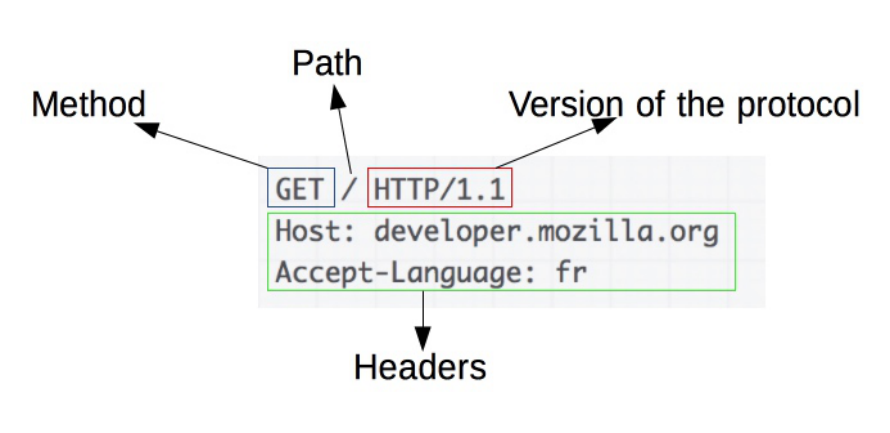

### 3.1 请求Method

客户端向服务端发送请求时，会根据不同的资源发送

不同的请求方法Method：

GET：用于获取URI对应的资源；（比如看朋友圈)

## 99

POST：用于提交请求，可以更新或者创建资源，

是非幂等的；（发布朋友圈）

PUT：用于向指定的URI传送更新资源，是幂等

的；（更新朋友圈）

DELETE：用于向指定的URI删除资源；（比如删朋

友圈）

HEAD：用于检查(仅获取Header部分的内容；)

一般创建对象时用POST，更新对象时用PUT；

PUT是幂等的，POST是非幂等的；

幂等：对于相同的输入，每次得到的结果都是相等

的；

### 3.2 请求Header

```
:authority: www.xuliangwei.com
:method: GET
:path: /
:scheme: https
Accept: text/html,
```

请求的类型

```
Accept-Encoding: gzip, deflate
```

是否进行压缩

```
Accept-Language: zh-CN,zh;q=0.9
```

请求的语言

```
Cache-Control: max-age=0
     # 缓存
Connection: keep-alive
     # TCP长连接
Host: www.oldboyedu.com
```

请求的域名

```
If-Modified-Since: Fri, 04 May 2018
08:13:44 GMT# 修改的时间
User-Agent: Mozilla/5.0
```

请求浏览器的工具

"=== 请求一个空行 ==="

"=== 请求内容主体 ==="

### 3.3 请求Connection

Http请求中的长连接与短连接是什么：

http1.0 协议使用的是短连接：建立一次tcp的连

接，发起一次http的请求，结束，tcp断开。

http1.1 协议使用的是长连接：建立一次tcp的连

接，发起多次http的请求，结束，tcp断开。

HTTP协议版本参考URL、HTTP1.1与HTTP2.0速度

对比

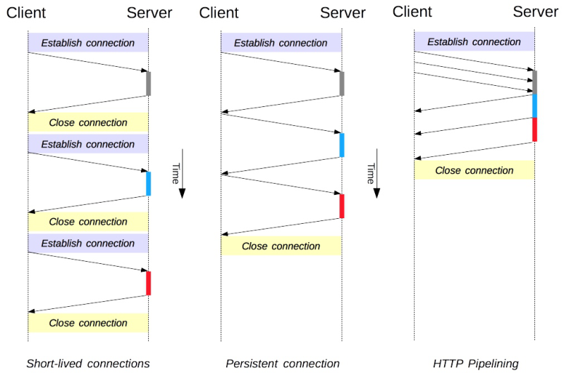

## 4.Http响应Response

HTTP 响应的一个例子：

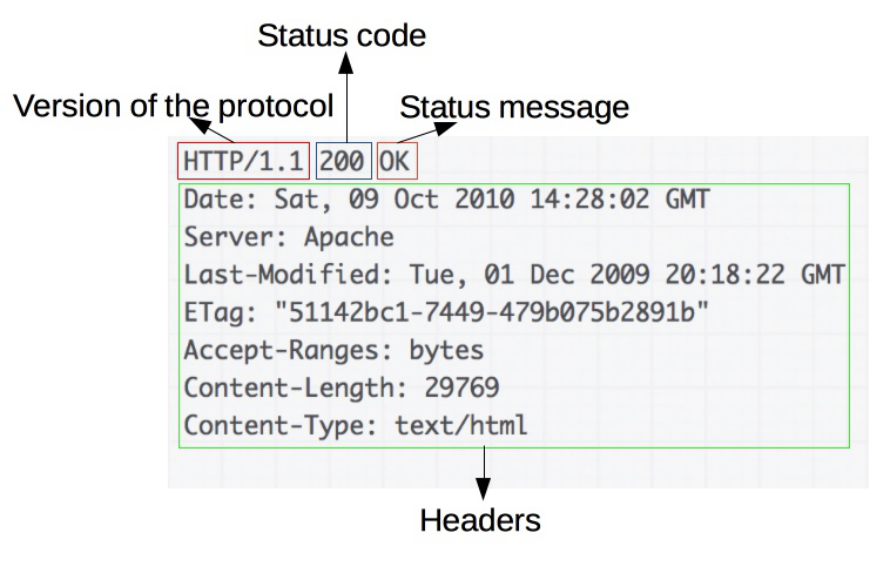

### 4.1 响应Header

#3.服务端响应的头部信息

```
HTTP/1.1 200 OK
```

返回服务器的http协议，状态码

```
Date: Fri, 14 Sep 2018 09:14:28 GMT
```

返回服务器的时间

```
Server: Apache/2.4.6
```

返回服务器使用的软件Apache

```
Connection: Keep-Alive
     # TCP长连接
Keep-Alive: timeout=5, max=100
```

长连接的超时时间

"=== 返回一个空行 ==="

"=== 返回内容主体 ==="

### 4.2 响应Status

http 响应状态码 Status-Code 以3位数字组成，用来

标识该请求是否成功，比如是正常还是错误等，

HTTP/1.1 中状态码可以分为五大类。

状态

码 说明 1xx 信息，服务器收到请求，需要请求者继续执

行操作

2xx 成功，操作被成功接收并处理 3xx 重定向，需要进一步的操作以完成请求 4xx 客户端错误，请求包含语法错误或无法完成

请求

5xx 服务器错误，服务器在处理请求的过程中发

生了错误

### 4.3 响应Code

以下是常见状态码

状

态

说明

码

200 表示成功客户端成功接收到了服务端返回的数

据，这是最常见的状态码

客户端发完请求后，服务端只是返回了部分数

据，就会出现该状态码，例如当下载一个很大

#

的文件时，在没有下载完成前就会出现该状态

码

301 永久重定向(redirect) http-->https 302 临时重定向(redirect) 400 客户端请求语法错误，服务端无法理解 401 服务端开启了用户认证，而客户端没有提供正

确的验证信息

服务端不允许客户端访问，或者没有找到默认

返回页面(默认所有的web服务器返回的页面都

#

是index.html、也可以调整默认返回页面

app.html)

404 客户端请求的资源不存在 （路径写错了；服务

端真的没有；）

413 客户端向服务端上传一个比较大的文件，并且

文件大小超过了服务端的限制 1MB；

状

态

说明

码

服务端出现了内部错误，需要进行人为排查故

#

障 （链接数据库类服务异常，会出现500错

误）

502 服务器充当代理角色时，后端被代理的服务器

不可用或者没有正常回应

503 服务当前不可用，由于超载或系统维护，服务

器暂时的无法处理客户端请求

504 服务器充当代理角色时，后端的服务端没有按

时返回数据，超时了

## 5.Http相关术语

### 5.1 什么是PV

PV即页面浏览量：比如用户访问一个网站算1个pv，刷

新一次页面则累计pv+1，如果多次打开或刷新同一页面

则浏览量累计。假设我们对一个网站的A页面和B页面分

别刷新了10次，请问该用户总共产生了多少PV？

### 5.2 什么是UV

UV即独立访客，访问网站的一台电脑客户端为一个访

客。可以理解成访问某网站的电脑的数量。比如电脑、

手机算2个UV，无论访问多少次网站，最终UV数量就是

## 2。

### 5.3 什么是IP

IP即独立公网IP数，是指1天内多少个独立的IP浏览了页

面，比如你在家通过拨号上网访问某个网站，此时网站

会记录你的公网IP地址。那如果你在公司和很多同事同

时访问一个网站，那该网站会记录多少个公网IP呢? （看

公司有多少个出口公网地址）

### 5.4 什么是并发

并发：指的是同时，我们可以理解为一段时间内(比如10

秒)，网站支持同时访问的人数，假设10s并发值如果为

## 500时，一天能达到多少PV？ 500 * 6 * 60 * 24 =

```
4320000
```

### 5.5 扩展延伸

## 1.请计算如下题的 IP、PV、UV、并发

假设公司有一座大厦，大厦有100人，每个人有一台电

脑和一部手机，上网都是通过NAT转换，每个人刷新网

站10次，请问对应的 pv，uv，ip，并发分别是多少。

PV：页面浏览量 100人 * 2设备 * 10次刷新 = 2000pv

UV：独立的客户 100人 * 2设备 = 200UV

IP：独立公网IP 100人--> NAT = 1个独立IP

并发：单位时间内100人同时请求网站，100

## 2.面试题：上家公司的IP、PV，UV是多少？（运营）

小说网站 1分钟并发 5000*60*24=720w (屌丝、通常一

看一天)

教育网站 1分钟并发 10000*60*24=1440w (努力青年、

通常周末量大)

金融网站 1分钟并发 500*1440= 72w (有钱人、所以量

不大、但交易额度高)

电商网站 1分钟并发

游戏网站 ------在线用户、日活跃数、月活跃数

需要注意的是: 这仅仅是参考值，因为不同的业务他们的

pv都不一样。

## 3.面试题: 上家公司的IP、PV、UV是如何统计的？

方式一：使用awk提取IP，sort排序、uniq统计去重

统计IP

方式二：第三方统计工具进行pv统计，比如：piwik、

腾讯分析、百度统计、开发自研统计平台。

游戏日活、月活

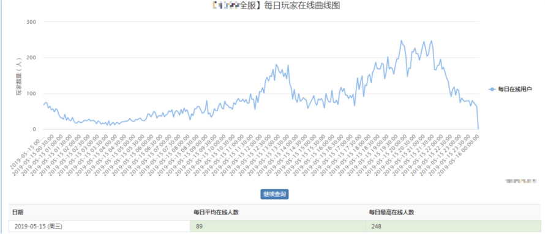

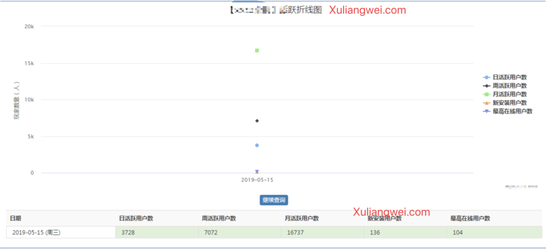
