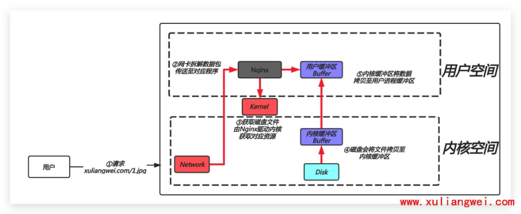
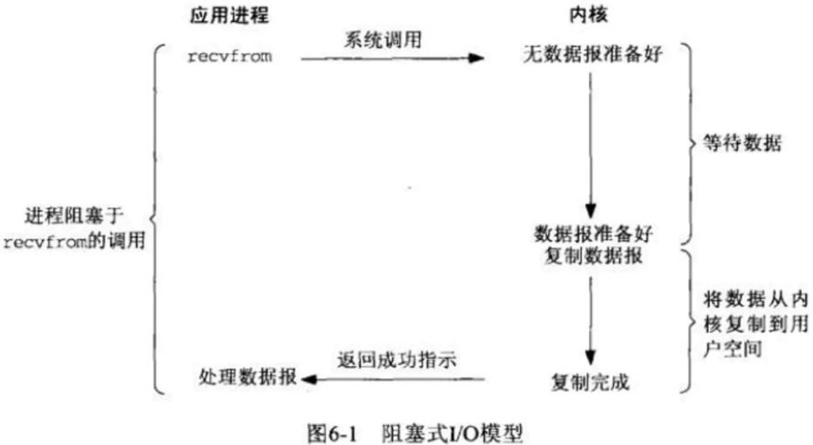
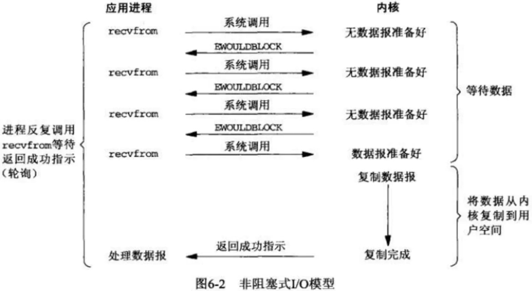
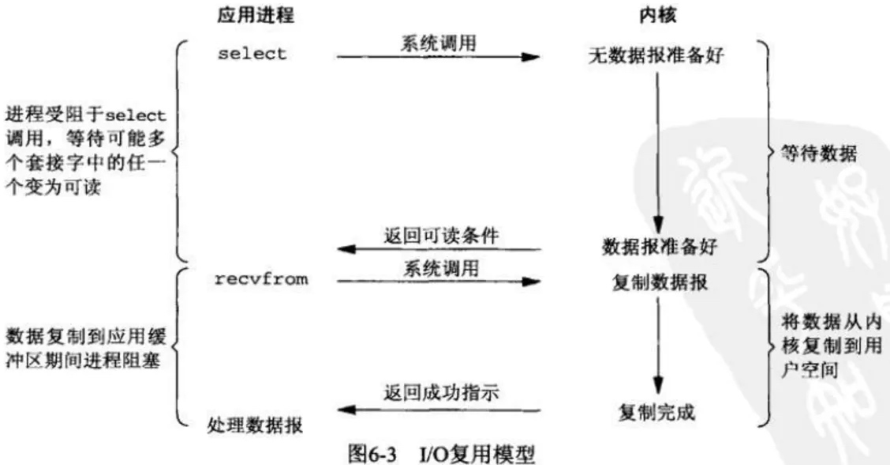
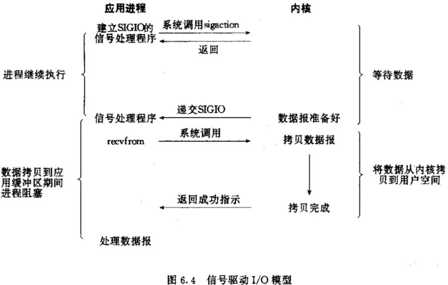
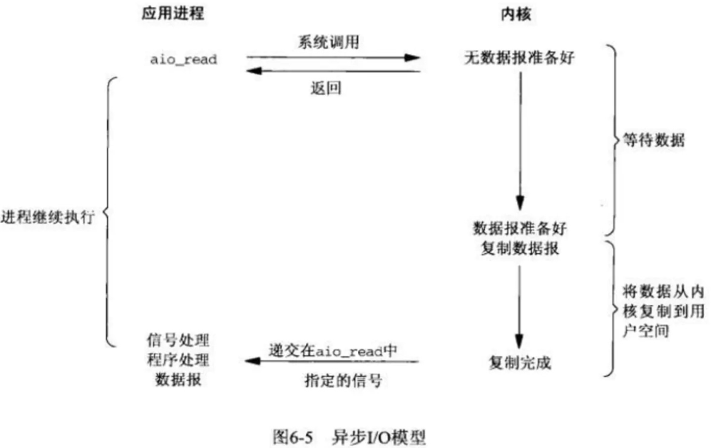
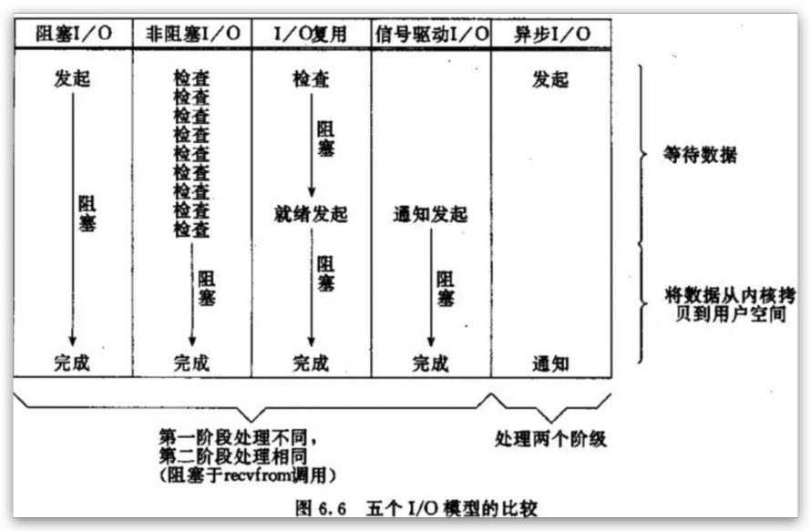
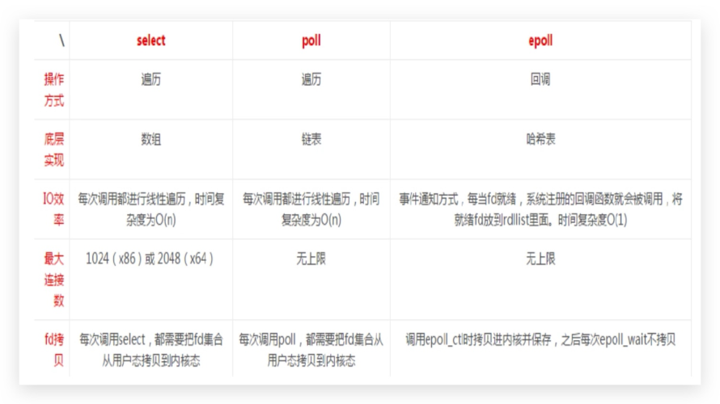

# 06 Nginx基础网络IO模型

## 目录

- [1.IO基本概述](#1.io基本概述)
  - [1.1 什么是IO](#1.1-什么是io)
  - [1.2 什么是网络IO](#1.2-什么是网络io)
- [2.IO网络模型](#2.io网络模型)
  - [2.1 同步/异步](#2.1-同步异步)
  - [2.2 阻塞/非阻塞](#2.2-阻塞非阻塞)
  - [2.3 IO组合模型](#2.3-io组合模型)
- [3.五种常见IO模型](#3.五种常见io模型)
  - [3.1同步阻塞IO](#3.1同步阻塞io)
  - [3.2 同步非阻塞IO](#3.2-同步非阻塞io)
  - [3.3 IO多路复用](#3.3-io多路复用)
  - [3.4 信号驱动IO](#3.4-信号驱动io)
  - [3.5 异步非阻塞IO](#3.5-异步非阻塞io)
  - [3.6 IO模型对比](#3.6-io模型对比)
- [4.IO模型实现](#4.io模型实现)
  - [4.1 几种网络IO模型实现](#4.1-几种网络io模型实现)
  - [4.2 select、poll、epool区别](#4.2-selectpollepool区别)

## 1.IO基本概述

### 1.1 什么是IO

所谓 IO，无非就是输入输出，其实大家更多关注的是

磁盘IO，事实上当我们在网络中传送一些数据时，他

本质上也是一种 IO。

### 1.2 什么是网络IO

拿用户请求 Nginx 这样的 web 服务器获取磁盘中的

文件时，系统是如何处理的？

通过上面的例子，用户每一次请求都会发生一次IO操

作：而每次IO,都要经由两个阶段：

第一步：将数据从磁盘加载至内核的内存空间（缓

存区），等待数据准备完成，时间较长。

第二步：将数据从内核缓冲区复制到用户空间的进

程内存（缓存区），时间较短。

第三步：Nginx封装数据为响应报文发送。

## 1.nginx下发指令给内核后，nginx是等待，还是不等

待继续处理新的请求；

## 2.数据拷贝到内核缓存中了，通知nginx应用程序，阻

塞；

## 2.IO网络模型

IO模型分为、同步、异步、阻塞、非阻塞

### 2.1 同步/异步

同步/异步（ 关注的是消息通知机制 ） leader（等

待）-->小弟-->任务-->漫长

同步：调用者发指令给被调用者，被调用者需要获取

资源后在返回给调用者，那么此时调用者需要等待被

调用者返回消息，也就意味着调用者啥也干不了。

（举例：当我们将衣服扔进洗衣服，那么衣服洗完没

洗完也不知道，那就需要过一段时间去看一下，对于

调用者来说很繁忙。）

异步：调用者发指令给被调用者，被调用者需要获取

资源后在返回给调用者，此时”被调用者“会主动将当

前的运行状态通知给调用者。（举例：当我们将衣服

扔进洗衣机，当洗衣机完成洗衣服之前我们可以做点

别的事情，等洗完后洗衣机会通知，此时我在去晾衣

服。）

### 2.2 阻塞/非阻塞

阻塞/非阻塞（ 关注的是“调用者”在等待”被调用者“返

回结果之前所处的状态 ）

阻塞：指 IO 操作需要彻底完成后才返回到用户空

间，调用结果返回之前 ，调用者被挂起。（举例：将

衣服仍给洗衣机，然后人一直在旁边等着，什么时候

洗完什么时候执行下一步动作。）

非阻塞：指 IO 操作被调用后立即返回给用户进程一

个状态值，无需等待 IO 操作彻底完成，在最终的调

用结果返回之前，调用者不会被挂起。（举例：将衣

服仍给洗衣机，然后可以去干其他的事情，等洗完

后，在去处理。）

### 2.3 IO组合模型

同步阻塞：将衣服仍到洗衣机，然后守在洗衣机旁

边，等待他什么时候洗完什么时候处理。

同步非阻塞：将衣服仍到洗衣机，然后可以去干别的

事情，那是否洗完不知道，就需要时不时看一下。

异步阻塞：将衣服仍给洗衣机，还是会在旁边等着(阻

塞)，洗衣机洗完了会通知。

异步非阻塞：将衣服仍给洗衣机，可以去干其他事

情，等待洗衣机洗完了会通知，然后在去取衣服。

## 3.五种常见IO模型

### 3.1同步阻塞IO

## 1.当用户进程调用了recvfrom()这个系统调用，希望从

磁盘获取数据。

## 2.kernel就开始了IO的第一个阶段，准备数据，如果数

据需要很长时间 ，那么就需要一直等待。

## 3.当kernel数据准备好了，会将数据从kernel中拷贝

到用户进程内存，然后kernel返回数据结果，用户进程

才解除阻塞状态，可以做其他事情。

总结，同步阻塞IO的特点就是在IO执行的两个阶段都被

阻塞了。那么也就意味着一个进程只能响应一个用户请

求，剩下请求会被挂起，会造成每次只能响应一个请

求。

举例：我和女友点在饭店完餐后，不知道什么时候能做

好，只好坐在餐厅里面等，直到做好，然后吃完才离

开。女友本来还想和我一起逛街，但是不知道饭能什么

时候做好，只好和我一起在餐厅等，而不能去逛街，直

到吃完饭才能去逛街，中间等待做饭的时间浪费掉了。

这就是阻塞IO。

### 3.2 同步非阻塞IO

## 1.当用户进程调用了recvfrom()这个系统调用，希望从

磁盘获取数据。

## 2.那么是否完成并不知道，需要一次一次的去问。

## 3.当kernel中的数据准备好了，此时用户进程再次发起

系统调用，那么它马上将数据拷贝到了用户进程内存

所以，非阻塞IO的特点是用户进程需要不断的主动询问

kernel 数据好了没有。

好处：用户进程可以处理其他任务；

坏处：任务完成的响应延迟增大了，因为每过一段时间

才去轮询一次read操作；

举例：我女友不甘心傻等，又想去逛商场，又担心饭好

了。所以我们逛一会，回来询问服务员饭好了没有，来

来回回好多次，饭都还没吃都快累死了。这就是非阻

塞。需要不断的询问，是否准备好了。

### 3.3 IO多路复用

## 1.当用户进程发起调用请求，不用直接与内核交互，而

是找一个代理进程select，当用户进程调用select，

那么整个进程会阻塞在select上（因为是由select与

内核进行交互，需要等待select返回结果）

## 2.kernel会“监视”select负责的数据，当任何一个进程

的数据准备好了，select就会返回。

## 3.当 select 用户进程返回结果后，用户程序会再次进

行系统调用，将 kernel 数据拷贝到用户进程。

总结，select代理进程，它这一个进程可以接收多个用

户进程的请求。（类似于用户-->飞猪-->办理签证）

举例：与第二个方案差不多，餐厅安装了电子屏幕用来

显示点餐的状态，这样我和女友逛街一会，回来就不用

去询问服务员了，直接看电子屏幕就可以了。这样每个

人的餐是否好了，都直接看电子屏幕就可以了，这就是

IO多路复用。

### 3.4 信号驱动IO

## 1.当用户进程调用了 recvfrom() 这个系统调用，希望

从磁盘获取数据。

## 2.磁盘文件中的数据如果还没有读取到内核缓冲区时，

没关系，进程还可以继续运行并不阻塞。

## 3.当磁盘数据复制到内核中后，会通知用户进程数据准

备就绪。

## 4.用户进程在发指定将内核中数据复制到用户进程中，

此时进程会进入阻塞状态。

举例：我和女友通过手机点完餐后，系统会返回下单成

功。此时我和女友就可以出去逛街一会，直到手机通知

你的餐已经做好，我和女友在回来吃饭，但吃饭过程会

被阻塞。

通知机制：

水平触发：多次通知；

边缘触发：只通知一次；

### 3.5 异步非阻塞IO

## 1.当用户进程调用了recvfrom()这个系统调用，希望从

磁盘获取数据。

## 2.kernel收到后，会立刻返回，所以不会对用户进程产

生任何阻塞。

## 3.kernel等待数据准备完成，并将内核数据拷贝到用户

进程内存，当这一切都完成之后，kernel会给用户进程

发送一个回调函数通知用户进程本次IO完成。

举例：女友不想逛街，餐厅又太吵了，准备回家好好休

息一下。于是我们叫外卖，打个电话点餐，然后我和女

友在家好好休息一下，饭好了，外卖会送到家里来。这

就是异步非阻塞IO

### 3.6 IO模型对比

## 4.IO模型实现

### 4.1 几种网络IO模型实现

Select：对应，IO/复用模型，遍历，（1000 --

>O(500)）

Poll：对应，I/O复用模型

Epoll：对应，IO复用模型，具有信号驱动I/O模型某些

特性(O(1))

### 4.2 select、poll、epool区别

无论是 select、poll、epoll 都可以面对多个用户进程

的请求，它相当于一个代理人，收集很多用户进程的请

求，收集完成后，它帮你从磁盘上获取数据，复制到内

核中，那么这个数据准备没准备好，它的实现机制是不

一样的。

通知方式：假设有一个用户数据准备好了，那么还有很

多用户数据没准备好，那么如何通知呢？

## 1、select和poll是遍历扫描，效率低下。

## 2、epoll采用回调机制，epoll会主动通知，效率

会更高。

IO效率：假设100个用户发请求和1000个用户发请求，

在遍历的时候的性能一样吗？

## 1、select和 poll用户的请求越多，所需要遍历

的就越多，需要耗时就越长。

## 2、epool采用的是回调方式，无论有多少用户，它

发送的时间是一样的。

总结：

## 1、nginx从最初设计时，就是使用的 epoll IO 模

型，使用边缘触发机制。

## 2、同时 nginx 还支持异步IO，用了近几年最新的

服务端编程技术，来支持较好的并发。
